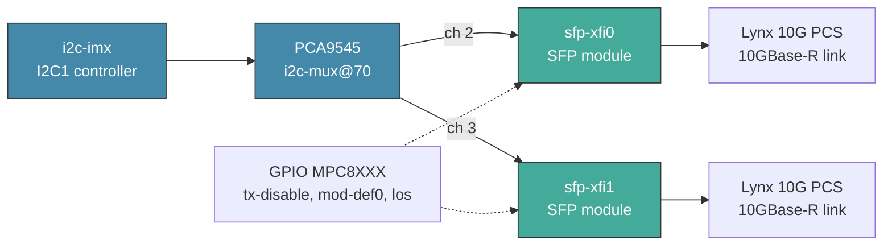
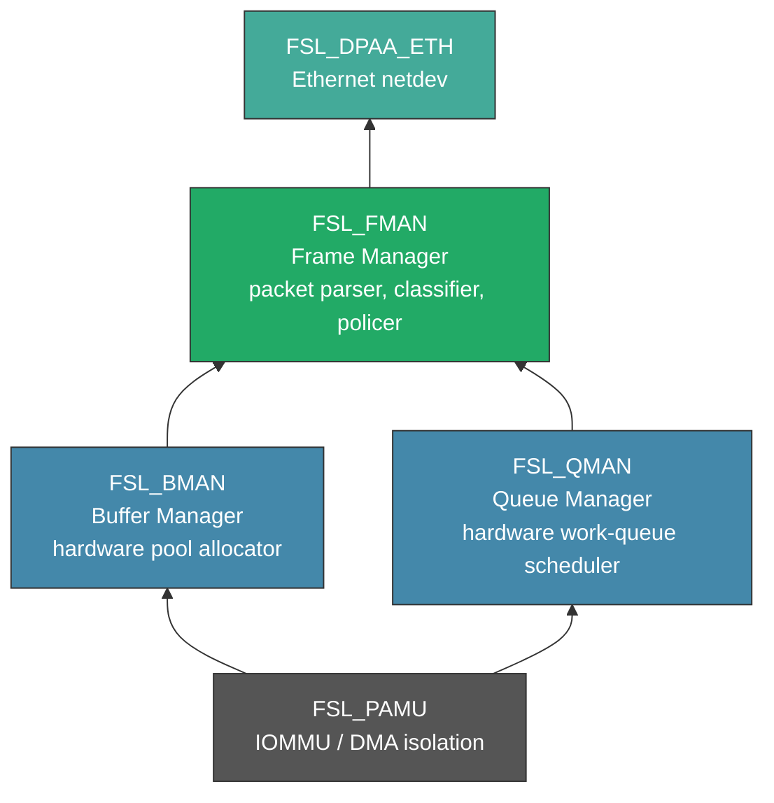
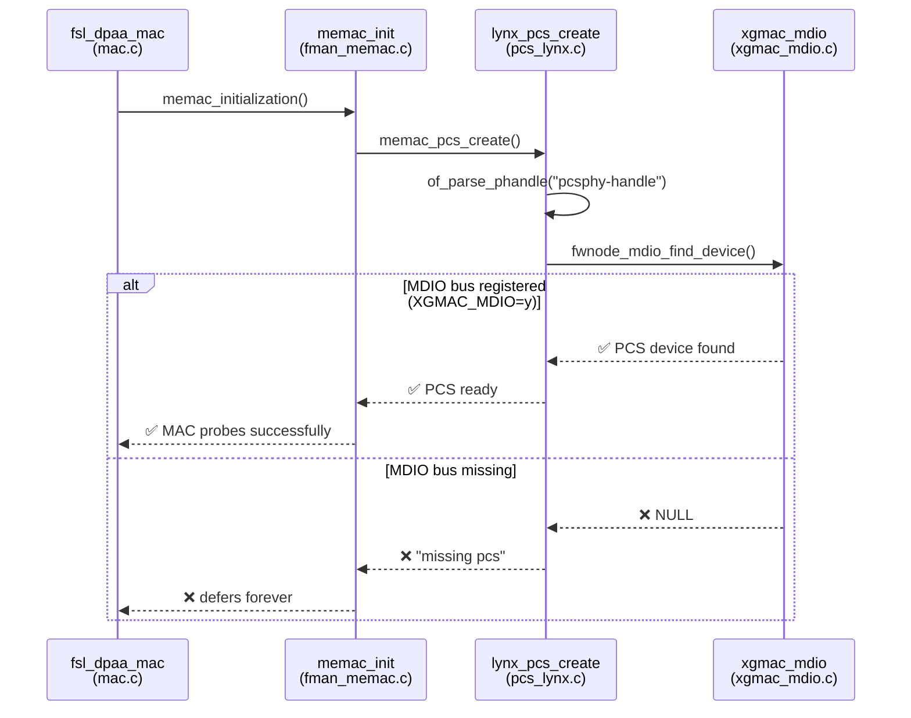
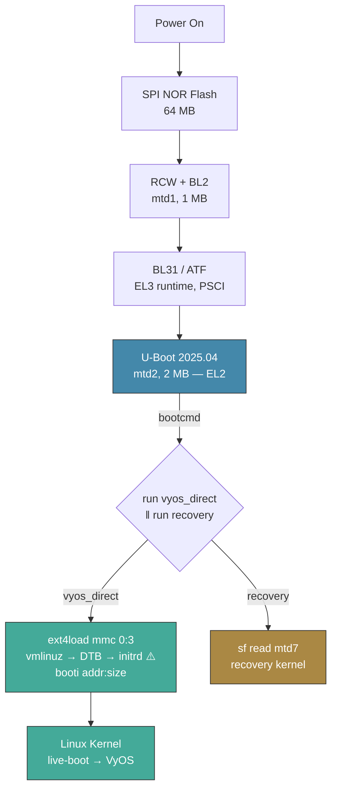
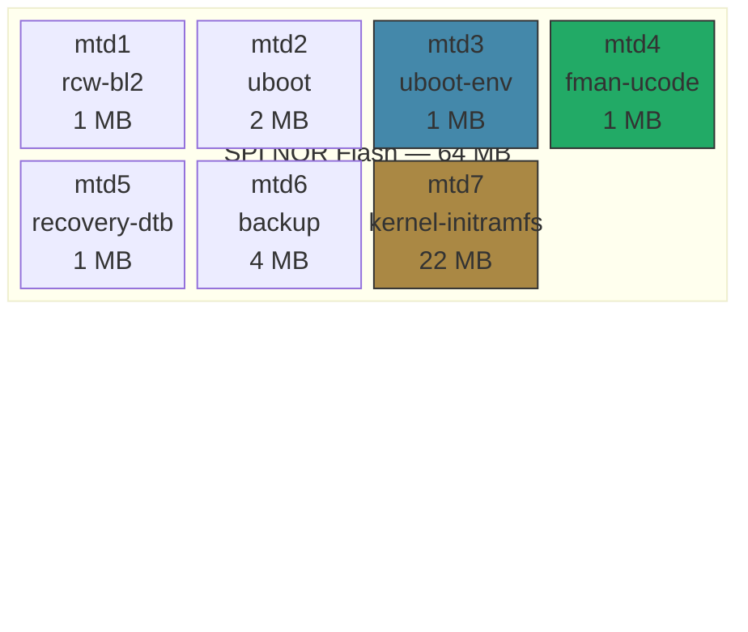
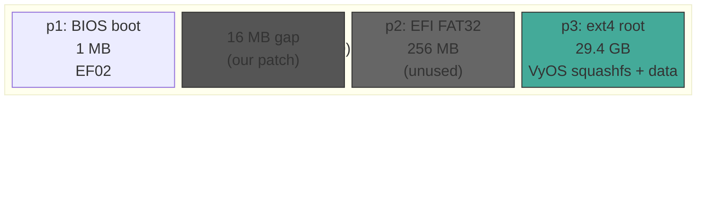
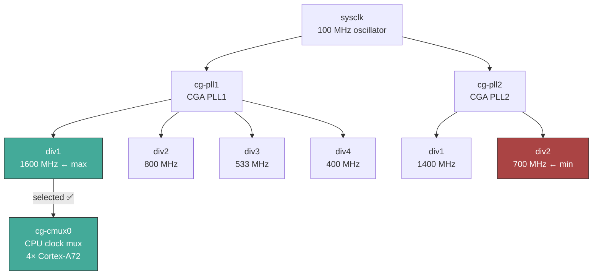

# Porting VyOS ARM64 to NXP LS1046A

Technical analysis of what breaks when you drop a generic VyOS ARM64 ISO onto NXP Layerscape silicon. And the exact fixes that survived.

> **Boot process specification** (U-Boot env variables, annotated USB and eMMC boot sequences, `vyos.env` mechanism, failure modes): **[BOOT-PROCESS.md](BOOT-PROCESS.md)**
> **Install guide** (write USB image, run `install image`, eMMC boot): **[INSTALL.md](INSTALL.md)**

## The Problem

"Generic ARM64" is a kernel configuration covering Raspberry Pi, AWS Graviton, Apple M-series guests, and Qualcomm server silicon: `make defconfig` plus whatever the maintainer cared about last Tuesday. It does not cover QorIQ Layerscape. Not because the drivers don't exist (they've been in mainline Linux since 4.14), but because nobody building VyOS for cloud VMs ever needed DPAA1 Ethernet or Freescale eSDHC. The config symbols sit in the kernel source, untouched.

Seven things kill the generic ARM64 ISO on this board. All seven are kernel configuration plus board-specific plumbing. Most fail silently.

### 1. No eMMC

The LS1046A eMMC controller is a Freescale eSDHC (`fsl,esdhc`). The generic ARM64 `vyos_defconfig` ships with:

```text
# CONFIG_MMC_SDHCI_OF_ESDHC is not set
```

No driver, no `mmcblk0`. U-Boot loads the kernel and initrd fine (it has its own eSDHC driver). The VyOS kernel boots from RAM, `live-boot` searches every block device for `filesystem.squashfs`, finds nothing, and panics. Quietly.

### 2. No Networking

The LS1046A uses NXP DPAA1 (Data Path Acceleration Architecture, first generation). Five physical Ethernet ports managed by the Frame Manager and DPAA Ethernet glue. Generic VyOS ARM64 kernel:

```text
# CONFIG_FSL_FMAN is not set
# CONFIG_FSL_DPAA is not set
```

Zero interfaces. A router with no interfaces is an expensive, well-ventilated paperweight.

### 3. Wrong Serial Console

The generic ARM64 image hardcodes `console=ttyAMA0,115200` (PL011 UART: Raspberry Pi, QEMU virt, ARM Juno). The LS1046A speaks 8250 on `ttyS0`. You get a kernel that boots in complete silence. No errors, no warnings. Just nothing.

### 4. CPU Stuck at 700 MHz

The upstream VyOS kernel ships `CONFIG_QORIQ_CPUFREQ=m` (module). Module loads at T+28s. Clock framework runs `clk: Disabling unused clocks` at T+12s. By the time cpufreq initializes, only `cg-pll2-div2` (700 MHz) is available as a CMUX parent. The CPU is locked at **39% of maximum speed** (700 MHz instead of 1800 MHz). The system works. It just crawls.

### 5. No SFP+ Support

The SFP+ cages require an I2C controller driver, GPIO controller, I2C mux driver, SFP framework, and Aquantia PHY driver. None enabled in the generic config. Without them, SFP modules are detected as always-up fixed-links that cannot actually carry traffic.

### 6. Wrong Port Order

The mainline `fsl_dpaa_eth` driver probes Ethernet MACs in DT address order (`1ae2000`, `1ae8000`, `1aea000`, `1af0000`, `1af2000`), which assigns ethN names in the order addresses appear: rightmost RJ45 becomes eth0. The physical expectation is leftmost = eth0. You spend twenty minutes plugging cables into the wrong port before checking `ip link`.

### 7. No U-Boot Integration

VyOS's `install image` and `add system image` only update GRUB configuration. On boards that boot via U-Boot (no EFI/GRUB), the U-Boot environment must be updated with the new image path, and the DTB must be copied to the boot directory.

---

## The Fixes

Seven targeted modifications to `vyos-build`. No kernel patches. No forks. Just configuration and plumbing.

### Fix 1: Enable eSDHC Driver

The eMMC config is added to `vyos_defconfig` before building:

```text
CONFIG_MMC_SDHCI_OF_ESDHC=y
CONFIG_FSL_EDMA=y
CONFIG_DEVTMPFS_MOUNT=y
```

`CONFIG_DEVTMPFS_MOUNT=y` ensures `/dev/console` exists before init runs -- without it, the initramfs init script fails with "unable to open an initial console."

### Fix 2: Enable DPAA1 Networking Stack

The full DPAA1 stack, appended to `vyos_defconfig`:

```text
CONFIG_FSL_FMAN=y
CONFIG_FSL_DPAA=y
CONFIG_FSL_DPAA_ETH=y
CONFIG_FSL_DPAA_MACSEC=y
CONFIG_FSL_XGMAC_MDIO=y
CONFIG_PHY_FSL_LYNX_28G=y
CONFIG_FSL_BMAN=y
CONFIG_FSL_QMAN=y
CONFIG_FSL_PAMU=y
```

All `=y` (built-in), never `=m`. Frame Manager initializes during early boot, before rootfs mount and module loading. If built as modules, they load too late and the interfaces never appear. No errors in dmesg. Just zero interfaces. This one cost hours.

The Maxlinear GPY115C PHY driver is also required for the three RJ45 SGMII ports:

```text
CONFIG_HWMON=y
CONFIG_MAXLINEAR_GPHY=y
```

The GPY2xx has a hardware constraint where SGMII AN between PHY and MAC is only triggered on speed *change*. Generic PHY driver cannot handle this re-trigger. `mxl-gpy` can.

### Fix 3: Revert Console Device

```bash
sed -i 's/ttyAMA0/ttyS0/g' \
  vyos-build/data/live-build-config/hooks/live/01-live-serial.binary \
  vyos-build/data/live-build-config/includes.chroot/opt/vyatta/etc/grub/default-union-grub-entry
```

U-Boot bootargs also set `console=ttyS0,115200 earlycon=uart8250,mmio,0x21c0500`.

### Fix 4: CPU Frequency Scaling

```text
CONFIG_QORIQ_CPUFREQ=y
CONFIG_CPU_FREQ_DEFAULT_GOV_PERFORMANCE=y
# CONFIG_CPU_FREQ_DEFAULT_GOV_SCHEDUTIL is not set
```

Building cpufreq as `=y` (built-in) ensures it registers with the clock mux before `late_initcall` disables unused clock parents. Setting the default governor to `performance` is appropriate for a network router that should never throttle. Confirmed: raid6 neonx8 jumped from 2056 to 4816 MB/s (2.3x improvement).

### Fix 5: SFP+ Transceiver Support

Six kernel configs enable the full SFP probe chain:

```text
CONFIG_SFP=y
CONFIG_I2C_MUX=y
CONFIG_I2C_MUX_PCA954x=y
CONFIG_AQUANTIA_PHY=y
CONFIG_I2C_IMX=y
CONFIG_GPIO_MPC8XXX=y
```

The dependency chain:



Without `CONFIG_I2C_IMX=y`, the I2C controller hardware never probes, the PCA9545 mux cannot bind, and the SFP driver defers forever. Without `CONFIG_GPIO_MPC8XXX=y`, the `fsl,qoriq-gpio` controller needed for SFP GPIO signals (tx-disable, mod-def0, los) is absent. The dependency chain is six symbols deep. Miss any one and the SFP cages are dead.

A custom Device Tree Source (`mono-gateway-dk.dts`) defines the SFP nodes, I2C mux topology, GPIO assignments, and MAC-to-SFP bindings:

```dts
sfp_xfi0: sfp-xfi0 {
    compatible = "sff,sfp";
    i2c-bus = <&sfp0_i2c>;
    tx-disable-gpios = <&gpio2 14 GPIO_ACTIVE_LOW>;
    /* ... more GPIO signals */
};

ethernet@f0000 {
    sfp = <&sfp_xfi0>;
    phy-connection-type = "xgmii";  /* kernel converts to 10gbase-r */
    managed = "in-band-status";
};
```

**Critical DTS details:**
- The 10G MAC nodes must use `phy-connection-type = "xgmii"`, not `"10gbase-r"`. In kernel 6.6's `fman_memac.c`, the PCS assignment fallback path checks `phy_if == PHY_INTERFACE_MODE_XGMII` to assign PCS to `xfi_pcs`. Using `"10gbase-r"` directly causes the PCS to be misassigned to `sgmii_pcs`, resulting in a NULL `xfi_pcs` and broken 10GBASE-R link detection. The kernel converts XGMII to 10GBASER after PCS assignment. This is not documented anywhere. Finding it required reading `fman_memac.c` line by line.
- The `tx-disable-gpios` must use `GPIO_ACTIVE_LOW`. The Mono Gateway board has a hardware inverter between GPIO2 pins and the SFP cage TX_DISABLE lines. With `GPIO_ACTIVE_HIGH`, the kernel's logical "deassert TX_DISABLE" (GPIO LOW) actually asserts the physical TX_DISABLE via the inverter, keeping the laser OFF. Discovered by observing that `los` dropped (signal detected) only when the kernel *asserted* TX_DISABLE. The polarity was backwards. Hardware inverters, they're everywhere.

#### SFP+ Module Compatibility

The two SFP+ cages (eth3, eth4) are wired to XFI SerDes lanes running at 10.3125 Gbaud. The host-side electrical interface is always 10GBASE-R. This has two implications:

**1G SFP modules (SFP-GE-T, SFP-GE-SX) are rejected by the kernel:**

The `fman_memac.c` driver's `memac_supports()` function only accepts `PHY_INTERFACE_MODE_10GBASER` because the LS1046A DTB has no SerDes PHY provider (`fsl,lynx-28g` binding). When a 1G-only SFP is inserted, phylink finds zero intersection between the MAC's supported modes (`{10GBASER}`) and the module's modes (`{SGMII}`), producing `"unsupported SFP module: no common interface modes"`.

**SFP-10G-T copper modules work at any speed (10G/5G/2.5G/1G):**

SFP-10G-T modules with rollball PHY (e.g., RTL8261) contain an internal rate-adapting bridge between the 10GBASE-R host interface and the NBASE-T copper interface. The host side always runs at 10G; the copper side negotiates the best available speed with the link partner. This rate adaptation is transparent to the kernel.

Verified on the Mono Gateway with a generic OEM SFP-10G-T module connected to a 1G switch port:

```
$ ethtool eth3
  Supported link modes:   100baseT/Full 1000baseT/Full 10000baseT/Full
                          2500baseT/Full 5000baseT/Full
  Link partner advertised: 10baseT/Half 10baseT/Full 100baseT/Half
                           100baseT/Full 1000baseT/Full
  Speed: 1000Mb/s          ← negotiated 1G with 1G switch
  Duplex: Full
  Port: Twisted Pair
  PHYAD: 11                ← RTL8261 rollball PHY
  Link detected: yes       ← working at 1G
```

The module's rollball PHY exposes itself as an external MDIO PHY (PHYAD 11) to the kernel. The kernel sees supported speeds from 100M through 10G and negotiates the best common speed with the link partner. Rate adaptation between the 1G copper link and the 10G host-side XFI happens entirely within the SFP module's internal logic.

**SFP+ module compatibility matrix:**

| Module Type | Example | Works? | Speed | Notes |
|-------------|---------|--------|-------|-------|
| SFP-10G-SR | Generic 10G fiber | ✅ | 10G | Direct 10GBASE-R, fiber link |
| SFP-10G-LR | Generic 10G LR fiber | ✅ | 10G | Direct 10GBASE-R, long-reach fiber |
| SFP-10G-T | Generic copper with RTL8261 | ✅ | 10G/5G/2.5G/1G | Rollball PHY with rate adaptation |
| SFP-GE-T | 1G copper SFP | ❌ | — | Kernel rejects: no 10GBASER support |
| SFP-GE-SX | 1G fiber SFP | ❌ | — | Kernel rejects: no 10GBASER support |

**SFP-10G-T rollball delay:** Copper SFP-10G-T modules using RTL8261 rollball PHY take ~17 minutes after boot to complete PHY negotiation on kernel 6.6. The rollball polling has a 1020-second timeout with 12 retries. The interface shows `u/D` during this period — this is normal, not a failure. After the rollball timeout, the SFP state machine discovers the PHY via MDIO and negotiates with the link partner.

The DTS is compiled from kernel source during build (using `make dtbs` against the kernel's `fsl-ls1046a.dtsi` includes), producing a DTB with correct mainline bindings.

### Fix 6: Port Remapping

VyOS uses its own interface naming system (`vyos_net_name` invoked by `65-vyos-net.rules`) which overrides systemd `.link` files. The VyOS naming chain: kernel assigns temporary names (e2–e6) → `vyos_net_name` converts via `biosdevname`/`mod_ifname()` → final ethN in DT address probe order (rightmost RJ45 = eth0).

To override this, a udev rule at priority 64 (before 65) sets `ENV{VYOS_IFNAME}`, which VyOS's rule honors as a "predefined" name:

```
# /etc/udev/rules.d/64-fman-port-order.rules
ENV{DEVPATH}=="*/1ae8000.ethernet/*", ENV{VYOS_IFNAME}="eth0"   # leftmost RJ45
ENV{DEVPATH}=="*/1aea000.ethernet/*", ENV{VYOS_IFNAME}="eth1"   # center RJ45
ENV{DEVPATH}=="*/1ae2000.ethernet/*", ENV{VYOS_IFNAME}="eth2"   # rightmost RJ45
ENV{DEVPATH}=="*/1af0000.ethernet/*", ENV{VYOS_IFNAME}="eth3"   # SFP1 (left cage)
ENV{DEVPATH}=="*/1af2000.ethernet/*", ENV{VYOS_IFNAME}="eth4"   # SFP2 (right cage)
```

`DEVPATH` is always available (unlike `ID_PATH`) and contains the FMan MAC absolute address. When `VYOS_IFNAME` is set to `ethN`, `65-vyos-net.rules` passes it as the `predefined` argument to `vyos_net_name`, bypassing `biosdevname`.

> **Note:** Systemd `.link` files do NOT work with VyOS — `vyos_net_name` overrides them.

### Fix 7: Automated Install/Upgrade Flow

Five components make `install image` → reboot → `add system image` → reboot work without manual U-Boot commands:

**1. DTB at ISO root:** The compiled `mono-gw.dtb` is placed at the ISO root (via `includes.binary/`). During `install image`, the DTB is copied from the live media to the boot directory. Patch `vyos-1x-011` also copies `.dtb` files during `add system image` upgrades (from ISO root to `{root_dir}/boot/{image_name}/`).

**2. `/boot/vyos.env` file** (`vyos-1x-011`): Patched into `grub.set_default()` — whenever VyOS sets the default boot image (install, upgrade, `set system image default-boot`, rename), it also writes `/boot/vyos.env` containing `vyos_image=<image-name>`. U-Boot reads this file via `ext4load` + `env import -t` to determine which image to boot. The `vyos_direct` U-Boot command is static — it never needs `fw_setenv` updates after initial setup.

**3. vyos-postinstall script** (`/usr/local/bin/vyos-postinstall`): Called automatically by `install_image()` during first install. Handles:
- Writing `/boot/vyos.env` (safety net — also done by the grub.py hook)
- One-time `fw_setenv` to set static `vyos_direct`, `usb_vyos`, and `bootcmd` U-Boot env vars (only runs if U-Boot env doesn't already reference `vyos.env`)
- No-op on non-LS1046A hardware (checks `/proc/device-tree/compatible`)

**4. Systemd safety net** (`vyos-postinstall.service`): Runs `vyos-postinstall` on every boot (`After=local-fs.target`). Ensures `/boot/vyos.env` matches the running image even if the image_installer.py hook was bypassed. Also retries the one-time U-Boot setup if it failed during install.

**5. eMMC default disk patch** (`vyos-1x-007`): VyOS's `ask_single_disk()` now prefers `mmcblk` devices as the default selection, so `install image` prompts with `/dev/mmcblk0` instead of `/dev/sda` (the USB boot media).

**6. 16 MiB gap patch** (`vyos-1x-006`): Reserves 16 MiB between the BIOS boot partition and EFI partition for potential bootloader payload, matching U-Boot's expectations.

---

## The Board

**NXP QorIQ LS1046A** is a 2016-era network SoC targeting small enterprise routers and industrial gateways. It ships inside boxes that run for seven years in a telco closet without anyone noticing. That is, by all accounts, a compliment.

```
CPU:        4x ARM Cortex-A72 (ARMv8-A), 1.8 GHz
L1 cache:   32 KB I + 32 KB D per core
L2 cache:   1 MB shared
DRAM:       8 GB DDR4-2100 ECC (Mono Gateway DK)
SoC class:  QorIQ Layerscape (fsl,ls1046a)
DT model:   Mono Gateway Development Kit (mono,gateway-dk)
```

---

## Storage: The eSDHC Problem

The LS1046A eMMC interface is a Freescale "enhanced Secure Digital Host Controller" (eSDHC). It is compatible with SDHCI at the register level but requires a specific OF binding driver to initialize.

The driver is `drivers/mmc/host/sdhci-of-esdhc.c`, in mainline Linux since 3.6. It binds to device tree nodes with `compatible = "fsl,ls1046a-esdhc"`.

**DMA dependency chain:**

```
sdhci-of-esdhc.ko
    depends: sdhci-pltfm.ko
    depends: sdhci.ko
    depends: mmc_core.ko
    optional: fsl-edma.ko     <- required for HS200 DMA
```

---

## Networking: The DPAA1 Architecture

DPAA1 is not a NIC driver. It is a complete hardware packet processing subsystem with its own memory manager, queue manager, and buffer manager. Ethernet is just an application running on top of that subsystem. Think of it as a small, specialized operating system for packets, burned into silicon.

The component stack, bottom to top:



You cannot skip any layer. Each depends on the one below it. `DPAA_ETH` without `FMAN` is a null pointer reference. `FMAN` without `BMAN` and `QMAN` never initializes. Miss one symbol and the entire stack collapses. No partial credit.

**Why `=y` and not `=m`:**

The Frame Manager initializes during kernel early boot, before the root filesystem is mounted. If built as a module, it loads too late: the DPAA1 Ethernet devices probe against an uninitialized FMan, and the interfaces never appear.

**FMan microcode:**

Frame Manager requires firmware: a microcode blob loaded from `mtd4` (the `fman-ucode` NOR flash partition, 1 MB) at offset `0x400000` in SPI flash. U-Boot injects this into the DTB before kernel handoff. The kernel does NOT load FMan firmware via `request_firmware()`. No `/lib/firmware/` files needed. If you're looking for the firmware, stop. U-Boot already handled it.

**MDIO and PCS (the hidden dependency):**

Even with the entire DPAA1 stack enabled, Ethernet MACs will not probe without the MDIO bus driver. The probe chain is:



Each MAC's DTB node has a `pcsphy-handle` pointing to a PCS device on an MDIO bus. The MDIO buses are driven by `xgmac_mdio.c` (`CONFIG_FSL_XGMAC_MDIO`). Without it, `fwnode_mdio_find_device()` returns NULL, and every MAC defers forever with `"missing pcs"` errors. This is the most non-obvious dependency in the entire stack. The error message gives no hint that a MDIO bus driver is the root cause.

---

## Ethernet Interface Mapping

Verified by cable-plug testing on board #308. Port remapping via udev rule `64-fman-port-order.rules` corrects the DT address order to match physical layout:

| Physical Position | Type | VyOS name | MAC Address | DT Node | DEVPATH Match |
|-------------------|------|-----------|-------------|---------|---------------|
| Port 1 (leftmost RJ45) | SGMII | **eth0** | `E8:F6:D7:00:15:FF` | `1ae8000` | `*/1ae8000.ethernet/*` |
| Port 2 (center RJ45) | SGMII | **eth1** | `E8:F6:D7:00:16:00` | `1aea000` | `*/1aea000.ethernet/*` |
| Port 3 (right RJ45) | SGMII | **eth2** | `E8:F6:D7:00:16:01` | `1ae2000` | `*/1ae2000.ethernet/*` |
| SFP1 (left cage) | 10GBase-R | **eth3** | `E8:F6:D7:00:16:02` | `1af0000` | `*/1af0000.ethernet/*` |
| SFP2 (right cage) | 10GBase-R | **eth4** | `E8:F6:D7:00:16:03` | `1af2000` | `*/1af2000.ethernet/*` |

Without the udev rule, VyOS's `vyos_net_name` assigns names by DT address probe order: rightmost RJ45 = eth0 (address `1ae2000` sorts first). The rule sets `VYOS_IFNAME` before `65-vyos-net.rules`, hooking into VyOS's native naming mechanism.

> **OpenWrt uses different naming:** The NXP SDK DPAA driver (`fsl_dpa`) probes in a different order. The official Mono Gateway docs list left-to-right as eth0, eth1, eth2.

---

## Serial Console: PL011 vs 8250

The LS1046A serial UART is an 8250-compatible device at MMIO address `0x21c0500`, IRQ 57, base baud 18,750,000 Hz. Registers as `ttyS0`. The earlycon probe string:

```
earlycon=uart8250,mmio,0x21c0500
```

**CONFIG_SERIAL_OF_PLATFORM is critical.** This config enables the DT-based 8250 platform driver needed for the LS1046A's `serial@21c0500` node. Without it, `earlycon` works (direct hardware access) but `/dev/ttyS0` is never created. You get boot messages but no login prompt. A special kind of torture.

---

## Boot Flow



> ⚠️ **Initrd must be loaded LAST** so `${filesize}` captures initrd size for `booti`.

**U-Boot `${filesize}` gotcha:** Each `ext4load` overwrites `${filesize}`. The `booti` command uses `${ramdisk_addr_r}:${filesize}` to tell the kernel the initrd size. If DTB is loaded after initrd, `${filesize}` = DTB size (94KB) instead of initrd size (~33MB), causing "ZSTD-compressed data is truncated" kernel panic. The load order looks arbitrary. It is not.

**vyos-postinstall automation:** `install image` automatically calls `vyos-postinstall`, which writes `/boot/vyos.env` and performs one-time `fw_setenv` to set a static `vyos_direct` command. Future `add system image` upgrades only update `/boot/vyos.env` (via patched `grub.set_default()`). A systemd service runs `vyos-postinstall` on every boot as a safety net. No SPI flash writes after initial setup. The U-Boot environment is touched exactly once, then never again.

U-Boot key addresses:

```
kernel_addr_r   = 0x82000000
fdt_addr_r      = 0x88000000
ramdisk_addr_r  = 0x88080000
kernel_comp_addr_r = 0x90000000
```

---

## MTD Flash Layout



`fw_printenv` requires `/etc/fw_env.config` pointing at `/dev/mtd3`. Config: `/dev/mtd3 0x0 0x20000 0x20000`.

---

## eMMC Layout (After `install image`)



> **Factory layout (before install):** mmcblk0p1 = 511 MB OpenWrt root (ext4), mmcblk0p2 = rest empty. `install image` destroys this. There is no recovery back to OpenWrt without reflashing eMMC. Say goodbye to the recovery Linux.

---

## Device Tree

The DTB is compiled from a custom Device Tree Source (`data/dtb/mono-gateway-dk.dts`) during the kernel build step. The DTS includes:

- Board model and compatible strings
- Three SGMII MAC nodes with Maxlinear GPY115C PHY handles
- Two 10GBase-R MAC nodes with SFP references and `managed = "in-band-status"`
- SFP node definitions (I2C bus, GPIO signals for tx-disable, mod-def0, los, tx-fault)
- I2C mux topology (PCA9545 on i2c1, channels for SFP, retimer, thermal sensors)
- GPIO-hog entries for board-specific signal control
- Thermal zones with fan cooling maps
- LED definitions for SFP link/activity indicators

The DTS inherits from mainline `fsl-ls1046a.dtsi` via `#include`, ensuring compatibility with mainline DPAA1 drivers. A pre-compiled fallback DTB (`data/dtb/mono-gw.dtb`, extracted from live OpenWrt) is used if kernel DTS compilation fails. Belt and suspenders.

Key DT properties:

```
compatible: "mono,gateway-dk", "fsl,ls1046a"
model:      "Mono Gateway Development Kit"
serial:     uart8250, mmio, 0x21c0500, 115200
```

---

## CPU Frequency Scaling

The LS1046A QorIQ clockgen provides multiple PLL sources for CPU frequency scaling. The `qoriq-cpufreq` driver reads available clock parents from `cg-cmux0` and populates the cpufreq frequency table.

**Clock tree:**



**The bug:** `CONFIG_QORIQ_CPUFREQ=m` (module) loads at T+28s, after `clk: Disabling unused clocks` at T+12s disables the PLL parents. CPU locked at 700 MHz. The system appears to work fine, just 2.3x slower than it should be.

**The fix:** `CONFIG_QORIQ_CPUFREQ=y` (built-in) claims PLLs before clock cleanup. Confirmed: 2.3x throughput improvement. The difference between "it works" and "it sprints."

---

## Boot Optimizations

### Services Masked in ISO

| Service | Why masked | Effect |
|---------|-----------|--------|
| `kexec-load.service` | Forces full cold reboot (hardware re-init for DPAA1/SFP/I2C) | Reliability |
| `kexec.service` | Prevents kexec fast-reboot path on installed system | Reliability |
| `acpid.service` | No ACPI on ARM64/DeviceTree | ~2s saved |
| `acpid.socket` / `acpid.path` | No ACPI on ARM64/DeviceTree | — |

Services are masked via a chroot hook (`99-mask-services.chroot`) that runs inside the build chroot to create `ln -sf /dev/null` symlinks AND remove SysV init scripts (`/etc/init.d/kexec-load`, `/etc/init.d/kexec`). The old approach of placing symlinks in `includes.chroot` was broken: live-build dereferences absolute symlinks to paths outside the chroot, producing empty files. The SysV scripts regenerate systemd units via `systemd-sysv-generator`, bypassing the mask. Three layers of init system archaeology to get one service to stay dead.

> **Note:** Masking kexec services does **not** prevent the live-boot double-boot
> (~70s penalty). That is triggered by `vyos-router` reaching `kexec.target`,
> which is a systemd target, not a service. The penalty only occurs during USB
> live boot for initial installation and does not affect installed systems.

### Default Config Hardening

| Setting | Purpose |
|---------|---------|
| `system watchdog reboot-timeout 60` | Hardware watchdog reboots on kernel hang |
| `system option reboot-on-panic` | Auto-recover from kernel panics |
| `system option performance network-latency` | Gateway-optimized kernel tuning |

### Kernel Config Optimizations

| Config | Effect |
|--------|--------|
| `# CONFIG_DEBUG_PREEMPT is not set` | Suppresses `smp_processor_id()` BUG spam |
| `CONFIG_QORIQ_CPUFREQ=y` | CPU runs at 1.8 GHz instead of 700 MHz |
| `CONFIG_CPU_FREQ_DEFAULT_GOV_PERFORMANCE=y` | Always max frequency (no power-saving) |

---

## vyos-1x Patches

| Patch | File Modified | Purpose |
|-------|---------------|---------|
| `vyos-1x-001` | `system_console.xml.in` | Add ttyAMA/ttyFIQ serial types + 1500000 baud |
| `vyos-1x-003` | `vyshim.c` | Increase ZMQ init timer 10ms→30ms (ARM64 slower) |
| `vyos-1x-005` | `container.py` | Remove `--memory-swap 0` (broken on ARM64 cgroups) |
| `vyos-1x-006` | `disk.py`, `image_installer.py` | 16 MiB gap for bootloader + updated success message |
| `vyos-1x-007` | `image_installer.py` | Prefer mmcblk (eMMC) as default disk in `install image` |
| `vyos-1x-008` | `image_installer.py` | Default RAID-1 mirroring answer to "No" (single eMMC) |
| `vyos-1x-009` | `system/image.py` | Fix `is_live_boot()` for U-Boot: `vyos-union=/boot/` fallback |
| `vyos-1x-010` | `vpp.py`, `startup.conf.j2`, config_verify, resource_defaults | Platform-bus NIC support for VPP AF_XDP (DPAA1 `fsl_dpa`) |
| `vyos-1x-011` | `system/grub.py`, `image_installer.py` | Write `/boot/vyos.env` on set_default + call vyos-postinstall on install |

## vyos-build Patches

| Patch | File Modified | Purpose |
|-------|---------------|---------|
| `vyos-build-005` | `11-busybox.chroot` | Create `vim` → `vim.tiny` symlink |
| `vyos-build-007` | `93-sb-sign-kernel.chroot` | Disable sbsign/sbverify (Secure Boot broken on ARM64) |

---

## Kernel Config Additions

Complete list of config options appended to `vyos_defconfig`:

```text
# === LS1046A / NXP Layerscape DPAA1 (Mono Gateway DK) ===
CONFIG_DEVTMPFS_MOUNT=y         # auto-mount /dev before init
CONFIG_FSL_FMAN=y               # Frame Manager (packet processing)
CONFIG_FSL_DPAA=y               # DPAA1 framework
CONFIG_FSL_DPAA_ETH=y           # DPAA1 Ethernet driver
CONFIG_FSL_DPAA_MACSEC=y        # MACsec offload
CONFIG_FSL_XGMAC_MDIO=y        # FMan MDIO bus driver -- required for PCS discovery
CONFIG_PHY_FSL_LYNX_28G=y      # Lynx 28G SerDes PHY -- PCS for SGMII/QSGMII/XFI
CONFIG_FSL_BMAN=y               # Buffer Manager
CONFIG_FSL_QMAN=y               # Queue Manager
CONFIG_FSL_PAMU=y               # IOMMU for DMA isolation
CONFIG_HWMON=y                  # hardware monitoring (MAXLINEAR_GPHY dependency)
CONFIG_MAXLINEAR_GPHY=y         # Maxlinear GPY115C PHY driver -- SGMII AN re-trigger
CONFIG_MMC_SDHCI_OF_ESDHC=y     # eMMC controller
CONFIG_FSL_EDMA=y               # DMA engine (eSDHC HS200)
CONFIG_SERIAL_OF_PLATFORM=y     # 8250 UART device tree probe
CONFIG_MTD=y                    # MTD subsystem (SPI flash access)
CONFIG_MTD_SPI_NOR=m            # SPI NOR flash driver
CONFIG_SPI=y                    # SPI subsystem
CONFIG_SPI_FSL_DSPI=y           # Freescale DSPI controller
CONFIG_CDX_BUS=y                # CDX bus (DPAA dependency)
# CONFIG_DEBUG_PREEMPT is not set  # suppress preempt BUG spam
CONFIG_QORIQ_CPUFREQ=y          # CPU frequency scaling (built-in)
CONFIG_CPU_FREQ_DEFAULT_GOV_PERFORMANCE=y  # always max frequency
# CONFIG_CPU_FREQ_DEFAULT_GOV_SCHEDUTIL is not set

# === SFP support (10G copper/fiber transceivers) ===
CONFIG_SFP=y                    # SFP framework
CONFIG_PHYLINK=y                # phylink layer (SFP dependency)
CONFIG_PHY_FSL_LYNX_10G=y       # Lynx 10G SerDes PHY (SFP+ 10GBase-R)
CONFIG_I2C_MUX=y                # I2C multiplexer framework
CONFIG_I2C_MUX_PCA954x=y        # PCA9545 I2C mux driver
CONFIG_AQUANTIA_PHY=y           # Aquantia/Marvell AQR PHY driver
CONFIG_REALTEK_PHY=y            # Realtek PHY driver (RTL821x/RTL822x)

# === I2C + GPIO controllers (required for SFP) ===
CONFIG_I2C_IMX=y                # fsl,vf610-i2c I2C controller
CONFIG_GPIO_MPC8XXX=y           # fsl,qoriq-gpio controller

# === Board peripherals (fan, thermal, RTC, power sensors) ===
CONFIG_SENSORS_EMC2305=y        # emc2305 fan controller (Microchip, I2C 0x2e)
CONFIG_RTC_DRV_PCF2127=y        # PCF2131 RTC (NXP, I2C 0x53)

# === QSPI flash (U-Boot env access via fw_setenv) ===
CONFIG_SPI_FSL_QSPI=y           # Freescale QSPI controller -- required for /dev/mtd* access

# === Hardware crypto (CAAM) ===
CONFIG_CRYPTO_DEV_FSL_CAAM=y    # CAAM crypto engine (128 algorithms: 45 QI + 83 JR)
CONFIG_CRYPTO_DEV_FSL_CAAM_JR=y # CAAM Job Ring interface
```

---

## Cosmetic Boot Messages (Ignore These)

| Message | Cause | Impact |
|---------|-------|--------|
| `smp_processor_id() in preemptible code: python3` | `PREEMPT_DYNAMIC` on Cortex-A72 | Suppressed by `CONFIG_DEBUG_PREEMPT=n` |
| `could not generate DUID ... failed!` | No persistent machine-id on live boot | Expected, harmless |
| `WARNING failed to get smmu node: FDT_ERR_NOTFOUND` | DTB lacks SMMU/IOMMU nodes | Harmless |
| `PCIe: no link` / `disabled` | No PCIe devices on board | Normal |
| `bridge: filtering via arp/ip/ip6tables is no longer available` | `br_netfilter` not loaded | VyOS loads it when needed |

---

## See Also

- [BOOT-PROCESS.md](BOOT-PROCESS.md) -- complete boot path specification: U-Boot env variables, annotated USB and eMMC sequences, `vyos.env` mechanism, SPI NOR layout, failure modes
- [INSTALL.md](INSTALL.md) -- step-by-step installation guide
- [UBOOT.md](UBOOT.md) -- U-Boot serial console reference: memory map, boot commands, clock tree, MTD layout
- [README.md](README.md) -- project overview
- [plans/DPAA1-DPDK-PMD.md](plans/DPAA1-DPDK-PMD.md) -- DPAA1 DPDK PMD build plan (Phase A+B complete, Phase C next)
- [plans/USDPAA-IOCTL-SPEC.md](plans/USDPAA-IOCTL-SPEC.md) -- USDPAA ioctl ABI specification (20 ioctls, mainline implementation status)
- [Mono Gateway Getting Started](https://github.com/we-are-mono/meta-mono/blob/master/gateway-development-kit/getting-started.md) -- factory setup, serial console, Recovery Linux
- [Mono Gateway Hardware Description](https://github.com/we-are-mono/meta-mono/blob/master/gateway-development-kit/hardware-description.md) -- port pinouts, GPIO, M.2, fan headers
- [nix repo (Mono NixOS build)](https://github.com/nicator-company/nix) -- official DTS source, kernel patches (FMan ethernet-alias ordering, INA234 hwmon), defconfig
- [OpenWRT-ASK (Mono OpenWrt fork)](https://github.com/nicator-company/OpenWRT-ASK) -- NXP SDK DPAA driver, SDK DTS overlays, upgrade scripts
