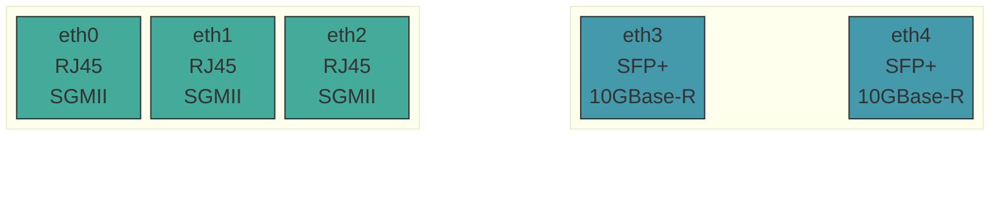
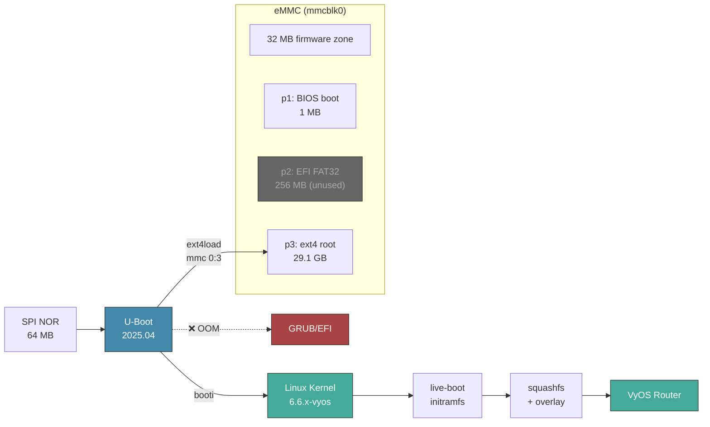
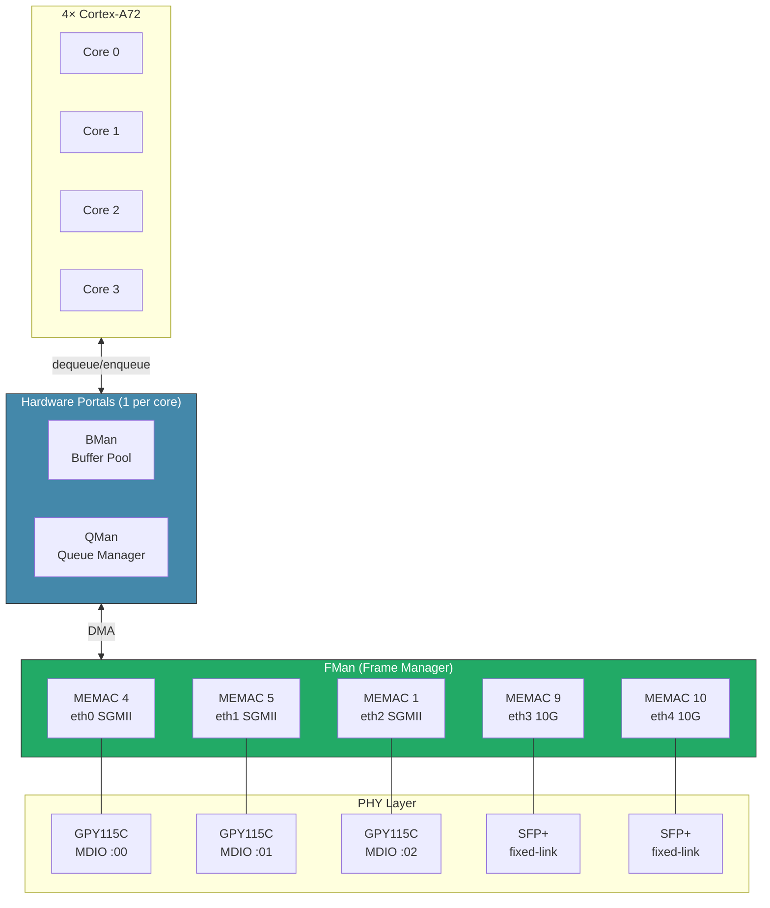

[](https://github.com/mihakralj/vyos-ls1046a-build/actions/workflows/auto-build.yml)

# VyOS for NXP LS1046A (Mono Gateway)

The [Mono Gateway Development Kit](https://github.com/ryneches/mono-gateway-docs) ships with OpenWrt. This build runs VyOS instead. That is the whole pitch.

Behind the decision: I want to use NXP LS1046A, four Cortex-A72 cores at 1.8 GHz, 8 GB ECC DDR4, a hardware Frame Manager that chews packets before the CPU notices them, three RJ45 ports, two SFP+ cages. NXP markets this chip at telecom carriers and switch vendors, not hobbyists that prefer GUI over enterprise features. 

**Thirteen things** were broken on mainline VyOS to make it run on NXP LS1046A. All thirteen are fixed here.

## Get Started

| I want to... | Go to |
|---|---|
| **Install VyOS** on the Mono Gateway | **[INSTALL.md](INSTALL.md)**: write USB image, `install image`, eMMC boot |
| **Update board firmware** (bricked or fresh board) | [FIRMWARE.md](FIRMWARE.md): NOR + eMMC flash procedure, partition offset details |
| **Understand the boot process** | [BOOT-PROCESS.md](BOOT-PROCESS.md): USB and eMMC paths, U-Boot env, `booti` sequence, failure modes |
| **Understand what broke and how it got fixed** | [PORTING.md](PORTING.md): driver archaeology, DPAA1 architecture, boot flow |
| **Push to 10 Gbps** with VPP acceleration | [VPP.md](VPP.md): DPAA1 + DPDK + VPP integration |
| **Configure VPP** step by step | [VPP-SETUP.md](VPP-SETUP.md): enablement, configuration reference, troubleshooting |
| **Debug at the U-Boot console** | [UBOOT.md](UBOOT.md): memory map, boot commands, clock tree, MTD layout |
| **Check a raw boot log** for known messages | [captured_boot.md](captured_boot.md): full USB live-boot serial capture |
| **See what changed** between releases | [CHANGELOG.md](CHANGELOG.md): per-build changelog |

> Review the [open issues](https://github.com/mihakralj/vyos-ls1046a-build/issues) before installing. Some limitations are permanent hardware constraints. Better to know before you're three hours into a rack installation.

## Build and Release Assets

Automated weekly (Friday 01:00 UTC) via GitHub Actions. Trigger manually:

```bash
gh workflow run "VyOS LS1046A build" --ref main
```

| File | Description |
|------|-------------|
| `*-LS1046A-arm64-usb.img.zst` | **USB boot image** (FAT32, zstd-compressed): decompress, `dd` to USB, boot from U-Boot |
| `*-LS1046A-arm64-usb.img.zst.minisig` | USB image signature ([verify key](data/vyos-ls1046a.minisign.pub)) |
| `*-LS1046A-arm64.iso` | VyOS ISO for `add system image <url>` upgrades only. Not for USB boot. |
| `*-LS1046A-arm64.iso.minisig` | ISO signature |
| `vyos-packages.tar` | Built kernel + vyos-1x `.deb` packages |

## What This Build Actually Delivers

This is, as far as anyone can tell, the only VyOS build targeting bare-metal ARM64 networking hardware with HW offload and VPP. Some highlights from the wreckage:

- **10G SFP+ with VPP kernel bypass.** AF_XDP on eth3/eth4 polls at 2.47M packets/sec. The stock kernel path grinds through ~3-5 Gbps on those same ports. Not a typo.
- **CAAM hardware crypto.** IPsec AES-GCM offload via 3 Job Rings at ~2-3 Gbps encrypted throughput. WireGuard (ChaCha20-Poly1305) cannot use CAAM: it runs on ARM64 NEON SIMD instead, topping out around 1 Gbps. Pick your poison.
- **DPAA1 Frame Manager.** Five-port hardware packet engine handles parsing, core distribution, and buffer management before the CPU sees a single byte. Jumbo frames at 9578 MTU on RJ45. SFP+ ports cap at 3290 MTU under AF_XDP (DPAA1 XDP hard limit), which disappears once the DPDK PMD path lands.
- **PTP hardware timestamping.** Nanosecond precision via `ptp_qoriq` on `/dev/ptp0`.
- **U-Boot direct boot.** `vyos.env` on the ext4 partition selects the active image. No GRUB, no OOM, no overhead. Image upgrades write the file automatically.
- **~80s cold boot to login prompt.** Single boot, no kexec double-reboot. `CONFIG_DEBUG_PREEMPT` suppressed saves ~20s of cosmetic scheduler spam.
- **USDPAA chardev for DPDK.** Six kernel patches (1,453 lines) add `/dev/fsl-usdpaa` to mainline 6.6, enabling the DPAA1 DPDK PMD path to 10G wire-speed. Phase C (VPP integration) is tracked in [plans/DPAA1-DPDK-PMD.md](plans/DPAA1-DPDK-PMD.md).
- **ASK hardware flow offload (experimental).** NXP Application Services Kit programs FMan CC hash tables in DDR via `ExternalHashTableSet`, enabling the hardware to forward matching flows at line rate with zero CPU involvement. CDX 7-port registration, FCI netlink bridge, and CMM conntrack daemon all operational. Seven kernel bugs fixed to enable PCD hash table programming on mainline 6.6. See [plans/ASK-ANALYSIS.md](plans/ASK-ANALYSIS.md).

## Why VyOS?

**Zone-based firewall with nftables.** Interfaces join zones; policy applies per zone-pair. `set firewall zone DMZ from LAN firewall name LAN-DMZ-v4` replaces dozens of per-interface rules that multiply combinatorially as you add ports. Anyone who has managed large iptables rule sets knows exactly what that cost feels like.

**VPP userspace dataplane.** VyOS 1.5 ships VPP (Vector Packet Processing): a kernel-bypass data plane that batches 256 packets per poll cycle, reads hardware queues directly, and treats the Frame Manager as a co-processor. Critically, VPP is not all-or-nothing: only interfaces explicitly assigned to VPP use the VPP forwarding path. eth3/eth4 (10G SFP+) go to VPP; eth0-eth2 (RJ45) stay with the kernel for management and routing. VPP is off by default. See [VPP-SETUP.md](VPP-SETUP.md). The CAAM crypto engine provides 128 hardware algorithms for IPsec AES-GCM offload at ~2-3 Gbps encrypted.

**Native containerization via Podman.** Containers are first-class config-tree citizens: image, network, environment variables, volumes, ports, memory limits, all defined with `set container name ...` and committed alongside routing and firewall config. Run AdGuard, a monitoring agent, or a DDNS updater directly on the router. Roll it back if you regret it.

**CLI-first, text-based config.** The entire router state lives in `config.boot`: hierarchical, human-readable, diffable. A diff between two VyOS configs reads like plain English. No GUI-only system can match that at 2 AM when something is on fire.

**Transactional atomic commits.** Stage multiple changes, review with `compare`, apply with `commit`. If commit fails, nothing changes. `commit-confirm` provides automatic rollback on a timer. The number of network outages this design has prevented is unquantifiable. Use it.

**Full FRRouting integration.** BGP, OSPF, IS-IS, BFD, MPLS, VXLAN, segment routing, PIM: all in the config tree with proper dependency resolution at commit time. Full stack, no glue scripts, no surprises.

## Hardware

| | |
|---|---|
| **SoC** | NXP QorIQ LS1046A: 4x Cortex-A72 @ 1.8 GHz, 8 GB DDR4 ECC |
| **Network** | 5x DPAA1/FMan: 3x RJ45 (SGMII, Maxlinear GPY115C), 2x SFP+ (10GBase-R) |
| **Storage** | 29.6 GB Kingston iNAND eMMC via eSDHC |
| **Console** | 8250 UART at `0x21c0500`, 115200 baud (`ttyS0`) |
| **Boot** | U-Boot 2025.04 via `booti`. EFI/GRUB is broken: DPAA1 reserved-memory OOM. |

### Port Layout



As of firmware 2026-03-29+, the FMan MAC probe order matches physical port positions natively. No udev rename rule needed. Interface names map left-to-right as shown. On older firmware, eth0 was the rightmost port, which made staring at the front panel a Sudoku problem.

### Boot Flow



The EFI/GRUB path is permanently broken: DPAA1 reserved-memory nodes in the device tree cause GRUB to OOM during `bootefi`. Nobody plans to fix it. `booti` works, costs nothing, and skips GRUB entirely. Sometimes the universe does you a favor.

### DPAA1 Network Architecture



The Frame Manager is the unsung hero. It handles packet parsing, core distribution, and buffer management in hardware before the CPU ever touches a byte. LS1046A has 10 BMan + 10 QMan portals total: kernel claims 4 (one per core), the remaining 6 sit idle, available for DPDK via the USDPAA chardev. That work is [in progress](plans/DPAA1-DPDK-PMD.md).

## What This Build Fixes

Thirteen things were broken out of the box. Most failed silently. The worst ones looked like they worked but quietly hemorrhaged performance or dropped interfaces without a trace in dmesg.

| # | Problem | Root Cause | Fix |
|---|---------|------------|-----|
| 1 | No eMMC | `MMC_SDHCI_OF_ESDHC` not set | `=y` |
| 2 | No network | DPAA1 stack not enabled | `FSL_FMAN`, `DPAA`, `DPAA_ETH`, `BMAN`, `QMAN` `=y` + `XGMAC_MDIO` |
| 3 | No console | `ttyAMA0` (PL011) instead of `ttyS0` (8250) | Patch + `earlycon` bootarg |
| 4 | CPU at 700 MHz | `QORIQ_CPUFREQ=m` loads too late | `=y` + `CPU_FREQ_DEFAULT_GOV_PERFORMANCE` |
| 5 | eth2 no link | Generic PHY, no SGMII AN workaround | `MAXLINEAR_GPHY=y` (GPY115C) |
| 6 | No SFP+ | SFP framework + SerDes PHY missing | `SFP=y`, `PHYLINK=y`, `PHY_FSL_LYNX_10G=y` |
| 7 | Wrong port order | DT probe order mismatched physical layout | DTS aliases + firmware-native MAC probe order (udev rule removed 2026-03-29) |
| 8 | No auto-boot | `install image` only updates GRUB | `vyos-postinstall` + `fw_setenv` |
| 9 | Jumbo frames broken | Module param used `fman` (wrong `KBUILD_MODNAME`) | `fsl_dpaa_fman.fsl_fm_max_frm=9600` |
| 10 | Live mode false positive | `is_live_boot()` needs `BOOT_IMAGE=` (GRUB-only) | Patch 009: `vyos-union=/boot/` fallback |
| 11 | kexec breaks HW init | `ln -sf /dev/null` broken by live-build | Chroot hook + SysV script removal |
| 12 | No QSPI flash access | `CONFIG_SPI_FSL_QSPI` not set | `=y` + DTS partition map |
| 13 | VPP capped at 3290 MTU | AF_XDP max frame ~3304 bytes on DPAA1 | Split-plane: VPP on SFP+ (no jumbo), kernel on RJ45 (full 9578 MTU) |

Full postmortem with driver archaeology and DPAA1 architecture deep-dive: [PORTING.md](PORTING.md).

## Known Boot Messages (Ignore These)

The boot log contains some alarming lines. All of them are fine.

| Message | Why It's Fine |
|---------|---------------|
| `smp_processor_id() in preemptible` | Cosmetic: PREEMPT_DYNAMIC on Cortex-A72. Suppressed in current builds. |
| `could not generate DUID` | No persistent machine-id on live boot. Resolves after `install image`. |
| `PCIe: no link` / `disabled` | No PCIe devices on this board. The bus exists. The devices do not. |
| `WARNING failed to get smmu node` | No SMMU/IOMMU nodes in DTB. Harmless. |
| `binfmt_misc.mount` FAILED | Expected on ARM64 target hardware. No binfmt emulation needed. |
| kexec double-boot (USB live only) | Normal VyOS live-boot behavior. Installed eMMC systems boot once, straight through. |

Full annotated boot log: [captured_boot.md](captured_boot.md).

## License

VyOS sources are GPLv2. ARM64 builder image from [huihuimoe/vyos-arm64-build](https://github.com/huihuimoe/vyos-arm64-build). Hardware documentation from [mono-gateway-docs](https://github.com/ryneches/mono-gateway-docs).