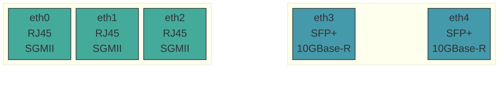
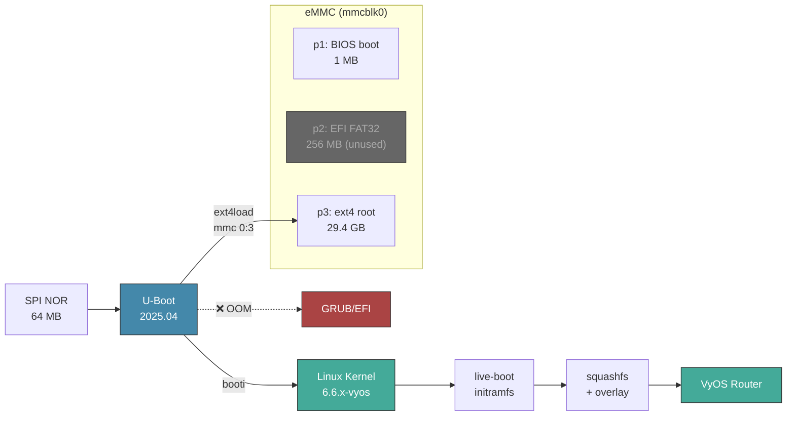
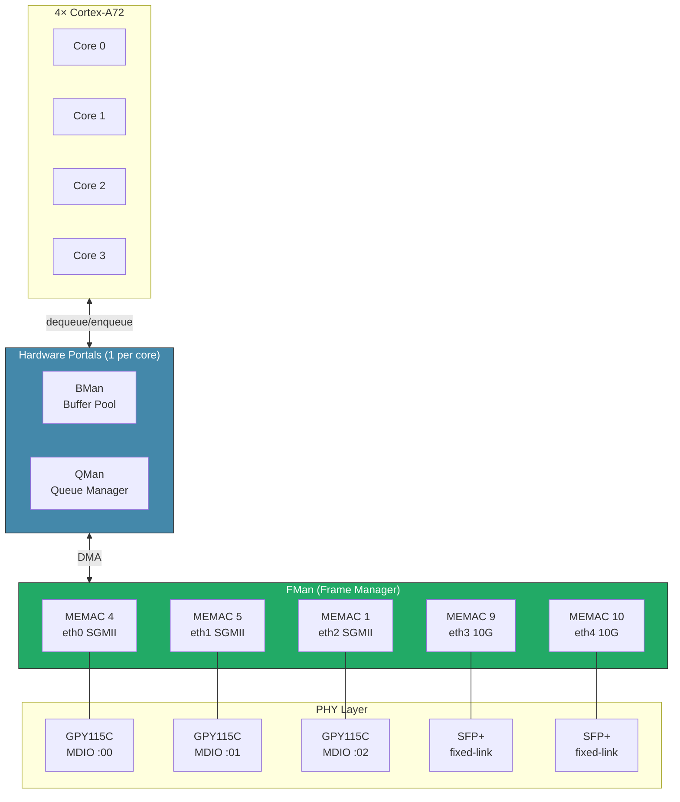

[](https://github.com/mihakralj/vyos-ls1046a-build/actions/workflows/auto-build.yml)

# VyOS for NXP LS1046A (Mono Gateway)

VyOS ARM64 builds for the [Mono Gateway Development Kit](https://github.com/ryneches/mono-gateway-docs) — NXP LS1046A with 4× Cortex-A72 @ 1.8 GHz, 8 GB ECC DDR4, 3× RJ45, 2× SFP+.

Stock VyOS ARM64 ISO has no eMMC driver, no networking, wrong serial console, and CPU locked at 700 MHz. This build fixes all of it.

## Get Started

| I want to... | Go to |
|---|---|
| **Install VyOS** on the Mono Gateway | **[INSTALL.md](INSTALL.md)** — USB boot → `install image` → U-Boot config |
| **Understand** what was fixed and why | [PORTING.md](PORTING.md) — driver analysis, DPAA1 architecture, boot flow |
| **Debug** at the U-Boot serial console | [UBOOT.md](UBOOT.md) — memory map, boot commands, clock tree, MTD layout |
| **Check** a raw boot log for known messages | [captured_boot.md](captured_boot.md) — full USB live-boot serial capture |
| **See** what changed between releases | [CHANGELOG.md](CHANGELOG.md) — per-build changelog |

Default credentials: `vyos` / `vyos`

## Hardware

| | |
|---|---|
| **SoC** | NXP QorIQ LS1046A — 4× Cortex-A72 @ 1.8 GHz, 8 GB DDR4 ECC |
| **Network** | 5× DPAA1/FMan — 3× RJ45 (SGMII, Maxlinear GPY115C), 2× SFP+ (10GBase-R) |
| **Storage** | 29.6 GB Kingston iNAND eMMC via eSDHC |
| **Console** | 8250 UART at `0x21c0500`, 115200 baud (`ttyS0`) |
| **Boot** | U-Boot 2025.04 → `booti` (EFI/GRUB broken — DPAA1 reserved-memory OOM) |

### Port Layout



Remapped via systemd `.link` files — physical position matches interface name (left to right).

### Boot Flow



### DPAA1 Network Architecture



## What This Build Fixes

| # | Problem | Root Cause | Fix |
|---|---------|------------|-----|
| 1 | No eMMC | `MMC_SDHCI_OF_ESDHC` not set | `=y` |
| 2 | No network | DPAA1 stack not enabled | `FSL_FMAN`, `DPAA`, `DPAA_ETH`, `BMAN`, `QMAN` `=y` + `XGMAC_MDIO` |
| 3 | No console | `ttyAMA0` (PL011) instead of `ttyS0` (8250) | Patch + `earlycon` bootarg |
| 4 | CPU 700 MHz | `QORIQ_CPUFREQ=m` loads too late | `=y` + `CPU_FREQ_DEFAULT_GOV_PERFORMANCE` |
| 5 | eth2 no link | Generic PHY — no SGMII AN workaround | `MAXLINEAR_GPHY=y` (GPY115C) |
| 6 | No SFP+ | SFP framework + SerDes PHY missing | `SFP=y`, `PHYLINK=y`, `PHY_FSL_LYNX_10G=y` |
| 7 | Wrong port order | DT probe order ≠ physical | `.link` files + DTS ethernet aliases |
| 8 | No auto-boot | `install image` only updates GRUB | `vyos-postinstall` + `fw_setenv` |

Full analysis: **[PORTING.md](PORTING.md)**

## Build

Automated weekly (Friday 01:00 UTC) via GitHub Actions, or manual:

```bash
gh workflow run "VyOS LS1046A build" --ref main
```

### Release Assets

| File | Description |
|------|-------------|
| `*-LS1046A-arm64.iso` | Bootable VyOS ISO — write to USB, run `install image` |
| `*-LS1046A-arm64.iso.minisig` | Signature ([verify key](data/vyos-ls1046a.minisign.pub)) |
| `vyos-packages.tar` | Built kernel + package `.deb` files |

## Known Boot Messages (Ignore)

| Message | Reason |
|---------|--------|
| `smp_processor_id() in preemptible` | Cosmetic — PREEMPT_DYNAMIC on Cortex-A72 |
| `could not generate DUID` | No persistent machine-id on live boot |
| `PCIe: no link` / `disabled` | No PCIe devices on this board |
| `WARNING failed to get smmu node` | No SMMU/IOMMU nodes in DTB |
| kexec double-boot (USB only) | Normal VyOS live-boot — not on installed systems |

Full boot log: **[captured_boot.md](captured_boot.md)**

## License

VyOS sources (GPLv2). ARM64 builder from [huihuimoe/vyos-arm64-build](https://github.com/huihuimoe/vyos-arm64-build). Hardware docs: [mono-gateway-docs](https://github.com/ryneches/mono-gateway-docs).
