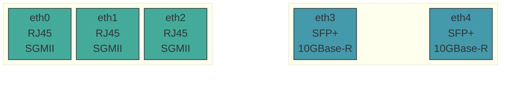
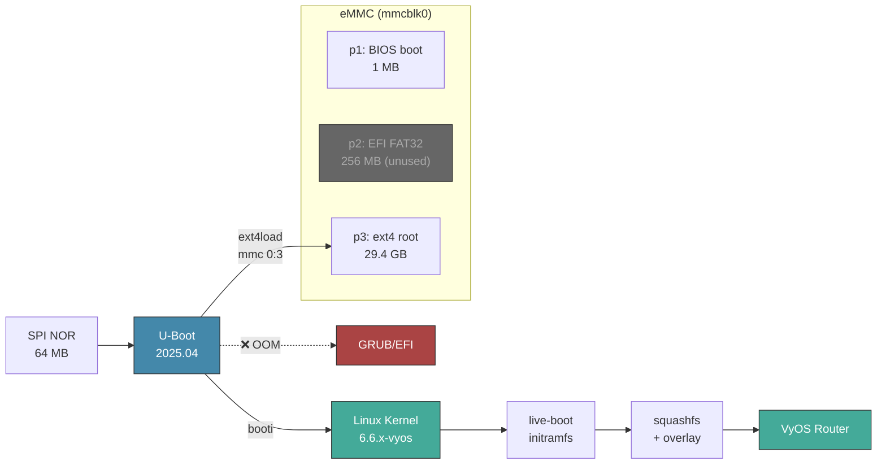
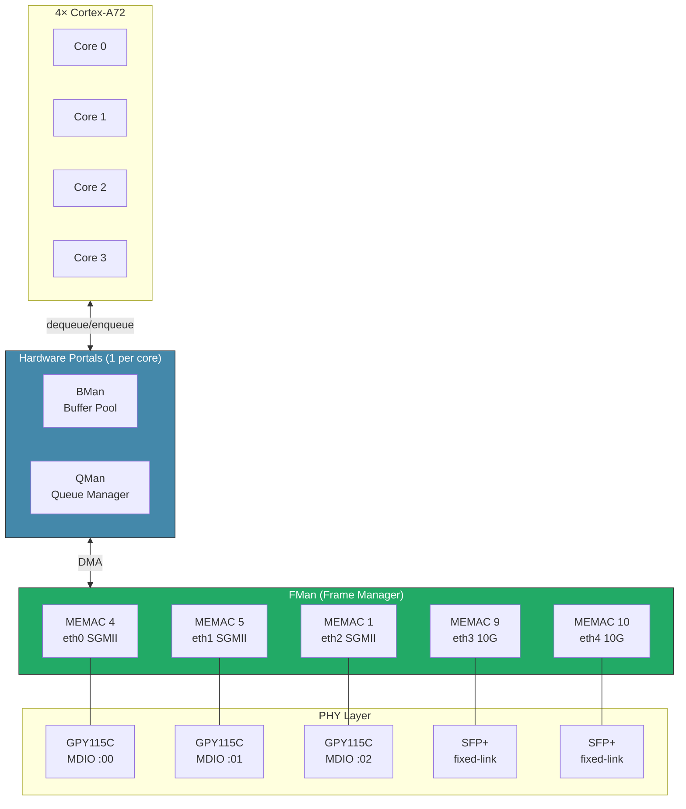

[](https://github.com/mihakralj/vyos-ls1046a-build/actions/workflows/auto-build.yml)

# VyOS for NXP LS1046A (Mono Gateway)

VyOS ARM64 builds for the [Mono Gateway Development Kit](https://github.com/ryneches/mono-gateway-docs): NXP LS1046A, 4x Cortex-A72 @ 1.8 GHz, 8 GB ECC DDR4, 3x RJ45, 2x SFP+.

Stock VyOS ARM64 ISO boots on this board with no eMMC driver, no networking, wrong serial console, and the CPU locked at 700 MHz. Thirteen fixes later, it works. The table below has the full horror show.

## Why VyOS? Why Not OpenWrt or OPNsense?

Because the LS1046A has a **hardware packet processing engine** (DPAA1) that neither OpenWrt nor OPNsense can exploit. OpenWrt tops out around 4.5 Gbps when NATing and filtering packets: the Linux kernel's per-packet `sk_buff` overhead chokes the quad-core A72 long before the 10G SFP+ ports saturate. OPNsense is worse. FreeBSD's DPAA1 driver is immature, and you're staring at ~1.5 Gbps of routing/NATing/filtering on hardware built for ten.

VyOS 1.5 ships with **VPP** (Vector Packet Processing): a kernel-bypass data plane that batches 256 packets at a time, polls hardware directly via AF_XDP, and treats the DPAA1 Frame Manager as a co-processor instead of fighting it. VPP claims eth3/eth4 (10G SFP+) while the kernel retains eth0 through eth2 (RJ45) for management and routing. The CAAM crypto engine provides 128 hardware algorithms for IPsec AES-GCM offload (~2-3 Gbps encrypted). WireGuard grinds through ChaCha20 on ARM64 NEON SIMD (~1 Gbps). VPP is off by default. See **[VPP-SETUP.md](VPP-SETUP.md)** to flip the switch.

When enabled, this split-plane architecture delivers 2.47M polls/sec on SFP+ traffic via VPP, while the kernel stack manages RJ45 interfaces for VyOS routing and management. Two data planes, one box, zero interference.

**[VPP.md](VPP.md)**: Full technical plan covering DPAA1 acceleration, DPDK integration, performance targets, and implementation roadmap.

## Get Started

Pick your adventure:

| I want to... | Go to |
|---|---|
| **Install VyOS** on the Mono Gateway | **[INSTALL.md](INSTALL.md)**: write USB image, `install image`, eMMC boot |
| **Understand the boot process** in detail | [BOOT-PROCESS.md](BOOT-PROCESS.md): USB and eMMC paths, U-Boot env, `booti` sequence, failure modes |
| **Understand** what broke and how it got fixed | [PORTING.md](PORTING.md): driver archaeology, DPAA1 architecture, boot flow |
| **Push to 10 Gbps** with VPP acceleration | [VPP.md](VPP.md): DPAA1 + DPDK + VPP integration plan |
| **Debug** at the U-Boot serial console | [UBOOT.md](UBOOT.md): memory map, boot commands, clock tree, MTD layout |
| **Check** a raw boot log for known messages | [captured_boot.md](captured_boot.md): full USB live-boot serial capture |
| **See** what changed between releases | [CHANGELOG.md](CHANGELOG.md): per-build changelog |

Default credentials: `vyos` / `vyos`

## What Makes This VyOS Build Unique

This is, as far as anyone can tell, the only VyOS build targeting bare-metal ARM64 networking hardware with HW offload support and VPP implementation. Some highlights from the wreckage:

- **10G SFP+ with VPP kernel bypass.** AF_XDP on eth3/eth4 polls at 2.47M/sec. The stock kernel path crawls at ~3-5 Gbps on these same ports.
- **CAAM hardware crypto.** IPsec AES-GCM offload at ~2-3 Gbps encrypted throughput via 3 Job Rings. WireGuard (ChaCha20-Poly1305) cannot use CAAM: it grinds on ARM64 NEON SIMD instead, ~1 Gbps.
- **DPAA1 Frame Manager.** Five-port hardware packet engine. Jumbo frames at 9578 MTU on RJ45. The SFP+ ports cap at 3290 MTU under AF_XDP (DPAA1 XDP hard limit), but that constraint disappears once the DPDK PMD path comes online.
- **PTP hardware timestamping.** Nanosecond precision via `ptp_qoriq` (`/dev/ptp0`).
- **U-Boot direct boot.** A `vyos.env` file on the ext4 partition selects the active image. No GRUB, no overhead, no OOM. Image upgrades write the file automatically.
- **~80s cold boot to login prompt.** Single boot, no kexec double-reboot, `CONFIG_DEBUG_PREEMPT` suppressed (saves ~20s of cosmetic spam).
- **USDPAA chardev for DPDK.** Six kernel patches (1,453 lines) add `/dev/fsl-usdpaa` to mainline 6.6, enabling the DPAA1 DPDK PMD path to 10G wire-speed. [Phase C (VPP integration)](plans/DPAA1-DPDK-PMD.md) is next.

## Hardware

| | |
|---|---|
| **SoC** | NXP QorIQ LS1046A: 4x Cortex-A72 @ 1.8 GHz, 8 GB DDR4 ECC |
| **Network** | 5x DPAA1/FMan: 3x RJ45 (SGMII, Maxlinear GPY115C), 2x SFP+ (10GBase-R) |
| **Storage** | 29.6 GB Kingston iNAND eMMC via eSDHC |
| **Console** | 8250 UART at `0x21c0500`, 115200 baud (`ttyS0`) |
| **Boot** | U-Boot 2025.04 via `booti` (EFI/GRUB broken: DPAA1 reserved-memory OOM) |

### Port Layout



Remapped via udev rule (`64-fman-port-order.rules`): physical position matches interface name, left to right. Without the rule, the kernel's DT address probe order gives you rightmost = eth0. Not ideal when you're staring at the front panel.

### Boot Flow



The EFI/GRUB path is permanently broken. DPAA1 reserved-memory nodes in the device tree cause GRUB to OOM during `bootefi`. Not a bug anyone plans to fix: `booti` works, costs nothing, and skips GRUB entirely.

### DPAA1 Network Architecture



The Frame Manager is the unsung hero here. It handles packet parsing, distribution across cores, and buffer management *in hardware*, before the CPU ever sees a byte. The LS1046A has 10 BMan + 10 QMan portals total: kernel claims 4 (one per core), the remaining 6 sit idle, waiting for DPDK to claim them via the USDPAA chardev. That work is [in progress](plans/DPAA1-DPDK-PMD.md).

## What This Build Fixes

Thirteen things were broken out of the box. Most failed silently. The worst ones looked like they worked but quietly hemorrhaged performance or dropped interfaces without a trace in dmesg.

| # | Problem | Root Cause | Fix |
|---|---------|------------|-----|
| 1 | No eMMC | `MMC_SDHCI_OF_ESDHC` not set | `=y` |
| 2 | No network | DPAA1 stack not enabled | `FSL_FMAN`, `DPAA`, `DPAA_ETH`, `BMAN`, `QMAN` `=y` + `XGMAC_MDIO` |
| 3 | No console | `ttyAMA0` (PL011) instead of `ttyS0` (8250) | Patch + `earlycon` bootarg |
| 4 | CPU 700 MHz | `QORIQ_CPUFREQ=m` loads too late | `=y` + `CPU_FREQ_DEFAULT_GOV_PERFORMANCE` |
| 5 | eth2 no link | Generic PHY, no SGMII AN workaround | `MAXLINEAR_GPHY=y` (GPY115C) |
| 6 | No SFP+ | SFP framework + SerDes PHY missing | `SFP=y`, `PHYLINK=y`, `PHY_FSL_LYNX_10G=y` |
| 7 | Wrong port order | DT probe order ≠ physical layout | udev `VYOS_IFNAME` rule + DTS aliases |
| 8 | No auto-boot | `install image` only updates GRUB | `vyos-postinstall` + `fw_setenv` |
| 9 | Jumbo frames broken | Module param used `fman` (wrong KBUILD_MODNAME) | `fsl_dpaa_fman.fsl_fm_max_frm=9600` |
| 10 | Live mode false positive | `is_live_boot()` needs `BOOT_IMAGE=` (GRUB-only) | Patch 009: `vyos-union=/boot/` fallback |
| 11 | kexec breaks HW init | `ln -sf /dev/null` broken by live-build | Chroot hook + SysV script removal |
| 12 | No QSPI flash access | `CONFIG_SPI_FSL_QSPI` not set | `=y` + DTS partition map |
| 13 | VPP capped at 3290 MTU | AF_XDP max frame ~3304 bytes on DPAA1 | Split-plane: VPP on SFP+ (no jumbo), kernel on RJ45 (full 9578 MTU) |

The full postmortem, with driver archaeology and a DPAA1 architecture deep-dive: **[PORTING.md](PORTING.md)**

## Build

Automated weekly (Friday 01:00 UTC) via GitHub Actions. Or trigger it yourself:

```bash
gh workflow run "VyOS LS1046A build" --ref main
```

### Release Assets

| File | Description |
|------|-------------|
| `*-LS1046A-arm64-usb.img.zst` | **USB boot image** (FAT32, zstd-compressed) — decompress, `dd` to USB, boot from U-Boot |
| `*-LS1046A-arm64-usb.img.zst.minisig` | USB image signature ([verify key](data/vyos-ls1046a.minisign.pub)) |
| `*-LS1046A-arm64.iso` | VyOS ISO — for `add system image <url>` upgrades only (not for USB boot) |
| `*-LS1046A-arm64.iso.minisig` | ISO signature |
| `vyos-packages.tar` | Built kernel + vyos-1x `.deb` packages |

## Known Boot Messages (Ignore)

The boot log contains some alarming-looking messages. All harmless:

| Message | Why It's Fine |
|---------|---------------|
| `smp_processor_id() in preemptible` | Cosmetic: PREEMPT_DYNAMIC on Cortex-A72 |
| `could not generate DUID` | No persistent machine-id on live boot |
| `PCIe: no link` / `disabled` | No PCIe devices on this board |
| `WARNING failed to get smmu node` | No SMMU/IOMMU nodes in DTB |
| kexec double-boot (USB only) | Normal VyOS live-boot behavior, not on installed systems |

Full boot log: **[captured_boot.md](captured_boot.md)**

## License

VyOS sources (GPLv2). ARM64 builder from [huihuimoe/vyos-arm64-build](https://github.com/huihuimoe/vyos-arm64-build). Hardware docs: [mono-gateway-docs](https://github.com/ryneches/mono-gateway-docs).
