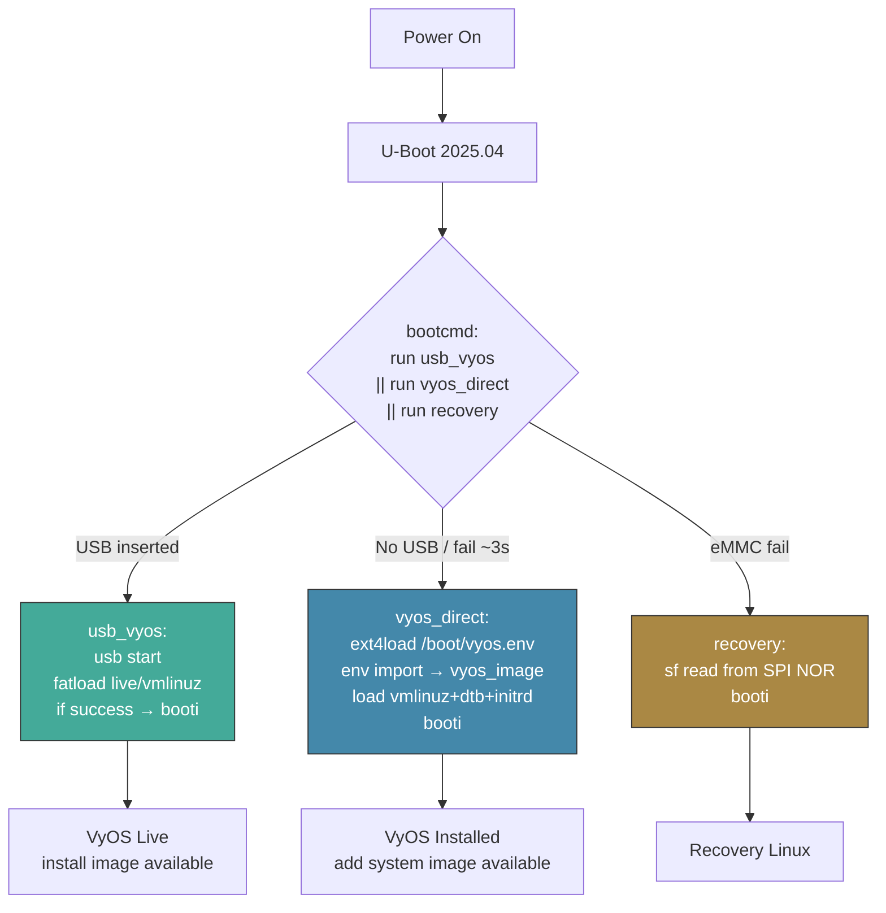

# U-Boot Reference: Mono Gateway LS1046A

Low-level U-Boot reference and seamless boot specification. The stuff you need when you're staring at a serial console at 115200 baud wondering why nothing happened.

Updated 2026-03-25.

For boot architecture and kernel config rationale, see [PORTING.md](PORTING.md).
For install instructions, see [INSTALL.md](INSTALL.md).

---

## Seamless Boot Architecture

### Design: `/boot/vyos.env` Replaces `fw_setenv`

The old approach wrote the image name into U-Boot's SPI flash via `fw_setenv` on every install and upgrade. This required `libubootenv-tool`, `/dev/mtd3`, a QSPI driver, and a helper script. Four moving parts for what is fundamentally a one-line config change.

**Current approach:** U-Boot reads the default image name from a text file on the eMMC ext4 partition. VyOS writes this file as part of its normal image management. No SPI flash writes needed after initial setup.

```
eMMC partition 3 (ext4):
  /boot/vyos.env                               ← "vyos_image=2026.03.24-0338-rolling"
  /boot/2026.03.24-0338-rolling/
      vmlinuz
      initrd.img
      mono-gw.dtb
      2026.03.24-0338-rolling.squashfs
```

U-Boot loads `/boot/vyos.env`, imports it via `env import -t`, and uses `${vyos_image}` to construct all paths. The `vyos_direct` command is **static**: it never needs `fw_setenv` updates. Set once, boot forever.

### Boot Chain



### When `fw_setenv` Is Used

Only **once**: during the first `install image` from USB live boot. It sets:
- `bootcmd` = `run usb_vyos || run vyos_direct || run recovery`
- `vyos_direct` = static command that reads `/boot/vyos.env`
- `usb_vyos` = auto-detect and boot from USB

After this, **all future installs and upgrades only write `/boot/vyos.env`**. No SPI flash writes. No `fw_setenv`. Just a text file.

### User Experience

| Operation | User Action | Automated |
|-----------|------------|-----------|
| First USB boot (factory board) | Interrupt U-Boot, paste ONE line | — |
| `install image` | Run command, accept defaults | Writes `vyos.env` + one-time `fw_setenv` |
| Reboot after install | Remove USB, reboot | U-Boot reads `vyos.env`, boots from eMMC |
| `add system image URL` | Run command | Writes `vyos.env` (no `fw_setenv`) |
| Reboot after upgrade | Reboot | U-Boot reads `vyos.env`, boots new image |
| USB re-install | Insert USB, power cycle | U-Boot auto-detects USB |
| `set system image default-boot` | Run command | Updates `vyos.env` |

---

## U-Boot Environment (Target State)

Set once during first `install image`. Never modified again. If you find yourself running `fw_setenv` more than once, something went wrong.

```bash
# Boot priority: USB → eMMC → SPI recovery
bootcmd=run usb_vyos || run vyos_direct || run recovery

# USB live boot — auto-detect VyOS ISO on FAT32 USB
usb_vyos=usb start; if fatload usb 0:1 ${kernel_addr_r} live/vmlinuz; then fatload usb 0:1 ${fdt_addr_r} mono-gw.dtb; fatload usb 0:1 ${ramdisk_addr_r} live/initrd.img; setenv bootargs BOOT_IMAGE=/live/vmlinuz console=ttyS0,115200 earlycon=uart8250,mmio,0x21c0500 boot=live live-media=/dev/sda1 components noeject nopersistence noautologin nonetworking union=overlay net.ifnames=0 fsl_dpaa_fman.fsl_fm_max_frm=9600 quiet; booti ${kernel_addr_r} ${ramdisk_addr_r}:${filesize} ${fdt_addr_r}; fi

# eMMC boot — split into 3 vars to stay under U-Boot input buffer limit
vyos_load=ext4load mmc 0:3 ${load_addr} /boot/vyos.env; env import -t ${load_addr} ${filesize}; ext4load mmc 0:3 ${kernel_addr_r} /boot/${vyos_image}/vmlinuz; ext4load mmc 0:3 ${fdt_addr_r} /boot/${vyos_image}/mono-gw.dtb; ext4load mmc 0:3 ${ramdisk_addr_r} /boot/${vyos_image}/initrd.img
vyos_args=setenv bootargs BOOT_IMAGE=/boot/${vyos_image}/vmlinuz console=ttyS0,115200 earlycon=uart8250,mmio,0x21c0500 net.ifnames=0 boot=live rootdelay=5 noautologin fsl_dpaa_fman.fsl_fm_max_frm=9600 hugepagesz=2M hugepages=512 panic=60 vyos-union=/boot/${vyos_image}
vyos_direct=run vyos_load; run vyos_args; booti ${kernel_addr_r} ${ramdisk_addr_r}:${filesize} ${fdt_addr_r}

# SPI flash recovery (factory, always available)
recovery=sf probe 0:0; sf read ${kernel_addr_r} ${kernel_addr} ${kernel_size}; sf read ${fdt_addr_r} ${fdt_addr} ${fdt_size}; booti ${kernel_addr_r} - ${fdt_addr_r}
```

### `/boot/vyos.env` Format

Single line, U-Boot `env import -t` compatible:
```
vyos_image=2026.03.24-0338-rolling
```

Written by VyOS's image installer Python code after every `install image` or `add system image`.

---

## Implementation Plan

| Task | File | Description |
|------|------|-------------|
| 1 | `data/scripts/vyos-postinstall` | Rewrite: write `vyos.env` + one-time `fw_setenv` for static `vyos_direct` |
| 2 | `data/vyos-1x-011-auto-postinstall.patch` | **NEW** — Hook `vyos.env` write into `install image` and `add system image` |
| 3 | `.github/workflows/auto-build.yml` | Apply patch 011; fix `vyos-postinstall.service` symlink via chroot hook |
| 4 | `INSTALL.md` | Simplify to 5 steps |
| 5 | `AGENTS.md`, `PORTING.md` | Update to reflect new architecture |

### Verified: `env import -t` Works ✅

Tested 2026-03-25 on board #308 (U-Boot 2025.04):
1. ✅ `env import -t ${load_addr} ${filesize}` correctly parses `vyos_image=2026.03.25-0531-rolling`
2. ✅ `${vyos_image}` is available for subsequent `ext4load` commands in the same script
3. ✅ No side effects: only the `vyos_image` variable is imported
4. ✅ Full boot chain works: `vyos.env`, `env import`, per-image `ext4load`, `booti`, VyOS login in ~97s

---

## Reference: U-Boot Version

```
U-Boot 2025.04-g26d27571ac82-dirty (Jan 18 2026 - 17:54:35 +0000)
aarch64-oe-linux-gcc (GCC) 14.3.0
```

## Memory Map

| Variable | Address | Notes |
|----------|---------|-------|
| `kernel_addr_r` | `0x82000000` | Kernel load address |
| `fdt_addr_r` | `0x88000000` | Device tree load address |
| `ramdisk_addr_r` | `0x88080000` | Initrd load address (512KB after FDT) |
| `kernel_comp_addr_r` | `0x90000000` | Compressed kernel decompress area |
| `fdt_size` | `0x100000` | 1 MB reserved for FDT |
| `load_addr` | `0xa0000000` | Generic load address |

**DRAM:** 8 GB total

- Bank 0: `0x80000000` – `0xfbdfffff` (1982 MB)
- Bank 1: `0x880000000` – `0x9ffffffff` (6144 MB)

## Boot Commands (Deployed — vyos.env Architecture)

> **Status:** VERIFIED on board #308 (2026-03-25). Paste into U-Boot console **one line at a time**.

> **Important:** Each `setenv` line must be under ~500 chars or U-Boot's input buffer truncates it,
> causing a dangling `>` prompt. The commands below are split into shorter vars that chain via `run`.

```bash
# 1. eMMC file loader — reads vyos.env then loads kernel+dtb+initrd from per-image dir
setenv vyos_load 'ext4load mmc 0:3 ${load_addr} /boot/vyos.env; env import -t ${load_addr} ${filesize}; ext4load mmc 0:3 ${kernel_addr_r} /boot/${vyos_image}/vmlinuz; ext4load mmc 0:3 ${fdt_addr_r} /boot/${vyos_image}/mono-gw.dtb; ext4load mmc 0:3 ${ramdisk_addr_r} /boot/${vyos_image}/initrd.img'

# 2. Bootargs builder — ${vyos_image} is expanded at runtime (after env import)
setenv vyos_args 'setenv bootargs BOOT_IMAGE=/boot/${vyos_image}/vmlinuz console=ttyS0,115200 earlycon=uart8250,mmio,0x21c0500 net.ifnames=0 boot=live rootdelay=5 noautologin fsl_dpaa_fman.fsl_fm_max_frm=9600 hugepagesz=2M hugepages=512 panic=60 vyos-union=/boot/${vyos_image}'

# 3. eMMC boot orchestrator — chains load → args → boot
setenv vyos_direct 'run vyos_load; run vyos_args; booti ${kernel_addr_r} ${ramdisk_addr_r}:${filesize} ${fdt_addr_r}'

# 4. USB live boot — auto-detect VyOS ISO on FAT32 USB
setenv usb_vyos 'usb start; if fatload usb 0:1 ${kernel_addr_r} live/vmlinuz; then fatload usb 0:1 ${fdt_addr_r} mono-gw.dtb; fatload usb 0:1 ${ramdisk_addr_r} live/initrd.img; setenv bootargs BOOT_IMAGE=/live/vmlinuz console=ttyS0,115200 earlycon=uart8250,mmio,0x21c0500 boot=live live-media=/dev/sda1 components noeject nopersistence noautologin nonetworking union=overlay net.ifnames=0 fsl_dpaa_fman.fsl_fm_max_frm=9600 quiet; booti ${kernel_addr_r} ${ramdisk_addr_r}:${filesize} ${fdt_addr_r}; fi'

# 5. Boot priority: USB → eMMC → SPI recovery
setenv bootcmd 'run usb_vyos || run vyos_direct || run recovery'

# 6. Save to SPI flash (one-time, never needs changing)
saveenv
```

After `saveenv`, the board auto-boots from eMMC via `/boot/vyos.env` on every power cycle. No further U-Boot intervention needed. Ever. Future `add system image` upgrades only update `/boot/vyos.env`.

> **Note on quoting:** `setenv bootargs` does NOT need double quotes around the value — U-Boot's
> `setenv` treats everything after the variable name as the value. Removing `"..."` avoids nested
> quote parsing issues in hush shell.

**Critical bootargs (get any of these wrong and the boot fails silently):**
- `BOOT_IMAGE=/boot/${vyos_image}/vmlinuz`: must be FIRST arg. VyOS `is_live_boot()` regex requires it (U-Boot's `booti` does not set it like GRUB does)
- `boot=live`: initramfs uses live-boot mode
- `vyos-union=/boot/${vyos_image}`: squashfs overlay dir on p3 (also used as `is_live_boot()` fallback for U-Boot boards)
- `fsl_dpaa_fman.fsl_fm_max_frm=9600`: enables jumbo frames (max MTU 9578). Module name is `fsl_dpaa_fman`, NOT `fman`. The wrong name silently has no effect.
- `hugepagesz=2M hugepages=512 panic=60`: MUST match config.boot.default or `system_option.py` triggers a kexec reboot
- Missing `boot=live` or `vyos-union=` drops to initramfs BusyBox shell with no explanation

**Critical load order:**
- Initrd must be loaded **LAST** so `${filesize}` captures the initrd size
- Ramdisk arg MUST be `${ramdisk_addr_r}:${filesize}` (colon+size format)

## Boot from USB (for initial install)

```bash
usb start; fatload usb 0:1 ${kernel_addr_r} live/vmlinuz; fatload usb 0:1 ${fdt_addr_r} mono-gw.dtb; fatload usb 0:1 ${ramdisk_addr_r} live/initrd.img; setenv bootargs "BOOT_IMAGE=/live/vmlinuz console=ttyS0,115200 earlycon=uart8250,mmio,0x21c0500 boot=live live-media=/dev/sda1 components noeject nopersistence noautologin nonetworking union=overlay net.ifnames=0 fsl_dpaa_fman.fsl_fm_max_frm=9600 quiet"; booti ${kernel_addr_r} ${ramdisk_addr_r}:${filesize} ${fdt_addr_r}
```

> USB live boot triggers a kexec double-boot (~70s penalty). Normal for VyOS live-boot,
> only during initial install. eMMC boot is single-pass (~82s).

> **If `fatload` says "File not found":** run `fatls usb 0:1 live` — if the
> kernel has a version suffix (e.g. `vmlinuz-6.6.128-vyos`), use the full name.

## Factory Boot Commands (OpenWrt — Pre-Install)

```bash
# Factory default: try eMMC OpenWrt, then SPI recovery
bootcmd=run emmc || run recovery

# eMMC (OpenWrt on partition 1) — destroyed after install image
emmc=setenv bootargs "${bootargs_console} root=/dev/mmcblk0p1 rw rootwait rootfstype=ext4";
    ext4load mmc 0:1 ${kernel_addr_r} /boot/Image.gz &&
    ext4load mmc 0:1 ${fdt_addr_r} /boot/mono-gateway-dk-sdk.dtb &&
    booti ${kernel_addr_r} - ${fdt_addr_r}

# SPI flash recovery (always available)
recovery=sf probe 0:0; sf read ${kernel_addr_r} ${kernel_addr} ${kernel_size};
    sf read ${fdt_addr_r} ${fdt_addr} ${fdt_size};
    booti ${kernel_addr_r} - ${fdt_addr_r}
```

## EFI/GRUB: Permanently Broken

`bootefi` with GRUB OOMs on this board. The DPAA1 `reserved-memory` nodes in the DTB consume too much of the EFI memory pool:

```
reserved-memory:
  qman-pfdr: 0x9fc000000..0x9fdffffff (32 MB) nomap
  qman-fqd:  0x9fe800000..0x9feffffff (8 MB)  nomap
  bman-fbpr: 0x9ff000000..0x9ffffffff (16 MB) nomap
```

**Use `vyos_direct` (booti) as the permanent boot method.**

## Failed Boot Attempts (Reference)

### `booti` without `:${filesize}` on ramdisk
```bash
booti ${kernel_addr_r} ${ramdisk_addr_r} ${fdt_addr_r}
# "Wrong Ramdisk Image Format / Ramdisk image is corrupt or invalid"
# Fix: use ${ramdisk_addr_r}:${filesize} — booti needs addr:size format
```

### `booti` kernel-only (no initrd, stale bootargs)
```bash
booti ${kernel_addr_r} - ${fdt_addr_r}
# Kernel boots (all 5 FMan MACs probe!) but hangs:
#   "Waiting for root device /dev/mmcblk0p1..."
# Cause: bootargs still "root=/dev/mmcblk0p1" from factory env.
#   No initrd = no live-boot initramfs = can't mount squashfs.
```

## Ethernet Interfaces

> ⚠️ Physical RJ45 port order differs from DT node address order.
> Port remapping is handled by udev rule `64-fman-port-order.rules` setting `VYOS_IFNAME`.

| Physical Position | DT Node | MAC Address | PHY Addr | VyOS Name | Type |
|-------------------|---------|-------------|----------|-----------|------|
| Port 1 (leftmost RJ45) | `1ae8000.ethernet` | `E8:F6:D7:00:15:FF` | MDIO :00 | **eth0** | SGMII |
| Port 2 (center RJ45) | `1aea000.ethernet` | `E8:F6:D7:00:16:00` | MDIO :01 | **eth1** | SGMII |
| Port 3 (right RJ45) | `1ae2000.ethernet` | `E8:F6:D7:00:16:01` | MDIO :02 | **eth2** | SGMII |
| SFP1 | `1af0000.ethernet` | `E8:F6:D7:00:16:02` | fixed-link | **eth3** | XGMII 10GBase-R |
| SFP2 | `1af2000.ethernet` | `E8:F6:D7:00:16:03` | fixed-link | **eth4** | XGMII 10GBase-R |

### MAC Addresses (from U-Boot env)

| Variable | Address | Interface |
|----------|---------|-----------|
| `ethaddr` | `E8:F6:D7:00:15:FF` | eth0 |
| `eth1addr` | `E8:F6:D7:00:16:00` | eth1 |
| `eth2addr` | `E8:F6:D7:00:16:01` | eth2 |
| `eth3addr` | `E8:F6:D7:00:16:02` | eth3 |
| `eth4addr` | `E8:F6:D7:00:16:03` | eth4 |

MAC addresses are unique per board. Yours will differ.

## Clock Tree & CPU Frequency

**sysclk:** 100 MHz (oscillator)

| Clock | Rate | Source | Notes |
|-------|------|--------|-------|
| `cg-pll1-div1` | 1600 MHz | PLL1 | Max CPU frequency |
| `cg-pll1-div2` | 800 MHz | PLL1 | |
| `cg-pll1-div3` | 533 MHz | PLL1 | |
| `cg-pll1-div4` | 400 MHz | PLL1 | |
| `cg-pll2-div1` | 1400 MHz | PLL2 | HWACCEL1 |
| `cg-pll2-div2` | 700 MHz | PLL2 | Minimum CPU clock |
| `cg-pll2-div3` | 466 MHz | PLL2 | |
| `cg-pll2-div4` | 350 MHz | PLL2 | |
| `cg-cmux0` | 1600 MHz | PLL1-div1 | **CPU clock mux (all 4 cores)** ✅ |
| `cg-hwaccel0` | 700 MHz | PLL2-div2 | FMan clock |
| `cg-pll0-div2` | 300 MHz | PLL0 | SPI (DSPI controller) |

`CONFIG_QORIQ_CPUFREQ=y` (built-in) claims PLL clock parents before `clk: Disabling unused clocks` runs at T+12s. Confirmed: raid6 neonx8 2056 to 4816 MB/s. The difference between 700 MHz and 1800 MHz is not subtle.

## SPI Flash (MTD) Layout

```
1550000.spi (accessed via U-Boot sf commands only):
  1M(rcw-bl2)          — Reset Config Word + BL2
  2M(uboot)            — U-Boot
  1M(uboot-env)        — U-Boot environment (saveenv / fw_setenv target)
  1M(fman-ucode)       — FMan microcode (injected to DTB at boot)
  1M(recovery-dtb)     — Recovery device tree
  4M(unallocated)
 22M(kernel-initramfs) — Recovery kernel + initramfs
```

> **MTD visibility requires `CONFIG_SPI_FSL_QSPI=y`.** Without it, `/proc/mtd` is empty and
> `fw_setenv` fails with "Configuration file wrong or corrupted." With QSPI enabled,
> 8 MTD partitions appear (`/dev/mtd0`–`/dev/mtd7`). `fw_setenv` uses `/dev/mtd3`
> (uboot-env, 1 MB). VyOS ships `libubootenv-tool` (not classic `u-boot-tools`),
> which requires its own `/etc/fw_env.config` format.

## USB Device Detection

```
SanDisk 3.2Gen1 (USB 2.10 mode on XHCI)
VID:PID = 0x0781:0x5581
Partition: usb 0:1 (FAT32, single partition from Rufus ISO mode)
```

### ISO Contents on USB (from `fatls usb 0:1`)

```
live/vmlinuz-6.6.128-vyos    (9.2 MB)
live/initrd.img-6.6.128-vyos (33.3 MB)
live/filesystem.squashfs     (526 MB)
mono-gw.dtb                  (94 KB)
EFI/boot/bootaa64.efi        (990 KB)
EFI/boot/grubaa64.efi        (3.9 MB)
```

## Live System State (2026-03-24, eMMC installed)

**Version:** 2026.03.24-0338-rolling
**Kernel:** 6.6.128-vyos `#1 SMP PREEMPT_DYNAMIC`
**FRRouting:** 10.5.2
**Boot source:** eMMC installed (`vyos_direct` booti from mmcblk0p3)

| Resource | Value |
|----------|-------|
| CPU frequency | 1800 MHz ✅ |
| CPU governor | performance |
| Memory total | 7.8 GB |
| Memory used | ~800 MB (10%) |
| Temperature | 42°C |
| Boot time | ~82s to login (single boot, no kexec) |
