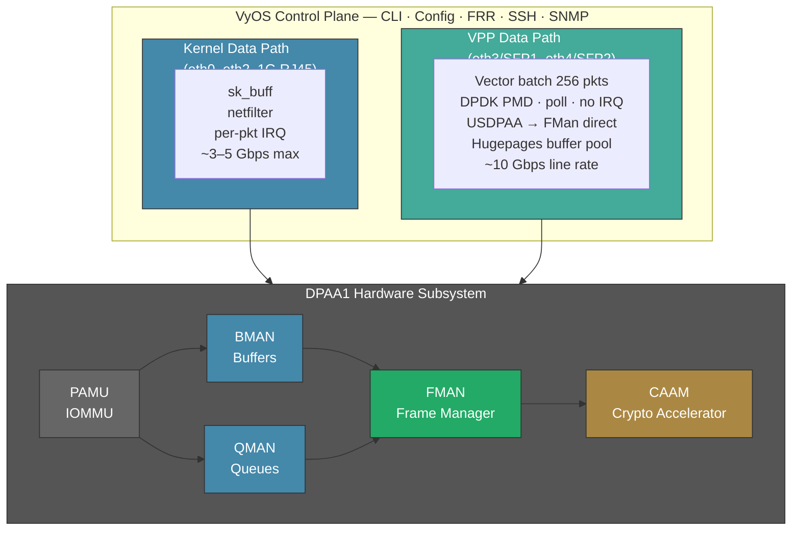
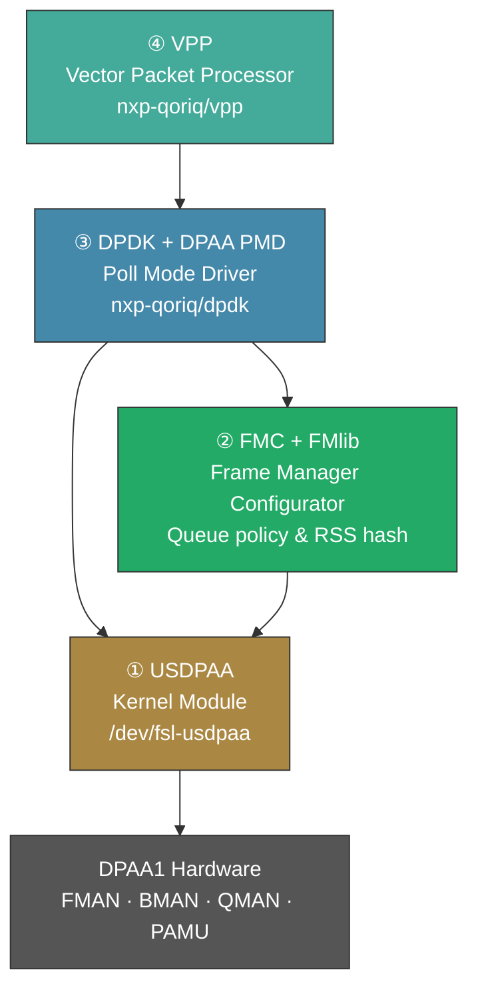
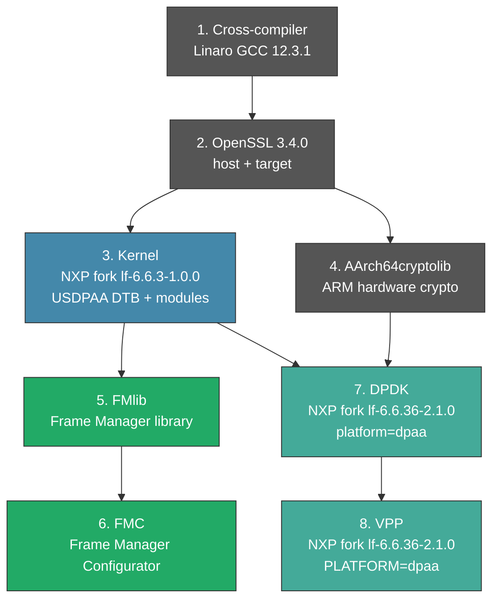
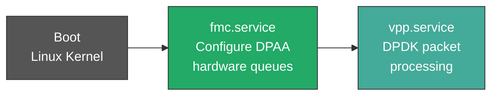

# High-Performance VyOS on Mono Gateway: VPP + DPAA1 Acceleration Plan

Technical plan to achieve 10Gbps wire-speed packet processing on the NXP LS1046A Mono Gateway Development Kit using VyOS with VPP (Vector Packet Processing) and hardware-accelerated DPAA1.

## Why VPP Changes Everything

### The Kernel Bottleneck

Standard Linux networking processes packets one at a time. Each packet triggers an interrupt, allocates an `sk_buff`, traverses the networking stack (netfilter, routing, bridging), and exits. On a quad-core A72 at 1.8 GHz, this hits an "Interrupt Storm" ceiling around **3–5 Gbps** — the CPUs spend more time context-switching than forwarding.

### The VPP Solution

VPP (Vector Packet Processing) from fd.io bypasses the Linux kernel entirely:

1. **Batch Processing:** Instead of one packet per interrupt, VPP processes "vectors" of up to 256 packets per graph-walk cycle, staying in L1/L2 cache
2. **Kernel Bypass:** Uses DPDK (Data Plane Development Kit) with a Poll Mode Driver (PMD) to talk directly to hardware — zero interrupts
3. **DPAA1 Hardware Offload:** The LS1046A's Frame Manager, Buffer Manager, and Queue Manager become VPP's co-processors via USDPAA (Userspace DPAA)

[Read more about VPP implementation in VyOS](https://docs.vyos.io/en/latest/vpp/description.html)

### Performance Comparison (Estimated)

| Metric | Standard VyOS (Kernel) | VyOS + VPP (DPAA1 PMD) |
|--------|----------------------|------------------------|
| IPv4 Routing (1500B MTU) | 3–5 Gbps | **9.4+ Gbps** |
| Small Packet (64B) PPS | ~2 Mpps | **8–12 Mpps** |
| 10G SFP+ Utilization | Partial (CPU-bound) | **Full line rate** |
| WireGuard/IPsec | ~1.2 Gbps | **2.5+ Gbps** (CAAM offload) |
| CPU during 10G forwarding | 100% SoftIRQ | **<50%** (poll mode) |

### Why This Outperforms Alternatives

| OS / Engine | IPv4 (1500B) | 64B PPS | 10G SFP+ | Why |
|-------------|-------------|---------|----------|-----|
| **OPNsense** (FreeBSD) | ~1.5 Gbps | ~0.8 Mpps | ❌ Chokes | Immature FreeBSD DPAA1 driver, hardening overhead |
| **OpenWrt** (Linux kernel) | ~4.5 Gbps | ~2.0 Mpps | ⚠️ Partial | Good drivers but `sk_buff` per-packet overhead |
| **VyOS + VPP** (DPAA1 PMD) | 9.4+ Gbps | 10+ Mpps | ✅ Line rate | Kernel bypass, vector batching, hardware offload |

---

## The Architecture: Kernel vs Userspace Data Planes



**Key Design Decision:** The kernel retains control of the 1G RJ45 management ports (eth0–eth2). VPP claims the 10G SFP+ ports (eth3, eth4) via USDPAA for high-speed forwarding. This "split-plane" model keeps VyOS management CLI functional while VPP handles the data plane.

---

## The Four Components Required

DPAA1 is not a standard PCI NIC. Getting VPP to talk to it requires four components beyond the current kernel-space setup:



### Component 1: USDPAA Kernel Module 🛠️ (Needs Work)

**What:** Userspace DPAA — a kernel module that creates `/dev/` device nodes allowing VPP to access DPAA1 hardware queues directly from userspace.

**Status:** Available in the NXP kernel fork. Requires `CONFIG_FSL_USDPAA=y` in the kernel config.

**Why it matters:** Without USDPAA, VPP cannot "grab" the Frame Manager's hardware queues. The kernel's `fsl_dpaa_eth` driver must release the 10G interfaces, and USDPAA provides the bridge for VPP to claim them.

**Source:** `github.com/nxp-qoriq/linux` branch `lf-6.6.3-1.0.0`

### Component 2: FMC Tool + Policy Files 🛠️ (Needs Build)

**What:** Frame Manager Configuration — a userspace tool that programs the DPAA1 hardware's packet distribution policy before VPP starts.

**Status:** Must be cross-compiled from NXP LSDK sources. Not included in standard VyOS.

**Why it matters:** DPAA1 hardware is policy-driven. Without FMC configuration, the Frame Manager doesn't know how to distribute packets across CPU cores. Packets arrive at the hardware but never reach VPP's poll loop.

**Artifacts needed:**
- `fmc` binary → `/usr/local/bin/fmc`
- `libfmd.so` → `/usr/local/lib/`
- `config.xml` — defines the 5 MACs (3× SGMII, 2× XFI) for the LS1046A
- `policy.xml` — defines RSS hash and frame distribution across A72 cores
- `init-fmc.sh` — startup script that reads `/proc/device-tree/model` and applies policy

**Source:** `github.com/nxp-qoriq/fmc` branch `lf-6.6.3-1.0.0`, depends on `github.com/nxp-qoriq/fmlib` same branch

### Component 3: NXP DPDK with DPAA PMD 🛠️ (Needs Build)

**What:** The Data Plane Development Kit compiled with the NXP DPAA1 Poll Mode Driver — the piece that lets VPP poll the hardware queues instead of relying on interrupts.

**Status:** Standard VyOS VPP ships with generic PMDs (virtio, ENA, Intel/Mellanox). The NXP `pmd_dpaa` (DPAA Bus + DPAA PMD) is not included.

**Why it matters:** Even with USDPAA and FMC working, VPP will say "I don't know how to drive this NIC" without the DPAA PMD. This is the translator between VPP's packet processing graph and the DPAA1 hardware queues.

**Build flags:**
```
CONFIG_RTE_LIBRTE_DPAA_PMD=y
CONFIG_RTE_LIBRTE_DPAA_BUS=y
```

**Source:** `github.com/nxp-qoriq/dpdk` branch `lf-6.6.36-2.1.0`

### Component 4: NXP VPP with DPAA Platform 🛠️ (Needs Build)

**What:** VPP recompiled against NXP's DPDK fork, with DPAA platform support and optionally the CAAM crypto plugin.

**Status:** Must be cross-compiled. Standard VyOS VPP binary lacks DPAA awareness.

**Why it matters:** The VPP binary is the runtime engine. It must be linked against the DPAA-enabled DPDK to understand the DPAA hardware.

**Build:**
```bash
make V=0 PLATFORM=dpaa TAG=dpaa vpp-package-deb
```

**Source:** `github.com/nxp-qoriq/vpp` branch `lf-6.6.36-2.1.0`

### Component Summary

| Component | Level | Function | Status | Source |
|-----------|-------|----------|--------|--------|
| USDPAA | Kernel module | Userspace bridge to DPAA1 | Kernel config needed | nxp-qoriq/linux |
| FMC + FMlib | Userspace tool | Frame Manager queue policy | Cross-compile needed | nxp-qoriq/fmc + fmlib |
| DPDK (DPAA PMD) | Userspace lib | Poll Mode Driver | Cross-compile needed | nxp-qoriq/dpdk |
| VPP (DPAA) | Userspace app | Vector Packet Processing | Cross-compile needed | nxp-qoriq/vpp |

---

## The Software Dependency Chain

All NXP-specific packages sourced from `github.com/nxp-qoriq`. **Critical:** use kernel branch `lf-6.6.3-1.0.0` (NOT `lf-6.6.36-2.1.0` which has a memory bug).



**Runtime dependency chain on target:**



---

## Phase 1: Kernel Preparation

### 1.1 Enable USDPAA

Add to `vyos_defconfig` in the kernel config block of `auto-build.yml`:

```
CONFIG_FSL_USDPAA=y
CONFIG_FSL_DPAA_ADVANCED=y
```

This creates `/dev/fsl-usdpaa` device nodes that allow VPP to access DPAA1 hardware queues from userspace.

**Note:** This config exists only in the NXP kernel fork (`github.com/nxp-qoriq/linux`), not mainline. The current VyOS build uses the upstream VyOS kernel (mainline 6.6). **Decision required:** either patch the VyOS kernel build to use NXP's fork, or backport the USDPAA module.

### 1.2 Enable Hugepages

VPP requires Hugepages for zero-copy buffer management. Add to U-Boot bootargs:

```
default_hugepagesz=2m hugepagesz=2m hugepages=1024
```

This reserves 2 GB (1024 × 2 MB pages) for VPP packet buffers.

Kernel config (already satisfied by VyOS defaults):
```
CONFIG_HUGETLBFS=y
CONFIG_HUGETLB_PAGE=y
```

Hugepages mount (add to fstab or systemd mount):
```
none /mnt/hugepages hugetlbfs defaults,pagesize=2M 0 0
```

### 1.3 CPU Isolation

Reserve CPU cores 2–3 for VPP workers, leaving cores 0–1 for Linux + VyOS control plane:

```
isolcpus=2-3 rcu_nocbs=2-3 nohz_full=2-3
```

### 1.4 DPAA Portal Assignment

Configure BMan/QMan portals for userspace access:

```
bportals=s0 qportals=s0 iommu.passthrough=1
```

### 1.5 USDPAA Device Tree

A separate DTB variant (`fsl-ls1046a-rdb-usdpaa.dtb`) passes specific NICs to userspace instead of the kernel. The key modification: the USDPAA DTS removes the `fsl,dpaa` bus entries for the interfaces VPP will control, preventing the kernel `fsl_dpaa_eth` driver from claiming them.

For the Mono Gateway, the USDPAA DTS should:
- **Keep kernel control** of eth0–eth2 (3× RJ45 SGMII, management)
- **Pass to VPP** eth3, eth4 (2× SFP+ 10GBase-R, data plane)

### 1.6 CAAM Hardware Crypto

Enable the NXP Cryptographic Acceleration and Assurance Module for IPsec/WireGuard offload:

```
CONFIG_CRYPTO_DEV_FSL_CAAM=y
CONFIG_CRYPTO_DEV_FSL_CAAM_JR=y
CONFIG_CRYPTO_DEV_FSL_CAAM_CRYPTO_API=y
```

**Impact:** VPP's crypto plugin can offload AES-GCM, SHA-256, and other operations to dedicated hardware, freeing A72 cores for packet forwarding. Expected WireGuard improvement: 1.2 Gbps → 2.5+ Gbps.

---

## Phase 2: NXP Userspace Tooling (Cross-Compilation)

### 2.1 Development Environment

**Host:** x86_64 Linux (Debian 12 Bookworm VM recommended)

**Prerequisites:**
```bash
apt install debootstrap qemu-user-static qemu-utils parted kpartx \
  build-essential cmake meson flex bison pkg-config python3 \
  libxml2-dev libtclap-dev libfdt-dev libbpf-dev libpcap-dev \
  libjansson-dev libbsd-dev libarchive-dev libxdp-dev libmbedtls-dev
```

**Cross-compiler:** Linaro GCC 12.3.1 installed at `/opt/toolchain`:
```bash
ARCH=arm64
CROSS_COMPILE=aarch64-linux-gnu-
PATH="/opt/toolchain/bin:$PATH"
```

**Target rootfs:** ARM64 Debian Bookworm via debootstrap:
```bash
debootstrap --arch=arm64 --foreign bookworm /mnt/rootfs
```

### 2.2 FMlib (Frame Manager Library)

```bash
git clone -b lf-6.6.3-1.0.0 https://github.com/nxp-qoriq/fmlib
cd fmlib
make ARCH=arm64 CROSS_COMPILE=aarch64-linux-gnu-
# Produces libfm-arm.a → /mnt/rootfs/usr/lib/
# Headers → /mnt/rootfs/usr/include/fmd/
```

### 2.3 FMC (Frame Manager Configurator)

```bash
git clone -b lf-6.6.3-1.0.0 https://github.com/nxp-qoriq/fmc
cd fmc
# Complex cross-compile requiring --sysroot=/mnt/rootfs
# Needs symlinks for crti.o/crt1.o/crtn.o in target lib
# Produces: /mnt/rootfs/usr/local/bin/fmc
```

**FMC Configuration Files for Mono Gateway:**

`/etc/fmc/usdpaa_config_ls1046.xml`:
- Define the 5 FMan MACs: 3× SGMII (1ae2000, 1ae8000, 1aea000) + 2× XFI (1af0000, 1af2000)
- **Remove MAC for one kernel NIC** (keep eth0 for management via NFS/SSH during development)

`/etc/fmc/usdpaa_policy_hash_ipv4_1queue.xml`:
- RSS (Receive Side Scaling) hash by L3/L4 (IP src/dst + port)
- Distribute across CPU cores 2–3 (VPP workers)

**FMC systemd service** (`fmc.service`):
```ini
[Unit]
Description=Frame Manager Configuration
Before=vpp.service
After=network.target

[Service]
Type=oneshot
ExecStart=/usr/local/bin/init-fmc.sh
RemainAfterExit=yes

[Install]
WantedBy=multi-user.target
```

**init-fmc.sh:**
```bash
#!/bin/bash
MODEL=$(cat /proc/device-tree/model)
if [[ "$MODEL" != *"Mono Gateway"* ]]; then
    echo "Not a Mono Gateway, skipping FMC"
    exit 0
fi
/usr/local/bin/fmc \
  -c /etc/fmc/usdpaa_config_ls1046.xml \
  -p /etc/fmc/usdpaa_policy_hash_ipv4_1queue.xml \
  -a
```

### 2.4 DPDK (NXP Fork with DPAA PMD)

```bash
git clone -b lf-6.6.36-2.1.0 https://github.com/nxp-qoriq/dpdk
cd dpdk

# Custom pkg-config wrapper at /usr/bin/aarch64-linux-gnu-pkg-config
# redirects to target sysroot

# Meson cross-file (dpdk.config):
# - CC/CXX with --sysroot=/mnt/rootfs
# - platform=dpaa
# - Build flags: -Ofast -fPIC -ftls-model=local-dynamic

meson setup build --cross-file dpdk.config \
  -Dexamples=all -Dmax_lcores=4 \
  -Dkernel_dir=/usr/src/linux

DESTDIR=/mnt/rootfs ninja -C build install
```

### 2.5 VPP (NXP Fork with DPAA Platform)

```bash
git clone -b lf-6.6.36-2.1.0 https://github.com/nxp-qoriq/vpp
cd vpp

# Custom toolchain.cmake:
# - CMAKE_SYSROOT from CROSS_SYSROOT
# - DPDK paths from DPDK_SRC
# - VPP_USE_SYSTEM_DPDK=ON

make V=0 PLATFORM=dpaa TAG=dpaa vpp-package-deb
# Produces .deb files → install on target with dpkg -i
```

---

## Phase 3: VyOS Integration

### 3.1 VPP Startup Configuration

`/etc/vpp/startup.conf`:
```
unix {
  log /var/log/vpp.log
  full-coredump
  cli-listen /run/vpp/cli.sock
}

api-trace { on }

memory {
  default-hugepage-size 2M
}

cpu {
  main-core 0
  corelist-workers 2-3
}

buffers {
  buffers-per-numa 8000
  page-size default-hugepage
}

dpdk {
  huge-dir /mnt/hugepages
  no-pci
  dev default {
    num-rx-queues 1
  }
}

plugins {
  path /usr/lib/aarch64-linux-gnu/vpp_plugins
  plugin default { enable }
}

logging {
  default-log-level debug
}
```

### 3.2 Systemd Orchestration

**Boot sequence:**
```
1. Linux kernel boots, DPAA1 kernel drivers claim eth0-eth2
2. systemd starts
3. fmc.service runs: unbind eth3/eth4 from kernel, apply FMC policy
4. vpp.service starts: VPP claims eth3/eth4 via DPDK DPAA PMD
5. VyOS control plane (FRR, CLI) runs on kernel interfaces
```

**VPP service modification:**
```ini
[Unit]
After=fmc.service
Requires=fmc.service

[Service]
# Remove the default ExecStartPre that conflicts with DPAA
```

### 3.3 The Port Conflict Resolution

**Critical constraint:** The kernel and VPP **cannot share** the same DPAA1 port.

**Solution — Split-Plane Model:**

| Interface | Owner | Purpose | Speed |
|-----------|-------|---------|-------|
| eth0 (rightmost RJ45) | **Kernel** | VyOS management | 1G |
| eth1 (center RJ45) | **Kernel** | VyOS management | 1G |
| eth2 (leftmost RJ45) | **Kernel** | VyOS management | 1G |
| eth3 (SFP1) | **VPP** | High-speed data plane | 10G |
| eth4 (SFP2) | **VPP** | High-speed data plane | 10G |

The USDPAA DTS variant removes the `fsl,dpaa` bus entries for eth3/eth4, so `fsl_dpaa_eth` never claims them. VPP's DPDK DPAA PMD then binds to the hardware queues directly.

---

## Phase 4: Memory Budget

8 GB DDR4 ECC provides generous headroom:

| Component | Estimated RAM | Notes |
|-----------|--------------|-------|
| VPP Hugepages | 2,048 MB | Packet buffers, FIB tables, graph nodes |
| DPAA1 Hardware | 512 MB | BMan/QMan portals, FMan reserved-memory |
| VyOS Control Plane | 1,500 MB | Debian OS, CLI, FRR, SSH, SNMP |
| **Available / Free** | **~4,000 MB** | Containers, BGP tables, caching |

**Verdict:** Memory is not a bottleneck. Even a full BGP Internet routing table (~2–4 GB) can coexist with the VPP data plane.

---

## Phase 5: The XDP Alternative (Lower Complexity Path)

If the full VPP/DPDK/USDPAA/FMC stack proves too complex, VyOS 1.5+ supports **AF_XDP** as a fallback mode:

- **Uses existing kernel drivers** (no USDPAA, no FMC, no DPDK recompile)
- **Better than kernel path** (bypasses `sk_buff` allocation, uses XDP programs)
- **Lower performance** than full DPAA PMD (~60–70% of line rate vs ~95%)
- **Simpler integration** — VPP's AF_XDP driver works with any Linux NIC

**When to use XDP:**
- If the NXP DPDK fork has build/compatibility issues with VyOS's kernel version
- If the USDPAA module cannot be backported to mainline 6.6
- As an interim solution while full DPAA support is developed

**Expected XDP performance:** ~6–7 Gbps on 10G interfaces (vs ~10 Gbps with DPAA PMD).

---

## The Kernel Fork Decision

**The elephant in the room:** The current VyOS LS1046A build uses the upstream VyOS kernel (mainline 6.6.128). USDPAA and the DPAA DPDK PMD require the **NXP kernel fork** (`github.com/nxp-qoriq/linux`, branch `lf-6.6.3-1.0.0`).

### Option A: Patch VyOS Kernel with NXP USDPAA Module

- Extract the USDPAA module source from NXP's fork
- Create a `vyos-1x` patch that adds the module to the VyOS kernel build
- **Pro:** Stays on VyOS's kernel update cadence
- **Con:** Must maintain the patch across VyOS kernel updates

### Option B: Use NXP Kernel Fork for the Entire Build

- Replace `vyos-build`'s kernel source with NXP's fork
- **Pro:** Full NXP hardware support out of the box
- **Con:** Diverges from VyOS upstream, security patches lag

### Option C: AF_XDP Only (No Kernel Changes)

- Use VPP's AF_XDP mode with existing kernel drivers
- **Pro:** Zero kernel modifications
- **Con:** ~30% performance penalty vs DPAA PMD

**Recommendation:** Start with **Option C** (AF_XDP) for quick wins, then pursue **Option A** (USDPAA patch) for full 10G line rate.

---

## Implementation Roadmap

### Milestone 1: AF_XDP Quick Win (1–2 weeks)

- [ ] Verify VyOS 1.5 VPP package supports AF_XDP on ARM64
- [ ] Configure VPP with AF_XDP driver for eth3/eth4
- [ ] Benchmark: target 6–7 Gbps on 10G interfaces
- [ ] Validate kernel stays functional for management (eth0–eth2)
- [ ] Document VPP CLI configuration for VyOS

### Milestone 2: Kernel Preparation (1 week)

- [ ] Add `CONFIG_CRYPTO_DEV_FSL_CAAM=y` for hardware crypto
- [ ] Add hugepages bootargs to U-Boot environment
- [ ] Add CPU isolation bootargs (`isolcpus=2-3`)
- [ ] Test hugepages mount and CPU affinity

### Milestone 3: NXP Cross-Compilation Environment (2–3 weeks)

- [ ] Set up Debian 12 Bookworm x86_64 build VM
- [ ] Install Linaro GCC 12.3.1 cross-compiler
- [ ] Create ARM64 target rootfs via debootstrap
- [ ] Build FMlib from `nxp-qoriq/fmlib`
- [ ] Build FMC from `nxp-qoriq/fmc`
- [ ] Build DPDK from `nxp-qoriq/dpdk` with `platform=dpaa`
- [ ] Build VPP from `nxp-qoriq/vpp` with `PLATFORM=dpaa`
- [ ] Package all as `.deb` files

### Milestone 4: USDPAA Integration (2 weeks)

- [ ] Extract USDPAA module from NXP kernel fork
- [ ] Create VyOS kernel patch for USDPAA
- [ ] Build USDPAA DTB variant for Mono Gateway
- [ ] Test USDPAA device nodes (`/dev/fsl-usdpaa`)
- [ ] Validate split-plane: kernel keeps RJ45, VPP gets SFP+

### Milestone 5: Full VPP + DPAA1 Integration (2 weeks)

- [ ] Create `fmc.service` systemd unit
- [ ] Create FMC config/policy XML for Mono Gateway port layout
- [ ] Integrate VPP `.deb` packages into VyOS ISO build
- [ ] Configure VPP startup with DPAA PMD
- [ ] Validate `vppctl show hardware` shows DPAA1 MACs
- [ ] Benchmark full pipeline: target 9.4+ Gbps

### Milestone 6: Crypto Acceleration (1 week)

- [ ] Enable CAAM kernel config
- [ ] Build VPP crypto-caam plugin
- [ ] Benchmark IPsec/WireGuard throughput with CAAM offload
- [ ] Target: 2.5+ Gbps encrypted tunnel throughput

---

## Verification Checklist

Once complete, validate the full stack:

```bash
# 1. FMC applied successfully
systemctl status fmc.service

# 2. VPP running
systemctl status vpp.service

# 3. DPAA1 interfaces visible to VPP
vppctl show hardware

# 4. High vector rates (should be >200 vectors/call)
vppctl show run

# 5. Zero SoftIRQ on VPP cores during 10G traffic
top  # cores 2-3 should show 0% softirq

# 6. Kernel interfaces still functional
ip addr show eth0  # management port
ping -I eth0 8.8.8.8

# 7. Crypto offload active
vppctl show crypto engines  # should show CAAM
```

---

## Risk Register

| Risk | Impact | Mitigation |
|------|--------|------------|
| USDPAA module incompatible with VyOS kernel 6.6 | Blocks full DPAA PMD path | Fall back to AF_XDP (Option C) |
| NXP DPDK fork too old for VPP 24.x | Build failures | Pin to NXP's VPP fork version |
| FMC policy XML incorrect for Mono Gateway | Packets don't flow through VPP | Start with LS1046A-RDB XML, adapt |
| VPP + kernel port conflict race | Interface disappears on reboot | Enforce via USDPAA DTB variant |
| CAAM driver conflicts with kernel crypto | Crypto operations fail | Separate CAAM job rings: kernel vs VPP |
| 2 GB hugepages reduce available RAM | OOM for VyOS services | Monitor; reduce to 1 GB if needed |
| NXP kernel fork memory bug (lf-6.6.36-2.1.0) | Kernel crashes under load | Use `lf-6.6.3-1.0.0` for kernel only |

---

## NXP LSDK Resources

All components are **free** (requires NXP account for some downloads):

| Resource | URL | Notes |
|----------|-----|-------|
| Flexbuild | `github.com/NXP/flexbuild` | Main LSDK build tool |
| NXP Kernel | `github.com/nxp-qoriq/linux` | Branch: `lf-6.6.3-1.0.0` |
| FMlib | `github.com/nxp-qoriq/fmlib` | Branch: `lf-6.6.3-1.0.0` |
| FMC | `github.com/nxp-qoriq/fmc` | Branch: `lf-6.6.3-1.0.0` |
| DPDK | `github.com/nxp-qoriq/dpdk` | Branch: `lf-6.6.36-2.1.0` |
| VPP | `github.com/nxp-qoriq/vpp` | Branch: `lf-6.6.36-2.1.0` |
| AArch64cryptolib | `github.com/ARM-software/AArch64cryptolib` | ARM hardware crypto lib |
| Mono Gateway Docs | `github.com/we-are-mono/meta-mono` | Official hardware docs |
| Mono Gateway DTS | `gist.github.com/tomazzaman/c66ef587...` | SFP GPIO/I2C pinout |
| Mono Discord | `discord.gg/FGHJ3J5v5W` | Community support |

---

## See Also

- [PORTING.md](PORTING.md) — Current kernel-space fixes (7 fixes applied)
- [INSTALL.md](INSTALL.md) — Installation guide for standard VyOS
- [UBOOT.md](UBOOT.md) — U-Boot reference and memory map
- [README.md](README.md) — Project overview
