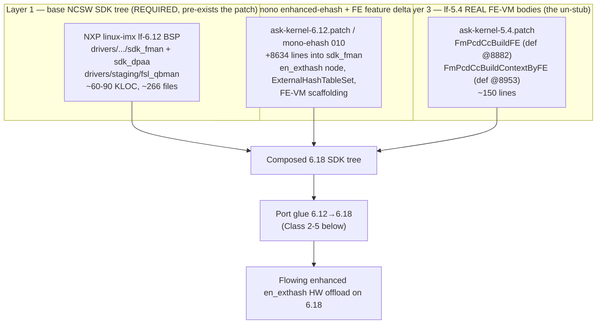
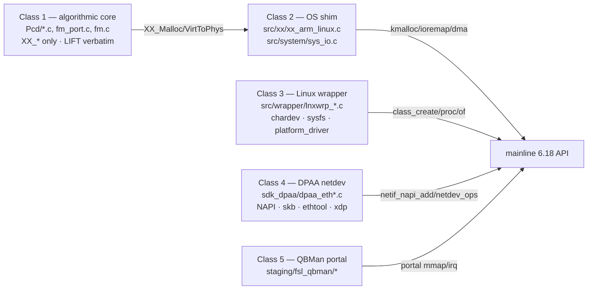

# ASK HW Offload — Vendored SDK Lift to the 6.18 Kernel

**Version 1.1.0 · 2026-06-19 · HADS 1.0.0**

> **Reconciliation note (v1.1.0, 2026-06-19):** §2, §7 (R1), §10 and §12 are
> reconciled against qdrant iter-190 (2026-06-19) and iter-192/gate0144
> (2026-06-20). The headline "back-port the lf-5.4 FE-VM bodies to close the
> gate0143/gate0144 gap" claim is **corrected**: the un-stub is NOT the
> keystone (it is dead code on the enhanced `en_exthash` path, and the genuine
> *working* mono lf-6.12 ASK ships `FmPcdCcBuildContextByFE` stubbed). The
> lift's real value is the coherent SDK PCD chain, not the un-stub. See the
> §2 `[BUG]` reconciliation block.

## AI READING INSTRUCTION

This document is a **file-level scoping analysis** answering one question: *if we
abandon the mainline rewrite and instead lift the genuine vendored NXP SDK FMan/DPAA
stack (the "Path A" the register-domain closure left as the proven-to-flow option),
which files do we take verbatim, which do we port, and what does the 6.12→6.18 jump
actually cost?* It exists because gate0143 + gate0144 (2026-06-19) closed the
register-domain producer-scheme approach: no register-level scheme deposits the key the
enhanced `en_exthash` node reads, so the only remaining way to get genuine selective HW
offload is to run the actual SDK driver that builds the ucode-internal FE working store.

Read `[SPEC]` blocks as verified facts (patch line numbers, line counts, file manifests
— all cross-checked against the local reference trees in `C:\Users\miha\ask-ref\`).
`[NOTE]` blocks carry rationale and decision logic. `[BUG]` blocks are symptom + cause +
fix. `[?]` blocks are unverified and must not be relied on without on-target
confirmation.

**Mission caveat (non-negotiable, read first):** Per `AGENTS.md` and
`specs/ask2-rewrite-spec.md`, lifting the vendored SDK stack **contradicts the sanctioned
ASK2 "Option B" mission** (a clean mainline-DPAA rewrite). This document does **not**
recommend abandoning Option B. It is a decision input — an honest cost/feasibility map of
Path A — so the choice between (A) lift the SDK, (B) finish the mainline rewrite, or (D)
ship AF-XDP and document the boundary, is made with full knowledge. Sections 10–11 frame
that decision explicitly.

Companion references: `analysis/ASK2-VS-NXP-GAP-ANALYSIS.md` (why the register approach
failed), `arch/fman-fe-ehash.md` (the byte-level FE/ehash silicon contract),
`plans/M3-PATH-TO-WORKING.md` (the M3 plan), `plans/DUAL-DATAPLANE.md` (the state
machine). Local source: `C:\Users\miha\ask-ref\{ask-kernel-5.4.patch,
ask-kernel-6.12.patch, nxp-lf54/*, mono-ehash/*}`.

---

## 1. SCOPE — WHAT "LIFT THE SDK" MEANS

**[SPEC]** The genuine NXP ASK datapath is implemented by the **NCSW SDK driver stack**,
a parallel in-tree driver family that was **never upstreamed**:

| Tree | Role | In mainline 6.18? |
|---|---|---|
| `drivers/net/ethernet/freescale/sdk_fman/` | FMan SDK (Pcd/KeyGen/CC/ehash, Port, MAC, MURAM, HC, SP) + Linux wrappers | **No** |
| `drivers/net/ethernet/freescale/sdk_dpaa/` | DPAA netdev layer (eth, SG, ethtool, MAC-API, offline port, CEETM) | **No** |
| `drivers/staging/fsl_qbman/` | USDPAA portals + `qman_high`/`qman_config` | **No** (mainline has `drivers/soc/fsl/qbman`) |
| `include/uapi/linux/fmd/` | FMD ioctl UAPI | **No** |

**[NOTE]** Mainline 6.18 ships the **rewritten, clean** FMan driver at
`drivers/net/ethernet/freescale/{fman,dpaa}/` (`fsl_dpaa_mac` + `fsl_dpa`), which is what
the board boots today for RSS/S0. The SDK stack and the mainline stack are **mutually
exclusive** — both want to bind `1a00000.fman`. "Lifting the SDK" therefore is not an
incremental patch on top of what we have; it **replaces the entire DPAA dataplane** with
the vendored NCSW driver. This is exactly the architecture the ASK2 rewrite set out to
delete (`AGENTS.md`: "the 266-file vendored NXP SDK FMan/QMan/BMan driver overlay … was
deleted on the `ask20` branch").

**[SPEC]** The proven-to-flow ASK datapath uses the **enhanced** external-hash path
(`USE_ENHANCED_EHASH`): Parser → dedicated KeyGen EKFC producer scheme → enhanced
`en_exthash` consumer node → FE opcode VM (HM/NAT + ENQUEUE) → egress TX FQ
(`AGENTS.md` Option-B definition; `arch/fman-fe-ehash.md` §3–§5). The FE opcode VM is the
**terminal-disposition** mechanism (it frees the BMI FIFO allocation on a DATA_FLOW
exit) — it is not optional scale machinery.

---

## 2. THE TWO-LAYER SOURCE MODEL (and why a naive 6.12 lift fails)

**[SPEC]** No single source tree contains a complete, buildable, FE-flowing ASK for a
modern kernel. The complete implementation is a **composition of three sources**:

**[BUG] The mono lf-6.12 patch stubs the FE-VM context builder.**
*Symptom:* a faithful port of mono lf-6.12 ASK to 6.18 would build the `en_exthash` node
and route frames into it, but every frame would dispatch into `FE_ENTER` and then **WAIT
forever** (exactly the iter-37 D9-B on-silicon park: "the FE VM's MUX, after FE_ENTER,
reads its next-FE pointer from a working-store context that is not being populated").
*Cause:* in `ask-kernel-6.12.patch`, **both** FE builders are stubs:
- `FmPcdCcBuildFE` (@line 4857): comment *"Stub - FE building for enhanced external hash
  not implemented"*, empty body (`UNUSED(...)`).
- `FmPcdCcBuildContextByFE` (@line 4865): comment *"Stub implementation - returns success
  without action"*, body is `UNUSED(...); return E_OK;`.

*Fix:* back-port the **real** bodies from `ask-kernel-5.4.patch`:
- `FmPcdCcBuildFE` (def @line 8882) — emits the 28-byte FE opcode struct
  (`FM_PCD_FE_MAX_SIZE/4` words): `feWords[0] = wsOffset | type`; per-type fields for
  HM / ENQ (fqid/pp/sp enables, NIA) / MUX / EXIT (dealloc) / TRANSITION (next-AD-from-WS
  or phys offset), then writes `feSize/4` words via `WRITE_UINT32`.
- `FmPcdCcBuildContextByFE` (def @line 8953) — writes the **per-task FE working store**
  at `offset`: HM → `MemCpy8` the HM table; ENQ → 8 B (`(rspid<<24)|fqid`, `ppid<<16`);
  **MUX → 4 B = phys offset of `h_NextFE` (`XX_VirtToPhys - physicalMuramBase`)**;
  TRANSITION → 4 B = phys offset of `h_NextAD`. The MUX case is precisely the next-FE
  pointer the silicon park proved missing.

**[NOTE]** This is the single most important finding in this document. It means **lf-6.12
alone is not the FE oracle** — it carries the enhanced `en_exthash` *node* infrastructure
(94 `en_exthash` references, `ExternalHashTableSet`, `ExternalHashTableAddKey`) but not
the FE *disposition* engine. lf-5.4 carries the real FE engine but pairs it with the
older non-enhanced `FmPcdExternalHashTableSet` (`#ifndef USE_ENHANCED_EHASH`). The
working composition is **lf-6.12 enhanced node + lf-5.4 FE-VM bodies** — which is exactly
the "combine the mono branches with the original 5.4 code" synthesis. Whether the genuine
mono lf-6.12 product actually flows the *enhanced FE* path, or silently falls back to the
classic `MatchTableSet` exact-match path with the FE stub as dead code, is an open
question (§9, `[?]`).

**[BUG] The FE-VM un-stub does NOT close the gate0143/gate0144 gap (qdrant iter-190,
2026-06-19; iter-192/gate0144, 2026-06-20).**
*Symptom:* the `[BUG]`/`[NOTE]` blocks above present back-porting the lf-5.4
`FmPcdCcBuildFE` / `FmPcdCcBuildContextByFE` bodies as *the* fix for the missing FE
working-store deposit, and frame the lf-6.12 stub as the iter-37 D9-B park's cause.
*Cause:* on-source archaeology of the genuine **working** mono lf-6.12 ASK
(`010-ask-fman-dpaa-ehash.patch` ~L4842) shows `FmPcdCcBuildContextByFE` is **STUBBED
there too** (`UNUSED(...); /* … not implemented */ return E_OK;`) — yet mono ASK
forwards on this board family with it stubbed. Therefore the driver-side FE-context
build is **not** the gate: the 210.10.1 ucode populates the per-task FE working store
itself. On the enhanced `USE_ENHANCED_EHASH` path `FmPcdCcBuildContextByFE` builds the
per-flow *disposition* context (HM/ENQ/MUX/TRANSITION) for the **classic
`#ifndef USE_ENHANCED_EHASH` software path only** — on our path it is **dead code**.
gate0144 (iter-192) then **AIRTIGHT-CLOSED the producer-scheme register domain across
both dispatch paths** (overwrite-in-use *and* spare-slot SP-bind): routing was proven
(spare scheme packet-counter +103, RSS flat) and frames traversed the `en_exthash` node
(`rfrc` +103), yet **zero of 256 single-byte `key[0]` values hit**. The compare-key
deposit is therefore **ucode-internal at NODE-BUILD time** (genuine enhanced
`ExternalHashTableSet`/`AddKey`), dispatch-independent.
*Corrected fix:* the un-stub (R1) is **NOT** the keystone and on its own changes nothing
on the enhanced FE path — it remains worth carrying for fidelity and the classic path,
but must not be relied on to make `en_exthash` flow. The lift's genuine, surviving value
is running the **coherent `FM_PORT_SetPCD → BuildSchemeRegs → CcRootBuild →
ExternalHashTableSet/AddKey` chain end-to-end** under `CONFIG_FSL_SDK_FMAN=y` — the one
mechanism mainline register-pokes provably cannot reproduce (gate0143/gate0144) and the
one the working mono driver actually uses. Whether mono lf-6.12 flows the *enhanced* node
or falls back to the classic `MatchTableSet` path (where the un-stub *is* live) is exactly
§9's open `[?]`, which only Path B (the §10 differential dump) can settle.

---

## 3. FILE INVENTORY — GROUP A: LIFT (vendored, OS-agnostic core)

**[SPEC]** These files are taken **verbatim** from the NXP lf-6.12 BSP + mono ehash
patch + lf-5.4 un-stub. They use only the NCSW `XX_*` OS-abstraction (`XX_Malloc`,
`XX_VirtToPhys`, `WRITE_UINT32`, `MemCpy8`) and are **free of direct mainline kernel
API** — so they port across kernel versions essentially untouched (modulo
`-Werror` warning churn). Line counts are the genuine source (local `nxp-lf54/` +
`mono-ehash/extracted/`); the "+lines" column is the mono ehash feature delta from
`ask-kernel-6.12.patch`.

| File (under `drivers/net/ethernet/freescale/sdk_fman/`) | Genuine LOC | ehash +lines | Role |
|---|---|---|---|
| `Peripherals/FM/Pcd/fm_cc.c` | 6384 | +1883 | CC tree / node build, `FmPcdCcBuild*` |
| `Peripherals/FM/Pcd/fm_ehash.c` | 1827 | +1987 | external hash node + `ExternalHashTableSet/AddKey` |
| `Peripherals/FM/Pcd/fm_kg.c` | 2838 | — | KeyGen scheme build (EKFC producer) |
| `Peripherals/FM/Pcd/fm_pcd.c` | (BSP) | +295 | `AllocFEObjs`, PCD init/MURAM |
| `Peripherals/FM/Pcd/fm_plcr.c` | (BSP) | — | policer |
| `Peripherals/FM/Pcd/fm_manip.c` | (BSP) | — | header-manip (NAT/L2 rewrite) |
| `Peripherals/FM/Port/fm_port.c` | (BSP) | +153 | `FmPortSetFESupport` per-port FE buffer |
| `Peripherals/FM/Port/fman_port.c` | (BSP) | — | port flib |
| `Peripherals/FM/fm.c`, `fm_muram.c` | (BSP) | — | FMan core + MURAM allocator |
| `Peripherals/FM/HC/hc.c`, `SP/fm_sp.c` | (BSP) | — | host-command, storage-profile |
| `Peripherals/FM/MAC/{fm_mac,memac}.c` | (BSP) | — | MAC control |
| `Peripherals/FM/Pcd/fm_cc_dbg.h` | 1277 | +1378 | CC debug decoders |
| `inc/Peripherals/fm_ehash.h` | 1458 | +1595 | ehash types |
| `inc/Peripherals/{fm_pcd_ext,fm_port_ext,fm_ext,...}.h` | (BSP) | +~300 | public API headers |
| `inc/Peripherals/fm_eh_types.h` | 47 | — | FE/ehash enums |

**[SPEC]** Group A also includes the DPAA netdev base and the QBMan portal:

| Tree | Genuine size | Role | Port risk |
|---|---|---|---|
| `sdk_dpaa/dpaa_eth*.c`, `mac-api.c`, `offline_port.c` | ~10 KLOC | netdev/NAPI/ethtool over FMan | **Medium** (NAPI/skb/netdev drift) |
| `drivers/staging/fsl_qbman/*` | ~15 KLOC | USDPAA portals, `qman_high` | **High** (conflicts with mainline qbman) |
| `include/uapi/linux/fmd/*` | small | ioctl ABI | Low (UAPI is stable) |

**[NOTE]** Order-of-magnitude: the algorithmic Pcd core alone (`fm_cc.c` + `fm_ehash.c` +
`fm_kg.c` + `fm_pcd.c` + headers) is ~16 KLOC; the full vendored FMan+DPAA+QBMan stack is
~60–90 KLOC across ~266 files (`AGENTS.md` / `kernel/flavors/ask/README.md` cite the
deleted overlay as 266 files). **This is the bulk of the lift, and it is "free" only in
the sense that it compiles unchanged on the kernel NXP shipped it against (lf-6.12).**

---

## 4. FILE INVENTORY — GROUP B: PORT (the OS boundary, 6.12→6.18)

**[SPEC]** The real engineering work is the thin set of files that translate the NCSW
`XX_*` abstraction and the netdev/portal glue onto mainline kernel APIs. These are the
**porting hotspots** — classified by churn exposure:

**[SPEC]** Port surface by class (files from the `ask-kernel-6.12.patch` manifest):

- **Class 2 — OS shim (2 files):** `src/xx/xx_arm_linux.c`, `src/system/sys_io.c`.
  Translates `XX_Malloc`→`kmalloc`, `XX_VirtToPhys`→`virt_to_phys`/MURAM math,
  `XX_*Spinlock`→mainline locks, IRQ request, `ioremap`. Small, high-leverage.
- **Class 3 — Linux wrapper (~6 files):** `src/wrapper/lnxwrp_fm.c`,
  `lnxwrp_fm_port.c`, `lnxwrp_ioctls_fm.c`, `lnxwrp_sysfs_fm.c` (+192 in ehash patch),
  `lnxwrp_sysfs_fm_port.c`. `platform_driver`/`of_*` probe, chardev `file_operations`,
  sysfs `kobject`/`class_create`. **Highest mainline-churn exposure** (chardev/sysfs/proc
  signatures changed repeatedly across 5.x→6.x).
- **Class 4 — DPAA netdev (~8 files):** `sdk_dpaa/dpaa_eth.c`, `dpaa_eth_sg.c` (+952 in
  ehash patch — the per-frame fast path with ASK hooks), `dpaa_eth_common.c`,
  `dpaa_ethtool.c`, `mac-api.c`, `offline_port.c`, `dpaa_eth_ceetm.c`. NAPI registration,
  `netdev_ops`, `ethtool_ops`, `sk_buff` field access, XDP. **Medium-high churn.**
- **Class 5 — QBMan portal (4 files):** `drivers/staging/fsl_qbman/fsl_usdpaa.c`,
  `qman_high.c`, `qman_config.c`, `Kconfig`. **Architectural conflict:** mainline 6.18 has
  its own `drivers/soc/fsl/qbman`. The build must use **one** QBMan. The SDK stack expects
  the staging USDPAA portals; mixing the two corrupts shared QBMan hardware state
  (cf. RC#31). This is the single thorniest coexistence decision.

**[NOTE]** The decisive cost-saver: **NXP already did the 5.4→6.12 port.** The mono
lf-6.12 patch is the genuine SDK driver already reconciled to a 6.x kernel (138 files,
`Makefile` and `Kconfig` updated). So the work in front of us is **6.12→6.18, ~6 minor
versions**, not 5.4→6.18, ~14 versions. The 5.4 patch (162 files) is needed **only** for
the FE-VM body un-stub (§2) and as a semantic reference, not as the port base.

---

## 5. FILE INVENTORY — GROUP C: AUTHOR/REWRITE (board + wiring)

**[SPEC]** These are neither lifted nor ported — they are board-specific and must be
authored for the Mono Gateway:

- **DTS:** the board needs the **SDK-format** FMan node (`mono-gateway-dk-sdk.dts` per the
  deleted ASK 1.x lineage). The SDK `fm_port_driver` match table only matches
  `fsl,fman-port-{1g,10g}-{rx,tx}` (not mainline's generic `fsl,fman-v3-port-*`) — all 16
  RX/TX port nodes must be overridden, or every `fsl_mac` probe fails `-22`
  (`AGENTS.md` "SDK FMan port compatible strings"). The lf-5.4 patch ships
  `fsl-ls1046a*.dts` references but for the NXP RDB, not this board.
- **Kconfig / build switch:** `CONFIG_FSL_SDK_FMAN=y` + `CONFIG_FSL_SDK_DPAA_ETH=y` +
  staging USDPAA **on**, and mainline `CONFIG_FSL_FMAN=n` + `CONFIG_FSL_DPAA_ETH=n`
  **off** (§8).
- **CI wiring:** `bin/ci-setup-kernel.sh` would stage the entire SDK tree (vs today's
  per-patch `cp`), and the board patch series 0086–0144 (mainline-DPAA PCD work) becomes
  **dead** and must be removed.
- **Userspace:** the enhanced path needs a producer/orchestrator (genuine ASK used
  `fmc`/`dpa_app` reading `cdx_pcd.xml` via `/dev/fm*`). Either resurrect the SDK
  userspace or author the ASK2 `ask-load` against the SDK chardevs.

---

## 6. THE DRIVER MUTUAL-EXCLUSION (the build cannot run both stacks)

**[BUG] SDK and mainline DPAA cannot coexist.**
*Symptom:* with both compiled in, FMan probe is nondeterministic — two drivers race to
bind `1a00000.fman` and the QBMan portals.
*Cause:* the SDK `fsl_fman`/`sdk_dpaa` and mainline `fsl-fman`/`fsl_dpa` are independent
implementations of the same hardware; mainline also has `drivers/soc/fsl/qbman` while the
SDK uses `drivers/staging/fsl_qbman`. They share BMan pools and QMan FQs globally (the
RC#31 lesson: QBMan init is system-wide).
*Fix:* a hard build-time switch. ASK-on-6.18 = **SDK stack only**:

| Symbol | Mainline/RSS build (today) | SDK-lift build |
|---|---|---|
| `CONFIG_FSL_FMAN` | y | **n** |
| `CONFIG_FSL_DPAA_ETH` | y | **n** |
| `CONFIG_FSL_SDK_FMAN` | (absent) | **y** |
| `CONFIG_FSL_SDK_DPAA_ETH` | (absent) | **y** |
| `drivers/staging/fsl_qbman` | (unused) | **y** |
| `drivers/soc/fsl/qbman` | y | conflict — must be reconciled |

**[NOTE]** This is the cliff. The single-image dual-dataplane model (`plans/DUAL-DATAPLANE.md`)
assumes mainline DPAA is always present (S0/RSS is the boot state, VPP is an AF_XDP
overlay on S0). Lifting the SDK breaks that premise: there is no mainline DPAA to fall
back to, so **S0/RSS, the AF_XDP/VPP overlay, and every board patch 0086–0144 would have
to be re-implemented on the SDK stack or dropped.** A SDK-lift image is effectively a
*different product* from the current single image — not a runtime mode of it.

---

## 7. EFFORT & RISK REGISTER

**[SPEC]** Added-line tally from `ask-kernel-6.12.patch` (the feature delta we inherit
on top of the base BSP tree):

| Subsystem | +lines | Disposition |
|---|---|---|
| `sdk_fman` (ehash/FE/CC) | 8634 | lift + un-stub (§2) |
| `net/*` ASK accel hooks | 3011 | port, **high patch-rot** (mainline files) |
| `sdk_dpaa` | 1243 | port (Class 4) |
| `include/*` hooks | 308 | port |
| `fsl_qbman` | 116 | port (Class 5) |
| `include/uapi/linux/fmd` | 67 | lift |
| ppp/usb/caam | 63 | port (optional features) |

**[SPEC]** Risk register:

| # | Risk | Severity | Note |
|---|---|---|---|
| R1 | FE-VM stub in lf-6.12 | **Re-scoped — NOT the gate** | un-stub is dead code on the enhanced `en_exthash` path; mono lf-6.12 works WITH it stubbed (§2 `[BUG]`, qdrant iter-190). Carry for fidelity/classic path; does NOT close gate0143/gate0144. The FE deposit is ucode-internal at node-build time |
| R2 | SDK↔mainline DPAA mutual exclusion | **Critical** | abandons S0/RSS + AF_XDP/VPP overlay (§6); a different product |
| R3 | QBMan staging vs `soc/fsl/qbman` | **Critical** | RC#31-class global state conflict; pick one |
| R4 | Class 3/4 mainline API churn 6.12→6.18 | High | chardev/sysfs/NAPI/skb signatures; assessable only on a 6.18 build `[?]` |
| R5 | MURAM exhaustion via `cdx_pcd.xml` over-provisioning | High | 16×512-key + byteframe stats + 18 external tables → 384 KiB MURAM wall (`dpa_app rc=65280`); must trim to bounded tables (`arch/fman-fe-ehash.md`, qdrant M0) |
| R6 | `net/*` accel hooks rot | Medium | 3011 lines into bridge/xfrm/conntrack/key; OPTIONAL for core M3 — defer to M5+ |
| R7 | DTS SDK-format port nodes | Medium | all 16 RX/TX nodes overridden or `-22` probe fail |
| R8 | OOT-module signing / `MODULE_SIG_FORCE` | Low | `=y` built-in avoids it; or sign with kernel key |
| R9 | Userspace producer (`fmc`/`dpa_app` or `ask-load`) | High | enhanced path needs an EKFC-scheme orchestrator over `/dev/fm*` |

**[NOTE]** Rough order of work: Group A lift is mechanical (~60–90 KLOC moved, days);
Group B port is the real cost (Class 2–5, weeks of 6.18-API reconciliation + on-board
bring-up); R2/R3/R6 are *decisions*, not just code. The FE un-stub (R1) is small but, per the §2
`[BUG]` reconciliation, is **not load-bearing on the enhanced path** — it does not by
itself make `en_exthash` flow. The hard part is not the FMan algorithmic core — it is re-grounding the
entire DPAA dataplane (netdev, QBMan, AF_XDP, the 0086–0144 board work) on the SDK stack.

---

## 8. CONTRAST — PATH A (SDK LIFT) vs OPTION B (MAINLINE REWRITE)

**[SPEC]** The sanctioned Option-B footprint (`AGENTS.md`, `kernel/flavors/ask/README.md`,
`specs/ask2-rewrite-spec.md`):

| Component | LOC | Sits on |
|---|---|---|
| `ask.ko` (in-tree, `drivers/.../dpaa/ask/`) | ~2800 | mainline DPAA |
| `0004-fman-pcd-subsystem.patch` | ~5500 | mainline `fman/` |
| `oot-modules/ask_bridge` | ~400 | mainline bridge |
| `200-ask2-hooks.patch` | ~1500 | mainline net/ |
| userspace `askd`/`ask-load`/`libask_fci` | ~8000 | chardev/genl |

**[SPEC]** Decision matrix:

| Dimension | Path A — SDK lift | Option B — mainline rewrite |
|---|---|---|
| Net new code | ~150 (un-stub) + port glue | ~14 KLOC authored |
| Vendored code | ~60–90 KLOC verbatim | 0 |
| Proven to flow FE path | **Yes** (genuine NXP datapath) | Not yet (M3 open) |
| Keeps S0/RSS + AF_XDP/VPP overlay | **No** (R2) | Yes |
| Single-image dual-dataplane model | Breaks | Preserved |
| Patch-rot surface | Low (SDK is self-contained dirs) + high (net/ hooks) | Medium (board patches on mainline) |
| Mission alignment (`AGENTS.md`) | **Contradicts Option B** | Sanctioned |
| Upstreamable | No (NXP NCSW, never upstreamed) | Partially (`caam-qi-share`, etc.) |

**[NOTE]** The honest trade: Path A buys a **known-working FE datapath** at the cost of
**reverting the entire mainline-DPAA modernization** (S0/RSS, AF_XDP/VPP, the 0086–0144
board work, the single-image model) and adopting a 266-file vendored stack the project
explicitly deleted. Option B keeps the modern architecture but still owes the one piece
Path A already has: a working FE working-store deposit. A **hybrid** (§10) is the
interesting middle.

---

## 9. OPEN QUESTIONS (verify before committing to Path A)

**[?]** Does the genuine mono **lf-6.12** product actually flow the *enhanced* FE
`en_exthash` path, or does it run the classic `#ifndef USE_ENHANCED_EHASH`
`MatchTableSet` exact-match path with the FE builder stub as dead code? If the latter,
lf-6.12 is **not** a runtime proof of the enhanced FE datapath and only lf-5.4 (+ its
real FE bodies) is — which raises the bar on R1's "fully specified" claim. *Resolve by:
running the lf-6.12 ASK on its reference board (or our board via the Path-B RAM dev-loop)
and dumping whether the active node is `en_exthash` (enhanced) or a CONT_LOOKUP match
table (classic).*

**[?]** Can the base NXP lf-6.12 `sdk_fman`/`sdk_dpaa`/`fsl_qbman` tree be obtained
cleanly from `nxp-imx/linux-imx` lf-6.12 and does it build against our 6.18 config without
the mainline DPAA, or are there cross-tree mainline dependencies (e.g. `soc/fsl/qbman`
headers) that force a deeper reconciliation? *Resolve by: a throwaway 6.18 compile of the
staged SDK tree with mainline DPAA disabled.*

**[?]** Does the enhanced en_exthash producer require the SDK **userspace** (`fmc` +
`dpa_app` reading `cdx_pcd.xml`) or can the EKFC scheme be programmed from kernel/debugfs?
The deleted userspace needed `/dev/fm*`; the SDK wrapper exposes those, so resurrecting
`dpa_app` is plausible, but the MURAM-exhaustion wall (R5) means `cdx_pcd.xml` must be
trimmed first. *Resolve by: §G vendor-kgall capture lessons in qdrant + a minimal
single-table `cdx_pcd.xml`.*

---

## 10. RECOMMENDATION — A BOUNDED HYBRID, NOT A FULL LIFT

**[NOTE]** A full Path-A lift (replace the whole dataplane) is disproportionate to the
gap. The register-domain closure (gate0143/gate0144) proved the *only* missing piece is
the **ucode-internal FE working-store deposit**. **Correction (qdrant iter-190/192):** that
deposit is built *inside the 210.10.1 ucode at `en_exthash` node-build time*, **not** by the
driver's `FmPcdCcBuildContextByFE` — which is **stubbed in the genuine working mono lf-6.12
ASK** and is dead code on the enhanced path (§2 `[BUG]`). So the earlier framing here ("the
missing piece is the builder `FmPcdCcBuildContextByFE`, just lift it") is **wrong**: lifting
that builder does not reach the ucode-internal store. Everything else in our mainline-DPAA
substrate (KeyGen scheme programming, CC/ehash node install, MURAM allocator, per-port FE
buffer) we already re-implemented in board patches 0097–0144. **The cheapest path to a
working FE datapath is therefore neither "lift 266 files" nor "lift the FE-VM builder" — it
is first to OBSERVE, via the Path-B differential dump, whether the deposit is reachable from
any driver code at all.**

**[SPEC]** Recommended sequencing (lowest-risk first):

1. **Path-B differential dump (diagnosis, non-destructive):** boot the genuine ASK via the
   TFTP/RAM dev-loop, dump the engaged port's IC + KeyGen scheme + `en_exthash` node + FE
   working store via `/dev/mem`, diff vs our armed-but-missing eth3. This **observes** the
   exact working-store offset/format the ucode reads — settling §9's `[?]` and confirming
   the lf-5.4 `FmPcdCcBuildContextByFE` MUX/TRANSITION layout on *this* silicon.
2. **Lift the FE-VM builder only (bounded hybrid):** port the lf-5.4 `FmPcdCcBuildFE` +
   `FmPcdCcBuildContextByFE` semantics (~150 LOC of pure register/MURAM math, `XX_*`-free
   once translated) into a board patch on our mainline driver, populating the working
   store the dump in step 1 identified. **Caveat (iter-190/192):** this step is now
   *contingent on step 1's result* — if the dump confirms the deposit is ucode-internal
   (built by the `en_exthash` node-build the harness never invokes), then porting the
   builder cannot reproduce it and this step is **dead**, exactly as the register domain
   proved. Only pursue step 2 if step 1 shows a driver-writable working-store offset. If
   viable, it keeps the entire mainline-DPAA architecture (R2/R3/R6 avoided) and stays in
   the Option-B mission.
3. **Full SDK lift only if step 2 is infeasible** — i.e. only if the FE deposit turns out
   to be inseparable from SDK-private state the mainline driver cannot reproduce. That is
   the contingency this whole document scopes; sections 3–8 are the map for it.

**[NOTE]** Step 1 (the differential dump) is now the load-bearing action: it is the only
thing that can confirm whether *any* driver code can reach the FE working-store deposit, or
whether it is ucode-internal and unreachable (in which case selective `en_exthash` HW
offload is a documented silicon limit — option D). Step 2 is the smallest *contingent*
follow-on if step 1 finds a writable offset; it stays inside the Option-B mission and is
gated by step 1 so we never graft a guessed offset. A full lift (§3–§6) remains the
documented fallback, not the default — and per the §2 `[BUG]` reconciliation its surviving
rationale is the **coherent SDK PCD chain**, not the FE-VM un-stub.

---

## 11. DECISION GATE

**[SPEC]** Before any Path-A code lands, the user must choose among:

- **(A) Full SDK lift** — replace the dataplane with the vendored NCSW stack. Accept R2
  (lose S0/RSS + AF_XDP/VPP), R3 (QBMan reconciliation), the 266-file overlay, and the
  mission deviation. Proven FE datapath.
- **(Hybrid)** — Path-B dump + lift only the FE-VM builder onto mainline DPAA (§10).
  Stays in-mission; smallest surface; gated by observation. **Recommended.**
- **(B) Continue the mainline rewrite** — author the FE deposit from first principles per
  `specs/ask2-rewrite-spec.md`. Already the sanctioned mission; this document's step-2 is
  effectively a head-start on it.
- **(D) Ship AF-XDP, document the boundary** — accept ~3.5 Gbps and record ASK2 selective
  HW offload as a research limit. No lift.

**[NOTE]** This document does not pick for the user. It establishes that a full lift is
**possible and mapped** (§3–§8) but **disproportionate** (§10), and that the
register-domain closure points at a **bounded hybrid** that gets the same FE datapath for
~150 LOC inside the existing architecture. Pending the user's decision and the Path-B
feasibility gate.

---

## 12. CROSS-REFERENCES

**[SPEC]**
- `analysis/ASK2-VS-NXP-GAP-ANALYSIS.md` — why the register-domain producer approach
  failed (gate0143/gate0144); the cdx_pcd.xml producer decode.
- `arch/fman-fe-ehash.md` — the byte-level FE/ehash MURAM init contract (`AllocFEObjs`,
  `FmPortSetFESupport`, `ExternalHashTableSet`, params-page +0x54/+0x58).
- `arch/fman-210-ucode-disasm.md` — the 210.10.1 ucode FE-handler white-box.
- `plans/M3-PATH-TO-WORKING.md` — the M3 plan; Risk #1 (FE working-store deposit).
- `plans/DUAL-DATAPLANE.md` — S0/S1/S2 state machine the full lift would break (§6).
- `specs/ask2-rewrite-spec.md` — the Option-B mainline-rewrite mission.
- `kernel/flavors/ask/README.md` — the deleted ASK 1.x overlay (266 files) this lift would
  partially resurrect.
- Local source: `C:\Users\miha\ask-ref\ask-kernel-5.4.patch` (real FE bodies @8882/8953),
  `ask-kernel-6.12.patch` (stubs @4857/4865; 138-file manifest), `nxp-lf54/*`,
  `mono-ehash/extracted/*`.
- qdrant anchors: `M0 vendor oracle … arch/fman-fe-ehash.md` (2026-06-16);
  `ASK2-M3-source-path-EXHAUSTED-deposit-is-port-IC-or-ucode-internal` (2026-06-18);
  `ASK2-M3-gate0144-G1G4-spare-slot-SP-bind-register-domain-AIRTIGHT-CLOSED` (iter-192,
  2026-06-20 — register domain closed across both dispatch paths; deposit is
  ucode-internal at node-build time);
  `ASK2-M3-mono-stub-FmPcdCcBuildContextByFE-confirms-ucode-internal-deposit` (iter-190,
  2026-06-19 — the genuine working mono lf-6.12 ASK ships the builder STUBBED, so the
  un-stub is not the gate; basis for the §2 `[BUG]` reconciliation).
