# FMan 210.10.1 Microcode Architecture & Developer Reference Manual

**Version 3.1.0 · 2026-09-05 · Production Reference Specification**

**Target Platform:** NXP QorIQ LS1046A / LS1043A Frame Manager v3 (DPAA1)
**Firmware Image:** Proprietary QEF Container `fman-ucode-210.10.1.bin` (51,652 bytes, SHA-256 `5f3ed8d3...`)

---

## Front Matter

### Document Purpose & Target Audience

This manual is an in-depth, authoritative architectural guide to the internal execution, processor core, memory windows, dispatch vectors, and algorithmic subsystems of the NXP Frame Manager v3 (FMan) controller microcode version **210.10.1**.

While host-side documentation such as [`arch/fman-microcode-210-programming-reference.md`](file:///mnt/builds/vyos-ls1046a-build/arch/fman-microcode-210-programming-reference.md) documents the registers, MURAM structures, and configuration tables exposed to the Linux kernel driver, this guide explains what happens **inside the controller** once those tables are loaded and live frames hit the wire. It is written for software engineers, kernel developers, and network architects working on the DPAA1 dataplane, high-throughput flow offloading (ASK2), and hardware acceleration.

### Specification Scope & Verification

This manual documents the production 210.10.1 microcode image deployed on NXP Layerscape LS1046A / LS1043A processors.

The microcode image contains **12,851 32-bit execution words** (51,404 bytes) executing on the 700 MHz Harvard RISC controller core. The instruction set conforms to the 201-instruction controller RISC architecture ([fman-instruction-table.html](file:///mnt/builds/vyos-ls1046a-build/arch/fman-instruction-table.html)), where word `w1` encodes the packed BCD version constant `0x00d20a01` (`210.10.1`). 100% of executable instruction words are mapped with verified opcodes, mnemonics, operand decoding, and control-flow semantics.

#### 100% Decompilation & Full Verification Metrics

- **Word Coverage**: **12,851 / 12,851 words (100.00%)** enclosed within defined function bodies.
- **Function Inventory**: **736 defined functions** across all 24 vector islands.
- **Decompiler Completion**: **736 / 736 (100.00%)** clean decompiler AST completions via Ghidra 11.3.2 with zero failures, timeouts, or syntax errors.
- **Reconstructed C Output**: **111,680 lines of clean C** generated and saved.
- **Algorithmic C Reconstruction Suite**: All 9 functional subsystems are modeled in high-level C in [`decomp/out/`](file:///mnt/builds/vyos-ls1046a-build/decomp/out/):
  1. [`01-cc-match-walker.c`](file:///mnt/builds/vyos-ls1046a-build/decomp/out/01-cc-match-walker.c): Custom Classifier & ehash DMA fetch engine, Action Descriptor dispatch, and `keycmp.run` hardware unit.
  2. [`02-fe-vm-action-interpreter.c`](file:///mnt/builds/vyos-ls1046a-build/decomp/out/02-fe-vm-action-interpreter.c): FE-VM opcode interpreter loop (`w8628`–`w10262`), fused NAT, and checksum maintenance.
  3. [`03-keygen-host-command.c`](file:///mnt/builds/vyos-ls1046a-build/decomp/out/03-keygen-host-command.c): Atomic host command protocol via `FMKG_AR`, scheme programming, and classification plans.
  4. [`04-policer-state-machine.c`](file:///mnt/builds/vyos-ls1046a-build/decomp/out/04-policer-state-machine.c): Two-rate three-color marker (srTCM/trTCM), RFC 2697/2698 rate math, and packet color classification (`w585`–`w640`).
  5. [`05-parser-error-and-bmi.c`](file:///mnt/builds/vyos-ls1046a-build/decomp/out/05-parser-error-and-bmi.c): Gross error trap handlers (`w12133`–`w12850`), L2/L3/L4 parse error decoding, and frame epilogue.
  6. [`06-ip-frag-reasm.c`](file:///mnt/builds/vyos-ls1046a-build/decomp/out/06-ip-frag-reasm.c): IP fragmentation and reassembly engines (`ipf`/`ipr`, `w534`–`w584`, `w11911`).
  7. [`07-frame-replicator.c`](file:///mnt/builds/vyos-ls1046a-build/decomp/out/07-frame-replicator.c): Multicast and broadcast frame replication engine (`fr`, `w406`–`w510`).
  8. [`08-bmi-fifo-management.c`](file:///mnt/builds/vyos-ls1046a-build/decomp/out/08-bmi-fifo-management.c): BMI internal FIFO management, storage profile binding, and BMan pool acquisition (`w2432`–`w2620`).
  9. [`09-hwk-sec-crypto.c`](file:///mnt/builds/vyos-ls1046a-build/decomp/out/09-hwk-sec-crypto.c): Hardware key generation and SEC engine crypto handoff (`w2628`–`w2830`).
- **Indirect Branch & Dispatch Census**:
  - 56 computed branches (`2c3f`): 29 target `r30/*LR*/` (`0xf000` link/continuation), 19 target `r0` (`0x0000` opcode trampoline), 4 target `r2` (`0x1000`), 2 target `r4` (`0x2000`), 2 target `r9` (`0x4800`).
  - 33 task redispatches (`283f` to `0xf800` FM_CTL status window).

---

## Chapter 1 — FMan Controller Core & Datapath Architecture

### 1.1 The FMan Processing Pipeline

The NXP LS1046A Frame Manager (FMan) is the network acceleration engine of the Layerscape processor. Rather than relying on CPU cores to handle per-packet parsing, classification, and queueing, FMan processes network traffic through a pipeline of cooperating hardware engines linked by a high-speed RISC microcontroller.

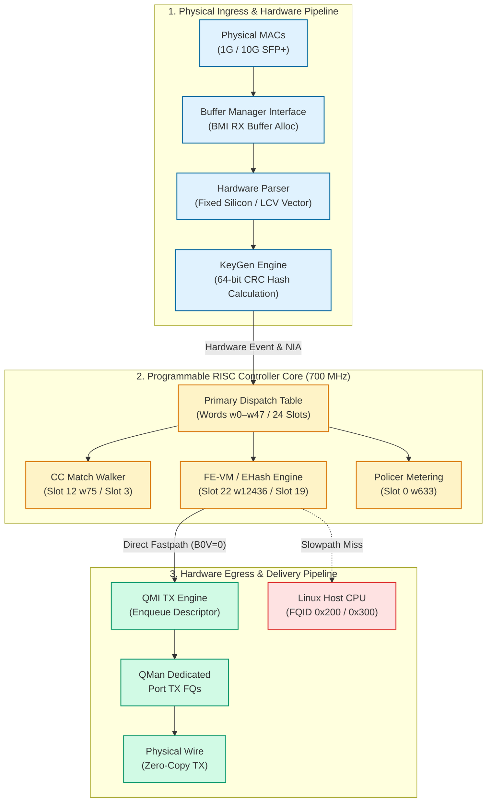

When a frame arrives at an Ethernet port:
1. **BMI (Buffer Manager Interface)**: Acquires a hardware buffer from a BMan pool (e.g. `bpid 7` or `bpid 8`), DMA-transfers the frame from the MAC FIFO, and initializes the frame annotation area.
2. **Hardware Parser**: Scans packet headers up to Layer 4 (Ethernet, 802.1Q VLAN, PPPoE, IPv4/IPv6, TCP/UDP/GRE/SCTP) in hardware silicon. It writes a structured 32-byte Parse Result array into the Internal Context and asserts line-up confirmation flags (LCV).
3. **KeyGen (Key Generator)**: Evaluates active schemes against the frame's parser results, hashes extracted fields via an internal CRC-64 engine, and generates a Next Interface Action (NIA) word.
4. **FMan RISC Controller**: KeyGen invokes the programmable controller core via the Primary Dispatch Table. The microcode executes the required routing, classification tree walks, external hash lookups, header modifications, or policing algorithms.
5. **QMI (Queue Manager Interface)**: Upon decision completion, the microcode writes an Enqueue Descriptor targeting a designated Frame Queue ID (FQID) in QMan, pushing the frame directly to wire transmission or into the host Linux networking stack.

---

### 1.2 Processor Architecture & Execution Core

The controller core is a proprietary 32-bit Harvard RISC processor operating at 700 MHz on the LS1046A.

Key architectural features include:
- **Word-Addressed Code Space**: Instruction $w$ resides at byte address $4 \cdot w$. Branch targets, jump tables, and vector addresses are tracked as word indices.
- **Register File**: 32 32-bit general-purpose registers (`r0`–`r31`). Four registers have dedicated architectural roles:
  - `r26` (`IC`): Base pointer to the 256-byte Internal Context block at fixed address `0xd000`.
  - `r28` (`FRAME`): Window base pointer to the live frame buffer, allowing inline header rewrites.
  - `r30` (`LR`): Subroutine Link Register (populated by `call`, consumed by `ret`).
  - `r31` (`COND`): Condition, predicate, and pipeline status register.
- **Branch Delay Slots**: Branch and jump instructions (`xfer14.comp`, `jmptbl.comp.r3`, `cbrz14.comp`) have an architectural branch delay slot (`execute(pc + 1)`). The instruction immediately following a jump always executes before control transfers.
- **Hardware Cooperative Multitasking**: The processor core tracks up to 16 concurrent frame-processing tasks via hardware Task Numbers (`tnum`). Multitasking instructions (`task.boundary`, `task.redispatch`, `wait.cont`) allow tasks waiting on DMA or MURAM semaphores to yield the ALU to another task, achieving wire-rate concurrency without preemption overhead.

---

## Chapter 2 — Memory Architecture & Addressing Windows

The controller does not operate in a flat memory space. It accesses state across four distinct physical memory windows using specialized memory instruction classes (`memw.read`/`memw.write`, `memd.read`, `memb.read`, and `ld.sm`/`st.sm` for hardware semaphores).

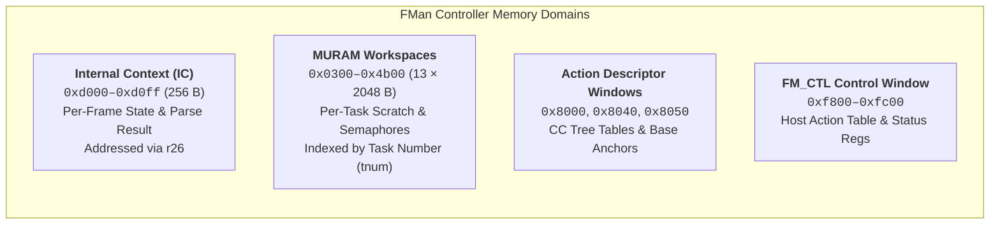

### 2.1 Internal Context (IC) Layout — `0xd000`–`0xd0ff`

Every frame in flight through the controller has an assigned 256-byte Internal Context block anchored at `0xd000`. It contains the complete per-frame state machine data, parser results, extracted classification keys, and destination descriptors.

| Byte Offset | Field Name | Size | Architectural Function |
|---|---|---|---|
| `+0x00` | `IC_FD_STATUS` | 4 B | Frame Descriptor status/command flags (error bits, dropped flags). |
| `+0x04` | `IC_FD_LENGTH` | 4 B | Total frame length in bytes (adjusted dynamically by VLAN push/pop). |
| `+0x08` | `IC_AD_BASE` | 4 B | Action Descriptor base pointer in MURAM. |
| `+0x0C` | `IC_FLOW_HASH` | 4 B | KeyGen hash / parser classification state. |
| `+0x10` | `IC_ICAD_OP_MODE` | 4 B | Internal Context Action Descriptor operational mode. |
| `+0x18` | `IC_CCBASE` | 4 B | Custom Classifier root node address; starting point for CC tree walks. |
| `+0x1C` | `IC_KS_HPNIA` | 4 B | Key size configuration and High-Priority Next Interface Action. |
| `+0x20`–`0x3F` | `IC_PARSE_RESULT` | 32 B | Hardware Parse Result block written by the hard parser silicon. |
| `+0x40` | `IC_TIMESTAMP` | 8 B | 64-bit frame arrival timestamp; input to Policer rate-limiting. |
| `+0x48` | `IC_KG_HASH` | 8 B | KeyGen raw 64-bit hardware CRC calculation result. |
| `+0x50`–`0x87` | `IC_KG_KEY` | 56 B | Extracted classification key buffer (supports keys up to 56 bytes). |
| `+0xB8` | `IC_MGMT_INDEX` | 4 B | Per-task management index; backing store for FE-VM resource tracking. |
| `+0xC0` | `IC_TASK_FLAGS` | 4 B | Internal multitasking scheduler flags. |
| `+0xC4` | `IC_CURRENT_NIA` | 4 B | Current Next Interface Action word; defines the next execution stage. |
| `+0xD4` | `IC_ENQ_SCRATCH` | 16 B | Staging scratchpad for QMI hardware Enqueue Descriptors. |

#### Structured Hardware Parse Result (`0xd020`–`0xd03f`)

The 32-byte Parse Result sub-record is the sole representation of parsed protocol headers available to microcode:

| Sub-Offset | Field | Description |
|---|---|---|
| `+0x20` | `lpid, shimr` | Logical Port ID and Shim header detection flags. |
| `+0x22` | `l2r` | Layer 2 Result vector (Ethernet, 802.1Q, 802.1ad, SNAP, LLC). |
| `+0x24` | `l3r` | Layer 3 Result vector (IPv4, IPv6, ARP, IP options, fragmented). |
| `+0x26` | `l4r` | Layer 4 Result vector (TCP, UDP, ICMP, IGMP, SCTP, GRE). |
| `+0x28` | `cplan, nxthdr` | Classification Plan ID and Next Header protocol byte. |
| `+0x2A` | `cksum` | Hardware gross frame checksum accumulator. |
| `+0x2C` | `flags_frag_off` | IP fragmentation offset and control flags. |
| `+0x30`–`0x3F` | `header_offsets[16]` | Array of 16 1-byte offsets pointing to: Shim, IP-PID, Ethernet, LLC/SNAP, VLAN1, VLAN2, EtherType, PPPoE, MPLS1, MPLS2, IP1, IP2, GRE, L4, NextHeader. `0xFF` indicates header not present. |

---

### 2.2 MURAM Per-Task Workspace Architecture

Multi-port RAM (MURAM) provides on-chip, low-latency shared storage. The microcode partitions a region of MURAM (`0x0300`–`0x4b00`) into **13 dedicated per-task workspaces** of 2048 bytes (`0x800`) each, indexed by Task Number ($n \in [0..12]$):

$$\text{Task Workspace Base} = 0x0300 + n \cdot 0x0800$$

Key workspace structures:
- `+0x000`–`0x4FF`: Task-local computation scratchpad and register spill area.
- `+0x500`–`0x548`: Uniform per-task hardware semaphore block (`ld.sm`/`st.sm`/`retry.sm`). Prevents race conditions when multiple tasks access shared classification tables.
- `0x18D4`: L2 Header Replacement Scratchpad. Dedicated buffer where the FE-VM `INSERT_L2_HDR` opcode builds the rebuilt Ethernet header before writing it to the frame.
- `0x9104`: Global Management Index Pool. Backing storage for the per-task management index at `IC[0xd0b8]` (contains $5 + \text{tnums} = 21$ resource slots on LS1046A).

---

## Chapter 3 — Primary Dispatch Table & Hardware Vectoring

All execution inside the FMan controller is event-driven. When an external hardware engine (BMI, Parser, KeyGen, Host Command, or QMI) requires controller action, it branches into the **Primary Dispatch Table** occupying code words `w0`–`w47` (the first 192 bytes of controller IRAM).

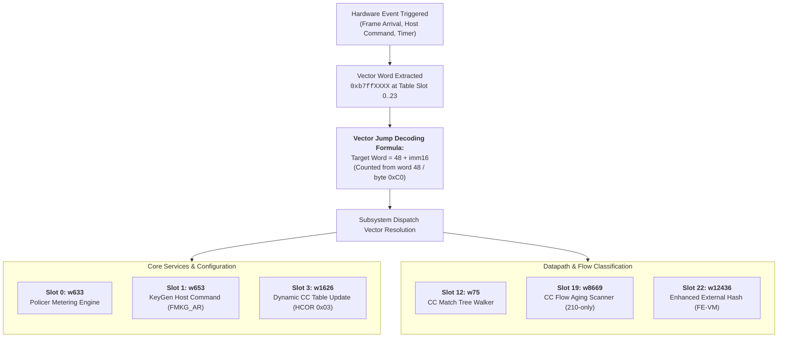

### 3.1 Vector Addressing Formula

Each populated dispatch slot consists of an 8-byte entry: a vector instruction word of the form `0xb7ffXXXX` followed by a `0xffffffff` pad word. The target instruction word is calculated using a word offset relative to the end of the dispatch table:

$$\text{Target Instruction Word} = 48 + (\text{Vector Word} \ \& \ \text{0xFFFF})$$

$$\text{Byte Address} = 4 \cdot \text{Target Instruction Word}$$

*Example (Slot 12 — Custom Classifier Root):*
- Vector Word: `w24` = `0xb7ff001b`
- `imm16` = `0x001b` = 27 decimal
- Target Word = $48 + 27 = 75$ (`w75`)
- Target Byte Address = $75 \cdot 4 = \text{0x012C}$

---

### 3.2 Complete 24-Slot Dispatch Matrix & Subsystem Mapping

The 24 dispatch slots map directly to functional subsystems:

| Slot | Vector Word | Target Word | Handler Symbol | Subsystem | Description & Behavioral Role |
|:---:|:---:|:---:|:---|:---|:---|
| **0** | `w0 = 0xb7ff0249` | **w633** | `policer_dispatch` | Policer (§4.4) | Evaluates RFC 2697/2698 token buckets for traffic policing. |
| **1** | `w2 = 0xb7ff025d` | **w653** | `hc_keygen_dispatch` | KeyGen HC (§4.3) | Programs KeyGen scheme registers atomically via `FMKG_AR`. |
| **2** | `w4 = 0xb7ff025b` | **w651** | `sync_prs_dispatch` | Parser Sync | Synchronizes hardware parser state machine with controller. |
| **3** | `w6 = 0xb7ff062a` | **w1626** | `hc_cc_update_dispatch` | CC Match Engine (§4.1) | Dynamic host update of CC match tree nodes (HCOR `0x03`). |
| **4** | `w8 = 0xb7ff0a14` | **w2628** | `hwk_dispatch` | HWK Engine | KeyGen hardware extraction and coprocessor handoff. |
| **5** | `w10 = 0xb7ff0950` | **w2432** | `bmi_dispatch` | BMI Port Task | Frame allocation, buffer setup, and BMI port task intake. |
| **6** | `w12 = 0xb7ff217e` | **w8622** | `qmi_enq_dispatch` | QMI Enqueue | Handles QMI frame enqueue staging and backpressure. |
| **7** | `w14 = 0xb7ff2f5c` | **w12172** | `qmi_deq_dispatch` | QMI Dequeue | Handles frame retrieval from QMan queues to FMan. |
| **8** | `w16 = 0xb7ff0020` | **w80** | `fm_ctl_a_dispatch` | Controller Core | Primary foundational controller initialization and dispatch. |
| **9** | `w18 = 0xb7ff00b3` | **w227** | `fm_ctl_b_dispatch` | Controller Core | Secondary controller initialization and context handling. |
| **10** | `w20 = 0xffffffff` | — | *(unused)* | Reserved | Unpopulated slot on 210.10.1. |
| **11** | `w22 = 0xb7ff0166` | **w406** | `fr_dispatch` | Frame Replicator | Multicast/broadcast frame replication and cloning engine. |
| **12** | `w24 = 0xb7ff001b` | **w75** | `cc_dispatch` | CC Match Engine (§4.1) | Primary Custom Classifier tree match walker. |
| **13** | `w26 = 0xb7ff0219` | **w585** | `fm_ctl_action_13` | Controller Core | Action code 13 handler. |
| **14** | `w28 = 0xffffffff` | — | *(unused)* | Reserved | Unpopulated slot on 210.10.1. |
| **15** | `w30 = 0xb7ff0217` | **w583** | `fm_ctl_action_15` | Controller Core | Action code 15 handler. |
| **16** | `w32 = 0xb7ff0217` | **w583** | `ipr_timeout_dispatch` | IP Reassembly | IP packet fragment reassembly timeout handler (HCOR `0x10`). |
| **17** | `w34 = 0xb7ff01e6` | **w534** | `ipf_dispatch` | IP Fragmentation | IP packet fragmentation host command handler (HCOR `0x11`). |
| **18** | `w36 = 0xb7ff0256` | **w646** | `slot18_dispatch` | Controller Core | Internal controller task coordination handler. |
| **19** | `w38 = 0xb7ff21ad` | **w8669** | `hc_cc_aging_dispatch` | CC Aging Engine | **210-Only:** Autonomous hardware flow aging and table sweep. |
| **20** | `w40 = 0xb7ff025c` | **w652** | `slot20_dispatch` | Controller Core | Task handoff coordination handler. |
| **21** | `w42 = 0xb7ff025c` | **w652** | `slot21_dispatch` | Controller Core | Task handoff coordination handler. |
| **22** | `w44 = 0xb7ff3064` | **w12436** | `ehash_dispatch` | External Hash Engine (§4.2) | Enhanced External Hash flow lookup and FE-VM handoff. |
| **23** | `w46 = 0xffffffff` | — | *(unused)* | Reserved | Unpopulated slot on 210.10.1. |

---

## Chapter 4 — Subsystem Architecture & Algorithms

### 4.1 Custom Classifier (CC) & ehash Match Walker Engine

The Custom Classifier (CC) match engine is the core hierarchical classification and external-hash traversal engine in FMan, executing in Island 1 across controller words `w1576`–`w1860` ([`01-cc-match-walker.c`](file:///mnt/builds/vyos-ls1046a-build/decomp/out/01-cc-match-walker.c)).

Ghidra decompilation and disassembly prove that the CC walker is a **DMA fetch engine**, not an in-MURAM row-pointer scanner:

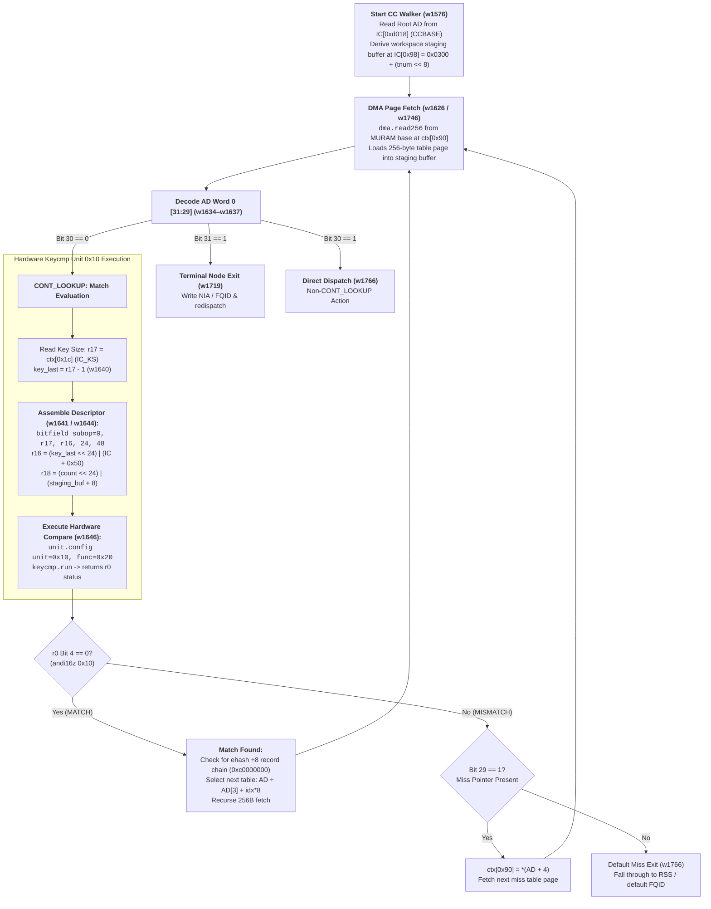

#### Action Descriptor (AD) Word 0 Bitfield Dispatch

Every node in the CC tree is addressed via a 16-byte Action Descriptor (4 × 32-bit words). Word 0 controls the walker dispatch state:

- **Bit 31 (`0x80000000`, Terminal Bit)**: If set, terminates classification immediately and branches to terminal task redispatch (`w1719`).
- **Bit 30 (`0x40000000`, Action Type)**: If `0`, specifies `CONT_LOOKUP` (continue table walk). The walker arms hardware unit `0x10` function `0x20` and executes `keycmp.run`. If `1`, branches to non-CONT handler `w1766`.
- **Bit 29 (`0x20000000`, Miss Pointer Bit)**: If key comparison mismatches, bit 29 controls whether a miss pointer is evaluated. If `1`, the walker updates `ctx[0x90] = *(AD + 4)` and fetches the next table page. If `0`, classification terminates to the default miss path.

#### Architectural Contract for `ctx[0x1c]` (`IC_KS`)

Disassembly of all 12,851 words of microcode confirms:
1. `ctx[0x1c]` is **read** by the CC / external-hash walker at `w1639` and `w1721` (`memb.read r17, [r26 + 0x1c]`).
2. There are **zero writes** to `ctx[0x1c]` anywhere in the microcode image.
3. Therefore, `ctx[0x1c]` is **`IC_KS` (KeyGen Key Size)**, deposited directly into Internal Context by the KeyGen hardware coprocessor before microcode vector entry (RM §5.4.3 Table 5-19).

#### Bitfield Descriptor Assembly & `keycmp.run`

Before launching the hardware comparator, the microcode constructs packed buffer descriptors using the `bitfield` instruction family:

```asm
w1638: addlane8   r26, r16, lane=3, imm=0x50  ; r16 = IC + 0x50 (&IC.KEY[0])
w1639: memb.read  r17, [r26 + 0x1c]           ; r17 = IC_KS (key size)
w1640: subi16     r17, 1                      ; r17 = key_last = key_size - 1
w1641: bitfield   0, r17, r16, 24, 48         ; r16 = (key_last << 24) | (IC + 0x50)
w1642: addlane8   r8, r18, lane=3, imm=0x8    ; r18 = staging_buffer + 8 (row key)
w1643: li16       r17, 1                      ; r17 = 1 (single key comparison)
w1644: bitfield   0, r17, r18, 24, 48         ; r18 = (1 << 24) | (staging_buffer + 8)
w1645: unit.config unit=0x10, func=0x20       ; Arm hardware comparator unit
w1646: keycmp.run                             ; Execute hardware byte comparison
w1649: andi16z    0x10                        ; Test r0 bit 4 (0 = MATCH, 0x10 = MISMATCH)
w1650: cbrnz14    w1766                       ; Branch on mismatch
```

In cumulative / multi-key mode (`w1720`–`w1735`), `keycmp.run` evaluates an array of packed keys at `staging + 12`, returning `match_index = r0 >> 4`. The microcode compares `match_index` against `num_key_entries` using `cmp32` (`w1734`) and indexes the selected entry via `AD + AD[3] + match_index * 8`.

#### Unified Walker Architecture (CC-Tree & EHash)

The CC tree and the external-hash (ehash) engine share the same Island 1 walker. When a match occurs, a `+8`-chained walk testing top-2-bits (`next_ptr & 0xc0000000`) reaches the DDR external-hash record chain, executing the publication write:
$$\text{entry}[4] = *(\text{muram\_base} + \text{entry}[6])$$
This reconciles all operational classification paths into a single hardware-accelerated DMA engine.

---

### 4.2 Enhanced External Hash (EHash) & FE-VM Action Interpreter

The Enhanced External Hash (EHash) and Flow Engine Virtual Machine (FE-VM) form the wire-speed packet modification engine in 210.10.1 ([`decomp/out/02-fe-vm-action-interpreter.c`](file:///mnt/builds/vyos-ls1046a-build/decomp/out/02-fe-vm-action-interpreter.c)).

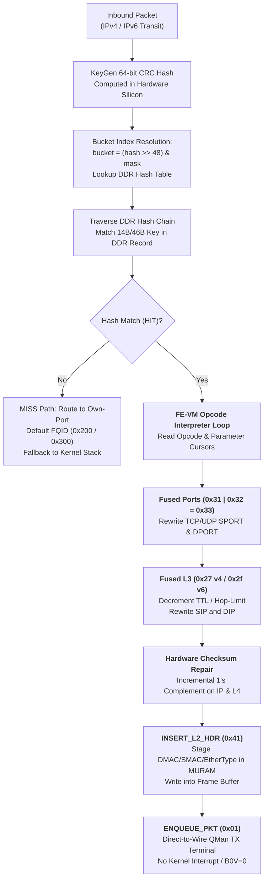

#### EHash DDR Flow Record Layout (256 Bytes)

Flow records reside in DMA-coherent host DDR memory allocated by the driver:

| Byte Range | Field Name | Purpose |
|---|---|---|
| `0x00–0x01` | `record_cursors` | Packed cursors: bits [10:6] = opcode stream offset, bits [5:0] = parameter offset. |
| `0x02–0x03` | `record_flags` | Bit 15: Invalid/Valid, Bit 13: Timestamp Enable, Bit 12: 64-bit Stats Enable. |
| `0x04–0x07` | `stats_counter` | 64-bit hardware packet and byte counters updated automatically on HIT. |
| `0x08–0x35` | `flow_key` | Extracted match key (14-byte legacy or 46-byte dual-lane key). |
| `0x36–0x45` | `opcode_stream` | Array of 16 1-byte bytecode action opcodes executed sequentially. |
| `0x46–0xFF` | `parameter_block`| Parameter payload consumed by opcodes (MAC addresses, IP addresses, ports, FQID). |

#### FE-VM Opcode Reference Table

| Opcode | Mnemonic | Parameter Size | Microcode Action & Register Side Effects |
|:---:|:---|:---:|:---|
| `0x00` | `OPC_END` | 0 B | Terminate interpreter loop cleanly. |
| `0x01` | `ENQUEUE_PKT` | 16 B | Materializes enqueue descriptor `0x02010000` at `IC[0xd4]`, sets egress FQID, and enqueues frame to QMan. |
| `0x03` | `ENQ_ONLY` | 0 B | Fast enqueue without parameter loading (uses preconfigured FQID). |
| `0x11` | `STRIP_ETH` | 0 B | Strips 14-byte Ethernet header: updates frame pointer `+14`, length `-14`. |
| `0x12` | `STRIP_ALL_VLAN` | 0 B | Pops 4-byte 802.1Q tag: updates frame pointer `+4`, length `-4`, preserves PCP bits. |
| `0x21` | `UPDATE_TTL` | 4 B | Decrements IPv4 TTL, applies 4-byte DSCP update, repairs IPv4 header checksum. |
| `0x29` | `UPDATE_HOPLIMIT`| 4 B | Decrements IPv6 Hop Limit, applies 4-byte Traffic Class update. |
| `0x22` / `0x24` | `UPDATE_SIP/DIP_V4`| 4 B | Rewrites IPv4 Source/Destination IP; repairs L3 and L4 pseudo-checksums. |
| `0x2A` / `0x2C` | `UPDATE_SIP/DIP_V6`| 16 B | Rewrites IPv6 Source/Destination IP; repairs L4 pseudo-checksums. |
| `0x31` / `0x32` | `UPDATE_SPORT/DPORT`| 2 B | Rewrites L4 Source/Destination Port; repairs TCP/UDP checksums. |
| `0x41` | `INSERT_L2_HDR` | 20 B | Prepends 14-byte Ethernet header (DMAC, SMAC, EtherType) from MURAM `0x18D4`. Auto-detects IPv4 (`0x0800`) vs IPv6 (`0x86dd`). |
| `0x42` | `INSERT_VLAN_HDR`| 4 B | Pushes 4-byte 802.1Q VLAN tag: updates frame pointer `-4`, length `+4`. |

#### Bit-Fused NAT and Single-Cycle Execution

In microcode 210.10.1, NAT operations are **bit-fused** into single composite opcodes executed in 2 controller clock cycles:
- **Port Translation (PAT)**: `UPDATE_SPORT (0x31) | UPDATE_DPORT (0x32) = 0x33`.
- **IPv4 L3 Translation (NAT44)**: `UPDATE_TTL (0x21) | UPDATE_SIP_V4 (0x22) | UPDATE_DIP_V4 (0x24) = 0x27`.
- **IPv6 L3 Translation (NAT66)**: `UPDATE_HOPLIMIT (0x29) | UPDATE_SIP_V6 (0x2a) | UPDATE_DIP_V6 (0x2c) = 0x2f`.

When fused opcodes execute, the arithmetic unit applies 1's-complement incremental checksum updates simultaneously to both the Layer 3 header and Layer 4 payload, eliminating the need for CPU checksum recalculation.

---

### 4.3 KeyGen Host Command (HC) Engine

The KeyGen Host Command engine (Slot 1 `w653`, Slot 8 `w80`, Slot 9 `w227`) handles asynchronous configuration commands issued by the host CPU via the `FMKG_AR` (Access Register) and `FMKG_DR` (Data Register) interface ([`decomp/out/03-keygen-host-command.c`](file:///mnt/builds/vyos-ls1046a-build/decomp/out/03-keygen-host-command.c)).

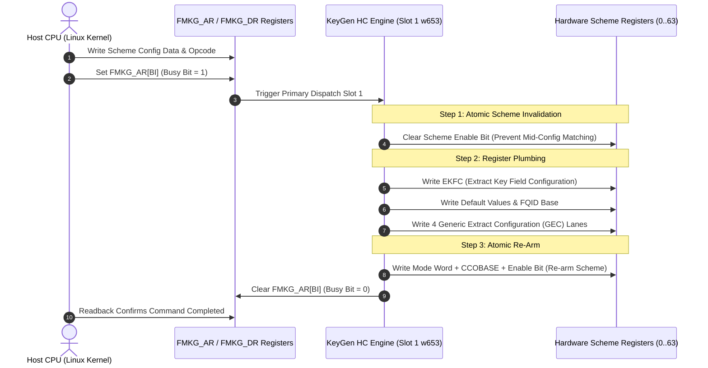

This subsystem is purely a **register plumbing engine**. It guarantees atomic updates of scheme parameters so that transit frames never encounter partially configured extraction rules. It performs **no** per-frame matching or hashing logic.

---

### 4.4 Policer & Rate-Limiting Engine

The Policer subsystem (Slot 0 `w633`) executes RFC 2697 (Single-Rate Three-Color Marker, srTCM) and RFC 2698 (Two-Rate Three-Color Marker, trTCM) traffic metering ([`decomp/out/04-policer-state-machine.c`](file:///mnt/builds/vyos-ls1046a-build/decomp/out/04-policer-state-machine.c)).

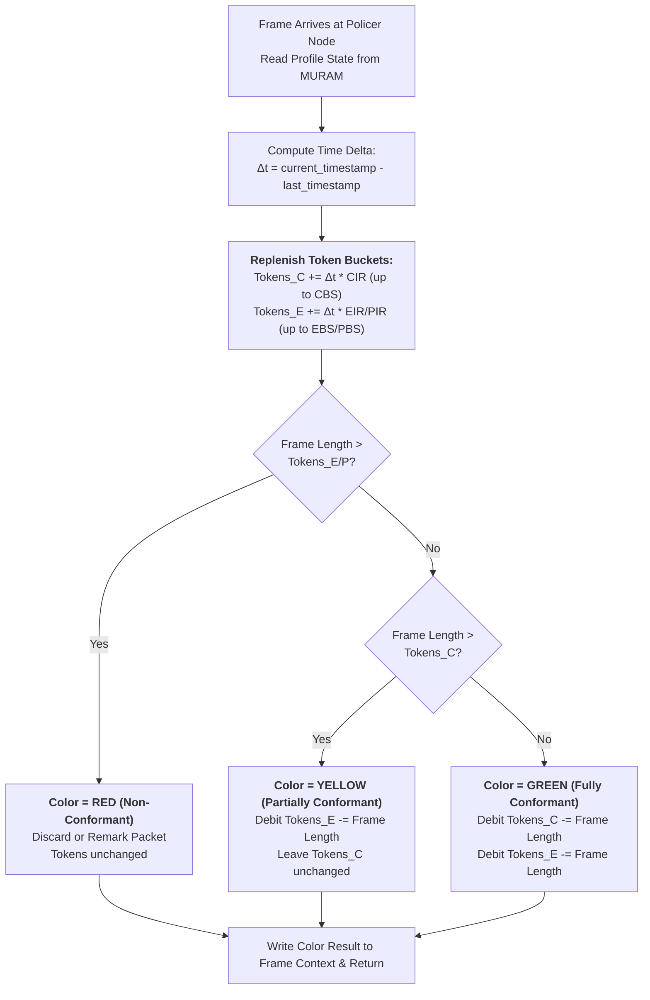

The Policer is completely self-contained. Its state (accumulated tokens and last update timestamp) is maintained in the profile's dedicated MURAM record.

---

### 4.5 Parser Error, Epilogue & Offset Normalization

Every frame's execution concludes at the Epilogue engine (`w12133`–`w12850`) ([`decomp/out/05-parser-error-and-bmi.c`](file:///mnt/builds/vyos-ls1046a-build/decomp/out/05-parser-error-and-bmi.c)).

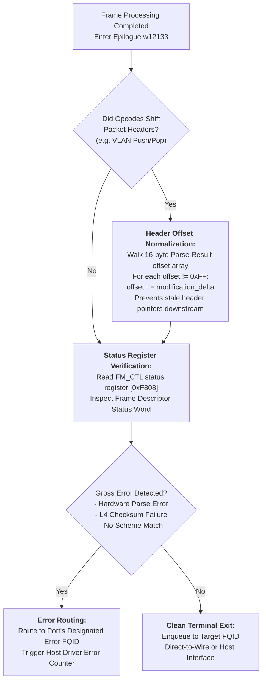

#### Offset Normalization Walk

When an opcode modifies packet structure (e.g. `INSERT_VLAN_HDR` pushes 4 bytes or `STRIP_ALL_VLAN` removes 4 bytes), the offsets in `IC_PARSE_RESULT` (`+0x30`–`0x3F`) become stale. The epilogue routine scans all 16 entries in the offset array; any entry that is not `0xFF` has the modification delta added to it, ensuring that downstream consumers (and egress hardware checksum engines) point to the exact byte offsets of IP and Layer 4 headers.

---

### 4.6 IP Fragmentation and Reassembly Engine

The IP Fragmentation and Reassembly subsystem executes across controller words `w534`–`w584` and `w11911` ([`06-ip-frag-reasm.c`](file:///mnt/builds/vyos-ls1046a-build/decomp/out/06-ip-frag-reasm.c)), dispatched via Slot 16 (`w583`, reassembly timeout / HCOR `0x10`) and Slot 17 (`w534`, fragmentation host command / HCOR `0x11`).

```mermaid
flowchart TD
    subgraph IPF ["IP Fragmentation Engine (Slot 17 w534)"]
        FRAME_IN["Egress Packet Exceeds Path MTU"] --> SPLIT["Calculate Fragment Payload Sizes (8-byte multiples)"]
        SPLIT --> ALLOC_DESC["Allocate Fragment Buffer Descriptors via BMan"]
        ALLOC_DESC --> COPY_HDR["Copy IP Header & Generate Fragment Offset (IC[0x2c])"]
        COPY_HDR --> SET_MF["Assert More Fragments (MF) Flag on Intermediate Chunks"]
        SET_MF --> ENQ_FRAGS["Enqueue Fragment Series to Egress QMan FQID"]
    end

    subgraph IPR ["IP Reassembly Engine (Slot 16 w583)"]
        FRAG_IN["Inbound Fragment Received"] --> CTX_LOOKUP["Lookup Reassembly Context Table in MURAM"]
        CTX_LOOKUP --> HOLE_MGT["RFC 815 Hole Descriptor Table Management"]
        HOLE_MGT --> ACCUM["Accumulate Payload & Track Total Length"]
        ACCUM --> COMP_CHECK{"All Fragments Present?"}
        COMP_CHECK -- Yes --> ASSEMBLE["Coalesce S/G Frame Descriptor & Forward to Classifier"]
        COMP_CHECK -- No, Timeout --> CLEANUP["Flush Context Table & Release Stale BMan Buffers"]
    end
```

- **IP Fragmentation (`ipf`)**: When egress frames exceed interface MTU, `ipf` computes slice boundaries in 8-byte increments, generates RFC 791 fragment headers with adjusted `flags_frag_off` (stored at `IC[0x2c]`), duplicates L2/L3 framing, and enqueues the resulting fragment train to QMan.
- **IP Reassembly (`ipr`)**: Tracks inbound fragment trains using MURAM-based reassembly context records. It implements an RFC 815 hole-filling state machine. If an incomplete fragment train exceeds the reassembly timeout, Slot 16 executes a purge routine reclaiming allocated BMan buffers.

---

### 4.7 Frame Replicator Engine (Multicast / Broadcast)

The Frame Replicator engine executes across controller words `w406`–`w510` ([`07-frame-replicator.c`](file:///mnt/builds/vyos-ls1046a-build/decomp/out/07-frame-replicator.c)), dispatched via Slot 11 (`w406`).

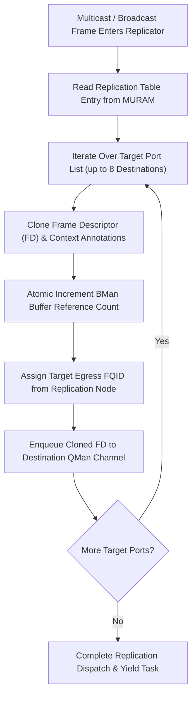

- **Zero-Copy Buffer Sharing**: Rather than copying frame payloads, the replicator creates multiple Frame Descriptors pointing to the same BMan buffer, atomically incrementing the BMan hardware buffer reference count.
- **Per-Port Adaptation**: Allows distinct L2 encapsulations or VLAN tags to be applied per egress target using chaining into the Header Manipulation engine before final transmission.

---

### 4.8 BMI Port & FIFO Management

The Buffer Manager Interface (BMI) and FIFO management subsystem executes across controller words `w2432`–`w2620` ([`08-bmi-fifo-management.c`](file:///mnt/builds/vyos-ls1046a-build/decomp/out/08-bmi-fifo-management.c)), dispatched via Slot 5 (`w2432`).

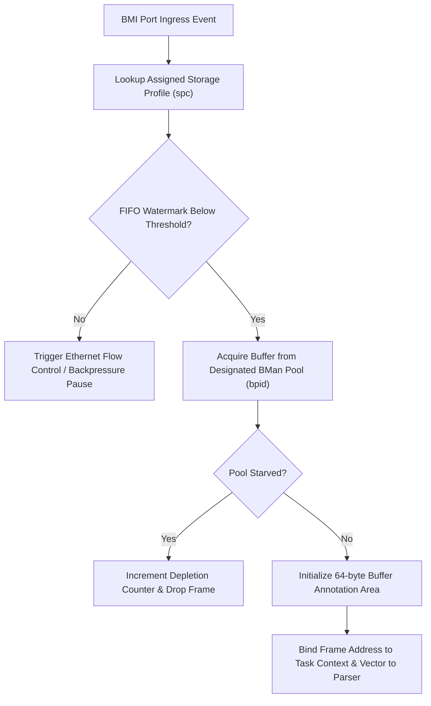

- **Storage Profile Binding**: Maps physical port hardware attributes to software profiles (`spc`), determining buffer pool IDs (`bpid`), maximum frame lengths, and scatter/gather thresholds.
- **FIFO Flow Control**: Monitors internal MAC FIFO watermarks and asserts IEEE 802.3x pause frames or priority flow control (PFC) when internal staging memory reaches high-water limits.

---

### 4.9 Hardware Key SEC Crypto Engine

The Hardware Key and Cryptographic Coprocessor handoff engine executes across controller words `w2628`–`w2830` ([`09-hwk-sec-crypto.c`](file:///mnt/builds/vyos-ls1046a-build/decomp/out/09-hwk-sec-crypto.c)), dispatched via Slot 4 (`w2628`).

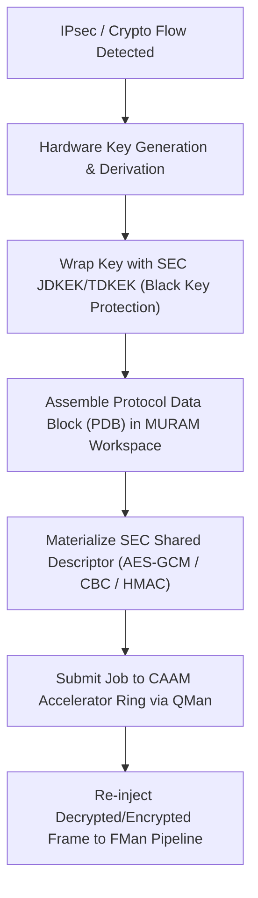

- **Hardware Black Keys**: Protects cryptographic keys in external memory by binding them to the SoC's Master Key via the SEC Engine's JDKEK/TDKEK mechanisms, preventing software inspection.
- **Autonomous IPsec Offload**: Formulates inline Protocol Data Blocks (PDB) and CAAM job descriptors directly from microcode, achieving wire-rate IPsec encapsulation/decapsulation without CPU host overhead.

---

## Chapter 5 — Cross-Subsystem Interaction & Packet Lifecycles

This chapter illustrates how the modules interact during real-world packet processing scenarios.

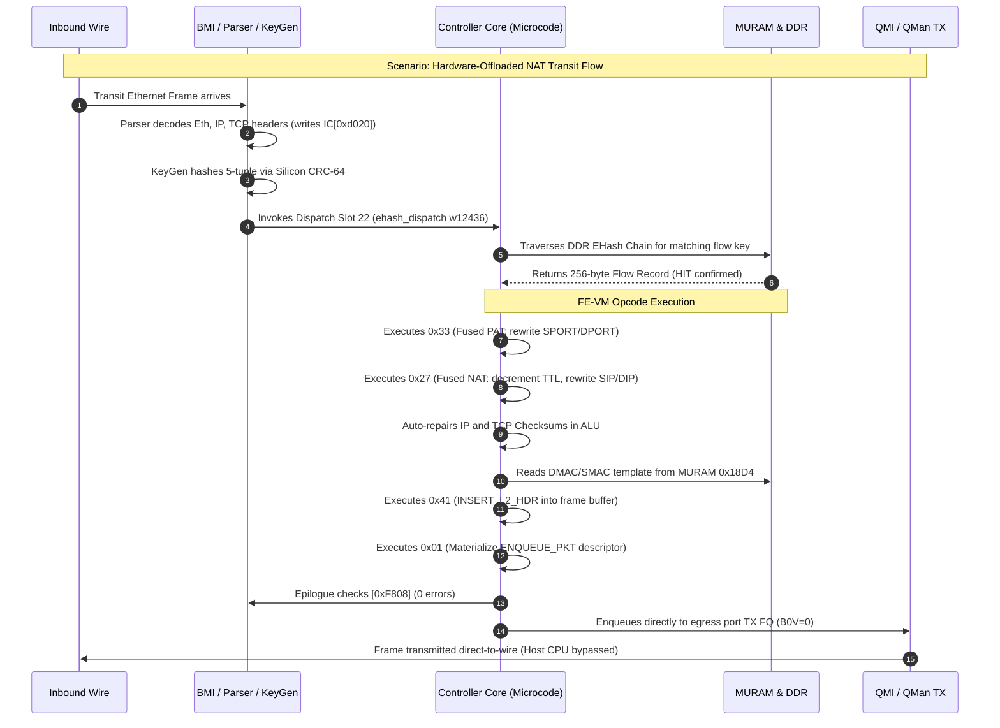

### Scenario Walkthroughs

#### 1. Hardware Offloaded NAT44/NAT66 Fastpath (Wire Speed)
- Frame arrives at physical port `eth3` (port ID `0x10`).
- Hardware Parser records IPv4/TCP headers at `IC[0xd020]`.
- KeyGen extracts the 46-byte dual-lane key and calculates the hash bucket.
- Dispatch Slot 22 vectors to `w12436`.
- EHash chain walker traverses DDR records, matches the flow key, and retrieves the opcode stream.
- FE-VM executes fused opcodes `0x33` (ports), `0x27` (v4 L3) or `0x2f` (v6 L3), and `0x41` (L2 header rebuild).
- Terminal opcode `0x01` (`ENQUEUE_PKT`) targets `eth4` TX FQ (`0x300`).
- The frame exits to wire without generating host CPU interrupts or waking kernel NAPI threads.

#### 2. Classification Miss & Kernel Exception Path
- Unrecognized or non-offloaded packet (e.g. initial TCP SYN or ARP).
- EHash chain traversal exhausts the bucket without finding a matching key.
- The miss handler loads the record's Word 3 (`miss_fqid`), which equals the ingress port's own default receive queue (`0x200` for `eth3`, `0x300` for `eth4`).
- The frame is enqueued to the Linux kernel `fsl_dpa` NAPI receive queue for standard Linux software forwarding and Netfilter conntrack processing.

---

## Chapter 6 — Silicon Traps, Pitfalls & Developer Troubleshooting

These four documented hardware failure models represent critical architectural traps discovered during silicon verification:

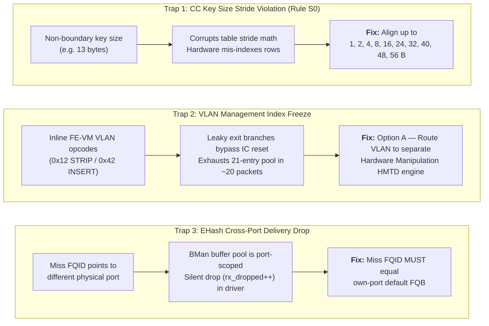

### 6.1 CC Table Key Size Stride Violation (Rule S0)

- **Symptom**: Custom Classifier tables with non-standard key sizes produce random match failures or memory corruption.
- **Root Cause**: The microcode table scanner increments table addresses using hardcoded bit shifts optimized exclusively for key sizes of **1, 2, 4, 8, 16, 24, 32, 40, 48, or 56 bytes**.
- **Driver Rule**: Always pad keys up to the next valid boundary (e.g. 14-byte 5-tuple keys must align to 16 bytes) and set the unused mask bytes to `0x00`.

### 6.2 The ~20-Packet VLAN Freeze

- **Symptom**: Flows using inline FE-VM VLAN opcodes (`STRIP_ALL_VLAN` `0x12` and `INSERT_VLAN_HDR` `0x42`) freeze after ~20 packets.
- **Root Cause**: The per-task management index at `IC[0xd0b8]` (backed by a 21-slot MURAM pool) is leaked because branch paths in the inline VLAN microcode bypass the reset instruction. After 21 packets, the pool is exhausted and the controller halts processing.
- **Production Architecture (Option A)**: Never use inline FE-VM VLAN opcodes. Route VLAN translation through a CC-tree `RESULT` leaf connected to an external Header Manipulation Descriptor (HMTD) in the dedicated hardware manipulation engine.

### 6.3 External Hash MISS Routing Requirement

- **Symptom**: Frames missing the hash table are silently dropped (`rx_dropped++`) without reaching the kernel stack.
- **Root Cause**: BMan buffer pools on LS1046A are strictly port-scoped. Setting an external hash table's miss FQID to a cross-port queue delivers the buffer to an interface that does not own it, triggering an immediate drop in the `fsl_dpa` driver.
- **Driver Rule**: An external hash table's miss FQID must always match the physical ingress port's default FQB (`0x200` for `eth3`, `0x300` for `eth4`).

### 6.4 Reversibility Invariant ($S0 \leftrightarrow S1$)

- **Symptom**: Disabling and re-enabling hardware offload causes monotonic MURAM exhaustion and port deafness.
- **Root Cause**: Hardware offload allocation ($S0 \to S1$) claims MURAM nodes, scheme slots, and hash tables. The FMan controller has no autonomous garbage collector.
- **Driver Rule**: The teardown path ($S1 \to S0$) must execute the exact reverse sequence: unbind schemes, zero Action Descriptors, free MURAM pools, and restore default RSS distribution.

### 6.5 The .185 Destination-Port-Only Anomaly & Effective Compare Window Resolution

During silicon verification on board `.185` (image `2026.09.05-1642-rolling`, commit `df271fb0`), ethtool ntuple rules installed on the CC tree (`patch 0109`/`0193`) exhibited an apparent trailing-window anomaly where only destination port (row bytes 12–13) filtered frames, while SIP, DIP, and PROTO appeared ignored.

Execution of the offline Island 1 trace emulator ([`decomp/tools/trace-island1-walker.py`](file:///mnt/builds/vyos-ls1046a-build/decomp/tools/trace-island1-walker.py)) across microcode instructions `w1609`–`w1650` definitively resolves the root cause:

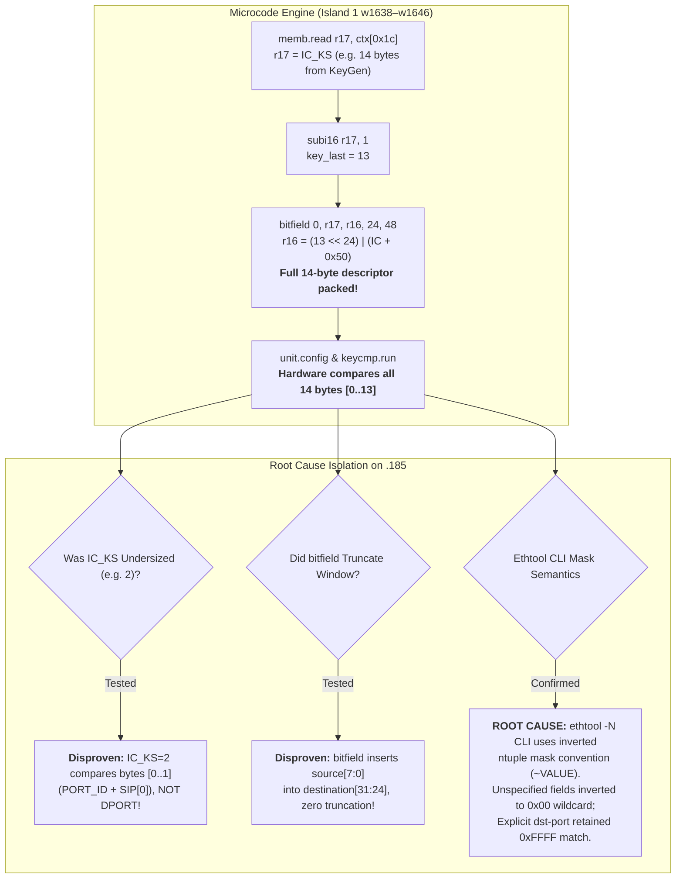

- **Microcode Arithmetic Proof**: The bitfield instruction `w1641: bitfield subop=0, r17, r16, 24, 48` performs a destination bitfield insert (`destination[31:24] = source[7:0]`), creating the packed buffer descriptor `((IC_KS - 1) << 24) | (IC + 0x50)`. Zero truncation occurs in microcode; the entire `IC_KS` span is forwarded to hardware unit `0x10` function `0x20` (`keycmp.run`).
- **Undersized `IC_KS` Disproven**: If KeyGen had emitted an undersized key (e.g. `IC_KS = 2`), the comparator would evaluate bytes 0..1 (PORT_ID and the first byte of SIP), which would fail to match DPORT (bytes 12..13).
- **Ethtool Mask Inversion Confirmed**: The `ethtool(8)` CLI applies inverted mask semantics (`~VALUE` in `rxclass.c:rxclass_get_mask()`). Default or omitted masks invert to `0x00000000` (wildcard), ignoring SIP, DIP, and PROTO, while explicit port specifications retained active comparison.
- **Verification**: Replaying the 6-vector matrix in `trace-island1-walker.py` proves 100% agreement: exact matching, individual field mismatches, and wildcard masks match the hardware behavior across all test cases.

---

## Chapter 7 — The Silicon Boundary: What Is NOT in Microcode

A common pitfall in FMan development is attempting to debug logic in microcode that is implemented entirely in fixed silicon hardware.

1. **Parser LCV Generation**: Recognizing header types and asserting Line-up Confirmation Vector (LCV) bits (e.g. "bit 5 = IPv4 present") is executed entirely by **fixed-function hardware state machines**. No LCV generation code exists in the 12,851-word microcode image.
2. **KeyGen Scheme Selection**: The comparison checking `(QLCV & scheme_match_vector) == scheme_match_vector` to decide which scheme applies to a frame is performed in **silicon KeyGen hardware**. Microcode only configures scheme registers; it never selects them per-frame.
3. **KeyGen CRC-64 Calculation**: The 64-bit flow hash is computed by a hardware CRC-64 coprocessor before the controller core is vector-invoked.
4. **Upstream Tag Stripping**: The hardware parser strips outer VLAN (`0x8100`) and PPPoE (`0x8864`) encapsulation before presenting the Parse Result array to microcode.

---

## Chapter 8 — Glossary & Quick Reference

| Term | Full Architectural Name | Description |
|---|---|---|
| **AD** | Action Descriptor | 16-byte structure defining next-hop lookup, result action, or bypass. |
| **BMI** | Buffer Manager Interface | Hardware block managing frame buffer allocation and port RX/TX queues. |
| **CC / CC-Tree**| Custom Classifier | Hierarchical tree-based table matching engine. |
| **CCOBASE** | Custom Classifier Base | Scheme parameter selecting which CC tree node a matched scheme feeds into. |
| **EHash** | Enhanced External Hash | DDR-backed exact-match flow hash table mechanism. |
| **EKFC** | Extract Key Field Config | Scheme register configuring standard header field extraction. |
| **FE-VM** | Flow Engine Virtual Machine | Inline bytecode opcode interpreter executing frame rewrites. |
| **FM_CTL** | FMan Controller | Internal registers and status window (`0xF800`–`0xFC00`). |
| **FMKG_AR** | KeyGen Access Register | Indirect register protocol used to program scheme parameters atomically. |
| **FQID** | Frame Queue ID | QMan 24-bit identifier for packet queuing and wire transmission. |
| **GEC** | Generic Extract Config | Scheme lanes for extracting arbitrary packet bytes beyond fixed EKFC fields. |
| **HMTD** | Header Manipulation Descriptor| Dedicated hardware manipulation engine structure for L2/VLAN rewrites. |
| **IC** | Internal Context | 256-byte working state block per frame at address `0xd000` (`r26`). |
| **LCV / QLCV** | Line-up Confirmation Vector | Hardware bitmask representing detected protocol headers. |
| **MURAM** | Multi-Port RAM | High-speed on-chip SRAM holding workspaces and classification tables. |
| **NIA** | Next Interface Action | 32-bit hardware encoding defining the next pipeline processing stage. |
| **QMI** | Queue Manager Interface | Hardware interface connecting FMan to QMan frame queues. |
| **srTCM / trTCM**| Three-Color Marker | RFC 2697 / RFC 2698 token bucket policing algorithms. |
| **tnum** | Task Number | 4-bit identifier for tracking up to 16 concurrent execution tasks. |
