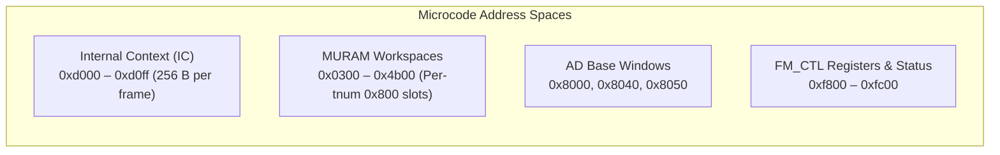
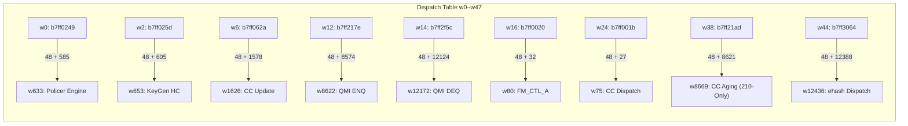

# FMan Microcode 210.10.1 Internals & Architecture Reference

**Published: 2026-09-05 · Target: NXP LS1046A Frame Manager v3 (DPAA1)**

This document is the definitive architectural specification for the internal execution,
controller RISC instruction set, memory map, dispatch vectors, and algorithm implementations
of the proprietary NXP QEF 210.10.1 microcode. While `arch/fman-microcode-210-programming-reference.md`
documents the host-driver contract (registers and MURAM configuration tables), this document
explains the *execution of the microcode itself* inside the FMan controller core.

---

## 1. Microcode Image & Execution Environment

### 1.1 Binary Container & Integrity
- **Container Format**: NXP QEF (`struct qe_firmware`, magic `QEF\0`).
- **Blob Size**: 51,652 bytes.
- **Code Region**: 12,851 32-bit big-endian words (51,404 bytes) starting at blob byte offset 244.
- **Entropy**: 6.29 bits/byte (uncompressed, unencrypted fixed-width RISC machine code).
- **Trailer Algorithm**: Raw CRC-32 (polynomial `0x04C11DB7`, `init=0`, `xorout=0`, no reflection)
  computed over `blob[:len-4]`.
- **Target Hardware**: NXP LS1046A / LS1043A FMan v3 controller core operating at 700 MHz.
- **IRAM Loader**: Kernel patch `0117 load_fman_ctrl_code()` streams the blob from the device tree
  (`fsl,firmware` property) into controller IRAM at boot and kexec.

### 1.2 Controller RISC Architecture
The FMan controller executes a proprietary 32-bit fixed-width RISC instruction set documented
in `arch/fman-instruction-table.html` (201 canonical forms). Analysis shows that **12,850 of 12,851 words
(99.99%)** in the 210.10.1 image conform to this table, with the sole non-instruction word (`w1`)
being the BCD version constant `0x00d20a01` (`210.10.1`).

Key processor architectural characteristics:
- **Word-Addressed Code Space**: Instruction $w$ resides at byte address $4 \cdot w$.
- **Register File**: 32 32-bit general-purpose registers (`r0`–`r31`).
  - `r0`–`r25`: General computation, memory buffers, and table index cursors.
  - `r26` (`IC`): Frame Internal Context base pointer (`0xd000`).
  - `r28` (`FRAME`): Current packet frame buffer window base.
  - `r30` (`LR`): Subroutine Link Register (set by `call`, consumed by `ret`).
  - `r31` (`COND`): Condition, predicate, and special pipeline state register.
- **Delay Slots**: Branch and jump instructions (`xfer14.comp`, `jmptbl.comp.r3`, `cbrz14.comp`, etc.)
  feature an architectural branch delay slot (`execute(pc + 1)`).
- **Hardware Multitasking**: Hardware task scheduler tracking up to 16 concurrent tasks via Task Numbers
  (`tnum`). Context switching and task suspension occur via `task.boundary`, `task.redispatch`, and `wait.cont`.

---

## 2. Memory Spaces & Hardware Windows

The microcode addresses four distinct memory and register windows through specialized load/store
instructions (`memw.read`, `memw.write`, `memd.read`, `memb.read`, `ld.sm`, `st.sm`).

### 2.1 Internal Context (`ctx` / `r26` Base: `0xd000`–`0xd0ff`)
Every frame passing through FMan is accompanied by a 256-byte Internal Context structure:
- `+0x00`: Frame Descriptor (`FD`) status and command words.
- `+0x04`: Frame length in bytes.
- `+0x08`: Action Descriptor base pointer (`AD_BASE`).
- `+0x0C`: Flow classification hash / parser state.
- `+0x10`: Internal-Context Action Descriptor (`ICAD`) operational mode.
- `+0x18`: Custom Classifier root node address (`CCBASE`).
- `+0x1C`: KeyGen key size (`KS`) and High-Priority NIA (`HPNIA`).
- `+0x20`–`+0x3F`: 32-byte Hardware Parse Result (`struct fman_prs_result`):
  - `+0x20`: Logical Port ID (`lpid`) and Shim Header flags (`shimr`).
  - `+0x22`: Layer 2 Result vector (`l2r`).
  - `+0x24`: Layer 3 Result vector (`l3r`).
  - `+0x26`: Layer 4 Result vector (`l4r`).
  - `+0x28`: Classification Plan ID (`cplan`) and Next Header (`nxthdr`).
  - `+0x2A`: Gross frame checksum (`cksum`).
  - `+0x2C`: Fragmentation flags and fragment offset.
  - `+0x30`–`+0x3F`: Header offset array (`shim_off`, `ip_pid_off`, `eth_off`, `vlan_off`, `ip_off`, `l4_off`, `nxthdr_off`).
- `+0x40`: Frame arrival timestamp (64-bit).
- `+0x48`: KeyGen 64-bit CRC-64 hash result (`KG_HASH`).
- `+0x50`–`+0x87`: KeyGen extracted flow key buffer (`KG_KEY`, up to 56 bytes).
- `+0xB8`: Per-task management index (`MGMT_INDEX`).
- `+0xC0`: Task control flags.
- `+0xC4`: Current Network Interface Action (`CURRENT_NIA`).
- `+0xD4`: Enqueue descriptor materialization scratchpad.

### 2.2 Multi-Task MURAM Workspace (`0x0300`–`0x4B00`)
MURAM is partitioned into per-task slots at `0x0300 + n · 0x0800` ($n = 0 \dots 12$), each containing:
- `+0x000`: Task local scratch registers.
- `+0x500`–`+0x548`: Uniform per-task control block and hardware semaphore state.
- `0x18D4`: L2 header replacement and MAC address reconstruction scratchpad.
- `0x9104`: Global management index and workspace configuration array.

### 2.3 Controller Status Window (`0xF800`–`0xFC00`)
Internal controller state, status registers, and indirect dispatch tables:
- `0xF800`: FM_CTL action dispatch pointer table (maps action codes `0x02`–`0x1E` to handler targets).
- `0xF808`: Hardware status register (checked by `w12551` to detect gross frame errors and stall states).

---

## 3. Dispatch Vector Table Architecture

The first 48 words (`w0`–`w47`) of the code region form a 24-slot primary dispatch vector table.
Each slot consists of 8 bytes: a vector jump word (`b7ffXXXX`) and an `0xffffffff` pad word.

**The Vector Addressing Formula**:
For words $w \in [0, 47]$ with instruction `b7ffXXXX`, the target word index is calculated from the
end of the dispatch table (word 48 / byte `0xC0`):
$$\text{Target Word} = 48 + \text{raw\_word}[15:0]$$

| Slot | Word | Opcode | Target | Handler Name | Subsystem & Description |
|---|---|---|---|---|---|
| **0** | `w0` | `0xb7ff0249` | **w633** | `policer_dispatch` | Policer profile host command & DONE |
| **1** | `w2` | `0xb7ff025d` | **w653** | `hc_keygen_dispatch` | KeyGen scheme host command programming |
| **2** | `w4` | `0xb7ff025b` | **w651** | `sync_prs_dispatch` | Parser synchronization entry |
| **3** | `w6` | `0xb7ff062a` | **w1626** | `hc_cc_update_dispatch`| Dynamic CC match tree update (HCOR `0x03`) |
| **4** | `w8` | `0xb7ff0a14` | **w2628** | `hwk_dispatch` | KeyGen hardware engine handoff |
| **5** | `w10` | `0xb7ff0950` | **w2432** | `bmi_dispatch` | BMI port task entry |
| **6** | `w12` | `0xb7ff217e` | **w8622** | `qmi_enq_dispatch` | QMI frame enqueue engine |
| **7** | `w14` | `0xb7ff2f5c` | **w12172** | `qmi_deq_dispatch` | QMI frame dequeue engine |
| **8** | `w16` | `0xb7ff0020` | **w80** | `fm_ctl_a_dispatch` | Foundational FM Controller handler A |
| **9** | `w18` | `0xb7ff00b3` | **w227** | `fm_ctl_b_dispatch` | FM Controller handler B |
| **10**| `w20` | `0xffffffff` | — | *(reserved)* | Unused in all tiers |
| **11**| `w22` | `0xb7ff0166` | **w406** | `fr_dispatch` | Frame Replicator engine entry |
| **12**| `w24` | `0xb7ff001b` | **w75** | `cc_dispatch` | Custom Classifier dispatch root |
| **13**| `w26` | `0xb7ff0219` | **w585** | `fm_ctl_action_13` | Action table handler 13 |
| **14**| `w28` | `0xffffffff` | — | *(reserved)* | Unused in all tiers |
| **15**| `w30` | `0xb7ff0217` | **w583** | `fm_ctl_action_15` | Action table handler 15 |
| **16**| `w32` | `0xb7ff0217` | **w583** | `ipr_timeout_dispatch`| IP reassembly timeout (HCOR `0x10`) |
| **17**| `w34` | `0xb7ff01e6` | **w534** | `ipf_dispatch` | IP fragmentation host command (HCOR `0x11`) |
| **18**| `w36` | `0xb7ff0256` | **w646** | `slot18_dispatch` | Slot 18 handler |
| **19**| `w38` | `0xb7ff21ad` | **w8669** | `hc_cc_aging_dispatch` | **210-only** dynamic CC aging handler |
| **20**| `w40` | `0xb7ff025c` | **w652** | `slot20_dispatch` | Slot 20 handler |
| **21**| `w42` | `0xb7ff025c` | **w652** | `slot21_dispatch` | Slot 21 handler |
| **22**| `w44` | `0xb7ff3064` | **w12436**| `ehash_dispatch` | Enhanced external hash dispatch |
| **23**| `w46` | `0xffffffff` | — | *(reserved)* | Unused in all tiers |

---

## 4. Subsystem Algorithms & Reconstructed C Models

### 4.1 Enhanced External Hash Classification Engine
- **Assembly Artifact**: `decomp/en-exthash-lookup.asm` (805 lines of disassembly and C).
- **Silicon Documentation**: `decomp/fman-ehash-process.md`.
- **Pipeline Operation**:
  1. KeyGen extracts a 14-byte key (`PORT_ID|SIP|DIP|PROTO|SPORT|DPORT`) via EKFC `0x801C0006`.
  2. Silicon calculates a 64-bit CRC (ECMA-182 reflected, seed `~0`, polynomial `0xC96C5795D7870F42`)
     and stores it into `ctx[0xd048]`.
  3. The microcode shifts the hash right by 48 bits and masks it with `hash_mask_bits` to index a DDR bucket array.
  4. The microcode DMA-reads the bucket head pointer (`dma.read8` / `dma.read64`).
  5. The chain walker compares the extracted key against DDR records starting at byte offset `+8` (`cmp32`).
  6. **HIT**: The microcode executes the record's inline opcode stream (`ENQUEUE_PKT` to `param.fqid`).
  7. **MISS**: The frame is dispatched to `slot->base_fqid` (own-port FQB) via Word 3 of the root node.

### 4.2 Custom Classifier (CC) Match Tree Walker
- **C Model Artifact**: `decomp/out/01-cc-match-walker.c`.
- **Execution Path**: `w75`–`w104`, `w648`–`w715`, `w1850`–`w1900`, `w2837`–`w2960`.
- **Key Algorithmic Rules**:
  - **Action Code Normalization**: The `e9c9` cascade at `w75`–`w104` executes `ori16 r9, <action>` in
    the branch delay slots of `xfer14.comp`, converging at `w104` to store `r9` into `ctx[0xd0c4]` (`CURRENT_NIA`).
  - **Action Descriptor Parsing**: Word 0 bits[31:30] are extracted (`c600001e` shift 30):
    - `0b01` (`CONT_LOOKUP`): Advances to the next table group.
    - `0b10` (`RESULT`): Terminal classification; writes target FQID into `CURRENT_NIA` and completes.
    - `0b11` (`BYPASS`): Routes to miss queue.
  - **Lookup Depth Ceiling**: Statically enforced at $\le 3$ chained lookups. Exceeding 3 iterations
    triggers a fault and terminates the task.
  - **Atomic Table Evaluation**: Subroutine `w2837` acquires a hardware MURAM semaphore via `ld.sm` (`w2850`)
    with `retry.sm` before scanning table rows.

### 4.3 FE-VM Action Interpreter Loop
- **C Model Artifact**: `decomp/out/02-fe-vm-action-interpreter.c`.
- **Execution Path**: `w8645`–`w9520`.
- **Opcode Handling**:
  - `OPC_INSERT_L2_HDR` (`0x41`): Inspects the frame IP version byte (IPv4 vs IPv6), selects EtherType
    `0x0800` or `0x86DD`, and DMA-copies the rebuilt MAC header from MURAM scratchpad `0x18D4`.
  - `OPC_STRIP_ALL_VLAN` (`0x12`): Decrements frame length by 4 bytes, advances frame pointer, and preserves PCP bits.
  - `OPC_INSERT_VLAN_HDR` (`0x42`): Pushes 4-byte 802.1Q tag (`0x8100` + TCI) and adjusts length.
  - `OPC_ENQUEUE_PKT` (`0x01`): Materializes the 32-bit ENQ descriptor constant `0x02010000` into `ctx[0xd4]`,
    sets target FQID, and redispatches via `task.boundary`.
  - **Epilogue Contract**: Handlers reset the per-task management index at `ctx[0xd0b8]` (`140ed0b8`) before exiting.

### 4.4 KeyGen Host Command Engine
- **C Model Artifact**: `decomp/out/03-keygen-host-command.c`.
- **Execution Path**: `w653`–`w850`.
- **Operation**: Programs KeyGen scheme registers via the indirect `FMKG_AR` protocol. Atomically clears
  the scheme enable bit, writes extraction configurations (`EKFC`, `GEC`), programs hash parameters,
  and re-arms the scheme with `CCOBASE`.

### 4.5 Policer & Rate Limiting Engine
- **C Model Artifact**: `decomp/out/04-policer-state-machine.c`.
- **Execution Path**: `w633`–`w650`, `w1450`–`w1520`.
- **Operation**: Replenishes token buckets $C$ and $E/P$ based on elapsed timestamp ticks, evaluates packet
  length against CIR/PIR limits according to RFC 2697/2698, and assigns conformance colors (GREEN, YELLOW, RED).

### 4.6 Parser Error & Frame Epilogue Engine
- **C Model Artifact**: `decomp/out/05-parser-error-and-bmi.c`.
- **Execution Path**: `w12133`–`w12850`.
- **Operation**:
  - Normalizes the 16 header offsets in the Parse Result (`0xd030`–`0xd03f`) by packet manipulation deltas.
  - Inspects FM_CTL status register `0xF808`; routes frames with gross parsing errors, checksum failures,
    or scheme errors (`0x00004000`) to the designated Error FQ (e.g., `0x291`).

---

## 5. Hardware Defect Models & Safe Programming Rules

Microcode 210.10.1 exhibits several critical silicon and firmware behaviors documented in project findings.
These define strict hardware constraints for the host driver:

1. **CC Table Key Size Constraint (Rule S0 Canonical Violation)**:
   - Valid CC group table key sizes in hardware are **1, 2, 4, 8, 16, 24, 32, 40, 48, 56 bytes**.
   - Arbitrary key sizes (e.g. 13 bytes) are invalid and corrupt the internal table walker stride. Keys must
     be aligned up to the next valid boundary (e.g. 14-byte 5-tuple keys align to 16 bytes).

2. **The ~20-Packet VLAN Freeze & Management Index Pool**:
   - The inline FE-VM action interpreter consumes a slot in the MURAM `5 + tnums` management index array
     (`ctx[0xd0b8]`).
   - In 210.10.1, the inline VLAN strip/rebuild path fails to balance the index release on certain branch paths,
     exhausting the ~21 slots on LS1046A and freezing traffic after ~20 packets.
   - **Production Rule**: Production VLAN translation runs via CC-leaf $\to$ combined HMTD in the separate
     hardware manipulation engine (Option A), completely bypassing the FE-VM opcode interpreter.

3. **External Hash MISS Destination Requirement**:
   - The miss FQID in Word 3 of an external hash node **must** equal the frame's own-port default FQB (e.g., `0x300`
     for eth4, `0x200` for eth3).
   - Cross-port delivery causes silent driver drops (`rx_dropped++`) because buffer pools are port-scoped.
   - Banned: `miss_action_type=NIA` with direct KeyGen re-entry creates an unrecoverable infinite loop (~4.5M pkt/s).

4. **Reversibility Contract**:
   - Engaging hardware offload (transition $S0 \to S1$) allocates MURAM nodes, schemes, and internal buffers.
   - Disengaging ($S1 \to S0$) must cleanly free all per-port allocations, zero the node ADs, and restore default
     RSS mode without monotonic memory leaks.
