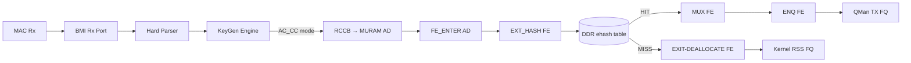
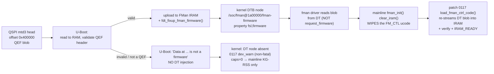

# FMan Microcode 210.10.1 Programming Reference

**Version 2.0.0 · 2026-08-06 · HADS 1.0.0**

**Board:** NXP LS1046A Mono Gateway DK (FMan v3, DPAA1)
**Microcode:** QEF 210.10.1 ("Microcode version 210.10.1 for LS1043 r1.0"), `caps=0x17`
**Blob:** 51652 bytes, 12851 code words, SPI `mtd3` @ `0x400000`, DT node `/soc/fman@1a00000/fman-firmware/fsl,firmware`

## AI READING INSTRUCTION

This is the register-level reference for the proprietary FMan microcode that
runs on this board: what the blob is, how it is loaded, and how to program
every hardware block it exposes (KeyGen, BMI ports, FM_CTL, FE-VM, header
manipulation, policer, DDR ehash). Read `[SPEC]` blocks for binding facts,
`[NOTE]` for rationale, `[BUG]` for defect classes (symptom + cause + fix),
`[?]` for open questions. Companion documents: `arch/fman-fe-ehash.md`
(FE/ehash init contract), `arch/fman-pcd.md` (pipeline narrative),
`specs/fman-keygen-flow-key-spec.md` (flow-key formats). Where documents
disagree, the most recent board-verified finding wins.

Every fact in this document derives from at least one of: the NXP LS1043A
DPAA Reference Manual (same FMan v3 silicon), the NXP lf-5.4 LSDK driver
source, the deployed vendor `cdx.ko`/`cmm` stack on board `.106`, or a direct
`/dev/mem`/debugfs read on this project's boards. **No public register-level
documentation exists for any FMan microcode family** — the `qoriq-fm-ucode`
repo ships only binary blobs and feature-changelog PDFs, no bit layouts, no
descriptor formats, no opcode encodings.

**Companion resource (2026-09-01):** `arch/fman-instruction-table.html`
(local copy, source `https://large-files.moshe.nl/fman-instruction-table.html`)
is a *different* layer than anything above — a reverse-engineered ISA
reference for the **FM_CTL microcontroller's raw 32-bit instruction set**
(the actual machine code the FM_CTL engine executes: `task.set_end_nia`,
`task.redispatch`, `tnum.alloc`, `dma.read256`, `memw.read`, etc.), not the
BMI/Classification/Policer register blocks or NIA action-code table this
document covers. Explicitly self-described as "not an NXP-authored manual";
201 instruction forms, 191 "confirmed" / 10 "strong" evidence status,
sourced from `isa/encodings.yaml` + `isa/mnemonics-readable.yaml` with a
SHA-256 verification hash. Contains **no** VLAN, frame-release, or
buffer-dequeue instructions, and no PRE_BMI_ENQ_FRAME (NIA 0x28) or other
action-code entries — those live at the BMI/CC layer this document already
covers, not the FM_CTL controller ISA layer. Useful groundwork for a future
disassembly-level investigation of what a specific NIA action actually
executes at the FM_CTL instruction level, but that is a substantially
larger, higher-risk undertaking (live-microcode patching territory) than
anything attempted in this document — see the T-M6-8 VLAN cross-port
throttle investigation (qdrant, 2026-09-01) for the specific open question
that motivated pulling this resource in.

---

## 1. Identity and Scope

**[SPEC]** The FMan v3 microcode is a QEF container (`struct qe_firmware`,
magic `"QEF"`) loaded by U-Boot from SPI flash into FMan IRAM at boot. It
implements a table-driven Parse–Classify–Distribute pipeline. The kernel
programs it by writing MURAM-resident configuration tables through FMan CCSR
registers. It is never invoked via a software API or opcode dispatch — **the
tables are the API**.

**[SPEC]** The Host Command (HC) doorbell is **absent** from this blob:
`caps=0x17 = 0b0001_0111` (bits 0, 1, 2, 4 set; bit 3 `FMAN_CAP_HC_DISPATCH`
clear). `fmd_host_cmd_send()` returns `-ENXIO`. The only productive
programming path is the register → MURAM → silicon path documented here.

### 1.1 The NXP microcode families

| Question | Answer |
|---|---|
| What runs on **our board**? | **Proprietary `210.10.1`** QEF blob, U-Boot-injected into the DTB. |
| Open-source alternative? | **`106.4.18`** (`fsl_fman_ucode_ls1046_r1.0_106_4_18.bin`). |
| Is "160" a valid LS1046A ucode? | **No.** `160` is the **P1023** open-source major; "open-source 160" for LS1046A is a misnomer for `106`. |
| Do both families support CC? | Yes — both `106` (IPACC) and `210.x` silicon-support CC/HM/Policer. The gate is which blob is loaded and executing. |
| Does mainline program CC? | **Never.** Mainline DPAA only does KG-RSS. CC is programmed solely by our `fman_pcd_*.c` patches. |
| Detection? | QEF header decode (`firmware-check`) + kernel caps gate (patch `0086a`, `major>=210 → 0x17`). |
| Fallback if missing? | Graceful: board boots mainline KG-RSS only, no CC caps, `0117` `dev_warn`. There is **no** `request_firmware()` fallback — by design. |

**Version numbering** (from the `qoriq-fm-ucode` readme): first number =
feature family (`106` = IPACC: custom classification, independent mode, host
commands, IPv4/6 frag/reassembly, IPsec, header manipulation; `107` = DSAR +
partial IPACC; `108` = NG-CAPWAP + FE + IPACC). Second number = HW rev (`.3`
= FMANv3 Rev1, `.4` = FMANv3 > Rev1; LS1046A r1.0 ⇒ `106.4.18`). `210.x` is
proprietary, newer than every public family, and diverges from all of them by
shipping with the HC bit clear.

| Family | CC | IM | HC | IPF | IPR | HM | DSAR | CAPWAP |
|---|---|---|---|---|---|---|---|---|
| **106** | + | + | + | + | + | + | − | − |
| **107** | + | + | + | − | − | − | + | − |
| **108** | + | + | + | + | + | + | − | + |

**[NOTE] The coarse/fine terminology trap.** NXP's naming is inverted
relative to the networking meaning: **KeyGen** hashes a key and spreads flows
across a *set* of frame queues → statistical/**coarse** (this is mainline's
RSS). The **Coarse Classifier (CC)** — despite the name — is the
**exact-match lookup tree** → deterministic per-flow steering → the fine
classifier. NXP named it "coarse" relative to the byte-by-byte Parser.

**[SPEC]** Work with `210`, never request an open-source `106`. Patch `0117`
loads the DTB-injected blob and must never `request_firmware()` a `106` blob
from `/lib/firmware`; no such code path exists.

### 1.2 How different is 210.10.1 from the public blobs? (quantified)

The public repo ships LS1046 blobs for two tiers. Parsed with the same QEF
layout and compared against this board's running blob (pulled from `.185`'s
`/dev/mtd3`, SHA256 `5f3ed8d3...`):

| | 106.4.18 | 108.4.9 | 210.10.1 |
|---|---|---|---|
| File size | 32604 B | 37560 B | 51652 B |
| Code words | 8089 | 9328 | 12851 |
| `id` string | `...106.4.18 for LS1046 r1.0` | `...108.4.9 for LS1046 r1.0` | `...210.10.1 for LS1043 r1.0` |
| `soc.model` field | `0x0416` | `0x0416` | `0x0413` |
| `eccr` | `0x20800000` (identical across all three) | | |
| `code_offset` | `244` (identical — 124-byte header + one 120-byte `qe_microcode` descriptor) | | |

**[SPEC]** The "LS1043" label is **cosmetic and inert**: neither loader
validates `soc.model` against chip identity (the QE loader only formats it
into an informational printk; this kernel's `load_fman_ctrl_code()` never
references it). LS1043A and LS1046A share identical FMan v3 silicon.

**Content overlap** (fixed-size chunks matched anywhere, tolerating
relocation): 106 and 108 share 60–77% of content (same open-source codebase,
incremental evolution). 210 shares only ~30–42% with either public tier — a
real shared base (FE-VM ISA, parse/classify logic) but the majority of 210's
~51 KB has no public counterpart. This is byte-level evidence for the
"210-only" capability claims in §12. Neither public blob's code stream
appears in 210 as a contiguous substring — tiers are compiled/linked as a
whole, so substring comparison underestimates reuse.

**A genuine entry-point table.** The first `0xc0` bytes of the code region
are a 24-slot dispatch table, identical in layout across all three tiers.
Each slot is 8 bytes: a `0xb7ffXXXX` word (likely a branch opcode; `XXXX` is
a word offset into the code region, **counted from byte `0xc0`**, the end of
the table — verified empirically: computed targets land on long runs of
cross-tier byte-identical code) plus an `0xffffffff` pad. Slot 0's second
word carries the version stamp (`\x00\xd2\x0a\x01` = 210.10.1). This is the
FE-VM address space's own trap/dispatch table — unrelated to the QEF header's
unused `vtraps[8]` field.

| Slot | 106 | 108 | 210 | Candidate identity | Evidence |
|---|---|---|---|---|---|
| 0 | 470 | 578 | 585 | Policer Profile HC / `DONE` | ambiguous |
| 1 | 490 | 598 | 605 | **KeyGen HC** (HCOR `0x01`) | well-evidenced |
| 2 | 488 | 596 | 603 | SYNC / `PRS` | ambiguous |
| 3 | 546 | 658 | **1578** | **Dynamic CC-table update, general** (HCOR `0x03`) | disproportionate 210 growth — CC Hash-Table support |
| 4 | 2066 | 2520 | 2580 | `HWK` (NIA_ENG) | steady growth argues against "Aging" |
| 5 | 1870 | 2324 | 2384 | `BMI` (NIA_ENG) | |
| 6 | 6238 | 6966 | **8574** | `QMI_ENQ` (NIA_ENG) | large 210 growth |
| 7 | 7584 | 8785 | **12124** | `QMI_DEQ` (NIA_ENG) | largest low-slot 210 growth |
| 8 | 32 | 32 | 32 | `FM_CTL_A` (NIA_ENG) | fixed in all tiers — foundational |
| 9 | 172 | 172 | 179 | `FM_CTL_B` (NIA_ENG) | |
| 10 | — | — | — | `PLCR` (NIA_ENG) | unused in all tiers — policer is a dedicated HW state machine, never dispatches via FM_CTL |
| 11 | 272 | 351 | 358 | `FR` (NIA_ENG) | populated in all tiers despite the "210-only" label — code exists everywhere, caps-gated |
| 12 | 27 | 27 | 27 | `CC` (NIA_ENG) | fixed — short stable dispatch stub |
| 13 | 422 | 530 | 537 | unidentified | |
| 14 | — | — | — | — | |
| 15 | 420 | 528 | 535 | unidentified | = slot 16 |
| 16 | 420 | 528 | 535 | IP Reassembly Timeout (HCOR `0x10`) | = slot 15; same code-vs-caps caveat as slot 11 |
| 17 | 374 | 479 | 486 | IP Fragmentation HC (HCOR `0x11`) | same caveat |
| 18 | 483 | 591 | 598 | unidentified | |
| 19 | — | — | **8621** | **Dynamic CC-table update, aging-specific** (HCOR `0x13`) | **210-ONLY entry point** — cleanest match in the table |
| 20 | 489 | 597 | 604 | unidentified | = slot 21 |
| 21 | 489 | 597 | 604 | unidentified | = slot 20 |
| 22 | 7810 | 9049 | **12388** | unidentified | largest absolute target; big 210 jump |
| 23 | — | — | — | — | |

**[NOTE]** What this establishes: all three tiers are builds of the *same*
microcode source tree and entry-point contract (identical populated/reserved
shape). Slot 19 is a structurally-identified 210-only dispatch handler.
Slots 3/6/7/22 grow disproportionately in 210 — the most promising starting
points for finding the ehash/CC-hash-table/replicator routines. Slots 11, 16,
17 prove code for "210-only" features exists in the public blobs too — the
"210-only" label in §12 is about caps-bit gating and driver consumption, not
absence of code. What it does **not** establish: what any routine does, how
long it runs, or where it ends. Slot-to-feature attribution is a prioritized
hypothesis set, not a confirmed mapping. **(2026-08-07) Slot 19 upgraded to
high-confidence**: three independent signals agree — structurally 210-only
slot (this table), its target region byte-unique vs both public blobs
(absolute target w8669, 21 words inside the 1,615-word unique island
w8648–w10262; `decomp/maps/`), and the vendor-source opcode name
(`HC_HCOR_OPCODE_CC_UPDATE_WITH_AGING`, an `[ASK]`-added HC wrapper —
`arch/fman-function-inventory.md` §2).

**Basic disassembly probes.** Whole-code entropy is 6.29 bits/byte (210) —
unencrypted, uncompressed fixed-width machine code. Two recurring candidate
opcode classes are identified by frequency and context: `0xb3ff` (2nd/3rd
most common word-prefix blob-wide, 3.61% in 106 / 2.94% in 210 — most
plausibly "load 16-bit immediate") and `0xe9c9` (a paired store/index-style
operation); `0x1409d0c4` recurs as a whole-word bracket, plausibly a
call/branch. At slot 8's target (`0xc0 + 32×4 = 0x140`) all three tiers share
a bracketed, unrolled decrementing loop (`b3ffNNNN`/`e9c9MMMM` pairs, `NNNN`
stepping down by 2); 210 arrives from a longer run-up and immediately
re-instantiates the entire construct a second time — direct, address-level
evidence of the growth the slot numbers only imply. This confirms manual
disassembly of the region is tractable; it is not a completed disassembly.

**Follow-up (2026-08-07, decomp program).** Corpus-wide distribution-shape
analysis revises the two candidate-class guesses above: `0xb3ff`'s low 16
bits are bimodal (median `0x001b`, plus an `0xffxx` tail) — a
**relative-branch** shape, not a load-immediate shape (structural proof:
in the slot-8 construct, `b3ffNNNN` stepping down by 2 while the
surrounding words step up by 2 keeps `PC+NNNN` constant — every branch in
the cascade targets the same continuation). And `0xe9c9` occurs only 13
times blob-wide — locally significant here, not a blob-wide class.
Separately established: `0xb7df` (285 occurrences, low16 ≈ `0xffff`) reads
as park/halt stubs; `0x1080` (115×) addresses a tight `0x0843`–`0x087d`
window (one hot structure); 779 words carry `0xd0xx` context-page addresses
via the `0x04xx`/`0x1xxx` classes (corroborating the iter-42 context-page
claim). Full data: `decomp/maps/README.md`; tools: `decomp/tools/`.

Reproduction: `git clone --depth 1 https://github.com/nxp-qoriq/qoriq-fm-ucode.git`;
pull the running blob via `sudo dd if=/dev/mtd3 of=mtd3-raw.bin bs=1M count=1`
(confirm the partition via `/proc/mtd` first); parse with the §3 header
layout (`code_offset = 124 + 120×count`).

---

## 2. Architecture Overview

The FMan PCD pipeline has five stages, each programmed through registers and
MURAM tables:



**[SPEC]** The programming model is table-driven. The driver writes
MURAM-resident Action Descriptors (16 B each), FE objects (4–28 B each), CC
match tables, HM command tables, and policer profile records; the microcode
reads them as frames traverse the pipeline. There is no runtime opcode
dispatch, no doorbell protocol, no IRQ-driven completion.

**Memory split:** DDR holds the ehash bucket array and per-flow records (to
avoid MURAM exhaustion). MURAM holds all FE objects, CC trees, HM chains,
policer profiles, and the per-port ctrl-params page.

Two dispatch paths exist on 210.10.1:

- **Path 1, FE-VM external-hash (210-only; the only path that flows):**
  RCCB → `FE_ENTER` AD → EXT_HASH FE → DDR bucket lookup → MUX → ENQ (HIT) or
  EXIT (MISS). The FE-VM opcode interpreter provides terminal BMI-FIFO
  disposition.
- **Path 2, bare exact-match CC (`CONT_LOOKUP` → `CONTRL_FLOW` exit): parks.**
  No terminal FIFO disposition; BMI stalls at ~45 frames. Empirically observed
  on both 210.10.1 and public 106.4.18; not described in NXP documentation —
  the CC engine expects FE-VM dispatch behind it. **Do not use.**

---

## 3. QEF Container and Load Path

The microcode blob on SPI `mtd3` (flash offset `0x400000`, 1 MiB partition
"fman-ucode") is a QorIQ Engine Firmware container. Header layout:

| Bytes | Field | Value (this board) |
|---|---|---|
| `0x00–0x03` | `__be32 length` | `51652` |
| `0x04–0x06` | `magic` | `"QEF"` |
| `0x07` | `layout_version` | `1` |
| `0x08–0x45` | `id[62]` NUL-terminated | `"Microcode version 210.10.1 for LS1043 r1.0"` |
| `0x46` | `split_IRAM` | `0` |
| `0x47` | `count` (microcode sections) | `1` |
| `0x48–0x49` | `__be16 soc_model` | `0x0413` |
| `+112` | `u8×3 version` | `0xd2 0x0a 0x01` = 210.10.1 |
| `length-4 … length` | `__be32 trailer CRC` | `0x961eb941` — raw CRC-32, reflected poly `0xEDB88320`, init `0`, **no** final complement, over `blob[0:length-4]` |

Microcode entry at `code_offset = 244`, `wcount = 12851` (51404 code bytes).
The 4-byte trailer accounts for the remaining `51652 − 244 − 51404` bytes.
Its CRC parametrization was solved 2026-08-07 and verifies on all 24 corpus
blobs (`decomp/tools/qef-parse.py crc`); note the `qe_firmware.rst` formula
(`crc32(-1, blob, length-4) ^ -1`, i.e. zlib CRC-32) does **not** apply to
FMan blobs — this is U-Boot `crc32_no_comp(0, …)` style. Details:
`decomp/01-container.md`.
After U-Boot loads it, the kernel reads it from the DT property
`/proc/device-tree/soc/fman@1a00000/fman-firmware/fsl,firmware`.

MD5: `6f23090a3d5ae8b302ea41fd90a14d4d`
SHA256: `5f3ed8d32b8659aafd8912d5d9920306350cae7a85884d81859152b9723eff0d`

### 3.1 Load path



- **U-Boot owns the load.** It reads the QEF into RAM, validates the header,
  uploads to FMan IRAM, and `fdt_fixup_fman_firmware()` injects the blob into
  the kernel DTB. The `fman_ucode` env var is a volatile boot-computed RAM
  address — **never `saveenv` it**.
- **[BUG] clear_iram wipes the microcode; patch 0117 reloads it.** Mainline
  `fman_init()` calls `clear_iram()`, which erases the U-Boot-uploaded FM_CTL
  microcode, and mainline never reloads it — the `AC_CC` handler vanishes and
  CC dispatch silently dies. Patch `0117` `load_fman_ctrl_code()` runs right
  after `clear_iram`: re-reads the DT QEF, streams code words via IRAM
  auto-increment (`IRAM_IADD_AIE`), full verify readback, then `IRAM_READY` —
  replicating SDK `LoadFmanCtrlCode`. Non-fatal `dev_warn` if the DT node is
  absent.
- **Graceful degradation.** If `mtd3` holds garbage, U-Boot prints
  `"Fman1: Data at <addr> is not a firmware"`, skips injection, and the board
  still boots on mainline KG-RSS with no CC offload.
- **Partition numbering shifts between builds** — `mtd3` on current builds
  was `mtd4` on older images. Always confirm with `cat /proc/mtd` before
  reading raw flash. The 1 MiB at `mtd4` "recovery-dtb" is an FDT, **not**
  the ucode.

Verification:

```bash
# Decode QEF header from DT (no root, always present if U-Boot loaded it):
od -An -tx1 -N76 /proc/device-tree/soc/fman@1a00000/fman-firmware/fsl,firmware

# Decode from raw flash (needs root; confirm partition first with cat /proc/mtd):
sudo od -An -tx1 -N76 /dev/mtd3

# Full inventory:
sudo firmware-check
```

### 3.2 Vendor userspace observability on `.106` — why `cmm`'s counters are not a usable oracle

**[NOTE]** This subsection is deliberately out of scope for the register
content of this document. `cmm` (Connection/Fast-Forward Manager) is pure
userspace plumbing on top of Linux netfilter conntrack — but `.106`'s `cmm`
counters are the obvious first place to look for HIT/MISS ground truth on the
vendor reference board, and this section exists to save a future session from
repeating that dead end.

**[BUG] `cmm` never populates its connection table on `.106`.** Symptom:
`cmm -c "query connections"` and `/proc/fqid_stats/pcd/*/*` stay empty/zero
for all traffic, including TTL-verified multi-hop transit flows. Cause: the
kernel conntrack layer is healthy (`conntrack -C` increments) and `cmm`'s
netlink subscription is healthy (four `NETLINK_NETFILTER` sockets per
process; cross-reference by `/proc/<pid>/fd` inode, not the `Pid` column),
but `cmm` statically links a 2016-era `libnetfilter_conntrack 1.1.0` patched
with vendor `CTA_LAYERSCAPE_FP_*` extensions, and that vendored library never
invokes `__cmmCtCatch()` — **zero per-event `CT-TRACE` lines exist in the
retained journal across every boot observed**, only startup-sequence prints.
Fix: none on this branch — treat `cmm` counters and `/proc/fqid_stats` as a
broken userspace layer, not FMan hardware state. Use direct register/MURAM
reads instead (`bin/kg-scheme-read.py`, `bin/muram-mmap-dump.py` — read-only
`mmap()` on `/dev/mem`, proven safe on this build).

Operational notes: boot sequence on `.106` is `cdx_module_init` (applies
`/etc/cdx_pcd.xml` via `dpa_app`/`fmc` automatically) → `ls1046a-ask.service`
(`/usr/bin/cmm -f /etc/config/fastforward`). **Never run `fmc`/`dpa_app` by
hand** — doing so once made a board briefly unreachable, requiring a reboot.

---

## 4. KeyGen

FMan CCSR base: `0x01A_0000`. KeyGen register block: offset `0x0C_1000`. All
scheme registers are accessed indirectly through the KeyGen Action Register
(`FMKG_AR` at offset `0x1FC`).

### 4.1 Indirect access protocol

To read or write a scheme word:

1. Write `FMKG_AR` = `GO(bit31) | READ(bit30, optional) | WSEL(word_index) | NUM(scheme 0–31) | HPORTID(port 0–15)`
2. Poll `FMKG_AR[GO]` until 0 (hardware clears it on completion)
3. Read/write the indirect window at `0x100 + 4*word_index`

### 4.2 Scheme register map (words 0–23 at indirect window `0x100`)

| Word | Register | Bits | Meaning |
|---|---|---|---|
| **0** | `kgse_mode` | `[31]` | **EN**: master enable for this scheme |
| | | `[30:24]` | **CCOBASE**: group-table entry index this scheme's AC_CC dispatch selects (board-confirmed, see below) |
| | | `[22:16]` | NIA target engine (same encoding as `FMBM_RFPNE`; see §5) |
| | | `[7:0]` | Action code: `2`=BMI enqueue frame (RSS), `6`=CC/DONE |
| **1** | `kgse_ekfc` | `[31:0]` | **Extract Known Fields bitmask**: see §4.3 |
| **2** | `kgse_mv` | `[31:0]` | **Match Vector**: LCV bits that select this scheme |
| **3** | `kgse_ccbs` | `[27:12]` | **CC Base Select**: MURAM offset of CC group table (set to `0` for direct AC_CC dispatch via `FMBM_RCCB`) |
| **4** | `kgse_fqb` | `[23:0]` | **FQID base** for hash distribution |
| | | `[27:24]` | **range**: number of FQ bits to substitute (0→1 FQ, 7→128 FQs) |
| **5** | `kgse_hc` | `[31:16]` | **HMASK**: hash mask for FQID distribution |
| | | `[15]` | **SYM**: symmetric hash (XOR src/dst pairs before hashing) |
| | | `[7:0]` | **HSHIFT**: right-shift applied to hash before masking |
| **8** | `kgse_ppc` | `[31:0]` | Per-packet counter (read-only) |
| **16** | `kgse_spc` | `[31:0]` | **Scheme Packet Counter** (read-only) |
| **23** | (upper words) | | Additional configuration words for advanced features |

**[SPEC] CCOBASE, board-confirmed (`.106` vendor stack, `bin/kg-scheme-read.py`):**
the vendor's 12 enabled schemes on one port show `kgse_mode` values
`0x8b000006` down to `0x80000006` (scheme 0→11), i.e. `EN | (CCOBASE=11..0)<<24 | NIA_ENG_FM_CTL|AC_CC`,
with `kgse_ccbs=0x00000000` on every scheme. This confirms: (a) `kgse_ccbs`
is genuinely unused in AC_CC mode; (b) `FMBM_RCCB` points at a **shared group
table with one 16-byte entry per scheme**, and each scheme's CCOBASE selects
its entry: `effective_target = FMBM_RCCB + CCOBASE * 16`. See §7.11a for the
entry byte layout.

Key mode encodings:

| Purpose | `kgse_mode` | Decode |
|---|---|---|
| **AC_CC dispatch** (FE-VM path) | `0x80000006` | EN, CC/DONE action code — **210-only** |
| **RSS hash** (mainline default) | `0x80500002` | EN, `NIA_ENG_BMI \| AC_ENQ_FRAME` |
| **Policer steering** | `0xC04C0000` | EN, `NIA_ENG_PLCR` with policer profile in low bits |
| **Scheme disabled** | `0x00000000` | EN clear; scheme skipped during selection |

**[SPEC]** For AC_CC dispatch, `kgse_ccbs` MUST be `0x00000000`. A non-zero
CCBS triggers an implicit CC group-table walk — a different dispatch
mechanism that does not work for FE-VM on 210.10.1.

### 4.3 EKFC field bit assignments

Extract Known Fields Command: a 32-bit bitmask. Each set bit instructs the
KeyGen to extract one canonical field from the Parse Result. Bit definitions
verified against `fman_keygen.c` (the authoritative constant block).

| Bit | Constant | Field | Size | Notes |
|---|---|---|---|---|
| 31 | `KG_SCH_KN_PORT_ID` | Ingress port ID | 1 B | See §10.5a — silicon extracts `0x00`, not the raw port number |
| 30 | `KG_SCH_KN_MACDST` | Ethernet MAC destination | 6 B | |
| 29 | `KG_SCH_KN_MACSRC` | Ethernet MAC source | 6 B | |
| 28 | `KG_SCH_KN_TCI1` | First VLAN TCI | 2 B | |
| 27 | `KG_SCH_KN_TCI2` | Second VLAN TCI (QinQ) | 2 B | |
| 26 | `KG_SCH_KN_ETYPE` | EtherType | 2 B | |
| 25 | `KG_SCH_KN_PPPSID` | PPPoE Session ID | 2 B | |
| 24 | `KG_SCH_KN_PPPID` | PPP Protocol ID | 2 B | |
| 23 | `KG_SCH_KN_MPLS1` | MPLS label stack entry 1 | 4 B | |
| 22 | `KG_SCH_KN_MPLS2` | MPLS label stack entry 2 | 4 B | |
| 21 | `KG_SCH_KN_MPLS_LAST` | Last MPLS label stack entry | 4 B | |
| **20** | **`KG_SCH_KN_IPSRC1`** | **Outer IP source** | 4 B (IPv4) / 16 B (IPv6) | Width set by Parse Result |
| **19** | **`KG_SCH_KN_IPDST1`** | **Outer IP destination** | 4 B (IPv4) / 16 B (IPv6) | Width set by Parse Result |
| **18** | **`KG_SCH_KN_PTYPE1`** | **L4 protocol number** | 1 B | TCP=6, UDP=17. No EKDV default-value slot; guard against proto=0 at flow insert |
| 17 | `KG_SCH_KN_IPTOS_TC1` | IPv4 TOS / IPv6 Traffic Class | 1 B | |
| 16 | `KG_SCH_KN_IPV6FL1` | IPv6 Flow Label | 3 B (20 bits) | |
| 15 | `KG_SCH_KN_IPSRC2` | Inner/tunneled IP source | 4/16 B | Tunneled frame only |
| 14 | `KG_SCH_KN_IPDST2` | Inner/tunneled IP destination | 4/16 B | Tunneled frame only |
| 13 | `KG_SCH_KN_PTYPE2` | Inner L4 protocol number | 1 B | Tunneled frame only |
| 12 | `KG_SCH_KN_IPTOS_TC2` | Inner TOS / Traffic Class | 1 B | Tunneled frame only |
| 11 | `KG_SCH_KN_IPV6FL2` | Inner IPv6 Flow Label | 3 B | Tunneled frame only |
| 10 | `KG_SCH_KN_GREPTYPE` | GRE protocol type | 2 B | |
| **9** | `KG_SCH_KN_IPSEC_SPI` | IPsec ESP/AH SPI | 4 B | Do NOT set on non-IPsec schemes — parser has no SPI offset, reads random bytes |
| 8 | `KG_SCH_KN_IPSEC_NH` | IPsec Next Header (AH) | 1 B | |
| 7 | `KG_SCH_KN_IPPID` | IP Payload Identification (fragment ID) | 2 B | |
| 6–3 | — | *reserved, no constants defined* | — | Setting these has undefined behavior |
| **2** | **`KG_SCH_KN_L4PSRC`** | **TCP/UDP source port** | 2 B | |
| **1** | **`KG_SCH_KN_L4PDST`** | **TCP/UDP dest port** | 2 B | |
| **0** | **`KG_SCH_KN_TFLG`** | **TCP flags** | 1 B | |

Common targets:

- **5-tuple:** `EKFC = 0x001C0006` = `IPSRC1 | IPDST1 | PTYPE1 | L4PSRC | L4PDST` → 13 bytes (historical, pre-PORT_ID).
- **5-tuple + port ID:** `EKFC = 0x801C0006` → 14 bytes — **current target**, HW-confirmed 2026-08-06/07/08 (see §10.5a).
- **4-tuple (no PTYPE1):** `EKFC = 0x00180006` → 12 bytes. Do not use for
  production: aliases TCP and UDP flows sharing the same IP:port pair (silent
  misforwarding).

**[SPEC] Extraction byte order is MSB-first (descending EKFC bit position).**
The mechanism: the SDK's `fm_kg.c` sorts extracted fields by
`GetKnownFieldId(bitMask)`, a leading-zero-count from bit 31 — the highest
set EKFC bit gets the lowest ID and sorts first. For the 5-tuple key:

```
Byte:  0  1  2  3  4  5  6  7  8   9 10 11 12
Field: SIP────────  DIP────────  PROTO  SPORT  DPORT
```

Software constructing an ehash flow key MUST assemble bytes in this order or
the FE-VM comparator will not HIT.

**[BUG] IPsec SPI bit on non-IPsec schemes.** Setting bit 9 on a non-IPsec
scheme makes the parser read random bytes → unpredictable per-frame key. The
mainline `DEFAULT_HASH_KEY_EXTRACT_FIELDS = 0x00180206` (in `fman_keygen.c`)
includes bit 9; when `keygen_port_hashing_init()` applies it, the KG hash for
non-IPsec traffic is nondeterministic. Use `0x801C0006` (current target) or `0x00180006`.

### 4.4 Scheme selection logic

For each received frame:

1. Parse Result `CPID[7:0]` → effective plan = `CPGBASE | (CPID & CPGMASK)` → 32-bit classification plan mask
2. `QLCV = plan_mask & LCV` (LCV = Line-up Confirmation Vector from parser)
3. Walk schemes SC0 → SC31: first scheme where `SI=1` AND `(QLCV & kgse_mv) == kgse_mv` wins
4. No match: `FMKG_GCR[DEFNIA]` default next-interface action

For exact-match classification: set `kgse_mv` to the LCV bits for the
protocol combination to match, and set `SI=1`.

### 4.5 Hash algorithm

**[SPEC]** CRC-64-ECMA-182, reflected polynomial `0xC96C5795D7870F42`, seed
`0xFFFFFFFFFFFFFFFF`, **no final complement**, applied over the assembled key
bytes in the §4.3 extraction order. The 64-bit result is stored at Internal
Context offset `0x48`.

**The silicon stores the raw CRC.** The CRC-64/XZ finalized variant
(`crc_raw ^ 0xFFFFFFFFFFFFFFFF`) does NOT match the hardware. The kernel-side
`fman_pcd_crc64()` also returns raw (confirmed in NXP `fsl_fman_crc64.h`).
When inserting ehash flow keys or computing bucket indices, use the raw form.

Self-test invariants:

```
crc64_raw("123456789")  = 0x66A2364420E6C605     ← verify implementations against this
crc64_xz("123456789")   = 0x995DC9BBDF1939FA     ← finalized variant, does NOT match hardware
```

Reference implementation (Python):

```python
def crc64_raw(data: bytes) -> int:
    poly = 0xC96C5795D7870F42
    crc = 0xFFFFFFFFFFFFFFFF
    for byte in data:
        crc ^= byte
        for _ in range(8):
            crc = (crc >> 1) ^ poly if crc & 1 else crc >> 1
    return crc  # no final complement
```

FQID computation: `KDFV = (hash >> HSHIFT) & HMASK`; `FQID = KDFV | FQBASE`.

Symmetric hash (`SYM=1`): XORs src+dst pairs (MAC, IP, L4 port) before
hashing; both directions of a flow produce the same FQID.

FE-VM ehash bucket index (**210-only**, from lf-5.4 LSDK
`get_indexed_hash_bucket`, L7301):

```
bucket_index = (crc64_raw >> ((6 - hashShift) * 8)) & hashMask
```

**Caveat:** `hash & 0x7fff` (low bits) is WRONG — the formula uses the HIGH
bits after the shift. Verified example: key `0A63026A0A6302B906D6D91451`
(SIP=10.99.2.106, DIP=10.99.2.185, PROTO=6, SPORT=55001, DPORT=5201) →
`crc64_raw = 0x145a4d6c34d37089` → `bucket = (crc >> 48) & 0x7fff = 0x145a`.

### 4.6 KGSE_SPC: scheme packet counter

`kgse_spc` (word 16, read-only) increments for every frame the scheme
classifies. Zero SPC on an armed scheme means frames are not being dispatched
to it — check `kgse_mv` against the live `LCV`.

---

## 5. BMI Port Registers

Per-RX-port registers in the FMan BMI block. Port `0x10` = eth3 (left SFP+),
port `0x11` = eth4 (right SFP+). Ports `0x08`–`0x0D` = eth0–eth2 (RJ45).

| Register | Offset | Field | Meaning |
|---|---|---|---|
| **FMBM_RFPNE** | `0x28` | `[22:16]` NIA engine, `[11:0]` action code | Parser-Next-Engine NIA (§5.1) |
| **FMBM_RFQID** | `0x0C` | `[23:0]` | Default RX Frame Queue ID: where frames go if not reclassified |
| **FMBM_RCCB** | `0x34` | `[27:12]` | RX CC Base: MURAM offset of the first Action Descriptor for CC dispatch |
| **FMBM_RICP** | `0x40` | `iceof[15:0]`, `iciof[15:0]`, `icsz[15:0]` | IC copy config: external offset, internal offset, size |

**Buffer prefix and the KG hash slot.** To observe the KG hash,
`pass_hash_result` must be enabled in the buffer prefix content so the 8-byte
hash at IC `0x48` appears in the DDR annotation. In the mainline `dpaa_eth`
RX path, `vaddr = phys_to_virt(qm_fd_addr(fd))` points to the BMan buffer
base, not frame data; `fman_port_get_hash_result_offset()` is
buffer-start-relative and `be32_to_cpu(*(__be32*)(vaddr + hash_offset))` is
correct. Formula: `hash_result_offset = ext_buf_offset + 40` for the standard
`pass_prs_result + pass_time_stamp + pass_hash_result` configuration.
Mainline uses `ext_buf_offset = 16` (from `DPAA_TX_PRIV_DATA_SIZE = 16`) →
offset 56; ASK SDK production uses 96.

### 5.1 NIA-field decode (RM §8.5)

`FMBM_RFPNE` and `FMBM_RFENE` share the NIA (Next-Invoked-Action) 32-bit
encoding: bits [22:16] name the target engine, bits [11:0] the per-engine
action code.

| Symbol | Value | Meaning |
|---|---|---|
| `NIA_ENG_HWP` | `0x00440000` | Hardware Parser |
| `NIA_ENG_HWK` (= `NIA_ENG_KG` in vendor SDK naming) | `0x00480000` | KeyGen (RSS / classification hash) |
| `NIA_ENG_BMI` | `0x00500000` | BMI direct |
| `NIA_BMI_AC_ENQ_FRAME` | `0x00000002` | BMI: enqueue frame to destination FQ |
| `NIA_BMI_AC_CC` | `0x00000200` | BMI: dispatch to coarse-classifier (CC / FE-VM entry) — **210-only** |
| `NIA_KG_CC_EN` | `0x00000200` | Same bit value, KeyGen-context name (`fman_port.c`) — set when the port's next engine after KeyGen must be CC |
| `NIA_KG_DIRECT` | `0x00000100` | **KG addresses one scheme directly**, bypassing the SI/match-vector walk (§4.4). OR'd with the low-order `physicalSchemeId` (5 bits). Vendor SDK `SetPcd()` sets this whenever a port has exactly one bound scheme; this branch's CC-graft code never wrote it before F-162 |
| `NIA_ORDER_RESTOR` | `0x00800000` | QMan order-restoration flag (order-preserving enqueue) |

Observed pipeline configurations on LS1046A:

| `FMBM_RFPNE` | Decode | Effective RX pipeline | KG in path | Hash slot valid |
|---|---|---|---|---|
| `0x00500002` | `NIA_ENG_BMI \| AC_ENQ_FRAME` | Parser → BMI → direct enqueue | no | no (stale/garbage) |
| `0x00480000` | `NIA_ENG_HWK` | Parser → KG → RSS-hash → BMI enqueue | yes | yes (KG raw CRC-64) |
| `0x00480200` | `NIA_ENG_HWK \| AC_CC` | Parser → KG → AC_CC dispatch, generic SI/match-vector scheme selection | yes | yes — **210-only** |
| `0x00480200 \| NIA_KG_DIRECT \| scheme_id` (e.g. `0x00480304` = scheme 4) | `NIA_ENG_HWK \| AC_CC \| KG_DIRECT` | Parser → KG (**scheme addressed directly**, no SI walk) → AC_CC dispatch | yes | yes — **210-only**, vendor-required for a single-bound-scheme port |
| `0x00440200` | `NIA_ENG_HWP \| AC_CC` | Parser → CC (KG skipped) | no | no |

The mainline `dpaa_eth` default for kernel RSS delivery is `0x00500002`: no
KeyGen. To engage the KG for either RSS or AC_CC, rewrite RFPNE to
`0x00480000` or `0x00480200` on the target port. Before trusting any read at
`hash_result_offset`, dump RFPNE and confirm bits [22:16] = `0x48`; if
`0x50`, the KG did not run and the annotation hash slot is not populated.

**[NOTE]** `NIA_KG_DIRECT` alone does not explain the RX stall observed under
`cc_test`-driven AC_CC dispatch (F-162 added it, board-confirmed live and
correctly encoded, stall persisted — see `plans/CC-TREE-REBUILD-PLAN.md`). It
is documented here because it is a real vendor-required field this branch was
missing, not because it is a proven fix for that stall.

### 5.2 Vendor register comparison (`.106` vs `.185`) and the port-wedge investigation

**[NOTE]** Context: arming AC_CC/FE_ENTER dispatch on port `0x11` via this
branch's `fe_arm engage` debugfs verb historically wedged the port
immediately and reproducibly — zero fault signature anywhere (no `FMFP_PS`
STL bit, all DCSR fault registers clean), clearable only by cold power cycle.
**F-168 fixed this for the `off=0` scaffold arm path (§5.4).** This section
records the register-level comparison against the vendor stack that the
investigation produced; per-register verdicts are current.

**No software recovery exists for this wedge class.** The vendor SDK's
`fman_resume_stalled_port()` explicitly returns `E_NOT_AVAILABLE` for FMan
major rev ≥ 6 — and this silicon reports `fm_ip_rev_1 = 0x0a070603` on both
boards, decoded per `fman_get_revision()` as **major 6, minor 3** (direct
register read via `bin/fman-full-capture.py`, byte-identical on `.185` and
`.106`). Cold power cycle remains the only recovery.

Register-by-register verdicts (`fmbm_rfpne` — the actual dispatch trigger —
matches exactly between vendor and our armed state and is not listed):

| Register | Offset | Vendor (`.106`) | Ours (`.185` baseline) | Verdict |
|---|---|---|---|---|
| `FMBM_RIM` (Internal Buffer Margins) | `0x18` | `0x60000000` (96 B) | `0x00000000` | **Closed — not the cause.** Scratch space reserved for header-manip opcodes only (`FmSpBuildBufferStructure()` sets it only when `manipExtraSpace` is declared). Legitimately 0 for a manip-free classification test. |
| `FMBM_RICP` (Internal Context Params) | `0x14` | `0x00000007` (ic 112 B at offset 0) | `0x000e0203` | **Closed — live-tested negative.** The vendor's flib driver hardcodes `tmp = 0x00000007` regardless of computed config; ours comes from mainline's RSS-oriented `fman_port_cfg_buf_prefix_content()`. F-166 set the exact vendor value on arm — wedge persisted; reverted (commits `d2f3e875`/`2262727a`). |
| `FMBM_RSTC` (Statistics control) | `0x200` | `0x80000000` (enabled) | `0x00000000` | Explains why `FMBM_RFRC` reads 0 on `.185` under working traffic — a counting-enable difference, **not a health signal**. A disabled counter cannot block RX. |
| `FMBM_RFNE` (pre-parser next engine) | `0x20` | `0x10440000` | `0x00440000` | Bit 28 undecoded. Open, low priority — upstream of the parser. |
| `FMBM_RPSO` (Parse Start Offset) | `0x2C` | `0x00000060` (96 B) | `0x00000000` | Open. Possibly paired with `FMBM_RIM` (both 0 together may be self-consistent for manip-free config). |
| `FMBM_RPP` (Policer Profile) | `0x30` | `0x01000000` | `0x00000000` | Likely orthogonal — rate limiting is separate from classification dispatch. |
| `FMBM_RFENE` / `FMBM_RCMNE` | `0x70` / `0x7C` | `0x00000022` / `0x0000000e` | `0x00d40000` / `0x00000000` | **Deprioritized.** Traced to `AttachPCD()`'s NIA-restore mechanism, which is **dormant** for standard CC-tree/AC_CC setups in the SDK source (only `fm_manip.c` ever sets the flags, and only for an OH-port manip case). Most likely general port-init tuning. |

**[?] Does `.106` actually exercise ehash? Most likely no.** Three
independent signals: (1) `cmm` never populates a single flow (§3.2,
reconfirmed on a fresh boot). (2) Live MURAM read of hwport `0x11`'s group
table (`FMBM_RCCB=0x48e00`) at the two genuine `keysize=14` rows:

```
row8: 4e400008 eb500100 0402080f 0048030b
row9: 4e400008 eb700100 0402080f 00480308
```

Word3 (`0x0048030b`/`0x00480308`) sits in the MURAM offset neighborhood, but
following it finds almost entirely zeroed memory — no recognizable AD,
`en_exthash_node`, or live DDR-backed structure. Its real encoding is now
explained structurally (§5.3.2's index×16 convention), but no evidence of an
active DDR-backed table exists downstream. (3) The vendor's two genuine
distributions declare `aging="yes"`, and aging-enabled tables structurally
require the Host Command this blob lacks (§5.3.3) — so `.106`'s ehash tables
may be unable to receive a dynamically-inserted key on this microcode
regardless of any software bug. A full grep of the vendor SDK finds **zero
callers** that ever set the `UPDATE_FPM_EXTC` flag either — `.106` has never
exercised any of the RM's documented dynamic-update mechanisms.

**Consequence:** `.106`'s 400+-frame stress-test success most likely reflects
MISS-path/software-forwarded traffic from statically-preconfigured
classification (`cdx_pcd.xml`), **not** a genuine hardware ehash HIT. `.106`
was never a valid live reference for whether a genuine HIT is achievable on
this microcode — its success validates that MISS-path traffic survives
cleanly, not that classification works. Keep two questions separate: "can
`.106` ever get a HIT" (aging-enabled, HC-blocked) vs "can `.185`'s non-aging
implementation get a HIT" (the HC requirement may not apply to us at all).

**[IMPORTANT CORRECTION, 2026-08-07]** `.106`'s deployed kernel is **this
project's own VyOS graft** — a VyOS-side kernel build with ASK kernel
patches applied, not a pristine, unmodified original `we-are-mono/ASK`
reference build. Every claim above ("vendor stack" on `.106`) describes
*userspace* fidelity (`cdx`/`cmm`/`dpa_app`, genuinely vendor code) riding
on *this project's own graft kernel* underneath — not a guarantee that
`.106`'s specific deployment matches what a genuinely pristine vendor
build would do. The user's position is that the **original, unmodified**
`we-are-mono/ASK` is guaranteed to achieve real hardware offload; this
section's "most likely no" finding is about `.106`'s *current graft*
specifically, and does not by itself contradict that. Do not conflate
"this project's graft on `.106` may not exercise ehash" with "vendor's
real, original ASK doesn't either" — they are different systems, and only
the deep vendor-source reads (§10.2a, §12, `arch/fman-config-value-ledger.md`)
speak to what original vendor code actually does.

### 5.3 Dynamic updates to live classification structures (RM §5.12, authoritative)

Source: `QorIQ LS1043A DPAA Reference Manual`, Rev. 0, 04/2016 — same DPAA1
FMan v3 IP block as LS1046A; register offsets and mechanisms are shared
silicon.

#### 5.3.1 The hash-lookup AD chain, by the book

RM Table 5-8 walks a genuine hash-table classification example:

| Stage | AD Type / Opcode | RM description |
|---|---|---|
| Bucket select | Type `0x01`, Opcode `0x2C` | "Uses the KeyGen calculated hash value to choose a bucket. First stage of an exact match, hash table lookup." |
| Bucket walk / key compare | Type `0x01`, Opcode `0x2D` (**`Generic_6_Off_IC_AGE_MASK`**) | "The bucket, with key list, is searched in order to find an entry with the same key (exact match)... If there is a match then the [associated] AD is used. If there isn't a match then the last AD is used." |
| HIT terminal | Type `0x00` | "The next processing stage after the FMan Controller is determined by the NIA configured in this AD. FQID... is also configured in this AD." |
| MISS terminal | Type `0x10` | "Invoked when no exact match entry is found... does not affect the FQID. The default FQID programmed in FMBM_RFQID is used." |

**[SPEC]** This is a **two-stage AD chain** (bucket-select `0x2C`, then
bucket-walk `0x2D`) — not the single "group-table entry" model this project's
earlier decode assumed.

#### 5.3.2 Next-AD pointers are index×16, not raw offsets

RM Table 5-468 documents `NextActionDescriptorIndex`: *"The pointer to the
next Action Descriptor is equal to this value multiplied by 16 (no base is
added to this result)."* This is the same `index*16` convention as
`KGSE_MODE`'s CCOBASE field (§4.2) — a **general RM convention for inter-AD
pointers**. Dereferencing an AD word as a literal byte address (as §5.2's
word3 analysis initially did) is the wrong interpretation; the correct decode
requires knowing which bits hold the index and what base it is relative to —
AD-type-specific and not yet identified for opcode `0x2C`/`0x2D`'s word
layout.

#### 5.3.3 Aging requires Host Command — non-aging tables may not

RM §5.12.5.4 is explicit that aging is a separate, optional feature: *"The
application should set periodically the relevant age bit, using **a special
host command**."* The Host Command Opcode Register (§5.12.16.4.1) confirms:
opcode `0x13` is *"Dynamic update of custom classifier tables when the old
table to be replaced is with operation code Generic_6_Off_IC_AGE_MASK (0x2D)
and user plan to update, add or remove entries."* Other documented HC
opcodes: `0x00` Policer Profile, `0x01` KeyGen, `0x02` SYNC, `0x03` dynamic
CC-table update (general), `0x04` Aging support, `0x10` IP Reassembly Timeout,
`0x11` IP Fragmentation.

**[NOTE]** This branch's own ehash implementation does not implement or
request aging (`fe_ehash set <mask> <keysize> <hashshift>` has no aging
parameter; `hash_fe`'s decoded words show no AGE_MASK-shaped field) — so this
specific HC requirement, if real, may apply only to the vendor's
aging-enabled configuration, not to ours.

#### 5.3.4 `FMFP_EXTC` — the HC-independent sync mechanism

RM §5.12.14.1 documents three officially-supported flows for dynamically
updating a live custom-classifier table, all requiring a **SYNC step** before
the change is safe to rely on:

1. **Direct Table Access Direct Access Sync Flow** — uses `FMFP_EXTC[INV0]`
   (FPM External Requests Control Register) for SYNC. *"May only be used by
   hypervisor."* No Host Command involved.
2. **Direct Table access Host Command Sync Flow** — same direct-memory-write
   update, SYNC via Host Command. *"May be used by any host."*
3. **Full Host Command Flow** — both update and SYNC via Host Command.

Protocol for flow 1/2 (RM §5.12.14.1.1–.2): (a) prepare the new AD + its
structures; (b) overwrite the **first 4 bytes** of the *old* AD with a
`Type=11` placeholder encoding a pointer to the *new* AD (Figure 5-457:
`Type=11 | reserved[2:7] | New AD pointer[8:31]`); (c) assert SYNC
(`FMFP_EXTC[INV0]=1`, poll for hardware clear, or the HC equivalent) and
wait; (d) copy the remaining bytes of the new AD over the old location **in
reverse order** (last bytes first, first 4 bytes last); (e) assert SYNC
again, wait; (f) old structures may now be freed.

**[SPEC] Register facts.** `FMFP_EXTC` absolute address =
`0x01a00000 (FMAN_CCSR_BASE) + 0x0C3000 (FM_MM_FPM) + 0x074 = 0x01ac3074` —
cross-checked against both the vendor SDK's `fsl_fman.h` and this kernel's
`fman.c` (identical `struct fman_fpm_regs` layout, `fmfp_extc` at struct
offset `0x74`). `INV0` is the MSB (`0x80000000`), confirmed against the
vendor SDK's `FM_SetParams()` write path. F-167 (commit `fc534ab4`) added a
standalone debugfs probe (`fe_extc`: `cat` reads the register, `echo sync`
asserts `INV0` and polls for HW clear). Board-tested on `.185`: register
reads `0x00000000` idle, `echo sync` clears immediately (0 polls), all fault
taps clean, port healthy — **the register itself is safe and responsive in
isolation.**

**[NOTE] Applicability caveat.** §5.12.14.1 is documented in the context of
swapping *Action Descriptors*; whether the same protocol governs the
DDR-resident ehash *bucket chain* (a different data structure) is not
resolved by the RM content found so far. Both are
live-walked-by-the-FMan-controller structures, and the RM treats
synchronization as categorically necessary for that class of update.

### 5.4 The SYNC requirement in practice: F-168, and what remains open

**[BUG] The AC_CC/FE_ENTER port-wedge — FIXED for the `off=0` scaffold arm
path.** Symptom: every `fe_arm engage 11 0` wedged port `0x11` immediately,
zero fault signature, cold-boot-only recovery. Cause: this branch's arm path
never asserted the RM-required SYNC before enabling dispatch into a
newly-repointed live structure. Fix: **F-168** (commit `7e85a035`) asserts
`FMFP_EXTC[INV0]` SYNC in `fman_port_set_cc_base()`, between the `fmbm_rccb`
write and the `fmbm_rfpne` write that enables dispatch. Board-confirmed
across **three independent arms** (two same-boot, one fresh cold boot): clean
engage every time (`FMFP_EXTC SYNC cleared after 0 poll(s)` → `RX
coarse-classification base set` → `port 0x11 ENGAGED (AC_CC)`), 54 ping
packets total at 0% loss, all fault registers clean, clean disengage and
re-engage (verified by direct `/dev/mem` read: `fmbm_rfpne = 0x00480200`,
`fmbm_rccb` = fresh scaffold offset). First time in the project's history
AC_CC dispatch stayed up under real traffic, reproducible from a clean boot.

**[NOTE] Reconciling with the vendor source.** `FmPcdHcSync()` appears
exactly once in the entire vendor `fm_port.c` — inside `DetachPCD()`
(teardown), never on arm; `SetPcd()` contains no synchronization of any kind
around either write. The source reading was correct and remains correct:
vendor's own CC-tree/AD construction apparently never creates the race ours
does (different DDR/MURAM placement, allocation timing, AD byte layout).
"Vendor doesn't need X" was evidence, not proof, that X can't help a
differently-built structure — board truth overrode the prediction. A second
candidate chased and closed the same way: Classification Plan binding
(`FmPcdKgSetOrBindToClsPlanGrp` → `fmkg_pe_sp`) is computed identically
regardless of `useClsPlan` and only gates an optional validation check that
doesn't execute for plain-EKFC schemes — not a hardware requirement this
branch is missing.

**[?] Open: the FE_ENTER-direct (`off != 0`) arm path still stalls, even with
F-168.** The first genuine-HIT attempt built the full ehash chain via debugfs
(`fe_port set 11` → `fe_ehash set 0xfff 14 0` → `fe_pool get` →
`fe_singletons build` → `fe_hashfe build` → `fe_enq build 0x200` →
`fe_enter build`), inserted a real flow (`fe_flow add 0
110A63026A0A6302B906AD9CD903 0x56500` — `PORT_ID(0x11)|SIP|DIP|PROTO|SPORT|DPORT`
for `10.99.2.106:44444` → `10.99.2.185:55555`, confirmed byte-exact), and
armed via `fe_arm engage 11 0x57200 0x200`. The port stalled
(`fmfp_ps = 0x80800000 [STALLED]`, 100% loss on eth4, management unaffected).
**Identified confound:** KeyGen scheme4's EKFC was still `0x00180006`
(12-byte CC-tree format) at arm time — the FE_ENTER-direct path never
reconfigures KeyGen to match the ehash structure it is pointed at, so the
test ran with a structural key-length mismatch and was not a fair trial.
**Remedy in hand:** F-169 (commit `a84e5fe5`) adds the `fe_kg_ekfc` debugfs
verb (`echo "set <scheme_id_hex> <ekfc_hex>" > fe_kg_ekfc`) implementing the
correct disable→mutate→re-enable sequence against `fman->keygen->schemes[]`
via `fman_keygen_internal.h` — the pre-existing
`fman_pcd_kg_scheme_set_ekfc()` is broken dead code (`-EINVAL` on any bound
scheme). Built, CI-confirmed, ISO deployed; live retest pending. Which EKFC
value to program interacts with the 13-vs-14-byte key decision in §10.5a.

---

## 6. FM_CTL Params Page (per-port, 256 B MURAM)

Allocated once per port. The FMan Controller reads this page during frame
processing. Exact layout (`t_FmPcdCtrlParamsPage`, packed 256 bytes):

| Offset | Field | Bits | Meaning |
|---|---|---|---|
| `0x00` | `reserved0[16]` | | |
| `0x10` | `iprIpv4Nia` | `[31:0]` | IP Reassembly v4 next-interface action (unconsumed) |
| `0x14` | `iprIpv6Nia` | `[31:0]` | IP Reassembly v6 NIA (unconsumed) |
| `0x18` | `reserved1[24]` | | |
| `0x30` | `ipfOptionsCounter` | `[31:0]` | IP Fragmentation options counter (unconsumed) |
| `0x34` | `reserved2[12]` | | |
| **`0x40`** | **`misc`** | `[31:0]` | `FM_CTL_PARAMS_PAGE_ALWAYS_ON = 0x100`; **`OFFLOAD_SUPPORT_EN = 0x40000000`** (**210-only**: enables FE-VM offload on this port) |
| `0x44` | `errorsDiscardMask` | `[31:0]` | Frame error discard mask (`0x012ee0e8`) |
| `0x48` | `discardMask` | `[31:0]` | |
| `0x4C` | `reserved3[4]` | | |
| `0x50` | `postBmiFetchNia` | `[31:0]` | NIA after BMI buffer fetch |
| **`0x54`** | **`internalFEBufferManagementIndexAddr`** | `[31:0]` | **210-only**: MURAM offset of per-port FE buffer free-list |
| **`0x58`** | **`internalFEBufferDepletionCounter`** | `[31:0]` | **210-only**: reset to 0 on enable |
| `0x5C` | `reserved4[164]` | | Pad to 256 B |

Init values (from lf-5.4 LSDK `FmPortSetFESupport`, **210-only** for the
FE-VM path): `+0x40 = 0x00000100`; `+0x44 = 0x012ee0e8`; `+0x54` = MURAM
offset of the per-port FE buffer management free-list (written at arm time);
`+0x58 = 0x00000000` (reset at arm, zeroed at disengage). The `+0x54`/`+0x58`
fields are only written when `FmPortSetFESupport` is called; they stay zero
for bare exact-match CC.

---

## 7. FE Types: The Complete Command Set (210-only)

The FE-VM opcode interpreter (**210-only**) dispatches on the type field in
bits `[31:26]` of the first MURAM word of each FE object. These are the ONLY
commands the 210.10.1 FE-VM implements. Each FE object lives in the MURAM
pool (100 slots × 28 B = 2800 B total, allocated by `AllocFEObjs`).

### 7.1 FE type table

| Type Constant | Word0 | Name | MURAM Size | Purpose |
|---|---|---|---|---|
| `0x01000000` | - | **HM** (Hash Match) | 16 B | Header Manipulation FE: executes HMCD/HMCT chains inline |
| `0x02000000` | `0x02010000` | **ENQ** | 16 B | Terminal enqueue to QMan FQ. Word1 encodes the 24-bit FQID |
| `0x03000000` | `0x03800000` | **EXIT** (DEALLOCATE) | 4 B | Free workspace allocation, terminate frame. Terminal MISS disposition |
| `0x04000000` | `0x04000000` | **MUX** | 4 B | Multiplexer: branches HIT → nextFE / MISS → implied EXIT. Singleton |
| `0x05000000` | - | **TRANSITION** | 8 B | State transition relay for HIT forwarding. Singleton |
| `0x06000000` | `0x06000000` | **EXT_HASH** | 28 B | External hash table lookup in DDR: core FE-VM fastpath |

### 7.2 EXT_HASH FE: byte-level layout

The central FE object. It performs: raw CRC-64(hardware key) → bucket index →
DDR bucket walk → key comparison → HIT/MISS dispatch.

| Word | Offset | Field | Dormant Value |
|---|---|---|---|
| `w0` | `0x00` | **misc**: `FMAN_FE_TYPE_EXT_HASH (0x06000000)` \| `contextOffsetInWS` \| aging \| stats | `0x06000000` |
| `w1` | `0x04` | `(hashMask << 16)` \| `((contextSize-1) << 8)` \| `hashShift` | mask=`0x7FFF`, contextSize=`key_size`, shift=0 |
| `w2` | `0x08` | `table_base_hi`: DDR bucket array bus address, high 16 bits of 48-bit | `0x00000000` (dormant) |
| `w3` | `0x0C` | `table_base_lo`: DDR bucket array bus address, low 32 bits | table DMA addr lo |
| `w4` | `0x10` | `missResult`: miss-result context MURAM offset | `0x00000000` (dormant) |
| `w5` | `0x14` | `nextFEPtr`: **HIT** link = MURAM offset of the MUX singleton | `pcd->fe_mux_off` |
| `w6` | `0x18` | `missNextFE`: **MISS** link = MURAM offset of the EXIT singleton | `pcd->fe_exit_off` |

**[SPEC] Critical address-space split.** `table_base_hi/lo` (`w2`/`w3`) carry
a DDR bus address (`dma_addr_t` from `dma_alloc_coherent`). `nextFEPtr` and
`missNextFE` (`w5`/`w6`) carry MURAM offsets (gen_pool offsets). Do not mix
them.

**[SPEC] contextSize** (`w1[15:8]`, encoded as `contextSize - 1`) MUST equal
the EKFC extracted key length (13 for 5-tuple), NOT the DDR record size.

**[BUG] contextSize = 256 stalls the port.** Patch 0131's
`fman_pcd_fe_hash_encode()` hardcoded `FMAN_FE_HASH_CONTEXT_SIZE=256` (the
DDR record size) in the `contextSize` field, making the EXT_HASH FE compare
256 bytes per DDR entry. Fix: derive from `t->key_size`. For 5-tuple,
`w1[15:8] = 0x0C` (13 − 1).

**hashMask** (`w1[31:16]`): `(mask + 1)` must be an exact power of two.
Valid masks: `0x0, 0x1, 0x3, 0x7, ..., 0x7FFF` (32768 buckets).

**contextOffsetInWS** (`w0`): tells the EXT_HASH comparator where within the
FE workspace the extracted key starts. The SDK passes `0`. The raw extracted
key is not preserved at any addressable IC offset (the Field Extraction Unit
produces it transiently and feeds it to the CRC64 engine; only the hash is
retained at IC `0x48`). The comparator reads from the microcode's implicit
staging area; `0` selects this default and works in ASK1 production.

### 7.3 ENQ FE: byte layout

| Word | Offset | Contents |
|---|---|---|
| `w0` | `0x00` | `FMAN_FE_TYPE_ENQ (0x02010000)` — bit 16 = fqidEn; low byte = ws_offset |
| `w1` | `0x04` | FQID (24-bit) when fqidEn=1, or NIA when fqidEn=0 |
| `w2` | `0x08` | context — SDK writes `(rspid << 24) \| fqid` |
| `w3` | `0x0C` | next-FE MURAM offset (chain, e.g. EXIT) |

**[BUG] ENQ is NOT a viable MISS→kernel delivery terminal (silicon-proven).**
Three variants failed with the workspace pool armed: (1) NIA-mode
`w0=0x02000008, w1=0x00500002` — zero sustained delivery (one ARP reply
passed, then the path died, consistent with FE-buffer depletion); (2) vendor
byte encoding — same; (3) fqidEn=1 with the FQID written to the DDR miss
context — **wrong memory space**: with ws_offset set, the ENQ reads its FQID
from the MURAM FE workspace, not from any CPU-writable DDR buffer.
MISS→kernel delivery belongs to the CC-layer miss-AD (§7.11). The ENQ's
proven role is the **HIT** terminal (MUX → TRANSITION → ENQ → TX FQ).

### 7.4 EXIT FE: byte layout

| Word | Offset | Contents |
|---|---|---|
| `w0` | `0x00` | `FMAN_FE_TYPE_EXIT \| FMAN_FE_EXIT_DEALLOCATE (0x03800000)` |

EXIT-DEALLOCATE is a real terminal MISS disposition on 210.10.1: AC_CC arm →
MISS → EXIT → port does NOT park. **It is a frame DROP, not kernel
delivery** — proven as 100% packet loss on the MISS path. EXIT-without-
DEALLOCATE is NOT viable: in AC_CC mode there is no scheme-NIA fallback after
the FE-VM, so the frame strands in the BMI FIFO → pool exhaustion → watchdog
reset.

### 7.5 MUX FE: byte layout

The MUX FE object is a SINGLE word (4 B): the type header only. The
dispatch target lives in its working-store context at `+0x04` — the SDK
writes it at `h_FE + feSize + contextOffset` = `AD + 4` (F-060, 2026-07-11),
so it is NOT part of the FE object and must not be counted in its size.

| Word | Offset | Contents |
|---|---|---|
| `w0` | `0x00` | `FMAN_FE_TYPE_MUX (0x04000000)` |
| `w1` | `0x04` | next-FE MURAM offset (TRANSITION singleton) — working-store context, not part of the 4 B object |

### 7.6 TRANSITION FE: byte layout

| Word | Offset | Contents |
|---|---|---|
| `w0` | `0x00` | `FMAN_FE_TYPE_TRANSITION (0x05000000)` |
| `w1` | `0x04` | next-FE MURAM offset (ENQ FE) |

### 7.7 FE_ENTER root AD: byte layout

The AD at `FMBM_RCCB` that enters the FE-VM. NOT a pooled FE object; a
standalone 16-byte MURAM AD.

| Word | Offset | Contents |
|---|---|---|
| `w0` | `0x00` | **`0x40800000`** = `CONT_LOOKUP` (byte [31:24] = `0x40`) \| `NIA_ORDER_RESTOR` (`0x00800000`) |
| `w1` | `0x04` | `0x00000000` (reserved) |
| `w2` | `0x08` | **`0x000000F6`** = `pcAndOffsets` = OPC_FE_ENTER |
| `w3` | `0x0C` | next-FE MURAM offset (the EXT_HASH FE) |

`w0` encodes two independent bits: `CONT_LOOKUP` enters the FE-VM lookup
path; `NIA_ORDER_RESTOR` is the QMan order-restoration flag.
`NIA_ORDER_RESTOR` does not allocate a workspace; workspace behavior is
governed by microcode-internal state and controlled through
`contextOffsetInWS` in the EXT_HASH FE (§7.2).

**[SPEC] FE_ENTER must target the chain head, not the terminal.** The 0158
compose function once used the first ENQ FE's offset as the FE_ENTER target —
frames bypassed the ehash lookup entirely, going straight to the ENQ
disposition. Fixed (F-084, commit `67647d0`): target is `pcd->fe_hash_off`
(EXT_HASH), board-verified (`0x0004af00`, not the ENQ's `0x0004b000`).

### 7.8 FE object pool

Pool init (`AllocFEObjs`, lf-5.4 LSDK): 100 FE objects ×
`FM_PCD_FE_MAX_SIZE` (28 B) = 2800 B MURAM, 8-byte aligned. List-managed:
`availableFeLst` (free) / `enqLst` (in-use). Inverse: `ReleaseFEsList()`
drains both lists, frees each `h_FE` via `FM_MURAM_FreeMem`.

MURAM is iomem; use `memset_io` / `__iowrite32_copy` for all accesses.

### 7.9 FE object sizes

| Constant | Value | FE Type |
|---|---|---|
| `FM_PCD_FE_ALIGN` | 8 | All FE objects |
| `FM_PCD_FE_T_EXT_HASH_SIZE` | 28 (4×7) | EXT_HASH |
| `FM_PCD_FE_T_HM_SIZE` | 16 (4×4) | HM |
| `FM_PCD_FE_T_ENQ_SIZE` | 16 (4×4) | ENQ |
| `FM_PCD_FE_T_TRANSITION_SIZE` | 8 (4×2) | TRANSITION (singleton) |
| `FM_PCD_FE_T_EXIT_SIZE` | 4 (4×1) | EXIT (singleton) |
| `FM_PCD_FE_MAX_SIZE` | 28 | Max of all types (= EXT_HASH) |

### 7.10 FE-VM programming core

The FE-VM programming core comprises `fman_pcd_fe_*_build()` functions plus
`fman_pcd_fe_build_contexts()`. The `fman_pcd_ehash_bucket_index()` CRC-64
bucket indexer is verbatim-identical to the lf-5.4 LSDK
`get_indexed_hash_bucket()` implementation.

| Function | LSDK Location (999-patch) | Purpose | Current equivalent |
|---|---|---|---|
| `FmPcdCcBuildFE` | L8883 | Programs a single FE object | `fman_pcd_fe_enq_build()`, `fman_pcd_fe_hash_encode()` |
| `FmPcdCcBuildContextByFE` | L8954 | Populates per-port FE context | `fman_pcd_fe_build_contexts()` |
| `get_indexed_hash_bucket` | L7301 | CRC64 bucket indexer | `fman_pcd_ehash_bucket_index()` |

The lf-5.4 LSDK source is at
`/home/vyos/ask-ref/ask/patches/kernel/999-layerscape-ask-kernel_linux_5_4_3_00_0.patch`.
The lf-6.6.y and lf-6.12.y kernels stub these functions as empty `UNUSED()`
no-ops; the equivalents above are the operational path forward on mainline.

### 7.11 CONT_LOOKUP group AD + settled dispatch topology (RM 8.7.4.1)

The AD species that fronts the FE-VM in the settled topology. A 16-byte MURAM
AD at `FMBM_RCCB`:

| Word | Offset | Contents |
|---|---|---|
| `w0` | `0x00` | `(numKeys << 24) \| (matchTableAddr & 0xFFFFFF)` |
| `w1` | `0x04` | `(adTableAddr & 0xFFFFFF)` |
| `w2` | `0x08` | `0x40000000 \| ((keySize-1) << 24)` |
| `w3` | `0x0C` | `0x00000000` |

**Settled dispatch topology:**

```
RCCB → CONT_LOOKUP group AD
   ├─ numKeys=0 (shipping): every frame → miss-AD → port KG-default/PCD FQ → kernel
   └─ numKeys>0 (future HIT): match entry AD → FE_ENTER (§7.7) → EXT_HASH (§7.2) → FE-VM
```

- The pass-through (`numKeys=0`) is silicon-proven: 7.37 Gbps / 0.16% CPU /
  zero QMan errors (build 28809182051). MISS→kernel delivery is a **CC-layer
  responsibility** (miss-AD hardware enqueue), matching the vendor CDX
  architecture — never an FE-VM ENQ (§7.3).
- **miss-AD FQID** must be the port's kernel-polled KG-default/PCD FQ,
  sourced from the `fqids` sysfs at engage time (eth3: PCD base `0x200`;
  eth4: Rx default `0x292`, PCD `0x300–0x37F`). A TX-channel FQ (e.g.
  `0x2b9`) or any un-polled FQ silently blackholes the frames.
- The pre-RM-8.7.4.1 `{flags, next_ptr}` group-entry format decodes as
  `RESULT_CF fqid=0` (reserved-invalid) → QMan Invalid-Enqueue-State storm.
  Do not use.
- **Engage inverse:** free group table + node/AD tables on disarm, clear the
  driver's group-offset bookkeeping. The pcd-snapshot gate (`MURAM used == 0`
  after disengage) is the acceptance test.
- Any `numKeys>0` entry targeting `FE_ENTER` makes the per-port FE workspace
  pool (`FmPortSetFESupport`, params page `+0x54`/`+0x58` — see
  `arch/fman-fe-ehash.md` §4) **mandatory** before the first frame
  dispatches.

### 7.11a Vendor group-table entry format, board-confirmed (`.106`)

Direct MURAM inspection of `.106`'s genuine vendor stack
(`bin/muram-mmap-dump.py` + `bin/kg-scheme-read.py`, hwport `0x11`) shows a
richer structure than §7.11's single-entry model: `FMBM_RCCB` points at a
**shared table of one 16-byte entry per enabled KeyGen scheme**. With 12
schemes enabled, `FMBM_RCCB`+`0x00`..`0xB0` held 12 contiguous 16-byte rows,
then zero padding. Each scheme's CCOBASE (§4.2) selects its row:
`effective_target = FMBM_RCCB + CCOBASE*16`.

Per-entry word layout, **verified byte-exact against `/etc/cdx_pcd.xml`'s
per-distribution `keysize` for all 12 rows** (12/12 exact match — e.g.
`cdx_udp6_cc`/`cdx_tcp6_cc` keysize 38 ↔ sizeField 38, `cdx_udp4/tcp4_cc`
keysize 14 ↔ sizeField 14, `cdx_tuple3udp4/tcp4_cc` keysize 8 ↔ sizeField 8):

| Word | Offset | Contents (confirmed) |
|---|---|---|
| `w0` | `0x00` | `FM_PCD_AD_CONT_LOOKUP_TYPE(0x40000000)` in bits `[31:30]` — **same type tag this branch's own `cc_write_group0()` uses**. Bits `[29:24]` = classification **keysize, direct value, no −1 adjustment** (contrary to the `(sizeOfExtraction-1)<<24` SDK comment — that comment describes a different call site than what `dpa_app`/`fmc` emits). Low 24 bits = constant `0x400008` across all 12 entries — a shared resource pointer, not yet decoded. |
| `w1` | `0x04` | NOT a literal `numKeys<<24 \| LCL_MASK \| MatchTableOffset` — top byte takes only implausible values (`0xd6`/`0xcc`/`0xeb`); low 23 bits too large for in-range MURAM offsets. Most likely packed hash/CRC configuration, not yet decoded. |
| `w2` | `0x08` | Constant `0x0402` in the top 16 bits. Low byte shows a parse-code-family pattern: `0x0f` for the four TCP/UDP-port-based classifications, `0x08` for most others, `0x04` for `pppoe` — a real per-protocol-family selector, but the values do **not** match this branch's `CC_PC_GENERIC_IC_GMASK=0x2B` convention. |
| `w3` | `0x0C` | Clustered around `0x0048030x` for most entries; rows 0–1 (`ethernet`/`pppoe`) differ at `0x004c8000`. Not yet decoded — plausibly a further-indirection pointer per §5.3.2's index×16 convention. |

**What this settles:** the type tag and keysize field prove the vendor's
per-scheme root AD is structurally the same `CONT_LOOKUP` species this branch
already builds — the earlier hypothesis "vendor uses a fundamentally
different AD species" is **not correct**. **What remains open:** `w1`–`w3`'s
real semantics (most likely a hash/CRC-config + further-indirection scheme
never replicated here) — the more likely home for the actual behavioral
difference. Follow-on work: `plans/NXP-106-DEEP-DIVE-PLAN.md` Phase A/C.

### 7.12 FE-VM microcode dispatch mechanics — decompile-verified (2026-08-08)

How the 210.10.1 microcode *itself* implements the FE-VM (the
SDK-facing contract is §7.10; this is the microcode-internal side, recovered
from `decomp/fman-listing.txt` + Ghidra SLEIGH `fman-risc`, word index = byte
offset / 4).

**The `0x73xx` family is the FE-VM's conditional-test core** (190 sites).
Encoding: `prefix8=0x73`, `reg=bits[20:16]`, `imm16=low16` — "test reg against
the MURAM word at imm16 (or an immediate), set `cc`", consumed by a following
`brc`. This is the microcode's primary per-frame predicate (role of
`tst_dc`/`0xdc` but far more numerous). Added to the SLEIGH as `tst_73`;
with it modeled, the decompiler resolves the FE-VM branch skeleton.

**The `0x2c3f` family is the computed-branch / table trampoline** (29 sites):
`2c3f<base>` = "jump to the handler whose pointer is at MURAM base low16,
indexed by a runtime register". `2c3ff000` targets the `0xf800`-window
handler-pointer slots.

**FE type dispatch idiom** (the "how the interpreter runs an FE object"):
```
ebce001a   ; op_eb r14, 0x1a  → r14 = word0 >> 26 = FE type field (bits[31:26])
73ee7106   ; tst_73 r14, 0x7106 → test the type (low byte 0x06 = EXT_HASH,
           ;                    the highest FE type 1..6)
2c3ff000   ; br_tbl [0xf000]  → computed dispatch via the handler table
```
Five live sites in the FE interpreter (w9068/9112/9242/9436/9488, the
enq_builder region w9040–w9520); sibling `c600001a` shift-26 sites
(w121/192/241/347) in the CC-engine path. **This confirms anchors N01–N03:
FE types are decoded field-wise (`>>26`), never compared as full 32-bit
constants — there is no literal `0x06`, `0x02010000`, `0xf6`, or `0x40800000`
anywhere in the image.**

**AD-type extraction (CC engine):** `c600001e` (shift right 30) extracts the
AD type field `bits[31:30]` (`0x40000000` CONT_LOOKUP→1, `0x80000000`
RESULT→2, `0xc0000000` BYPASS→3) — the CC engine's dispatch on the action
descriptor at RCCB.

**FM_CTL action-dispatch table (`w585–w606`, DATA — corrected).** The 16
words `0x7902f800 … 0x791ef800, 0x7900f800` map FM_CTL action codes (0x02
ENQ, 0x06 CC, 0x08/0x0a IND_MODE, 0x0c HC, 0x0e POP_TO_N_STEP, 0x10/0x12/
0x14/0x18 BMI-fetch variants, 0x1a PRE_BMI_ENQ, 0x1e DISCARD) to handler
slots in the `0xf800` status window; the dispatcher (w603) loads the resolved
pointer via `[0xf800]`. Only branched into at w585/w583 (dispatch slots
13/15/16). The older "w583 = ipr_timeout (HCOR 0x10)" label is **superseded
for those targets**. `e9c9` guarded-store cascade (w75–w103) writes the
incoming NIA/action to `ctx[0xd0c4]` before converging to the table.

**Register / address-window map** (full-image census, `naming-map.md` §7):
per-task IC `0xd000–0xd0ff` (parse result `0x20–0x3f`, timestamp `0x40–0x47`,
KG-hash result `0x48–0x4f`); per-tnum MURAM workspace slots `0x0300 + n·0x800`
with a common `+0x500–0x548` control block; AD-base/frame-command window
`0x8000`; FM_CTL status/current-NIA window `0xf800–0xf8ff` (+`0xf900`/`0xfb00`/
`0xfc00`); frame core = `frame_epilogue` w12133 (per-frame status-assembly
loop reading IC parse-result bytes); bucket indexer w1928 reads IC `[0xd048]`
(KG hash) + `[0xe000]` (DDR bucket-table base).

**Wedge relevance (E-HM8/E-HM9):** the wedge fires at the CC engine's
dispatch of a frame to the FE_ENTER AD, *before* the FE-VM pool machinery
(pool untouched). The FE-VM entry sequence above (CC path w214–w242: read AD
base from IC `[0xd008]`, read the FE object word0 from slot `0x1b00`, `>>26`
type extract, `2c3f` handler dispatch) is the exact code the wedge localizes
to. The pool routine w12667 is NOT statically reachable from cc_dispatch —
consistent with the pool staying untouched — but `2c3f` computed branches
make static reachability inconclusive (the wedge could route through a
handler slot in the `0xf800` window whose target is data-resolved).

---

## 8. Header Manipulation Opcodes

HMCD (Header-Manip Command Descriptor) table ≤ 256 bytes in MURAM. HMCT
(Header-Manip Command Table) entries are 4-byte big-endian command words
chained via `HMCD_LAST` (bit 23 = `0x00800000` on the final word). The FMan
Controller executes these inline during frame processing.

### 8.1 HM opcode table

| Opcode | Name | Operand | Auto Side-Effects |
|---|---|---|---|
| `0x00` | **Remove header** (L2 strip) | - | - |
| `0x01` | **Remove arbitrary bytes** | `offset[7:0]`, `size[15:8]` | - |
| `0x02` | **Insert/Replace arbitrary bytes** | `offset[7:0]`, `size[15:8]`; data inline or from MURAM | - |
| `0x0B` | **VLAN priority update** | Direct or DSCP→VPri 64-entry/32-byte lookup | - |
| **`0x0C`** | **Local IPv4 update** | TOS, TTL decrement, IP-ID, src addr, dst addr | **Auto-regenerates IP header checksum** |
| `0x0D` | **Internal L3 replace** | Full IPv4/IPv6 address swap from MURAM | - |
| **`0x0E`** | **Local TCP/UDP update** | Source/dest port | **Auto-incremental L4 checksum** (skipped if original==0) |
| `0x16+` | **Local L3 insert** (tunnel header) | Tunnel header data, size | - |

### 8.2 HMTD descriptor

16-byte MURAM record:

| Offset | Field | Value |
|---|---|---|
| `0x00` | `cfg` | `0x4080` = `TYPE(0x4000) \| EXT_HMCT(0x0080)` |
| `0x04` | `hmcdBasePtr` | MURAM offset of the first HMCT entry |
| `0x0B` | `opCode` | `0x35` = `HMAN_OC` (Header Manipulation opcode) |

### 8.3 The NAT chain

The L3 forwarding chain in opcode order:

1. `0x01` (RMV_ETHERNET): strip the incoming L2 header
2. `0x02` (INSRT_GENERIC): insert the new L2 header (new MACs, EtherType)
3. `0x0C` (IPV4_FORWARD): rewrite IP src/dst, decrement TTL, auto-regenerate IP checksum
4. `0x0E` (TCP_UDP_UPDATE): rewrite L4 ports, auto-incremental L4 checksum

Each manip chain must stay within 1 KiB MURAM per chain. The
`fman_pcd_manip_chain_create(N manips)` primitive concatenates N source HMCTs
into one bigger HMCT with `HMCD_LAST` on the final word.

Pre-allocate manip chains at install time; do not churn them at runtime
(MURAM fragmentation risk).

---

## 9. Policer Programming Model

FMPL CCSR base: `0x01AC0000`. 256 profiles, each a 64-byte entry in 16 KB
PRAM (ECC-protected). Accessed indirectly via `FMPL_PAR` (Profile Access
Register, offset `0x004`).

### 9.1 Policer registers

| Register | Offset | Bits | Meaning |
|---|---|---|---|
| **FMPL_GCR** | `0x000` | `[31]` **EN** | Master enable. MUST be set (`plcr_enable_block()`) or ALL policer profiles are inert |
| | | `[30]` **STEN** | Statistics enable. MUST be set for per-profile counters |
| | | `[23:0]` DEFNIA | Default NIA for unmetered frames (standard NIA encoding, §5.1) |
| **FMPL_PAR** | `0x004` | | Indirect access to 256 × 64 B PRAM entries |
| **FMPL_PMR1–63** | `0x100+` | | Per-Port Metering Register: maps port N to profile ID |
| **FMPL_DPMR** | `0x200+` | | Dual-Port Metering Register |

`FMPL_GCR[EN]` and `FMPL_GCR[STEN]` are both clear at boot
(`FMPL_GCR = 0x00500002`, decoding as `NIA_ENG_BMI | AC_ENQ_FRAME` in the
DEFNIA field) — the whole policer block is disabled. Call
`plcr_enable_block()` to set both bits (result: `0xC0500002`).

### 9.2 Profile PRAM entry (64 bytes)

| Word | Offset | Field | Encoding |
|---|---|---|---|
| 0 | `0x00` | **Mode** | `COLOR_AWARE(0x8000) \| ALG_TRTCM(0x2000) \| PACKET_MODE(0x1000) \| PIR_DISABLED(0x0040)`. srTCM sets `PIR_DISABLED`; trTCM sets `ALG_TRTCM` |
| 1 | `0x04` | CIR (Committed Information Rate) | Q16.16 fixed-point bytes/s: `rate = (exp << 29) \| (mant << 13)`, exp∈[0..7], mant∈[0..0xFFFF] |
| 2 | `0x08` | CBS (Committed Burst Size) | `DIV_ROUND_UP(bytes, 256)`, saturated at `0xFFFF` |
| 3 | `0x0C` | EIR/EBS | Upper 16 bits = EIR rate (same encoding as CIR); lower 16 bits = EBS burst (same encoding as CBS) |

Init: set `CTS`/`PTS_ETS` = `0xFFFFFFFF` (full token buckets), `LTS` = 0.
Hardware auto-calibrates on the first packet.

Rate encoding:

```
plcr_encode_rate(u64 bps, u64 clk_hz):
  Find smallest exp ∈ [0..7] where mant = DIV_ROUND_CLOSEST(bps, clk_hz >> (29 - 13*exp)) fits in u16
  Saturate at exp=7, mant=0xFFFF
  Return (exp << 29) | (mant << 13)
```

Burst encoding: `DIV_ROUND_UP(bytes, 256)`, saturated at `0xFFFF`. 0 bytes →
0, 256 bytes → 1, 65536 bytes → 256.

### 9.3 Per-color next-interface actions

Each profile carries three NIAs: **GNIA** (Green, enqueue within CIR/CBS),
**YNIA** (Yellow, enqueue or mark), **RNIA** (Red, drop or mark). A profile
can chain to another profile for hierarchical policing.

### 9.4 Per-port virtualization

`FMPL_PMR1–63` maps a logical port number to a policer profile ID, enabling
per-port profiles without consuming scheme slots.

---

## 10. DDR ehash Flow Store (210-only)

The ehash bucket array and per-flow records are **210-only**. The FE-VM
DMA-reads the bucket array directly from DDR (NOT MURAM), allocated via
`dma_alloc_coherent`.

**[VERDICT 2026-08-07, CORRECTED same day] §10.1/§10.2's 16-byte-bucket /
LIFO-linked-256B-record design is CORRECT — bit-exact against the real
vendor mechanism. An earlier pass through this same source tree reached the
opposite conclusion by reading the wrong function family; that conclusion is
retracted below, in place, per this project's own documentation convention
of superseding rather than deleting.**

Phase 0 of `plans/EHASH-DUAL-FIX-VERIFICATION-PLAN.md` first read
`ext_hash_add_key()`/`ext_hash_lookup()`/`ext_hash_table_create()` — which
operate on `t_FmPcdCcNodeExtHashInfo`/`t_FmExtHashBucket` (a 256-byte
set-associative bucket) — and concluded this project's bucket format was
wrong by 16×. **That conclusion was based on the wrong code path.**
`t_FmPcdCcNodeExtHashInfo` is reachable *only* via `FM_PCD_HashTableSet()`
(confirmed: every call site is gated `"Allowed only following
FM_PCD_HashTableSet()"`) — a distinct FMan-PCD CC-Node hash-table feature,
never called by `cdx_ehash.c`'s actual production insert path.

The function `cdx_ehash.c` really calls is `ExternalHashTableAddKey()`
(`EXPORT_SYMBOL`d, confirmed at the call site in
`insert_entry_in_classif_table()`), which operates on a **completely
separate, unrelated set of structures** — `en_exthash_bucket`,
`en_exthash_tbl_entry`/`en_ehash_entry`, `en_exthash_node`,
`en_exthash_info` — with **zero call-chain overlap** with
`t_FmPcdCcNodeExtHashInfo`/`ext_hash_add_key`. These are two independent
hash-table subsystems coexisting in the same vendor codebase; only the
second one is the one real silicon target for the FE-VM `EXT_HASH` opcode
this project's whole architecture is built around.

Reading the *correct* function family (`ExternalHashTableAddKey()` and its
structures) produces the opposite verdict, checked field-by-field against
this project's own code:

- `struct en_exthash_bucket { uint64_t h; uint64_t pad; }` — **16 bytes**,
  bit-for-bit identical to this project's own `FMAN_EHASH_BUCKET_SIZE = 16`
  / `{u64 h; u64 pad}`.
- `struct en_exthash_node` (the DDR descriptor at `table_base`, the
  `#ifdef EXCLUDE_FMAN_IPR_OFFLOAD` variant — matching this board's
  configuration): word0 = `table_base_hi:16 | hash_bytes_offset:2 |
  reserved:6 | key_size:6 | miss_action_type:2`; word1 = `table_base_lo`
  (plain 32-bit); word2 = `global_mem_offset:12 | hash_mask_bits:4 |
  int_buf_pool_addr:16`; word3 = `nia`/`fqid` union. This project's own
  `fman_pcd_ehash_encode_node()` (patch 0125, extended by F-143) produces
  **exactly this encoding, bit position for bit position**, across all four
  words — already correct, already board-tested.
- `struct en_ehash_entry`: `flags:16 | next_entry_hi:16 | next_entry_lo:32`
  then `key[]` — matches this project's existing flow-record header exactly
  (already noted correct in the original §10.2a below, before this
  detour).

**What is still genuinely new and actionable** from this same struct family
(not previously implemented): `en_ehash_entry` is a **union** — its second
view is `hash_entry[MAX_EN_EHASH_ENTRY_SIZE=256]` followed by
`packet_count(8)`, `packet_bytes(8)`, `timestamp(4)`, `reserved(4)`,
`timestamp_counter(4)`, gated by table/entry flag bits
`STATS_EN`/`TIMESTAMP_EN` (table-level, `en_exthash_info.flags` bits 0/1) and
per-entry `SET_STATS_ENABLE`/`SET_TIMESTAMP_ENABLE` (`flags` bits 12/13).
Entries that want this are allocated at `MAX_EN_EHASH_EXT_ENTRY_SIZE = 320`
bytes (not 256) — "stats begins at the 256th byte, 64-byte aligned again."
This is real, unimplemented, and becomes the dispatch-independent
compare-happened discriminator Phase 1 should add — see the corrected scope
in `plans/EHASH-DUAL-FIX-VERIFICATION-PLAN.md`.

**Net effect of this whole detour**: this project's ehash bucket/table
format was never the bug. The persistent MISS remains most plausibly
explained by the already-confirmed CC-dispatch-layer negative (F-157/F-158,
T-M3-R attempt 5, this session's F-175 retest) rather than a structural
format mismatch. The stats/timestamp readback is still worth adding — it is
the only tool that can independently confirm or rule out a compare-stage
problem — but it is now an investigative instrument, not a fix for a
confirmed defect.

<details><summary>Original (incorrect) 2026-08-07 verdict, preserved for the record</summary>

Phase 0 of `plans/EHASH-DUAL-FIX-VERIFICATION-PLAN.md` read
the full, live `ext_hash_add_key()`/`ext_hash_lookup()`/
`ext_hash_table_create()` bodies from `we-are-mono/ASK`'s
`patches/kernel/002-mono-gateway-ask-kernel_linux_6_12.patch` (branch
`mt-6.12.y`, kernel-6.12 family — the same generation this project targets,
gated by `DPAA_VERSION >= 11`, applicable to package-210 microcode per §1.1's
already-established feature matrix). Definitive findings, with exact source
evidence:

- The bucket array is **NOT** `sizeof(bucket) × (mask+1)` with a 16-byte
  bucket. It is `CC_EXT_HASH_BUCKET_SIZE << hash_size` where
  `CC_EXT_HASH_BUCKET_SIZE = 256` (confirmed `#define`) and `hash_size =
  32 - clz(hashResMask)` (bit-length of the mask). For `mask = 0x7FFF`
  (32768 buckets), the real table is `256 × 32768 = 8 MiB`, not the
  `16 × 32768 = 512 KiB` this project's `FMAN_EHASH_BUCKET_SIZE = 16`
  (patch 0125) allocates — a **16× size and stride mismatch**.
- Each 256-byte bucket (`t_FmExtHashBucket`, `#pragma pack(push,1)`) is
  **directly indexed** as `table_base_ptr[bucket_index]` — i.e. the real
  hardware/microcode bucket-address computation is
  `table_base + bucket_index × 256`, a fixed, non-programmable stride (no
  field in the EXT_HASH FE descriptor, §7.2, encodes a bucket stride — it
  must be a microcode-intrinsic constant). This project's driver code
  computes `table_base + bucket_index × 16` instead. **Every insert this
  project has ever performed has written to the wrong DDR address relative
  to what the hardware's own bucket-walk logic computes**, independent of
  every other fix (key content, EKFC, context buffer, CC dispatch) — this
  fully explains a persistent MISS with no other symptom, and predates every
  fixup in this project's ehash lineage (0122 onward).
- The bucket is **set-associative**, not a single head-pointer to a linked
  list: `uint8_t key_result[0xF0]` (240 B) holds up to `max_ways` packed
  keys (`max_ways` depends on key size — e.g. 7 ways for a 14-16 byte key,
  10 ways for ≤8 bytes; see `ext_hash_table_create()`'s size ladder). Only
  when a bucket's `max_ways` fills does the vendor code allocate an overflow
  bucket from a separate `hash_bucket_pool` and link it via
  `next_bucket_addr`/`prev_last_bucket_ptr` — collision chaining is a
  fallback, not the primary mechanism (contrast with this project's design,
  which chains on every 2nd+ key unconditionally).
- Per-key `contex_addr`/`monitoring_addr` (16 B, `t_FmExtHashResult`) are
  written into the **same bucket**, counting down from the tail:
  `key_result[0xE0 - (valid_keys << 4)]` / `key_result[0xE8 - (valid_keys
  << 4)]` — confirming the earlier GitHub-forensics finding
  (`ext_hash_get_key_result()`) was reading the live insert path correctly,
  not a stale/alternate structure.
- The 2026-07-14 qdrant entry "ASK2 ehash bucket pointer verification"
  ("Hardware flow matching is now VERIFIED — buckets contain valid pointers
  to DDR flow records") verified only that **this project's own software**
  wrote a self-consistent 16-byte-stride pointer at the address its own
  16-byte-stride arithmetic computed. It never verified hardware's
  bucket-index-to-address computation used the same stride — it did not,
  and that entry's "VERIFIED" conclusion is retracted.

**Practical consequence**: §10.1, §10.2, and §10.4 below describe this
project's own (incompatible) design and are preserved for history, marked
`[SUPERSEDED]`, not deleted. A correct implementation requires: bucket
stride 256 B (not 16 B), table size `(mask+1) × 256` (not `× 16`),
set-associative packed-key storage with `max_ways` capacity before
overflow-chaining, and per-key `contex_addr`/`monitoring_addr` stored
tail-first within the same bucket rather than a separate flow-record
pointer. This is a structural rewrite of `fman_pcd_ehash_add_key()` /
`fman_pcd_ehash_bucket_index()` / the bucket allocator, not a small fixup.
See `plans/EHASH-DUAL-FIX-VERIFICATION-PLAN.md` Phase 1 for the design this
verdict feeds into.

**This entire bullet list and "Practical consequence" paragraph is WRONG —
see the corrected verdict above.** It described `t_FmPcdCcNodeExtHashInfo`
(the `FM_PCD_HashTableSet()`-only mechanism), not `ExternalHashTableAddKey()`
(what `cdx_ehash.c` actually calls). §10.1/§10.2 below are correct as
written and were never superseded.

</details>

### 10.1 Bucket array

`sizeof(en_exthash_bucket) × (mask + 1)`, where `mask ≤ 0x7FFF` and
`(mask + 1)` is an exact power of two.

Bucket entry (16 bytes):

```c
struct en_exthash_bucket {
    u64 hash;   // encodes the DDR bus address of the head flow record
    u64 pad;    // padding
};
```

Each bucket's `hash` field carries a 48-bit DDR bus address pointing to the
head flow record for that bucket index, with collision bits packed in the
upper bits (§10.4). The EXT_HASH FE (§7.2) computes `bucket_index` from the
KG raw CRC-64, DMA-reads this 16-byte bucket entry to obtain the head
pointer, then walks the collision chain of 256-byte flow records (§10.2)
comparing the stored key against the hardware-extracted key. Buckets live in
DDR; flow records are separately allocated DDR objects. Neither consumes
MURAM.

### 10.2 Per-flow record

Each DDR flow record is 256 bytes:

| Offset | Size | Field | Encoding |
|---|---|---|---|
| `0x00` | 2 B | `flags` | BE16 — see §10.2a for the real bitfield |
| `0x02` | 2 B | `next_entry_hi` | BE16: collision chain pointer, upper 16 bits |
| `0x04` | 4 B | `next_entry_lo` | BE32: collision chain pointer, lower 32 bits |
| `0x08` | `keysize` bytes | **extracted key** | Must exactly match the byte order the KG hardware produces (MSB-first per §4.3) |
| after key | 4 B | next-FE MURAM offset | ENQ FE for HIT forwarding — **this project's own design, see §10.2a** |

Collision chain: head-insert at bucket. Chains are LIFO: head-add,
head-first walk, reverse insert order. Inverse MUST drain LIFO.

**[SPEC] Entry sizing.** DDR flow records are 256 bytes
(`FMAN_EHASH_FLOW_REC_SIZE`). The comparison size is controlled by
`contextSize` in the EXT_HASH FE (§7.2), NOT by the DDR record size.
`contextSize` MUST equal the EKFC key length; setting it to 256 stalls the
BMI port.

### 10.2a Vendor source cross-check: the record header and the HIT-dispatch divergence

**[SPEC]** The 8-byte record header above is confirmed **bit-exact** against
the genuine NXP LSDK source (`nxp-sdk` branch,
`inc/Peripherals/fm_ehash.h`, `struct en_ehash_entry`):

```c
struct en_ehash_entry {
    union {
        struct {
            union {
                struct { uint16_t flags; uint16_t next_entry_hi; uint32_t next_entry_lo; };
                uint64_t next_entry;
            };
            uint8_t key[0];   // variable-size key starts here, offset 0x08
        } __attribute__((packed));
        ...
    } __attribute__((packed));
} __attribute__((packed));
```

**[BUG] The "after key: 4B next-FE MURAM offset" row is this project's own
design, not a documented vendor mechanism.** The real `flags` field is a
packed bitfield:

```c
#define SET_INVALID_ENTRY(flags)        (flags |= (1 << 15))
#define SET_TIMESTAMP_ENABLE(flags)     (flags |= (1 << 13))
#define SET_STATS_ENABLE(flags)         (flags |= (1 << 12))
#define SET_OPC_OFFSET(flags, offset)   (flags |= ((offset >> 2) << 6))   /* bits [10:6] */
#define SET_PARAM_OFFSET(flags, offset) (flags |= (offset >> 2))          /* bits [5:0] */
```

`OPC_OFFSET` points into a per-entry **opcode list** — the same opcode set as
the manip/forward chain (`STRIP_ETH_HDR=0x11`, `UPDATE_TTL=0x21`,
`ENQUEUE_PKT=0x01`, etc.) — and `PARAM_OFFSET` points to that opcode chain's
parameter blob (e.g. `struct en_ehash_enqueue_param{mtu, hdr_xpnd_sz, bpid,
fqid, ...}` for `ENQUEUE_PKT`). **The vendor's real HIT-dispatch mechanism
embeds the forwarding action directly in each hash-table entry's
flags/offset fields** — not as a separate table-level "next-FE" pointer
applied uniformly to every HIT, which is the design this branch's scaffold
uses (single external `nextFEPtr` in the EXT_HASH FE descriptor, §7.2).
Confirming evidence: `FM_PCD_HashTableSet`'s `t_FmPcdHashTableParams` defines
`ccNextEngineParamsForMiss` (a **MISS**-path next-engine) but **no
HIT-path equivalent**.

**Practical implication:** this branch's simpler "one external next-FE for
the whole table" design is a valid, distinct configuration of the same
underlying EXT_HASH silicon feature — nothing here proves it broken. But the
vendor's `cdx_ehash.c` reference implementation is not a direct structural
analog for the trailing-offset scheme; treat §10.2's last row as this
project's own design, not a vendor-documented fact.

**Terminology note:** `t_FmPcdHashTableParams.hashShift` is documented as
*"byte offset from the beginning of the KeyGen hash result to the 2-bytes to
be used as hash index"* — functionally equivalent to §10.3's
`(crc >> ((6-hashShift)*8)) & hashMask` model. A different, obsolete field
`kgHashShift` is marked *"Obsolete; will be considered as '0'"* — do not
confuse the two names when cross-referencing older SDK versions.

### 10.3 CRC-64 hash

Raw CRC-64-ECMA-182 (no final complement), reflected polynomial
`0xC96C5795D7870F42`, seed `0xFFFFFFFFFFFFFFFF` — verbatim-identical to
lf-5.4 LSDK `get_indexed_hash_bucket()` (L7301). See §4.5 for the reference
implementation and self-test vector.

Bucket index: `(crc >> ((6 - hashShift) * 8)) & hashMask`.

The 64-bit hash result is stored at Internal Context offset `0x48` and copied
to the DDR buffer annotation when `pass_hash_result` is enabled.

### 10.4 Flow insert / remove

```
insert(bucket_idx, key_bytes, key_len, enq_fe_off):
  record = kzalloc(256, GFP_KERNEL)                              // DDR
  write key_bytes at record[8]                                    // MSB-first per §4.3
  write enq_fe_off after aligned key region
  record_hdr = phys(record) | collision_chain_header
  bucket[bucket_idx].hash = swab64(record_hdr)                    // head-insert

remove(bucket_idx):
  head = bucket[bucket_idx].hash
  record = phys_to_virt(swab64(head))
  bucket[bucket_idx].hash = record.next                           // pop head (LIFO)
  kfree(record)
```

All bucket and record memory is DDR. gen_pool `used` is unchanged.

### 10.5 Per-port FE workspace (`FmPortSetFESupport`) and the keysize=13 bug class

**[SPEC] Workspace pool layout (board-confirmed on port 0x11).** Params page
`+0x54=0x00056500` (internalFEBufferManagementIndexAddr). FE buffer pool at
MURAM `0x54400` (8192 B = 16 tnums × 512 B, `BMI_FIFO_UNITS=0x100`),
management index at `0x56500` (21 B = 5+16). dmesg: `fman_pcd: FE support on
port 0x11 (tnums 16, pool 0x54400/8192 B, mgmt 0x56500/21 B)`. The layout
matches the lf-5.4 LSDK oracle (999-patch ~L14545): pool =
`tnums × BMI_FIFO_UNITS × 2` bytes, 256-aligned, zeroed; index = `(5+tnums)`
bytes with byte0=cursor(`0x04`), bytes1-3=24-bit pool MURAM offset, index
ring `0..tnums-1` then `0xFF` sentinel.

**Teardown order** (per SDK `FmPortDeleteFESupport` ~L14604): read index
offset from `+0x54`, clear `+0x54`, free pool, free index. Do not detach PCD
before zeroing `+0x54` — that writes to freed MURAM.

**[BUG] keysize=13 BMI stall (F-063).** Symptom: engaging the FE-VM with
keysize=13 caused immediate BMI port stall — RX counters frozen, all frames
dropped, port deaf after disengage. Cause: the build lacked
`FmPortSetFESupport` (params page `+0x54=0`), so the microcode FE_ENTER
ALLOCATE performed read-modify-write bookkeeping at MURAM offset 0, carving
frame workspaces at a garbage pool offset on every FE frame → cumulative
MURAM corruption. Fix: arm `FmPortSetFESupport` before any FE-VM activity
(F-072; auto-armed on every `fe_arm engage` since F-072b). This also resolved
the port-deafness-after-disengage symptom (corruption survived warm reboot,
required cold boot).

**[SPEC] Verified configuration values.** EXT_HASH FE word1 = `0x7fff0d00` →
hashMask=`0x7fff`, contextSize-1=`0x0d` (13) → contextSize = 14 = EKFC key
length ✓. The DDR record is 256 B — ample space for the 14-byte key at
offset 8, no DDR access past boundary. Bucket-index formula verified end to
end (§4.5's worked example).

**[NOTE] The CONT_LOOKUP scaffold is conditional, not unconditional.** F-083
once made the scaffold overwrite `fe_enter_off` regardless of the caller's
value, pointing RCCB at the group table instead of the FE_ENTER AD — frames
bypassed the FE-VM entirely. Current behavior (F-165, commit `e4f23948`):
`fe_enter_off==0` → scaffold (CONT_LOOKUP pass-through); `fe_enter_off!=0` →
RCCB→FE_ENTER direct (FE-VM active).

**[SPEC] EKFC 4th arg confirmed.** `engage 11 0 2B9 801C0006` → dmesg shows
`ekfc=0x801c0006 (slot->ekfc=0x801c0006)`. The strsep tokenizer correctly
parses the 4th arg and propagates it through `fman_pcd_kg_port_arm_fe` →
`keygen_scheme_setup` → `keygen_write_scheme`. **SUPERSEDED NOTE:** The original text documented `1C0006` (13-byte `0x001C0006`). Current target is `801C0006` (14-byte `0x801C0006` with PORT_ID).

### 10.5a Key format: 13 vs 14 bytes — the PORT_ID question, resolved

**[NOTE] The vendor discovery (F-163).** The genuine vendor `cdx.ko` driver
classifies every accelerated flow via `ExternalHashTableAddKey()`, and its
external-hash key always carries a leading port-ID byte (`union dpa_key`,
`cdx_common.h`): `portid(1B)|SIP|DIP|PROTO|SPORT|DPORT` = 14 bytes. F-163
(commit `f212c701`) added `KG_SCH_KN_PORT_ID` (bit 31) to the EKFC →
`0x801C0006`, bumped `ASK_FE_KEY_SIZE`/`_V6` 13/37→14/38, and prefixed
`k[0]=port_id` in `ask_fe_build_key()`/`_v6()`. Since bit 31 is the highest
EKFC bit and extraction is MSB-first descending (§4.3's `GetKnownFieldId`
mechanism assigns it ID 0, first field), the byte layout matches the vendor's
exactly.

**A live test of the 14-byte format was byte-correct end-to-end and still
produced a clean MISS** (board `.185`, manual debugfs chain: `hash_fe` word1
read `00ff0d00` → `contextSize-1=0x0d` ✓; `root_ad` matched §7.7 exactly;
`kg-scheme-read.py` confirmed scheme 4 live-armed with `mode=0x80000006
ekfc=0x801c0006`; no stall, all fault registers clean). A matching TCP SYN
produced a clean MISS — both SYN and RST stayed on the normal kernel path.
That MISS was later explained by F-165 (§10.5): the engage path never pointed
the port at the built chain at all, so the test never exercised the ehash
comparator. One residual observed: MURAM `used` settled at 1344 B vs the
720 B baseline (624 B residual; ≥256 B very likely the intentionally
persistent FM_CTL params page).

**[SPEC] CORRECTED 2026-08-07 — the "GEC" claim below (point 2, original
text) was wrong.** Fetched vendor's real, pristine, public FMC source
(`github.com/nxp-qoriq/fmc` @ `5b9f4b16a864e9dfa58cdcc860be278a7f66ac18`, the
exact commit this project's own `meta-ask/recipes-ask/fmc/fmc_git.bb` pins)
and traced `<combine>` end to end: `FMCPCDReader.cpp` parses it into a
`CCombineEntry` (`offsetInFqid`), `FMCPCDModel.cpp` sets
`combine.type = e_FM_PCD_KG_EXTRACT_PORT_PRIVATE_INFO` and pushes it to
`scheme.combines[]`, and `FMCCModelOutput.cpp` writes it out as
`scheme[index].extractedOrs[i].bitOffsetInFqid = sch.combines[i].offsetInFqid`
with `numOfUsedExtractedOrs = sch.combines.size()`. **`<combine>` builds the
KeyGen "extractedOrs" array — AN4760's "OR Data Vector" — which affects the
computed FQID, not the raw ehash comparison key.** It is not a GEC
(`kgse_gec[]`) operation at all; GEC and extractedOrs are both real vendor
mechanisms but `<combine>` maps to the latter, never the former. This
correction does not change the bottom-line recommendation (still drop
PORT_ID from the ehash key — see below) but it does retire the "no GEC in
this branch" framing as the reason EKFC can't replicate vendor's portid
byte; the real reason is simpler: vendor's portid byte was never in the
*key* to begin with, it only ever influenced *FQID selection*.

**[SPEC] Second correction, same date — where does `KG_SCH_KN_PORT_ID`
(EKFC bit 31, the actual *key*-extraction path, unrelated to `<combine>`)
draw its value from?** Cross-checked `t_FmPcdExtractEntry` (`fm_pcd_ext.h`):
the key-extraction-array entry struct has no dedicated union member for
`e_FM_PCD_KG_EXTRACT_PORT_PRIVATE_INFO` — only `extractByHdr`/`extractNonHdr`
exist. `fm_kg.c`'s own `BuildSchemeRegs()` assigns
`p_SchemeRegs->kgse_dv0 = p_KeyAndHash->privateDflt0` /
`kgse_dv1 = p_KeyAndHash->privateDflt1` — the same two "scheme default"
registers `t_FmPcdKgKeyExtractAndHashParams` exposes at the top level. The
simplest reading silicon supports: `PORT_PRIVATE_INFO` extraction (in the
*key*, distinct from `<combine>`'s FQID-only extractedOrs use of the same
type enum) draws from these scheme-level `kgse_dv0`/`kgse_dv1` "private
default" registers, with no further per-entry override available.

Live-read on `.185` scheme 4 today: `kgse_dv0 = 0x0a0a0a0a`,
`kgse_dv1 = 0x0b0b0b0b` — an **exact byte-for-byte match** to mainline's own
`work/linux-6.18.34/.../fman_keygen.c` constants `DEFAULT_HASH_KEY_IPv4_ADDR`
(`0x0A0A0A0A`) / `DEFAULT_HASH_KEY_L4_PORT` (`0x0B0B0B0B`) — set
unconditionally inside that file's `if (scheme->use_hashing) { ... }` branch
as RSS-hashing fallback material (used when a frame lacks the IPv4/L4-port
header a generic-RSS scheme wants to hash on), a purpose **completely
unrelated to port ID**. This project's `//bmr`-equivalent hack
(`kgse_ekfc |= KG_SCH_KN_PORT_ID`) never reprograms `kgse_dv0`/`dv1` — it
inherits whatever mainline's unrelated RSS logic left there.

**This means both existing negative measurements are confounded and neither
can be trusted at face value:**
- The F-163-era 184,320-candidate brute force (above) found silicon extracts
  `0x00`. But no byte within `0x0a0a0a0a`/`0x0b0b0b0b` is `0x00` — if
  `KG_SCH_KN_PORT_ID` really pulls from `kgse_dv0`/`dv1`, that measurement's
  board session must have had these registers in a *different* (likely
  zeroed, `else`-branch) state than today's read, not the same value
  observed today. The two facts are not reconcilable as a single constant.
- The 2026-08-07 16-candidate `portid=0x00`–`0x0f` sweep (test row below)
  tested single-byte DDR-key values `0x00`–`0x0f` against a comparator that
  — per this finding — was actually keyed off of whatever `kgse_dv0`/`dv1`
  held during *that* test run, not a controlled value the test accounted
  for. `0x0a` was incidentally one of the 16 tested values, but only as one
  candidate among many, not because the test knew to expect it.

Neither negative result rules out `KG_SCH_KN_PORT_ID` on its own merits —
both were run against an uncontrolled register. **Open, un-superseded
recommendation:** before drawing any further conclusion about whether EKFC
bit 31 can work at all, add a fixup that explicitly zeroes (or sets to a
known value) `kgse_dv0`/`kgse_dv1` in this project's own EKFC-override path,
then retest — this closes the confound outright, regardless of the still-
unresolved width/byte-position question.

**[SPEC] Original 2026-07-13 conclusion, SUPERSEDED 2026-08-07/08 — do not act on the recommendation below.** The `<combine portid="true".../>` = GEC premise this conclusion rested on was itself wrong: reading vendor's real FMC source (`FMCPCDReader.cpp`/`FMCPCDModel.cpp`/`FMCCModelOutput.cpp`, 2026-08-07) proved `<combine>` builds the KeyGen "extractedOrs"/OR-Data-Vector array (FQID-only), a structurally different mechanism from `KG_SCH_KN_PORT_ID` (EKFC bit 31), which genuinely IS part of the raw comparison key. The 14-byte `PORT_ID|SIP|DIP|PROTO|SPORT|DPORT` format (`EKFC=0x801C0006`, `PORT_ID=0x00` for eth4/port 0x11) is HW-confirmed correct via CRC-64 hash match 3 independent times (2026-08-06 brute force, 2026-08-07 batch test, 2026-08-08 independent re-confirmation). **A properly-EKFC-synced 14-byte key still does not HIT** — PORT_ID/key-format is a CLOSED lead, not the open one. F-163 should NOT be reverted. The original text is preserved below as the historical record.

**[HISTORICAL — 2026-08-06, SUPERSEDED 2026-08-07/08]** Original 2026-07-13 conclusion, still standing as the primary recommendation regardless of the above correction: this branch's `fe_ehash` tables are per-scheme, not `shared="true"` across multiple ports/schemes the way vendor's are — so there is no FQID collision for vendor's real portid mechanism (`<combine>`/extractedOrs, confirmed above) to disambiguate in the first place, and no `KG_SCH_KN_PORT_ID` key-extraction mechanism to replicate either, once it's understood vendor's actual portid byte was never in the *key* to begin with. **Recommendation unchanged: drop PORT_ID from the ehash key — revert to the 13-byte `SIP|DIP|PROTO|SPORT|DPORT` format (`EKFC=0x001C0006`)**, which remains the most rigorously silicon-validated key this project has (hardware CRC-64 match, independently re-confirmed via the same clean isolated-capture method, unique match). F-163 (`f212c701`) should be reverted or gated off for the single-port ehash path. The 14-byte/`KG_SCH_KN_PORT_ID` question can stay open (now with a clear, actionable resolving experiment above) only if someone wants to chase it further before reverting.

---

## 11. Resource Ceilings (Hard Hardware Limits)

| Resource | Limit | Source |
|---|---|---|
| KeyGen schemes | 32 | `FMKG_SEER`; `FMKG_AR[NUM]`=5b |
| Classification plans | 256 (32 groups × 8) | `FMKG_PEER` |
| Max extraction key size | 56 bytes | RM §5.10 |
| KeyGen generic extracts | 8 (GEC0–7) | RM §5.10 |
| Hash algorithm | CRC-64-ECMA-182 (raw) | RM §5.10.4.3, §4.5 |
| FQID width | 24 bits | `FMKG_SE_FQB` |
| Policer profiles | 256 | 16 KB PRAM, 64 B/profile |
| Policer algorithms | 3 (pass-through / RFC 2698 / RFC 4115) | RM §5.11 |
| CC tree roots per port | 16 | 4-bit CCO |
| CC entries per table | 255 + 1 miss entry | `FM_PCD_CC_NUM_OF_KEYS` |
| CC line-rate table size | ≤128 bytes (18 Mpps) | RM §5.12 |
| CC key sizes (fixed) | 1, 2, 4, 8, 16, 24, 32, 40, 48, 56 B | RM §5.12 |
| CC nested lookups per packet | ≤3 | RM §5.12 |
| CC IC-Index ADs | ≤4096 (12-bit GMASK) | RM §5.12 |
| CC AD size | 16 bytes | RM §5.12 |
| HMCD table | ≤256 bytes | RM §5.12.10 |
| Manip MURAM per chain | ≤1 KiB | |
| FE object pool | 100 × 28 B = 2800 B MURAM (**210-only**) | `AllocFEObjs` |
| Per-port FE buffers | `tnums × 256 × 2` B MURAM (~4–8 KB/port) (**210-only**) | `FmPortSetFESupport` |
| ehash buckets | `(mask+1)`, power-of-2, mask ≤ `0x7FFF` (32768) (**210-only**) | DDR (not MURAM) |
| ehash bucket size | 16 bytes (**210-only**) | `en_exthash_bucket { u64 hash; u64 pad; }` |
| ehash flow record | 256 bytes (**210-only**) | SDK `en_ehash_entry` |
| Total MURAM | 64 KiB reserved, ~38 KiB usable after overhead | gen_pool debugfs |
| Parser hard protocols | 16 | RM §5.9 |
| Parser Rx/OH ports | 16 (IDs 1–16) | RM §5.9 |
| Parse Result | 32 bytes | RM §5.9 |

**MURAM budget.** ehash buckets MUST live in DDR. Only FE objects, CC trees,
HM chains, policer profiles, and the params page live in MURAM. See
`arch/muram.md` for the full allocation breakdown: pool size, per-object
overhead, 750-flow ceiling, and GenPool fragmentation behavior.

---

## 12. Complete Function Inventory

Split out (2026-08-07) into `arch/fman-function-inventory.md` — a
capability inventory and per-function catalogue (162 `Fm*`/`fm_*`
functions read across two independent vendor SDK snapshots) grows
unboundedly and doesn't belong inside the structural reference. See that
file for the full breakdown by source file (`fm_kg.c`, `fm_cc.c`,
`fm_ehash.c`, `fm_pcd.c`, `fm_port.c`, `fman_port.c`, `hc.c`, wrapper/ioctl
layer), each function tagged `E`/`T`/`D` (ehash-relevant / tooling /
confirmed dead code).

For the field-*value* cross-checks that came out of the same reads (this
project's value vs. vendor's real production value, per configurable
hardware field) — see `arch/fman-config-value-ledger.md` instead. That is
where the `F-053` `hash_bytes_offset` finding (2026-08-07) lives, along
with every other field this project's ehash path configures.

---

## 13. What Is Absent

| Item | Evidence |
|---|---|
| **Host Command doorbell** | `caps=0x17`, bit 3 clear; `fmd_host_cmd_send()` returns `-ENXIO`; `fman_irq()` never services FCEV/REV events |
| **Custom microcode opcodes** | NXP's microcode SDK, compiler, and signing keys are not distributed to any client |
| **FE-VM ISA** | No public documentation, no disassembler, no simulator |

The NXP public `qoriq-fm-ucode` families (106, 107, 108) are a narrower
subset of the 210.10.1 inventory. Features marked "210-only" above do not
exist in public microcode at the capability level. The 106.4.18 ucode parks
identically on bare exact-match CC.

---

## 14. Cross-References

| For… | See |
|---|---|
| FE-VM init contract, FE pool, per-port params page, DDR bucket sizes | `arch/fman-fe-ehash.md` |
| PCD pipeline: parser, KeyGen, CC, HM, policer, replication | `arch/fman-pcd.md` |
| 106 vs 210.10.1 distinction, QEF format, load path | this document (§1.1, §3) |
| EKFC extraction, CRC64 hash, FE-VM dispatch, ehash flow-table architecture | `specs/fman-keygen-flow-key-spec.md` |
| ASK2 fman_pcd subsystem API | `specs/ask2-rewrite-spec.md` §13 |
| Full microcode function inventory | `specs/dpaa1-afxdp-modernization-spec.md` §2.2.1 |
| MURAM budget, 750-flow ceiling, 327× ENOMEM risk | `arch/muram.md` |
| Dual-dataplane mode state machine (S0↔S1), reversibility contract | `plans/DUAL-DATAPLANE.md` |
| Production-proven FE-VM working bodies (lf-5.4 LSDK) | `we-are-mono/ASK` `999-layerscape-ask-kernel_linux_5_4_3_00_0.patch` (local: `/home/vyos/ask-ref/ask/patches/kernel/`) |
| NXP qoriq Linux kernel tree (sdk_fman/dpaa/qbman overlays) | `nxp-qoriq/linux` branch `ask-6.6-port` (local: `/home/vyos/ask-ref/linux/`) |
| NXP RSR 10.3.0.B1 reference stack (official 5.4-era ASK image for LS1046ARDB) | `RSR/ls1046a-rdb/` in this tree |
| Public microcode capability matrix | `github.com/nxp-qoriq/qoriq-fm-ucode` (readme) |
| FMan firmware-check script | `board/scripts/firmware-check` |
| `cmm`/conntrack root cause (why `cmm` counters aren't a usable oracle) | this document §3.2; `specs/conntrack-root-cause-analysis.md` (`nxp-sdk` branch) |
| `.106` group-table structure, `.106` operational notes | this document §7.11a; `plans/NXP-106-DEEP-DIVE-PLAN.md` |
| Complete `Fm*`/`fm_*` function catalogue (162 functions, two vendor SDK snapshots) | `arch/fman-function-inventory.md` |
| Per-field config-value cross-check (this project's value vs. vendor's real production value) — start here before writing any fixup that sets a hardware field | `arch/fman-config-value-ledger.md` |
