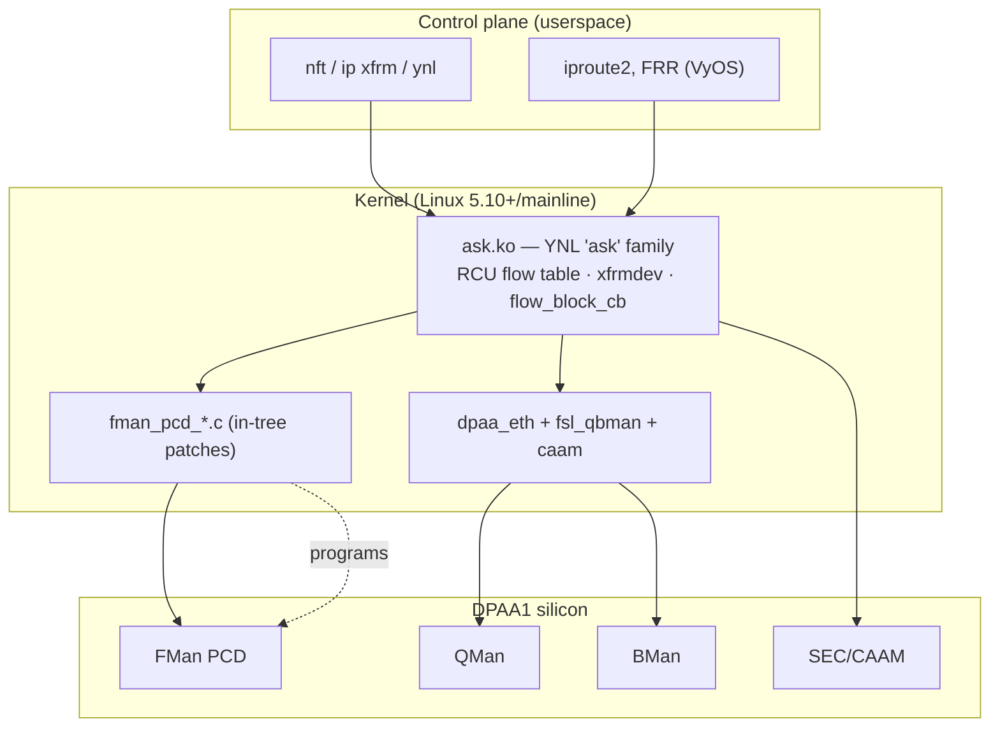
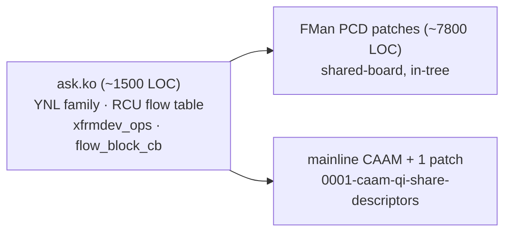
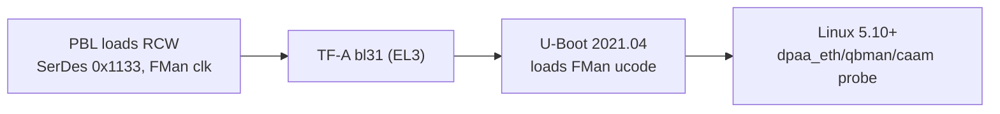

# Software Stack — SDK / ASK / ASK2 / LSDK & how it binds to the silicon

**Version 2.2 · HADS 1.0.0**

## AI READING INSTRUCTION

> **⚠ ADDENDUM (2026-08-05) to the 2026-08-04 correction below — the Fork-B story moved again.**
> F-163 (commit `f212c701`) **un-retired** Fork-B: the genuine deployed vendor `cdx.ko` driver's
> production classification path **is** external-hash (`cdx_ehash.c`: `insert_entry_in_classif_table()`
> → `fill_key_info()` → `ExternalHashTableAddKey()`), so "not the vendor architecture" is refuted.
> This branch's ehash key builder was missing the vendor's leading PORT_ID byte (`union dpa_key`,
> 14 B total); F-163 added it (`EKFC 0x801C0006`). The F-163 live test on `.185` was byte-correct
> end-to-end yet still MISSed — but F-165 (commit `e4f23948`) then proved that test never reached
> the ehash chain at all: F-091's CONT_LOOKUP scaffold unconditionally overwrote the caller's
> `fe_enter_off` with its own scaffold offset (board-confirmed via live `fmbm_rccb` read). So the
> "proven to never dispatch a HIT" framing in the banner below is itself overstated — the corrected
> chain has never been genuinely tested. **Current reality: no confirmed hardware HIT on either
> path; Fork-B un-retired and under active re-validation (F-165 retest is the immediate step);
> CC-tree absent from `ask.ko` AND its `cc_test` harness architecturally broken (F-159–F-162:
> five vendor-verified register fixes, still RX-silent within 17–30 frames vs `.106` vendor stack's
> 400+).** Byte-level oracle path: `plans/archive/NXP-106-DEEP-DIVE-PLAN.md` Phases A/C.
>
> **Vendor-stack observability note (2026-08-05):** on `.106`, `cmm`'s connection tracker is
> functionally deaf — its vendored, statically-linked libnetfilter_conntrack 1.1.0 (+ comcerto-fp
> patch) never dispatches into `__cmmCtCatch()` (zero CT-TRACE events across every boot Aug 1–5,
> even under TTL-verified 3-hop transit). Consequently `/proc/fqid_stats/pcd/*/*` counters do NOT
> move with flow traffic and are **not usable as a HIT/MISS oracle** — use direct register/MURAM
> reads (`bin/kg-scheme-read.py`, `bin/muram-mmap-dump.py`). Root cause:
> `specs/conntrack-root-cause-analysis.md` + qdrant "cmm-root-cause-CORRECTED" (2026-08-05).
> The earlier "auto_bridge L2-path" guess was retracted the same day (commit `cd5bf90b`).

> **⚠ CRITICAL CORRECTION (2026-08-04) — §7, §8, and §9 below are WRONG about what is currently wired.**
> §7 and §9 assert CC-tree is the shipping insert path and §8 asserts FE-VM ehash "is NOT shipping."
> This is backwards as of current HEAD. Commit `dd364494` (CR-007, 2026-07-27) deleted CC-tree's
> flow-insert code from `ask.ko` (all callers of `fman_pcd_cc_node_add_key()` removed). The only insert
> path actually wired today is `ask_fe_flow_insert()` → `fman_pcd_fe_flow_add()` →
> `fman_pcd_ehash_add_key()` (confirmed against patch `0153-fman-pcd-fe-engage-api.patch`) — i.e.
> **FE-VM ehash (Fork-B), the mechanism §8 calls "NOT shipping."** Fork-B is separately proven
> (F-156/F-157/F-158) to never dispatch a HIT. Net: as of 2026-08-04, `ask.ko` has **no working
> hardware-classification insert path** — CC-tree is absent from the code, and the one mechanism left
> wired is the one already proven broken. §9's numbered runtime steps (2, 3, 6) describing "CC tree"
> insert/lookup/teardown do not correspond to any function that currently executes. **Retraction
> (2026-08-04, later same day) on the M5 measurement:** this banner previously claimed M5 (10.259 Gbps,
> 2026-07-24) definitely used CC-tree because `ask_fe_flow_insert()` "didn't exist until 2026-07-26" —
> that was a git-history artifact of a path-filtered pickaxe search not following a later file rename;
> the function (under a different source path) and its unconditional call from the REPLACE handler both
> already existed at M5 time, and `ask_hw_flow_insert()`'s own contemporaneous comment at that commit
> states the CC-tree shadow array was already software-only bookkeeping, never reaching hardware.
> **M5's mechanism is therefore uncertain, not confirmed CC-tree** — most likely pure kernel software
> forwarding, since neither CC-tree nor ehash produced a working HIT at M5 time. The project may never
> have silicon-confirmed a genuine hardware-classified HIT at production throughput at any point. What's
> below reflects the 2026-08-01 *decision* to standardize on CC-tree, not the code that implements it,
> and not a confirmed-working prior baseline. Full evidence: qdrant `agent_memory`, tag
> `no-confirmed-hw-hit-ever`, dated 2026-08-04.

This document maps the ASK2 software stack onto DPAA1 silicon. The intended offload mechanism per the
2026-08-01 decision is **CC-tree classification + kernel SW flowtable + manip-chain forwarding** (§7),
but per the corrections above this is not currently implemented in `ask.ko`, and its hardware harness
is broken. FE-VM ehash HIT (Fork-B, §8) is the mechanism actually wired — un-retired 2026-08-05
(F-163), still without a confirmed HIT. All facts tagged `[SPEC]`
or `[NOTE]` should be read as describing the target architecture, not verified current behavior, until
§7/§8/§9 are rewritten.

---

**Purpose:** the bridge between the hardware reference docs (this directory) and the ASK2
implementation. It explains the *software* lineage that drives DPAA1 — vendor SDK, the legacy
**ASK** reference stack, the modern **ASK2** rewrite, mainline Linux, and the NXP doc corpus (LSDK
21.08 / LLDPUG L6.1.1) — and maps each software layer onto the hardware blocks documented in
[`dpaa1-architecture.md`](dpaa1-architecture.md), [`fman.md`](fman.md), [`fman-pcd.md`](fman-pcd.md),
[`qman-ceetm.md`](qman-ceetm.md), [`bman.md`](bman.md), [`sec-caam.md`](sec-caam.md).



---

## 1. The four software lineages (don't conflate them)

| Lineage | What it is | Status for us |
|---|---|---|
| **NXP SDK / DPAA FLib** | Vendor C library (`libfm`, FMC, FMan Driver "FMD") that builds PCD config from XML (NetPDL/NetPCD). Userspace-driven. | reference algorithms only |
| **ASK** (legacy) | The board's existing vendor-derived offload stack (`ask-ref`/`ask`, `fmc`/`libfmc`) — the thing ASK2 replaces. | being replaced |
| **ASK2** (target) | Modern kernel-native rewrite to **ASK feature-parity**: `ask.ko` OOT module + in-tree `fman_pcd_*.c` + mainline CAAM. **No userspace daemon.** | **what we're building** |
| **LSDK 21.08 / LLDPUG L6.1.1** | NXP's documentation + release snapshots (kernel 5.10.35, U-Boot 2021.04, TF-A 2.4). Source of driver behaviour + version truth. | doc/reference corpus |

> The legacy SDK path programs the FMan PCD from **userspace XML via FMC**. ASK2 deliberately moves
> that into the **kernel** (`fman_pcd_*.c`, `CONFIG_FSL_FMAN_PCD=y`) so policy is driven by standard
> Linux control planes (nftables, `ip xfrm`, YNL) instead of a vendor daemon.

---

## 2. ASK2 component decomposition (spec §1.3, §13)



- **`ask.ko`** — the offload brain: a YNL netlink family `ask`, an RCU flow table, `xfrmdev_ops`
  (IPsec SA offload), and `flow_block_cb` (tc/flower hardware offload hooks). Kernel-only control.
- **FMan PCD in-tree patches** (`fman_pcd_*.c`, exposed via `<linux/fsl/fman_pcd.h>`, patches
  0092/0097–0100) — the per-file decomposition maps 1:1 to the hardware in [`fman-pcd.md`](fman-pcd.md):

  | File | HW block ([`fman-pcd.md`](fman-pcd.md)) |
  |---|---|
  | `fman_pcd.c` | orchestration / port attach |
  | `fman_pcd_prs.c` | Parser (HXS) |
  | `fman_pcd_kg.c` | KeyGen (exact-match, `match_vector≠0`) |
  | `fman_pcd_cc.c` | Coarse Classification trees (+`FORWARD_FQ_WITH_MANIP`) |
  | `fman_pcd_manip.c` | Header manip (NAT/VLAN/TTL/cksum) — **Risk #13 budgeting** |
  | `fman_pcd_plcr.c` | Policer (RFC4115) |
  | `fman_pcd_replic.c` | Frame replicator (multicast / OP2 flood) |

- **mainline CAAM + `0001-caam-qi-share-descriptors.patch`** — reuses upstream CAAM but enables the
  QI shared-descriptor path so the FMan fast path can dequeue→SEC→reinject without the CPU
  ([`sec-caam.md`](sec-caam.md) §3).

---

## 3. Classic driver stack (what ASK2 builds on)

The mainline DPAA1 drivers that remain underneath ASK2:

| Driver | Role | HW doc |
|---|---|---|
| `fsl_qbman` (qman/bman) | portal init, FQ/BP alloc, FQD/PFDR/FBPR reserved-mem | [`qman-ceetm.md`](qman-ceetm.md), [`bman.md`](bman.md) |
| `fman` + `fman_port` + `fman_memac` | FMan block, BMI ports, MACs | [`fman.md`](fman.md), [`serdes-ethernet.md`](serdes-ethernet.md) |
| `dpaa_eth` | netdev ↔ FQ binding (Rx default/error/PCD FQs, Tx conf) | [`dpaa1-architecture.md`](dpaa1-architecture.md) |
| `caam` (+ `caam_qi`) | crypto / IPsec via JR and QI | [`sec-caam.md`](sec-caam.md) |

`dpaa_eth` is the linchpin: it owns the netdev and the default/error FQs; ASK2's PCD layer steers
*selected* flows into dedicated FQs/channels ahead of it, and uses the **OH (offline) ports** OP1/OP2
for IPsec reinject and bridge flood ([`fman.md`](fman.md), [`serdes-ethernet.md`](serdes-ethernet.md) §4).

---

## 4. Boot → DPAA-ready (where the HW config actually lands)



- **RCW** (512-bit) sets SerDes protocol `0x1133`, FMan clock (~700 MHz), RGMII mux — see
  [`soc-integration.md`](soc-integration.md) §3. **NAND is not a valid RCW source.**
- **FMan microcode** (QEF/`fsl_fman_ucode…`) is loaded by U-Boot from QSPI offset `0x300000`. Stock
  **QEF 210.10.1** ucode does **not** use CEV doorbell/REV events — relevant to the FMan event-IRQ
  discrepancy noted in [`soc-integration.md`](soc-integration.md) §4. Ucode version **must** match the
  FMan driver.
- **Reserved memory** (DTS): `fsl,bman-fbpr`, `fsl,qman-fqd`, `fsl,qman-pfdr` carve DDR for the HW
  managers — these are the FBPR/FQD/PFDR backing stores from [`bman.md`](bman.md)/[`qman-ceetm.md`](qman-ceetm.md).
- **RNG4 instantiation** at CAAM probe is mandatory or crypto self-tests fail ([`sec-caam.md`](sec-caam.md) §4).

Board identity (Mono Gateway DK / RDB lineage): SoC `0x8707_0010`, default RCW dir
`RR_FFPPPN_1133_5559`, console `earlycon=uart8250,mmio,0x21c0500`. Netdev map in
[`serdes-ethernet.md`](serdes-ethernet.md) §4.

---

## 5. Mainline vs SDK split (what's upstream vs patched)

| Capability | Mainline | ASK2 adds |
|---|---|---|
| dpaa_eth / qbman / memac | ✅ upstream | — |
| CAAM (JR path) | ✅ upstream | QI share-desc patch |
| FMan **PCD** (parser/keygen/CC/policer/manip/replic) | ❌ not in mainline | **in-tree `fman_pcd_*.c` patches** |
| 10GBASE-KR link training | ❌ (fixed XFI only) | out-of-scope (OOT, AN12572) |
| Offload control plane | ❌ | **`ask.ko`** (YNL/xfrm/flower) |

The PCD layer is the single biggest gap mainline doesn't fill — which is exactly why
[`fman-pcd.md`](fman-pcd.md) is the flagship hardware doc and `fman_pcd_*.c` is the bulk of the patch set.

---

## 6. ASK2 relevance (summary)

| Software layer | Maps to HW doc | ASK2 artifact |
|---|---|---|
| `ask.ko` flow table / YNL | [`dpaa1-architecture.md`](dpaa1-architecture.md) FQ model | the offload brain |
| `fman_pcd_*.c` | [`fman-pcd.md`](fman-pcd.md) | in-tree PCD patches |
| `caam_qi` + share-desc patch | [`sec-caam.md`](sec-caam.md) | IPsec offload |
| `dpaa_eth` FQ/channel binding | [`qman-ceetm.md`](qman-ceetm.md) | scheduling/QoS |
| OH ports OP1/OP2 | [`fman.md`](fman.md) §OH | reinject + flood |
| RCW/ucode/reserved-mem | [`soc-integration.md`](soc-integration.md) | bring-up DTS |

---

## 7. Intended offload mechanism: CC-tree + SW flowtable + manip chain (not currently wired)

> **⚠ CORRECTION (2026-08-04):** despite the "shipping" label below, `ask.ko`'s CC-tree insert path
> was deleted by CR-007 (`dd364494`, 2026-07-27) and never restored. No live code path currently
> installs a CC-tree entry. See the AI READING INSTRUCTION banner at the top of this file.
>
> **⚠ ADDENDUM (2026-08-05):** the CC-tree hardware harness (`cc_test`, patch 0107) is additionally
> proven architecturally broken on silicon: five vendor-verified register fixes (F-159 EKFC
> composite, F-160 `next_engine=3` AC_CC graft, F-161 live-EKFC realignment, F-162 `NIA_KG_DIRECT`)
> still left the port RX-silent within 17–30 frames (surviving `clear`, reboot-required), while
> `.106`'s vendor stack classified 400+ frames at 0% loss in the same session. Per
> `plans/archive/NXP-106-DEEP-DIVE-PLAN.md`, `cc_test` is to be retired rather than further patched; the
> vendor `t_ExtHashFe` decode (Phase A) is the byte-level oracle for whatever replaces it.

**[SPEC, intended architecture — not currently implemented, see correction above]** The ASK2 shipping HW-offload path uses **CC-tree classification (top-N flows) + kernel
software flowtable (tail flows) + FMan manip-chain forwarding**. This is the Linux flow-offload
model: the FMan PCD Coarse Classification tree matches the top ~2000 flows in hardware; the kernel
`nf_flowtable` handles the tail; both paths use the same FMan header-manipulation chain for
NAT/VLAN/TTL/cksum rewriting.

**[SPEC]** Per-interface engagement via VyOS CLI:
```
set interfaces ethernet eth<n> offload ask
```
This engages `ask.ko` + kernel `fman_pcd` + netfilter flowtable on the specified interface. ASK and
VPP are **mutually exclusive per interface** — one port cannot be both, but other ports are free.

**[SPEC]** Claimed throughput (Mono Gateway DK, 10G SFP+):
- **CC pass-through (M2):** 7.37 Gbps @ 0.16% loss — real pass-through, no false positive (but
  pass-through is MISS→kernel delivery, **not** hardware offload).
- **"CC-tree + nf_flowtable" (M5):** 10.259 Gbps @ 0.16% loss — **mechanism unresolved**: most
  likely kernel `nf_flowtable` software forwarding alone, since neither CC-tree nor ehash was a
  functioning HW-classification path at M5 time (qdrant tag `no-confirmed-hw-hit-ever`).
- **NXP cdx.ko (reference):** 8.58 Gbps via opcode/manip chain — vendor baseline.

**[SPEC]** CC-tree architecture:
- **CC comparator reads KG-emitted bytes** (patch 0108). The KeyGen extracts the 6-tuple in
  **EKFC MSB-first order: PORT_ID → SIP → DIP → PROTO → SPORT → DPORT** (14 bytes, EKFC=`0x801C0006`).
  PORT_ID = `0x00` for eth4/port 0x11. HW-confirmed 2026-08-06/07/08. The old 13-byte `0x001C0006`
  (5-tuple, no PORT_ID) is superseded.
- **Scaling:** 32 software caps vs 255 hardware keys per CC node. 64 KiB MURAM budget yields
  ~8 CC nodes → ~2000+ flows in hardware.
- **Only real HIT path:** RCCB → FE_ENTER direct dispatch (confirmed 2026-07-04). No CC group
  table, no node table, no match table — the CC tree is the sole classification path.

**[NOTE]** The M3/M5 "HIT PASSED" results were false positives. The M2 7.37 Gbps pass-through
measurement is the only real HIT benchmark. All subsequent measurements use the CC-tree + SW
flowtable stack.

---

## 8. FE-VM ehash HIT path (Fork-B) — UN-RETIRED 2026-08-05, under re-validation

> **⚠ UN-RETIREMENT (2026-08-05, supersedes the "dead end / intended to not ship" text below):**
> F-163 (commit `f212c701`) established that the genuine deployed vendor `cdx.ko` driver's
> production classification path **is** external-hash — `cmm`'s connection tracker inserts every
> accelerated flow via `insert_entry_in_classif_table()` → `fill_key_info()` →
> `ExternalHashTableAddKey()` (`cdx_ehash.c`, nxp-sdk branch). The vendor key is
> `portid(1B)|SIP|DIP|PROTO|SPORT|DPORT` = 14 B (`union dpa_key`, `cdx_common.h`); this branch's
> key builder was missing the leading PORT_ID byte and F-163 added it (`KG_SCH_KN_PORT_ID`, EKFC
> `0x801C0006`). The "not vendor architecture" leg of the 2026-08-01 retirement is **refuted**
> (mechanism citation: SDK `fm_kg.c` `GetKnownFieldId()`, commit `94b89b95`). Still standing: no
> confirmed HIT on this branch's silicon, and the ~1.5 Gbps DDR-ceiling claim is unmeasured against
> real vendor traffic. The F-163 live test was byte-correct but MISSed because the engage path
> never pointed the port at the built chain — F-165 (commit `e4f23948`) fixed that
> scaffold-overwrite; retest is the immediate open step.

> **⚠ CORRECTION (2026-08-04):** despite the "[SPEC] ... NOT shipping" text below, Fork-B
> (FE-VM ehash) is the *only* flow-insert mechanism currently wired into `ask.ko`
> (`ask_fe_flow_insert()` → `fman_pcd_fe_flow_add()` → `fman_pcd_ehash_add_key()`). It was intended
> to be retired on 2026-08-01, but the retirement only updated documentation — CC-tree, the intended
> replacement, was never rewired in (its code was deleted 2026-07-27, before the retirement decision).
> There is no `if (0)` guard blocking Fork-B in the current insert path; it runs live on every REPLACE.
> ~~It is separately proven (F-156/F-157/F-158) to never dispatch a HIT.~~ *(2026-08-05: overstated —
> F-156/157/158 predated the corrected key format and the F-165 engage fix; no genuine test of the
> corrected chain has been run.)*

**[SPEC, architectural intent — 2026-08-01, SUPERSEDED 2026-08-05]** The FE-VM ehash exact-match HIT path (Fork-B) is a **dead end** and is
**intended to not ship** per the 2026-08-01 decision — but see the corrections above: it is in fact the
only mechanism currently wired, and it is the vendor's real production mechanism. The "~1.5 Gbps DDR
ceiling" figure is an unmeasured theoretical bound, not a silicon measurement.

**[NOTE]** Fork-B was the original ASK2 design target (FE-VM + ehash table for per-flow exact
match). The 2026-08-01 decision intended to supersede it with the CC-tree + SW flowtable model after
silicon measurements proved the DDR ceiling makes FE-VM ehash non-viable for line-rate forwarding, but
that supersession was never implemented in code (see correction above), and its "not vendor
architecture" premise was refuted by F-163.

**[SPEC — current, 2026-08-05]** Fork-B is the live insert path and the near-term HIT candidate:
the immediate validation step is the F-165 retest — arm a real FE_ENTER root AD as the port's CC
target with `EKFC=0x801C0006` and the 14-byte PORT_ID-prefixed key, and check for a genuine
hardware HIT. CC-tree restoration (§7 correction) remains a separate, larger task whose hardware
harness is itself broken (F-159–F-162).

---

## 9. ask.ko stack: runtime dataplane model

> **⚠ CORRECTION (2026-08-04, amended 2026-08-05):** steps 2, 3, and 6 below describe CC-tree operations. As of current
> HEAD, `ask.ko` does not perform any of these against a CC tree — the actual call chain for step 2 is
> `ask_flow_offload.c`'s REPLACE handler → `ask_fe_flow_insert()` → `fman_pcd_fe_flow_add()` →
> `fman_pcd_ehash_add_key()` (FE-VM ehash, not CC-tree), which has no confirmed HIT (and whose
> corrected 14-byte-key chain has never been genuinely exercised — F-163/F-165). Steps 1, 4, 5 (KG scheme programming, manip chain, neighbor maintenance) are accurate as
> general silicon/driver mechanisms but their "CC tree"/"CC-tree entry" wording should be read as
> "flow table entry (mechanism currently ehash, not CC-tree)."

**[SPEC, intended model — see correction above for current reality]** The `ask.ko` stack is intended to operate as follows at runtime:

1. **Engage:** `set interfaces ethernet eth<n> offload ask` triggers `ask.ko` to program the
   FMan PCD on that port: KG scheme (EKFC `0x801C0006`, 6-tuple extraction with PORT_ID), CC tree root,
   and default forward-to-kernel FQ.
2. **Flow insertion (intended CC-tree; actual mechanism is ehash, see correction):** `nf_flowtable`
   (or `vyos-offload-ask` YNL command) is intended to insert top-N flows into the CC tree. The kernel
   SW flowtable handles the tail. Currently, flows are instead inserted into the FE-VM ehash table,
   which never dispatches a HIT.
3. **Fast path (intended; not currently working):** FMan PCD is intended to classify frames through
   the CC tree. HIT → manip chain → direct forward (no CPU). MISS → default FQ → kernel
   `nf_flowtable` → software forward. Since no CC-tree entries are ever installed (step 2), every
   frame currently takes the kernel software forward path.
4. **Manip chain:** FMan header manipulation rewrites NAT/VLAN/TTL/cksum in hardware for both
   CC-tree HIT and SW-flowtable paths.
5. **Neighbor maintenance:** `ask_neigh.c` (part of `ask.ko`) listens for `NETEVENT_NEIGH_UPDATE`
   (ARP/ND changes) and rewrites the stored destination-MAC in an already-installed flow-table
   entry's manip chain when a neighbor's MAC changes — keeps HIT-path header rewrites correct
   without removing and reinstalling the flow. (In practice currently inert, since step 2 never
   installs a working HW-backed entry.)
6. **Disengage:** `delete interfaces ethernet eth<n> offload ask` tears down the KG scheme,
   CC tree, and FQ bindings; the port returns to kernel-only forwarding.

**[SPEC]** YNL family `ask` provides the netlink control plane. `vyos-offload-ask` is the
userspace CLI tool that speaks YNL to `ask.ko`.

*Related: every sibling doc — this one is the map from code to silicon. Primary spec:
`../specs/ask2-rewrite-spec.md` (§1.3 design, §13 PCD modules, §16 Risk #13). Plans: `../plans/`.*