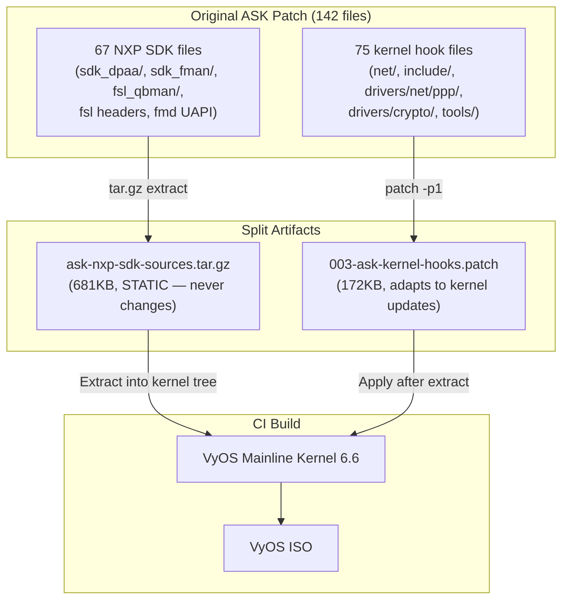
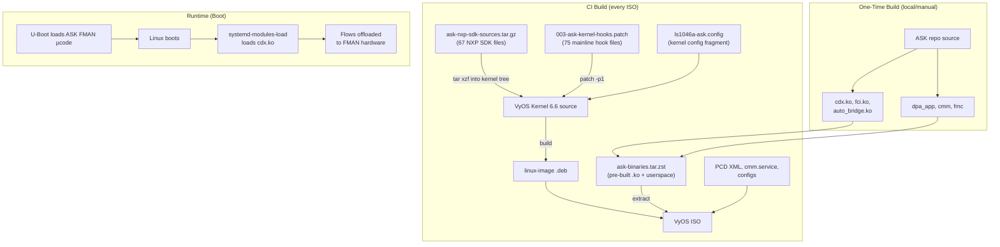
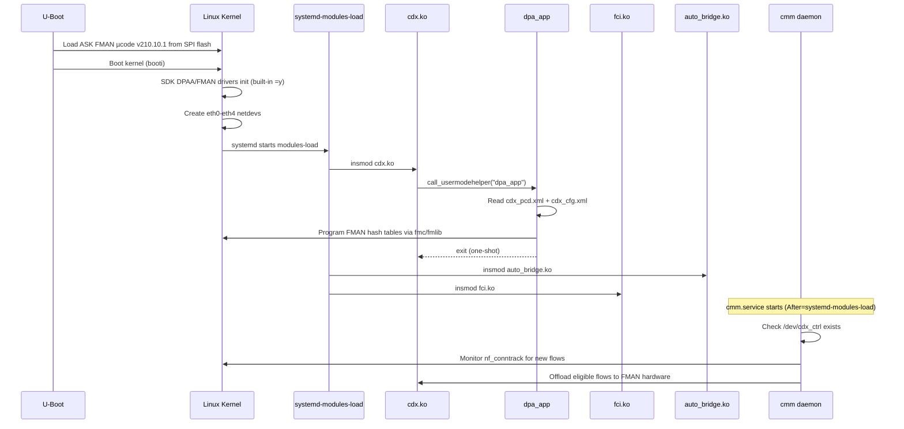

# ASK Integration Plan — Mainline Kernel Split Approach

Complete plan for integrating NXP ASK (Application Solutions Kit) hardware offload into the VyOS LS1046A build. The kernel patch is split into two artifacts: a **static NXP SDK source tarball** (never changes) and a **kernel-hooks patch** (adapts to kernel updates).

> **Key constraint:** VyOS uses a **mainline Debian kernel** (6.6 LTS), NOT the NXP SDK kernel. The ASK patch must apply to mainline.

---

## Current State (2026-04-09)

### Completed Work

| Item | Status | Details |
|------|--------|---------|
| ASK 6.12→6.6 port | ✅ Done | All 142 files ported to NXP kernel 6.6.52 (`nxp-linux/` branch `ask-6.6-port`) |
| NXP SDK tarball | ✅ Done | `data/kernel-patches/ask-nxp-sdk-sources.tar.gz` — 67 files, 681KB |
| Kernel-hooks patch | ✅ Done | `data/kernel-patches/003-ask-kernel-hooks.patch` — 75 files, 5,797 lines |
| Mainline v6.6 test | ✅ Done | Dry-run against kernel.org v6.6 — **ALL HUNKS SUCCEEDED (0 failures)** |
| NXP→mainline fixes | ✅ Done | 2 hunks fixed: `br_input.c` (NXP promisc param), `ip_output.c` (NXP IP_INC_STATS) |

### Source Inventory

| Source | Location | Status |
|--------|----------|--------|
| NXP SDK kernel 6.6.52 (full tree) | `nxp-linux/` (tag `lf-6.6.52-2.2.0`, branch `ask-6.6-port`) | ✅ Full checkout, 6.0GB |
| ASK kernel patch for 6.12 (reference) | `ASK/patches/kernel/002-mono-gateway-ask-kernel_linux_6_12.patch` | ✅ 19,543 lines, 142 files |
| ASK kernel patch for 5.4 (reference) | `ASK/patches/kernel/999-layerscape-ask-kernel_linux_5_4_3_00_0.patch` | ✅ 25,798 lines, 162 files |
| CDX/FCI/auto_bridge module source | `ASK/cdx/`, `ASK/fci/`, `ASK/auto_bridge/` | ✅ Full source, builds out-of-tree |
| dpa_app + cmm userspace | `ASK/dpa_app/`, `ASK/cmm/` | ✅ Full source |
| PCD XML + configs | `ASK/config/`, `ASK/dpa_app/files/` | ✅ Complete |

---

## The Split Approach

The original 142-file ASK kernel patch was generated against the NXP SDK kernel. VyOS uses a mainline kernel, so the patch must be split into two artifacts:



### Why Split?

| Concern | NXP SDK files (67) | Kernel hook files (75) |
|---------|-------------------|----------------------|
| **Change frequency** | Never — NXP SDK code is frozen | Every kernel update may shift context |
| **Mainline presence** | Do NOT exist in mainline — must be injected | Modify existing mainline files |
| **Dependency** | Zero dependency on kernel version | Context lines must match exact kernel version |
| **Maintenance** | Extract once, never touch again | Re-verify/re-port on kernel bumps |

### Artifact Details

#### 1. NXP SDK Source Tarball (`ask-nxp-sdk-sources.tar.gz`)

**681KB, 67 files.** Static NXP SDK driver sources extracted from the ASK-patched NXP kernel tree (`nxp-linux/` branch `ask-6.6-port`).

These files **do not exist in mainline Linux** — they are NXP-only additions. They are extracted to the kernel tree before building.

```
drivers/net/ethernet/freescale/sdk_dpaa/    (11 files)
  Kconfig, dpaa_eth.c/.h, dpaa_eth_common.c/.h, dpaa_eth_sg.c,
  dpaa_eth_ceetm.c, dpaa_ethtool.c, mac-api.c, mac.h, offline_port.c

drivers/net/ethernet/freescale/sdk_fman/    (48 files)
  Pcd/ (fm_cc.c, fm_ehash.c/.h, fm_kg.c, fm_manip.c, fm_pcd.c, fm_plcr.c, ...),
  Port/ (fm_port.c/.h, fman_port.c), SP/ (fm_sp_common.c/.h),
  MAC/ (dtsec.c, memac.c, tgec.c, fm_mac.c/.h), HC/ (hc.c),
  inc/ (fm_ext.h, fm_pcd_ext.h, fm_port_ext.h, ...),
  src/wrapper/ (lnxwrp_*.c/.h)

drivers/staging/fsl_qbman/                  (4 files)
  Kconfig, fsl_usdpaa.c, qman_config.c, qman_high.c

include/linux/fsl_oh_port.h                 (1 file, NEW)
include/uapi/linux/fmd/                     (3 files)
```

#### 2. Kernel Hooks Patch (`003-ask-kernel-hooks.patch`)

**5,797 lines, 75 files, 172KB.** Applies to mainline Linux 6.6. Adds ASK fast-path hooks to standard kernel subsystems.

Tested: **ALL HUNKS SUCCEEDED** against kernel.org `v6.6` (0 failures, some offset adjustments).

| Subsystem | Files | Description |
|-----------|-------|-------------|
| `net/netfilter/` | 8 (3 NEW) | `comcerto_fp_netfilter.c`, `xt_qosmark.c`, `xt_qosconnmark.c`, conntrack hooks |
| `net/bridge/` | 7 | L2 fast-path notifications on FDB/STP/VLAN changes |
| `net/core/` | 4 | `cpe_fp_tx()` in `__dev_queue_xmit`, SKB recycling, rtnetlink |
| `net/xfrm/` | 8 (2 NEW) | `ipsec_flow.c/.h`, SA/SP lifecycle for hardware IPsec |
| `net/ipv4/` | 3 | Fast-path forwarding, IPsec output offload |
| `net/ipv6/` | 7 | Fast-path, tunnel support, ESP6, UDP |
| `include/linux/` | 4 | `netdevice.h`, `skbuff.h`, `if_bridge.h`, `poll.h` — struct additions |
| `include/net/` | 5 | `xfrm.h`, `tcp.h`, `ip.h`, `nf_conntrack.h`, `ip6_tunnel.h` |
| `include/uapi/linux/` | 10 | `if.h`, `if_arp.h`, `rtnetlink.h`, `netlink.h`, netfilter headers |
| `include/uapi/linux/netfilter/` | 7 (4 NEW) | QOSMARK/QOSCONNMARK structs |
| `drivers/` | 3 | `crypto/caam/pdb.h`, `net/ppp/`, `net/usb/usbnet.c` |
| Other | 4 | Root `Makefile`, `net/Kconfig`, `net/wireless/`, `tools/perf/.gitignore` |

### NXP→Mainline Fixes Applied

Two hunks in the original patch used NXP-specific context that doesn't exist in mainline:

| File | Issue | Fix |
|------|-------|-----|
| `net/bridge/br_input.c` | NXP adds `bool promisc` parameter to `br_pass_frame_up()` and `BR_INPUT_SKB_CB(skb)->promisc = promisc;` line. Mainline has neither. | Removed promisc from function signature in context, removed promisc context line |
| `net/ipv4/ip_output.c` | NXP adds `IP_INC_STATS(net, IPSTATS_MIB_OUTREQUESTS);` inside `__ip_local_out()`. Mainline doesn't have this line. | Removed NXP-only context line, adjusted to use `iph_set_totlen()` as context |

---

## Architecture



---

## CI Integration

### Kernel Setup Script

The existing `bin/ci-setup-kernel.sh` needs to be extended (or a new `bin/ci-setup-kernel-ask.sh` created) to:

1. Extract NXP SDK sources into the kernel tree
2. Apply the kernel-hooks patch
3. Append ASK kernel config

```bash
#!/usr/bin/env bash
# bin/ci-setup-kernel-ask.sh — ASK kernel integration
# Called AFTER ci-setup-kernel.sh (which sets up mainline config + patches)
set -euo pipefail

KERNEL_SRC="$1"  # Path to kernel source tree (e.g., vyos-build/packages/linux-kernel/linux)

# 1. Extract NXP SDK sources (67 files — sdk_dpaa, sdk_fman, fsl_qbman, headers)
echo "Extracting ASK NXP SDK sources..."
tar xzf data/kernel-patches/ask-nxp-sdk-sources.tar.gz -C "$KERNEL_SRC"

# 2. Apply kernel hooks patch (75 files — mainline-compatible)
echo "Applying ASK kernel hooks patch..."
patch --no-backup-if-mismatch -p1 -d "$KERNEL_SRC" < data/kernel-patches/003-ask-kernel-hooks.patch

# 3. Append ASK kernel config fragment
echo "Appending ASK kernel config..."
cat data/kernel-config/ls1046a-ask.config >> "$KERNEL_SRC/arch/arm64/configs/vyos_defconfig"
```

### Kernel Config Fragment (`data/kernel-config/ls1046a-ask.config`)

```
# ASK Fast Path
CONFIG_CPE_FAST_PATH=y
CONFIG_FSL_SDK_DPA=y
CONFIG_FSL_SDK_DPAA_ETH=y
CONFIG_FSL_DPAA_1588=y
CONFIG_FSL_DPAA_ETH_MAX_BUF_COUNT=640
CONFIG_NETFILTER_XT_QOSMARK=y
CONFIG_NETFILTER_XT_QOSCONNMARK=y
CONFIG_INET_IPSEC_OFFLOAD=y
CONFIG_MODVERSIONS=y
```

> **Critical:** `CONFIG_FSL_SDK_DPAA_ETH` and mainline `CONFIG_FSL_DPAA_ETH` cannot both be `=y`. The ASK approach uses SDK drivers for all FMan MACs. The setup script must disable mainline DPAA ETH.

### Workflow Steps (in `auto-build.yml`)

```yaml
    # After kernel setup, before build:
    - name: Setup ASK kernel (SDK sources + hooks patch)
      run: bin/ci-setup-kernel-ask.sh vyos-build/packages/linux-kernel/linux

    # After package build, before ISO:
    - name: Extract ASK binaries
      run: |
        mkdir -p /tmp/ask-staging
        tar --zstd -xf data/ask-binaries.tar.zst -C /tmp/ask-staging/
```

---

## Maintenance: Kernel Version Updates

When VyOS bumps the kernel version (e.g., 6.6 → 6.12):

| Artifact | Action needed |
|----------|---------------|
| `ask-nxp-sdk-sources.tar.gz` | **None** — NXP SDK files don't change |
| `003-ask-kernel-hooks.patch` | **Re-port** — context lines may shift. Dry-run test: `patch --dry-run -p1 < 003-ask-kernel-hooks.patch`. Fix any rejected hunks. |
| `ask-binaries.tar.zst` | **Rebuild .ko modules** — kernel ABI changes. Userspace binaries (`cmm`, `dpa_app`) do NOT need rebuilding. |
| `ls1046a-ask.config` | **Verify** — Kconfig symbols may change names |

The split approach means **only the 172KB hooks patch needs updating** on kernel bumps. The 681KB SDK tarball and all userspace binaries are untouched.

### Re-porting the Hooks Patch

```bash
# Test against new kernel source:
cd /path/to/new-kernel-source
patch --dry-run -p1 --no-backup-if-mismatch < data/kernel-patches/003-ask-kernel-hooks.patch

# If hunks fail, fix context lines:
# 1. Apply with --reject to see .rej files
# 2. Fix each .rej manually (usually just shifted line numbers)
# 3. Generate new patch from the fixed tree
```

---

## Component Inventory

### What Goes in the Repo

| File | Size | Type | Purpose |
|------|------|------|---------|
| `data/kernel-patches/ask-nxp-sdk-sources.tar.gz` | 681KB | Regular git | 67 NXP SDK source files (static) |
| `data/kernel-patches/003-ask-kernel-hooks.patch` | 172KB | Regular git | 75 kernel hook modifications (mainline-compatible) |
| `data/kernel-config/ls1046a-ask.config` | ~0.5KB | Regular git | ASK kernel config fragment |
| `data/ask-binaries.tar.zst` | ~2-5MB | Git LFS | Pre-built aarch64 .ko + userspace binaries |
| `data/hooks/97-ask-fast-path.chroot` | ~2KB | Regular git | Installs ASK into ISO chroot |
| `data/systemd/cmm.service` | ~0.5KB | Regular git | CMM systemd unit |
| `data/systemd/ask-modules.conf` | ~0.1KB | Regular git | Module load order |
| `data/scripts/cdx_pcd.xml` | ~10KB | Regular git | FMAN PCD classification tables |
| `data/scripts/cdx_cfg.xml` | ~2KB | Regular git | Port-to-policy mapping |
| `data/scripts/fastforward` | ~0.5KB | Regular git | CMM traffic exclusion |
| `bin/ci-setup-kernel-ask.sh` | ~1KB | Regular git | CI: extract SDK + apply hooks patch |

### External Dependencies (Userspace — Phase 2)

| Component | Repository | ASK Patch |
|-----------|-----------|-----------|
| fmlib | `github.com/nxp-qoriq/fmlib` | `ASK/patches/fmlib/01-mono-ask-extensions.patch` |
| fmc | `github.com/nxp-qoriq/fmc` | `ASK/patches/fmc/01-mono-ask-extensions.patch` |
| libcli | `github.com/dparrish/libcli` | None (used as-is) |
| iptables | `apt-get source iptables` | `ASK/patches/iptables/001-qosmark-extensions.patch` |
| libnetfilter-conntrack | `apt-get source` | `ASK/patches/libnetfilter-conntrack/01-nxp-ask-comcerto-fp-extensions.patch` |
| libnfnetlink | `apt-get source` | `ASK/patches/libnfnetlink/01-nxp-ask-nonblocking-heap-buffer.patch` |
| iproute2 | `apt-get source` | `ASK/patches/iproute2/01-nxp-ask-etherip-4rd.patch` |
| ppp | `apt-get source` | `ASK/patches/ppp/01-nxp-ask-ifindex.patch` |
| rp-pppoe | `apt-get source` | `ASK/patches/rp-pppoe/01-nxp-ask-cmm-relay.patch` |

---

## Runtime Behavior

### Boot Sequence with ASK



### Graceful Degradation

ASK is **fully optional** at runtime:

1. **No ASK FMAN microcode loaded:** CDX module loads but `/dev/cdx_ctrl` is never created → `cmm.service` never starts (guarded by `ConditionPathExists=/dev/cdx_ctrl`) → system operates as normal VyOS with software forwarding
2. **ASK modules not loaded:** System operates identically to current mainline build
3. **CMM crashes:** Existing offloaded flows continue in hardware (CDX tables persist), no new flows offloaded until CMM restarts

---

## ASK vs VPP Coexistence

ASK and VPP serve different purposes and **cannot run simultaneously on the same ports:**

| Feature | ASK (FMAN Hardware) | VPP (AF_XDP Software) |
|---------|--------------------|-----------------------|
| Offload method | FMAN silicon classifier | CPU poll-mode batching |
| CPU cost | ~0% for offloaded flows | 1 core dedicated polling |
| Throughput (10G) | Wire-rate for matched flows | ~3.5 Gbps |
| Flow support | TCP/UDP/ESP/PPPoE/L2 bridge | All IP traffic |
| Thermal impact | None (hardware) | Requires fan + poll-sleep |
| Port control | Kernel retains all ports | VPP takes assigned ports |

**Recommended:** Use ASK for established flow acceleration. Use VPP only if ASK is unavailable.

---

## Task Breakdown

### Phase 1: Kernel Patch Port ✅ COMPLETE
- [x] Source analysis — identify all 142 files, verify availability
- [x] Expand `nxp-linux/` to full tree — all 128 base files verified present
- [x] Port all 142 files from 6.12 to NXP 6.6.52 (branch `ask-6.6-port`)
- [x] Split into 67 NXP SDK files + 75 kernel hook files
- [x] Create NXP SDK tarball (`ask-nxp-sdk-sources.tar.gz`, 681KB)
- [x] Create kernel-hooks patch (`003-ask-kernel-hooks.patch`, 172KB)
- [x] Fix 2 NXP-specific hunks for mainline compatibility
- [x] Validate: ALL HUNKS SUCCEED against mainline v6.6 (kernel.org)

### Phase 2: One-Time Binary Build (local, on LXC 200)
- [ ] Cross-compile CDX against patched 6.6 kernel
- [ ] Cross-compile FCI with CDX Module.symvers
- [ ] Cross-compile auto_bridge with CDX Module.symvers
- [ ] Cross-compile fmlib, fmc, libcli, dpa_app, cmm
- [ ] Cross-compile patched libnetfilter-conntrack, libnfnetlink
- [ ] Cross-compile iptables QOSMARK extensions
- [ ] Create `data/ask-binaries.tar.zst` with all outputs
- [ ] Commit tarball via Git LFS
- [ ] Document rebuild steps

### Phase 3: ISO Integration
- [ ] Create `bin/ci-setup-kernel-ask.sh`
- [ ] Create `data/hooks/97-ask-fast-path.chroot`
- [ ] Add extract + stage steps to `auto-build.yml`
- [ ] Verify module loading order
- [ ] Verify CMM service starts with `/dev/cdx_ctrl`
- [ ] Verify graceful degradation without ASK microcode

### Phase 4: Hardware Validation
- [ ] Flash ASK FMAN microcode v210.10.1
- [ ] Boot VyOS with ASK-enabled kernel
- [ ] Verify CDX initializes and creates `/dev/cdx_ctrl`
- [ ] Verify `dpa_app` programs FMAN PCD tables
- [ ] Verify CMM starts and monitors conntrack
- [ ] Verify flow offload (iperf3 TCP, check CMM stats)
- [ ] Thermal validation (ASK has ~0 CPU overhead)

---

## Risk Register

| # | Risk | Impact | Mitigation |
|---|------|--------|-----------|
| R1 | SDK drivers conflict with mainline DPAA | **High** — boot panic | Mutually exclusive Kconfig: `CONFIG_FSL_SDK_DPA=y` disables `CONFIG_FSL_DPAA_ETH` |
| R2 | Kernel hooks patch breaks on kernel update | **Medium** — requires re-port | Dry-run test on every kernel bump; only 75 files to check |
| R3 | CDX build paths wrong for 6.6 headers | **Medium** — build failure | Verify `sdk_fman/ncsw_config.mk` paths after SDK extraction |
| R4 | FMAN microcode not available | **High** — no hardware offload | Graceful degradation built-in; system works without ASK |
| R5 | VPP and ASK conflict on same ports | **Medium** — user confusion | Enforce mutual exclusivity in VyOS config |

---

## Summary

The ASK kernel integration is **split into two artifacts** for maintainability:

1. **`ask-nxp-sdk-sources.tar.gz`** (681KB, 67 files) — NXP SDK driver sources that don't exist in mainline. Extracted into the kernel tree before building. **Static — never changes.**

2. **`003-ask-kernel-hooks.patch`** (172KB, 75 files) — Hooks into standard kernel subsystems (netfilter, bridge, xfrm, net/core, etc.). Applies cleanly to mainline Linux v6.6. **Re-verify on kernel updates.**

Phase 1 (kernel patch porting) is **complete**. Both artifacts are verified against mainline v6.6 with zero failures. Next step: Phase 2 (cross-compile ASK binaries) and Phase 3 (CI integration).

---

## SDK Driver Modernization (2026-04-10)

After porting the NXP SDK sources to compile on mainline kernel 6.6, a second pass was made to modernize the code for stability, defensive coding, and reduced dead code. **All 3 SDK components build with 0 errors + 0 warnings after changes.**

### BUG_ON → WARN_ON_ONCE (prevents kernel panics)

The original NXP SDK code used `BUG_ON()` extensively — a panic-on-failure pattern that crashes the entire kernel. All runtime instances were converted to `WARN_ON_ONCE()` + graceful error handling:

| File | Count | Error Handling |
|------|-------|----------------|
| `sdk_dpaa/dpaa_eth.h` (DPA_BUG_ON macro) | 21 sites | `WARN_ON_ONCE` via macro (debug builds only) |
| `sdk_dpaa/offline_port.c` | 4 | `WARN_ON_ONCE` + `goto return_kfree` with error code |
| `sdk_dpaa/dpaa_eth_common.c` | 7 | `WARN_ON_ONCE` + `continue` (FQ init loop) |
| `sdk_dpaa/dpaa_debugfs.c` | 1 | `WARN_ON_ONCE` + `return -EINVAL` |
| `sdk_dpaa/mac.c` | 1 | `WARN_ON_ONCE` + `break` |
| `fsl_qbman/dpa_sys.h` | 6 | `WARN_ON_ONCE` (alignment checks) |
| `fsl_qbman/qman_high.c` | 8 | `WARN_ON_ONCE` (portal management) |
| `fsl_qbman/bman_high.c` | 3 | `WARN_ON_ONCE` (portal management) |
| `fsl_qbman/dpa_alloc.c` | 8 | `WARN_ON_ONCE` (resource allocation) |
| `fsl_qbman/qman_utility.c` | 4 | `WARN_ON_ONCE` (pool management) |
| `fsl_qbman/qman_config.c` | 3 | `WARN_ON_ONCE` (init paths) |
| `fsl_qbman/bman_config.c` | 2 | `WARN_ON_ONCE` (init paths) |
| `fsl_qbman/qman_driver.c` | 1 | `WARN_ON_ONCE` (should-not-reach) |
| `fsl_qbman/fsl_usdpaa.c` | 2 | `WARN_ON_ONCE` + `break` |
| `sdk_fman/fman_test.c` | 1 | `WARN_ON_ONCE` |

Test files (`*_test_*.c`) were intentionally left as `BUG_ON` — they are debug-only test harnesses.

### BUG() Stubs → Graceful Returns

Two "not implemented" stub functions in `offline_port.c` used `BUG()` (unconditional kernel panic):
- `oh_alloc_pcd_fqids()` → now returns `-ENOSYS`
- `oh_free_pcd_fqids()` → now returns `-ENOSYS`

### Dead Code Removed

- **Duplicate `oh_port_driver_get_port_info()`** — function + `EXPORT_SYMBOL` appeared twice (28 lines of copy-paste). Second copy removed.
- **Duplicate `offline_port_info` static array** — declared twice at file scope. Second declaration removed.

### Deprecated API Cleanup

- `__devinit`/`__devexit` comment artifacts (`/*__devinit*/`) removed from `lnxwrp_fm.c` and `lnxwrp_fm_port.c` — these annotations were removed from the kernel in v3.8
- Bare `printk()` calls in `offline_port.c` converted to structured kernel logging:
  - `printk("%s::invalid name")` → `pr_err("oh_port: invalid name")`
  - `printk("devname %s")` → `dev_dbg(dpa_oh_dev, "devname %s")`
  - `printk("%s::found OH port")` → `dev_info(dpa_oh_dev, "found OH port")`
  - `printk("strstr failed")` → `dev_warn(dpa_oh_dev, "strstr failed")`

### Remaining Technical Debt (intentionally deferred)

| Item | Count | Reason |
|------|-------|--------|
| `volatile` in sdk_fman | ~640 | Legitimate for MMIO hardware register access |
| `printk` without level in FMan library | ~540 | Deep in internal FMan HAL — would require auditing 74K lines |
| `BUG_ON` in qbman test files | ~20 | Test harnesses — crash-on-fail is appropriate |
