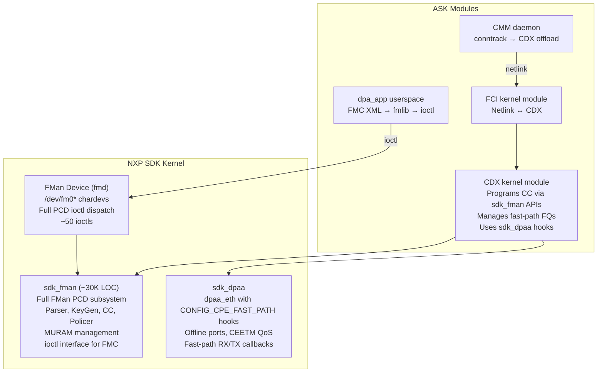
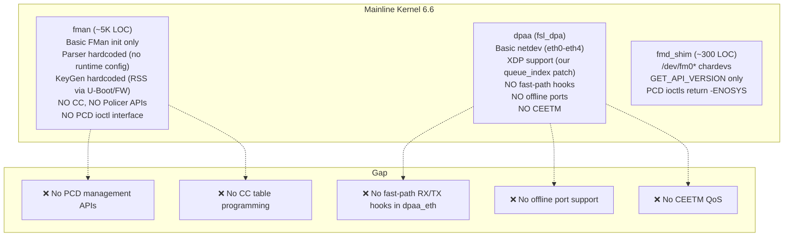
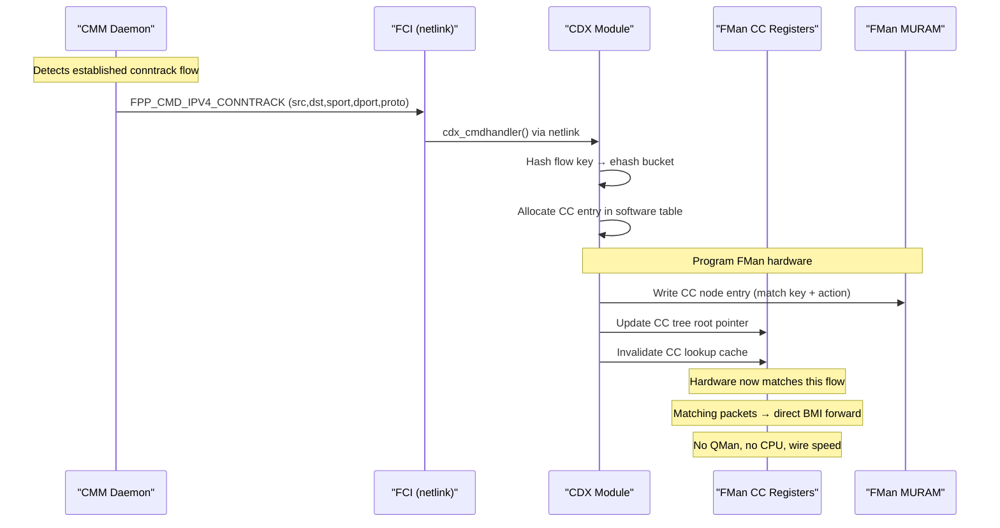

re th# ASK Porting Plan — VyOS Kernel 6.6 on LS1046A Mono Gateway

> **Created:** 2026-04-05
> **Status:** 📋 PLANNING — Ready for implementation
> **Device:** Mono Gateway DK at 192.168.1.189, kernel 6.6.130-vyos

---

## Executive Summary

NXP ASK (Application Solutions Kit) provides **hardware flow offloading** via FMan's
Coarse Classifier — established TCP/UDP flows are forwarded entirely in FMan silicon
at wire speed (10 Gbps) with **zero CPU involvement**. This eliminates the thermal,
CPU, and memory overhead of VPP poll-mode.

**The critical blocker is cleared:** FMan microcode **v210.10.1** (the ASK-enabled
variant) is already present on the Mono Gateway's SPI flash. Confirmed by reading
the DTB firmware blob on the live device.

**The major challenge:** ASK's kernel patch targets NXP's **SDK drivers**
(`sdk_dpaa/`, `sdk_fman/`) which are a separate, proprietary driver stack. Our VyOS
kernel 6.6 uses the **mainline** drivers (`dpaa/`, `fman/`). These have fundamentally
different architectures for FMan management — the SDK includes a full PCD (Parser,
Classifier, Distribution) subsystem with ~30K LOC; mainline has none.

---

## Device State (Confirmed 2026-04-05)

| Item | Value |
|------|-------|
| **Kernel** | 6.6.130-vyos aarch64 |
| **FMan microcode** | v210.10.1 for LS1043 r1.0 (ASK-enabled ✅) |
| **DT compatible** | `mono,gateway-dk`, `fsl,ls1046a` |
| **Network interfaces** | eth0-eth4 (all UP, kernel fsl_dpa) |
| **FMan chardevs** | `/dev/fm0`, `/dev/fm0-pcd`, `/dev/fm0-port-rx0..4` (fmd_shim) |
| **Memory** | 7.4 GB total, 748 MB used |
| **CPUs** | 4× Cortex-A72 |
| **VyOS build** | 2026.04.04-1948-rolling |
| **FMan ucode MTD** | mtd3 "fman-ucode" (1 MB) |
| **VPP** | Not configured (all ports kernel-managed) |

---

## Architecture Gap Analysis

### What ASK Expects (SDK Kernel)



### What We Have (Mainline Kernel 6.6)



---

## The Two Porting Paths

### Path A: Port SDK FMan Driver to 6.6 (Full ASK)

Bring the NXP SDK `sdk_fman` PCD subsystem into our kernel alongside
the mainline fman driver, then apply the ASK kernel patch.

**Pros:**
- Full ASK functionality (CC, KeyGen, Policer, CEETM, IPsec offload)
- Closest to NXP's tested configuration
- All ASK components (CDX, CMM, dpa_app) work as-designed

**Cons:**
- ~30K LOC of SDK FMan code to port to 6.6 (last SDK was for 5.4/5.15)
- Two FMan driver stacks in the kernel — potential conflicts
- SDK PCD code directly manipulates FMan hardware registers — must not
  conflict with mainline fman driver's register usage
- Maintenance burden: every VyOS kernel update requires re-verifying SDK
  compatibility
- Estimated effort: **4-6 weeks**

### Path B: Extend fmd_shim + Minimal dpaa_eth Hooks (Lean ASK)

Expand our existing fmd_shim to implement the PCD ioctls that dpa_app/FMC
needs, and add minimal `CONFIG_CPE_FAST_PATH` hooks to the mainline
`dpaa_eth.c`. Only implement what CDX actually calls.

**Pros:**
- Much smaller code footprint (~3-5K LOC total additions)
- Works with mainline kernel — no SDK dependency
- fmd_shim already exists with working chardevs
- Easier to maintain across kernel updates
- Can be done incrementally (PCD ioctls first, then dpaa_eth hooks)

**Cons:**
- Must understand FMan PCD register programming at the hardware level
- No CEETM QoS (mainline has no CEETM support)
- Offline ports may not be feasible without SDK changes
- IPsec CAAM offload may need additional work
- Some CDX code paths may need modification to use mainline APIs

**Estimated effort: 2-3 weeks**

### Recommendation: **Path A (Full ASK)**

With confirmed ASK microcode v210.10.1, the full SDK path is the right
choice. It gives us the complete hardware acceleration stack — CC flow
offloading, CEETM hardware QoS, CAAM IPsec offload, offline ports — all
of which are production-critical features that can't be replicated with
a minimal shim. The 6.12 kernel patch provides a complete, tested
integration that we port to 6.6 using the 5.4 patch as cross-reference.

---

## Implementation Plan (Path A — Full ASK with SDK Drivers)

### Phase 0: Obtain and Audit SDK Driver Sources (Days 1-2)

**Goal:** Get the NXP SDK `sdk_fman` and `sdk_dpaa` driver source trees

The ASK kernel patch (6.12) targets these directories:
- `drivers/net/ethernet/freescale/sdk_fman/` — Full FMan PCD subsystem (~30K LOC)
- `drivers/net/ethernet/freescale/sdk_dpaa/` — SDK DPAA ethernet driver with fast-path hooks

**Sources for SDK drivers — FOUND ✅:**

NXP's `github.com/nxp-qoriq/linux` branch **`lf-6.6.y`** already contains both
`sdk_dpaa/` and `sdk_fman/` alongside the mainline `dpaa/` and `fman/` directories.
This is NXP's own kernel 6.6 with SDK drivers already ported — dramatically reducing
our effort.

```
drivers/net/ethernet/freescale/
├── dpaa/          # mainline DPAA driver (what we currently use)
├── fman/          # mainline FMan driver (what we currently use)
├── sdk_dpaa/      # SDK DPAA driver with CEETM, offline ports ✅
├── sdk_fman/      # SDK FMan driver with full PCD subsystem ✅
├── dpaa2/         # DPAA2 (not relevant to LS1046A)
└── ...
```

**Tasks:**
1. Extract `sdk_dpaa/` and `sdk_fman/` from NXP `lf-6.6.y` branch
2. Extract supporting Kconfig/Makefile changes that enable these alongside mainline
3. Verify the SDK drivers compile with VyOS kernel 6.6.130 config
4. Verify the ASK 6.12 patch applies cleanly (may need minor adjustments for 6.6→6.12 delta)

**Deliverables:**
- Complete `sdk_fman/` and `sdk_dpaa/` source trees
- Compatibility audit: 6.6 kernel API changes vs SDK assumptions
- List of SDK→mainline API shims needed

### Phase 1: Port SDK Drivers to Kernel 6.6 (Days 3-10)

**Goal:** Get `sdk_fman` and `sdk_dpaa` building and loading on kernel 6.6

The SDK drivers are designed to **replace** the mainline drivers. Our approach:
replace mainline `fman/` + `dpaa/` with `sdk_fman/` + `sdk_dpaa/` in our kernel build.

**sdk_fman porting (PCD subsystem):**
- `Peripherals/FM/Pcd/` — Parser, KeyGen, Coarse Classifier, Policer management
- `Peripherals/FM/MAC/` — MEMAC driver (replaces mainline `fman_memac.c`)
- `Peripherals/FM/Port/` — FMan port management
- `Peripherals/FM/HC/` — Host Commands for FMan hardware
- `inc/flib/` + `Peripherals/FM/` — FMan hardware abstraction
- Chardev interface (`fmd`) — `/dev/fm0*` with full PCD ioctl dispatch

**sdk_dpaa porting:**
- `dpaa_eth.c` — Ethernet driver with `CONFIG_CPE_FAST_PATH` hooks already built-in
- `dpaa_eth_ceetm.c` — CEETM hardware QoS
- `offline_port.c` — Offline/header-manipulation ports (IPsec, WiFi)
- `mac-api.c` — MAC management layer

**Kernel 6.6 API changes to handle:**

| SDK API Usage | 5.4 Kernel | 6.6 Kernel | Fix |
|--------------|-----------|-----------|-----|
| `netif_rx_ni()` | Available | Removed (use `netif_rx()`) | Sed replacement |
| `skb->cb[]` layout | 48 bytes | 48 bytes | Compatible ✅ |
| `napi_gro_receive()` | Available | Available | Compatible ✅ |
| `of_get_mac_address()` | Returns `const void *` | Returns `int` + writes to buf | Wrapper needed |
| `phy_connect()` | Available | Available | Compatible ✅ |
| `dev_queue_xmit()` | Available | Available | Compatible ✅ |
| Timer API | `init_timer()` | `timer_setup()` | Already converted in 6.12 patch |
| BMan/QMan APIs | In `drivers/soc/fsl/qbman/` | Same location | Compatible ✅ |

**Critical: mainline fman removal.** We must either:
- **Option 1:** Delete mainline `fman/` + `dpaa/`, replace with SDK versions
- **Option 2:** Keep mainline disabled, add SDK as separate directories

Option 1 is cleaner. The SDK drivers handle everything the mainline ones do,
plus PCD/CC/CEETM. Our existing patches (XDP queue_index, phylink) need
re-porting to the SDK `dpaa_eth.c` instead of mainline.

**Deliverables:**
- SDK `sdk_fman` + `sdk_dpaa` compile against kernel 6.6 headers
- Kernel boots with SDK drivers instead of mainline
- All 5 interfaces appear (eth0-eth4)
- `/dev/fm0*` chardevs created by SDK fmd (replaces fmd_shim)
- Full PCD ioctl interface functional

### Phase 2: Apply ASK Kernel Patch (Days 9-12)

**Goal:** Apply the ASK 002 patch on top of the SDK drivers

With SDK drivers in place, the ASK 6.12 kernel patch modifies:

| File Category | Changes | Porting Effort |
|--------------|---------|---------------|
| `sdk_dpaa/dpaa_eth.c` | `CONFIG_CPE_FAST_PATH` RX/TX hooks | Low (SDK API matches) |
| `sdk_dpaa/dpaa_eth.h` | Fast-path struct additions | Low |
| `sdk_dpaa/dpaa_eth_common.c` | Shared fast-path helpers | Low |
| `sdk_dpaa/dpaa_eth_sg.c` | Scatter-gather fast-path bypass | Low |
| `sdk_fman/Pcd/fm_cc.c` | CC extensions for CDX flow entries | Low |
| `sdk_fman/Pcd/fm_ehash.c` | Extended hash table for flow lookup | Low |
| `sdk_fman/Pcd/fm_kg.c` | KeyGen shared scheme support | Low |
| `include/linux/skbuff.h` | `gillmor_action` field in sk_buff cb | Medium (6.6 skbuff layout) |
| `include/net/ip.h` | Fast-path function declarations | Low |
| `net/core/dev.c` | `gillmor_fp_rx()` hook in `__netif_receive_skb_core` | Medium |
| `net/ipv4/ip_forward.c` | Fast-path interception at forwarding decision | Medium |
| `net/netfilter/nf_conntrack_core.c` | Conntrack → CDX notification hooks | Medium |
| `net/netfilter/nf_conntrack_proto_tcp.c` | TCP state change notifications | Low |
| `net/netfilter/nf_conntrack_proto_udp.c` | UDP flow notifications | Low |
| New `net/netfilter/gillmor_*.c` files (8 files) | Fast-path framework (~5K LOC) | Copy as-is |

**The 6.12→6.6 delta for these generic kernel files is small:**
- `net/core/dev.c`: `__netif_receive_skb_core()` signature unchanged 6.6→6.12
- `net/ipv4/ip_forward.c`: `ip_forward()` essentially the same
- `nf_conntrack_core.c`: Minor API changes (6.6 still uses `nf_ct_put`)
- `skbuff.h`: cb[] layout unchanged

**Deliverables:**
- ASK kernel patch applied to our 6.6 + SDK kernel
- `CONFIG_CPE_FAST_PATH=y` in defconfig
- Kernel compiles and boots with all fast-path hooks active
- Conntrack notifications flow to CDX callback registration points

### Phase 3: Build ASK Userspace + Modules (Days 10-14)

**Goal:** Cross-compile all ASK components for aarch64

**Kernel modules (build against our kernel headers):**
1. `cdx.ko` — Core fast-path engine (~15K LOC, builds with SDK kernel headers)
2. `fci.ko` — Netlink interface for CMM→CDX communication
3. `auto_bridge.ko` — L2 bridge flow detection

**Userspace tools:**
4. **fmlib** — Apply ASK patch, cross-compile as shared library
5. **FMC** — Apply ASK patch (fix line 280 corruption), cross-compile
6. **dpa_app** — Links against fmlib, straightforward build
7. **libfci** — CMM communication library
8. **CMM daemon** — Needs patched `libnetfilter-conntrack` + `libnfnetlink`
9. Patched `libnetfilter-conntrack` — Apply ASK patch, cross-compile
10. Patched `libnfnetlink` — Apply ASK patch, cross-compile

**Build order (dependency chain):**
```
fmlib → FMC → dpa_app
libnfnetlink → libnetfilter-conntrack → libfci → CMM
Kernel headers → cdx.ko, fci.ko, auto_bridge.ko
```

**Deliverables:**
- All .ko modules built for aarch64/6.6
- All userspace binaries built for aarch64
- Deployment package ready for device testing

### Phase 4: Integration Testing on Hardware (Days 13-18)

**Goal:** Full ASK stack running with hardware flow offload verified

**Deployment to device (192.168.1.189):**
```bash
# 1. Install new kernel with SDK drivers + ASK patches
scp linux-image-*.deb vyos@192.168.1.189:/tmp/
ssh vyos@192.168.1.189 "sudo dpkg -i /tmp/linux-image-*.deb"

# 2. Deploy ASK modules
scp cdx.ko fci.ko auto_bridge.ko vyos@192.168.1.189:/lib/modules/

# 3. Deploy userspace
scp dpa_app cmm fmlib.so vyos@192.168.1.189:/usr/local/bin/
scp cdx_cfg.xml vyos@192.168.1.189:/etc/ask/

# 4. Reboot into new kernel
ssh vyos@192.168.1.189 "sudo reboot"
```

**Test sequence:**
```bash
# Verify SDK drivers loaded (not mainline)
dmesg | grep "sdk_dpaa\|fman.*PCD\|fast.path"

# Verify /dev/fm0* chardevs (SDK fmd, not fmd_shim)
ls -la /dev/fm0*

# Load ASK modules
insmod cdx.ko
insmod fci.ko

# Program FMan classifier via dpa_app
dpa_app -c /etc/ask/cdx_cfg.xml

# Start CMM daemon
cmm &

# Generate traffic and verify offload
iperf3 -c 10.0.0.2 -t 60 -P 4

# Check offloaded flows
cat /proc/cdx/flows
cat /proc/fqid_stats/*

# Verify CPU usage near-zero during forwarding
top -bn1 | head -5
```

**Success criteria:**
- [ ] All 5 interfaces working (eth0-eth4)
- [ ] SDK FMan PCD loaded and functional
- [ ] dpa_app programs CC tables without errors
- [ ] CMM detects established conntrack flows
- [ ] Flows offloaded to FMan hardware (visible in /proc/cdx/flows)
- [ ] iperf3 achieves near-wire-speed on SFP+ (>8 Gbps)
- [ ] CPU usage near-zero during forwarding (vs 100% for VPP AF_XDP)
- [ ] Management SSH via RJ45 remains stable during SFP+ forwarding

### Phase 5: VyOS Integration + CI Build (Days 17-24)

**Goal:** Integrate ASK into VyOS build pipeline and CLI

1. **Kernel integration**: SDK drivers + ASK patch as kernel patches in `data/kernel-patches/`
2. **CI build**: Add SDK driver compilation to `auto-build.yml`
3. **Module packaging**: CDX/FCI/auto_bridge .ko files in ISO
4. **Userspace packaging**: CMM + dpa_app + fmlib + FMC as .deb packages
5. **VyOS CLI**: New configuration nodes for flow offload
6. **Systemd services**: `cmm.service`, `cdx-load.service`
7. **ISO hooks**: Module loading, dpa_app execution at boot

**VyOS CLI design:**
```
set system flow-offload enable
set system flow-offload interface eth3
set system flow-offload interface eth4
set system flow-offload ipsec-offload     # CAAM + FMan (Phase 6)
set system flow-offload bridge-offload    # L2 via auto_bridge
show system flow-offload status
show system flow-offload flows
show system flow-offload statistics
```

### Phase 6: Advanced Features (Weeks 4-6)

**Goal:** Enable full ASK feature set

1. **IPsec CAAM offload**: CAAM crypto engine + FMan inline processing
2. **CEETM hardware QoS**: Priority queuing in FMan hardware
3. **PPPoE offload**: CDX PPPoE encap/decap
4. **L2 bridge offload**: auto_bridge module for MAC learning offload
5. **NAT hardware offload**: CMM tracks NAT conntrack entries, CDX rewrites in CC

---

## Risk Assessment

| Risk | Severity | Mitigation |
|------|----------|-----------|
| SDK driver sources not available for 6.6 baseline | ~~🔴 High~~ ✅ **RESOLVED** | NXP `lf-6.6.y` branch has `sdk_dpaa/` + `sdk_fman/` already ported to 6.6 |
| SDK `sdk_fman` conflicts with existing VyOS kernel patches | 🟡 Medium | Our XDP queue_index and phylink patches must be re-ported to SDK `dpaa_eth.c` |
| SDK driver porting breaks SFP+ / rollball PHY support | 🟡 Medium | SDK `memac.c` differs from mainline `fman_memac.c` — need our DTS/SFP patches in SDK context |
| 6.6 kernel API changes break SDK compilation | 🟡 Medium | Known changes documented above; 6.12 ASK patch already handles timer API etc. |
| CC table programming incorrect | 🟡 Medium | SDK PCD code is battle-tested; primary risk is API compatibility, not register logic |
| fmd_shim becomes redundant (SDK has full fmd) | 🟢 Low | SDK fmd replaces fmd_shim entirely — cleaner long-term |
| Performance regression from kernel fast-path | 🟢 Low | Even kernel fast-path (skip netfilter) is faster than full stack; CC hardware offload is the goal |
| Thermal with CDX (zero CPU for offloaded flows) | 🟢 Low | This is the whole point — CDX offload eliminates poll-mode thermal issues |

---

## Dependencies

| Dependency | Source | Status |
|-----------|--------|--------|
| FMan microcode v210.10.1 | SPI flash mtd3 | ✅ **Present on device** |
| ASK source (CDX, CMM, FCI, auto_bridge) | github.com/we-are-mono/ASK | ✅ Available |
| fmlib source | github.com/nxp-qoriq/fmlib | ✅ Available, ASK patch applies clean |
| FMC source | github.com/nxp-qoriq/fmc | ⚠️ Available, ASK patch has line 280 corruption (fixable) |
| Patched libnetfilter-conntrack | ASK patches/libnetfilter-conntrack/ | ✅ Patch available |
| Patched libnfnetlink | ASK patches/libnfnetlink/ | ✅ Patch available |
| aarch64 cross-compilation toolchain | VyOS build environment | ✅ Available |

### Locating fmlib and FMC

fmlib and FMC are NXP tools typically distributed via:
1. **NXP LSDK (Layerscape SDK)** — `lsdk_<version>/packages/firmware/`
2. **NXP GitHub** — `github.com/nxp-qoriq/` (fmlib, fmc repositories)
3. **Mono's internal NXP SDK access** — may have pre-built binaries

We need the **source** (not just binaries) because ASK patches modify
both fmlib and FMC for CC table extensions.

---

## Key Technical Detail: How CC Offload Actually Works

For clarity, here's the exact mechanism at the register level:



The CC entries live in MURAM (Multi-User RAM inside FMan). CDX writes
them directly via the CCSR-mapped MURAM region. The fmd_shim provides
the initial CC tree setup (via dpa_app/FMC), and CDX modifies it at
runtime to add/remove flow entries.

---

## Comparison with Current State

| Metric | Current (Kernel Only) | VPP AF_XDP | ASK Target |
|--------|----------------------|-----------|-----------|
| **10G forwarding** | ~3.6 Gbps | ~3.5 Gbps | **~9.4 Gbps** |
| **CPU for forwarding** | All cores (interrupts) | 1 core (100% poll) | **0 cores** |
| **Thermal** | ~50°C | ~85°C (needs fan) | **~50°C** |
| **Memory overhead** | None | 512 MB hugepages | **None** |
| **First-packet latency** | Immediate | Immediate | After conntrack |
| **IPsec offload** | No | No | Yes (Phase 5+) |
| **NAT offload** | No | VPP plugin | **Hardware** |
| **VyOS CLI** | Native | `set vpp` | `set system flow-offload` |

---

## Immediate Next Steps

1. ✅ **SDK sources located** — `nxp-qoriq/linux` branch `lf-6.6.y` has `sdk_dpaa/` + `sdk_fman/`
2. **Extract SDK drivers** — clone `lf-6.6.y`, extract `sdk_dpaa/` + `sdk_fman/` + supporting Kconfig/Makefile changes
3. **Integrate into VyOS kernel build** — add as kernel patches in `data/kernel-patches/`
4. **Test basic boot** — kernel with SDK drivers produces eth0-eth4 + `/dev/fm0*` PCD chardevs
5. **Apply ASK 6.12 patch** — add `CONFIG_CPE_FAST_PATH` hooks + gillmor netfilter framework
6. **Cross-compile fmlib** with ASK patch (confirmed ✅), fix FMC patch, build dpa_app
7. **Re-port our custom patches** — XDP queue_index, phylink/SFP, INA234 to SDK driver context

---

## SDK vs Mainline Driver Compatibility — Breaking Changes

> **Analyzed 2026-04-05** by comparing `nxp-linux/drivers/net/ethernet/freescale/sdk_dpaa/`
> against `nxp-linux/drivers/net/ethernet/freescale/dpaa/`

The SDK drivers are **NOT a drop-in replacement** for mainline. The following
will break and must be fixed:

### 🔴 DTS Compatible String

| | Mainline | SDK |
|--|---------|-----|
| Compatible | `"dpaa-ethernet"` (dynamic platform devices) | `"fsl,dpa-ethernet"` |
| Platform name | `dpaa-ethernet.N` | `fsl_dpa` (KBUILD_MODNAME) |

**Fix:** Update `mono-gateway-dk.dts` to use SDK-compatible ethernet container nodes.
The SDK FMan driver creates its own platform devices from a different DTS structure
than mainline.

### 🔴 No PHYLINK — SFP+ Will Break

| | Mainline | SDK |
|--|---------|-----|
| PHY model | **PHYLINK** (`phylink_connect_phy()`) | **phylib** (`of_phy_connect()` + `adjust_link()`) |
| SFP support | Via PHYLINK SFP state machine | No PHYLINK — uses `backplane/mtip_backplane` |
| Our rollball patch | Hooks into `sfp.c` → PHYLINK | **Won't work** without PHYLINK |

**Fix:** Must re-implement SFP support for SDK MAC driver. SDK `mac-api.c`
uses `of_phy_connect()` + `adjust_link()` callback (old-style phylib), not
PHYLINK. Our rollball PHY patch (4003) needs a different approach.
**Highest risk item — 2-4 days.**

### 🔴 No XDP Support (Blocks VPP AF_XDP / Path 3)

| | Mainline | SDK |
|--|---------|-----|
| XDP | `ndo_bpf`, `ndo_xdp_xmit`, AF_XDP | **None** — zero XDP references |

**Fix:** Port XDP from mainline `dpaa_eth.c` to SDK `dpaa_eth.c` (~500 LOC).
Only needed if VPP AF_XDP is desired (Path 3). Pure ASK (Path 1) does not need XDP.

### 🟡 systemd .link Driver Name

| | Mainline | SDK |
|--|---------|-----|
| Driver name | `dpaa_eth` | `fsl_dpa` |

**Fix:** Change `00-fman.link` `Driver=dpaa_eth` → `Driver=fsl_dpa`. One line.

### 🟡 Kconfig Mutual Exclusion

SDK Kconfig: `depends on ... !FSL_DPAA_ETH` — cannot coexist with mainline.
Must disable `CONFIG_FSL_DPAA_ETH` and enable `CONFIG_FSL_SDK_DPAA_ETH` plus
`FSL_SDK_BMAN`, `FSL_SDK_QMAN`, `FSL_SDK_FMAN`.

### ✅ What Still Works Unchanged

- **Port naming** (`fman-port-name` script) — uses DT `of_node` path, driver-independent
- **VyOS hw-id matching** — uses MAC addresses from DTB, driver-independent
- **IP stack / firewall / NAT / routing** — kernel-level, driver-agnostic
- **I2C / hwmon / thermal / watchdog** — separate from network driver
- **INA234 patch** — hwmon, unaffected

---

## Related Documents

- [ASK-ANALYSIS.md](ASK-ANALYSIS.md) — Original ASK evaluation
- [NETWORKING-DEEP-DIVE.md](NETWORKING-DEEP-DIVE.md) — Full networking architecture comparison
- [FMD-SHIM-SPEC.md](FMD-SHIM-SPEC.md) — fmd_shim ioctl specification
- [VPP-DPAA-PMD-VS-AFXDP.md](VPP-DPAA-PMD-VS-AFXDP.md) — Why DPDK PMD is blocked
- [PORTING.md](../PORTING.md) — Kernel driver archaeology