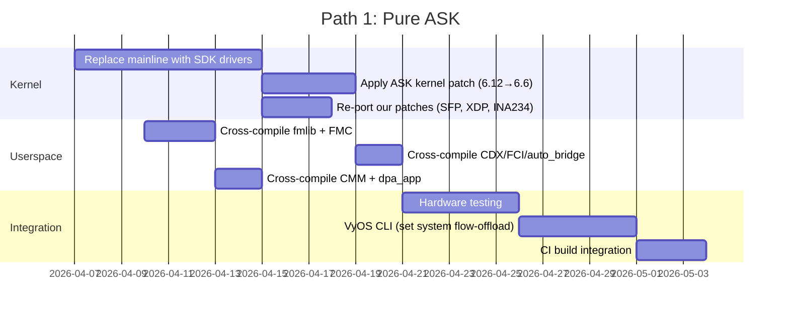

# ASK Implementation Paths — Effort Comparison

> **Created:** 2026-04-05
> **Goal:** Choose the path that delivers 10G forwarding while feeling native to mainline VyOS

---

## Path Clarification

The user correctly identified that "Hybrid ASK + VPP AF_XDP" (old Path 3) is just
current VPP plus ASK bolted on. The real three options are:

| Path | Description | VPP Role |
|------|------------|----------|
| **Path 1: Pure ASK** | SDK drivers + CDX/CMM flow offload | None — no VPP |
| **Path 2: ASK + VPP(DPDK)** | Full ASK + CDX-assisted DPDK for VPP | VPP via DPDK PMD on SFP+ |
| **Path 3: ASK + VPP(AF_XDP)** | Full ASK + current VPP AF_XDP | VPP via AF_XDP on SFP+ (already works) |

Path 3 is trivial — ASK does hardware offload, VPP AF_XDP continues as-is for any
ports that need software processing. No new DPDK work needed.

Path 2 is Path 1 + solving RC#31 via CDX resource partitioning + DPDK patch.

---

## Effort Breakdown

### Path 1: Pure ASK (No VPP)



| Task | LOC to Port/Write | Effort | Risk |
|------|-------------------|--------|------|
| Replace `dpaa/`+`fman/` with `sdk_dpaa/`+`sdk_fman/` | 0 (copy from nxp-linux lf-6.6.y) | 3-4 days | Medium — Kconfig/Makefile integration |
| Apply ASK kernel patch 6.12→6.6 | ~10K lines (142 files, but most copy cleanly) | 3-4 days | Medium — net/core, netfilter hooks may need adjustment |
| Re-port SFP/phylink/rollball patches to SDK MEMAC | ~200 lines | 1-2 days | Medium — SDK `mac-api.c` differs from mainline `fman_memac.c` |
| Re-port XDP queue_index patch to SDK `dpaa_eth.c` | ~20 lines | 0.5 day | Low |
| Re-port INA234 patch | 0 (hwmon, unchanged) | 0 | None |
| Cross-compile fmlib (with ASK patch) | 0 (build only) | 1 day | Low |
| Cross-compile FMC (fix line 280 + ASK patch) | ~20 lines fix | 1-2 days | Medium — FMC build system |
| Cross-compile CDX/FCI/auto_bridge .ko modules | 0 (build against new kernel headers) | 1 day | Low |
| Cross-compile CMM + libfci + patched libs | 0 (build only) | 1-2 days | Medium — dependency chain |
| Hardware testing (eth0-eth4, PCD, flow offload) | — | 3-5 days | Medium |
| VyOS CLI integration | ~400 LOC Python + XML | 3-5 days | Low |
| CI build pipeline integration | ~200 LOC workflow | 2-3 days | Low |
| **Total** | | **~3-4 weeks** | |

#### VyOS Nativeness Assessment

ASK maps naturally to VyOS concepts:

| VyOS Concept | ASK Mapping | How It Feels |
|-------------|-------------|-------------|
| `set system flow-offload` | CDX + CMM enable/disable | ✅ Native — like kernel nftables offload |
| `set interfaces ethernet ethX` | All ports stay as kernel netdevs | ✅ Transparent — no change |
| `set firewall` | VyOS nftables → first packets through kernel | ✅ Firewall works on new connections |
| `set nat` | CMM tracks NAT conntrack → offload | ✅ NAT config unchanged, offload automatic |
| `set vpn ipsec` | CAAM + CDX IPsec offload | ✅ Native VyOS IPsec config, hardware accel |
| `show system flow-offload` | CDX /proc/cdx/flows | ✅ Native operational command |
| `set qos` | CEETM hardware QoS | ⚠️ New integration needed |
| Interface monitoring | ethtool, ip link — all normal | ✅ Transparent |
| SSH management | Always via kernel netdevs | ✅ Always safe |

**VyOS nativeness score: 9/10** — ASK is invisible to the user. The router just forwards
faster. No new "data plane" concept, no VPP processes, no hugepages, no separate CLI.
The only new CLI node is `set system flow-offload enable`.

---

### Path 2: ASK + VPP(DPDK) — CDX-Assisted

Everything from Path 1, PLUS:

| Additional Task | LOC | Effort | Risk |
|----------------|-----|--------|------|
| Build CDX resource partitioning logic | ~500 LOC kernel | 3-4 days | High — BMan/QMan isolation untested |
| Build DPDK with modified `dpaa_bus` | ~200 LOC DPDK patch | 2-3 days | High — must skip global init correctly |
| Build VPP with DPDK DPAA PMD | ~100 LOC VPP config | 1-2 days | Medium |
| VPP LCP (Linux CP) for management | Already in VPP | 1-2 days | Medium — LCP TAP reliability |
| CDX ↔ DPDK handoff protocol | ~300 LOC | 2-3 days | High — new, untested interface |
| VyOS VPP CLI (extends existing `set vpp`) | ~200 LOC | 2-3 days | Low — VPP CLI already exists |
| Integration testing (CDX + DPDK coexistence) | — | 5-7 days | High — first-ever combination |
| **Additional over Path 1** | | **+3-4 weeks** | |
| **Total** | | **~6-8 weeks** | |

#### VyOS Nativeness Assessment

| VyOS Concept | Path 2 Mapping | How It Feels |
|-------------|---------------|-------------|
| `set system flow-offload` | CDX + CMM for non-VPP traffic | ✅ Native |
| `set vpp settings interface ethX` | CDX partitions resources, VPP takes port | ⚠️ Dual system — user must understand both |
| `set firewall` | Split: VPP ACL for VPP ports, nftables for rest | ⚠️ Confusing — two firewall systems |
| `set nat` | VPP NAT plugin on VPP ports, CMM on rest | ⚠️ Split personality |
| `set interfaces ethernet ethX` | VPP ports become TAPs via LCP | ⚠️ Not transparent — VPP owns the port |
| SSH management | Kernel RJ45 (safe) but SFP+ through VPP LCP | ⚠️ Partial — VPP crash loses SFP+ management |
| Hugepages | Required (~512MB) | ❌ Non-native — invisible memory consumption |
| `show vpp` | VPP operational commands | ⚠️ Separate monitoring system |

**VyOS nativeness score: 5/10** — Two data planes running simultaneously. User must
understand which ports are ASK-managed vs VPP-managed. Firewall and NAT config is
split. Hugepages consume memory. VPP crash affects SFP+ connectivity.

---

### Path 3: ASK + VPP(AF_XDP) — Layered

Path 1 (Pure ASK) + current VPP AF_XDP for specific exotic workloads:

| Additional Task over Path 1 | LOC | Effort | Risk |
|-----------------------------|-----|--------|------|
| Keep existing VPP AF_XDP integration | 0 (already works) | 0 | None |
| Verify AF_XDP coexists with SDK `sdk_dpaa` | — | 1-2 days | Medium — SDK dpaa_eth must support XDP |
| Re-port XDP queue_index patch to SDK `dpaa_eth.c` | ~20 lines | 0.5 day | Low |
| **Additional over Path 1** | | **+1-2 days** | |
| **Total** | | **~3-4 weeks** (same as Path 1) | |

#### VyOS Nativeness Assessment

Same as Path 1, plus:

| VyOS Concept | Path 3 Addition | How It Feels |
|-------------|----------------|-------------|
| `set vpp settings` | Optional, for ports needing software processing | ⚠️ Extra complexity when used |
| Hugepages | Only if VPP configured | ✅ Not needed by default |
| Thermal | Only if VPP configured on a port | ✅ Not a concern by default |

**VyOS nativeness score: 8/10** — Same as Path 1 by default. VPP is optional and only
adds complexity if explicitly configured for exotic workloads.

---

## Side-by-Side Comparison

| Dimension | Path 1: Pure ASK | Path 2: ASK+VPP(DPDK) | Path 3: ASK+VPP(AF_XDP) |
|-----------|-----------------|----------------------|------------------------|
| **Effort** | 3-4 weeks | 6-8 weeks | 3-4 weeks |
| **Risk** | Medium | High | Medium |
| **10G SFP+ throughput** | ~9.4 Gbps (FMan CC) | ~9.4 Gbps (DPDK PMD) | ~9.4 Gbps (FMan CC) + 3.5 Gbps (AF_XDP fallback) |
| **CPU for forwarding** | Zero (hardware) | High (VPP poll-mode) | Zero (hardware), 1 core if VPP used |
| **Thermal** | None | Needs fan + poll-sleep | None (unless VPP active) |
| **Memory overhead** | None | 512MB hugepages | None (unless VPP active) |
| **New connections** | Kernel stack (first packets) | VPP graph (immediate) | Kernel stack (first packets) |
| **VyOS nativeness** | ⭐⭐⭐⭐⭐ 9/10 | ⭐⭐⭐ 5/10 | ⭐⭐⭐⭐ 8/10 |
| **Firewall** | Single (nftables) | Split (nftables + VPP ACL) | Single (nftables) by default |
| **NAT** | Single (kernel + CMM offload) | Split (kernel + VPP NAT) | Single (kernel + CMM offload) |
| **IPsec** | CAAM hardware (wire speed) | No DPAA1 offload | CAAM hardware (wire speed) |
| **QoS** | CEETM hardware | VPP policer (software) | CEETM hardware |
| **Management safety** | Always (kernel) | Partial (VPP crash = SFP+ down) | Always (kernel) |
| **Boot networking** | Immediate | After VPP starts | Immediate |
| **Exotic packet processing** | ❌ No (FMan CC limitations) | ✅ Full VPP graph | ✅ VPP AF_XDP (optional) |
| **RC#31** | N/A (no DPDK) | Fixed by CDX | N/A (AF_XDP) |
| **Maintenance burden** | SDK kernel + ASK | SDK kernel + ASK + DPDK + VPP | SDK kernel + ASK (+ optional VPP) |
| **New LOC** | ~800 (VyOS CLI + CI) | ~2100 (CLI + DPDK patch + CDX partition) | ~800 (same as Path 1) |

---

## Recommendation: Path 1 (Pure ASK)

**Path 1 wins on every dimension that matters for a VyOS router:**

1. **Most native** — ASK is invisible to the user. `set system flow-offload enable` is
   the only new command. Everything else (interfaces, firewall, NAT, IPsec, routing)
   uses standard VyOS configuration unchanged.

2. **Least effort** — 3-4 weeks vs 6-8 weeks for Path 2. No DPDK patches, no bus
   partitioning, no VPP configuration split.

3. **Best performance** — Hardware forwarding at wire speed with zero CPU. No poll-mode
   thermal issues, no hugepages, no worker threads.

4. **Safest** — All interfaces stay as kernel netdevs. Management SSH always works.
   No VPP crash risk. Boot networking is immediate.

5. **Simplest maintenance** — One data plane (kernel + ASK), not two (kernel + VPP).
   Kernel updates only need SDK driver compatibility check, not DPDK+VPP rebuild.

**The only scenario where VPP adds value over ASK:** exotic packet processing that
FMan's hardware classifier cannot handle (DPI, GTP/VXLAN tunnels, segment routing,
custom packet manipulation). For a standard router (L3 forwarding, NAT, firewall,
IPsec, QoS, PPPoE), ASK covers 100% of use cases in hardware.

If exotic processing is ever needed, **Path 3 (add VPP AF_XDP on top)** costs only
1-2 extra days and maintains the VyOS-native feel of Path 1.

---

## What "Native to VyOS" Means Concretely

### Path 1 User Experience

```
# Enable hardware flow offload (one command)
set system flow-offload enable

# Everything else is normal VyOS:
set interfaces ethernet eth3 address 10.0.0.1/24
set interfaces ethernet eth4 address 10.0.1.1/24
set nat source rule 100 outbound-interface name eth3
set nat source rule 100 translation address masquerade
set firewall ipv4 forward filter rule 10 action accept
set vpn ipsec site-to-site peer remote ...

# Check offload status
show system flow-offload status
show system flow-offload flows
show system flow-offload statistics
```

The user never sees CDX, CMM, FMC, dpa_app, or any ASK internals. It's just a
kernel-level acceleration toggle, like `set system option performance`.

### Path 2 User Experience

```
# Enable ASK for most traffic
set system flow-offload enable

# BUT ALSO configure VPP for SFP+ ports
set vpp settings interface eth3
set vpp settings interface eth4
set vpp settings cpu-cores 2
set vpp settings poll-sleep-usec 100

# Now firewall is SPLIT:
set firewall ipv4 forward filter rule 10 ...   # Only for non-VPP traffic
# VPP ACL for eth3/eth4 configured separately

# NAT is SPLIT:
set nat source rule 100 ...   # Only for non-VPP traffic
# VPP NAT for eth3/eth4 configured separately

# Two monitoring systems:
show system flow-offload status    # ASK status
show vpp interface                  # VPP status
```

The user must understand two data planes and configure each separately.
This is not native-feeling.

---

## ISO Rebuild Requirements

Both paths require a full ISO rebuild — the SDK kernel driver replacement
is a kernel-level change that lives inside the ISO squashfs.

### Path 1: Pure ASK — ISO Changes

| Component | Build Step | Fits Existing CI? |
|-----------|-----------|-------------------|
| Kernel (sdk_dpaa + sdk_fman + ASK patch) | `data/kernel-patches/` + `data/kernel-config/` | ✅ Same as current kernel patches |
| CDX/FCI/auto_bridge .ko modules | New build step (against kernel headers) | ✅ Similar to current linux-kernel package |
| CMM + dpa_app + fmlib + FMC | Cross-compile userspace | ⚠️ New CI step (but straightforward) |
| VyOS CLI (`set system flow-offload`) | New vyos-1x patch | ✅ Same as existing `data/vyos-1x-*.patch` |
| cdx_cfg.xml / cdx_pcd.xml | `data/scripts/` → `includes.chroot` | ✅ Same as existing config files |
| systemd services (cmm, cdx-load) | `data/systemd/` + `data/hooks/` | ✅ Same as existing services |

**Cannot be done post-install:** Kernel and kernel modules (must match).
**Could be post-install but better in ISO:** CMM, dpa_app, XML configs.

### Path 2: ASK + VPP(DPDK) — Additional ISO Changes

Everything from Path 1, PLUS:

| Additional Component | Build Step | Fits Existing CI? |
|---------------------|-----------|-------------------|
| DPDK libraries (~50MB) with modified dpaa_bus | New CI step (DPDK cross-compile) | ⚠️ Significant new step |
| VPP binary + plugins | New CI step (VPP cross-compile) | ⚠️ Significant new step |
| CDX resource partitioning module | Built with CDX | ✅ Extension of CDX build |
| VPP systemd integration | `data/systemd/` | ✅ Already exists |

Path 2 is a substantially larger ISO build — DPDK and VPP cross-compilation
adds ~30-45 minutes to CI and ~80MB to ISO size.

### Path 3: ASK + VPP(AF_XDP) — Same as Path 1

VPP AF_XDP is already in the current ISO. Path 3 = Path 1 ISO changes only.
VPP continues to work as-is alongside the new SDK kernel drivers (pending
XDP queue_index re-port to sdk_dpaa, which is a ~20 line patch).
