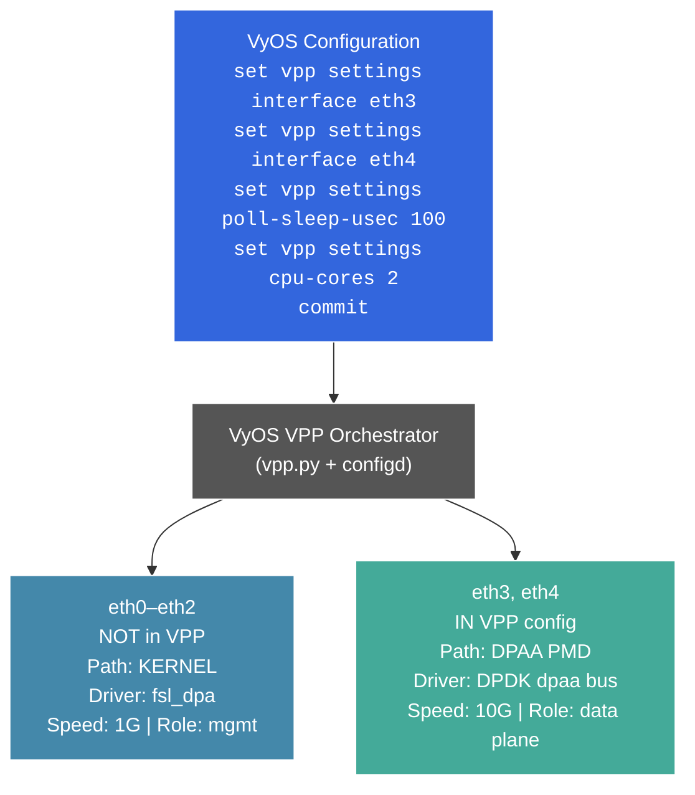
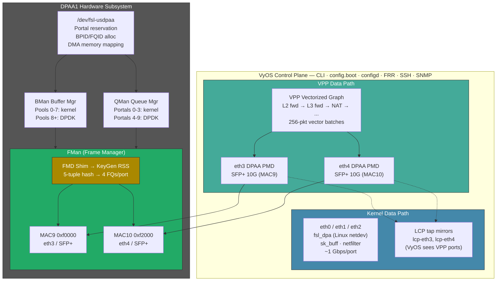
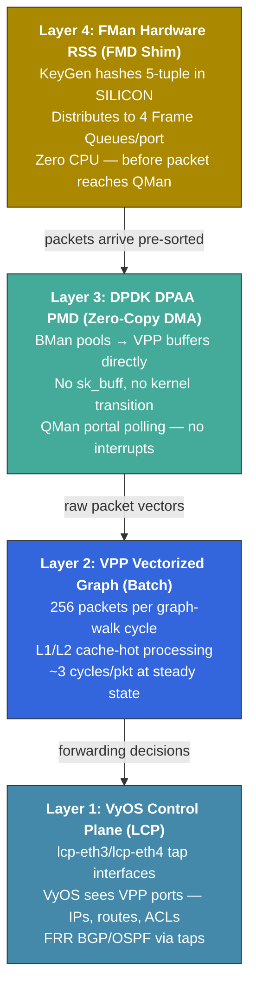
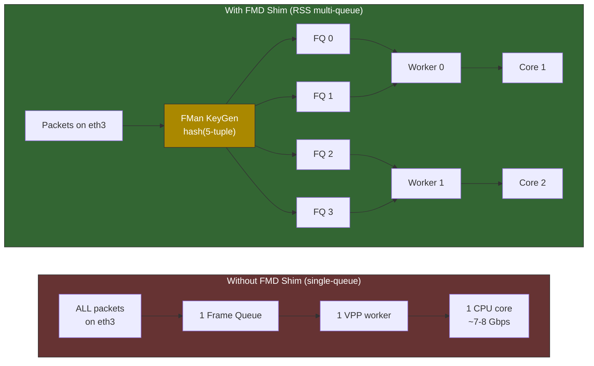

# VPP Line-Rate Plan: Unified FMan + DPDK + FMD + VyOS Architecture

> **Created:** 2026-04-03
> **Goal:** Selective per-interface offload controlled by VyOS CLI — vectorized VPP forwarding via DPDK DPAA PMD + FMan hardware-accelerated flow distribution → 9.4 Gbps on SFP+
> **Current state (2026-04-04):** AF_XDP working at ~3.5 Gbps on eth3/eth4. FMD Shim skeleton implemented (chardevs + GET_API_VERSION). RC#31 scoped-init is the critical path to DPAA PMD.

---

## 1. The Vision: One CLI, Three Data Paths

The admin types VyOS commands. The system chooses the optimal data path per interface — kernel, AF_XDP, or full hardware offload — automatically.



### Three Data Paths, One Box

| Path | Interfaces | Driver Stack | Throughput | Use |
|------|-----------|-------------|-----------|-----|
| **Kernel** | eth0, eth1, eth2 | `fsl_dpaa_mac` → `fsl_dpa` → Linux netdev | ~1 Gbps | SSH, SNMP, BGP, management |
| **AF_XDP** (fallback) | any ethN | `fsl_dpa` + AF_XDP socket | ~3.5 Gbps | If DPAA PMD unavailable |
| **DPAA PMD** (target) | eth3, eth4 | DPDK `dpaa_bus` → VPP graph | **9.4 Gbps** | High-speed forwarding |

The key principle: **the VyOS admin never touches DPDK, FMan, or FMD directly.** They configure `set vpp settings interface ethX` and the system handles everything — driver selection, port handoff, FMan RSS programming, hugepage allocation, thermal protection.

---

## 2. End-State Architecture: How All Components Fit Together



### Component Roles

| Component | What It Does | Where It Lives |
|-----------|-------------|---------------|
| **VyOS vpp.py** | Detects `fsl_dpa` driver, selects DPAA PMD or AF_XDP fallback, generates `startup.conf`, manages port handoff | `vyos-1x` patch 010 |
| **DPDK DPAA Bus** | Scans device-tree for FMan MACs, initializes **only VPP-assigned ports** (scoped via `DPAA_ALLOWED_MACS`), creates PMD interfaces | DPDK 24.11 + scoped-init patch |
| **USDPAA Module** | `/dev/fsl-usdpaa` — partitions QMan/BMan portals between kernel and DPDK, allocates BPIDs/FQIDs, DMA memory mapping | Kernel module (1,453 lines, built-in) |
| **FMD Shim** | `/dev/fm0*` — programs FMan KeyGen for RSS hash distribution across 4 frame queues per port. Enables multi-worker VPP | Kernel module (~2,000 lines, built-in) |
| **VPP Graph** | Vectorized packet processing: L2/L3 forwarding, NAT, ACLs, IPsec. Processes 256 packets per batch through graph nodes | VPP v25.10 + `dpdk_plugin.so` |
| **LCP Plugin** | Creates `lcp-eth3`, `lcp-eth4` tap mirrors so VyOS can see/manage VPP-controlled ports through standard CLI | VPP linux-cp plugin |
| **FMan Hardware** | Silicon packet classifier: parser identifies L2/L3/L4 headers, KeyGen hashes 5-tuple, distributes to frame queues. Zero CPU overhead | NXP LS1046A DPAA1 |

---

## 3. Interface Lifecycle: Selective Enable/Disable

### Enabling a Port for VPP

When the admin runs `set vpp settings interface eth3; commit`:

```
Step 1: VyOS configd calls vpp.py
        ├── Detects eth3 driver = fsl_dpa (platform bus, not PCI)
        ├── Checks /dev/fsl-usdpaa exists → selects DPAA PMD mode
        │   (if absent → falls back to AF_XDP mode automatically)
        └── Generates startup.conf with DPAA PMD config for eth3

Step 2: Port handoff (pre-VPP-start)
        ├── Unbind fsl_dpa from eth3's child device:
        │     echo dpaa-ethernet.3 > /sys/bus/platform/drivers/fsl_dpa/unbind
        ├── fsl_dpaa_mac stays bound (MAC hardware control, PHY/link)
        ├── Kernel netdev (eth3) disappears from ip link
        └── Set DPAA_ALLOWED_MACS=f0000  (MAC9 hex address)

Step 3: VPP starts
        ├── DPDK dpaa_bus scans device-tree
        ├── Allowlist filter: only probe MAC9 (f0000) — skip MAC2/5/6/10
        ├── fman_if_init() configures ONLY MAC9 registers
        ├── USDPAA allocates portal 4 + BPID 8 + FQIDs for eth3
        ├── FMD shim programs KeyGen RSS scheme for MAC9:
        │     4 frame queues, 5-tuple hash distribution
        └── VPP creates dpaa PMD interface "eth3"

Step 4: LCP mirror
        ├── VPP linux-cp plugin creates lcp-eth3 (tap interface)
        ├── VyOS sees lcp-eth3 in ip link — can assign IPs, routes
        └── Management traffic to/from eth3 goes through tap mirror

Step 5: Forwarding active
        ├── VPP worker threads poll QMan portals for packets
        ├── FMan RSS distributes across 4 FQs → 2 workers
        ├── 256-packet vector batches through VPP graph
        └── ~9.4 Gbps forwarding on eth3
```

### Disabling a Port (Returning to Kernel)

When the admin runs `delete vpp settings interface eth3; commit`:

```
Step 1: VyOS configd calls vpp.py
        ├── Removes eth3 from VPP config
        └── Triggers VPP restart (or graceful port release)

Step 2: VPP releases port
        ├── DPDK dpaa PMD releases MAC9
        ├── FMD shim deletes KG scheme for MAC9
        ├── USDPAA frees portal, BPID, FQIDs (automatic on fd close)
        └── lcp-eth3 tap interface removed

Step 3: Port return to kernel
        ├── Rebind fsl_dpa to eth3's child device:
        │     echo dpaa-ethernet.3 > /sys/bus/platform/drivers/fsl_dpa/bind
        ├── Kernel creates eth3 netdev again
        └── Full kernel networking stack available on eth3

Step 4: VyOS applies interface config
        ├── Sets IP addresses, VLANs, firewall rules from config.boot
        └── eth3 operates as standard kernel interface
```

### The Decision Tree in vpp.py

```python
def configure_interface(iface_name, iface_config):
    """Select optimal data path for each VPP interface."""
    
    original_driver = get_driver(iface_name)  # ethtool -i
    
    if original_driver == 'fsl_dpa':
        # NXP DPAA1 platform-bus NIC
        if os.path.exists('/dev/fsl-usdpaa'):
            # Full hardware offload available
            iface_config['driver'] = 'dpdk'
            iface_config['dpaa_mode'] = 'pmd'
            iface_config['fman_mac_addr'] = FMAN_ADDRS[iface_name]
            # FMD shim will program RSS automatically
            iface_config['rss_queues'] = 4
            # Unbind fsl_dpa before VPP starts
            iface_config['handoff'] = 'unbind_fsl_dpa'
        else:
            # DPAA PMD not available — AF_XDP fallback
            iface_config['driver'] = 'xdp'
            iface_config['dpaa_mode'] = 'afxdp'
            iface_config['xdp_options'] = {
                'rx_queue_size': 4096,
                'tx_queue_size': 4096,
                'num_rx_queues': 1,
            }
            # No unbind needed — AF_XDP works with kernel driver
            iface_config['handoff'] = 'none'
    
    elif original_driver in PCI_DRIVERS:
        # Standard PCI NIC (Intel, Mellanox, etc.)
        iface_config['driver'] = 'dpdk'
        iface_config['dpaa_mode'] = 'pci'
        iface_config['handoff'] = 'dpdk_bind'
    
    else:
        raise ConfigError(f'Unsupported driver: {original_driver}')
```

---

## 4. The Four Layers of Acceleration

Each layer adds performance. They stack:



### Performance at Each Layer

| Configuration | Layers Active | Throughput | CPU Usage |
|--------------|--------------|-----------|-----------|
| Kernel only (no VPP) | 1 | ~3-5 Gbps | 100% SoftIRQ |
| VPP + AF_XDP (current) | 1+2 | ~3.5 Gbps | ~60% (copy overhead) |
| VPP + DPAA PMD single-queue | 1+2+3 | ~7-8 Gbps | ~50% (1 core) |
| VPP + DPAA PMD + RSS multi-worker | 1+2+3+4 | **~9.4 Gbps** | ~60% (2 cores) |

---

## 5. RC#31: The Single Blocker (and How to Fix It)

### What Happens Today

When VPP starts with `dpdk_plugin.so` containing the DPAA PMD:

1. DPDK's `dpaa_bus_probe()` scans ALL FMan MACs from device-tree
2. `fman_init()` mmaps the ENTIRE 2MB FMan CCSR via `/dev/mem`
3. Reads/writes MAC registers for ALL ports — including kernel-owned eth0-eth2
4. Kernel's `fsl_dpaa_mac` driver sees unexpected register changes → MAC failure
5. All kernel interfaces die within seconds → SSH drops → serial-only recovery

### The Fix: Scoped DPAA Bus Init

Three DPDK patches that make the bus only touch VPP-assigned ports:

**Patch 1 — Bus scan filter** (`dpaa_bus.c`):
Read `DPAA_ALLOWED_MACS` environment variable (set by VyOS vpp.py). Only add matching FMan MACs to the bus device list. Kernel-managed MACs never appear in DPDK.

**Patch 2 — FMan scoped init** (`fman.c`):
`fman_if_init()` checks the allowlist before writing any MAC registers. Non-allowed MACs get `return -ENODEV` immediately. The 2MB CCSR mmap stays (needed for allowed port registers) but write operations are filtered.

**Patch 3 — Resource isolation** (if needed):
Ensure DPDK's BMan pool BPIDs start from index 8+ (kernel uses 0-7). QMan `set_sdest()` only targets DPDK portal channels (4+), never kernel channels (0-3).

### VyOS Integration of the Fix

The environment variable is set automatically by `vpp.py`:

```python
# In vpp.py generate_config():
FMAN_ADDRS = {
    'eth0': 'e8000', 'eth1': 'ea000', 'eth2': 'e2000',  # mgmt
    'eth3': 'f0000', 'eth4': 'f2000',                     # SFP+
}

allowed = ','.join(FMAN_ADDRS[iface] for iface in vpp_interfaces)
# Written to /etc/default/vpp:
# DPAA_ALLOWED_MACS=f0000,f2000
```

VPP's systemd unit reads this before exec:

```ini
# /etc/systemd/system/vpp.service.d/dpaa.conf
[Service]
EnvironmentFile=/etc/default/vpp
```

---

## 6. Implementation Phases

### Phase 0: Instrument & Confirm RC#31 Root Cause (2-3 days)

Before writing the fix, confirm exactly which DPDK operation corrupts kernel state.

| Task | Method | Output |
|------|--------|--------|
| Restore DPAA PMD build | `archive/dpaa-pmd/RESTORE.md` | ISO with USDPAA + DPDK plugin |
| Add DPDK trace logging | `fprintf` in `dpaa_bus.c`, `fman.c`, `process.c` | Timestamped operation log |
| Run on hardware | VPP start → serial capture | Exact function that kills kernel |
| Register dump before/after | `devmem2` FMan MAC registers | Which registers were modified |
| Isolation tests | Comment out FMan init, BMan init, QMan init separately | Classify corruption vector |

**Gate G0:** Corruption vector identified. Fix approach validated on hardware.

### Phase 1: Scoped DPAA Bus Init — RC#31 Fix (1-2 weeks)

| Task | Lines | Files |
|------|-------|-------|
| DPDK allowlist filter | ~60 | `drivers/bus/dpaa/dpaa_bus.c` |
| FMan scoped init | ~40 | `drivers/bus/dpaa/base/fman/fman.c` |
| Resource isolation (if needed) | ~100 | `drivers/bus/dpaa/base/qbman/process.c` |
| VyOS vpp.py DPAA PMD mode | ~80 | `data/vyos-1x-010-vpp-platform-bus.patch` |
| Port handoff script | ~50 | `data/scripts/vpp-dpaa-handoff` |
| CI DPDK patch integration | ~20 | `bin/ci-build-dpdk-plugin.sh` |

**Validation:**
- [ ] `set vpp settings interface eth3; commit` — eth3 goes to VPP
- [ ] eth0/eth1/eth2 remain operational (SSH survives)
- [ ] `vppctl show interface` shows eth3 with DPAA PMD driver
- [ ] `delete vpp settings interface eth3; commit` — eth3 returns to kernel
- [ ] Stable for 30+ minutes under load

**Gate G1:** Mixed kernel+DPDK mode works. Management interfaces survive.

### Phase 2: DPAA PMD Single-Queue Benchmark (3-5 days)

| Task | Method |
|------|--------|
| L2 bridge forwarding | `vppctl set interface l2 bridge eth3 1` / eth4 bridged |
| L3 routing | IP addresses on eth3/eth4, iperf3 through VPP |
| Throughput measurement | iperf3 multi-stream, flent netperf |
| Thermal profiling | `thermal_zone3` over 10-minute sustained load |
| Latency measurement | `sockperf` or VPP built-in counters |

**Expected results:**

| Metric | AF_XDP (current) | DPAA PMD 1Q (expected) | Why |
|--------|------------------|------------------------|-----|
| Throughput | ~3.5 Gbps | ~7-8 Gbps | Zero-copy, no kernel transition |
| PPS (64B) | ~500K | ~2-3M | Hardware buffer management |
| Latency | ~50 µs | ~10-20 µs | Direct portal polling |

**Gate G2:** >6 Gbps confirmed. Worth continuing to multi-queue.

### Phase 3: FMD Shim — FMan Hardware RSS (2-3 weeks)

The FMD Shim kernel module creates `/dev/fm0*` character devices that DPDK's `fmlib` library calls to program FMan's KeyGen engine for RSS.

| Task | Lines | Complexity |
|------|-------|-----------|
| Extract NXP KG register spec from SDK headers | docs | Reference work |
| `fsl_fmd_shim.c` — module skeleton | ~400 | Straightforward |
| `FM_IOC_GET_API_VERSION` ioctl | ~20 | Trivial |
| `FM_PCD_IOC_NET_ENV_CHARACTERISTICS_SET` | ~100 | Medium |
| `FM_PCD_IOC_KG_SCHEME_SET` (RSS core) | ~800 | **Complex** — FMan KG registers |
| `FM_PCD_IOC_KG_SCHEME_DELETE` | ~60 | Medium |
| `FM_PCD_IOC_ENABLE` / `DISABLE` | ~40 | Simple |
| `FM_PORT_IOC_SET_PCD` / `DELETE_PCD` | ~200 | Medium |
| Kernel patch integration | ~50 | Kconfig, Makefile |
| DPDK FMCLESS mode enable | ~5 | One-line `sed` |
| **Total** | **~1,675** | |

**What the FMD Shim achieves:**



**Gate G3:** RSS verified — 4 FQs per port, balanced distribution with varied 5-tuples.

### Phase 4: Multi-Worker VPP (3-5 days)

```
# config.boot — production target
vpp {
    settings {
        interface eth3
        interface eth4
        cpu-cores 2
        poll-sleep-usec 100
    }
}
```

| Workers | QMan Portals | FQs/Worker | Expected Throughput |
|---------|-------------|-----------|-------------------|
| 1 (main only) | Portal 4 | 4 FQs (all) | ~7-8 Gbps |
| 2 (main + 1 worker) | Portals 4-5 | 2 FQs each | **~9+ Gbps** |
| 3 (main + 2 workers) | Portals 4-6 | varies | ~9.4 Gbps (line rate) |

Thermal budget with fancontrol:
- 1 core: ~55°C ✅
- 2 cores: ~65°C ✅
- 3 cores: ~75°C ⚠️ (test before shipping)

**Gate G4:** 9+ Gbps sustained for 30 minutes. Thermal stable.

### Phase 5: Production Integration (1 week)

| Task | Description |
|------|------------|
| Restore archived infrastructure | `archive/dpaa-pmd/` → active locations |
| Update CI (`auto-build.yml`) | Re-add DPDK plugin build step, add FMD shim |
| Update VyOS patch 010 | Dual-mode: DPAA PMD when `/dev/fsl-usdpaa` exists, AF_XDP fallback |
| Update `startup.conf.j2` | Conditional dpdk {} block with DPAA PMD, af_xdp {} as fallback |
| Port handoff service | systemd unit: unbind fsl_dpa before VPP, rebind after VPP stops |
| Update config.boot.default | Include VPP with DPAA PMD settings |
| Documentation | VPP.md, VPP-SETUP.md, AGENTS.md, CHANGELOG.md |

---

## 7. VyOS startup.conf.j2 — Target Template

```jinja2
unix {
  nodaemon
  cli-listen /run/vpp/cli.sock
  poll-sleep-usec {{ settings.poll_sleep_usec | default(100) }}
}

cpu {
  main-core 0
  
  corelist-workers {{ range(1, settings.cpu_cores | int) | join(',') }}
  
}

buffers {
  buffers-per-numa 16384
  default data-size 2048
}


dpdk {
  # DPAA PMD — zero-copy hardware offload
  
  dev {{ iface.fman_addr }} {
    name {{ iface.name }}
    num-rx-queues {{ 4 if fmd_shim_available else 1 }}
  }
  
  
  # no-pci — DPAA is platform bus
  no-pci
}

plugins {
  plugin default { disable }
  plugin dpdk_plugin.so { enable }
  plugin linux_cp_plugin.so { enable }
  plugin ping_plugin.so { enable }
}

# AF_XDP fallback — DPAA PMD not available

create host-interface name {{ iface.name }}


plugins {
  plugin default { disable }
  plugin af_xdp_plugin.so { enable }
  plugin linux_cp_plugin.so { enable }
  plugin ping_plugin.so { enable }
}


linux-cp {
  lcp-auto-subint
  lcp-sync
}
```

---

## 8. What's Already Built (Inventory)

### Ready to Restore from Archive

| Component | Status | Location | Lines |
|-----------|--------|----------|-------|
| USDPAA kernel module | ✅ 17/20 ioctls | `archive/dpaa-pmd/data/kernel-patches/fsl_usdpaa_mainline.c` | 1,453 |
| BMan/QMan kernel patches | ✅ 15 exports, portals | `archive/dpaa-pmd/data/kernel-patches/9001-*.patch` | ~800 |
| DPDK plugin build script | ✅ Builds dpdk_plugin.so | `archive/dpaa-pmd/bin/ci-build-dpdk-plugin.sh` | ~200 |
| DPDK portal mmap patch | ✅ | `archive/dpaa-pmd/data/dpdk-portal-mmap.patch` | ~80 |
| ISO chroot hook | ✅ | `archive/dpaa-pmd/data/hooks/97-dpaa-dpdk-plugin.chroot` | ~30 |
| USDPAA kernel config | ✅ | `archive/dpaa-pmd/data/kernel-config/ls1046a-usdpaa.config` | ~10 |

### Active (Already in Production Build)

| Component | Status | Location |
|-----------|--------|----------|
| VyOS VPP AF_XDP patch | ✅ Working | `data/vyos-1x-010-vpp-platform-bus.patch` |
| Fancontrol thermal mgmt | ✅ Working | `data/scripts/fancontrol.conf` |
| Port ordering (udev) | ✅ Working | `data/scripts/10-fman-port-order.rules` |
| DTS with SFP+ nodes | ✅ Working | `data/dtb/mono-gateway-dk.dts` |

### Specs Written, Not Yet Implemented

| Component | Spec | Est. Lines |
|-----------|------|-----------|
| FMD Shim kernel module | `plans/FMD-SHIM-SPEC.md` | ~2,000 |
| USDPAA ioctl ABI | `plans/USDPAA-IOCTL-SPEC.md` | (implemented) |
| Mainline kernel patches | `plans/MAINLINE-PATCH-SPEC.md` | (implemented) |

### New Code Required

| Component | Est. Lines | Phase |
|-----------|-----------|-------|
| DPDK scoped bus init (3 patches) | ~200 | Phase 1 |
| VyOS vpp.py dual-mode update | ~80 | Phase 1 |
| Port handoff script + systemd | ~70 | Phase 1 |
| FMD Shim kernel module | ~1,675 | Phase 3 |
| DPDK FMCLESS mode patch | ~5 | Phase 3 |
| startup.conf.j2 update | ~40 | Phase 5 |
| **Total new code** | **~2,070** | |

---

## 9. Timeline & Gates

| Phase | Duration | Deliverable | Gate |
|-------|----------|------------|------|
| **0: Instrument** | 2-3 days | RC#31 root cause report | G0: vector identified |
| **1: Scoped Init** | 1-2 weeks | Mixed kernel+DPDK works | G1: SSH survives 30 min |
| **2: Single-Q** | 3-5 days | DPAA PMD benchmark | G2: >6 Gbps |
| **3: FMD Shim** | 2-3 weeks | RSS multi-queue | G3: 4 FQs balanced |
| **4: Multi-Worker** | 3-5 days | 9+ Gbps benchmark | G4: line rate stable |
| **5: Production** | 1 week | CI build, docs, release | Ship it |
| **Total** | **~8-9 weeks** | | |

Critical path: Phase 0 → 1. If scoping the FMan register access is all that's needed (likely — Vector 1 is the most dangerous), Phases 0-2 compress to ~1 week.

---

## 10. Risk & Fallback

| If This Fails... | Then... |
|------------------|---------|
| RC#31 fix doesn't work (deeper than FMan registers) | **Fallback A:** All-DPDK+LCP mode — give ALL ports to VPP, management via tap interfaces |
| FMD Shim KG programming fails | Stay on single-queue DPAA PMD (~7-8 Gbps) — still 2× better than AF_XDP |
| Thermal limits prevent multi-worker | Accept 1-worker DPAA PMD (~7-8 Gbps) + upgrade heatsink |
| DPDK DPAA PMD has latent bugs | **Fallback B:** AF_XDP zero-copy kernel patch (add `ndo_xsk_wakeup` to `fsl_dpa`) → ~5-6 Gbps |
| All DPDK paths fail | **Fallback C:** NXP ASK hardware flow offload — FMan forwards established flows in silicon, zero CPU |

**AF_XDP remains the safety net.** It works today at 3.5 Gbps. Every phase builds on top without removing it. The dual-mode `vpp.py` automatically falls back to AF_XDP if DPAA PMD components aren't present.