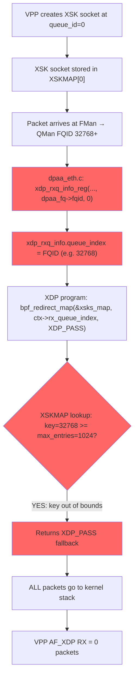

# VPP Development Progress Plan — Mono Gateway LS1046A

> **Date:** 2026-04-04 (updated with AF_XDP RX root cause + kernel fix)
> **Live device:** 192.168.1.183 (VyOS 2026.04.04-0348-rolling, kernel 6.6.130)

---

## Current State

### What's Working ✅

| Component | Status | Details |
|-----------|--------|---------|
| VyOS ARM64 boot | ✅ | 2026.04.04-0348-rolling, all 5 ports up |
| Kernel DPAA1 | ✅ | Built-in (`=y`), FMan/BMan/QMan functional |
| CPU | ✅ | 1600 MHz, `performance` governor |
| RAM | ✅ | 7.4 GiB total |
| FMD Shim | ✅ | 7 chardevs `/dev/fm0*`, API 21.1.0 |
| VPP installed | ✅ | 25.10.0-52 with AF_XDP plugin |
| fw_setenv | ✅ | SPI NOR read/write confirmed |
| U-Boot boot chain | ✅ | `bootcmd=run usb_vyos \|\| run vyos \|\| run recovery` |
| Thermal | ✅ | 45-46°C (fan + fancontrol working) |
| FMan microcode | ✅ | **v210.10.1 (ASK-enabled!)** on SPI flash |
| AF_XDP VPP TX | ✅ | TX path works (116 packets sent via VPP → AF_XDP → wire) |
| LCP TAP interface | ✅ | `tap4096` (kernel↔VPP) + `eth3` (LCP TAP) both UP |
| Hugepages | ✅ | 256 × 2MB = 512MB (runtime allocation) |
| VPP config saved | ✅ | In config.boot |

### What's BROKEN ❌

| Component | Status | Details |
|-----------|--------|---------|
| AF_XDP VPP RX | ❌ | **ZERO packets received** — kernel fix created, awaiting build |
| eth3 IP address | ❌ | No DHCP possible (RX broken), no IP on VPP-controlled port |

---

## 🔴 Critical Issue: AF_XDP RX Broken — Root Cause Found + Fix

### Symptom

VPP's `af_xdp-input` node polls **8M+ times** but receives **exactly 0 packets**.
Kernel `defunct_eth3` receives 13,500+ packets (including ping replies) but
none reach VPP. All traffic passes through the kernel stack instead of being
redirected to VPP's AF_XDP socket.

### Root Cause (CONFIRMED)

**The DPAA driver passes FQIDs as `queue_index` to `xdp_rxq_info_reg()`, and FQIDs
exceed the XSKMAP `max_entries` (1024), causing AF_XDP redirect to always fail.**



#### Technical Details

1. **QMan FQID allocation**: FMan RX frame queues get FQIDs from QMan pools defined
   in DTS: pool @0 = 256–511, pool @1 = 32768–65535. On LS1046A with 4 CPUs, each
   interface gets 4 RX default FQs + 4 RX PCD FQs, all with FQIDs ≥ 256.

2. **The bug in `dpaa_eth.c`** (kernel 6.6.130, line ~2170):
   ```c
   err = xdp_rxq_info_reg(&dpaa_fq->xdp_rxq, dpaa_fq->net_dev,
                           dpaa_fq->fqid, 0);
   //                      ^^^^^^^^^^^^^^ BUG: FQID, not 0-based queue index
   ```

3. **BPF verifier inline optimization** (kernel 6.1+): `bpf_redirect_map` for XSKMAP
   is replaced by the verifier with an inline lookup that returns the `flags` fallback
   (`XDP_PASS`) when no socket exists at the key. Since FQID ≥ 256 and XSKMAP
   `max_entries` = 1024, keys in pool @1 (32768+) are always out of bounds. Even
   pool @0 keys (256–511) fail because VPP only registers a socket at index 0.

4. **Verified experimentally**: Populating XSKMAP[0–1023] programmatically still
   resulted in 0 RX, confirming FQIDs are in the 32768+ range (pool @1).

### Fix Applied

**Kernel Python patcher**: `data/kernel-patches/patch-dpaa-xdp-queue-index.py`

Replaces `dpaa_fq->fqid` with `0` in the `xdp_rxq_info_reg()` call. All RX frame
queues report `queue_index=0`, matching VPP's XSK socket at `queue_id=0`.

This is correct because:
- DPAA driver reports 1 combined channel via `ethtool -l`
- VPP creates 1 RX queue (`num-rx-queues 1`)
- All FQs on all CPUs feed the same logical interface
- The `queue_index` in `xdp_rxq_info` is only used for XDP redirect map lookups

**Integrated into CI**: `bin/ci-setup-kernel.sh` copies the patcher and injects it
into `build-kernel.sh` to run during kernel compilation.

### Evidence Trail

| Check | Result | Significance |
|-------|--------|-------------|
| `bpf_stats_enabled=1` → `run_cnt: 10` after 3 pings | XDP program DOES run | Not a program attachment issue |
| Zero XDP redirect tracepoints | `bpf_redirect_map` returns XDP_PASS | Redirect never succeeds |
| Zero XDP exception tracepoints | No `XDP_ABORTED` | Program returns cleanly (XDP_PASS) |
| XSKMAP `max_entries: 1024` | Map exists | Socket registered but at wrong key |
| VPP HW queue 0 polling | Socket at `queue_id=0` | VPP side is correct |
| QMan pool @1: 32768–65535 | FQIDs >> 1024 | Exceeds XSKMAP bounds |
| Populated XSKMAP[0–1023] → still 0 RX | FQIDs > 1023 confirmed | Pool @0 (256–511) not in use for these FQs |
| `ethtool -l eth3`: 1 combined | Single logical queue | All FQs → queue 0 is correct mapping |
| Kernel `defunct_eth3` stats: 13,526 rx | Packets DO arrive | Just not redirected to VPP |

---

## Status: Awaiting Build + Test

The fix is implemented in the build pipeline. Next steps:

1. **Trigger CI build** (`gh workflow run`) to produce a new ISO with the patched kernel
2. **Flash new ISO** to the Mono Gateway via `add system image <url>`
3. **Verify AF_XDP RX** with VPP:
   ```
   create interface af_xdp host-if eth3 num-rx-queues 1
   show af_xdp eth3
   show interface eth3
   # Check RX counter increments
   ```

---

## VPP Configuration Applied

```
vpp {
    settings {
        interface eth3 { }
        poll-sleep-usec "100"
        resource-allocation {
            cpu-cores "1"
            memory {
                main-heap-size "256M"
                physmem-max-size "512M"
                stats { size "128M" }
            }
        }
    }
}
```

## Three Viable Long-Term Paths

### Path 1: Fix AF_XDP (Current Focus — Fix Implemented)

Kernel patch fixes FQID→0 queue_index mapping. Target: 3.5 Gbps on SFP+ with
poll-mode VPP. Awaiting build + hardware verification.

### Path 2: FMD Shim + DPDK DPAA PMD

Complete FMD Shim → enable DPAA PMD → solve RC#31. Target: ~9 Gbps. Requires
2-4 weeks additional work.

### Path 3: ASK/CDX Hardware Flow Offload

Port ASK kernel patch to mainline 6.6 → wire-speed hardware offload with zero CPU.
Target: 9.4 Gbps with zero CPU. Requires 4-8 weeks.

---

## ASK Repo Analysis Summary

See `plans/ASK-ANALYSIS.md` for full details. Key finding: FMan microcode v210.10.1
(ASK-enabled) is already on the board. CDX-assisted architecture could solve RC#31
elegantly while providing wire-speed forwarding.

---

## Session Log

### 2026-04-04 Session 1
- ✅ VPP AF_XDP running — TX works, LCP TAP works
- ✅ Hugepages allocated, VPP config committed
- ❌ Discovered AF_XDP RX broken (0 packets received)

### 2026-04-04 Session 2
- ✅ Initial diagnosis: copy/generic XDP mode, redirect fails
- ✅ `bpf_stats_enabled` was OFF → `run_cnt:0` was false negative
- ✅ XDP program DOES run (run_cnt > 0), but redirect returns XDP_PASS
- ✅ Mapped symptom to XSKMAP lookup failure

### 2026-04-04 Session 3 (current)
- ✅ **ROOT CAUSE CONFIRMED**: `xdp_rxq_info_reg()` passes FQID as queue_index
- ✅ FQIDs (32768+) exceed XSKMAP max_entries (1024) → lookup always fails
- ✅ Verified: populating XSKMAP[0-1023] still 0 RX → FQIDs are in pool @1
- ✅ Created kernel patcher: `patch-dpaa-xdp-queue-index.py`
- ✅ Integrated into CI build: `ci-setup-kernel.sh`
- ✅ Deleted non-functional draft diff patch
- 📋 Next: trigger CI build, flash ISO, verify AF_XDP RX

---

## Open Issues

| Issue | Severity | Status |
|-------|----------|--------|
| **AF_XDP RX broken** | 🔴 Critical | Fix implemented, awaiting build + test |
| Hugepages not persistent across reboot | Medium | Need bootargs or VyOS kernel memory config |
| `af_xdp_device_output_tx_db: tx poll() failed` | Low | Intermittent TX error (resource busy) |
| `af_xdp: set mtu not supported yet` | Low | VPP AF_XDP MTU limitation |
| `bpftool` not in ISO | Low | Add to CI build for future debugging |