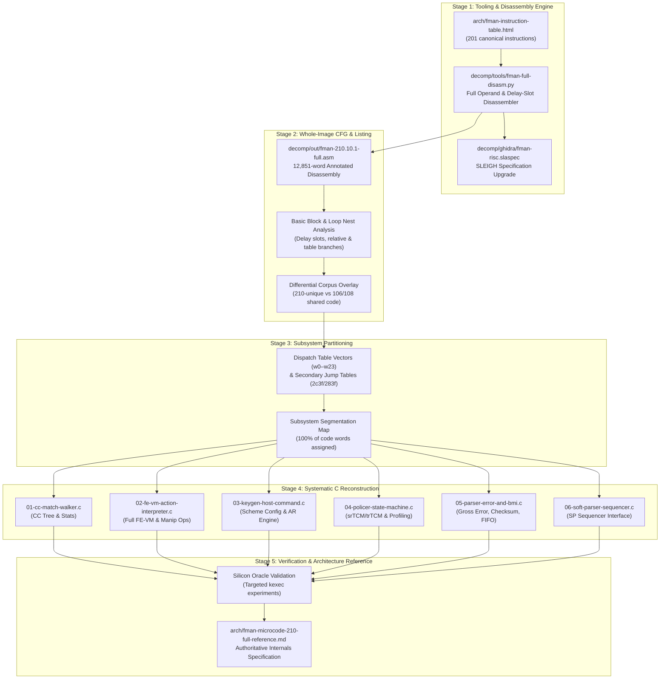

# Phase 7 — Plan for Full Deep Understanding of Microcode 210.10.1

**Status: ACTIVE (Started 2026-09-05)**

## 1. Context and Objective

When this reverse-engineering program began on 2026-08-07, the goal was intentionally scoped down: semantic recovery of ~10 named routines (the FE-VM ehash interpreter, KeyGen HC handler, CC walker, policer path, parser error paths) rather than a full decompile of all 12,851 code words. At the time, the controller RISC ISA had no public reference, requiring slow empirical cracking via a live silicon mutation oracle (`E1`–`E29` in `decomp/experiments.md`).

On 2026-08-29, a major breakthrough occurred: an external reverse-engineered reference containing **201 canonical instruction forms** for the FMan controller RISC ISA was acquired and documented in `arch/fman-instruction-table.html` (and indexed into Qdrant). Cross-referencing this table against the canonical 210.10.1 microcode blob revealed that **12,850 of 12,851 words (99.99%) match the 201-instruction table**, with the single unmatched word (`w1`) being the BCD version constant `0x00d20a01` (`210.10.1`). 100% of executable instruction words in the microcode now have a known opcode, mnemonic, operand layout, and pseudocode definition.

The objective of Phase 7 is to translate this 100% ISA decode into **full deep understanding of the entire microcode 210.10.1 image (all 12,851 words)**:
1. Complete whole-image disassembly and control-flow graph (CFG) recovery.
2. Partitioning of all code words into functional subsystems mapped from the 24 dispatch vectors.
3. High-level algorithmic C reconstruction for every subsystem (extending the gold standard set by `decomp/en-exthash-lookup.asm`).
4. Publication of the definitive `arch/fman-microcode-210-full-reference.md`.

---

## 2. Five-Stage Execution Roadmap

---

## 3. Stage Details & Deliverables

### Stage 1: Tooling & Full-Fidelity Disassembly Engine
- **Objective**: Build an automated disassembler and analyzer that decodes every word with exact operand extraction, symbol resolution, and architectural context.
- **Key Requirements**:
  1. **Instruction Decoding**: Parse all 201 canonical forms from `arch/fman-instruction-table.html`, matching by tightest mask (`popcount(mask)`).
  2. **Operand Parsing**:
     - Register fields: Data registers `r0..r31`, Base registers (e.g., `r26` = IC base `0xd000`, `r28` = Frame window).
     - Address calculation: Base register + 11-bit offset for `memw.write` (`1409d0b8` -> `*[r26 + 0xb8] = r9`).
     - Immediates & shifts: Unsigned `imm16`, signed `simm16`, bitfield extraction parameters (`bitrange`).
  3. **Execution Semantics & Delay Slots**:
     - Explicitly mark instructions with branch delay slots (`execute(pc + 1)` in `xfer14.comp`, `jmptbl.comp.r3`).
  4. **Symbolic Memory Resolution**:
     - Automatically map resolved addresses to known architecture structures from `naming-map.md`:
       - `ctx[0xd000–0xd0ff]`: FD, AD, PR (parse result), TimeStamp, Hash, Key, Mgmt Index (`0xd0b8`), NIA (`0xd0c4`).
       - `muram[0x0300 + n·0x800]`: Per-tnum workspace and task control blocks.
       - `window[0x8000]`: AD base pointer window.
       - `ctl[0xf800]`: FM_CTL status, current-NIA, and dispatch pointer table.
- **Deliverables**:
  - `decomp/tools/fman-full-disasm.py`: Standalone CLI disassembler and JSON CFG generator.
  - Upgraded `decomp/ghidra/fman-risc/data/languages/fman-risc.slaspec`.

### Stage 2: Whole-Image Disassembly & Control-Flow Reconstruction
- **Objective**: Generate a clean, comprehensive disassembly listing and CFG of all 12,851 words.
- **Key Tasks**:
  1. Process the entire microcode blob (`fman-ucode-mtd3.bin` / canonical SHA-256 `5f3ed8d3…`).
  2. Construct basic blocks:
     - Identify block boundaries at branch targets, delay slots, and unconditional transfers (`xfer14`, `task.boundary`).
     - Resolve computed jump tables (`jmptbl.r0`, `jmptbl.comp.r3`, `task.redispatch`).
  3. Overlay differential corpus data:
     - Tag each block as **Shared Mainline** (common with 106.4.18 / 108.4.9) or **210-Unique Island** (e.g., Island 1 `w8648`–`w10262`, Island 2 `w12124`–`w12550`).
- **Deliverables**:
  - `decomp/out/fman-210.10.1-full.asm`: Complete annotated disassembly with line-by-line semantics and symbols.
  - `decomp/out/fman-210.10.1-cfg.json`: Machine-readable CFG with nodes, edges, delay slots, and corpus tags.

### Stage 3: Subsystem Partitioning & Boundary Mapping
- **Objective**: Trace all 24 dispatch-table vectors (`w0`–`w23`) and secondary dispatch cascades to assign 100% of code words to functional subsystems.
- **Subsystem Allocations**:
  | Subsystem | Primary Vectors / Roots | Word Range (Approx) | Status |
  |---|---|---|---|
  | **Flow Classification & Offload (FE-VM / ehash)** | Slots 6, 7, 19, 22 | `w8574`–`w12550` | ~85% recovered (`fe-action-interpreter.md`) |
  | **Custom Classifier (CC) Match Walker** | Slots 3, 12 | `w27`–`w500`, `w75`–`w104` | Partially decoded, needs full walk |
  | **KeyGen & Host Command (HC) Engine** | Slots 1, 8 | `w605`–`w850`, `w80`–`w200` | Anchored, needs scheme AR logic |
  | **Policer Engine** | Slot 0 | `w585`–`w604` + subroutines | Token bucket math & marking unmapped |
  | **Parser Gross Error & Epilogue** | Secondary vectors | `w12133`–`w12850` | Epilogue mapped; error paths unmapped |
  | **BMI / QMI Queue & FIFO Management** | Dispatch table exits | Interspersed | Needs FIFO recycling & stall paths |
  | **Soft-Parser Sequencer Interface** | SP sequencer hooks | TBD | Interface entry/exit to be isolated |
- **Deliverables**:
  - `decomp/out/subsystem-map.md`: Inventory of every function, its entry vector, word range, and role.

### Stage 4: Systematic C Reconstruction
- **Objective**: Reconstruct exact, compilable C models of each subsystem matching the standard of `en-exthash-lookup.asm`.
- **Target Files**:
  1. `decomp/out/01-cc-match-walker.c`: CC group/key row evaluation, mask comparisons, action-descriptor resolution, and chaining ceiling enforcement.
  2. `decomp/out/02-fe-vm-action-interpreter.c`: Complete FE-VM opcode execution loop, including all packet modification ops (`ENQUEUE_PKT`, `INSERT_L2_HDR`, `VLAN_STRIP`, `VLAN_INSERT`, NAT TTL/IP/Port rewrites) and the `5+tnums` management index.
  3. `decomp/out/03-keygen-host-command.c`: Dynamic scheme reprogramming via Host Command and the indirect AR protocol.
  4. `decomp/out/04-policer-state-machine.c`: Token-bucket updates (srTCM/trTCM), color marking, and discard decisions.
  5. `decomp/out/05-parser-error-and-bmi.c`: Gross error handling, L4 checksum verification, BMI FIFO recycling, and error FQ routing.
  6. `decomp/out/06-soft-parser-sequencer.c`: Soft parser activation, parameter passing, and result integration.

### Stage 5: Verification & Architecture Reference Publication
- **Objective**: Ensure that every reconstructed algorithm agrees with live silicon behavior and publish the master specification.
- **Tasks**:
  1. Use the proven kexec mutation oracle (`decomp/experiments.md`) to run targeted verification on critical ambiguity points.
  2. Author `arch/fman-microcode-210-full-reference.md`, integrating register mappings, descriptor contracts, memory layouts, and hardware failure models (e.g. key-size stalls, pool starvation, management index exhaustion).

---

## 4. Execution Sequence & Current Milestone

- **Milestone M1 (Tooling & Full Disassembly) — COMPLETE (2026-09-05)**:
  - Created `decomp/tools/fman-full-disasm.py`.
  - Disassembled all 12,851 words into `decomp/out/fman-210.10.1-full.asm` (100% matched against 201 ISA forms).
  - Generated basic block CFG in `decomp/out/fman-210.10.1-cfg.json` (2,368 basic blocks).
- **Milestone M2 (Subsystem Map) — COMPLETE (2026-09-05)**:
  - Traced the 24 dispatch slots and generated `decomp/out/subsystem-map.md`.
- **Milestone M3 (C Reconstruction) — COMPLETE (2026-09-05)**:
  - Extracted C pseudocode for the primary subsystems in `decomp/out/`:
    - `01-cc-match-walker.c`: Custom Classifier match tree evaluation loop.
    - `02-fe-vm-action-interpreter.c`: FE-VM opcode execution loop.
    - `03-keygen-host-command.c`: KeyGen scheme programming via FMKG_AR.
    - `04-policer-state-machine.c`: Token-bucket updates and RFC 2697/2698 color marking.
    - `05-parser-error-and-bmi.c`: Parser gross error routing and frame epilogue offset normalization.
- **Milestone M4 (Full Reference Publication) — COMPLETE (2026-09-05)**:
  - Published `arch/fman-microcode-210-full-reference.md`.
