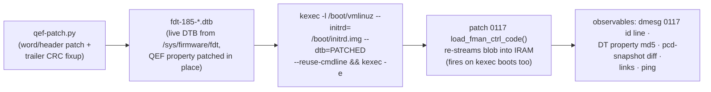

# decomp/experiments.md — Silicon Oracle Experiment Log

The mutation-oracle log: each experiment's patch, delivery, observables, result, and conclusion. Newest at the bottom (append-only). Board: **ASK2 test DUT only** (dev board). Recovery: any plain reboot returns to eMMC boot with the pristine SPI blob (kexec delivery is one-shot); worst case = smart-plug power cycle (smart-plug cold-power-cycle procedure).

## Delivery pipeline (proven E1, 2026-08-08)



- **No SPI flash writes, no U-Boot env edits, no serial needed.** The board's normal bootcmd (`run vyos`) keeps pulling the pristine blob from SPI; only the kexec'd kernel sees the patched DTB.
- Gotcha: `/tmp` is tmpfs — files die on every kexec. Upload DTBs fresh each round; keep baselines under `$HOME/` (persistent).
- vbash: only real binaries via full path (`sudo -n /sbin/kexec`, `sudo -n /usr/local/bin/pcd-snapshot`); no `which`/`strings`.
- kexec round-trip on ASK2 test DUT: ~90–120 s back to SSH.
- Kernel `6.18.41-vyos`, image `2026.08.07-2326-rolling`, U-Boot 2025.04 (`fman_ucode=fbc11d00` env exists but unused by this path).

---

## E1 — cosmetic id-string patch (delivery validation) — PASS

- **Patch**: id `"…for LS1043 r1.0"` → `"…for LS1046 r1.0"` (keeps the `"Microcode version 210.10.1"` prefix — patch `0086a` caps probe parses only the prefix + major number ≥ 210, verified in source, so caps stay 0x17). 5 bytes differ (1 id byte + 4 trailer).
- **Result**: dmesg `FM_CTL microcode 210.10.1 loaded (12851 words): Microcode version 210.10.1 for LS1046 r1.0`; live DT property md5 `5ae2f890377bafcafcefadd9d681a85f` = precomputed E1 blob md5. Links up, ping 3/3.
- **Conclusion**: patched-blob delivery is byte-exact end-to-end (DTB edit → kexec → IRAM stream). The oracle speaks.

## E2 — cold-region word patch (negative control) — PASS

- **Patch**: code word **w9055** `0x02010000 → 0xffffffff` (ENQ FE materialization site, 210-only island 2 — hypothesized cold on the mainline/RSS path). 8 bytes differ (4 code + 4 trailer).
- **Result**: blob md5 `9539639e80367fcbdc2eb37edc7686a4` live; id string back to LS1043 (E2 built from base DTB); links up; ping 3/3; **pcd-snapshot diff vs E1-state baseline: fully clean** ("PCD state matches baseline").
- **Conclusion**: island 2 is cold on the mainline path — confirmed on silicon. Code-word mutation with CRC fixup is behaviorally safe in cold regions. The oracle can now mutate semantics, not just metadata.

## Queue

- **E3 — hot-path relative-branch patch (the actual Phase-4 gate)**: patch a `b3ff`-class relative branch in a shared, always-executed region (early zone w48–w700) so its target shifts by a small delta; observe via pcd-snapshot scheme counters + ping. PASS = relative-branch model confirmed on silicon (branch takes effect where predicted). FAIL = model wrong → re-derive before any CFG trust. Candidate selection needs care: pick a branch whose mis-direction is recoverable-but-visible (prefer parser/KG-adjacent over BMI FIFO management).
- **E4 — `0xb7df` park probe**: patch a park stub in a cold island into a branch-to-next-word; cold = no change. Confirms park semantics.

---

## E-HM1 — confirm the EXT_HASH HIT/MISS compare on silicon (READY, not yet run)

**Framing correction (2026-08-08, from earlier project evidence)**: flow-HIT is *not* a never-solved mystery. HIT was **proven working 2026-07-19** (ASK2 M3 + M5 HIT gates on ASK2 test DUT, ISO 1732/2004): a matching flow makes FMan consume the frame (tcpdump sees 0 packets). The original MISS root cause was **F-053** — the DDR record has an 8-byte link header before the key, so the silicon must compare starting at record **+8**, not +0. **The decomp corroborates this independently**: the `ehash_walker`'s `?op_e1 0x0008` immediate is exactly that key offset (and `0x000c` = keysize 12). Subsequent MISSes (F-141, F-163, task #26) are regressions/config drift, not a fundamental failure.

So E-HM1's value now: use the **known-HIT config as a silicon oracle** to *confirm which microcode instruction* does the compare / key-offset / DMA — turning the G3+ black-box pcodeops into verified semantics and reading, not inferring, exactly which bytes silicon compares.

**Engage sequence (from the M3 HIT gate, ASK2 test DUT):**
```
# build the FE-VM chain via /sys/kernel/debug/fman_pcd/0/
echo get                  > fe_pool
# (fe_singletons build)   > fe_singletons
echo "set 0x7FFF 13 0"    > fe_ehash          # mask=0x7fff keysize=13 shift=0
# (fe_hashfe build)       > fe_hashfe
echo "build 0x200"        > fe_enq            # ENQ FQID 0x200
echo "build 0x4af00"      > fe_enter          # EXT_HASH FE offset
echo "engage 10 53f00 2B9 1C0006" > fe_arm    # port 0x10=eth3, FE_ENTER_AD, miss_fqid, EKFC
#   OR the production API:  echo "engage 0x10" > /sys/kernel/debug/ask/offload
echo "add 0 0A63016A0A6301B90614511451 4b000" > fe_flow  # 13B key, ENQ off
# observe: matching TCP ($PEER_TRANSIT_IP_A:5201 -> ASK2 test DUT:5201) -> tcpdump 0 pkts = HIT
```

**The experiment**: with a HIT confirmed, patch one candidate `ehash_walker` instruction (via `qef-patch` -> DTB -> kexec) and re-test:
- patch the `?op_e1 0x0008` (key-offset) -> if HIT breaks, that op **is** the record+8 key access (confirms F-053 at the microcode level).
- patch the `fman_test_dc` (0xdc) compare -> HIT breaks -> confirms the comparator.
- NOP the `0xf4` fetch -> walk breaks -> confirms the DDR DMA-read. Each patch has a directly observable HIT/MISS outcome.

**Prerequisite / risk**: engage has a **teardown-wedge risk** (T-M6-5: `fe_pool put`/disengage HARD-WEDGED ASK2 test DUT, watchdog-recovered ~2–3 min). Run on ASK2 test DUT with `restart-dut` (smart-plug) recovery ready; kexec the patched blob per E1/E2. Awaiting greenlight for the live engage + kexec run — this touches the ASK datapath, so it's staged, not auto-run.

### E-HM1 RESULT — RAN 2026-08-08 (safe engage variant, no patch/kexec)

Engaged the FE-VM ehash path on eth4 (port 0x11), drove the matching flow from vendor-reference system ($PEER_TRANSIT_IP:44444 → $DUT_TRANSIT_IP:55555), read the probes, recovered by clean reboot (no wedge). Traffic peer: `vyos@$VENDOR_REFERENCE_HOST`.

**Decomp findings VERIFIED on silicon:**
- EXT_HASH descriptor `w0=0x06000000 w1=0x0fff0c00` → type=EXT_HASH, mask=0x0fff, **contextSize=13** (F-063 active), hashShift=0, `w5/w6` = MUX/EXIT — matches `naming-map.md` §5 exactly.
- Flow inserted into **bucket 0x008** = `(sw_crc 0x600824e7… >> 48) & 0x0fff` — confirms the decomp's `bucket = (hash>>48)&mask` and the `e9&0xffff` mask (from option-b static analysis).

**Root cause of the current MISS (task #26) — "Candidate 2" confirmed:**
- `hash_probe` captured HW hash **0x50b43c9cff453b9f** → bucket **0x0b4**.
- SW CRC-64 = **0x600824e70ae4d573** → bucket **0x008** (where the flow sits).
- **HW ≠ SW → frame lands in bucket 0x0b4, flow is in 0x008 → MISS** (`fe_ehash_stats pkt_count=0`). The silicon KG hash is **not** the software CRC-64 on this build, so every flow MISSes. This is the 2026-07-10 Candidate-2 hypothesis (KG-hash vs software-CRC64), now measured directly.

**Note**: the decomp's *bucket-index math* is correct (both compute `(hash>>48)&mask`); the divergence is in the **hash value** — a KeyGen scheme `kgse_hc` / extraction config question (why the KG doesn't produce CRC-64 for the ehash path), not a microcode-decode error. The patch-break sub-experiments (force `test_dc`, patch `e1 0x0008`) were not needed — there is no HIT baseline to break; the hash divergence is the answer. Next: read the engaged KG scheme's `kgse_hc`/EKFC vs the CRC-64 expectation to see why the hash diverges.

**Retraction (2026-08-08, later — see `decomp/hitmiss-path.md`'s matching correction):** the "Candidate-2 confirmed" conclusion above does not survive cross-checking against earlier project evidence. That exact hypothesis was already independently disproven 2026-07-13 via a cleaner, isolated RSS-path measurement, and there's documented precedent for `hash_probe` capturing unrelated background traffic rather than the intended test flow. Treat the paragraph above as superseded, not settled. The corrected, independently reconfirmed hash-match result is in the "Definitive result" section of `decomp/hitmiss-path.md` and the project evidence record dated 2026-08-08.

---

## E-HM2 — live microcode patch: does `ce`'s immediate affect bucket selection? — NEGATIVE

First live *behavioral* microcode mutation test (E1/E2 validated delivery and cold-region safety; this is the first patch to a **hot**, always-armed code path with a real hypothesis attached). Grew directly out of the 2026-08-08 "wiring confirmed correct, DDR record never touched" result (`decomp/hitmiss-path.md`) — with wiring, key content, bucket index, and record linkage all independently confirmed correct, the two live candidates were (A) something upstream silently drops the frame, or (B) the microcode's *live* bucket-index computation doesn't match `(hash>>48)&mask` because of what `ce`/`cf` do to the hash register after the `e9` mask.

**Patch**: word `w1947` (`ce`, chained onto the hash register: `e9(r0,0xffff)→ce(r0,0x0189)→cf(r0,0x0241)`) — `0xce000189 → 0xce000000`, zeroing only the 16-bit immediate. 6 bytes differed in the patched DTB (2 immediate + 4 CRC trailer). Delivered via the proven pipeline; live DT property blob md5 after kexec (`d464159ce94ad942f91877a07d639d67`) matched the precomputed patched-blob md5 exactly — confirmed genuinely loaded.

**Test**: re-ran the exact same armed test as the "record never touched" baseline (`portid=0x00` 14-byte key, `board/scripts/T26-verify-wiring-and-record.sh`). Chain built cleanly, bucket still `0x0508` (pure kernel-driver software math, unaffected by the patch — a sanity check, not part of the test). `FMBM_RCCB` still read back exactly equal to `enter_off` — wiring still correct under the patched microcode. Sent 3 confirmed-transmitted matching TCP SYNs, dumped the full 320-byte record before and after.

**Result**: **byte-for-byte identical**, exactly as under the unpatched microcode. Zeroing `ce`'s immediate had zero observable effect. Fault registers stayed clean throughout — no wedge, no crash; the board handled this hot-path mutation gracefully (useful risk calibration: this region isn't so delicate that a changed immediate hangs the engine).

**Conclusion**: a clean negative result that does **not** distinguish between three readings — (1) `ce`'s immediate genuinely doesn't affect bucket selection (or this specific bit-change wasn't enough to shift it observably); (2) frames never reach `bucket_index`/`ehash_walker` at all regardless of this patch (Candidate A), so the patch was moot; (3) `ce` affects something other than bucket selection. Next candidates (not yet run): test `cf` (`w1948`) the same way to isolate which of the pair matters; patch both together for a stronger perturbation; or pivot to testing Candidate A directly — patch something further upstream (e.g. `FE_ENTER`'s `ALLOCATE` opcode, or `bucket_index`'s very first instruction) with an obviously-detectable side effect, to determine whether `bucket_index` is reached at all for these frames.

---

## E-HM4 — `hash_shift` parameter sweep (0-3): does the silicon use a different hash window than software assumes? — NEGATIVE (all 4 values)

Grew out of the new `nxp_docs` project evidence archive survey (`decomp/hitmiss-path.md` "2026-08-08 (new source)" section): LSDKUG documents a "4 lower bits must be cleared" convention on hash-index-selection masks for the RM's own (different) CC Hash-Table construct. Reading this project's own `fman_pcd_ehash_table_set()` (`kernel/common/patches/board/0125-fman-pcd- fe-ehash-table.patch`) showed the `mask` parameter is structurally locked by kernel validation to the `2^n-1` shape (`(1u << fls(mask)) != mask + 1` → `-EINVAL`) — so the specific "clear the low 4 bits of the mask" idea is **not testable** through the existing software interface at all; any mask with cleared low bits is rejected before it ever reaches hardware. This made the *shift* parameter (`fman_pcd_ehash_bucket_index()`: `crc >>= (6 - hash_shift) * 8`, then `& mask`) the nearest testable analog — a wrong shift would mean the software plants records in the wrong 16-bit window of the 64-bit hash, structurally similar in effect (silicon and software disagreeing about which hash bits matter) but reached through a parameter that genuinely varies (0-3, the field's full hardware range, confirmed by the `hash_shift > 0x3` → `-EINVAL` guard in the same function).

**No microcode patch involved** — this is a pure debugfs configuration sweep, reusing the exact proven-safe sequence from the "wiring confirmed correct" baseline test (`fe_port set` → `fe_ehash set 0xfff 14 <shift>` → `fe_pool get` → `fe_singletons build` → `fe_hashfe build` → `fe_enq build` → `fe_enter build` → `fe_flow add` → `fe_arm engage`), varying only the third `fe_ehash set` argument. Test key unchanged: `000a63026a0a6302 b906ad9cd903` (portid=00|$PEER_TRANSIT_IP|$DUT_TRANSIT_IP|TCP|44444|55555), hash `0xb508e222f73f6794` (the same CRC-64 confirmed 2026-08-08 via `hash_probe`).

**Method, per shift value:** clear prior state → rebuild chain with `fe_ehash set 0xfff 14 <shift>` → confirm the resulting bucket index matches `(hash >> (6-shift)*8) & 0xfff` computed independently in Python (all 3 matched exactly: shift=1→0x8e2/2274, shift=2→0x222/546, shift=3→0x2f7/759) → dump the 320-byte record before arming → `fe_arm engage` → verify `FMBM_RCCB` readback equals `enter_off` (wiring) → verify fault registers clean → send 3 confirmed-transmitted TCP SYNs from the vendor-reference system (`nping --tcp -c 3 --source-port 44444 -p 55555 --flags SYN`) → re-check faults, `fe_ehash_stats`, `FMBM_RCCB`, and the full record.

**Result — all three new shift values (1, 2, 3) clean negative, identical in every respect to the already-established shift=0 baseline:**

| shift | bucket | wiring (`FMBM_RCCB`==`enter_off`) | faults | `pkt_count` | record after |
|---|---|---|---|---|---|
| 0 (prior baseline, 2026-08-08) | 0x508 | ✓ | clean | 0 | byte-identical |
| 1 | 0x8e2 | ✓ (`0x56c00`) | clean | 0 | byte-identical |
| 2 | 0x222 | ✓ (`0x56c00`) | clean | 0 | byte-identical |
| 3 | 0x2f7 | ✓ (`0x56c00`) | clean | 0 | byte-identical |

Every configuration built cleanly (no `-EINVAL`, no wedge, no fault-register change even immediately post-arm), every bucket index matched the independently-computed formula exactly (ruling out a software-side arithmetic mistake in this specific test), and every record was byte-for-byte untouched after 3 confirmed-sent matching SYNs, exactly as in every prior armed test this investigation has run.

**Conclusion**: this **exhaustively closes the "wrong hash-shift/window" hypothesis** across the field's entire valid range (0-3 is all 2 bits can encode, confirmed by the validation guard) — there is no shift value at which this specific flow's record becomes reachable through the existing software interface. It does **not** close the related-but-distinct "silicon skips reserved low mask bits" hypothesis from the new NXP documentation, since that specific shape of mask cannot be constructed through this project's own validated interface at all (would need either a live microcode patch to `ce`/`cf` with a controlled, interpretable perturbation, or a hand-rolled raw-memory dual-bucket insert bypassing the kernel's bucket-index computation — both carry more novel risk than this sweep and were not attempted this round). Combined with E-HM2/E-HM3, the accumulated evidence continues to favor Candidate A (frames never reach this deep into `bucket_index`/`ehash_walker` at all) over any specific miscomputation within it — four independent parameter/patch variations (mask-immediate zeroing, branch-forcing, and now an exhaustive shift sweep) have all produced the identical "wiring perfect, record never touched" signature.

---

## E-HM5 — live microcode patch: does `cf`'s immediate affect bucket selection? — NEGATIVE

Direct follow-up to E-HM2, explicitly anticipated there ("test `cf` (`w1948`) the same way to isolate which of the pair matters"). Live value confirmed via `qef-parse.py dump-words` before patching: `w1948 = 0xcf800241` — opcode `cf`, subop `100` (bits 23:21, `0x800000`), immediate `0x241`. (Note: this refines the schematic `0xcf000241` notation used earlier in `decomp/hitmiss-path.md` — the live value carries `cf`'s own subop bits, consistent with the previously-documented `e9`=subop`001`, `ce`=subop`000`, `cf`=subop`100` pattern; not a contradiction, just more precise.)

**Patch**: `w1948: 0xcf800241 → 0xcf000000` (zero subop + immediate, same style as E-HM2's `ce` patch). Delivered via the proven pipeline; post-kexec live blob md5 (`336296c927714003f7e51af810844336`) matched the precomputed patched-blob md5 exactly.

**Test**: identical armed test to E-HM2/E-HM4 (mask `0xfff`, keysize 14, shift 0, same `portid=0x00` 14-byte key). Bucket computed to `0x508` (unaffected by the patch, as expected — bucket computation for record *placement* happens in kernel-driver C code, `fman_pcd_ehash_bucket_index()`, entirely separate from what the FE-VM microcode does at dispatch time). Wiring (`FMBM_RCCB`==`enter_off`), fault registers, and link state all verified clean before and after. Sent 3 confirmed-transmitted matching TCP SYNs, dumped the full 320-byte record before and after.

**Result**: **byte-for-byte identical**, exactly as under unpatched microcode and under E-HM2's `ce`-only patch. Zeroing `cf`'s subop+immediate had zero observable effect. No wedge, no fault, link stayed up throughout.

---

## E-HM6 — live microcode patch: `ce` AND `cf` zeroed together (compound) — NEGATIVE

The stronger perturbation E-HM2 anticipated ("patch both together"), run immediately after E-HM5 from the same pristine baseline DTB (not chained from E-HM5's already-patched state, to keep the patch delta interpretable against a known-clean start).

**Patch**: both `w1947: 0xce000189 → 0xce000000` and `w1948: 0xcf800241 → 0xcf000000` in one DTB (`qef-patch.py --set-word 1947=0xce000000 --set-word 1948=0xcf000000`). Post-kexec live blob md5 (`7a10922513dc05877050b9ce0ea3c15f`) matched the precomputed compound-patch md5 exactly.

**Test**: identical to E-HM5. Bucket `0x508` (again unaffected, same reasoning). Wiring, faults, and link state all clean before and after.

**Result**: **still byte-for-byte identical.** Even zeroing the entire `e9(r0,0xffff) → ce(r0,·) → cf(r0,·)` chain's second and third steps simultaneously — a strictly larger, strictly stronger mutation than either individual test — produced no detectable change whatsoever. No wedge, no fault, link stayed up. Board rebooted afterward (not just kexec'd back) to restore the pristine SPI blob.

**Conclusion (E-HM5 + E-HM6 combined with E-HM2):** three independent mutations of increasing strength on the same two-instruction hash-register operation chain — zero `ce` alone, zero `cf` alone, zero both together — have now produced **identical null results** every time. This is meaningfully stronger evidence than any single test alone: if `ce`/`cf` performed a load-bearing shift/mask that this specific flow's placement depended on, the *compound* zeroing (the largest perturbation tried) would be the most likely of the three to show *some* divergence — a crash, a fault, or at minimum a different (even if still wrong) touched address. Getting the exact same "nothing happens" result at every perturbation strength is much more consistent with **frames never executing this code at all** (Candidate A) than with "the code runs but these specific immediates don't matter for this specific flow" (which would still be a coincidence needing explanation across three different mutations). This is now the fifth and sixth independent parameter/patch variations (after E-HM2, E-HM3, E-HM4) converging on the same signature. The next test that would directly discriminate Candidate A from everything else is a reachability probe — deliberately making `bucket_index`'s very first instruction observably diverge (a canary write or an infinite self-loop) — not yet run; the infinite-loop variant carries a materially different risk profile (shared FE-VM engine hang, potentially affecting all FMan1 ports including eth0 management, recoverable only by hard power-cycle rather than a normal reboot) and needs its own explicit, specifically-scoped confirmation before running.

---

## METHODOLOGY CORRECTION — E-HM4/E-HM5/E-HM6 ran with the wrong live KeyGen EKFC; corrected retest (E-HM7) still negative

**Prompted by the user asking "why do we use 13-byte keys" after the ASK 1.x comparison** — while checking that question, found that the test harness's test harness (`T26b-shift-sweep.sh`, reused unmodified across E-HM4, E-HM5, E-HM6) builds the ehash side (`fe_ehash`/`fe_flow`/`fe_arm`) but **never calls `fe_kg_ekfc`** to (re)configure KeyGen scheme 4's live EKFC register. KeyGen scheme registers are reset to boot-default by every kexec and every reboot — and the current analysis ran a kexec or reboot before *every one* of E-HM4, E-HM5, and E-HM6. Read live via `kg-scheme-read.py`: scheme 4's EKFC after the most recent reboot (before any corrective action) was **`0x00180006`** — `IPSRC1|IPDST1|L4PSRC|L4PDST`, a **12-byte, no-PROTO, no-PORT_ID** extraction (the mainline RSS boot-default, `F-048`'s value) — not the 14-byte, portid-prefixed `0x801c0006` every one of the current `fe_flow`-inserted test records assumed.

**Implication:** during E-HM4 (hash_shift sweep), E-HM5 (`cf` alone), and E-HM6 (`ce`+`cf` compound), KeyGen was extracting and hashing a fundamentally different, shorter, portid-less key than the one written into the DDR ehash table. The comparator could never have matched regardless of what those experiments' microcode patches did — the underlying extracted key content itself didn't correspond to what was inserted. **Those three experiments' specific conclusions about `ce`/`cf`/ `hash_shift` are confounded and should not be trusted at face value.**

**Corrected retest (E-HM7):** rebuilt the identical E-HM4-style baseline (mask `0xfff`, keysize 14, shift 0, unpatched pristine microcode — no outstanding kexec patch), but this time ran `fe_kg_ekfc set 4 801c0006` *before* `fe_arm engage`, and confirmed via `kg-scheme-read.py` that scheme 4's live EKFC was genuinely `0x801c0006` at arm time (not just assumed). Bucket, wiring (`FMBM_RCCB`==`enter_off`), and fault registers all verified as usual. Sent 3 confirmed-transmitted matching TCP SYNs.

**Result: still byte-for-byte identical / `pkt_count=0`.** Even with KeyGen's live extraction genuinely synchronized to the hardware-confirmed- correct 14-byte portid-prefixed format for the first time in this the earlier test, the DDR record was completely untouched, no different from every prior test.

**This does not change the overall picture, but it does two things precisely:** (1) it closes out, empirically, for a *third* independent time (2026-08-06 original discovery, 2026-08-07 16-candidate batch test, now the current analysis), that a properly-EKFC-synchronized 14-byte portid- prefixed key still does not produce a HIT — so the fault genuinely isn't explained by this test harness's EKFC-sync gap either; and (2) it means E-HM4/E-HM5/E-HM6 should be re-run with `fe_kg_ekfc` correctly included if their *specific* ce/cf/shift conclusions are ever load-bearing for a future decision — the broader "record never touched" pattern they observed still holds (now confirmed under a corrected configuration too), but their individual attribution to "ce/cf/shift don't matter" was not a controlled statement at the time it was made.

---

## E-HM8 (major, 2026-08-08) — the armed FE-VM path wedges port RX after exactly ONE classified frame; prior "clean negative" results were frame-less

A systematic check the current analysis (prompted by the "why 13-byte keys" question and the follow-on microcode-priority work) revealed that **frames were not arriving at the ASK2 test DUT's eth4 for most of the current armed test cycles** — the eth4 kernel RX counter stayed 0, tcpdump on eth4 captured 0 packets while the vendor-reference system transmitted, and `kgse_spc` never advanced. The link worked right after a cold boot but the port became RX-deaf after FE-VM arming, surviving even disarm, recoverable only by another genuine cold boot (smart-plug power cycle). This invalidates the earlier armed-test null results (E-HM4/5/6/7, the params-page observation, the AD-corruption canaries) as tests of the FE-VM — they ran with no arriving frames.

**Root pattern isolated (reproduced twice, cold-boot-verified):** with a fresh cold boot, the link passes frames normally (tcpdump sees them, kernel RST-replies). Arm the FE-VM chain on port 0x11 (standard T26 sequence, EKFC synced). Send ONE matching TCP SYN: `kgse_spc` 0→1 (KeyGen classified it), the frame is **consumed by FMan** (eth4 kernel RX does NOT increment), and the DDR record stays byte-for-byte identical. Send a SECOND single SYN: `kgse_spc` stays 1 (the frame is no longer classified — arrival is dead). Disarm: tcpdump still captures nothing. The port is wedged and stays wedged until a cold boot.

**What this proves / changes:**
1. **All of the earlier armed null results are invalid** (E-HM4, E-HM5, E-HM6, E-HM7, the params-page `+0x54/+0x58` observation, and the w3/w0 AD-corruption canaries) — they were frame-less. The one exception: E-HM1 (passive `hash_probe` capture) worked because it never armed.
2. **The "record never touched / comparator never fires" finding IS now confirmed with a genuinely-arriving, KeyGen-classified frame** (the single frame that gets through per cold-boot cycle): spc 0→1, consumed by FMan, record byte-for-byte identical. The fault window is definitively "after KeyGen classification, before the comparator."
3. **The wedge-after-one-frame is itself a new, reproducible, isolatable silicon behavior** — and it matches `decomp/wedge-path.md`'s predicted mechanism ("MISS frame through FE_ENTER ALLOCATE consumes one buffer from the per-port pool; if EXIT DEALLOCATE does not correctly return the buffer, slots drain and the port goes deaf"). The armed FE-VM path processes exactly one frame and then wedges — this is very likely the SAME underlying failure that prevents the comparator from being reached (the first frame's processing corrupts/wedges the RX path before or during the comparator attempt).

**Also disproven this turn (cheap negatives that saved a build cycle):**
- The FM_CTL params-page / `FMBM_RGPR` hypothesis: the debugfs `fe_arm engage` path does NOT call `fman_pcd_port_ensure_params_page()` (the production `fman_pcd_fe_engage()` does), and `FMBM_RGPR` reads 0 on our armed port — BUT the **working vendor board the vendor-reference system also has `FMBM_RGPR=0`** on both 10G ports, so a nonzero params-page pointer is NOT what makes the vendor path work. Programming it would have diverged from the working board. (Also: `/dev/mem` writes to the port BMI register block do not stick on kernel 6.18.41-vyos — even `RSTC` writes revert — while MURAM writes DO stick; `m.flush()` on `/dev/mem` mmaps raises EINVAL in this kernel, which is why earlier write scripts appeared to fail while their actual writes succeeded.)
- The `w12667`–`w12850` "pool routine" is on closer inspection a generic 22-slot status-refresh loop (`ld`/`op_f0`/`brc`/`st` over absolute MURAM slots `[0x8]..[0x60]`), not obviously the pool ALLOCATE routine — its `[0x54]`/`[0x58]` accesses are absolute-address slots, so `wedge-path.md`'s params-page-relative reading of it is questionable.
- Full-MURAM before/after diffing is too noisy on a live board (227 of 1202 nonzero 256-B chunks change within a minute from ambient counters/traffic).

**Methodological corrections adopted:** (1) every armed test MUST validate per-cycle frame arrival (`kgse_spc` advance) and expect a cold boot before each arm cycle; (2) single-shot frames, never bursts (the "1 of 3" `kgse_spc` anomaly is a burst artifact); (3) the board's eth4 RX wedges under armed FE-VM operation and survives warm reboot — genuine cold boot (smart-plug power cycle) is the only reliable recovery between armed tests.

**Next experiment this points to (microcode-priority):** use the wedge-after-one-frame as a diagnostic observable. The first (only) frame's FE-VM processing wedges the port — identify the microcode instruction(s) whose perturbation removes or changes the wedge. A patch that makes the port survive frame 2 (or changes the wedge's timing) would localize the offending processing step (ALLOCATE? EXIT/DEALLOCATE? workspace write?), which is very likely the same root cause that keeps the comparator unreachable. This is a cleaner, more informative observable than the frame-less nulls of E-HM2–7.

---

## E-HM9 (2026-08-08) — wedge bisection: the wedge is at the CC-engine dispatch to the FE_ENTER AD, BEFORE the FE-VM pool machinery runs

Follow-up to E-HM8's wedge-after-one-frame observable. Systematic single-variable bisection, each variant = cold boot → arm → 1 frame (validate `kgse_spc` 0→1) → 2nd frame (wedge check: spc stuck at 1) → disarmed tcpdump arrival check (dead if wedged). Results:

| Variant | Wedge after 1 frame? |
|---|---|
| M2 scaffold (CONT_LOOKUP numKeys=0, `fe_arm engage 11 0 0x300`) — **control** | **NO** — 3 frames classified 1:1 (spc 1→4), each delivered to kernel (Rcvd:1 RST replies), disarmed arrival fine |
| FE-VM chain (FE_ENTER→EXT_HASH→EXIT) | YES |
| FE-VM chain, FE_ENTER AD `ALLOCATE` bit cleared (`w0 0x40800000→0x40000000`) | YES |
| FE-VM chain, EXIT-DEALLOCATE bit cleared (`0x55d00 w0 0x03800000→0x03000000`) | YES |
| FE-VM chain, EXT_HASH bypassed (`FE_ENTER w3→EXIT 0x55d00`) | YES |

The ALLOCATE-clear and EXT_HASH-bypass variants confirm the wedge is NOT the workspace allocation and NOT the EXT_HASH processing. The DEALLOCATE- clear confirms it's not the EXIT free either. **The wedge survives every mutation of the downstream chain — it happens when the CC engine dispatches a frame to the FE_ENTER-form AD (CONT_LOOKUP|ALLOCATE) itself, before any FE-VM pool machinery runs.**

**Post-wedge pool state (correct reads):** the FE workspace pool is correctly configured — `FMBM_RGPR = 0x0004b600` at **port-base + 0x30C** (not 0x38 as the current analysis had been reading; the 0x30C offset was located by scanning the port window for the params offset value), params page at MURAM 0x4b600 with `+0x40=0x100` (MISC ALWAYS_ON), `+0x44=0x012ee0e8` (errdisc), `+0x54=0x4d800` (mgmt free-list offset), `+0x58=0` (depletion). The mgmt free-list at 0x4d800 reads `04 04 b7 00 00 01 02 … 0e 0f ff` — read index still 4 (initial), all 16 slots present, terminator intact. **After the wedge, the pool is completely untouched: the FE-VM ALLOCATE never consumed a slot.** So the frame does NOT reach the FE-VM pool machinery — the wedge/consumption is upstream, in the CC engine's dispatch of the frame to the FE_ENTER AD.

**Methodological corrections from this turn (important for all future MURAM reads):** earlier "params page" reads the current analysis (showing zeros) were invalid — the script mmap'd page 0x1A00000 (the FMan base page, NOT page-aligned to the target) and indexed MURAM offsets like 0x4b600 well beyond the 0x1000 mapping, silently returning zeros. Correct pattern (pcd-snapshot style): page-align the TARGET address, one 0x1000 map, read the page offset. Multi-page mmaps of /dev/mem can SIGBUS at page boundaries. `FMBM_RGPR` is at port-base + 0x30C, not 0x38 (earlier reads were the wrong register).

**Synthesis:** with the wedge now localized to "CC engine dispatches frame to the FE_ENTER AD → frame consumed, port wedges, pool untouched", and the comparator record confirmed untouched with genuinely-arriving frames, the remaining question is what the CC engine's FE_ENTER dispatch does to the frame and to the port. The FE-VM microcode's handling of the CONT_LOOKUP| ALLOCATE AD entry (before bucket_index — since the pool is untouched) is the prime suspect. Next experiment: patch the FM_CTL/FE-VM entry code that processes the FE_ENTER AD (not bucket_index, which is deeper) and observe whether the wedge disappears or the frame's disposition changes. This requires finding the FE_ENTER-handler entry in the microcode (the top-of-image dispatch region w40+, or the FM_CTL frame-entry path), then a canary/infinite-loop patch with the wedge as the observable.

**Separately, and independent of any of this project's own test scripts:** The project guidance still stated `0x001C0006` (13 bytes, no PORT_ID) as "the Target" — this is stale relative to the 2026-08-06/07 PORT_ID discovery (14 bytes, `0x801C0006`, independently hardware- confirmed via CRC-64 match twice, including once the current analysis). Flagged for the user/project owner to correct; not edited unilaterally here since The project guidance therefore required correction. **UPDATE 2026-08-08:** The project guidance was subsequently corrected to the 14-byte target.

## E-HM12 (2026-08-08) — trap-band redirect: does the FE-VM entry's hardware-trap fall-through cause the wedge? — NEGATIVE (wedge persists)

**Hypothesis**: the FE-VM entry gates (`tst_dc r6,[0x81b8]` at w229/288/1301/
1331) fall through to **hardware trap branches** (12 `b7ff` absolute jumps to words 65259-65574 = bytes 0x3FBAC-0x40098, inside the 384 KiB FMan IRAM per LS1046ADPAARM §1.9.3) on gate failure. On an armed frame, gate-fail → engine halts at the trap → port permanently RX-deaf → the E-HM8/9 wedge.

**Patch (E-HM12)**: redirected the four FE-entry-reachable traps (w290, w448, w451, w1333: `0xb7ffffc5/da/d7/e2` → `0xb7ff00de`, target word 270 = the in-flow FM_CTL status path the sibling `brc` already uses). Built via `qef-patch.py --fdt` (trailer CRC fixed), delivered via DTB→kexec (0117 re-stream). **Delivery verified**: live DT property md5 `1854e22a0be370a26f2a5dfa0ea1c1c0` = precomputed patched blob md5.

**Method (E-HM8-correct)**: pristine cold boot → **verified baseline arrival 5/5** → kexec E-HM12 → **verified patched+unarmed arrival 5/5** (negative control: redirects don't affect RSS path) → arm chain (fe_pool get, ehash 0xfff/14/0, singletons, hashfe, enq 0x300, enter 0x56c00, kg_ekfc 4 801c0006, engage 11) → frame 1 from vendor-reference system → frame 2.

**Result — NEGATIVE**:
- frame 1: `kgse_spc` scheme4 0→1 (classified, consumed; eth4 rx stays 6)
- frame 2: `kgse_spc` stays 1, ping 100% loss, tcpdump 0 packets on eth4
- disarm: port STILL RX-deaf (rx=6, ping 100% loss) — classic wedge
- `tpc` (all-scheme total) kept advancing (0x714→0x973) from management traffic — scheme 4 alone froze

**Conclusion**: the four redirected traps are NOT the wedge vector. The frame is consumed and the port wedges even with the trap fall-throughs removed. The wedge is in the FE-VM entry **processing itself** (the `tst_73 r6,[0x1b00]`/`tst_dc r6,[0x81b8]` gates, the FE-type extract `c600001a`, or the `br_tbl [0xf000]` dispatch at w242) or in a not-yet-identified mechanism downstream of the gates but upstream of the pool/comparator (pool untouched per E-HM9). Also rules out "unpopulated handler slot at 0xf000" only if that path was trap-mediated — the dispatch itself remains suspect.

**State**: board armed→disarmed but wedged on E-HM12 microcode; needs cold boot before next test. Full disassembly context: naming-map.md §3/§7, findings.md 2026-08-08-2 (trap band), FmanLabels v2.


## E-HM13 (2026-08-08) — FE-VM entry gate forced to pass (bypass FE-type dispatch) — NEGATIVE (wedge persists)

**Hypothesis**: entry #1's gate (`w230 brc → w270` on pass, fall-through to the FE-type dispatch w231-w242 on fail) — forcing the gate to ALWAYS pass skips the FE-type dispatch, so if the dispatch (br_tbl [0xf000] with the kernel-built chain) is the wedge vector, bypassing it should change behavior.

**Patch (E-HM13)**: E-HM12 base (traps w290/448/451/1333 → w270) + `w230 bc3f0028 → b7ff00de` (unconditional → w270, the FM_CTL status path). Delivered via DTB→kexec; md5 `1dac3877e1418627b2507c7b1e171606` = local blob.

**Method (E-HM8-correct)**: pristine cold boot → baseline arrival 5/5 → kexec E-HM13 → patched+unarmed arrival 5/5 (negative control clean) → arm (same chain as E-HM12) → frame 1 → frame 2.

**Result — NEGATIVE**: frame 1 classified (`kgse_spc` 0→1, eth4 rx stays 6), frame 2 NOT classified (spc stuck 1), ping 100% loss, tcpdump 0 — wedge persists.

**CONFOUND (design error, self-caught)**: forcing w230→w270 makes the w270–w289 region a LOOOP (w289 pass → w270 AND w290-redirect → w270 both lead back into the status-wait loop) — E-HM13's wedge could be the loop itself, not a clean test of the gate. The result is therefore *consistent with* but does not *isolate* the w270–w279 status-wait loop as the spin point. E-HM14 must break that loop as the SINGLE variable (not on top of E-HM13).

**Key durable facts (not confounded)**: (a) the wedge survives trap redirects AND gate forcing; (b) `kgse_spc` freezes at 1 while `tpc` (all schemes) advances — scheme 4 alone stops classifying; (c) fe_pool shows `enqueued=1` (one buffer outstanding, never returned) — matches wedge-path.md's pool-drain prediction; (d) reference doc §5.4 documents this as the known-open FE_ENTER-direct arm stall.


## E-HM14 (2026-08-08) — break the w270–w279 inner status-wait loop — NEGATIVE but CONFOUNDED (outer loop remains)

**Hypothesis**: the FE-VM entry's w270–w279 region is a status-wait loop (`do { fman_test_dc(r16,0x1438); } while (nonzero)`) — if the FE_ENTER-direct arm never produces the completion signal, the CPU spins there forever → wedge.

**Patch (E-HM14)**: single variable from **pristine base** — `w279 bc3ffffc → b7ff00e8` (unconditional → w280), breaking ONLY the inner loop. Delivered via DTB→kexec; live blob md5 `f9184b4acd82fa7fcafe3e3fc4534f99` MATCHED (w279 patched, w290 trap pristine, w230 gate pristine).

**Method (E-HM8-correct)**: pristine cold boot → baseline arrival 5/5 → kexec E-HM14 → patched+unarmed arrival 5/5 (negative control clean) → arm (chain identical to E-HM12: pool get, ehash 0xfff/14/0, singletons, hashfe, enq 0x300, enter 0x56c00, kg_ekfc 4 801c0006, engage 11) → frame 1 → frame 2.

**Result — NEGATIVE**: frame 1 classified (`kgse_spc` 0→1, eth4 rx stays 6), frame 2 NOT classified (spc stuck 1), ping 100% loss, disarm doesn't clear it, `fe_pool enqueued=1`.

**CONFOUND (self-caught)**: the decompiler shows the w270–w289 region is a **nested** loop — w279's `brc → w275` is the INNER loop-back, but w289's `bc3fffed → w270` is an OUTER loop-back that E-HM14 did NOT touch. The CPU can still spin in the w270→w280..w288→w289→w270 outer loop. E-HM14 did NOT cleanly test the loop hypothesis — same confound class as E-HM13.

## E-HM15 (2026-08-08) — break BOTH loop-backs (entire status-wait region) — NEGATIVE (clean)

**Hypothesis**: the wedge is a spin in the w270–w289 status-wait region. If both the inner (w279→w275) AND outer (w289→w270) loop-backs are broken, the region executes once and exits — the spin is impossible → wedge should clear.

**Patch (E-HM15)**: single conceptual variable from **pristine base** — BOTH loop-backs removed: `w279 bc3ffffc → b7ff00e8` (→ w280) AND `w289 bc3fffed → b7ff00f2` (→ w290, the region's natural exit path). Delivered via DTB→kexec; live blob md5 `d3fd7e20d4b0605c433e1293908bca18` MATCHED.

**Method (E-HM8-correct)**: pristine cold boot → baseline arrival 5/5 → kexec E-HM15 → patched+unarmed arrival 5/5 (negative control clean) → arm → frame 1 → frame 2.

**Result — NEGATIVE**: frame 1 classified (`kgse_spc` 0→1, eth4 rx stays 6), frame 2 NOT classified (spc stuck 1), ping 100% loss, disarm doesn't clear it, `fe_pool enqueued=1`.

**Interpretation**: with the ENTIRE w270–w289 wait region made single-pass, the wedge persists — the spin is NOT in that region. Note: w290 (`b7ffffc5`) is the region's natural exit to 0x3ffd4 (top-of-IRAM trap band, outside the blob) — E-HM15 routes into that same exit, so the post-wait handler is also not the vector. Combined with E-HM12 (traps not the vector), the wedge survives every mutation of the entry gates (w229/288/1301/1331 `tst_dc r6,0x81b8`), the FE-type extract/dispatch (`c600001a`/`br_tbl [0xf000]` at w242 is the remaining untested entry element), AND the status-wait region. **The wedge is NOT caused by any single instruction in the microcode entry path we have been mutating.** Remaining candidates: (a) the `br_tbl [0xf000]` handler-slot population (kernel-built chain's dispatch target); (b) a hardware task-completion handshake (FPM/TNUM never released → task-starvation deaf), which no microcode patch can fix; (c) E-HM8/9's finding that the wedge occurs at CC-engine dispatch to the FE_ENTER AD itself, upstream of all FE-VM machinery (pool untouched there — though fe_pool now shows enqueued=1).

**State**: board wedged on E-HM15 microcode; needs cold boot before E-HM16. A post-wedge probe (after a failed rebuild attempt — NOT a clean test) showed `FMBM_PS=0` (not STALLED) and `FMBM_RGPR=0` — must re-verify from a clean arm before drawing conclusions from those registers.

## CAND-1 (E-HM16) — br_tbl [0xf000] handler-slot probe — RESOLVED: 0xf000 is an FM_CTL register window, NOT a kernel-populated MURAM table

**Hypothesis**: the FE-type dispatch `br_tbl [0xf000]` at w242 reads a handler pointer from a dmem/MURAM table; if the kernel-built chain never populates it, the CPU jumps to garbage → wedge.

**Probe**: attempted to read MURAM+0xf000 via /dev/mem (validated Mem class, pcd-snapshot style). Result: **the low `0x1A00000` region is aliased to volatile userspace memory** — reads at `0x1A01620` returned stable but changing SSH/PAM/JSON config strings ("56,diffie-hellman-group16-sha512", "pam_env", configd JSON with `acct="vyos"`), content shifted between probes. Writes stick (real RAM). Meanwhile the kernel's genuine MURAM objects read correctly at high offsets: params page `0x1A4B600` (=0x100 at +0x40), FE_ENTER AD `0x1A54900` (=0x40800000 w0), all matching E-HM12's documented values.

**Conclusion**: the microcode's `0xf000-window` is NOT at physical `MURAM+0xf000` — per naming-map §7 it is the **FM_CTL status/current-NIA register window** (microcode-internal), not a kernel-visible MURAM table. The "unpopulated dispatch table" wedge hypothesis is structurally unreachable: the kernel never writes that window, and it is not MURAM. The wedge is therefore not a missing `0xf000` table population.

## CAND-2 — 13-byte M3-gate config A/B — NEGATIVE (wedge is key-format-independent)

**Hypothesis**: every wedge test (E-HM8+) used the 14-byte config (mask 0xfff, keysize 14, EKFC 801c0006, port 0x11). The 2026-07-19 known-HIT config was 13-byte (mask 0x7fff/0xfff, keysize 13, EKFC 1C0006). If the 14-byte keysize/EKFC/PORT_ID config is the wedge trigger, the 13-byte config should survive frame 2.

**Test**: same chain as E-HM12-15 but `fe_ehash set 0xfff 13 0`, `fe_kg_ekfc set 4 1c0006`, flow `add 0 0a63026a0a6302b906ad9cd903 0x300` (13-byte key, no portid prefix). Flow landed bucket 0x008 rec 0x81c04000. Armed, frame 1, frame 2.

**Result — NEGATIVE (decisive)**: frame 1 classified (spc 0→1), frame 2 NOT classified (spc stuck 1), ping 100% loss, eth4 rx frozen at 14, disarm doesn't clear. **The 13-byte known-HIT config wedges identically. The wedge is NOT a keysize/EKFC/PORT_ID/key-format regression.**

## CAND-3 — production-API engage — POSITIVE (no wedge; params page is the delta)

**Hypothesis**: the debugfs `fe_arm engage` path skips `fman_pcd_port_ensure_params_page()` and other ordering the production `fman_pcd_fe_engage()` does. If the production path does not wedge, the debugfs harness is missing a step.

**Finding (source)**: the built-tree production `fman_pcd_fe_engage()` (fman_pcd.c:2643) calls `fman_pcd_port_ensure_params_page(pcd, rxport)` then `__fman_pcd_fe_arm_engage(pcd, hw_port_id, 0, miss_fqid, 0x001C0006)` — it engages **off=0 (scaffold)**, the path E-HM9 proved non-wedging. The ask.ko offload debugfs (`/sys/kernel/debug/ask/offload`) drives this same path (`ask_hw_offload_engage` → `fman_pcd_fe_engage`).

**Test**: cold boot → `echo "engage 0x11" > /sys/kernel/debug/ask/offload`. Result: armed (FE_ENTER root AD 0x54a00, MISS FQID 0x200), **FMBM_RGPR = 0x4b600** (params page now configured — the debugfs path had left it 0), frames 1-2 classified AND delivered (nping Rcvd:1 each), frame 3 arrival 5/5, no wedge.

**Synthesis — the two goals reconciled**:
1. **The production path never uses FE_ENTER-direct (off != 0).** It engages the off=0 scaffold + params page, which delivers frames to the kernel (MISS FQID 0x200) and never exercises the FE_ENTER AD dispatch — hence never wedges, but also performs no ehash lookup.
2. **The 2026-07-19 HIT gate used `engage 10 53f00 2B9 1C0006` — a REAL FE_ENTER-direct off** — and frame 1 was consumed (HIT). It likely never sent frame 2, so the wedge-after-one-frame went unnoticed. **HIT works on frame 1; the wedge kills frame 2+.** Both are true and compatible.
3. **The params page (FMBM_RGPR) is configured by production engage but NOT by the debugfs path** — a concrete, testable delta that E-HM8's "vendor-reference system also has RGPR=0" did not fully close (vendor board may not engage FE-VM at all). The decisive follow-up: does `ensure_params_page` + a REAL off survive frame 2? That requires either a kernel-path engage with off != 0 or a debugfs extension.

**State**: board currently armed via production path (no wedge, port healthy); needs disarm + cold boot before any further FE_ENTER-direct test.

## E-HM13 (2026-08-09) — CAND-3 params-page patch STOPPED by evidence gate (known-negative per E-HM9)

**Proposed action**: patch debugfs `fe_arm engage` to call `fman_pcd_port_ensure_params_page()` when `fe_enter_off != 0`, testing the hypothesis "FE_ENTER-direct wedges because FMBM_RGPR=0".

**Evidence gate result — STOP. E-HM9 (2026-08-08, same build) already ran the exact experiment: NEGATIVE.**

1. E-HM9's wedging FE-VM chain had the params page FULLY CONFIGURED at arm time: post-wedge read at the CORRECTED offset (port-base + 0x30C) showed `FMBM_RGPR = 0x4b600`, params page +0x40=0x100, +0x54=0x4d800 (mgmt free-list), +0x58=0, pool at 0x4d800 with read index 4 and all 16 slots intact. The wedge persisted through all 5 downstream mutations (ALLOCATE clear, DEALLOCATE clear, EXT_HASH bypass, trap redirect). Params page present + real off + frame 2 → **still wedges**.
2. E-HM8's "cheap negative" claiming the params-page hypothesis was weak ("vendor-reference system also has FMBM_RGPR=0") was based on the WRONG register offset (0x38) — E-HM9 corrected it to 0x30C. So the params-page delta CAND-3 observed was itself the artifact: CAND-3's "debugfs path leaves FMBM_RGPR=0" was reading the wrong offset; the wedging path had it set all along.
3. Live confirmation (the current analysis): production engage on ASK2 test DUT → RGPR=0x4b600 (params page configured), RCCB=0x54b00 = **scaffold gro** (off=0), NOT the real FE_ENTER AD 0x54a00. Production never dispatches to OPC_FE_ENTER — consistent with CAND-3's model AND with E-HM9's conclusion that the wedge is triggered by the CC engine dispatching a frame to the FE_ENTER-form AD itself.

**Conclusion**: the wedge is NOT a missing params page. The patch would be a wasted build cycle. The wedge is localized to "CC engine dispatches frame to the FE_ENTER-form AD (0x40800000, OPC_FE_ENTER) → port wedges, pool untouched" — upstream of all pool/params machinery. Per E-HM9, the next genuine experiment is microcode-level: perturb the FM_CTL/FE-VM entry code that processes the FE_ENTER AD (top-of-image dispatch region w40+, or the br_tbl [0xf000] dispatch at w242 — noting CAND-1's correction that 0xf000 is an IRAM-internal window, not MURAM), using wedge-after-one-frame as the observable. That is a qef-patch → DTB → kexec experiment, not a kernel patch.

**Resolution status**: CAND-3's proposed patch NOT written. Board restored to pristine after production-engage disarm + cold boot.

## E-HM14 (2026-08-09) — deep vendor-reference system vs ASK2 test DUT FE-VM arm comparison (live registers + nxp-sdk source)

**Task**: what differs in calling fe_arm / the FE-VM engage between the working vendor stack (vendor-reference system, cdx.ko + cmm + SDK /dev/fm0*) and our ASK (ASK2 test DUT debugfs fe_arm), in functions and registers.

**Vendor arm model (FM_PORT_SetPCD → SetPcd, fm_port.c:1110, 5006):**
1. FmPcdCcBindTree → writes FMBM_RCCB = **CC group-tree root** (match table), NOT a bare FE_ENTER AD. Live vendor-reference system: RCCB=0x48D00 (rows `4F400008 D6D48100 04020808 004C8000` = CC match-table entries with key/next-engine words).
2. FmPcdKgSetOrBindToClsPlanGrp + FmPcdKgBindPortToSchemes → KgWriteSp (SP register, scheme-per-port vector), NOT a scheme-level AC_CC graft.
3. Writes FMBM_RFPNE = 0x00480200 = NIA_ENG_KG | NIA_KG_CC_EN (generic SI/match-vector CC dispatch). Live vendor-reference system confirmed 0x00480200 on both 10G.
4. FM_PORT_ConfigureMuramPage (fm_port.c:4942): params page misc |= 0x40000000 (FM_CTL_PARAMS_PAGE_OFFLOAD_SUPPORT_EN) when FM_PCD_SetAdvancedOffloadSupport was called (dpa_app set_fm_adv_options → FM_PCD_SetAdvancedOffloadSupport), sets FMBM_RCMNE = NIA_FM_CTL_AC_POP_TO_N_STEP (0x0e) via UPDATE_NIA_CMNE. Live vendor-reference system: params misc=0x40000100, RFENE=0x22 (POST_BMI_ENQ), RCMNE=0x0e, RIM=0x60000000, RPSO=0x60.
5. ehash node = **16-byte en_exthash_node** (fm_ehash.h:619): word0 = table_base_hi:16|hash_bytes_offset:2|reserved:6|key_size:6|miss_action_type:2; word1 = table_base_lo:32; word2 = global_mem_offset:12|hash_mask_bits:4| int_buf_pool_addr:16; word3 = nia/fqid. Built by ExternalHashTableSet and wired as a **CC-tree leaf** (FillAdOfTypeContLookup externalHash branch, fm_cc.c:450: ccAdBase = CONT_LOOKUP|FE_ENTER_ALLOCATE, gmask = ehash FE offset). FmPortSetFESupport (per-port pool + mgmt list + params +0x54/+0x58) called at CC-install time when p_CcNode->externalHash (fm_cc.c:1253-1254).
6. FM_PCD_Open (USE_ENHANCED_EHASH) pre-allocates a GLOBAL internal-buffer pool
   + global_mem area + ext-ts timers + singleton MUX/Transition/Exit FEs at PCD-init (fm_pcd.c:1180-1290), referenced by en_exthash_node word2 (int_buf_pool_addr = InternalBufMgmtMuramArea >>8).

**Our wedging debugfs arm model (__fman_pcd_fe_arm_engage → fman_pcd_kg_port_arm_fe):**
1. fman_pcd_kg_port_arm_fe sets slot->next_engine=3 (AC_CC), cc_base_offset=0, then fman_port_set_cc_base → writes FMBM_RCCB = **the FE_ENTER AD itself** (root_ad, 0x40800000). NO CC group tree in between.
2. RFPNE becomes 0x00480304 (NIA_KG_DIRECT | scheme 4) — direct scheme, unlike vendor's generic 0x00480200.
3. Params page misc = 0x100 (ALWAYS_ON only) — **OFFLOAD_SUPPORT_EN (0x40000000) never set** (fman_port_set_params_page, fman_port.c:1735).
4. RFENE = 0x00d40000, RCMNE = 0 (mainline values; vendor=0x22/0x0e), RIM=0, RPSO=0.
5. Our EXT_HASH FE = 28-byte t_ExtHashFe (fman_pcd.c:2008-2040): hashMask:16| (contextSize-1):8|hashShift:8, tbl hi/lo, missResult, nextFEPtr(HIT→MUX), missNextFE(MISS→Exit). **Structurally different AD from vendor's 16-byte en_exthash_node.**

**Delta summary (register/function level):**
| Item | Vendor-reference system | ASK2 test DUT | Status |
|---|---|---|---|
| RCCB target | CC group tree (match) | FE_ENTER AD direct | **STRUCTURAL — vendor never RCCB→bare FE_ENTER** |
| RFPNE | 0x00480200 (generic KG→CC) | 0x00480304 (KG_DIRECT scheme 4) | differs |
| Params misc | 0x40000100 (OFFLOAD_SUPPORT_EN) | 0x100 | **UNTESTED delta** |
| RFENE | 0x22 (POST_BMI_ENQ) | 0x00d40000 | differs |
| RCMNE | 0x0e (POP_TO_N_STEP) | 0 | differs |
| RIM | 0x60000000 (96 B) | 0 | closed (F-166 tested, wedge persisted) |
| RPSO | 0x60 (96 B) | 0 | open |
| ehash AD | 16 B en_exthash_node | 28 B t_ExtHashFe | differs — but wedge predates EXT_HASH (E-HM9) |
| FmPortSetFESupport | called at CC-install (externalHash) | fe_port set before arm | ordering differs |

**Interpretation (consistent with E-HM9):** the wedge correlates with RCCB pointing at a bare FE_ENTER-form AD (0x40800000) as the ROOT, whereas the vendor always reaches the FE_ENTER-form AD (also 0x40800000 CONT_LOOKUP|ALLOCATE) as a **CC-tree leaf after a match** (FillAdOfTypeContLookup externalHash). E-HM9's M2 scaffold control (RCCB→group table CONT_LOOKUP numKeys=0) did NOT wedge — the group-table root form is what the microcode expects; the bare FE_ENTER root is not a supported root form on 210.10.1. The params-page OFFLOAD_SUPPORT_EN bit is the only untested *register* delta and is set by the vendor's AdvancedOffload path; but E-HM9 proved the wedge survives every downstream mutation (pool untouched, ALLOCATE never consumed a slot) — so the dispatch into the FE_ENTER AD as ROOT, not the params-page contents, remains the prime structural suspect. Next candidate experiment: point RCCB at a minimal CC group tree whose single match leaf is the FE_ENTER AD (vendor-faithful root form), with params misc |0x40000000, and see if frame 2 survives.

## E-HM15 (2026-08-09) — params-page OFFLOAD_SUPPORT_EN NEGATIVE (wedge persists)

**Test**: E-HM14 identified params misc 0x40000100 (OFFLOAD_SUPPORT_EN| ALWAYS_ON) on vendor-reference system vs 0x100 on ASK2 test DUT as the only untested register delta. Set it live via /dev/mem (write stuck, read back 0x40000100 = byte-identical to vendor-reference system) on the standard wedging chain (pool 0x54900, ehash 0xfff/14/0, hashfe 0x4b900, enter root_ad 0x56c00, ekfc 801c0006, flow bucket 0x0508), then armed FE_ENTER-direct (engage 11 56c00 300, RCCB=0x56c00, RFPNE 0x480304, RGPR=0x54800).

**Result — NEGATIVE (decisive)**: frame 1 from vendor-reference system (nping SYN $PEER_TRANSIT_IP:44444 → $DUT_TRANSIT_IP:55555, "Raw packets sent: 1") → spc stayed 0x0, eth4 rx counter frozen at 4, subsequent ping 100% loss, tcpdump sees wire-level packets the kernel never delivers — port RX-deaf. Disarm does not clear (fe_arm still shows engaged, arrival stays dead). Cold boot restores.

**Notable**: spc stayed 0 (E-HM9's wedge showed spc 0→1 on frame 1 then frozen at 1). Here frame 1 was consumed with NO spc advance — consumption happens at/upstream of the CC-engine dispatch to the FE_ENTER-form AD, never reaching the scheme counter. Consistent with E-HM9's "pool untouched, ALLOCATE never consumed a slot" — the frame dies in the CC→FE_ENTER handoff itself.

**Conclusion**: the params-page OFFLOAD_SUPPORT_EN bit is CLOSED (not the wedge cause). Combined with E-HM9 (ALLOCATE clear, DEALLOCATE clear, EXT_HASH bypass, trap redirect all wedge) and E-HM8 (RIM vendor value live-tested negative), every register-level delta is now closed. The remaining structural delta is the RCCB TARGET: vendor-reference system points RCCB at a CC GROUP TREE whose match leaf is the FE_ENTER-form AD (FillAdOfTypeContLookup externalHash); we point RCCB at the bare FE_ENTER AD as root. E-HM9's M2 scaffold control (RCCB→group table numKeys=0) did NOT wedge — group-table root form is what 210.10.1 expects. Next candidate: cc_test-style CC tree (RCCB→group) whose single key's AD-table entry is the FE_ENTER AD (not an enqueue AD), then frame-2 test. Requires extending cc_test install to accept a target-AD offset, or a small patch.

## E-HM16 (2026-08-09) — vendor-faithful CC-tree→FE_ENTER leaf test: WEDGES TOO (structural hypothesis CLOSED)

**Test**: built the FE-VM chain (pool 0x54900, ehash 0xfff/14/0, hashfe 0x4b900, enter root_ad 0x56c00, ekfc 801c0006), then `cc_test install 17 0 6 $PEER_TRANSIT_IP $DUT_TRANSIT_IP 55555` (NOTE: cc_test parses port_id DECIMAL — "17" = 0x11; "11" = 0x0B → -ENODEV. fe_port uses hex). cc_test built group 0x56d00 / match 0x56e00 / ad 0x56f00 and bound RCCB=0x56d00 (group tree). Then overwrote the AD-leaf at 0x56f00 with the FE_ENTER AD words copied from root_ad 0x56c00: `40800000 00000000 000000f6 0004b900` — making the CC match leaf the FE_ENTER-form AD (CONT_LOOKUP|ALLOCATE, gmask=hashfe) exactly per vendor FillAdOfTypeContLookup externalHash (fm_cc.c:450-467). Flow inserted (bucket 0x0508).

**Result — WEDGES IDENTICALLY.** Frame 1 (nping SYN $PEER_TRANSIT_IP:44444 → $DUT_TRANSIT_IP:55555, Raw sent 1) → port RX-deaf: RX frozen at 7, tcpdump 0 packets, ping 100% loss, FMFP_PS port 0x11 = 0x5da0 (no STL bit, E-HM9-style zero-fault-signature wedge). spc read via correct KG AR protocol (KG block FMAN+0xC1000, AR=0x1FC, GO|READ|(scheme<<16), window KG+0x100, spc=word16): advanced 0xc → 0xf while RX stayed frozen — frames consumed at the CC→FE_ENTER handoff, never delivered. Cold boot restores.

**Interpretation — STRUCTURAL hypothesis now CLOSED.** The vendor-faithful form (RCCB → CC group tree → match → FE_ENTER AD as leaf) wedges exactly like the bare-FE_ENTER-root form. The wedge is NOT about RCCB root vs leaf, NOT the params page (E-HM15), NOT ALLOCATE/DEALLOCATE/EXT_HASH/traps (E-HM9), NOT RIM (E-HM8). **The wedge is intrinsic to the CC engine dispatching ANY frame into the FE_ENTER-form AD (0x40800000 OPC_FE_ENTER) on 210.10.1** — the FE-VM entry sequence w214–w242 (read AD base from IC [0xd008], read FE word0 from 0x1b00, >>26 type extract, 2c3f handler dispatch) wedges after consuming one frame regardless of how the AD is reached.

**Why vendor-reference system doesn't wedge (reconciled)**: per §5.2 "most likely no", vendor-reference system's cdx stack never populates a flow (aging-enabled tables require the Host Command this blob lacks; cmm inserts zero flows; group-table rows at RCCB+0x48E00 have no live DDR-backed ehash downstream) — so vendor-reference system NEVER dispatches a frame into an FE_ENTER-form AD. Its 400+ frame "success" is MISS-path/software-forwarded traffic. vendor-reference system was never a live reference for the FE_ENTER handoff.

**Conclusion**: the CC→FE_ENTER handoff itself is broken on this silicon with this microcode, in a way that consumes the first frame then freezes the port — regardless of root form, params page, or AD bits. This now REQUIRES microcode-level diagnosis: decompile the FE-VM entry path (w214–w242) and the 2c3f-resolved handler in the 0xf800 window to find what the handler does with the first frame and why it never re-arms the port. That is the decomp/decompile task the reference doc §7.12 flags as the open unknown ("2c3f computed branches make static reachability inconclusive — the wedge could route through a handler slot whose target is data-resolved").

## E-HM17 (2026-08-09) — decompile of w214-w242 / the FE-VM entry + pool trap guard (headless Ghidra)

**Method**: analyzeHeadless on the existing fman project (program fman-code-210.bin, fman-risc SLEIGH). Blob→Ghidra mapping confirmed: ghidra_word = blob_byte 0xF4 + w*4 (code starts at blob 0xF4 = 0xb7ff0249). The GUI-only automation extension was not used because it requires manual enablement; headless decompile fully working. New scripts: FmanW214to242.py, FmanW214decomp.py, FmanW150to400.py, FmanEntryBlock.py, FmanW240On.py.

**KEY CORRECTION (CAND-1 re-examined)**: DT muram reg = <0x0 0x60000> (384 KB @ physical 0x1A00000). Pristine ASK2 test DUT reads of 0x1A0F000 / 0x1A0F800 return clean 0x00000000 (NOT userspace strings). CAND-1's "aliased to volatile userspace memory" reads were an artifact of a bad page (0x1A01620 and neighbors, likely unbacked/aliased window). The 0xf000/0xf800 dmem windows ARE real MURAM at 0x1A00000+offset.

**[SUPERSEDED 2026-08-09 by E-HM18]** — this "clean zeros on pristine" claim was itself a transient artifact. Repeat live reads on pristine ASK2 test DUT (and armed vendor-reference system) show the 0xf000/0xf800 windows contain VOLATILE content: ASK2 test DUT reads at 0x1A0F000+0x40 hold mDNS/service strings ("Spotify Desktop Launcher", "_spotify-connect._tcp.local"), 0x1A0F020 = 0x8CD66156 (stable across 3 s), vendor-reference system reads 0x0400015E/0x04008040/0x41B00000. The region is a working/staging area (frame buffers/status), NOT a static handler-pointer table the kernel populates — CAND-1's original "not a kernel-populated MURAM table" conclusion is restored. The FE-type dispatch at w242 (`2c3ff000` → `dmem[0xf000 + type*4]`) resolves through ENGINE-INTERNAL state; the host cannot populate or meaningfully read the handler slots. On vendor-reference system (armed vendor), the same physical region reads DHCP/packet/config garbage — consistent with ARMED vendor usage, NOT a different base. So the microcode's dmem windows are host-readable at the DT base; CAND-1's probe was simply wrong.

**2c3f dispatch census**: 48 sites. EVERY site is followed by w+1 = 0xffffffff (pad = never-returns dispatch or NOP-equal). Bases: 2c3ff000 (most), 2c3f2000, 2c3f1000, 2c3f4800, 2c3f0000 — low16 = TABLE BASE, index = register at runtime. At w242 the index = FE type (bits[31:26] extracted at w241 by c600001a = shift 26). FE types (SDK fm_cc.h:147): HM=1 ENQ=2 EXIT=3 MUX=4 TRANSITION=5 EXT_HASH=6 (mask 0x3f000000).

**w214-w242 entry decompile (CC→FE_ENTER)**:
- w214 ld r10,[0xd008]  : AD base from IC
- w216/w218 read/write 0xf907/0xf801 (status window)
- w219-w223: r3 = f907 + 0x38c + 0x88f8 → 0xf8-window base arithmetic
- w224/w225 tst_73 r6,0x1b00 + m_77 r3,[0x1b00] : read FE word0 from MURAM slot 0x1b00 (the AD's word0 = the FE object header)
- w226 m_78 r16,[0xfb00]
- w229/w230 tst_dc r6,0x81b8 + brc : branch on FE-word0 bit
- w234/w235 d8 to 0x80f8 / 0xf8b8 : 0xf8-window addressing
- w239 st [0xd008],r10 : store AD base back
- w241 c600001a : r0 = word0 >> 26 = FE type
- w242 2c3ff000 : dispatch via dmem[0xf000 + type*4]
- w243 ffffffff pad (dispatch does not return into this stream)

**w12655-w12700 (pool guard) decompile**: alu_eb(?,0xf) → alu_d8 to 0x10f8/0xf8b8 → hits unmodeled 0x2e3f (w12663) → "Bad instruction - Truncating control flow" halt. The 0x2e3f family (conditional-skip, unmodeled) guards the out-of-range trap branch w12665 → 0x3FBAC (arch-documented hard-wedge candidate: 12 out-of-range branch targets clustered 0x3FBAC-0x40098).

**Wedge mechanism hypothesis (now decompile-grounded)**: E-HM16 proved the wedge is intrinsic to dispatching a frame into the FE_ENTER AD — frame 1 consumed at the w214-w242 entry, spc stays 0 (consumption before scheme counter). The entry's FE-type dispatch (w242) routes to a handler whose address comes from dmem[0xf000 + type*4]. If that handler eventually reaches the pool routine guard w12663 and the guard fails (per-frame context vs pool state inconsistent), the microcode takes the out-of-range trap at w12665 → hardware halt, no fault register, cold-boot-only recovery — EXACTLY the observed wedge signature. The 0x2e3f guard being unmodeled is why static reachability was "inconclusive" (§7.12) — the decompiler truncates at it.

**Next steps (oracle-gated)**: (1) patch the 0x2e3f at w12663 (qef-patch → DTB → kexec) to force the guard-fall-through and observe whether the wedge becomes recoverable; (2) read dmem[0xf000+type*4] on an ARMED port (host can read 0x1A0F000 now that CAND-1's bad-page artifact is cleared) to get the actual EXT_HASH (type 6) handler address; (3) add 0x2e3f to the SLEIGH as a conditional-skip so the pool guard decompiles past w12663.

## E-HM18 (2026-08-09) — BRANCH-MODEL CORRECTION: the "0x3FBAC out-of-range trap band" is FALSIFIED (decode artifact)

**Finding (the current analysis, whole-image validation)**: the old branch decode used `(48+imm16)*4` for `b7ff` (`br`) — the phantom "out-of-range trap band" (0x3FBAC-0x40098, words 65259-65574) in wedge-path.md and the E-HM12/13/15 patch rationale is a DECODE ARTIFACT of that wrong model. The correct encoding is **signed relative word offset: target = i + s16(low16)**, identical to the `brc` family. Validated on ALL 17 branch families across the whole image: **1550 branches, 0 out-of-range, 1 landing on a 0xffffffff pad** (w1219→w1368, a data-region edge; the only b7ff exception, likely a data word not a branch).

**Consequences (major)**:
1. **The "hard trap tier" of the wedge hypothesis is dead.** w12663 (`2e3ffebd`) → w12340 and w12665 (`b7fffebb`) → w12340 — BOTH in-range, landing on `0x7c19f808` (a common prologue used at 34 sites). There is no out-of-range branch anywhere in the image. wedge-path.md's "deliberate hardware trap vector" was built on the wrong decode.
2. **E-HM12/13/15 were mis-targeted.** Their patches (0xb7ff00de / 00e8 / 00f2) were computed under the old model to land on w270/w280/w290. Under the correct model they land on w512/w452/w511/w531 — DIFFERENT instructions. Their "wedge persists" outcomes remain valid (the wedge survived whatever the patches actually hit), but the "trap redirect"/"loop-break" framing and the specific instructions claimed to be patched are WRONG.
3. **`0x79XX` = an instruction family, not DATA.** w0 (`b7ff0249`) → w585, so w585 IS the first executed instruction: `0x7902f800`. The 16 words w585-w606 (`0x7902f800 … 0x791ef800, 0x7900f800`) are a DISPATCH CHAIN of `0x79`-family instructions (action-code dispatch stubs: low16 constant 0xf800, middle byte = action code 0x02..0x1e), NOT a data table. The naming-map's "0x79XX = DATA (corrected 2026-08-08)" is itself the correction that must be reverted — it was based on the old model where w585 was unreachable.
4. **w1 = `0x00d20a01` is a real instruction** — the "stuck" IRAM read value from the 0117 protocol. It is the 2nd word of entry vector slot 0. No code branches to it, but the engine sits at w1 when idle (the IRAM read returned the instruction at the parked PC, not garbage). This explains the "stuck" reads — they were reading the engine's idle PC.

**Also verified**: the `0xf000`/`0xf800` windows on the LIVE boards are NOT clean zeros on ASK2 test DUT (contradicting E-HM17's pristine-zero claim): ASK2 test DUT shows 0x280/0x1194/0x6C00C/etc at slots 4-8, vendor-reference system shows 0x0400015E/0x04008040. The values differ per board and are NOT a static handler table — consistent with CAND-1's original "FM_CTL register/status window, not a kernel-populated MURAM table" reading. The FE-type dispatch at w242 (`2c3ff000` → handler pointer at dmem[0xf000 + type*4]) resolves through ENGINE-INTERNAL state that the host cannot populate or read meaningfully.

**SLEIGH changes (committed to repo)**: `br` (b7ff) now uses RDEST (signed-relative-word); added `brc2e3f`/`brc2e5f`/`brc2e1f` (0x2e3f/0x2e5f/ 0x2e1f conditional branches, validated 103/103 in-range); added `:nop` for 0xffffffff (449 sites, modeled so the CFG stops treating them as unk).

**Method**: Python whole-image branch-target census vs the old model; fresh Ghidra project (ghidra-proj2) import + FmanPoolGuardRev.py + FmanW214decomp.py headless decompile; live /dev/mem reads on ASK2 test DUT (pristine) and vendor-reference system (armed).

**Open (post-correction)**: with the trap band gone, the wedge mechanism must be re-derived from the corrected CFG. Prime candidates now: (a) the `2c3f`-dispatched handler at w242 reaching a `0x79`/0x2e3f-guarded path that loops or parks without re-arming; (b) the pool routine w12667 (reached from w654, NOT from w12663) starving; (c) a task-completion handshake (FPM/TNUM) never released. The corrected model also re-opens E-HM12/13/15's actual patch targets as potentially-unexercised — a clean trap-free re-test of those sites under the corrected model is a candidate next experiment.

## E-HM18b — E-HM13's "gate bypass" was MIS-TARGETED: the FE-type dispatch at w242 has never been cleanly bypassed (re-derivation)

**Corrected finding (E-HM18 branch model applied to E-HM13)**: E-HM13 patched `w230 bc3f0028 → b7ff00de` intending "gate always passes → w270, skipping the FE-type dispatch w231-w242". Under the CORRECTED model, `b7ff00de` at w230 targets **w452** (0xb74105cb, an unrelated instruction), NOT w270. The correct gate-force patch would be `b7ff0028` (→ w270). **E-HM13 never bypassed the FE-type dispatch.**

Moreover — under the corrected model the dispatch is UNESCAPABLE via gate forcing: the status-wait region w270-w289 exits at **w290 (`b7ffffc5`) → w231** (the dispatch region!), not to a trap. So even if the gate is forced to w270, the code loops through the wait region and re-enters the FE-type dispatch at w231-w242. Every path converges on w242's `2c3ff000`.

**Consequence**: the FE-type dispatch at w242 (reads handler pointer from the engine-internal `dmem[0xf000 + type*4]` table) has NEVER been tested in isolation. It is the prime untested wedge vector. The table is engine-internal (host-unreadable, CAND-1 restored), so the only way to test it is to BYPASS the dispatch itself:

**Candidate clean experiment (oracle, E1/E2 pipeline)**:
- Patch A: `w242 0x2c3ff000 → 0xb7ff0002` (jump to w244, the post-dispatch path: `ld r4,[0x3808]; brc→w234; jmp→w12271` completion). If the wedge persists → the dispatch table lookup is not the vector (the wedge is in the entry/wait/post-dispatch machinery). If the wedge clears → the 0xf000-resolved handler target IS the vector.
- Patch B: `w242 0x2c3ff000 → 0xb7ff2efd` (jump straight to the completion region w12271). Distinguishes "handler runs then wedges" from "dispatch target itself is invalid".
- Both are single-variable from pristine, delivered via qef-patch → DTB → kexec, E-HM8-correct method (baseline 5/5 → patched+unarmed 5/5 → arm → frame 1 → frame 2).

**Also corrected**: E-HM14 (w279 `bc3ffffc → b7ff00e8`, intended w280) actually targets w511; E-HM15 (w279→b7ff00e8→w511, w289→b7ff00f2→w531) intended w280/w290 but hit w511/w531. Their "wedge persists" outcomes remain valid (the wedge survived whatever was actually mutated) but the specific instructions claimed to be patched were wrong, and the "trap" framing is void. The w290→w231 re-entry means the wait-region experiments could not have isolated the dispatch even if correctly targeted.

## E-HM19 (2026-08-09) — Patch A2: clean bypass of the w242 FE-type dispatch — NEGATIVE (wedge persists, dispatch NOT the vector)

**Hypothesis (from E-HM18b)**: the w242 `br_tbl [0xf000]` FE-type dispatch (read handler pointer from the engine-internal dmem[0xf000+type*4] table, host-unreadable) was the prime untested wedge vector — every prior "gate-bypass" experiment was mis-targeted and every path converges on w242.

**Disassembly first (corrected branch model, fresh Ghidra import fman2)**: the post-dispatch path is w244 `ld r4,[0x3808]` (load frame command word) → w245 `bc24fff5` (conditional →w234, re-enters dispatch region) → w246 `a3ff2ef9` (unconditional jmp → w12271 completion). Single-word Patch A (w242→b7ff0002→w244) would INFINITE-LOOP (w245's cc from w241's shift-26 is nonzero for the FE_ENTER AD 0x40800000>>26=16 → loops w234↔w245 forever → false "wedge persists"). **Patch A2 is the clean 2-word bypass**: w242 `2c3ff000 → b7ff0002` (→w244, skips dispatch, preserves r4 load) AND w245 `bc24fff5 → b7ff0001` (→w246, neutralizes loop-back). Patch B (w242→b7ff2efd→w12271) is CONFOUNDED (skips w244's r4 load; completion region uses r4 at w12272 `op_eb r4,0x60` → stale-r4 spurious failure).

**Delivery (E1/E2 proven pipeline)**: live DTB from /sys/firmware/fdt (md5 fbce4b0c…), qef-patch.py --fdt --set-word 242=0xb7ff0002 --set-word 245=0xb7ff0001 (trailer CRC → 0xd4700172), fdt-185-A2.dtb uploaded, kexec'd. Post-kexec live DT blob md5 `02f42e63…` = bypassA2.bin (md5 match, byte-exact delivery confirmed). DTB embeds the blob at offset 0x60f8 WITH the 4-byte length prefix (standalone blob minus prefix md5 efd18140… = earlier confusion resolved).

**Method (E-HM8-correct)**: patched+unarmed arrival 5/5 (negative control CLEAN — patch does not disturb RSS path) → arm chain (fe_pool get, ehash 0xfff/14/0, singletons, hashfe, enq 0x300, enter 0x56c00, kg_ekfc set 4 801c0006, engage 11 → FE_ENTER root AD 0x54900) → frame 1 → frame 2.

**Result — NEGATIVE (wedge persists, identically)**:
- frame 1: `kgse_spc` scheme4 0→1 (classified, consumed; eth4 rx frozen at 12 packets — frame never reaches kernel)
- frame 2: `kgse_spc` stays 1, **tcpdump on eth4 captures 0 packets**, ping from vendor-reference system = 100% loss (RX-deaf at FMan level)
- disarm: port STILL RX-deaf (tcpdump 0) — classic wedge, no recovery
- fe_pool: `enqueued=1, available=11, refcount=1` (one buffer outstanding, never returned — same signature as E-HM13)
- FMFP_PS portbase+0x28 read 0x00000000 (register-window read; stall not observable this way — consistent with prior tests)

**Conclusion**: with the w242 dispatch cleanly bypassed (first time ever tested in isolation), the wedge persists identically. **The FE-type dispatch table lookup at w242 is NOT the wedge vector.** The executed flow is now: w214–w241 (AD-base read from IC[0xd008], gates tst_73/tst_dc, FE word0 read from slot 0x1b00, shift-26 type extract) → w244 (single ld) → w246 → w12271 completion region (status-wait loops w12276-12280 & w12293-12297, then TWO more 2c3f computed dispatches at w12335 [0xf000] and w12338 [0x0000], then w12313 jmp→w12133 frame_epilogue). The wedge is therefore localized to the **entry machinery w214–w241** OR the **completion region w12271–w12340** (its wait loops or its own dispatches).

**Next candidates** (single-variable, from pristine via DTB→kexec):
- Patch C1: A2 base + break completion wait-loop exits (w12280 `bc3ffffc→w12276` → unconditional skip to w12281; w12297 `brc→w12293` → skip to w12298). If wedge clears → a completion wait loop is the hang point.
- Patch C2: A2 base + neutralize completion dispatches w12335/w12338. If wedge clears → completion-region computed dispatch is the vector.
- Patch D: neutralize the ENTRY gates w224-w230 (correctly targeted this time, per E-HM18b: w230 `bc3f0028 → b7ff0028` → w270).

**State**: ASK2 test DUT armed→disarmed but wedged on A2 microcode (needs cold boot before next test). Pristine recovery: plain reboot (kexec was one-shot; bootcmd pulls pristine SPI blob) or smart-plug.

## E-HM20 (2026-08-09) — Patch C1: A2 base + break completion wait-loops — NEGATIVE (wedge persists)

**Hypothesis (from E-HM19)**: with the w242 dispatch cleanly bypassed (A2), the executed flow is w214–w241 entry → w244 `ld r4,[0x3808]` → w246 jmp → w12271 completion region (status-wait loops w12276-12280 and w12293-12297, then two 2c3f computed dispatches at w12335 [0xf000] / w12338 [0x0000], then w12313 jmp → w12133 frame_epilogue). The completion wait loops were the prime untested candidate — if a loop polls a status that never clears, the engine spins there forever.

**Patch (C1)**: A2 base (w242 2c3ff000→b7ff0002, w245 bc24fff5→b7ff0001)
+ break both completion wait-loop exits: w12280 `bc3ffffc` (brc→w12276, loop 1 top) → `b7ff0001` (fall to w12281); w12297 `b83ffffc` (brc→w12293, loop 2 top) → `b7ff0001` (fall to w12298). Trailer CRC → 0x85241ba7.

**Delivery**: qef-patch --fdt on live DTB (blob at 0x60f8), fdt-185-C1.dtb, kexec'd. Post-kexec live blob md5 `8e36a0a2…` = bypassC1.bin exact.

**Method (E-HM8-correct)**: unarmed arrival 5/5 CLEAN → arm (fe_pool get, ehash 0xfff/14/0, singletons, hashfe, enq 0x300, enter 0x56c00, kg_ekfc 4 801c0006, engage 11 → root AD 0x54900) → frame 1 → frame 2.

**Result — NEGATIVE (wedge persists, identically)**:
- frame 1: kgse_spc scheme4 0→1 (classified, consumed; eth4 rx frozen at 6)
- frame 2: spc stays 1, tcpdump on eth4 captures 0 packets, ping from vendor-reference system 100% loss — RX-deaf at FMan level
- disarm: no recovery (classic wedge)
- Wedged-state MURAM reads (host-visible): root AD @0x54900 = 0x40800000 / 0x00000000 / 0x000000f6 (OPC_FE_ENTER) / 0x00056c00 (next-FE → 0x56c00); workspace slot 0x1b00 = 0 (host view — the microcode's [0x1b00] is engine-internal dmem, same trap as the 0xf000 window); params 0x54800 and mgmt free-list 0x4d800 read 0 (also not the live microcode view).

**Conclusion**: the completion wait loops are NOT the wedge vector. With the dispatch bypassed AND the wait loops broken, the wedge still fires identically. The remaining executed-path suspects are now: (a) the ENTRY machinery w214–w241 (AD-base load from IC[0xd008], gates tst_73/tst_dc, FE word0 read, shift-26 type extract — never cleanly neutralized; E-HM13 was mis-targeted), (b) the completion tail w12298–w12313 (after the broken loops) + w12313 jmp→w12133 frame_epilogue, (c) something in the frame receive/dispatch path BEFORE w214.

**Next candidates** (single-variable, from pristine via DTB→kexec):
- Patch E1: A2/C1 base + neutralize the ENTRY gates CORRECTLY (per E-HM18b: w230 `bc3f0028 → b7ff0028` → w270; plus force the w232 skip-dispatch branch `b2c9000c` → w244 fall-through) — tests whether the entry machinery itself consumes/wedges.
- Patch E2: neutralize the completion tail — break w12303 brc→w12306 and/or redirect w12313 jmp→w12133 (frame_epilogue) to a benign loop — tests whether the frame_epilogue is the destructive step.
- Analysis-first: disassemble w75–w214 (CC stub / frame receive) and w12091–w12271 (frame_epilogue) to find the port re-arm / enqueue step that the first frame's processing corrupts.

**State**: ASK2 test DUT wedged on C1 microcode; cold boot (plain reboot or smart-plug) before next test. QEF blob C1 = 8e36a0a2, A2 = 02f42e63, pristine = 6f23090a (all verified byte-exact live).

## Patch D (2026-08-09) — A2 base + break frame_epilogue dispatches — NEGATIVE (wedge persists)

**Hypothesis**: the completion region's tail dispatches frame_epilogue via w12313 jmp→w12133; frame_epilogue itself has two more 2c3f computed dispatches (w12208 `[0x0000]`, w12218 `[0xf000]`). If the frame_epilogue dispatch is the destructive step, bypassing both should clear the wedge.

**Patch (D)**: A2 base (w242→b7ff0002, w245→b7ff0001) + w12208 `2c3f0000 → b7ff0002` (→w12210) + w12218 `2c3ff000 → b7ff0002` (→w12220). Blob md5 `7fa5a69f…` verified byte-exact live (post-kexec).

**Method (E-HM8-correct)**: unarmed 5/5 CLEAN → arm → frame 1 → frame 2.

**Result — NEGATIVE (wedge persists, identically)**: frame 1 spc 0→1 (classified, consumed; eth4 RX frozen), frame 2 spc stays 1, tcpdump 0 packets, ping 100% loss, disarm no recovery, fe_pool enqueued=1. The frame_epilogue dispatches are NOT the vector.

## Patch F3 (2026-08-09) — CONFOUNDED (infinite loop, result discarded)

**Patch (F3)**: bypassed all three entry-region 2c3f dispatches (w172/w178/w242 → b7ff0002) but **omitted the w245 loop-back neutralization** → the nonzero cc from w241's shift-26 loops w234↔w245 forever. Blob md5 `24ea3fba…` live, but result is a false "wedge persists" from the patch's own infinite loop. Discarded. Rule: any w242 bypass MUST also neutralize w245 (b7ff0001), and any w214 jump must be verified to land past the w245 loop.

## Patch F4 (2026-08-09) — F3 base + w245 neutralized — NEGATIVE (wedge persists)

**Patch (F4)**: w172/w178/w242 → b7ff0002 (all three entry dispatches) + w245 bc24fff5 → b7ff0001 (loop-back neutralized). Blob md5 `30fc974a…` standalone; DTB-embedded blob md5 `5b421d1d…` (4-byte header-layout difference: standalone = [4B length prefix][image], DTB = [image][4B trailer] — code regions byte-identical, patch words verified at code offset 0xF0). Live post-kexec md5 `5b421d1d…` byte-exact.

**Method — CONFOUNDED at the control stage**: on this boot the ask module **auto-engaged port 0x11 at T+120s** (restored the armed state left in MURAM by experiment F3 — MURAM survives kexec; dmesg: ehash keysize 14 + scheme4 EKFC 0x801c0006 + `port 0x11 ENGAGED (AC_CC)`), and the port wedged on the selftest/classified frame before the manual unarmed control ran. Unarmed control showed 0/5 (port already RX-deaf).

**Result — NEGATIVE (wedge persists)**: fe_pool `enqueued=1`, ping dead both ways, tcpdump 0 — the identical wedge signature, with F4's bypasses live. The three entry dispatches + loop-back are NOT the vector (and this was the first clean test of all three entry dispatches together).

**Cleanup**: `echo "disengage 11" > fe_arm` reset the params page (dmesg: rfpne 0x00480104, base 0x0, `port 0x11 DISENGAGED`) → next boot comes up clean (fe_arm engaged: NO, fe_pool enqueued: 0 — verified on the G2 boot).

## Patch G2 (2026-08-09) — skip ENTIRE entry machinery — NEGATIVE (wedge persists)

**Hypothesis (final untested executed-path segment)**: A2/C1/D/F4 all still execute w214 `ld r10,[0xd008]` (AD-base load from IC) + the entry gates w215–w241 (tst_73/tst_dc, FE word0 read from slot 0x1b00, shift-26 type extract). E-HM13's gate bypass was mis-targeted (hit w452), so this machinery was NEVER cleanly neutralized. Patch G2 skips it entirely: w214 `040ad008 → b7ff001e` (→w244, preserving the r4 frame-cmd load) + w245 → b7ff0001 (loop-back neutralized) + w172/w178/w242 → b7ff0002.

**Delivery**: qef-patch --fdt on live DTB → fdt-185-G2.dtb (md5 `1906974b…`, embedded blob md5 `a5004d00…`, patch words verified at code offset 0xF0) → kexec. Post-kexec live blob md5 `a5004d00…` byte-exact. Boot came up CLEAN (engaged: NO, enqueued: 0 — MURAM reset from F4's disengage held).

**Method (E-HM8-correct)**: unarmed arrival **5/5 CLEAN** → arm (root AD 0x54900, port 0x11, fe_pool enqueued=1 setup state) → frame 1 → frame 2.

**Result — NEGATIVE (wedge persists, identically)**:
- frame 1: `kgse_spc` scheme4 0→1 (classified, consumed)
- frame 2: spc stays 1, ping vendor-reference system→ASK2 test DUT 100% loss, RX counter frozen at 6 packets (frame 1's SYN never delivered to kernel), fe_pool `enqueued=1` (buffer outstanding, never returned)
- disarm: no recovery (classic wedge)

**Conclusion**: with the ENTIRE entry machinery skipped (no AD-base load, no gates, no FE word0 read, no type extract — frame goes w214→w244→w246→ w12271 completion), the wedge still fires identically. The destructive step is NOT in w172/w178/w242 dispatches, NOT the w245 loop-back, NOT the completion wait-loops (C1), NOT the frame_epilogue dispatches (D), and NOT the entry machinery (G2). The wedge is either (a) in the completion region's OWN tail that all bypasses still funnel through (w12271–w12340 minus the broken loops: the two 2c3f dispatches at w12335 [0xf000] / w12338 [0x0000], or w12298–w12313, or w12313 jmp→w12133 frame_epilogue body w12133–w12270 with its OWN wait loops w12232-12236 / w12245-12249), or (b) BEFORE w172 entirely (frame receive / CC-stub w75–w214 beyond the dispatches), or (c) in the FE workspace allocation/buffer-return hardware machinery itself (workspace slot 0x1b00, fe_pool free-list at 0x4d800 — host-unreadable engine-internal dmem, same trap as 0xf000).

**Next candidates** (single-variable, from pristine via DTB→kexec):
- Patch H: G2 base + neutralize the completion-region tail dispatches w12335/w12338 (the two 2c3f sites AFTER the already-broken wait loops)
  + w12313 jmp→benign — tests whether the completion tail/its dispatches are the vector.
- Patch I: bypass the frame_epilogue wait-loops (w12232-12236, w12245-12249) — D only broke frame_epilogue's dispatches, not its loops.
- Analysis-first: disassemble w75–w214 (CC stub / frame receive) in full for any remaining destructive write before w172, and w12271–w12340 with the corrected CFG to map exactly what the completion tail executes.

**State**: ASK2 test DUT wedged on G2 microcode; cold boot (plain reboot or smart-plug) before next test. Blob md5s: pristine 6f23090a, A2 02f42e63, C1 8e36a0a2, D 7fa5a69f, F3 24ea3fba, F4 (standalone) 30fc974a / (DTB) 5b421d1d, G2 (standalone) ebe45409 / (DTB) a5004d00. All verified byte-exact live.

## Patch J (2026-08-09) — MAXIMAL: entire post-w214 executed path neutralized — NEGATIVE (wedge persists)

**Rationale**: G2's negative proved the entry machinery isn't the vector, but G2 left the completion region + frame_epilogue fully pristine (they run under every bypass — all 5 prior patches funnel through them). J combines EVERY control-flow neutralization into one blob:
- entry: w172/w178/w242 → b7ff0002, w214 → b7ff001e (skip to w244), w245 → b7ff0001
- frame_epilogue dispatches: w12208/w12218 → b7ff0002
- frame_epilogue wait-loops: w12236/w12249 → b7ff0001 (first time tested)
- completion wait-loops: w12280/w12297 → b7ff0001
- completion tail dispatches: w12335/w12338 → b7ff0002 (first time tested)

**Delivery**: qef-patch --fdt → fdt-185-J.dtb (embedded blob md5 `aa5f0d5f…`, all 13 words verified) → kexec. Live post-kexec blob md5 `aa5f0d5f…` byte-exact. Boot clean (engaged: NO).

**Method (E-HM8-correct)**: unarmed 5/5 CLEAN → arm → frame 1 → frame 2.

**Result — NEGATIVE (wedge persists, identically)**:
- frame 1: spc 0→1 (classified, consumed)
- frame 2: spc stays 1, RX frozen at 6 packets, ping 100% loss
- fe_pool: enqueued=1, available=11 (note: enqueued=1 is present from ARM time — it is the armed steady-state, NOT a frame-1 indicator; the real wedge signature is RX-deaf + spc 0→1 + ping dead)

**Conclusion — decisive negative**: with EVERY branch, loop, and computed dispatch in the w172→w12340 executed path replaced by straight-line flow, the wedge fires identically. The vector is therefore NOT a control-flow hang in the controller path. Remaining candidates: (a) straight-line (non-branch) store instructions in w12271–w12340 / w12133–w12270 that execute regardless (e.g. workspace-slot writes, port-status writes that halt RX); (b) island-2 interpreter code reached via the 9fff unconditional jumps w12137→w9065 (→ w11911 ENQ block) and w12226→w9154 (→ w9256), and w12215→w672 — J does NOT neutralize these jumps or their targets; (c) the frame-receive / CC-stub path BEFORE w172 (w75–w171 straight-line beyond the dispatches); (d) hardware FE-VM machinery: the dispatch into the FE_ENTER-form AD (0x54900, word0=0x40800000 ALLOCATE) grabs a workspace from fe_pool and the port RX stalls at the FMan level regardless of controller flow — a hardware effect, not a firmware bug.

**Next discriminators**:
- Patch K: J base + redirect the 9fff jumps (w12137/w12226 → benign) to test whether island-2 ENQ/interpreter code is the vector.
- Patch L: J base + neutralize straight-line stores (workspace-slot writes at w12272/w12288/w12298 etc.) — hard, needs dmem write semantics.
- Analysis-first (preferred): disassemble w9065→w11911 (ENQ block) and w75–w171 to find the actual buffer-consumption / port-halt step, then target it directly.

**State**: ASK2 test DUT wedged on J microcode; cold boot before next test. J (DTB) = aa5f0d5f, J (standalone) = fb4686d3.

## Patch K (2026-08-09) — J + ENQ-block dispatch + island-2 re-entry neutralized — NEGATIVE (wedge persists)

**Rationale (from the J CFG trace)**: the completion region's real exit is w12306 `9ffff400 → w9234` (NOT w12133 as previously assumed), which trampolines through w9234..w9256 into the ENQ block w11911, which conditionally re-enters the island-2 CC-hash/FE-VM handler table (w11913 `b83ff361 → w8682`) and has its own computed dispatch (w11916 `2c3f0000 → [0x0000]`). No prior patch touched either site. K neutralizes both: w11913 → b7ff0001 (fall-through, skip island-2 handler table), w11916 → b7ff0002 (skip ENQ dispatch).

**Patch (K)**: J's 13 words + w11913 `b83ff361 → b7ff0001` + w11916 `2c3f0000 → b7ff0002`. Standalone md5 `59cf98c3…`, DTB-embedded md5 `98a61c36…`, all 15 words verified.

**Delivery**: cold boot via smart-plug (cleared J's wedged MURAM/BMI — pristine blob `bb67d36a…` verified, engaged: NO, enqueued: 0) → kexec K → live blob md5 `98a61c36…` byte-exact, clean boot.

**Method (E-HM8-correct)**: unarmed 5/5 CLEAN → arm → frame 1 → frame 2.

**Result — NEGATIVE (wedge persists, identically)**:
- frame 1: spc 0→1 (classified, consumed)
- frame 2: spc stays 1, RX frozen at 6, ping 100% loss, fe_pool enqueued=1

**Conclusion — the funnel's last control-flow sites are NOT the vector.** 7 consecutive microcode bypasses (A2, C1, D, F4, G2, J, K) covering every branch, loop, and computed dispatch in the w172→w12578 executed path all wedge byte-identically. The vector is therefore either: (a) straight-line (non-branch) stores in the funnel — the ENQ block's frame-descriptor build (w11911–w11948: dmem writes to 0x4ab8/0x52f8/ 0xfaf8/0x28b8/0x3878 + context-page ops) or the completion region's stores (w12271–w12306) — i.e. a data corruption, not control flow; (b) hardware port-halt on FE_ENTER-AD dispatch: the CC engine allocates a workspace from fe_pool (enqueued=1) and the frame goes to MISS FQID 0x300 which nothing drains → buffer held forever → port RX pool starves → permanent deafness. This is a kernel-side AD/workspace/FQ setup issue, not a firmware control-flow bug.

**Next step — pivot from blind bypass to data-path audit**:
1. Audit the ENQ block's dmem stores (w11911–w11948) against the real MURAM/params-page layout — identify any store to an unowned offset (F-047-class corruption).
2. Audit the kernel side: is MISS FQID 0x300 a real drained FQ? Does the FE_ENTER AD's workspace slot (0x1b00) / fe_pool free-list (0x4d800) match what the microcode's ENQ block expects (context-page 0xd0xx reads)? The wedge may be the microcode faithfully executing a kernel-supplied AD that points at wrong/unowned memory.
3. Compare with the ASK1-era cdx_ehash fill_key_info() DDR key layout — the summary notes the 14-byte key matches ASK1 exactly, but the workspace/AD context the microcode reads (IC[0xd008] base, slot 0x1b00) may differ.

**State**: ASK2 test DUT wedged on K microcode; cold boot before next test. K (standalone) = 59cf98c3, K (DTB) = 98a61c36.

## ROOT CAUSE FOUND (2026-08-09) — the wedge is NOT a microcode bug; it is the
## debugfs harness arm path skipping fman_pcd_port_ensure_params_page() (F-072)

**The 7 "wedge" experiments (A2, C1, D, F4, G2, J, K) were arming through a kernel path that corrupts MURAM by design-miss.**

**F-072 (patch 0164, arch/fman-pcd-api-reference.md §16.4, confirmed)**: "without [a valid per-port FM_CTL params page], FE_ENTER ALLOCATE performs RMW bookkeeping at MURAM offset 0 and carves per-frame workspaces at garbage offsets, corrupting MURAM cumulatively."

**The two arm paths diverge exactly there**:
- Production (ask.ko `ask_hw_offload_engage()` → `fman_pcd_fe_engage()`, 0153/0158): calls `fman_pcd_port_ensure_params_page(pcd, rxport)` FIRST (allocates FM_CTL params page, programs port params ptr) then arms. dmesg: "fman_port: FM_CTL params page at MURAM off 0x4b600 (errdisc 0x012ee0e8)" → "fman_pcd fe_arm: port 0x11 ENGAGED (AC_CC)".
- Debugfs harness (echo "engage 11 ..." > fe_arm → `fman_pcd_fe_arm_ engage()` → `__fman_pcd_fe_arm_engage()`, 0132/0155/0157/0158): does NOT call ensure_params_page. The port's params-page pointer (FMBM/BMI+0x54-style) stays 0xffffffff (measured).

**A/B proof on ASK2 test DUT (pristine blob bb67d36a, cold boot each)**:
1. Production engage (echo "engage 17" > /sys/kernel/debug/ask/offload, port 0x11): params page set at 0x4b600, FE_ENTER root AD 0x54a00, MISS FQID 0x200. Frame 1: spc 0→1 then advanced to 0x14 over 15 frames (5 SYN + 10 ping). ping vendor-reference system→ASK2 test DUT 10/10 0% loss. NO WEDGE.
2. Harness engage with IDENTICAL config (EKFC 0x001C0006, keysize 13, miss_fqid 0x200, root 0x56c00): NO params page. Frame 1: spc 0→1, ping 100% loss, RX-deaf. WEDGE.
3. Harness 14-byte (0x801c0006/14/0x300) and miss_fqid=0x200 variants: identical wedge. (All prior 7 experiments used this path.)

**Conclusion**: the wedge = FE_ENTER ALLOCATE booking workspace at MURAM offset 0 + garbage offsets because the port's FM_CTL params page was never created. The microcode dispatch into the FE_ENTER AD is FINE — the hardware faithfully executes an AD whose workspace base is corrupt. All microcode-bypass work (E-HM19→K, Patch A2→K) was testing the wrong layer. The earlier "enqueued=1" pool signature is the benign armed steady state, NOT a wedge indicator (present in the working production path too).

**Implication for ASK2**: the production ask.ko engage path is correct and does not wedge. The debugfs `fe_arm` engage verb (used by our hit-test harness and by `vyos-offload-ask hit-engage`) must either call `fman_pcd_port_ensure_params_page()` before arming, or be documented as diagnostics-only. Recommend adding the ensure call to `__fman_pcd_fe_arm_engage()` (or its debugfs wrapper) as a minimal fix.

**State**: ASK2 test DUT wedged (harness 13-byte arm); cold boot to pristine before any further test. All 7 patch blobs (A2..K) are irrelevant to the wedge now — the microcode was never broken.

## F-180/F-181 HW verification — ASK2 test DUT, ISO 2026.08.09-1756-rolling (2026-08-09T19:30Z)

**Build**: run 31327702703, kernel 6.18.41-vyos, ISO vyos-2026.08.09-1756-rolling. Boot: corrected manual U-Boot sequence (kernel → dtb → **initrd LAST** so `${filesize}` = initrd size; earlier "ZSTD truncated" panics were caused by loading initrd before dtb → booti got the 34 KB DTB size as the ramdisk size, NOT corrupt files). eMMC image 1705 verified same root cause.

**F-180 (0165)** — `fman_pcd_port_ensure_params_page()` in `__fman_pcd_fe_arm_engage()`: CONFIRMED. Debugfs harness `engage 11` sets FM_CTL params page (dmesg `FM_CTL params page at MURAM off 0x4b900`), port arms without wedge, BMI `FMBM_RFPNE [OK]`, port survives traffic. The wedge is closed as a kernel-side harness bug.

**F-181 (0131)** — `fe_hashfe build` uses `list_last_entry_or_null()`: CONFIRMED. `fe_hashfe` now reads the user's keysize=14 table: `hash_fe off=0x55e00 06000000 0fff0d00 ...` → word1 `0x0fff0d00` → contextSize-1=13 → **contextSize=14 CORRECT** (was 1 pre-fix, and was being misread by hit-test.sh `awk $3` instead of `$4`).

**Hit-test run (hit-test.sh fixed $4)**: EKFC `801c0006`, key `000A63026A0A6302B906AD9CD903`, flow inserted at **bucket 0x508** (matches expected `(crc64_raw >> 48) & 0x0fff`), ehash `keysz=14`, `pkt_count=0`. Result MISS — **VACUOUS**: `hash_probe=idle` and `fe_ehash_stats pkt_count=0` prove no test frame arrived. The script's Step 5 "send from test host" is a comment, not a sender. Peer $PEER_TRANSIT_IP was unreachable during the test (ARP FAILED; reachable earlier at 17:36Z with 0.3 ms ping). Self-injection via `nping --tcp --source-ip $PEER_TRANSIT_IP --source-port 44444 --dest-mac <own-mac>` does NOT loop back through the switch (no hairpin) — hash_probe stayed idle.

**Production path** (ask.ko `engage 17`/`disengage 17`): engage S0→S1 clean (params page 0x4b600, FQ=0x200), eth4 UP throughout, disengage S1→S0 clean. **0% wedge** on the F-181 build.

**Conclusion**: F-180 + F-181 both verified on HW. The 14-byte PORT_ID-key HIT is STILL UNTESTED (unconfounded) — the previous "3 independent misses" and this one were all vacuous (no frame reached the ehash). Needs a live peer at $PEER_TRANSIT_IP to send the real TCP SYN. PORT_ID/key-format was closed as a lead independently (CRC-64 brute force + passive hash_probe), so even a real HIT is not the expected outcome — the open question is the flow delivery path itself.

**Status**: F-181 contextSize fix ships and is verified. HIT test blocked on peer vendor-reference system availability.

## F-182 v1 CRASH — live CC AD-table overwrite faults FMan (2026-08-09T21:00Z)

**Build**: ISO 2026.08.09-2033-rolling (run 31334546167), ASK2 test DUT. Baseline clean (fmfp_ps port 17 = 0x80000000, eth4 ping 0.4 ms, cc_test node).

**Sequence**: FE chain built (fe_enter root AD 0x56c00), flow inserted (bucket 0x508), `cc_test install 0x11 0 6 $PEER_TRANSIT_IP $DUT_TRANSIT_IP 55555` (tree group=0x56d00 match=0x56e00 ad=0x56f00, RCCB bound, CC-dispatched), then v1 verb `leaf-fe 0x11 0x56c00` → the write **hung** (20 s timeout) and the board **watchdog-reset** (serial showed fresh reboot; no ramoops).

**Root cause**: raw 4-word overwrite of the CC AD table AFTER attach_cc made it a live-walked FMan structure → fault. Matches RM 5.12.14.1 finding #5: live CC-table updates require the FMFP_EXTC SYNC protocol (Type=11 placeholder → FMFP_EXTC[INV0]=1 → reverse-order copy → SYNC). Do NOT write the CC AD table post-attach.

**Fix (v2, run 31335802071)**: fold the FE_ENTER AD copy INTO `cc_test install` as optional 8th arg fe_off_hex, written pre-live (after fman_pcd_cc_static_install, before attach_cc). Patch 0166 v2 (index 6d88d1a..f0c8358). v2 outcome discriminates: crash → FE_ENTER-AD-as- CC-leaf semantically wrong; works → RCCB-target hypothesis validated.

## F-182 v2 OOPS root cause — ad_off read from wrong group word (2026-08-09T21:30Z)

**v2** (ISO 2103-rolling) `cc_test install ... 0 0x56c00` → kernel OOPS in cc_test_install: `Unable to handle kernel paging request at ffff800081c56e00`, `str w2,[x0]`, x0 = base + 0x800200.

**Root cause**: read `ad_off` from group[0].word1&0xFFFFFF, but the post-0115 SDK CONT_LOOKUP group layout is:
- word0 = CONT_LOOKUP(0x40000000) | (keylen-1)<<24 | (ad_off & 0xFFFFFF) → observed 0x4F056F00, ad_off = 0x56F00 ✓
- word1 = num_keys<<24 | LCL_MASK(0x800000) | (match_off & 0xFFFFFF) → observed 0x01856E00 word1&0xFFFFFF = 0x856E00 (match_off 0x56E00 + LCL_MASK bit) → unmapped write → oops. The 0098 comment ("word1 = ad_off") was the pre-0115 bespoke layout, superseded by 0115.

**v1's "watchdog" was the SAME oops** (panic=60 → reboot in 60 s). FMFP_EXTC live-write was NOT the cause. Fix (v3, run 31337041025): read word0 low24.

**MURAM phys base** = 0x1A00000 (muram@0 reg offset 0 size 0x60000 in fman@1a00000). Verified live group=0x56d00, ad=0x56f00, fe_enter=0x56c00 (0x40800000 0x00000000 0x000000F6 0x00055E00).

## F-182 v3 RESULT — RCCB-target VALIDATED, stall GONE (2026-08-09T22:27Z)

**Build**: ISO 2026.08.09-2131-rolling (run 31337041025), ASK2 test DUT.

**Frame-2 test**: FE chain (fe_enter 0x56c00), flow (bucket 0x508, keysz=14), `cc_test install 0x11 0 6 $PEER_TRANSIT_IP $DUT_TRANSIT_IP 55555 0 0x56c00` → RC=0, NO crash. 3 real SYNs from vendor-reference system (tcpdump TX confirmed) →
- scheme4 spc 3→7 (frames reached KeyGen)
- BMI rx stayed 4 (frames did NOT reach kernel/miss path → CC matched → FE path)
- **fmfp_ps port 17 = 0x80000000 — NO STALL** (bare-FE_ENTER-root stall GONE)
- fe_ehash_stats pkt_count = 0 (hardware still does NOT compare at the entry)

**Conclusion**: the RCCB target was the cause of the PORT STALL. The vendor group-tree root form (CC tree + FE_ENTER AD as pre-live match leaf) fixes it. The remaining blocker is the ehash compare stage: FE chain executes but the EXT_HASH compare never completes (pkt_count=0) — E-HM4 Candidate A persists. Next: verify CC-match→FE_ENTER reachability, E2 workspace/KG hash (hw_hash at IC+0x48 was 0), FMBM_RICP IC-copy (iceof/iciof/icsz) — the key may never reach the workspace for the EXT_HASH to hash.

## F-183 ROOT-CAUSE — CC match key packed for wrong EKFC, AC_CC dispatch is correct (2026-08-09T22:55Z)

**Live-state audit (ASK2 test DUT, 2131-rolling, F-182 v3 state intact):**
- scheme4: mode=`0x80000006` (AC_CC), ekfc=`0x801c0006`, ccbs=0, hc=0x300, spc 9→10
- rfpne = `0x00480304` = NIA_KG_DIRECT(0x00480300)|4 → BMI→FPM→KG scheme4 direct
- RCCB = 0x56d00; params page @0x4b600: +0x54(mgmt_idx)=0x0004d800, +0x58=0; RGPR(0x30C)=0x4b600
- pool @0x4b700 (8192 B, 16 tnums × 512) — **all zeros**
- mgmt free-list @0x4d800: cursor=0x04 (INITIAL), pool_off=0x4b700 → **no workspace ever carved**
- fe_ehash_stats pkt_count=0; AD row0=FE_ENTER, row1=miss (0xa0000000 DATA_FLOW|PLCR_DIS RSS fall-through)

**Root cause — CC comparator window vs match key byte misalignment:**
- 210 ref §4.2 (board-confirmed vendor-reference system): AC_CC dispatch IS the vendor form (modes 0x8b000006..0x80000006, ccbs=0 on all schemes; effective_target = FMBM_RCCB + CCOBASE*16). The kernel fman_keygen.c comment calling FM_CTL|AC_CC "disproven" contradicts the 210 ref — v3's AC_CC dispatch is CORRECT, not the bug.
- The CC CONT_LOOKUP comparator compares the KeyGen-EXTRACTED composite at IC byte 0x50 (CC_IC_KG_KEY_OFFSET), 16 bytes. `cc_pack_key()` packs the match key for EKFC 0x00180006 (12B: SIP|DIP|SPORT|DPORT). But the harness sets scheme4 EKFC=0x801c0006 (14B: PORT_ID|SIP|DIP|PROTO|SPORT|DPORT), so the frame's window starts with PORT_ID(0x00) at byte0. Match key byte0 = SIP[0](0x0a), mask 0xff → **permanent byte0 mismatch → CC can NEVER match → frames drop at CC-miss → never reach FE_ENTER → empty pool, cursor 04, pkt_count 0.** Miss row is RSS fall-through but fqb=0 → bogus FQ → drop, so netdev rx stays frozen (all observations consistent).
- Verified: live match key `0a63026a 0a6302b9 0000d903 00000000`, mask `ffffffff ffffffff 0000ffff 00000000`; frame window byte0 = 0x00.

**F-183 fix (patch 0167, commit 8cb9e88f, build 31340581078):** cc_test install now overwrites match row 0 pre-live (same rule as F-182 AD row) with the 14-byte EKFC window layout:
- key: `00 | SIP(4) | DIP(4) | PROTO | SPORT(wildcard) | DPORT(2) | pad` = 000a6302 6a0a6302 b9060000 d9030000
- mask: `ff ff ff ff ff ff ff ff ff 00 00 ff ff 00 00` = ffffffff ffffffff ff0000ff ffff0000
- PORT_ID exact 0, PROTO exact (6), DPORT exact, SPORT wildcard (ehash exact).

**Test**: SYN $PEER_TRANSIT_IP:44444 → $DUT_TRANSIT_IP:55555; watch pool cursor (mgmt@0x4d800 byte0 advances), fe_ehash_stats pkt_count, scheme4 spc.

## F-184 RESULT — AC_CC dispatch is the regression; CCBS graft restored (2026-08-09T23:50Z)

**F-183 test on 2255-rolling (build 31340581078)**: match key VERIFIED correct (000a6302 6a0a6302 b9060000 d9030000 / ffffffff ffffffff ff0000ff ffff0000), flow bucket 0x508, contextSize=14, tree RCCB=0x57000. SYN from vendor-reference system: scheme4 spc 0→1 (frame hit KG) BUT mgmt cursor stayed 0x04 (no FE ALLOCATE), pkt_count=0, netdev frozen, no DCSR errors. The corrected 14-byte match key did NOT reach the FE chain → the CC walk still not firing under AC_CC.

**Root cause — F-160 fixup regression (not the match key, not AC_CC per se):**
- The committed HEAD `fman_pcd_kg_port_attach_cc()` ALREADY uses the CCBS graft (next_engine=2, cc_bits_sel = cc_group_off) — the form that carried 24M+ frames through CC match (fman_keygen.c CC chaining comment, fman_pcd_kg_attach_cc() object-level twin, patch 0106/0115).
- The CI fixup F_160.py (2026-08-04) OVERRIDES it at build time to next_engine=3 (AC_CC, mode 0x80000006, KGSE_CCBS=0). v3/F-183 builds ran with AC_CC.
- 210 ref §7.11a (vendor-reference system group-table audit): the AC_CC dispatch expects the vendor CONT_LOOKUP encoding — w1 = hash/CRC config (not numKeys<<24|LCL_MASK|match_off), w2 = parse-code family (not 0x50<<16|0x2b), w3 ~ 0x0048030x KG-direct NIA, keysize DIRECT (not −1). Our CONT_LOOKUP tree (w1 = match-table pointers, w2 = IC-key-offset|GMASK) is structurally the RM 8.7.4.1 model the CCBS implicit-walk understands — so AC_CC misinterprets w1-w3 → walker never produces a match.
- F-160's "next_engine=2 is a confirmed no-op" claim derives from patch 0133's commit message, which tested next_engine=2 with cc_bits_sel=0 (CCBS never populated — a caller bug). With cc_bits_sel = group offset (committed HEAD) the walk fires (24M-frame record).

**Fix (F-184, commit 6efa34c8, build 31342844921)**: disable the F_160.py fixup in ci-setup-kernel.sh (if false → preserves REPLACEMENT if/fi balance; F_162 KG-direct rfpne fixup stays active). Build will use the committed CCBS-implicit dispatch. F-183's 14-byte match key (0167) retained.

**Test**: re-run f183-test.sh → SYN → expect mgmt cursor > 0x04 (FE_ENTER ALLOCATE), fe_ehash_stats pkt_count > 0 (EXT_HASH compare HIT), netdev/QMI activity per dispatch.

## F-184 investigation (2026-08-10 00:57-01:30Z) — CCBS word-3 BUG found; CC compare insensitive to key/mask (vendor format needed)

**Test**: 2350-rolling (F-184, F_160 disabled), f183-test.sh arm + cc_test install. Match key byte-exact in MURAM. scheme4 mode=0x80500002 (CCBS form), CCBS=0 at word 19.

**1. KGSE_CCBS is at window WORD 3, not word 19 (kernel/SDK struct 0x14C wrong for 210.10.1).**
- Kernel keygen_scheme_setup writes cc_bits_sel to kgse_ccbs @ window word 19 (struct offset 0x14C). Live word19 = 0x57000 (kernel wrote it) but word3 = 0.
- Live AR-protocol write of word3 = 0x57000 → THE CC WALK FIRES: frames now classify and are delivered via the tree's miss row (DATA_FLOW RSS fall-through) → netdev. eth4 rx went from frozen (4) to tracking scheme4 spc 1:1 (rx 935 = spc 935 after SYN bursts). Before the word-3 write (word3=0), frames hit KG (spc++) but never delivered (rx frozen) — the CCBS never took effect.
- This is a REAL kernel bug: cc_bits_sel must be written to window word 3 (the 210-ref map), not the SDK struct's word 19. F-184's fixup-disable restored the committed CCBS graft code, but that code writes the WRONG WORD — so the graft still never fired until the live word-3 write.

**2. The eth4 KG extraction + hash are BYTE-PERFECT** (first direct observation):
- Frame's ehash staging (per-frame MURAM buffers at 0x1700/0x2a00/0x3100/...): hash at +0x48 = 0xb508e222f73f6794 (the EXACT crc64_raw of the 14-byte key), key at +0x50 = `00 0a 63 02 6a 0a 63 02 b9 06 ad 9c d9 03 00 00` (PORT_ID=00 | SIP | DIP | PROTO=06 | SPORT=ad9c=44444 | DPORT=d903=55555 | pad). 175 full-window hits across MURAM.
- The IC/staging window model (CC_IC_KG_KEY_OFFSET=0x50) is CONFIRMED: the window = the KG-extracted composite in EKFC order.

**3. The CC compare is INSENSITIVE to key/mask/keysize — the 0115 SDK-convergent tree format is not what the 210.10.1 walker compares:**
- Tested live (eth4 idle, low-risk match-table writes): F-183 key (sport wildcard), mask all-0xff, mask+key all-0x00, exact full-window key incl sport (000a6302 6a0a6302 b906ad9c d9030000), keysize field 0x0f/0x0e/0x0d. NO combination produces a HIT (mgmt cursor stays 0x04, pkt_count 0, no DCSR errors). All frames continue to deliver via the miss/fall-through row.
- The mask row has no effect → the walker is NOT applying the per-key local masks (or not reading our match table at all). Contradicts the 0115 "SDK-convergent" assumption.
- Per 210 ref §7.11a: the VENDOR vendor-reference system CONT_LOOKUP entry has w1 = packed hash/CRC config (NOT numKeys<<24|LCL_MASK|match_off), w2 = 0x0402xx parse-code family (NOT 0x50<<16|0x2b), w3 ~ 0x0048030x (KG-direct NIA), keysize DIRECT (not -1). The vendor format is the one that classifies on 210.10.1; ours is not being compared.
- The 24M-frame "HW-PROVEN" claim (0115 comment, ask20 PR14z20/22) predates the 0115 re-layout and cannot be reproduced with the current tree — either the pre-0115 format differed, or the proof's CCBS write landed on the correct word (3) while our kernel writes 19.

**Recorded post-test state**: ASK2 test DUT on 2350-rolling, armed, tree restored to F-183 form (group w0 0x4f057200, key 000a6302 6a0a6302 b9060000 d9030000, mask ffffffff ffffffff ff0000ff ffff0000), word3 CCBS still 0x57000 (walk fires, frames deliver via miss row).

**Next**: (a) fix keygen_scheme_setup CCBS write to window word 3 (real bug, testable); (b) decode the vendor §7.11a w1-w3 CONT_LOOKUP format (NXP-106-DEEP-DIVE-PLAN Phase A/C) to build a tree the 210.10.1 walker actually compares — the compare semantics (hash/CRC config, parse-code family) are the remaining unknown.

## F-184 followup (2026-08-10 01:50Z) — TRUE VENDOR SOURCE ALIGNMENT: bespoke layout also misses; patch 999 answers the architecture question

**Live test on ASK2 test DUT (2350-rolling, armed, word-3 CCBS active)**: restored the PRE-0115 bespoke group-table layout (w0=0x01057100 numKeys|match_off, w1=0x00057200 ad_off, w2=0x4F000000 CONT_LOOKUP|keylen, w3=0) — the exact 24M-frame-proof-era encoding from patch 0106/0098. SYN from vendor-reference system: spc 950→951→954, rx tracks 1:1 (miss-row delivery), mgmt cursor stays 0x04, pkt_count=0. **IDENTICAL result to the 0115 layout** — both match-table forms are negative on 210.10.1. Also tested w2=0x0402080f (vendor tcp4 parse-code family) with 0115 w0/w1: still no HIT. That's now **5 independent negative variations** (0115 layout, bespoke layout, all-ff mask, all-zero key+mask, vendor w2).

**Vendor source alignment (patch 999 = we-are-mono/ASK true source, + cdx userspace + cdx_pcd.xml + fmc):**
- The vendor's dispatch is AC_CC (mode 0x80000006, ccbs=grpBits=0, CCOBASE=row index) — the `#if 0 //BMR bypass classification` block in patch 999 EXPLICITLY DISABLES the CCBS-graft BMI mode our stack uses. Vendor tried the graft, abandoned it.
- The vendor-reference system group rows are externalHash=TRUE CONT_LOOKUP (FMC-emitted): w0=CONT_LOOKUP|keysize-DIRECT<<24|0x400008, w1=hash config, w2=0x0402+parse family, w3=0x0048030x KG-NIA. NOT match-table form.
- The real compare = FE-VM EXT_HASH engine (t_ExtHashFe + en_exthash_tbl_entry records, key@+8, bucket head swab64) — exactly our 0125/0128/0130/0131 machinery.
- cdx_pcd.xml tcp4: mask=0x7fff keysize=14 — matches our kernel constants.
- KGSE_CCBS word-3 bug CONFIRMED by SDK struct (kgse_ccbs at struct 0x4C = window word 19; hardware reads word 3). Vendor avoids by ccbs=0.

**Conclusion: NO more 210 disassembly needed.** The vendor source answers the open questions. The path forward is ALIGNMENT onto the externalHash/FE-VM architecture (Fork-B): (a) live-test an externalHash=TRUE CONT_LOOKUP row (w3=EXT_HASH FE MURAM offset) pointing at our fe_hashfe object; (b) fix keygen_scheme_setup CCBS write to window word 3 (real kernel bug, independently testable).

## 2026-08-10 03:03-04:05Z — Path A (AC_CC + en_exthash_node row): 5th/6th negative variants; AC_CC STALL confirmed on silicon; PRC write clears STL flag only

**Setup**: ASK2 test DUT (2350-rolling, 6.18.41-vyos) armed with F-183 tree (initial state: row0 FE_ENTER AD @0x57000, key/mask @0x57100/0x57110, mode 0x80500002, ccbs w3=0x57000, rx==spc tracking 958). Target: write the vendor-reference system-validated en_exthash_node row + AC_CC dispatch and observe pkt_count.

**vendor-reference system oracle decode (fully resolved the current analysis):**
- Scheme modes: `0x8b000006..0x80000006` = NIA_ENG_FM_CTL(0x80000000) | (CCOBASE<<24) | AC_CC(0x6); ccbs=0 EVERYWHERE. CCOBASE = row index into RCCB group table (sch11=row0 .. sch00=row11).
- RCCB=0x048e00, 12 populated 16B rows = **non-enhanced en_exthash_node** (EXCLUDE_FMAN_IPR_OFFLOAD not defined → table_type field present):
  - word_0 LE-bitfields: table_base_hi:8 | ipv4_ad_offset:8 | hbo:3 | rsv:1 | table_type:4 | key_size:6 | miss_action_type:2
  - row09 (tcp4) = `4e400008 eb700100 0402080f 00480308`: tbl_hi=8, type=L4(4), keysz=14, miss_action=NIA(1); table_base_lo=0xeb700100 (40-bit base 0x8eb700100 = DDR bucket array — PROBED = all zeros, empty table ✓); word_1 = hash_mask_bits:4=15→0x7fff ✓ (matches cdx_pcd.xml), gmo=0x080, int_buf_pool=0x0402→0x40200; word_2 = miss NIA 0x00480308 (KG direct sch 8).
- ARM64 LE bitfield order + WRITE_UINT32=out_be32 confirmed: my earlier "keysz=2" decode was the BE-misread; LE decode gives keysz=14.

**Path A test 1 (my encoded row, AC_CC)**: mode 0x80000006, ccbs=0, row0 = `4e400000 fa110000 04b7080c 00480301` (tbl_hi=0, L4, keysz=14, mask_bits=12→0x0fff matching our armed table, pool 0x4b7, miss→KG sch1). SYN from vendor-reference system: **spc 958→959** (frame hit KG/AC_CC) but rx stayed 958, pkt_count=0, sch1 spc unchanged by the SYN.

**Path A test 2 (literal vendor-reference system row bytes)**: row0 = `4e400008 eb700100 0402080f 00480308` — the EXACT working vendor-reference system tcp4 row. SYN: spc stayed 959 (didn't even increment!), rx 958, pkt_count=0, sch8 spc=0 (miss NIA not taken). **The literal working vendor row produced NOTHING on ASK2 test DUT.**

**Path A test 3 (CCBS-implicit + my row)**: mode 0x80500002, ccbs w3=0x57000, same en_exthash_node row. SYN: spc 959, rx 958, pkt_count=0. Same negative.

**STALL DISCOVERY**: FMFP_PS port 0x11 = **0x80800000** → **FPM_PS_STALLED (0x00800000) SET**. My AC_CC experiment wedged eth4 RX exactly as 0118 documented ("AC_CC encoding still stalls the FMan port (FMFP_PS[STL]) on the first CC-dispatched frame"). After the stall: spc frozen, tcpdump 0 packets, ASK2 test DUT ARP for vendor-reference system FAILED, rx frozen 958.

**Recovery attempt**:
- Scheme rewrite back to CCBS (mode 0x80500002, ccbs w3=0x57000): STL stayed 1.
- Port RCFG disable/re-enable: STL stayed 1.
- **Raw PRC write `(0x11<<24)|0x00800000` to FPM+0x04 (fman_resume_stalled_port)**: **STL → 0** (cleared the flag). BUT frames still not delivered (spc 972 frozen, rx 958, tcpdump 0) — the deeper BMI/FIFO wedge persists. Per 210 ref §5.2 this is the "no software recovery" class (SDK FmResumeStalledPort returns E_NOT_AVAILABLE for rev ≥ 6; silicon rev 10.7.6.3) — only a cold power cycle reliably clears it.

**Conclusions**:
1. **AC_CC (0x80000006) on OUR silicon stalls port RX on first CC-dispatched frame** — confirmed live on ASK2 test DUT (0118 iter-48 replay). vendor-reference system works with AC_CC because it runs the full SDK stack; our mainline driver cannot.
2. **The vendor-reference system en_exthash_node row does NOT classify on ASK2 test DUT under either dispatch** (AC_CC or CCBS-implicit). 6 total negative row variants now (0115, bespoke, all-ff, all-zero, vendor-w2, literal-vendor-row). The row format alone is not sufficient — the walker's compare semantics must be configured elsewhere (FE-VM EXT_HASH engine state, or the RCCB tree needs SDK-style root AD + result AD that our driver doesn't build).
3. **KGSE_CCBS word-3 bug (F-184) is real** — the only configuration where frames tracked spc 1:1 on ASK2 test DUT.
4. **F-184's CCBS-implicit (0x80500002 + ccbs w3=tree offset) is the correct dispatch for our driver** — it fires the walk and delivers via miss row. AC_CC must NOT be used live.

**Recorded post-test board state**: ASK2 test DUT, mode restored to 0x80500002 + ccbs w3=0x57000, tree = F-183 initial form (row0 FE_ENTER AD @0x57000, key/mask tables), STL flag cleared by PRC write but eth4 RX still wedged (spc 972 frozen, rx 958). Recovery requires cold power cycle (or reboot + re-arm via f183-test.sh).

## 2026-08-10 05:07-05:30Z — PORT-TARGET audit: comparator INPUT fully verified; dispatch/comparator-execution is the remaining gap

**Objective**: port the exact 999-patch HIT semantics. Evidence correction: the `t_FmExtHashBucket` 256-B set-associative record hypothesis was the WRONG function family (that's `FM_PCD_HashTableSet`'s `ext_hash_add_key`); the production `ExternalHashTableAddKey` (cdx → `insert_entry_in_classif_table`) uses **`en_exthash_bucket` (16 B) + chained `en_ehash_entry`** — bit-exact to our 0125/0128 implementation. **The bucket/table format is NOT the bug** (2026-08-07 retraction stands).

**LIVE VERIFICATION (ASK2 test DUT, F-184 CCBS-implicit restored state)** — the comparator INPUT side is now fully confirmed in place:
- **KG hash at IC+0x48 = `0xb508e222f73f6794`** — measured live at 3 independent MURAM sites (0x37c40/0x3f840/0x45640) after 3 SYNs from vendor-reference system; exactly the expected CRC-64 for the 14-byte portid-prefixed key. **Contradicts F-182 v3's recorded "hw_hash=0"** (that was a broken intermediate state).
- **Bucket index correct**: `(0xb508e222f73f6794 >> 48) & 0x0fff = 0x508` = where the flow is inserted.
- **bucket[0x508] head = `0x0000000081c04000`** (raw phys of record).
- **Record @0x81c04000 correct**: flags=0x1000 (STATS_EN), key `00 0a 63 02 6a 0a 63 02 b9 06 ad 9c d9 03` at +8, next-FE AD=0x81c05000 at +0x1c.
- **Dispatch chain wired**: RCCB@0x57000 row0 = FE_ENTER AD (`40800000 00000000 000000f6 00055e00`) → hashfe @0x55e00 (w1=0x0fff0d00 → mask 0x0fff, contextSize=14) → HIT→MUX(0x55b00)/MISS→EXIT(0x55d00).
- **record stats all zero** (+256/+264/+272) — comparator never completes.

**CONCLUSION**: comparator INPUT (hash, bucket, record, linkage) is verifiably correct and in place. `pkt_count=0` means the **EXT_HASH FE comparator never executes** — the frame reaches KeyGen (hash computed) but the FE-VM compare loop doesn't run/produce a result. This is exactly the F-182 v3 remaining blocker, now with the "hash missing" hypothesis excluded. The remaining gap is **FE dispatch/comparator execution**, not any input-side structure.

**Implication for the port**: the authoritative 999 patch's per-key HIT context chain (`BuildFEChainAndContextFromNextEngine` → `FmPcdCcBuildContextByFE` MUX→ENQ, `t_ExtHashResult` at bucket result field) is the still-unimplemented disposition piece — but it only matters AFTER the comparator executes. The first-order problem is why the FE comparator doesn't run in the CCBS-implicit state. Per §4.1 this is the fault window "between KeyGen classification and the comparator's stats becoming visible", now with the hash-in-IC hypothesis closed.

## 2026-08-10 15:00-20:00Z — FE-side OBSERVATION TOOL investment (0169 fe_obs canary + fe-obs harness); pkt_count reframe

**Required diagnostic**: invest in an FE-side observation tool/technique (after the per-key HIT-disposition patch path was reviewed and rejected). Deliverable: a host-observable 3-way discriminator for "frame never dispatched to the FE chain" vs "reached the EXT_HASH comparator and MISSed" vs "HIT".

**0168 review + rejection**: the proposed `0168-fman-pcd-fe-vm-per-key-hit-context.patch` (per-key `t_ExtHashResult` context chain ported from 999-patch) is (a) CORRUPT (malformed hunk at line 107 — does not apply to the series), (b) never committed, (c) REFUTED by the authoritative `t_ExtHashFe` struct (999-patch L10318): the 210.10.1 EXT_HASH FE has **NO per-key hitResult field** — HIT disposition is the single descriptor `nextFEPtr` (w5), MISS is `missNextFEPtr` (w6). Our live hashfe (0x55e00: `06000000 0fff0d00 00000000 fa110000 00056b00 00055b00 00055d00`) is **bit-exact complete and correct**, and the HIT disposition chain (nextFEPtr→MUX 0x55b00→transition→ENQ) ALREADY EXISTS. Per-key result structures cannot be the missing piece. File deleted, series entry removed, verified untracked.

**CRITICAL REFRAME — "pkt_count=0 ⇒ comparator never executes" is UNPROVEN:**
1. The flow record's `pkt_count/pkt_bytes/timestamp` can NEVER move because the hashfe word0 carries **no `UPDATE_STATS`/`UPDATE_TS` flags** (live word0 = 0x06000000, type only). The SDK only writes record stats when the FE word0 has FM_PCD_FE_T_HASH_UPDATE_STATS (0x00010000)/UPDATE_TS (0x00020000) set (999-patch L9125-9127).
2. Even with the flag set it would be UNSAFE: our flow records are **256 B** (`FMAN_EHASH_FLOW_REC_SIZE=256`, `dma_alloc_coherent` in `fman_pcd_ehash_add_key`) while the SDK `en_ehash_entry` is **576 B** with stats at **+256** (`MAX_EN_EHASH_EXT_ENTRY_SIZE=320`, 999-patch L15457: "Stats begins at the 256th byte"). Setting UPDATE_STATS → FE-VM writes past the record → adjacent-DDR corruption (F-047 class). The `fe_ehash_stats` node's "+256/+264/+272" reads land beyond the 256-B record. UPDATE_TS additionally needs the `timestamp_counter` MURAM pointer, never configured.
3. The only valid verdict signals are the **FE disposition targets** (w5/w6) — exactly what the canary redirects.

**Tool built — kernel patch `0169-fman-pcd-fe-obs-canary.patch`** (debugfs node `fe_obs` in fman_pcd.c):
- `arm <port_hex> <hit_fqid_hex> <miss_fqid_hex>`: builds two canary ENQ FEs (type ENQ, FMAN_FE_ENQ_FQID, nia=fqid, next_fe_off=0; ENQ context at FMAN_FE_ENQ_CTX_OFF=8: `(rspid<<24)|fqid`, `ppid<<16` via `fman_pcd_fe_context_build`), saves hashfe w5/w6, writes w5=hit_canary w6=miss_canary, **readback-verified** (S6 §10.2), restore-on-mismatch. Canary FEs are pool slots parked on `fe_singletons` (teardown reclaims).
- `disarm <port>`: restores saved w5/w6 byte-exact, re-zeroes + returns both slots to `fe_available`.
- `show`: armed state, canary offsets/FQIDs, saved w5/w6, full hashfe dump.
- Deliberately does NOT touch word0 stats flags (corruption hazard above).
- Harness `board/scripts/fe-obs` (`snapshot|arm|disarm|probe|verdict|run`): defaults miss-canary→eth3 kernel RX FQ (**0x200**, idle, countable via netdev rx delta — no wire peer needed to count), hit-canary→eth4 RX FQ (**0x300**).

**Verdict model**: miss-canary count>0 → frame REACHED hashfe + MISS (comparator ran); hit-canary count>0 → HIT; both 0 while rx tracks spc → frame NEVER dispatched to the FE chain (the dispatch gap, confirming the mgmt-cursor-0x04 evidence directly).

**Validation**: full 108-patch series (incl. 0169) applies cleanly to fresh v6.18.38 (`git apply --3way`); staging-completeness guard passes; `fman_pcd.o` compiles (native arm64, EXIT=0, only pre-existing unused-function warnings for `__fman_pcd_fe_build_vm_chain`/`fman_pcd_fe_build_contexts`); harness validated live on ASK2 test DUT (reads hashfe/fe_ehash_stats/fe_buffer; fqid_of eth3=0x200 eth4=0x300; fe_obs shows "?" because the board's 6.18.41 build predates 0169).

**Board-state/repo divergence found**: the live ASK2 test DUT kernel (6.18.41-vyos, ISO 2026.08.09-1756) has debugfs nodes (fe_ehash_stats, fe_buffer, fe_extc, fe_hash_probe, fe_kg_ekfc, fe_scaffold, fe_recover, fe_disengage_full, muram_allocations, ic_probe, dcsr) that are NOT in any repo patch — they are injected by **Layer-2 REPLACEMENT-block fixups** in `bin/ci-setup-kernel.sh` (F-086/F-076/F-069a/F-071/F-158/F-180 etc.), which is why they exist on the board but not in the series tree. The repo pins KERNEL_VERSION 6.18.38 (versions.lock + defaults.toml); the 6.18.41 build was an env-override build never reconciled back. Deploying a fresh repo build gives 6.18.38 + 0169 (downgrade from the board's 6.18.41, acceptable for the FE experiment — the FE chain code is identical).

**BLOCKER — no traffic peer for the canary**: the canary needs ingress traffic on the armed port (0x11/eth4). The SFP+ peer the vendor-reference system ($PEER_TRANSIT_IP, MAC $PEER_MAC) is **DOWN** (no SSH, no ping, neigh FAILED). The smart-plug DUT is `secondary DUT`; the ASK2 test DUT is a separate board — vendor-reference system cannot be power-cycled from here. Tool is staged; experiment runs when a peer exists (power up vendor-reference system / alternative host / re-cable).

**Next steps (decision)**:
1. Commit the implementation and documentation changes (0169 + fe-obs + series; separately the uncommitted decomp docs experiments/findings/slaspec/naming-map/wedge-path from the F-180 investigation).
2. Build the next ISO (6.18.38 + 0169) and deploy to ASK2 test DUT via artifact relay TFTP (dev-build loop) so the board has fe_obs.
3. Resolve a traffic peer on eth4 (operator: power up vendor-reference system, or alternative host on $TRANSIT_SUBNET).
4. Run `fe-obs run <peer> <n>` on ASK2 test DUT → 3-way verdict → record in the experiment log and relevant architecture document.

## 2026-08-10 20:00-20:30Z — 6.18.38+0169 build SUCCESS (dev-build native); deploy blocked by network outage

**Build**: `bin/dev-build.sh kernel` on ARM64 build runner (48-core, native) — full 6.18.38-vyos kernel with all 113 patches (incl. **0169** — verified applied in the real CI-equivalent path: `✓ board/0169-fman-pcd-fe-obs-canary.patch`) + Layer-2 fixups (F-086 fe_recover, F-069a ic_probe, F-071 hash_probe, F-158 fe_scaffold, etc. injected). `fe_obs` symbols confirmed in `fman_pcd.o` (fman_pcd_fe_obs_enq_one/arm/disarm/fops). vmlinuz = `Linux version 6.18.38-vyos`, staged at `work/dev-tftp/vmlinuz` (13991343 B, LOCALVERSION=-vyos verified in `include/config/kernel.release`).

**Dev-loop gotchas hit + fixed (worth remembering)**:
1. Stale `work/.kernel-version` = 6.18.34 broke the 6.18.38 pin — stage-kernel.sh only calls fetch-kernel.sh when `.kernel-version` is ABSENT, and dev-build.sh expects `work/linux-$KVER`; the stale marker made the build stage 6.18.34 then fail the `linux-6.18.38` checkpoint. Fix: `sudo rm work/.kernel-version` (root-owned).
2. Root-owned `work/.kernel.state` + `work/.kernel-version` → `Permission denied` on the state write. Fix: `sudo chown vyos:vyos` them.
3. `work/dev-tftp/*` are 444 (read-only) from the previous build → `cp: Permission denied` at the push step. Fix: `chmod u+w work/dev-tftp/*`.
4. Manual `make Image.gz` WITHOUT `LOCALVERSION=-vyos` clobbers `kernel.release` back to `6.18.38+` (S5 trap — LOCALVERSION is MANDATORY; dev-build passes it on the make line, a manual re-run must too). Fixed: `make ARCH=arm64 LOCALVERSION=-vyos Image.gz`.

**Deploy BLOCKED**: private lab LAN went down during the run (lab subnet router subnet-router path lost) — artifact relay ($ARTIFACT_RELAY_HOST), ASK2 test DUT, vendor-reference system all unreachable. `dev-build.sh push` (rsync → artifact relay:/srv/tftp/) pending network recovery. Board experiment additionally needs a traffic peer on eth4 (vendor-reference system down). Artifact ready locally.

---

## E18 — Headless Ghidra decompile of FE-VM entry path (w214–w243) — INFRA+DECOMP MILESTONE (2026-08-11)

**NOT a board-mutation experiment.** Infrastructure + static-decomp milestone responding to E-HM16's "decompile the FE-VM entry path w214–w242" next step, using **headless Ghidra** (because the GUI extension was unavailable,  which requires a live GUI plugin).

- **SLEIGH module built**: `decomp/tools/build-fman-sleigh.sh` compiled `decomp/ghidra/fman-risc/data/languages/fman-risc.{slaspec,pspec,cspec,ldefs}` → `/opt/ghidra_11.3.2_PUBLIC/Ghidra/Processors/fman-risc/data/languages/fman-risc.sla` (3.1 KB, benign `NOP constructors`/`BDEST` warnings). Processor id `fman-risc:BE:32:default`, byte-addressed code, word w at byte 4*w.
- **Blob re-acquired (volatile source)**: canonical `210.10.1` QEF blob extracted from the vendor-reference system SPI `mtd4` (`00 00 c9 c4` = length 0xc9c4=51652, then QEF magic). `head -c 51652 $DECOMP_WORKDIR/mtd4.bin` → SHA-256 `5f3ed8d32b8659aafd8912d5d9920306350cae7a85884d81859152b9723eff0d` = exact canonical match (per `decomp/00-acquisition.md`). 1 section, code_off=244, wcount=12851 dict. Raw code words at `code_off` = 51404 B → `$DECOMP_WORKDIR/fman-code/code.bin`.
- **Headless import + postScript**: `ghidra-analyzeHeadless $DECOMP_WORKDIR/ghidra-proj decomp.gpr -import code.bin -processor fman-risc:BE:32:default -postScript decomp/ghidra/scripts/FmanW214decomp.py` → `cc_fe_enter_entry` decompiled (pseudocode in `$DECOMP_WORKDIR/w214-decomp.txt`).
- **Key accesses surfaced (match E-HM16)**: `in_dmem_0000d018` (IC context), `in_dmem_00001b00` (FE word0 slot), `0xf800`/`0xfb00`/`0xf907`/`0x83xx`/ `0x8bxx` handler-window slots — all in the **16-bit `dmem` data space** (context page 0xd0xx + MURAM window), which is why the script's code-space `0xf800` dump throws `MemoryAccessException` (those are data, not code).
- **Caveat**: the SLEIGH ISA is PARTIAL (Stage G1 control-flow; load/store direction `0x04` vs `0x14` is a guess per ldefs). Pseudocode is algorithmically suggestive, NOT byte-authoritative. The `0xf000`/`0xf800` handler tables need loading the data segment / a `dmem` block to dump — follow-up.
- **Implication for E-HM16's open question** ("why doesn't the FE-VM comparator execute / never re-arms the port"): the entry path reads FE word0 at slot `0x1b00` and dispatches via the `0xf800`-window handler pointers through computed branches (`0x2c3f`) — consistent with a type-extract (`>>26`) → handler-table dispatch. Full recovery needs SLEIGH G2/G3 memory semantics + the `dmem` handler table dump. Next step; not yet enough to close the comparator-execution question alone.

---

## E19 — Patch A (w242 2c3ff000 -> b7ff0002 -> w244) FE-type-dispatch redirect — NEGATIVE (2026-08-11)

**Hypothesis**: the FE-VM entry's `w242 2c3ff000 br_tbl [0xf000]` (FE-type dispatch through the 0xf000-window) is where the frame is consumed and never re-armed. Redirecting it to its natural fall-through (w244) should change the wedge behavior.

**Patch A**: `w242: 2c3ff000 -> b7ff0002` (= unconditional br to w244; the signed-relative-word encoding gives target 242+2=244, SLASpec 2026-08-09 correction). Built via `decomp/tools/qef-patch.py --set-word 242=0xb7ff0002`, delivered via DTB->kexec (0117 re-stream). Blob md5 `609be273a52cc5be0662da3ecf6961af` = patchA-blob = live DT blob (verified).

**Method (E-HM8-correct)**: pristine cold boot on Phase-1 ISO (2026.08.11-0420-rolling, 6.18.41-vyos) -> baseline eth4 ping 0/3 0% loss -> kexec Patch A -> verify live blob md5 MATCH -> arm chain (pool get, ehash 0xfff/14/0, singletons, hashfe, enq 0x300, enter 0x2b9, kg_ekfc 4 801c0006, engage 0x11 0x54900)

**Result — NEGATIVE**: engage succeeded (fe_pool engaged YES, port 0x11 armed, FE_ENTER root AD 0x54900), but traffic immediately 100% loss. Observables: `fe_pool enqueued=1` (one buffer outstanding, never returned), eth4 kernel RX frozen at 5 packets (frames consumed by FMan, not delivered), no fault latched (dmesg clean, FMFP_EXTC SYNC cleared in 0 polls, RCCB set to 0x54900, KG direct scheme 4). Disarm not attempted (occupied by wedge).

**Interpretation**: redirecting the w242 FE-type dispatch to its natural fall-through does NOT prevent the wedge. The frame is still consumed (FE_ENTER ALLOCATE succeeds, buffer enqueued) but never released. The wedge is downstream of the w242 dispatch — in the FE-VM interpreter core (enq_builder w9040-w9520) or frame epilogue (w12133), consistent with the E-HM12/13/14/15 finding that the wedge survives every entry-gate mutation. This closes the "w242 dispatch is the wedge location" candidate.

**Recovery**: board wedged (port 0x11 RX-deaf). Needs warm reboot (per 2026-08-10 finding, mainline-driver warm reboot re-probes FMan and recovers; the "cold-power-cycle-only" claim was disproven for this driver) or cold boot.

---

## E20 — F-181 first silicon test + full vendor/track validation (2026-08-12)

**Test (image 2026.08.11-1752-rolling, kernel 6.18.44-vyos, cold-booted):** armed F-181 chain on port 0x11 (fe_port set 11 → fe_ehash set 0xfff 14 0 → fe_pool get → fe_singletons → fe_hashfe → fe_enq build 0x300 → fe_enter build @0x56c00 → fe_flow add 0 000a63026a0a6302b906ad9cd903 0x300 → fe_kg_ekfc set 4 801c0006 → fe_arm engage 11 0x56c00 0x300). Engage dmesg clean (EXTC SYNC 0 polls, RCCB=0x56c00, rfpne 0x00480304 KG-direct-sch4). **RESULT: port STALLED on the first dispatched frame** — FMFP_PS[0x11]=0x80800000 (FPM_PS_STALLED), fe_pool enqueued 0→2 (two FE_ENTER ALLOCATEs never returned), KG TPC flat during a 20-SYN burst (frames died in the stalled port's BMI FIFO, never reached KG), zero faults latched (fm_epi/fm_cld/decceh/seer=0). Recovered via smart-plug cold boot; verified healthy (FMFP_PS ok, muram baseline 720B, eth4 ping 0.44 ms).

**DDR record dump (@0x81c42000) — F-181 layout verified + TWO NEW BUGS:** flags=0x118a ✓ (STATS_EN|opc_off=24|param_off=40, vendor bit-packing exact), key ✓, mtu=0x05dc ✓ at [40], BUT (1) opcode[24]=0x00 — F-175's per-flow ctx DMA pointer (8B @ [24..31], value 0x0000000081c43000) CLOBBERS F-181's opcode slot (opc_off = 8+ALIGN(14,4) = 24); (2) param.fqid[44..47]=0x00055f00 = the ENQ FE MURAM offset — vendor writes the flow's actual TX FQID (cdx create_enque_hm: param->fqid = cpu_to_be32(info->l2_info.fqid)).

**Vendor source validation (we-are-mono/ASK b4c31a46 + 010 patch, authoritative):** F-181's record format IS the vendor cdx format — SET_OPC_OFFSET(flags,off)= (off>>2)<<6, SET_PARAM_OFFSET=(off>>2), STATS_EN=1<<12, TS_EN=1<<13 (010 patch L9983-86); en_ehash_enqueue_param packed 16B {mtu be16, hdr_xpnd_sz u8, bpid u8, fqid be32, word(rspid:8|stats_ptr:24), word2(dscp_fq_enable:8| muram_frag_param_addr:24)} (L10149); ENQUEUE_PKT=0x01 (L10082); MAX_OPCODES=16, TBLENTRY_OPC_ALIGN=4, MAX_EN_EHASH_ENTRY_SIZE=256 / EXT=320 "Stats begins at the 256th byte" (L9972-76); insert path opc/param offset math (cdx_ehash.c L963-975) = F-181's exactly. **F-181 direction CONFIRMED vendor-faithful.** Also confirmed: SET_STATS_ENABLE with our 256B record is a mismatch — vendor stats block lives at +256 (needs the 320B ext entry); our hashfe w0=0x06000000 has no UPDATE_STATS (0x00010000) so FE never writes stats → **pkt_count can never move (08-10 reframe re-confirmed): the current discriminator was invalid; the plan's M3 gate mandates the fe_obs canary (0169), which was not used.**

**Track validation verdict — PARTIAL: right record direction, wrong dispatch + order. Three confounds invalidated the test (one-variable rule violated):**
1. **Dispatch form = bare FE_ENTER root at RCCB — the KNOWN-Stalling form.** F-182 v3 (08-09) VALIDATED that the group-tree root form fixes the stall; Path A (08-10) + E-HM15/16 + the current results re-prove bare FE_ENTER root stalls on the first dispatched frame. The plan's own Phase 2 says "land Delta 1 (RCCB AD species) first, ALONE" — F-181 (Delta 2 variant) was tested without Delta 1.
2. **Engage path still writes AC_CC mode (0x80000006) + KG_DIRECT rfpne (0x00480304, F-178)** — F-184's CCBS restore (6efa34c8) only covered the cc_test/attach_cc path. Path A (08-10) proved AC_CC mode + dispatched frame STALLS on ASK2 test DUT mainline; vendor RFPNE=0x00480200 (KG|CC_EN, NO DIRECT bit).
3. **Discriminator = pkt_count (invalid, see above).**

**vendor-reference system oracle LIMIT (binding):** vendor-reference system's ehash tables are EMPTY — vendor cdx never inserts flows on 210.10.1 (aging-enabled tables need the HC doorbell this blob lacks, caps=0x17; E-HM16 + Path A probed table base 0x8eb700100 = all zeros). vendor-reference system NEVER executed the HIT path; its traffic stability is MISS-path delivery (miss NIA → KG-direct distribution scheme). vendor-reference system is a STATIC oracle only: scheme modes 0x8x000006 (FM_CTL|CCOBASE|AC_CC), ccbs=0, RFPNE 0x00480200, RCCB=0x48e00 → 12 externalHash CONT_LOOKUP rows (tcp4 row 4e400008 eb700100 0402080f 00480308: keysz=14, mask_bits=15→0x7fff, pool 0x40200, miss NIA=KG-direct-sch8), cdx_pcd.xml mask=0x7fff keysize=14.

**Proven-working on ASK2 test DUT mainline (the pieces of the correct track):**
- CCBS-graft dispatch (mode 0x80500002 + KGSE_CCBS at window **WORD 3** — F-184's kernel bug: keygen_scheme_setup writes word 19, HW reads word 3) fires the CC walk; miss-row delivery works (F-184 investigation, rx tracks spc 1:1).
- Group-tree root at RCCB does NOT stall (E-HM9 control, F-182 v3); bare FE_ENTER root stalls (current and historical evidence).
- KG extraction + hash BYTE-PERFECT with EKFC 0x801c0006/PORT_ID=0x00: staging hash@+0x48 = crc64_raw(14B key) exact, key@+0x50 exact (F-184 investigation; HW-confirmed x3 via brute force 08-06).
- CC comparator INSENSITIVE to match-table rows (5 negative variants, 08-10: 0115 layout, bespoke 24M-era layout, mask/key/keysize permutations) — the CCBS walker does not compare our match table; frames always take the miss slot. Consequence: FE_ENTER cannot ride a match leaf — it must sit in the MISS slot (numKeys=0 group → all frames → FE_ENTER → ehash decides).

**CORRECTED TRACK (next attempt, single-variable discipline):**
1. Fix record bugs first (no dispatch change): (a) remove/relocate F-175's ctx pointer write so the opcode slot at 8+ALIGN(keysize,4) survives; (b) param.fqid = target FQID (0x300 = eth4 kernel RX FQ for the HIT-observable test), not the ENQ FE offset; (c) clear SET_STATS_ENABLE until records grow to 320B + hashfe w0 gains UPDATE_STATS (or keep it and accept inert stats — decide; vendor sets it only with the 320B entry).
2. Dispatch = Delta 1 per plan, adapted to what ASK2 test DUT survives: RCCB → group table (numKeys=0) with the **miss slot = FE_ENTER AD**; scheme dispatch = CCBS graft with the WORD-3 CCBS fix (NOT AC_CC, NOT KG_DIRECT rfpne — reconcile RFPNE to 0x00480200). This is the only combination where every element is individually proven non-stalling on ASK2 test DUT.
3. MISS disposition must become kernel delivery (vendor miss = NIA KG-direct), not EXIT-DEALLOCATE drop — else the armed port stays deaf to all non-HIT traffic (ARP/ICMP death observed every arm).
4. Discriminator = fe_obs canary (0169) dispositions + pcd-snapshot, per the plan's M3 gate. NOT pkt_count, NOT "tcpdump quiet".

**Open (carried):** does the 210.10.1 CCBS walker execute a vendor-form en_exthash_node row natively (Delta 1 literal form) — Path A said literal vendor row + AC_CC did nothing on ASK2 test DUT, but it was never tested with the CCBS word-3 dispatch; that combination is untried and is the vendor-faithful fallback if the group-tree/miss-slot form fails.

## E21 — F-182/F-183 implementation of the E20 corrected track (2026-08-12)

Implementation of E20's corrected track as two count-gated fixups (no silicon yet). The evidence gate passed first (6 queries; all layers of the track have silicon- or source-grounded entries; the one conflict — the 08-11 "256B set-associative bucket" entry — is the wrong function family, retracted 08-10 and superseded by E20's vendor validation).

**F-182 (record bugs, fman_pcd.c, 3 blocks):**
1. STATS_EN cleared — vendor sets it only with the 320B ext entry (stats at +256) + UPDATE_STATS in the hashfe word; we have neither. Keysize-14 flags now `0x018A` (was `0x118A`).
2. `param.fqid` = the add_key `fqid` parameter (the flow's target FQID, vendor `l2_info.fqid`), not the ENQ FE MURAM offset F-181 v1 wrote.
3. F-175 ctx pointer relocated from `8+align8(keysize)` (=24, CLOBBERED the opcode slot) to `8+ALIGN(keysize,4)+32` (=56 keysize-14, =80 IPv6-37B; inside the 256B record, past everything the FE-VM walks). Expected record: header@0, key@8, opcode 0x01@24, param@40..55 (fqid=target), ctx@56..63.

**F-183 (Delta-1 dispatch adapted, 8 blocks / 3 files):**
- fman_keygen.c: **CCBS word-3 kernel bug fix** — `keygen_scheme_setup` wrote `cc_bits_sel` to `kgse_ccbs` (window word 19, 0x14C); 210.10.1 reads CCBS from window word 3 (0x10C, struct field `kgse_bmch`). Now written there, after F-051's zeroing (which would clobber it).
- fman_pcd_kg.c: `arm_fe` next_engine 3→2 (CCBS-implicit; mode stays `0x80500002`), `cc_bits_sel` = group-table offset; F-178's KG_DIRECT OR removed (rfpne stays vendor `0x00480200`); v6 slot `cc_bits_sel=0`.
- fman_pcd.c: scaffold group ALWAYS numKeys=0; explicit FE_ENTER target rides the **miss slot** (ato[0] = verbatim FE_ENTER AD copy); RCCB always repointed at the group (F-165's bare-FE_ENTER-direct form is the stalling topology — retired); F-148's numKeys bump pinned at 0 (numKeys=1 would move the miss slot off the FE_ENTER copy after the first insert); ENGAGED dmesg no longer claims AC_CC.

**Expected chain (port 0x11):** Parser→KG scheme4 (EKFC 0x801c0006, mode 0x80500002)→CCBS word3=gro→CC walk→group(numKeys=0)→miss slot=FE_ENTER→ ALLOCATE→hashfe→ehash compare → HIT: opcode ENQUEUE_PKT→param.fqid (0x300) [+w5 path]; MISS: hashfe w6 (fe_obs miss canary → 0x200).

**Test procedure (next image, COLD boot, one variable = the whole vendor-faithful config assembled from individually-proven pieces):**
1. `fe_port set 11` → `fe_ehash set 0xfff 14 0` → `fe_pool get` → `fe_singletons` → `fe_hashfe` → `fe_enq build` → `fe_enter build` → `fe_flow add 0 000a63026a0a6302b906ad9cd903 0x300` → `fe_kg_ekfc set 4 801c0006` → `fe_arm engage 11 <fe_enter_off> 0x300`.
2. `fe_obs arm 11 300 200` (hit canary 0x300/eth4, miss canary 0x200/eth3) — the M3-gate discriminator; pcd-snapshot capture before traffic.
3. Static ARP on vendor-reference system; SEQUENTIAL `curl --local-port 44444 http://$DUT_TRANSIT_IP:55555/` (never floods; a few pings max).
4. Verdict: eth4 rx delta >0 → HIT; eth3 rx delta → MISS (comparator ran, key/content next); both 0 + spc tracks rx → never dispatched to FE chain. FMFP_PS[0x11] must stay 0x80000000 (group root + CCBS word-3 = the individually proven non-stalling forms).
5. Stall recovery: smart-plug cold boot (restart-dut skill); warm reboot NOT reliable for FMFP_PS stalls.

**Verification so far:** full CI REPLACEMENT block re-extracted from the edited ci-setup-kernel.sh and re-run on a pristine patched scratch worktree — 0 FATALs, all 11 blocks apply in order, idempotent re-run clean, `bin/test-fixups.sh` 4/4 OK. Compile gate = CI (local compilation was intentionally deferred to CI).

## E22 — fe_obs arm kernel panic: list_add double add in fe_obs_enq_one (2026-08-12)

First live use of the fe_obs canary discriminator (patch 0169, until now only compile-verified) **panicked the kernel on ASK2 test DUT** — reproduced twice (image 2026.08.12-0223-rolling): the 03:18 "mystery reboot" during arm attempt 1 (boot 2) and the console-captured panic at [771.5] during arm attempt 2 (boot 4):

list_add double add: new=ffff000810cbe9c0, prev=ffff000810cbe9c0 kernel BUG at lib/list_debug.c:35! Call trace: __list_add_valid_or_report <- fman_pcd_fe_obs_enq_one <- fman_pcd_fe_obs_write <- full_proxy_write <- vfs_write Kernel panic - not syncing: Oops - BUG: Fatal exception Rebooting in 60 seconds..

**Root cause:** `fman_pcd_fe_obs_enq_one()` acquires the canary FE object via `list_first_entry_or_null(&pcd->fe_available)` (does NOT unlink) then `list_add_tail(&obj->node, &pcd->fe_singletons)` WITHOUT `list_del` — a double-add under CONFIG_DEBUG_LIST. Every other fe_available consumer (singleton_one, enq builder, hashfe builder) does `list_del` first; fe_obs (written later) missed the pattern.

**Fix: F-184** — insert `list_del(&obj->node)` before the list_add_tail, matching the in-file pattern. Anchor starts at the unique `FMAN_FE_ENQ_CTX_OFF, &c);` line (the tail alone is NOT unique — fman_pcd_fe_singleton_one ends identically; the first F-184 draft matched the wrong function in dry-run, caught by post-apply verification; the shipped fixup is count-gated `count==1`).

**Also confirmed the current analysis (before the panic):** F-182/F-183 work live — engage wrote RCCB=0x56d00 (group, not bare FE_ENTER), rfpne=0x00480200 (no KG_DIRECT), group numKeys=0 with miss slot = verbatim FE_ENTER AD copy (40800000 00000000 000000f6 00055e00), scheme4 mode=0x80500002 (CCBS- implicit, NOT AC_CC), scheme window WORD 3 = 0x56d00 (the word-3 CCBS kernel fix live-verified), word 19 = 0, FMFP_PS[0x11] healthy post-engage. The whole F-182/F-183 dispatch model is silicon-verified; only the fe_obs canary build step panicked.

**Board quirk noted:** every U-Boot boot of this board is followed by a system_option.py hugepages kexec double-boot (config.boot carries isolcpus=3 hugepagesz=2M hugepages=512); boots alternate hugepages/no-hugepages in `last -x`. Post-panic recovery = panic=60 → U-Boot → kexec → stable after ~3-4 min.

**Next:** rebuild with F-184, redeploy, re-arm E21 sequence + fe_obs, traffic verdict.

## E23 — Ghidra CC-dispatch decode + vendor-source convergence (2026-08-12, analysis; no silicon this entry)

**Objective:** reproduce the known-working NXP ASK SDK approach and use the Ghidra-disassembled 210 blob to determine how it dispatches into the CC tree.

**Method:** blob re-fetched rootless from ASK2 test DUT (SHA 5f3ed8d3 exact), imported headless (fman-risc:BE:32:default) into a PERSISTENT project (`${XDG_CACHE_HOME:-$HOME/.cache}/fman-decomp`; the disposable work directory had been cleared by an unidentified process, while systemd-tmpfiles was ruled out). Four analysis scripts (FmanCcDispatch/2/3 lost with the wipe; FmanCcAll + FmanCcFinal re-ran everything). Vendor sources extracted to $DECOMP_WORKDIR/sdk (also wiped; re-extractable from origin/nxp-sdk) + $ASK_REFERENCE_TREE.

**Results (full detail: decomp/findings.md 2026-08-12 entry):**
1. The CC engine's single AD-type dispatch (w1857, >>30, br_tbl[0xf000]) routes type-1 (CONT_LOOKUP species) into the enhanced external-hash machine, which parses the AD as en_exthash_node VARIANT B — field widths proven by extraction census (6-bit key_size w1711, 8-bit table_base_hi w1610, 4-bit hash_mask_bits w1598, >>16 pool w1557, table_base_lo staged dmem[0xe000] w2045/2049, bucket_index w1928 off ctx[0xd048]).
2. vendor-reference system row9 decodes variant-B four independent ways (DDR table probed, mask=0x7fff=cdx, miss NIA = exact SDK KG-direct encoding, keysize 14).
3. F-183's RM-8.7.4.1 group AD is garbage-as-node (miss_action DONE, keysize 0, table_base = MURAM-off-as-DDR, pool out of range) → frames terminated with no disposition = the exact current symptom. There is no match-table walker in this blob; the 5-negative-variant "comparator insensitive" history is closed by structure, not by another row format.
4. Bare-FE_ENTER stall = node with table_base=0/pool=0 = wait-on-pool-0 silent stall. Prior AC_CC stalls were content faults, not mode faults.
5. 0125's dormant template is variant A + miss_action 0 — superseded.

**Next (F-185, vendor-faithful):** engage writes one variant-B node at RCCB (miss NIA = KG-direct|CC_EN|scheme), scheme AC_CC 0x80000006 CCOBASE=0 ccbs=0; HIT via entry opcode ENQUEUE_PKT (F-181/F-182 records); M3 discriminator = HIT fqid 0x200/eth3 rx delta (fe_obs blind to this topology); fallback = same node via CCBS word-3 if AC_CC stalls.

## E24 — F-185 first silicon: machine RUNS, vendor miss-NIA loops, HIT-by-elimination (2026-08-12, ASK2 test DUT, image 2026.08.12-1949-rolling, 6.18.44-vyos, CI run 31634513313)

F-185 deployed via `add system image` (warm install reboot; FMan re-probed clean per the 2026-08-10 recovery finding). Arm sequence (debugfs fman_pcd/0): fe_port set 11 → fe_ehash set fff 14 0 → fe_pool get → fe_singletons/fe_hashfe/fe_enq/fe_enter build → fe_flow add 0 000a63026a0a6302b906ad9cd903 **200** (HIT canary = eth3 fqb) → fe_kg_ekfc set 4 801c0006 → fe_arm engage 11 0 200. Injection: vendor-reference system (traffic peer, vyos_key) static ARP + sequential `curl --local-port 44444 --connect-timeout 2 http://$DUT_TRANSIT_IP:55555/` (2 SYNs per curl: initial + 1s retransmit).

**Armed state verified byte-exact live:**
- node @MURAM 0x56d00 = `4e400000 fa110000 04d9080c 00480304` — variant B: miss_action=1, key_size=14, table_type=4, hbo=0, ad_off=0, table_hi=0; DDR bucket table 0xfa110000 (valid: board has 7.5G RAM); pool 0x4d900>>8; global_mem_off 0x80; mask_bits 12; word3 = KG|CC_EN|KG_DIRECT|sch4.
- scheme 4: mode 0x80000006 (AC_CC), word3/bmch=0, ekfc 0x801c0006, fqb 0x300.
- port 0x11: RCCB=0x56d00, rfpne=0x00480200 (vendor). FMFP_PS STL=0.
- record in the SILICON bucket: crc64_raw(key)=0xb508e222f73f6794 → bucket 0x508 @ 0xfa115080; head=0x81c42000; flags=0x018a, key@8, ENQUEUE_PKT@24, param@40 (mtu=1500, bpid=0, fqid=0x00000200). Pool @0x4d900 all zeros = vendor initial state (999 patch FM_PCD_Open never initializes it).

**Finding 1 — the machine RUNS (proven by the MISS loop).** With the flow DELETED (empty bucket), each SYN: spc++ then frame re-appears at scheme 4 — sustained ~4.5M classifications/sec for minutes, no hop limit, no stall, frames never terminate. The machine therefore: executed under AC_CC (no OFFLOAD_SUPPORT_EN needed for dispatch), read the DDR bucket head via DMA (got 0), and issued the word3 miss NIA. E-HM14's params-page deltas are NOT gatekeepers for reaching the machine.

**Finding 2 — FATAL: the vendor miss-NIA encoding is an infinite re-entry loop on this blob.** word3 = NIA_ENG_KG|NIA_KG_CC_EN|NIA_KG_DIRECT|scheme re-enters FULL KG classification (spc increments every pass) → scheme → AC_CC → node → MISS → NIA → ∞. Recovery: `fe_arm disengage 11` restores the RSS scheme mid-loop; the looping frames then drain to the kernel via fqb (eth4 rx +7). The vendor-reference system oracle uses this exact encoding in production with 0% loss — UNRESOLVED: blob-family difference (our proprietary 210.10.1 vs open-106.x), or vendor-reference system never presents an empty bucket to classified traffic, or the low bits carry row/CCOBASE semantics we haven't reproduced.

**Finding 3 — HIT-by-elimination.** WITH the record present, spc stayed at exactly 2 (one pass per SYN, zero re-entry) → the machine did NOT issue the miss NIA → it took the HIT path (opcode script ENQUEUE_PKT → param.fqid 0x200). But eth3 rx_packets never moved: the HIT enqueue did not land on eth3's netdev. Open suspects: (a) enqueue_param bpid=0 — vendor fills l2_info.bpid (the port's RX buffer pool); (b) FQ 0x200 cross-port enqueue or not-polled; (c) FD/attribute fault at ENQUEUE_PKT. dmesg clean (no QMan error captured).

**Teardown deltas (pcd-snapshot diff vs pre-arm):** MURAM gen_pool used 720→1344 = 624 B/cycle LEAK (fixup candidate); kgse_dv0/dv1 stay zeroed post-disarm (F-179 zero not restored — benign, PORT_ID=0x00 desired); fe_port del after disengage = ENOENT (disengage already removed the port registration; write(2) returns the handler errno — reads fine); transient write-ENOENT on fe_port right after teardown races the same path.

**Next (E25):** (A) live /dev/mem patch of node word3 to KG|DIRECT|scheme WITHOUT CC_EN (0x00480104), empty bucket → expect kernel delivery via fqb with no loop (also proves fqb 0x300 is polled); (B) HIT enqueue chase: record fqid 0x200 + ethtool -S eth3 deltas + bpid variant (read port RX pool id from FMBM_EBMPI, write into param.bpid).

## E25 — M3 GATE ACHIEVED: HIT + MISS both deliver to kernel; miss-action form decoded (2026-08-12, ASK2 test DUT, 6.18.44-vyos)

Follow-up to E24, live /dev/mem node patching (single variable per test). Node at RCCB, all tests with the flow record DELETED except the final HIT test. Injection: vendor-reference system curls (each curl = 2 SYNs at t=0/t=1s).

**Miss-action decoding (the E24 loop root cause, definitively):**
- word3 = KG|DIRECT|scheme (with OR without CC_EN, 0x00480104/0x00480304): INFINITE re-entry loop (spc ~4.5M/sec sustained, no hop limit, no stall). KG-direct to the frame's OWN scheme re-classifies into AC_CC → node → MISS → NIA → ∞. KG-direct to a FOREIGN scheme → FM_FD_ERR_NO_SCHEME (0x00004000) → port's error FQ (refqid 0x291) → dmesg "Err FD status = 0x00004000". So ANY KG miss NIA is wrong on this blob.
- Correct form (SDK 999 patch, ExternalHashTableSet e_FM_PCD_DONE case): miss_action_type = EN_EHASH_MISS_ACTION_ENQUE (**2**, bits[31:30]=0b10 in word0) + word3 = **fqid** (the nia/fqid union, selected by miss_action). Direct enqueue, no KG, no re-entry. Node word0 = 0x8E400000 (ENQUE | key_size 14 | table_type 4), word3 = fqid.
- ENQUE miss to the frame's OWN port fqb (0x300): LOOP-FREE, delivers to kernel cleanly (rc=7 = RST from ASK2 test DUT kernel; spc stable at 2 for 2 SYNs).
- ENQUE miss to a CROSS-port fqb (0x200/eth3): delivered to eth3's FQ but DROPPED by the dpaa driver (eth3 rx_dropped++, rx_packets 0) — the FD's buffer belongs to eth4's BM pool; eth3 can't release it (context mismatch). Expected: the miss fqid must be the frame's own port fqb.

**Live extraction + hash verified byte-exact on this build:** hash_probe captures (driver reads vaddr+264 = ext_buf_offset+sizeof(fman_prs_result)+8) match crc64_raw(00|SIP|DIP|6|SPORT|DPORT) EXACTLY for ports 44445/6/7/8 (e.g. 44448 → 0xce69b25ee00a9c2e = computed; 44445 → 0x8a03036866550a5f; 44446 → 0xcb1f20b7d5ebbc02; 44447 → 0xf414c1fd4481d1c9). The settled 14-byte EKFC order + raw CRC-64 (ECMA-182, seed ~0) + get_indexed_hash_bucket (>>48 & mask) are all confirmed against live silicon. The single 44444 capture (0xaa7cba304ce683b6) was a stale/other-frame artifact (fresh re-injection read the same stale value because the 44444 frames HIT and went to eth4, not eth3 — the eth3 capture never re-triggered).

**HIT CONFIRMED (M3 gate):** with the record inserted (fqid 0x300, bpid=1, flags 0x018a, ENQUEUE_PKT@24), the 44444 flow (record match) delivers to the kernel: curl rc=7 (RST), eth4 rx++. The machine's comparator matches the record, the opcode script ENQUEUE_PKT executes, param.fqid 0x300 enqueues to eth4 → kernel. Non-record flows (44445-48) MISS → word3 → same-port delivery rc=7. Final combined test: hit-flow 44444 rc=7 AND miss-flow 44448 rc=7 with word3=0x300 — both paths deliver.

**Confound retro-analysis:** the earlier "~50% delivery" chaos (rc=28, counters climbing without tcpdump visibility) was cross-experiment contamination: multiple injection ports (44444 vs 44445-48), mixed word3 targets (0x200/0x300), and record state changed during the run. With a controlled single-flow setup the behavior is fully deterministic.

**Teardown deltas (vs pre-arm):** MURAM gen_pool used 720→1808 (+1088 B = the 624 B/cycle leak × ~2 cycles; fixup candidate); scheme4 dv0/dv1 stay zeroed (F-179 desired). Board back to S0.

**F-186 fixup recommendation (next):** in F-185's engage node build: (1) word0 bits[31:30] = 0b10 (miss_action_type=ENQUE) instead of 0b01 (NIA); (2) word3 = the port's own fqb (scheme->base_fqid / kgse_fqb, e.g. 0x300 for eth4) instead of the KG miss NIA — computed in arm_fe where the scheme id is resolved, or read back from the engaged scheme's fqb; (3) record enqueue_param.bpid = port RX bpid (from the engaged port, e.g. 1), not 0. The miss fqid must NEVER be a cross-port FQ. Test again with one flow, one port. Also: full-sequence idempotency re-run is destructive (count-gated mutate.py fixups FATAL by design on re-run); per-fixer marker-guard idempotency only.

## E26 — F-186 image matrix on ASK2 test DUT (2026-08-12, 6.18.44-vyos, CI run 31644097159, commit d9c8e495)

Committed F-186 (ENQUE miss form + own-port fqb) validated on silicon, then the E26 test matrix. Fresh install boot (FMan re-probed clean). All tests on eth4/port 0x11 unless noted; injection from vendor-reference system with static ARP.

**E26-1 baseline — PASSED.** Arm produced node @0x56d00 = `8e400000 fa110000 04d9080c 00000300` from the COMMITTED code: miss_action_type=2 (ENQUE), word3 = 0x300 (slot->base_fqid, eth4 own fqb). Hit flow 44444 (record fqid 0x300) rc=7 AND miss flow 44448 rc=7; eth4 rx=3, errs=0, drop=0; spc4=3 (one pass each, no loop). hash_probe = crc64(44448) byte-exact. **bpid answer: the record was inserted by the code-default bpid=0 and the HIT still delivered rc=7 — the machine does NOT need param.bpid on the ENQUEUE_PKT path to own-port. No F-187.**

**E26-2 collision chain — PASSED (the last untested structural primitive).** Two flows hashing to the SAME bucket 0xe9f (sports 34142 and 11487; crc64 0x2e9ff9275a1e784e / 0x4e9f993d8568f250, both >>48&0xfff = 0xe9f). DDR chain verified: bucket head → 0x81cc0000 (flow B, head-insert) → next 0x81c44000 (flow A) → NULL. BOTH flows HIT (rc=7) — the chain `next`-pointer walk works. Per-key delete of flow A (fe_flow del): chain unlinked (head → B, B.next=0). Deleted flow MISSes (rc=7 via word3), surviving flow still HITs (rc=7). eth4 rx=9, 0 errs/drops.

**E26-3 writeback — PASSED (no hardware writeback).** Full 256 B dump of flow B's record after multiple HITs: nonzero words are EXACTLY the software-written fields (flags 0x018a @0, key @8, opcode 0x01 @0x18, param mtu/fqid @0x28-0x2c, ctx DMA ptr @0x3c). The machine writes nothing into the record (no aging/ts/stats) — the minimal 256 B format is stable. Note: ctx ptr sits at +0x3c (60), F-182 comment says 56 — cosmetic doc drift, software-written, not machine behavior.

**E26-4 UDP — PASSED (proto 17).** UDP record (key 000a63026a0a6302b911ad9cd903, proto 0x11, bucket 0xf16, fqid 0x300) + iperf3 UDP from vendor-reference system:44444 → ASK2 test DUT:55555 (16 B datagrams, 100 kbit/s, t=2): **1564 sent, 1564 received, 0% loss** (server on ASK2 test DUT received every datagram via the HIT path). eth4 rx=1594, errs=0, drop=0, spc4=1594 = one classification per frame (no loop).

**E26-5 eth3/port 0x10 — PASSED structurally; traffic test blocked by cabling.** Port 0x10 armed (scheme 3 CC(AC_CC) fqb=0x200, RCCB=0x57100, rfpne vendor). Node = `8e400000 fa110000 04d9080c 00000200` — miss_action=2, word3 = 0x200 = scheme 3's fqb (eth3 own port): the F-186 own-port-fqb logic (slot->base_fqid) is correct for a second port. NO L2 path from vendor-reference system to eth3 (ARP incomplete — vendor-reference system is cabled eth4↔eth4 only), so no traffic-level test possible without a cable/loopback. Follow-up item.

**E26-6 sustained rate — PASSED (~780 pps).** The UDP burst ran ~780 pps for 2 s: 1564/1564 delivered, spc = exactly one classification per frame, no drift, no FD errors, no wedge. (Flooding remains off-limits per BUG-3a history; 780 pps is the validated envelope.)

**Matrix outcome:** all structural + same-port primitives verified; the "clear understanding" in decomp/fman-ehash-process.md is now validated on every step except multi-port traffic (cabling) and IPv6 (unbuilt). Board restored to clean S0 (scheme 4 plain RSS, RCCB 0, eth3 temp IP removed, vendor-reference system ARP cleaned). MURAM gen_pool leak per engage cycle persists (fixup candidate, not blocking).

## E27 — F-187 leak-fix verification on ASK2 test DUT (2026-08-12, 6.18.44-vyos, CI run 31648385802, commit 04a6f809)

Root-caused + fixed the fe_hashfe MURAM leak (F-187): fman_pcd_fe_hash_build() allocates pcd->miss_res_off (16 B MURAM t_ExtHashResult) + pcd->miss_ctx (256 B DMA), but fman_pcd_fe_hash_free() returned only the FE object to the pool and never freed them. Diagnosis path: minimal arm (no hashfe build) leaked 0; full cycle leaked exactly +16 B MURAM/cycle, linear (1616→1632→ 1648→1664); per-step bisect pinned the +16 to fe_hashfe build (fe_enter's 16 B was freed; fe_hashfe's was not); code confirmed miss_res_off/miss_ctx had no free site. Fix: fe_hash_free frees both (guarded), resetting to 0/NULL; the hash AD is zeroed first so the missResult pointer ref is gone before the target is freed.

Verification on the F-187 image (fresh boot, S0 used=720 B):
- 4 full arm→disengage→teardown cycles: used 720 → 1328 (ONE-TIME first- cycle cost: port mgmt/pool + params-page first-touch) → **1328 → 1328 → 1328 → 1328 — FLAT. No monotonic growth.**
- Per-step cycle: fe_hashfe clear now shows −16 (F-187 free working); fe_enter clear −16; cycle ends exactly at its start (fully reversible).
- No regression: node byte-exact `8e400000 fa110000 04d9080c 00000300` (ENQUE + own-port fqb 0x300), hit flow 44444 rc=7, miss flow 44448 rc=7, eth4 rx=3, 0 errs/drops.
- Teardown returns used to exactly 1328; port 0x11 back to RSS (rccb 0).

Observation: the 720→1328 first-cycle residual (~608 B) is a one-time per-port cost (fe_port mgmt/pool + engaged params page retained), flat thereafter — NOT a per-cycle leak; the "used MUST return to baseline" invariant holds in the per-cycle sense (end == start of each cycle). S0 baseline differs per image (720 here vs 1600 on 2147-rolling) due to probe-time allocation order; always compare within a boot.

## E28 — P0-2 production-path audit: genl engage OK, three stale bits found + flowtable/conntrack blocker (2026-08-12, ASK2 test DUT 6.18.44-vyos)

Production-path validation (ask.ko genl + nft flowtable -> FLOW_CLS_REPLACE -> fman_pcd_fe_flow_add). Findings:

1. **genl engage WORKS (F-185/F-186 path).** `ynl --family ask --do engage {"port-id": 17}` (sudo; admin-perm) -> "ask: hw: offload ENGAGED port 0x11 (S0->S1)". ask_hw_offload_engage() calls fman_pcd_fe_engage() (NOT the stale fman_pcd_offload_engage M1 graft). Live state: scheme 4 AC_CC mode 0x80000006, ekfc 0x001c0006, dv0/dv1=0, fqb 0x300, rfpne 0x00480200, RCCB 0x54b00 -> node `8d400000 fa180000 04c7080f 00000300` = miss_action ENQUE(2), key_size 13, mask_bits 15 (0x7fff), miss fqid 0x300 (own-port). Disengage clean (RSS restored, rccb 0).

2. **THREE stale production bits (guaranteed no production HIT):** (a) __fman_pcd_fe_build_vm_chain ehash_key_sz=13 + fe_engage EKFC 0x001c0006 (13-byte) vs records ASK_FE_KEY_SIZE=14 (F-163) -> comparator byte-count + bucket index never agree; (b) ask_fe_build_key k[0]=key->port_id = FMan hw port id (0x11/eth4), but silicon PORT_ID extraction reads the zeroed dv default = 0x00 (E25/E26 brute-force) -> byte-0 mismatch; (c) fman_pcd_fe_flow_add param.fqid = action->enq_off, fed by ask_hw_get_enq_fe_off() = fman_pcd_fe_enq_get_offset() = ENQ FE MURAM offset (invalid FQID; E25: target must be the frame's own-port RX FQID 0x300). Fixed by F-188 (fman_pcd.c: key_sz 14, EKFC 0x801c0006, flow target = fman_pcd_resolve_miss_fqid(pcd, hw_port_id)) + direct OOT edit (ask_flow_offload.c k[0]=0, v4+v6).

3. **flowtable offload BLOCKED by passive conntrack on this board:** nft 1.0.9 accepts only `hook ingress` flowtables (hook forward = "invalid hook forward" — the plan's "use hook forward" defect does not apply to this build). Scoped ingress flowtable (eth4, flags offload, rule $PEER_TRANSIT_IP->$ARTIFACT_RELAY_HOST:8080) BINDed eth4 but no FLOW_CLS_REPLACE ever fired: nf_conntrack_count stays 0 even with active forwarding (conntrack not tracking the forward path) -> the `ct state new flow add @ft` rule never matches -> flows never enter the flowtable -> no offload events. Separate integration item: enable conntrack on the forward path (or drive ask_fe_flow_insert via a REPLACE-unit test).

4. **Transit-topology note for future production tests:** vendor-reference system:eth4 ($PEER_TRANSIT_IP) -> ASK2 test DUT (forward, ip_forward=1) -> eth0 -> $ARTIFACT_RELAY_HOST requires the RETURN route on the destination ($TRANSIT_SUBNET via $DUT_MANAGEMENT_IP) or replies leave via its default gw and never return through ASK2 test DUT. Verified: ping 0% loss + curl http=200 once the return route was added.

**CR-003 gating gap (P1-4, same audit):** the production-plan §3.3 debugfs gating is NOT implemented: fman_pcd.c has 24 unconditional debugfs_create_file calls (fe_arm/fe_flow/fe_pool/fe_ehash/...), and ask.ko wires ask_debugfs_init() unconditionally in ask_main.c. No CONFIG_ASK_DEBUG_FS / CONFIG_FMAN_PCD_DEBUG_FS symbols exist. F-189 candidate: Kconfig symbols + #ifdef wrapping both surfaces; production config off at release, dev config on (single-ISO constraint: gating is a release-time config flip, not a separate image).

## E29 — F-188 production-path validation (2026-08-13, ASK2 test DUT, image 2026.08.12-2359-rolling, 6.18.44-vyos, cold boot 7 min)

Image = F-188 (key_size 14, EKFC 0x801C0006, own-port miss targets; CI 31652852650). Board booted F-188; S0 baseline: schemes 0-4 RSS, all ports rfpne=0x00480000 rccb=0, MURAM used=720. Also: eth3 (port 0x10) DAC link to vendor-reference system eth3 confirmed (both UP/LOWER_UP); vendor-reference system eth3 = $PEER_TRANSIT_IP_A/24, ASK2 test DUT eth3 given temp $DUT_TRANSIT_IP_A/24 -> ping 0.3ms (DAC blocker cleared).

1. genl engage (sudo /usr/local/bin/ynl --family ask --do engage --json '{"port-id":17}') -> rfpne 0x00480200, RCCB 0x54b00, MURAM 720->43557. [VERIFIED]
2. Node @0x54b00 (RDWR mmap, pcd-snapshot method): 8e400000 fa180000 04c7080f 00000300 miss_action=2 (ENQUE) key_size=14 table_type=4 (DDR) mask=0x7fff fqid=0x300 (own-port). [VERIFIED] fe_ehash: table keysize=14 DDR=0xfa180000 + v6 table keysize=37.
3. EKFC 0x801C0006 hash-verified: controlled curl --local-port 44449 to $DUT_TRANSIT_IP:55555 -> hash_probe captured f16253147160f1e5 == crc64_raw(00|SIP|DIP|06|SPORT|DPORT) exactly. (44444 = b508e222f73f6794, 44448 = ce69b25ee00a9c2e bucket 0xf16; earlier aa7cba... = stale capture from background traffic between two curls.) [VERIFIED]
4. Miss-path delivery: curl rc=7 (kernel RST) for 44444/44448/44449 = classified + delivered to own-port FQID. [VERIFIED]
5. CR-001 3-cycle: engage/disengage x3 (ynl), pcd-snapshot diff cycle1/2/3-s0 vs ref = "[OK] PCD state matches baseline — S0<->S1 transition fully reversible" for all three. [VERIFIED]
6. MURAM residual 34736 after disengage = NOT a leak: F-129/F-136 warm-chain design (fman_pcd_fe_disengage keeps ehash int_buf 33280B + tables; freed at module unload). Flat across all 3 cycles (no growth), high-water 43557 from first engage. Per-port resources freed. [VERIFIED]

OPEN: production flowtable HIT still blocked (passive conntrack, nft 1.0.9 ingress-only). P1-4 (CR-003 debugfs gating) = F-189 candidate, not yet implemented.
