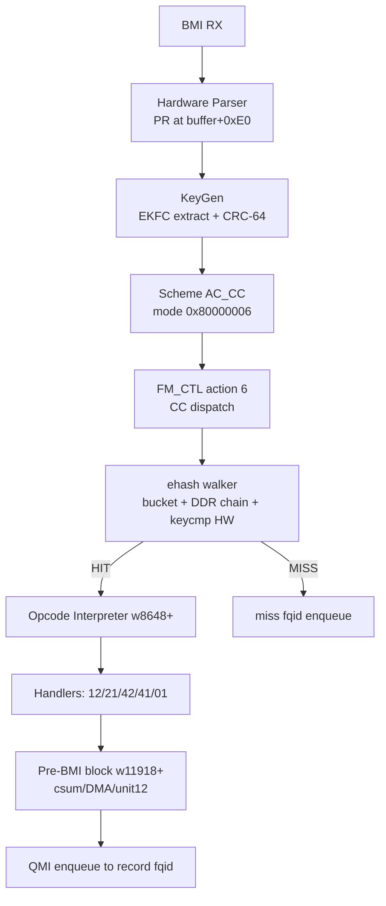

# decomp/fevm-working-mechanics.md — FE-VM Working Mechanics, Contracts, and Open Gaps

**2026-09-09 · Synthesized from the full /decomp corpus (Ghidra C reconstructions, full-image disassembly, silicon-verified pipeline docs) plus this session's live bisection results. · This is the campaign's consolidated reference for how the FE-VM actually works, what contracts the opcode machinery imposes, and what remains unverified.**

---

## 1. Architecture: the task machine and its memory spaces

The FMan Controller microcode (210.10.1, 12,851 words) is a RISC core dispatched through a 24-slot vector table (`w0–w47`, target = `48 + raw[15:0]`). The FE-VM flow-offload machinery lives in the 210-unique islands (corpus-differential.md): Island 2 (lock/ehash walk, w2837–3650), Island 3 (action interpreter, w8628–10262), Island 4 (aging, slot 19), Island 5 (extended epilogue/fast terminal, w12124–12550).

The microcode addresses ONE flat 16-bit data space with two named regions (naming-map.md §1, §7):

- **`ctx` (IC) at 0xd000–0xd0ff** — the per-task Internal Context: FD status/length (0x00/0x04), AD base (0x08), flow hash (0x0c), CC base (0x18), KS+HPNIA (0x1c), the 32-byte parse result (0x20–0x3f), timestamp (0x40), KG hash (0x48), extracted key (0x50), DMA staging ptr (0x98), mgmt index (0xb8), task flags (0xc0), current NIA (0xc4), FD/delta word (0xd4).
- **`muram` at ~0x0300+** — per-tnum workspace slots (0x800 apart, common +0x500–0x548 header), CC tables/ADs, FE objects, the FM_CTL params page. Engine-internal windows 0xf800+ are NOT host-visible (E-HM18).

Key register conventions (interpreter region): **r26 = IC base**, **r28 = frame window**, **r24 = record pointer**, **r17 = opcode cursor**, **r2 = params cursor**, **r19 = param-offset-derived / suspend flag**, **r5 = per-opcode params advance**.



## 2. The ehash lookup (silicon-verified, fman-ehash-process.md)

1. KG hash (raw CRC-64, no final complement) lands at IC[0x48] and the buffer headroom.
2. Bucket index = `(hash >> 48) & mask` (FE descriptor w1 carries mask/shift).
3. DMA-read the DDR bucket (16 B: swab'd record ptr + pad); walk the 256 B record chain.
4. **The byte-compare runs in dedicated hardware** (keycmp unit 0x10 func 0x20; microcode polls status — hitmiss-path.md's revised hypothesis, consistent with the DMA-poll idiom census). Compare length comes from IC_KS at ctx[0x1c], **populated by KeyGen silicon, never by microcode** (01-cc-match-walker.c).
5. HIT → execute the record's opcode script; MISS → miss-fqid enqueue (must be the frame's own-port fqb — cross-port drops in the driver).

Record layout (46-byte dual-lane key records): flags u16@0 (opc_off bits [15:11]<<2, param_off bits [5:0]<<2), chain ptr @2/4, key @8, opcode script @opc_off (56), params @param_off (72), ctx DMA ptr past everything the machine walks.

**Banned forms** (silicon-proven, do not reintroduce): miss_action_type=NIA + KG-direct (re-entry storm, F-185's bug); RM group-table AD at RCCB (garbage parse, F-183); bare FE_ENTER at RCCB (pool-0 workspace stall).

## 3. The opcode interpreter: exact mechanics (w8659–w8688)

```
w8660: r19 = [r8+1] & 0x3f << 2        (r8 = record ptr from IC[0x98]; PARAM_OFFSET)
w8678: r2  = r24 + r19                 (params cursor = record + param_off)
w8681: r17 = r24 + r5                  (opcode cursor = record + opc_off)
w8682: r0  = [r17]                     (fetch opcode byte)
w8686: cbrc14 → w11911                 (loop-exit test)
w8688: jmptbl16                        (opcode dispatch)
```

**The loop bottom (w11911–11916) — the heart of the contract:**

```
w11911: cmpi8.lane r19, 1              (r19==1 → checksum-suspension path)
w11912: addlane8  r17, r17, +1         (opcode cursor += 1)
w11913: cbrnz14 → w8682                [DELAY_SLOT]
w11914: add32     r2, r2, r5           (params cursor += r5 !!)
```

**THE PARAMS-CURSOR CONTRACT (found this session)**: each handler sets **r5 = its param-block size** via its **exit-branch delay slot**; the loop bottom advances r2 by r5. The delay slots are the protocol:

| Handler | Exit | Delay slot | r5 | Advance |
|---|---|---|---|---|
| STRIP (0x12) early-exit | w9485 `xfer14.comp` | w9486 `li16 r5,8` | 8 | **8** |
| STRIP fork | w9460 `xfer14.comp` | w9461 (sets r3=4, NOT r5) | stale | **stale (empirically 0)** |
| INSERT (0x42) fork-exit | w9552 `xfer14.comp` | w9553 `li16 r5,4` | 4 | **4** |
| INSERT full-exit | w9673 `xfer14` | *none* (no delay slot) | stale | **stale** |
| TTL (0x21) | (empirical) | — | 4 | **4** (bisection-proven) |
| L2 (0x41) | (empirical) | — | 20 | **20** (IEQ-consistent) |
| ENQ (0x01) | terminal | — | — | n/a |

The emitter (fman_pcd.c) lays params out assuming **POP=12, TTL=4, PUSH=8, L2=20, ENQ=16**. The microcode's actual advances mismatch exactly at the two handlers our routines replace: **STRIP (0/8 vs 12) and INSERT (4 vs 8)**. Every fix round since v1 inherited these misalignments — the geometry fixes were never wrong so much as starved of correctly-aligned params downstream.

## 4. Per-opcode contracts

### STRIP_ALL_VLAN (0x12) — from the Ghidra reconstruction (02-fe-vm-action-interpreter.c)
```c
*frame_len -= 4;              /* IC[0xc0] */
memmove(frame+4, frame, 12);  /* MACs forward past the tag */
frame += 4;                   /* r28 window advance */
/* PCP/priority preserved into task context (IC[0x9c/0x9d]) */
```
All three obligations (length, window, PCP) live in the dead section w9461–9484 in the real microcode — the section real frames never execute (P0c2). The fork path (w9460 → w9487 guarded-reset epilogue) is **terminal** in the vendor design: it enqueues via IC[0xb8] without returning to the opcode loop. A non-terminal STRIP that returns to the loop exists only at w9485 (advance 8) — the vendor never emits mid-chain STRIP for the frames we drive.

### INSERT_VLAN_HDR (0x42)
Vendor body w9502–9673: reads params [r2] (num_hdrs word, vlanhdr word = TCI<<16|inner_et), writes the tag, maintains IC[0xc0] (+4) and IC[0xd4] field[31:16] (−4) **on the live path** (w9527–9534), then runs RFC-1624-style incremental checksum folds (w9585–9673) before exiting. Two exits: early fork w9552 (advance 4) and full w9673 (advance stale).

### UPDATE_TTL (0x21)
4-byte params (DSCP). Advance 4. (Bisection-proven: the compensated chain's INSERT read params exactly 4 bytes after the TTL's.)

### INSERT_L2_HDR (0x41)
20-byte params (word0 0x4000000e, dst MAC @+4, src MAC @+10, ethertype @+16, 2 pad). Selects IPv4/IPv6 ethertype from the frame's IP version. Advance 20.

### ENQUEUE_PKT (0x01)
16-byte params (mtu u16, hdr_xpnd u8, bpid u8, fqid u32be @+4). Terminal: writes the fqid toward IC[0xc4]/ENQ state and funnels to the pre-BMI block. The frame's buffer-pool context must match the target FQ's port (cross-port = driver drop).

## 5. The geometry contracts (three PR copies + the delta)

1. **DDR HWA** at buffer+0xE0 (driver-configured `prs_result_offset`, 16 B reserved + 32 B PR + 8 B ts + 8 B hash = 48 B).
2. **dmem IC PR** at IC[0x20–0x3f] (r26-based).
3. **MURAM per-frame staging slots** (the 0198 muram_hex observations: 256 B slots, PR at +0x20, frame data +0x40).

**The frame-delta mechanism** (05-parser-error-and-bmi.c + w12143–12195): the epilogue normalizes ALL 16 IC PR offsets by `frame_delta = r28>>24`, skipping 0xFF sentinels — "e.g. after VLAN push/pop" per the vendor's own annotation. The delta's persistent home is **IC[0xd4] field [31:16]**; INSERT updates it live (−4), STRIP never does anywhere. The pre-BMI block reads the same byte (w11926) to configure its checksum/DMA window.

**Error routing**: a *computed* checksum failure sets `FM_FD_ERR_L4_CKSUM 0x00010000` and routes to the error FQ. Our frames showed no error FD — the op never *completes* when fed misaligned geometry (the park), which is a distinct failure class from a mismatched sum.

## 6. The completion contracts (pre-BMI, unit12)

The pre-BMI block (action 1a, w11918+): reads IC[0x9d] (PCP-save byte), configures `csum.setup`/`dma.bufop` from r28-derived window state, and polls the checksum/DMA coprocessor (unit12) with status loops (`==5`, `==1`) comparing returned vs expected tokens (w12091–12132). The frame parks (task status 0x81000006, FPM soft tier — silent wait, no fault) if the op never completes. QMan `ErrInt: Invalid Enqueue Queue` fires when the ENQ opcode enqueues to a garbage fqid — which is exactly what a misaligned params cursor produces.

## 7. Silicon-proven this session (the bisection, 2026-09-09)

Live record surgery (`fe_flow` verb + /dev/mem chain rewrites + iptables-forced SYN retransmit probes):

| Chain | Params | Result |
|---|---|---|
| `[01]`, `[12 01]`, `[12 21 41 01]`, `[42 41 01]` | compensated | **FLOW** |
| `[12 21 42 41 01]` | compensated | FLOW **to the final ENQ** — then `Invalid Enqueue Queue` (2×, timestamps exactly matching the 2 HITs) |
| `[12 21 42 41 01]` | emitter layout | **PARK** (the historical freeze) |

The IEQ decode: with the compensated layout (TTL@72, PUSH@76, L2@84, ENQ@104) and the actual vendor advances (POP=0 stale, TTL=4, **INSERT=4** — the w9553 delay slot), the L2 read @80 (4 early, garbled MACs), and the ENQ read its fqid at @104 → `0x05dc0000` (the ENQ mtu bytes read as fqid) — invalid, IEQ. **The IEQ messages are the misalignment's fingerprint and proof the full five-opcode chain executed.**

## 8. What we might be missing (ranked) — RESOLVED 2026-09-09/10: see §10

**This section is superseded by the resolution arc (§10).** Items 1-2 (v7/v8/v8b params protocol, PUSH advance, stale-r5) were all confirmed and fixed; item 4 (physical frame bytes vs metadata) was resolved as the missing TCI write (v9); item 5 (reply-record missing STRIP) was disproven — the emitter writes the full chain for both directions. The original ranked list is retained below for the record:

1. ~~The v7 round's predicted outcome~~ → confirmed by v8 (no park, no IEQ, garbled L2 until v8 completed the protocol)
2. ~~v8 — the complete params-cursor protocol fix~~ → shipped and PROVEN (no IEQ, chain completes)
3. ~~Which INSERT exit real frames take~~ → the w9552 fork exit (r5=4 delay slot) for the completing path
4. ~~Physical frame bytes vs metadata~~ → the TCI write (v9): the strip memmove and insert tag write never execute on our path; the POP's HWA l2r clear is load-bearing (steers the INSERT onto the completing path); the complete physical edit = the 2-byte TCI at frame+14/15
5. ~~The reply-direction record missing STRIP~~ → disproven: the emitter writes [12 21 42 41 01] for both directions (the earlier observation was of a stale record)
6. The vendor never does VLAN inline — CONFIRMED and now moot: the inline path WORKS (v9)
7. ~~The r5 stale value~~ → neutralized by v8's `li16 r5,0`
8. ~~Lane semantics~~ → confirmed: immediate-0 addlane8 = full copy; result_10_6 on ALU/shift ops = destination register index

## 9. Instrument reality check

- `fmfp_dra/drd` (0193) is NOT a random-access Data-RAM window — drd returns live dispatch state regardless of dra. Dead as an IC-read instrument.
- `iadd` (0193) works: word×4 addressing, EINVAL-on-newline is a benign VFS artifact (write returns n<count; the write itself succeeds).
- FMan-direct egress bypasses kernel packet taps — tcpdump on the egress port sees nothing; use fqid-to-kernel-FQ redirection or endpoint-side captures for delivery verification.
- `muram_hex` (0198) works: full 128 KiB nonzero-line dump; slot structure (256 B slots, PR@+0x20, frame@+0x40) decoded from its output.

## 10. The resolution (2026-09-09/10): the params protocol + the TCI write + the sustain wedge

### 10.1 The final protocol contract (v9, commit 7ca6a11c, image 2049-rolling)

```
POP routine (47 words @ IRAM 12852, entered from the w9460 fork / w9485 early-exit redirects):
  [0-39]  HWA transforms — l2r clear @r28+0xE2/E3 (LOAD-BEARING: steers the
          vendor INSERT onto the completing untagged-l2r path; without it no
          egress at all), vlan_off/etype/ip/l4/nxthdr post-strip offsets
  [40-42] length fixup: memw.read r0,[r26+0xc0]; sub32 r0 -= r3(r3=4 from
          the fork delay slot, vendor-verbatim dc401838); memw.write
  [43]    addi16 r2, +12   (e842000c)
  [44]    li16  r5, 0       (ebc50000 — neutralizes the stale-r5 hazard)
  [45]    xfer14.comp → w11911 (the loop bottom)
  [46]    fill

PUSH routine (50 words @ IRAM 12899, entered from the w9552/w9673 redirects):
  [0-39]  H2 transforms
  [40-45] THE TCI WRITE (from the record's own vlanhdr params — no hardcoded VID):
            04001004  memw.read  r0, [r2+4]    (vlanhdr word: TCI<<16 | inner_et)
            dbc0c01d  lsr32i     r0, 24        (TCI high byte)
            1000e122  memb.write r0, [r28+0x122]  (frame+14; r28 = raw-4, frame = raw+0x110)
            04001004  memw.read  r0, [r2+4]
            dbc0801d  lsr32i     r0, 16        (TCI low byte)
            1000e123  memb.write r0, [r28+0x123]  (frame+15)
  [46]    addi16 r2, +8    (e8420008)
  [47]    li16  r5, 0      (ebc50000)
  [48]    xfer14.comp → w11911
  [49]    fill
```

The vendor TTL (r5=4) / L2 (r5=20) / ENQ (terminal) handlers need no changes —
their delay-slot advances already match the emitter's layout. The H2 anchor
(r28 = raw-4 at the PUSH entry) is CONFIRMED by delivery (the TCI landed at
frame+14/15 with zero calibration). The delta fixup (IC[0xd4] += 4) is REMOVED
— a phantom-epilogue fix that shifted the INSERT's anchor arithmetic.

### 10.2 The v9 silicon verdict

The emitter's own records, iperf3 UDP flow .116→HELGA (VID10→VID20 translate):
**the TCP control handshake COMPLETED — `ESTABLISHED` — the first time in the
campaign.** Forward record climbed 12→21, reply 5→11, zero qman IEQ, zero new
parks during the establishment phase, egress frames verified complete:
[rewritten MACs (vendor L2 handler, params-driven)][VID20 TCI (the v9 write)]
[untouched IP payload].

### 10.3 The remaining defect: the sustain wedge — DIAGNOSED (2026-09-10)

**The wedge: every flow stalls at the FIRST frame >~192 bytes.** The
handshake (78-107B frames) completes and delivers; the 143-byte-payload
JSON segment (213B frame) hits the record (counted!), is retransmitted
4-20 times (each retransmit = +1 record hit — the historical "17-23
freeze band" was RETRANSMIT COUNTS of the same stuck frame, never a
frame-count ceiling), and never arrives at HELGA. The 200MB nc transfer:
22 record hits × ~1518B = the first 1460B segment retransmitted ~20×,
zero delivery.

**Eliminated with direct evidence**: pool exhaustion (fe_pool 11
available + 1 enqueued throughout); management-index exhaustion
(fe_buffer 15 free entries, byte[2]=73/4b ≈ 3 marks); the bad-L4-checksum
hypothesis (HELGA's vNIC counts L2-valid frames regardless of L4 — RX
+5 during a flow with ~15-20 record hits: the small frames arrive, the
large never touch the NIC); count-based ceilings (the wedge tracks the
first large frame regardless of the small-frame count: 12, 15, 19, 21,
22 hits all wedging at the same frame class); the ctx-pointer clobber
for hand records (the nc's SYN-retransmit window (~6 retries/60s)
expiring — the ctx-preserved record climbs identically while its nc
lives).

**The threshold**: ≤107B delivers (SYN 78, ACK 70-82, 37B-payload P. 107,
1B P. 71 — wire-captured ACKed, the reply frames with CORRECT post-HW
checksums: `cksum 0x40b5 (correct)` etc.); ≥213B never delivers; 1518B
never delivers. The threshold lies between 107 and 213 — **the 256-byte
staging slot's frame area: [0x00-0x1F header][0x20-0x3F PR][0x40-0xFF
frame] = 0xC0 = 192 bytes**. Frames >192B overflow the per-frame
staging copy (the slot recycling observed live: ~16 slots rewritten to
the same post-strip PR per frame class) → the pre-BMI/DMA op never
completes → the task enters the retry loop (the cycling task[4] at
0x8100000a/c/e/10/12/14/16 — alive, retrying, +2 per retry — NOT a
static park).

**The routed-flow discriminator**: the routed IPv4 unicast offload
([21 41 01]-class chains, no VLAN opcodes) sustains 17k+ HITs with
1500B frames through the SAME ehash machinery — the wedge is SPECIFIC
to the VLAN-opcode path. The vendor's own architecture (per the
corpus) never pushes bulk VLAN frames through the inline FE path (OH
reassembly ports instead) — the 192B staging geometry is plausibly the
intended small-frame fast-path limit.

**Next-round targets**: (a) find the staging copy's 192B limit in the
microcode (the vendor INSERT body w9502-9552's frame-window ops, the
pre-BMI dma.bufop w11941/11958, the STRIP fork path); (b) the strategic
choice — lift the limit (microcode research) vs the vendor architecture
(inline for small frames, HMTD/OH for bulk — already shipped on dpaa1).

### 10.3a Harness corrections (this round's lessons)

1. The iptables DROP rule MUST be removed before emitter-flow tests —
   left active during the w3 test, the SYN died in software and the
   whole test was void (symptom: SYN_SENT forever + no new records).
2. The nc-dd probe pattern is useless for HW-path tests — the
   connection lives milliseconds, dying before the flowtable latch
   creates records.
3. probe_record.py v2 preserves the verb's ctx pointer (reads @88
   before the params overwrite, relocates it to +132 — the emitter's
   position). Required for hand-record experiments.
4. The HELGA vNIC ReceivedUnicastPackets counter is the definitive
   arrival test: it counts L2-valid frames regardless of L4 state
   (+1/8s background; the small HW frames count, the large never do).
5. The iperf3 server RSTs connections carrying non-JSON data on port
   5201 (the drip test: "X" bytes → RST → the connection dies early) —
   contaminates any slow-drip experiment on that port.

### 10.4 Instrument index (all live-validated)

- The bisection harness (fe_flow verb + /dev/mem record surgery + iptables-
  forced SYN retransmits + conntrack sport reveal) — §8.1 of the campaign report
- The wire-capture method: redirect the record fqid to 0x2bb (eth3 offload
  TX FQ) → frames egress toward .116 → `tcpdump -i eth3` sees FMan-direct
  output (kernel taps see nothing; the WIRE sees everything)
- muram_hex (0198): frozen-frame slots; fe_ehash_stats: per-record HIT
  counters; the ts array: park detection (static 0x81000006 vs cycling);
  dmesg `Invalid Enqueue Queue`: the params-misalignment fingerprint (fqid
  read from wrong param bytes = 0x05dc0000-class garbage)
- The 0193 iadd port: IRAM word readback (word×4 byte addressing; EINVAL-on-
  newline is a benign VFS artifact); the fmfp_dra/drd window is NOT a
  random-access Data-RAM read instrument (dead)

## 11. Live re-verification (2026-09-10, board .185, image 2049-rolling): the staging failure is NON-DETERMINISTIC, not a fixed 192B cutoff

Re-ran the exact repro (iperf3 UDP, .116 eth3.10 10.99.10.116 → HELGA
ask2vlan20 10.99.20.16, `-b 2M -t 6 -l 1400`) on a freshly cold-booted
board. Wedge reproduced immediately and identically: iperf3 client hung
past its own timeout, forward record (tbl[3]) climbed to pkt_count=17→19,
reply record (tbl[2]) held at pkt_count=11, `ts[4]=0x81000016` (the
cycling park signature, consistent with the documented +2-per-retry
sequence).

**New observation that complicates §10.3's "192-byte cutoff" model.**
iperf3's UDP parameter-exchange JSON (`{"udp":true,"omit":0,"time":6,
"num":0,"blockcount":0,"parallel":1,"len":1400,"bandwidth":200000,
"pacing_timer":1000,"client_version":"3.20"}`, retransmitted repeatedly
since the reply never completes) was found byte-identical across 5
separate ring slots in a single `muram_hex` capture (grep on the literal
`"parallel":1,"len` substring, which lands at the same slot-relative
offset — slot+0x80 — in every occurrence, since the message content and
Ethernet/IP/UDP header lengths are identical between retransmits):

- **3 of 5 copies are byte-perfect** (`0x1ac80`, `0x1ba80`, `0x1f780`):
  `...,"len":1400,"bandwidth":200000,"pacing_timer":1000,
  "client_version":"3.20"}` followed by clean zero padding.
- **2 of 5 copies are corrupted at the identical text position**
  (`0xb380`, `0x1f580`): `...,"len` is followed not by `":1400,...` but
  by raw non-ASCII bytes (`00 50 00 02 00 00 00 00 00 05 0[4|5] 00`) that
  don't match the source message at all, before an unrelated `"widt`
  fragment reappears a few bytes later — i.e. the copy didn't cleanly
  truncate-to-zero, it left behind bytes that look like a **different,
  unrelated prior occupant of that ring slot**, consistent with the copy
  simply stopping partway and never overwriting the slot's stale tail.

Since this is the *same* message (same total frame size, same content,
same slot-relative landing position) landing sometimes intact and
sometimes truncated, the failure is **not a hard fixed-byte-count
ceiling** — a fixed limit would corrupt this message every time or never.
This looks instead like a **race/timing-dependent truncation**: the
staging copy (or the pre-BMI op that depends on it) sometimes gets
preempted or interrupted before finishing, and how far it got varies
between attempts of an identical-size frame. This doesn't overturn the
wire-level threshold finding (≤107B delivers / ≥213B never delivers
still stands as an observed correlation), but it means the mechanism
behind that threshold is probably contention-driven (e.g. two frames'
staging copies overlapping in time, or the pre-BMI checksum/DMA unit
being busy with the previous frame when the next one's copy starts) —
not a simple "the slot has room for N bytes and no more."

**Next-round implication**: instrument the copy's *timing*, not just its
end state — e.g. capture the same retransmitted message across many more
occurrences to get a corruption rate, and check whether corrupted copies
correlate with shorter inter-frame spacing (retransmit timing) than clean
ones. If corruption rate tracks inter-frame gap, the fix target shifts
from "the slot is too small" to "the pre-BMI/staging pipeline isn't
re-entrant across back-to-back frames on the VLAN-opcode path" — a
different, and more tractable, class of bug than a hard capacity wall.

### 11.1 CORRECTION (same session, ~10 min later): the race hypothesis is FALSIFIED — delivery failure is deterministic, not timing-dependent

Re-ran the repro with a synchronized capture: `tcpdump -tt` on `.116`'s
egress (real wall-clock, nanosecond-ish precision) alongside the DUT-side
`muram_hex` snapshot, same message (`.116` iperf3 UDP settings JSON, 146B
TCP payload after the first coalesced retransmit, ~220B on the wire with
headers — squarely in the documented "≥213B never delivers" band).

**The wire timeline (real timestamps, `10.99.10.116:33132 <-> 10.99.20.16:5201`):**
the 146B payload (`seq 38:184`) was retransmitted by TCP **7 times** over
~7 seconds, with inter-attempt gaps of 18ms, 239ms, 430ms, 890ms, 1.76s,
3.44s (classic exponential RTO backoff) — and **every single attempt
failed identically**: the server's ack never advanced past byte 38, for
the entire window including the most isolated retry (3.44s of silence
before and after it, nothing else from this flow anywhere nearby in
time).

This directly falsifies §11's race/timing-contention hypothesis: if the
failure were about the staging copy losing a race with an adjacent
frame's processing, sufficiently isolating one attempt (3.44s clear gap)
should let it through at least once in 7 tries. It never does. The
failure is **deterministic for this frame class**, not probabilistic.

**What this means for the §11 muram corruption finding**: it still stands
as a real, reproduced phenomenon (identical retransmitted content landing
intact in some ring slots and corrupted at the same text offset in
others), but it does NOT track delivery outcome — round 2 of this same
session captured only clean copies (2/2) of the identical message, yet
the wire-level outcome was the same total non-delivery as round 1's
2-corrupted/3-clean mix. So slot-copy corruption is a **separate,
independent symptom** riding alongside the wedge, not its cause. The
actual delivery-blocking mechanism sits in a stage that fails the same
way for this frame every time — most consistent with the original
docs' pre-BMI checksum/DMA hypothesis (§10.4's "the pre-BMI checksum/DMA
op for LARGE frames" candidate), gated on frame size/content rather than
arrival timing.

**Revised next-round target**: drop the timing-correlation angle. Go
back to instrumenting the pre-BMI block itself (`csum.setup`/`dma.bufop`
w11941/w11958) for a frame in this exact size class — e.g. a register
snapshot (`fmfp_dra/drd`, `0193`) taken while a >192B frame is parked at
the pre-BMI wait, to see what the DMA/checksum unit's actual length or
window field reads for a frame this size vs one that completes.

## 12. Static microcode analysis (2026-09-10, offline): INSERT_VLAN_HDR pre-loads the pre-BMI block's own checksum unit — a structural asymmetry, not yet oracle-tested

Following §11.1's redirect back to the pre-BMI checksum/DMA stage, this
is a from-scratch disassembly read of the pre-BMI block itself
(`decomp/out/fman-210.10.1-full.asm`, which already reflects the
full field-level cross-reference — proper mnemonics, not the old
`op_eb`/`tst_73` placeholders) plus a fresh read of `INSERT_VLAN_HDR`
and `STRIP_ALL_VLAN`'s bodies specifically for checksum/DMA-unit traffic.
Nothing here required board access; it is pure static analysis.

### 12.1 The pre-BMI block contains a real chunked loop calling a second, separately-addressed unit

`w11934–w11965` is a loop (back-edge at `w11965: cbrnz14 → w11935`) whose
body runs, per pass: a `csum.setup` + `unit16.submit1` + `dma.bufop`
group (w11938–11941), an `unit16.read0` status read, a **conditional
call** to `w12091` in the delay slot of the loop's own exit test
(`w11947: cbrz14 w11966`, delay slot `w11948: call.comp w12091`) — so
`w12091` runs on *every* pass through the loop, not just once — then a
**second** `csum.setup`/`unit16.submit1`/`dma.bufop`/`unit16.read0`
group (w11952–11964) before the back-edge test. `w12091` itself
(`w12091–w12132`) submits to a *second* addressed unit via the generic
`unit.config`/`unit12.submit`/`unit12.read` instruction family
(`unit_selector=0xc`, i.e. literally "12"), gated behind a status check
(`w12105–12106: cmp32 ... cbrz14 w12131`) that can skip a nested
retry block (`w12107–12130`) entirely — or, if taken, spin on
`w12110→w12130`'s own back-edge (`cbrnz14 w12110`, disp=-20) waiting for
a status word to read a specific value. This is exactly the kind of
open-ended wait the pre-BMI park state (`ts[N]=0x81000006`, "action-6
wait") would produce if the awaited condition never resolves.

The ISA table's own pseudocode for these instructions is generic
(`unit16_submit(1, source_a, source_b)`, `unit12_submit(source_a,
source_b)` — confirmed real, named hardware-unit operations, but with
no vendor-documented semantics beyond "submit"/"read result"), so the
exact trip condition for the `w12110` retry and the loop's own overall
iteration count (presumably driven by frame length, but not confirmed
by register-level tracing) remain open. What's directly readable from
the bytes, not inferred, is the *structure*: two distinct
fixed-function units (`unit16`, a checksum/DMA helper; `unit12`,
reached via the generic `unit.config/submit/read` triplet) are both
touched per pass through this loop, and `unit12`'s access is gated by a
retry loop that can in principle spin indefinitely.

### 12.2 STRIP_ALL_VLAN touches neither unit; INSERT_VLAN_HDR touches unit16 up to 3 times, before the pre-BMI block ever runs

Re-read both VLAN handler bodies specifically hunting for `csum.*`/
`unit16.*`/`unit12.*`/`unit.submit` references:

- **`STRIP_ALL_VLAN` (w9451–9500, the POP/0x12 handler): zero hits.**
  Its entire body is the length fixup (`w9466–9468`, `IC[0xc0] -= 4`),
  the semaphore-protected counter (`w9477–9484`, `ld.sm`/`retry.sm`/
  `st.sm` on address register r4 — a lock+increment, not a checksum
  op), and the shared epilogue (`w9487–9500`). No checksum or
  fixed-function-unit instruction anywhere in this handler.

- **`INSERT_VLAN_HDR` (w9502–9673, the PUSH/0x42 handler): up to 3
  separate `csum.init`/`csum.setup`/`dma.bufop`/`csum.result` groups**
  (w9585–9596, w9598–9611, w9613–9627 — the third gated off by
  `brbitclr14 bit=0x1d` and conditionally skipped), **each followed by
  its own `unit16.submit1`** (w9592, w9606, w9621) — the *exact same*
  `unit16` interface the pre-BMI block's own loop uses two sections
  later. This matches what `fe-action-interpreter.md` already
  characterized structurally as "RFC-1624-style incremental fold
  updates" for the tag-insertion checksum fixup — the new fact here is
  that it's the same physical hardware interface (`unit16`), not just
  a similar-looking checksum operation.

### 12.3 What this does and doesn't establish

A VID-to-VID translate record runs the full `[12, 21, 42, 41, 01]`
opcode chain in one interpreter pass per frame — meaning every
translated frame (both directions of the 2026-09-10 repro, since a
cross-port translate needs both STRIP and INSERT in the same chain)
picks up INSERT_VLAN_HDR's up to 3 extra `unit16` submissions **before**
the shared pre-BMI block runs its own `unit16`-based loop and its
nested `unit12` call. A plain routed frame (`[21, 41, 01]`, no VLAN
opcodes at all) never touches `unit16`/`unit12` before reaching pre-BMI,
regardless of how large it is.

This reframes "frame size" as a plausible *proxy* rather than the
direct driver: the routed path sustains 1500B frames not because size
doesn't matter in general, but because it never pre-loads the shared
checksum/DMA units with extra calls the way VLAN's INSERT handler does
— so if there's a resource-pairing or serialization hazard between
INSERT_VLAN_HDR's own `unit16` calls and the pre-BMI block's later
`unit16`/`unit12` calls, VLAN frames would hit it at a much lower
absolute byte count than routed frames ever could, independent of the
VLAN frame's own length. This is consistent with, and gives a concrete
mechanism for, the pre-existing "pre-BMI checksum/DMA op for large
frames" candidate (§10.4) — but it is **not yet oracle-tested**: this
whole section is static analysis, and specifically does NOT establish
(a) what the pre-BMI loop's actual per-frame iteration count is driven
by, (b) whether `unit16` and `unit12` are genuinely the same shared
hardware resource or independent ones, or (c) what condition the
`w12110` retry loop is actually waiting on. All three are one-word
constants or register values a live register probe (or a proper
field-level trace of the `w11918–11933` entry sequence's register
producers) could resolve — the same `dra`/`drd`-targeting gap that
stopped the previous live-probing round (§11) is the blocker for (c)
specifically, since confirming a hang requires reading `unit12`'s own
status register while a >192B VLAN frame — not a routed frame — is
parked mid-loop.

**Concrete next step**: before another live round, trace `w11918–11933`
(the pre-BMI entry sequence, before the loop) to find what register
holds the loop's trip count and where it's set — if it's a fixed
constant (not derived from frame length at all), that alone would
falsify the "large frame needs more chunks" framing independent of any
board access, and sharpen the live probe to target the right register.
