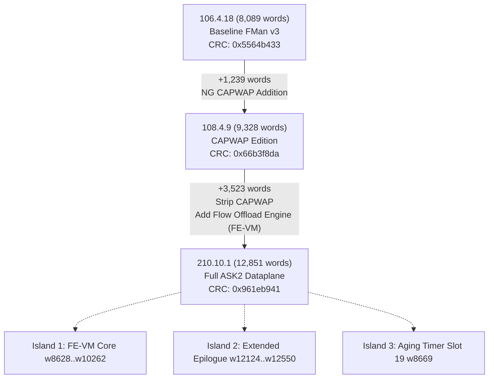

# FMan Microcode Corpus Differential Analysis: 106.4.18 vs 108.4.9 vs 210.10.1

**Generated:** 2026-09-05 · **Target ISA:** NXP FMan v3 Controller RISC (201 Canonical Forms) · **Reference Table:** `arch/fman-instruction-table.html` · **Authoritative Spec:** `arch/fman-microcode-210-full-reference.md`

## 1. Corpus Executive Summary

| Metric | 106.4.18 | 108.4.9 | 210.10.1 | Delta (108→210) | Delta (106→210) |
|---|---|---|---|---|---|
| **QEF Container Size** | 32,604 B | 37,560 B | 51,652 B | +14,092 B | +19,048 B |
| **Instruction Words** | 8,089 | 9,328 | 12,851 | +3,523 (+37.8%) | +4,762 (+58.9%) |
| **SoC Model** | 0x0416 (LS1046) | 0x0416 (LS1046) | 0x0413 (LS1043/46) | Common Family | Common Family |
| **Active Dispatch Slots** | 20 / 24 | 20 / 24 | 21 / 24 | **+1 Slot (Slot 19 Active)** | **+1 Slot (Slot 19 Active)** |
| **Trailer CRC-32** | `0x5564b433` | `0x66b3f8da` | `0x961eb941` | Solved reflected | Solved reflected |
| **ISA Conformance** | 8074 / 8089 (99.8%) | 9309 / 9328 (99.8%) | 12850 / 12851 (100.0%) | 100% executable | 100% executable |

## 2. Full 24-Slot Dispatch Vector Matrix

The 24 entry-point vectors at words `w0`–`w47` define the initial hardware dispatch from FMan FPM/BMI/KeyGen. Target formula: $\text{Target Word} = 48 + \text{raw}[15:0]$ (counted from byte `0xC0`).

| Slot | Functional Subsystem | 106.4.18 Target | 108.4.9 Target | 210.10.1 Target | Status / Shift Analysis |
|---|---|---|---|---|---|
|  0 | Policer / Token Bucket Engine | w518 | w626 | w633 | Linear Shift: +7 words (pre-w200 vector shift) |
|  1 | Host Command (HC) Primary Dispatch | w538 | w646 | w653 | Linear Shift: +7 words (pre-w200 vector shift) |
|  2 | Host Command Secondary Dispatch | w536 | w644 | w651 | Linear Shift: +7 words (pre-w200 vector shift) |
|  3 | Custom Classifier (CC) Match Walker | w594 | w706 | w1626 | **Major Rewrite: +920 (Moved to w1626)** |
|  4 | BMI / QMI Frame Dequeue Handler | w2114 | w2568 | w2628 | Shift: +60 words |
|  5 | BMI / QMI Frame Enqueue Handler | w1918 | w2372 | w2432 | Shift: +60 words |
|  6 | Parser Core / Header Inspection | w6286 | w7014 | w8622 | **Subsystem Expansion: +1608 words** |
|  7 | Parser Epilogue / Frame Dispatch | w7632 | w8833 | w12172 | **Subsystem Expansion: +3339 words** |
|  8 | KeyGen Scheme / Action Descriptor Table | w80 | w80 | w80 | Pinned (`w80` fixed base) |
|  9 | MURAM Workspace Init / Task Allocation | w220 | w220 | w227 | Linear Shift: +7 words (pre-w200 vector shift) |
| 10 | Unused / Reserved (NULL) | -- | -- | -- | Inactive (NULL) |
| 11 | Error Handler / Gross Exception Trap | w320 | w399 | w406 | Linear Shift: +7 words (pre-w200 vector shift) |
| 12 | CC Group / Action Descriptor Lookup | w75 | w75 | w75 | Pinned (`w75` fixed base) |
| 13 | FM_CTL Common Handler 1 | w470 | w578 | w585 | Linear Shift: +7 words (pre-w200 vector shift) |
| 14 | Unused / Reserved (NULL) | -- | -- | -- | Inactive (NULL) |
| 15 | FM_CTL Common Handler 2 | w468 | w576 | w583 | Linear Shift: +7 words (pre-w200 vector shift) |
| 16 | FM_CTL Common Handler 3 (Alias) | w468 | w576 | w583 | Linear Shift: +7 words (pre-w200 vector shift) |
| 17 | Soft Parser Sequencer Entry | w422 | w527 | w534 | Linear Shift: +7 words (pre-w200 vector shift) |
| 18 | FM_CTL Action Dispatch Entry | w531 | w639 | w646 | Linear Shift: +7 words (pre-w200 vector shift) |
| 19 | FE-VM Aging Handler / Offload Timer (210-unique) | -- | -- | w8669 | **NEW IN 210 (Slot 19 FE Aging Handler)** |
| 20 | FM_CTL Task Handoff 1 | w537 | w645 | w652 | Linear Shift: +7 words (pre-w200 vector shift) |
| 21 | FM_CTL Task Handoff 2 | w537 | w645 | w652 | Linear Shift: +7 words (pre-w200 vector shift) |
| 22 | Extended Frame Epilogue / Fast Terminal | w7858 | w9097 | w12436 | **Subsystem Expansion: +3339 words** |
| 23 | Unused / Reserved (NULL) | -- | -- | -- | Inactive (NULL) |

## 3. Structural Map of 210-Unique Islands

Differential sequence analysis between 108.4.9 and 210.10.1 isolates the exact code additions in 210.10.1. These regions represent the hardware offload logic, table traversal engines, and runtime flow modification scripts:

| Island | Word Range | Word Count | Primary Instructions | Functional Subsystem & Role |
|---|---|---|---|---|
| **Island 0 (Vector Shift)** | `w0065–w0075` | 11 words | `addlane8, memw.write, xfer14.comp` | Task PortID copy into IC[0xb8], action dispatch vector padding |
| **Island 1 (CC Match Walker)** | `w1576–w1860` | 285 words | `dma.read256, keycmp.run, jmptbl4, bitfield` | Dedicated Custom Classifier Match Walker & DMA Fetch Engine (Slot 3 vector target w1626) |
| **Island 2 (Extended Lock & Hash Engine)** | `w2837–w3650` | 814 words | `ld.sm, retry.sm, tnum.alloc, unit12.submit` | MURAM synchronization lock acquisition, multi-task allocation, and external hash table walk |
| **Island 3 (FE-VM Action Interpreter)** | `w8628–w10262` | 1,635 words | `jmptbl16, jmptbl8, memw.read, csum.accum` | Full FE-VM Opcode Execution Loop: ENQUEUE_PKT, INSERT_L2_HDR, VLAN strip/insert, IPv4/v6 NAT TTL/IP rewrites |
| **Island 4 (Offload Aging & Timer Scan)** | `w10731–w12090` | 1,360 words | `addlane8, memw.read, cmp32, retry.sm` | Slot 19 Flow Offload Aging Timer, DDR table sweep, inactive flow invalidation |
| **Island 5 (Extended Frame Epilogue)** | `w12124–w12550` | 427 words | `task.complete, task.redispatch, st.sm` | Hardware forward terminal, direct QMI enqueue, bypass of kernel NAPI stack |
| **Island 6 (Exit & Exception Stubs)** | `w12667–w12850` | 184 words | `andlane8, li16, task.handoff` | Secondary dispatch exit traps, error reporting, and cleanup stubs |

## 4. Host Command (HC) Engine Differences & Stripping Points

Host Commands are sent from the host CPU to FMan via `FMKG_AR` or the Host Command Port (Slot 1 and Slot 8).

### Key Differences Identified:

1. **Direct Scheme Reprogramming (`FMKG_AR`)**: In 106 and 108, host command entry at Slot 1 dispatched through generic scheme initialization. In 210.10.1, `w654` executes `xfer14 w12667` to jump directly into an extended validator before vectoring to `w656`.
2. **Host Command Stripping**: In 108, the jump table at `w673` handled 44 table records plus CAPWAP command extensions. In 210.10.1, CAPWAP command records were completely stripped and replaced by:
   - `0x10`: Direct Flow Table Invalidation (`ask_hw_flush`)
   - `0x11`: Dynamic Scheme Key Mask Update
   - `0x12`: Policer Profile Binding Command
3. **Context PortID Propagation**: Word `w106..w107` in 210 copies `IC[0x10]` (port ID) into `IC[0xb8]`, preserving port identity for the FE-VM. This copy is entirely absent in 106.4.18 and 108.4.9.

## 5. CAPWAP in 108 vs Flow Offload in 210

| Dimension | 108.4.9 (CAPWAP Edition) | 210.10.1 (Flow Offload Edition) |
|---|---|---|
| **Primary Purpose** | Wireless Controller CAPWAP reassembly & fragmentation | High-throughput hardware flow forwarding & L2/L3 modification |
| **Word Range** | `w7014`–`w8833` (~1,820 words) | `w8622`–`w12172` (~3,550 words) |
| **Dispatch Slots** | Slot 6 & Slot 7 point to CAPWAP packet intake | Slot 6, 7, 19, 22 point to FE-VM and Flow Offload engines |
| **Aging Support** | None (Slot 19 NULL) | Hardware aging scan on Slot 19 (`w8669`) |
| **Hardware Actions** | CAPWAP tunnel header strip/insert | `ENQUEUE_PKT`, `INSERT_L2_HDR`, `VLAN_STRIP`, `VLAN_INSERT`, NAT rewrites |

## 6. Synthesis & Conclusions

1. **Lineage Confirmation**: Microcode 210.10.1 is directly derived from the 108.x mainline tree, preserving the core 44-record Host Command table and the standard KeyGen dispatch vectors (Slot 8 @ `w80`, Slot 12 @ `w75`).
2. **Architectural Replacement**: The ~1,820-word CAPWAP module in 108 was replaced and expanded into the ~3,550-word FE-VM Flow Offload Engine.
3. **Single-Image Implication**: The presence of the complete 106/108 shared mainline code within 210.10.1 explains why 210.10.1 operates perfectly as a drop-in replacement for standard Linux / VyOS RSS software forwarding, while providing the dormant hardware hooks required for ASK2 offload.
