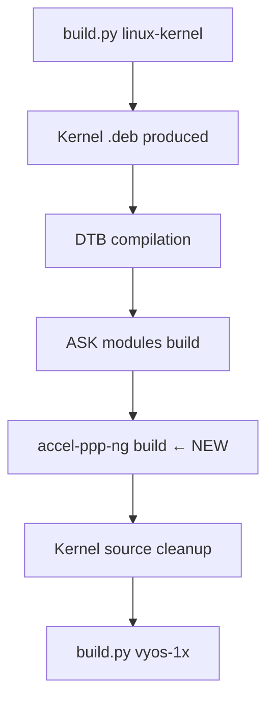

# accel-ppp-ng ARM64 Build Plan

**Status:** Planned
**Priority:** Medium (currently stripped from vyos-1x deps; PPPoE/PPTP/L2TP unavailable on ARM64)
**Effort:** ~4 hours implementation + testing
**Risk:** Low — daemon is pure userspace (trivial cross-build); kernel modules follow established pattern

## Problem

VyOS upstream added `accel-ppp-ng` (PPPoE concentrator, PPTP, L2TP, IPoE) as a `vyos-1x` dependency.
No ARM64 build exists in the VyOS mirror. Current workaround: `ci-setup-vyos1x.sh` strips it from
`debian/control` via sed. This means PPPoE/PPTP/L2TP/IPoE are non-functional on LS1046A.

## Architecture

Two binary packages from one source tree:

| Package | Type | Notes |
|---------|------|-------|
| `accel-ppp-ng` | Userspace daemon | Pure C, trivial ARM64 cross-build |
| `accel-ppp-ng-ipoe-kmod` | Kernel modules (`ipoe.ko`, `vlan_mon.ko`) | Must match our 6.6 LTS kernel ABI exactly |

## Sources

| Repo | Purpose |
|------|---------|
| `github.com/accel-ppp/accel-ppp` | Upstream source (daemon + kmod source) |
| `github.com/vyos/vyos-accel-ppp` | Debian packaging overlay (`debian/` directory, `-ng` rename) |

## Build Dependencies

```
cmake gcc-aarch64-linux-gnu libssl-dev liblua5.3-dev
libpcre3-dev libnl-3-dev libnl-route-3-dev libnl-genl-3-dev
```

All available in Debian Bookworm ARM64 repos and already present in the VyOS builder container
(or trivially installable via `apt-get`).

## Integration Point

Build accel-ppp-ng **inside `ci-build-packages.sh`** after the kernel build, while the kernel
source tree (`$KSRC`) still exists. This is the same pattern used for:
- Mono Gateway DTB compilation
- ASK out-of-tree kernel modules (cdx.ko, fci.ko, auto_bridge.ko)



## Implementation Steps

### 1. Setup script: `bin/ci-setup-accel-ppp.sh`

Clone both repos into `$GITHUB_WORKSPACE`:

```bash
git clone --depth 1 https://github.com/accel-ppp/accel-ppp.git \
  "$GITHUB_WORKSPACE/accel-ppp"
git clone --depth 1 https://github.com/vyos/vyos-accel-ppp.git \
  "$GITHUB_WORKSPACE/vyos-accel-ppp"
```

Called from a new workflow step (after checkout, before package build), OR folded into
an existing setup script.

### 2. Build logic in `ci-build-packages.sh`

After ASK modules, before kernel cleanup:

```bash
### Build accel-ppp-ng for ARM64 (daemon + kernel modules)
ACCEL_SRC="$GITHUB_WORKSPACE/accel-ppp"
ACCEL_PKG="$GITHUB_WORKSPACE/vyos-accel-ppp"
if [ -d "$ACCEL_SRC" ] && [ -d "$ACCEL_PKG" ] && [ -n "$KSRC" ]; then
  KSRC_ABS="$(cd "$KSRC" && pwd)"
  echo "### Building accel-ppp-ng for ARM64"

  # Prepare kernel tree for out-of-tree module builds
  make -C "$KSRC_ABS" prepare scripts ARCH=arm64

  # Merge source into packaging tree
  cp -a "$ACCEL_SRC"/* "$ACCEL_PKG/"

  # Patch debian/rules and .install files with our kernel version
  KVER=$(ls -1 linux-image-*.deb | head -1 | sed 's/linux-image-//;s/_.*//;s/-dbg//')
  sed -i "s/KVER :=.*/KVER := $KVER/" "$ACCEL_PKG/debian/rules"
  # (additional sed for kmod .install paths — match VyOS Jenkinsfile pattern)

  # Build
  cd "$ACCEL_PKG"
  KERNELDIR="$KSRC_ABS" dpkg-buildpackage -b -us -uc -tc -aarm64

  # Collect .debs
  cp ../*.deb "$GITHUB_WORKSPACE/vyos-build/scripts/package-build/linux-kernel/"
  echo "### accel-ppp-ng ARM64 packages built"
  ls -lh ../*.deb
  cd "$GITHUB_WORKSPACE/vyos-build/scripts/package-build/linux-kernel"
fi
```

### 3. Package pickup

`ci-pick-packages.sh` already picks up all `.deb` from the package-build directory.
The `ignore_packages` list has `accel-ppp` (old name) — verify `accel-ppp-ng` is NOT
in the ignore list (it isn't currently). The packages will flow through to the ISO.

### 4. Remove workaround

Once confirmed working, remove from `ci-setup-vyos1x.sh`:
```bash
# DELETE THIS LINE:
sed -i 's/,\\s*accel-ppp-ng//g; s/accel-ppp-ng,\\s*//g; s/accel-ppp-ng//g' debian/control
```

And update `AGENTS.md` to remove the TODO marker.

### 5. Workflow changes (`auto-build.yml`)

Add one new step before "Build Image Packages":

```yaml
- name: Checkout accel-ppp repos
  run: |
    git clone --depth 1 https://github.com/accel-ppp/accel-ppp.git accel-ppp
    git clone --depth 1 https://github.com/vyos/vyos-accel-ppp.git vyos-accel-ppp
```

Or add install deps if needed:
```yaml
- name: Install accel-ppp build deps
  run: apt-get install -y liblua5.3-dev libpcre3-dev
```

## Risks & Gotchas

1. **Kernel ABI mismatch**: The kmod `.deb` embeds the kernel version string. Must extract
   exact version from our `linux-image-*.deb` filename and patch `debian/rules` to match.
   The VyOS Jenkinsfile already does this rewrite — follow identical sed patterns.

2. **Cross-compilation**: The builder runs on ARM64 (`ghcr.io/huihuimoe/vyos-arm64-build/vyos-builder:current-arm64`),
   so this is a native build (not cross-compile). No `gcc-aarch64-*` needed — just `gcc`.

3. **CMake KDIR**: Must point to the prepared kernel tree with `Module.symvers` present.
   The kernel build already produces this — just need `make prepare scripts` if not done.

4. **SDK vs mainline kernel**: The `ask` branch uses SDK DPAA drivers. The accel-ppp kernel
   modules (`ipoe.ko`, `vlan_mon.ko`) are standard netfilter/networking modules with no
   DPAA dependency — they build identically against both kernel variants.

5. **`vlan_mon.ko` conflicts**: Check if our kernel already has `vlan_mon` built-in or as
   a module. If so, the out-of-tree version may conflict. Likely not an issue since
   `CONFIG_VLAN_MON` is accel-ppp-specific, not upstream.

6. **Build time**: accel-ppp is ~30K lines of C. Native ARM64 build: ~2-3 minutes.
   Negligible impact on the ~50 minute total CI time.

## Effort Estimate

| Task | Time |
|------|------|
| Create `ci-setup-accel-ppp.sh` | 30 min |
| Add build logic to `ci-build-packages.sh` | 1 hour |
| Debug kernel version string matching | 30 min |
| Update `auto-build.yml` | 15 min |
| Test full CI build | 50 min (one build cycle) |
| Remove sed workaround + update docs | 15 min |
| **Total** | **~3-4 hours** |

## Validation

1. ISO builds successfully with `accel-ppp-ng` satisfied (no `lb build` dep error)
2. `dpkg -l accel-ppp-ng` shows installed on booted LS1046A
3. `accel-pppd -v` prints version
4. `modprobe ipoe` and `modprobe vlan_mon` succeed (correct kernel ABI)
5. Basic PPPoE server test (optional — needs PPPoE client)

## Decision

Low-risk, moderate-value. PPPoE/L2TP/PPTP are common ISP edge features. Building
from source gives us full control and eliminates the sed workaround. Recommend
implementing after the current ASK boot stabilization is complete.