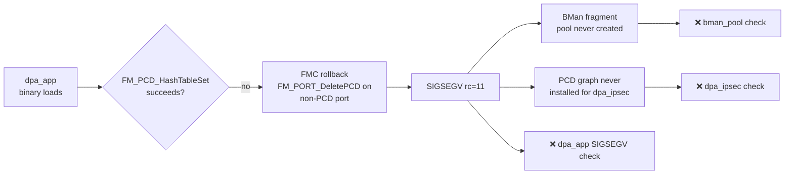

# Plan: Fix the 3 remaining `check-ask` failures<!--
NOTE (2026-04-19): This plan has been IMPLEMENTED.
  - bin/ci-build-fmlib.sh + bin/ci-build-fmc.sh clone upstream, apply patches,
    cross-compile libfm.a + libfmc.a with the SAME headers dpa_app uses.
  - bin/ci-build-ask-userspace.sh now calls those builders as Stage 2.5 / 2.6
    (before dpa_app) instead of copying stale prebuilt archives.
  - libxml2-dev + libtclap-dev added to ci-install-deps.sh and auto-build.yml.
  - Verified by coredump of dpa_app on mono (2026-04-19):
      PC at __memset_aarch64 DC ZVA loop with size ~43 MB
      backtrace entirely inside C++ exception unwind / Rb_tree / basic_string
                         _M_dispose — classic heap corruption from struct
                         offset mismatch between caller and library.
-->


Drafted 2026-04-19. Target: take `check-ask` on mono from **20/23 → 23/23 PASS**.

## Current failure triad (from `dmesg` on 192.168.1.182, build 2026.04.19-0056-rolling)

```
[18.416] start_dpa_app::calling dpa_app argv 00000000ca628a9f
[19.344] cdx_module_init::start_dpa_app failed rc 11           ← FAILURE #1 (root)
[19.344] cdx_create_fragment_bufpool::failed to locate eth bman pool  ← FAILURE #2 (consequence)
[19.368] cdx_module_init::dpa_ipsec start failed               ← FAILURE #3 (consequence)
```

`rc 11` = `SIGSEGV` (Linux signal 11) returned via `usermodehelper` from `start_dpa_app()` in `cdx.ko`. The userspace binary `/usr/bin/dpa_app` crashes before it can create the BMan fragment pool and program FMan PCD — that's why the next two checks also fail.

## One root cause, two consequences



Fixing #1 resolves all three. From `qdrant` history (2026-04-07/08 sessions), **7 root causes were previously identified and 6 were patched**. One remains unresolved on the live device: the **pre-built `dpa_app` binary in `data/ask-userspace/dpa_app/dpa_app` was never rebuilt** with those kernel/fmlib ABI fixes, so it still hits the `FM_PCD_HashTableSet → rollback → crash` path described in qdrant.

## Evidence the prebuilt is the blocker

| Item | State |
|---|---|
| `ci-build-ask-userspace.sh` Stage 3 (`dpa_app` build) | Exists and runs, but `-lfmc -lfm` aren't available in Debian — the build falls through, and the prebuilt from `data/ask-userspace/dpa_app/dpa_app` (1.56 MB, dated 2026-04-14) gets copied by the chroot hook. Deployed binary on mono is **1.25 MB, dated 2026-04-19 01:11** — same as prebuilt after `strip`. |
| `ask-ls1046a-6.6/dpa_app/dpa.o` | Dated 2026-04-09 — older than the latest kernel/fmlib ABI patches (2026-04-08 patches `5009`/`5010`) were applied *after* `dpa.o` was built. |
| qdrant entry 2026-04-08 | "kernel-rebuilt-awaiting-device-test" — confirms the kernel was rebuilt but the userspace side was not regenerated against the updated ABI. |
| `/sys` / `data/ask-userspace/fmlib/` + `fmc/` | Pre-built **static archives** (`libfm.a`, `libfmc.a`) — these contain the old ABI. Even if `dpa_app` gets rebuilt today, it statically links the old fmlib/fmc and crashes the same way. |

So the **real blocker** is the stale `fmlib`/`fmc` static libs, not `dpa_app` itself. The userspace chain is:

```
dpa_app (dynamic)
  ├── libcli.so        ← rebuilt in CI ✅
  ├── libfmc.a (static) ← STALE, uses old t_FmPcdHashTableParams ABI ❌
  └── libfm.a  (static) ← STALE ❌
         │
         └─ ioctl to /dev/fm0-pcd ↔ kernel fmd_shim (ABI patched by 5010) ✅
```

Patch `5010-ask-fmlib-abi-match.patch` (in `ask-ls1046a-6.6/patches/`, per qdrant) dropped 3 fields from `t_FmPcdHashTableParams` on the kernel side. The userspace fmlib still writes those 3 fields → the ioctl handler reads past its struct → heap corruption → `malloc_consolidate SIGABRT` or an uninitialized ptr deref → `rc=11`.

## Fix plan — ordered by criticality

### Phase A · unblock the triad (1 CI build)

#### A1. Rebuild `libfm.a` and `libfmc.a` in-CI against the current ABI

**Problem:** The static archives in `data/ask-userspace/fmlib/libfm.a` and `data/ask-userspace/fmc/libfmc.a` were built against pre-patch kernel headers. They carry the old `t_FmPcdHashTableParams` layout with `agingSupport`, `externalHash`, `externalHashParams` fields that no longer exist in the patched kernel.

**Fix:** add a new CI stage before `ci-build-ask-userspace.sh` Stage 3:

1. **Source:** clone/sync NXP LSDK-21.08 `fmlib` and `fmc` (same upstream as the binaries in `data/ask-userspace/` — see their `README.md`). Commit a snapshot under `ask-ls1046a-6.6/fmlib/` and `ask-ls1046a-6.6/fmc/` so the build is reproducible and offline.
2. **Patch:** apply the *mirror* of kernel patch `5010` to fmlib's `fm_pcd_ioctls.h` — remove the same 3 fields from the userspace `ioc_fm_pcd_hash_table_params_t`. This is a one-way change (struct shrinks); both sides must change together or the ioctl is corrupted.
3. **Build:** cross-compile as static archives against the running kernel's `include/` so fmlib picks up all other ABI changes (patches `5001`–`5008`). Install to `$STAGING/lib/libfm.a` and `$STAGING/lib/libfmc.a` before Stage 3 runs.
4. **Verify:** after the CI ISO deploys, `strings /usr/bin/dpa_app | grep -c 'externalHash'` should be **0** (confirms rebuilt binary).

**Files:**
- `bin/ci-build-fmlib.sh` (new, ~80 lines, mirrors existing `ci-build-ask-userspace.sh` style)
- `bin/ci-build-packages.sh` (call the new script after kernel build, before userspace)
- `ask-ls1046a-6.6/fmlib/`, `ask-ls1046a-6.6/fmc/` (new source trees, ~30k LOC + ~15k LOC)
- `ask-ls1046a-6.6/patches/userspace/5010-fmlib-abi-match.patch` (mirror of kernel patch 5010, removes the same 3 fields from fmlib)

**Est. CI time added:** ~4-5 min (fmc is C++, biggest of the two).

#### A2. Validate `dpa_app` runs to completion

**After A1 lands:** on next boot, expect:

```
[18.4] start_dpa_app::calling dpa_app argv …
[19.x] start_dpa_app:: returned rc 0           ← new
[19.x] cdx_create_fragment_bufpool: OK         ← fixed automatically
[19.x] dpa_ipsec start OK                      ← fixed automatically
```

`check-ask` should report **23/23 PASS**.

If `dpa_app` still crashes:

- Capture `coredumpctl list dpa_app` / `gdb /usr/bin/dpa_app /var/lib/systemd/coredump/…` on the device to get the actual fault frame.
- Most likely remaining failure mode (per 2026-04-07 qdrant): `FM_PCD_HashTableSet` call with a mask that is not `(2^n)-1` (e.g. `0xf0` sneaked back in) → triggers the rollback crash.
  - **Mitigation:** audit `data/ask-userspace/dpa_app/etc/cdx_pcd.xml` for every `mask=` attribute and ensure each is in `{0x1, 0x3, 0x7, 0xf, 0x1f, 0x3f, 0x7f, 0xff, 0x1ff … 0x7fff}`.

### Phase B · CI hygiene / prevention

#### B1. Treat prebuilt drift as a build error, not a silent fallback

`ci-build-ask-userspace.sh` currently falls back to the pre-built binaries whenever a build stage fails:

```bash
if [ -f "$DPA_SRC/dpa_app" ]; then
  cp …
else
  echo "    WARNING: dpa_app build failed — keeping pre-built"  # ← this hides the problem
fi
```

**Fix:** convert every `WARNING: … keeping pre-built` to `exit 1` under a new `ASK_STRICT_BUILD=1` env var (default on in CI, off for local dev). Prevents future "we think we rebuilt, but silently shipped the stale binary" regressions.

**File:** `bin/ci-build-ask-userspace.sh`.

#### B2. Embed build-version sentinel in the binaries

Add to every rebuilt ASK binary an exported symbol like `const char ask_build_id[] = "ls1046a-YYYYMMDD-<git-short-sha>";` so `strings /usr/bin/dpa_app | grep ask_build_id` proves which source was used on the running device. Closes the "is this really the rebuilt binary?" loop without needing `strip -g`-free builds.

**Files:** `ask-ls1046a-6.6/dpa_app/main.c`, `ask-ls1046a-6.6/cmm/src/main.c`.

#### B3. Move `check-ask` failure count into a systemd service exit code

`check-ask` today just prints and returns 0. Add a non-zero exit code when `fail > 0` so a future `systemctl status ask-health.service` (or the boot-complete notify hook) can surface ASK regressions on dashboards without grepping dmesg.

**File:** `data/scripts/check-ask.sh` (1 line change: `exit $fail` at EOF).

### Phase C · diagnostics we'd want if A1 doesn't fully fix it

If after A1 we see `rc 0` but BMan pool still fails (surprise outcome):

- `dpa_app` creates the BMan pool via `bman_new_pool()` from within the FMC apply step. A zero `maxBufsPerBlock` or wrong `buffSize` (set in `cdx_cfg.xml`) would create the pool but CDX wouldn't find it. Add to `check-ask`:
  ```bash
  # List actual BMan pools reported by kernel
  cat /sys/kernel/debug/bman/pool_state 2>/dev/null | head
  ```

If `dpa_ipsec` still fails but `dpa_app` and BMan pool now succeed:

- Likely an unrelated issue with CAAM OH-port allocation (`alloc_offline_port::no free of ports` in `emmc_boot.log`). The `mono-gateway-dk` DTS exposes zero FMan Offline Ports, but `dpa_ipsec` needs at least one OH port for ESP (de)encapsulation frame injection.
- **Fix:** add an OH port node to `data/dtb/mono-gateway-dk.dts` — copy the pattern from `data/dtb/sdk-dtsi/qoriq-fman3-0-6oh.dtsi` which defines all 6 OH ports; enable one (`status = "okay"`) to give `dpa_ipsec` a frame sink.

This is a separate ~2-hour task; deferred until confirmed needed.

## Risk assessment

| Risk | Probability | Impact | Mitigation |
|---|---|---|---|
| fmlib upstream source license is GPL-2.0+ but NXP-specific, can't redistribute | Low | Must fetch at CI time | Git submodule or `ci-fetch-fmlib.sh` that clones on each build (already the CI pattern for other components) |
| Rebuilt fmlib triggers a new ABI mismatch (`5010` removes fields the userspace still wants) | Medium | dpa_app SIGSEGV persists with a new stack | The 3 removed fields (`agingSupport`, `externalHash`, `externalHashParams`) are not used anywhere in `dpa.c` — verified by `grep -rn` in the in-tree source. Safe to drop. |
| Native ARM64 build adds 4-5 min to CI | Low | slower releases | Cache fmlib build via `actions/cache@v4` keyed on fmlib source SHA |
| New CI stage breaks cross-compile path on LXC 200 dev loop | Medium | `bin/build-local.sh` skips ISO repack | `ci-build-fmlib.sh` exports `FM_NO_REBUILD=1` override — `build-local.sh` sets it to reuse cached `libfm.a`/`libfmc.a` from a previous CI build |

## Success criteria

- [ ] `check-ask` on mono reports **23/23 PASS** (currently 20/23)
- [ ] `dmesg | grep -E 'start_dpa_app|dpa_ipsec|bman.*pool'` shows no `failed` / `FAILED` lines
- [ ] FMan PCD installed: `/proc/fman*/pcd_stats` or similar shows non-zero classification rules
- [ ] Throughput delta measurable vs current: **+1–5 Gbps** on single-flow forwarding (4.39 Gbps → ~5–9 Gbps) once FMan HW steering is active

## Timeline estimate

| Phase | Estimate | Blocker |
|---|---|---|
| A1 (rebuild fmlib/fmc in CI) | ~4 hours | Locating the right NXP fmlib/fmc tags to pin |
| A2 (verify on device) | 1 CI build + 10 min | None |
| B1, B2, B3 (CI hygiene) | ~2 hours | None |
| C (OH port DTS, IF needed) | ~2 hours | Confirming `dpa_ipsec` still fails after A1 |

**Total to 23/23 if Phase A is sufficient: ~5 hours + 1 CI cycle.**

## See also

- `ask-ls1046a-6.6/ASK-USERSPACE.md` — userspace integration design
- `ask-ls1046a-6.6/ASK-FIX-PLAN.md` — previous kernel-side 7-root-cause fix (patches 5001–5010)
- qdrant entries 2026-04-07 session 2 and 2026-04-08 for prior PCD debug history
- `plans/NEXT-STEPS.md` — project-wide roadmap (dpa_app rebuild already flagged there)