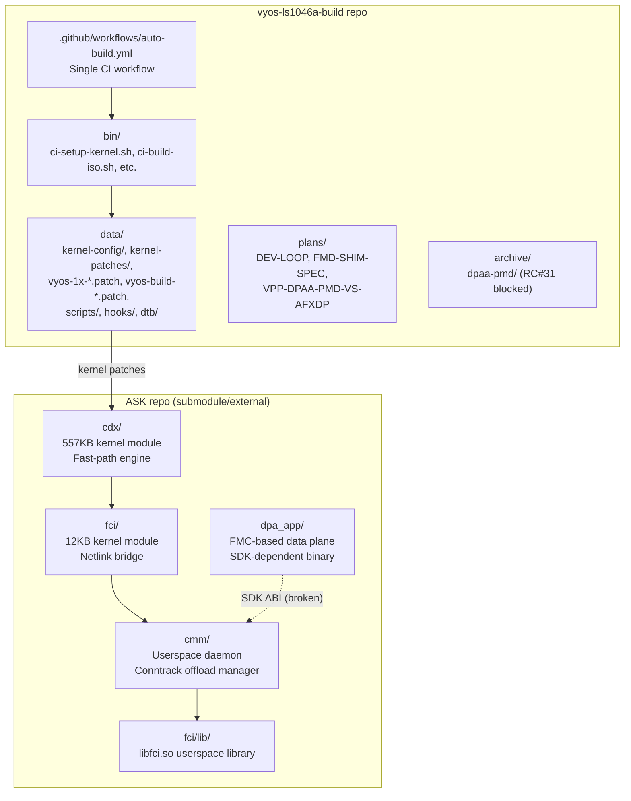
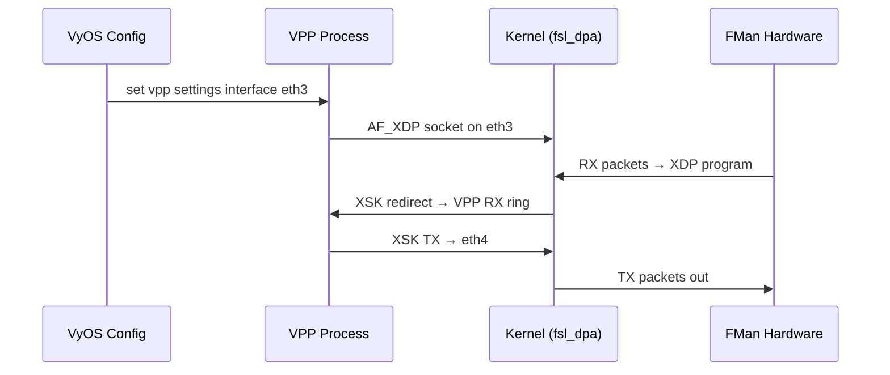
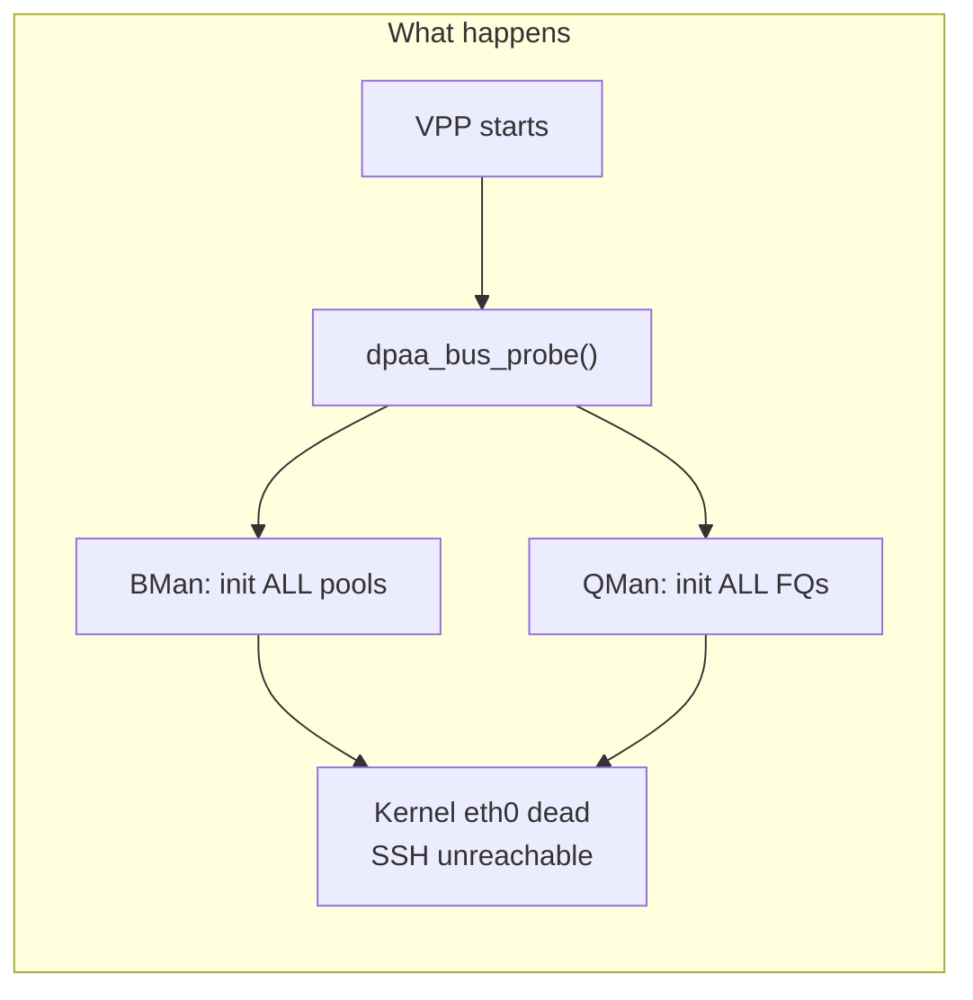
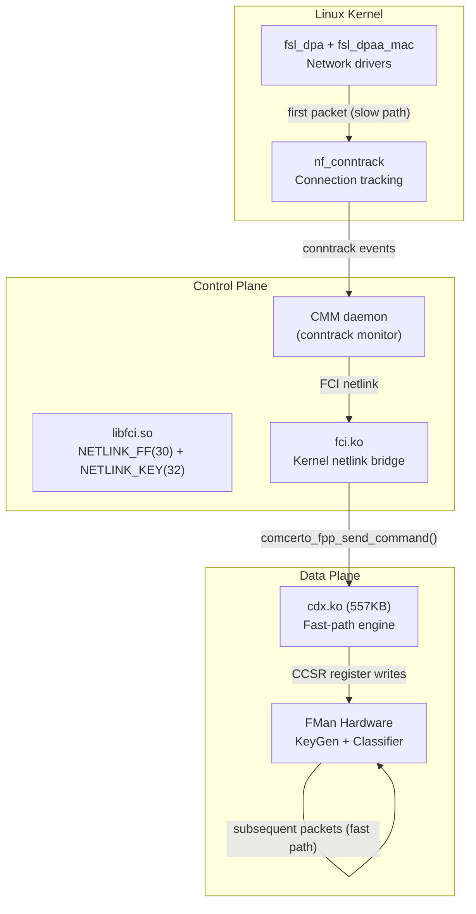
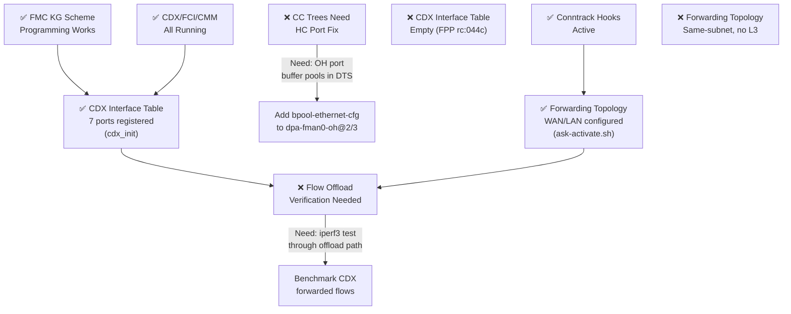
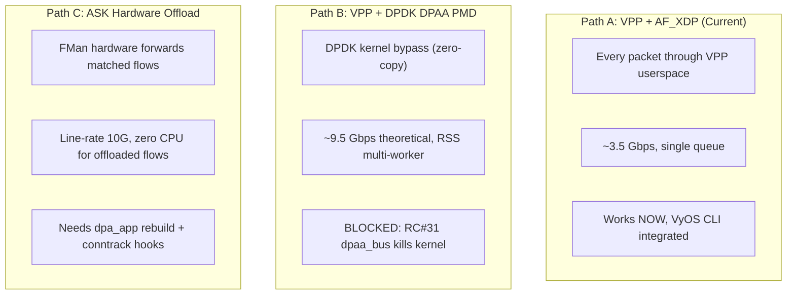
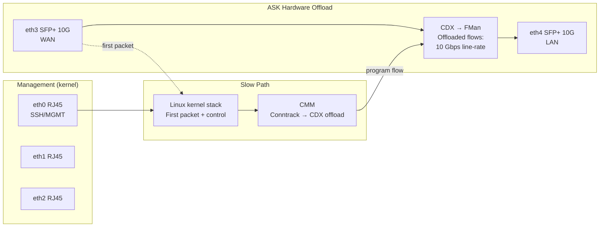

# VPP & ASK Analysis — Mono Gateway LS1046A

> **Status (2026-04-08):** ASK kernel fully fixed — 7 root causes resolved (ExternalHashTableSet redirect, ABI mismatch, Kconfig ARM64 deps, nf_conn->mark regression). Kernel rebuilt clean, deployed to TFTP. CDX 7-port registration, FCI, and CMM all running. Awaiting device reboot for PCD hash table programming test (`fmc -a` + `dpa_app`). See `plans/PCD-DEBUG-PLAN.md` for full root cause analysis.

## Executive Summary

The Mono Gateway (NXP LS1046A, 4× Cortex-A72 @ 1.6 GHz, 2 GB RAM) runs VyOS with three possible packet acceleration paths. This document analyzes the repo structure, ASK stack, and the plan forward for high-performance forwarding.

| Path | Throughput | Status | Blockers |
|------|-----------|--------|----------|
| **AF_XDP** (current) | ~3.5 Gbps | ✅ Production | MTU ≤3290, no RSS multi-worker |
| **DPAA PMD** (DPDK) | ~9.5 Gbps (theoretical) | 🚫 Blocked | RC#31: `dpaa_bus` kills kernel interfaces |
| **ASK** (NXP fast-path) | ~4–6 Gbps (estimated) | 🧪 Kernel fixed | 7 kernel bugs fixed; awaiting device test of PCD hash table programming |

---

## 1. Repository Structure



---

## 2. Current Production Path: VPP + AF_XDP

Implemented via `data/vyos-1x-010-vpp-platform-bus.patch`. VPP creates AF_XDP sockets on DPAA1 `fsl_dpa` netdevs without unbinding the kernel driver.



**Strengths:**
- Kernel retains full interface ownership (SSH management works)
- VyOS native CLI integration (`set vpp settings ...`)
- No kernel module signing issues
- Thermal protection via `poll-sleep-usec 100`

**Limitations:**
- ~3.5 Gbps on 10G SFP+ (single queue, no RSS)
- MTU capped at 3290 (DPAA1 XDP hard limit)
- FQID-as-queue_index bug requires kernel patch (`patch-dpaa-xdp-queue-index.py`)
- No multi-worker: DPAA1 reports 1 combined channel

---

## 3. Blocked Path: VPP + DPDK DPAA PMD

**RC#31 — FATAL:** DPDK's `dpaa_bus` probe (`rte_bus_probe()`) initializes ALL BMan/QMan resources globally, killing kernel-managed interfaces. Confirmed on hardware 2026-04-03.



The `plans/FMD-SHIM-SPEC.md` documents the partial infrastructure built:
- FMD shim skeleton: `/dev/fm0*` chardevs + `GET_API_VERSION` ioctl ✅
- KG scheme programming (RSS): specified but not yet coded
- DPDK `fmc_q=0` patch: specified but moot until RC#31 resolved

**Unblocking requires:** Scoped `dpaa_bus` init in DPDK (upstream code change) or all-DPDK mode with LCP (Linux Control Plane) for management.

---

## 4. ASK Stack — Hardware Validation Results

### 4.1 What is ASK?

NXP Application Services Kit — a hardware flow offload engine for DPAA1. Unlike VPP (which processes every packet in userspace), ASK programs FMan hardware to forward matching flows at line rate without CPU involvement.



### 4.2 Live Test Results (2026-04-07)

All three components running on device at 192.168.1.189:

| Component | Status | Details |
|-----------|--------|---------|
| `cdx.ko` | ✅ Loaded | 557KB, `/dev/cdx_ctrl` major 243, `qm_init` successful |
| `fci.ko` | ✅ Loaded | Refcount 9, 17 msgs sent/received, 0 errors |
| `cmm` | ✅ Running | PID 11085, stable, 65536 max connections |

**FCI Netlink Sockets:**
- Protocol 30 (NETLINK_FF): kernel listener + 5 CMM worker sockets
- Protocol 32 (NETLINK_KEY): kernel listener + 4 CMM worker sockets

**Network Interfaces (all UP under kernel):**
- eth0: RJ45 1G — 10.99.0.1/24 (LAN)
- eth1: RJ45 1G — 192.168.1.190/16 (mgmt)
- eth2: RJ45 1G — 192.168.1.185/16 (WAN+NAT)
- eth3: SFP+ 10G copper (SFP-10G-T) — 192.168.1.182/16, 10Gbps carrier, DHCP (after TX_DISABLE GPIO fix)
- eth4: SFP+ 10G DAC (SFP-H10GB-CU1M) — 192.168.1.192/16, 10Gbps carrier, DHCP

**Conntrack (after `notrack` fix):**
- 8+ flow entries tracked (SSH, NTP, broadcast)
- `fp_netfilter: hooks registered + conntrack force-enabled` at T+2.3s

### 4.3 Issues Encountered & Fixed

| Issue | Root Cause | Fix |
|-------|-----------|-----|
| CDX crash on load | `DPA_IPSEC_OFFLOAD` code + `cdx_init_frag_module()` FMan MURAM corruption | Disabled in Makefile + `#if 0` wrapper |
| CDX crash (WiFi/timer) | `CFG_WIFI_OFFLOAD` + NULL timer deref | Disabled WiFi + timestamp NULL guard |
| `MODULE_SIG_FORCE` rejection | Unsigned module | Sign with `scripts/sign-file sha512` |
| FCI NETLINK_KEY=31 vs kernel=32 | Kernel header `uapi/linux/netlink.h` defines `NETLINK_KEY 32`, `MAX_LINKS 64` | Reverted libfci.so to 32 |
| CMM `nfnl_set_nonblocking_mode` missing | `libnfnetlink.so.0` symlink pointed to `.orig` Debian lib (30KB) not NXP lib (137KB) | Fixed symlink to NXP version |
| CMM `ctnetlink ABI broken` crash | NXP `libnetfilter_conntrack.so` has `parse_mnl.c` attribute table with lower `CTA_MAX` than kernel 6.6 | **Don't install NXP lib; use system Debian `libnetfilter_conntrack` 1.0.9** |
| VyOS `notrack` kills conntrack | `vyos_conntrack` nftables table has `notrack` rule at end of PREROUTING/OUTPUT chains | Delete `notrack` handles via `nft delete rule` (see `ask-conntrack-fix.sh`) |
| SFP-10G-T copper no link (SDK) | SDK `fsl_mac` driver has no phylink — TX_DISABLE stays asserted (sfp.c binds but state machine never starts) | Unbind sfp.c, export GPIO 590, set HIGH. Board inverter: HIGH → TX enabled. Copper link UP at 10Gbps |
| `dpa_app` segfault | 40MB BSS, SDK Yocto ABI incompatible | **Replaced by `cdx_init`** — custom 7-port initializer using `/dev/cdx_ctrl` ioctl |
| FPP tables empty | CDX interface table not populated — `dpa_app` never ran to map FMan ports | **Fixed by `cdx_init`** — all 7 ports registered (2×OH + 3×1G + 2×10G) |
| CDX policer profile failure | `dpa_add_ethport_ff_policier_profile()` aborted port registration (`goto err_ret4`) | Changed to `pr_warn()` + continue in `devman.c` — policer non-essential without PCD |
| SDK cell-index collision | MAC2 (1G, ci=1) collides with MAC10 (10G, ci=9→1) due to SDK remap | Added 1G speed filter in `find_osdev_by_fman_params()` in `devman.c` |
| Stale procfs blocks CDX reload | `/proc/fqid_stats/*`, `/proc/oh1`, `/proc/oh2` survive `rmmod cdx` | `proc_cleanup.ko` removes orphaned entries. QMan FQ state still requires full reboot |

### 4.4 What ASK Still Needs

1. **`dpa_app` replacement:** ✅ **DONE** — `cdx_init` (custom C tool) registers all 7 ports via `/dev/cdx_ctrl` ioctl: OH@2(portid=8), OH@3(portid=9), MAC2(1), MAC5(4), MAC6(5), MAC9(6), MAC10(7). Replaces segfaulting `dpa_app`.

2. **Conntrack hook integration:** ✅ **DONE** — `ASK fp_netfilter: hooks registered + conntrack force-enabled` confirms the kernel hooks are active. The `ask-conntrack-fix.sh` removes VyOS `notrack` rules so conntrack entries are visible to CMM.

3. **Forwarding topology:** ✅ **DONE** — `ask-activate.sh` Phase 7 configures WAN→LAN forwarding: eth4 (SFP+ WAN), eth0 (LAN), with ip_forward and NAT masquerade.

4. **FMC PCD programming (the actual HW offload gap):** ❌ **REMAINING** — Without PCD hash tables programmed into FMan, CDX operates in **software fast-path mode only**: CMM tracks conntrack flows and CDX forwards them via the kernel fast-path (bypassing netfilter on subsequent packets), but FMan hardware cannot autonomously steer packets — every packet still hits the CPU. For true hardware offload (FMan forwards matching flows at line rate, zero CPU), FMan's Coarse Classifier (CC) tables must be programmed with flow-match rules that CDX can reference. Two blockers:
   - **`fmc` tool incompatible:** The standard NXP FMC binary doesn't support ASK's `external="yes"` PCD XML attributes (CDX requires external FQ references for its fast-path steering). FMC rejects the XML or produces configs CDX can't consume.
   - **`dpa_app` segfaults:** The SDK-built `dpa_app` (which integrates FMC+CDX PCD setup) has 40MB BSS and ABI-incompatible SDK assumptions — replaced by `cdx_init` for port registration, but PCD programming was `dpa_app`'s other role.
   - **CC tree hang:** Even with standalone FMC, `FM_PCD_CcRootBuild` blocks forever because OH ports lack ingress FQs/buffer pools in DTS (`bpool-ethernet-cfg` missing from `dpa-fman0-oh@2/3` nodes).
   - **Next step:** Custom PCD programmer (using fmlib directly via `/dev/fm0*` ioctls, ~500 LOC) or patch FMC to support `external="yes"` attributes. KG-only PCD (RSS distribution) is proven working — the gap is CC table programming specifically.

5. **Hardware offload throughput verification:** ❌ **BLOCKED by #4** — Cannot verify line-rate hardware offload until PCD CC tables are programmed. Software fast-path (current state) should still show improvement over pure kernel forwarding but won't reach line-rate 10G.

---

## 5. FMC PCD Breakthrough (2026-04-07)

### 5.1 FMC Works Without `dpa_app`

Today's live testing on the Mono Gateway proved that the standalone **FMC binary** (statically-linked fmlib) can program FMan PCD directly via SDK `/dev/fm0*` chardevs — bypassing the broken `dpa_app` entirely.

**Successful operations (EXIT=0, device stable):**
```
FM_Open → FM_PCD_Open → FM_PCD_Enable → FM_PORT_Open →
FM_PCD_NetEnvCharacteristicsSet → FM_PCD_KgSchemeSet →
FM_PORT_Disable → FM_PORT_SetPCD → FM_PORT_Enable
```

**Key discoveries:**

| Finding | Detail |
|---------|--------|
| **KG-only PCD works** | KeyGen scheme programming via direct MMIO — no HC port needed |
| **PDL file is mandatory** | `-d hxs_pdl_v3.xml` required or FMC crashes device |
| **CC trees hang** | `FM_PCD_CcRootBuild` blocks forever — OH ports have zero ingress FQs |
| **Device survives** | Port disable→SetPCD→re-enable is atomic, network stays up |
| **FMD shim unnecessary** | SDK kernel provides full `/dev/fm0*` (24 chardevs, major 245) |

### 5.2 Implications for ASK

This changes the `dpa_app` blocker from "rebuild from Yocto" to "use FMC with KG-only configs":

1. **FMC is already cross-compiled** — aarch64 ELF, statically-linked fmlib, only needs `libxml2`
2. **KG distribution = RSS** — FMan KeyGen hashes on 5-tuple fields and distributes to multiple FQs
3. **CC tables are NOT needed** for basic flow distribution — only for exact-match flow classification
4. **CDX interface table population** — the missing piece is mapping FMC-programmed KG schemes to CDX's internal interface table. This may work via FCI netlink commands or by CDX reading FMan state directly

### 5.3 Remaining ASK Blockers



---

## 6. Comparison: Three Paths Forward



| Criterion | AF_XDP | DPAA PMD | ASK |
|-----------|--------|----------|-----|
| **Throughput** | ~3.5 Gbps | ~9.5 Gbps | 10 Gbps line-rate (offloaded) |
| **CPU usage** | High (poll-mode) | Medium (poll-mode) | Near-zero (hardware) |
| **Kernel coexistence** | ✅ Full | ❌ Breaks all interfaces | ✅ Full |
| **VyOS CLI** | ✅ Native | ⚠️ Needs LCP | ❌ Separate CMM daemon |
| **Feature coverage** | Full VPP graph | Full VPP graph | L2–L4 forwarding only |
| **RSS / multi-worker** | ❌ Single queue | ✅ 4+ queues | ✅ Hardware hashing |
| **Maturity** | Production | Blocked | Operational (CDX+FCI+CMM), needs CC trees |
| **Jumbo frames** | ❌ MTU ≤3290 | ✅ Full | ✅ Full |

---

## 6. Recommended Plan

### Phase 1: Keep AF_XDP as Production (NOW)
- AF_XDP works at 3.5 Gbps — sufficient for most deployments
- Continue improving VyOS integration (thermal, monitoring)

### Phase 2: Develop ASK Integration (2–4 weeks)
ASK provides the best cost/benefit for the LS1046A platform:

1. **Week 1:** Rebuild FMC/`dpa_app` from NXP Yocto source against Debian arm64
   - Extract FMC library from `meta-freescale` layer
   - Cross-compile with VyOS kernel headers
   - Target: `dpa_app` runs without segfault, configures FMan RSS

2. **Week 2:** Add `comcerto_fp_netfilter` to mainline kernel build
   - Move ASK kernel patches from `data/kernel-patches/ask/` to CI pipeline
   - Add `CONFIG_COMCERTO_FP=y` to kernel config
   - Target: CDX can receive conntrack flow offload requests

3. **Week 3:** Create VyOS integration service
   - Systemd service: loads CDX → FCI → starts CMM
   - VyOS config node: `set system fast-path enable`
   - Target: ASK starts automatically on boot

4. **Week 4:** Benchmark and tune
   - Measure offloaded flow throughput (expect line-rate 10G)
   - Tune CDX conntrack aging timers
   - Document in VPP-SETUP.md

### Phase 3: Revisit DPAA PMD (Future)
Only if upstream DPDK scopes `dpaa_bus` init:
- Monitor DPDK mailing list for DPAA bus changes
- Alternative: all-DPDK mode with LCP (requires VPP managing all interfaces)
- FMD shim (plans/FMD-SHIM-SPEC.md) remains ready for RSS when PMD unblocks

### Hybrid Architecture (Target)



---

## 7. Key Files Reference

| Category | File | Purpose |
|----------|------|---------|
| **VPP AF_XDP** | `data/vyos-1x-010-vpp-platform-bus.patch` | Maps `fsl_dpa` to AF_XDP in VyOS VPP |
| **VPP AF_XDP** | `data/kernel-patches/patch-dpaa-xdp-queue-index.py` | Fixes FQID→queue_index for XSKMAP |
| **DPAA PMD** | `archive/dpaa-pmd/` | Archived DPDK infrastructure (RC#31) |
| **DPAA PMD** | `plans/FMD-SHIM-SPEC.md` | FMan chardev shim for DPDK fmlib |
| **ASK CDX** | `ASK/cdx/cdx_main.c` | Fast-path engine module entry |
| **ASK FCI** | `ASK/fci/fci.c` | Netlink bridge (NETLINK_FF=30, KEY=32) |
| **ASK CMM** | `ASK/cmm/` | Conntrack offload daemon |
| **ASK Library** | `ASK/fci/lib/` | libfci.so userspace netlink client |
| **ASK Init** | `data/scripts/cdx_init.c` | 7-port CDX initializer (replaces `dpa_app`) |
| **ASK Cleanup** | `data/scripts/proc_cleanup.c` | Stale procfs cleanup module |
| **ASK Activate** | `data/scripts/ask-activate.sh` | 8-phase activation script |
| **Analysis** | `plans/VPP-DPAA-PMD-VS-AFXDP.md` | DPAA PMD vs AF_XDP technical comparison |
| **Kernel ASK** | `data/kernel-patches/ask/` | Conntrack fast-path hooks for CDX |
