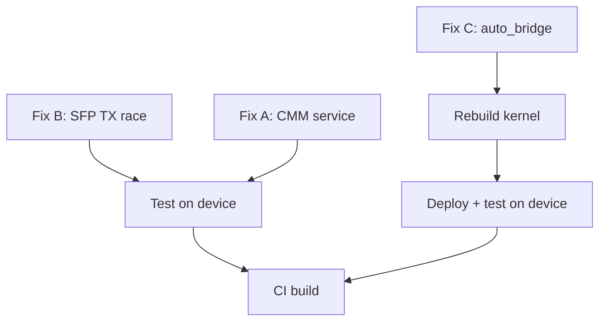

# ASK Fix Plan — 5 Failing Health Checks

Results from health check on 192.168.1.189 (kernel `6.6.129-dirty`, image `2026.04.09-1532-rolling`).

## Summary

| # | Issue | Root Cause | Fix Location | Effort |
|---|-------|-----------|--------------|--------|
| 7 | FCI module not loaded | `ask-modules-load.service` not active on dev_boot | Already fixed in CI pipeline | ✅ None |
| 8 | CMM daemon missing | No `cmm.service` unit file in repo | Create `data/systemd/cmm.service` | 🟢 Small |
| 9 | Conntrack count=0 | No traffic flowing — not a bug | N/A | ✅ None |
| 11 | SFP+ TX enable race | Script checks interface name before VyOS rename | Fix `sfp-tx-enable-sdk.sh` | 🟢 Small |
| AB | auto_bridge.ko symbols | `CONFIG_BRIDGE=m` + missing `rtmsg_ifinfo` export | Kernel config + patch | 🟡 Medium |

**Actual work: 3 fixes** (FCI and conntrack are non-issues)

---

## Fix A: CMM Service Unit File

### Problem
`ci-setup-vyos-build.sh` line 172 copies `ask-ls1046a-6.6/config/cmm.service` — this file only exists during CI (cloned from the ASK repo). If the ASK repo structure changes or the path is wrong, CMM won't start. We need `data/systemd/cmm.service` as a stable fallback in our repo.

The CMM binary IS already in the pipeline (`data/ask-userspace/cmm/cmm` → `/usr/bin/cmm`), and `cmm.tmpfiles` creates the `.wants` symlink. The only missing piece is the service unit.

### Fix
Create `data/systemd/cmm.service`:

```ini
[Unit]
Description=CMM — ASK Connection Manager Daemon
After=ask-modules-load.service vyos-router.service
Requires=ask-modules-load.service
ConditionPathExists=/dev/cdx_ctrl

[Service]
Type=simple
ExecStart=/usr/bin/cmm
Restart=on-failure
RestartSec=5
Environment=LD_LIBRARY_PATH=/usr/local/lib

[Install]
WantedBy=multi-user.target
```

Update `ci-setup-vyos-build.sh` line 172 to use our file:
```bash
# Was: cp ask-ls1046a-6.6/config/cmm.service ...
cp data/systemd/cmm.service "$CHROOT/etc/systemd/system/cmm.service"
```

### Validation
```bash
systemctl status cmm    # Should be active
ls /proc/fast_path      # Should exist after CMM starts
```

---

## Fix B: SFP+ TX Enable Race Condition

### Problem
`sfp-tx-enable-sdk.sh` line 58 checks `/sys/class/net/$iface` (eth3/eth4). The service runs `Before=vyos-router.service` — at that point, interfaces still have systemd predictable names (`e2`, `e3`, etc.). VyOS renames them ~30s later. Both SFP cages are skipped.

### Root Cause Analysis
The interface check is a **sanity check** — "is the SFP module present?" But the script's actual operation only needs:
1. SFP platform device exists (`/sys/bus/platform/devices/sfp-xfi0`)
2. GPIO character device (`/dev/gpiochip2`)

The interface name is irrelevant to GPIO control.

### Fix
Remove the interface name check from `sfp-tx-enable-sdk.sh`. The SFP platform device check (line 52) is sufficient — if the DTS defines `sfp-xfi0`/`sfp-xfi1`, the GPIO lines exist.

```diff
--- data/scripts/sfp-tx-enable-sdk.sh
+++ data/scripts/sfp-tx-enable-sdk.sh
@@ -55,12 +55,6 @@
         continue
     fi
 
-    # Check if interface exists
-    if [ ! -d "/sys/class/net/$iface" ]; then
-        log "$sfp_dev ($iface): interface not found, skipping"
-        continue
-    fi
-
     # Unbind SFP driver if currently bound (releases GPIO)
```

### Validation
```bash
journalctl -u sfp-tx-enable-sdk  # Should show "TX_DISABLE deasserted" not "interface not found"
cat /sys/kernel/debug/gpio | grep sfp  # GPIO lines should be claimed
```

---

## Fix C: auto_bridge.ko — Missing Kernel Symbols (5 symbols)

### Problem
`insmod auto_bridge.ko` fails with 5 missing symbols:

| Symbol | Source File | Added by | Issue |
|--------|-----------|----------|-------|
| `br_fdb_register_can_expire_cb` | `net/bridge/br_fdb.c` | 003 patch ✓ | `CONFIG_BRIDGE=m` → not loaded |
| `br_fdb_deregister_can_expire_cb` | `net/bridge/br_fdb.c` | 003 patch ✓ | `CONFIG_BRIDGE=m` → not loaded |
| `register_brevent_notifier` | `net/bridge/br.c` | 003 patch ✓ | `CONFIG_BRIDGE=m` → not loaded |
| `unregister_brevent_notifier` | `net/bridge/br.c` | 003 patch ✓ | `CONFIG_BRIDGE=m` → not loaded |
| `rtmsg_ifinfo` | `net/core/rtnetlink.c` | NOT exported | Never exported upstream |

### Root Cause
Two separate issues:

**Issue 1:** `CONFIG_BRIDGE=m` (module). The 003 patch adds 4 symbols to bridge code with `EXPORT_SYMBOL`/`EXPORT_SYMBOL_GPL`. But since bridge is a module and not loaded, these symbols are unavailable. On the dev_boot kernel, `bridge.ko` isn't even in `/lib/modules/` (TFTP boot has no modules). Even on a CI-built ISO, bridge.ko would need to be loaded BEFORE auto_bridge.ko.

**Issue 2:** `rtmsg_ifinfo` is defined in `net/core/rtnetlink.c` (always built-in) but is NOT exported via `EXPORT_SYMBOL`. The 003 patch calls it from PPP code but doesn't export it. auto_bridge.ko needs it from module context.

### Fix (Two Parts)

#### Part 1: CONFIG_BRIDGE=y

Add to `data/kernel-config/ls1046a-ask.config`:
```
CONFIG_BRIDGE=y
CONFIG_BRIDGE_NETFILTER=y
```

This makes bridge code built-in, so all 4 bridge symbols from the 003 patch are always available in the kernel. Also makes `br_netfilter` built-in (VyOS loads it on demand currently).

Rationale: Same pattern as DPAA1 ("must be `=y` not `=m`"). Bridge is core infrastructure for ASK fast-path offload. Module ordering issues are eliminated.

#### Part 2: Export rtmsg_ifinfo

Create a new patch `data/kernel-patches/4005-export-rtmsg-ifinfo.patch`:

```diff
diff --git a/net/core/rtnetlink.c b/net/core/rtnetlink.c
index XXXXXXX..YYYYYYY 100644
--- a/net/core/rtnetlink.c
+++ b/net/core/rtnetlink.c
@@ -XXXX,6 +XXXX,7 @@ void rtmsg_ifinfo(int type, struct net_device *dev, unsigned int change,
 {
 	rtmsg_ifinfo_event(type, dev, change, rtnl_flags, new_nsid, new_ifindex, portid, nlh);
 }
+EXPORT_SYMBOL(rtmsg_ifinfo);
```

This must be applied during `ci-setup-kernel-ask.sh` (ASK builds only — mainline doesn't need it).

### Load Order Update

Update `data/scripts/ask-modules-load.sh` to add `modprobe bridge` before auto_bridge (defense-in-depth for the case where CONFIG_BRIDGE stays as `=m`):

```bash
# Ensure bridge module is loaded (auto_bridge depends on bridge FDB symbols)
modprobe bridge 2>/dev/null || true

load_mod auto_bridge.ko
```

### Validation
```bash
# After kernel rebuild:
grep "br_fdb_register_can_expire" /proc/kallsyms  # Should show symbol
grep "rtmsg_ifinfo" /proc/kallsyms                 # Should show T + exported

# Module load:
insmod /usr/local/lib/ask-modules/auto_bridge.ko   # Should succeed
lsmod | grep auto_bridge                           # Should show loaded
```

---

## Implementation Order



1. **Fix B** (SFP TX race) — edit `data/scripts/sfp-tx-enable-sdk.sh`, remove interface check
2. **Fix A** (CMM service) — create `data/systemd/cmm.service`, update `ci-setup-vyos-build.sh`
3. **Fix C part 1** — add `CONFIG_BRIDGE=y` to `data/kernel-config/ls1046a-ask.config`
4. **Fix C part 2** — create `data/kernel-patches/4005-export-rtmsg-ifinfo.patch`
5. **Fix C defense** — add `modprobe bridge` to `ask-modules-load.sh`
6. **Commit all** — single commit on `ask` branch
7. **Trigger CI build** — verify all 11 checks pass

## Files Changed

| File | Action |
|------|--------|
| `data/scripts/sfp-tx-enable-sdk.sh` | Remove interface name check (lines 57-61) |
| `data/systemd/cmm.service` | **NEW** — CMM systemd unit |
| `bin/ci-setup-vyos-build.sh` | Use `data/systemd/cmm.service` instead of ASK repo path |
| `data/kernel-config/ls1046a-ask.config` | Add `CONFIG_BRIDGE=y`, `CONFIG_BRIDGE_NETFILTER=y` |
| `data/kernel-patches/4005-export-rtmsg-ifinfo.patch` | **NEW** — export `rtmsg_ifinfo` for auto_bridge |
| `data/scripts/ask-modules-load.sh` | Add `modprobe bridge` before auto_bridge |
| `bin/ci-setup-kernel-ask.sh` | Apply 4005 patch (if not auto-applied) |