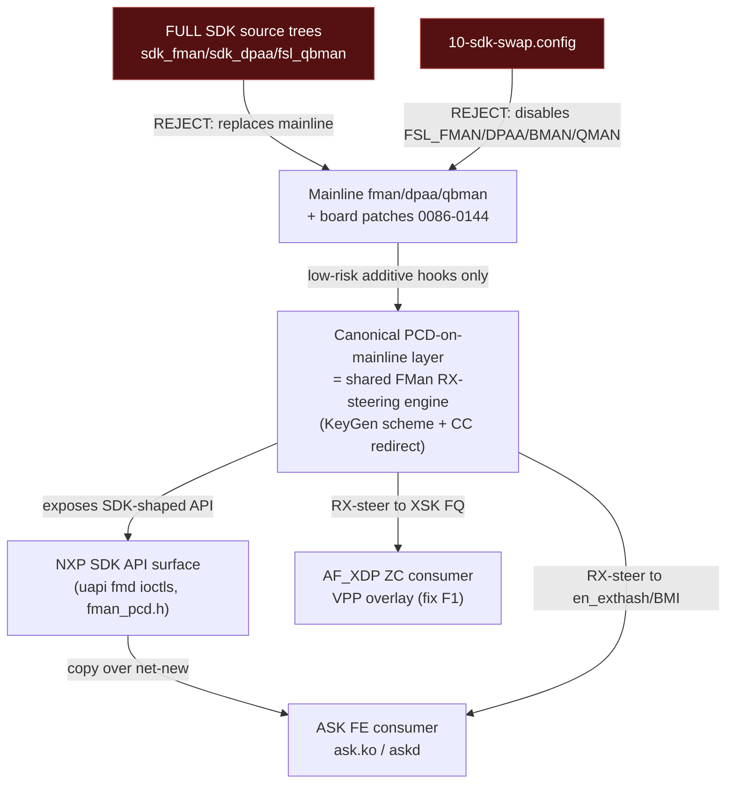
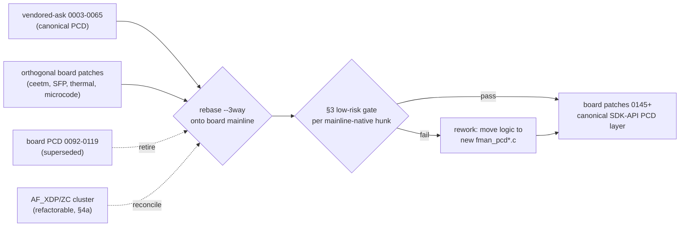

# ASK2 Mainline-Based, SDK-API-Compatible Offload Plan

**Version 1.0.0 · 2026-06-18 · HADS 1.0.0**

## AI READING INSTRUCTION

This document is the governing architecture + reconciliation plan for landing the DPAA1 FMan
hardware-offload (FE / `en_exthash` external-hash forwarding, ASK2) **without** swapping the
mainline `fman` / `dpaa` / `soc/fsl/qbman` source trees. Read §1 for the directive and the core
decision, §2 for the three-bucket file disposition, §3 for the low-risk gate definition, §4 for the
PCD-layer reconciliation procedure, §5 for the fork/de-risk plan, §6 for board-safety constraints.
Tags: `[SPEC]` = binding fact/requirement, `[NOTE]` = rationale/history, `[?]` = unverified/inferred,
`[BUG] Title` = symptom+cause+fix. This plan **supersedes** the Path-A source-swap plan in
`plans/ASKS-SDK-LIFT.md` (which is retained as historical reference only).

---

## 1. Directive and Core Decision

**[SPEC]** Governing directive (user, 2026-06-18): *stay API-compatible with the NXP SDK, but do NOT
replace mainline source files — unless a specific mainline change is known to be small and low-risk.*

**[SPEC]** Target architecture: an **SDK-API-compatible facade implemented on top of mainline**
`fman` / `dpaa` / `qbman` plus our board patch stack 0086–0144. The SDK's *API surface* (uapi `fmd`
ioctl ABI + kernel `fman_pcd.h`-shaped entry points) is preserved so the ASK offload consumers
(`ask.ko`, `askd`) bind unchanged; the SDK's *implementation* is NOT adopted wholesale.

**[NOTE]** The pivotal finding that makes this cheap: the staged `kernel/flavors/ask/patches/`
48-patch "vendored-ask" series is **not** a source-tree swap. The files it builds
(`fman_pcd.c`, `fman_pcd_cc.c`, `fman_pcd_kg.c`, `fman_pcd_manip.c`, `fman_pcd_plcr.c`,
`fman_pcd_replic.c`, `fman_pcd_prs.c`) **do not exist in mainline 6.18** — they are net-new files
added into the mainline `fman` tree, with only small additive hooks/exports into the mainline-native
`dpaa_eth.c` / `fman_keygen.c` / `fman.c`. That is already the requested shape. The real conflict is
that our board stack 0086–0144 contains an **older, partial version of the same PCD-on-mainline
effort**, so the two in-house layers overlap on the same new-in-tree filenames.

**[SPEC]** Core decision: adopt **one canonical PCD-on-mainline layer**, retire the overlapping board
patches, and keep all orthogonal board patches. The canonical layer is selected per §4 (recommended:
the vendored-ask series, as the more complete and more SDK-API-faithful iteration), reconciled onto
board-patched mainline rather than clean mainline.

**[SPEC]** Rejected: the full SDK source trees (`sdk_fman` / `sdk_dpaa` / `fsl_qbman`), the
`10-sdk-swap.config` Kconfig replacement, and any vendored-ask patch that rewrites a mainline-native
file beyond the §3 low-risk gate.

---

## 2. File Disposition — Three Buckets

**[SPEC]** Every file under `kernel/flavors/ask/` falls into exactly one bucket.

### 2.1 Bucket A — DROP (replaces mainline; violates directive)

**[SPEC]** Do not adopt:

- `kernel/flavors/ask/sdk/fman/**`, `sdk/dpaa/**`, `sdk/qbman/**` — full SDK source trees that, with
  `10-sdk-swap.config`, displace mainline `drivers/net/ethernet/freescale/{fman,dpaa}` and
  `drivers/soc/fsl/qbman`.
- `kernel/flavors/ask/kernel-config/10-sdk-swap.config` — disables `CONFIG_FSL_FMAN`/`DPAA`/`BMAN`/
  `QMAN`, enabling SDK variants. The single image must keep mainline DPAA1 built-in (`=y`).
- `kernel/flavors/ask/sdk/include/linux/fsl_bman.h`, `fsl_qman.h` — duplicate the mainline
  `include/soc/fsl/{bman,qman}.h` symbol surface (R3 QBMan clash).

**[NOTE]** Dropping these also resolves the path-mismatch dead-wiring: build scripts expect
`kernel/flavors/ask/sdk-sources/` but the trees were staged under `sdk/`, so nothing referenced them.

### 2.2 Bucket B — COPY OVER (net-new, additive SDK-API surface; aligns with directive)

**[SPEC]** Adopt as-is (no mainline file is replaced — mainline has no equivalent):

- `kernel/flavors/ask/uapi/linux/fmd/*` — the SDK ioctl ABI headers (`fm_ioctls.h`,
  `fm_pcd_ioctls.h`, `fm_port_ioctls.h`, `fm_test_ioctls.h`, `net_ioctls.h`, `ioctls.h`,
  `integration_ioctls.h`, Kbuilds). Mainline ships **no** `fmd` uapi; this IS the "stay
  API-compatible with the SDK" contract for userspace.
- New kernel API headers: `include/linux/fsl/fman_pcd.h` (SDK-shaped PCD entry points),
  `fman_host_cmd.h`, `dpaa_flow_offload.h`.
- `kernel/flavors/ask/oot-modules/ask` — the `ask.ko` offload module.
- `kernel/flavors/ask/userspace/askd` — the userspace daemon.

**[SPEC]** Reconcile the staging path so the build actually wires these in: either rename
`kernel/flavors/ask/sdk/` content to the `sdk-sources/` layout the build scripts expect, or update
the scripts to the new paths — but only for the Bucket-B headers/modules, never the Bucket-A trees.

### 2.3 Bucket C — DISTILL into reconciled low-risk board patches (the PCD-on-mainline layer)

**[SPEC]** The PCD subsystem itself becomes the canonical board-patch layer 0145+ (or a re-based
replacement of the overlapping 0092–0119 cluster). Two sub-classes:

- **C1 — net-new PCD files** (vendored-ask `0003`–`0027`, `0044`, `0050`–`0065`): create
  `fman_pcd*.c` + internal headers + (optionally) kunit suites in the mainline `fman` tree. These add
  files; they do not replace mainline. Adopt as the canonical PCD core.
- **C2 — small additive hooks/exports into mainline-native files** (vendored-ask `0028`/`0029`/
  `0030`/`0031`/`0039` dpaa exports, `0041` widen-hwport-range, plus the minimal `fman_keygen.c` /
  `fman.c` / `Kconfig` / `Makefile` wiring): each must pass the §3 low-risk gate or be reworked to.

**[SPEC]** `0001-caam-qi-share.patch` in the vendored set **is** our board patch `0134` relocated —
keep exactly one copy (the board `0134`); drop the duplicate.

| Bucket | Examples | Action |
|---|---|---|
| A DROP | `sdk/{fman,dpaa,qbman}`, `10-sdk-swap.config`, `fsl_bman.h`/`fsl_qman.h` | discard |
| B COPY | `uapi/linux/fmd/*`, `fman_pcd.h`, `fman_host_cmd.h`, `dpaa_flow_offload.h`, `oot-modules/ask`, `userspace/askd` | adopt net-new |
| C1 DISTILL | new `fman_pcd*.c` files | canonical PCD layer (new board patches) |
| C2 DISTILL | dpaa exports, hwport widen, minimal wiring | low-risk gate then board patches |
| dedupe | `0001-caam-qi-share` == board `0134` | keep board `0134` |

---

## 3. The Low-Risk Mainline-Modification Gate

**[SPEC]** A modification to a **mainline-native** file (`dpaa/dpaa_eth.c`, `fman/fman_keygen.c`,
`fman/fman.c`, `fman/fman.h`, `fman/fman_port.c`, `fman/Kconfig`, `fman/Makefile`,
`include/linux/fsl/fman.h`) is permitted ONLY if ALL hold:

1. **Additive-only** — introduces a new symbol/export/hook/branch; does not alter the behavior of any
   existing code path when the offload is dormant.
2. **Small** — roughly < 50 changed lines in that mainline file; the bulk of logic lives in a
   net-new `fman_pcd*.c` file, not in the mainline file.
3. **Guarded or inert when unused** — reachable only via a new export called by `ask.ko`/the PCD
   layer, or behind a runtime check, so a stock boot is byte-for-byte unaffected.
4. **Rot-resistant** — anchors on stable context (function signatures, not fragile line offsets);
   survives the mainline kernel bumps tracked by `sync-kernel-version.sh`.

**[SPEC]** Modifications that fail the gate (large in-place rewrites of `fman_keygen.c` internals,
`fman_port.c` PCD-path rewrites) must be **reworked** so the heavy logic moves into a net-new
`fman_pcd*.c` file and the mainline-native file keeps only a thin additive hook/export.

**[NOTE]** Examples that PASS as-authored: `EXPORT_SYMBOL` of `rx_default_fqid` / `fman_port_id` /
`tx_fqid` / `rx_fman_port` from `dpaa_eth.c` (70–85 lines, pure export plumbing); `advertise-hw-tc`
(9 lines, already shipped as board `0104a`); `widen-hwport-range` (6 lines). Example that FAILS and
must be reworked: any vendored-ask patch with 200–650 add-lines landing inside `fman_keygen.c`.

---

## 4. PCD-Layer Reconciliation Procedure

**[SPEC]** Two in-house PCD-on-mainline layers exist and overlap on the same new-in-tree filenames:

- **Board stack (older, partial):** `0092` fman-pcd-subsystem, `0097` keygen, `0098` cc-static,
  `0099` hm, `0100` plcr, `0106` cc-keygen-graft, `0107` cc-debugfs, `0108` per-key-fq-enqueue,
  `0113` dcsr-error-taps, `0115` sdk-convergent-bringup, `0116` fmctl-enq-params-page, `0118`
  revert-ccbs-dispatch, `0119` hm-l3-forward + the PCD hunks in `0086`/`0101`/`0104`/`0104a`.
- **Vendored-ask (newer, complete, SDK-API-faithful):** the 48-patch `0003`–`0065` series — full
  kg/cc/manip/plcr/replic/prs encoders, host-command API, `dpaa_flow_offload` block, kunit suites,
  dedicated-scheme graft (`0065`), pre-netdev + install-now integration.

**[SPEC]** Reconciliation steps:

1. **Select canonical** — recommend the vendored-ask series (more complete, exposes the SDK-shaped
   `fman_pcd.h` API, includes the dedicated-scheme/IC work the offload needs). `[?]` Confirm with the
   user before retiring board patches, since this is a large, hard-to-reverse swap.
2. **Rebase onto board-patched mainline** — the vendored-ask patches were authored independently;
   re-base them on top of the orthogonal board stack (AF_XDP datapath, SFP, thermal, ceetm) using
   `git apply --3way` + Mergiraf, NOT clean mainline.
3. **Retire superseded board patches** — remove the overlapping `0092`–`0119` PCD cluster once the
   canonical layer subsumes their behavior; verify no orthogonal patch depends on a retired symbol.
4. **Keep genuinely-orthogonal board patches** — `0111` qman-ceetm, `0112` ceetm-htb, `0117`
   microcode load, SFP `101`/`4005`/`4009`, ina `4002`, xhci `4007`, xdp-rxq `4006`. These are
   non-DPAA-PCD and non-AF_XDP; they stay untouched.
5. **The AF_XDP / true-ZC cluster is NOW REFACTORABLE, not frozen** (`0068`–`0085`, `0088`,
   `0094`–`0096`, `0102`–`0114` xsk/zc) — see §4a. It is a non-delivering skeleton and shares the
   FMan RX-steering substrate with the ASK PCD layer, so it is reconciled alongside the PCD work, not
   preserved around it.
5. **Apply the §3 gate** to every mainline-native hunk in the canonical layer; rework failures.
6. **De-dupe caam** — drop vendored `0001`; keep board `0134`.

## 4a. AF_XDP / True-ZC Datapath — Refactorable, Not Frozen

**[BUG] DPAA1 AF_XDP zero-copy TX is a non-delivering skeleton on kernel 6.18.x**
*Symptom:* with VPP bound to `eth3` via AF_XDP, RX limps in copy mode (~real frames arrive) but bulk
TX collapses to Kbit/s with `error af_xdp_device_output_tx_db: tx poll() failed: Device or resource
busy` and `eth3 flags: admin-up syscall-lock`; the kernel DPAA netdev path on the same silicon does
**7.41 Gbit/s**. *Cause:* boot dmesg `af_xdp_pool: registered (skeleton, all callbacks stubbed
-EOPNOTSUPP)` — the DPAA1 driver's XSK buffer-pool ops vtable (pool setup, `ndo_xsk_wakeup`,
`xsk_buff` DMA) shipped by board patches `0073`–`0085` returns `-EOPNOTSUPP` for **every** callback,
so `XDP_ZEROCOPY` bind is rejected and VPP's `af_xdp_plugin` falls back to `XDP_COPY`; copy-mode TX
requires a `sendto()`/tx-poll() syscall kick per batch which returns `EBUSY` under load. *Fix:* either
(F1) implement the real DPAA1 `xsk_buff_pool` zero-copy ops in `dpaa_eth.c` (deep driver work), or
(F2) route the high-throughput dataplane through the ASK FE hardware offload instead of VPP/AF_XDP.
The ~3.5 Gbps in AGENTS.md was kernel 6.6.x; 6.18.x ZC TX was never implemented. qdrant
`vpp-afxdp-validation-6.18`, 2026-06-18, board 192.168.1.190, image 2026.06.17-2317-rolling.

**[SPEC]** Because the skeleton never delivered, the AF_XDP/true-ZC cluster (`0068`–`0085`, `0088`,
`0094`–`0096`, `0102`–`0114`) is **open for refactor or retirement** — it is no longer a constraint
the PCD rebase must preserve. Its true-ZC RX patches (`0093`–`0096`, `0103x`, `0114`) manipulate the
same FMan KeyGen/CC RX-steering substrate the ASK PCD layer programs, so the two are reconciled
together, not kept apart.

**[SPEC]** **Decision (2026-06-18): retain VPP-overlay; refactor the AF_XDP XSK pool ops to real
zero-copy (fix F1), in parallel with the ASK PCD layer.** The AF_XDP/true-ZC cluster (`0068`–`0085`,
`0088`, `0094`–`0096`, `0102`–`0114`) is therefore **reworked-and-kept, not retired**. F1 means
implementing the real DPAA1 `xsk_buff_pool` zero-copy ops in `dpaa_eth.c` so `XDP_ZEROCOPY` bind
succeeds (pool setup binding the XSK umem to the FMan BMAN pool, a working `ndo_xsk_wakeup` that
drains the XSK TX ring into the FMan TX FQ via QMan, and `xsk_buff` DMA mapping using the
`rx_dma_dev` from board patch `0088`) — replacing the current all-`-EOPNOTSUPP` skeleton.

**[SPEC]** Shared substrate: AF_XDP ZC (F1) and ASK FE (Fork A/B, §5) are **two consumers of one
FMan RX-steering engine** — the canonical PCD layer's KeyGen-scheme + CC-redirect primitives. F1
steers `eth3` RX into the XSK-bound FQ; ASK FE steers `eth3` RX into the `en_exthash`/BMI-enqueue CC
path. The reconciliation (§4) must expose these RX-steering primitives once and let both consumers
call them, rather than duplicating KeyGen/CC programming in the AF_XDP cluster and the ASK layer.

**[?]** The AF_XDP RX path already proves the FMan can redirect classified frames into XSK rings; that
redirect mechanism may be directly reusable by the ASK FE CC tree (Fork A). Confirm by inspecting
`0093`/`0103g` (register-zc-rxq) against the Fork-A BMI-enqueue path.

---

## 5. Offload Mechanism — Fork Decision and De-Risk

**[SPEC]** The `en_exthash` node has NO driver-settable compare-key source: the 210.10.1 FE ucode
reads its key from the per-frame Internal Context (IC) by fixed convention. Register-poking `ekfc`
onto the REUSED RSS scheme had zero effect (qdrant rows 41/42/52/53). What primes the IC is
driver-controllable and reproducible from mainline: (1) a genuinely-BUILT dedicated KeyGen scheme via
the full `BuildSchemeRegs` path (mode AC_CC `0x80000006`, `kgse_ekfc = fields | KG_SCH_KN_PORT_ID
0x80000000`, full ekfc/gec/ekdv/hc/next-engine), and (2) per-port IC layout from `FM_PORT_SetPCD`.

**[SPEC]** Forks:

- **Fork A (primary):** mechanism-2 BMI static CC tree (BMI-enqueue `0x80500002`), which sidesteps
  the ucode-gated `en_exthash` IC deposit entirely — if a port can HW-forward this way, M3 is
  achievable WITHOUT the `en_exthash` node. Known blocker: the M3-3b BMI-FIFO disposition leak
  (~45 frames). Smallest surface.
- **Fork B (fallback):** adopt the vendor external-hash/FE path (the only config empirically proven
  to flow on 210.10.1), which needs the dedicated-scheme + port-IC setup — equivalent to vendored-ask
  `0065` (graft-kernel-scheme) + the `FM_PORT_SetPCD` IC layout.

**[SPEC]** De-risk before committing to Fork B: **Path-B differential dump** — boot a genuinely
flowing NXP-ASK port, mmap-dump its BMI/IC registers (`FMBM_RICP`/`RIM`/`RPP`, IC size+offset,
KeyGen-result-to-IC config, params-page `+0x54`/`+0x58`), and diff against our armed-but-not-flowing
eth3. Scheme registers will be identical/useless; only the port IC layout is expected to differ.

**[NOTE]** Both forks are driver-controllable register/MURAM writes that mainline FMan can issue, so
neither requires the SDK source tree. Recommend implementing Fork A first; if its FIFO leak proves
intractable, fall through to Fork B using the differential dump to target the exact IC delta.

---

## 6. Board Safety and Reversibility Constraints

**[SPEC]** From qdrant (authoritative):

- An external `sudo busybox devmem` **READ** on an FMan CCSR address **REBOOTS the board** — the test
  harness must mmap-read only (4-byte-aligned, big-endian u32).
- Board at `192.168.1.190` (sometimes `.185`). `eth0`/`eth2` are the SSH lifelines — NEVER arm them.
  Mutate `eth3` / port `0x10` only, one arm per boot.
- `scp -O` (legacy protocol) is required for transfers to the board.
- Reversibility: every S0↔S1 dataplane mutation must be provable-reversible without a reboot via
  `pcd-snapshot` (the M1 soak gate); MURAM `used` must return to baseline after S1→S0 or it is the
  PR14z21 327×-ENOMEM leak.

**[SPEC]** No commits without explicit user request (AGENTS.md). Co-authored-by Copilot trailer on any
commit. New board patches use 3-digit sequential numbering with gaps; apply via `git apply --3way`.

---

## 7. Open Questions

**[NOTE]** **VPP role — RESOLVED (2026-06-18):** retain VPP-overlay; refactor AF_XDP to real
zero-copy (fix F1), in parallel with the ASK PCD layer (see §4a). AF_XDP-for-VPP TX was fundamentally
broken on 6.18.x (the XSK pool ops were a `-EOPNOTSUPP` skeleton). The chosen path keeps VPP and
un-stubs the ZC ops, with AF_XDP ZC and ASK FE sharing one FMan RX-steering engine.

**[?]** Confirm Fork A vs Fork B as the primary implementation target before any board patch is
authored (§5).

**[?]** Confirm the vendored-ask series (not the board PCD cluster) is the canonical PCD layer to keep
(§4 step 1) — this retires ~13 board patches and is hard to reverse.

**[?]** Whether `ask.ko`/`askd` bind to the kernel `fman_pcd.h` API or the uapi `fmd` ioctl ABI (or
both) — determines which Bucket-B headers are load-bearing vs informational.

---

## 8. qdrant Anchors

**[NOTE]** Authoritative memory consulted for this plan: iter-190 / iter-192 (un-stub of FE-VM builder
is dead code on the enhanced path; the deposit is ucode-internal); the 2026-06-18 mechanism analysis
(reused-RSS-scheme ekfc poke has zero effect; dedicated BUILT scheme + port IC required); the
2026-04-08 "7 Root Causes" hash-table memory (ExternalHashTableSet builds tables in DDR, not MURAM);
board-safety memories (devmem-read reboot, lifeline ports, scp -O).
