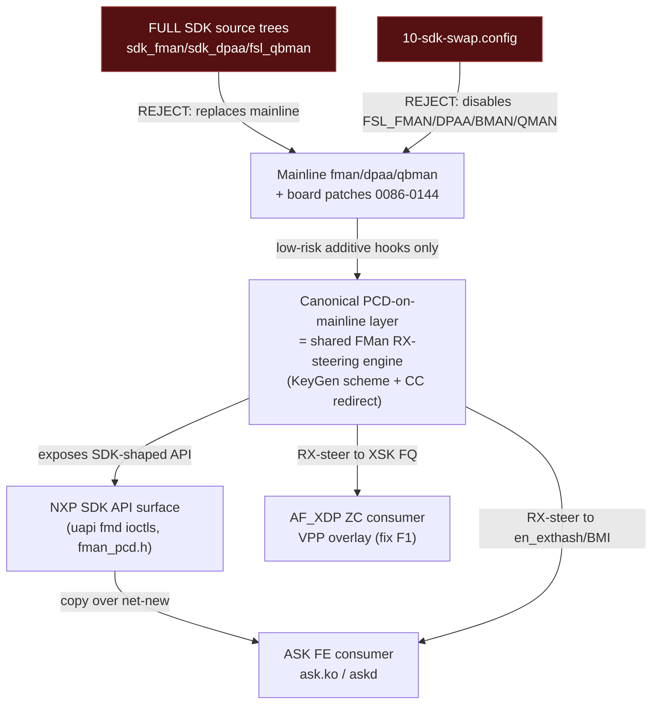
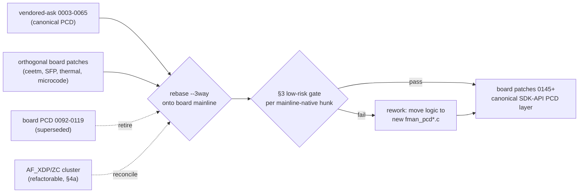

# ASK2 Mainline-Based, SDK-API-Compatible Offload Plan

**Version 1.0.0 · 2026-06-18 · HADS 1.0.0**

## AI READING INSTRUCTION

This document is the governing architecture + reconciliation plan for landing the DPAA1 FMan
hardware-offload (FE / `en_exthash` external-hash forwarding, ASK2) **without** swapping the
mainline `fman` / `dpaa` / `soc/fsl/qbman` source trees. Read §1 for the directive and the core
decision, §2 for the three-bucket file disposition, §3 for the low-risk gate definition, §4 for the
PCD-layer reconciliation procedure, **§4b for the resolved verify-patch-stack result + the canonical-layer
decision matrix, §4c for the adopted Option-1 cherry-pick scope**, §5 for the fork/de-risk plan, §6 for
board-safety constraints.
Tags: `[SPEC]` = binding fact/requirement, `[NOTE]` = rationale/history, `[?]` = unverified/inferred,
`[BUG] Title` = symptom+cause+fix. This plan **supersedes** the Path-A source-swap plan in
`plans/ASKS-SDK-LIFT.md` (which is retained as historical reference only).

---

## 1. Directive and Core Decision

**[SPEC]** Governing directive (user, 2026-06-18): *stay API-compatible with the NXP SDK, but do NOT
replace mainline source files — unless a specific mainline change is known to be small and low-risk.*

**[SPEC]** Target architecture: an **SDK-API-compatible facade implemented on top of mainline**
`fman` / `dpaa` / `qbman` plus our board patch stack 0086–0144. The SDK's *API surface* (uapi `fmd`
ioctl ABI + kernel `fman_pcd.h`-shaped entry points) is preserved so the ASK offload consumers
(`ask.ko`, `askd`) bind unchanged; the SDK's *implementation* is NOT adopted wholesale.

**[NOTE]** The pivotal finding that makes this cheap: the staged `kernel/flavors/ask/patches/`
48-patch "vendored-ask" series is **not** a source-tree swap. The files it builds
(`fman_pcd.c`, `fman_pcd_cc.c`, `fman_pcd_kg.c`, `fman_pcd_manip.c`, `fman_pcd_plcr.c`,
`fman_pcd_replic.c`, `fman_pcd_prs.c`) **do not exist in mainline 6.18** — they are net-new files
added into the mainline `fman` tree, with only small additive hooks/exports into the mainline-native
`dpaa_eth.c` / `fman_keygen.c` / `fman.c`. That is already the requested shape. The real conflict is
that our board stack 0086–0144 contains an **older, partial version of the same PCD-on-mainline
effort**, so the two in-house layers overlap on the same new-in-tree filenames.

**[SPEC]** Core decision: adopt **one canonical PCD-on-mainline layer**, and keep all orthogonal board
patches. The canonical layer is selected per §4 / **§4b** — **adopted (2026-06-18): Option 1, the board
PCD cluster is canonical**; the ASK-only SDK-API surface (§4c) is cherry-picked additively into board
`0145+`. **No board patch is retired** under the adopted direction; retiring board patches (Option 2)
is the one path still requiring explicit user sign-off.

**[SPEC]** Rejected: the full SDK source trees (`sdk_fman` / `sdk_dpaa` / `fsl_qbman`), the
`10-sdk-swap.config` Kconfig replacement, and any vendored-ask patch that rewrites a mainline-native
file beyond the §3 low-risk gate.

---

## 2. File Disposition — Three Buckets

**[SPEC]** Every file under `kernel/flavors/ask/` falls into exactly one bucket.

### 2.1 Bucket A — DROP (replaces mainline; violates directive)

**[SPEC]** Do not adopt:

- `kernel/flavors/ask/sdk/fman/**`, `sdk/dpaa/**`, `sdk/qbman/**` — full SDK source trees that, with
  `10-sdk-swap.config`, displace mainline `drivers/net/ethernet/freescale/{fman,dpaa}` and
  `drivers/soc/fsl/qbman`.
- `kernel/flavors/ask/kernel-config/10-sdk-swap.config` — disables `CONFIG_FSL_FMAN`/`DPAA`/`BMAN`/
  `QMAN`, enabling SDK variants. The single image must keep mainline DPAA1 built-in (`=y`).
- `kernel/flavors/ask/sdk/include/linux/fsl_bman.h`, `fsl_qman.h` — duplicate the mainline
  `include/soc/fsl/{bman,qman}.h` symbol surface (R3 QBMan clash).

**[NOTE]** Dropping these also resolves the path-mismatch dead-wiring: build scripts expect
`kernel/flavors/ask/sdk-sources/` but the trees were staged under `sdk/`, so nothing referenced them.

### 2.2 Bucket B — COPY OVER (net-new, additive SDK-API surface; aligns with directive)

**[SPEC]** Adopt as-is (no mainline file is replaced — mainline has no equivalent):

- `kernel/flavors/ask/uapi/linux/fmd/*` — the SDK ioctl ABI headers (`fm_ioctls.h`,
  `fm_pcd_ioctls.h`, `fm_port_ioctls.h`, `fm_test_ioctls.h`, `net_ioctls.h`, `ioctls.h`,
  `integration_ioctls.h`, Kbuilds). Mainline ships **no** `fmd` uapi; this IS the "stay
  API-compatible with the SDK" contract for userspace.
- New kernel API headers: `include/linux/fsl/fman_pcd.h` (SDK-shaped PCD entry points),
  `fman_host_cmd.h`, `dpaa_flow_offload.h`.
- `kernel/flavors/ask/oot-modules/ask` — the `ask.ko` offload module.
- `kernel/flavors/ask/userspace/askd` — the userspace daemon.

**[SPEC]** Reconcile the staging path so the build actually wires these in: either rename
`kernel/flavors/ask/sdk/` content to the `sdk-sources/` layout the build scripts expect, or update
the scripts to the new paths — but only for the Bucket-B headers/modules, never the Bucket-A trees.

### 2.3 Bucket C — DISTILL into reconciled low-risk board patches (the PCD-on-mainline layer)

**[SPEC]** The PCD subsystem itself becomes the canonical board-patch layer 0145+ (or a re-based
replacement of the overlapping 0092–0119 cluster). Two sub-classes:

- **C1 — net-new PCD files** (vendored-ask `0003`–`0027`, `0044`, `0050`–`0065`): create
  `fman_pcd*.c` + internal headers + (optionally) kunit suites in the mainline `fman` tree. These add
  files; they do not replace mainline. Adopt as the canonical PCD core.
- **C2 — small additive hooks/exports into mainline-native files** (vendored-ask `0028`/`0029`/
  `0030`/`0031`/`0039` dpaa exports, `0041` widen-hwport-range, plus the minimal `fman_keygen.c` /
  `fman.c` / `Kconfig` / `Makefile` wiring): each must pass the §3 low-risk gate or be reworked to.

**[SPEC]** `0001-caam-qi-share.patch` in the vendored set **is** our board patch `0134` relocated —
keep exactly one copy (the board `0134`); drop the duplicate.

| Bucket | Examples | Action |
|---|---|---|
| A DROP | `sdk/{fman,dpaa,qbman}`, `10-sdk-swap.config`, `fsl_bman.h`/`fsl_qman.h` | discard |
| B COPY | `uapi/linux/fmd/*`, `fman_pcd.h`, `fman_host_cmd.h`, `dpaa_flow_offload.h`, `oot-modules/ask`, `userspace/askd` | adopt net-new |
| C1 DISTILL | new `fman_pcd*.c` files | canonical PCD layer (new board patches) |
| C2 DISTILL | dpaa exports, hwport widen, minimal wiring | low-risk gate then board patches |
| dedupe | `0001-caam-qi-share` == board `0134` | keep board `0134` |

---

## 3. The Low-Risk Mainline-Modification Gate

**[SPEC]** A modification to a **mainline-native** file (`dpaa/dpaa_eth.c`, `fman/fman_keygen.c`,
`fman/fman.c`, `fman/fman.h`, `fman/fman_port.c`, `fman/Kconfig`, `fman/Makefile`,
`include/linux/fsl/fman.h`) is permitted ONLY if ALL hold:

1. **Additive-only** — introduces a new symbol/export/hook/branch; does not alter the behavior of any
   existing code path when the offload is dormant.
2. **Small** — roughly < 50 changed lines in that mainline file; the bulk of logic lives in a
   net-new `fman_pcd*.c` file, not in the mainline file.
3. **Guarded or inert when unused** — reachable only via a new export called by `ask.ko`/the PCD
   layer, or behind a runtime check, so a stock boot is byte-for-byte unaffected.
4. **Rot-resistant** — anchors on stable context (function signatures, not fragile line offsets);
   survives the mainline kernel bumps tracked by `sync-kernel-version.sh`.

**[SPEC]** Modifications that fail the gate (large in-place rewrites of `fman_keygen.c` internals,
`fman_port.c` PCD-path rewrites) must be **reworked** so the heavy logic moves into a net-new
`fman_pcd*.c` file and the mainline-native file keeps only a thin additive hook/export.

**[NOTE]** Examples that PASS as-authored: `EXPORT_SYMBOL` of `rx_default_fqid` / `fman_port_id` /
`tx_fqid` / `rx_fman_port` from `dpaa_eth.c` (70–85 lines, pure export plumbing); `advertise-hw-tc`
(9 lines, already shipped as board `0104a`); `widen-hwport-range` (6 lines). Example that FAILS and
must be reworked: any vendored-ask patch with 200–650 add-lines landing inside `fman_keygen.c`.

---

## 4. PCD-Layer Reconciliation Procedure

**[SPEC]** Two in-house PCD-on-mainline layers exist and overlap on the same new-in-tree filenames:

- **Board stack (older, partial):** `0092` fman-pcd-subsystem, `0097` keygen, `0098` cc-static,
  `0099` hm, `0100` plcr, `0106` cc-keygen-graft, `0107` cc-debugfs, `0108` per-key-fq-enqueue,
  `0113` dcsr-error-taps, `0115` sdk-convergent-bringup, `0116` fmctl-enq-params-page, `0118`
  revert-ccbs-dispatch, `0119` hm-l3-forward + the PCD hunks in `0086`/`0101`/`0104`/`0104a`.
- **Vendored-ask (newer, complete, SDK-API-faithful):** the 48-patch `0003`–`0065` series — full
  kg/cc/manip/plcr/replic/prs encoders, host-command API, `dpaa_flow_offload` block, kunit suites,
  dedicated-scheme graft (`0065`), pre-netdev + install-now integration.

**[SPEC]** Reconciliation steps:

1. **Select canonical** — recommend the vendored-ask series (more complete, exposes the SDK-shaped
   `fman_pcd.h` API, includes the dedicated-scheme/IC work the offload needs). `[?]` Confirm with the
   user before retiring board patches, since this is a large, hard-to-reverse swap.
2. **Rebase onto board-patched mainline** — the vendored-ask patches were authored independently;
   re-base them on top of the orthogonal board stack (AF_XDP datapath, SFP, thermal, ceetm) using
   `git apply --3way` + Mergiraf, NOT clean mainline.
3. **Retire superseded board patches** — remove the overlapping `0092`–`0119` PCD cluster once the
   canonical layer subsumes their behavior; verify no orthogonal patch depends on a retired symbol.
4. **Keep genuinely-orthogonal board patches** — `0111` qman-ceetm, `0112` ceetm-htb, `0117`
   microcode load, SFP `101`/`4005`/`4009`, ina `4002`, xhci `4007`, xdp-rxq `4006`. These are
   non-DPAA-PCD and non-AF_XDP; they stay untouched.
5. **The AF_XDP / true-ZC cluster is NOW REFACTORABLE, not frozen** (`0068`–`0085`, `0088`,
   `0094`–`0096`, `0102`–`0114` xsk/zc) — see §4a. It is a non-delivering skeleton and shares the
   FMan RX-steering substrate with the ASK PCD layer, so it is reconciled alongside the PCD work, not
   preserved around it.
5. **Apply the §3 gate** to every mainline-native hunk in the canonical layer; rework failures.
6. **De-dupe caam** — drop vendored `0001`; keep board `0134`.

## 4a. AF_XDP / True-ZC Datapath — Refactorable, Not Frozen

**[BUG] DPAA1 AF_XDP zero-copy TX is a non-delivering skeleton on kernel 6.18.x**
*Symptom:* with VPP bound to `eth3` via AF_XDP, RX limps in copy mode (~real frames arrive) but bulk
TX collapses to Kbit/s with `error af_xdp_device_output_tx_db: tx poll() failed: Device or resource
busy` and `eth3 flags: admin-up syscall-lock`; the kernel DPAA netdev path on the same silicon does
**7.41 Gbit/s**. *Cause:* boot dmesg `af_xdp_pool: registered (skeleton, all callbacks stubbed
-EOPNOTSUPP)` — at the observed image the XSK buffer-pool ops (pool setup, `ndo_xsk_wakeup`,
`xsk_buff` DMA) returned `-EOPNOTSUPP`, so `XDP_ZEROCOPY` bind was rejected and VPP's `af_xdp_plugin`
fell back to `XDP_COPY`; copy-mode TX requires a `sendto()`/tx-poll() syscall kick per batch which
returns `EBUSY` under load. *Fix:* either (F1) complete the real DPAA1 zero-copy ops (see the
architecture refinement below), or (F2) route the high-throughput dataplane through the ASK FE
hardware offload instead of VPP/AF_XDP. The ~3.5 Gbps in AGENTS.md was kernel 6.6.x; 6.18.x ZC TX
was never delivered. qdrant `vpp-afxdp-validation-6.18`, 2026-06-18, board 192.168.1.190, image
2026.06.17-2317-rolling.

**[NOTE] F1 architecture refinement (2026-06-19, static patch-archaeology on the Windows host — board-confirm pending).** The §4a "implement the real ops **in `dpaa_eth.c`**" framing is architecturally
imprecise. The ZC ops do **not** live inline in `dpaa_eth.c`. The DPAA1 AF_XDP ZC datapath is a
three-layer indirection: (1) `dpaa_eth.c` carries only the netdev XSK callbacks (`ndo_bpf`
`XDP_SETUP_XSK_POOL`, `ndo_xsk_wakeup`) which `rcu_dereference(priv->qmgmt_ops)` and dispatch through
that vtable — returning `-EOPNOTSUPP` **only when `qmgmt_ops` is NULL** (board patch `0071`); (2)
`struct dpaa_qmgmt_ops` is the indirection vtable defined by board patch `0068`; (3) the real ZC ops
(`xsk_pool_attach`/`detach`, wakeup, TX-ZC, BMAN seed) are implemented in a **separate in-tree module
`af_xdp_pool.ko`** at `drivers/net/ethernet/freescale/dpaa/af_xdp_pool/af_xdp_pool_main.c`
(`CONFIG_DPAA_AF_XDP_POOL`, board patches `0073`–`0085`), which registers `struct dpaa_qmgmt_ops` at
init. This is already the clean modular design the directive wants — mainline `dpaa_eth.c` stays thin;
the ZC body lives out-of-line behind a vtable.

**[SPEC]** `CONFIG_DPAA_AF_XDP_POOL` is defined `default m` by board patch `0073` but is forced **`=y`**
in `kernel/common/kernel-config/08-dpaa1.config` (verified symbol-name match, 2026-06-19). Built-in
means `af_xdp_pool_init()` runs at `late_initcall` and registers `qmgmt_ops` **before any netdev
binds**, so in the shipping single image `priv->qmgmt_ops` is **non-NULL at boot** and the base
`XDP_SETUP_XSK_POOL` dispatch does **not** hit the NULL→`-EOPNOTSUPP` path. The flavor-collapse commit
`6896b0e` did **not** touch `af_xdp_pool`, the `qmgmt_ops` indirection, or `08-dpaa1.config` — the ZC
state is orthogonal to the build-FLAVOR removal.

**[SPEC]** The `0073` dmesg "skeleton, all callbacks stubbed -EOPNOTSUPP" string is the **skeleton
commit's** banner; patches `0075a`–`0085` progressively implement the TX-ZC + attach-validation +
BMAN-seed path, and the later **true-ZC RX series `0093`–`0114`** (eligibility-probe `0093`,
reprogram-redirect `0103b`, register-zc-rxq `0103g`, eligible-realign `0114`) adds the RX path. Per
AGENTS.md's own `xsk-zc-check` contract the **expected shipping state is "dormant — no ZC bind, all
`xsk_zc_*` counters 0"** and "the reprogram WRITE must stay disabled". So RX zero-copy is **gated
dormant by design**, not broken by a NULL vtable.

**[SPEC]** Restated F1 scope: F1 is **not** "write `xsk_buff_pool` ops in `dpaa_eth.c`". F1 is
**(a)** confirm on-board why the 2026-06-18 image rejected the ZC bind despite `af_xdp_pool` being
`=y` (dormant-gate vs a genuine `xsk_pool_attach` fault — read boot dmesg + `xsk-zc-check` on the
board), then **(b)** complete and un-gate the `af_xdp_pool` true-ZC RX **CC-redirect reprogram**
(`0103b`/`0103g`/`0114`), enabling the currently-disabled reprogram WRITE under the sub-increment-4
entry gate. That reprogram primitive is the **same FMan KeyGen-scheme→CC-redirect steering** the
canonical PCD layer programs (§4b) — so F1-RX and the ASK FE CC path are the **same silicon write**,
reinforcing the shared-substrate point below. This work is **builder-gated** (Cobalt 100 + board
192.168.1.190): it needs a kernel build and live `xsk-zc-check`/`pcd-snapshot` HW reads, and cannot be
authored blind on Windows.

**[?]** Open board question (the one fact this Windows analysis cannot settle): given `af_xdp_pool` is
`=y` and registers `qmgmt_ops` at boot, the 2026-06-18 `-EOPNOTSUPP` bind-reject is **either** the
intended dormant-gate (RX reprogram WRITE disabled → attach refuses ZC) **or** a real fault in the
`af_xdp_pool` `xsk_pool_attach` callback. Resolve by reading the actual boot dmesg banner (is it still
`0073`'s skeleton string, or a per-callback reason?) plus `xsk-zc-check` on the board before any F1
code change.

**[SPEC]** Because the skeleton never delivered, the AF_XDP/true-ZC cluster (`0068`–`0085`, `0088`,
`0094`–`0096`, `0102`–`0114`) is **open for refactor or retirement** — it is no longer a constraint
the PCD rebase must preserve. Its true-ZC RX patches (`0093`–`0096`, `0103x`, `0114`) manipulate the
same FMan KeyGen/CC RX-steering substrate the ASK PCD layer programs, so the two are reconciled
together, not kept apart.

**[SPEC]** **Decision (2026-06-18): retain VPP-overlay; refactor the AF_XDP XSK pool ops to real
zero-copy (fix F1), in parallel with the ASK PCD layer.** The AF_XDP/true-ZC cluster (`0068`–`0085`,
`0088`, `0094`–`0096`, `0102`–`0114`) is therefore **reworked-and-kept, not retired**. Per the
2026-06-19 architecture refinement above, F1 means completing and un-gating the real ZC ops in the
**`af_xdp_pool` module** (NOT writing them inline in `dpaa_eth.c`): a working TX path (`ndo_xsk_wakeup`
draining the XSK TX ring into the FMan TX FQ via QMan, `xsk_buff` DMA via the `rx_dma_dev` from board
patch `0088`) and, for RX, enabling the currently-disabled true-ZC RX **CC-redirect reprogram**
(`0103b`/`0103g`/`0114`) under the sub-increment-4 entry gate — so `XDP_ZEROCOPY` bind succeeds and the
shipping "dormant" state advances to "ZC-armed". The base `qmgmt_ops` indirection is already populated
at boot (`CONFIG_DPAA_AF_XDP_POOL=y`); F1 is finishing the callback bodies + the gate, not bootstrapping
the vtable.

**[SPEC]** Shared substrate: AF_XDP ZC (F1) and ASK FE (Fork A/B, §5) are **two consumers of one
FMan RX-steering engine** — the canonical PCD layer's KeyGen-scheme + CC-redirect primitives. F1
steers `eth3` RX into the XSK-bound FQ; ASK FE steers `eth3` RX into the `en_exthash`/BMI-enqueue CC
path. The reconciliation (§4) must expose these RX-steering primitives once and let both consumers
call them, rather than duplicating KeyGen/CC programming in the AF_XDP cluster and the ASK layer.

**[?]** The AF_XDP RX path already proves the FMan can redirect classified frames into XSK rings; that
redirect mechanism may be directly reusable by the ASK FE CC tree (Fork A). Confirm by inspecting
`0093`/`0103g` (register-zc-rxq) against the Fork-A BMI-enqueue path.

---

## 4b. verify-patch-stack Result — the Two PCD Layers Are Mutually Exclusive (2026-06-18)

**[SPEC]** `verify-patch-stack` is **resolved by static patch-header analysis** (no kernel-tree dry-run
needed). The parked `kernel/flavors/ask/patches/` series does **NOT** additively apply on
board-patched mainline 6.18 — it is a **parallel re-implementation** of the board PCD cluster, proven
by file-for-file collision:

- **Board PCD cluster** (`0086`/`0086a`/`0086b`, `0092`, `0097`–`0100`, `0101`, `0104`/`0104a`/`0104b`,
  `0106`–`0108`, `0113`, `0115`, `0116`, `0118`, `0119`): ~20 patches, **6 471 added lines**. CREATES
  `fman_pcd.c`, `fman_pcd_cc.c`, `fman_pcd_kg.c`, `fman_pcd_manip.c`, `fman_pcd_plcr.c`,
  `fman_pcd_internal.h`, `fman_pcd_dcsr.c`, `fman_keygen_internal.h`, `include/linux/fsl/fman_pcd.h`.
  **Currently the only PCD layer in the common build; HW-validated on board 192.168.1.190** (ingress
  policer datapath, FMPL_GCR enable, KeyGen→PLCR steering — all proven on hardware 2026-06-09).
- **ASK main series** (`0001`–`0065`, 47 patches, **10 342 added lines**): CREATES the **same**
  `fman_pcd*.c` + `fman_pcd.h` + `fman_keygen_internal.h` net-new files, plus `fman_host_cmd.c`,
  `fman_pcd_prs.c`, `fman_pcd_replic.c`, `dpaa_flow_offload.h`, and kunit suites under `fman/tests/`.
  More complete (full kg/cc/manip/plcr/replic/prs encoders, host-command API, `FMAN_PCD_API_VERSION`
  ABI gate, kernel-scheme graft `0065`). Authored against `linux-6.18.28`. **Parked — built by
  nothing; HW-validation status in THIS repo is unknown** (inherited from the archived kernel-build
  repo / `nxp_ask`).

**[SPEC]** Because both layers create the identical net-new files, `git apply --3way` of the ASK PCD
patches onto a board-patched tree fails at "file already exists" for `fman_pcd*.c` / `fman_pcd.h`. They
are **alternatives**, not a stack. The §4 canonical-layer decision is therefore a hard prerequisite for
ANY further ASK PCD work — there is no "apply both" path.

**[SPEC]** Sub-tree dispositions (final):

- `kernel/flavors/ask/patches/vendored-ask/` (the `010`–`100` series) targets
  `drivers/net/ethernet/freescale/sdk_dpaa/` and `sdk_fman/` — the SDK source trees dropped in §2.1.
  **DROP** (dead without the rejected SDK lift; this is the legacy in-tree-hooks approach, not the
  PCD-on-mainline layer).
- `kernel/flavors/ask/patches/archive-grafted-2026-05-24/` — superseded graft experiments. **Ignore.**
- ASK `0001-caam-qi-share.patch` touches only `drivers/crypto/caam/qi.c`/`qi.h` + new
  `include/linux/crypto/caam_qi_share.h` (the dormant `caam_qi_ext_consumer_register`/`release`
  `EXPORT_SYMBOL_GPL` API for the M5 HW-IPsec path). It is **hardware-common and orthogonal to the
  PCD decision** (CAAM, not FMan). Board `0134-caam-qi-share.patch` (referenced in AGENTS.md as the
  shipping location) does **NOT exist on `nxp-ask`** — the board stack here tops out at `0119` + the
  `4xxx` series. ASK `0001` is therefore the **sole** copy. **RELOCATE** it to
  `kernel/common/patches/board/0134-caam-qi-share.patch` so it builds unconditionally on the single
  image (matching AGENTS.md), decoupled from the canonical-layer gate. (Earlier "dedupe duplicate"
  disposition was wrong — there is no duplicate on this branch.)
- ASK `0028`/`0029`/`0030`/`0031`/`0039` (dpaa exports) + `0041` (widen hwport) are the only
  potentially-additive patches, but they touch `dpaa_eth.c`/`fman_pcd_kg.c` that the board layer also
  edits/creates → they ride with whichever PCD layer wins, not independently.

**[NOTE] CANONICAL-LAYER DECISION — RESOLVED 2026-06-18 (Option 1 adopted, non-destructive; Option 2 still user-gated):**

| Option | Keep | Gain | Cost / Risk |
|---|---|---|---|
| **(1) Board cluster canonical** *(ADOPTED — cherry-pick the §4c ASK-only delta into board `0145+`)* | the 6 471-line **HW-validated** layer that ships today | add the `dpaa_flow_offload.h` binding header + `prs`/`replic` encoders + kunit incrementally | must rebase the 2 ASK-only encoders onto the board internal API + compile-test on the builder; **non-destructive (retires nothing)** |
| **(2) ASK series canonical** *(user-gated — retire board `0092`–`0119`, rebase ASK onto orthogonal board patches)* | the 10 342-line **more-complete** layer | complete PCD subsystem + ABI bump + full tests in one swap | **retires ~13 HW-validated board patches**; ASK layer is unvalidated on this board; large, hard-to-reverse |

**[SPEC] ADOPTED WORKING DECISION (2026-06-18): Option 1 — board cluster canonical.** The shipping
6 471-line board PCD cluster stays the canonical layer; the ASK-only SDK-API surface (per the §4c
file-delta: the `dpaa_flow_offload.h` binding header, the `fman_pcd_prs.c`/`fman_pcd_replic.c` encoders
the board layer lacks, the `0065` graft, and the KUnit suites — **the HC transport is EXCLUDED**) is
cherry-picked **additively** into new board patches `0145+` as each piece is needed. The board cluster
already carries the `kg`/`cc`/`manip`/`plcr` encoders and the `FMAN_PCD_API_VERSION` gate, so those are
NOT part of the delta. This is chosen because (a) it honors the governing directive's spirit
(*stay SDK-API-compatible, keep what works, modify mainline only low-risk*) literally; (b) it retires
**zero** HW-validated board patches, so it commits to no irreversible action; (c) the board layer is
the only one HW-proven on this board. **No board patch is retired under Option 1.**

**[?] Option 2 (ASK series canonical, retire board `0092`–`0119`) remains the ONLY path that requires
explicit user sign-off** — it is destructive and hard-to-reverse (swaps a HW-proven layer for an
unvalidated-here one). Do NOT pursue Option 2 without the user explicitly choosing it. If the user
prefers the "complete subsystem in one swap" tradeoff, re-open this decision.

**[NOTE]** The compat plan's §4 step-1 originally leaned Option 2 (ASK-canonical). The
verify-patch-stack metrics reversed that: Option 2 throws away a HW-proven layer for an unvalidated
(here) one. Option 1 is now adopted as the working direction; the cherry-pick scope is the concrete
next-work item.

### 4c. Option-1 Cherry-Pick Scope — the ASK-only delta surface (2026-06-18)

**[SPEC]** Static file-delta of the two layers (`new file mode` targets, board `0086`–`0119` vs ASK
`0002`–`0065`) yields the exact set of net-new files the ASK series has that the board cluster lacks.
The Option-1 work is to port these — and ONLY these — onto the board PCD base as additive board
patches `0145+`:

| ASK-only net-new file | Role | Disposition under Option 1 |
|---|---|---|
| `include/linux/fsl/dpaa_flow_offload.h` | Public flow-offload binding header | **REQUIRED** — the OOT `ask.ko` `#include`s it in `ask_flow_offload.c` AND `ask_hw.c`; the board PCD layer ships no such header, so `ask.ko` cannot link against the board layer without it. **But NOT a clean lift** — see the coupling note below. |
| `drivers/.../fman/fman_pcd_prs.c` | Soft-parser sequence encoder | **PORT** when ask.ko needs custom parse — adapt to the board `fman_pcd_internal.h` API (NOT a file-copy). |
| `drivers/.../fman/fman_pcd_replic.c` | Frame-replication group encoder | **PORT** when ask.ko needs replication — same adaptation caveat. |
| `drivers/.../fman/tests/fman_pcd_{cc,manip,plcr,prs,replic}_test.c` | KUnit suites (board has only a flat `fman_pcd_cc_test.c`) | **PORT (low-risk, test-only)** — gated behind `90-kunit.config`, no runtime impact. |
| `drivers/.../fman/fman_host_cmd.c` + `include/linux/fsl/fman_host_cmd.h` | FMan host-command (HC) microcode-doorbell transport | **EXCLUDE** — board `0092` intentionally omits HC; the shipping 210.10.1 QEF ucode does not implement the HC doorbell (PR13 finding). Cherry-picking it would be dead code at best, harmful at worst. |

**[SPEC]** The `FMAN_PCD_API_VERSION` ABI gate is **NOT** an ASK-only delta — board `0092`'s
`fman_pcd.h` already defines it at `1`; ASK `0054` bumps it (to track the manip-ipv4-forward encoder).
Under Option 1 the board gate is bumped in lockstep only when a new encoder actually lands.

**[BUG] The `dpaa_flow_offload.h` cherry-pick is build-gated, not a blind header copy — it collides with the board's own tc-offload design.** ASK `0002-dpaa-eth-flow-block.patch` (234 lines, 157 added) does
NOT just add the header — it ALSO modifies the mainline-native `dpaa_eth.c` to register an **external
flow-offload backend** on `ndo_setup_tc`. The shipping board cluster already implements `ndo_setup_tc` /
`flow_block` on the same `dpaa_eth.c` with a **different design** — an in-driver `tc-matchall → FMan
ingress-policer` offload in `0104-dpaa-ingress-policer-tc-matchall-bridge.patch` (33 kw hits) +
`0104a-dpaa-netdev-advertise-hw-tc.patch` (11 hits), and `0109` ethtool-ntuple CC steering. The two
models contend for the same `ndo_setup_tc` entry point, so the ASK header CANNOT be lifted in isolation:
its `dpaa_eth.c` companion hunk must be reconciled against the board's existing tc path, then
**compile-tested + HW-tested on the Cobalt 100 builder + board 192.168.1.190**. Authoring it blind on
the Windows host risks the documented "applies via --3way but generates wrong content" failure mode
(`git apply --3way` catches context drift but NOT malformed hunk arithmetic). **Fix/path:** treat the
first cherry-pick as a builder task — extract the union header state (0002 + the 0028/0030/0031/0039
export accretions), design how the ASK external-backend model and the board in-driver tc-matchall model
coexist or merge on `ndo_setup_tc`, author as board `0145+`, and validate on real hardware before any
commit. This is the natural M-boundary where authoring must move from the Windows host to the builder.

---

## 5. Offload Mechanism — Fork Decision and De-Risk

**[SPEC]** The `en_exthash` node has NO driver-settable compare-key source: the 210.10.1 FE ucode
reads its key from the per-frame Internal Context (IC) by fixed convention. Register-poking `ekfc`
onto the REUSED RSS scheme had zero effect (qdrant rows 41/42/52/53). What primes the IC is
driver-controllable and reproducible from mainline: (1) a genuinely-BUILT dedicated KeyGen scheme via
the full `BuildSchemeRegs` path (mode AC_CC `0x80000006`, `kgse_ekfc = fields | KG_SCH_KN_PORT_ID
0x80000000`, full ekfc/gec/ekdv/hc/next-engine), and (2) per-port IC layout from `FM_PORT_SetPCD`.

**[SPEC]** Forks:

- **Fork A (primary):** mechanism-2 BMI static CC tree (BMI-enqueue `0x80500002`), which sidesteps
  the ucode-gated `en_exthash` IC deposit entirely — if a port can HW-forward this way, M3 is
  achievable WITHOUT the `en_exthash` node. Known blocker: the M3-3b BMI-FIFO disposition leak
  (~45 frames). Smallest surface.
- **Fork B (fallback):** adopt the vendor external-hash/FE path (the only config empirically proven
  to flow on 210.10.1), which needs the dedicated-scheme + port-IC setup — equivalent to vendored-ask
  `0065` (graft-kernel-scheme) + the `FM_PORT_SetPCD` IC layout.

**[SPEC]** De-risk before committing to Fork B: **Path-B differential dump** — boot a genuinely
flowing NXP-ASK port, mmap-dump its BMI/IC registers (`FMBM_RICP`/`RIM`/`RPP`, IC size+offset,
KeyGen-result-to-IC config, params-page `+0x54`/`+0x58`), and diff against our armed-but-not-flowing
eth3. Scheme registers will be identical/useless; only the port IC layout is expected to differ.

**[NOTE]** Both forks are driver-controllable register/MURAM writes that mainline FMan can issue, so
neither requires the SDK source tree. Recommend implementing Fork A first; if its FIFO leak proves
intractable, fall through to Fork B using the differential dump to target the exact IC delta.

---

## 6. Board Safety and Reversibility Constraints

**[SPEC]** From qdrant (authoritative):

- An external `sudo busybox devmem` **READ** on an FMan CCSR address **REBOOTS the board** — the test
  harness must mmap-read only (4-byte-aligned, big-endian u32).
- Board at `192.168.1.190` (sometimes `.185`). `eth0`/`eth2` are the SSH lifelines — NEVER arm them.
  Mutate `eth3` / port `0x10` only, one arm per boot.
- `scp -O` (legacy protocol) is required for transfers to the board.
- Reversibility: every S0↔S1 dataplane mutation must be provable-reversible without a reboot via
  `pcd-snapshot` (the M1 soak gate); MURAM `used` must return to baseline after S1→S0 or it is the
  PR14z21 327×-ENOMEM leak.

**[SPEC]** No commits without explicit user request (AGENTS.md). Co-authored-by Copilot trailer on any
commit. New board patches use 3-digit sequential numbering with gaps; apply via `git apply --3way`.

---

## 7. Open Questions

**[NOTE]** **VPP role — RESOLVED (2026-06-18):** retain VPP-overlay; refactor AF_XDP to real
zero-copy (fix F1), in parallel with the ASK PCD layer (see §4a). AF_XDP-for-VPP TX was fundamentally
broken on 6.18.x (the XSK pool ops were a `-EOPNOTSUPP` skeleton). The chosen path keeps VPP and
un-stubs the ZC ops, with AF_XDP ZC and ASK FE sharing one FMan RX-steering engine.

**[?]** Confirm Fork A vs Fork B as the primary implementation target before any board patch is
authored (§5).

**[SPEC]** Canonical PCD layer — **RESOLVED + ADOPTED (2026-06-18): Option 1, board cluster canonical**
(see §4b matrix + §4c scope). The verify-patch-stack metrics (board cluster = 6 471 lines, HW-validated,
shipping; ASK series = 10 342 lines, more complete, unvalidated-here) reversed §4 step 1's original
ASK-canonical lean. Option 1 retires **no** board patch and is therefore non-destructive — it is adopted
as the working direction without a user gate. The ASK-only delta (§4c: `dpaa_flow_offload.h` first, then
the `prs`/`replic` encoders ported onto the board internal API, plus the KUnit suites; HC transport
EXCLUDED) is cherry-picked additively into board `0145+`, compile-tested on the Cobalt 100 builder.

**[?]** Option 2 (ASK series canonical, retire board `0092`–`0119`) is the ONLY remaining user-gated
call — destructive, swaps a HW-proven layer for an unvalidated-here one. Do not pursue without explicit
user sign-off.

**[?]** Whether `ask.ko`/`askd` bind to the kernel `fman_pcd.h` API or the uapi `fmd` ioctl ABI (or
both) — determines which Bucket-B headers are load-bearing vs informational. `[NOTE]` The OOT module
(`oot-modules/ask/`) ships its OWN generic-netlink uapi (`include/uapi/linux/ask/ask.h` + `uapi/ask.yaml`,
both still present) and `ask_genl.c`/`ask_genl_attr.c` — strong evidence the SDK `fmd` ioctl ABI is NOT
the ASK binding contract and belongs to the rejected Path-A lift (dropped with `sdk/include/uapi/`).

---

## 8. qdrant Anchors

**[NOTE]** Authoritative memory consulted for this plan: iter-190 / iter-192 (un-stub of FE-VM builder
is dead code on the enhanced path; the deposit is ucode-internal); the 2026-06-18 mechanism analysis
(reused-RSS-scheme ekfc poke has zero effect; dedicated BUILT scheme + port IC required); the
2026-04-08 "7 Root Causes" hash-table memory (ExternalHashTableSet builds tables in DDR, not MURAM);
board-safety memories (devmem-read reboot, lifeline ports, scp -O).
