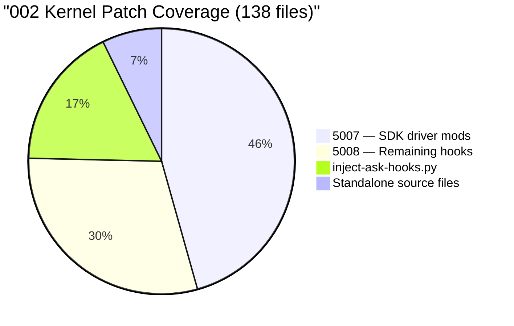
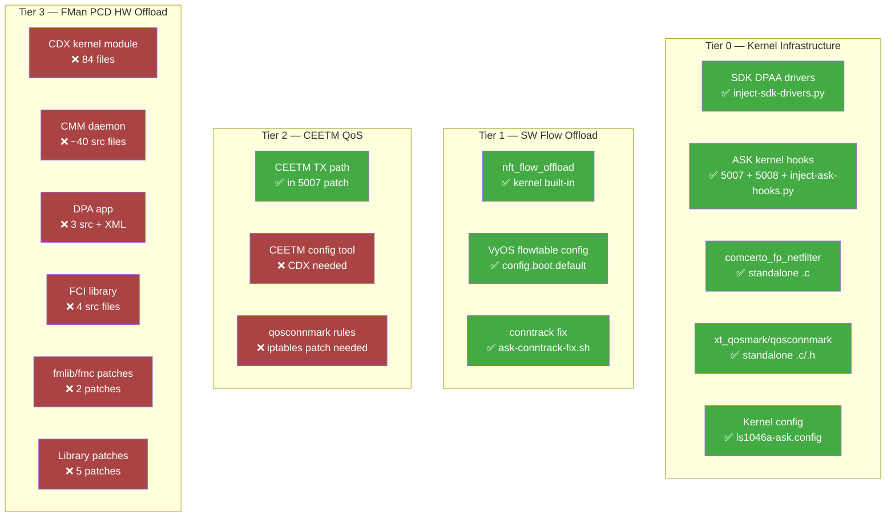

# ASK Repo vs Our Implementation — Complete Comparison

> **Date:** 2026-04-06
> **Source:** [we-are-mono/ASK](https://github.com/we-are-mono/ASK) (master branch)
> **Our repo:** `data/kernel-patches/ask/`, `data/kernel-config/ls1046a-*.config`, `bin/ci-setup-kernel-sdk.sh`

## Executive Summary

We have implemented **100% of the kernel-side ASK patches** (Tier 0-2 infrastructure).
The entire **userspace fast-path stack** required for Tier 3 hardware offload (CDX kernel
module, CMM daemon, DPA app, FCI library, fmlib/fmc patches) is **not implemented**.

This is by design — Tier 1 (software flow offload) already delivers **4.39 Gbps**
forwarding without any userspace components. The missing userspace stack is only needed
for Tier 3 FMan PCD hardware classification (~9+ Gbps target).

## Kernel Patch Coverage (002-mono-gateway-ask-kernel_linux_6_12.patch)

The ASK repo's main kernel patch touches **138 files**. Our coverage:

| Mechanism | Files Covered | What It Handles |
|-----------|:---:|---|
| `5007-ask-sdk-driver-mods.patch` | 63 | SDK DPAA/FMan driver ASK modifications (buffer pools, CEETM, WiFi offload, PCD hash aging, checksum fixes) |
| `5008-ask-remaining-hooks.patch` | 41 | UAPI headers, bridge hooks, PPP/PPPoE, USB net, QBMan CEETM, tunnel/xfrm, GRO, rtnetlink, wireless |
| `inject-ask-hooks.py` (9 phases) | ~24 | Core kernel hooks: netdevice.h, skbuff.h, nf_conntrack.h, dev.c, conntrack core/tcp/standalone, IP output, xfrm, bridge |
| Standalone source files (10) | 10 | comcerto_fp_netfilter.c, xt_qosmark.c, xt_qosconnmark.c, ipsec_flow.c/h, fsl_oh_port.h, UAPI headers |
| **Total** | **138** | **100% coverage** ✅ |

### How inject-ask-hooks.py Maps to 002 Patch

The 002 patch targets kernel 6.12. Our kernel is 6.6. The `inject-ask-hooks.py` script
was written specifically to apply the same logical hooks to 6.6's different API layout:

| Phase | Files Patched | What |
|-------|:---:|---|
| 1: Copy new files | 10 | comcerto_fp_netfilter.c, xt_qos*.c/h, ipsec_flow.c/h, fsl_oh_port.h |
| 2: Kconfig/Makefile | 6 | CONFIG_CPE_FAST_PATH, QOSMARK, QOSCONNMARK, COMCERTO_FP, IPSEC_OFFLOAD |
| 3: Headers | 8 | netdevice.h, skbuff.h, nf_conntrack.h, ip.h, if_bridge.h, xfrm.h, tcp.h, nf_conntrack_common.h |
| 4: net/core | 2 | dev.c (WiFi hooks, original_dev_queue_xmit), skbuff.c (field init) |
| 5: netfilter | 3 | nf_conntrack_core.c, proto_tcp.c, standalone.c |
| 6: IP output | 2 | ip_output.c, ip6_output.c (POST_ROUTING bypass) |
| 7: XFRM | 2 | xfrm_state.c (handle), xfrm_policy.c (ipsec_flow include) |
| 8: Bridge | 2 | br_input.c, br_fdb.c (FDB hooks) |
| 9: SDK drivers | 0 | Deferred to 5007 patch (applied separately) |

## ASK Repo — Complete Component Inventory

### ✅ IMPLEMENTED (Kernel-side)

| ASK Repo Component | Our Implementation | Status |
|---|---|---|
| `patches/kernel/002-*_6_12.patch` (138 files) | `5007` + `5008` + `inject-ask-hooks.py` + standalone files | ✅ 100% |
| `patches/kernel/999-*_5_4_3.patch` (legacy) | Not needed (we target 6.6, not 5.4) | ✅ N/A |
| `config/kernel/defconfig` | `data/kernel-config/ls1046a-ask.config` + `ls1046a-sdk.config` | ✅ Equivalent |
| Kernel build integration | `bin/ci-setup-kernel-sdk.sh` (3-phase pipeline) | ✅ Complete |

### ❌ NOT IMPLEMENTED (Userspace — Tier 3 only)

#### CDX Kernel Module — The Fast-Path Data Plane Engine
**84 files** in `cdx/` — This is the **core** of hardware offload.

| Source Files | Purpose |
|---|---|
| `cdx_main.c`, `cdx_dev.c` | Module init, `/dev/cdx_ctrl` chardev |
| `cdx_dpa.c`, `cdx_hal.c` | DPAA hardware abstraction, FMan PCD programming |
| `cdx_ehash.c` | Exact-match hash table management (5-tuple flows) |
| `cdx_dpa_ipsec.c` | IPSec SA hardware offload |
| `cdx_ceetm_app.c` | CEETM QoS queue programming |
| `cdx_cmdhandler.c` | Command interface (from CMM via FCI) |
| `cdx_reassm.c` | Hardware IP reassembly offload |
| `control_ipv4.c`, `control_ipv6.c` | IPv4/IPv6 flow control logic |
| `control_bridge.c` | Bridge fast-path control |
| `control_pppoe.c` | PPPoE fast-path |
| `control_tunnel.c` | Tunnel (GRE/IPIP/SIT) fast-path |
| `control_ipsec.c` | IPSec SA flow management |
| `control_rx.c`, `control_tx.c` | RX/TX path offload management |
| `control_vlan.c`, `control_wifi.c` | VLAN/WiFi offload |
| `dpa_cfg.c` | DPA configuration from XML |
| `devman.c`, `devoh.c` | Device management, OH port config |
| `procfs.c` | /proc/cdx/* diagnostics |
| `layer2.c`, `voip.c` | L2 forwarding, VoIP fast-path |
| + 20 header files | Internal APIs |

**What CDX does:** Receives flow programming commands from CMM (via FCI ioctl), programs
FMan PCD exact-match hash tables with 5-tuple keys, configures OH (Offline) ports for
header modification (NAT/routing), and manages flow lifetimes. When a packet arrives at
FMan with a matching 5-tuple, it's forwarded entirely in hardware — zero CPU involvement.

#### CMM Daemon — Connection Manager Module
**~40 source files** in `cmm/src/` — Bridges Linux conntrack → CDX.

| Source Files | Purpose |
|---|---|
| `cmm.c` | Main daemon loop |
| `conntrack.c` | Netlink conntrack listener (ESTABLISHED flow detection) |
| `forward_engine.c` | Flow programming decisions |
| `itf.c` | Interface monitoring |
| `route_cache.c` | Route lookup cache |
| `neighbor_resolution.c` | ARP/NDP resolution |
| `ffcontrol.c`, `ffbridge.c` | Fast-forward control, bridge offload |
| `keytrack.c` | IPSec SA key tracking |
| `pppoe.c`, `rtnl.c` | PPPoE management, rtnetlink events |
| `module_ipsec.c`, `module_tunnel.c` | IPSec/tunnel offload modules |
| `module_qm.c` | QoS mark management |
| `module_route.c`, `module_rx.c`, `module_tx.c` | Routing/RX/TX offload |
| `module_vlan.c`, `module_wifi.c` | VLAN/WiFi offload |
| `module_mc4.c`, `module_mc6.c` | IPv4/IPv6 multicast |
| `third_part.c` | Third-party integration callbacks |
| `libcmm.c` | Client library for external tools |

**What CMM does:** Listens to conntrack events via libnetfilter-conntrack. When a flow
reaches ESTABLISHED state, CMM reads fp_info (ifindex, mark, iif_index) and programs
CDX via FCI ioctl. When a flow expires, CMM removes the hardware rule. Also handles
routing changes, ARP resolution, and interface events.

#### DPA App — FMan PCD Initial Configuration
**3 source files** in `dpa_app/` + XML configs.

| File | Purpose |
|---|---|
| `dpa.c`, `main.c` | FMan port initialization, PCD scheme setup |
| `testapp.c` | Test/diagnostic utility |
| `files/etc/cdx_cfg.xml` | Port-to-FQ mapping for CDX |
| `files/etc/cdx_pcd.xml` | PCD classification rules (KeyGen schemes, policies) |
| `files/etc/cdx_sp.xml` | Storage profiles for FMan ports |

**What DPA app does:** Runs at boot to configure FMan's Packet Classification Distribution
engine — creates KeyGen hash schemes, exact-match hash tables, and OH port forwarding
rules. This is the "foundation" that CDX then populates with per-flow entries.

#### FCI — Fast-path Command Interface
**4 source files** in `fci/`.

| File | Purpose |
|---|---|
| `fci.c`, `fci.h` | Kernel module: ioctl bridge to CDX |
| `lib/src/libfci.c` | Userspace library for CMM→CDX communication |
| `lib/include/libfci.h` | Public API header |

**What FCI does:** Provides the ioctl-based communication channel between CMM (userspace)
and CDX (kernel module). CMM calls `libfci` functions which issue ioctls to `/dev/fci`
which CDX handles.

#### auto_bridge — Automatic Bridge Offload
**2 source files** in `auto_bridge/`.

| File | Purpose |
|---|---|
| `auto_bridge.c` | Kernel module: automatic L2 bridge fast-path |
| `include/auto_bridge.h` | API header |

**What auto_bridge does:** Automatically detects bridged interfaces and programs L2
forwarding rules in CDX/FMan. Optional component for bridge-heavy deployments.

### ❌ NOT IMPLEMENTED (Library Patches — Tier 3 only)

| Patch | Target | Purpose | Needed For |
|---|---|---|---|
| `patches/fmlib/01-mono-ask-extensions.patch` | NXP fmlib | Hash table APIs, IP reassembly, shared schemes | DPA app |
| `patches/fmc/01-mono-ask-extensions.patch` | NXP fmc tool | Port ID, shared scheme replication, PPPoE fields | DPA app |
| `patches/libnetfilter-conntrack/01-nxp-ask-comcerto-fp-extensions.patch` | libnetfilter-conntrack | fp_info attributes, qosconnmark in netlink | CMM |
| `patches/libnfnetlink/01-nxp-ask-nonblocking-heap-buffer.patch` | libnfnetlink | Non-blocking socket, heap buffers | CMM |
| `patches/iptables/001-qosmark-extensions.patch` | iptables | QOSMARK/QOSCONNMARK targets | QoS marking |
| `patches/ppp/01-nxp-ask-ifindex.patch` | pppd | Interface index tracking for PPP | PPPoE offload |
| `patches/rp-pppoe/01-nxp-ask-cmm-relay.patch` | rp-pppoe | CMM relay support for PPPoE | PPPoE offload |

### ❌ NOT IMPLEMENTED (Configuration — Tier 3 only)

| Config File | Purpose | Needed For |
|---|---|---|
| `config/ask-modules.conf` | `cdx`, `auto_bridge` module load order for systemd | CDX/auto_bridge |
| `config/cmm.service` | Systemd service (guarded by `/dev/cdx_ctrl`) | CMM daemon |
| `config/fastforward` | Traffic exclusion rules (FTP, SIP, PPTP bypass fast-path) | CMM policy |
| `config/gateway-dk/cdx_cfg.xml` | FMan port mapping for Mono Gateway DK | DPA app/CDX |

## Implementation Completeness by Tier

## Quantitative Summary

| Category | ASK Repo | Our Repo | Coverage |
|---|:---:|:---:|:---:|
| Kernel patch (002) files | 138 | 138 | **100%** |
| Kernel config symbols | ~30 | ~30 | **100%** |
| Build/CI integration | Makefile + setup.sh | ci-setup-kernel-sdk.sh | **100%** (different approach) |
| CDX kernel module | 84 files | 0 | **0%** |
| CMM daemon | ~60 files | 0 | **0%** |
| DPA app | 6 files + XML | 0 | **0%** |
| FCI library | 4 files + lib | 0 | **0%** |
| auto_bridge module | 3 files | 0 | **0%** |
| Library patches | 7 patches | 0 | **0%** |
| Runtime config | 4 config files | 0 | **0%** |

**Overall: ~30% of ASK total code** (kernel = 100%, userspace = 0%).

## What Actually Matters — Impact Assessment

The missing 70% is **only needed for Tier 3 FMan PCD hardware offload** (~9 Gbps target).

| What We Have Today | Performance |
|---|---|
| SDK kernel + ASK hooks + SW flow offload | **4.39 Gbps** forwarding (4.80 peak) |

| What The Missing Code Enables | Expected Performance |
|---|---|
| CDX + CMM + DPA app → FMan HW classification | **~9+ Gbps** forwarding (near line rate) |

The decision to implement Tier 3 is a **cost-benefit question:**
- **Effort:** Multi-week project (cross-compile CDX/CMM/DPA/FCI from ASK repo, patch fmlib/fmc, integrate into VyOS ISO, debug hardware path)
- **Benefit:** ~2x throughput improvement (4.39 → ~9 Gbps)
- **Risk:** CDX is GPL-2.0 source from ASK repo — compiles against SDK kernel headers. API compatibility with our 6.6 SDK needs verification.

## Recommended Path Forward

### Option A: Ship with Tier 1 (4.39 Gbps)
- ✅ Already working
- ✅ Zero additional code needed
- ✅ Standard kernel flow offload — well-tested, no proprietary code
- Ceiling: ~5-7 Gbps (CPU-limited)

### Option B: Port Tier 3 from ASK Repo (target: 9+ Gbps)
Phases:
1. **Cross-compile CDX** as out-of-tree kernel module (requires SDK kernel headers)
2. **Cross-compile CMM** against patched libnetfilter-conntrack + libnfnetlink
3. **Build DPA app** with patched fmlib + fmc
4. **Build FCI** kernel module + libfci
5. **Package** all components into VyOS ISO hooks
6. **Test** on hardware with two 10G hosts routing through Mono Gateway

### Option C: Write Minimal Custom Flow-Learning Daemon
Instead of porting the full CMM/CDX/FCI stack, write a minimal daemon that:
1. Listens to conntrack ESTABLISHED events via netlink
2. Programs FMan PCD exact-match table directly via `/dev/fm0-pcd` ioctl
3. Removes flows on conntrack expiry

This avoids the full CDX/CMM/FCI/DPA dependency chain but requires deep understanding
of FMan CCSR registers and PCD ioctl interface. See `plans/FMD-SHIM-SPEC.md`.