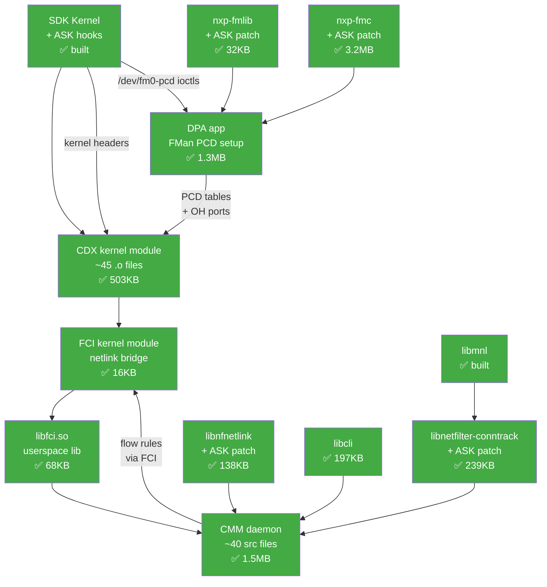
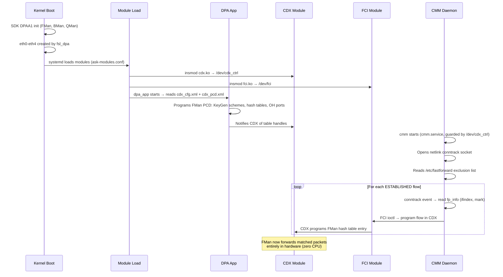

# ASK Userspace Implementation — Preparation Plan

> **Date:** 2026-04-07 (all userspace phases complete)
> **Prerequisite:** `plans/ASK-REPO-COMPARISON.md` (complete inventory of what's missing)
> **Goal:** Build ASK userspace components for hardware flow offloading

## Current State

**Kernel: ready ✅** — SDK + ASK hooks compile and run. SW flow offload gives 4.39 Gbps.

**Userspace: ALL phases complete ✅** — CDX, FCI, libraries, fmlib, fmc, DPA app, and CMM all built.

## Build Artifacts Summary

| Artifact | Type | Size | Status |
|----------|------|------|--------|
| `ASK/cdx/cdx.ko` | Kernel module (AArch64) | 503 KB | ✅ built |
| `ASK/fci/fci.ko` | Kernel module (AArch64) | 16 KB | ✅ built |
| `ASK/fci/lib/libfci.so.0.1` | Shared library (AArch64) | 68 KB | ✅ built |
| `ASK/fci/lib/libfci.a` | Static archive (AArch64) | 5.9 KB | ✅ built |
| Sysroot `libnfnetlink.so.0.2.0` | Shared library (AArch64) | 138 KB | ✅ patched + built |
| Sysroot `libmnl.so.0.2.0` | Shared library (AArch64) | — | ✅ built |
| Sysroot `libnetfilter_conntrack.so.3.8.0` | Shared library (AArch64) | 239 KB | ✅ patched + built |
| Sysroot `libcli.so.1.10.8` | Shared library (AArch64) | 197 KB | ✅ built |
| Sysroot `libfm.a` (fmlib) | Static archive (AArch64) | 32 KB | ✅ patched + built |
| `nxp-fmc/source/libfmc.a` | Static archive (AArch64) | 3.2 MB | ✅ patched + built |
| `nxp-fmc/source/fmc` | Binary (AArch64) | 1.4 MB | ✅ built |
| `ASK/dpa_app/dpa_app` | Daemon binary (AArch64) | 1.3 MB | ✅ built |
| `ASK/cmm/src/.libs/cmm` | Daemon binary (AArch64) | 1.5 MB | ✅ built |
| `ASK/cmm/src/.libs/libcmm.so.0.0.0` | Shared library (AArch64) | — | ✅ built |

Cross-compile sysroot: `/opt/vyos-dev/ask-sysroot/usr/{lib,include}/`

## Workspace Repos (all cloned ✅)

| Repo | Path | Remote | Branch |
|------|------|--------|--------|
| ASK | `ASK/` | `mihakralj/ASK.git` | `master` |
| nxp-fmlib | `nxp-fmlib/` | `nxp-qoriq/fmlib.git` | `master` |
| nxp-fmc | `nxp-fmc/` | `nxp-qoriq/fmc.git` | `master` |
| libcli | `libcli/` | `dparrish/libcli.git` | `stable` |
| nxp-linux | `nxp-linux/` | `nxp-qoriq/linux.git` | `lf-6.6.y` |
| libmnl | `/opt/vyos-dev/libmnl/` | `git.netfilter.org/libmnl` | `master` |
| libnfnetlink | `/opt/vyos-dev/libnfnetlink/` | `git.netfilter.org/libnfnetlink` | `master` |
| libnetfilter-conntrack | `/opt/vyos-dev/libnetfilter-conntrack/` | `git.netfilter.org/libnetfilter_conntrack` | `master` |

All ASK-related paths relative to `/root/vyos-ls1046a-build/`. The kernel build tree is at `/opt/vyos-dev/linux/` on LXC 200.

## Component Dependency Chain



## Boot-time Sequence



## Preparation Checklist

### Phase 0: Infrastructure ✅ done

- [x] **ASK repo cloned** — `ASK/` (mihakralj/ASK.git, master)
- [x] **NXP fmlib cloned** — `nxp-fmlib/` (nxp-qoriq/fmlib.git, master)
- [x] **NXP fmc cloned** — `nxp-fmc/` (nxp-qoriq/fmc.git, master)
- [x] **libcli cloned** — `libcli/` (dparrish/libcli.git, stable)
- [x] **NXP Linux reference cloned** — `nxp-linux/` (nxp-qoriq/linux.git, lf-6.6.y)
- [x] **Kernel headers verified** — `Module.symvers` and `.config` exist in `/opt/vyos-dev/linux/`
- [x] **Cross-compile toolchain** — `gcc-aarch64-linux-gnu` + autotools installed on LXC 200

### Phase 1: CDX Kernel Module ✅ done

**What:** Core fast-path engine. Programs FMan PCD hash tables.

- [x] **Cross-compile CDX** as out-of-tree module → `cdx.ko` (503 KB, ELF64 AArch64)
  ```bash
  cd ASK/cdx
  make CROSS_COMPILE=aarch64-linux-gnu- ARCH=arm64 KERNELDIR=/opt/vyos-dev/linux modules
  ```

- [x] **Source fixes required** (kernel 6.6 compat):
  - `dpa_ipsec.c`: Stubbed `xfrm_state_lookup_byhandle()` (ASK-specific xfrm extension absent), added `_MODULE` guard variants for `CONFIG_INET_IPSEC_OFFLOAD`
  - `dpa_wifi.c`: Shimmed `skb->expt_pkt` via `cb[47]` (ASK sk_buff field not in our kernel), fixed `dpa_add_dummy_eth_hdr` prototype (4-param→3-param)
  - `devman.c`: Stubbed `dev_fp_stats_get_{de,}register()`, added `__maybe_unused` to callback
  - `version.h`: Created with `CDX_VERSION "ask-mono-1.0"`

- [x] **Kernel tree fixes** (in `/opt/vyos-dev/linux/`):
  - `include/linux/netdevice.h`: Fixed `dpa_add_dummy_eth_hdr` prototype to 3-param (matches `dpaa_eth_sg.c`)
  - `net/core/dev.c`: Removed duplicate 4-param `dpa_add_dummy_eth_hdr` implementation from ASK hook injector
  - `sdk_dpaa/dpaa_eth_sg.c`: Added `IPSEC_OFFLOAD` exclusion guard for conflicting stubs
  - `sdk_fman/Peripherals/FM/Pcd/fm_cc.c`: Removed duplicate `ExternalHashTableAddKey` / `ExternalHashTableModifyMissNextEngine` stubs (real implementations in `fm_ehash.c`)
  - `sdk_fman/Peripherals/FM/Pcd/Makefile`: Added `fm_ehash.o` to build
  - SDK headers (6 files): Added `_MODULE` guard variants for `CONFIG_INET_IPSEC_OFFLOAD`

- [x] **Build verified** — 231 undefined symbols (all kernel exports resolvable at load time), only benign section mismatch WARNING in modpost
- [x] **ExternalHashTable symbols confirmed** — 6 symbols exported from vmlinux via `Module.symvers`

- [ ] **Test load on device** — pending
  ```bash
  scp ASK/cdx/cdx.ko root@192.168.1.102:/tmp/
  ssh root@192.168.1.102 "insmod /tmp/cdx.ko && ls /dev/cdx_ctrl"
  ```

### Phase 2: FCI Module + Library ✅ done

**What:** Netlink bridge between CMM (userspace) and CDX (kernel).

- [x] **Cross-compile FCI kernel module** → `fci.ko` (16 KB, ELF64 AArch64)
  ```bash
  cd ASK/fci
  make KERNEL_SOURCE=/opt/vyos-dev/linux BOARD_ARCH=arm64 \
    CROSS_COMPILE=aarch64-linux-gnu- \
    KBUILD_EXTRA_SYMBOLS="$PWD/../cdx/Module.symvers" modules
  ```
  No source fixes needed. Clean build, zero warnings.

- [x] **Cross-compile libfci** → `libfci.so.0.1` (68 KB) + `libfci.a` (5.9 KB)
  ```bash
  cd ASK/fci/lib
  aarch64-linux-gnu-gcc -fPIC -Wall -I./include -c src/libfci.c -o src/libfci.o
  aarch64-linux-gnu-gcc -shared -Wl,-soname,libfci.so.0 -o libfci.so.0.1 src/libfci.o -nostartfiles
  ln -sf libfci.so.0.1 libfci.so.0 && ln -sf libfci.so.0 libfci.so
  aarch64-linux-gnu-ar rcs libfci.a src/libfci.o
  ```
  Note: Original autotools `-Wc,-nostartfiles` doesn't work with newer ld; use `-nostartfiles` directly on gcc.
  
  Exported symbols: `fci_open`, `fci_close`, `fci_cmd`, `fci_write`, `fci_query`, `fci_catch`, `fci_register_cb`, `fci_fd`

### Phase 3: Patch + Build Userspace Libraries ✅ done

**What:** CMM needs patched versions of libnetfilter-conntrack, libnfnetlink, libmnl, and libcli.

All libraries cross-compiled and installed to sysroot at `/opt/vyos-dev/ask-sysroot/usr/`.

- [x] **Build libmnl** (dependency of libnetfilter-conntrack, no patch needed)
  ```bash
  cd /opt/vyos-dev && git clone --depth 1 https://git.netfilter.org/libmnl libmnl
  cd libmnl && autoreconf -fi
  ./configure --host=aarch64-linux-gnu --prefix=/opt/vyos-dev/ask-sysroot/usr
  make -j$(nproc) && make install
  ```
  → `libmnl.so.0.2.0` installed to sysroot

- [x] **Patch + build libnfnetlink**
  ```bash
  cd /opt/vyos-dev && git clone --depth 1 https://git.netfilter.org/libnfnetlink libnfnetlink
  cd libnfnetlink
  patch -p1 --no-backup-if-mismatch < /root/vyos-ls1046a-build/ASK/patches/libnfnetlink/01-nxp-ask-nonblocking-heap-buffer.patch
  autoreconf -fi
  ./configure --host=aarch64-linux-gnu --prefix=/opt/vyos-dev/ask-sysroot/usr
  make -j$(nproc) && make install
  ```
  Patch applied cleanly (one hunk offset +1). Adds `MSG_DONTWAIT` to `nfnl_recv_peek()`, heap buffer validation, NULL check on `malloc()`.
  → `libnfnetlink.so.0.2.0` (138 KB) installed to sysroot

- [x] **Patch + build libnetfilter-conntrack**
  ```bash
  cd /opt/vyos-dev && git clone --depth 1 https://git.netfilter.org/libnetfilter_conntrack libnetfilter-conntrack
  cd libnetfilter-conntrack
  patch -p1 --no-backup-if-mismatch < /root/vyos-ls1046a-build/ASK/patches/libnetfilter-conntrack/01-nxp-ask-comcerto-fp-extensions.patch
  # 3 hunks fail — apply manually (see below)
  autoreconf -fi
  ./configure --host=aarch64-linux-gnu --prefix=/opt/vyos-dev/ask-sysroot/usr \
    CFLAGS="-I/opt/vyos-dev/ask-sysroot/usr/include" \
    LDFLAGS="-L/opt/vyos-dev/ask-sysroot/usr/lib" \
    LIBNFNETLINK_CFLAGS="-I/opt/vyos-dev/ask-sysroot/usr/include" \
    LIBNFNETLINK_LIBS="-L/opt/vyos-dev/ask-sysroot/usr/lib -lnfnetlink" \
    LIBMNL_CFLAGS="-I/opt/vyos-dev/ask-sysroot/usr/include" \
    LIBMNL_LIBS="-L/opt/vyos-dev/ask-sysroot/usr/lib -lmnl" \
    --disable-static
  make -j$(nproc) && make install
  ```
  
  **3 rejected hunks** (upstream enum offsets shifted) — fixed manually with `sed`:
  1. `libnetfilter_conntrack.h`: Added 13 `ATTR_*_COMCERTO_FP_*` enum entries + `ATTR_QOSCONNMARK` before `ATTR_MAX`
  2. `linux_nfnetlink_conntrack.h`: Added `CTA_LAYERSCAPE_FP_ORIG`, `CTA_LAYERSCAPE_FP_REPLY`, `CTA_QOSCONNMARK`, `CTA_QOSCONNMARK_PAD` before `__CTA_MAX`
  3. `getter.c`: Added 13 `get_attr_*_comcerto_fp_*` + `get_attr_qosconnmark` array entries after `ATTR_SYNPROXY_TSOFF`
  
  → `libnetfilter_conntrack.so.3.8.0` (239 KB) installed to sysroot

- [x] **Cross-compile libcli** (CMM CLI dependency)
  ```bash
  cd /root/vyos-ls1046a-build/libcli
  make CC=aarch64-linux-gnu-gcc PREFIX=/opt/vyos-dev/ask-sysroot/usr
  make CC=aarch64-linux-gnu-gcc PREFIX=/opt/vyos-dev/ask-sysroot/usr install
  ```
  → `libcli.so.1.10.8` (197 KB) installed to sysroot

- [x] **Install libfci to sysroot** — headers already available at `ASK/fci/lib/include/`

### Phase 4: Build CMM Daemon ✅ done

**What:** Bridges Linux conntrack → CDX flow rules via FCI netlink.

- [x] **Cross-compile CMM** → `cmm` (1.5 MB, ELF64 AArch64) + `libcmm.so.0.0.0`
  ```bash
  cd /root/vyos-ls1046a-build/ASK/cmm
  # Create version.h
  cat > src/version.h << 'EOF'
  /*Auto-generated file. Do not edit !*/
  #ifndef VERSION_H
  #define VERSION_H
  #define CMM_VERSION "ask-mono-1.0"
  #endif /* VERSION_H */
  EOF
  # Update config.sub/config.guess for aarch64 support
  cp /usr/share/automake-1.16/config.sub config.sub
  cp /usr/share/automake-1.16/config.guess config.guess
  # Install libpcap:arm64 (CMM dependency)
  apt-get install -y libpcap-dev:arm64
  # Configure — CRITICAL: -DLS1043 selects LS1043/LS1046A code paths in fpp.h
  SYSROOT=/opt/vyos-dev/ask-sysroot
  ./configure --host=aarch64-linux-gnu \
    CFLAGS="-O2 -g -Wall -DLS1043 \
      -I${SYSROOT}/usr/include \
      -I/root/vyos-ls1046a-build/ASK/auto_bridge/include \
      -I/root/vyos-ls1046a-build/ASK/cmm/src" \
    LDFLAGS="-L${SYSROOT}/usr/lib -L/usr/lib/aarch64-linux-gnu" \
    LIBNFCONNTRACK_CFLAGS="-I${SYSROOT}/usr/include" \
    LIBNFCONNTRACK_LIBS="-L${SYSROOT}/usr/lib -lnetfilter_conntrack -lnfnetlink" \
    --prefix=/usr
  # Drop -Werror (newer GCC produces packed-member alignment warnings)
  sed -i 's/-Werror//g' src/Makefile
  make -j$(nproc)
  # Binary at src/.libs/cmm, library at src/.libs/libcmm.so.0.0.0
  ```

  **Build fixes required:**
  - Outdated `config.sub` didn't recognize `aarch64` — replaced with system copy
  - Missing `-DLS1043` — `fpp.h` has 40+ `#ifdef LS1043` guards for the LS1043/LS1046A
    DPAA1 platform code (struct definitions, QoS commands, socket extensions)
  - `-Werror` removed — ~30 `-Waddress-of-packed-member` warnings from packed FPP command structs
  - `auto_bridge.h` header at `ASK/auto_bridge/include/` — needed via `-I` flag
  - `libpcap-dev:arm64` needed for packet capture module

  **Dependencies** (all in sysroot):
  - libfci (FCI netlink client) — installed to sysroot from `ASK/fci/lib/`
  - libcli (telnet CLI for runtime control)
  - libnetfilter-conntrack (conntrack event listening)
  - libnfnetlink (netfilter netlink transport)
  - libpcap (packet capture)

### Phase 5: Build DPA App + fmlib/fmc ✅ done

**What:** Initial FMan PCD configuration (programs KeyGen hash tables at boot).

- [x] **Patch + build fmlib** → `libfm-arm.a` / `libfm.a` (32 KB)
  ```bash
  cd /root/vyos-ls1046a-build/nxp-fmlib
  patch -p1 --no-backup-if-mismatch < ASK/patches/fmlib/01-mono-ask-extensions.patch
  make KERNEL_SRC=/opt/vyos-dev/linux CROSS_COMPILE=aarch64-linux-gnu- libfm-arm.a
  make KERNEL_SRC=/opt/vyos-dev/linux CROSS_COMPILE=aarch64-linux-gnu- \
    DESTDIR=/opt/vyos-dev/ask-sysroot PREFIX=/usr install-libfm-arm
  ```
  Patch adds `FM_ReadTimeStamp`, hash table extensions for CDX.

- [x] **Patch + build fmc** → `libfmc.a` (3.2 MB) + `fmc` binary (1.4 MB)
  ```bash
  cd /root/vyos-ls1046a-build/nxp-fmc
  # Fix CRLF line endings in source (Windows-originating repo)
  find source/ -name "*.cpp" -o -name "*.h" | xargs sed -i 's/\r$//'
  patch -p1 --no-backup-if-mismatch < ASK/patches/fmc/01-mono-ask-extensions.patch
  # Install cross-compile C++ toolchain + arm64 libxml2
  apt-get install -y g++-aarch64-linux-gnu libxml2-dev:arm64 libtclap-dev
  # Build libfmc.a
  cd source
  make CXX=aarch64-linux-gnu-g++ CC=aarch64-linux-gnu-gcc AR=aarch64-linux-gnu-ar \
    FMD_USPACE_HEADER_PATH=/opt/vyos-dev/ask-sysroot/usr/include/fmd \
    FMD_USPACE_LIB_PATH=/opt/vyos-dev/ask-sysroot/usr/lib \
    LIBXML2_HEADER_PATH=/usr/include/libxml2 TCLAP_HEADER_PATH=/usr/include
  # Link fmc binary (libfmc.a is C++, needs -lstdc++)
  aarch64-linux-gnu-g++ -L. -L/opt/vyos-dev/ask-sysroot/usr/lib \
    -o fmc FMC.o FMCUtils.o FMCGenericError.o libfmc.a -lfm -lxml2 -lm
  ```
  Patch adds portid, shared scheme replication, PPPoE nextp fix, libxml2 API compat.

- [x] **Build DPA app** → `dpa_app` (1.3 MB)
  ```bash
  cd /root/vyos-ls1046a-build/ASK/dpa_app
  FMD=/opt/vyos-dev/ask-sysroot/usr/include/fmd
  make CC=aarch64-linux-gnu-gcc \
    CFLAGS="-DDPAA_DEBUG_ENABLE -DNCSW_LINUX \
      -I../cdx -I../../nxp-fmc/source \
      -I${FMD} -I${FMD}/integrations -I${FMD}/Peripherals -I${FMD}/Peripherals/common \
      -I/opt/vyos-dev/ask-sysroot/usr/include" \
    LDFLAGS="-L/opt/vyos-dev/ask-sysroot/usr/lib -L../../nxp-fmc/source \
      -lpthread -lcli -lfmc -lfm -lxml2 -lm -lstdc++"
  ```

  **Build fixes required:**
  - `-DNCSW_LINUX` — without it, `types_ext.h` falls through to `#include "types_bb_gcc.h"` (non-existent).
    With `-DNCSW_LINUX`, it includes `types_linux.h` (correct for userspace on Linux).
  - FMD include subdirs — fmc's Makefile uses `-I.../fmd/integrations`, `-I.../fmd/Peripherals`,
    `-I.../fmd/Peripherals/common`. DPA app needs the same paths for `part_ext.h` etc.
  - `-lstdc++` — `libfmc.a` is compiled from C++ sources, so the C linker needs explicit C++ stdlib.
  - CRLF line endings in nxp-fmc source — `sed -i 's/\r$//'` before patching.

### Phase 6: Integration into VyOS ISO

- [ ] **Create live-build hook** (`data/hooks/97-ask-userspace.chroot`)
  - Installs cdx.ko, fci.ko into `/lib/modules/$(uname -r)/extra/`
  - Installs cmm, dpa_app binaries into `/usr/local/bin/`
  - Installs libfci.so, patched libs into `/usr/local/lib/`
  - Installs XML configs into `/etc/ask/`
  - Installs config files (ask-modules.conf, cmm.service, fastforward)
  - Runs `depmod -a`

- [ ] **Add CI build step** for ASK userspace
  - Could be a separate `bin/ci-build-ask-userspace.sh` script
  - Runs in the VyOS builder container after kernel build (needs kernel headers)

- [ ] **Test on device** — full boot sequence:
  1. Kernel boots with SDK + ASK hooks
  2. `ask-modules.conf` loads cdx.ko, fci.ko
  3. `dpa_app` runs, programs FMan PCD tables
  4. `cmm.service` starts, begins flow learning
  5. Forward traffic through device, verify hardware offloaded packets

## Effort Estimate (Final)

| Phase | Effort | Risk | Status |
|-------|--------|------|--------|
| Phase 0: Infrastructure | ✅ done | — | ✅ |
| Phase 1: CDX module | ~4 hours (many source fixes) | Resolved | ✅ |
| Phase 2: FCI module + lib | ~30 min | None | ✅ |
| Phase 3: Library patches | ~2 hours (3 reject fixes, libmnl dep) | Resolved | ✅ |
| Phase 4: CMM daemon | ~2 hours (config.sub, -DLS1043, -Werror) | Resolved | ✅ |
| Phase 5: DPA app + fmlib/fmc | ~3 hours (NCSW_LINUX, FMD paths, CRLF, lstdc++) | Resolved | ✅ |
| Phase 6: ISO integration | 1 day | Low — standard live-build hooks | ← next |
| **Remaining** | **~1 day** | | |

## Known Risks

1. ~~**nxp-fmc build system**~~ — **RESOLVED.** Has `source/Makefile` with standard `make` targets.
   Builds `libfmc.a` natively; `fmc` binary requires manual link step with `-lstdc++`.

2. **DPA app XML format** — The `cdx_cfg.xml` and `cdx_pcd.xml` reference specific
   FMan port IDs and Queue IDs. These must match the Mono Gateway board's actual
   FMan topology (cell-index values in DTS).

3. **CMM conntrack attribute format** — The patched libnetfilter-conntrack adds
   `CTA_LAYERSCAPE_FP_ORIG/REPLY` netlink attributes. The kernel-side code for this is in
   `5008-ask-remaining-hooks.patch` (nf_conntrack_netlink.c). Attribute IDs must
   match between kernel and library.

4. ~~**CMM autotools build**~~ — **RESOLVED.** Required `-DLS1043` for platform code paths,
   updated `config.sub`/`config.guess` for aarch64, removed `-Werror`. Builds cleanly
   with ~30 benign packed-member warnings.

5. **ASK patches vs repo versions** — ASK patches in `ASK/patches/` target specific
   upstream versions. libnetfilter-conntrack patch required 3 manual fixes due to
   upstream enum shifts. fmlib/fmc patches may need similar adjustments.

## Lessons Learned (Phase 1-3)

1. **CDX needs `KBUILD_EXTRA_SYMBOLS` from vmlinux** — The ExternalHash* functions are exported by the SDK FMan driver built into vmlinux, accessible via `/opt/vyos-dev/linux/Module.symvers`.

2. **FCI needs CDX's `Module.symvers`** — FCI depends on `comcerto_fpp_send_command` and `comcerto_fpp_register_event_cb` exported by CDX. Pass via `KBUILD_EXTRA_SYMBOLS`.

3. **`CONFIG_INET_IPSEC_OFFLOAD=m` creates surprising defines** — `#defined(CONFIG_INET_IPSEC_OFFLOAD)` is FALSE but `#defined(CONFIG_INET_IPSEC_OFFLOAD_MODULE)` is TRUE. Many SDK headers only check the former, requiring `_MODULE` guard additions.

4. **SDK `fsl_mac` 4-param vs 3-param `dpa_add_dummy_eth_hdr`** — The ASK hook injector created a 4-param version in `dev.c` but the real implementation in `dpaa_eth_sg.c` is 3-param. Must keep kernel header prototype synchronized.

5. **libnetfilter-conntrack patch rejects are enum-position-dependent** — Upstream adds new enum values between releases, shifting positions. All 3 rejects were "add before MAX/end" hunks where the context lines shifted. Fix with `sed` insertion before the sentinel.

6. **Autotools cross-compile needs explicit `_CFLAGS`/`_LIBS` overrides** — pkg-config finds host libraries, not cross-target. Must pass `LIBMNL_CFLAGS`, `LIBNFNETLINK_CFLAGS` etc. explicitly to `./configure`.

## Lessons Learned (Phase 4-5)

7. **CMM requires `-DLS1043`** — `fpp.h` has 40+ `#ifdef LS1043` guards that select DPAA1-specific struct layouts for QoS, socket, multicast, and flow commands. Without it, most FPP command types are undefined. LS1046A uses the same code paths as LS1043.

8. **CMM `config.sub` is too old for aarch64** — The bundled autotools files are from ~2008 (automake-1.10). Replace `config.sub` and `config.guess` with system copies from `/usr/share/automake-1.16/`.

9. **CMM `-Werror` must be removed** — GCC 12 produces ~30 `-Waddress-of-packed-member` warnings from FPP packed command structs. These are harmless on AArch64 (which handles unaligned access). Strip via `sed -i 's/-Werror//g' src/Makefile` after configure.

10. **`-DNCSW_LINUX` is mandatory for fmlib/fmc/dpa_app** — The NCSW framework's `types_ext.h` uses a preprocessor cascade. Without `NCSW_LINUX`, plain GCC falls through to `types_bb_gcc.h` (bare-metal header that doesn't exist). Both fmlib and fmc Makefiles define it; DPA app must add it manually.

11. **FMD include subdirectories are hierarchical** — fmc's Makefile uses `-I.../fmd/integrations` and `-I.../fmd/Peripherals`. The DPA app Makefile doesn't include them. Headers like `part_ext.h` (in `integrations/`) and FM PCD headers (in `Peripherals/`) require explicit `-I` paths.

12. **`libfmc.a` is C++ — needs `-lstdc++`** — fmc is built from `.cpp` files. When linking the C `dpa_app` against `libfmc.a`, the C linker doesn't pull in the C++ standard library automatically. Add `-lstdc++` explicitly to LDFLAGS.

13. **nxp-fmc has CRLF line endings** — The repo originates from Windows. `sed -i 's/\r$//'` on all `.cpp`/`.h` files before applying patches, otherwise `patch` fails with "corrupt patch" errors.

14. **`auto_bridge.h` lives outside CMM tree** — CMM includes `<auto_bridge.h>` but the header is at `ASK/auto_bridge/include/`. Must add that directory to CFLAGS via `-I`.

15. **libtool puts binaries in `.libs/`** — CMM's autotools build with libtool creates the actual ELF binary at `src/.libs/cmm` (not `src/cmm`). The `src/cmm` file is a libtool wrapper script.

## Alternative: Minimal Custom Daemon (Skip Phases 4-5)

Instead of porting the full CMM/FCI/DPA stack, write a minimal daemon that:
1. Uses standard `libmnl` to listen to conntrack events
2. Programs FMan PCD directly via `/dev/fm0-pcd` ioctls (bypassing CDX/FCI)
3. Uses the FMD shim (`data/kernel-patches/fsl_fmd_shim.c`) for ioctl access

**Pros:** Fewer dependencies, no fmlib/fmc needed, no patched libraries
**Cons:** Must understand FMan CCSR register layout, no CDX flow management, no OH port NAT
**Effort:** ~2 weeks for a minimal prototype (without NAT rewrite — forwarding only)

See `plans/FMD-SHIM-SPEC.md` for the ioctl interface specification.