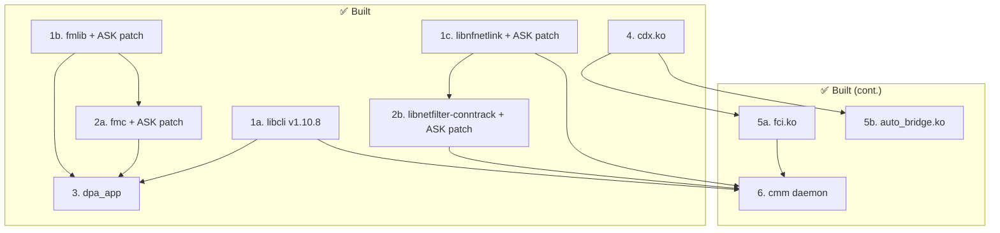
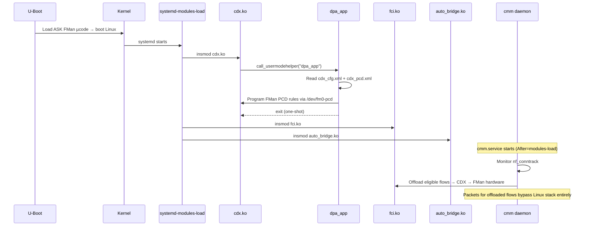

# ASK Userspace Components — Build & Integration Plan

## Completed

- ✅ **1a. libcli** — v1.10.8 → `data/ask-userspace/libcli/` — see [README](../data/ask-userspace/libcli/README.md)
- ✅ **1b. fmlib** — lf-6.18.2-1.0.0 + ASK patch → `data/ask-userspace/fmlib/` — see [README](../data/ask-userspace/fmlib/README.md)
- ✅ **1c. libnfnetlink** — v1.0.2 + ASK patch → `data/ask-userspace/libnfnetlink/` — see [README](../data/ask-userspace/libnfnetlink/README.md)
- ✅ **2a. fmc** — lf-6.18.2-1.0.0 + ASK patch → `data/ask-userspace/fmc/` — see [README](../data/ask-userspace/fmc/README.md)
- ✅ **2b. libnetfilter-conntrack** — v1.0.9 + ASK patch → `data/ask-userspace/libnetfilter-conntrack/` — see [README](../data/ask-userspace/libnetfilter-conntrack/README.md)
- ✅ **3. dpa_app** — cross-compiled → `data/ask-userspace/dpa_app/` — see [README](../data/ask-userspace/dpa_app/README.md)
- ✅ **4. cdx.ko** — cross-compiled (42 .o, -Werror clean) → `data/ask-userspace/cdx/` — see [README](../data/ask-userspace/cdx/README.md)
- ✅ **5a. fci.ko** — cross-compiled (depends: cdx) → `data/ask-userspace/fci/` — see [README](../data/ask-userspace/fci/README.md)
- ✅ **5b. auto_bridge.ko** — cross-compiled (depends: cdx, bridge) → `data/ask-userspace/auto_bridge/` — see [README](../data/ask-userspace/auto_bridge/README.md)
- ✅ **6. cmm** — cross-compiled daemon (40 .o, manual link) → `data/ask-userspace/cmm/` — see [README](../data/ask-userspace/cmm/README.md)
- ✅ **Prerequisite: ASK-Enabled FMan Microcode** — v210.10.1, chardevs present

All libraries and binaries cross-compiled on Debian 12 (x86_64) with `aarch64-linux-gnu-gcc` 12.2.0-14. Build details in each component's README.md.

---

## Status: Kernel Ready, Userspace Built

The ASK kernel infrastructure is operational on the Mono Gateway (kernel 6.6.129 on `ask` branch):
- `fp_netfilter`: hooks registered + conntrack force-enabled ✅
- `ipsec_flow`: initialized ✅
- CAAM crypto: Era 8, 82 algorithms registered ✅
- SDK DPAA: all 5 FMan interfaces UP ✅
- FMan µcode v210.10.1 (ASK-enabled) ✅
- FMan chardevs: `/dev/fm0`, `/dev/fm0-pcd`, 4 OH ports, 5 RX ports, 8 TX ports — all present ✅

| Item | Detail |
|------|--------|
| **CDX status** | `/dev/cdx_ctrl` created by `cdx.ko` ✅ (timer Oops without full stack — see cdx README) |

---

## Remaining Build Steps

### Step 5 — Dependent kernel modules

#### 5a. fci.ko

| Field | Value |
|-------|-------|
| Source | `ASK/fci/` |
| Depends on | `cdx.ko` (Module.symvers) |
| Output | `fci.ko` |
| Creates | FCI netlink interface for CMM |
| Install to | `/lib/modules/$(uname -r)/extra/fci.ko` |

#### 5b. auto_bridge.ko

| Field | Value |
|-------|-------|
| Source | `ASK/auto_bridge/` |
| Depends on | `cdx.ko` (Module.symvers) |
| Output | `auto_bridge.ko` |
| Purpose | Monitors bridge ports, notifies CDX of L2 offloadable flows |
| Install to | `/lib/modules/$(uname -r)/extra/auto_bridge.ko` |

### Step 6 — cmm (Connection Manager Module daemon)

| Field | Value |
|-------|-------|
| Source | `ASK/cmm/` (autotools) |
| Depends on | `libfci` (from fci source), `libnetfilter-conntrack` (patched) ✅, `libnfnetlink` (patched) ✅, `libcli` ✅ |
| Build | `./configure && make` |
| Output | `cmm` daemon binary |
| Install to | `/usr/local/sbin/cmm` |
| Creates | `/proc/fast_path`, `/proc/memory_manager` |
| Service | `ASK/config/cmm.service` → `/etc/systemd/system/cmm.service` |
| Config | `ASK/config/fastforward` → `/etc/fastforward` |

---

## Dependency Graph

---

## Optional: Patched System Utilities

These extend VyOS CLI capabilities but are not required for basic fast-path offload:

| Utility | ASK Patch | Purpose | Priority |
|---------|-----------|---------|----------|
| iptables | `ASK/patches/iptables/001-qosmark-extensions.patch` | QOSMARK/QOSCONNMARK target/match | Medium — needed for QoS offload |
| iproute2 | `ASK/patches/iproute2/01-nxp-ask-etherip-4rd.patch` | EtherIP and 4RD tunnel support | Low — tunnel offload only |
| ppp | `ASK/patches/ppp/01-nxp-ask-ifindex.patch` | PPP offload interface index | Low — PPPoE offload only |
| rp-pppoe | `ASK/patches/rp-pppoe/01-nxp-ask-cmm-relay.patch` | CMM-aware PPPoE relay | Low — PPPoE offload only |

---

## Configuration Files

Already present in `ASK/config/`:

| File | Install Path | Purpose |
|------|-------------|---------|
| `ask-modules.conf` | `/etc/modules-load.d/ask.conf` | Module load order: cdx, auto_bridge, nf_conntrack, nf_conntrack_netlink, xt_conntrack, fci |
| `cmm.service` | `/etc/systemd/system/cmm.service` | Guarded by `ConditionPathExists=/dev/cdx_ctrl` |
| `fastforward` | `/etc/fastforward` | CMM exclusion rules (FTP, SIP, PPTP bypass fast-path) |
| `gateway-dk/cdx_cfg.xml` | `/etc/cdx_cfg.xml` | FMan port-to-policy mapping for Mono Gateway |
| `cdx_pcd.xml` | `/etc/cdx_pcd.xml` | Packet classification hash rules (UDP/TCP/ESP/multicast/PPPoE) |

---

## Runtime Boot Sequence

---

## Effort Estimate

| Component | Estimated Effort | Status |
|-----------|-----------------|--------|
| Libraries (1a–2b) + dpa_app (Step 3) | 2 days | ✅ Done |
| cdx.ko (Step 4) | 1 day | ✅ Done |
| Kernel modules (fci, auto_bridge) | 1–2 days | ✅ Done |
| cmm (Step 6) | 2–3 days | ✅ Done |
| Integration + testing | 2–3 days | ✅ Hardware validated (2026-04-12) — all 5 ports |
| **Total** | **~7–11 days** | **Complete — full stack running on hardware** |

---

## Hardware Test Results (2026-04-12)

Tested on Mono Gateway at 192.168.1.189, kernel 6.6.129 (SDK), SDK DTB.

### Bugs Fixed During Integration

| Bug | Root Cause | Fix |
|-----|-----------|-----|
| Kernel panic in `dpa_update_timestamp` | `extHashTsInfo.ptr` NULL at CDX load | NULL guard before `FM_PCD_UpdateExtTimeStamp()` |
| Kernel panic in `virt_iface_stats_callback` | `iface_info->stats` = 0x7 (garbage) when dpa_app fails | `!stats \|\| !virt_addr_valid(stats)` guard |
| eth4 VSP cascade failure kills dpa_app | `h_DfltVsp` NULL on SDK FMan ports → `dpa_add_eth_if` aborts → dpa_app exit 255 | Made VSP failure non-fatal (warn + continue) |
| dpa_app exit 255 on re-insmod | `/proc/cdx_fqid_stats` + ipsec hooks not cleaned up on rmmod | Reboot required between CDX load cycles |
| CMM `nfnl_set_nonblocking_mode` symbol error | System libnfnetlink (30KB) loaded instead of ASK-patched (137KB) | `LD_LIBRARY_PATH=/usr/local/lib` |
| CMM config file not found | CMM reads `/etc/config/fastforward`, not `/etc/fastforward` | `mkdir -p /etc/config && cp` |
| Kernel panic kfree(userspace ptr) in `cdx_ioc_set_dpa_params` | `tbl_info` and `portinfo` are userspace pointers after `copy_from_user(fman_info)`. If `get_port_info()` fails before `get_cctbl_info()`, `release_cfg_info()` calls `kfree()` on userspace addresses | Save userspace ptrs in arrays, NULL struct fields after copy, restore before each `get_*()` call. Added `err_ret_ptrs` label |
| Kernel panic on non-DPAA devices in `find_osdev_by_fman_params` | `netdev_priv()` cast as `dpa_priv_s` for ALL `ARPHRD_ETHER` devices (bridges, bonds, etc.) — garbage dereference of `priv->mac_dev` | Check `device->dev.parent->driver->name` contains "dpa"/"dpaa" before dereferencing |
| 10G ports never matched by `find_osdev_by_fman_params` | Two sub-bugs: (1) `+8` cell_index translation wrong — SDK uses 0-based per-type numbering (10G: 0,1), not absolute DTB indexes (8,9). (2) 1G search matched 10G ports with overlapping cell_index (eth4 10G cell_index=1 matched before eth1 1G cell_index=1) | Remove `+8` translation, use `port_idx` directly. Add `max_speed == 10000` filter for 1G searches |

### Component Status

| Component | Status | Notes |
|-----------|--------|-------|
| cdx.ko | ✅ Loaded | All 5 ports registered (3×1G + 2×10G), PCD configured, dpa_app successful, IPsec OH port allocated |
| fci.ko | ✅ Loaded | 5 active references from CMM |
| auto_bridge.ko | ❌ Missing kernel symbols | Needs `br_fdb_register_can_expire_cb`, `register_brevent_notifier`, `rtmsg_ifinfo` exports from bridge hooks patch |
| CMM daemon | ✅ Running | Bridge in manual mode |
| dpa_app | ✅ Completed | FMan Coarse Classifier rules programmed |

### Known Limitations

- **VSP not configured** — `h_DfltVsp` NULL on all SDK FMan ports (eth0, eth2, eth4). Non-fatal, PCD still operates
- **QMan ErrInt during PCD init** — "Invalid Enqueue State" errors while dpa_app reconfigures FQs on live interfaces. Errors stop after init
- ~~**10G ports removed from CDX config**~~ — **FIXED**: 10G ports (eth3, eth4) now register correctly with CDX after `find_osdev_by_fman_params` SDK cell_index fix
- **CDX cannot be reloaded** — stale procfs/ipsec hooks require reboot between load cycles
- **auto_bridge.ko** — L2 bridge offload blocked by missing kernel bridge hook exports

---

## Open Questions

1. **Cross-compile vs native** — kernel modules must match the running kernel exactly. Build in CI or on-device?
2. **VyOS package integration** — ship as a separate `.deb` or embed in the ISO via a chroot hook?
3. **OH port probe failures** — `fsl-fman-port: probe of 1a86000.port failed with error -5` on 2 OH ports. DTB compatibility issue — may need fixing for IPsec offload (OH ports are used for SEC re-injection).
4. **VSP initialization** — SDK FMan wrapper doesn't set `h_DfltVsp` on port init. Investigate `lnxwrp_fm_port.c` to find where default VSP should be created
5. **CDX rmmod cleanup** — procfs entries and ipsec hooks not properly removed on module exit. Fix `cdx_module_exit` to clean up fully
