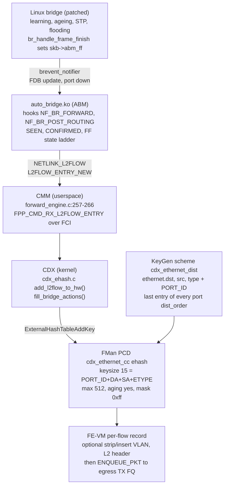
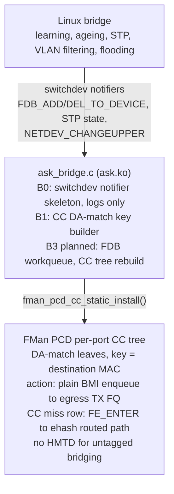

# ASK2 L2 Bridge HW Offload — Architecture Analysis & Recommendation

**Date:** 2026-10-07 (revised 2026-10-09)
**Branches reviewed:** `dpaa1` (ASK2), `nxp-sdk` (vendor ASK)
**Task:** T-M6-2 — analyze how to do HW-offloaded bridging "like smart switches do it"

> **Revision 2026-10-09.** `plans/ASK2-BRIDGE-OFFLOAD-PLAN.md` is the
> execution contract; this document is the vendor-vs-ASK2 comparison behind
> it. Since the first pass: the ehash re-architecture was adopted (B1 is now
> the F-255 `L2_DA` profile plus `ask_bridge_fe_action()`, not the CC-tree
> builder), per-port offload granularity was simplified (per-port engage plus
> per-family mask only), and the vendor sources were re-read. New material is
> §2.5 (vendor details), §6.7 (mapping to ASK2 and gap list), and corrections
> inside §2.1, §2.3, §2.4, §3.2, §6.3 and §9. Sections that describe the
> superseded CC-tree plan (§3.1, §3.3, §3.4, §4, §7.2) are kept as history and
> marked so.

---

## 1. Executive Summary

**The vendor ASK (nxp-sdk branch) already implements hardware-offloaded L2 bridging using the ehash (external hash table) mechanism — the same mechanism ASK2 uses for routed/NAT offload. The ASK2 bridge plan (dpaa1 branch) currently assumes a CC-tree approach, which is architecturally different from the vendor's proven implementation and has hit an unresolved silicon regression.**

**Recommendation:** Re-architect ASK2 bridge offload to use **ehash with a 15-byte L2 key** (`PORT_ID|DA|SA|ETYPE`), matching the vendor's `cdx_ethernet_cc` exactly. This reuses ASK2's proven 9+ Gbit/s ehash path, avoids the CC-tree's unresolved silicon issues (dual-delivery, wedge, cross-port regression), and matches what the silicon microcode is actually designed for.

---

## 2. Vendor ASK Approach (nxp-sdk branch)

### 2.1 Architecture Overview

The vendor ASK implements L2 bridging through a per-flow ehash record built by
CDX, fed by a patched bridge and the `auto_bridge.ko` module (§2.4). The
verified chain (2026-10-09 re-read of `/mnt/builds/ASK`):



Earlier revisions of this diagram showed CMM `cmmBrToFF()` reading the bridge
FDB and `control_bridge.c` owning an L2 hash table. That was the pre-correction
reading; §2.4 explains why `cmmBrToFF()` belongs to the routed-flow path.

### 2.2 Key Vendor Files

| File (under `/mnt/builds/ASK/`; the old `kernel/flavors/ask/...` tree no longer exists) | Purpose |
|------|---------|
| `patches/kernel/020-ask-bridge-hooks.patch` | Kernel bridge hooks: `brevent_notifier`, can-expire callback, `skb->abm_ff`, `br_input_skb_cb` vid/untagged |
| `cdx/control_bridge.c` / `control_bridge.h` | CDX L2 flow management; routed-flow-via-bridge resolution (ageing timer commented out, §2.5) |
| `cdx/cdx_ehash.c` | `add_l2flow_to_hw()` (~1496), `fill_bridge_actions()` (~1196-1300) |
| `cmm/src/ffbridge.c` / `ffbridge.h` | CMM `cmmBrToFF()`: routed flow whose egress is a bridge (§2.4) |
| `cmm/src/forward_engine.c` (257-266) | `L2FLOW_ENTRY_NEW` → `FPP_CMD_RX_L2FLOW_ENTRY` over FCI |
| `dpa_app/files/etc/cdx_pcd.xml` | FMC policy: `cdx_ethernet_cc` (line 53, keysize=15), `cdx_ethernet_dist` (line 207, shared), per-port `dist_order` (~336-504) |
| `config/gateway-dk/cdx_cfg.xml`, `dpa_app/files/etc/cdx_cfg.xml` | Port policies (all ports use `cdx_ethernet_dist` as last distribution) |
| `auto_bridge/auto_bridge.c` + `auto_bridge_private.h` | A **second, separate** vendor mechanism — see §2.4 |

### 2.3 Vendor Key Design Decisions

1. **Ehash, not CC-tree**: The vendor NEVER uses CC-tree/match-table classification for ANYTHING. All 16 classification nodes in `cdx_pcd.xml` are `<hashtable external="yes">` — the external hash table mechanism.

2. **15-byte L2 key**: `PORT_ID(1) + DA(6) + SA(6) + ETYPE(2)` — matches the KeyGen extraction order and the ASK1 `union dpa_key` layout exactly.

3. **Kernel bridge hooks, not switchdev**: The vendor uses custom `brevent_notifier` chains and `br_fdb_can_expire` callbacks, not the mainline switchdev framework. This is because the vendor's kernel is 5.4/6.12-era with custom patches.

4. **Userspace-driven**: CMM (userspace daemon) reads the bridge FDB and pushes entries to CDX via netlink. CDX installs them into hardware. This is a **control-plane/userspace** model, not a kernel-native model.

5. **Silicon-proven**: Live .106 board scheme 11 (`0xe4000000` = `PORT_ID|MACDST|MACSRC|ETYPE`) carried **1,225,734 packets** — the busiest scheme on the board.

**Corrections 2026-10-09 to items 3 and 4.** Item 3 is right that the vendor
has no switchdev, but the hooks are narrower than "custom chains": the patch
adds `brevent_notifier` (`BREVENT_FDB_UPDATE`, `BREVENT_PORT_DOWN`), the
can-expire callback and `skb->abm_ff`, and the consumer is `auto_bridge.ko`
(§2.4), not CMM reading the FDB over ioctl. Item 4 is only half true: the
FDB is not read by CMM. ABM learns flows in kernel and hands each new flow to
CMM over `NETLINK_L2FLOW`; CMM forwards it to CDX over FCI (§2.5). Userspace
is a relay, not the source of truth.

### 2.4 A second vendor mechanism: `auto_bridge.ko` (ABM) — pure L2 flow discovery

**Correction to the first pass of this analysis:** §2.1-2.3 above describe `cdx/control_bridge.c` + `cmm/ffbridge.c`'s `cmmBrToFF()`. Reading those functions directly shows `cmmBrToFF(struct RtEntry *route)` is called from `cmm/src/conntrack.c:921` and takes a **route** (an L3/NAT flow whose *egress* interface happens to be a bridge) — it resolves the bridge's internal FDB *once* at flow-install time so the egress L2 header (dst MAC, optional VLAN tag) can be baked into that routed flow's hardware record (`dpa_get_tx_info_by_itf()` in `devman.c` does the analogous VLAN-tag part). This is the vendor's equivalent of what ASK2's `ask_neigh.c` already does for routed next-hops — **not** the general "two hosts purely switched, no L3 involved" case the bridge plan actually targets.

That general case is `auto_bridge.ko`'s job, a **separate, 1771-line kernel module** (`MODULE_DESCRIPTION("Automatic Bridging Module (ABM)")`) with its own state machine and its own netlink family (`NETLINK_L2FLOW`), independent of `control_bridge.c`'s ioctl-driven table:

- Learns flows by hooking the kernel's own bridge notifier chain (a vendor-patched `brevent_notifier`, `BREVENT_FDB_UPDATE`/`BREVENT_PORT_DOWN`) plus an ebtables/netfilter-bridge hook (`nf_register_net_hooks(..., abm_ebt_ops, ...)`), **not** switchdev.
- Tracks each (src MAC, dst MAC, in-dev, out-dev) pair as an `l2flowTable` entry through an explicit **promotion ladder**: `L2FLOW_STATE_SEEN → CONFIRMED → {LINUX | FF} → DYING` (`auto_bridge_private.h`). A flow is **not** installed into hardware the instant a MAC is learned — it has to be re-observed/confirmed first.
- Sized deliberately larger in software than in hardware: `L2FLOW_HASH_TABLE_SIZE=1024` buckets, `ABM_DEFAULT_MAX_ENTRIES=5000` software-tracked flows, against only **512** hardware ehash slots (`cdx_ethernet_cc` max=512) — i.e. the vendor tracks ~10x more candidate flows than it can ever offload, and only promotes the ones worth it.
- Ages hardware-forwarded flows via a **callback**, not polling: `br_fdb_register_can_expire_cb(&abm_fdb_can_expire)` — the (patched) bridge asks ABM "is this MAC still fast-forwarded?" before expiring it, and ABM says no (`return 0`) if it's in `L2FLOW_STATE_FF`. A new `skb->abm_ff` field (added by `patches/kernel/020-ask-bridge-hooks.patch`) is set by the bridge's own forward path once a flow is confirmed, which is how the data path and ABM agree a flow is live.
- Talks to a userspace daemon over its own reliable netlink protocol (ack/retry, `l2flow_list_wait_for_ack`). **Confirmed 2026-10-09** (previously `[INFERRED]`): on first sight at `NF_BR_POST_ROUTING` ABM sends `L2FLOW_ENTRY_NEW` over `NETLINK_L2FLOW`; CMM `forward_engine.c:257-266` turns it into `FPP_CMD_RX_L2FLOW_ENTRY` over FCI; CDX consumes that and calls `add_l2flow_to_hw()` / `fill_bridge_actions()`.
- Has a real security history worth not repeating (`ISSUES.md`): **C1** — a netlink attribute (`L2FLOWA_IP_SRC/DST`) trusted attacker-supplied `nla_len` into a fixed-size union (buffer overflow), fixed via `nla_policy` caps. **H11/H7-r** — `spin_lock` vs `spin_lock_bh` mismatches between a process-context callback (`abm_fdb_can_expire`, called from `br_fdb_cleanup`) and softirq-context callers of the same lock. **M6** — an unbounded `schedule()` spin on module-exit waiting for flow drain, fixed to a bounded 5 s wait. ASK2's current `ask_bridge.c` already uses `spin_lock_bh` consistently and has no unbounded waits, so it doesn't repeat H11/M6, but this is worth keeping in mind for B3's teardown path and any future netlink/genl attribute added for bridge observability (C1's class of bug).

### 2.5 Vendor details verified 2026-10-09

These points were re-read from source and drive decisions D1-D8 in the plan
(§13).

1. **The record is per flow, in the ingress port's table.** `add_l2flow_to_hw()`
   (`cdx/cdx_ehash.c` ~1496) keys `portid(1)+DA(6)+SA(6)+ethertype(2)` = 15 B.
   `l2_info.mtu = 0xffff`, so bridge flows get no MTU check. The
   `cdx_ethernet_dist` distribution is `shared="true"` and carries PORT_ID, so
   the vendor holds one shared table with ingress port in the key (512 entries,
   mask `0xff`). ASK2 uses per-port tables (F-225), where PORT_ID in the key
   is redundant.
2. **Routed and bridge coexist on one port by distribution chaining.**
   `cdx_ethernet_dist` is the last entry of every port's `dist_order`
   (`cdx_pcd.xml` ~336-504), after the esp4/esp6/udp4/tcp4/udp6/tcp6/
   ipv4mcast/ipv6mcast/tup3/pppoe distributions. L3 lookups run first, L2 only
   on a miss. ASK2 has one scheme and one table per port and no multi-table
   dispatch, so it cannot do this yet.
3. **`abm_ff` semantics.** The patched `br_handle_frame_finish` clears
   `skb->abm_ff`, then sets it only on a known-unicast dst-FDB hit before
   `br_forward`. `br_input_skb_cb` gains `vid` and `untagged`; `skb->
   underlying_iif` is set in `br_pass_frame_up`. ABM only considers skbs with
   `abm_ff` and ethertype IP, IPv6, PPP_SES or 8021Q.
4. **ABM state timers.** SEEN 10 s, CONFIRMED 2 min (commented "should not
   timeout here"), LINUX 10 s, DYING 2 min; FF has no timer. Defaults: 1024
   hash buckets, 5000 software entries. Hooks: `NF_BR_FORWARD` at
   `NF_BR_PRI_LAST`, `NF_BR_POST_ROUTING` at `NF_BR_PRI_LAST - 1`.
5. **Dynamic entries are offloaded.** `abm_fdb_can_expire` returns 0 for FF
   flows, so a hardware-forwarded dynamic FDB entry is kept alive. That is why
   the vendor needs its bridge patch; ASK2 without one cannot reproduce it and
   starts with static entries (plan §13 D4).
6. **Invalidation is event-driven.** `BREVENT_PORT_DOWN` marks matching flows
   DYING; `BREVENT_FDB_UPDATE` rewrites `odev_ifi` for flows with that dst MAC.
   The vendor's `control_bridge.c` per-entry ageing timer is commented out
   (lines 205 and 262), so ABM drives lifetime.
7. **`fill_bridge_actions()` (~1196-1300).** Sets `EHASH_BRIDGE_FLOW`;
   `rebuild_l2_hdr` only when a VLAN strip or add applies. In `VLAN_FILTER`
   mode a tagged egress inserts a tag (TPID 0x8100, `tci = vid`; QinQ uses
   `svlan_tag`/`cvlan_tag`) and an untagged egress strips. The chain is
   optional `create_strip_eth_hm`, then `insert_remove_outer_vlan_hm` (filtered)
   or `insert_remove_vlan_hm`, then optional `create_vlan_ins_hm`, then
   `create_ethernet_hm`, then `create_enque_hm`. **`insert_remove_vlan_hm` runs
   unconditionally for non-filtered flows and always emits
   `STRIP_ALL_VLAN_HDRS` (0x12), even for untagged frames.** ASK2's plain
   `ENQUEUE_PKT` baseline for untagged traffic is therefore not byte-identical
   to the vendor; B2 must prove it (plan §13.3 row 5).
8. **First-pass claim retracted.** The old diagram's "Timer-based ageing
   (`L2Bridge_timeout`, default 30 s)" describes `control_bridge.c` code whose
   timer calls are commented out; do not rely on it.

---

## 3. ASK2 Current Approach (dpaa1 branch)

### 3.1 Architecture Overview (superseded CC-tree plan — historical)

> **Superseded 2026-10-07.** The CC-tree design below was replaced by the
> ehash design (§6). Current ASK2 state is §3.2; the current design is §6 and
> plan §13.

The original ASK2 bridge plan assumed a CC-tree approach:



### 3.2 Current State (2026-10-09)

| Stage | Status | Notes |
|-------|--------|-------|
| B0 | **DONE** (2026-09-10) | switchdev notifier skeleton, logs only, no HW install; queue holds 1024 events, drops on full |
| B1 (CC builder, 2026-09-15) | **SUPERSEDED** | CC DA-match key builder + KUnit; dormant |
| B1' (ehash) | **Code written 2026-10-07, dormant, not built in CI** | F-255 `L2_DA` profile (6 B, EKFC MACDST `0x40000000`, `ekfc_only`) + `ask_bridge_fe_action()`; no runtime caller of `fman_pcd_fe_engage_profile(..., L2_DA)`; `ask_hw_offload_engage()` always arms ROUTED |
| B2' (ehash silicon proof) | **NOT STARTED** | Test matrix in plan §13.3 |
| B3 | **GATED** | Needs role selection, FDB fan-out, urgent invalidation, fail-closed table allocation (plan §13 G1, G3, G5, G6) |
| B4 | **PLANNED** | Lifecycle + teardown |
| B5 | **PLANNED** | Matrix + productization; `ASK_CAP_BRIDGE` stays unadvertised until then |

### 3.3 The CC-tree B2 Blocker (historical)

The CC-tree B2 silicon de-risk experiment hit a **regression**. It is the main
reason the plan moved to ehash and is not the current blocker:

- The exact port/FQID combination (`eth3`/`0x10` → `eth4`/`0x2ba`) that was silicon-proven in August 2026 (R3b/R4b, ~55k pps sustained) now delivers **zero frames**
- FMan hardware counters prove the CC comparator matches and the AD enqueue succeeds (`fmqm_etfc` rises, `fmqm_dtfc` stays flat)
- The live hardware AD content is byte-perfect against software intent
- The frames get "enqueued but never dequeued" — silently stuck in the target FQID's hardware queue
- A reboot clears the stuck frames (volatile QMan state)
- **Root cause unknown**: either a code regression between `4e21e78f` and `dpaa1` tip, or a fundamental `AC 0x28` (`PRE_BMI_ENQ`) same-port-only limitation

### 3.4 ASK2 CC-Tree Silicon History (historical)

The CC-tree approach has a troubled silicon history on this project:

| Issue | Date | Status |
|-------|------|--------|
| `next_engine=2` dual-delivery | 2026-10-02 | Every frame both HW-classified AND delivered to software RX path |
| `next_engine=3` RX-deaf wedge | 2026-10-03 | Port goes deaf, requires cold power-cycle (4/4 reproductions) |
| CC-tree architecture "broken" | 2026-08-05 | Five vendor-verified register fixes all still produced RX-silence |
| Cross-port delivery regression | 2026-09-16 | Proven-working pairing now delivers zero frames |
| VLAN inline-opcode freeze | 2026-08-25 | FE-VM VLAN opcodes (0x12/0x42) freeze after ~21 frames |

---

## 4. Key Architectural Differences (vendor vs the superseded CC-tree plan — historical)

> The right-hand column describes the CC-tree plan, not current ASK2. Current
> ASK2 uses ehash like the vendor; the remaining differences are control plane
> (switchdev, no bridge patch, no CMM), per-port tables (vendor: one shared
> table keyed with PORT_ID), and no L3-then-L2 distribution chaining (§2.5).
| Aspect | Vendor ASK (nxp-sdk) | ASK2 Plan (dpaa1) |
|--------|----------------------|-------------------|
| **Classification mechanism** | **Ehash** (external hash table) | **CC-tree** (match-table walker) |
| **Key format** | 15-byte `PORT_ID\|DA\|SA\|ETYPE` | DA-only or 15-byte (TBD) |
| **Action mechanism** | FE-VM opcodes in ehash record | CC leaf AD (plain enqueue or NADEN→HMTD) |
| **Control plane** | Userspace (CMM daemon) | Kernel-native (switchdev notifiers) |
| **Kernel integration** | Custom hooks (`brevent_notifier`) | Mainline switchdev framework |
| **Silicon proof** | **YES** — 1.2M+ packets on live board | **NO** — blocked on B2 regression |
| **Coexistence with routed** | Same ehash tables (different keys) | CC-miss → FE_ENTER → ehash |
| **Ageing** | Hardware (`aging=yes`) + software timer | Kernel bridge ageing only |
| **VLAN support** | Via FE-VM opcodes (0x12/0x42) | Via HMTD (T-M6-8, silicon-proven) |

### 4.1 The Critical Finding

**Qdrant finding (2026-10-03):** The vendor NEVER uses CC-tree/match-table classification for ANYTHING, including VLAN and L2 bridging. Reading `cdx_pcd.xml`'s full 525 lines, **every single one** of vendor's 16 declared classification nodes is `<hashtable external="yes">` — the external hash table mechanism.

This means:
1. The CC-tree path in ASK2 is exercising a **genuinely under-used, possibly barely-functional corner of the microcode**
2. The ehash path is the **well-trodden, silicon-proven** path (9+ Gbit/s routed, 1.2M+ packets L2 on vendor board)
3. The vendor's `cdx_ethernet_cc` proves that **L2 bridging via ehash works on this exact silicon**

4. **Decisive, ASK2-own-silicon confirmation (2026-10-02, qdrant):** this isn't just "the vendor prefers ehash" — ASK2's own CC-tree+HMTD VLAN path (`ask_vlan_cc.c`, more mature than the bridge CC-leaf harness) was kprobe-instrumented on `rx_default_dqrr` (the software RX dequeue callback) in a same-board, same-boot A/B: ehash/FE_ENTER-dispatched port-to-port traffic produced **197 hits for 8.77 GB** transferred (9.39 Gbit/s) — essentially zero software-RX touches — while CC-tree+HMTD-dispatched VLAN traffic produced **2,557,138 hits for only 2.64 GB** (2.82 Gbit/s) — **every single frame**, forward data and reverse ACKs alike, transited software RX. A same-day register dump found the BMI default/unclassified-frame FQID (`fmbm_rfqid`) stays live and valid on both ports even while the KeyGen/CC path is armed and matching — consistent with **dual delivery** (the CC-leaf path enqueues to both the hardware-selected FQ and the normal kernel path) rather than a clean, CPU-bypassing hardware-only forward. Toggling the VLAN CC-tree offload on/off produced statistically identical throughput, CPU/softirq profile, and kprobe rate. **Conclusion: on this silicon/driver combination, CC-tree+HMTD dispatch is not a CPU-bypass mechanism at all, independent of whether it reliably delivers frames** — it is strictly worse evidence than "the vendor doesn't use it," because it shows ASK2's *own* attempt at it, even in its most mature form, never achieved real hardware offload.

---

## 5. Smart Switch Bridging Patterns

Smart switches (and the Linux bridge) implement these key features:

### 5.1 Core Features

| Feature | Description | HW Offload Strategy |
|---------|-------------|---------------------|
| **MAC Learning** | Learn source MAC → ingress port mapping | Kernel learns, mirrors to HW |
| **FDB Ageing** | Expire stale entries (default 300s) | HW ageing or kernel-driven removal |
| **Known Unicast Forwarding** | Forward to known FDB entry | **HW fast path** (ehash/CC leaf) |
| **Unknown Unicast Flooding** | Flood to all forwarding ports | Software (kernel bridge) |
| **Broadcast/Multicast** | Flood or replicate to group members | Software (or HW multicast — T-M6-MC) |
| **STP/RSTP** | Spanning tree protocol | Software only (BPDUs never offloaded) |
| **VLAN Filtering** | 802.1Q tag push/pop/strip | HW via FE-VM opcodes or HMTD |
| **Port Isolation** | Prevent port-to-port forwarding | Software (bridge flags) |
| **MAC Limiting** | Max MACs per port | Software (bridge FDB limits) |

### 5.2 What Should Be Offloaded

Following the **fail-closed** principle (everything not explicitly offloaded stays in software):

**Offload (HW fast path):**
- Known unicast forwarding (DA match → egress port TX FQ)
- VLAN tag push/pop (if VLAN-aware bridging)
- Static FDB entries (no ageing concern)

**Keep in software:**
- BUM traffic (broadcast, unknown-unicast, multicast)
- Local termination (frames to bridge MAC)
- Control planes (STP BPDUs, LLDP, LACP, 802.1X)
- Learning/ageing/move decisions
- Non-forwarding port states (STP blocked/listening/learning)

### 5.3 Linux Switchdev Model

The mainline Linux switchdev framework provides:

```c
// FDB events (atomic notifier — must defer to workqueue)
SWITCHDEV_FDB_ADD_TO_DEVICE
SWITCHDEV_FDB_DEL_TO_DEVICE

// Port attributes (blocking notifier — can sleep)
SWITCHDEV_PORT_ATTR_SET  // STP state, bridge flags, ageing time

// Bridge join/leave (netdevice notifier)
NETDEV_CHANGEUPPER

// Offload acknowledgment
SWITCHDEV_FDB_OFFLOADED  // set .offloaded = true after HW install
```

**ASK2 already implements this correctly in B0** (`ask_bridge.c`). The switchdev integration is not the problem — the **hardware classification mechanism** is.

---

## 6. Recommended Architecture for ASK2

### 6.1 Core Recommendation: Switch from CC-Tree to Ehash

**Replace the CC-tree DA-match approach with an ehash-based L2 table**, matching the vendor's `cdx_ethernet_cc` exactly:

```
┌─────────────────────────────────────────────────────────────┐
│  Linux Bridge (kernel) — AUTHORITATIVE                       │
│  - Learning, ageing, STP, VLAN filtering, flooding           │
└─────────────────────────────────────────────────────────────┘
                              │
                              │ switchdev notifiers (B0 skeleton — already done)
                              ▼
┌─────────────────────────────────────────────────────────────┐
│  ask_bridge.c (ask.ko)                                       │
│  - FDB workqueue (coalesced + bounded)                       │
│  - Admission filter: skip is_local, locked; static-only v1   │
│  - Per-port L2 ehash table shadow                            │
│  - ask_l2_flow_insert/remove() → ehash record                │
└─────────────────────────────────────────────────────────────┘
                              │
                              │ fman_pcd_ehash_add_key() / fman_pcd_ehash_remove_key()
                              ▼
┌─────────────────────────────────────────────────────────────┐
│  FMan PCD — L2 ehash table (per-port or shared)              │
│  - Key: 15 bytes = PORT_ID(1) + DA(6) + SA(6) + ETYPE(2)     │
│  - Same key format as vendor cdx_ethernet_cc                 │
│  - Same hash: CRC-64 (ECMA-182, reflected)                   │
│  - Bucket index: fman_pcd_ehash_bucket_index()               │
└─────────────────────────────────────────────────────────────┘
                              │
                              │ KeyGen scheme: L2 extraction (DA+SA+ETYPE)
                              │ - EKFC: 0xe4000000 (PORT_ID|MACDST|MACSRC|ETYPE)
                              │ - AC_CC dispatch to ehash (CCOBASE)
                              ▼
┌─────────────────────────────────────────────────────────────┐
│  FMan FE-VM — per-flow action record (144 bytes)             │
│  - For untagged bridging: ENQUEUE_PKT (0x01) only            │
│  - For VLAN-aware: [STRIP_VLAN 0x12] → [INSERT_VLAN 0x42]    │
│    → [INSERT_L2_HDR 0x41] → [ENQUEUE_PKT 0x01]              │
│  - Target: egress port's no-confirm TX FQ                    │
│  - Stats: per-flow pkt/byte counters (record +256/+264)      │
└─────────────────────────────────────────────────────────────┘
```

### 6.2 Why Ehash Over CC-Tree

| Factor | Ehash (Recommended) | CC-Tree (Current Plan) |
|--------|---------------------|------------------------|
| **Silicon proof** | ✅ Vendor: 1.2M+ packets; ASK2: 9+ Gbit/s routed | ❌ Blocked on B2 regression |
| **Microcode maturity** | ✅ Well-trodden path | ❌ Under-used corner |
| **Coexistence** | ✅ Same mechanism as routed/NAT | ⚠️ CC-miss→FE_ENTER chain (fragile) |
| **Per-flow stats** | ✅ Hardware counters at record +256/+264 | ❌ No per-key counters on this silicon |
| **Ageing** | ✅ Hardware `aging=yes` support | ❌ Software-only |
| **VLAN support** | ✅ FE-VM opcodes (0x12/0x42) — same as routed VLAN | ⚠️ HMTD chain (T-M6-8, proven but complex) |
| **Key flexibility** | ✅ 15-byte composite key | ⚠️ CC comparator window unresolved |
| **Implementation effort** | ✅ Reuses ask_fe_flow_insert() path | ❌ New CC-tree builder (B1 done, B2 blocked) |

### 6.3 Key Design Decisions

#### 6.3.1 Key Format

Use the **vendor's 15-byte composite key**:

```
Byte 0:      PORT_ID (hardware port ID, e.g. 0x10 for eth3)
Bytes 1-6:   Destination MAC (DA)
Bytes 7-12:  Source MAC (SA)
Bytes 13-14: EtherType (big-endian)
```

This matches:
- Vendor `cdx_ethernet_cc` keysize=15
- Vendor `union dpa_key` layout (`portid` byte 0 + `ether_key`)
- ASK2's proven 14-byte routed key format (PORT_ID + 5-tuple)
- KeyGen EKFC `0xe4000000` (PORT_ID|MACDST|MACSRC|ETYPE)

**For the first cut, DA-only matching (6 bytes) is also viable** — the ehash table can use a shorter key with a mask. But the 15-byte composite is the vendor-proven format.

**Update 2026-10-09 — DA-only is the shipped B1 default, decided at B2.** B1
(F-255 `L2_DA`) implements the DA-only 6-byte key (EKFC MACDST `0x40000000`).
The 15-byte composite is the alternative. The choice is not cosmetic, because
it sets capacity and fan-out:

| | DA-only 6 B | Vendor 15 B composite |
|---|---|---|
| Record per | (DA, other-ingress-port), from FDB events | observed flow (ingress, DA, SA, ethertype) |
| Entry source | switchdev FDB, no traffic learning | needs traffic-driven learning (ABM-style) |
| Carries VID | no (fail closed on `vlan_filtering`) | no VID either; vendor adds it via `vid`/`untagged` bridge hooks |
| Family gating | none: any ethertype matches | ethertype in key enables it |
| Records under N members, M MACs | M × (N-1) | only flows actually seen |

PORT_ID in the key is redundant with per-port tables (ASK2) but required with
the vendor's shared table. Decide at B2 (plan §13.3 row 3).

#### 6.3.2 KeyGen Scheme

The L2 scheme needs:
- **EKFC**: `0xe4000000` = `PORT_ID(bit 31) | MACDST(bit 30) | MACSRC(bit 29) | ETYPE(bit 26)`
- **kgse_mode**: `0x80000006` (AC_CC, CCOBASE=0) — same as routed schemes
- **kgse_mv**: `0` (match-all, family-neutral) — same as the F-246 family-neutral scheme
- **kgse_hc**: hashShift=0, symmetric=false, mask=0x7fff — same as routed

**Critical constraint from ASK2 findings:** A second match-all (`kgse_mv=0`) KG scheme is **impossible** — scheme selection is a first-match SI-walk, and (per §6.3.5) CCOBASE selects an ehash table **per scheme**, not per key field, so one scheme cannot feed two differently-keyed tables either. A first draft of this analysis proposed working around this by sharing one EKFC's extraction between an L3 and an L2 "sub-key" via ehash masking — **this does not hold up**: a table's hash/bucket index is computed over that table's own declared `keysize`, so "mask a shared key to select which fields match" cannot make one hash computation serve two different keyed lookups (an L3 5-tuple lookup and an L2 DA/SA/ETYPE lookup) from the same extraction. That would still require two tables, and therefore — by the constraint already stated — two schemes.

**Corrected resolution: scope v1 to ports that are bridge-only.** The conflict above only exists when a *single port* needs a routed scheme **and** an L2 scheme armed **simultaneously**. A port that is purely an L2 bridge member (no L3/IP role of its own — the common "access/trunk switch port" case, exactly what real switches look like) only ever needs the **one** L2 scheme, so there is no second-scheme conflict to resolve. This mirrors how physical deployments already work: a bridge's L3 role (an IRB/SVI with an IP address) lives at the bridge/VLAN-interface level, not on the physical member port, so a member port doesn't usually need to be both a routed scheme *and* an L2 scheme target at once. **Explicitly out of scope for v1** (falls back to software): a single physical port that must simultaneously do hardware-routed L3 for some traffic and hardware-bridged L2 for other traffic. This is the same shape of trade-off the original CC-tree design already accepted (one scheme per port), just resolved per-port instead of attempting to multiplex one scheme.

#### 6.3.3 Ehash Table Configuration

```c
struct fman_pcd_ehash_table_params l2_table = {
    .size = 512,              // max entries (vendor uses 512)
    .keysize = 15,            // PORT_ID|DA|SA|ETYPE
    .hash_shift = 0,
    .hash_mask = 0x7fff,      // same as routed
    .aging = true,            // hardware ageing
    .stats = true,            // per-flow byte/frame counters
};
```

**Correction 2026-10-09.** This block is the vendor's configuration, not
ASK2's. The vendor's `cdx_ethernet_cc` is `max=512`, `mask=0xff`, keysize 15,
`aging=yes`. ASK2 per-port tables use mask `0x7fff` (32768 buckets × 16 B), and
production `fman_pcd_fe_flow_add` passes `stats=false`, so per-record counters
are off. Per-table capacity and MURAM/record footprint under fan-out are
**unmeasured** (spec `ask2-shared-table-multi-protocol-design.md` §146: the
bucket array dominates and every class must pass the live MURAM-budget gate).
Both go on the B2 matrix (plan §13.3 row 7), and `stats=true` is needed for
observability and a hit-based ageing refresh (plan §13 G8, D4).

#### 6.3.4 FE-VM Action Record

For **untagged bridging** (simplest case):
```
Opcode chain: [ENQUEUE_PKT 0x01]
Params: target_fqid = egress port's no-confirm TX FQ
        mtu = 0xffff (no fragmentation)
        stats_ptr = per-flow stats location
```

For **VLAN-aware bridging** (later increment):
```
Opcode chain: [STRIP_ALL_VLAN 0x12] → [INSERT_VLAN_HDR 0x42]
              → [INSERT_L2_HDR 0x41] → [ENQUEUE_PKT 0x01]
```

This is **identical** to the vendor's `fill_bridge_actions()` and reuses ASK2's proven VLAN opcode emitters (F-233, silicon-validated).

**Correction 2026-10-09.** Not identical for the untagged case. The vendor
calls `insert_remove_vlan_hm` for every non-VLAN-filtered flow, so its chain
always begins with `STRIP_ALL_VLAN_HDRS` (0x12), even for untagged frames. The
plain `[ENQUEUE_PKT]` record above is a deliberate ASK2 simplification that
leaves frame bytes (including any 802.1Q tag) untouched. That is correct for a
non-VLAN-aware bridge, but it needs silicon proof (plan §13.3 row 5). The
vendor also keeps `mtu = 0xffff` for bridge records; ASK2 must keep bridge
records off the F-262 `05 PREEMPTIVE_CHECKS` path (plan §13 D7).

#### 6.3.5 Coexistence with Routed/NAT

The ehash approach makes coexistence **trivial**:

- **Routed flows**: ehash record with L3 key (14-byte `PORT_ID|SIP|DIP|PROTO|SPORT|DPORT`), on ports armed with the routed scheme
- **Bridge flows**: ehash record with L2 key (15-byte `PORT_ID|DA|SA|ETYPE`), on ports armed with the L2 scheme instead (§6.3.2) — **a given port runs one or the other in v1, not both**
- **Separate tables, separate schemes, per port role** — not a shared/masked single table (§6.3.2 correction)
- **Miss handling**: ehash miss → KG default FQ → kernel (bridge floods or routes)

No CC-miss→FE_ENTER chain needed. No `miss_fe_off` wiring. No CC-tree rebuild under FDB churn.

**Correction 2026-10-09: "trivial" overstated it.** In the vendor, coexistence
is distribution chaining (§2.5 point 2). In ASK2 a port runs one profile, so
coexistence is across ports only; the port's role is chosen at engage time
(plan §13 D1: bridge member → `L2_DA`, otherwise ROUTED, with explicit
disengage and re-engage on a role change). Routed flows whose egress or
ingress is a bridge device (IRB/SVI) have no member-port resolution and stay in
software (plan §13 G11).

### 6.4 Implementation Roadmap (Revised B0-B5)

> Updated 2026-10-09 to the actual state. The ordering and gates here are
> mirrored by plan §6 and §13.7.

| Stage | Description | Gate |
|-------|-------------|------|
| **B0** | ✅ DONE (2026-09-10) — switchdev notifier skeleton (logs only) | Build clean |
| **B1 (CC)** | ❌ SUPERSEDED — CC DA-match builder | — |
| **B1'** | ⚠️ CODE WRITTEN 2026-10-07, dormant, not built in CI — F-255 `L2_DA` profile (6 B DA key) + `ask_bridge_fe_action()` | CI build; KUnit; routed regression via `pcd-snapshot` |
| **B2'** | NOT STARTED — silicon de-risk on a sacrificial port (never eth0): matrix in plan §13.3 | Single flow HW forward, CPU bypass by kprobe A/B, detach restores `next_engine`, capacity measured |
| **B3a** | Role selection at engage, static FDB fan-out, fail-closed table allocation | Two-port bridge, known-unicast static entry HW forward, BUM/BPDU stay SW, no routed regression |
| **B3b** | Urgent invalidation and shadow resync (DEL, STP-block, move, port-down; overflow resync from FDB dump) | No stale record under churn; lockdep clean |
| **B4** | Lifecycle + teardown (FDB del/flush, STP state change, port down, module unload) | Forward+inverse, `pcd-snapshot` clean, `muram_budget` back to baseline |
| **B5** | Matrix + productization (learn/move/delete/age, multi-port, churn, performance); advertise `ASK_CAP_BRIDGE`; default decision for `bridge_offload` | Full acceptance contract |

### 6.5 What to Keep from Current Work

- **B0 switchdev skeleton** (`ask_bridge.c`): ✅ Keep — the notifier chains, workqueue, coalescing, and admission filter are all correct and reusable
- **B1 CC DA-match builder** (`0204`/`0205` patches): ❌ Supersede — replace with ehash key builder
- **Patches `0202`/`0204`/`0205`/`0206`/`0207`/`0208`**: ❌ Supersede — the CC-tree-specific patches become dormant
- **KUnit test infrastructure**: ✅ Keep — the test patterns apply to ehash key builder too

### 6.6 What to Add

> Updated 2026-10-09: item 1 is implemented as the DA-only `L2_DA` profile
> (F-255) rather than the 15-byte key; the 15-byte builder is the B2 A/B
> alternative. Items 3 and 4 are not done: the per-port table exists only as
> the F-255 profile size, and nothing calls it at runtime (§6.7).

1. **L2 ehash key builder** (`cc_pack_key_l2` equivalent for ehash):
   - Pack 15-byte `PORT_ID|DA|SA|ETYPE` key
   - Compute CRC-64 hash for bucket index
   - KUnit vectors matching vendor `cdx_ethernet_cc`

2. **L2 FE-VM action emitter**:
   - `ENQUEUE_PKT` (0x01) with target FQID
   - Reuse existing `ask_fe_flow_insert()` infrastructure
   - VLAN opcodes (0x12/0x42) for later increment

3. **Per-port L2 ehash table management**:
   - Create/destroy ehash table per bridge-member port
   - Shadow FDB in host memory
   - Insert/remove records on FDB events

4. **KeyGen scheme extension**:
   - Add L2 extraction fields to the per-port scheme's EKFC
   - Or create a dedicated L2 scheme (if EKFC space allows)

### 6.7 Review 2026-10-09: vendor mechanism mapped to ASK2

| Vendor mechanism | ASK2 equivalent | Status |
|---|---|---|
| ABM flow discovery (`NF_BR_*` hooks, SEEN/CONFIRMED/FF) | switchdev FDB events (`ask_bridge.c`), static entries first | B0 log-only; no install path |
| cmm → FCI → cdx relay | in-kernel `ask.ko` direct to `fman_pcd_fe_flow_add` | Needs the install path (B3a) |
| Per-flow record, shared table, PORT_ID in key | Per-port table, DA-only key, record per (DA, other ingress port) | `ask_bridge_fe_action()` written; fan-out not written |
| `dist_order` chaining (L3 first, L2 last) | One scheme per port; role chosen at engage | Role selection not written (plan §13 D1) |
| `br_fdb_register_can_expire_cb` keeps dynamic entries alive | Hit-counter refresh or static-only | Static-only for v1 (plan §13 D4) |
| `abm_ff` marks only known-unicast dst-FDB hits | Admission filter: static, unicast, FORWARDING, VID 0, not local/locked | Specified, not enforced |
| `BREVENT_PORT_DOWN` / `BREVENT_FDB_UPDATE` | `SWITCHDEV_FDB_DEL_TO_DEVICE`, STP state, `NETDEV_CHANGEUPPER` | Observed in B0; invalidation not written |
| `cmmBrToFF()` bakes bridge egress into routed records | none: routed flows with a bridge egress stay in software | Gap G11, out of scope for v1 |
| `mtu = 0xffff` on bridge records | no `05 PREEMPTIVE_CHECKS` on bridge records (F-262 interplay) | Rule D7 |
| Unconditional `STRIP_ALL_VLAN_HDRS` | Plain `ENQUEUE_PKT` for untagged | Deviation; B2 row 5 |

The vendor ABM bugs to avoid when writing B3 are C1 (netlink attribute length
trusted without a policy cap), H11/H7-r (`spin_lock` vs `spin_lock_bh`
mismatch) and M6 (unbounded wait at module exit); see §2.4. The gap list G1-G13
and the decisions D1-D8 are in plan §13; they are not repeated here.

---

## 7. Risk Analysis

### 7.1 Risks of Ehash Approach

| Risk | Mitigation |
|------|------------|
| EKFC can't hold both L2 and L3 fields | Use separate ehash tables with separate per-port KeyGen schemes (§6.3.2) — do not attempt a shared/masked single table |
| L2 scheme conflicts with routed scheme on the same port | Scope v1 to bridge-only ports (no simultaneous route+bridge scheme on one port); a port needing both stays software until a later increment addresses it |
| Ehash table exhaustion | 512 entries per table; fail-closed to SW bridge past cap |
| Ageing of HW-forwarded flows | Offload static entries only in v1; add HW hit-counter → kernel FDB refresh in v2 |
| Non-IP frames through ehash | Base case is safest (no HMTD, no PAHM); test with ARP, IPv6, unknown ethertypes |
| FDB fan-out multiplies records (M MACs × (N-1) ports) | Measure per-table capacity and MURAM at B2; admission cap; fail closed to software (plan §13 G3, G7) |
| Stale record after DEL, STP-block, move or port-down | Process these immediately, never debounce; kernel FDB is truth with a shadow and resync from a bridge FDB dump on overflow (plan §13 D3) |
| L2 engage falls back to the global 46-byte table if per-port table creation fails | L2 engage must fail closed (F-255 `fman_pcd_ehash_table_set` guard; plan §13 G6); the same structural mismatch stalled T-M3-R attempt 1 |
| DA-only key matches any ethertype and has no VID | Fail closed on `vlan_filtering` or non-zero VID until §9; document that the family mask does not gate L2 (plan §13 G4, G12) |
| Bridge record reaches the F-262 `05` path | Bridge records stay on the no-`05` path, as the vendor's mtu `0xffff` (plan §13 D7) |

### 7.2 Risks of Staying with CC-Tree (historical)

Superseded; the plan no longer stays with CC-tree. Kept as the rationale for
the ehash move.

| Risk | Status |
|------|--------|
| B2 regression unresolved | **ACTIVE BLOCKER** — cross-port delivery delivers zero frames |
| `next_engine=2` dual-delivery | Known issue — every frame also delivered to software |
| `next_engine=3` RX-deaf wedge | Known issue — requires cold power-cycle |
| CC-tree architecture fragility | Confirmed twice (Aug + Oct 2026), six weeks apart |
| No per-key HW counters | Architectural limitation on this silicon |
| Whole-tree rebuild under FDB churn | Measured 65% CPU at lower throughput (VLAN case) |

---

## 8. Comparison with Other Switch Architectures

### 8.1 DPAA2 Switch (dpaa2-switch.c)

The DPAA2 switch driver (closest Freescale shape) uses:
- **DPSW (DPAA2 Switch Object)** — hardware switch with FDB learning in silicon
- **MC firmware** manages the switch object
- **Switchdev** for FDB offload

DPAA2 has a **dedicated switch hardware block** (DPSW). LS1046A's FMan does not — it uses the **parser + KeyGen + ehash/CC** pipeline. The ehash approach is the LS1046A equivalent of DPAA2's FDB.

### 8.2 Other Switchdev Drivers

| Driver | Mechanism | Relevance |
|--------|-----------|-----------|
| `am65-cpsw-switchdev.c` | ALE (Address Lookup Engine) table | Compact switchdev example; ALE is a CAM-based FDB |
| `adin1110.c` | SPI switch with FDB table | Smallest two-chain example |
| `mscc_felix` | Sparx5 switch ASIC | TC flower offload, not pure L2 |
| `mtk_eth_soc` | PPE (Packet Processing Engine) | Ralink/MediaTek PPE — similar ehash concept |

All of these use a **hardware FDB table** (CAM or hash) — the ehash approach is the LS1046A equivalent.

---

## 9. Conclusion

The vendor ASK proves that **L2 bridge hardware offload works on LS1046A silicon using the ehash mechanism** — the same mechanism ASK2 already uses for routed/NAT at 9+ Gbit/s. The ASK2 bridge plan's CC-tree approach is architecturally different, has a troubled silicon history, and is currently blocked on an unresolved regression.

**Recommended path forward:**

1. **Keep B0** (switchdev skeleton) — it's correct and reusable
2. **Replace B1-B2** (CC-tree builder + silicon de-risk) with **ehash-based L2 offload**
3. **Reuse ASK2's proven ehash infrastructure** (`ask_fe_flow_insert()`, CRC-64, per-port tables)
4. **Choose the L2 key by B2 evidence** (DA-only 6 B vs the vendor's 15-byte `PORT_ID|DA|SA|ETYPE`, §6.3.1). The 15-byte layout is vendor-proven; DA-only is the shipped B1 default.
5. **Start with untagged bridging** (ENQUEUE_PKT only, no HMTD) — simplest possible path
6. **Add VLAN-aware bridging later** (reuse F-233 VLAN opcodes)
7. **Offload static FDB entries only in v1** (no ageing concern); add dynamic entry ageing-refresh in v2
8. **Select the port role at engage time** (bridge member → `L2_DA`, else ROUTED) and treat a bridge member as bridge-only in v1 (plan §13 D1; confirmed by the operator 2026-10-09)
9. **Invalidate urgently** on DEL, STP-block, move and port-down; debounce only ADD (plan §13 D3)

Open before any of this ships: the B2 silicon matrix (plan §13.3) has not been run, F-255 has not been built in CI, and nothing calls the `L2_DA` engage at runtime.

This approach:
- ✅ Reuses silicon-proven mechanisms (ehash, CRC-64, FE-VM ENQUEUE_PKT)
- ✅ Matches vendor's production-proven configuration
- ✅ Avoids the CC-tree's unresolved silicon issues
- ✅ Provides per-flow HW counters (record +256/+264) — vendor tables; ASK2 production passes `stats=false`, so this needs enabling (§6.3.3)
- ✅ Supports hardware ageing (`aging=yes`) — vendor tables; ASK2's ageing story is static-only first (plan §13 D4)
- ✅ Scales to VLAN-aware bridging via existing VLAN opcode emitters
- ✅ Maintains kernel bridge authority (switchdev, fail-closed)

---

## 10. References

- `plans/ASK2-BRIDGE-OFFLOAD-PLAN.md` — ASK2 bridge plan and execution contract (ehash; review 2026-10-09 in §13)
- `plans/ASK2-MASTER-PLAN.md` §4.6.4 Phase M6-E — T-M6-2 master task
- `arch/fman-vendor-source-extraction-2026-08-07.md` — Vendor L2 scheme evidence (1.2M packets)
- `specs/reference/nxp-ask-fmc/cdx_pcd.xml` — Vendor FMC policy (cdx_ethernet_cc)
- `/mnt/builds/ASK/cdx/control_bridge.c` — Vendor L2 flow management / routed-via-bridge (ageing timer commented out, §2.5)
- `/mnt/builds/ASK/cdx/cdx_ehash.c` — Vendor `add_l2flow_to_hw()`, `fill_bridge_actions()`
- `/mnt/builds/ASK/patches/kernel/020-ask-bridge-hooks.patch` — Vendor kernel bridge hooks
- `/mnt/builds/ASK/cmm/src/forward_engine.c` (257-266) — `FPP_CMD_RX_L2FLOW_ENTRY` relay (§2.4)
- `/mnt/builds/ASK/dpa_app/files/etc/cdx_pcd.xml` — `cdx_ethernet_cc` (line 53), `cdx_ethernet_dist` (line 207), per-port `dist_order` (§2.5)
- `bin/kernel-fixups/F_255.py` — ASK2 per-port key profiles (ROUTED, L2_DA) and the `-EBUSY` rule
- `specs/ask2-shared-table-multi-protocol-design.md` §146 — per-table cost and the MURAM-budget gate
- Qdrant: "ASK2 bridge offload — vendor-parity gap review" (tags `ask2-bridge-offload`, `vendor-parity`, `gap-review`, 2026-10-09)
- `kernel/ask/oot-modules/ask/ask_bridge.c` — ASK2 B0 switchdev skeleton
- `kernel/ask/oot-modules/ask/ask_vlan_cc.c` — ASK2 VLAN CC-tree implementation (proven)
- `kernel/ask/oot-modules/ask/ask_flow_offload.c` — ASK2 ehash flow insert (proven 9+ Gbit/s)
- `/mnt/builds/ASK/auto_bridge/auto_bridge.c` + `auto_bridge_private.h` — vendor ABM pure-L2 flow discovery/promotion ladder (§2.4)
- `/mnt/builds/ASK/cmm/src/ffbridge.c` (`cmmBrToFF()`), `/mnt/builds/ASK/cdx/control_bridge.c` — vendor routed-flow-via-bridge L2 resolution (distinct from ABM, §2.4)
- `/mnt/builds/ASK/ISSUES.md` — vendor ABM security history (C1, H11/H7-r, M6)
- `plans/archive/ASK2-REWRITE-PLAN-2026-10-09.md` §1, §6 Phase 1 — the ehash/FE-VM VLAN fix this recommendation mirrors (2026-10-04/06)
- Qdrant: "vendor NEVER uses CC-tree for ANYTHING" (2026-10-03)
- Qdrant: "ASK2 CC-tree/AC_CC dispatch reconciliation" (2026-10-03)
- Qdrant: "ASK2 bridge offload regression" (2026-09-16)
- Qdrant: "ASK2 VLAN CC-tree+HMTD throughput ceiling — DECISIVE QUANTIFIED EVIDENCE" (2026-10-02) — the `rx_default_dqrr` kprobe A/B (§4.1 point 4)
- Qdrant: "ASK2 BRIDGE L2 OFFLOAD — ARCHITECTURE SYNTHESIS" (tags `ask2-bridge-offload`, `cc-tree-vs-ehash`, 2026-10-07) — this analysis's own prior synthesis pass
