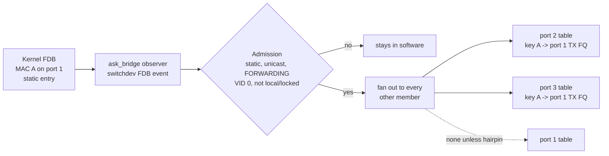
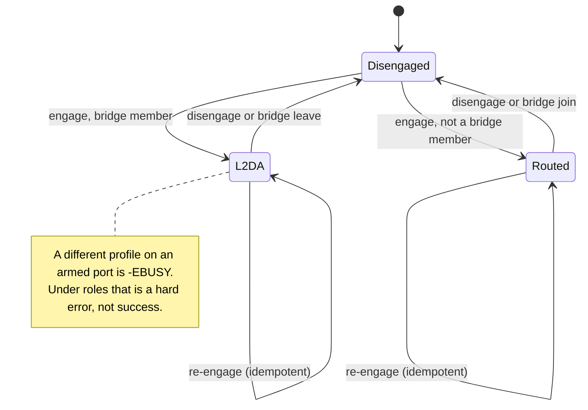
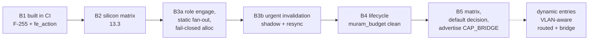

# ASK2 L2 bridge HW offload — switchdev FDB → L2 ehash (`PORT_ID|DA|SA|ETYPE`) → FE-VM `ENQUEUE_PKT`

**2026-10-09 · dpaa1 · T-M6-2 · Implementation plan (B0 done, B1 code written but dormant; DA-only key; production gap review and decisions in §13).**

> **2026-10-09 review.** The vendor bridge mechanism was re-read against
> ASK2 at `ab1660a7` (per-port + per-family offload granularity). The
> result is §13: a gap list (G1-G13), eight design decisions (D1-D8), the
> concrete B2 test matrix, and a re-ordered B2-B5 sequence. Where an older
> section below contradicts §13, §13 wins; the affected paragraphs carry an
> inline "2026-10-09" correction.

**Parity constraint (binding for every later offload).** ASK2 must reach
near-parity with the vendor (IPsec ESP, PPPoE, multicast, tunnels). Today a
port has exactly one KeyGen scheme, hence one key format and one ehash
table; the vendor walks several tables per port (IP tuples, ESP, PPPoE, L2).
F-255's per-port key profile is the extension point for new key formats, but
a port that must offload two traffic classes with different keys at once
(for example routed + ESP) needs multi-table dispatch per port, which ASK2
does not have yet. Design new offloads so they can ride a profile now and
move to multi-table dispatch later without changing their record format.

Offload the steady-state fast path of a Linux software bridge in FMan
silicon: a frame whose destination MAC is a known, non-local FDB entry
reachable on another bridge port forwards via a dedicated L2 ehash table,
with the CPU bypassed — the same ehash/FE-VM mechanism ASK2 already uses
for routed/NAT/VLAN offload (`plans/ASK2-REWRITE-PLAN.md` Baseline), keyed on L2
fields instead of an IP 5-tuple. Full architecture comparison against the
vendor and the rationale for this mechanism:
`plans/ASK2-BRIDGE-OFFLOAD-ARCHITECTURE-ANALYSIS.md`.

**Why ehash:**
- The vendor's own bridge dataplane (`cdx_ehash.c` `fill_bridge_actions()`,
  called from `add_l2flow_to_hw()`) is a dedicated ehash table
  (`cdx_ethernet_cc`, `specs/reference/nxp-ask-fmc/cdx_pcd.xml:53-57,207-219`),
  keysize 15 = `PORT_ID(1)+DA(6)+SA(6)+ETYPE(2)`, max 512 entries, reusing
  the identical opcode/action-chain mechanism (`STRIP_ETH_HDR`/
  `STRIP_ALL_VLAN_HDRS`/`INSERT_VLAN_HDR`/`INSERT_L2_HDR`/`ENQUEUE_PKT`) as
  routed flows — not a CC-tree/match-table classifier.
- A kprobe A/B on `rx_default_dqrr` (the software RX dequeue callback)
  showed ehash/FE_ENTER-dispatched traffic produces near-zero software-RX
  touches (197 hits for 8.77 GB transferred), confirming genuine CPU
  bypass. This is the mechanism this plan targets for bridging too.

**What's reused as-is:** the switchdev notifier skeleton (`ask_bridge.c`,
§5) and the kernel-authority/fail-closed model (§4) are topology-
independent and already built. **What's new:** the ehash key builder and
action emitter (§5, §6).

## 1. Goal and non-goals

**Goal.** Offload the steady-state fast path of a Linux software bridge: a frame
whose **destination MAC is a known, non-local FDB entry reachable on another
bridge port in the forwarding state** is forwarded in FMan silicon (DA match →
enqueue to the egress port TX FQ) with the CPU bypassed, exactly as routed
unicast is today. Everything else stays in the kernel bridge.

**Non-goals / permanently software (fail-closed, `-EOPNOTSUPP`):**
- **BUM traffic** — broadcast, unknown-unicast, multicast/flooded frames. No
  hardware replication in this task (multicast/MDB is T-M6-MC, a separate heavier
  primitive). Flooded frames go to the kernel.
- **Local termination** — frames to the bridge's own MAC (`is_local` FDB entries);
  the kernel must see them.
- **Control planes** — STP/RSTP BPDUs, LLDP, LACP, 802.1X: never offloaded; the
  bridge owns port state and these frames must reach it.
- **Learning / ageing / move** — done by the kernel bridge. ASK2 only mirrors the
  resulting FDB into hardware and removes entries the kernel deletes/ages.
- **Non-forwarding port states** — a port that is STP-blocked/listening/learning
  offloads nothing; only `BR_STATE_FORWARDING` ports carry HW entries.
- **VLAN-aware bridging with tag edits** — deferred (§9). The first cut is
  untagged bridging (and 802.1Q-transparent forwarding where no tag edit is
  needed). Tag push/pop on a bridged frame reuses the ehash VLAN opcode chain
  (`STRIP_ALL_VLAN_HDRS`/`INSERT_VLAN_HDR`, proven on the routed VLAN path —
  `plans/archive/ASK2-REWRITE-PLAN-2026-10-09.md` Phase 1, 2026-10-04/06), and is a later
  increment.

## 2. Why this is the leanest new capability (established facts)

Silicon-proven mechanisms already exist in-tree; the bridge lane is
composition, not new silicon research:

**KeyGen can extract L2 fields.** `KG_SCH_KN_MACDST` (bit 30, 6 B),
`KG_SCH_KN_MACSRC` (bit 29, 6 B), `KG_SCH_KN_ETYPE` (bit 26, 2 B),
`KG_SCH_KN_TCI1/2` (bits 28/27) are all hard-parser known-field bits
(`arch/fman-microcode-210-programming-reference.md:416-420`,
`specs/fman-keygen-flow-key-spec.md:292-296`). The **vendor** proves L2 is a
first-class offloaded class on this exact silicon: live `.106` scheme 11
`0xe4000000` = `PORT_ID|MACDST|MACSRC|ETYPE` (`kgse_mode 0x80000006`, AC_CC)
carried **1,225,734 packets — the busiest scheme on the board**
(`arch/fman-vendor-source-extraction-2026-08-07.md:145-146`). The vendor FMC
L2 classifier `cdx_ethernet_cc` is `keysize=15` = `PORT_ID(1)+DA(6)+SA(6)+
ETYPE(2)` (`specs/reference/nxp-ask-fmc/cdx_pcd.xml:53-57,207-219`) and is the
**last** distribution in each port's `dist_order` — the catch-all L2 lane
walked after the IP tuple lanes. **This is also the key format the ehash
design below uses verbatim** (§3, §6.3.1 of the architecture analysis).

**Consequence: a bridge FDB entry is an ehash record, keyed on
`PORT_ID|DA|SA|ETYPE`, whose action is `ENQUEUE_PKT` to the egress port's
no-confirm TX FQ** (plus the VLAN opcode chain for tagged bridging, §9).
This reuses ASK2's already-proven ehash/FE-VM infrastructure
(`ask_fe_flow_insert()`, CRC-64 bucket indexing, per-key incremental
add/remove) — it is the same kind of capability as routed/NAT/VLAN, with a
different KeyGen key.

## 3. Topology decision (the load-bearing choice)

```
                           ┌────────────────── bridge-only member ports (br0: eth3, eth4, ...)
ingress → Parser → KeyGen (per-port scheme: PORT_ID|DA|SA|ETYPE, 15 B)
                              │
                              │  ehash HIT (known unicast FDB entry, egress port FORWARDING)
                              ▼
                   FE-VM record: ENQUEUE_PKT (untagged)
                   or STRIP_ALL_VLAN_HDRS→INSERT_VLAN_HDR→INSERT_L2_HDR→ENQUEUE_PKT (tagged, §9)
                              │
                              ▼
                   enqueue → per-egress no-confirm TX FQ  (CPU bypassed — same FQ routed/NAT/VLAN use)

                              │  ehash MISS (BUM, unknown DA, control, or table-full fallback)
                              ▼
                        KG-default/PCD FQ → kernel bridge (floods/terminates/learns)
```

**Chosen model: a dedicated per-port L2 KeyGen scheme feeding a dedicated L2
ehash table, scoped to ports that are bridge-only** (no simultaneous routed
scheme on that physical port in v1). No CC-tree, no CC-miss→FE_ENTER chain,
no `miss_fe_off` wiring — an ehash miss falls straight through to the
ordinary KG-default FQ, the same as any other unclassified frame.

**Why this is scoped to bridge-only ports.** Arming a routed scheme and an
L2 scheme on the same port at the same time isn't possible on this
silicon: scheme selection is a first-match SI-walk, so a second match-all
(`kgse_mv=0`) scheme is dead on arrival (`specs/ask2-ipv6-dual-lane-key-design.md`;
`specs/ask2-shared-table-multi-protocol-design.md` §17.2); a distinct
non-zero-`kgse_mv` scheme needs an LCV/NetEnv split, which has repeatedly
wedged multi-port silicon (`ask2-shared-table-multi-protocol-design.md`
§16.3); and CCOBASE selects an ehash table per *scheme*, not per key field,
so one scheme cannot feed two differently-keyed tables either
(`ask2-ipv6-dual-lane-key-design.md`). **This only matters for a port that
needs both roles simultaneously.** A pure bridge member port (the common
case — "two hosts purely switched, no L3 involved", §1's goal) simply arms
the L2 scheme instead of the routed scheme, so there is no conflict to
resolve. This mirrors real switch deployments: a bridge's L3 role (an
IRB/SVI with an IP address) lives at the bridge/VLAN-interface level, not
on the physical member port. **A single physical port that must
simultaneously hardware-route some traffic and hardware-bridge other
traffic is explicitly out of scope for v1** and stays software-forwarded
until a later increment.

*2026-10-09 correction.* The vendor does support both on one port: every
port's `dist_order` walks the IP, ESP, multicast and PPPoE distributions
first and `cdx_ethernet_dist` last, so L2 is reached only when the L3
lookups miss (`dpa_app/files/etc/cdx_pcd.xml` `cdx_ethport_N_policy`).
ASK2 cannot do that yet (one scheme, one table per port), which is why v1
is bridge-only. How a port becomes bridge-only is decision D1 in §13; the
path to routed+bridge coexistence is multi-table dispatch (§13 G2).

**Key format (vendor-matched):** `PORT_ID(1)+DA(6)+SA(6)+ETYPE(2)` = 15
bytes, mirroring the vendor's `cdx_ethernet_cc` exactly
(`specs/reference/nxp-ask-fmc/cdx_pcd.xml:53-57,207-219`). The byte layout
and extraction order for this exact composite are already silicon-confirmed
via `probe3` mode 2 (§8 point 1). DA-only matching (masking SA/ETYPE to
don't-care) is a vendor-supported option (`cdx_ethernet_cc` declares
`masks="yes"`) worth testing as a simpler first cut, since it is closer to
a textbook FDB (keyed only by destination) than the vendor's full
flow-specific composite.

**Table capacity and admission (smart-switch pattern, from the vendor's
`auto_bridge.ko`):** the vendor's own hardware table caps at 512 entries
(`cdx_ethernet_cc max=512`) despite tracking up to 5000 flows in software
(`ABM_DEFAULT_MAX_ENTRIES`) — it does not install a hardware entry the
instant a MAC is learned. Mirror this with a flow-promotion ladder (seen →
confirmed → fast-forwarded) before an ehash install, not an immediate
install on the first `SWITCHDEV_FDB_ADD_TO_DEVICE` (§5, §12).

## 4. Kernel authority — switchdev FDB (not `ndo_fdb_add`)

The Linux bridge is the single source of truth. ASK2 subscribes to the switchdev
notifier chains and mirrors **only** offloadable FDB entries into hardware.
`ndo_fdb_add`/`ndo_fdb_del` are the "bridge bypass" path and are **explicitly
discouraged** for switchdev offload (`Documentation/networking/switchdev.rst`);
we do not implement them (optionally `ndo_fdb_dump` later to visualise the HW
table, not required).

**Registration (module-global, once):**
- `register_switchdev_notifier()` (atomic chain) — carries
  `SWITCHDEV_FDB_ADD_TO_DEVICE` / `SWITCHDEV_FDB_DEL_TO_DEVICE`. Runs under RCU;
  **must defer** to a workqueue (deep-copy `addr`, `dev_hold()`, `queue_work()`)
  because CC install sleeps.
- `register_switchdev_blocking_notifier()` (blocking chain) — carries
  `SWITCHDEV_PORT_ATTR_SET` (STP state, bridge port flags, ageing) and
  `SWITCHDEV_PORT_OBJ_ADD/DEL` (VLAN/MDB — reject/ignore for now).
- `register_netdevice_notifier()` — track `NETDEV_CHANGEUPPER` bridge join/leave;
  call `switchdev_bridge_port_offload()` / `_unoffload()` on join/leave.

**Event struct** `struct switchdev_notifier_fdb_info { addr; vid; added_by_user:1;
is_local:1; locked:1; offloaded:1; }`. Admission filter in the work item:
- **skip `is_local`** (terminate on bridge — kernel keeps it),
- **skip `locked`** (802.1X MAB — bridge does not offload these),
- program only `added_by_user` (static) unicast entries whose egress port is
  a DPAA member in `BR_STATE_FORWARDING` (2026-10-09: this bullet used to say
  "both static and dynamic", which contradicted §8 point 6 and §11 point 1;
  dynamic entries wait for an ageing mechanism, §13 D4);
- after a successful ehash install, fire `SWITCHDEV_FDB_OFFLOADED` (set
  `.offloaded = true`, `call_switchdev_notifiers()`) so `bridge fdb` shows
  `offload` and the bridge tracks HW ownership.

**Port attributes:**
- `SWITCHDEV_ATTR_ID_PORT_STP_STATE` — a port leaving `FORWARDING` must
immediately drop all its HW entries (remove the matching ehash keys, in
its own table and in every other member's table that points at it, §13
D3); a port entering `FORWARDING` may re-mirror the kernel FDB.
- `SWITCHDEV_ATTR_ID_BRIDGE_AGEING_TIME` — informational; ageing is the kernel's
  job. ASK2 removes an entry only when the kernel sends `FDB_DEL_TO_DEVICE`. To
  keep the kernel's ageing correct for *hardware-forwarded* flows (whose source
  MAC the CPU never sees), the driver must refresh FDB "used" via the same
  mechanism switchdev drivers use (`SWITCHDEV_FDB_ADD_TO_BRIDGE` learning-sync or
  periodic `fdb` update from HW hit counters) — see §8 open item.
- `SWITCHDEV_ATTR_ID_PORT_BRIDGE_FLAGS` — honour `BR_LEARNING`/`BR_FLOOD` etc.:
  if learning is off or a flag combination we cannot honour is set, fail closed
  (no HW entries for that port).

Reference drivers to mirror (API-identical, HW backend differs): DPAA2 switch
`dpaa2-switch.c` (closest Freescale shape), `am65-cpsw-switchdev.c` (compact),
`adin1110.c` (smallest two-chain example).

## 5. Board / driver API extensions required (all software)

1. **L2 ehash key builder.** A `cc_pack_key_l2()`-equivalent for the ehash
   path: pack the 15-byte `PORT_ID|DA|SA|ETYPE` composite (reusing the
   byte-layout fact already silicon-confirmed in §8 point 1), and compute
   the CRC-64 bucket index the same way the routed/
   NAT/VLAN ehash tables already do (`fman_pcd_crc64()`,
   `fman_pcd_ehash_bucket_index()`). KUnit vectors for DA-only and full
   `PORT_ID|DA|SA|ETYPE` keys, mirroring the existing routed 14-byte
   match-key fixup (`0167`).

2. **Dedicated per-port L2 KeyGen scheme.** EKFC `0xe4000000` =
   `PORT_ID(bit 31)|MACDST(bit 30)|MACSRC(bit 29)|ETYPE(bit 26)`, AC_CC
   dispatch to the new L2 ehash table's CCOBASE. Armed **only** on ports
   that are bridge-only in v1 (§3.1) — arming this scheme and the routed
   scheme on the same port at the same time is out of scope and must be
   rejected/fail closed, not silently attempted.

3. **Bridge-forward action = `ENQUEUE_PKT`, no HMTD for untagged.** Reuse
   the existing ehash/FE-VM record builder and the existing per-egress
   no-confirm TX FQ resolver (`ask_hw_resolve_oif_fqid`, F-199
   `0x2ba`/`0x2bb`) — the same FQ routed/NAT/VLAN flows already enqueue to.
   Tagged bridging adds the VLAN opcode chain (§9) on top of the same
   record, reusing the Phase 1 VLAN fixes (opcode ordering, byte order,
   RX buffer/alignment — `plans/archive/ASK2-REWRITE-PLAN-2026-10-09.md`
   patches `0215`/`0217`/`0218`) rather than rediscovering them.

4. **Per-port L2 ehash table + software shadow, with a flow-promotion
   ladder (not immediate install).** `ask.ko` keeps a per-port software
   shadow of candidate (DA, SA, ETYPE) tuples and promotes an entry through
   `SEEN → CONFIRMED → INSTALLED` before calling the ehash add-key path —
   mirroring the vendor `auto_bridge.ko`'s `L2FLOW_STATE_SEEN →
   CONFIRMED → FF` ladder (architecture analysis §2.4) — rather than
   installing on the first `SWITCHDEV_FDB_ADD_TO_DEVICE`. Installs/removes
   are **per-key**, not a whole-table rebuild (the ehash add/remove path
   ASK2 already uses for routed/NAT/VLAN flows) — this structurally
   eliminates the CC-tree's whole-tree-rebuild-under-churn lock-scope bug
   class §11 had to patch once. A table-capacity bound (start from the
   vendor's own 512-entry precedent, confirm the real per-table budget on
   this silicon) **fails closed to software** past the cap, same principle
   as the original plan.

5. **`ask_bridge.c` — replace the stub.** Unchanged in shape from the
   original plan: switchdev notifier registration (already done, B0),
   the FDB workqueue + admission filter (already done, B0) now additionally
   implementing the promotion ladder (item 4) and calling the ehash
   add/remove path (items 1-3) instead of `fman_pcd_cc_static_install`,
   STP-state handling, and teardown. Add a global `bridge_offload` kill-switch
   module param (the same role `vlan_offload`/`pppoe_offload`/`ipv6_hw_frag`
   play; default 0 until B5, then 1), the `ASK_CAP_BRIDGE` advertise gate in
   `ask_genl.c`, and `ask-check` / `show flows` / `support-bundle` bridge
   observability. 2026-10-09: the earlier `ask_bridge_offload` per-feature
   param and the per-port bridge bit no longer exist (§12 banner); there is
   no per-port bridge knob, only the engaged-port rule plus this one global
   switch (§13 D8).

## 6. Staged implementation increments (each build + silicon-gated)

- **B0 — DONE 2026-09-10 — S0 gate + host plumbing (dormant, zero datapath
  change).** The switchdev notifier skeleton (`ask_bridge.c`, replacing a
  21-line lifecycle-only stub) that **logs** offloadable FDB events
  (coalesced+bounded queue) but installs nothing. `ASK_CAP_BRIDGE` stays
  unadvertised; the `ask_bridge_offload` module param shipped default-off
  (historical: removed 2026-10-09, replaced by the `bridge_offload` global
  kill switch planned in §13 D8). Gate: builds
  clean; routed/NAT/VLAN byte-identical (untouched); `ask-check` reports
  bridge as legitimately dormant, not broken. Reused as-is for the ehash
  design — the switchdev notifier chains, workqueue, and admission filter
  are topology-independent (§4).

- **B1 — code written 2026-10-07, not yet built in CI — per-port key
  profiles + DA-only key + `ENQUEUE_PKT` action.**
  - *Key decision: DA-only first* (§8 point 4). The key is the frame's
    6-byte destination MAC (EKFC `0x40000000`, `KG_SCH_KN_MACDST`), one
    record per FDB entry, fed directly by switchdev FDB events. No
    PORT_ID byte (per-port tables already separate ingress ports, and it
    avoids the §8 point 1 `0x00`-vs-hwport question), no SA, no promotion
    ladder. The vendor's 15-byte `PORT_ID|DA|SA|ETYPE` composite stays a
    later option: it changes only the profile row and the key builder,
    plus a traffic-learning entry source that DA-only never needs.
  - *Kernel, F-255 (`bin/kernel-fixups/F_255.py`):* per-port FE key
    profiles. A port has one KeyGen scheme, so one key format and one
    per-port ehash table; until now both were hardwired to the 46-byte
    dual-lane routed key (F-224/F-225). `fman_pcd_fe_engage_profile(fm,
    port, fqid, profile)`; `fman_pcd_fe_engage()` = ROUTED (unchanged).
    L2_DA arms EKFC MACDST alone (`keygen_scheme.ekfc_only` skips the
    F-224 GEC override) and sizes the per-port table to 6 bytes.
    Re-engaging an armed port with another profile is `-EBUSY`; disengage
    resets it to ROUTED. Later offloads (ESP, PPPoE, L2 tunnels) add
    profile rows rather than new arming paths.
  - *ask.ko:* `ask_bridge_fe_action()` builds the record action for one
    FDB entry: key = DA, table 0, HIT = plain `ENQUEUE_PKT` to the egress
    port's no-confirm TX FQ via `rx_fqid` (`tx_fqid` stays 0, so no
    `INSERT_L2_HDR`). Rejects broadcast/multicast/zero DAs. KUnit suite
    `ask_bridge` (`tests/ask_test_bridge.c`).
  - *Verified so far:* F-255 applied to a locally derived copy of the CI
    kernel tree (same patch series + fixups), `fman/` compiles,
    `test-fixups.sh` [1]-[4] OK; ask.ko and `ask_kunit.ko` compile.
    Still to do: CI build, KUnit run (`kunit` input), and a routed
    regression run on `.185` showing ROUTED ports are byte-identical
    (`pcd-snapshot`, A6 spot check).
  - *Known ceiling:* every ehash record's `ENQUEUE_PKT` param carries
    MTU 1500 (routed records too); bridged jumbo frames need that
    revisited before B5. 2026-10-09: F-262 gave records that ask for it a
    real egress MTU plus the `05 PREEMPTIVE_CHECKS` opcode and a frag-info
    block. Bridge records must NOT ask for it: the vendor sets
    `l2_info.mtu = 0xffff` for bridge flows, and a bridge never fragments.
    Keep bridge records on the no-`05` path (§13 D7).
  - *Known dormancy (2026-10-09):* nothing calls
    `fman_pcd_fe_engage_profile(..., L2_DA)` at runtime.
    `ask_hw_offload_engage()` always calls `fman_pcd_fe_engage()` (ROUTED),
    so B1 compiles but no port can reach the L2 profile. Closing that is
    the first item of B3 (§13 D1, G1).

- **B2 — not started — ehash silicon de-risk (the decisive proof).**
  Hand-arm a single L2 ehash entry (fixed destination MAC → `ENQUEUE_PKT`
  to the other port's no-confirm TX FQ) on a sacrificial bridge-only port,
  cold boot. Prove on silicon: (a) the frame is forwarded out the egress
  port, **and** (b) it does so with the CPU genuinely bypassed — confirmed
  via a `rx_default_dqrr` kprobe A/B (near-zero hits for the bulk of the
  traffic, not just "frames arrive"; see
  `plans/ASK2-BRIDGE-OFFLOAD-ARCHITECTURE-ANALYSIS.md` §4.1 for why that's
  the right acceptance bar). **This is the single new silicon question
  gating B3.** The full test matrix (key A/B, PORT_ID byte, non-IP frame,
  arm/detach, capacity, tagged pass-through) is §13.3; run it as one
  cold-boot session per variable (AGENTS §10.9/§10.10).

- **B3 — `ask.ko` production switchdev wiring (gated on B2 PASS).** Replace the
  `ask_bridge.c` stub. 2026-10-09: B3 is larger than this paragraph first
  assumed; it has four prerequisites that B1 does not provide (§13 G1, G3,
  G5, G6): port-role selection at engage, FDB fan-out across the other
  members' ingress tables, an authoritative shadow with urgent invalidation,
  and a fail-closed table-allocation path. FDB workqueue (promotion ladder,
  §5 item 4, only if the 15-byte key wins at B2) installs/removes
  ehash records via the B1 builder; STP-state and port-flag handling;
  `SWITCHDEV_FDB_OFFLOADED` ack; bridge join/leave via
  `switchdev_bridge_port_offload`. BUM/unknown-DA/local/control all miss → kernel.
  Gate: two-port bridge (eth3↔eth4 in `br0`), a known-unicast flow forwards in HW
  (confirmed via the same kprobe test as B2), broadcast/unknown-unicast/BPDU stay
  in SW, no routing regression.

- **B4 — lifecycle + teardown.** FDB del / flush → remove the ehash key (per-key,
  no whole-tree rebuild to reason about); STP leave-FORWARDING → drop that port's
  entries (in every member's table, §13 D3); port down / bridge leave /
  `bridge_offload=0` / module unload /
  reboot → detach the L2 KeyGen scheme, restoring the port to its prior
  `next_engine` (RSS or routed, whichever it was before bridging armed), quiesce,
  never churn VyOS config mid-teardown; `pcd-snapshot` byte-clean after. Gate:
  forward+inverse + concurrency (CONFIG_DEBUG_LIST/lockdep) + resource
  (`muram_budget` returns to baseline).

- **B5 — matrix + productization.** Learn/move/delete/age, port down, STP blocked,
  multi-port bridge, FDB churn under load, table-full fallback, ageing
  correctness for HW-forwarded flows (§8 open item), performance vs SW bridge
  (must not regress the ~10 G routed path when both coexist on different ports),
  safety (no BUM/control bypass). Only then advertise `ASK_CAP_BRIDGE`, add the
  `show offload` bridge label, and make the default-on/off decision.

### De-risk experiments before B3 (cheap, sacrificial port)
1. Confirm the dedicated L2 scheme arms and detaches cleanly, restoring the
   port's prior `next_engine`.
2. B2 (above) is the gating go/no-go for the whole production path.

## 7. Per-feature acceptance contract (master-plan §4.6.5 — all must pass)

1. **Semantic:** capture proves a known-unicast bridged frame egresses the correct
   port in HW; broadcast/unknown-unicast/multicast/BPDU/local demonstrably stay in
   software (kernel bridge floods/terminates).
2. **Kernel-authority:** an FDB entry is `offload`-marked only after successful
   ehash install; the kernel bridge remains authoritative for learning/ageing/STP/VLAN;
   control frames stay visible to the bridge.
3. **Forward + inverse:** FDB add/del/flush, MAC move (port change), STP state
   change, bridge port add/remove, ageing expiry, interface down/up, config
   removal, module unload, reboot.
4. **Concurrency:** async FDB add/del under lockdep/CONFIG_DEBUG_LIST + ehash
   install/remove racing disengage; no poison/double-free/stale-generation/deadlock.
5. **Resource:** force the ehash table-capacity boundary/MURAM exhaustion → clean
   fallback to SW bridge; `muram_budget` + `pcd-snapshot` return to baseline; no
   partial publication.
6. **Performance:** HW bridge vs SW bridge on the reproducible harness (throughput,
   per-core CPU, error deltas, MTU); must not regress the ~10 G routed path when a
   port both bridges and routes.
7. **Safety:** BUM, unknown-DA, STP-blocked, local, and control frames cannot be
   silently HW-forwarded; no bypass of STP/VLAN/bridge semantics.
8. **Observability:** `ask-check`/`show flows`/`support-bundle` identify the bridge
   feature, owner (switchdev cookie), state, fallback reason, and errors without
   debugfs control writes.
9. **Capability:** only then set `ASK_CAP_BRIDGE` and mark T-M6-2 DONE.

## 8. Unresolved silicon questions (resolve read-only before arming)

1. **CC comparator window for a DA-bearing key — RESOLVED 2026-09-15.** Live
   `probe3` mode 2 capture on `.185`/eth1 (widened-RICP, `bin/kernel-fixups/
   F_240.py`/`F_241.py` + this session's mode-2 extension, F-247/F-248) directly
   observed the KeyGen-extracted composite for the armed L2 scheme
   (EKFC `0xe4000000`) against a real live frame. DST_MAC and ETHERTYPE landed
   at their exact expected byte positions with unambiguous real-world values
   (`33:33:00:00:00:fb` = the real `ff02::fb` multicast DST_MAC seen later in
   the same capture; `0x86dd` = the real IPv6 EtherType, matching this
   packer's own byte order) — confirming the 15-byte `PORT_ID|DA|SA|ETYPE`
   layout and field order are correct, not just byte-perfect against a guess.
   One real defect found and fixed (patch `0208`): PORT_ID (byte 0) extracts
   as the REAL hardware port id (`0x0d` on eth1) on this scheme, not the
   `0x00` every other CC key type on this ucode has shown — `cc_pack_key_l2()`
   was hardcoding `0x00`. The vendor's live 15-byte `cdx_ethernet_cc` was
   strong prior evidence the layout works; this is now direct, first-party
   confirmation, not just precedent.
2. **Does a bridge-only port's dedicated L2 scheme arm and detach cleanly?**
   Confirm the L2 KeyGen scheme arms without disturbing other ports, and
   that detaching it restores the port's prior `next_engine` exactly
   (routed, RSS, or disengaged, whichever it was). This is B2's actual
   scope (§6).
3. **Real per-table ehash capacity on this silicon.** The vendor's
   512-entry `cdx_ethernet_cc` is a precedent, not a confirmed ASK2 number
   — measure the actual MURAM/table budget for a dedicated L2 ehash table
   on this build before picking its capacity cap.
4. **DA-only vs full 15-byte key — DECIDED 2026-10-07: DA-only first** (B1
   above); the composite remains a later profile. 2026-10-09: B2 runs both
   keys as an A/B (§13.3), because the choice drives capacity and fan-out,
   not just simplicity: DA-only needs one record per (DA, other-ingress-port)
   and cannot carry a VID; the vendor's per-flow 15-byte key needs one record
   per observed flow and a traffic-driven entry source (§13 D2). Original note: the vendor's `cdx_ethernet_cc` supports
   masking (`masks="yes"`), so a DA-only key (6 bytes, SA/ETYPE wildcarded)
   is a plausible simpler first cut closer to a textbook FDB. Untested;
   worth an early A/B against the full 15-byte composite before committing
   to one in B1.
5. **Non-IP frame through the ehash/enqueue path.** The VLAN/routed proofs were IP
   frames. A pure L2 bridge forward of a non-IP known-unicast frame (e.g. a
   protocol the parser doesn't deep-parse) through an L2 ehash hit + plain
   `ENQUEUE_PKT` is unexercised. Base case (untagged, no VLAN opcodes) should be the
   safest possible path, but must be captured. Control/BUM stays SW regardless.
6. **Ageing of HW-forwarded flows.** The CPU never sees the source MAC of a
   hardware-bridged flow, so the kernel bridge could age out an entry that is
   actively forwarding in HW. Mirror the in-tree switchdev pattern: either
   periodically refresh the kernel FDB `used` timestamp from HW hit counters, or
   emit `SWITCHDEV_FDB_ADD_TO_BRIDGE` learning-sync. Decide in B5; until then a
   conservative option is to only offload **static** (`added_by_user`) FDB entries
   (no ageing concern) and treat dynamic entries as SW — a smaller but safe first
   ship. The vendor's `auto_bridge.ko` answers this with a `br_fdb_register_can_expire_cb()`
   callback instead of polling (architecture analysis §2.4) — a cleaner B5+ option
   than hit-counter polling, if dynamic-entry offload is ever wanted.
   2026-10-09: the vendor's callback needs a bridge kernel patch
   (`020-ask-bridge-hooks.patch` touches `br_fdb.c`, `br_input.c`,
   `br_private.h`, `br_stp_if.c`); ASK2 deliberately has none. The
   no-patch options are the hit-counter refresh or static-only (§13 D4).

## 9. VLAN-aware bridging (later increment, reuses the Phase 1 ehash VLAN opcodes)

Untagged bridging (§1) needs no VLAN opcodes at all — just `ENQUEUE_PKT`.
VLAN-aware bridging — a bridged frame that
must have a tag pushed/popped between ingress and egress bridge ports — reuses the
**exact** ehash VLAN opcode chain the routed-VLAN Phase 1 fix proved on silicon
(`plans/archive/ASK2-REWRITE-PLAN-2026-10-09.md` §1 item 1, patches `0215`/`0217`/`0218`:
`STRIP_ETH_HDR`/`STRIP_ALL_VLAN_HDRS`/`INSERT_VLAN_HDR`/`INSERT_L2_HDR` ahead of
`ENQUEUE_PKT`), minus the L3 rewrite/TTL-decrement opcodes a routed record also
carries (bridging doesn't touch TTL). This also matches the vendor's own
`fill_bridge_actions()` exactly (architecture analysis §2.1) — it is the same
opcode family the vendor uses for untagged and VLAN-aware bridging alike. This is
a clean follow-on once §1 base bridging lands; sequence it after B5 and after
multicast (T-M6-MC) if bridge+VLAN filtering is required. Do
not build it into the base case.

## 10. Provenance
- Capability scope + lean-model recommendation: `plans/OFFLOAD-CAPABILITY-PLAN.md`
  §1.5, §2, §3; master task **T-M6-2** (`plans/ASK2-MASTER-PLAN.md` §4.6.4 Phase
  M6-E, gates §4.6.5).
- L2 EKFC fields + vendor L2 evidence:
  `arch/fman-microcode-210-programming-reference.md:416-420`,
  `specs/fman-keygen-flow-key-spec.md:292-296`,
  `arch/fman-vendor-source-extraction-2026-08-07.md:145-146`,
  `specs/reference/nxp-ask-fmc/cdx_pcd.xml:53-57,207-219`.
- Scheme/dispatch constraints (no 2nd match-all, CCOBASE scheme-only, no FE
  branch): `specs/ask2-ipv6-dual-lane-key-design.md`,
  `specs/ask2-shared-table-multi-protocol-design.md` §7.4/§16.3/§17.2.
- switchdev FDB kernel authority (not `ndo_fdb_add`):
  `Documentation/networking/switchdev.rst`, `include/net/switchdev.h`,
  `net/bridge/br_switchdev.c`; reference drivers `dpaa2-switch.c`,
  `am65-cpsw-switchdev.c`, `adin1110.c`.
- Stub to replace: `kernel/ask/oot-modules/ask/ask_bridge.c`; capability bit
  `ASK_CAP_BRIDGE` `kernel/ask/oot-modules/ask/include/uapi/linux/ask/ask.h:204`.
- **Architecture rationale:** `plans/ASK2-BRIDGE-OFFLOAD-ARCHITECTURE-ANALYSIS.md`
  (full vendor-vs-ASK2 comparison, the `rx_default_dqrr` kprobe evidence, the
  per-port-scheme resolution); `plans/archive/ASK2-REWRITE-PLAN-2026-10-09.md`
  §1, §6 Phase 1 (the ehash/FE-VM VLAN fix this plan's mechanism mirrors);
  `/mnt/builds/ASK/auto_bridge/auto_bridge.c` + `auto_bridge_private.h` (vendor
  ABM flow-promotion ladder, the smart-switch admission pattern §5 item 4
  adopts); qdrant tags `ask2-bridge-offload`/`cc-tree-vs-ehash` (2026-10-07).

## 11. FDB churn prevention (design, not just survival)

Churn has four distinct sources; each gets its own lever rather than one
generic "handle churn better" fix:

1. **Ageing-induced churn (self-inflicted, avoidable by construction).** The
   CPU never sees the source MAC of a HW-forwarded flow, so kernel ageing can
   expire an entry that's still actively forwarding in hardware — DEL, then a
   fresh ADD the moment the next frame is punted and relearned.
   **Decision: B3 offloads only static (`added_by_user`) FDB entries by
   default.** Static entries never age — zero ageing-churn by construction.
   §8 point 6 already floated this as *an* option; make it the shipped
   default, not a fallback. Dynamic-entry ageing-refresh (HW hit-counter →
   kernel FDB `used` touch, or `SWITCHDEV_FDB_ADD_TO_BRIDGE` sync) stays a
   B5+ increment, deliberately out of the first cut.
2. **STP topology-change mass-flush.** Deliberate bridge behavior on a TC
   event (fast-age the whole FDB) — must not be prevented, only absorbed
   cheaply. **Add a coalescing/debounce window** (a few ms, e.g. via
   `mod_delayed_work`) between an FDB ADD event and the ehash add call it
   triggers: batch every ADD that arrives inside the window into one pass over
   the per-key ehash API instead of one install call per individual event, and
   don't promote a flapping entry through the SEEN→CONFIRMED ladder (§3)
   prematurely. **2026-10-09: debounce applies to ADD only.** A DEL,
   STP-block, MAC move or port-down is a correctness event: a stale record
   keeps forwarding frames the kernel bridge would no longer forward, so those
   are processed immediately, never delayed or coalesced away (§13 D3). A lock held
   across an install-and-drain-sleep sequence (the same mistake the VLAN
   CC-tree work hit and fixed — `ask_vlan_cc_flow_del()` serialized every
   port behind one flow's teardown until the lock was narrowed to not span
   the drain) must not be repeated here: unlock before any sleep, don't hold
   one global lock across a multi-port operation.
3. **MAC-move churn.** A DEL on the old port + ADD on the new port, close
   together. Process the DEL immediately and debounce only the ADD: the
   window between them is a short software-bridge fallback, which is safe;
   a delayed DEL is not (stale record forwards to the old port).
4. **Table-pressure thrashing.** Fail-install → SW fallback → retry-on-
   relearn can loop at the ehash table-capacity boundary (§8 point 3) under a
   churn burst. Keep deliberate headroom below the cap (do not fill to 100%) so a
   burst doesn't oscillate at the boundary.

**Consequence for B3's design:** the FDB workqueue item must NOT react to
every individual switchdev ADD notification with an immediate ehash install
call, and must not promote a flow through the SEEN→CONFIRMED ladder on a single
flapping event. Coalesce ADDs first (debounce timer keyed per port), then act
once, without serializing unrelated ports behind one port's operation. DEL,
STP-block, move and port-down bypass the debounce (§13 D3).

## 12. Per-port arming ABI + automatic CLI trigger

> **Superseded 2026-10-09 (offload granularity decision).** The per-port
> bridge bit, `ASK_ATTR_BRIDGE`, `ask_hw_offload_set_bridge()` and the
> `apply_ask_bridge_offload` bridge-membership trigger described below were
> removed. Bridge offload is now an automatic part of an engaged port:
> `ask_hw_bridge_offload_armed()` is true while any port has `offload
> ipv4`/`ipv6` armed. Granularity is per port + per IP family only (spec
> `specs/ask2-vlan-cli-grammar.md` §9). The text below is design history.

Extended the same genl engage mechanism VLAN uses (`ASK_CMD_ENGAGE` +
`ASK_ATTR_FAMILY_MASK`/`ASK_ATTR_VLAN`) with a parallel `ASK_ATTR_BRIDGE`
(u8 bool) attribute, and the matching kernel-side per-port array
(`ask_hw_port_bridge[]`, `ask_hw_offload_set_bridge()`,
`ask_hw_bridge_offload_armed_port()`/`_armed()` in `ask_hw.c` — byte-for-byte
mirroring the VLAN functions). `ask_bridge.c`'s FDB observer now reports the
real per-port armed state instead of the placeholder global module param B0
shipped with (removed — see below). `ASK_CAP_BRIDGE` deliberately stays
unadvertised through B0-B2 even though the arm/gate functions now exist for
real, since there is still no FDB install path consuming them (that's
B3).

**Design decision (explicit user direction): no CLI leafNode for bridge
offload.** Unlike VLAN's `offload vlan` (an explicit per-port opt-in the user
sets), bridge offload arms **automatically**: whenever a member port already
has `offload ipv4`/`offload ipv6` armed, joining a bridge (or the bridge
itself being created around it) arms that port's bridge bit with no separate
command. There is intentionally no global master-override module param either
(unlike `ask_vlan_offload`) — forcing bridge offload on for a port with no
family offload armed at all would have nothing to ride on, so a bare
"force everything on" debug knob doesn't mean anything here.

Implementation spans three layers, all now silicon-independent (dormant, same
B0 risk profile — this only changes when the genl bit gets set, not whether
anything installs into hardware):

1. **`board/scripts/vyos-offload-ask`** — `engage`/`family` gained an optional
   3rd `bridge` arg (mirroring `vlan`'s 2nd arg), plus a standalone `bridge
   <0|1>` verb (mirroring `vlan <0|1>`) for re-arming just that bit without
   touching family.
2. **vyos-1x `python/vyos/ifconfig/ethernet.py`** (`data/vyos-1x-051-bridge-
   hw-offload-auto.patch`) — `set_ask_offload()` gained a `bridge: bool`
   param threaded into the tool call. `update()` computes it automatically:
   `ask_mask != 0 and is_bridge_member is not None` — `is_bridge_member` is
   already populated generically for every interface by `configdict.py`'s
   `get_interface_dict()` (the same field `interfaces_bridge.py` itself
   reads), so this needed no new cross-tree lookup. Covers the "toggle
   `offload ipv4` on a port that's already in a bridge" direction entirely
   within ethernet.py's own existing commit path.
3. **vyos-1x `src/conf_mode/interfaces_bridge.py`** (same patch) — new
   `apply_ask_bridge_offload()`, called from `apply()`. Covers the reverse
   direction: a bridge's own commit (member added/removed) doesn't re-trigger
   `interfaces_ethernet.py`'s conf_mode script by itself, so this function
   directly reads each changed member's current `offload ipv4`/`ipv6`/`vlan`
   config (via `get_interface_dict(conf, ['interfaces', 'ethernet'],
   ifname=interface)`, the identical pattern this file already uses for
   vxlan/openvpn members) and calls `EthernetIf(interface).set_ask_offload(
   mask, vlan, bridge=<joined>)` directly. Deliberately does **not** use
   VyOS's declarative `set_dependents`/`call_dependents` dependency-graph
   machinery (the pattern the file uses for vxlan/wlan/firewall deps) —
   registering a new dependency type there needs an entry in a separate
   build-generated dependency-graph file, more moving parts than this
   self-contained direct call needs for what is still a B0-risk-profile,
   log-only change.

**Not yet done:** no full-CI build/deploy verification of this specific
patch (T-M6-2 B0's baseline commit `d4e50ac4` + these ABI/CLI additions were
built and syntax-checked locally — `ask.ko` against the CI kernel cache,
both vyos-1x Python files with `py_compile` plus a full patch-series
round-trip against a fresh vyos-1x clone — but not yet run through a real CI
build+deploy+live-bridge-test cycle the way B0 itself was).

## 13. Review 2026-10-09: vendor parity gaps, decisions, B2 matrix

This section records a read of the vendor bridge mechanism (`/mnt/builds/ASK`:
`cdx/cdx_ehash.c`, `auto_bridge/auto_bridge.c`,
`dpa_app/files/etc/cdx_pcd.xml`, `patches/kernel/020-ask-bridge-hooks.patch`)
against ASK2 at commit `ab1660a7`. Vendor-side detail is in
`plans/ASK2-BRIDGE-OFFLOAD-ARCHITECTURE-ANALYSIS.md` §2.5 and §6.7. Nothing
here changes the datapath; it fixes the order of work and the contract B3 must
meet. **D1 and D8 were confirmed by the operator on 2026-10-09**; D2-D7 follow
from vendor evidence and the existing plan decisions.

### 13.1 Where ASK2 stands

| Piece | State |
|---|---|
| B0: switchdev FDB observer, log-only (`ask_bridge.c`) | Done; queue holds 1024 events and drops on full |
| B1: F-255 `L2_DA` profile + `ask_bridge_fe_action()` | Code written, KUnit-covered, **not built in CI**, no runtime caller |
| `ask_hw_offload_engage()` | Always ROUTED; `-EBUSY` treated as idempotent success (F-122/F-124) |
| `ASK_CAP_BRIDGE` | Unadvertised (`ask_genl.c`); `ask_hw_bridge_offload_armed()` is true when any port is engaged |
| B2 silicon proof | Not started |

The vendor path for comparison: `auto_bridge.ko` hooks `NF_BR_FORWARD` /
`NF_BR_POST_ROUTING`, marks a frame `abm_ff` only on a known-unicast dst-FDB hit
in `br_handle_frame_finish`, tracks the flow SEEN → CONFIRMED → FF, and sends
`L2FLOW_ENTRY_NEW` over `NETLINK_L2FLOW` to cmm, which forwards
`FPP_CMD_RX_L2FLOW_ENTRY` over FCI to cdx. cdx builds one **per-flow** ehash
record in the ingress port's ETHERNET table with key
`portid(1)+DA(6)+SA(6)+ethertype(2)` = 15 B and `l2_info.mtu = 0xffff`
(no MTU check). ASK2 replaces that whole chain with switchdev FDB events and
needs no bridge kernel patch.

### 13.2 Gaps

| # | Gap | Why it matters | Closed by |
|---|---|---|---|
| G1 | Port role is not selectable. `ask_hw_offload_engage()` always arms ROUTED and swallows `-EBUSY`. | The `L2_DA` profile is unreachable; once roles exist, a profile mismatch must be a hard error, not idempotent success. | B3a, D1 |
| G2 | One KeyGen scheme and one ehash table per port. | A second match-all scheme is dead and the LCV split wedged silicon, so one port cannot route and bridge in hardware at once. The vendor does it by chaining distributions (`cdx_ethernet_dist` last in every `dist_order`). | v1 bridge-only members (D1); multi-table dispatch is a later epic |
| G3 | switchdev reports the **egress** port of an FDB entry, but tables belong to **ingress** ports. | A MAC learned on port X needs a record in every other member's table (M MACs × (N-1) ports). None in X's own table unless hairpin is on. | B3a, §13.4 |
| G4 | DA-only key has no VID. | Records are wrong on a `vlan_filtering` bridge or any entry with a non-zero VID. | Fail closed in B3a; real support §9 / D6 |
| G5 | B0 queue drops on overflow and §11 originally debounced DELs. | A dropped or delayed DEL / STP-block / move leaves a stale record forwarding frames the bridge would not. | D3 |
| G6 | `F_255.py` falls back to the global 46-byte table if the per-port `fman_pcd_ehash_table_set()` fails. | EKFC would extract 6 bytes against a 46-byte table key: the structural mismatch that stalled T-M3-R attempt 1 (`plans/archive/ASK2-MASTER-PLAN-2026-10-09.md` §4.1, KeyGen scheme 4 note). L2 engage must fail closed. | B3a |
| G7 | Per-table capacity and per-record footprint are unmeasured. | Bucket mask `0x7fff` means 32768 × 16 B per table, against the vendor's 512-entry cap; spec `ask2-shared-table-multi-protocol-design.md` says the bucket array dominates and every class must pass the live MURAM-budget gate. Fan-out multiplies records. | B2 matrix |
| G8 | Production `fman_pcd_fe_flow_add` passes `stats=false`. | No per-record hit counters, so no observability and no hit-based ageing refresh (D4). | B3/B5 |
| G9 | F-262 gives records that request it `05 PREEMPTIVE_CHECKS`, an MTU and a frag-info block. | Bridge records must not request it; vendor bridge MTU is `0xffff`. | D7 |
| G10 | Churn and lifecycle risks. | The CR-001 MURAM "leak" was F-133's diagnostic tracker, a false signal (`plans/archive/ASK2-MASTER-PLAN-2026-10-09.md` §5); keep `muram_budget` + `pcd-snapshot` as the only truth. Per-table delete cost under mass flush is unmeasured. | B4 gate |
| G11 | Routed flows whose egress (or ingress) is a bridge device (IRB/SVI) are not resolved to a member port. `ask.ko` has no `netif_is_bridge_master` handling outside `ask_bridge.c`'s `NETDEV_CHANGEUPPER`. | They stay in software. The vendor handles this with `cmmBrToFF`. Not board-verified. | Out of scope for v1; D1 documents it |
| G12 | The family mask cannot gate L2 flows. | A DA-only key matches any ethertype, so `offload ipv4` on a bridge member also forwards IPv6 and non-IP unicast in hardware. | D8 (document) |
| G13 | Exclusivity and in-place scheme reprogramming. | The L2 scheme must respect the ASK↔VPP per-interface mutex and must remain compatible with the ingress-policer's `kg_find_port_scheme()` in-place next-engine rewrite. | B3a gate |

### 13.3 B2 test matrix (silicon, cold boot, one variable per session)

B2 hand-arms one L2 record on a sacrificial bridge-only port (never eth0, the
SSH lifeline; eth3/eth4 pair per the board map). Each row is one cold-boot
experiment (AGENTS §10.9, §10.10); record the boot type.

| # | Question | Method | Pass criterion |
|---|---|---|---|
| 1 | Does a `L2_DA` hit plus plain `ENQUEUE_PKT` forward a frame? | Hand-armed DA record to the peer's no-confirm TX FQ | Frame egresses the other port |
| 2 | Is the CPU bypassed? | `rx_default_dqrr` kprobe A/B, bulk traffic | Near-zero hits for the bulk flow |
| 3 | DA-only 6 B vs vendor 15 B composite | A/B on the same flow | Pick by capacity, fan-out cost, VID need (D2) |
| 4 | PORT_ID byte on the L2 scheme | Passive `hash_probe` / CRC-64 check, not assumed | Real hw port id is what the scheme emits (e.g. `0x0d` on eth1 per the 2026-09-15 `probe3` mode-2 capture, patch 0208); never assume the routed `0x00` result transfers |
| 5 | Non-IP and tagged frames | ARP / LLDP-like / 802.1Q frame through a hit | Passes unmodified; documents the deviation from the vendor's unconditional `STRIP_ALL_VLAN_HDRS` (0x12) |
| 6 | Arm and detach restore the prior `next_engine` | `pcd-snapshot diff` after disengage | Byte-clean; `muram_budget used` back to baseline |
| 7 | Real per-table capacity | Insert until failure | Number recorded; sets the admission cap in B3 |
| 8 | Unknown DA, broadcast, BPDU | Send each through an armed port | Miss → default FQ → kernel bridge floods or terminates |

### 13.4 Decisions

**D1 — port role follows the engage trigger; no new CLI leaf (confirmed 2026-10-09).**
Engaging a port (`offload ipv4|ipv6`) selects `L2_DA` if the port is a bridge
member and ROUTED otherwise. A join or leave (`NETDEV_CHANGEUPPER`) is an
explicit disengage then re-engage; routed flows with that port as ingress are
flushed at join. A bridge member is bridge-only in v1, so VLAN, PPPoE and
routed hardware flows on it stay in software (the miss path keeps that
correct), and the routed insert path in `ask.ko` must refuse a port whose
profile is not ROUTED. This matches the 2026-10-09 granularity decision:
per-port engage plus per-family mask, everything else automatic.

**D2 — key format decided by B2 evidence.** DA-only is the B3 default because
FDB events feed it directly and it needs no traffic-learning source. Its cost
is one record per (DA, other-ingress-port). The vendor's per-flow 15-byte key
needs only records for flows actually seen and carries the ethertype, but needs
a traffic-driven entry source. Decide at B2 row 3.

**D3 — urgent, authoritative invalidation.** ADD may be debounced (§11). DEL,
STP-block, MAC move and port-down are processed immediately. The kernel FDB is
the source of truth, with an ask.ko shadow of installed records; on queue
overflow or allocation failure, resync from a bridge FDB dump rather than
trusting the dropped event stream. Never hold one global lock across a
multi-port fan-out.

**D4 — static entries first.** Only `added_by_user` entries. Dynamic entries
need ageing that does not strand a hardware-forwarded flow. The vendor patches
the bridge (`br_fdb_register_can_expire_cb`); ASK2 has no bridge patch, so the
options are a hit-counter refresh (needs `stats=true`, G8) or staying static.

**D5 — BUM, multicast, local, ARP, BPDU and unknown DA stay in the kernel.**
They miss the table and take the default FQ. Local entries (`is_local`) and
`locked` entries are never offloaded.

**D6 — VLAN-aware bridging later, fail closed now.** Skip any entry with a
non-zero VID or on a `vlan_filtering` bridge until §9 lands. The vendor's
`fill_bridge_actions()` calls `insert_remove_vlan_hm` unconditionally for
non-filtered flows, which always emits `STRIP_ALL_VLAN_HDRS` (0x12), even for
untagged frames. ASK2's plain `ENQUEUE_PKT` baseline is a deliberate deviation
and needs proof at B2 row 5; it is not byte-identical to the vendor.

**D7 — no MTU check on bridge records.** Bridge records carry the
no-`05` path (vendor mtu `0xffff`), never the F-262 frag-info block.

**D8 — one global kill switch (confirmed 2026-10-09).** `bridge_offload` module param,
default 0 until B5, same role as `vlan_offload`, `pppoe_offload` and
`ipv6_hw_frag`. `ASK_CAP_BRIDGE` is advertised only after B5. The family mask
is the engage trigger and is documented as not filtering L2 flows (G12); an
operator who wants a bridge's IPv6 in software does not engage that port.

### 13.5 FDB fan-out



### 13.6 Port role state



### 13.7 Re-ordered stages



B1 must first build in CI and pass the routed regression (`pcd-snapshot`,
A6 spot check) before any port is switched to `L2_DA`. B3a's gate is a
two-port bridge forwarding a known-unicast static entry in hardware with the
kprobe A/B, broadcast, unknown unicast and BPDU still in software, and no
routed regression on ports outside the bridge.
