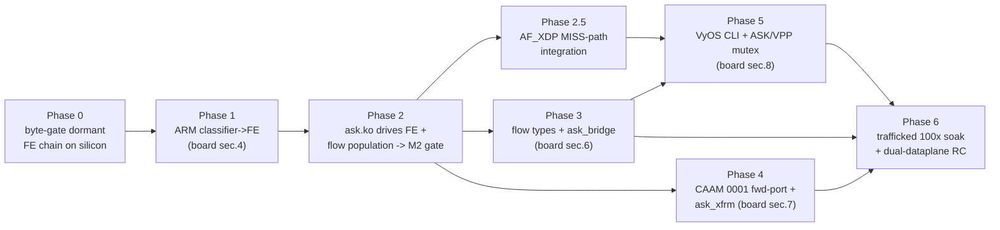

# ASK2 Development Plan — from dormant substrate to operational offload
**Version 1.2.0 · 2026-07-05 · HADS 1.0.0**

---

## AI READING INSTRUCTION

Read `[SPEC]` and `[BUG]` blocks for authoritative facts.
Read `[NOTE]` only if additional context is needed.
`[?]` blocks are unverified — treat with lower confidence.

This plan is execution-oriented and subordinate to two sources of truth: the
silicon contract in [`arch/fman-fe-ehash.md`](../arch/fman-fe-ehash.md) and the
state machine in [`plans/DUAL-DATAPLANE.md`](DUAL-DATAPLANE.md). Where this plan
and those documents disagree, they win. Section 9 is the live execution log.

---

## 1. Current state (ground truth, refreshed 2026-07-04)

**[SPEC]**
The silicon-programming substrate is complete, reversible, and HW-proven
dormant. Since v1.0.0 the following additionally landed on this branch
(compile-verified on 6.18.34 arm64, shipping dormant):

| Increment | State | Anchor |
|---|---|---|
| Real AC_CC arm encoding (`KGSE_MODE 0x80000006`, replaces the `0132` CCBS placebo) | AUTHORED + compiled, **awaiting the one-shot board arm** | board `0133` (commit `fe73b01`→`c4d3bfd` series) |
| CAAM QI descriptor-sharing API in the **common** tree, CAAM stack forced `=y` | **LANDED** — clears the Phase 4(a) forward-port task | board `0134` (commit `bfbfbe7`) |
| FE context builder (`FmPcdCcBuildContextByFE` port from lf-5.4 L8954) | LANDED, dormant | board `0135` (commit `d73dace`) |
| TX confirm bypass (`fman_port_set_silicon_hit_release_mode/_all`) — kills the ~20% QMan DQRR softirq floor | LANDED, dormant, wired into `ask_hw.c` engage/disengage/teardown | board `0136` (commits `d73dace`/`31b7f6c`) |
| MANIP create + chain API (`fman_pcd_manip_create/chain_create/hmtd_off`) | LANDED, dormant; **v2 fixed `HMAN_OC_IP_MANIP` 0x36→0x34 + HMCD_LAST intermediate clearing** | board `0137` (commits `7fa8679`/`1e28dc0`) |
| BMan IVCI crash fix in AF_XDP NAPI refill (`bm_buffer_set_bpid` on all 8 slots) | LANDED | board `0139` (commit `1a93531`) |
| Flow-offload backend slot (external registration API for `dpaa_setup_tc`) | LANDED, wired into CI staging | board `0145` (commit `c4d3bfd`) |
| Legacy ASK flavor patch stack (0001–0065) | ARCHIVED to `archive-2026-06-21-pre-6.18.34/` — common board series 0092–0145 carries everything | commit `c4d3bfd` |
| NXP-RM/SDK byte-level compliance review of the whole datapath (KG/CC/FE-VM/HMCT/TX-bypass) | PASS — every constant verified vs RM + SDK; one critical bug found+fixed (0137 v2) | qdrant `sdk-deep-review-findings` 2026-06-23 |
| Authoritative DTS/DTB sync from `we-are-mono/OpenWRT-ASK` `mono-25.12.0-rc2` | DONE 2026-06-26 (base DTS + SDK overlay + 13 DTSI; `ci-compile-mono-dtb.sh` SDK gate) | `board/dtb/`, qdrant 2026-06-26 |

The remaining work is the five capabilities, surfaced as the `[FAIL]`
lines of `board/scripts/ask-check` (baseline run: board 192.168.1.190, image
`2026.06.17-0315-rolling`, kernel `6.18.34-vyos`):

| Layer | State | Anchor |
|---|---|---|
| FMan PCD subsystem (KeyGen / CC / HM / Policer) | DONE, shipping | board patches `0092`/`0097`–`0100` (commit `f307193`) |
| Reversible mode-switch API + `pcd-snapshot` | DONE, HW-proven (100× control-plane soak, 0 drift) | `0105`/`0106`/`0116`/`0129` |
| FE/ehash VM substrate (dormant chain) | BUILT, DORMANT | `0122`→`0131`, byte-verifiable via `fe_*` debugfs |
| ask.ko control plane (genl, flow table, debugfs, engage entry, TX-bypass wiring) | BUILT | `ask_flow_offload.c` 92 KB, `ask_hw.c` 32 KB, genl id 0x1e |
| Classifier→FE root link armed with **real AC_CC** | **FAIL** — `0133` authored, one-shot board experiment pending | the single datapath gate |
| `ask_bridge.ko` (L2 switchdev) | **FAIL** (stub 417 B) | `kernel/flavors/ask/oot-modules/ask/ask_bridge.c` |
| CAAM descriptor-sharing API | ~~FAIL~~ **LANDED in tree** (board `0134`) — board re-verify pending | `caam_qi_ext_consumer_register` |
| ESP hardware-offload advertise | **FAIL** (stub 1 KB) | `ask_xfrm.c` |
| `set system offload ask` CLI | **FAIL** (not started) | — |

**[SPEC]**
Fork A (classic exact-match `CONT_LOOKUP`) is dead on the 210.10.1 microcode.
iter-49/50 fault-capture (2026-06-16) proved the stall latches zero hardware
fault (`fmdmsr=0`, `fmfp_ee` unchanged, every fault register clean) — it is a
disposition-less WAIT, not a fixable arming bug. Fork B (external-hash + FE
opcode VM) is the only configuration proven to flow on this silicon, and the
dormant `0122`→`0131` chain *is* Fork B fully assembled.

**[NOTE]**
The specs lag the code. `specs/ask2-rewrite-spec.md` §15.1 still lists `ask.ko`
as "NOT STARTED", but on disk its control plane is substantially built (the
~400-byte files `ask_bridge.c`/`ask_caam.c`/`ask_neigh.c`/`ask_op.c`/
`ask_stats.c` and the 1 KB `ask_xfrm.c` are the genuine stubs; everything else
is real). `plans/COMPLETION-PLAN.md` §6 still names the now-dead Fork-A
"MANIP-dedup / `FORWARD_FQ_WITH_MANIP`" as the M2 next step. Section 8 of this
plan enumerates the doc corrections.

### 1.1 ASK 1.x vendor-stack oracle findings (nxp-sdk lineage, 2026-06-23 → 07-02)

**[NOTE]**
In parallel with this branch, the `nxp-sdk` lineage ran the ORIGINAL NXP ASK 1.x
stack (lf-6.12.49 SDK kernel + `cdx.ko`/`fci.ko`/`dpa_app`/`cmm`) on the same
board as a live oracle. That effort is a *reference*, not the implementation
path (91 kLOC legacy vs ~12 kLOC ASK2), but it produced silicon facts ASK2 must
absorb:

**[SPEC]** Findings that de-risk or redirect ASK2 work:

1. **The 210.10.1 ucode accepts full PCD programming** — `dpa_app` v4.03.0
   (we-are-mono/ASK `beefead3`) programmed the complete KG + CC + ehash + policer
   baseline with `rc=0`, all PCD ioctls passing. The silicon side of Fork B is
   proven programmable end-to-end by the vendor tool; residual ASK2 risk is
   confined to our re-implementation fidelity, not silicon capability.
2. **Bridge/L2 offload proven end-to-end** (2026-06-28, commit `d77dbe1` on
   nxp-sdk): CMM→FCI→CDX→FMan pipeline live, PCD counters incrementing on
   bridge ports, and — notably — **without `auto_bridge.ko`** (the CVAN 25.12.4
   reference also omits it). Confirms ASK2's Phase-3 plan of a small switchdev
   notifier in `ask_bridge.c` is the right scale; no auto_bridge-style
   netfilter-hook machinery is needed.
3. **PCD miss-action blackhole lesson**: `dpa_app`'s empty-CC-tree baseline
   with catch-all miss rules routed unmatched traffic to disconnected FQs →
   total traffic blackhole + QMan ErrInt flood. ASK2's already-proven
   **EXIT-DEALLOCATE MISS disposition** (§9 arm result: empty store, 0% ping
   loss under arm) is architecturally superior — keep the miss path terminating
   in EXIT, never in an unconnected FQ.
4. **PCD state persists across module reloads** — only a reboot/hardware reset
   clears FMan PCD registers on the vendor stack. Reinforces the §3
   forward+inverse-in-the-same-patch discipline: ASK2 must never rely on
   `rmmod` as a cleanup path; every write needs its byte-exact inverse.
5. **VyOS notrack is a recurring cross-effort blocker**: VyOS's default
   `vyos_conntrack` raw-chain notrack fallthrough disables tracking for
   untranslated traffic, starving `nf_flow_table` (blocked ASK2 M2 measurement
   2026-05-20 AND the ASK1 conntrack path 2026-06-28). Phase 2's DUT prep must
   install a ct-touching rule (or the Phase 5 CLI must own this centrally)
   before any offload-promotion measurement is trusted.
6. **N/A to ASK2 (SDK-kernel-only problems)**: the vendor `enable_hooks`
   conntrack gate, the mixed mainline/SDK driver-ownership hazard, the
   `CDX_CTRL_DPA_SET_PARAMS` ioctl flakiness, and the SDK DTB requirements
   (bman-portal `cell-index`, dual port compatibles) do not exist on the
   mainline 6.18 stack this branch ships.

---

## 2. Critical path

**[SPEC]**
Phase 1 (the arm) gates the other four capabilities. Nothing downstream offloads
until a classified frame reaches its egress FQ. Phases 3 and 4 parallelize once
Phase 2 passes the throughput gate.



---

## 3. Non-negotiable discipline (every kernel patch)

**[SPEC]**
From [`arch/fman-fe-ehash.md`](../arch/fman-fe-ehash.md) §8.6, mandatory because
a wrong FE image stalls with no latched fault (invisible to traffic tests):

- Mutate **eth3 only** (hw port id `0x10`). Never eth0 — it is the SSH lifeline.
- **Forward write and its inverse land in the same patch** (the §3.5
  reversibility contract). Teardown is proven by a `pcd-snapshot` byte-diff
  against the warm-S0′ baseline, never by "ping works".
- MURAM is iomem: access via `memset_io` / `memcpy_toio` / `writel` / `readl`
  only; `gen_pool` does not zero on alloc, so every alloc is followed by
  `memset_io(p, 0, size)`.
- ehash bucket arrays live in **DDR** (`dma_alloc_coherent`), never MURAM — the
  guard against the vendor 327× `-ENOMEM` wall.
- `gen_pool_avail()` before every MURAM reservation; on any failure free all
  prior allocations of that operation and fall back to SW — never half-program.
- Validate the programmed MURAM image against the oracle byte tables via the
  `fe_*` debugfs readback **before** enabling dispatch.
- Characterize new silicon paths with **pings, never floods** (watchdog-reset
  risk until the §8 traffic harness exists).

**[SPEC]**
FE-VM core fidelity: `FmPcdCcBuildFE`, `FmPcdCcBuildContextByFE`, and
`get_indexed_hash_bucket` must be ported byte-for-byte from the **lf-5.4
Layerscape SDK** (`we-are-mono/ASK` `patches/kernel/999-…patch`, L8883 / L8954 /
L7301). The lf-6.6.y archive and the shipping lf-6.12.49 mono port both stub all
three (`UNUSED()` no-ops); they are not usable sources for the datapath core.

---

## 4. Phases

### 4.1 Phase 0 — validate the dormant chain against the oracle

**[SPEC]**
Gates Phase 1; no new datapath code. With eth3 quiescent, dump every `fe_*`
debugfs node (`fe_pool`, `fe_port`, `fe_singletons`, `fe_ehash`, `fe_enq`,
`fe_enter`, `fe_flow`, `fe_hashfe`) and diff the live MURAM/DDR image against the
[`arch/fman-fe-ehash.md`](../arch/fman-fe-ehash.md) byte tables (§3–§5):
`FE_ENTER` AD `pcAndOffsets=0xF6`, `FM_PCD_AD_FE_ENTER_ALLOCATE=0x00800000`, the
`t_ExtHashFe` 7-word layout, CRC64 = reflected ECMA-182 (`0xC96C5795D7870F42`,
seed `~0`). Audit `0127`/`0128`/`0131` encoders for lf-5.4 fidelity (Risk #15).
**Gate:** a clean byte-diff report archived in-repo; any mismatch fixes the
encoder before arming.

**[NOTE]**
`pcd-snapshot` captures KeyGen / BMI / CC-tree / params-page / `gen_pool` budget
but does not yet dump the FE objects — Phase 0 uses the `fe_*` readback nodes for
the FE structures and `pcd-snapshot` for the surrounding S0 state.

**[SPEC] Phase 0 SATISFIED (2026-06-16).** Built + byte-validated + torn down on
the lab board; the chain matches the oracle byte-for-byte and `pcd-snapshot diff`
is clean. Full evidence in §9; derived Phase 1 entry conditions in §10.

### 4.2 Phase 1 — D9-B: arm the classifier→FE link  ▶ clears board §4

**[SPEC]**
The highest-value task in the program. Deliver board patch `0132` (the
explicitly-approved arm experiment): on eth3 only, switch the KeyGen scheme
RSS→AC_CC (`kgse_mode = 0x8X000006`) and point the BMI CC-root AD at the
`FE_ENTER` AD (`t_ExtHashFe`); program one test 5-tuple/FQID into the ehash store
(`fe_flow add`). Forward + inverse in the same patch; drive via the single-writer
`cc_test`/`fe_*` debugfs node.
**Gate:** snapshot-clean before arm → ping a classified flow on eth3 (never
flood) → frame reaches its egress FQ, port stays alive under sustained ping,
that flow's kernel softirq drops to ~0 → disengage → `pcd-snapshot` byte-exact to
the S0 baseline; eth0/SSH unaffected throughout.

**[BUG] Armed FE image may still WAIT with no fault**
- Symptom: after the arm, the port stalls (`FMFP_PS[0x10]=0x80800000`) yet every
  fault register reads clean — identical to the M3-3b signature.
- Cause: an infidelity in the ported FE-VM core or a wrong FE-struct byte.
- Fix: re-derive the failing builder (`FmPcdCcBuildFE` /
  `FmPcdCcBuildContextByFE` / `get_indexed_hash_bucket`) from lf-5.4, re-run the
  Phase 0 byte-gate, and only then re-arm. Do not iterate under traffic.

### 4.3 Phase 2 — ask.ko drives the FE path + flow population

**[SPEC]**
Re-point `ask_hw.c`'s `fman_pcd_offload_engage` (today the coarse `KGSE_CCBS`
graft, which parks under traffic) at the Phase-1 FE arm. Connect the existing
`ask_flow_offload.c` `flow_block_cb` to `fman_pcd` ehash add/remove on
`nf_flow_table` EST/teardown events, using the next-hop-deduped HM
(`fman_hm_nexthop_get/put`, `0120`) so MURAM use is O(next-hops) not O(flows).
**Gate:** `nft` flowtable `flags offload` on eth3 → a real IPv4 TCP/UDP flow
offloads; throughput ≥2 Gbps at ≤5% kernel-net CPU (stretch ≥7 Gbps), with
`gen_pool` MURAM accounting flat across flow churn.

**[BUG] Per-flow MANIP exhausts MURAM (the 327× -ENOMEM wall)**
- Symptom: `fman_pcd_manip_chain_create … failed: -12` at ~21% CPU under load.
- Cause: one header-manip chain allocated per flow fragments the tiny MURAM.
- Fix: de-duplicate by adjacency — one shared manip handle per
  `(egress_tx_fqid, src_mac, dst_mac)` via `fman_hm_nexthop_get/put` (`0120`);
  per-flow CC keys reference the shared handle.

### 4.4 Phase 2.5 — AF_XDP MISS-path integration with ASK2

**[SPEC]**
Add an AF_XDP socket dispatch target to the FE-VM MISS path,
complementing the 0147 kernel-return fix. When ASK2 engages on
a port, the FE-VM's MISS→Exit singleton is redirected to an
XDP-attached FQ instead of the kernel's default RX FQ. This
enables three concurrent dispatch paths on the same port:

```
FMan → KG → FE-VM → HIT(ENQ→TX)              → silicon forwarding
                  → MISS(ENQ→XDP-FQ→BPF)     → AF_XDP userspace
                  → MISS(ENQ→kernel-FQ)       → kernel stack (0147)
```

**[SPEC]**
- The AF_XDP infrastructure (pool manage, BPF program, XSK socket
  lifecycle, per-CPU NAPI/qband) **already ships** in the kernel
  (board patches 0085–0096) as part of the VPP AF_XDP overlay.
- ASK2 only needs to wire the MISS ENQ to an XDP-capable FQ —
  a one-FQID swap in the 0147 `fe_kernq` ENQ object.
- The XSK socket is managed by VPP or a standalone AF_XDP daemon;
  ASK2 does not own it.

**[SPEC] Gate:**
MISS→AF_XDP frames delivered to the XSK RX ring; the kernel
netdev and management SSH unaffected with ASK engaged;
throughput ≥3.5 Gbps for AF_XDP-destined flows (the existing
DPAA1 AF_XDP ceiling per `specs/dpaa1-afxdp-modernization-spec.md`).

**[NOTE]**
AF_XDP does not benefit the HIT path (already silicon-to-silicon at
line rate). It only helps the MISS path: unmatched flows land in an
XSK socket for custom processing (NAT, DPI, tunneling) instead of
dropping or punting to kernel. This is a single FQID swap
architecturally — the FE-VM already speaks ENQ natively.

**[NOTE]**
This Phase runs in parallel with Phases 3 (broaden flow types) and
4 (HW IPsec). It is a post-M2 polish item, not a gate blocker.

### 4.5 Phase 3 — broaden flow types + ask_bridge.ko  ▶ clears board §6

**[SPEC]**
IPv4 → IPv6 → multicast (`fman_pcd_replic`) → L2 bridge. Replace the 417-byte
`ask_bridge.c` stub with the switchdev-notifier offload.
**Gate:** 2-port hardware bridge offload; SW-flowtable fallback verified when
MURAM is full; `rmmod`/`modprobe` clean.

### 4.5 Phase 4 — HW IPsec  ▶ clears board §7  *(parallel with Phase 3)*

**[SPEC]**
Three tasks: (a) ~~forward-port `0001-caam-qi-share`~~ **DONE 2026-06-17** —
landed as common board patch `0134` (byte-identical copy of the flavor-tree
`0001`, CAAM stack forced `=y` incl. `CONFIG_CRYPTO_DEV_FSL_CAAM_QI`); board
re-verify of the exported `caam_qi_ext_consumer_register` symbol pending;
(b) implement `ask_xfrm.c`
(`xfrmdev_ops` packet-mode): set `netdev->xfrmdev_ops`, advertise
`NETIF_F_HW_ESP`; `xdo_dev_state_add` → `caam_qi_ext_consumer_register` + ehash
SPI flow → CAAM RX FQ; (c) fill the `ask_caam.c` descriptor-lifecycle stub.
Do **not** advertise `NETIF_F_HW_ESP` before (b)+(c) are real — flipping the
capability bit against a no-op `xdo_dev_state_add` silently drops all ESP.
**Gate:** `ip xfrm state … offload packet` → SA visible, `esp-hw-offload=on`;
ESP tunnel throughput at the M4 target; SA delete tears down the ehash row.

**[BUG] GCM cipher contradiction in the spec**
- Symptom: spec §11.1 sets the M4 gate at AES-GCM-128 ≥3 Gbps, but §5.3 says GCM
  MUST be refused (`-EOPNOTSUPP`).
- Cause: FMan/CAAM emits duplicate sequence numbers on the wire for GCM
  ("A24a wire-seq dupes"), breaking peer anti-replay.
- Fix: make `authenc(hmac(sha256),cbc(aes))` the primary target and re-target the
  M4 perf gate to AES-CBC-SHA256, unless GCM wire-seq is re-validated on silicon.
  Decide before writing `ask_xfrm.c`.

### 4.6 Phase 5 — operator CLI + mutual exclusion  ▶ clears board §8

**[SPEC]**
`data/vyos-1x-0NN` patch adding `set system offload ask [interface ethN]`;
op-mode `show offload ask flows` via `ynl --family ask`; a commit-time validator
enforcing global ASK↔VPP mutual exclusion (DUAL-DATAPLANE §3.2 v1).
**Gate:** the CLI engages a real offload (not a no-op); commit rejects a config
where ASK and VPP both claim a port. The `system offload ask` leaf is distinct
from the existing `system offload classify` (`vyos-1x-026`).

### 4.7 Phase 6 — productization soak  ▶ flips board to exit 0

**[SPEC]**
The trafficked 100× engage/disengage soak (Phase 1 proved control-plane
reversibility without traffic; this proves data-plane recovery): `pcd-snapshot`
clean every cycle, zero MURAM leak, VPP AF_XDP binds + iperf3 passes after the
100th disengage. 24 h soak alternating ASK and VPP hourly. Update
`INSTALL.md`/`AGENTS.md`.
**Gate:** `ask-check` exits 0 on the board; one image runs full-ASK and full-VPP
on consecutive days with two commits.

---

## 5. ask-check burndown mapping

**[SPEC]**
`board/scripts/ask-check` is the burndown chart; no script change is needed as
ASK completes — its exit code flips 1→0 at Phase 6.

| board section [FAIL] | cleared by |
|---|---|
| §4 classifier→FE root link not armed | Phase 1 (`0133` one-shot arm) |
| §6 ask_bridge.ko not loaded | Phase 3 |
| §7 CAAM descriptor-sharing API missing | ~~Phase 4(a)~~ landed (`0134`) — flips on next board install |
| §7 eth0 does not advertise ESP offload | Phase 4(b) |
| §8 `set system offload ask` CLI absent | Phase 5 |

---

## 6. Acceptance gates (from the spec, corrected here)

**[SPEC]**
- M2 hard gate: ≥2 Gbps + ≤5% kernel-net CPU (stretch ≥7 Gbps). Last Fork-A run
  (PR14z21): 6.955 Gbps PASS / 21.40% CPU FAIL — the MURAM-dedup fix targets this.
- IPsec (M4): ≥3 Gbps, cipher per the §4.5 `[BUG]` resolution (not GCM).
- Reversibility: byte-identical `pcd-snapshot` after each S1→S0; 100× toggle
  clean with zero MURAM leak; VPP traffic immediately after the 100th disengage.
- Quality: kunit ≥80% on `ask_flow.c`/`ask_genl_attr.c`; `checkpatch --strict`,
  sparse clean; `MODULE_SIG_FORCE=y` signed with `LOCALVERSION=-vyos`.

---

## 7. Effort & risk

**[SPEC]**
- Net new code ≈ 2,700 LOC (the ~10,000-LOC PCD backplane already ships): the
  `0132` arm patch, FE-flow wiring in `ask_flow_offload.c`, `ask_bridge.c`
  (~400), `ask_xfrm.c` (~250) + `ask_caam.c`, the `0001` forward-port, and
  ~1,200 LOC of VyOS CLI.
- Dominant risk is Phase 0/1 FE-VM fidelity (Risk #15): a wrong byte stalls
  silently. Mitigated by the snapshot-byte-gate-before-arm discipline and strict
  lf-5.4 provenance (§3).

---

## 8. Discrepancies to resolve in the docs

**[SPEC]**
1. `COMPLETION-PLAN.md` §6 names Fork-A "MANIP-dedup" as the M2 next step — it is
   dead. Repoint to the Fork-B arm (D9-B). *(Done in this commit.)*
2. `ask2-rewrite-spec.md` §15.1 lists `ask.ko` as NOT STARTED — refresh to
   reflect the built control plane and the genuine stub set.
3. GCM contradiction (§4.5 `[BUG]`) — reconcile §5.3 and §11.1.
4. `0001`/`0002`/`0003` are "landed PR10/11/12" in the spec but absent from the
   single image; only `0001` is needed (Phase 4). Document `0002` (superseded by
   the common PCD tc path) and `0003` (dead on 210.10.1) as retired for the
   single image.

---

## 9. Execution log

**[NOTE]**
2026-06-16 — Plan created. `COMPLETION-PLAN.md` §6 repointed to Fork B. Board
confirmed on image `2026.06.17-0315-rolling` carrying the full dormant chain
(`fe_hashfe`/`0131` present).

**[SPEC] Phase 0 — PASS (2026-06-16, board 192.168.1.190, kernel 6.18.34-vyos).**
The dormant FE/ehash chain was built, byte-validated against the oracle, and torn
down via the single-writer `fe_*` debugfs verbs. Bring-up grammar (verified on
silicon): `fe_pool get|put`, `fe_singletons build|clear`, `fe_ehash set <mask>
<ksize> <shift>|clear`, `fe_enq build <fqid>|clear`, `fe_hashfe build|clear`,
`fe_enter build|clear`, `fe_flow add <tbl> <key> <enq_off>|clear`. Captured live
state matched the oracle byte-for-byte:

- `fe_pool get` → available=100, pool_bytes=2800, MURAM used 0→2800 (oracle §3).
- `fe_singletons build` → MUX `@0x4ac00`, Transition `@0x4ad00` (2 words/8 B),
  Exit `@0x4ae00` (1 word/4 B) — sizes match oracle §3.
- `fe_ehash set ff 8 0` → mask 0xff, ii=8, 256 buckets × 16 B = 4096, bucket
  array in **DDR** `0xfa803000` (not MURAM) — oracle §5 + invariant 3.
- `fe_enq build 100` → 16 B ENQ FE `@0x4af00`, word1 = fqid `0x00000100`.
- `fe_hashfe build` → `t_ExtHashFe @0x4b000` = `06000000 00ffff00 00000000
  fa803000 00000000 0004ac00 0004ae00` — **all 7 words byte-exact** vs oracle §5;
  HIT link `w5=0x4ac00`→MUX, MISS link `w6=0x4ae00`→Exit.
- `fe_enter build` → root AD `@0x59200` = `40800000 00000000 000000f6 0004b000`
  — ALLOCATE bit `0x00800000` set, **`pcAndOffsets=0xF6`**, gmask `w3=0x4b000`→the
  `t_ExtHashFe`.
- Full build MURAM used=36096 (pool 2800 + ehash int_buf 33280); buckets in DDR.
- **Teardown** (reverse order) → MURAM used 36096→0, `fe_pool` refcount 0;
  `pcd-snapshot diff` vs the boot S0 baseline = **clean (fully reversible)**;
  high-water 36096 monotonic/ignored. eth0/SSH unaffected throughout.

**[NOTE]**
Phase 0 verdict: the §8.6-item-6 byte-gate is satisfied — the dormant chain is
faithful to the lf-5.4 oracle and reversible. This unblocks Phase 1 (the D9-B
arm). Phase 1 entry conditions are recorded in §10.

**[SPEC] Phase 1 — `0132` authored + compiles clean (2026-06-17, commit
`770d882`, branch `dpaa1`).** Board patch
`0132-fman-pcd-fe-arm-debugfs.patch` delivers the classifier→FE arm via a
`fe_arm` debugfs node. Implemented as **Path 2**: the node lives in
`fman_pcd.c` (not a separate TU) so it dereferences the private
`struct fman_pcd` (`fe_refcount` / `fe_root_ad_off`) directly, like every
sibling `fe_*` node. KeyGen helpers `fman_pcd_kg_port_arm_fe()` /
`_disarm_fe()` added to `fman_pcd_kg.c` (HW-proven KGSE_CCBS approach per
`0118`: `kgse_ccbs=fe_enter_off`, BMI `fmbm_rccb=fe_enter_off`, NIA stays
BMI direct-enqueue); prototypes in `include/linux/fsl/fman_pcd.h`. Verbs:
`engage <port_hex> <off_hex>` / `disengage <port_hex>`, port range
0x08..0x28. Validated: applies cleanly in sort order via
`stage-kernel.sh` `git apply --3way` through `0132`; `fman_pcd.o` and
`fman_pcd_kg.o` compile with zero errors / zero warnings under
`LOCALVERSION=-vyos`. Not yet armed on silicon — gated on a CI ISO build.
**(The `KGSE_CCBS` arm encoding described here is a placebo that never
dispatches the CC walk; corrected to real AC_CC by board `0133` — see the
`[BUG]` immediately below.)**

**[NOTE]**
The prior pre-Path-2 iteration of `0132` (separate `fman_pcd_fe_arm.c` TU +
Makefile object + `fman_pcd_internal.h` proto) was abandoned — it tripped
three compile blockers (opaque-struct deref across TUs, missing arm/disarm
protos, dead local KGSE register mirror under `CONFIG_WERROR`). Superseded
in full by the Path 2 rewrite.

**[SPEC] Phase 1 — D9-B arm ARMED + REVERSIBLE ON SILICON (2026-06-17, board
192.168.1.190, ISO `2026.06.17-1547-rolling`, CI run `27701485878`, kernel
6.18.34-vyos).** `0132` shipped in a CI ISO, installed, and the
`engage`/`disengage` cycle was executed against live eth3 (hw port `0x10`) with
the dormant chain built to the §9 byte-validated state. All nine `fe_*` nodes
present at `/sys/kernel/debug/fman_pcd/0/`. Sequence and results:

- **Baselines.** S0 boot baseline `/tmp/s0-baseline.json` (port[0x10]
  `rfpne=0x00480000 rccb=0x00000000`, MURAM used 0); chain-built pre-arm snapshot
  `/tmp/pre-arm.json` (schemes 0–4 EN nia=0x02, 5–31 DISABLED; ports RSS).
- **Arm (`engage 10 59200`).** Silicon binding changed live: port[0x10]
  `rfpne 0x00480000→0x00480200`, `rccb 0x00000000→0x00059200`; `scheme[3]`
  ccbs `0→0x00059200` — proving engage reprogrammed the BMI CC-base to the
  `fe_enter` root AD `@0x59200`.
- **eth3 survived the armed window with 0 flows.** RX kept counting
  (1594→1637), carrier=1, **ping `10.99.1.2` 0% loss during arm**. With no
  `fe_flow` rows every classified frame went MISS → EXIT → DEALLOCATE and the
  port did **not** park. This is a key silicon finding: **EXIT-DEALLOCATE is a
  real terminal MISS disposition** — it refutes the bare-AC_CC park concern for
  the MISS path (the ~47-frame FMan-v3 park seen in iter-28/34/49 was the
  *no-terminal-disposition* case, not this one).
- **Disengage (`disengage 10`) restored binding byte-exact.** port[0x10] back
  to `rfpne=0x00480000 rccb=0x00000000`; `fe_port`="no FE-support ports"
  before/during/after. Post-disengage ping 0% loss, RX still advancing.
- **Arm/disarm reversibility: byte-clean.** `pcd-snapshot diff
  /tmp/pre-arm.json` → `[OK] PCD state matches baseline` (exit 0).
- **Stage E teardown (reverse build order: fe_flow→fe_enter→fe_hashfe→fe_enq→
  fe_ehash→fe_singletons clear, then fe_pool put).** Pool drained cleanly
  (available 95→100 as singletons/enq/hashfe returned, then →0 on put;
  refcount 1→0); `fe_arm` engaged=NO, root AD `0x0`. MURAM used **36096→0**.
- **Full reversibility: byte-clean.** `pcd-snapshot diff /tmp/s0-baseline.json`
  → `[OK] PCD state matches baseline — S0<->S1 transition was fully reversible`
  (exit 0; only MURAM high-water 36096 monotonic/ignored).
- **eth0/SSH untouched** across the entire arm→disarm→teardown cycle; no port
  diversion ever reached the management port.

**[NOTE]**
Phase 1 §10 gate condition (1) — **control-plane arm/disarm with byte-clean
reversibility — is SATISFIED on silicon.** Gate condition (2) — a programmed
`fe_flow` key HITs → egress FQ with that flow's kernel softirq → ~0 — remains
**deferred**: it needs a matching 8-byte ehash key, and the CRC64
`get_indexed_hash_bucket` bucket-select form is still unconfirmed in the
accessible SDKs (FE-VM opcode execution is stubbed). The arm mechanism and the
MISS disposition are now both proven; only the HIT-path datapath measurement is
outstanding, and it is decoupled from the (now-complete) reversibility gate.

**[BUG] `0132` armed the KGSE_CCBS placebo, not real AC_CC — corrected by board
`0133` (2026-06-17)**
- Symptom: `0132`'s `fman_pcd_kg_port_arm_fe()` set `slot->next_engine=2`,
  `cc_bits_sel=fe_enter_off` → `keygen_scheme_setup` emits `KGSE_MODE`
  `0x80500002` (`ENQUEUE_KG_DFLT_NIA | CCOBASE`). Per the authoritative
  CC-dispatch truth table that encoding NEVER invokes the FMan CC walk — the
  frame bypasses straight into plain RSS enqueue. Arming eth3 through the
  `fe_arm` node would therefore *appear* to engage while silently doing
  nothing, burning the one-shot-per-boot M2 dispatch experiment on a false
  positive (and contradicting §10, which already specifies `0x8X000006`).
- Cause: the `0132` SPEC above mislabelled the `KGSE_CCBS` graft as
  "HW-proven" for *dispatch*; `0118` only proved CCBS as an implicit-walk
  *next_engine==2* path, which the M0 oracle (§8.3) and iter-50 fault-capture
  (VERDICT D — zero fault latched at the AC_CC stall) show has no terminal
  BMI-FIFO disposition. The only encoding that genuinely enters the CC walk
  (and thus the FE VM behind `FMBM_RCCB`) is the real AC_CC NIA.
- Fix: board `0133-fman-pcd-fe-arm-real-accc.patch` adds a `next_engine==3`
  branch to `keygen_scheme_setup` that ORs `NIA_ENG_FM_CTL | NIA_FM_CTL_AC_CC`
  → `KGSE_MODE` `0x80000006` with `KGSE_CCBS=0` (re-adding the two NIA defines
  `0118` dropped, used only by this branch — the `==2` CCBS graft, policer,
  M1-engage and RSS paths are byte-unchanged), and flips the arm helper to
  `next_engine=3` / `cc_bits_sel=0`. The `FMBM_RCCB` write (→ FE_ENTER root
  AD) was already correct and is unchanged; `disarm` is unchanged (forces
  `next_engine=0`). Ships DORMANT (encoding takes effect only on an explicit
  echo to `fe_arm`). This is exactly the dispatch iter-50 proved parks a bare
  exact-match leaf — the make-or-break M2 test is whether the FE VM behind
  `FMBM_RCCB` now supplies the terminal disposition the leaf lacked. Validated
  off-tree: LF-only, 6/6 hunk headers arithmetically self-consistent, brace-
  balanced, every context/removed line byte-exact vs the committed
  `0132`/`0118`/`0106`, staging guard green (85/85). Gated on a CI ISO build +
  the §8.6-item-6 dormant byte-gate before the explicit one-shot arm.

**[SPEC] Datapath-integration increments landed (2026-06-17 → 06-23, plan v1.1).**
Board `0133` (real AC_CC arm — corrects the `0132` CCBS placebo, see the `[BUG]`
above); `0134` (CAAM QI share in common tree — Phase 4(a) done); `0135` (FE
context builder, lf-5.4 `FmPcdCcBuildContextByFE` L8954 port); `0136` (TX
confirm bypass `fman_port_set_silicon_hit_release_mode/_all` — targets the
~20% QMan DQRR softirq floor measured 2026-05-25, wired into `ask_hw.c`
engage/disengage/teardown, non-fatal on error); `0137` v2 (MANIP create +
chain API; **critical fix** `HMAN_OC_IP_MANIP` 0x36→0x34 per SDK `fm_manip.h`
L59 + HMCD_LAST intermediate-segment clearing per `FmPcdManipChain`); `0139`
(BMan IVCI NAPI-refill fix); `0145` (flow-offload backend slot, wired into CI).
Legacy flavor patches 0001–0065 archived; patch-health Pass 93 / Fail 0 all
flavors. Full-datapath byte review vs NXP RM + SDK: PASS (qdrant
`sdk-deep-review-findings`). All increments ship dormant; none board-validated
under traffic yet.

**[NOTE] Immediate next actions (v1.1, priority order):**

See `plans/NEXT-ACTIONS-ASK2.md` for the compact HADS execution checklist.

1. **CI ISO build + install on the board** — everything after image
   `2026.06.17-0315-rolling` (0133–0139, 0145, ask.ko wiring, authoritative
   DTB) has never booted. Re-run `ask-check`; expect the CAAM §7 symbol FAIL to
   flip.
2. **Phase 1 one-shot arm experiment** — the §10 sequence with the `0133` real
   AC_CC encoding: build chain → `fe_flow add` a real 8-byte test key + live
   `fe_enq` FQID → `fe_arm engage 10 <fe_enter_off>` → ping (never flood) →
   HIT-path verdict. This is the make-or-break M2 dispatch test; prepare the
   `pcd-snapshot` baselines and the serial console before arming.
3. **If HIT flows**: Phase 2 — re-point `ask_hw_offload_engage` at the FE arm,
   wire `flow_block_cb` → ehash add/remove, engage `0136` TX bypass, install
   the VyOS ct-touching rule (§1.1 finding 5) before measuring the M2 gate.
4. **If HIT parks**: re-derive `get_indexed_hash_bucket` bucket-select from
   lf-5.4 (the one residual unconfirmed byte, §9 CRC64 note) and re-gate via
   Phase 0 byte-diff before any re-arm.

**[NOTE]**
2026-07-04 — Session wrap: qdrant analysis, nxp-sdk ASK 1.x oracle review,
current state assessment. Deliverables:
1. `plans/NEXT-ACTIONS-ASK2.md` created — immediate priorities checklist.
2. This plan v1.1.0 refreshed — §1.1 oracle findings, §9 execution log update.
3. DTB fixes applied (10G MACs status=okay, phy-connection-type=xgmii,
   ci-compile-mono-dtb.sh skip guard, AGENTS.md reconciled, ramoops node re-added).
4. Qdrant entry `ASK2 implementation plan refresh — 2026-07-04 session wrap`
   stored with session findings.

**Key findings this session:**
- Phase 0 PASS confirmed on silicon (2026-06-16) — dormant FE/eHash chain byte-validated.
- Phase 1 gated on `0133` real AC_CC arm (authored + compiled, **awaiting one-shot board experiment**).
- ASK 1.x oracle findings (§1.1) de-risk remaining work — 6 silicon facts from nxp-sdk lineage.
- All datapath increments (0133–0139, 0145, DTB sync) landed but **never booted on hardware**.
- M2 acceptance gate is critical path — must pass ≥2 Gbps + ≤5% CPU.
- The `0132` CCBS placebo bug is corrected by `0133` (real AC_CC encoding KGSE_MODE 0x80000006).

**Next actions (from NEXT-ACTIONS-ASK2.md):**
1. CI ISO build + board install (unblock Phase 1 experiment)
2. Phase 1 one-shot AC_CC arm experiment (make-or-break M2 gate)
3. If HIT: Phase 2 (ask.ko drives FE path + flow population)
4. If MISS: debug FE-VM core fidelity (re-derive `get_indexed_hash_bucket`)

---

## 10. Phase 1 entry conditions (derived from the Phase 0 silicon capture)

**[NOTE] Status (2026-06-17):** condition-set below is **partially demonstrated
on silicon** — see §9. The control-plane writes + their byte-exact inverses + the
FE-chain teardown (the reversibility half of the gate) are **PROVEN** (arm
reprogrammed BMI `rccb→0x00059200`, disarm restored `→0`, two `pcd-snapshot`
diffs `[OK]`). The remaining half — a programmed `fe_flow` key HITs → egress FQ
with softirq→~0 — is **deferred** (HIT-path 8-byte key / CRC64 bucket-select
unconfirmed). The empty-store MISS path was exercised and does **not** park
(EXIT-DEALLOCATE terminal disposition confirmed).

**[SPEC]**
The arm (`0132`) must, on eth3 (hw port `0x10`) only, perform two writes and
their inverses, after building the dormant chain to the validated state above:

1. **BMI CC-root → FE_ENTER.** Point eth3's BMI CC-base at the `fe_enter` root AD
   (the `@0x59200`-class AD whose `w2=0x000000f6`), not the exact-match CC tree.
   The export `fman_port_set_cc_base` is the primitive; the FE_ENTER root AD must
   carry a real per-flow `fe_enq` (egress FQID) reachable from the `t_ExtHashFe`
   HIT path, and a programmed `fe_flow` key for the test 5-tuple.
2. **KeyGen scheme RSS→AC_CC.** Switch eth3's scheme `kgse_mode` to `0x8X000006`
   (the engage primitive from `0106`/`0129`), so frames dispatch to the CC root.

**[SPEC]**
Inverse (same patch): restore eth3's saved `fmbm_*` CC-base and `kgse_*` words
verbatim, then tear down the FE chain (the Phase 0 teardown sequence). Gate:
`pcd-snapshot` byte-clean before arm; ping (never flood) a programmed flow on
eth3 → reaches its egress FQ, port stays alive, that flow's kernel softirq → ~0;
disengage → `pcd-snapshot` byte-clean. eth0/SSH untouched.

**[BUG] A real fe_flow key + fe_enq must be programmed before arming**
- Symptom: arming with an empty ehash store (no `fe_flow add`) or a `t_ExtHashFe`
  whose HIT link points only at the MUX singleton (no terminal ENQ) would let a
  classified frame enter the FE VM with no egress disposition → WAIT/park.
- Cause: Phase 0 built the chain with `fe_enq fqid=0x100` and no `fe_flow` rows;
  the HIT path must resolve to a real ENQ FE and the bucket must hold the test
  key for a frame to be enqueued.
- Fix: before the KG→AC_CC switch, `fe_flow add <tbl> <key=test-5tuple>
  <enq_off=the fe_enq @0x4af00>` so a matching frame HITs → ENQ FE → egress FQ.

**[SPEC] The arm crux — reuse the existing port-attach primitive with the FE
root AD.** `fman_pcd_offload_engage` (`0129`) is the dead Fork-A path: it does
`fman_pcd_cc_static_install` → `fman_pcd_cc_static_get_base` →
`fman_pcd_kg_port_attach_cc(pcd, port, cc_base)` where `cc_base` is an
**exact-match** CC tree (`CONT_LOOKUP`, parks under traffic). The Fork-B arm
(`0132`) reuses the **same** `fman_pcd_kg_port_attach_cc` primitive but feeds it
the **`FE_ENTER` root AD offset** (the `fe_enter` `@0x59200`-class AD, `w2=0xf6`,
gmask→`t_ExtHashFe`) instead of the exact-match base. So `0132` adds a Fork-B
engage variant: build the FE chain (Phase 0 sequence) + `fe_flow add` the test
key → resolve the `fe_enter` root AD MURAM offset → `fman_pcd_kg_port_attach_cc`
to **that** offset → KG scheme→AC_CC. Inverse = detach + restore + FE-chain
teardown (Phase 0 reverse). This is a small, well-bounded delta over `0129`; the
FE-VM core it dispatches into (`0124`/`0127`/`0131`) is already byte-validated
(§9), so the residual risk is confined to the port-attach target and the live
`fe_flow`/`fe_enq` HIT→ENQ resolution.
