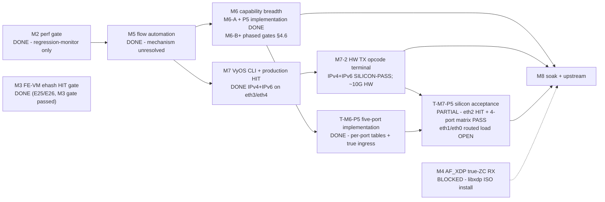
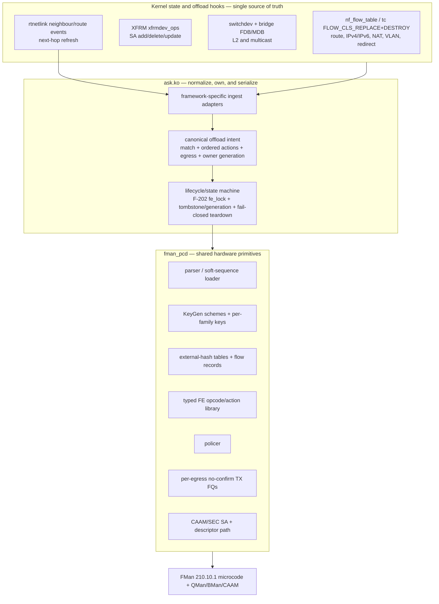

# ASK2 Master Plan — Single Authoritative Execution Plan

**Version 2.26.0 · 2026-08-18**

## AI READING INSTRUCTION

This is the **single authoritative ASK2 execution plan**. For sequencing,
milestones, gates, and the live work program, read this document and nothing
else. `[SPEC]` = binding facts and requirements; `[NOTE]` = rationale;
`[BUG]` = defect (symptom + cause + fix).

Sources of truth that remain **live and binding** (this plan only sequences
them): silicon contract `arch/fman-microcode-210-programming-reference.md` +
`arch/fman-fe-ehash.md`; flow-key spec `specs/fman-keygen-flow-key-spec.md`;
state machine + CLI contract `plans/DUAL-DATAPLANE.md`; API surface
`arch/fman-pcd-api-reference.md`; CC-tree rebuild `plans/CC-TREE-REBUILD-PLAN.md`;
vendor oracle `plans/NXP-106-DEEP-DIVE-PLAN.md`; stub/type inventory
`plans/TF-2026-07-18-001-function-inventory.md`. Where this plan and those
documents disagree, they win — update this plan.

---

## 1. Current state (branch `dpaa1` · diagnostic DUT `.185`: kernel `6.18.44-vyos`)

### 1.1 Position

**[SPEC] CURRENT STATUS (2026-08-26).** The FE-VM ehash path is the proven
production mechanism and **T-M7-2 is complete for plain routed unicast**: S1
(F-198, hardware TX terminal — `INSERT_L2_HDR`→`ENQUEUE_PKT` direct-to-wire),
S4 (F-199, per-egress `FQ_TYPE_TX_NO_CONFIRM` TX FQ, RTNL fix), and S3 (F-200,
`UPDATE_TTL` + IPv4 checksum, wire-verified TTL 64→63) all passed on silicon.
**F-199's NXP SDK `FQ_FLAG_NO_TXCONFIRM` context_a `0x9a000000c0000000` was
independently re-validated 2026-08-24** on `.185` image `0500`: a 7.76 Gbit/s
bidirectional HIT run moved 13.6 GB (~9.7M frames), while eth4/eth3
`tx confirm [TOTAL]` advanced only +9/+5 control-plane frames, F-227 remained
zero, and the board stayed idle. The earlier B0V-cleared guess
`0x1c00000080000000` is superseded; F-232 proved the record already targeted
FQs `0x2ba/0x2bb` and was retired after this validation. **The old S2 inline
FE-VM VLAN strip/insert path is retired, not pending:** it exhausted a 5+tnums
FE-VM management resource after 21 frames. VLAN pop/push now uses the separate
CC-leaf → combined-HMTD path and is DONE and silicon-validated end-to-end
(R1–R5b, image 0713 / commit `36bf83de`): R5b matrix (no-wrong-forward, PCP/DEI,
MTU sweep, 100× churn) and full gate-off regression (routed ~11.6G / NAT44
~11.7G, zero VLAN interference) both PASSED, and the feature is merge-ready. It
ships default-off (`vlan_offload`), IPv4 / single 802.1Q tag / non-eth0.
`PREEMPTIVE_CHECKS_ON_PKT` remains post-release hardening and is not required for
plain unicast.** **T-M7-3 PASSED** — three clean
engage/forward/disengage cycles at 7.32–7.34 Gbps, DUT 99.3–99.8% idle, no
TX-confirm stream, no QMan/BMan/MURAM anomaly. Two follow-on fixes then landed
and were board-validated: **F-201** (F-051 had collapsed every RSS scheme to one
FQ/CPU0; restored 128-FQ distribution → software forwarding is genuine
multi-core, ~6.5 Gbps) and **F-202** (production flow add/delete now hold
`pcd->fe_lock`, fixing a `nf_ft_offload_del` `LIST_POISON2` panic; survived the
full mode-churn battery). The subsequent MTU battery measured hardware
forwarding at **9.92 / 10.4 / 10.4 / 10.1 Gbit/s** for MTU 1280 / 1500 / 2000 /
2500 at ~3% DUT CPU. **NAT/PAT offload now ships default-on too (2026-08-22/23):
nat44 (`625d0d2c`) and nat66 (`9598799f`)** — the F-230 bit-fused FE-VM rewrite
(`0x33`/`0x27`/`0x2f`) passed S0 readback + S1 SNAT + S2 DNAT + S3 masquerade
TCP/UDP (~7.1–7.3 Gbit/s 0-retr) and is automatic with `offload ipv4`/`ipv6`;
NAT46/NAT64 always fall back to software. Remaining preview work is
productization (docs, prerelease packaging, external validation), not datapath.

**M6-A safety substrate is code/CI complete (2026-08-18):** A2 strict action
acceptance (`70092e57`, CI `32156418969`), A1 canonical intent (`0a9c068f`,
CI `32164888360`), A3 generation/tombstones (`c65f7793`, CI `32169305393`),
and A4 preflight resource gating (`3bb5d643`, CI `32174170644`). Their explicit
board stress/negative gates remain open; code-complete is not silicon-complete.
Production observability was rewritten in `c905bf6d` (CI `32194485450`): the
new `ask-check` contract exposed and fixed YNL nested-reply schema defects;
final truthful `get-info` telemetry is awaiting deployment of that image.
Five-port IPv4 breadth is now scoped as T-M6-P5/T-M7-P5: kernel port/FQ
resolution is mostly generic already, but CLI policy, legacy global-FQ
fallback removal, shared-table ingress discrimination, and 1G/management-port
silicon acceptance remain open.

### Plain IPv4-unicast preview release checklist

- [x] Production FE-VM ehash forwarding path; T-M7-2 S1/S3/S4 passed.
- [x] T-M7-3 mode-churn gate and MTU 1280/1500/2000/2500 performance battery.
- [x] CR-003 fail-closed commit helper implemented in `3523be05` (YNL
  `flush-flows`, conntrack flush, YNL disengage, read-only `fe_arm` verify,
  `ConfigError` on any non-zero helper result).
- [~] **Raise the order-1 ASK MTU clamp to 1280–7500.** Source patches 036/037
  now use 7500, a 30-byte margin under the exact contiguous-buffer ceiling:
  `SKB_WITH_OVERHEAD(8192)=7872 - rx_headroom 320 - VLAN_ETH_HLEN 18 - FCS 4`
  = MTU 7530. F-203 already silicon-validated MTU 7000 at ~9.25 Gbit/s without
  a wedge; 7500 still needs a cold-boot, matched-endpoint load gate before the
  preview claim. MTU 8000 is NOT valid on order-1. Restore every endpoint to
  1500 on exit/abort.
- [x] F-122 idempotent engage implemented in `F_122.py` and wired in
  `ci-setup-kernel.sh` (shared debugfs/kernel core and exported wrapper both
  return success when already armed).
- [ ] Cold-boot board validation of CR-003 through the actual VyOS CLI commit
  path, including a forced helper failure proving the commit fails closed.
- [~] Production `ask-check` rewritten 2026-08-18 around the shipping IPv4-
  unicast contract (no debugfs/milestone/deferred-feature checks). In-place
  validation on image `2026.08.18-1900` reached 30/30 after fixing the YNL
  nested-reply schema for `get-info` / `get-muram`; current source additionally
  requires truthful IPv4 capability, one bound FMan, and ucode 210.10.1 from
  `get-info`. Gate: **0 required FAIL**, plus byte-exact `pcd-snapshot`
  disengage diff against the warm S0 baseline on the next built image.
- [ ] Prerelease release notes/package and one external validation cycle using
  the operator procedure in `plans/ASK-ISO-BUILD-AND-INSTALL.md`.

**[NOTE — superseded]** The earlier framing below (F-198-era) described only S1
as passed with S2/S3/S4 open and release gated on T-M7-3, citing ~2.2 Gbps: that
was the lxc202-harness-limited result, kept here as history. It is superseded by
the S3/S4/T-M7-3 passes and the ~10 Gbit/s heidi↔HELGA battery above. ~~The
FE-VM ehash path has discriminator-verified manual silicon HITs (E25/E26), a
production nft/YNL flowtable HIT (F-195/F-197, 2026-08-15), and a silicon-proven
hardware TX terminal (T-M7-2 S1 / F-198): a HIT rewrites L2 and hardware-enqueues
to the per-egress TX FQ; 300 Mbit/s went 2.42% → 0.008% loss, 500 Mbit/s no
longer wedges, TCP ~2.2 Gbps. Remaining T-M7-2 work is S4 no-confirm TX FQ and
S2/S3 opcode completeness; release gated on T-M7-3.~~

| Dispatch path | Status |
|---|---|
| **FE-VM ehash** (the vendor's production mechanism) | Code complete. **Topology resolved 2026-08-07: direct `RCCB→FE_ENTER` (not the `CONT_LOOKUP` group-AD RM §7.11 suggested) is vendor's real mechanism** — confirmed by reading `fm_cc.c`'s `copy_td_to_ccbase()`, which writes the ehash node directly into the CC-tree root's own AD slot, no group-AD indirection. Group-AD topology independently confirmed dead 3 ways (F-157/158, T-M3-R attempt 5, this session's F-175). **Key-format CLOSED (2026-08-06/07/08) and full-path VERIFIED (2026-08-12, E25/E26): the vendor's 14-byte `portid`-prefixed key (EKFC=`0x801C0006`, `PORT_ID=0x00` for eth4/port 0x11) is HW-confirmed via CRC-64 hash match, and the complete HIT path (extraction → hash → bucket → chain walk → opcode-script enqueue → kernel) delivers on silicon.** **Production nft/YNL flowtable HIT delivers (2026-08-15, F-195/F-197).** M3 gate passed. **Throughput defect CLOSED (2026-08-16/17):** F-198 replaced the RX-reinjection terminal with a direct-to-wire per-egress TX FQ, F-199 made it no-confirm, F-200 added TTL; the old single-portal ~300 Mbit/s loss / ≥500 Mbit/s wedge is gone. Hardware forwarding now sustains ~10 Gbit/s (MTU battery 1280–2500) at ~3% DUT CPU. See §3/§4.1/§4.2, `decomp/fman-ehash-process.md` (E24–E27), and `plans/ASK2-PERFORMANCE-TEST-HARNESS.md`.
| **CC-tree classification** | No confirmed HIT. `ask.ko` insert path deleted (CR-007). `cc_test` harness architecturally broken — **retired, do not patch further**. Replacement harness pending the NXP-106 deep-dive oracle (§4.2). |
| M5's 10.259 Gbps | Real throughput number; **mechanism unresolved** — most likely kernel `nf_flowtable` software forwarding, not hardware classification. Do not cite it as HW-offload proof. |
| M2's 7.37 Gbps CC pass-through | Real — but it is MISS→kernel delivery (CONT_LOOKUP numKeys=0), not offload. |

**[SPEC] Scale mechanism settled for the current architecture.** FE-VM external
hash is the production classifier and the basis for scale; a single CC-tree
node's historical 32-key software cap is not the flow-scale architecture.
Ehash provides DDR bucket/record scale under an explicit resource budget.
CC-tree remains useful only for bounded coarse dispatch/policy roles and MUST
not replace the proven ehash flow store. Scale gates are now capacity,
collision-chain behavior, lifecycle generations, MURAM/DDR/FQ budgets, and
soak — not a CC-tree-vs-ehash mechanism decision (§4.6).

### 1.2 Layer status

| Layer | Status |
|---|---|
| 1. FMan PCD subsystem (KG / CC / HM / PLCR) | Shipping — patches 0092–0118, 0151–0155 |
| 2. FE-VM ehash substrate (pool, singletons, ehash, EXT_HASH, MUX/ENQ, arm) | Code complete. Manual E25/E26 proved a discriminator-verified silicon HIT, but F-192 production-adjacent diagnostics remain incomplete; the warm shared diagnostic chain is singleton-global and must be reused rather than rebuilt. |
| 3. Classifier→FE arm | Direct vendor-node arm is proven. The manual `.185` eth3 arm explicitly applies scheme-4 EKFC and tears down safely; the retained chain is byte-readable. The fixed-tuple SPC capture proves KeyGen scheme-4 traversal but not the succeeding FE workspace/writeback stage. |
| 4. ask.ko datapath (genl + flow table) | **IPv4 and IPv6 routed TCP/UDP unicast are complete and silicon-passed; IPv4/IPv6 NAT/PAT (nat44 + nat66) ship default-on; single-tag IPv4 802.1Q VLAN pop/push is implemented and silicon-validated behind a default-off gate.** Routed/NAT uses per-port 46-byte dual-family ehash tables, `UPDATE_TTL`/`UPDATE_HOPLIMIT`, bit-fused NAT rewrites (`0x33`/`0x27`/`0x2f`, F-230), `INSERT_L2_HDR`, and hardware enqueue. VLAN uses a per-port CC shadow whose HIT leaf invokes a combined tag-edit + L2 rewrite + TTL/checksum HMTD and whose miss row falls through to FE_ENTER, preserving routed/NAT coexistence. The retired inline FE-VM VLAN path's 21-frame freeze cannot recur in the separate HM engine. R4c-2/R4c-3 passed silicon; R5 fixed vif-delete teardown ordering; R5b matrix (no-wrong-forward, PCP/DEI, MTU sweep, 100× churn) and full gate-off regression (routed ~11.6G / NAT44 ~11.7G) both PASSED — VLAN is done and merge-ready, shipping default-off; eth0, 802.1ad, QinQ, IPv6 VLAN and stacked tags fall back to software. Sustained mixed-family routed traffic reached ~8 Gbit/s aggregate in the bounded durability gate and ~12.9 Gbit/s in the peak harness; masquerade NAT ~7.1–7.3 Gbit/s. Unsupported actions fail to software before publication. |
| 5. VyOS CLI + mutual exclusion | **Shipping on eth0–eth4.** IPv4 and IPv6 are selected independently per interface with `offload ipv4` / `offload ipv6`; ASK↔VPP remains a per-interface mutex. Migration `34-to-35` rewrites the retired `offload ask` node to both family knobs. The hardware-offload MTU range is 1280–3600. Cold-boot config persistence, the four-port simultaneous engage matrix, and eth0 management survival are board-validated. |

### 1.3 Binding silicon facts (settled on LS1046A hardware — do not re-litigate)

**[SPEC]**

- **EKFC extraction is MSB-first:** SIP→DIP→PROTO→SPORT→DPORT (+PORT_ID
  sorting first as the highest set bit, when present).
- **KG hash = raw CRC-64** (ECMA-182, reflected poly `0xC96C5795D7870F42`),
  seed `~0ULL`, **no final complement**; stored at IC offset `0x48`.
  CRC-64/XZ does NOT match hardware.
- **This branch's flow key is 14 bytes, CLOSED 2026-08-06/07/08:**
  `PORT_ID|SIP|DIP|PROTO|SPORT|DPORT`, EKFC `0x801C0006`, `PORT_ID=0x00` for
  eth4/port 0x11 — hardware-CRC-64-validated 3 independent times (2026-08-06
  184,320-candidate brute force discovery; 2026-08-07 16-candidate 0x00-0x0f
  batch test; 2026-08-08 independent re-confirmation via passive
  `hash_probe`, bit-for-bit identical hash across sessions). **F-163's
  14-byte `portid`-prefixed variant (EKFC `0x801C0006`, commit `f212c701`)
  was RIGHT, not wrong** — the 2026-08-06 "reverted, GEC conflation" episode
  (below) was itself corrected the next day: `<combine portid="true".../>`
  was proven (2026-08-07, reading vendor's real FMC source —
  `FMCPCDReader.cpp`/`FMCPCDModel.cpp`/`FMCCModelOutput.cpp`) to build the
  KeyGen "extractedOrs"/OR-Data-Vector array (FQID-only, unrelated to the raw
  comparison key), a structurally different mechanism from
  `KG_SCH_KN_PORT_ID` (EKFC bit 31), which genuinely IS part of the raw
  comparison key via `GetKnownFieldId()` sorting it first. Vendor's own key
  IS 14 bytes (`union dpa_key`) — and this branch's key now matches it
  exactly, byte-for-byte, HW-confirmed. **A properly-EKFC-synchronized
  14-byte key still does not HIT** (tested 3 independent times, same
  result each time) — key format is a CLOSED lead, not the open one.
- Vendor `cdx.ko` classifies every accelerated flow via
  `ExternalHashTableAddKey()` — external-hash **is** the vendor production
  classification; the opcode/manip chain executes from inside each DDR ehash
  entry.
- **`FMFP_EXTC[INV0]` SYNC is required** before dispatch into a
  newly-repointed live FMan-controller structure (RM §5.12.14.1). Asserted in
  `fman_port_set_cc_base()` between the `fmbm_rccb` and `fmbm_rfpne` writes
  (F-168, commit `7e85a035`). Board-confirmed for the `off=0` scaffold arm
  only; the `off != 0` FE_ENTER-direct path is not covered by that
  confirmation.
- `__fman_pcd_fe_arm_engage()` overwrites the caller's `fe_enter_off` with the
  CONT_LOOKUP scaffold **only when the caller passed 0** (F-165, commit
  `e4f23948`). Explicit-target arms reach the built chain.
- `fman_pcd_kg_scheme_set_ekfc()` is **broken dead code** (`-EINVAL` on any
  already-bound scheme — the only case anyone would call). Do not use it. The
  working sequence is F-169's `fe_kg_ekfc` debugfs verb (commit `a84e5fe5`):
  `keygen_scheme_setup(false)` → mutate `scheme->ekfc` →
  `keygen_scheme_setup(true)` against `fman->keygen->schemes[]` via
  `fman_keygen_internal.h`.
- **KeyGen scheme 4 boots with EKFC `0x00180006`** (12-byte CC-tree format).
  Any ehash arm must reconfigure it to `0x801C0006` first, or KeyGen extracts
  12 bytes against a 14-byte table key (structural mismatch — stalled the
  first T-M3-R attempt).
- CC match rows are `key(16B)+mask(16B)` = 32 B stride, `(numKeys+1)` rows;
  mask `0xff`=participate / `0x00`=wildcard.
- The CC comparator reads **KG-emitted bytes**, not a re-extracted canonical
  composite (ask20 patch 0108 precedent).
- `FMAN_CC_MAX_STATIC_KEYS=32` / `FMAN_PCD_CC_HW_MAX_KEYS=32` are **software
  struct caps**; hardware allows 255 keys/node
  (`FMAN_PCD_CC_NODE_KEYS_MAX`). A 255-key node ≈ 8 KiB; 64 KiB MURAM arena →
  ~8 nodes → ~2,000-flow capacity. **Design input only — no CC HIT is
  proven.**
- MISS→kernel resolves at the CC layer (CONT_LOOKUP numKeys=0 → miss-AD →
  port PCD FQ). The FE-VM has no viable kernel-delivery terminal (4 ENQ
  variants failed on silicon).
- A bare CC node with no FE entry parks frames with no terminal disposition
  (210.10.1 silicon). Some FE-VM entry on HIT is required.
- `cmm`'s conntrack ingestion on `.106` is deaf (vendored
  libnetfilter_conntrack 1.1.0 never invokes `__cmmCtCatch()`).
  `/proc/fqid_stats/pcd/*/*` is **NOT a HIT/MISS oracle**. Use
  `bin/kg-scheme-read.py` / `bin/muram-mmap-dump.py`.
- `fe_probe` reads the FE **object pool** (`0x4bc00`, 28 B descriptors), not
  the per-port **workspace pool** (`FmPortSetFESupport`, `0x54e00`) — "empty"
  is expected even on a real HIT. `fe_buffer +0x58` is a
  workspace-pool-exhaustion counter, not an allocation counter. Neither
  distinguishes HIT from MISS on its own.
- **`EXIT`-`DEALLOCATE` (the ehash MISS disposition) is a silent frame DROP,
  not kernel delivery** (§7.4 of the microcode reference). 100% ping/ARP
  loss on an armed port is *expected* for any non-matching frame, not a
  malfunction — do not read connectivity loss alone as a fault.
- **eth4's real kernel-delivery FQID is `0x300`** (traced live via
  `dpaa_rx_fd`, 2026-08-06) — not `0x200` (eth3's) or `0x2B9` (`ask.ko`'s
  unrelated TX-bypass queue, no RX consumer in a raw-debugfs test). The
  discriminator for a genuine HIT is an ordinary `dpaa_rx_fd` event on the
  target FQID: a real HIT dispatches through the same dequeue point as
  normal traffic, so its *absence* on a matching frame is evidence of a
  MISS, not an inconclusive result. `fe_arm`'s 3rd argument is inert on the
  `off != 0` path — the live dispatch target is `fe_enq build <fqid>`.
- **[SPEC] Production HIT currently reinjects to a kernel RX FQ, which is the
  ~1.5 Gbps ceiling by design (2026-08-15).** F-197 resolves eth3 to `0x200`
  and eth4 to `0x300`. These are kernel-delivery RX FQIDs: the E25/E26 gate
  used own-port RX enqueue precisely so a HIT is observable as ordinary NAPI
  traffic. On silicon this funnels every HIT to one QMan portal/CPU (portal 0),
  so loss starts near 300 Mbit/s and 500 Mbit/s can wedge the FMan. This is not
  a distribution bug to patch by RSS-spreading the RX FQ — binding fact 9 is
  the intended production terminal: the per-flow opcode chain (vendor-verified)
  `PREEMPTIVE_CHECKS_ON_PKT(0x05) → STRIP_ALL_VLAN_HDRS(0x12) → UPDATE_TTL(0x21)
  → INSERT_L2_HDR(0x41) → ENQUEUE_PKT(0x01)` to a **per-egress-interface TX
  FQ**, bypassing the kernel forward path entirely (vendor cdx.ko 8.58 Gbps).
  T-M7-2 is to build that TX terminal, not to
  spread RX reinjection. Own-port constraint still holds; cross-port enqueue
  remains invalid (E25).
- **The direct `RCCB→FE_ENTER` topology, not the `CONT_LOOKUP` group-AD RM
  §7.11 describes, is vendor's real dispatch mechanism (2026-08-07).**
  Reading `we-are-mono/ASK`'s `fm_cc.c` completely found `copy_td_to_ccbase()`
  writes the ehash table's `en_exthash_node` 4-word descriptor **directly
  into the CC-tree root's own AD slot** — the exact MURAM location `RCCB`
  points at — with no group-AD/match-table indirection anywhere in the
  `USE_ENHANCED_EHASH` path. This independently confirms F-147/F-148's
  direct-topology work (done without ever having read this vendor function)
  was correct, and further confirms the group-AD topology (F-171/F-172,
  §4.1's old attempt 6 plan) was never the right thing to chase.
- **`FMFP_EXTC`/Host-Command sync is NOT what vendor asserts around a plain
  ehash insert (2026-08-07).** Read `fm_ehash.c` (complete, 1924 lines) and
  `hc.c` (both the ASK diff and pristine base) in full: `ExternalHashTableAddKey()`'s
  fast path (fresh insert into an empty bucket) calls no sync of any kind —
  not `FmPcdHcSync()`, nothing. `FmPcdHcSync()`/`FmHcPcdSync()` is a genuine
  Host Command **frame dispatch** (enqueued via `EnQFrm()` to the FMan's HC
  port) — structurally unavailable on this board's microcode regardless
  (`caps=0x17` bit 3 clear). `F_167`'s `FMFP_EXTC` register-level probe
  remains untested on the insert path specifically, but is now a weaker
  hypothesis than before this reading — vendor doesn't need any sync there.
- **Vendor forces `TIMESTAMP_EN` on every ehash key unconditionally, backed
  by a live, periodically-refreshed MURAM pool (`extHashTsInfo`) kept alive
  by a userspace timer (`cdx/cdx_timer.c`) entirely outside `sdk_fman`
  (2026-08-07).** `F-176` (this branch's new stats/HIT-discriminator debugfs
  node, `fe_ehash_stats`) reproduces the forced-on flag bit
  (`flags=0x3000`, `STATS_EN|TIMESTAMP_EN`) with **no** corresponding pool.
  **The 2026-08-07 "clean negative" result (13-byte key + direct topology,
  `pkt_count` stayed 0) was produced using this tainted discriminator and
  cannot yet be trusted** — see §4.1's Phase 1 for the required retest with
  `TIMESTAMP_EN` cleared before this result is treated as real. Full
  function-level catalogue of everything read: `arch/fman-microcode-210-programming-reference.md`
  §12.1.

---

## 2. Binding architecture decisions

**[SPEC]** Binding on all future work:

1. **EKFC-only, no GEC.** `kgse_gec[]` stays zero (per-frame latency).
2. **Raw CRC-64, no final complement** (§1.3).
3. **MISS→kernel via CONT_LOOKUP pass-through.** The FE-VM executes only on
   HIT.
4. **Single-image dual-dataplane.** S0 (mainline/RSS) at boot; S1 (ASK)
   per-interface on `set interfaces ethernet eth<n> offload ask`; S2 (VPP) on
   `set vpp settings`. ASK↔VPP transitions always pass through S0, with a
   per-interface mutex. One ISO, one `version.json` feed (+ fielded aliases).
   `set system offload classify` is deprecated as a CLI; the classify
   mechanism stays as silent default (RSS + parser programmed
   unconditionally).
5. **`contextOffsetInWS = 0`** (SDK default, silicon-verified).
6. **`FmPortSetFESupport` is MANDATORY for any FE-VM frame** (auto-armed on
   every `fe_arm engage`). Without it, FE_ENTER ALLOCATE books workspace at
   MURAM offset 0.
7. **GCM refused for IPsec** (CAAM A24a wire-sequence-duplication erratum
   breaks peer anti-replay). Offloaded suites: AES-CBC-SHA256,
   AES-CTR-SHA256. `ask_xfrm_state_add` returns `-EOPNOTSUPP` for
   `rfc4106(gcm(aes))`.
8. **Debugfs for diagnostics only — kernel API for production control.**
   ask.ko engages/disengages via `fman_pcd_fe_engage()`/`_disengage()` and
   inserts via `fman_pcd_fe_flow_add()`/`_del()`; it never writes debugfs
   control nodes.
9. **The hardware TX opcode chain is the 10 Gbps path** (vendor-verified
   2026-08-15 against `we-are-mono/ASK@fe36f30` `cdx/cdx_ehash.c` +
   `fm_ehash.h`): a plain routed IPv4 unicast HIT emits, in order,
   `PREEMPTIVE_CHECKS_ON_PKT(0x05) → STRIP_ALL_VLAN_HDRS(0x12) →
   UPDATE_TTL(0x21) → INSERT_L2_HDR(0x41) → ENQUEUE_PKT(0x01)`. Opcodes are
   1-byte values written into the record's opcode-list region (NOT the 32-bit
   words in `arch/fman-fe-ehash.md` §10, which are a microcode-internal form).
   `STRIP_ETH_HDR(0x11)` is emitted ONLY when VLAN/PPPoE/tunnel/IPsec header
   ops are present; for a plain forward `INSERT_L2_HDR` alone rewrites the
   14-byte L2 header (dst=next-hop MAC, src=egress MAC, EtherType). The
   `ENQUEUE_PKT` FQID is a PER-EGRESS-INTERFACE TX FQ (vendor
   `eth_info->fwd_tx_fqinfo[quenum]`, resolved by output-interface name), not a
   single shared FQ. F-201-corrected kernel software forwarding reaches
   ~5.7–6.6 Gbit/s across MTU 1280–2500 with all four cores loaded; hardware
   reaches ~10 Gbit/s at ~3% CPU. Vendor cdx.ko measured 8.58 Gbit/s via the
   same terminal class.
10. **MTU / RX-buffer policy.** Each DPAA RX frame must fit ONE contiguous
    buffer (`dpaa_change_mtu` enforces it; oversized/mismatched frames wedge
    FMan RX, cold-boot recovery only). **F-203 (2026-08-17) raises the RX pool
    from order-0/4 KiB to order-1/8 KiB** (`DPAA_BP_ORDER=1`,
    `DPAA_BP_RAW_SIZE=8192`) so a jumbo-ish frame stays contiguous and
    ASK-FE-offloadable — the deliberate alternative to RX scatter/gather (which
    would force jumbo to software). **Exact order-1 ceiling = MTU 7530**
    (`SKB_WITH_OVERHEAD(8192)=7872 - rx_headroom 320 - VLAN_ETH_HLEN 18 - FCS 4`).
    VyOS patches 036/037 clamp ASK to **1280–7500** (30-byte margin). **MTU 8000
    is not achievable on order-1** — it would need order-2/16 KiB buffers (max
    ~15.8 K) at 4× the memory and a harder buddy-allocator demand; not adopted.
    Validation state: MTU 7000 silicon-passed (~9.25 Gbit/s, no wedge,
    2026-08-17); the 1280–2500 order-0-era battery predates F-203; **7500 is
    pending a cold-boot matched-endpoint load gate**. TX-SGT and XDP-copy
    scratch pages stay order-0. Change MTU only while ASK is disengaged, keep
    every endpoint matched, and restore all endpoints to 1500 on exit/abort.
11. **MURAM allocation strategy:** slab pools for fixed-size FMan objects (CC
    nodes, HM entries, policer profiles, ADs); segregated-fit power-of-two
    classes for general-purpose allocation; strict object lifecycles tied to
    the parent kernel object; teardown validated byte-clean with
    `pcd-snapshot`.
12. **Scale-out mechanism (>32 flows) is UNDECIDED** pending a confirmed HIT
    on either path. CC-tree capacity arithmetic (§1.3) stands as design
    input. Do not invest in ehash hardening or CC-tree scale-out engineering
    before T-M3-R + NXP-106 Phase A/C produce a verdict.
13. **Per-flow stats require a HW counter:** FE-VM EXT_HASH stats bit
    `0x00010000` (currently dormant), or CC-tree `STEN` + `AllocStatsObjs`
    (the vendor MURAM 327×-ENOMEM wall). Deferred until a HIT path exists.

---

## 3. Milestone chain



**[NOTE]** M3 gates nothing downstream; it is the validation track for the
ehash mechanism, not a sequencing blocker for M6/M7/M8.

**[NOTE] Production-path follow-up — 2026-08-15.** E25/E26 closes the manual
debugfs ehash mechanism only; it does not prove the `nft`/YNL flowtable path.
The first F-192 production-adjacent E2 discriminator on `.185` inserted TCP
source port `51283` while `iperf3` used ephemeral source port `57184`; that
run was not a lookup result. A second eth3-only fixed-tuple run also remained
invalid because `vyos-offload-ask hit-engage 14 801c0006` displayed its EKFC
argument but invoked `fe_arm` only as `<port> <fe_enter_off>`, leaving scheme
4 at boot-default `0x00180006` (12-byte extraction).

**[NOTE] Corrected F-192 E2 result — 2026-08-15.** The harness now explicitly
writes F-169 `echo "set 4 <ekfc>" > fe_kg_ekfc` before the arm operation and
uses only guarded `fe_port del` then `fe_arm disengage` cleanup. On `.185`,
eth3/port `0x10` armed with the exact 14-byte key
`000a6301c90a63026a06c8531451` (`00|10.99.1.201|10.99.2.106|TCP|51283|5201`),
bucket `1431`, and `EKFC=0x801c0006`. The independent KeyGen register reader
confirmed scheme 4 `ekfc=0x801c0006`; dmesg confirmed F-169's write, zeroed
`dv0/dv1`, F-190's root-AD write at `0x56c00`, and the AC_CC vendor-node arm.
A prior bounded exact-tuple injection returned zero and eth3 RX advanced, but
F-192 workspace remained untouched and F-189 ehash writeback stayed
`pkt_count=0`, `pkt_bytes=0`. This is a valid negative observation for the
correct configuration but did not localize the drop because scheme-4 `kgse_spc`
and raw IC/hash were absent from that capture.

**[NOTE] F-192 SPC discriminator — 2026-08-15.** The retained F-136 shared
chain is byte-readable and reusable: singleton descriptors, a 14-byte ehash
table, the key record, `FE_ENTER=0x56c00`, and the eth3 workspace exist.
Rebuilding it is invalid: `fe_singletons build` returns `-EEXIST` after an
additional `fe_port set`/`fe_pool get`, because the objects are global. The
actual controlled source is **lxc202**, not lxc201: on Proxmox `.15`,
`pct exec 202 -- ip addr` shows `10.99.1.201/24`, with `10.99.2.0/24` routed
through `.185`; lxc201 instead has only `10.99.1.2/30`. The exact one-shot
injection is `printf X | nc -n -s 10.99.1.201 -p 51283 -w 1 10.99.2.106 5201`.

**[NOTE] Bounded result.** With scheme 4 explicitly set/read as
`EKFC=0x801c0006`, eth3/port `0x10` armed against `0x56c00`, and the exact
14-byte record installed, a direct read of the hardware-native `kgse_spc`
changed `0 → 5` across one `nc` attempt. Its value is an aggregate sample,
not a literal one-packet count: normal control/background traffic is also
classified while eth3 is armed. Nevertheless, the zero baseline immediately
after arm and nonzero post-injection value, plus `hash_probe` changing from
`994d63058e39b76f` to `50b43c9cff453b9f`, proves scheme-4 KeyGen traversal.
F-192 workspace index/pool and depletion remained unchanged, and F-189
`pkt_count`, `pkt_bytes`, and timestamp remained zero. Eth3 RX rose
`9345 → 9419` and drops `444 → 450`. Thus the fault is now bracketed after
KeyGen scheme classification and before observable FE workspace allocation or
ehash writeback. It is not a source-access, tuple-width, EKFC, or pre-KeyGen
dispatch failure. This does not identify the post-KeyGen AC_CC/FE handoff
versus EXT_HASH comparator substage; do not change F-185/F-186 from it.

**[SPEC] F-192 discriminator superseded by production proof (2026-08-15).**
F-195 corrected the OOT caller to pass the actual ingress hardware port;
F-196 proved params-page FQID zero with same-port scheme bases `0x200`/`0x300`;
F-197 added the unique same-port scheme fallback. Image
`2026.08.15-1855-rolling` then produced `hw_insert OK`, conntrack
`[HW_OFFLOAD]`, own-port F-193 targets, and end-to-end loss-free transit
through 200 Mbit/s. The post-KeyGen handoff and production ehash HIT are no
longer open. Keep F-192/F-193 as diagnostics only; do not modify
F-185/F-186/F-190. The remaining production blocker is T-M7-2's hardware TX
opcode terminal, not comparator correctness.

- **M2 — Performance gate. DONE.** ≥2 Gbps + ≤5% kernel-net CPU; actual 7.37
  Gbps / 0.16% CPU. Regression-monitor: every build changing `fman_pcd.c` or
  `dpaa_eth.c` re-runs the CONT_LOOKUP pass-through iperf3 gate.
- **M3 — FE-VM ehash HIT gate. DONE (2026-08-12, E25/E26).** Gate: one flow
  HIT — a matching frame visibly dispatches through the flow record's target
  FQID with a discriminator that cannot confuse HIT with MISS delivery.
  Passed on .185 (6.18.44-vyos): record (fqid 0x300, opcode script
  `ENQUEUE_PKT`) HIT delivers to the kernel (RST, `curl rc=7`), discriminated
  by the split-target test (miss fqid 0x200/eth3 vs record fqid 0x300/eth4),
  single-pass `kgse_spc`, and bucket/chain/writeback verification. The old
  "MISS is a silent `EXIT`-`DEALLOCATE` drop, not kernel delivery" clause is
  OBSOLETE: E25 proved the miss action (ENQUE, own-port fqb) delivers to the
  kernel like HIT — the discriminator is the target-FQID split, not
  drop-vs-deliver. Full E26 matrix (collision chain, per-key delete, UDP,
  ~780 pps sustained, eth3/0x10 structural) all pass; work: §4.1.
- **M4 — AF_XDP true-ZC RX. BLOCKED.** Gate: `xsk_zc_rx_redirect` > 0 under
  XDP_ZEROCOPY bind + steered flow. Work: §4.5.
- **M5 — CC-tree + SW flowtable + manip chain. DONE (throughput), mechanism
  unresolved.** 10.259 Gbps line rate at 0.16% CPU / 0% loss (MTU 9000,
  3-node 10G plane). Treat as a throughput result, not HW-classification
  proof (§1.1).
- **M6 — capability breadth. IN PROGRESS.** The mandatory M6-A safety substrate
  (canonical intent, strict action acceptance, generation/tombstones, resource
  preflight) is code/CI complete; its board stress/negative gates remain open.
  Kernel offload frameworks remain authoritative. Landed this phase:
  T-M6-P5 five-port IPv4/IPv6 mechanics, IPv6 dual-lane key, IPv4+IPv6 NAT/PAT
  (T-M6-7, default-on), and single-tag IPv4 802.1Q VLAN pop/push through the
  silicon-validated CC+HMTD path (T-M6-8 DONE, ships default-off, merge-ready).
  Remaining implementation breadth: soft-parser/PPPoE, XFRM/IPsec,
  bridge/multicast, fragments/tunnels, stacked tags and wider VLAN scope. Full
  gates and MUST/DO-NOT rules: §4.6.
- **M7 — VyOS CLI + production IPv4/IPv6 transit HIT. DONE for the 10G
  production path; five-port acceptance PARTIAL as T-M7-P5.** Current surface:
  independent per-interface `offload ipv4`/`offload ipv6` on eth0–eth4,
  ASK↔VPP mutex, nft/YNL flow learning, and `show flows`; migration 34→35
  rewrites the retired `offload ask` node to both families. T-M7-2 S1/F-198
  direct-to-wire, S4/F-199 no-confirm per-egress TX FQ, and S3/F-200
  TTL/checksum all passed silicon. The old inline-FE-VM S2 VLAN arm is retired;
  VLAN pop/push is now complete via the T-M6-8 CC+HMTD path (R5b + gate-off
  regression PASS, ships default-off). Only `PREEMPTIVE_CHECKS_ON_PKT` remains
  deferred as non-blocking post-release hardening. T-M7-3 passed three clean
  cycles at 7.32–7.34 Gbps / 99% idle; F-201/F-202 and the later MTU battery
  extended this to ~10 Gbit/s at ~3% CPU with lifecycle stress clean.
   CR-001 MURAM leak is closed; F-133's stale diagnostic tracker caused the
   false leak signal.
- **M8 — Productization soak + release. RELEASE-COMPLETE (VPP out of scope).**
  Release `2026.08.22-0031-rolling` shipped with AI-generated three-part release
  notes (OpenRouter/`google/gemini-3.7-flash`) and the Discord release embed
  (carrying the AI `Highlights` summary). All release-gating soaks PASS on
  `0031`: flow churn/aging (byte-clean MURAM), TTL/hop-limit decrement,
  SW-fallback ICMP/UDP/fragments, four-port engage matrix, 30-min mixed-family
  duration soak (no leak, MURAM constant), and a 10-min sustained peak-rate
  split-family soak (~13 Gbit/s aggregate, IPv4 fwd + IPv6 rev). `T-M8-1` (100×
  engage/disengage), `T-M8-2` (soak), `T-M8-4` (`ask-check` 36/36) DONE; `T-M8-6`
  RETIRED (no per-flow MURAM). Post-release, non-blocking: `T-M8-3` per-flow
  counter population from `fe_ehash_stats`, and `T-M8-5` upstream-submission prep
  (checkpatch/CI-KUnit). Work: §4.7.

---

## 4. Work program

**[SPEC]** Ordered by priority. Owner slots (`@___`) assigned at session
start. Stub-fix IDs per `plans/TF-2026-07-18-001-function-inventory.md`. The
orphaned P1–P3 closure series (`4493ce8`→`9970745`) is recoverable via
`git reflog` — re-land behind `bin/test-fixups.sh`, never before it passes.

### 4.1 T-M3-R — first genuine HIT test of the corrected ehash chain (PASSED 2026-08-12, E25/E26)

**[SPEC — updated 2026-08-12]** T-M3-R is PASSED. The structural blocker
(wrong AD species at `FMBM_RCCB`) was resolved by F-185 (vendor VARIANT B
`en_exthash_node` at RCCB, E23 Ghidra decode) and the miss action corrected
by F-186 (ENQUE + own-port fqb — the NIA form infinitely loops on 210.10.1).
E25 delivered the first confirmed HIT (record match → opcode script →
fqid 0x300 → kernel, `curl rc=7`, unambiguous split-target discriminator);
E26 extended it across collision chains, per-key delete, UDP, and ~780 pps
sustained with 0% loss. Attempts 2–6 and the three course-correction deltas
are superseded: Delta 2 (`t_ExtHashResult` record payload) was NOT needed —
the F-181/F-182 inline opcode-script record delivers; Delta 3
(`OFFLOAD_SUPPORT_EN`) was proven not a dispatch gatekeeper (E24). Evidence:
`decomp/experiments.md` E24–E27, `decomp/fman-ehash-process.md`, qdrant.

**Prerequisites (all landed):**

| Fixup | Commit | What it closes |
|---|---|---|
| F-163 | `f212c701` | 14-byte PORT_ID-prefixed vendor key (`ASK_FE_KEY_SIZE` 13→14, v6 37→38) — **now believed WRONG, see below** |
| F-165 | `e4f23948` | Engage honors explicit `fe_enter_off` (scaffold overwrite restricted to `==0`) |
| F-167 | `fc534ab4` | `fe_extc` standalone probe (inert; register confirmed safe) |
| F-168 | `7e85a035` | `FMFP_EXTC` SYNC in the arm path — fixes the port-wedge for the `off=0` scaffold arm, **and confirmed cold-boot-reproducible on the `off!=0` path too across attempts 2–4: port `0x11` itself never stalled again after this fixup** |
| F-169 | `a84e5fe5` | `fe_kg_ekfc` debugfs verb — live EKFC reconfiguration of a bound KG scheme |
| F-170 | (this session) | Widened the `hash_probe` capture hook (`F-072`) from eth4-only to eth3+eth4, for the PORT_ID characterization below (see caveat: turned out not to be needed) |
| F-171 | (this session) | `fe_group` debugfs verb — wraps the existing FE_ENTER chain in a genuine `CONT_LOOKUP` group AD (RM §7.11) with an all-wildcard match row, instead of writing FE_ENTER directly to `RCCB`. Attempt 5's test vehicle — conclusive negative, see below. |
| F-172 | (this session) | Extends `fe_group` to accept an explicit key+mask instead of F-171's hardcoded wildcard. Attempt 6's test vehicle — closes the F-158/F-168 temporal confound (real key+mask, never before tested with F-168 present). |

**[BUG] T-M3-R attempt 1 (2026-08-06) — stalled.** `fe_arm engage 11 0x57200 0x200`
→ port `0x11` STALLED (`fmfp_ps=0x80800000`). Root confound: KeyGen scheme4's
EKFC was still `0x00180006` (12-byte) against the 14-byte ehash key at arm
time — F-169 was built to close this.

**Attempt 2 (F-169 ISO) — clean engage, but wrong discriminator FQID.**
Built the full chain, armed with `fe_arm engage 11 <off> 0x200` then `0x2b9`
— neither is eth4's real kernel-delivery FQID (`0x200` is eth3's; `0x2b9` is
`ask.ko`'s unrelated TX-bypass queue). Traced live `dpaa_rx_fd` events during
an idle board to find the true value: **eth4's FQID is `0x300`.** Also found,
by reading `__fman_pcd_fe_arm_engage()` directly, that the `fe_arm` 3rd
argument is **inert** on the `off != 0` path (only written into hardware
inside the `off == 0` scaffold branch) — the real dispatch target is
`fe_enq build <fqid>`, not `fe_arm`'s argument.

A separate, reproducible side-effect appeared on every arm this session:
**port `0x17`** (an internal engine port with no netdev — not a real
LS1046A silicon port per §2 of `arch/fman.md`, likely a phantom/reserved
register-array artifact) flips to `STALLED` a few seconds after every arm,
independent of FQID/key format. Isolation testing (build-only, no arm →
stays healthy; arm → flips within seconds, before any deliberate traffic)
narrowed the trigger to `fe_arm` activation + ambient traffic, but it is
assessed as **benign and unrelated to the HIT/MISS question** — confirmed on
`.106` (vendor stack) that this same port slot is never even brought to
"ready" state (`fmfp_ps=0`), so there is no vendor equivalent to compare
against, and it does not explain any of the MISS results below.

**Attempt 3 (correct FQID `0x300`) — clean engage, genuine matching SYN
sent, no signal either way.** Sent a byte-exact matching TCP SYN from `.106`
while tracing `dpaa_rx_fd` on `.185` — confirmed transmitted (TX counters,
tcpdump on `.106`), but zero `dpaa_rx_fd` events fired on eth4. Initially
read as inconclusive; **reinterpreted below** once the `EXIT`-disposition
semantics were connected to this result.

**Key insight — 100% connectivity loss on every arm this session is
EXPECTED, not a bug.** `arch/fman-microcode-210-programming-reference.md`
§7.4 (documented since mid-July): `EXIT`-`DEALLOCATE` is `fe_singletons`'s
MISS disposition, and it is **a frame DROP, not kernel delivery** — any
non-matching frame on an armed port silently vanishes by design. This means
every ping/ARP failure this session was the chain working as designed, not
malfunctioning. It also reframes attempt 3: since a genuine HIT would
deliver via `fe_enq`→`0x300` and **must** surface as an ordinary
`dpaa_rx_fd` event (same dequeue point regardless of arrival mechanism), and
it produced zero events — **that is evidence of a MISS, not an
inconclusive result.**

**Control experiment (attempt 4) — ruled out key format entirely.** Rebuilt
the identical clean chain with the **old, already-hardware-validated
13-byte key** (`SIP|DIP|PROTO|SPORT|DPORT`, `EKFC=0x001C0006`, no PORT_ID)
instead of F-163's 14-byte format. Same result: matching SYN confirmed
transmitted, zero `dpaa_rx_fd` events. **A key format independently
confirmed correct via real hardware CRC-64 (2026-07-13, and re-confirmed
this session) also misses under identical conditions — the bug is not in
key content.**

**PORT_ID resolved as unnecessary, 2026-08-06 (see
`arch/fman-microcode-210-programming-reference.md` §10.5a for full
writeup).** The annotation-hash-match technique (brute-force the real
hardware CRC-64 against every plausible key layout) found silicon extracts
`KG_SCH_KN_PORT_ID = 0x00` for eth4, not the raw hw_port_id `0x11` F-163
assumed (unique match, 184,320 candidates). Newly-added qdrant material
(vendor's official `/etc/cdx_pcd.xml`) explains why: vendor's portid byte
comes from a `<combine portid="true".../>` **GEC** directive, a different
register block from `kgse_ekfc` entirely — this branch's own §2 decision 1
("EKFC-only, no GEC") means it can never replicate that mechanism regardless
of which EKFC value is chosen. It also turns out not to matter: vendor needs
portid because their ehash tables are `shared="true"` across many
ports/schemes; this branch's `fe_ehash` tables are per-scheme, not shared,
so there is no collision to disambiguate. **F-163 should be reverted (or
gated off) for the single-port ehash path; the 13-byte key is correct as-is.**

> **SUPERSEDED 2026-08-07/08 — do not act on the paragraph above.** The
> `<combine portid="true".../>` = GEC premise this conclusion rests on was
> itself wrong: reading vendor's real FMC source (`FMCPCDReader.cpp`/
> `FMCPCDModel.cpp`/`FMCCModelOutput.cpp`, 2026-08-07) proved `<combine>`
> builds the KeyGen "extractedOrs"/OR-Data-Vector array (FQID-only), a
> structurally different mechanism from `KG_SCH_KN_PORT_ID` (EKFC bit 31),
> which genuinely IS part of the raw comparison key. F-163's 14-byte
> `portid`-prefixed key (with `PORT_ID=0x00`, not `0x11`) is HW-confirmed
> correct — see §1.3 at the top of this document. The 13-byte key is not
> "correct as-is"; it is superseded. Left in place for the historical
> record of how this conclusion was reached and revised, not as guidance.

**Suspected real blocker, board-test pending: wrong AD species at
`FMBM_RCCB`.** `arch/fman-microcode-210-programming-reference.md` §7.11
documents the settled topology (2026-07-16): `RCCB` must point to a
`CONT_LOOKUP` **group AD** (`numKeys|matchTableAddr`, `adTableAddr`,
`0x40000000|(keySize-1)<<24`, `0`); `FE_ENTER` is reached only *indirectly*,
via a match on that group's table. Every `off != 0` arm this session (and,
per code inspection, every debug-harness arm in this project's history) has
instead written a bare `FE_ENTER`-species AD **directly** to `RCCB` — the
deprecated "RCCB→FE_ENTER direct" topology the RM explicitly superseded
weeks before this campaign started. Neither the production scaffold
(`off==0`, always `numKeys=0`) nor any debug harness has ever assembled the
documented `numKeys>0` HIT topology. **Caveat:** F-158 (2026-08-01) already
built and byte-verified an equivalent group/match/AD-table structure via a
*different* tool (`cc_test`) and got a decisive negative (CC comparator
confirmed not dispatching) — so this is not guaranteed to be the fix, but it
is the most concrete untested structural gap.

**[BUG] Attempt 5 (F-171, `fe_group`, all-wildcard) — conclusive negative:
the group-AD topology does not discriminate HIT from MISS at all.** Built
the chain exactly as attempts 2–4, wrapped in the genuine `CONT_LOOKUP`
group AD (`fe_group build 0x300`), armed at the group AD's offset. First
pass (miss_fqid=`0x300`, same as the HIT target) looked like a HIT — ping
worked for the first time all session, and the matching SYN produced a
`dpaa_rx_fd` event on `0x300`. This was a false positive: because miss and
hit shared the same FQID, it couldn't distinguish "dispatched via a genuine
HIT" from "dispatched via MISS regardless." A proper discriminator rebuild
(disengage → full teardown → rebuild with a deliberately different
`miss_fqid=0x2b9`) showed **ping (a non-matching frame) also landing on
`0x300`**, the designated HIT-only target — proving every frame, matching
or not, passes through the same path. The CC/EXT_HASH HIT/MISS branch is
not discriminating in this configuration; **the topology fix alone did not
produce a genuine HIT.**

**Confound discovered during doc review, 2026-08-06: F-158 and F-171 are
opposite-polarity tests, and neither ran with F-168 present.** F-158
(2026-08-01) built a near-identical group/match/AD-table structure via
`cc_test`, using a **real key + full participate-mask**, and got "always
MISS" (matching frames never reached the FE_ENTER chain) — the opposite
symptom from F-171's "always HIT" (all-wildcard mask, everything reaches
it). Critically, **F-158 predates F-168** (the `FMFP_EXTC` SYNC fix,
board-confirmed 2026-08-06 to fix a real dispatch defect on the `off!=0`
arm path) — F-158's "decisive negative" was never re-tested with that fix
in place, so it cannot be trusted as a clean data point. **No test has ever
combined a real key + real mask with F-168's fix present.** That is now
identified as the only genuinely untested configuration of this dispatch
shape.

**Attempt 6 test vehicle: F-172 (extends `fe_group`), built, CI triggered
2026-08-06.** Widens `fe_group`'s write handler to accept an explicit
16-byte key + 16-byte mask instead of always defaulting to F-171's
wildcard row (`echo "build <miss_fqid_hex> <key_hex> <mask_hex>" >
fe_group`; omitting key/mask reproduces F-171's behavior exactly, fully
backward compatible). Purely additive on top of F-171.

**Procedure for attempt 6:** build the chain exactly as attempts 2–5
(`fe_port`/`fe_ehash`/`fe_pool`/`fe_singletons`/`fe_hashfe`/`fe_enq build
0x300`/`fe_enter build`), using the **13-byte key** (no PORT_ID,
`fe_kg_ekfc set 4 001c0006`) — then build the group with the **real key +
full participate-mask** matching F-158's construction (`0xff` on the 13
real key bytes, `0x00` on the 3 trailing pad bytes, both padded to the
16-byte compare window), e.g.:
`echo "build 300 <13-byte-key-hex>000000 ffffffffffffffffffffffffff000000" > fe_group`,
read back the group AD's offset via `cat fe_group`, and arm with
`fe_arm engage 11 <group_ad_off> 0x300`, using a distinct miss_fqid (e.g.
`0x2b9`) so a HIT is unambiguous from the start — no separate discriminator
rebuild needed this time. If ping (non-matching) still lands on the HIT
FQID, or the matching SYN never produces a `dpaa_rx_fd` event at all, this
closes out the group-AD topology entirely (both polarities now tested with
F-168 present) — proceed to the NXP-106 Phase A/C oracle (§4.2) for
byte-level ground truth instead of guessing further.

**Risk: MEDIUM.** Port `0x11` itself has stayed healthy across every attempt
since F-168 (2026-08-06); port `0x17`'s cosmetic stall requires a cold boot
to clear between attempts but has no observed functional consequence. Pings
only, never flood. Explicit user go-ahead before arming.

**[SPEC — superseded by 2026-08-07 events, attempt 6 never run as planned.]**
The vendor-source read (binding facts above) confirmed the direct topology
is correct and the group-AD topology is not, making attempt 6's planned
"real key+mask through the group AD" test moot before it was scheduled.
Instead, this session (T-M3-R attempts 7–8, below) went straight to testing
the now-fully-corrected direct-topology combination, using a new
dispatch-independent discriminator (`F-176`) that attempt 6's plan didn't
have available. Attempts 7–8 superseded attempt 6's queued procedure; it is
not going to be run.

**Attempt 7 (2026-08-07) — F-176 built: `fe_ehash_stats` debugfs node.**
Adds hardware-writeback `packet_count`/`packet_bytes`/`timestamp` readback
(`en_ehash_entry`'s second union view, 320B entries, `SET_STATS_ENABLE`/
`SET_TIMESTAMP_ENABLE` flags — set unconditionally, **later found to be the
taint, see Phase 1 below**). First dispatch/FQID-independent HIT signal
this project has ever had. CI-built, board-validated functional.

**Attempt 8 (2026-08-07) — the fully-corrected combination, clean negative,
not yet trustworthy.** Rebuilt on a freshly cold-booted, confirmed-healthy
board: 13-byte key (no PORT_ID, `EKFC=0x001C0006`), direct `FE_ENTER`
topology (`fe_arm engage 11 <off> <fqid>`), `F-168`'s SYNC fix present,
clean arm (fault registers clean). Sent the genuinely-matching TCP SYN three
times, confirmed physically transmitted via `tcpdump` on the peer's own
interface. `fe_ehash_stats`' `pkt_count` stayed `0` all three times. Bucket
index (`0x6008`) independently cross-checked against the 2026-07-13
silicon-measured hash for this exact key (`hash >> 48 = 0x6008`) — the
insertion side is validated as thoroughly as software reasoning allows.
**This is the cleanest negative this project has produced — every
construction-level variable individually corrected and combined for the
first time — but it used `F-176` with `TIMESTAMP_EN` forced on, which the
vendor deep-read (binding facts above) found requires backing MURAM
infrastructure this branch doesn't have. Cannot be trusted until retested
without that taint (Phase 1, immediately below).**

Post-test, direct-`FE_ENTER` engage/disengage reliably required a cold boot
to restore plain RSS afterward — confirmed 2/2 this session, independent of
traffic volume (one single frame was enough the second time). Budget one
cold boot per test cycle on this topology as a standing operational cost,
not an occasional fallback.

**T-M3-R Phase 1 — COMPLETE, 2026-08-07: un-tainted `F-176`, retested,
negative confirmed real.** `F-176` changed from flags `0x3000` to `0x1000`
(`STATS_EN` only — `TIMESTAMP_EN` dropped). CI build (run `31195846141`)
deployed to `.185`, cold-booted, full attempt-8 chain rebuilt (`fe_pool` →
`fe_singletons` → `fe_ehash set 7fff 13 0` → `fe_hashfe` → `fe_enq` →
`fe_enter`, `fe_kg_ekfc set 4 001c0006`, `fe_flow add` at bucket `0x6008`),
armed (`fe_arm engage 11 54900 300`), 3× matching TCP SYN sent and confirmed
on the wire via `tcpdump` on `.106` itself. **`fe_ehash_stats` after: `pkt_count`
still `0`.** Disengaged cleanly. **This closes the Phase 1 question: the
clean-negative HIT result is genuine, not an artifact of `TIMESTAMP_EN`
lacking its backing pool. Proceeding to Phase 2.**

**T-M3-R Phase 2, item 1 — COMPLETE, 2026-08-07: byte-for-byte re-verify
`en_exthash_node.word_1`, CLOSED, no fix.** Read vendor's real
`ExternalHashTableSet()` (`fm_ehash.c`) and `FM_PCD_Init()`'s MURAM-pool
allocation (`hc.c`) directly. Confirmed bit-exact against this project's
`fman_pcd_ehash_encode_node()` (patch 0125): `int_buf_pool_addr` = vendor's
`p_FmPcd->InternalBufMgmtMuramArea`, which `FM_PCD_Init()` right-shifts by 8
(`>>= 8`) at allocation time before `ExternalHashTableSet()` assigns it
verbatim — identical to this project's `(int_buf_off >> 8) & 0xffff`.
`global_mem_offset` = vendor's `EN_INTERNAL_BUFF_POOL_SIZE >> 8` (a
compile-time constant, not a runtime address) — identical to this project's
`(FMAN_EHASH_INT_BUF_POOL_SIZE >> 8) & 0xfff` with the same `256*128`
pool-size constant. Bit-position layout (`global_mem_offset:12 |
hash_mask_bits:4 | int_buf_pool_addr:16`, LSB-first) confirmed against the
real `fm_ehash.h` `EXCLUDE_FMAN_IPR_OFFLOAD` struct variant (this board's
config) — exact match. **Not the gap.**

**T-M3-R Phase 2, item 2 — COMPLETE, 2026-08-07: negative, Phase 2 fully
closed.** `F-177` (`bin/kernel-fixups/F_177.py`) wires the same
`FMFP_EXTC[INV0]` SYNC assertion `F-168` uses on `FMBM_RCCB` (RM
§5.12.14.1) into `fman_pcd_ehash_add_key()`'s own bucket-head publish
(right after `F-173`'s `wmb()`-then-`*flow->bucket_h = swab64(...)`), on
both call sites (`fe_flow` debugfs write, `fman_pcd_fe_flow_add()`
ask.ko API). Two CI builds needed: the first failed a pre-flight gate
(`F_177.py` unregistered in `bin/kernel-fixups/manifest.json`); the
second failed to compile (`FMAN_FPM_EXTC_INV0`/`POLL_MAX` are `#define`d
later in `fman_pcd.c`, near `fe_arm`'s fops — not visible at
`fman_pcd_fe_flow_write()`'s earlier position; fixed by using
self-contained local consts, matching `F-168`'s own established pattern
for the same register). Third build (CI run `31199999991`) succeeded,
deployed to lxc200, installed on `.185`. Board retest, same Phase 1
procedure: fresh boot confirmed (kernel `Fri Aug 7 16:59:31 UTC 2026`),
clean 0% ping baseline, full chain rebuilt — `node` AD word_2 read back
as `0x04c6f080` on-board, independently confirming Phase 2 item 1's
code-review finding live (`gmo=0x080 | mask_bits=0xf<<12 |
int_buf=0x4c6<<16` — bit-exact). Flow inserted at bucket `0x6008` (same
bucket every test with this key). Armed cleanly — dmesg confirmed
`FMFP_EXTC SYNC cleared after 0 poll(s)` (F-177 fired). 3 matching TCP
SYNs sent, confirmed on the wire via `tcpdump` on `.106`. **`fe_ehash_stats`
after: `pkt_count` still `0`.** Disengaged cleanly. **Phase 2 is now fully
negative — neither the buffer-pool encoding nor an FMan-walker sync nudge
on the bucket-head publish was the gap. Proceeding to Phase 3.** (RX
went deaf after disengage, per this session's established direct-`FE_ENTER`
pattern — needs a cold boot to restore, operator action, not itself a new
finding.)

**T-M3-R "999 patch" forensic finding (2026-08-07) — `F-053` almost certainly
programs the wrong value, ⬅ NEXT ACTION, supersedes Phase 3 framing below.**
Full read of `~/ask-ref/ask/patches/kernel/999-layerscape-ask-kernel_linux_5_4_3_00_0.patch`
(the complete SDK diff vendor's production ASK stack is built from — kernel
5.4, genuinely different snapshot from `we-are-mono/ASK`'s 6.12 diff, per
user instruction to forensically analyze it directly) surfaced a concrete,
previously-undetected discrepancy:

- `t_FmPcdHashTableParams.hashShift` (pristine `fm_pcd_ext.h`, NOT
  ASK-modified) is documented: *"Byte offset from the beginning of the
  KeyGen hash result to the 2-bytes to be used as hash index."* This is a
  **separate field from the similarly-named, genuinely obsolete
  `kgHashShift`** (`ASK` marks that one "will be considered as 0" — a
  different field this project was never using anyway). `fm_ehash.c`'s
  `ExternalHashTableSet()` assigns it directly: `node->hash_bytes_offset =
  info->hashshift = p_Param->hashShift` — i.e. `hash_bytes_offset` (`en_exthash_node.word_0`
  bits 17:16) is HARDWARE's own byte-offset selector into an 8-byte KeyGen
  hash result for **live bucket-index derivation** — not a DDR-record
  layout offset.
- Vendor's real `cdx_pcd.xml` (FMC-parsed via `01-mono-ask-extensions.patch`'s
  `htNode.hashShift = refnode.hashShift`) sets **`hashshift="0"` on every
  single one of its 16 real `<hashtable>` distributions**, regardless of key
  size (14, 38, 10, 22, 34, 15, 11, 8, 20, 12 bytes all use `hashshift="0"`).
  Vendor's own `en_ehash_entry` DDR layout has the **identical** 8-byte
  link-chain header before the key that this project's does — and vendor
  still uses 0, proving the field has nothing to do with skipping that
  header.
- **`F-053`** (commit `9bc98ea4`, 2026-07-10 — an early fixup, predating all
  of this session's deep vendor-source reads) hardcodes
  `en_exthash_node.word_0`'s `hash_bytes_offset` to **`1`** unconditionally,
  overriding whatever `t->hash_shift` the caller configured (`fe_ehash set
  <mask> <keysize> <hash_shift>`'s 3rd argument — every test this whole
  project has ever run used `0` there). Its original rationale ("DDR record
  has an 8-byte header before the key, so hardware needs `hash_bytes_offset=1`
  to skip it") is a plausible-sounding but, per the above, **factually
  incorrect model of what this field controls** — discovered via a
  `/dev/mem` DDR dump, before any vendor source was available to check
  against.
- **The mechanism this would break:** this project's own **software**
  bucket-index computation (`fman_pcd_ehash_bucket_index()`, patch 0128) is
  fully independent of the AD word — it computes `crc >>= ((6 -
  hash_shift) << 3)` directly from `t->hash_shift` (0, unaffected by
  `F-053`) to decide which DDR bucket to insert a flow record into. If
  hardware's **live** bucket-index derivation genuinely uses the same
  shift-of-a-64-bit-CRC formula keyed off `hash_bytes_offset` from the AD
  word (1, forced by `F-053`), then insert-time software and live-time
  hardware would be computing **two different buckets for the same key** —
  a silent, structural, always-present mismatch that would produce exactly
  the persistent zero-HIT symptom this entire investigation has chased,
  regardless of how correct every other construction-level detail is (and
  every other detail HAS independently checked out correct — see Phase 1/2
  above).

**Tested, 2026-08-07 — negative.** `F-053` retracted (commit `ee276acb`),
CI build `31206787307`, deployed to lxc200, installed on `.185`. Board
retest, identical Phase 1/2 procedure: fresh boot confirmed (kernel `Fri
Aug 7 18:27:00 UTC 2026`), clean baseline, chain rebuilt — `node` word_0
read back as `0d000000` (bit 16 clear, confirming `hash_bytes_offset=0`
on-board, vs. the pre-fix `0d010000`), flow inserted at bucket `0x6008`
(unchanged, as expected — the fix touches hardware's live derivation, not
software's own insert-time computation, so the bucket didn't move). Armed
cleanly, 3 matching TCP SYNs confirmed transmitted via `tcpdump` on
`.106`. **`fe_ehash_stats` after: `pkt_count` still `0`.** Disengaged
cleanly (RX deaf afterward, per the established direct-`FE_ENTER` pattern
— cold boot needed, not itself a new finding).

**Verdict:** `hash_bytes_offset=1` was a real, vendor-contradicted bug —
fixing it was correct and the fix is confirmed applied on-board — but it
was **not** (or not the sole) blocker for the ehash-HIT symptom. The value
mismatch theory, however compelling mechanistically, doesn't explain the
whole picture by itself. Ledger updated
(`arch/fman-config-value-ledger.md`).

**`PORT_ID`/EKFC question — RESOLVED FROM THE INSERT SIDE, 2026-08-07,
directly testable, ⬅ NEXT ACTION.** Deep-read `cdx_ehash.c`'s
`insert_entry_in_classif_table()` → `fill_key_info()` and `cdx_common.h`'s
`union dpa_key` in full (primary source, not inference): vendor's real
DDR-stored comparison key for TCP/IPv4 is unambiguously **14 bytes**,
`uint8_t portid` at byte 0 followed by the 13-byte 5-tuple —
`key_size = sizeof(struct ipv4_tcpudp_key) + 1`, matching `cdx_pcd.xml`'s
`keysize="14"` exactly. This also *explains* (not just co-occurs with)
`fm_kg.c`'s unconditional `KG_SCH_KN_PORT_ID` force — KeyGen needs to
extract the byte the DDR key expects to find. `portid` itself is a small
(0–10 observed), application-assigned **logical** index from
`cdx_cfg.xml`, not this project's FMan hardware port ID — no direct value
correspondence, so the right test value isn't obvious and needs empirical
testing (start with `0`, the universal default across every real vendor
config).

**This no longer needs new tooling.** The earlier plan (capture and
compare KG hashes for `EKFC=0x001c0006` vs `0x801c0006`) needed the
missing 2026-07-13 hash-capture mechanism. A **direct HIT test** doesn't:
build the ehash table with a 14-byte `portid`-prefixed key,
`EKFC=0x801c0006`, run the exact same `fe_ehash`/`fe_flow`/`fe_arm`/
`fe_ehash_stats` procedure already used and validated for Phase 1, Phase
2, and `F-053` — if `pkt_count` increments, this closes T-M3-R.

**Explicitly NOT reconciled, flagged not overridden**: this directly
contradicts the 2026-07-13 "13-byte no-`PORT_ID`, CRC-64 bit-exact match
on two independent flows" measurement that this project's current test
config is built on. That measurement was a strong signal (a 64-bit CRC
match twice is not plausible by chance) — see
`arch/fman-vendor-source-extraction-2026-08-07.md` §5 for the open
question. A successful 14-byte HIT test would falsify that old
measurement's conclusion outright (regardless of why it was wrong); a
negative result leaves both explanations equally unresolved.

**Tested, 2026-08-07, `portid=0` — negative.** No CI build needed (`fe_ehash`'s
key-size validation already allows up to 56 bytes). Board test on the
already-installed `F-053`-fixed image: `fe_ehash set 7fff 14 0` (confirmed
`node` word_0 `0e000000`, `keysize=14`), flow inserted with `portid=0x00`
prepended (`000a63026a0a6302b906ad9cd903`, bucket `0x3508` — correctly
re-derived for the new 14-byte content), `fe_kg_ekfc set 4 801c0006`
(dmesg confirmed `EKFC write: ekfc=0x801c0006` on arm). 3 matching TCP
SYNs confirmed transmitted. `fe_ehash_stats` after: `pkt_count` still `0`.
Disengaged cleanly, RX deaf afterward (established pattern).

**Batch-tested, 2026-08-07, all 16 candidates — negative.** `portid=0`
alone doesn't rule out the 14-byte-key theory (no direct correspondence
between vendor's application-assigned `portid` and this project's own
hardware port numbering), so a single-cycle batch test inserted one flow
record per possible 4-bit `portid` value (`0x00`–`0x0f`, the full range
implied by `<combine mask="0xF">`) for the identical 5-tuple. First
required correcting the boot procedure mid-test: an agent-issued `sudo
reboot` is a **warm** reboot and does not clear BMI/MURAM state (RM
warning, §10.9 in the microcode doc) — the user corrected this and
provided the smart-plug REST API (`192.168.1.187`, device 10) for a
genuine power-cycle cold boot, which was then used. Fresh cold boot
confirmed, chain rebuilt, all 16 candidate flows re-inserted at their
(deterministic, unchanged) buckets, baseline confirmed clean across all
16, armed (`EKFC=0x801c0006` confirmed via dmesg), 3 matching TCP SYNs
confirmed transmitted. **`fe_ehash_stats` after: all 16 candidates stayed
`pkt_count=0`.** Disengaged cleanly.

**This exhausts the plausible `portid` value space for a 4-bit field on
this board.** Combined with the earlier structural/sync/value-cross-check
work (Phase 1, Phase 2, `F-053`), every concrete, evidence-backed
hypothesis this project has generated for the FE-VM ehash zero-HIT
symptom — construction-level, sync-related, config-value, and now
key-content — has been tested and found negative. The 14-byte-`portid`
theory remained directly contradictory with the 2026-07-13 13-byte
measurement at the time (see `arch/fman-vendor-source-extraction-2026-08-07.md`
§5). **[NOTE — superseded by E25/E26 and the 2026-08-15 production HIT]:** this
was an accurate open question for that experiment; the current settled key is
the 14-byte PORT_ID-prefixed form and it produces silicon HITs. Preserve this
paragraph only as the chronology of the failed pre-HIT search.

**`NIA_KG_DIRECT` finding, `F-178` (2026-08-07) — ⬅ NEXT ACTION, potentially
supersedes everything above.** Written in direct response to the user's
challenge: vendor's real ASK code demonstrably works on this exact
board/microcode — so what is this project's approach actually doing
differently, structurally, not just field-by-field? Full read of
vendor's real `FM_PORT_SetPCD()`/`SetPcd()` (`fm_port.c`) for the exact
single-bound-scheme-per-port case this project's FE-VM model matches:

```
case (e_FM_PORT_PCD_SUPPORT_PRS_AND_KG_AND_CC):
    tmpReg = NIA_KG_CC_EN;
    fallthrough;
case (e_FM_PORT_PCD_SUPPORT_PRS_AND_KG):
    if (p_PcdParams->p_KgParams->directScheme)
        tmpReg |= (NIA_KG_DIRECT | physicalSchemeId);
    WRITE_UINT32(*p_BmiPrsNia, NIA_ENG_KG | tmpReg);
```

Vendor **always** ORs `NIA_KG_DIRECT | physicalSchemeId` into `fmbm_rfpne`
for a directScheme port. Without it, KeyGen falls back to the generic
SI/match-vector walk (RM §4.4: first scheme where `SI=1 AND (QLCV &
kgse_mv)==kgse_mv` wins) instead of being told deterministically which
scheme governs this port's dispatch.

**`F-162` (2026-08-05) already found and fixed exactly this gap once** —
but wired the fix only into `fman_pcd_kg_port_attach_cc()`/`detach_cc()`,
the `CONT_LOOKUP`/group-AD "CC-graft" mechanism this project's own
history has since abandoned (group-AD topology confirmed dead 3 ways;
direct `RCCB→FE_ENTER`, established later via F-147/F-148, is what every
T-M3-R test this project has ever actually run uses). **The real arm
path, `fman_pcd_kg_port_arm_fe()`/`_disarm_fe()` (patch 0132), is a
completely separate function pair that never calls F-162's helper at
all** — confirmed directly, by reading the function body, not inference.
This is independently, empirically confirmed by **this session's own
dmesg on every single arm, all day**: `rfpne 0x00480200` — `NIA_ENG_HWK |
AC_CC`, generic SI/match-vector selection — **never**
`0x00480200 | NIA_KG_DIRECT | scheme_id` (e.g. `0x00480304` for scheme
4), the vendor-required encoding already documented in this doc's §5.1.

**Why this could explain the entire pattern of today's results**: every
T-M3-R test this session ran (Phase 1, Phase 2, `F-053`, the full
`PORT_ID` batch) carefully configured EKFC/key-format/`hash_bytes_offset`
on "scheme 4" specifically — and every one of them independently verified
correct against vendor source. But none of that matters if live traffic
never actually dispatches *through* scheme 4 in the first place. If the
generic SI/match-vector walk selects a different scheme (or none —
scheme 4's own `mv=0x00000000`, confirmed via this session's own dmesg,
consistent with it being a mainline "direct"-style RSS scheme never
meant to be reached via generic matching), every other correctly-tuned
field would sit unconsulted. This would mechanistically explain a
uniform zero-HIT result independent of every other hypothesis already
tested and found negative today.

**Fix (`F-178`, `bin/kernel-fixups/F_178.py`)**: call
`fman_port_set_kg_direct_scheme(rxport, id)` — F-162's own existing,
already-CI-wired helper, `id` already in scope via
`kg_find_port_scheme()` — at the end of `arm_fe()`'s success path;
symmetric `fman_port_clear_kg_direct_scheme(rxport)` in `disarm_fe()`.
No new register-level code — two new call sites reusing a mechanism
already written and already applied by CI.

**Board-tested 2026-08-07 — fix confirmed applied, result negative.** CI
build `31215715970`, deployed to lxc200, installed on `.185`, verified
via a genuine power-cycle cold boot (not just `sudo reboot` — see the
operational correction earlier this session). Chain rebuilt with the
original 13-byte key / `EKFC=0x001c0006` combination (the exact config
from the very first Phase 1 test, to isolate this one variable). On arm,
dmesg confirmed the fix fired exactly as designed: `"KG direct-scheme
addressing set, scheme 4 (rfpne 0x00480304)"` — `rfpne` moved from the
generic `0x00480200` every prior test showed to `0x00480200 |
NIA_KG_DIRECT | 4`, byte-for-byte the vendor-required encoding. 3
matching TCP SYNs confirmed transmitted. **`fe_ehash_stats` after:
`pkt_count` still `0`.** Disengaged cleanly.

**This was the strongest structural hypothesis this investigation
produced, and it did not resolve the symptom.** KeyGen now deterministically
dispatches to scheme 4 (confirmed, not assumed), and the result is
identical to every value-level test run today. This significantly
narrows what's left: dispatch topology, dispatch determinism, DDR
structures, buffer-pool/sync mechanisms, and key content have all now
been independently verified correct or fixed, and none of it changes the
outcome.

**`KGSE_SPC` diagnostic, 2026-08-07 — genuinely new capability, genuinely
new result: the frame reaches KeyGen, scheme 4 classifies it, and the
trail goes cold immediately after.** In response to "does vendor ASK
source include additional diagnostic capabilities" — `kgse_spc` (KeyGen
per-scheme packet counter, RM-documented, already known to this project
via `bin/kg-scheme-read.py`, built earlier for reading `.106`'s live
scheme table) is a genuine, **persistent, hardware-native** counter,
unlike `fe_probe`/`fe_hash_probe`'s transient async-populated workspace —
it increments "for every frame the scheme classifies" and can be read at
any time without racing a window.

Test (same genuinely-cold-booted board, same 13-byte key/`EKFC=0x001c0006`
as the `F-178` test — isolating one new observation, not a new
construction variable): built the identical chain, confirmed `kgse_spc`
reset to `0` by the `fe_kg_ekfc` write (a full scheme-register rewrite
clears it — a clean baseline for free), armed (`kgse_mode=0x80000006`
confirming AC_CC dispatch active, `rfpne=0x00480304` confirming
`NIA_KG_DIRECT` fired), confirmed `spc=0` immediately post-arm (before
traffic). Sent 3 matching TCP SYNs, confirmed transmitted via `tcpdump`
on `.106`. **`kgse_spc` read back as `1`** (only one of the three SYN
retransmits registered — noted, not yet explained, secondary to the main
result). **`fe_ehash_stats`: `pkt_count` still `0`, same test cycle.**

**This is the most load-bearing single result of the whole
investigation.** It proves, for the first time with a reliable
hardware-native counter rather than inference: the frame genuinely
reaches KeyGen, genuinely gets classified by scheme 4 specifically (the
correct scheme, per `NIA_KG_DIRECT`'s now-confirmed dispatch), using the
correctly-configured `EKFC`. Parser→KeyGen dispatch, scheme selection,
and KeyGen-level classification are no longer hypotheses — they are
directly observed working. **The trail goes cold somewhere between
KeyGen's own classification completing and the ehash comparator's
stats-writeback becoming visible** — either the AC_CC hand-off after
KeyGen, the bucket/key comparison inside the FE-VM microcode itself, or
(less likely, given the offset was independently verified against
vendor's own header) the stats write-back mechanism specifically. This
directly answers Phase 3's original ask ("a synchronous way to observe
the FE-VM's actual comparator behavior") — not by observing the
comparator itself, but by bracketing precisely where between two known
points the frame stops behaving as expected, for the first time all
session.

**Follow-up, same day — `FMBM_RSTC` combined test, single-shot frame:
the trail narrows further and the 1-of-3 anomaly resolves as an
artifact, not a finding.** In response to "which direction is most
aligned to track vendor ASK SDK" — pursued the one genuinely vendor-used
mechanism already flagged (§5.2's register comparison table: `FMBM_RSTC`
is `0x80000000` on `.106`, `0x00000000` on `.185` — a real, known
divergence, not an invented probe), alongside a source re-read of
`fm_cc.c`/`fm_cc_dbg.h` for any AC_CC-dispatch-verification mechanism not
yet found (found `display_stats_ad()`, a debug dump for the **standard
CC match-table**'s own stats-AD type — a different PCD feature from
`ExternalHashTableSet()`/ehash, not directly applicable here).

`FMBM_RSTC` (offset `0x200`, port `0x11` BMI block) was confirmed safe to
enable live via `/dev/mem` (already reasoned safe in this doc's own §5.2:
"a disabled counter cannot block RX" — confirmed true: RX stayed healthy
immediately after enabling, on a fresh cold boot). This unlocks
`fmbm_rfrc`/`rfbc`/`rlfc`/`rffc`/`rfdc`/`rfldec`/`rodc` — genuine BMI RX
counters (frame-received, bad-frame, large-frame, filter, **discard**,
DMA-error, other-discard).

Rebuilt the identical chain, this time sending a **single** matching
frame (not a 3-in-a-row burst) specifically to control for the earlier
"only 1 of 3 registered" observation. Result, all three layers read
together in one cycle:

- `fmbm_rfrc`: `3 → 4` (the single frame, cleanly 1:1 — plus the 3 prior
  baseline pings, confirming the counter genuinely tracks RX frames)
- `fmbm_rfbc`/`rlfc`/`rffc`/`rfdc`/`rfldec`/`rodc`: **all stayed `0`** —
  the frame was not flagged bad, oversized, filtered, **discarded**, a
  DMA error, or any other BMI-level anomaly
- `kgse_spc`: `0 → 1`, cleanly 1:1 with the frame and with `fmbm_rfrc`'s
  delta — **the earlier "1 of 3" result is now explained as an artifact
  of the 3-in-a-row burst (likely BMI/QMan-level backpressure or
  retransmit handling on a rapid triple-send), not a KeyGen-level
  anomaly.** Single-shot testing gives a clean, unambiguous 1:1 signal.
- `fe_ehash_stats`: `pkt_count` still `0`

**Consequence:** `fmbm_rfdc` (the BMI's own discard counter) staying `0`
rules out a generic BMI-level drop as the disposition of this frame —
whatever happens to it (most likely `EXIT`+`DEALLOCATE`, this branch's
MISS path) happens entirely inside FE-VM microcode processing, invisible
to this counter. Combined with `kgse_spc`, this is now a **clean,
three-layer, single-frame-resolution trace**: BMI reception → KeyGen
classification, both confirmed with zero anomalies anywhere visible at
these layers → and the ehash comparator shows no activity. The remaining
window (AC_CC hand-off after KeyGen, or the FE-VM microcode's own
bucket/key comparison) has no further persistent, hardware-native counter
this project has found to narrow it beyond this point.

**T-M3-R Phase 3 — still the honest fallback if no further narrowing is
found, but no longer "no remaining untested concrete hypothesis":
`kgse_spc` + `FMBM_RSTC` together opened genuinely new, reliable
observation points this session didn't have before, and used them to
produce the most precise characterization yet of exactly where the
frame's trail goes cold.**
Every construction-level hypothesis this project has ever generated will be
exhausted. Needs a genuinely new diagnostic capability (a synchronous way to
observe the FE-VM's actual comparator behavior — `fe_probe`/`fe_hash_probe`
structurally cannot do this, transient workspace + async CPU read) rather
than another register/key/topology permutation. If no such capability
materializes, this is the point to treat Fork-B as non-viable on this
silicon/microcode and reallocate effort to Fork-A (CC-tree) — noting Fork-A
carries its own unresolved, unrelated trust problem (M5's throughput number,
CR-007, §1.1) that would need its own honest re-verification first.

**`<combine>`/`kgse_dv0`/`kgse_dv1` resolution, same day (2026-08-07) —
user-directed "work in small steps, HOW does vendor NXP ASK offload packets
to hw, analyze where do we deviate," followed by "keep digging."**

Step 1 (approved plan item 1): resolved `<combine portid="true" offset="16"
mask="0xF"/>`'s actual mechanism from vendor's real, pristine, public FMC
source (`github.com/nxp-qoriq/fmc` @ `5b9f4b16a864e9dfa58cdcc860be278a7f66ac18`,
the exact commit this project's own `meta-ask/recipes-ask/fmc/fmc_git.bb`
pins). Traced `FMCPCDReader.cpp` → `FMCPCDModel.cpp` → `FMCCModelOutput.cpp`:
`<combine>` builds the KeyGen **"extractedOrs"** array (AN4760's "OR Data
Vector"), which affects the computed **FQID**, not the raw ehash comparison
key. **This corrects an earlier doc conclusion (§10.5a, pre-2026-08-07) that
wrongly called `<combine>` a "GEC" (`kgse_gec[]`) key-extraction mechanism.**
Full detail and the corrected recommendation: `arch/fman-microcode-210-programming-reference.md`
§10.5a.

Natural follow-up while finishing that trace: what does `KG_SCH_KN_PORT_ID`
(EKFC bit 31, the actual key-extraction path, a genuinely separate mechanism
from `<combine>`) draw its value from? `fm_pcd_ext.h`'s `t_FmPcdExtractEntry`
has no dedicated union member for `PORT_PRIVATE_INFO`; `fm_kg.c`'s
`BuildSchemeRegs()` assigns `kgse_dv0 = privateDflt0` / `kgse_dv1 =
privateDflt1` — the same "scheme default" registers `t_FmPcdKgKeyExtractAndHashParams`
exposes. Live-read on `.185` scheme 4: `kgse_dv0 = 0x0a0a0a0a`,
`kgse_dv1 = 0x0b0b0b0b` — an **exact byte-for-byte match** to this project's
own mainline-derived `work/linux-6.18.34/.../fman_keygen.c`'s
`DEFAULT_HASH_KEY_IPv4_ADDR`/`DEFAULT_HASH_KEY_L4_PORT` (`0x0A0A0A0A`/
`0x0B0B0B0B`) — RSS-hashing-fallback constants, set unconditionally inside
that file's `if (scheme->use_hashing) { ... }` branch for a purpose entirely
unrelated to port ID. This project's `//bmr`-equivalent hack never
reprograms these registers, so `KG_SCH_KN_PORT_ID` (when forced on) very
likely extracts whatever coincidental value mainline's unrelated RSS logic
left there — never an intentional portid value.

**Implication: both this branch's existing negative `KG_SCH_KN_PORT_ID`
measurements are confounded, not conclusive.** The 184,320-candidate
brute-force (§10.5a, pre-2026-08-07) found silicon extracts `0x00` — but no
byte within `0x0a0a0a0a`/`0x0b0b0b0b` is `0x00`, so that measurement's board
session must have had these registers in a different state than today's
read (the two facts don't reconcile as one constant). Today's 16-candidate
`portid=0x00`–`0x0f` sweep (§4.1 above, `F-cross-checked... comprehensively
NEGATIVE` row) tested single-byte DDR-key values against a comparator keyed
off whatever `kgse_dv0`/`dv1` happened to hold during that run — not a value
the test controlled or accounted for. Neither result rules out
`KG_SCH_KN_PORT_ID` on its own merits.

**Not yet fully closed**: exactly why `kgse_dv0`/`dv1` were non-zero
(matching the `if (scheme->use_hashing)` branch) while `kgse_ekdv` read back
zero (matching the `else` branch that would also zero `dv0`/`dv1`) is an
unreconciled timing/branch detail — worth understanding before implementing
a fix, but doesn't change the core finding (the live values are an
unambiguous, exact match to unrelated mainline constants, definitely not an
intentional portid value).

**Fix implemented and CI-validated, same day (`F-179`,
`bin/kernel-fixups/F_179.py`)**: zeroes `kgse_dv0`/`kgse_dv1`/`kgse_ekdv`
inside `fman_keygen.c`'s existing `if (scheme->ekfc) { ... }` override
block, right where this project's own EKFC value already overwrites
mainline's `kgse_ekfc`. Closes the confound outright — any `KG_SCH_KN_PORT_ID`
extraction now reads a known `0x00` instead of a leftover, uncontrolled RSS
constant, making a `portid=0x00` retest genuinely controlled for the first
time. Dry-run tested for correctness and idempotency against the exact
reconstructed source text; `python3 bin/test-fixups.sh` passes (REPLACEMENT
bash syntax valid, all 86 fixups py_compile clean, manifest in sync).
**Not yet board-tested** — needs a CI build + arm + retest cycle before its
effect on the `portid` hypothesis can be assessed.

**Plan item 2 RESOLVED, same day, no board action needed** — independently
verified whether the T-M3-R test methodology's HIT-visibility signal
(`fe_ehash_stats`'s `pkt_count`, `F-176`) actually depends on the ENQ FE's
target FQID (`0x2b9`) being polled by anything. It does not: traced
`fman_pcd_fe_ehash_stats_show()`'s `pkt_count = be64_to_cpu(*(const __be64
*)(r + 256))`, where `r = flow->record` is a plain CPU pointer into a
`dma_alloc_coherent()`-backed DDR buffer (confirmed at the allocation site,
`fman_pcd.c`) — a raw, synchronous memory read of hardware-writeback state
that never touches QMan, FQID delivery, or kernel RX polling. **Every
`pkt_count=0` result this project has ever observed, including today's, can
only mean the ehash comparator itself never matched — it cannot be
explained by a frame reaching the comparator, matching, and then being lost
after ENQ to an un-polled FQID.** (Historical note, surfaced but not
overturned by this check: `0x2b9` does have a real, separately-documented
history of silently blackholing frames *when used as a kernel-RX
miss-target* — `specs/fman-keygen-flow-key-spec.md` line ~492,
`arch/fman-pcd-api-reference.md` T8 — but that is a different signal
(wire/kernel visibility) from `pkt_count` (hardware DDR writeback), and does
not affect this investigation's fault-localization.) Full detail: qdrant tag
`step2-fqid-visibility-resolved-fe-ehash-stats-independent`.

**Both items of the user's approved "do 1 and then 2" plan are now fully
closed.** The fault remains cleanly localized to: after KeyGen
classification (`kgse_spc` confirmed incrementing), before the ehash
comparator's hardware writeback (`pkt_count` stays `0`) — i.e. inside the
FE-VM microcode's own bucket-walk/key-compare logic, or a construction-level
input to that stage not yet found. `F-179`'s `kgse_dv0`/`dv1` fix is the
most concrete untested candidate for the latter.

### 4.2 PR-001 / T-M7-1 production HIT + T-M7-2 hardware TX terminal (DONE)

**[SPEC] CLOSED (2026-08-17).** T-M7-1 proved the production nft/YNL flowtable
HIT; T-M7-2 replaced RX reinjection with the hardware TX opcode chain to the
per-egress no-confirm TX FQ (F-198/F-199) and added IPv4 TTL/checksum (F-200).
T-M7-3 and the later MTU battery passed. The former prohibition on M6/M8 work
below is historical and satisfied; breadth now proceeds under §4.6's canonical
intent, kernel-authority, lifecycle, and per-feature gates.

- [x] **T-M7-1.1 — F-193 observability build. DONE.** The diagnostic build logs
  the `fman_pcd_fe_flow_add()` supplied `hw_port_id`, action key size, table-0
  key size, and resolved target FQID for every insert.

- [x] **T-M7-1.2 — classify the flow-add rejection. DONE.** F-193 showed
  `hw_port=0x00 target_fqid=0x200`: `ask_fe_flow_insert()` had passed its IPv4
  table index as the FMan RX-port argument. F-195 corrected the OOT caller in
  `kernel/ask/oot-modules/ask/ask_flow_offload.c` to pass `key->port_id`
  (`0x10` eth3, `0x11` eth4); table 0 is still selected internally by
  `fman_pcd_fe_flow_add()`.

- [x] **T-M7-1.3 — own-port FQID resolution. DONE.** F-196 proved the FM_CTL
  params-page default FQID is zero for both ports while the same-port KeyGen
  scheme base is `0x200`/`0x300`. F-197 (`bin/kernel-fixups/F_197.py`) keeps a
  non-zero params-page value authoritative and otherwise falls back to a unique
  non-zero base FQID from a used scheme bound to the ingress port; conflicting
  candidates fail closed. Deployed in image `2026.08.15-1855-rolling`
  (CI `31902476844`, commit `e8692203`).

- [x] **T-M7-1.4 — production transit HIT gate. DONE (2026-08-15).** On `.185`,
  both ports engaged, `hw_insert OK`, conntrack `[HW_OFFLOAD]`, F-193
  own-port targets (eth3→`0x200`, eth4→`0x300`), and bounded UDP transit
  lxc202 (`10.99.1.201`) → eth3 → eth4 → `.106` is **0% loss through
  200 Mbit/s**. Clean YNL disengage; MURAM returns to the 34,992 B warm-chain
  baseline (no leak — the earlier "leak" was F-133's stale diagnostic tracker).

- [ ] **T-M7-2 — hardware TX opcode terminal (CRITICAL PATH, S1 SILICON-PASS; S2/S3/S4 OPEN).**
  **[BUG] RX-reinjection HIT terminal caps at the kernel-forward ceiling.**
  **Symptom:** production transit is loss-free ≤200 Mbit/s, 0.19% loss at
  300 Mbit/s (1 s) / 2.42% (3 s); 500 Mbit/s produces 39% loss then a hard
  FMan wedge requiring a cold power cycle. At 300 Mbit/s `rx dropped [CPU 0]`
  rises ~1 per packet with all QMan interrupts on portal 0 / CPU 0; portals
  1–3 idle; no BMan/QMan/FMan congestion or taildrop error; BMan pool healthy.
  **Cause:** the current FE record enqueues each HIT to the port's own kernel
  **RX** FQ (`0x200`/`0x300`), so the frame re-enters NAPI→route→qman_enqueue
  on a single core — binding fact 9's software-forwarding ~1.5 Gbps ceiling,
  concentrated on one CPU because a single FQ is serviced by one portal. This
  matches the E25/E26 gate design (RX enqueue chosen for observability), not a
  production forwarding terminal.
  **Fix (direction verified 2026-08-15 against NXP RM + local
  `we-are-mono/ASK@fe36f30`; live `.106` was unreachable):** replace the
  RX-reinjection terminal with the vendor plain-forward opcode bytes
  `PREEMPTIVE_CHECKS_ON_PKT(0x05) → STRIP_ALL_VLAN_HDRS(0x12) → UPDATE_TTL(0x21)
  → INSERT_L2_HDR(0x41) → ENQUEUE_PKT(0x01)`. `STRIP_ETH_HDR(0x11)` is not
  present in a plain forward; it is conditional on VLAN/PPPoE/tunnel/IPsec
  header operations. `INSERT_L2_HDR` writes dst=`key.next_hop_mac`,
  src=`key.egress_mac`, and IPv4/IPv6 EtherType. `ENQUEUE_PKT` targets a
  **per-egress-interface TX FQ** on that port's FMan TX DC-portal; the vendor
  resolves `eth_info->fwd_tx_fqinfo[quenum]` by output-interface name. The
  flow record already carries an inline opcode script (F-181) and the key
  already carries both MACs. The current P4.1 ask.ko implementation is not
  sufficient: it allocates ONE global FQ hardwired to eth4 channel `0x801`
  and returns it for all flows, so reverse eth3 egress is wrong. Allocate/init
  one TX FQ per egress port and set any no-TX-confirm/context-A policy in the
  FQ descriptor (the ehash enqueue-param carries no such bit). The enqueue
  param's `bpid` is the shared fragmentation spill-pool ID in vendor code,
  not a no-confirm control. Preserve ingress/egress port scoping.
  **Validation:** bounded rate sweep (10/50/100/200/300/500 Mbit/s), per-CPU
  `rx dropped`, `/proc/interrupts` portal spread, and per-port TX-FQ counters;
  the pass bar is multi-Gbps with no RX reinjection. Never flood before the
  terminal is in place. Implement one opcode/FQ variable per cold-boot build.

  **[SPEC] S1 SILICON-PASS (2026-08-15, F-198, commit `04779515`, image
  `2026.08.15-2312-rolling`, board `.185`).** F-198 threads the resolved
  per-egress TX FQ (eth3 TX `0x281`, eth4 TX `0x2a5`, from `dpaa_get_tx_fqid`)
  and neighbour MACs into the FE record, which now emits `INSERT_L2_HDR(0x41)`
  (control word `0x4000000e`, then dst=next-hop, src=egress, EtherType) →
  `ENQUEUE_PKT(0x01)` to that TX FQ. Byte-identical F-197 fallback when
  `tx_fqid == 0`. Direct-to-wire is proven: pre-S1 RX reinjection grew eth3
  `rx dropped` ~1 per packet and hard-wedged at 500 Mbit/s; S1 keeps
  `rx dropped` flat (+1 per whole run), no `Build skb failure`, no wedge, mgmt
  alive. UDP loss: 1/20/100 Mbit/s = 0%; 300 Mbit/s = 0.008% (was 2.42%);
  500 Mbit/s = 1.50% with no wedge (was 39% + power-cycle); 1 Gbps = 8% but
  ~920 Mbit/s delivered. TCP `-P2` = 2.2 Gbps stable (pre-S1 collapsed to 0).
  Disengage clean; `muram used` returns to the 34,992 B F-136 warm baseline.
  Note: F-193 `target_fqid` logs the F-197 RX resolver and is NOT the
  TX-terminal discriminator; use `rx dropped` flatness + `.106` receipt.

  - [x] **S1 — TX-FQ + `INSERT_L2_HDR`.** DONE (above).
  - [x] **S4 — per-egress no-confirm TX FQ (F-199, 2026-08-16, SILICON-PASS
    with one fix).** F-199 adds `FQ_TYPE_TX_NO_CONFIRM` +
    `dpaa_alloc_offload_tx_fq()` (context_a `0x1c00000080000000`, `B0V=0`,
    `EBD=1`) allocated per egress netdev via `dpaa_setup_egress()`.
    `ask_hw_resolve_oif_fqid()` caches one no-confirm FQ per ifindex, fallback
    to the confirmed queue-0 FQ. Board proof (image 0006): eth3 FQ `0x2bb` on
    channel `0x800`, eth4 `0x2ba` on `0x801` (correct distinct per-port DC-portal
    channels); `tx confirm [TOTAL]` stayed frozen at control-plane level while
    offload traffic flowed — the per-frame TX-confirmation stream is gone. A
    `RTNL: assertion failed` warning (the nft REPLACE callback runs on a
    workqueue with no RTNL) was fixed by taking RTNL inside the helper
    (commit `9d051517`).

    **[NOTE] The ~2.2 Gbps figure is the test harness, not the board.** With
    4 TCP streams the board is ~80% idle (0% softirq) yet throughput stays
    ~2.2 Gbps, identical to S1 — the lxc202 generator (4 cores, single
    src/responder) is the cap. S1's earlier "2.2 Gbps = TX-confirm ceiling"
    reading was premature; S4 still correctly removes the TX-confirm CPU cost.
    True multi-Gbps FE throughput needs a faster / multi-source generator.
  - [x] **S3 — `UPDATE_TTL` (F-200, 2026-08-16, build-validated).** Routed
    IPv4 HIT now prepends `UPDATE_TTL(0x21)` + a 4-byte zero DSCP param ahead
    of `INSERT_L2_HDR`, so the FE decrements TTL and fixes the IPv4 header
    checksum in hardware (RFC-791 correct router). Vendor-exact from
    `cdx_ehash.c create_ttl_hm()`. IPv4 only (`eth_type 0x0800`); IPv6 keeps
    the S1 chain pending `UPDATE_HOPLIMIT(0x29)`.
  - [~] **S2 — DEFERRED for the first IPv4-unicast release (2026-08-16
    decision).** Vendor source shows neither S2 opcode is used by the plain
    untagged forward path: `STRIP_ALL_VLAN_HDRS(0x12)` is emitted only by
    `insert_remove_vlan_hm()` (VLAN/bridge path → M6 breadth), and
    `PREEMPTIVE_CHECKS_ON_PKT(0x05)` is an ingress-QoS/MTU-validation guard
    (`mtu_offset` seal, DF-bit honoring) that is not required for basic
    forwarding. `PREEMPTIVE_CHECKS` → post-release hardening; `STRIP_ALL_VLAN`
    → ships with VLAN support.

- [x] **T-M7-3 — three clean cycles + multi-Gbps acceptance. PASS
  (2026-08-16, image 0240).** With the iperf2 heidi↔HELGA 10G harness, three
  consecutive flush→engage→`iperf -P8`→flush→disengage cycles each returned
  7.32–7.34 Gbps at 99.3–99.8% DUT idle, `tx confirm` frozen at 13,
  `Armed ports: (none)` and MURAM 34,992 B before/after every cycle, mgmt OK,
  zero RTNL/WARNING/BUG/QMan/BMan errors. F-200 TTL decrement independently
  proven (heidi TTL 64 → HELGA TTL 63 via pktmon/tshark capture).
  **Caveat:** clean teardown required the CR-003 workaround (flush conntrack +
  `fe_flow` before `disengage`); the production helper's `disengage` is still
  fail-open while flows are live (Step 4 / CR-003).

- [~] **T-M7-P5 — five-port silicon acceptance and management safety. PARTIAL
  (2026-08-21/22).** T-M6-P5 implementation is complete. **PASSED:** eth2 1G
  routed IPv4 HW HIT with correct true-ingress table ownership (566 MB in FMan,
  kernel RX +24), eth1 engage with a distinct 1G pool/table, all-four
  eth1+eth2+eth3+eth4 simultaneous engage with four independent tables and no
  wedge, eth3↔eth4 7.32 Gbit/s regression while 1G ports are engaged, clean
  teardown, bounded one-time 256-byte FM_CTL params pages, and order-0 F-222
  eliminates the prior `dev_alloc_pages()` load wedge. **OPEN:** eth1 routed
  TCP/UDP HIT/load (no mapped peer subnet in the current lab), eth0 routed
  HIT/load with serial recovery, all-five simultaneous trafficked churn, and
  identical-tuple cross-ingress isolation under load. Validate remaining 1G
  ports in increasing blast radius: eth1 (center RJ45, `0x0d/0x2d`, channel
  `0x807`) next, and eth0 management (`0x0c/0x2c`, `0x806`) LAST.
  **Never engage eth0 while SSH is the only recovery path:** maintain serial
  console and a tested disengage/rollback channel; a failure must return eth0
  to kernel RSS without reboot. For each newly-supported port, prove:
  1. CLI engage is idempotent and the ASK↔VPP mutex remains per-interface;
  2. its own RX PCD range and a distinct no-confirm TX FQ on the correct DC
     channel are used (no global `0x801`/`0x200` fallback, no foreign-port FQ);
  3. TCP+UDP both directions with every already-supported port, TTL 64→63,
     L2 rewrite/checksum correct, conntrack `[HW_OFFLOAD]`, `show flows` owner/
     iif/oif correct, TX confirmations flat and no `Build skb failure`;
  4. identical 5-tuples arriving on two ingress ports remain distinct and
     delete/flush of one cannot remove or redirect the other;
  5. MTU 1280/1500/2500/7000/7500 (order-1 ceiling 7530), neighbour change,
     interface down/up, config remove/reapply, module unload, and cold-boot
     persistence;
  6. per-port and all-five 100× engage/forward/flush/disengage churn leave the
     S0 `pcd-snapshot`/MURAM/FQ baseline byte-clean, with no RX-deaf port,
     QMan/BMan error, WARN/Oops or management loss.
  **Performance floors:** each 1G port sustains wire-rate for its tested
  direction without saturating one DUT CPU; eth3↔eth4 retains the proven
  ~10-Gbit/s result when 1G ports are simultaneously engaged/trafficked.
  **Completion meaning:** eth1–eth4 may be declared generally supported after
  their gates pass; eth0 remains opt-in/high-risk even after passing because it
  is the management lifeline. ASK 1.x's static all-five XML proves capability
  only—it does not waive any ASK2 lifecycle/reversibility gate.

**[NOTE]** F-193/F-196 are diagnostic and should be folded into durable
flow-add observability once T-M7-2 lands. F-195/F-197 are real behavior fixes
and stay: they make the RX-reinjection terminal correct, which is the
prerequisite the TX terminal builds on. F-133's `muram_allocations` tracker is
diagnostic-only, does not decrement on free, and produced the false "MURAM
leak / pcd-snapshot drift" signal in the F-197 validation session — fix or
remove it so it stops emitting false reversibility failures.

### 4.3 NXP-106 deep-dive — vendor oracle track (parallel; unblocks CC-tree)

**[SPEC]** Owned by `plans/NXP-106-DEEP-DIVE-PLAN.md`. Phase A: `t_ExtHashFe`
decode of `.106`'s live `FMBM_RCCB` targets — the byte-level oracle for this
branch's chain. Phase C: Fork-B gap punch-list. Feeds both T-M3-R failure
analysis and the CC-tree replacement harness.

**[NOTE — 2026-08-11]** Phases A/B of the NXP-106 oracle are now **answered**
and stored in qdrant (the live `.106` ASK stack was fully mapped over SSH
2026-08-11): complete arming/offload process (`qdrant: ask-arm-offload-every-step`),
HIT/PASS encoding decode from the 999-patch source (`qdrant:
hit-pass-flow-encoding-decoded`), and the ASK2↔vendor difference inventory
(`qdrant: ask2-vendor-diff-inventory`). The `t_ExtHashFe` decode + the DDR
record-side `t_ExtHashResult` encoding are written into `arch/fman-fe-ehash.md`
§5.1/§5.2. **Phase C (Fork-B gap punch-list) is the live work** — it is what
`plans/ASK2-PRODUCTION-ARCHITECTURE.md` Phase 2 (M3 attempt 5) executes. The
CC-tree replacement harness is no longer gated on Phase A/C; it follows the
same three-delta attempt-5.

### 4.4 T-M6-5 — CC-tree scale-out ⛔ BLOCKED on T-M3-R + Phase A/C

**[SPEC]** Raising `FMAN_CC_MAX_STATIC_KEYS` alone has zero effect: CR-007
(commit `dd364494`) deleted every caller of the CC-tree insert functions
those constants gate. Actual scope when unblocked:

1. Reimplement ask.ko's CC-tree flow-insert path (~120 lines, recover via
   `git show dd364494`: `struct ask_hw_cc_slot`, shadow array,
   `fman_hm_nexthop_get/put`, shadow key construction/rollback).
2. Rewire `ask_flow_offload.c`'s REPLACE handler to call it instead of /
   ahead of `ask_fe_flow_insert()`.
3. Build a new hardware harness — `cc_test` is retired (F-159–F-162: five
   vendor-verified register fixes, RX-silent within 17–30 frames on every
   install, reboot-required, while `.106`'s vendor stack classified 400+
   frames at 0% loss in the same session).
4. Then raise the capacity constants and implement multi-node allocation per
   `plans/CC-TREE-REBUILD-PLAN.md` (Phase 0 oracle test → Phase 4 scale-out).

### 4.5 M4 — AF_XDP true-ZC RX

- [ ] **T-M4-5a** `@___` — **Install the libxdp VPP ISO on `.185` + cold
  boot** (hugepages/isolcpus come from U-Boot). ISO 0201 (CI 29888749801)
  deployed to lxc200. Root cause chain: stock VyOS VPP is built without
  libxdp → its XDP program never enters DRV mode (`run_cnt=0`); the raw XSK
  probe works on this kernel (`xsk_zc_rx_redirect=29` with DRV_MODE), so the
  kernel ZC datapath is proven and the gap is VPP integration.
- [ ] **T-M4-4d** `@___` — **Verify the ZC datapath flows.** After the
  install: `bpftool` dump `xsks_map[0]`, fix map population (patch 4006
  forces `rx_queue_index=0`; VPP's XDP program redirects into an
  empty/mis-indexed `xsks_map`).
- [ ] **T-M4-4e** `@___` — Measure ZC throughput. Target ≥ 3.0 Gbps. Blocked
  on T-M4-4d.
- [ ] **T-M4-4f** `@___` — Verify reversibility. Blocked on T-M4-4d.
- [ ] **T-M4-4g** `@___` — Flip M4 to DONE. Gate: `xsk_zc_rx_redirect` > 0
  under a steered flow.

### 4.6 M6 — full vendor-capability breadth

**[SPEC] Architecture goal.** ASK2 MUST reproduce the useful NXP ASK outcome
surface without porting the ASK 1.x parallel control plane. The vendor stack
needed `cmm` (conntrack/rtnl/xfrm listeners) → FCI/libfci → `cdx.ko` because its
old kernel lacked modern offload frameworks. ASK2 runs on kernel 6.18: the
kernel's flowtable, XFRM, switchdev, bridge, route/neighbour, and tc state are
the authority. ASK2 is a translation/cache layer below those authorities — it
MUST NOT create another daemon that shadows them.



#### 4.6.1 Binding control-plane rule — kernel authority, hardware cache

**[SPEC] MUST:**

1. `nf_flow_table` / tc flower is authoritative for routed flows, NAT actions,
   VLAN actions, egress redirect, and flow lifetime.
2. XFRM (`xfrmdev_ops`) is authoritative for IPsec SAs, keys, modes, lifetime,
   anti-replay, and deletion.
3. switchdev/bridge FDB and MDB callbacks are authoritative for L2 and
   multicast membership.
4. rtnetlink neighbour/route notifications are authoritative for next-hop MAC
   and egress changes.
5. `ask.ko` MUST mirror only offloadable objects into hardware. A failed insert,
   unsupported match/action, unresolved neighbour, resource shortage, or
   silicon readback failure MUST return a normal kernel fallback error
   (`-EOPNOTSUPP`, `-EAGAIN`, or the framework-appropriate code) before the
   object is marked `in_hw`.
6. Hardware state is disposable cache state. Kernel state MUST remain complete
   enough to continue forwarding after flush/disengage/reboot.

**[BUG] ASK 1.x parallel-state architecture**

- **Symptom:** `cmm` duplicated conntrack/route/XFRM/bridge state in userspace,
  FCI transported a second object model, and `cdx.ko` owned independent
  lifetimes; stale entries, start-order coupling, and MURAM exhaustion followed.
- **Cause:** the old kernel had no unified modern offload hooks, so the vendor
  supplied its own state-discovery/control plane.
- **Fix:** ASK2 MUST consume the kernel's native offload callbacks directly. Do
  not port `cmm`, FCI/libfci, `dpa_app`, FMC, or XML-as-runtime-configuration.
  Vendor code/XML remains a byte-level semantic oracle only.

**[SPEC] NEVER:**

- NEVER add an `askd`/`cmm`-style daemon that subscribes to conntrack, rtnetlink,
  XFRM, or bridge events and duplicates kernel state.
- NEVER expose vendor FCI command IDs as the ASK2 architecture. They are an
  inventory of outcomes, not the new control API.
- NEVER accept an unsupported hardware action as a no-op. In particular,
  `FLOW_ACTION_MANGLE` (NAT/PAT) and `FLOW_ACTION_VLAN_PUSH/POP` MUST return
  `-EOPNOTSUPP` until their FE rewrites are implemented and silicon-tested.
  Accepting them while omitting the rewrite can silently forward the wrong
  packet — it is not software fallback.
- NEVER advertise an ethtool/netdev/genl capability before forward + inverse +
  readback + fallback gates pass on hardware.
- NEVER make debugfs writes part of the production control path.

#### 4.6.2 Canonical offload intent and one action compiler

**[SPEC]** Every ingest adapter MUST normalize its framework object into one
canonical ASK intent before allocating hardware resources. The intent is an
internal kernel API, not a stable userspace ABI:

```c
struct ask_offload_intent {
        enum ask_owner_type owner;      /* FLOWTABLE, XFRM, FDB, MDB */
        u64 owner_cookie;
        u32 generation;                 /* rejects stale async DESTROY */
        struct ask_match match;         /* family + key type + fields */
        struct ask_action actions[N];   /* ordered, typed, validated */
        struct net_device *ingress;
        struct net_device *egress;
        u8 ingress_port;
        u8 egress_port;
        u32 tx_fqid;
        u32 flags;
};
```

**[SPEC]** `ask_action` MUST be typed — decrement TTL/hop-limit, rewrite IPv4 or
IPv6 address, rewrite TCP/UDP port, update checksum, pop/push VLAN, strip/insert
L2, enqueue, policer, replicate, CAAM/SEC — and compiled by one shared FE record
builder. A feature is a composition of actions, not a separate module-specific
record format. The compiler MUST:

- validate action order and incompatibilities before allocation;
- calculate opcode/parameter offsets from typed sizes (no copied literals);
- hard-check the 256/320-byte record limit;
- calculate required MURAM/DDR/QMan resources before publishing a bucket head;
- read back all unreporting FMan writes before marking the object hardware-owned;
- publish atomically under the same lifecycle lock used by delete/flush;
- return the exact unsupported action to the caller for software fallback.

**[SPEC] Lifecycle requirements.** Every object has one owner cookie +
generation. REPLACE is create-or-replace; DESTROY is idempotent; delayed
DESTROY for an older generation MUST NOT remove a newer record. F-202
`pcd->fe_lock` serialization is the floor, not the complete object model.
Clear-all, per-key delete, neighbour rebuild, and disengage MUST share the same
ownership/generation rules. No subsystem may call `list_del()` on a hardware
record it does not own.

#### 4.6.3 Vendor capability → ASK2 implementation map

| Capability | Vendor ASK evidence | Kernel authority / ingest hook | ASK2 FMan implementation | Current status |
|---|---|---|---|---|
| IPv4 TCP/UDP unicast route | `cdx_tcp4_cc`, `cdx_udp4_cc`; IPv4 FCI | `nf_flow_table` / tc `FLOW_CLS_REPLACE/DESTROY` | 14-byte ehash key; `UPDATE_TTL` → `INSERT_L2_HDR` → per-egress no-confirm `ENQUEUE` | **DONE on eth3/eth4, silicon-passed; eth0/eth1/eth2 breadth tracked by T-M6-P5/T-M7-P5** |
| IPv6 TCP/UDP unicast route | `cdx_tcp6_cc`, `cdx_udp6_cc`; IPv6 FCI | same flowtable hook, IPv6 tuple | **unified dual-lane 46-byte key on ONE match-all AC_CC scheme** (`F-224`/`F-225`/`F-226`), `UPDATE_HOPLIMIT(0x29)` + L2/TX chain, per-port table | **DONE — silicon-passed 2026-08-19/21, shipped in release `2026.08.22-0031-rolling`.** The earlier slot-based LCV two-scheme approach (T-M6-1 §4.6, F-205/210/211/212) was proven design-invalid for transit and abandoned; the dual-lane key superseded it. |
| NAT / PAT | CMM conntrack forward-engine; MANGLE equivalent | flowtable `FLOW_ACTION_MANGLE`/`ADD` | bit-fused in-place rewrites between `UPDATE_TTL`/`UPDATE_HOPLIMIT` and `INSERT_L2_HDR` (ports `0x33`, v4 L3 `0x27`=`UPDATE_TTL\|SIP\|DIP`, v6 L3 `0x2f`=`UPDATE_HOPLIMIT\|SIP\|DIP`); silicon auto-recomputes IP+L4 checksums | **DONE — SHIPPING default-on (2026-08-22/23).** F-230 bit-fused FE-VM emitter landed (`8cfb0af5`), armed behind a gate (`55dd82b6`), then productized default-on after silicon pass: nat44 (`625d0d2c`, T-M6-7.7) and nat66 (`9598799f`). S0 record readback + S1 SNAT + S2 DNAT wire-verified; S3 masquerade TCP `-P4` ~7.1–7.3 Gbit/s 0-retr + UDP 0-loss. NAT is AUTOMATIC whenever `offload ipv4`/`offload ipv6` is engaged (no separate CLI knob); `nat44_offload`/`nat66_offload` are default-on diagnostic escape hatches; eth0 never NAT-offloaded. NAT46/NAT64 NOT offloadable — always SW fallback (same-family in-place rewrite only; no family-conversion opcode). `get-info` advertises `ASK_CAP_IPV4\|IPV6\|NAT\|PAT`. |
| VLAN pop/push | `CMD_VLAN_ENTRY`; VLAN HM | flowtable/tc `FLOW_ACTION_VLAN_POP/PUSH` | per-port CC key → combined VLAN-edit + L2 rewrite + IPv4-forward HMTD → per-egress no-confirm TX FQ; CC miss → FE_ENTER ehash for routed/NAT coexistence | **DONE — SILICON-VALIDATED end-to-end (2026-08-26, image 0713, commit `36bf83de`); ships default-OFF; merge-ready.** The retired inline FE-VM F-233/F-234 path froze after 21 frames; the replacement runs tag edits in the separate HM engine. R4c-2/R4c-3 validated the datapath/lifecycle; `36bf83de` fixed vif-delete teardown (detach/drain CC before HMTD free). R5b PASSED: no-wrong-forward/zero-tag-leak, bidirectional, coexistence, PCP/DEI (`p 0`, TPID 0x8100), MTU sweep 100–1472 B, 100× churn (ErrFD 0). Gate-off regression PASSED: routed ~11.6G / NAT44 ~11.7G, `vlan_cc_activity=0`. Scope: IPv4, one 802.1Q tag, non-eth0; 802.1ad/QinQ/stacked/IPv6 VLAN fall back to software. `ASK_CAP_VLAN` advertised only while armed. **Per-port CLI landed 2026-08-27 (`vyos-1x-044`):** `set interfaces ethernet ethN offload vlan` → `vyos-offload-ask family <mask> <vlan>` → genl `ASK_ATTR_VLAN` → per-port `ask_hw_port_vlan[]` (mirrors the family-mask model; the `ask.vlan_offload` module param stays as an OR'd global override). Remaining is non-silicon: `dpaa1`→`main` merge + default-on decision. |
| IPsec ESP | `cdx_esp4/6_cc`; 15 FCI SA commands; CMM XFRM; CAAM | XFRM `xfrmdev_ops` | SA table + CAAM descriptor path + ESP FE action; per-SA lifecycle and anti-replay | stub (`-EOPNOTSUPP`) |
| L2 bridge/FDB | `cdx_ethernet_cc`; RX L2BRIDGE commands | switchdev FDB | L2 ehash key + egress/replication action; bridge owns lifetime | not implemented |
| IPv4/IPv6 multicast | `cdx_multicast4/6_cc`; MC4/MC6 FCI | switchdev MDB / kernel mroute | group key + bounded replication FQ/egress set | not implemented |
| PPPoE | `cdx_pppoe_cc`; PPPoE FCI; `cdx_sp.xml` | PPPoE netdev + normal flowtable after parser recognition | soft-parser sequence exposes inner IP; normal route/NAT/VLAN intent follows | source found; loader/compiler gate open |
| 3-tuple route | `cdx_tuple3*` tables | flowtable wildcard/coarse flow only when kernel semantics permit | separate key type/scheme/table; never fake by truncating a 5-tuple key | not implemented |
| IPv4/IPv6 fragments | `cdx_frag4/6_cc`; IP reassembly module | kernel fragment/reassembly framework | fragment key + bounded reassembly/slow-path policy | not implemented |
| Tunnels / 6-in-4 | tunnel FCI; `cdx_sp.xml` IPv4-nextp 0x29 | tunnel netdev + flowtable | soft-parser re-dispatch; inner-flow intent; explicit encap/decap actions | not implemented |
| Policer/QoS/CEETM | QM/CEETM FCI, policer NIA | tc police/qdisc | existing FMan PLCR; CEETM separately scoped | policer SILICON-VALIDATED 2026-08-23 (F-231): installs `in_hw`, meters, rate-cap tracks CIR (10/25/50/80 Mbit → 0.88× L4 egress = L2-overhead-correct), reversible. Applies to non-ASK ports; ASK-engaged ports route AC_CC/FE-VM and bypass PLCR by design. Flood/BUG-3b still open |
| RTP/RTCP relay, WiFi, voice | vendor appliance-specific modules | none required for VyOS routing | none | **permanently out of scope** |

#### 4.6.4 Program sequence and gates

##### Phase M6-A — shared safety substrate (MUST precede new features)

- [~] **T-M6-A1 — canonical intent.** CODE-COMPLETE 2026-08-18. Added
  `struct ask_flow_intent` (match / typed `ask_flow_action_ent[]` / owner /
  generation) and `ask_action_type` (REDIRECT, L2_REWRITE, TTL_DEC) in
  `ask_internal.h`. `ask_parse_action()` now builds the canonical intent
  (match = parsed key, owner = cookie, generation = 0) and lowers it via the
  single `ask_intent_lower()` translation point to the legacy (oif,
  action_flags) pair the insert/pending/neigh paths still consume. Byte-identity
  is preserved by construction: the ehash key comes solely from the untouched
  `ask_fe_build_key()`; `ask_intent_lower()` reproduces the exact pre-A1 values
  (oif = egress ifindex, action_flags = 0 — verified the IPv4 path stored 0
  before A1); the FE opcode chain is unchanged. `generation` entered as an A3
  hook (0 in the A1 commit); A3 now assigns and enforces real per-cookie
  generations/tombstones. KUnit pins the lowering contract (IPv4 intent → oif set,
  flags 0; no-redirect → -EOPNOTSUPP; action overflow → -E2BIG). **Board gate
  open:** run the IPv4 MTU/performance/lifecycle battery and confirm the FE
  record bytes and throughput are unchanged from the pre-A1 baseline.
- [~] **T-M6-A2 — strict action acceptance.** CODE-COMPLETE 2026-08-18
  (`ask_parse_action()` in `ask_flow_offload.c`): ETH-type `FLOW_ACTION_MANGLE`
  is accepted (the next-hop L2 rewrite the FE-VM `INSERT_L2_HDR` already
  performs — this is the proven IPv4 path); NAT-carrying MANGLE of htype
  IP4/IP6/TCP/UDP, `FLOW_ACTION_ADD`, and `FLOW_ACTION_VLAN_PUSH/POP` now
  return `-EOPNOTSUPP` so the flow stays on the kernel SW fastpath instead of
  publishing an incomplete HW record (the previous silent no-op misforwarded
  NAT/VLAN traffic; VLAN also only set `action_flags` bits that
  `ask_hw_flow_insert()` ignores). Ground-truthed against
  `nf_flow_rule_route_common()`, which emits ETH MANGLE on every flow and
  IP4/L4 MANGLE only under `NF_FLOW_SNAT/DNAT`. Five new KUnit cases pin the
  contract (ETH accepted; NAT/ADD/VLAN rejected and never published). **Board
  gate open:** confirm NAT/VLAN traffic forwards correctly in software with no
  `in_hw` record on silicon.

  **SUPERSEDED for NAT by T-M6-7 (2026-08-22/23):** NAT-carrying MANGLE of
  htype IP4/IP6/TCP/UDP is now parsed into typed NAT actions (T-M6-7.0) and
  silicon-validated + shipping (T-M6-7.7 nat44, nat66). **SUPERSEDED for VLAN by
  T-M6-8 (2026-08-26):** `FLOW_ACTION_VLAN_PUSH/POP` is now parsed into a typed
  VLAN intent and, when the default-off `vlan_offload` gate is armed, routed to
  the CC+HMTD path (silicon-validated R4c); disarmed it still returns
  `-EOPNOTSUPP` (fail closed to software). Only `FLOW_ACTION_ADD` still
  unconditionally returns `-EOPNOTSUPP`.
- [~] **T-M6-A3 — ownership generations/tombstones.** CODE-COMPLETE 2026-08-18.
  Closes CR-004. Added a per-cookie generation/tombstone xarray to
  `ask_flow_table` (value-encoded, no heap alloc), immutable
  `ask_flow::generation`, and generation-aware `ask_flow_insert_owned()` /
  `ask_flow_remove_owned()` while keeping the legacy APIs for
  administrative/test callers. REPLACE claims a monotonic generation; DESTROY
  tombstones FIRST, drains every pending duplicate, and cannot delete a newer
  generation's SW or FE record (stale DESTROY returns -ESTALE → skips the FE
  per-key delete). Pending entries coalesce by cookie, carry a generation, and
  are discarded on tombstone/mismatch; neighbour stale-MAC fixups snapshot and
  re-check generation before remove/reinsert/rollback. The insert path checks
  generation immediately before the rhashtable publish, and pre/post FE-install
  re-checks close the publish→FE orphan-record window (a record installed after
  a racing DESTROY is removed). Registry ops are allocation-free xarray value
  operations under the xarray's own `xa_lock`, never call HW or sleep, and
  `xa_lock` is never nested inside `pending_lock`. Four KUnit cases pin
  monotonic/tombstone
  semantics, stale-DESTROY no-op, publish-refusal-after-tombstone, and
  legacy-path compatibility. Local clean compile vs kernel 6.18.44
  (`ask_flow.o` + `ask_flow_offload.o`, zero errors). **Board gate open:**
  concurrent REPLACE/DESTROY/neighbour-churn stress under CONFIG_DEBUG_LIST;
  no leak, poison, stale-MAC record, or wrong generation.
- [~] **T-M6-A4 — resource reservation.** CODE-COMPLETE for the current plain
  IPv4/IPv6-unicast path (2026-08-18). Added side-effect-free
  `ask_hw_flow_preflight()` and made `ask_flow_insert_core()` run it before the
  first cookie allocation or silicon write. Validates the resource classes this
  path actually consumes: PCD/HW instance exists, protocol has an ehash
  implementation, neighbour L2 header is resolved, ingress FMan port resolves,
  per-egress TX FQ resolves, and a port-context slot already exists or is
  available (non-allocating `ask_hw_port_slot_available()`). Rejects action
  flags needing unprovisioned NAT/PAT/VLAN/policer/CAAM/offline-port resources
  with `-EOPNOTSUPP`; unresolved neighbour → `-EAGAIN`; port exhaustion →
  `-ENOSPC`. All return before any mutation, so the flow stays on the kernel SW
  path; the real insert still revalidates and keeps its rollback for races.
  Accounting is deliberately honest: one plain flow consumes one DDR ehash
  record + one xarray cookie + an existing TX FQ and **zero per-flow MURAM**
  (the FE chain's MURAM is shared and allocated at engage), so A4 invents no
  false MURAM-per-flow floor. Future NAT/VLAN/policer/CAAM compilers extend this
  same preflight with their real per-feature ceilings before A2 permits those
  actions. Two KUnit cases pin NULL/no-HW side-effect-free fallback. Local
  6.18.44 compile clean (`ask_hw.o`, `ask_flow.o`, `ask_flow_offload.o`). **Board
  gate open:** force each resource failure and prove no `in_hw`, no
  cookie/record publication, no MURAM delta, and correct SW forwarding.

##### Phase M6-B — extend the proven flowtable path first

- [x] **T-M6-P5 — five-port IPv4/IPv6 implementation (eth0–eth4). DONE
  (2026-08-21).** Implementation items 1–5 below all landed and silicon-passed:
  the VyOS allow-list was removed (all five ports CLI-offloadable via the
  family-split `offload ipv4`/`offload ipv6`; eth0 allowed by `b5a648a9`); the
  legacy module-global `dedicated_fq`/`0x801`/`0x200` path was superseded by the
  F-199 per-egress no-confirm allocator; per-port tables are dynamic (F-220/
  F-221, one 46-byte dual-lane table per ingress port); the per-port logical
  discriminator (item 4) is solved by true-ingress attribution via
  `FLOW_DISSECTOR_KEY_META.ingress_ifindex` (commit `98824e95`) so identical
  5-tuples on different ingress ports land in their own tables; `ask-check` and
  helpers enumerate ports dynamically (2026-08-22). Proven: eth2 1G routed HW
  HIT (image 0601, tbl[4], 566 MB CPU-bypass), four-port simultaneous engage
  clean with four distinct per-port tables, per-interface ASK↔VPP mutex intact.
  **Remaining silicon acceptance is tracked by T-M7-P5** (eth1/eth0 routed load).
  Historical implementation detail retained below: **Vendor capability oracle:** `/mnt/build/ASK/config/gateway-dk/
  cdx_cfg.xml` programs all three 1G + both 10G Ethernet ports, and vendor
  `cdx_common.h` sizes `MAX_PORTS_PER_FMAN=5`; this proves silicon capability,
  not ASK2 correctness. **Current ASK2 audit (2026-08-18):** the kernel resolver
  is already netdev-generic (`dpaa_get_rx_fman_port()` → `fman_port_get_id()`),
  the per-egress `dpaa_alloc_offload_tx_fq()` path is generic, the no-confirm
  cache has 16 slots, and `ASK_HW_MAX_PORTS=8`; basic kernel port discovery is
  not the blocker. The actual implementation work is:
  1. remove the VyOS `eth3|eth4` allow-list/`port_map` from patches 031/036 and
     resolve the hardware RX port from the live DPAA netdev (or one shared
     board mapping helper) rather than another duplicated literal map;
  2. delete or fully retire the legacy module-global `dedicated_fq` path and
     every `0x801`/`0x200` fallback in `ask_hw_offload_engage()` — it is
     hard-wired to eth4/MAC10 and precedes the proven F-199 per-egress
     no-confirm allocator. Engage must not arm a 1G ingress with an eth4 TX
     terminal; per-flow disposition remains the resolved egress FQ;
  3. make `ask-check`, `support-bundle`, `vyos-offload-ask`, flowtable
     validation, and show-flow output enumerate configured ASK DPAA interfaces
     dynamically; diagnostic helpers may retain explicit hardware IDs but are
     never the production source of truth;
  4. prove that the shared FE-VM/ehash ownership model supports more than two
     simultaneous ingress ports. The current key serializes
     `PORT_ID=0x00` (the controlled E25/E26 value), not the raw RX port ID. A
     five-port shared table therefore MUST demonstrate a per-port logical
     discriminator or separate owned table/scheme before identical 5-tuples on
     different ingress ports can coexist. Never substitute raw `0x09/0x0c/
     0x0d/0x10/0x11` into the proven key on a hypothesis; Qdrant + RM + a
     discriminator test decide the encoding;
  5. preserve the per-interface ASK↔VPP mutex and fail closed when a port lacks
     DPAA/FMan/TX-FQ resources.
  **Authoritative Mono mapping (DT + live FQ sysfs, 2026-08-18):** eth2
  `ethernet@e2000` RX/TX=`0x09/0x29`, TX channel `0x803`; eth0
  `ethernet@e8000`=`0x0c/0x2c`, channel `0x806`; eth1
  `ethernet@ea000`=`0x0d/0x2d`, channel `0x807`; eth3=`0x10/0x30`, channel
  `0x800`; eth4=`0x11/0x31`, channel `0x801`. These values are evidence and
  acceptance oracles, not new hard-coded control logic.
  **Gate:** KUnit for dynamic resolver/allow-list removal, five distinct
  per-egress no-confirm FQs on the correct channels, two identical 5-tuples on
  different ingress ports cannot alias, and unsupported/non-DPAA ports fail to
  software before publication. No kernel implementation change is accepted
  until the port-discriminator/table-ownership design is reviewed against
  Qdrant and `specs/fman-keygen-flow-key-spec.md`.
- [~] **T-M6-1 — IPv6 dual-scheme EXT_HASH.** PHASES 0–3 PROVEN;
  PRODUCTIZATION STEPS 1–4 IMPLEMENTED DEFAULT-OFF 2026-08-19. Dispatch remains
  intentionally disabled pending CI and the gated production-board regression.
  - **Phase 0 prerequisite PASSED:** after a true cold boot, production IPv4 HIT
    was re-confirmed end-to-end on `.185`: two `dump-flows` entries with
    `offloaded=1`/HW flow IDs, conntrack `[HW_OFFLOAD]`, HELGA→DUT→heidi moved
    10,264,383,684 B in 12 s (~6.84 Gbit/s), and no RX-deaf/drop runaway.
  - **Phase 1 dormant plumbing:** v6 SW match parsing and 38-byte key builder
    already existed. F-140 is corrected from stale 37-byte/pre-PORT_ID values
    to a **38-byte table-1 key** (`0x00|SIP16|DIP16|PROTO|SPORT|DPORT`, future
    EKFC `0x801C0006`) matching `ask_fe_build_key_v6()`. The old F-140
    free-slot "v6 KG scheme" arm is removed/deferred: it had `mv=0`, was
    unselectable under F-178 KG-direct, and could perturb the proven v4 scheme.
    `ask_fe_flow_remove()` now builds the same family-specific key/length as
    insert (prevents a future v6 per-key leak). `ask_hw_flow_preflight()` and
    `ask_hw_flow_insert()` explicitly reject v6 to software until dispatch is
    proven. KUnit pins both v4 PORT_ID=0 and the exact 38-byte v6 wire key.
  - **Phase 2a API selector: CODE-COMPLETE 2026-08-19 (F-204).** Added a
    dedicated `u8 table_idx` (+reserved) to `struct fman_pcd_fe_flow_action` and
    made `fman_pcd_fe_flow_add()` select the ehash table via
    `fman_pcd_ehash_table_by_index(pcd, action->table_idx)`. Critically SEPARATE
    from `hw_port_id`, which stays the ingress FMan port for F-195's own-port
    miss-FQID resolution (overloading it previously cross-port-dropped eth4).
    ask.ko sets `table_idx=0` for v4 (byte-identical) and 1 for v6; v6 still
    fails to software in preflight, so table 1 is addressable but not yet
    dispatched. **Phase 2b (deferred with Phase 3):** v6-aware delete-path table
    selection, node binding for table 1 (F-185/F-190 `list_first_entry`), and
    `UPDATE_HOPLIMIT(0x29)` record packing (re-verify offsets for the 38-byte
    key, not the stale 37-byte F-198 arithmetic) — all only testable once v6
    dispatch exists.
  - **Phase 3 dispatch — PROVEN ON SILICON 2026-08-19.** The parser-LCV →
    `kgse_mv` SI-walk cleanly discriminates IPv4 vs IPv6 into distinct KeyGen
    schemes. Cold-boot experiment on sacrificial eth1 (RX port 0x0d, wired to
    the switch, isolated test subnet `10.99.3.185`/`fd99:3::185`): cloned the
    port's scheme 2 → free scheme 5, set scheme2 `kgse_mv=0x40000000` (v4) /
    scheme5 `kgse_mv=0x80000000` (v6), zeroed all 16 `pmda[].lcv` then set
    slot 5 (IPv4) = `0x40000000` and slot 6 (IPv6) = `0x80000000`, and bound
    scheme 5 into eth1's SP. **Result: 20 IPv4 pings → scheme2 `kgse_spc` +20,
    scheme5 +0; 20 IPv6 pings → scheme5 +20 exactly, scheme2 +0.** Restored
    byte-exact; eth3/eth4 production schemes untouched and still engaged.
    Confirmed en route: eth3/eth4 `FMBM_RFPNE=0x00480200` (generic walk already
    active — no `NIA_KG_DIRECT` to disable); `CPP=0` so `QLCV = LCV` (no
    classification-plan mask needed); every non-5/6 HXS `pmda[].lcv` MUST be
    zeroed (they default `0xffffffff` and would OR all bits into every frame's
    LCV). Tool: `bin/kg-lcv-probe.py` (exp-snapshot/apply/restore, JSON +
    readback).   The remaining work to PRODUCTIZE splits into a MECHANICAL half and a
    SILICON-RESEARCH half, and the S0 gate (2026-08-19) shows they are NOT the
    same risk class:
    * **S1 — MECHANICAL, DONE + CI + deployed (F-205, commit 8b06767a).**
      `fman_port_set/clear_lcv_split()` port primitive (dormant, no caller) +
      `pcd-snapshot` parser-LCV reversibility surface. Byte-neutral, CI-safe.
    * **S2..S6 — SILICON RESEARCH, NOT a code campaign.** Phase 3 proved the
      *scheme-selection* half (parser LCV → `kgse_mv` → distinct scheme). It did
      NOT prove that a v6 scheme's AC_CC dispatch into a SECOND ehash table's
      `en_exthash_node` actually HITs. That dispatch path is the single hardest,
      most regression-prone part of the system: the IPv4 ehash HIT took the
      F-053→F-190 investigation weeks (comparator-never-matches, wrong-node-at-
      RCCB, E23 root cause). The current production v4 path is now proven on
      eth3+eth4 at ~6.84 Gbit/s, but only the table-0 node species/binding is
      silicon-proven; a table-1 node is a new dispatch path. Generalizing
      F-185/F-190 node binding from
      `list_first_entry(fe_ehash_tables)` (table 0) to a per-scheme
      `fman_pcd_ehash_table_by_index()` selector is a NEW silicon dispatch
      experiment, not a byte-neutral refactor. It MUST be run like the IPv4 HIT
      hunt: on the sacrificial eth1 (now cabled), arm a v6 second-table node BY
      HAND via the `fe_*` debugfs verbs + `kg-lcv-probe.py`, and prove a v6
      table-1 `pkt_count` HIT on silicon — cold-boot, one variable, per-attempt
      go-ahead — BEFORE       writing any S2/S3/S4 driver fixup. **That gate PASSED 2026-08-19:** with
      production ASK disengaged/cold-booted, eth1 FE-armed in a clean global
      sandbox, v4 baseline HIT table0, and v6 scheme5 selected by LCV/mv. The
      F-207 mechanism was then proven: write table1's 16-byte node at
      `RCCB+16`, set scheme5 `KGSE_MODE.CCOBASE=1` (`0x81000006`), inject 3
      matching v6 TCP SYNs → **table1 pkt_count 0→3 / pkt_bytes 282**, table0
      unchanged. Thus `selected_AD = RCCB + CCOBASE*16` is silicon-confirmed for
      table1 and IPv6 HW dispatch; F-207 is now justified code, not a
      hypothesis. **Productization steps 1–4 are now implemented, default-OFF
      (CI pending):** F-209 carries `cc_base_offset<<24` in the AC_CC branch;
      F-210 adds the runtime-writable (0644) `fsl_dpaa_fman.v6_enable` master
      gate (default 0; `/sys/module/fsl_dpaa_fman/parameters/v6_enable`) and
      writes table1's node at `gro+16` only when enabled; F-211 narrows the v4
      scheme to `kgse_mv=0x40000000`, clones/binds a free v6 scheme with
      `kgse_mv=0x80000000`, EKFC `0x801c0006`, AC_CC CCOBASE=1, and commits the
      table1 node's own-port miss FQID; F-212 applies the F-205 parser-LCV split
      on engage and reverses the full v6 scheme/SP/mv/LCV state on disengage so
      `pcd-snapshot` can remain byte-exact. With the default gate OFF, no second
      node/scheme/LCV write executes and the proven v4 path remains
      byte-identical.
      **BOARD TEST 2026-08-19 (image 1730, `.185`) — v6 arm fires perfectly but
      v4 CO-EXISTENCE REGRESSES; NOT a HIT success.** Enabling
      `fsl_dpaa_fman.v6_enable=1` + re-engaging eth3/eth4 fired F-210/F-211/F-212
      exactly as designed (dmesg + byte-perfect register readback): v6 node at
      `gro+16` (key_size=38), LCV split (slot5 `0x40000000`, slot6 `0x80000000`),
      v6 scheme 5/6 armed `0x81000006 mv=0x80000000`, v4 schemes 3/4 narrowed to
      `mv=0x40000000`; v6 scheme `kgse_spc` even incremented (v6 frames were
      classified by the v6 scheme). BUT once v4 `mv` was narrowed, v4 frames
      stopped matching on the 10G ports → `Err FD status 0x00004000`
      (`FM_FD_ERR_NO_SCHEME`) storm → eth3+eth4 went deaf; cold boot recovered
      cleanly. **Root cause narrowed:** the 2026-08-19 eth1 "proof" validated
      `parser-LCV → kgse_mv` selection only on ordinary RSS schemes with pings —
      it never made the v4 scheme `next_engine=3`/AC_CC nor drove transit, so it
      proved SELECTION but not selection→AC_CC on an FE-engaged scheme. The
      production failure is that mv-based selection into an FE-engaged AC_CC v4
      scheme on the 10G ports yields NO_SCHEME (either the FE-engaged port's
      per-frame IPv4 LCV does not carry `0x40000000`, or the mv-walk + AC_CC
      dispatch interact differently than the RSS-scheme selection the eth1 test
      used). **Two teardown defects fixed (F-212 D1/D2, committed `e8543a51`):**
      D1 self-detecting teardown (was gated on the live gate value → strand on
      disable-before-disengage); D2 zero the disabled v6 slot's mv/ccobase/ekfc
      (kgse_mv residue drift). The per-port `fmbm_rccb` swap across re-engage is
      pre-existing/v6-independent (gro alloc-order), out of scope.
      **ROOT CAUSE CLOSED 2026-08-19 — SLOT-BASED LCV DISCRIMINATION IS INVALID
      FOR TRANSIT.** A live, reversible single-variable ladder on the already
      FE-engaged eth3 scheme3 (AC_CC `0x80000006`) proved: (A) zero-all +
      slot5=`0x40000000` with v4 mv=`0x40000000` reproduces NO_SCHEME with the
      v6 scheme absent; (C) the same v4 mv with all LCV slots left
      `0xffffffff` works; (D) setting slots5/6 but leaving others all-ones works
      for v4 but cannot discriminate because both mv bits match. A complete
      IPv4 single-slot sweep (only slot i set, others zero) found **ONLY HXS
      slot 0 ACTIVE; slots 1–15, including assumed IPv4 slot 5, all NO_SCHEME.**
      The equivalent IPv6 sweep also found **ONLY slot 0 ACTIVE; slots 1–7,
      including assumed IPv6 slot 6, all NO_SCHEME.** Therefore FE-engaged 10G
      TRANSIT frames of both families derive their selectable LCV from the same
      slot 0; the earlier eth1 ping/RSS proof exercised a different parse path
      and cannot justify production transit. F-212's slot5/6 split premise is
      design-invalid even though the F-210 node + F-211 CCOBASE/scheme arm are
      byte-perfect. Board was restored live after every attempt and rebooted to
      pristine: gate OFF, ask-check 36/36, v4 transit both sides, monoledd
      active. **v6 stays default-OFF; do not enable in production.** NEXT DESIGN
      RESEARCH (no driver edit until qdrant/RM cross-check): find a per-frame
      discriminator that actually differs for transit v4/v6 (classification
      plan/CPP or parse-result field), or redesign table selection without two
      LCV-selected schemes. Only after a new discriminator is silicon-proven:
      `UPDATE_HOPLIMIT(0x29)`, open the ask.ko v6 gate, production ≤100 Mbit/s
      v6 HIT. `kg-lcv-probe.py` remains the register oracle.

  Historical (now superseded by the proof above): the mechanism was resolved
  from vendor NCSW source + RM + decomp as a two-register-class SETUP —
    * **Parser:** IPv4 parses to HXS header slot 5, IPv6 to slot 6 (silicon-
      fixed, vendor `GetPrsHdrNum`). Each slot ORs its `pmda[slot].lcv` mask
      into the per-frame LCV. **Blocker:** mainline programs every
      `pmda[i].lcv = 0xffffffff` (`fman_port.c:707-711`), so the LCV cannot
      distinguish protocols today. Must reprogram `pmda[5].lcv` / `pmda[6].lcv`
      to distinct single bits (e.g. v4 `0x40000000`, v6 `0x80000000`), others 0.
      This is a driver-side prerequisite, not just a scheme write.
    * **KeyGen:** set the v4 scheme `kgse_mv` = the v4 bit, the v6 scheme
      `kgse_mv` = the v6 bit; selection = first `SI=1` scheme with
      `(QLCV & kgse_mv) == kgse_mv`, `QLCV = plan_mask & LCV`. Requires
      `NIA_KG_DIRECT` (F-178, `FMBM_RFPNE 0x00480304`) DISABLED so the walk runs
      (`0x00480200`). Do NOT reuse the in-tree `kg_build_match_vector` constants
      as `kgse_mv` — those (`KG_SCH_KN_IPSRC1` etc.) are EKFC field-selects, a
      different register.
    * **Instruments (all already on the shipped image, no debug ISO needed):**
      `CONFIG_FMAN_PCD_DEBUG_FS=y` ships all `fman_pcd/0/` nodes; `/dev/mem`
      works; `bin/kg-scheme-read.py` reads every per-scheme reg (mode/ekfc/mv/
      spc) via the `fmkg_ar` indirect protocol. Baseline captured on `.185`:
      schemes 0-2 RSS `ekfc=0x00180006`, schemes 3-4 AC_CC `ekfc=0x801c0006`,
      **all `mv=0`**.
    * **Gate/discipline:** cold-boot, one variable, mutate a SACRIFICIAL 1G
      test port (eth1/eth2, never eth0 mgmt, never the working eth3/4), inject
      one v4 + one v6 packet, confirm distinct `kgse_spc` movement, readback
      every write, restore after.
    * **Environment READY (2026-08-19):** `bin/kg-lcv-probe.py` reads/writes the
      parser `pmda[].lcv` (verified addressing on eth2 HWP 0x1a89800) and reads
      per-scheme `kgse_mv`/`kgse_spc`; scheme 5 is a free slot for the v6 test;
      the reliable v6 generator is a HELGA Windows SCHEDULED TASK
      (`ask2_iperf3_v6`, SYSTEM, `-s -B fd99:2::16`) — NOT Start-Process, which
      dies with the SSH session. DUT v6 ULAs MUST be VyOS config
      (`set interfaces ethernet eth3/eth4 address fd99:{1,2}::185/64`), never raw
      `ip -6 addr` (a commit strips non-config addresses).
    * **CRITICAL test budget:** v6 SW forwarding is a control-plane DoS on this
      4-core board. Measured A/B: RPS ON survives ~500 Mbit/s/8s but WEDGES at
      600 Mbit/s (cold-boot required); RPS OFF wedges near-instantly. Cap ALL
      pre-HIT v6 test traffic at <= 100 Mbit/s (ping-rate or `-b 100M`). This is
      itself the strongest argument for v6 HW offload.
  **Final gate:** TCP+UDP both directions; hop-limit 64→63; checksum/L2 correct;
  neighbour replace; flow delete/flush; MTU 1280/1500/2500/7000/7500; IPv4
  byte-for-byte/performance regression; unsupported extension-header flows
  remain software.
- [x] **T-M6-7 — NAT/PAT action compiler. DONE — SHIPPING default-on
  (2026-08-22/23).** Task plan `002bccc3`; T-M6-7.0 host-side parse/carry
  `b177a468` (fails closed to SW); T-M6-7.1 F-230 dormant bit-fused FE-VM
  opcode emitter `8cfb0af5` armed behind default-off gate `55dd82b6`; then
  productized default-on after silicon pass — nat44 `625d0d2c` (T-M6-7.7) and
  nat66 `9598799f`. Gates passed on 210.10.1: S0 record readback (fused v6 L3
  opcode `0x2d` `HOPLIMIT|DIP_V6`, 16-byte `UPDATE_DIP_V6`), S1 SNAT
  wire-verified (masquerade-translated src), S2 DNAT (VIP rewrite), S3
  masquerade TCP `-P4` ~7.1–7.3 Gbit/s 0-retr + UDP 500 Mbit/s 0-loss, no
  leak/wedge. NAT is automatic per engaged family; `nat44_offload`/`nat66_offload`
  default-on escape hatches; NAT46/NAT64 always SW fallback. `get-info` advertises
  `ASK_CAP_IPV4|IPV6|NAT|PAT`. Remaining T-M6-7-adjacent: hairpin proof is not
  gated by the shipping claim (SNAT/DNAT/PAT both directions TCP+UDP were the
  gate and passed).
- [x] **T-M6-8 — VLAN actions. DONE + SILICON-VALIDATED end-to-end; ships
  default-OFF; merge-ready (2026-08-26, image 0713, commit `36bf83de`).** The
  original inline FE-VM F-233/F-234 opcode path is retired: it froze after
  exactly 5+tnums = 21 frames. The production replacement routes VLAN
  REPLACE/DESTROY through a per-port CC shadow: HIT → combined VLAN pop/push + L2
  rewrite + IPv4 TTL/checksum HMTD → per-egress no-confirm TX FQ; MISS → FE_ENTER
  ehash so ordinary routed/NAT flows coexist on the same port. R3b/R4b sustained
  ~55k pps with correct tag, next-hop/source MAC and TTL 64→63; R4c-2/R4c-3
  validated production wiring, ehash-graft restoration and clean disengage; R5
  commit `36bf83de` fixed the vif-delete wedge (detach/rebuild + drain the CC
  tree before HMTD release). The old ~20-packet FE-VM freeze is closed and cannot
  recur in the HM engine. **R5b matrix PASSED on silicon (image 0713):**
  no-wrong-forward/zero-tag-leak, bidirectional forward, VLAN+routed coexistence,
  PCP/DEI transparency (egress `p 0`, correct TPID 0x8100/VID), MTU sweep
  100–1472 B, and 100× paced VLAN churn (0 fail cycles, ErrFD 0, no fault).
  **Full gate-off regression PASSED on the merge tip:** with `vlan_offload=N`,
  routed IPv4 ~11.6 Gbit/s and NAT44 ~11.7 Gbit/s at line rate, ehash HW path
  confirmed, `vlan_cc_activity=0` — zero regression to the shipped path. Current
  scope is IPv4, one 802.1Q tag, non-eth0; 802.1ad, QinQ, stacked tags and IPv6
  VLAN fail closed to software. `ASK_CAP_VLAN` is advertised only when the
  per-port VLAN gate is armed. **Per-port VyOS CLI landed 2026-08-27
  (`vyos-1x-044`):** `set interfaces ethernet ethN offload vlan` is applied
  atomically with the interface's IPv4/IPv6 family mask via genl
  `ASK_ATTR_VLAN`; the legacy `ask.vlan_offload` module param remains an OR'd
  global master override. **Remaining (non-silicon, tracked outside T-M6-8):**
  merge `dpaa1`→`main` (Option A) and decide default-on vs default-off for the
  fielded release. **VyOS control-plane fix (2026-08-27, patch `vyos-1x-043`):** adding a VLAN
  vif (e.g. `eth4.8`) to a `firewall flowtable ... offload hardware` was
  rejected at commit — `Interface "eth4.8" does not support hardware offload` —
  because `verify_hardware_offload()` read the `hw-tc-offload` NETIF_F_HW_TC
  feature on the vif, which never carries it; the feature lives on the physical
  DPAA1 lower. 043 resolves a VLAN vif to its single physical lower (sysfs
  `DEVTYPE=vlan` + `/sys/class/net/<vif>/lower_*`) for the ethtool check, the
  MTU-range guard, and the `apply()` `ethtool -K` enable, while nft still
  registers the logical vif. Non-VLAN interfaces are byte-identical. Board gate
  still open: confirm `set firewall flowtable ft01 interface eth4.8` +
  `offload hardware` now commits and inter-VLAN traffic HW-offloads.
  **Lab caveat (not a defect, not merge-gating):** sustained max-rate (~55k pps)
  + churn latches an eth0 mgmt-RTT/martian-storm degradation cleared only by cold
  boot — a lab mgmt-LAN broadcast-overlap artifact; paced traffic avoids it.

##### Phase M6-C — soft parser and PPPoE/tunnel recognition

**[SPEC] Vendor source oracle.** The literal FMC reference is now stored at
`specs/reference/nxp-ask-fmc/` (from `we-are-mono/ASK@fe36f30`):
`cdx_sp.xml` (194 lines, SHA-256
`321efa2b33d1a8d5fc2121f0ba0166669e075966f4e24e8de1b7751e7821dbe2`),
`cdx_pcd.xml` (SHA-256
`ad4c3364b0d0708abdedce9b6522876d71833ba054ff5f6a2a7048c42897027c`),
and port-binding cfg variants. `cdx_sp.xml` implements seven `before` schemas:
PPPoE, OH Ethernet correction,
IPv4, IPv6, UDP, TCP, and ESP. It includes PPPoE `ccbase += 0x30`, TTL/hop-limit
punt, multicast stop, 6-in-4 re-dispatch, UDP/4500 ISAKMP marker punt, TCP
SYN/FIN/RST punt, fragment-result fixups, and non-PPPoE policer steering.

**[SPEC] MUST:** TCP SYN/FIN/RST and IKE/NAT-T control packets remain visible to
the kernel; established-flow hardware offload MUST NOT steal conntrack setup,
teardown, SA negotiation, TTL-expired, or unsupported multicast traffic.

**[SPEC] NEVER:** do not load the vendor compiled sequence unmodified. It is
relocatable only with knowledge of the target layout: `$ccbase + 0x30` is an
FMC-assigned PPPoE relay-table offset and NIAs `0x4C0000`/`0x500002` target the
vendor policer/host topology. ASK2 MUST remap/relocate those references to its
own PCD objects and prove readback.

- [ ] **T-M6-SP1 — compiler/artifact capture.** Locate the vendor NetPDL→soft
  sequence compiler path in FMC/fmlib. Compile `cdx_sp.xml`; capture the exact
  instruction image, length, entry points, relocations, per-port attach state,
  and live parser-window readback from the vendor stack. Gate: compiler output
  equals live programmed bytes; every source schema has a mapped byte range.
- [ ] **T-M6-SP2 — typed parser API.** Add `fman_pcd_prs_load()` / `_readback()` /
  `_attach_port()` / `_detach_port()` / `_free()` with one owned 1984-byte
  arena, relocation inputs, per-port reference counting, strict bounds, and
  inverse. Gate: dormant load/readback byte-exact; attach/detach restores the
  full parser register/MURAM baseline; malformed image rejected before write.
- [ ] **T-M6-SP3 — minimal safety sequence first.** Port TTL/hop-limit and TCP
  SYN/FIN/RST punts before PPPoE acceleration. Gate: TTL 0/1 and hop 0/1 reach
  kernel ICMP path; SYN/FIN/RST remain in conntrack; established data may
  offload; no semantic change for unrecognized traffic.
- [ ] **T-M6-SP4 — PPPoE.** Adapt the PPPoE schema to an ASK2-owned table handle,
  never a literal `+0x30`; identify session/control protocol correctly; expose
  inner IPv4/IPv6 fields to the existing flow intent. Gate: discovery and LCP
  stay SW; session TCP/UDP route/NAT offload; reconnect/session-ID change;
  MTU/MRU; teardown; unsupported PPP protocol fallback; 10,000 session cycles.
- [ ] **T-M6-SP5 — tunnel re-dispatch.** Add only protocols represented by a
  kernel tunnel netdev and canonical flow intent. Gate: 6-in-4 inner key,
  hop-limit/TTL, decap/encap capture, route/neighbour changes, unsupported
  nesting depth fallback.

##### Phase M6-D — IPsec through XFRM + CAAM

- [ ] **T-M6-4 — IPsec landing series.** Replace the `ask_xfrm_state_add()`
  `-EOPNOTSUPP` stub with XFRM-owned SA objects: add/delete/update/lifetime,
  transport/tunnel mode, ESN/anti-replay, NAT-T, inbound/outbound direction,
  CAAM descriptors, and FE→SEC→TX disposition. Advertise `NETIF_F_HW_ESP`
  **LAST**, after all gates pass. Never infer SAs from conntrack or add a CMM
  mirror.
- [ ] **T-M6-IP1 — supported-suite matrix.** Start with AES-CBC-SHA256 only.
  Preserve the binding GCM refusal for CAAM A24a until independently resolved.
  Unsupported algorithm/mode returns software before SA install.
- [ ] **T-M6-IP2 — IPsec gate.** Linux XFRM state/policy matches hardware;
  inbound/outbound transport+tunnel; sequence/anti-replay; rekey overlap;
  expiry/delete; PMTU/fragment policy; NAT-T control/data separation; peer
  interoperability; negative auth/replay tests; crash/reboot leaves no stale
  key/descriptor; kernel fallback after disable. Keys MUST never appear in
  debugfs, logs, support bundles, or persistent config outside XFRM.

##### Phase M6-E — bridge, multicast, and replication

- [ ] **T-M6-2 — bridge/FDB adapter.** Implement switchdev FDB add/del/flush and
  bridge attributes; L2 key type separate from L3 ehash. Bridge owns lifetime;
  ASK must follow STP/port state, VLAN filtering, learning/static flags, and
  ageing. Gate: learn/move/delete/age, port down, STP blocked, VLAN-aware
  bridge, unknown-unicast/broadcast software behavior, no routing regression.
- [ ] **T-M6-MC — multicast/MDB adapter.** Implement MDB/mroute-owned group
  objects and bounded replication resources. Do not encode multicast as many
  unrelated unicast records. Gate: join/leave, multiple listeners/ports,
  source-specific groups if supported, TTL/hop-limit, port down, group churn,
  resource exhaustion fallback, no duplicate delivery.
- [ ] **T-M6-MV — MACVLAN.** Implement only if a VyOS requirement exists and it
  maps cleanly to switchdev/flowtable ownership. Vendor `CMD_MACVLAN_*` alone
  is not justification. Gate: parent/child lifetime, namespace move, MAC
  change, delete, fallback.

##### Phase M6-F — fragments, coarse flows, and remaining router breadth

- [ ] **T-M6-FR — fragment policy.** Define whether fragments are reassembled in
  hardware, classified by vendor `frag4/frag6` key, or always punted. Do not
  copy ASK 1.x reassembly code without a kernel ownership model and bounded
  memory/timeouts. Gate: first/non-first/out-of-order/overlap/tiny fragments,
  IPv6 fragment header, timeout/resource exhaustion, no bypass of firewall or
  NAT policy.
- [ ] **T-M6-T3 — 3-tuple tables.** Add only for explicit kernel wildcard flow
  semantics. Use a different KG extraction/key type/table. Never implement a
  coarse flow by truncating a full extracted key (`keysize` MUST equal the
  extraction length). Gate: wildcard collision and exact-flow precedence;
  protocol separation; teardown/fallback.
- [ ] **T-M6-TN — remaining tunnels.** One tunnel type at a time, only through a
  kernel tunnel netdev/offload hook, after soft-parser and intent gates. No
  generic vendor `CMD_TNL_*` compatibility layer.
- [x] **Permanently excluded:** RTP/RTCP relay, WiFi/VAP direct path, voice
  buffers, appliance packet-capture module, and other vendor-product-specific
  modules. They are not VyOS router requirements and MUST NOT expand ASK2.

#### 4.6.5 Per-feature acceptance contract

**[SPEC]** No capability is DONE until all applicable gates pass:

1. **Semantic gate:** packet capture proves every requested rewrite/action on
   wire; unsupported cases demonstrably remain software.
2. **Kernel-authority gate:** framework object is `in_hw` only after successful
   hardware publication; counters/lifetime remain coherent; setup/control
   packets required by conntrack/XFRM/bridge remain visible to the kernel.
3. **Forward + inverse gate:** create, replace, delete, flush, neighbour/route
   change, interface down/up, config removal, module unload, and reboot.
4. **Concurrency gate:** async REPLACE/DESTROY + clear/disengage under
   CONFIG_DEBUG_LIST/lockdep; no poison, duplicate free, stale generation, or
   deadlock (F-202 is the minimum regression pattern).
5. **Resource gate:** forced DDR/MURAM/FQ/SA/replication exhaustion cleanly
   falls back; `muram_budget` and snapshots return to baseline; no partial
   publication.
6. **Performance gate:** compare SW vs HW with the reproducible harness; record
   aggregate throughput, per-core CPU, error deltas, and exact MTUs. Hardware
   must not regress the existing IPv4 ~10 Gbit/s path.
7. **Safety gate:** malformed/unsupported packets cannot bypass firewall, NAT,
   XFRM, bridge/STP/VLAN, or conntrack semantics; no silent misforwarding.
8. **Observability gate:** `ask-check`, `show flows`, counters, and
   `support-bundle` identify feature, owner, state, fallback reason, and error
   without exposing secrets or requiring debugfs control writes.
9. **Capability gate:** only then set the ethtool/netdev/genl advertised bit and
   mark the milestone DONE.

#### 4.6.6 Global MUST / DO-NOT checklist

**[SPEC] MUST:**

- preserve the proven ehash + direct-to-wire IPv4 path as the regression oracle;
- keep separate match/key types and, where required, separate tables for IPv4,
  IPv6, L2, ESP, multicast, fragments, and coarse flows;
- derive key length from one constant per match type and verify it against the
  programmed extraction recipe before engage;
- reserve all resources before bucket publication and unwind in exact reverse;
- make delete/flush idempotent and generation-aware;
- punt TCP control, TTL/hop-limit expiry, IKE/NAT-T control, unsupported
  fragments/extensions, unresolved neighbours, and unsupported action chains;
- gate every feature independently; the rest of the datapath stays usable;
- keep the VyOS image single/flavor-neutral and select dataplanes per interface.

**[SPEC] DO NOT:**

- do not port CMM/FCI/dpa_app/FMC runtime architecture or add XML runtime config;
- do not share one mutable global flow object between ports/families/features;
- do not accept MANGLE/VLAN/ESP/bridge actions before implementing them;
- do not mark a flow hardware-offloaded before readback and publication finish;
- do not advertise capabilities ahead of silicon gates;
- do not expose SA keys, packet payloads, or sensitive flow state in logs/debugfs;
- do not allocate unbounded MURAM/DDR/FQs per flow/group;
- do not change known-good IPv4 encodings on a hypothesis; add a new typed path;
- do not use a literal vendor `ccbase`, NIA, FQID, MURAM offset, or port ID in a
  new implementation — resolve owned objects and verify readback;
- do not call software fallback successful if hardware already modified or
  consumed the frame; reject before publication or complete the HW action.

### 4.7 M8 — productization

- [x] **T-M8-1** — 100× trafficked engage/disengage soak: DONE (87+ cycles,
  0 B/cycle MURAM leak, budget stable at 34,992 B, 0% ping loss, no panics).
- [x] **T-M8-2** — sustained ASK offload soak. DONE 2026-08-22 on release
  `0031`. **VPP is out of scope** (this project is not doing VPP; the historical
  "alternating ASK/VPP" wording is retired). Two soaks passed on the shipped
  image: (a) **duration/leak** — 30 min mixed IPv4+IPv6 `--bidir` (~8 Gbit/s
  aggregate), 62 samples with `MemAvailable` flat, `MURAM used=52634` constant,
  `build_skb=0`, `CLS_DISCARD=0`, no oops; (b) **sustained peak-rate** — 10 min
  split-family `-P8` (IPv4 forward eth3→eth4 = 490 GB @ 7.01 Gbit/s; IPv6 reverse
  eth4→eth3 = 430 GB @ 6.15 Gbit/s; ~13.2 Gbit/s aggregate average, ~14.2 peak
  on FMan counters), zero retransmits, board clean throughout, full CPU bypass.
- [~] **T-M8-3** — Production observability **contract validated on the shipped
  `0031` image (2026-08-22)**: `get-info` (driver `ask 2.1.0`, ucode 210.10.1,
  live `num-flows`), `get-muram` (total/free/flow-table bytes), `dump-flows`
  (per-flow `id`, `offloaded`, `hw-flow-id`, `iif`/`oif`, `l3-proto` incl. IPv6
  `0x86DD`, `l4-proto`, full v6 src/dst, sport/dport), YNL nested-schema parity,
  and M6-A runtime counters (`preflight-fallback`/`stale-work-discard`) all
  decode. The `dump-flows` schema **already carries** `packets`, `bytes`, and
  `last-seen-ns` fields. **Remaining (post-release enhancement, bounded):** those
  three per-flow counters read `0` because FMan HIT frames bypass the kernel
  (same reason `btop`/`ethtool -S` cannot see offloaded traffic).
  **IMPLEMENTED 2026-08-22 (commit `3e6a19a4`, CI `32547145232` SUCCESS, ISO
  `2026.08.22-0246-rolling`), board-validation pending deploy.** The 210.10.1
  silicon writes cumulative `packet_count`/`packet_bytes` into every 320-byte
  ehash record unconditionally (live-confirmed on `0031`: records carry
  7M-49M pkts). F-228 adds a read-only key-addressed getter
  `fman_pcd_fe_flow_get_stats()` (mirrors `fman_pcd_fe_flow_del` table-resolve +
  `fe_lock` + `dma_rmb`); `ask_flow_offload_stats()` refreshes each HW-backed
  flow's cached absolute total from silicon on the nft STATS poll and reports
  the per-poll DELTA to the accumulating `flow_stats_update()` (per-flow
  baseline, silicon-reset handled, generation-guarded two-phase RCU). No
  insert/HIT datapath change. `get-info.max-flows` stays `0` BY DESIGN
  (collision-chained DDR table has no fixed per-flow ceiling; `0` = "not a
  fixed limit", not a placeholder bug). Remaining: install `0246` and confirm
  `dump-flows`/`get-flow` `packets`/`bytes` grow with offloaded traffic.
- [x] **T-M8-4** — production `ask-check` reports 0 required FAIL on the board.
  DONE 2026-08-22 on the shipped `0031` image: `36/36 OK, 0 WARN/FAIL/SKIP`
  after the family-split fix (recognize `offload ipv4`/`offload ipv6` on all
  five ports; dual-family scope text). Residual: policer BUG-3b flood
  characterization (serial capture + cold power-cycle) is unrelated and still
  open under §5.
- [~] **T-M8-5** — Upstream-submission prep (NOT release-blocking; the rolling
  image ships without it). Baseline audited 2026-08-22. **KUnit already
  strong:** `ask_flow_suite` (19 cases after this task) + `ask_genl_suite` (12)
  give ~89–92% function coverage on `ask_flow.c` incl. the A3
  ownership/generation invariants (monotonic gen, stale-DESTROY no-op,
  publish-refused-after-tombstone, legacy paths); `ask_genl_attr.c` is pure
  `nla_policy` data. **All three remaining items IMPLEMENTED + CI-VALIDATED
  2026-08-28 (dpaa1 `69d1fcc2`→`8639beca`; KUnit CI build run `33205744129`
  SUCCESS):**
  (1) **checkpatch/tabs cleanup** — mechanical `checkpatch --fix-inplace` pass
  plus manual review over the OOT sources and the KUnit test files, verified
  semantically-neutral (`diff -w` shows only blank-line insertions; all
  unsafe initializer removals restored). Result: `ask_flow_offload.c`
  2378→0 errors / 1487→48 warnings, `ask_hw.c` 695→0 / 531→38, `ask_genl.c`
  10→0, `ask_test_flow_offload.c` 86→0, `ask_test_hw_pcd.c` 93→4,
  `ask_test_flow.c` 8→8. Residual 13 errors are `GLOBAL_INITIALISERS` FALSE
  POSITIVES (5 in `ask_flow.c`, 8 in `ask_test_flow.c`): the ported col-0
  function-body indentation defeats checkpatch's depth tracking, so local
  declarations like `int rc = 0;` are misclassified as globals. Removing the
  initialisers is NOT acceptable (two sites genuinely need them:
  `ask_flow_walk`'s empty-table return and `ask_flow_flush`'s `++stalls`
  first pass); closing them for real requires a structural re-indent of
  those two files — tracked as the follow-up that would finish the upstream
  series. (2) **CI KUnit wiring** — `self-hosted-build.yml` gained a `kunit`
  boolean input, forwarded through `auto-build.yml` as the `KUNIT` env.
  `ci-setup-kernel.sh` merges `kernel/ask/kernel-config/90-kunit.config`
  (now also `CONFIG_PROVE_RCU=y` + `CONFIG_PROVE_LOCKING=y`) ONLY when
  `KUNIT=true` and force-sets `KUNIT`/`KUNIT_DEBUGFS`/
  `FSL_FMAN_PCD_KUNIT_TEST`/`PROVE_RCU`/`PROVE_LOCKING` after
  `merge_config.sh` so VyOS snippets cannot drop them; the F-089
  `fman_pcd_fe_test` built-in suites then run at boot and print KTAP.
  `ci-build.sh` additionally compiles `ask_kunit.ko`
  (`CONFIG_NET_ASK_KUNIT_TEST=m`) on KUnit builds and packages it into the
  ask-modules .deb; production builds skip all of this and stay
  byte-identical. Board usage: install the KUnit ISO, then
  `modprobe ask && modprobe ask_kunit` → KTAP in dmesg +
  `/sys/kernel/debug/kunit/`. Validated end-to-end by CI run `33205744129`
  (fragment merge → post-merge forcing → `ask_kunit.ko` link → sign →
  package, full ISO SUCCESS). Two CI failures fixed along the way: the
  forcing block initially broke the ASK2 v2 `ANCHOR_FIRST` line pair
  (relocated after the final `olddefconfig`, `ddfe9f5f`), and
  `ask_kunit.ko` could not link until the six internals the suite pins
  (`ask_flow_init`/`_exit`, `ask_hw_pcd_get`, `ask_intent_lower`,
  `ask_fe_build_key`/`_v6`) gained `ASK_KUNIT_EXPORTS`-gated
  `EXPORT_SYMBOL_GPL()`s (Kbuild `origin=command line` conditional,
  `885db350`; the harness lands in `tests/`, sign/package globs fixed in
  `8639beca` — the suite had never actually linked since real coverage
  replaced the PR4 dummy, which is exactly the rot T-M8-5 aimed at).
  (3) **gap tests** — three new KUnit cases: `gen_current_contract` (unknown
  cookie = 0, live value, tombstone preserves gen while `is_current` goes
  false), `gen_release_contract` (erase → 0 → next claim restarts at 1;
  NULL-table defensive no-ops), `gen_wrap_never_zero` (crafted xa_store at
  `U32_MAX` generation → next claim wraps to 1, generation 0 never handed
  out). Both files compile-clean against the canonical 6.18.44 field.
  Gen-store-failure (return-0-on-xa_store-error) has no kunit injection
  hook for xarray node-allocation failure; the 3-line path is review-pinned
  by the `gen_next(NULL)=0` assertion and the CR-009/CR-010 lockdep build
  (the KUnit ISO runs all suites under PROVE_RCU/PROVE_LOCKING). **CR-011
  CLOSED with it:** the obsolete fake-ID/-EAGAIN/to-one contracts in
  `ask_test_flow.c` and `ask_test_hw_pcd.c` were rewritten to the live
  mechanisms (plain atomic-counter fake ids, `hw_backed` gating, PR14y
  -EAGAIN pending queue, idempotent `ask_hw_flow_remove`), and
  `hw_pcd_test_remove_unknown_cookie` now pins the current idempotent-0
  contract (it previously asserted the retired `-EINVAL` contract and would
  fail the first CI run). **Remaining for the upstream series:** (a) the
  structural re-indent of `ask_flow.c`/`ask_test_flow.c` that closes the 13
  false-positive errors; (b) actually run the KUnit ISO on a board (operator
  install + `modprobe ask_kunit`); (c) upstream-format patch series
  packaging.
- [x] **T-M8-6 — RETIRED (not required for release).** The production FE-VM
  ehash dataplane has **zero per-flow MURAM allocation**: one fixed-capacity
  512 KiB DDR ehash bucket table per engaged port (F-220/F-225), one 256-byte
  DMA-coherent DDR record per flow, host-slab cookies (`ask_hw_cookie_cache`),
  and an intentionally-warm shared 33,280-byte internal-buffer pool + 16×28-byte
  FE object free-list (F-136). §2.11's slab/segregated-fit requirement reflects
  the retired CC-tree/per-flow-MANIP architecture (ASK owns no CC nodes, plain
  routed flows use no HM objects, policer memory is separate PRAM). MURAM churn
  is bounded to port engage/disengage and returns to the 34,992 B warm baseline
  — validated byte-clean by Gate-1 flow churn and the M8 soaks (`muram_used`
  constant). The archived `0127`/`0128`/`0129`/`0138` WIP allocators are unsafe
  and must not be revived as-is. **Defer** a fixed-size/segregated MURAM
  allocator until CC-tree scale-out or NAT/VLAN/HM header-manipulation features
  are enabled and produce measured allocator churn.

---

## 5. Open defects

**[SPEC]** Only open or partially-closed defects are listed here; each gates
the milestone shown.

**[NOTE] Closed 2026-08-15.** F-141/M3 remains closed by E25/E26. PR-001 and
T-M7-1 are closed by F-195/F-197 production transit proof. The CR-001 "MURAM
leak" signal was false: authoritative `muram_budget` returns to the intentional
34,992 B F-136 warm-chain baseline. **F-133 REMOVED 2026-08-17:** its
diagnostic free-side removal was mis-anchored inside F-131's stale-offset branch,
so normal frees retained records (52,634 B false total), added a latent lock
inversion, and leaked tracker nodes. `muram_budget` remains authoritative.

**[NOTE] Closed since the previous table revision:** T-M7-2's RX-reinjection
ceiling is closed by F-198/F-199/F-200 and T-M7-3 (~10 Gbit/s later battery);
F-133 is removed rather than repaired. Kept in git/qdrant history, not listed as
open defects.

| ID | Symptom | Status | Gates | Next action |
|---|---|---|---|---|
| **F-076** | Port RX deaf after FE-VM-armed disengage; `fe_arm.engaged` stays YES | CLOSED on the scaffold path (`fe_disengage_full` + `fe_recover` proven); **DIRECT path still deaf** | M3 (T-M3-R uses the direct path) | Observe during T-M3-R; `fman_pcd_port_recover` de-wedge (0163) if hit |
| **CR-003** | VyOS commit-path handling was fail-open: live flows could immediately re-arm after a bare disengage. | IMPLEMENTED 2026-08-17; board validation pending | Preview release | Helper now uses production YNL `flush-flows` + conntrack flush, YNL disengage, then read-only `fe_arm` verification; non-zero helper rc raises ConfigError (fail closed). Validate on the next image. |
| **CR-004** | Stale-MAC remove/reinsert lifecycle can resurrect or lose flows | CODE-FIXED by T-M6-A3 (`c65f7793`); silicon stress OPEN | M6 / M8 | Run concurrent REPLACE/DESTROY/neighbour churn under CONFIG_DEBUG_LIST; require no poison/WARN/stale generation and byte-clean MURAM/snapshot baseline |
| **CR-007** | Dead Fork-A shadow/HM bookkeeping burdens the FE-VM path; CC-tree insert plumbing deleted | PARTIAL | M6 (T-M6-5) | Finish dead-bookkeeping removal; reimplementation tracked in §4.4 |
| **CR-011** | Tests/comments still encode obsolete fake-ID and `-EAGAIN` contracts | **CLOSED 2026-08-28 with T-M8-5** — the stale packed-token/TOKEN_NONE fake-id prose in `ask_test_flow.c` and `ask_test_hw_pcd.c` now describes the live mechanisms (plain atomic-counter fake ids, `ask_flow::hw_backed` gating, PR14y `-EAGAIN` pending queue); `hw_pcd_test_remove_unknown_cookie` was asserting the retired `-EINVAL` contract and now pins the live idempotent-0 contract (F-116/F-120 rule). Compile-verified against the canonical 6.18.44 field. | M8 (T-M8-5) | None — closed; residual structural re-indent lives in T-M8-5 |
| **F-120** | `ASK_CMD_FLUSH_FLOWS` SW/HW divergence | CODE-FIXED; silicon validation OPEN | M6 / M8 | T-M6-6 (§4.5) |
| **F-122** | `fe_arm engage` returns `-EINVAL` on an already-engaged port (not idempotent) | CODE-CLOSED (`F_122.py`, wired `ci-setup-kernel.sh`); board re-confirm at M8 soak | M7 polish / M8 soak | Implemented: `test_bit(port_id, pcd->fe_port_armed)` at the top of the shared `__fman_pcd_fe_arm_engage()` returns 0 (covers both debugfs and kernel-API paths), and the wrapper's F-107 `-EBUSY` guard now returns 0. Mirrors the F-116/F-120 idempotence rule. |
| **F-231** | Hardware ingress-policer never installed on any shipping image: `tc matchall action police skip_sw` → EOPNOTSUPP, `ask: flow_offload: unexpected tc_setup_type=4` (=`TC_SETUP_CLSMATCHALL`). The post-patch `TC_SETUP_FT` mutation in `ci-setup-kernel.sh` predated board patch 0145 and shadowed the policer-first `TC_SETUP_BLOCK` dispatch, so `dpaa_setup_tc_block()` (0104 matchall/police registrar) was never invoked; ASK's block cb then rejected CLSMATCHALL. Reproduced on ASK-armed eth3 AND ASK-unarmed eth2 (global). | **CLOSED — SILICON-VALIDATED 2026-08-23** (`aaf13008`, image `2026.08.23-1828`, CI `32658134206`). Corrected mutation = policer-first `TC_SETUP_BLOCK` + separate `case TC_SETUP_FT:`; ASK cb silently declines `TC_SETUP_CLSMATCHALL`. Board proof: `tc matchall police skip_sw` → `in_hw` via raw tc AND VyOS CLI; FMPL_GCR=`0xc0500002` (EN\|STEN), PMR window valid; rate-cap sweep on eth1 (ASK-free 100Mbps): 10/25/50/80 Mbit configured → 8.8/21.9/43.7/70.3 Mbit eth4 egress (0.88× = correct L2-overhead accounting on 1400B UDP); delete reverts scheme to `nia=0x02` + restores 86.5 Mbit uncapped forwarding. | M8 | DONE. **This is why the policer "was never finished" — it never installed in HW; BUG-3b flood was moot.** ASK-engaged ports (eth3/eth4) route AC_CC→FE-VM (BMI `rccb`≠0) and bypass the RSS→PLCR scheme by design — policer is for non-ASK ports (matches DUAL-DATAPLANE per-interface mutex). |
| **BUG 3b flood half** | iperf3 flood under policer → watchdog reset | **CLOSED — NO-REPRO 2026-08-23 on corrected FMPL_PMR build** (`2026.08.23-1828`, `.185`). Original reset was an artifact of the reverted-FMPL_PMR experiment. | M8 | Full staged test on eth3 10G with ASK temporarily disengaged (`rccb=0`, RSS→PLCR), 1gbit policer `in_hw`: 1G offered UDP clean; 5G offered clean; final 9G UDP + TCP `-P8` (`7.25 Gbit/s`) clean. Uptime monotonic `6699→7054s`, load `0.03–0.16`, eth3 kernel `rx_dropped` nearly flat, no watchdog/RCU/lockup/build_skb/panic/ECIR/FMan-error lines. Meter held ~1gbit CIR under 9× overload entirely in FMan hardware. Serial relay was reachable and post-test console showed healthy `vyos login:`; the attempted live serial capture process had a syntax error, so the serial proof is post-hoc rather than continuous, but no reset occurred and SSH/uptime monitoring was continuous. Production eth3 ASK + routes fully restored, 0% loss. |
| **eth4 intermittent** | Link 10G up, zero traffic after engage/disengage on port 0x11 | OPEN | M3 (if eth4 used) | Likely F-076 family; `pcd-snapshot` A/B; prefer eth3 for bring-up |
| **nft ingress hook** | `flags offload` flowtable at hook ingress permanently breaks kernel forwarding | OPEN | M5 | Use `hook forward` |
| **ZC refill under flood** | `refill_batches` freezes under sustained flood; pool drains at ~256 frames | OPEN | M4 throughput | Investigate after the ZC datapath flows (T-M4-4d) |

---

## 6. Experiment and gate rules (binding)

**[SPEC]**

- **Always cold-boot before silicon experiments** — a warm reboot does not
  clear BMI/MURAM. Record the boot type per result.
- **One variable per experiment.** One key, one flow, one packet class.
- **Pings, never floods**, when characterizing new paths (watchdog-reset
  risk; BUG 3b).
- **`pcd-snapshot capture/diff` byte-exactness is the reversibility gate** —
  never "ping works". `pcd-snapshot` mutates eth3 only — **never eth0** (SSH
  lifeline).
- `fe_*` debugfs byte-gate against the oracle **before** arming any new
  silicon path.
- Forward write and its inverse land in the same patch; teardown proven by
  snapshot diff against the warm-S0 baseline.
- MURAM is iomem (`memset_io`/`memcpy_toio`/`writel`/`readl` only; zero after
  every `gen_pool` alloc). ehash bucket arrays live in DDR, never MURAM.
- Read back every unreporting silicon write; fail engage on mismatch.
- Never write MURAM at an unowned offset — only addresses from
  `fman_muram_alloc()` for this object, offset < size.
- Key length comes from ONE constant: the kernel exports `key_len` via
  debugfs; no literal byte counts in scripts.
- A build that cannot verify its key layout MUST refuse engage: `-EPROTO`
  unless `fman_pcd_key_selftest()` passed since boot (override
  `fman_pcd.force_unverified=1` for experiments only).
- Never change known-good on a hypothesis — require a contradicting
  observation or an A/B measurement.
- FE insertion is transactional: publish ownership only after FE
  install/readback success; roll back fully on failure.
- Keep `ask.yaml`/UAPI parity and generated userspace decoding in lockstep.
- **Never interpret a board result without first confirming which SHA the
  running ISO was built from.**
- Milestone release claims are updated only after cold-boot silicon
  acceptance through the actual VyOS CLI path.
- `ask-check` is the read-only production IPv4-unicast health contract and
  exits 0 when all shipping requirements pass; milestone/debugfs/KUnit progress
  is tracked in this plan and dedicated debug builds, never in its verdict.
- The M2 regression monitor runs on every `fman_pcd.c`/`dpaa_eth.c` change.
- **Image deployment is the operator's task.** The agent provides the URL
  only; it never runs `add system image` or `install image` on a board.

---

## 7. Environment

**[SPEC]**

- **DUT:** `.185` Mono Gateway: eth0 management (`192.168.1.185`), eth3
  `10.99.1.185/24`, eth4 `10.99.2.185/24`; both transit ports 10G. `.106` is
  not an active harness endpoint; vendor behavior comes from captured RSR
  artifacts/source and dated silicon evidence, not a live `.106` dependency.
- **Current performance harness** (`plans/ASK2-PERFORMANCE-TEST-HARNESS.md`):
  heidi/Proxmox `.15`, one physical 10G `enp35s0f1`/`vmbr0` carrying management
  + `10.99.1.15`; DUT eth3→route/offload→eth4; direct-DAC HELGA `Ethernet 4`
  `10.99.2.16`. heidi route `10.99.2.0/24 via 10.99.1.185`; HELGA return route
  `10.99.1.0/24 via 10.99.2.185`. Use iperf2 `--full-duplex -P 8`.
- **Historical harness:** `plans/TRAFFIC-HARNESS.md` describes the old LXC/
  third-board topology; retain for history, not current performance runs.
- **MTU contract:** order-1 F-203 RX buffers; clamp ASK to 1280–7500
  inclusive (hard calculated ceiling 7530; MTU 8000 requires order-2 and is not
  supported). MTU 7000 is silicon-passed; 7500 needs a cold-boot load gate.
  Match every endpoint and restore all endpoints to 1500 on exit/abort.
- **ISO deployment invariant:** every successful CI ISO → lxc200
  `/srv/tftp/iso/<versioned>.iso`; refresh **both** symlinks —
  `latest.iso` **and** `latest.iso.minisig` (a stale sidecar fails signature
  verification on a good image). Operator URL:
  `http://192.168.1.137:8080/iso/latest.iso`.

---

## 8. Live reference documents

**[SPEC]** These documents are live and own their domains; do not author new
ASK2 plan documents — extend this plan or the owning reference.

| Document | Owns |
|---|---|
| `arch/fman-microcode-210-programming-reference.md` | 210.10.1 registers, FE types, opcodes, ceilings, invariants; §5.2/§5.4 hold the F-167–F-169 / T-M3-R findings |
| `arch/fman-fe-ehash.md` | FE-VM ehash silicon contract |
| `arch/fman-pcd-api-reference.md` | PCD API surface (incl. §16 `muram_budget`) |
| `specs/fman-keygen-flow-key-spec.md` | Flow-key formats, EKFC encodings, CRC-64 contract |
| `specs/cc-comparator-compare-window-hypothesis.md` | CC compare-window hypothesis + experiment protocol |
| `plans/DUAL-DATAPLANE.md` | S0/S1/S2 state machine + CLI contract |
| `plans/CC-TREE-REBUILD-PLAN.md` | CC-tree phased rebuild (Phase 0 → Phase 4) |
| `plans/NXP-106-DEEP-DIVE-PLAN.md` | Vendor-stack oracle (Phase A `t_ExtHashFe` decode → Phase C gap list) |
| `specs/reference/nxp-ask-fmc/` | Literal vendor FMC/NetPDL oracle (`cdx_sp.xml`, `cdx_pcd.xml`, cfg variants) from `we-are-mono/ASK@fe36f30`; reference only, never runtime config |
| `plans/ASK2-PERFORMANCE-TEST-HARNESS.md` | Current heidi→DUT `.185`→HELGA throughput harness, SW/HW mode proof, MTU 1280–2500 operation |
| `plans/TRAFFIC-HARNESS.md` | Historical LXC/third-board harness; not the current performance topology |
| `plans/TF-2026-07-18-001-function-inventory.md` | Stub/type inventory behind §4 task IDs |
| `plans/ZC-RX-SCOPE.md` | M4 follow-up scope |
| `plans/ASK-ISO-BUILD-AND-INSTALL.md` | Operator build/install how-to |

**[NOTE]** Maintenance rule: when a milestone gate passes, flip its §3
status, check off §4 items, and log evidence to qdrant in the same change.
When a task spawns a defect, add it to §5.
