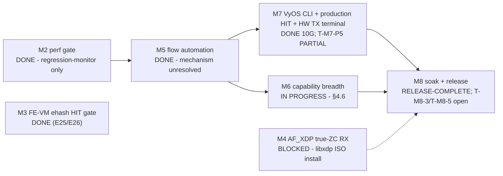
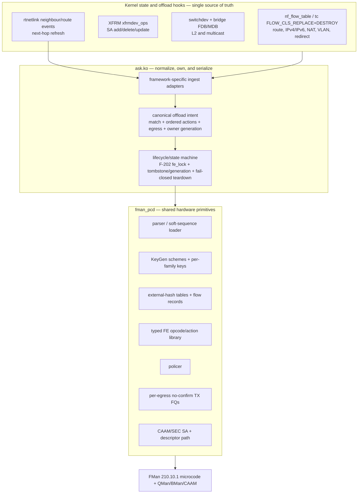

# ASK2 Master Plan — Single Authoritative Execution Plan

**Version 2.29.0 · 2026-10-09**

## AI READING INSTRUCTION

This is the **single authoritative ASK2 execution plan**. For sequencing,
milestones, gates, and the live work program, read this document and nothing
else. `[SPEC]` = binding facts and requirements; `[NOTE]` = rationale;
`[BUG]` = defect (symptom + cause + fix).

Sources of truth that remain **live and binding** (this plan only sequences
them): silicon contract `arch/fman-microcode-210-programming-reference.md` +
`arch/fman-fe-ehash.md`; flow-key spec `specs/fman-keygen-flow-key-spec.md`;
state machine + CLI contract `plans/DUAL-DATAPLANE.md`; API surface
`arch/fman-pcd-api-reference.md`; CC-tree rebuild `plans/archive/CC-TREE-REBUILD-PLAN.md`;
vendor oracle `plans/archive/NXP-106-DEEP-DIVE-PLAN.md`; stub/type inventory
`plans/archive/TF-2026-07-18-001-function-inventory.md`. Where this plan and those
documents disagree, they win — update this plan.

**Scope of this revision.** This plan lists only what is still open or still
binding. Everything achieved up to 2026-10-09 (attempt logs, passed gates,
closed defects) is in the full snapshot
`plans/archive/ASK2-MASTER-PLAN-2026-10-09.md` (v2.28.0), in git history and in
qdrant. Original section numbers are preserved; the "Archived sections map" at
the end says where each removed section went.

---

## 1. Current state (branch `dpaa1` · diagnostic DUT `.185`: kernel `6.18.44-vyos`)

### 1.1 Position

**Baseline (2026-10-09, `dpaa1` HEAD `ab1660a7`).** What ships:

| Capability | Shipping state |
|---|---|
| Routed IPv4/IPv6 TCP/UDP unicast | eth0–eth4 engage with `offload ipv4` / `offload ipv6`. Per-port 46-byte dual-family ehash tables (F-224/F-225/F-226), direct-to-wire per-egress no-confirm TX FQ (F-198/F-199), `UPDATE_TTL` / `UPDATE_HOPLIMIT(0x29)`. ~10 Gbit/s at ~3% DUT CPU; A6 bidir within −0.5 % to +1.0 % of the vendor NXP ASK. eth0 stays opt-in/high-risk (SSH lifeline). |
| NAT | nat44 / nat66 automatic on an engaged family (F-230 bit-fused rewrite `0x33`/`0x27`/`0x2f`). NAT46/NAT64 stay in software. |
| VLAN | Single 802.1Q tag, IPv4, non-eth0, inline ehash path (`1e8865d5`, patches 0215–0218); IPv6 VLAN, 802.1ad, QinQ and stacked tags fall back to software. Automatic; kill switch `ask.vlan_offload`. |
| PPPoE | Decap F-260 (opcode `0x14`), encap F-261 (opcode `0x43`), egress MTU check F-262 (`81069e39`, `dcf9bb5c`). Automatic on an engaged PPPoE source-interface port; kill switch `ask.pppoe_offload`. PPPoE over VLAN stays software. |
| F-262 hardware fragmentation | Vendor RX-port advanced-offload triple applied at engage (params-page misc `\|= 0x40000000`, `FMBM_RCMNE (+0x7c) = 0x0e`, `FMBM_RFENE (+0x70) = 0x22`). IPv4 DF-clear is fragmented in hardware; DF-set is punted to the host (ICMP fragmentation-needed). IPv6 is HW-fragmented by default (`ask_ipv6_hw_frag = true`, `ask_flow_offload.c:128`); `ask.ipv6_hw_frag=0` is the RFC 8200 opt-out (such flows stay in the kernel, which sends Packet Too Big). RX-triple follow-ups are committed. |
| Granularity (2026-10-09, binding) | Per-port engage plus per-family `offload ipv4\|ipv6` only. VLAN, NAT, PPPoE, bridge and IPv6 HW-frag are automatic parts of an engaged port. Global kill-switch module params: `vlan_offload`, `pppoe_offload`, `nat44_offload`, `nat66_offload`, `ipv6_hw_frag` (plus `vlan_push_only`). `vlan_offload`, `nat44_offload`/`nat66_offload` and `ipv6_hw_frag` flush or tear down live records on 1→0; the grammar spec says `pppoe_offload` also flushes PPPoE flows (reconcile on the board). The `offload vlan` / `offload pppoe` leaves are gone: `vyos-1x` patch 054, migration `interfaces` 35-to-36 (`ab1660a7`). Spec: `specs/ask2-vlan-cli-grammar.md` §9. |
| MTU | ASK clamp 1280–3600 for every engaged port (vyos-1x patches 036/037, `ASK_OFFLOAD_MTU_MAX = 3600`); RX buffers are order-0 (F-222, `fa2e2d29`). |
| Bridge | B0 dormant host plumbing done (2026-09-10); B1 L2 ehash key builder + FE-VM emitter written (`ad20dfa9`), dormant and not CI-built. Decisions D1 and D8 operator-CONFIRMED 2026-10-09. Plan: `plans/ASK2-BRIDGE-OFFLOAD-PLAN.md` §13. |
| Last CI image | Run `37882977943` from `ab1660a7`, ISO `vyos-2026.10.09-0415-rolling`, published on lxc200. **Not yet installed or board-validated** (operator task). |

**Board gates for image `2026.10.09-0415-rolling`** (run 2026-10-09 on `.185`, cold boot 15:36 via smart plug, then in sequence; CSVs `/mnt/builds/ask2-review/oracle/quick-20261009-*`):

- [x] Cold boot; `dmesg` shows "advanced offload on" (ports 0x10/0x11: misc `0x40000100`, rcmne `0x0e`, rfene `0x22`; re-applied on every CLI re-engage).
- [x] VLAN and PPPoE auto-arm with only `offload ipv4|ipv6` configured (eth3/eth4 carry only `gro gso ipv4 ipv6 sg`; every VLAN and PPPoE cell HW).
- [x] Migration `interfaces` 35→36 (`interfaces@36`, no `offload vlan`/`offload pppoe` leaves left).
- [x] Kill switches: `vlan_offload`, `pppoe_offload`, `ipv6_hw_frag`. Each 1→0 right after a HW run flushed 18 → 0 records in under 3 s with no F-256 SYNC timeout; with 0 the cell runs SW (vlan-v4 3.77, pppoe-up-v4 3.60, pppoe-up-v6 4.87 Gbit/s); back to 1 it is HW again (9.31 / 9.27 / 9.08).
- [x] Fragmentation probes (IPv4 DF-clear / DF-set, IPv6 with the default policy and with `ipv6_hw_frag=0`). UDP sender with `IP(V6)_PMTUDISC_PROBE`/`_DONT`, 1000 × 1500-byte packets at 500 pps through LAN 1500 → PPPoE 1492: IPv4 DF-clear 1000/1000 delivered, hardware-fragmented (DUT `IpFragCreates` 0, dell1 `IpReasmOKs` +1000); IPv4 DF-set 0 delivered, DUT `IcmpOutDestUnreachs` +1000 (host punt, PMTUD works); IPv6 default 1000/1000 hardware-fragmented; IPv6 `ipv6_hw_frag=0` 0 delivered, `Icmp6OutPktTooBigs` +1000. Known limitation: IPv6 fragment-ID reuse under load (`ASK2-PPPOE-OFFLOAD-PLAN.md` §3.7).
- [x] `bin/testrig-offload-quick.sh` (all cells; re-measure `pppoe-up-v6`, §4.6.4 T-M6-SP4). All 10 cells and both combos HW: unicast 9.38 / 9.27, NAT 9.36 / 9.24, VLAN-VLAN 9.31 / 9.22 (IPv6 VLAN is HW), PPPoE down 9.35 / 9.18, PPPoE up 9.20 / 9.09, NAT44 over PPPoE 9.20, VLAN-VLAN NAT44 9.33 Gbit/s (v4 / v6). After a DUT power cycle dell1/dell2 lose their runtime routes: run `bin/testrig-combo-matrix.sh setup` first.
- [x] `pcd-snapshot` diff after disengage returns byte-exact to the warm S0 baseline (CLI disengage of eth3+eth4 → capture → CLI re-engage → 30 s HW traffic → CLI disengage → "PCD state matches baseline"; MURAM `used` 52922 engaged / 35280 disengaged).

### Plain IPv4-unicast preview release checklist (open items only)

- [x] Cold-boot board validation of CR-003 through the actual VyOS CLI commit
  path, including a forced helper failure proving the commit fails closed
  (helper implemented in `3523be05`: YNL `flush-flows`, conntrack flush, YNL
  disengage, read-only `fe_arm` verify, `ConfigError` on any non-zero helper
  result). **Validated 2026-10-09 on `0415`:** with a failing stub bind-mounted over
  `/usr/local/bin/vyos-offload-ask`, `delete interfaces ethernet eth4 offload ipv6` gave
  "ASK family-mask 1 failed on eth4: helper exited with rc=1 … Commit failed"; the running
  config kept the leaf and both ports stayed armed. Note: in a `script-template` session
  `commit` returns 0 even when it prints "Commit failed"; scripts must check the output.
- [x] Production `ask-check` gate: **0 required FAIL**, plus byte-exact
  `pcd-snapshot` disengage diff against the warm S0 baseline on the next built
  image. **Met on `0415` (2026-10-09): `ask-check` 36/36 before and after the gate
  run, `pcd-snapshot` diff byte-exact.** (`ask-check`'s scope text still lists
  NAT/VLAN as software fallback; cosmetic, stale.)
- [ ] Prerelease release notes/package and one external validation cycle using
  the operator procedure in `plans/ASK-ISO-BUILD-AND-INSTALL.md`.

**Dispatch-path caveats (binding).**

- **CC-tree classification:** no confirmed HIT. The `ask.ko` insert path was
  deleted (CR-007). The `cc_test` harness is architecturally broken — **retired,
  do not patch further**.
- **M5's 10.259 Gbps** is a real throughput number but the **mechanism is
  unresolved** — most likely kernel `nf_flowtable` software forwarding, not
  hardware classification. Do not cite it as HW-offload proof.
- **M2's 7.37 Gbps CC pass-through** is MISS→kernel delivery (CONT_LOOKUP
  numKeys=0), not offload.
- The FE-VM ehash dispatch is `RCCB→FE_ENTER` direct (vendor's real mechanism,
  `copy_td_to_ccbase()`); the group-AD topology is dead (F-157/158, F-175).

**[SPEC] Scale mechanism settled for the current architecture.** FE-VM external
hash is the production classifier and the basis for scale; a single CC-tree
node's historical 32-key software cap is not the flow-scale architecture.
Ehash provides DDR bucket/record scale under an explicit resource budget.
CC-tree remains useful only for bounded coarse dispatch/policy roles and MUST
not replace the proven ehash flow store. Scale gates are now capacity,
collision-chain behavior, lifecycle generations, MURAM/DDR/FQ budgets, and
soak — not a CC-tree-vs-ehash mechanism decision (§4.6).

### 1.2 Layer status

| Layer | Status |
|---|---|
| 1. FMan PCD subsystem (KG / CC / HM / PLCR) | Shipping — patches 0092–0118, 0151–0155 |
| 2. FE-VM ehash substrate (pool, singletons, ehash, EXT_HASH, MUX/ENQ, arm) | Shipping. The warm shared diagnostic chain is singleton-global and must be reused rather than rebuilt. |
| 3. Classifier→FE arm | Direct vendor-node arm is proven; the manual arm applies scheme-4 EKFC and tears down safely. |
| 4. ask.ko datapath (genl + flow table) | Routed IPv4/IPv6, NAT/PAT, VLAN and PPPoE ship (see Baseline). Unsupported actions fail to software before publication. Open breadth: §4.6. |
| 5. VyOS CLI + mutual exclusion | Shipping on eth0–eth4: per-interface `offload ipv4` / `offload ipv6`; ASK↔VPP remains a per-interface mutex. Hardware-offload MTU range 1280–3600. |

### 1.3 Binding silicon facts (settled on LS1046A hardware — do not re-litigate)

**[SPEC]**

- **EKFC extraction is MSB-first:** SIP→DIP→PROTO→SPORT→DPORT (+PORT_ID
  sorting first as the highest set bit, when present).
- **KG hash = raw CRC-64** (ECMA-182, reflected poly `0xC96C5795D7870F42`),
  seed `~0ULL`, **no final complement**; stored at IC offset `0x48`.
  CRC-64/XZ does NOT match hardware.
- **This branch's flow key is 14 bytes, CLOSED 2026-08-06/07/08:**
  `PORT_ID|SIP|DIP|PROTO|SPORT|DPORT`, EKFC `0x801C0006`, `PORT_ID=0x00` for
  eth4/port 0x11 — hardware-CRC-64-validated 3 independent times (2026-08-06
  184,320-candidate brute force discovery; 2026-08-07 16-candidate 0x00-0x0f
  batch test; 2026-08-08 independent re-confirmation via passive
  `hash_probe`, bit-for-bit identical hash across sessions). **F-163's
  14-byte `portid`-prefixed variant (EKFC `0x801C0006`, commit `f212c701`)
  was RIGHT, not wrong** — the 2026-08-06 "reverted, GEC conflation" episode
  (below) was itself corrected the next day: `<combine portid="true".../>`
  was proven (2026-08-07, reading vendor's real FMC source —
  `FMCPCDReader.cpp`/`FMCPCDModel.cpp`/`FMCCModelOutput.cpp`) to build the
  KeyGen "extractedOrs"/OR-Data-Vector array (FQID-only, unrelated to the raw
  comparison key), a structurally different mechanism from
  `KG_SCH_KN_PORT_ID` (EKFC bit 31), which genuinely IS part of the raw
  comparison key via `GetKnownFieldId()` sorting it first. Vendor's own key
  IS 14 bytes (`union dpa_key`) — and this branch's key now matches it
  exactly, byte-for-byte, HW-confirmed. **A properly-EKFC-synchronized
  14-byte key still does not HIT** (tested 3 independent times, same
  result each time) — key format is a CLOSED lead, not the open one.
- Vendor `cdx.ko` classifies every accelerated flow via
  `ExternalHashTableAddKey()` — external-hash **is** the vendor production
  classification; the opcode/manip chain executes from inside each DDR ehash
  entry.
- **`FMFP_EXTC[INV0]` SYNC is required** before dispatch into a
  newly-repointed live FMan-controller structure (RM §5.12.14.1). Asserted in
  `fman_port_set_cc_base()` between the `fmbm_rccb` and `fmbm_rfpne` writes
  (F-168, commit `7e85a035`). Board-confirmed for the `off=0` scaffold arm
  only; the `off != 0` FE_ENTER-direct path is not covered by that
  confirmation.
- `__fman_pcd_fe_arm_engage()` overwrites the caller's `fe_enter_off` with the
  CONT_LOOKUP scaffold **only when the caller passed 0** (F-165, commit
  `e4f23948`). Explicit-target arms reach the built chain.
- `fman_pcd_kg_scheme_set_ekfc()` is **broken dead code** (`-EINVAL` on any
  already-bound scheme — the only case anyone would call). Do not use it. The
  working sequence is F-169's `fe_kg_ekfc` debugfs verb (commit `a84e5fe5`):
  `keygen_scheme_setup(false)` → mutate `scheme->ekfc` →
  `keygen_scheme_setup(true)` against `fman->keygen->schemes[]` via
  `fman_keygen_internal.h`.
- **KeyGen scheme 4 boots with EKFC `0x00180006`** (12-byte CC-tree format).
  Any ehash arm must reconfigure it to `0x801C0006` first, or KeyGen extracts
  12 bytes against a 14-byte table key (structural mismatch — stalled the
  first T-M3-R attempt).
- CC match rows are `key(16B)+mask(16B)` = 32 B stride, `(numKeys+1)` rows;
  mask `0xff`=participate / `0x00`=wildcard.
- The CC comparator reads **KG-emitted bytes**, not a re-extracted canonical
  composite (ask20 patch 0108 precedent).
- `FMAN_CC_MAX_STATIC_KEYS=32` / `FMAN_PCD_CC_HW_MAX_KEYS=32` are **software
  struct caps**; hardware allows 255 keys/node
  (`FMAN_PCD_CC_NODE_KEYS_MAX`). A 255-key node ≈ 8 KiB; 64 KiB MURAM arena →
  ~8 nodes → ~2,000-flow capacity. **Design input only — no CC HIT is
  proven.**
- MISS→kernel resolves at the CC layer (CONT_LOOKUP numKeys=0 → miss-AD →
  port PCD FQ). The FE-VM has no viable kernel-delivery terminal (4 ENQ
  variants failed on silicon).
- A bare CC node with no FE entry parks frames with no terminal disposition
  (210.10.1 silicon). Some FE-VM entry on HIT is required.
- `cmm`'s conntrack ingestion on `.106` is deaf (vendored
  libnetfilter_conntrack 1.1.0 never invokes `__cmmCtCatch()`).
  `/proc/fqid_stats/pcd/*/*` is **NOT a HIT/MISS oracle**. Use
  `bin/kg-scheme-read.py` / `bin/muram-mmap-dump.py`.
- `fe_probe` reads the FE **object pool** (`0x4bc00`, 28 B descriptors), not
  the per-port **workspace pool** (`FmPortSetFESupport`, `0x54e00`) — "empty"
  is expected even on a real HIT. `fe_buffer +0x58` is a
  workspace-pool-exhaustion counter, not an allocation counter. Neither
  distinguishes HIT from MISS on its own.
- **`EXIT`-`DEALLOCATE` (the ehash MISS disposition) is a silent frame DROP,
  not kernel delivery** (§7.4 of the microcode reference). 100% ping/ARP
  loss on an armed port is *expected* for any non-matching frame, not a
  malfunction — do not read connectivity loss alone as a fault.
- **eth4's real kernel-delivery FQID is `0x300`** (traced live via
  `dpaa_rx_fd`, 2026-08-06) — not `0x200` (eth3's) or `0x2B9` (`ask.ko`'s
  unrelated TX-bypass queue, no RX consumer in a raw-debugfs test). The
  discriminator for a genuine HIT is an ordinary `dpaa_rx_fd` event on the
  target FQID: a real HIT dispatches through the same dequeue point as
  normal traffic, so its *absence* on a matching frame is evidence of a
  MISS, not an inconclusive result. `fe_arm`'s 3rd argument is inert on the
  `off != 0` path — the live dispatch target is `fe_enq build <fqid>`.
- **[SPEC] Production HIT currently reinjects to a kernel RX FQ, which is the
  ~1.5 Gbps ceiling by design (2026-08-15).** F-197 resolves eth3 to `0x200`
  and eth4 to `0x300`. These are kernel-delivery RX FQIDs: the E25/E26 gate
  used own-port RX enqueue precisely so a HIT is observable as ordinary NAPI
  traffic. On silicon this funnels every HIT to one QMan portal/CPU (portal 0),
  so loss starts near 300 Mbit/s and 500 Mbit/s can wedge the FMan. This is not
  a distribution bug to patch by RSS-spreading the RX FQ — binding fact 9 is
  the intended production terminal: the per-flow opcode chain (vendor-verified)
  `PREEMPTIVE_CHECKS_ON_PKT(0x05) → STRIP_ALL_VLAN_HDRS(0x12) → UPDATE_TTL(0x21)
  → INSERT_L2_HDR(0x41) → ENQUEUE_PKT(0x01)` to a **per-egress-interface TX
  FQ**, bypassing the kernel forward path entirely (vendor cdx.ko 8.58 Gbps).
  T-M7-2 is to build that TX terminal, not to
  spread RX reinjection. Own-port constraint still holds; cross-port enqueue
  remains invalid (E25).
- **The direct `RCCB→FE_ENTER` topology, not the `CONT_LOOKUP` group-AD RM
  §7.11 describes, is vendor's real dispatch mechanism (2026-08-07).**
  Reading `we-are-mono/ASK`'s `fm_cc.c` completely found `copy_td_to_ccbase()`
  writes the ehash table's `en_exthash_node` 4-word descriptor **directly
  into the CC-tree root's own AD slot** — the exact MURAM location `RCCB`
  points at — with no group-AD/match-table indirection anywhere in the
  `USE_ENHANCED_EHASH` path. This independently confirms F-147/F-148's
  direct-topology work (done without ever having read this vendor function)
  was correct, and further confirms the group-AD topology (F-171/F-172,
  §4.1's old attempt 6 plan) was never the right thing to chase.
- **`FMFP_EXTC`/Host-Command sync is NOT what vendor asserts around a plain
  ehash insert (2026-08-07).** Read `fm_ehash.c` (complete, 1924 lines) and
  `hc.c` (both the ASK diff and pristine base) in full: `ExternalHashTableAddKey()`'s
  fast path (fresh insert into an empty bucket) calls no sync of any kind —
  not `FmPcdHcSync()`, nothing. `FmPcdHcSync()`/`FmHcPcdSync()` is a genuine
  Host Command **frame dispatch** (enqueued via `EnQFrm()` to the FMan's HC
  port) — structurally unavailable on this board's microcode regardless
  (`caps=0x17` bit 3 clear). `F_167`'s `FMFP_EXTC` register-level probe
  remains untested on the insert path specifically, but is now a weaker
  hypothesis than before this reading — vendor doesn't need any sync there.
- **Vendor forces `TIMESTAMP_EN` on every ehash key unconditionally, backed
  by a live, periodically-refreshed MURAM pool (`extHashTsInfo`) kept alive
  by a userspace timer (`cdx/cdx_timer.c`) entirely outside `sdk_fman`
  (2026-08-07).** `F-176` (this branch's new stats/HIT-discriminator debugfs
  node, `fe_ehash_stats`) reproduces the forced-on flag bit
  (`flags=0x3000`, `STATS_EN|TIMESTAMP_EN`) with **no** corresponding pool.
  **The 2026-08-07 "clean negative" result (13-byte key + direct topology,
  `pkt_count` stayed 0) was produced using this tainted discriminator and
  cannot yet be trusted** — see §4.1's Phase 1 for the required retest with
  `TIMESTAMP_EN` cleared before this result is treated as real. Full
  function-level catalogue of everything read: `arch/fman-microcode-210-programming-reference.md`
  §12.1.

**Reader notes (2026-10-09).** The bullets above are kept verbatim so no
fact is lost; three are historical and superseded by later closure:

- The `EXIT`-`DEALLOCATE` silent-drop bullet is OBSOLETE as a statement about
  the production path: E25 proved that the ENQUE own-port miss action delivers
  to the kernel, and the HIT/MISS discriminator is the target-FQID split (miss
  → `0x200` for eth3, record → `0x300` for eth4; §3 M3).
- The "2026-08-07 negative cannot yet be trusted, see §4.1 Phase 1" bullet is
  superseded by E25/E26 (2026-08-12); §4.1 history is archived.
- "T-M7-2 is to build that TX terminal", "§4.1's old attempt 6 plan" and
  "T-M3-R attempt 5" refer to work that is done and archived (F-198/F-199/F-200
  built the terminal; T-M3-R PASSED 2026-08-12).

#### 1.3a Slot-LCV discrimination is invalid for transit (ROOT CAUSE CLOSED 2026-08-19)

A live, reversible single-variable ladder on the already FE-engaged
eth3 scheme 3 (AC_CC `0x80000006`) proved: (A) zero-all + slot5=`0x40000000`
with v4 mv=`0x40000000` reproduces NO_SCHEME with the v6 scheme absent; (C) the
same v4 mv with all LCV slots left `0xffffffff` works; (D) setting slots 5/6 but
leaving others all-ones works for v4 but cannot discriminate because both mv
bits match. A complete IPv4 single-slot sweep (only slot i set, others zero)
found **ONLY HXS slot 0 ACTIVE; slots 1–15, including assumed IPv4 slot 5, all
NO_SCHEME.** The equivalent IPv6 sweep also found **ONLY slot 0 ACTIVE; slots
1–7, including assumed IPv6 slot 6, all NO_SCHEME.** Therefore FE-engaged 10G
TRANSIT frames of both families derive their selectable LCV from the same slot
0; the earlier eth1 ping/RSS proof exercised a different parse path and cannot
justify production transit. The F-205/F-210/F-211/F-212 slot-5/6 two-scheme
split is design-invalid; the unified dual-lane 46-byte key on ONE match-all
AC_CC scheme (F-224/F-225/F-226) superseded it. `bin/kg-lcv-probe.py` remains
the register oracle (parser `pmda[].lcv`, per-scheme `kgse_mv`/`kgse_spc`).

**v6 test budget.** IPv6 software forwarding is a control-plane DoS on
this 4-core board: RPS ON survives ~500 Mbit/s/8s but WEDGES at 600 Mbit/s
(cold boot required); RPS OFF wedges near-instantly. Cap every v6 test that
stays in software (for example `ipv6_hw_frag=0` runs, pre-HIT probes) at
<= 100 Mbit/s (ping-rate or `-b 100M`). DUT v6 ULAs MUST be VyOS config
(`set interfaces ethernet eth3/eth4 address fd99:{1,2}::185/64`), never raw
`ip -6 addr` (a commit strips non-config addresses). The reliable v6 generator
on HELGA is a Windows SCHEDULED TASK (`ask2_iperf3_v6`, SYSTEM,
`-s -B fd99:2::16`), not Start-Process (dies with the SSH session).

---

## 2. Binding architecture decisions

**[SPEC]** Binding on all future work:

1. **EKFC-only, no GEC.** `kgse_gec[]` stays zero (per-frame latency).
2. **Raw CRC-64, no final complement** (§1.3).
3. **MISS→kernel via CONT_LOOKUP pass-through.** The FE-VM executes only on
   HIT.
4. **Single-image dual-dataplane.** S0 (mainline/RSS) at boot; S1 (ASK)
   per-interface on `set interfaces ethernet eth<n> offload ipv4|ipv6` (there
   is no `ask` / `offload ask` keyword); S2 (VPP) on `set vpp settings`.
   ASK↔VPP transitions always pass through S0, with a per-interface mutex. One
   ISO, one `version.json` feed (+ fielded aliases). `set system offload
   classify` is deprecated as a CLI; the classify mechanism stays as silent
   default (RSS + parser programmed unconditionally).
5. **`contextOffsetInWS = 0`** (SDK default, silicon-verified).
6. **`FmPortSetFESupport` is MANDATORY for any FE-VM frame** (auto-armed on
   every `fe_arm engage`). Without it, FE_ENTER ALLOCATE books workspace at
   MURAM offset 0.
7. **GCM refused for IPsec** (CAAM A24a wire-sequence-duplication erratum
   breaks peer anti-replay). Offloaded suites: AES-CBC-SHA256,
   AES-CTR-SHA256. `ask_xfrm_state_add` returns `-EOPNOTSUPP` for
   `rfc4106(gcm(aes))`.
8. **Debugfs for diagnostics only — kernel API for production control.**
   ask.ko engages/disengages via `fman_pcd_fe_engage()`/`_disengage()` and
   inserts via `fman_pcd_fe_flow_add()`/`_del()`; it never writes debugfs
   control nodes.
9. **The hardware TX opcode chain is the 10 Gbps path** (vendor-verified
   2026-08-15 against `we-are-mono/ASK@fe36f30` `cdx/cdx_ehash.c` +
   `fm_ehash.h`): a plain routed IPv4 unicast HIT emits, in order,
   `PREEMPTIVE_CHECKS_ON_PKT(0x05) → STRIP_ALL_VLAN_HDRS(0x12) →
   UPDATE_TTL(0x21) → INSERT_L2_HDR(0x41) → ENQUEUE_PKT(0x01)`. Opcodes are
   1-byte values written into the record's opcode-list region (NOT the 32-bit
   words in `arch/fman-fe-ehash.md` §10, which are a microcode-internal form).
   `STRIP_ETH_HDR(0x11)` is emitted ONLY when VLAN/PPPoE/tunnel/IPsec header
   ops are present; for a plain forward `INSERT_L2_HDR` alone rewrites the
   14-byte L2 header (dst=next-hop MAC, src=egress MAC, EtherType). The
   `ENQUEUE_PKT` FQID is a PER-EGRESS-INTERFACE TX FQ (vendor
   `eth_info->fwd_tx_fqinfo[quenum]`, resolved by output-interface name), not a
   single shared FQ. F-201-corrected kernel software forwarding reaches
   ~5.7–6.6 Gbit/s across MTU 1280–2500 with all four cores loaded; hardware
   reaches ~10 Gbit/s at ~3% CPU. Vendor cdx.ko measured 8.58 Gbit/s via the
   same terminal class.
10. **MTU / RX-buffer policy.** Each DPAA RX frame must fit ONE contiguous
    buffer (`dpaa_change_mtu` enforces it; oversized/mismatched frames wedge
    FMan RX, cold-boot recovery only). RX buffers are **order-0/4 KiB**:
    F-203's order-1 pool (ceiling MTU 7530, clamp 7500) was reverted by **F-222**
    (`fa2e2d29`, 2026-08-21; flips `DPAA_BP_ORDER` 1→0) because order-1
    `dev_alloc_pages()` failed under fragmentation and wedged the board.
    VyOS patches 036/037 clamp ASK to **1280–3600** (`ASK_OFFLOAD_MTU_MAX =
    3600`). True jumbo would need a page_pool / multi-size BMan pool or RX
    scatter-gather, which is not planned. TX-SGT and XDP-copy scratch pages
    stay order-0. Change MTU only while ASK is disengaged, keep every endpoint
    matched, and restore all endpoints to 1500 on exit/abort.
11. **MURAM allocation strategy:** slab pools for fixed-size FMan objects (CC
    nodes, HM entries, policer profiles, ADs); segregated-fit power-of-two
    classes for general-purpose allocation; strict object lifecycles tied to
    the parent kernel object; teardown validated byte-clean with
    `pcd-snapshot`. The production ehash dataplane has zero per-flow MURAM
    allocation (one fixed 512 KiB DDR ehash bucket table per engaged port, one
    256-byte DMA-coherent DDR record per flow, host-slab cookies, a warm shared
    33,280-byte internal-buffer pool + 16×28-byte FE object free-list), so the
    segregated allocator is deferred until CC-tree scale-out or HM
    header-manipulation features produce measured allocator churn (T-M8-6
    retired). The archived `0127`/`0128`/`0129`/`0138` WIP allocators are unsafe
    and must not be revived as-is.
12. **Scale-out mechanism (>32 flows): SETTLED — ehash** is the flow-scale
    classifier (§1.1). CC-tree scale-out is deferred (§4.4); CC-tree capacity
    arithmetic (§1.3) stands as design input only.
13. **Per-flow stats require a HW counter:** the 210.10.1 silicon writes
    cumulative `packet_count`/`packet_bytes` into every ehash record; F-228
    (`3e6a19a4`) reads them (board validation pending, §4.7 T-M8-3). CC-tree
    `STEN` + `AllocStatsObjs` (the vendor MURAM 327×-ENOMEM wall) stays
    deferred with CC-tree scale-out.

---

## 3. Milestone chain


```mermaid
graph LR
    M2["M2 perf gate<br/>DONE - regression-monitor only"] --> M5["M5 flow automation<br/>DONE - mechanism unresolved"]
    M3["M3 FE-VM ehash HIT gate<br/>DONE (E25/E26)"]
    M5 --> M6["M6 capability breadth<br/>IN PROGRESS - §4.6"]
    M5 --> M7["M7 VyOS CLI + production HIT + HW TX terminal<br/>DONE 10G; T-M7-P5 PARTIAL"]
    M7 --> M8["M8 soak + release<br/>RELEASE-COMPLETE; T-M8-3/T-M8-5 open"]
    M6 --> M8
    M4["M4 AF_XDP true-ZC RX<br/>BLOCKED - libxdp ISO install"] -.-> M8
```

| Milestone | Status | Open remainder |
|---|---|---|
| **M2** performance gate | DONE (7.37 Gbps / 0.16% CPU) | Regression monitor: every build changing `fman_pcd.c` or `dpaa_eth.c` re-runs the CONT_LOOKUP pass-through iperf3 gate. |
| **M3** FE-VM ehash HIT gate | DONE 2026-08-12 (E25/E26, `.185`, 6.18.44-vyos) | None. Gate definition (binding): a matching frame visibly dispatches through the flow record's target FQID with a discriminator that cannot confuse HIT with MISS delivery — the target-FQID split (miss fqid `0x200`/eth3 vs record fqid `0x300`/eth4), single-pass `kgse_spc`, bucket/chain/writeback verification. M3 gates nothing downstream. |
| **M4** AF_XDP true-ZC RX | BLOCKED | Gate: `xsk_zc_rx_redirect` > 0 under XDP_ZEROCOPY bind + steered flow. Work: §4.5. VPP is out of scope for M8. |
| **M5** CC-tree + SW flowtable + manip chain | DONE (throughput); mechanism unresolved | 10.259 Gbps / 0.16% CPU / 0% loss (MTU 9000, 3-node 10G plane) is a throughput result, not HW-classification proof (§1.1). |
| **M6** capability breadth | IN PROGRESS | M6-A board stress/negative gates (§4.6.4); PPPoE CI-image validation, soft-parser safety punts, IPsec, bridge (B1–B5), multicast, MACVLAN, fragments, 3-tuple, tunnels; CC-tree scale-out deferred (§4.4). Gates and MUST/DO-NOT rules: §4.6. |
| **M7** VyOS CLI + production transit HIT | DONE for the 10G production path | T-M7-P5 five-port acceptance PARTIAL (§4.2); `PREEMPTIVE_CHECKS_ON_PKT` on every plain forward is post-release hardening (§4.2 S2). |
| **M8** productization soak + release | RELEASE-COMPLETE (VPP out of scope); release `2026.08.22-0031-rolling` | Post-release, non-blocking: T-M8-3 per-flow counters board validation, T-M8-5 upstream-submission prep (§4.7); open defects §5. |

---

## 4. Work program

**[SPEC]** Ordered by priority. Owner slots (`@___`) assigned at session
start. Stub-fix IDs per `plans/archive/TF-2026-07-18-001-function-inventory.md`. The
orphaned P1–P3 closure series (`4493ce8`→`9970745`) is recoverable via
`git reflog` — re-land behind `bin/test-fixups.sh`, never before it passes.

### 4.1 T-M3-R — first genuine HIT test of the corrected ehash chain (PASSED 2026-08-12, E25/E26)

Archived in full (attempt history, F-185 VARIANT B `en_exthash_node`
at RCCB, F-186 ENQUE miss action, E24–E27 matrix, F-192 diagnostics). Nothing
open. Evidence: `decomp/experiments.md` E24–E27, `decomp/fman-ehash-process.md`,
`arch/fman-microcode-210-programming-reference.md` §5.2/§5.4, qdrant, and
`plans/archive/ASK2-MASTER-PLAN-2026-10-09.md` §4.1.

### 4.2 PR-001 / T-M7-1 production HIT + T-M7-2 hardware TX terminal (open remainders only)

T-M7-1 (production nft/YNL HIT), T-M7-2 S1/S3/S4 (F-198, F-200, F-199)
and T-M7-3 (mode-churn + MTU battery) are archived as achieved. F-193/F-196 stay
diagnostic-only; F-195/F-197 are real behavior fixes and stay.

- [~] **T-M7-2 S2 — `PREEMPTIVE_CHECKS_ON_PKT(0x05)`.** F-262 (`81069e39`,
  `dcf9bb5c`) now emits `05 PREEMPTIVE_CHECKS` for routed records whose egress
  MTU is below the ingress MTU (the PPPoE/MTU case), and
  `STRIP_ALL_VLAN_HDRS(0x12)` ships with VLAN. **Open (post-release
  hardening):** emitting `0x05` on every plain forward (vendor parity).
- [~] **T-M7-P5 — five-port silicon acceptance and management safety. PARTIAL
  (2026-08-21/22).** **PASSED (archived):** eth2 1G routed IPv4 HW HIT,
  eth1 engage, four-port simultaneous engage, eth3↔eth4 regression at
  7.32 Gbit/s, clean teardown, bounded one-time 256-byte FM_CTL params pages.
  **OPEN:** eth1 routed TCP/UDP HIT/load (no mapped peer subnet in the current
  lab), eth0 routed HIT/load with serial recovery, all-five simultaneous
  trafficked churn, and identical-tuple cross-ingress isolation under load.
  Validate remaining 1G ports in increasing blast radius: eth1 (center RJ45,
  `0x0d/0x2d`, channel `0x807`) next, and eth0 management (`0x0c/0x2c`,
  `0x806`) LAST. Port map: eth2 `0x09/0x29` ch `0x803`; eth0 `0x0c/0x2c`
  `0x806`; eth1 `0x0d/0x2d` `0x807`; eth3 `0x10/0x30` `0x800`; eth4
  `0x11/0x31` `0x801`.
  **Never engage eth0 while SSH is the only recovery path:** maintain serial
  console and a tested disengage/rollback channel; a failure must return eth0
  to kernel RSS without reboot. For each newly-supported port, prove:
  1. CLI engage is idempotent and the ASK↔VPP mutex remains per-interface;
  2. its own RX PCD range and a distinct no-confirm TX FQ on the correct DC
     channel are used (no global `0x801`/`0x200` fallback, no foreign-port FQ);
  3. TCP+UDP both directions with every already-supported port, TTL 64→63,
     L2 rewrite/checksum correct, conntrack `[HW_OFFLOAD]`, `show flows` owner/
     iif/oif correct, TX confirmations flat and no `Build skb failure`;
  4. identical 5-tuples arriving on two ingress ports remain distinct and
     delete/flush of one cannot remove or redirect the other;
  5. MTU 1280/1500/2500/3600 (the F-222 clamp is 1280–3600), neighbour change,
     interface down/up, config remove/reapply, module unload, and cold-boot
     persistence;
  6. per-port and all-five 100× engage/forward/flush/disengage churn leave the
     S0 `pcd-snapshot`/MURAM/FQ baseline byte-clean, with no RX-deaf port,
     QMan/BMan error, WARN/Oops or management loss.
  **Performance floors:** each 1G port sustains wire-rate for its tested
  direction without saturating one DUT CPU; eth3↔eth4 retains the proven
  ~10-Gbit/s result when 1G ports are simultaneously engaged/trafficked.
  **Completion meaning:** eth1–eth4 may be declared generally supported after
  their gates pass; eth0 remains opt-in/high-risk even after passing because it
  is the management lifeline. ASK 1.x's static all-five XML proves capability
  only—it does not waive any ASK2 lifecycle/reversibility gate.

### 4.3 NXP-106 deep-dive — vendor oracle track (answered)

Phases A/B of the NXP-106 oracle are answered and stored in qdrant
(live `.106` ASK stack fully mapped 2026-08-11): complete arming/offload process
`ask-arm-offload-every-step`, HIT/PASS encoding decode
`hit-pass-flow-encoding-decoded`, ASK2↔vendor difference inventory
`ask2-vendor-diff-inventory`. The `t_ExtHashFe` decode and DDR record-side
`t_ExtHashResult` encoding are in `arch/fman-fe-ehash.md` §5.1/§5.2. The
CC-tree replacement harness (§4.4) is no longer gated on Phase A/C.

### 4.4 T-M6-5 — CC-tree scale-out (DEFERRED — no confirmed CC-tree HIT; ehash is the scale mechanism)

**[SPEC]** Raising `FMAN_CC_MAX_STATIC_KEYS` alone has zero effect: CR-007
(commit `dd364494`) deleted every caller of the CC-tree insert functions
those constants gate. CC-tree is only for bounded coarse dispatch/policy
roles (§1.1). Actual scope when scheduled:

1. Reimplement ask.ko's CC-tree flow-insert path (~120 lines, recover via
   `git show dd364494`: `struct ask_hw_cc_slot`, shadow array,
   `fman_hm_nexthop_get/put`, shadow key construction/rollback).
2. Rewire `ask_flow_offload.c`'s REPLACE handler to call it instead of /
   ahead of `ask_fe_flow_insert()`.
3. Build a new hardware harness — `cc_test` is retired (F-159–F-162: five
   vendor-verified register fixes, RX-silent within 17–30 frames on every
   install, reboot-required, while `.106`'s vendor stack classified 400+
   frames at 0% loss in the same session).
4. Then raise the capacity constants and implement multi-node allocation per
   `plans/archive/CC-TREE-REBUILD-PLAN.md` (Phase 0 oracle test → Phase 4 scale-out).

### 4.5 M4 — AF_XDP true-ZC RX

- [ ] **T-M4-5a** `@___` — **Install the libxdp VPP ISO on `.185` + cold
  boot** (hugepages/isolcpus come from U-Boot). ISO 0201 (CI 29888749801)
  deployed to lxc200. Root cause chain: stock VyOS VPP is built without
  libxdp → its XDP program never enters DRV mode (`run_cnt=0`); the raw XSK
  probe works on this kernel (`xsk_zc_rx_redirect=29` with DRV_MODE), so the
  kernel ZC datapath is proven and the gap is VPP integration.
- [ ] **T-M4-4d** `@___` — **Verify the ZC datapath flows.** After the
  install: `bpftool` dump `xsks_map[0]`, fix map population (patch 4006
  forces `rx_queue_index=0`; VPP's XDP program redirects into an
  empty/mis-indexed `xsks_map`).
- [ ] **T-M4-4e** `@___` — Measure ZC throughput. Target ≥ 3.0 Gbps. Blocked
  on T-M4-4d.
- [ ] **T-M4-4f** `@___` — Verify reversibility. Blocked on T-M4-4d.
- [ ] **T-M4-4g** `@___` — Flip M4 to DONE. Gate: `xsk_zc_rx_redirect` > 0
  under a steered flow.

### 4.6 M6 — full vendor-capability breadth

**[SPEC] Architecture goal.** ASK2 MUST reproduce the useful NXP ASK outcome
surface without porting the ASK 1.x parallel control plane. The vendor stack
needed `cmm` (conntrack/rtnl/xfrm listeners) → FCI/libfci → `cdx.ko` because its
old kernel lacked modern offload frameworks. ASK2 runs on kernel 6.18: the
kernel's flowtable, XFRM, switchdev, bridge, route/neighbour, and tc state are
the authority. ASK2 is a translation/cache layer below those authorities — it
MUST NOT create another daemon that shadows them.


```mermaid
flowchart TB
    subgraph K["Kernel state and offload hooks — single source of truth"]
      NFT["nf_flow_table / tc FLOW_CLS_REPLACE+DESTROY<br/>route, IPv4/IPv6, NAT, VLAN, redirect"]
      XFRM["XFRM xfrmdev_ops<br/>SA add/delete/update"]
      FDB["switchdev + bridge FDB/MDB<br/>L2 and multicast"]
      RT["rtnetlink neighbour/route events<br/>next-hop refresh"]
    end

    subgraph ASK["ask.ko — normalize, own, and serialize"]
      ING["framework-specific ingest adapters"]
      INTENT["canonical offload intent<br/>match + ordered actions + egress + owner generation"]
      LIFE["lifecycle/state machine<br/>F-202 fe_lock + tombstone/generation + fail-closed teardown"]
    end

    subgraph PCD["fman_pcd — shared hardware primitives"]
      PRS["parser / soft-sequence loader"]
      KG["KeyGen schemes + per-family keys"]
      EH["external-hash tables + flow records"]
      OPC["typed FE opcode/action library"]
      PLCR["policer"]
      TX["per-egress no-confirm TX FQs"]
      CAAM["CAAM/SEC SA + descriptor path"]
    end

    UCODE["FMan 210.10.1 microcode + QMan/BMan/CAAM"]

    K --> ING --> INTENT --> LIFE --> PCD --> UCODE
    RT --> ING
```

#### 4.6.1 Binding control-plane rule — kernel authority, hardware cache

**[SPEC] MUST:**

1. `nf_flow_table` / tc flower is authoritative for routed flows, NAT actions,
   VLAN actions, egress redirect, and flow lifetime.
2. XFRM (`xfrmdev_ops`) is authoritative for IPsec SAs, keys, modes, lifetime,
   anti-replay, and deletion.
3. switchdev/bridge FDB and MDB callbacks are authoritative for L2 and
   multicast membership.
4. rtnetlink neighbour/route notifications are authoritative for next-hop MAC
   and egress changes.
5. `ask.ko` MUST mirror only offloadable objects into hardware. A failed insert,
   unsupported match/action, unresolved neighbour, resource shortage, or
   silicon readback failure MUST return a normal kernel fallback error
   (`-EOPNOTSUPP`, `-EAGAIN`, or the framework-appropriate code) before the
   object is marked `in_hw`.
6. Hardware state is disposable cache state. Kernel state MUST remain complete
   enough to continue forwarding after flush/disengage/reboot.

**[BUG] ASK 1.x parallel-state architecture**

- **Symptom:** `cmm` duplicated conntrack/route/XFRM/bridge state in userspace,
  FCI transported a second object model, and `cdx.ko` owned independent
  lifetimes; stale entries, start-order coupling, and MURAM exhaustion followed.
- **Cause:** the old kernel had no unified modern offload hooks, so the vendor
  supplied its own state-discovery/control plane.
- **Fix:** ASK2 MUST consume the kernel's native offload callbacks directly. Do
  not port `cmm`, FCI/libfci, `dpa_app`, FMC, or XML-as-runtime-configuration.
  Vendor code/XML remains a byte-level semantic oracle only.

**[SPEC] NEVER:**

- NEVER add an `askd`/`cmm`-style daemon that subscribes to conntrack, rtnetlink,
  XFRM, or bridge events and duplicates kernel state.
- NEVER expose vendor FCI command IDs as the ASK2 architecture. They are an
  inventory of outcomes, not the new control API.
- NEVER accept an unsupported hardware action as a no-op. In particular,
  `FLOW_ACTION_MANGLE` (NAT/PAT) and `FLOW_ACTION_VLAN_PUSH/POP` MUST return
  `-EOPNOTSUPP` until their FE rewrites are implemented and silicon-tested.
  Accepting them while omitting the rewrite can silently forward the wrong
  packet — it is not software fallback.
- NEVER advertise an ethtool/netdev/genl capability before forward + inverse +
  readback + fallback gates pass on hardware.
- NEVER make debugfs writes part of the production control path.

#### 4.6.2 Canonical offload intent and one action compiler

**[SPEC]** Every ingest adapter MUST normalize its framework object into one
canonical ASK intent before allocating hardware resources. The intent is an
internal kernel API, not a stable userspace ABI:

```c
struct ask_offload_intent {
        enum ask_owner_type owner;      /* FLOWTABLE, XFRM, FDB, MDB */
        u64 owner_cookie;
        u32 generation;                 /* rejects stale async DESTROY */
        struct ask_match match;         /* family + key type + fields */
        struct ask_action actions[N];   /* ordered, typed, validated */
        struct net_device *ingress;
        struct net_device *egress;
        u8 ingress_port;
        u8 egress_port;
        u32 tx_fqid;
        u32 flags;
};
```

**[SPEC]** `ask_action` MUST be typed — decrement TTL/hop-limit, rewrite IPv4 or
IPv6 address, rewrite TCP/UDP port, update checksum, pop/push VLAN, strip/insert
L2, enqueue, policer, replicate, CAAM/SEC — and compiled by one shared FE record
builder. A feature is a composition of actions, not a separate module-specific
record format. The compiler MUST:

- validate action order and incompatibilities before allocation;
- calculate opcode/parameter offsets from typed sizes (no copied literals);
- hard-check the 256/320-byte record limit;
- calculate required MURAM/DDR/QMan resources before publishing a bucket head;
- read back all unreporting FMan writes before marking the object hardware-owned;
- publish atomically under the same lifecycle lock used by delete/flush;
- return the exact unsupported action to the caller for software fallback.

**[SPEC] Lifecycle requirements.** Every object has one owner cookie +
generation. REPLACE is create-or-replace; DESTROY is idempotent; delayed
DESTROY for an older generation MUST NOT remove a newer record. F-202
`pcd->fe_lock` serialization is the floor, not the complete object model.
Clear-all, per-key delete, neighbour rebuild, and disengage MUST share the same
ownership/generation rules. No subsystem may call `list_del()` on a hardware
record it does not own.

#### 4.6.3 Vendor capability → ASK2 implementation map

| Capability | Vendor ASK evidence | Kernel authority / ingest hook | ASK2 FMan implementation | Current status |
|---|---|---|---|---|
| IPv4 TCP/UDP unicast route | `cdx_tcp4_cc`, `cdx_udp4_cc`; IPv4 FCI | `nf_flow_table` / tc `FLOW_CLS_REPLACE/DESTROY` | 14-byte ehash key; `UPDATE_TTL` → `INSERT_L2_HDR` → per-egress no-confirm `ENQUEUE` | **DONE, shipping.** eth0/eth1/eth2 breadth: T-M7-P5 (§4.2). |
| IPv6 TCP/UDP unicast route | `cdx_tcp6_cc`, `cdx_udp6_cc`; IPv6 FCI | same flowtable hook, IPv6 tuple | **unified dual-lane 46-byte key on ONE match-all AC_CC scheme** (`F-224`/`F-225`/`F-226`), `UPDATE_HOPLIMIT(0x29)` + L2/TX chain, per-port table | **DONE, shipping** (release `2026.08.22-0031-rolling`). The earlier slot-based LCV two-scheme approach (F-205/210/211/212) was proven design-invalid for transit (§1.3a). |
| NAT / PAT | CMM conntrack forward-engine; MANGLE equivalent | flowtable `FLOW_ACTION_MANGLE`/`ADD` | bit-fused in-place rewrites between `UPDATE_TTL`/`UPDATE_HOPLIMIT` and `INSERT_L2_HDR` (ports `0x33`, v4 L3 `0x27`=`UPDATE_TTL\|SIP\|DIP`, v6 L3 `0x2f`=`UPDATE_HOPLIMIT\|SIP\|DIP`); silicon auto-recomputes IP+L4 checksums | **DONE, shipping** (F-230; nat44 `625d0d2c`, nat66 `9598799f`). Automatic whenever `offload ipv4`/`offload ipv6` is engaged (no CLI knob); `nat44_offload`/`nat66_offload` are default-on kill switches; eth0 never NAT-offloaded. NAT46/NAT64 NOT offloadable — always SW fallback (same-family in-place rewrite only; no family-conversion opcode). `get-info` advertises `ASK_CAP_IPV4\|IPV6\|NAT\|PAT`. |
| VLAN pop/push | `CMD_VLAN_ENTRY`; VLAN HM | flowtable/tc `FLOW_ACTION_VLAN_POP/PUSH` | tagged flows reuse the routed/NAT ehash record: `STRIP_ETH_HDR`→`STRIP_ALL_VLAN_HDRS`→`INSERT_VLAN_HDR`→`INSERT_L2_HDR`→`ENQUEUE_PKT`, no separate CC-tree/HMTD stage, no miss-chain | **DONE, shipping** (`dpaa1` `1e8865d5`, patches 0215–0218). Scope: IPv4, one 802.1Q tag, non-eth0; 802.1ad/QinQ/stacked/IPv6 VLAN fall back to software. `ASK_CAP_VLAN` advertised only while armed. Automatic on an engaged port (granularity decision 2026-10-09); `ask.vlan_offload` (default on) is the global kill switch. |
| IPsec ESP | `cdx_esp4/6_cc`; 15 FCI SA commands; CMM XFRM; CAAM | XFRM `xfrmdev_ops` | SA table + CAAM descriptor path + ESP FE action; per-SA lifecycle and anti-replay | stub (`-EOPNOTSUPP`) — sequencing plan in `plans/ASK2-IPSEC-OFFLOAD-PLAN.md` (DRAFT, not started) |
| L2 bridge/FDB | `cdx_ethernet_cc`; RX L2BRIDGE commands | switchdev FDB | L2 ehash key (`PORT_ID\|DA\|SA\|ETYPE`) + egress/replication action; bridge owns lifetime | B0 done (dormant host plumbing); B1 code written (`ad20dfa9`), dormant, not CI-built; B2–B5 open — `plans/ASK2-BRIDGE-OFFLOAD-PLAN.md` §13 |
| IPv4/IPv6 multicast | `cdx_multicast4/6_cc`; MC4/MC6 FCI | switchdev MDB / kernel mroute | group key + bounded replication FQ/egress set | not implemented |
| PPPoE | `cdx_pppoe_cc`; PPPoE FCI; `cdx_sp.xml` | PPPoE netdev + normal flowtable after parser recognition | hard parser exposes inner IP (no soft parser needed); normal route/NAT intent follows; automatic on an engaged PPPoE source-interface port (`ask.pppoe_offload` kill switch) | decap (F-260), encap (F-261) and MTU check (F-262) implemented and silicon-validated on image `2320`; CI-image validation (`0415`) open — see T-M6-SP4 |
| 3-tuple route | `cdx_tuple3*` tables | flowtable wildcard/coarse flow only when kernel semantics permit | separate key type/scheme/table; never fake by truncating a 5-tuple key | key-packer primitive landed 2026-09-14 (silicon-confirmed 10-byte layout, KUnit-pinned), not yet dispatch-wired or reachable from ask.ko — see T-M6-T3 |
| IPv4/IPv6 fragments | `cdx_frag4/6_cc`; IP reassembly module | kernel fragment/reassembly framework | fragment key + bounded reassembly/slow-path policy | HW fragmentation for the MTU-shrink/PPPoE case only (F-262); generic reassembly/slow-path not implemented — see T-M6-FR |
| Tunnels / 6-in-4 | tunnel FCI; `cdx_sp.xml` IPv4-nextp 0x29 | tunnel netdev + flowtable | soft-parser re-dispatch; inner-flow intent; explicit encap/decap actions | not implemented |
| Policer/QoS/CEETM | QM/CEETM FCI, policer NIA | tc police/qdisc | existing FMan PLCR; CEETM separately scoped | policer shipping (F-231). Applies to non-ASK ports; ASK-engaged ports route AC_CC/FE-VM and bypass PLCR by design. CEETM not scoped. |
| RTP/RTCP relay, WiFi, voice | vendor appliance-specific modules | none required for VyOS routing | none | **permanently out of scope** |

#### 4.6.4 Program sequence and gates

##### Phase M6-A — shared safety substrate (MUST precede new features)

All four tasks are code/CI complete (2026-08-18). A2 strict action
acceptance (`70092e57`, CI `32156418969`) is superseded for NAT/VLAN (those now
offload); only `FLOW_ACTION_ADD` still unconditionally returns `-EOPNOTSUPP`.
A3 generation/tombstones (`c65f7793`, CI `32169305393`) had its board stress
gate closed by CR-004 on 2026-09-14. Still open board gates:

- [~] **T-M6-A1 — canonical intent** (`0a9c068f`, CI `32164888360`).
  `struct ask_flow_intent` + `ask_action_type` (REDIRECT, L2_REWRITE, TTL_DEC),
  lowered by the single `ask_intent_lower()` translation point;
  byte-identity with the pre-A1 path by construction. **Board gate open:** run
  the IPv4 MTU/performance/lifecycle battery and confirm the FE record bytes
  and throughput are unchanged from the pre-A1 baseline.
- [~] **T-M6-A4 — resource reservation** (`3bb5d643`, CI `32174170644`).
  Side-effect-free `ask_hw_flow_preflight()` runs before the first cookie
  allocation or silicon write (`-EOPNOTSUPP`/`-EAGAIN`/`-ENOSPC` before any
  mutation). One plain flow consumes one DDR ehash record + one xarray cookie +
  an existing TX FQ and zero per-flow MURAM; future compilers (policer/CAAM)
  extend the same preflight with their real per-feature ceilings. **Board gate
  open:** force each resource failure and prove no `in_hw`, no cookie/record
  publication, no MURAM delta, and correct SW forwarding.

##### Phase M6-B — extend the proven flowtable path first

T-M6-P5 (five-port implementation), T-M6-1 (IPv6 dual-lane, with the
§1.3a slot-LCV closure), T-M6-7 (NAT/PAT) and T-M6-8 (VLAN) are DONE and
archived; their open acceptance remainder is T-M7-P5 (§4.2) and the image-`0415`
board gates (§1.1).

##### Phase M6-C — soft parser and PPPoE/tunnel recognition

**[SPEC] Vendor source oracle.** The literal FMC reference is stored at
`specs/reference/nxp-ask-fmc/` (from `we-are-mono/ASK@fe36f30`):
`cdx_sp.xml` (194 lines, SHA-256
`321efa2b33d1a8d5fc2121f0ba0166669e075966f4e24e8de1b7751e7821dbe2`),
`cdx_pcd.xml` (SHA-256
`ad4c3364b0d0708abdedce9b6522876d71833ba054ff5f6a2a7048c42897027c`),
and port-binding cfg variants. `cdx_sp.xml` implements seven `before` schemas:
PPPoE, OH Ethernet correction,
IPv4, IPv6, UDP, TCP, and ESP. It includes PPPoE `ccbase += 0x30`, TTL/hop-limit
punt, multicast stop, 6-in-4 re-dispatch, UDP/4500 ISAKMP marker punt, TCP
SYN/FIN/RST punt, fragment-result fixups, and non-PPPoE policer steering.

**[SPEC] MUST:** TCP SYN/FIN/RST and IKE/NAT-T control packets remain visible to
the kernel; established-flow hardware offload MUST NOT steal conntrack setup,
teardown, SA negotiation, TTL-expired, or unsupported multicast traffic.

**[SPEC] NEVER:** do not load the vendor compiled sequence unmodified. It is
relocatable only with knowledge of the target layout: `$ccbase + 0x30` is an
FMC-assigned PPPoE relay-table offset and NIAs `0x4C0000`/`0x500002` target the
vendor policer/host topology. ASK2 MUST remap/relocate those references to its
own PCD objects and prove readback.

- [ ] **T-M6-SP1 — compiler/artifact capture.** Locate the vendor NetPDL→soft
  sequence compiler path in FMC/fmlib. Compile `cdx_sp.xml`; capture the exact
  instruction image, length, entry points, relocations, per-port attach state,
  and live parser-window readback from the vendor stack. Gate: compiler output
  equals live programmed bytes; every source schema has a mapped byte range.
- [ ] **T-M6-SP2 — typed parser API.** Add `fman_pcd_prs_load()` / `_readback()` /
  `_attach_port()` / `_detach_port()` / `_free()` with one owned 1984-byte
  arena, relocation inputs, per-port reference counting, strict bounds, and
  inverse. Gate: dormant load/readback byte-exact; attach/detach restores the
  full parser register/MURAM baseline; malformed image rejected before write.
- [ ] **T-M6-SP3 — minimal safety sequence first.** Port TTL/hop-limit and TCP
  SYN/FIN/RST punts before PPPoE acceleration. Gate: TTL 0/1 and hop 0/1 reach
  kernel ICMP path; SYN/FIN/RST remain in conntrack; established data may
  offload; no semantic change for unrecognized traffic.
- [~] **T-M6-SP4 — PPPoE.** The soft-parser route is superseded: PPPoE uses the
  hard parser's inner-IP exposure plus FE opcodes `0x14` (strip, F-260) and
  `0x43` (insert, EtherType `0x8864`, session ID in the flow key, F-261), with
  the egress MTU check F-262 (`05 PREEMPTIVE_CHECKS` first, ENQUEUE mtu, 32-byte
  frag-info block in the owned MURAM reservation). Decap, encap and F-262 are
  silicon-validated on image `2320` (2026-10-09); the history is in
  `plans/archive/ASK2-MASTER-PLAN-2026-10-09.md` §4.6.4 T-M6-SP4 and
  `plans/ASK2-PPPOE-OFFLOAD-PLAN.md`. **Open remainder:**
  - CI-image validation (image `2026.10.09-0415`, `ab1660a7`) of the board
    fixes plus the IPv6 hw-frag default-on policy. IPv6 that needs the MTU
    check is fragmented in hardware by default (vendor parity); the microcode
    can never send Packet Too Big (RFC 8200 4.5), so the global module param
    `ask.ipv6_hw_frag=0` (default 1) keeps those flows in software. No
    per-port CLI for it.
  - `pppoe-up-v6` was PARTIAL at 4.35 vs 3.58 Gbit/s software with
    `ipv6_hw_frag=0`; re-measure with the final F-262 and the default policy.
  - 10,000 session-cycle gate; discovery/LCP stay SW; reconnect/session-ID
    change; MTU/MRU; unsupported PPP protocol fallback.
  - PPPoE over VLAN is code-verified only (two encap entries → stays software,
    `-EOPNOTSUPP`); not run on the board.
  - PPPoE decap on dell1 needs RPS (5.7 → 9.35 Gbit/s; dell1 cannot RSS-hash
    PPPoE). Method `plans/ASK2-REWRITE-PLAN.md` §8; table PPPoE plan §3.6.
  - The routed key grew 46→50 B (F-259 `62cb81d9`: outer VID + PPPoE SID) on
    the ehash FE scheme only.
  - Soft-parser execution itself is unverified on `.185`
    (`specs/ask2-soft-parser-lcv-scheme-select.md` §6a–6q).
- [ ] **T-M6-SP5 — tunnel re-dispatch.** Add only protocols represented by a
  kernel tunnel netdev and canonical flow intent. Gate: 6-in-4 inner key,
  hop-limit/TTL, decap/encap capture, route/neighbour changes, unsupported
  nesting depth fallback.

##### Phase M6-D — IPsec through XFRM + CAAM

See `plans/ASK2-IPSEC-OFFLOAD-PLAN.md` for the full sequencing (DRAFT,
2026-09-06, not started): a Tier 1 (CAAM crypto acceleration under the
existing software XFRM datapath, config-only) / Tier 2 (this phase's full
FMan→CAAM→FMan fast path) split, with a measurement gate between them.

- [ ] **T-M6-4 — IPsec landing series.** Replace the `ask_xfrm_state_add()`
  `-EOPNOTSUPP` stub with XFRM-owned SA objects: add/delete/update/lifetime,
  transport/tunnel mode, ESN/anti-replay, NAT-T, inbound/outbound direction,
  CAAM descriptors, and FE→SEC→TX disposition. Advertise `NETIF_F_HW_ESP`
  **LAST**, after all gates pass. Never infer SAs from conntrack or add a CMM
  mirror.
- [ ] **T-M6-IP1 — supported-suite matrix.** Start with AES-CBC-SHA256 only.
  Preserve the binding GCM refusal for CAAM A24a until independently resolved.
  Unsupported algorithm/mode returns software before SA install.
- [ ] **T-M6-IP2 — IPsec gate.** Linux XFRM state/policy matches hardware;
  inbound/outbound transport+tunnel; sequence/anti-replay; rekey overlap;
  expiry/delete; PMTU/fragment policy; NAT-T control/data separation; peer
  interoperability; negative auth/replay tests; crash/reboot leaves no stale
  key/descriptor; kernel fallback after disable. Keys MUST never appear in
  debugfs, logs, support bundles, or persistent config outside XFRM.

##### Phase M6-E — bridge, multicast, and replication

- [ ] **T-M6-2 — bridge/FDB adapter.** Implement switchdev FDB add/del/flush and
  bridge attributes; L2 key type separate from L3 ehash. Bridge owns lifetime;
  ASK must follow STP/port state, VLAN filtering, learning/static flags, and
  ageing. Gate: learn/move/delete/age, port down, STP blocked, VLAN-aware
  bridge, unknown-unicast/broadcast software behavior, no routing regression.
  **Live execution plan: `plans/ASK2-BRIDGE-OFFLOAD-PLAN.md` §13** (staged
  B0–B5, gates G1–G13, decisions D1–D8; architecture analysis
  `plans/ASK2-BRIDGE-OFFLOAD-ARCHITECTURE-ANALYSIS.md`) — do not duplicate it
  here. State: B0 done 2026-09-10 (dormant host plumbing: switchdev
  FDB/blocking/netdevice notifiers observing only, coalesced+bounded event
  queue, `bridge_offload` module param default off; `ASK_CAP_BRIDGE` still
  unadvertised). Topology revised 2026-10-07: dedicated per-port L2 ehash
  table (`PORT_ID|DA|SA|ETYPE`, the same mechanism VLAN/routed/NAT use), not a
  per-port CC-tree DA-match leaf. D1 (port role follows the engage trigger, no
  new CLI leaf) and D8 (global `bridge_offload` param, default 0 until B5)
  are operator-CONFIRMED 2026-10-09. Work order: B1 CI-built (code
  `ad20dfa9` written, dormant) → B2 ehash silicon matrix (§13.3 of the bridge
  plan; the gating question) → B3a → B3b → B4 → B5.
- [ ] **T-M6-MC — multicast/MDB adapter.** Implement MDB/mroute-owned group
  objects and bounded replication resources. Do not encode multicast as many
  unrelated unicast records. Gate: join/leave, multiple listeners/ports,
  source-specific groups if supported, TTL/hop-limit, port down, group churn,
  resource exhaustion fallback, no duplicate delivery.
- [ ] **T-M6-MV — MACVLAN.** Implement only if a VyOS requirement exists and it
  maps cleanly to switchdev/flowtable ownership. Vendor `CMD_MACVLAN_*` alone
  is not justification. Gate: parent/child lifetime, namespace move, MAC
  change, delete, fallback.

##### Phase M6-F — fragments, coarse flows, and remaining router breadth

- [ ] **T-M6-FR — fragment policy.** Define whether fragments are reassembled in
  hardware, classified by vendor `frag4/frag6` key, or always punted. Do not
  copy ASK 1.x reassembly code without a kernel ownership model and bounded
  memory/timeouts. Gate: first/non-first/out-of-order/overlap/tiny fragments,
  IPv6 fragment header, timeout/resource exhaustion, no bypass of firewall or
  NAT policy. F-262 covers hardware fragmentation only for the
  MTU-shrink/PPPoE egress case; generic reassembly/slow-path remains open.
- [~] **T-M6-T3 — 3-tuple tables.** Add only for explicit kernel wildcard flow
  semantics. Use a different KG extraction/key type/table. Never implement a
  coarse flow by truncating a full extracted key (`keysize` MUST equal the
  extraction length). Gate: wildcard collision and exact-flow precedence;
  protocol separation; teardown/fallback.
  **Landed 2026-09-14 (patch 0203):** key-packer primitive `cc_pack_key_3tuple()`
  + `CC_KEY_SIZE_3TUPLE=10` in `fman_pcd_cc.c` (field list
  `PORT_ID+SIP+DIP+PROTO` = 10 B; live `.106` readback via
  `bin/kg-scheme-read.py` + `bin/fman-full-capture.py --follow-rccb`, scheme 6,
  `ekfc=0x801c0000`, CCOBASE=5 → `FMBM_RCCB+0x50`, group-table keysize field =
  **10**, no truncation), KUnit-pinned (`tests/fman_pcd_cc_3tuple_key_test.c`),
  `__maybe_unused`; not wired into `fman_pcd_cc_static_install()`, not armed via
  any KeyGen scheme-attach path, not reachable from `ask.ko`. **Open:**
  (1) explain the scheme-7 discrepancy (same `ekfc`, different group-table byte
  pattern; needs a follow-up read before treating scheme 7 the same way),
  (2) thread a `tuple3` bool through `struct fman_pcd_cc_hw_spec`/`struct
  fman_pcd_cc_hw` mirroring `dual_lane_pid`, (3) a KeyGen scheme-attach variant
  arming `ekfc=0x801c0000`, (4) the trigger: wire kernel wildcard-flow intent
  through `ask_flow_offload.c`'s tc-flower dispatch
  (`ask_flow_offload_setup_tc_block_cb`'s `TC_SETUP_CLSFLOWER` case, the entry
  point 0198's tc-flower ACL hook already uses) — not the `nf_flowtable`
  REPLACE path, which has no native "wildcard" concept.
- [ ] **T-M6-TN — remaining tunnels.** One tunnel type at a time, only through a
  kernel tunnel netdev/offload hook, after soft-parser and intent gates. No
  generic vendor `CMD_TNL_*` compatibility layer.
- [x] **Permanently excluded:** RTP/RTCP relay, WiFi/VAP direct path, voice
  buffers, appliance packet-capture module, and other vendor-product-specific
  modules. They are not VyOS router requirements and MUST NOT expand ASK2.

#### 4.6.5 Per-feature acceptance contract

**[SPEC]** No capability is DONE until all applicable gates pass:

1. **Semantic gate:** packet capture proves every requested rewrite/action on
   wire; unsupported cases demonstrably remain software.
2. **Kernel-authority gate:** framework object is `in_hw` only after successful
   hardware publication; counters/lifetime remain coherent; setup/control
   packets required by conntrack/XFRM/bridge remain visible to the kernel.
3. **Forward + inverse gate:** create, replace, delete, flush, neighbour/route
   change, interface down/up, config removal, module unload, and reboot.
4. **Concurrency gate:** async REPLACE/DESTROY + clear/disengage under
   CONFIG_DEBUG_LIST/lockdep; no poison, duplicate free, stale generation, or
   deadlock (F-202 is the minimum regression pattern).
5. **Resource gate:** forced DDR/MURAM/FQ/SA/replication exhaustion cleanly
   falls back; `muram_budget` and snapshots return to baseline; no partial
   publication.
6. **Performance gate:** compare SW vs HW with the reproducible harness; record
   aggregate throughput, per-core CPU, error deltas, and exact MTUs. Hardware
   must not regress the existing IPv4 ~10 Gbit/s path.
7. **Safety gate:** malformed/unsupported packets cannot bypass firewall, NAT,
   XFRM, bridge/STP/VLAN, or conntrack semantics; no silent misforwarding.
8. **Observability gate:** `ask-check`, `show flows`, counters, and
   `support-bundle` identify feature, owner, state, fallback reason, and error
   without exposing secrets or requiring debugfs control writes.
9. **Capability gate:** only then set the ethtool/netdev/genl advertised bit and
   mark the milestone DONE.

#### 4.6.6 Global MUST / DO-NOT checklist

**[SPEC] MUST:**

- preserve the proven ehash + direct-to-wire IPv4 path as the regression oracle;
- keep separate match/key types and, where required, separate tables for IPv4,
  IPv6, L2, ESP, multicast, fragments, and coarse flows;
- derive key length from one constant per match type and verify it against the
  programmed extraction recipe before engage;
- reserve all resources before bucket publication and unwind in exact reverse;
- make delete/flush idempotent and generation-aware;
- punt TCP control, TTL/hop-limit expiry, IKE/NAT-T control, unsupported
  fragments/extensions, unresolved neighbours, and unsupported action chains;
- gate every feature independently; the rest of the datapath stays usable;
- keep the VyOS image single/flavor-neutral and select dataplanes per interface.

**[SPEC] DO NOT:**

- do not port CMM/FCI/dpa_app/FMC runtime architecture or add XML runtime config;
- do not share one mutable global flow object between ports/families/features;
- do not accept MANGLE/VLAN/ESP/bridge actions before implementing them;
- do not mark a flow hardware-offloaded before readback and publication finish;
- do not advertise capabilities ahead of silicon gates;
- do not expose SA keys, packet payloads, or sensitive flow state in logs/debugfs;
- do not allocate unbounded MURAM/DDR/FQs per flow/group;
- do not change known-good IPv4 encodings on a hypothesis; add a new typed path;
- do not use a literal vendor `ccbase`, NIA, FQID, MURAM offset, or port ID in a
  new implementation — resolve owned objects and verify readback;
- do not call software fallback successful if hardware already modified or
  consumed the frame; reject before publication or complete the HW action.

### 4.7 M8 — productization

T-M8-1 (trafficked engage/disengage soak), T-M8-2 (sustained ASK
offload soak, release `0031`), T-M8-4 (production `ask-check` 36/36) and T-M8-6
(per-flow MURAM allocator, retired — zero per-flow MURAM, see §2 decision 11)
are archived. **VPP is out of scope** for M8.

- [~] **T-M8-3** — Production observability. The `get-info` / `get-muram` /
  `dump-flows` / YNL contract was validated on the shipped `0031` image
  (2026-08-22). **Open:** F-228 (commit `3e6a19a4`, CI `32547145232`, ISO
  `2026.08.22-0246-rolling`) adds a read-only key-addressed getter
  `fman_pcd_fe_flow_get_stats()` and per-poll delta reporting through
  `ask_flow_offload_stats()` so the `dump-flows`/`get-flow` per-flow `packets`,
  `bytes`, `last-seen-ns` counters (which read `0` because FMan HIT frames
  bypass the kernel) track the silicon `packet_count`/`packet_bytes` written
  into every 320-byte ehash record. No insert/HIT datapath change. **No
  board-validation evidence exists yet:** install `0246` or any later image and
  confirm the counters grow with offloaded traffic. `get-info.max-flows`
  stays `0` BY DESIGN (collision-chained DDR table has no fixed per-flow
  ceiling; `0` = "not a fixed limit").
- [~] **T-M8-5** — Upstream-submission prep (NOT release-blocking; the rolling
  image ships without it). The checkpatch/tabs cleanup, KUnit CI wiring and the
  gap tests are done and board-validated (archive §4.7). KUnit usage: dispatch
  with the `kunit` input → `ci-setup-kernel.sh` merges
  `kernel/ask/kernel-config/90-kunit.config` only when `KUNIT=true` (incl.
  `PROVE_RCU`/`PROVE_LOCKING`) → on the DUT `modprobe ask && modprobe
  ask_kunit`; green on ISO `2026.08.29-0242-rolling` (CI `33229593634`) and
  `2026.08.29-0335-rolling` (CI `33231753881`); in-image `fman_pcd_fe` suite
  7/7 via board series patch `0172-fman-pcd-kunit-kconfig.patch`. **Remaining
  for the upstream series:**
  (a) the structural re-indent of `ask_flow.c` / `ask_test_flow.c` that closes
  the 13 `GLOBAL_INITIALISERS` checkpatch false positives (5 in `ask_flow.c`,
  8 in `ask_test_flow.c`; removing the initialisers is NOT acceptable — two
  sites genuinely need them: `ask_flow_walk`'s empty-table return and
  `ask_flow_flush`'s `++stalls` first pass);
  (b) upstream-format patch series packaging;
  (c) dpaa1→main merge of `136fc794` + `fad54f15` + `23bb53ce` + `8813a3a7`
  (test-only fixes, genl policy completeness, z11 guard, 0172 Kconfig,
  built-in-suite expectation pins).

---

## 5. Open defects

**[SPEC]** Only open or partially-closed defects are listed here; each gates
the milestone shown. Closed defects (CR-004, CR-011, CR-012, CR-013, F-231,
BUG 3b flood half, hw-tc-offload lost on cycling, nft ingress hook) are in the
archive (see the map at the end).

| ID | Symptom | Status | Gates | Next action |
|---|---|---|---|---|
| **F-076** | Port RX deaf after FE-VM-armed disengage; `fe_arm.engaged` stays YES | CLOSED on the scaffold path (`fe_disengage_full` + `fe_recover` proven); **DIRECT path (debugfs `hit-engage`/`hit-disengage`) still deaf** | M3 history; not reachable through any supported VyOS config | `fman_pcd_port_recover` de-wedge (0163) if hit |
| **CR-003** | VyOS commit-path handling was fail-open: live flows could immediately re-arm after a bare disengage. | CLOSED 2026-10-09: board-validated on `0415` (forced helper failure fails the commit; normal disengage verified fail-closed with `fe_arm` none) | Preview release | Helper now uses production YNL `flush-flows` + conntrack flush, YNL disengage, then read-only `fe_arm` verification; non-zero helper rc raises ConfigError (fail closed). Validate on the next image (§1.1). |
| **CR-007** | Dead Fork-A shadow/HM bookkeeping burdens the FE-VM path; CC-tree insert plumbing deleted | PARTIAL | M6 (T-M6-5) | Finish dead-bookkeeping removal; reimplementation tracked in §4.4 |
| **F-120** | `ASK_CMD_FLUSH_FLOWS` SW/HW divergence | CLOSED 2026-10-09 on `0415`: CLI disengage after HW traffic took 18 records to 0, `dump-flows` 0 entries, no ports armed, `pcd-snapshot` byte-exact | M6 / M8 | Validate together with CR-003 (the commit-path helper calls `flush-flows`): conntrack flushed, `dump-flows` empty, `pcd-snapshot diff` byte-exact. (The old "T-M6-6 (§4.5)" owner pointer named a task that does not exist.) |
| **F-122** | `fe_arm engage` returns `-EINVAL` on an already-engaged port (not idempotent) | CODE-CLOSED (`F_122.py`, wired `ci-setup-kernel.sh`); board re-confirm at M8 soak | M7 polish / M8 soak | Implemented: `test_bit(port_id, pcd->fe_port_armed)` at the top of the shared `__fman_pcd_fe_arm_engage()` returns 0 (covers both debugfs and kernel-API paths), and the wrapper's F-107 `-EBUSY` guard now returns 0. Mirrors the F-116/F-120 idempotence rule. |
| **eth4 intermittent** | Link 10G up, zero traffic after engage/disengage on port 0x11 | OPEN, narrowed 2026-09-14 | M3 (if eth4 used) | 3× production YNL engage/disengage cycles on eth4 (`.185`, image `2026.09.14-1431-rolling`) reproduced NO deafness (`pcd-snapshot diff` byte-exact; genuine `[HW_OFFLOAD]` re-verified). Likely narrows to the debugfs `hit-engage`/`hit-disengage` path (F-076's "DIRECT path"), not the production engage path. If it recurs, reproduce via `vyos-offload-ask hit-engage`/`hit-disengage` specifically, not the CLI/YNL path. |
| **A6-LOSS** | Churn gate REOPENED. (The throughput half — ASK2 bidir 20–29 % short of vendor NXP ASK with 10–15M TCP retransmits per 40 s — is CLOSED 2026-10-06: `dc8591ae`, `7ba747e1`, `eb901a5f`; bidir −0.5 % to +1.0 % vs vendor on all six combos.) | One 100/100 churn run passed on `0cb5a105`, the next stalled at cycle 84 (FMan RX STL). Stalls #3–#6 recurred on F-254+F-256 builds (#4 and #5 identical, `0x2e000008f7` / `port_id 9 tnum 93`; #6 on `0415` at cycle 97, `0x32000008f7`). **ROOT CAUSE FOUND 2026-10-09:** F-143 copied the `en_exthash_node` template onto ehash bucket 0; a frame hashing to bucket 0 made the walker DMA it as a record pointer. Reproduced deterministically with one UDP packet; fixed by F-263 (`5838202a`, CI `37974206113`). Details: `plans/ASK2-REWRITE-PLAN.md` stall table. F-257 (2026-10-08) closes a per-delete DMA context leak: hygiene only. Idle aging `2d7c8268` and safe ehash delete F-254 are kept as real fixes. **Cold-boot soak 2026-10-08** (image `2026.10.08-0106-rolling`, CI run `37711222593`, verified 7.2/7.2 Gbit/s load): **576 cumulative cycles on one cold boot** (run 1: 76, cut off by a control-VM eviction; run 2: 500) with 0 deaf, 0 new kernel errors, MURAM flat at 52890 B, records back to 0, `ask-check` 36/36 — 4.5× past the latest earlier onset (cycle 129), but one boot only. | ASK2-REWRITE-PLAN Phase 1 exit (A6) | Gate stays REOPENED until a second independent cold-boot `CYCLES=500` run passes (`soakctl.sh`; see `plans/ASK2-REWRITE-PLAN.md` "Churn gate (Phase 1 exit criterion)"). Optional, non-gating: residual port↔port/vlan↔vlan bidir retransmit ratio 1.4–2.6× the vendor's at equal throughput; iperf3 control-channel burst failures under churn (13/3456, 12 IPv6, all three path types). Scoreboard: `plans/ASK2-VS-VENDOR-THROUGHPUT.md`. |
| **ZC refill under flood** | `refill_batches` freezes under sustained flood; pool drains at ~256 frames | OPEN | M4 throughput | Investigate after the ZC datapath flows (T-M4-4d) |

---

## 6. Experiment and gate rules (binding)

**[SPEC]**

- **Always cold-boot before silicon experiments** — a warm reboot does not
  clear BMI/MURAM. Record the boot type per result.
- **One variable per experiment.** One key, one flow, one packet class.
- **Pings, never floods**, when characterizing new paths (watchdog-reset
  risk; BUG 3b).
- **`pcd-snapshot capture/diff` byte-exactness is the reversibility gate** —
  never "ping works". `pcd-snapshot` mutates eth3 only — **never eth0** (SSH
  lifeline).
- `fe_*` debugfs byte-gate against the oracle **before** arming any new
  silicon path.
- Forward write and its inverse land in the same patch; teardown proven by
  snapshot diff against the warm-S0 baseline.
- MURAM is iomem (`memset_io`/`memcpy_toio`/`writel`/`readl` only; zero after
  every `gen_pool` alloc). ehash bucket arrays live in DDR, never MURAM.
- Read back every unreporting silicon write; fail engage on mismatch.
- Never write MURAM at an unowned offset — only addresses from
  `fman_muram_alloc()` for this object, offset < size.
- Key length comes from ONE constant: the kernel exports `key_len` via
  debugfs; no literal byte counts in scripts.
- A build that cannot verify its key layout MUST refuse engage: `-EPROTO`
  unless `fman_pcd_key_selftest()` passed since boot (override
  `fman_pcd.force_unverified=1` for experiments only).
- Never change known-good on a hypothesis — require a contradicting
  observation or an A/B measurement.
- FE insertion is transactional: publish ownership only after FE
  install/readback success; roll back fully on failure.
- Keep `ask.yaml`/UAPI parity and generated userspace decoding in lockstep.
- **Never interpret a board result without first confirming which SHA the
  running ISO was built from.**
- Milestone release claims are updated only after cold-boot silicon
  acceptance through the actual VyOS CLI path.
- `ask-check` is the read-only production IPv4-unicast health contract and
  exits 0 when all shipping requirements pass; milestone/debugfs/KUnit progress
  is tracked in this plan and dedicated debug builds, never in its verdict.
- The M2 regression monitor runs on every `fman_pcd.c`/`dpaa_eth.c` change.
- **Image deployment is the operator's task.** The agent provides the URL
  only; it never runs `add system image` or `install image` on a board.

---

## 7. Environment

**[SPEC]**

- **DUT:** `.185` Mono Gateway: eth0 management (`192.168.1.185`), eth3
  `10.99.1.185/24`, eth4 `10.99.2.185/24`; both transit ports 10G. `.106` is
  not an active harness endpoint; vendor behavior comes from captured RSR
  artifacts/source and dated silicon evidence, not a live `.106` dependency.
- **Current rig:** dell1 `.112` – DUT – dell2 `.113`, driven by
  `bin/testrig-combo-matrix.sh` (all cells) and `bin/testrig-offload-quick.sh`;
  method in `plans/ASK2-REWRITE-PLAN.md` §8 and
  `plans/ASK2-PERFORMANCE-TEST-HARNESS.md`.
- **Earlier performance harness** (`plans/ASK2-PERFORMANCE-TEST-HARNESS.md`):
  heidi/Proxmox `.15`, one physical 10G `enp35s0f1`/`vmbr0` carrying management
  + `10.99.1.15`; DUT eth3→route/offload→eth4; direct-DAC HELGA `Ethernet 4`
  `10.99.2.16`. heidi route `10.99.2.0/24 via 10.99.1.185`; HELGA return route
  `10.99.1.0/24 via 10.99.2.185`. Use iperf2 `--full-duplex -P 8`.
- **Historical harness:** `plans/archive/TRAFFIC-HARNESS.md` describes the old LXC/
  third-board topology; retain for history, not current performance runs.
- **MTU contract:** RX buffers are order-0 (F-222); ASK clamp is 1280–3600
  inclusive (vyos-1x patches 036/037). Match every endpoint and restore all
  endpoints to 1500 on exit/abort.
- **ISO deployment invariant:** every successful CI ISO → lxc200
  `/srv/tftp/iso/<versioned>.iso`; refresh **both** symlinks —
  `latest.iso` **and** `latest.iso.minisig` (a stale sidecar fails signature
  verification on a good image). Operator URL:
  `http://192.168.1.137:8080/iso/latest.iso`.

---

## 8. Live reference documents

**[SPEC]** These documents are live and own their domains; do not author new
ASK2 plan documents — extend this plan or the owning reference.

| Document | Owns |
|---|---|
| `arch/fman-microcode-210-programming-reference.md` | 210.10.1 registers, FE types, opcodes, ceilings, invariants; §5.2/§5.4 hold the F-167–F-169 / T-M3-R findings |
| `arch/fman-fe-ehash.md` | FE-VM ehash silicon contract |
| `arch/fman-pcd-api-reference.md` | PCD API surface (incl. §16 `muram_budget`) |
| `specs/fman-keygen-flow-key-spec.md` | Flow-key formats, EKFC encodings, CRC-64 contract |
| `specs/cc-comparator-compare-window-hypothesis.md` | CC compare-window hypothesis + experiment protocol |
| `plans/DUAL-DATAPLANE.md` | S0/S1/S2 state machine + CLI contract |
| `specs/ask2-vlan-cli-grammar.md` | CLI grammar; §9 = final offload granularity model (per-port engage + per-family mask; VLAN/NAT/PPPoE/bridge automatic) |
| `plans/ASK2-REWRITE-PLAN.md` | Open vendor-parity work only: churn gate (Phase 1 exit, reopened), open board checklist for `2026.10.09-0415`, Phase 2 consolidation, Phase 3/4 features, vendor reference records (§4.1a/§4.3/§4.4), test-rig method and open acceptance gates (§8). Achieved history: `plans/archive/ASK2-REWRITE-PLAN-2026-10-09.md` |
| `plans/ASK2-VS-VENDOR-THROUGHPUT.md` | A6 scoreboard: ASK2 vs vendor NXP ASK (OpenWrt) routed throughput and retransmits, unidir and bidir |
| `plans/ASK2-PPPOE-OFFLOAD-PLAN.md` | PPPoE decap/encap/MTU-check design, board results (§3.6), 10,000-cycle and CI-image gates |
| `plans/ASK2-BRIDGE-OFFLOAD-PLAN.md` | Bridge/FDB offload staged plan B0–B5, gates G1–G13, decisions D1–D8 (§13 = execution order) |
| `plans/ASK2-BRIDGE-OFFLOAD-ARCHITECTURE-ANALYSIS.md` | Bridge topology analysis (per-port L2 ehash) |
| `plans/ASK2-IPSEC-OFFLOAD-PLAN.md` | IPsec Tier 1 / Tier 2 sequencing (DRAFT, not started) |
| `plans/OFFLOAD-CAPABILITY-PLAN.md` | Per-capability vendor mechanism vs ASK2 mechanism |
| `plans/CC-ACL-OFFLOAD-PLAN.md` | ACL / ntuple / tc-flower backend; CC match-walker verdict |
| `specs/reference/nxp-ask-fmc/` | Literal vendor FMC/NetPDL oracle (`cdx_sp.xml`, `cdx_pcd.xml`, cfg variants) from `we-are-mono/ASK@fe36f30`; reference only, never runtime config |
| `plans/ASK2-PERFORMANCE-TEST-HARNESS.md` | Throughput-harness method (SW/HW mode proof, MTU operation); current rig = `bin/testrig-combo-matrix.sh` (dell1–DUT–dell2) |
| `arch/fman-function-inventory.md` | Stub/type inventory behind §4 task IDs |
| `plans/VPP-AFXDP-ZC-FULLSPEED.md` | VPP AF_XDP zero-copy follow-up |
| `plans/ASK-ISO-BUILD-AND-INSTALL.md` | Operator build/install how-to |

**[NOTE]** Retired 2026-10-05 (see `plans/archive/README.md` and the
`<name>.archive-note.md` files there): CC-TREE-REBUILD-PLAN,
NXP-106-DEEP-DIVE-PLAN, TF-2026-07-18-001, ZC-RX-SCOPE, ASK2-VLAN-REARCH (+
EXECUTION), ASK2-PRODUCTION-ARCHITECTURE, EHASH-DUAL-FIX-VERIFICATION-PLAN,
MODULE-INVENTORY, PATCH-FOLD-CAMPAIGN-PLAN, ASK1-VS-ASK2-TESTS, skip-ledger,
and needs-forward-port/. The full pre-prune snapshot of this plan is
`plans/archive/ASK2-MASTER-PLAN-2026-10-09.md` (v2.28.0).

**[NOTE]** Maintenance rule: when a milestone gate passes, flip its §3
status, delete the achieved item from §4/§5 (keep only the open remainder and
add a one-line entry to the Archived sections map), and log evidence to qdrant
in the same change. When a task spawns a defect, add it to §5.

---

## Archived sections map

Achieved items are named here and nowhere else. "Archive" =
`plans/archive/ASK2-MASTER-PLAN-2026-10-09.md` (the unmodified v2.28.0
snapshot; section numbers in the archive equal the numbers below).

| Old section / task | Disposition |
|---|---|
| Header + AI READING INSTRUCTION | kept here (version bumped to 2.29.0) |
| §1 / §1.1 Position (dated board-result history prose) | kept here as Baseline + open board gates; history archived in archive §1.1, pruned 2026-10-09 |
| §1.1 preview checklist: ticked items; "Raise the order-1 ASK MTU clamp to 1280–7500" gate | ticked items archived §1.1; MTU 7500 gate OBSOLETE — retired by F-222 (clamp 1280–3600); open items (CR-003 cold-boot, `ask-check`, prerelease notes) kept here |
| §1.2 Layer status | kept here (compact) |
| §1.3 Binding silicon facts | kept here, verbatim |
| §1.3a Slot-LCV invalid for transit | kept here as `#### 1.3a` (the text lived inside archive §4.6.4 T-M6-1, "ROOT CAUSE CLOSED 2026-08-19"; the heading is what other specs cite) |
| §2 Binding architecture decisions 1–13 | kept here (narrative of how decisions were reached trimmed) |
| §3 Milestone chain (F-192/E2 notes, M3 history) | kept here as a table; notes archived §3 |
| §4 intro | kept here |
| §4.1 T-M3-R | archived §4.1, achieved 2026-08-12 (PASSED, E25/E26) |
| §4.2 PR-001 / T-M7-1 (1.1–1.4) | archived §4.2, achieved 2026-08-15/17 (F-193/F-195/F-196/F-197) |
| §4.2 T-M7-2 S1/S3/S4 | archived §4.2, achieved (F-198 / F-200 / F-199); **S2 kept here** |
| §4.2 T-M7-3 | archived §4.2, achieved 2026-08-16 (image 0240, 7.32–7.34 Gbps, three clean cycles) |
| §4.2 T-M7-P5 | kept here (open remainder) |
| §4.3 NXP-106 oracle track | kept here as an answered stub (qdrant anchors) |
| §4.4 T-M6-5 CC-tree | kept here (deferred; reframed) |
| §4.5 T-M4-5a/4d/4e/4f/4g | kept here |
| §4.6 intro, 4.6.1, 4.6.2, 4.6.3 | kept here (4.6.3 status cells updated) |
| §4.6.4 T-M6-A1, T-M6-A4 | kept here (board gates open) |
| §4.6.4 T-M6-A2 strict action acceptance (`70092e57`) | archived §4.6.4, superseded (NAT offloads since 2026-08-23, VLAN since 2026-10-06; only `FLOW_ACTION_ADD` still `-EOPNOTSUPP`) |
| §4.6.4 T-M6-A3 generations/tombstones (`c65f7793`) | archived §4.6.4, board stress gate closed 2026-09-14 (CR-004) |
| §4.6.4 `ask-check` rewrite (`c905bf6d`) | archived §4.6.4, achieved 2026-08-22 (36/36 on `0031`); production gate is in §1.1 |
| §4.6.4 T-M6-P5 five-port IPv4/IPv6 | archived §4.6.4, achieved 2026-08-21 |
| §4.6.4 T-M6-1 IPv6 dual-lane (Phases 0–3, F-205…F-226) | archived §4.6.4, achieved (shipping since `0031`); slot-LCV closure kept as §1.3a |
| §4.6.4 T-M6-7 NAT/PAT | archived §4.6.4, achieved 2026-08-22/23 (F-230; `625d0d2c`, `9598799f`) |
| §4.6.4 T-M6-8 VLAN (+ "Option A" CC+HMTD `ask_vlan_cc.c` attempt, `36bf83de`) | archived §4.6.4, achieved 2026-10-06 (patches 0215–0218, `1e8865d5`, `40ace3f0`); Option A abandoned 2026-10-02 |
| §4.6.4 T-M6-SP1, SP2, SP3, SP4, SP5 | kept here (SP4: open remainder only) |
| §4.6.4 T-M6-4, IP1, IP2 | kept here |
| §4.6.4 T-M6-2, MC, MV | kept here (bridge: pointer to `plans/ASK2-BRIDGE-OFFLOAD-PLAN.md` §13) |
| §4.6.4 T-M6-FR, T3, TN, permanent exclusions | kept here |
| §4.6.5 acceptance contract, §4.6.6 MUST/DO-NOT | kept here, verbatim |
| §4.7 T-M8-1 trafficked soak | archived §4.7, achieved (87+ cycles, 0 B/cycle MURAM leak) |
| §4.7 T-M8-2 sustained soak | archived §4.7, achieved 2026-08-22 (release `0031`) |
| §4.7 T-M8-3 | kept here (F-228 board validation open) |
| §4.7 T-M8-4 `ask-check` 36/36 | archived §4.7, achieved 2026-08-22 (`0031`) |
| §4.7 T-M8-5 | kept here (open remainder; KUnit/checkpatch work archived, achieved 2026-08-28/29) |
| §4.7 T-M8-6 MURAM allocator | archived §4.7, RETIRED (zero per-flow MURAM) |
| §5 F-076, CR-003, CR-007, F-120, F-122, eth4 intermittent, A6-LOSS, ZC refill | kept here |
| §5 CR-004 (stale-MAC lifecycle) | archived §5, closed 2026-09-14 |
| §5 CR-011 (obsolete test contracts) | archived §5, closed 2026-08-28 |
| §5 CR-012, CR-013 (rtnl/flow_block_lock lockdep) | archived §5, closed 2026-09-15 / 2026-09-16 |
| §5 F-231 (hw ingress-policer) | archived §5, closed 2026-08-23 (`aaf13008`) |
| §5 BUG 3b flood half | archived §5, closed no-repro 2026-08-23 |
| §5 hw-tc-offload lost on cycling | archived §5, closed 2026-09-14/15 (`vyos-1x-052`) |
| §5 nft ingress hook | archived §5, closed stale 2026-09-14 |
| §5 2026-08-15 closure notes (F-133 removal, CR-001 false MURAM leak) | archived §5, closed 2026-08-15/17 |
| §6 Experiment and gate rules | kept here, verbatim |
| §7 Environment | kept here (MTU contract and rig updated) |
| §8 Live reference documents | kept here (live plan list updated) |

