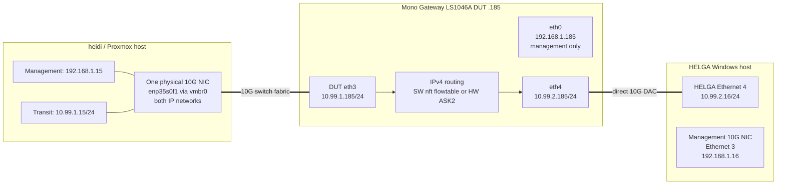

# ASK2 Performance Test Harness — Software vs Hardware Forwarding

**Version 1.2.0 · 2026-08-17**

A reproducible procedure for measuring routed IPv4 throughput and DUT CPU cost through the Mono Gateway LS1046A, comparing the Linux software flowtable against ASK2/FMan hardware offload.

This document is authoritative for the current heidi → DUT `.185` → HELGA harness. The older `plans/archive/TRAFFIC-HARNESS.md` (LXC/third-board) and the dual-board sections of `plans/archive/PERFORMANCE-BENCHMARKS.md` describe different topologies and must not be used to configure this harness.

---

## 1. Purpose and scope

The harness measures routed IPv4 throughput through the DUT in two modes:

- **SW** — Linux nftables software flowtable, with ASK/FMan FE hardware forwarding disabled.
- **HW** — nftables hardware flowtable driving ASK2/FMan external-hash + FE opcode forwarding.

Every result cell records:

- bidirectional aggregate TCP throughput from the iperf2 `[SUM]` line;
- average DUT CPU utilization across the four A72 cores, plus each core;
- live FE armed-port state, proving the cell actually ran in SW or HW;
- FMan RX error counters before and after;
- image, kernel, duration, stream count, and MTU.

The validated MTU battery is:

```
1280, 1500, 2000, 2500
```

This is the **validated order-0 baseline battery**. F-203 changes the DPAA RX pool to one contiguous order-1/8 KiB buffer and raises the candidate ASK clamp to 7000; that expanded range is pending a separate cold-boot validation battery and must not be treated as validated by the results below. MTU 576 is rejected by VyOS while IPv6 link-local is enabled, because the minimum interface MTU is 1280.

---

## 2. Topology



| Node | Management | Transit | Physical role |
|---|---|---|---|
| heidi / Proxmox | `192.168.1.15` | `10.99.1.15/24` on `vmbr0` | iperf2 client/generator; one 10G NIC carries both networks |
| DUT | `eth0` = `192.168.1.185` | `eth3` = `10.99.1.185/24`; `eth4` = `10.99.2.185/24` | router and system under test |
| HELGA | `Ethernet 3` = `192.168.1.16` | `Ethernet 4` = `10.99.2.16/24` | iperf2 server/sink; transit link is direct DAC to DUT eth4 |
| lxc200 relay | `192.168.1.137` | none | ISO HTTP relay only; not in the measured path |

Traffic must follow this routed path:

```
10.99.1.15 → 10.99.1.185 / DUT eth3 → DUT routing/offload → DUT eth4 / 10.99.2.185 → 10.99.2.16
```

### 2.1 heidi transit route (common failure)

If iperf2 reports `No route to host` and heidi cannot ARP the next hop, an obsolete runtime route is pointing `10.99.2.0/24` at the dead gateway `10.99.1.106`. No `.106` endpoint exists in this harness. Fix it before every session:

```bash
ssh -i ~/.ssh/admin_key admin@192.168.1.15 \
  'sudo ip route replace 10.99.2.0/24 via 10.99.1.185 dev vmbr0'
```

### 2.2 HELGA return route

HELGA must route return traffic through DUT eth4:

```powershell
Get-NetRoute -DestinationPrefix 10.99.1.0/24
# Required next hop: 10.99.2.185 on Ethernet 4
```

If absent:

```powershell
New-NetRoute -DestinationPrefix 10.99.1.0/24 `
  -InterfaceAlias 'Ethernet 4' -NextHop 10.99.2.185 `
  -RouteMetric 25 -PolicyStore ActiveStore
```

---

## 3. Access and required software

| Node | Access | Required software |
|---|---|---|
| heidi | `ssh -i ~/.ssh/admin_key admin@192.168.1.15` | iperf2 `/usr/bin/iperf`, 2.1.x |
| DUT | `ssh -i ~/.ssh/vyos_key vyos@192.168.1.185` | VyOS, `iperf`, `ethtool`, nftables, conntrack, ASK2 module |
| HELGA | `ssh -i ~/.ssh/id_ed25519 -o IdentitiesOnly=yes miha@192.168.1.16` | iperf2 `C:\Users\miha\iperf2\iperf.exe`, 2.2.x |
| lxc200 | `ssh -i ~/.ssh/admin_key admin@192.168.1.137` | HTTP relay only |

Use **iperf2** (executable `iperf`), not iperf3, for these measurements. iperf2 `--full-duplex -P 8` gives distinct flows, multicore host load, and a single bidirectional aggregate `[SUM]` line.

### 3.1 HELGA iperf2 server

`Start-Process`, `cmd /c start`, and iperf daemon flags do not survive Windows SSH session teardown; the server dies and clients then fail to connect. Launch the persistent scheduled task instead:

```bash
ssh -i ~/.ssh/id_ed25519 -o IdentitiesOnly=yes miha@192.168.1.16 \
  'powershell -NoProfile -Command "schtasks /Run /TN ask_iperf2|Out-Null; Start-Sleep 2"'
```

HELGA's Windows Firewall must allow inbound iperf2 TCP on `Ethernet 4`. The lab host keeps persistent rules `ASK2-IPERF2-PROGRAM` and `ASK2-IPERF2-TCP`.

---

## 4. DUT prerequisites

Verify image, forwarding, addresses, link, and MTU before each session:

```bash
ssh -i ~/.ssh/vyos_key vyos@192.168.1.185 '
  echo "cmdline: $(cat /proc/cmdline)"
  echo "ip_forward: $(cat /proc/sys/net/ipv4/ip_forward)"
  ip -o -4 addr show eth3
  ip -o -4 addr show eth4
  for i in eth3 eth4; do
    echo -n "$i mtu="; cat /sys/class/net/$i/mtu
    sudo ethtool "$i" 2>/dev/null | grep -E "Speed|Link detected"
  done
'
```

Expected:

```
ip_forward = 1
eth3 = 10.99.1.185/24, 10,000 Mb/s, link detected yes
eth4 = 10.99.2.185/24, 10,000 Mb/s, link detected yes
```

Reference build for the validated run:

```
Image:  2026.08.17-0217-rolling
Kernel: 6.18.44-vyos
Branch: dpaa1
Fixes:  F-201 RSS distribution; F-202 serialized FE flow lifecycle
```

---

## 5. End-to-end MTU control

All transit endpoints must use the same MTU before any test traffic starts:

```
heidi enp35s0f1 = heidi vmbr0 = DUT eth3 = DUT eth4 = HELGA Ethernet 4
```

Change MTU only while ASK is disengaged and no traffic is running. Apply the DUT MTU first, then heidi, then HELGA; wait for links to settle; then start the iperf2 server and client.

### 5.1 DUT MTU

Use a standalone VyOS script. Do not use `vbash -c`, and do not wrap it in `sg vyattacfg -c` (that path hangs on repeated config churn).

```bash
cat >/tmp/set-dut-mtu.vbash <<'EOF'
#!/bin/vbash
source /opt/vyatta/etc/functions/script-template
configure
set interfaces ethernet eth3 mtu 1500
set interfaces ethernet eth4 mtu 1500
commit
exit
EOF

scp -i ~/.ssh/vyos_key /tmp/set-dut-mtu.vbash vyos@192.168.1.185:/tmp/
ssh -i ~/.ssh/vyos_key vyos@192.168.1.185 \
  'chmod +x /tmp/set-dut-mtu.vbash; timeout 40 /tmp/set-dut-mtu.vbash'
```

Replace `1500` with the cell MTU and verify both sysfs readbacks afterward.

### 5.2 heidi MTU

Set the physical NIC before the bridge:

```bash
ssh -i ~/.ssh/admin_key admin@192.168.1.15 '
  sudo ip link set enp35s0f1 mtu 1500
  sudo ip link set vmbr0 mtu 1500
'
```

### 5.3 HELGA MTU

```bash
ssh -i ~/.ssh/id_ed25519 -o IdentitiesOnly=yes miha@192.168.1.16 \
  'netsh interface ipv4 set subinterface "Ethernet 4" mtu=1500 store=active'
```

### 5.4 MTU cleanup after an abort

An aborted MTU test that leaves endpoints at mismatched MTUs breaks bulk TCP everywhere on the segment — including `add system image`, which reads the ISO size and then times out. Ping and HTTP headers still work, masking the fault. In one observed case heidi was left at 1280, lxc200 at 9000, and DUT at 1500.

Always restore every endpoint to 1500 after a run or abort. Any automation must install an EXIT trap that does this:

```bash
ssh -i ~/.ssh/admin_key admin@192.168.1.15 \
  'sudo ip link set enp35s0f1 mtu 1500; sudo ip link set vmbr0 mtu 1500'
ssh -i ~/.ssh/admin_key admin@192.168.1.137 \
  'sudo ip link set eth0 mtu 1500'
ssh -i ~/.ssh/id_ed25519 -o IdentitiesOnly=yes miha@192.168.1.16 \
  'netsh interface ipv4 set subinterface "Ethernet 4" mtu=1500 store=active'
```

Restore DUT eth3/eth4 with the VyOS script in §5.1.

---

## 6. Firewall flowtable configuration

The DUT requires this base configuration:

```
firewall flowtable ft01 interface eth3
firewall flowtable ft01 interface eth4
firewall ipv4 forward filter rule 10 action offload
firewall ipv4 forward filter rule 10 offload-target ft01
interfaces ethernet eth3 offload hw-tc-offload
```

Hardware mode additionally requires:

```
firewall flowtable ft01 offload hardware
```

### 6.1 True software mode

Removing the hardware flag is mandatory. Calling `vyos-offload-ask disengage` alone is not a software baseline: configured hardware-flowtable traffic re-arms the FE the moment offloadable traffic starts.

```bash
cat >/tmp/to-sw.vbash <<'EOF'
#!/bin/vbash
source /opt/vyatta/etc/functions/script-template
configure
delete firewall flowtable ft01 offload hardware
commit
exit
EOF

scp -i ~/.ssh/vyos_key /tmp/to-sw.vbash vyos@192.168.1.185:/tmp/
ssh -i ~/.ssh/vyos_key vyos@192.168.1.185 '
  chmod +x /tmp/to-sw.vbash
  timeout 40 /tmp/to-sw.vbash
  sudo conntrack -F
  sudo /usr/local/bin/vyos-offload-ask --port 0x10 disengage
  sudo /usr/local/bin/vyos-offload-ask --port 0x11 disengage
'
```

Verify both conditions before and during traffic:

```bash
ssh -i ~/.ssh/vyos_key vyos@192.168.1.185 '
  sudo nft list ruleset | grep -A5 "flowtable VYOS_FLOWTABLE_ft01"
  sudo cat /sys/kernel/debug/fman_pcd/0/fe_arm | grep "Armed ports"
'
```

Expected: no `flags offload` line, and `Armed ports: (none)`.

**A single pre-traffic check is NOT sufficient.** The FE can re-arm the instant offloadable traffic starts (CR-003 fail-open behaviour), so a software cell that only verified `Armed ports: (none)` *before* iperf will silently run in hardware and report bogus ~9–10 Gbit/s at ~2–3% CPU. A software cell MUST hold the FE disarmed for the **entire** run — see §7.4 (continuous mode gate) and the §7.5 validity discriminator. If the FE arms at any sample during a software cell, the cell is INVALID and its number MUST be discarded, not recorded.

### 6.2 Hardware mode

Enable the hardware flag and verify the live nftables render. Force a delete/commit then set/commit so the live ruleset is guaranteed to re-render (a plain `set` on an already-present node can be a silent no-op):

```bash
cat >/tmp/to-hw.vbash <<'EOF'
#!/bin/vbash
source /opt/vyatta/etc/functions/script-template
configure
delete firewall flowtable ft01 offload hardware
commit
set firewall flowtable ft01 offload hardware
commit
exit
EOF

scp -i ~/.ssh/vyos_key /tmp/to-hw.vbash vyos@192.168.1.185:/tmp/
ssh -i ~/.ssh/vyos_key vyos@192.168.1.185 \
  'chmod +x /tmp/to-hw.vbash; timeout 60 /tmp/to-hw.vbash; sudo conntrack -F'
```

Before traffic, live nftables must contain `flags offload`. During traffic, FE state must show both ports: `Armed ports: 0x10 0x11`.

### 6.3 Two verification pitfalls

- **Config/live desync.** `config.boot` may say `offload hardware` while `nft list ruleset` has no `flags offload` (a `set` on an already-present node did not re-render live state after a prior runtime transition). Always force delete/commit + set/commit and verify the live ruleset. Reject any cell whose FE state does not match its intended mode.
- **Conntrack `[OFFLOAD]` is not a hardware indicator.** The nftables *software* flowtable also marks conntrack entries `[OFFLOAD]`. Use live nft `flags offload`, FE `Armed ports`, CPU load, and kernel RX deltas to tell SW from HW — never conntrack alone.

---

## 7. iperf2 test procedure

### 7.1 Start the server

```bash
ssh -i ~/.ssh/id_ed25519 -o IdentitiesOnly=yes miha@192.168.1.16 \
  'powershell -NoProfile -Command "schtasks /Run /TN ask_iperf2|Out-Null; Start-Sleep 2"'
```

### 7.2 Run one bidirectional cell

From heidi:

```bash
ssh -i ~/.ssh/admin_key admin@192.168.1.15 '
  sudo ip neigh flush dev vmbr0 2>/dev/null
  iperf -c 10.99.2.16 -B 10.99.1.15 --full-duplex -P 8 -t 15
'
```

Record the final bidirectional aggregate line:

```
[SUM] ... Gbits/sec
```

Do not average per-stream lines, and do not add both endpoint reports by hand.

### 7.3 Capture average DUT CPU utilization

Snapshot `/proc/stat` before traffic and near the end of the same 15-second window:

```bash
ssh -i ~/.ssh/vyos_key vyos@192.168.1.185 \
  'grep -E "^cpu[0-9]" /proc/stat > /tmp/cpu.before'

# start iperf2, then at ~14 seconds:
ssh -i ~/.ssh/vyos_key vyos@192.168.1.185 '
  grep -E "^cpu[0-9]" /proc/stat > /tmp/cpu.after
  awk '\''
    NR==FNR { old[$1]=$0; next }
    {
      split(old[$1], a, " "); total=0
      for (i=2; i<=NF; i++) total += $i-a[i]
      idle=($5-a[5])+($6-a[6])
      printf "%s %.1f%% busy\n", $1, 100*(total-idle)/total
    }
  '\'' /tmp/cpu.before /tmp/cpu.after
'
```

Report cpu0–cpu3 and the arithmetic mean of the four busy percentages.

### 7.4 Continuous mode gate (mandatory — a single sample is not enough)

Sample `fe_arm` **every second for the entire run**, not once. Run this on the
DUT in parallel with the iperf cell:

```bash
ssh -i ~/.ssh/vyos_key vyos@192.168.1.185 '
  for i in $(seq 1 12); do
    a=$(sudo cat /sys/kernel/debug/fman_pcd/0/fe_arm 2>/dev/null \
          | grep -oE "0x1[01]" | tr "\n" " ")
    printf "t%02d fe=[%s]\n" "$i" "$a"
    sleep 1
  done
'
```

Cell validity:

- **Software cell:** every sample MUST be `fe=[]`. If any sample shows an armed
  port (`0x10`/`0x11`), the FE re-armed mid-run — the cell ran in hardware.
  Mark it **INVALID** and discard the number; do not record it.
- **Hardware cell:** every sample MUST show both `0x10 0x11`. If a HW cell is
  ever unarmed, it fell back to software — INVALID.

### 7.5 Validity discriminator (sanity-check every number)

The mode gate is authoritative, but the throughput/CPU shape is an independent
cross-check. On this board (order-1 F-203 image):

| Signature | Meaning |
|---|---|
| ~5–7 Gbit/s, all four cores ~45–90% busy | genuine **software** forwarding |
| ~9–11 Gbit/s, all cores ~2–4% busy | **hardware** offload |

A "software" cell reporting ~9–11 Gbit/s at ~2–3% CPU is **hardware-contaminated
and invalid**, regardless of what the flowtable config said — the FE re-armed.
Any result that disagrees with its intended mode's signature MUST be re-run
under a verified continuous gate (§7.4), never published.

### 7.6 Saturation mode — the true software forwarding ceiling

The default `iperf2 --full-duplex -P 8` measures a **realistic but imbalanced**
number: the FMan RSS hash frequently clusters the 8 flows onto one RX FQ band /
one CPU, so a single core saturates (~96–98% softirq) while the others idle. The
per-core *average* then looks like ~70% even though the bottleneck core is
maxed, and aggregate throughput is capped by that one core — not by the
generator, the links, or the board's real capacity.

**Evidence (MTU 1500, software):** with default `-P 8`, RX packets landed
CPU0 ≈ 80%, CPU1/2/3 ≈ 20% combined; CPU0 96–98% while CPU3 sat at 77%. heidi
stayed ~90% idle and the same links carry 9–11 Gbit/s under hardware offload, so
neither generator nor path is the limit — the limit is RSS imbalance.

To measure the **true ceiling**, force an even flow→CPU spread. The RSS 4-tuple
key is `SIP+DIP+SPORT+DPORT` (EKFC `0x00180006`), so for a fixed src/dst IP pair
the source port alone selects the RX FQ band / CPU. The FQID-bit selection is
not HW-confirmed for pure computation, so map ports **empirically**:

1. In software mode, disarmed, send a short UDP burst from a fixed source port
   (`iperf -B <ip>:<port>` binds a fixed source port, or a tiny `socket` script)
   and read the per-CPU `rx packets [CPU n]` delta on eth3. The CPU with the
   largest delta owns that port.
2. Sweep ~120 ports and bucket them by CPU. On this board the hash is uneven
   (one CPU may be starved), so sweep wide and keep the highest-delta ports.
3. Pick N ports per CPU and run N×4 fixed-source-port iperf2 clients:

```bash
# balanced set example (MTU 1500, src 10.99.1.15, dst 10.99.2.16:5201):
#   CPU0: 40065 40020   CPU1: 40028 40027
#   CPU2: 40044 40030   CPU3: 40066 40043
for p in 40065 40020 40028 40027 40044 40030 40066 40043; do
  iperf -c 10.99.2.16 -B 10.99.1.15:$p --full-duplex -t 14 &
done
wait
```

Port→CPU mapping is specific to the hash **and** the src/dst IP pair — re-probe
if either changes. The helper `saturate.sh` (probe + balanced run) automates
both phases (`FLOWS_PER_CPU`, `DUR`, `MODE`, `REMAP`).

**Validated software ceiling (MTU 1500, order-1 F-203 image):**

| Flow selection | Per-core CPU | Throughput |
|---|---|---|
| default `-P 8` (imbalanced) | 98/96/88/77 | ~5.3 Gbit/s bidir |
| balanced 2/CPU (8 flows) | 79/82/81/85 | 7.02 Gbit/s unidir |
| balanced 4/CPU (16 flows) | 84/90/72/92 | **12.74 Gbit/s bidir** |

So the board's real single-node software forwarding ceiling is **~12.7 Gbit/s
bidirectional (~6.4 Gbit/s per direction)** — about 2.4× the naive `-P 8` bidir
figure. Cores plateau at ~85–92%, not a clean 100%, because the DPAA softirq/
NAPI path has a small non-CPU component (QMan portal dequeue, memory bandwidth,
cache misses on scattered flows); adding flows past ~4/CPU raises per-core CPU
without raising aggregate — the signature of genuine saturation.

**When to use which:** report the default `-P 8` number as the representative
mixed-traffic figure, and the saturation number as the board's capacity ceiling.
Real traffic (diverse 5-tuples) spreads naturally and lands between the two; the
`-P 8` clustering is a synthetic-benchmark artifact, not a production defect.

---

## 8. Error and health monitoring

Capture these counters before and after each cell:

```bash
ssh -i ~/.ssh/vyos_key vyos@192.168.1.185 '
  sudo ethtool -S eth3 | grep -iE "rx frame physical error|rx frame size error|rx dma error"
  sudo ethtool -S eth4 | grep -iE "rx frame physical error|rx frame size error|rx dma error"
  sudo dmesg | grep -iE "Err FD status|list_del|list_add|BUG|panic|POISON|corruption|Oops"
'
```

These counters are cumulative — report deltas, not repeated absolute totals. A flat non-zero value across later cells is historical and must not be re-counted per cell.

`rx frame physical error` increments when FMan flags an RX frame descriptor with `FM_FD_ERR_PHYSICAL`: a MAC/SerDes/physical receive fault such as an aborted, CRC-bad, or alignment-faulted frame. It is distinct from `rx frame size error` (a frame/buffer sizing fault). A small burst during 10G link bring-up that then stays flat under load is benign; a steadily climbing count indicates a real physical-path problem.

Abort the session if any of these occur:

- `Err FD status = 0x00080000` begins increasing continuously;
- eth3 or eth4 link stays up but ARP fails and RX stops increasing;
- kernel `list_del`, `BUG`, `Oops`, `panic`, or poison diagnostics appear;
- management becomes unreachable;
- MTUs differ among transit endpoints.

### 8.1 eth3 RX-deaf state

Symptom: eth3 shows 10G link and carrier, but the DUT cannot ARP/ping heidi, eth3 RX drops climb, and eth4 stays healthy. Cause: a DUT-side FMan/SerDes RX condition after an MTU mismatch under load, a physical rewire, or accumulated RX faults; link bouncing and a warm reboot do not clear it. Recovery: restore all MTUs to 1500, correct the routes, then cold power-cycle the DUT and confirm DUT→heidi ping and ARP `REACHABLE` before testing.

### 8.2 FE flow lifecycle panic (images before F-202)

Symptom: kernel panic in `fman_pcd_ehash_del_key()` with `list_del corruption` and `LIST_POISON2`, typically from `nf_ft_offload_del` during SW/HW mode churn. Cause: production flow add/delete did not hold `pcd->fe_lock`, letting the asynchronous nft delete race a duplicate delete, clear, or drain. Fix: use image `2026.08.17-0217-rolling` or newer (contains F-202). Do not run lifecycle stress on older images.

---

## 9. Safe cell order

For each MTU, run this exact sequence:

1. Stop traffic.
2. Flush conntrack and disengage both ASK ports.
3. Confirm `Armed ports: (none)`.
4. Set DUT eth3/eth4 MTU.
5. Set heidi physical NIC and bridge MTU.
6. Set HELGA `Ethernet 4` MTU.
7. Wait at least three seconds for link and neighbor state.
8. Run a short iperf2 connectivity probe.
9. Enter true SW mode: delete the hardware flowtable flag, commit, flush
   conntrack/flows, disengage both ports. Poll until `Armed ports: (none)` is
   stable for at least two seconds before starting traffic.
10. Run the 15-second SW cell **with the §7.4 1-second continuous FE sampler in
    parallel**. Every sample must be empty. Any arm event = INVALID; discard the
    throughput/CPU number and repeat the cell after a clean disengage.
11. Flush flows/conntrack and verify FE unarmed before changing to HW.
12. Enter HW mode; force delete/commit + set/commit so live nft has
    `flags offload`. Verify both ports arm under a short probe.
13. Run the 15-second HW cell with the same continuous sampler. Every sample
    must contain `0x10 0x11`; otherwise INVALID.
14. Flush conntrack, clear flows, disengage; poll until FE is stably unarmed.
15. Record health-counter **deltas** and compare throughput/CPU with the §7.5
    validity signature. Reject any contradictory cell.
16. Continue to the next MTU.

After the final cell or any abort, restore:

```
heidi enp35s0f1 = 1500
heidi vmbr0      = 1500
lxc200 eth0      = 1500
DUT eth3/eth4    = 1500
hardware flowtable configured
FE ports unarmed until traffic starts
```

---

## 10. Validated results

### 10.1 Order-0 baseline (image `2026.08.17-0217-rolling`, kernel `6.18.44-vyos`)

Mode-verified per cell, iperf2 `--full-duplex -P 8 -t 15`:

| MTU | SW throughput | SW CPU mean | HW throughput | HW CPU mean | HW / SW |
|---:|---:|---:|---:|---:|---:|
| 1280 | 5.71 Gbit/s | 65% | 9.92 Gbit/s | 4% | 1.74× |
| 1500 | 6.64 Gbit/s | 69% | 10.4 Gbit/s | 3% | 1.57× |
| 2000 | 6.19 Gbit/s | 71% | 10.4 Gbit/s | 3% | 1.68× |
| 2500 | 6.22 Gbit/s | 70% | 10.1 Gbit/s | 3% | 1.62× |

Signatures: SW = all four cores ~55–83% busy (F-201 RSS working); HW = all cores
~2–6% busy (FMan forwards). This SW column is the trusted software reference —
if a later run disagrees, the later run is suspect (§7.5).

### 10.2 Order-1 jumbo (image `2026.08.17-2012-rolling`, F-203)

F-203 raises the RX buffer to order-1/8 KiB so `dpaa_change_mtu` accepts up to
7000 and large frames stay contiguous/HW-offloadable. **Hardware jumbo battery
passed with no FMan RX wedge** (board uptime stable, `dev_alloc_pages` failures
= 0, physical-error deltas 0 except transient link-settle bumps that did not
grow):

| MTU | HW throughput | HW CPU mean | phys-err delta | wedge |
|---:|---:|---:|---:|:--:|
| 1500 | 9.40 Gbit/s | 3% | 0 | no |
| 3000 | 9.16 Gbit/s | ~2% | 0 | no |
| 4000 | 9.00 Gbit/s | ~2% | +2 settle | no |
| 6000 | 9.35 Gbit/s | ~3% | 0 (HW cell) | no |
| 7000 | 9.25 Gbit/s | ~2% | 0 | no |

Software MTU-1500 on the order-1 image re-measured at **6.53 Gbit/s, cores
71–89%** — matches the order-0 SW reference (F-203 does not regress the
software path).

**Pending:** The order-1 **software** jumbo cells (3000/4000/6000/7000) are not
yet captured with the §7.4 continuous gate. The first jumbo battery's "SW" rows
read ~9 Gbit/s at ~2% CPU — those are hardware-contaminated (the FE re-armed
between the HW and SW cells) and were correctly rejected; they are NOT software
results. Re-run those four SW cells under the continuous gate before publishing
an order-1 SW column.

### 10.3 Interpretation

Hardware forwarding runs at the ~9–10 Gbit/s harness ceiling while the DUT stays
near idle; software forwarding is CPU-bound near 6 Gbit/s. Hardware delivers
~1.6× the throughput at roughly one-twentieth of the DUT CPU cost, and (with
F-203) does so contiguously up to MTU 7000. The hardware ceiling is above what
this single 4-core generator can drive.

Stability: order-0 run — five engage/flush/disengage cycles + 40 conntrack
flushes clean; order-1 jumbo battery — no reboot, no wedge, no
`list_del`/`BUG`/panic/poison/Oops.

---

## 11. Result record template

```
Date/UTC:
Image:
Kernel:
Commit/run:
Cold boot before test: yes/no
heidi route to 10.99.2.0/24:
HELGA route to 10.99.1.0/24:
MTUs verified end-to-end:
Tool: iperf2
Command: iperf -c 10.99.2.16 -B 10.99.1.15 --full-duplex -P 8 -t 15

MTU | Mode | nft flags offload | FE armed during | Gbit/s | cpu0 | cpu1 | cpu2 | cpu3 | mean | RX-error delta | verdict

Post-test:
- all MTUs restored to 1500:
- hardware flowtable configured:
- FE armed ports:
- MURAM baseline:
- dmesg error scan:
- management reachable:
```

---

## 12. Known limitations

- TCP routed-IPv4 benchmark only — not a packet-loss or minimum-frame packet-rate test.
- Aggregate is bounded by the 10G endpoints and physical path; it does not establish the absolute FMan ceiling.
- VLAN, IPv6, bridge, PPPoE, tunnel, and IPsec offload are out of scope.
- Order-0 SW+HW is validated 1280–2500 (§10.1). Order-1/F-203 hardware jumbo is validated 1500–7000 (§10.2); order-1 **software** jumbo (3000–7000) is still pending a continuous-gate run.
- A "software" cell reading ~9–11 Gbit/s at ~2–3% CPU is hardware-contaminated, not a result — the FE re-armed. Use the §7.4 continuous gate and §7.5 signature to reject it.
- MTU below 1280 is outside the VyOS interface contract with IPv6 link-local enabled.
- The physical-error counter is cumulative; interpret it as a delta.
- ICMP may be blocked by HELGA's Windows firewall; use a short TCP iperf2 probe for path readiness.

---

## 13. Changelog

- **1.2.0 — 2026-08-17** — Add §7.6 saturation mode: empirical port→CPU mapping, balanced fixed-source-port flow method, and the measured true software ceiling (~12.74 Gbit/s bidirectional, ~2.4× the imbalanced -P8 figure); documents that RSS imbalance, not the generator/links, caps the default number.
- **1.1.0 — 2026-08-17** — Add mandatory per-second continuous FE mode gate, SW/HW throughput+CPU validity discriminator, reject/discard rules for hidden FE re-arm, F-203 order-1 hardware jumbo results through MTU 7000, and explicit pending status for software jumbo cells.
- **1.0.0 — 2026-08-17** — Initial current-harness specification: corrected topology, F-201/F-202 mode validation, deterministic SW/HW switching, MTU safety and recovery, CPU sampling, and validated 1280–2500 results.
