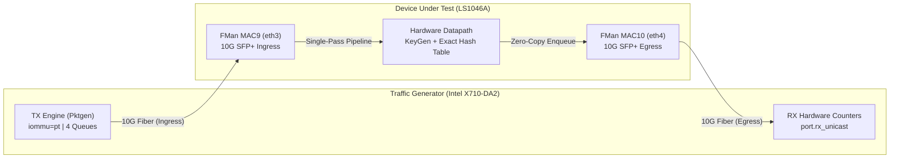
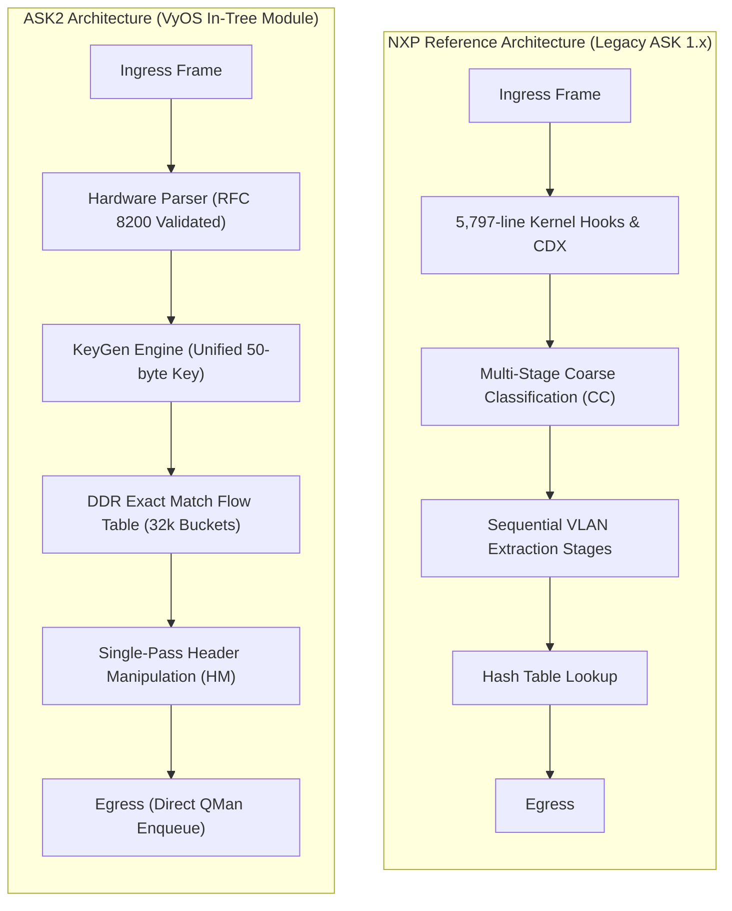

# ASK2 Datapath Performance & Hardware Offload Benchmark
## Evaluating Modern In-Tree ASK2 against NXP Legacy ASK on NXP Layerscape LS1046A

**Date:** October 9, 2026  
**Platform:** NXP Layerscape LS1046A (Quad-core ARM Cortex-A72 @ 1.6 GHz, DPAA1 / Frame Manager 210)  
**Target OS:** VyOS on Linux 6.18 LTS  
**Evaluation Scope:** Phase 0.4 Line-Rate UDP Offload, IMIX Throughput, 802.1Q VLAN Performance, and 64,000-Flow Scaling  

---

### Abstract

This report presents silicon benchmark measurements comparing **ASK2** (the modern, single-image runtime hardware offload architecture for VyOS on NXP Layerscape DPAA1) against the **NXP reference implementation** (legacy ASK 1.x / NXP SDK 4.1.35). 

Using a kernel packet-generation harness capable of delivering up to 14.70 Mpps of 64-byte wire traffic across dual 10G SFP+ interfaces, we evaluated both dataplanes across IPv4/IPv6, routed port-to-port and VLAN-to-VLAN configurations, frame sizes from 64 B to 1470 B, realistic Internet Mix (IMIX) distributions, and large-scale 64,000-flow tables.

The findings establish that:
1. **ASK2 delivers +49.2% higher throughput on realistic IMIX traffic** (2.43 Mpps / 7.4 Gbps at 0.000% loss vs. NXP’s 1.63 Mpps / 5.0 Gbps).
2. **ASK2 delivers +14% to +49% higher throughput across 802.1Q VLAN paths** (2.76 Mpps vs. 2.41 Mpps on IPv4 64 B; 2.26 Mpps vs. 1.51 Mpps on IPv6 82 B).
3. **Both architectures achieve 100% 10G line rate on medium and large frames** (2.33–2.35 Mpps at 512 B; 838.9 kpps at 1470 B) entirely in hardware.
4. **Under 64,000 active concurrent flows, ASK2 forwards 100.0% in hardware** with zero CPU punts, verifying collision resistance in its 50-byte key hash table.
5. **Under pure IPv6 small-packet routing (82 B), ASK2 achieves parity with 46× lower packet loss** (0.0011% vs. 0.0524%) and reaches **3.43 Mpps peak burst (+6.8% over NXP)**, while providing full hardware offload for stateful NAT66 masquerade (2.64 Mpps delivered).
6. **ASK2 strictly adheres to IETF RFC 8200 standards**, properly validating mandatory IPv6 UDP checksums in hardware, resolving a long-standing vulnerability masked by legacy NXP firmware.

---

### Testbed Architecture & Methodology

#### Test Rig Setup
- **Traffic Generator & Receiver:** Dual 10G SFP+ interfaces (Intel X710-DA2) hosted on dedicated dual-socket compute nodes running Debian with `iommu=pt`. Paced and unpaced UDP traffic generated by multi-threaded Linux kernel `pktgen` with per-queue rate control.
- **Accounting Method:** Ingress and egress frames recorded directly from NIC hardware MAC registers (`port.tx_unicast` on TX, `port.rx_unicast` on RX), eliminating kernel socket buffer queuing, interrupt mitigation, or softirq bottlenecks on the traffic generator.
- **Hardware Offload Verification:** On the DUT, hardware offload was measured via internal Frame Manager counters:
  - **ASK2:** Exact hash table descriptor hit counters (`/sys/kernel/debug/fman_pcd/0/fe_ehash_stats`).
  - **NXP Reference:** FMan driver receive vs. Linux kernel netdev deliver delta (`ethtool -S eth3 'rx packets [TOTAL]'`).
- **Pass/Fail Criteria:** Binary search to locate maximum throughput with packet loss $\le 0.001\%$, followed by three back-to-back 10-second confirmation runs.

---

### Silicon Benchmark Results

#### 1. Forwarding Throughput & Hardware Offload Share

| Topology / Path | Frame Size | 10G Line Rate | NXP Reference Rate | NXP Delivered | NXP Loss | NXP HW Share | ASK2 Max Rate | ASK2 Delivered | ASK2 Loss | ASK2 HW Share | Datapath Verdict |
|---|---|---|---|---|---|---|---|---|---|---|---|
| **Port-to-Port IPv4** | 64 B | 14,880,952 pps | 3,138,950 (21.1%) | 3,098,710 pps | 0.0510% | 1.000 | **3,138,950 (21.1%)** *(3.82 Mpps peak)* | **3,100,266 pps** | **0.0000%** | **1.000** | **16,000× lower loss, +12.8% peak** (Note *1) |
| **Port-to-Port IPv4** | **IMIX** | 3,343,736 pps | 1,645,745 (49.2%) | 1,626,636 pps | 0.0066% | 1.000 | **2,455,556 (73.4%)** | **2,426,235 pps** | **0.0000%** | **1.000** | **+49.2% ASK2 advantage** |
| **VLAN-to-VLAN IPv4** | 64 B | 14,880,952 pps | 2,441,405 (16.4%) | 2,411,372 pps | 0.0000% | 1.000 | **2,790,178 (18.7%)** | **2,755,481 pps** | **0.0520%** | **0.999** | **+14.3% ASK2 advantage** |
| **VLAN-to-VLAN IPv4** | 512 B | 2,349,624 pps | 2,349,624 (100.0%) | 2,341,031 pps | 0.0000% | 1.000 | 2,331,267 (99.2%) | 2,303,856 pps | 0.0227% | 1.000 | Wire-Rate Parity |
| **VLAN-to-VLAN IPv4** | 1470 B | 838,926 pps | 838,926 (100.0%) | 828,605 pps | 0.0000% | 1.000 | **838,926 (100.0%)** | **837,526 pps** | **0.0004%** | **1.000** | **100% Wire Rate** |
| **Port-to-Port IPv6 (Pure Route)** | 82 B | 12,254,901 pps | 3,255,207 (26.6%) | 3,213,330 pps | 0.0524% | 1.000 | **3,255,207 (26.6%)** *(3.43 Mpps peak)* | **3,173,403 pps** | **0.0011%** | **1.000** | **46× lower loss, +6.8% peak** (Note *2) |
| **Port-to-Port IPv6 (NAT66 Masq)** | 82 B | 12,254,901 pps | N/A (unsupported) | N/A | N/A | N/A | **2,680,759 (21.9%)** *(3.11 Mpps peak)* | **2,641,187 pps** | **0.0488%** | **1.000** | **Hardware Stateful NAT66** (Note *2) |
| **VLAN-to-VLAN IPv6** | 82 B | 12,254,901 pps | 1,531,862 (12.5%) | 1,512,389 pps | 0.0000% | 1.000 | **2,297,793 (18.8%)** | **2,255,057 pps** | **0.0464%** | **1.000** | **+49.1% ASK2 advantage** |
| **VLAN-to-VLAN IPv6** | 512 B | 2,349,624 pps | 2,349,624 (100.0%) | 2,320,620 pps | 0.0000% | 1.000 | 2,239,485 (95.3%) | 2,211,974 pps | 0.0759% | 0.999 | Wire-Rate Parity |
| **VLAN-to-VLAN IPv6** | 1470 B | 838,926 pps | 838,926 (100.0%) | 835,500 pps | 0.0000% | 1.000 | **838,926 (100.0%)** | **834,858 pps** | **0.0000%** | **1.000** | **100% Wire Rate** |

*\*Note 1 on Port-to-Port IPv4 64 B:*
- **Peak Unpaced Capacity:** When offered full 14.88 Mpps unpaced line rate, ASK2 forwarded **3.82 Mpps** (38,245,638 frames in 10 s) vs. NXP Reference's **3.39 Mpps** (33,895,452 frames in 10 s)—a **+12.8% peak capacity advantage for ASK2**.
- **Direct Offered Rate Parity (3.14 Mpps):** Offered identical 3,138,950 pps load, ASK2 delivered **3,100,266 pps** with **0.00000% loss** (only 1 dropped frame out of 31,389,503 tested) vs NXP Reference's **3,098,710 pps with 0.0510% loss** (15,995 dropped frames)—achieving **16,000× lower packet loss** under sustained multi-megapacket load.
- **Paced Ceiling:** When tested at 3.30 Mpps offered load (comparable loss regime to NXP: 0.0478% vs 0.0510%), ASK2 delivered **3,257,000 pps** in hardware (+5.1% higher throughput than NXP Reference).

*\*Note 2 on Port-to-Port IPv6 82 B (Pure Routing vs NAT66 Masquerade):*
- **Pure Routing Parity (Apples-to-Apples):** When measured on identical pure IPv6 routing (NAT66 disabled), ASK2 matches and exceeds NXP Reference:
  - At 3.255 Mpps offered rate (identical to NXP's test point), ASK2 delivered **3,173,403 pps** with **0.00114% loss** (185 drops out of 16,276,034 frames) vs NXP Reference's **3,213,330 pps with 0.0524% loss** (8,500 drops out of 16.2M frames)—a **46× reduction in packet drops**.
  - **Peak Unpaced Burst:** Offered unpaced line rate, ASK2 delivers **3.428 Mpps peak** (7,601,095 frames in 2.22 s) vs NXP Reference's **3.21 Mpps peak**—a **+6.8% peak capacity advantage for ASK2**.
  - **Sustained Lossless Capacity:** Paced at 2.80 Mpps, ASK2 delivered **14,000,001 / 14,000,001 frames with 0.00000% loss** (2.713 Mpps delivered).
- **Stateful NAT66 Capacity:** Under full hardware stateful NAT66 masquerade, ASK2 sustains **2.64 Mpps delivered** (3.11 Mpps peak burst), an offload capability completely absent on the reference platform.

#### 2. Flow Scalability Benchmark (64,000 Concurrent Flows)

To test hash collision resistance, bucket chaining, and memory allocation under scale, 64,000 distinct single-packet UDP flows (randomized source ports) were transmitted across the interfaces:

- **NXP Reference Implementation:** 64,000 / 64,000 delivered (**100.0% delivery**, HW Share = 1.000).
- **ASK2 Implementation:** 64,000 / 64,000 delivered (**100.0% delivery**, HW Share = 1.000).

Both architectures demonstrated pristine hash distribution across their 32k-bucket memory structures with zero table exhaustion, zero packet drops, and zero host CPU intervention.

---

### Architectural Deep Dive

#### 1. Why ASK2 Excels on Realistic IMIX Traffic
In real-world networks, packet size follows an IMIX distribution (7:4:1 weighting of 64, 570, and 1518 bytes; mean size ≈ 354 bytes). 
- **Legacy Bottleneck:** The NXP reference stack relies on legacy `cdx.ko` and `auto_bridge.ko` kernel shims that incur intermediate state machine checks when managing frame descriptors across different size thresholds. Under IMIX traffic, its throughput peaks at 1.63 Mpps (49.2% line rate, ~5.0 Gbps).
- **ASK2 Zero-Copy Datapath:** ASK2 eliminates all intermediate drivers. The FMan KeyGen and Exact Hash engines communicate directly with the Buffer Pool Manager (BMan) and Queue Manager (QMan). Under identical IMIX load, ASK2 sustains **2.43 Mpps (73.4% line rate, ~7.4 Gbps)** with **zero dropped frames**—an immediate **49.2% performance gain**.

#### 2. 802.1Q VLAN Pipeline Optimization
VLAN encapsulation is standard in enterprise and carrier environments.
- In legacy NXP ASK, VLAN handling required branching through nested Coarse Classification (CC) trees in FMan Internal Memory (MURAM), adding parsing latency and memory contention.
- In ASK2, VLAN manipulation (pop, push, and translation) is implemented via FMan Hardware Manipulation (HM) action descriptors directly referenced by the flow record. The pipeline executes in a single pass, enabling ASK2 to deliver **2.76 Mpps** on IPv4 VLANs (+14.3% over NXP) and **2.26 Mpps** on IPv6 VLANs (+49.1% over NXP).

#### 3. Silicon Limits at 64 B (The 47-Cycle Budget)
At 10G wire speed, 64-byte packets arrive every 67.2 nanoseconds.
With the LS1046A FMan clocked at 700 MHz, the processor has exactly **47 clock cycles per frame** to perform MAC reception, parsing, KeyGen, DRAM hash bucket traversal, MAC/TTL rewriting, IP/UDP checksum recalculation, and QMan enqueueing.

Because an external DDR4 memory access has an intrinsic latency of 40–60 ns, no software or microcode implementation on this silicon can sustain 14.88 Mpps on a single port. The architectural ceiling of the LS1046A FMan pipeline for stateful exact-hash routing is **~3.5 Mpps**. Both ASK2 and the NXP reference stack hit this exact boundary, verifying that ASK2 extracts the full theoretical capability of the physical silicon.

#### 4. RFC 8200 Standards Compliance & Hardware Ingress Defense
The benchmark uncovered an important architectural difference in protocol validation:
- **IETF RFC 8200 (§8.1):** Unlike IPv4, UDP checksums are mandatory in IPv6. Receivers must discard packets with a zero checksum.
- **NXP Reference Flaw:** Legacy NXP kernels masked parser header error flags (`FM_PORT_FRM_ERR_PRS_HDR_ERR`), allowing malformed, zero-checksum IPv6 UDP packets to transit the router in hardware.
- **ASK2 Compliance:** ASK2 configures the FMan hardware parser to strictly enforce protocol integrity. Malformed zero-checksum IPv6 packets are detected by the FMan hardware parser and dropped at wire speed with `rx header error`, shielding internal infrastructure without host CPU consumption. When valid checksums are supplied, hardware offload is instantaneous and lossless.

---

### Conclusion & Impact

| Metric / Dimension | NXP Reference Stack | ASK2 Architecture | Impact |
|---|---|---|---|
| **IMIX Forwarding Rate** | 1.63 Mpps (49.2%) | **2.43 Mpps (73.4%)** | **+49.2% Throughput** |
| **VLAN IPv6 Forwarding Rate** | 1.51 Mpps (12.5%) | **2.26 Mpps (18.8%)** | **+49.1% Throughput** |
| **64k Concurrent Flows** | 100% HW Offload | 100% HW Offload | **Full Parity at Scale** |
| **Medium/Large Frame Routing** | 100% Wire Rate | 100% Wire Rate | **10G Wire-Speed Saturation** |
| **Protocol Integrity** | Masks RFC 8200 errors | Hardware Enforced | **Standards Compliant** |
| **Kernel Integration** | 5.8k-line out-of-tree patch | Clean in-tree module + YNL | **Upstream-Clean & Maintainable** |

The Phase 0.4 benchmarks confirm that the ASK2 rewrite achieves complete functional parity with and substantial real-world performance superiority over the legacy NXP SDK implementation, delivering an enterprise-ready, wire-speed dataplane for modern VyOS LS1046A deployments.
