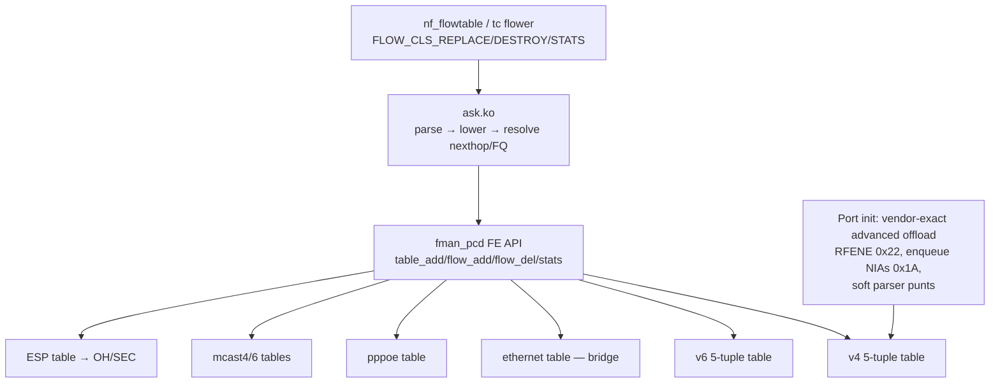

# ASK2 Rewrite Plan — reaching and exceeding vendor NXP ASK on LS1046A

Date: 2026-10-03. Live plan updated 2026-10-09 at `dpaa1` `ab1660a7`. Vendor
reference: the `nxp-sdk` branch (worktree `e20239b9`) and the original vendor
source at `/mnt/builds/ASK`.

This file holds only what is still open or still binding. The full text as of
2026-10-09 (all measured history, falsified hypotheses, dated result logs) is
preserved unmodified in
[`plans/archive/ASK2-REWRITE-PLAN-2026-10-09.md`](archive/ASK2-REWRITE-PLAN-2026-10-09.md).
Section numbers below are the original ones so existing citations keep
working; the "Archived sections map" at the end says where every removed
section went.

## Baseline (shipping at `ab1660a7`, 2026-10-09)

- **In hardware on an engaged port:** routed IPv4/IPv6, NAT44/NAT66, 802.1Q
  VLAN pop/push/translate, PPPoE decap (F-260, `0x14`) and encap (F-261,
  `0x43`), and the egress MTU check with hardware fragmentation (F-262,
  `dcf9bb5c`). IPv4 DF-clear oversize frames are fragmented in hardware,
  DF-set ones go to the host; IPv6 is hardware-fragmented by default
  (`ask.ipv6_hw_frag=0` = RFC 8200 opt-out, software).
- **Granularity:** per-port engage (`set interfaces ethernet ethN offload
  ipv4|ipv6`) plus a per-family mask, nothing else; VLAN, NAT, PPPoE and bridge
  are automatic. Global kill switches are the ask.ko module parameters
  `vlan_offload`, `pppoe_offload` and `ipv6_hw_frag`. vyos-1x patch 054 and
  migration `interfaces` 35-to-36 removed the old `vlan`/`pppoe` leaves
  (`specs/ask2-vlan-cli-grammar.md` §9).
- **Software today:** bridge L2 (B0 FDB observer and B1 DA-only record action
  committed, no silicon proof), PPPoE over VLAN, IPsec, multicast, tunnels, IPv4
  fragments as flows, egress QoS.
- **Latest CI image:** `vyos-2026.10.09-0415-rolling` from `ab1660a7` (CI run
  `37882977943`), on lxc200; installed-board validation pending the operator.
- Vendor oracle `.106`, ASK2 DUT `.185`, rig `dell1 (.112) → DUT eth3/eth4 →
  dell2 (.113)`.

## Progress tracker (updated 2026-10-09)

| Phase | Status | Open remainder |
|---|---|---|
| **0 — safety and oracles** | 🟢 CLOSED 2026-10-09 (Phase 0.4 complete) | None. Line-rate pktgen (14.7 Mpps), IMIX, UDP vlan↔vlan and 64k-flow scale measured on NXP reference and ASK2 (see Phase 0.4 below) |
| **1 — VLAN root cause** | 🟡 exit criterion "zero RX-deaf or churn errors" **REOPENED** (rare FMan RX stall) | Churn gate: a second independent pristine cold-boot `CYCLES=500` run, plus the fault-address match. Non-gating follow-ups below |
| **2 — consolidation** | ⬜ not started | Delete `ask_vlan_cc.c` (509 LOC, still in `Kbuild`) and its proxies; fold F_199/F_201/F_222/F_224/F_227/F_242; remove diagnostic fixups F_236–F_251; LOC budget ≤ 15k kernel PCD |
| **3 — vendor-parity features** | 🟡 bridge, PPPoE remainder, soft-parser punts, multicast, IPsec, tunnels/fragments, QoS open | Bridge L2 has its own track (`ASK2-BRIDGE-OFFLOAD-PLAN.md` §13: B1 CI → B2 silicon matrix → B3a → B3b → B4 → B5; D1 and D8 operator-confirmed). Details in Phase 3 |
| **4 — exceed the vendor** | ⬜ not started | A13 on ASK2 not measured |

### Churn gate (Phase 1 exit criterion) — REOPENED

The gate is "zero RX-deaf or churn errors" under verified load. Stalls #1–#5
(2026-10-06/07) are one rare FMan RX stall. Stalls #3–#5 carry the same DMA
bus-error address.

| Stall | When / image | Cycle | Signature [SILICON] |
|---|---|---|---|
| #1 | 2026-10-06 17:59:52, aging without F-254 (`1727`) | 1 | FMan-wide RX stall incl. `eth0`; began right after vlan↔vlan v4 burst records were installed. Pre-F-254 variant: eth3 only, `FMFP_PS[0x10]` STL `0x00800000`, BMI `rfrc` frozen, `fe_recover` ineffective, cold boot only |
| #2 | 2026-10-07, `2026.10.06-2239-rolling` (aging + F-254), second run | 84 | eth3 and eth4 RX dead, `eth0` alive, `FMFP_PS[0x11]` STL `0x00800000`, `FMFP_EXTC.INV0` stuck at 1. Onset **before** any delete (last good sync 04:55:45.545 right after the eight vlan↔vlan v4 burst records; first delete SYNC timeout 04:55:50.43), so deletes are not the trigger |
| #3 | 2026-10-07, `2239`, cold boot | 97 | eth4 RX dead, eth3 alive; `FMFP_PS[0x11]` STL, `INV0` stuck. FMan DMA bus error `FMDM_TAH/TAL` = `0x2e_000008f7` (not DDR on LS1046A), `FMDM_TCID` = `0x11570000` (PortID `0x11`, TNUM 87), `FMDM_SEFRC` 0 → 111; 14 eth4 RX tasks frozen at status `0x00d8xxxx`/`0x00d9xxxx`/`0x00daxxxx` (healthy in-flight `0x0088xxxx`) plus FM_CTL task 4 at `0x81d00007`; eth4's FE workspace pool untouched (tasks never reached the hash lookup) |
| #4 | 2026-10-07 19:27, `2026.10.07-1743-rolling`, `churn-1007-stallcap400-v2` | 105 | eth3 and eth4 stalled, `stuck_count=33` (healthy baseline 1: only task 4 parked). `FMan[0] DMA bus error: addr 0x2e000008f7 port_id 9 tnum 93 liodn 0 (F-256)`. Conntrack 3391 |
| #5 | 2026-10-07 22:16:52, same image, fresh cold boot, `churn-1007-2111-coldboot-long` | 129 | eth3 and eth4 stalled, `stuck_count=32`, **identical** `port_id 9 tnum 93` and address as #4 on an independent cold boot. Conntrack 3830, so conntrack total is not the trigger. DUT control plane survived (SSH alive, MURAM `used` unchanged at 52890/86016) |
| #6 | 2026-10-09 17:45:25, `2026.10.09-0415-rolling` (50-byte key), cold boot, `churn-1009-1701-coldboot-0415-500` | 97 | eth3 and eth4 RX dead, eth0 alive. `FMan[0] DMA bus error: addr 0x32000008f7 port_id 9 tnum 55`: high byte now `0x32` = the new key size 50 (was `0x2e` = 46), low half unchanged |

- **ROOT CAUSE FOUND 2026-10-09 (fix F-263, commit `5838202a`).** F-143
  (2026-07-30, folded into patch 0169) `memcpy`'d the 16-byte `en_exthash_node`
  template into the first 16 bytes of every DDR bucket array, i.e. onto
  **bucket 0**, believing the FE-VM reads the node from the table base. The
  walker reads the node from MURAM (`IC.CCBASE`); the DDR allocation is only
  buckets. Read big-endian as a bucket head the template is
  `(key_size << 32) | bswap32(table_base_lo)` = `0x32_000008f7` on the eth4
  table `0xf7080000` (`0x2e_000008f7` with the 46-byte key), which the walker
  DMA'd as a record pointer. Every frame whose key hashes to bucket 0
  (`(crc64_raw >> 48) & 0x7fff == 0`, one flow in 32768) wedged the FMan, which
  is why onset was random (cycles 84-129) but the signature never changed.
  Evidence: the wedged task's IC (MURAM `0x3100`) had KS `0x32`, a port-port-v4
  ACK key with crc64 `0x8000a6f507c29f55` (bucket 0) and `IC+0x90` (the DMA'd
  bucket head) = `00000032 000008f7`, byte-equal to bucket 0 in DDR; bucket 0
  of all four tables held the byte-reversed templates. **Deterministic
  reproduction** after a cold boot: one UDP packet 10.99.1.112:16735 →
  10.99.2.113:9000 (key in bucket 0) gave `DMA bus error: addr 0x32000010f7
  port_id 8` on eth3 at once, exactly the predicted bucket-0 value of eth3's
  table `0xf7100000`; the neighbouring port 16736 passed. Any host, including
  the WAN, could wedge an engaged port with one packet. The 576-cycle pass on
  `0106` simply never produced a bucket-0 flow. F-263 deletes the copy (the
  template stays in `t->ad`; `dma_alloc_coherent` zeroes the array).
  Validation on the F-263 image: bucket 0 reads zero; the four bucket-0
  triggers (eth3/eth4 × IPv4/IPv6) pass and an offloaded bucket-0 flow HITs;
  then the 500-cycle churn soak closes A6.
- **Reading:** all-fields-identical recurrence across a cold boot argues for a
  deterministic stale-pointer bug (a fixed code path or fixed-size structure,
  e.g. a MURAM record or record-pool slot indexed by something that wraps),
  not random memory reuse or a per-port race. Cycle count (84, 97, 105, 129)
  and conntrack total do not correlate. Mainline `fman_bus_error()` only does
  `dev_dbg`, which is why F-256 logs it.
- **Fixes already in** (none of them explains the signature): idle aging
  `2d7c8268`; F-254 (`0cb5a105`, safe ehash delete: one 64-bit store,
  `dma_wmb`, `FMFP_EXTC[INV0]` SYNC, then free, RM §5.12.14.1); F-256
  (`2dcdb65c`, bus-error logging and records kept when the delete SYNC times
  out); F-257 (`23c9d448`, frees the per-flow 16-byte FE ctx DMA buffer after
  the SYNC; hygiene only).
- **Cold-boot soak 2026-10-08** (CI run `37711222593`, image
  `2026.10.08-0106-rolling`, kernel `6.18.55-vyos`): 576 cumulative cycles on
  one cold boot (run 1 died at cycle 76 when the control VM was evicted, run 2
  resumed on the same boot and ran all 500): criteria met on every cycle: 0
  deaf ports, 0 transient misses, 0 new kernel errors, MURAM flat at 52890 B,
  records 106–124 under burst and 0 after the 120 s settle; a whole-boot journal
  scan found 0 error-pattern hits, 0 F-256 bus-error lines, 0 SYNC timeouts and
  0 F-219 evictions; `sudo ask-check` 36/36 READY. That is
  4.5× past the latest earlier onset but **one boot**, and the `2239` build
  also passed 100/100 once before stalling at cycle 84, so the gate stays open.
- **Proposed close bar:** a second independent, pristine cold-boot
  `CYCLES=500` run on the same criteria, on `2026.10.08-0106-rolling` or a
  newer image (F-259–F-262 and `ab1660a7` postdate it, so a newer image is
  the more useful test; operator cold power-cycle,
  `bin/testrig-combo-matrix.sh setup`, then `soakctl.sh start`
  from dell2). In parallel and off-board: match the fault address
  `0x2e000008f7` / tnum 93 against fixed MURAM offsets and record-pool slot
  formulas, rather than a generic stale-pointer search. The soak has not been
  re-run on any board since F-259 (50-byte key) and F-260–F-262.
- **Harness** (`/mnt/builds/ask2-review/oracle/`): `churn.sh` = background
  vlan↔vlan v4 bidir load, 16 × 450 Mbit/s per direction on port 5203 (rate
  verified ≥ 5 Gbit/s per direction); per cycle a 2 s 4-stream burst on all six
  combos, deaf check (8 rig addresses × 5 pings plus BMI `rfrc` progress,
  re-checked after 5 s), kernel-log error grep, MURAM/record/conntrack counts;
  120 s settle at the end. `churn-lan.sh` = same loop with `CTL_ON=remote|dell1|
  dell2`; `soakctl.sh {setup|deploy|preflight|start|status|pull|stop|clean}`
  runs it detached on dell2; `soak_summary.py` summarises; `oracle/fmstall.py`
  captures the FPM task table, `FMFP_PS`/`FMFP_EXTC` and QMI/DMA/BMI state and
  flags busy-and-unchanged tasks. Never run two harnesses at once and never
  edit a script while it runs; run `soakctl.sh clean` after a stop or crash.
  Since 2026-10-09 the harness also writes `~/soak/STATUS` on the controller: a
  key=value snapshot rewritten atomically at arming, after every cycle, during
  the settle and at the end (`state` ARMING/RUNNING/SETTLING/PASS/FAIL/STOPPED/
  ABORTED/DIED, `cycle`, counters, MURAM/records, ETA, and `stale_after_utc`: a
  run killed hard stops refreshing it, so `now_utc > stale_after_utc` means dead).
  The final verdict is PASS only if every cycle ran with 0 deaf, 0 transient
  misses, 0 new kernel errors and MURAM/records back to baseline after the
  settle; burst fails are reported but do not gate. A finished run's copy stays
  as `churn-<tag>.status`. Check from anywhere: `ssh admin@192.168.1.113 cat
  soak/STATUS` (or `soakctl.sh status`, which prints it first).
  Cadence drift 29 → 36 s over 500 cycles is a harness artifact (the
  per-cycle `journalctl -k --since T0` re-reads the growing log; a
  `--cursor` scan would fix it).
- **Binding guards on the ehash delete path:**
  - **Dropped draft `0220` — never recreate.** It re-implemented F-254's atomic
    unlink and SYNC (F-254's anchors match only the unpatched `del_key()`, so
    applying `0220` first makes F-254's anchor count 0 and fails the CI fixup
    chain), freed the record F-256 keeps, and was built on a 6.18.48 mirror
    without patches 0207-0219. F-257 is its one valid part, as a Layer-2
    fixup after F-256 (a Layer-1 patch would break F-256's delete-tail anchor).
  - **Build gate `bin/test-ehash-delete.py`** compiles the real `del_key()` and
    `flow_drain()` from the patched tree with the host gcc (ASan/UBSan when
    usable) against a simulated SYNC and checks head/middle/tail unlink,
    exactly-once record and ctx release after the SYNC, invalid and missing
    keys, and record+ctx retention on SYNC timeout. It runs in
    `ci-setup-kernel.sh` right after F-257 and aborts the build before the
    kernel compile on a violation.

### Non-gating follow-ups

- **Bidir retransmits:** port↔port and vlan↔vlan bidir retransmits are
  1.4–2.6× the vendor's. Scoreboard: `plans/ASK2-VS-VENDOR-THROUGHPUT.md`.
- **iperf3 control-channel burst failures under churn:** 13 of 3456 bursts in
  the 2026-10-08 soak (0.38 %, "unable to receive control message ...
  Transport endpoint is not connected", each recovered next cycle, 12 of 13
  IPv6, all three path types); 40 of 7044 (0.57 %) over every run with the
  current CSV schema (v6 33, v4 7 all vv4), predating F-257. Cause unknown; the
  2026-09-06 v6-VLAN finding was a peer-side DSA VLAN-6 problem on `.116` and
  does not cover port↔port. Next: a v6-only churn with a dell-side capture at a
  failing burst (RST vs neighbour discovery).
- **Conntrack lingering:** the hardware path swallows FIN/RST, so a torn-down
  offloaded flow stays ESTABLISHED in conntrack until
  `nf_conntrack_tcp_timeout_established` expires. Interim mitigation
  (2026-10-07): `system sysctl parameter
  net.netfilter.nf_conntrack_tcp_timeout_established value 7440` in
  `config.boot.{default,dhcp,vpp}` (`config.boot.full` sets 1800); headroom
  262,144 / 7,440 s ≈ 35 new offloaded connections/s sustained (soak plateau
  6.2–7.0k). Real fix: Phase 3 item 0.
- **DUT CPU at line rate is bimodal** (about 0.2–0.3 % or 3.0–3.2 %), not tied
  to a cell; cause not investigated.

### Open board checklist (image `2026.10.09-0415-rolling`, installed by the operator)

- Cold boot; dmesg shows `fman_port: advanced offload on (misc 0x40000100 rcmne
  0x0000000e rfene 0x00000022)` per engaged port and the `F-262 frag pool bpid
  N … frag info @MURAM 0x…` line.
- VLAN and PPPoE auto-arm with only `offload ipv4|ipv6` on the port.
- Config migration `interfaces` 35-to-36 (old `vlan`/`pppoe` leaves removed,
  family leaves kept) on an installed config.
- Kill switches: `vlan_offload`, `pppoe_offload` (live 1 → 0 flushes PPPoE
  records), `ipv6_hw_frag` (`echo 0 > /sys/module/ask/parameters/ipv6_hw_frag`;
  `pppoe-up-v6` must then read PARTIAL or SW, which is correct, not a failure).
- Fragmentation probes (PPPoE encap leg, 1492 MTU; IPv4 DF clear, IPv4 DF set,
  IPv6): `ASK2-PPPOE-OFFLOAD-PLAN.md` §3.6 board test steps 3–5. Not yet run on
  a CI image: pool exhaustion and a long soak of the final F-262.
- `bin/testrig-offload-quick.sh` (10 cells + `combo`): pass criteria in §8.
- `pcd-snapshot` diff clean after disengage (`RFENE` back to `0x00d40000`,
  `RCMNE` `0`, params `misc` `0x100`); MURAM `used` back to baseline.
- PPPoE over VLAN: must stay in software by code (`-EOPNOTSUPP`) and keep
  forwarding correctly. Not run on the board yet.
- Not covered since F-259: the churn soak with the 50-byte key, and a
  priority-marked (PCP ≠ 0) tagged flow (expected to stay in software).

### Review sources

The plan came out of a six-agent review (V1 vendor control plane, V2 vendor SDK
register programming, A1 ASK2 kernel PCD, A2 ask.ko/UAPI/VyOS integration, D1
NXP docs and silicon ledger, P1 feature/performance matrix and acceptance
suite); the reports live outside the repo at
`/mnt/builds/ask2-review/review/{V1,V2,A1,A2,D1,P1}.md` (cited as `[A1]`,
`[P1]`, …). The ASK2 kernel reference tree is a fully patched
`/mnt/builds/ask2-review/linux-6.18.54` (all board patches plus every `F_*`
fixup); below, `REF/` means its `drivers/net/ethernet/freescale/`. Regenerate it
with `bin/ci-setup-kernel.sh`; do not use the stale `work/linux-6.18.44`.
`REF/` file:line citations date from `40ace3f0`; treat them as locators.

## Evidence rules

Every factual statement carries one of these tags:

- `[CODE path:line]` for source.
- `[DOC ...]` for NXP documentation, including qdrant RM chapters.
- `[SILICON <date>]` for a dated board result stored in qdrant.
- `[INFERRED]` for reasoning not directly observed.
- `[UNKNOWN]` for anything that is unknown.

When qdrant entries conflict, the newer date wins. When code and a silicon
observation conflict, the conflict is stated and resolved by an experiment
in this plan, never by assertion.

## 1. Verdict

Standing conclusions only. Items 2–4 (VLAN) were resolved and are archived.

1. **Routed and NAT forwarding matches the vendor and is the baseline every
   phase is gated on.** ASK2 CPU is 0.10–0.40 % per core [SILICON 2026-08-24];
   NAT44, NAT66 and IPv6 routed run at about 7.2 Gbit/s per direction
   [SILICON 2026-08-21, 2026-09-04]. Bidir parity per combo is tracked in
   `plans/ASK2-VS-VENDOR-THROUGHPUT.md`. The rewrite must not regress it.
5. **ASK2 is already smaller than the vendor stack** (section 7), but about
   6.4k of roughly 21.3k reviewed kernel PCD lines are debug, dormant or dead
   [A1 LOC inventory]. The remaining work is consolidation (Phase 2), not a
   ground-up redesign.
6. **There is a correctness gap the vendor closes and ASK2 does not.**
   - The vendor soft parser punts TCP SYN/FIN/RST to the host
     [CODE `/mnt/builds/ASK/dpa_app/files/etc/cdx_sp.xml:141-147`].
   - It also punts TTL/hop-limit ≤ 1 to the host [CODE `cdx_sp.xml:52-59,
     79-85`].
   - ASK2 never consumes the TCP-flags match that nf_flowtable supplies (no
     `flow_rule_match_tcp` in
     `kernel/ask/oot-modules/ask/ask_flow_offload.c`).
   - ASK2 has no parser-side punt either, so FIN/RST on an offloaded flow are
     forwarded in hardware and Linux conntrack never sees the close
     [INFERRED from code; verify with test A14].

## 2. Data path, vendor vs ASK2

The ASK2 side reflects F-259 (50-byte key) and F-262 (RFENE `0x22` at engage);
the remaining port-init differences are in section 4.3.

```mermaid
flowchart LR
  subgraph Vendor["Vendor ASK1 (cdx + SDK + FMC XML)"]
    VRX[RX BMI] --> VPRS[HW parser + soft parser cdx_sp.xml<br/>SYN/FIN/RST, TTL≤1 punt]
    VPRS --> VKG[KeyGen per-protocol schemes<br/>v4 14B / v6 38B + portid combine]
    VKG --> VCC[CC root = en_exthash_node]
    VCC --> VFE[FE-VM ehash lookup DDR<br/>opcode chain in record]
    VFE -->|enqueue via FM_CTL 0x1A| VBMI[BMI enqueue]
    VBMI -->|RFENE = FM_CTL 0x22 POST_BMI_ENQ| VQMI[QMI enqueue to TX FQ ctx_a 0x9a000000c0000000]
  end
  subgraph ASK2["ASK2 (ask.ko + mainline fman + board patches)"]
    ARX[RX BMI] --> APRS[HW parser only]
    APRS --> AKG[KeyGen one dual-lane GEC scheme<br/>50B (F-259), EKFC=0]
    AKG --> ACC[RCCB → per-port en_exthash_node gro]
    ACC --> AFE[FE-VM ehash lookup DDR<br/>opcode chain in record]
    AFE -->|enqueue NIA 0x00500002 / 0x28| ABMI[BMI enqueue]
    ABMI -->|RFENE = QMI_ENQ ORR 0x00D40000 at boot, 0x22 at engage (F-262)| AQMI[QMI enqueue to TX FQ ctx_a 0x9a000000c0000000]
  end
```

Sources:

- Vendor:
  - [CODE `/mnt/builds/ASK/dpa_app/files/etc/cdx_pcd.xml:5-27,98-164`]
  - [CODE `cdx_sp.xml:26-174`]
  - [CODE `nxp-sdk/.../sdk_fman/Peripherals/FM/Port/fm_port.c:5052-5121`]
  - [CODE `.../FM/inc/fm_common.h:418,421,444-447`]
  - [CODE `/mnt/builds/ASK/cdx/devman.c:349-372`]
- ASK2:
  - [CODE `REF/fman/fman_keygen.c:784`]
  - [CODE `REF/fman/fman_pcd.c:3759-3772`]
  - [CODE `REF/fman/fman_pcd.c:1483,1535`]
  - [CODE `REF/fman/fman_port.c:605`]
  - [CODE `REF/dpaa/dpaa_eth.c:1845-1869`]

## 3. Feature parity (rows still open)

Routed v4/v6, NAT44/NAT66, routed VLAN, the ingress policer and the PPPoE
decap/encap data path are at or above vendor parity and are archived.

| Feature | Vendor | ASK2 at `ab1660a7` | Evidence |
|---|---|---|---|
| Bridge L2 | auto_bridge + ethernet ehash table (keysize 15) | B0 FDB observer and B1 DA-only record action (`ad20dfa9`, F-255 per-port FE key profiles) committed; no FDB-driven installer (B3), no silicon proof (B2) | [CODE `kernel/ask/oot-modules/ask/ask_bridge.c:1-15`]; `ASK2-BRIDGE-OFFLOAD-PLAN.md` §13 |
| PPPoE remainder | Soft parser + pppoe tables + relay | Data path in hardware; PPPoE over VLAN stays software (`-EOPNOTSUPP`), never run on the board | `ASK2-PPPOE-OFFLOAD-PLAN.md` |
| Multicast | mc4/mc6 tables + REPLICATE | Absent (cap bit only) | [CODE `cdx_pcd.xml:41-51`; `ask.h:240-242`] |
| IPsec ESP | ESP tables, SEC via OH port | Stub (`-EOPNOTSUPP`) | [CODE `ask_xfrm.c:13-17`] |
| Tunnels | module_tunnel + HM | Absent | [CODE `/mnt/builds/ASK/cmm/src/module_tunnel.c`] |
| Egress QoS/CEETM | Present (`-DENABLE_EGRESS_QOS`) | Absent | [CODE `/mnt/builds/ASK/cdx/Kbuild:7-8`] |
| IPv4 frag | fmlib support; dist refs commented out in XML | HW fragmentation only on records that carry the F-262 MTU check; no coarse or fragment flows | [CODE `cdx_pcd.xml:88-96`] |
| SYN/FIN/RST, TTL≤1 punt | Soft parser | **Absent** | section 1 item 6 |

## 4. Cross-checked decision drivers

### 4.1 Vendor routed record layout (reference)

Routed flows are programmed by `fill_actions()`
[CODE `/mnt/builds/ASK/cdx/cdx_ehash.c:583-810`]. `fill_bridge_actions()`
(1196) serves only bridge L2 flows. The VLAN ID is **not** part of the routed
key: `fill_key_info()` builds portid + 5-tuple [CODE `cdx_ehash.c:358-450`].
Emission order for a routed record:

| # | Opcode | Condition | Notes |
|---|---|---|---|
| 1 | `PREEMPTIVE_CHECKS 0x05` | always | 8-byte param, sealed at enqueue time: `mtu_offset`, OpMask `TX_VALIDATE` (unless WLAN), `DFBIT_HONOR` (v4) [CODE `cdx_ehash.c:2470-2483`] |
| 2 | `STRIP_ETH_HDR 0x11` | iff `L2_L3_HDR_OPS` (vlan present, pppoe, egress vlans, tunnel or ipsec in) | opcode only |
| 3 | `STRIP_ALL_VLAN_HDRS 0x12` | **every routed flow** ("mandatorily to validate vlan ids") | 12-byte param: `vlan_id[2]` outer first, stats word, op_flags [CODE `cdx_ehash.c:~1964-2069`] |
| 4 | NAT fused / TTL·HOPLIMIT | per flow | |
| 5 | `INSERT_VLAN_HDR 0x42` | iff egress VLANs | word `num_hdrs<<24 \| stats ptr`, then `(tci<<16)\|eth_type` per tag, reverse order [CODE `cdx_ehash.c:~1757-1810`] |
| 6 | `INSERT_L2_HDR 0x41` | always | hdrlen 14 (rebuild) or 12, `hdrlen \| pad<<29`, never sets replace [CODE `cdx_ehash.c:~1812-1855`] |
| 7 | `ENQUEUE_PKT 0x01` | always | [CODE `cdx_ehash.c:~2560-2612`] |

Vendor build flags: `-DSEC_PROFILE_SUPPORT -DVLAN_FILTER -DWIFI_ENABLE
-DENABLE_EGRESS_QOS -DDPA_IPSEC_OFFLOAD` [CODE `/mnt/builds/ASK/cdx/Kbuild:7-8`].
**No OH port is used for routed VLAN** (confirmed on the live `.106` records,
section 4.1a). OH ports serve IPsec (oh@2) and WiFi (oh@3)
[CODE `/mnt/builds/ASK/dpa_app/files/etc/cdx_cfg.xml:13-23`]. The 2026-09-01
"OH ports + HM queues" qdrant entry is **wrong** for routed VLAN.

Corrections to the table above from the live records:

- The vendor build also emits **`UPDATE_ETH_RX_STATS 0x04`** (4 B MURAM stats
  pointer) right after `0x05` on every record, tagged or not.
- The `0x12` stats word is **not** 0. It is `0x01048680` (`num_entries` = 1,
  MURAM stats pointer), and `0x42` also carries a stats pointer
  (`0x01048670`). So `INCLUDE_ETHER_IFSTATS` and `INCLUDE_VLAN_IFSTATS` are
  active in the deployed vendor `cdx.ko`.
- `UPDATE_TTL 0x21` carries a 4-byte DSCP word (0 when unmarked)
  [CODE `cdx_ehash.c:2120-2160`]. `STRIP_ETH_HDR 0x11` has no param.

#### 4.1a Vendor reference records (byte-exact, [SILICON 2026-10-04] `.106`)

All four records share the same header layout:

- `flags = 0x318a`: stats=1, timestamp=1, opcode offset 24, param offset 40.
- 14 B key = `portid | SIP | DIP | proto | sport | dport`.
- **portid byte = `0x06` on eth3 and `0x07` on eth4.** These are the same
  values as the vendor `rprai0` (section 4.4). The link between the two is
  INFERRED. ASK2 serializes `0x00`, which works with per-port tables
  [SILICON 2026-08-21], so this is not a blocker.

| Flow | Opcodes | Params from +40 |
|---|---|---|
| eth3.10 → eth4.20 (routed v4) | `05 04 11 12 21 42 41 01` | `38030000 00000000` · `00048620` · `000a0000 01048680 00000000` · `00000000` · `01048670 00140800` · `4000000e 248a07f812e1 e8f6d70016ad 8100 0000` · `05dc0000 000001fb 00048650 00049540` |
| eth4.20 → eth3.10 (reply) | `05 04 11 12 21 42 41 01` | same shape: vid 20 strip, push TCI 10 (`000a0800`), fqid `0x1eb` |
| eth3.10 → eth4 untagged | `05 04 11 12 21 41 01` | strip vid 10, `INSERT_L2 4000000e` + ethertype `0800` |
| eth3 → eth4 untagged, NAT44 masq | `05 04 12 23 41 01` | `0x12` vid 0 / word `0x00048d00`; `0x23` = TTL\|SIP fused: `00000000 0a63026a`; `INSERT_L2 0000000c` (12 B MAC-only); reply uses `0x25` (TTL\|DIP) |

Param decode, per the patch `:12024-12260` structs:

- `PREEMPT` = `mtu_off 0x38`, OpMask `0x03` (`TX_VALIDATE|DFBIT_HONOR`).
- `ENQUEUE` = MTU 1500, bpid 0, fqid, egress-stats word, frag-param MURAM
  pointer `0x049540`.

Hit proof: 9.0 M pkts per ~10 s on the eth3.10 record at 9.37 Gbps, with CPU
idle.

### 4.3 Port-init and FE-resource diff (vendor vs ASK2)

Section 4.2 (ASK2 inline VLAN emitter vs vendor) is archived. This table dates
from 2026-10-04 at `40ace3f0`; "Status at `ab1660a7`" below it says what has
changed since.

| Item | Vendor | ASK2 | Status |
|---|---|---|---|
| `FMBM_RFPNE` | `NIA_ENG_KG \| NIA_KG_CC_EN` [CODE `fm_port.c:1527-1577`] | RMW sets `NIA_KG_CC_EN`, live `0x00480200` [CODE `REF/fman/fman_port.c:2024-2040`; SILICON 2026-10-02] | Same |
| `FMBM_RCCB` | CC root with `en_exthash_node` copied in [CODE `010-ask-fman-dpaa-ehash.patch:3140-3156`] | per-port `gro` with `en_exthash_node` [CODE `REF/fman/fman_port.c:1942`; `fman_pcd.c:3759-3772`] | Same form |
| `en_exthash_node` word_2 | `int_buf_pool_addr<<16 \| global_mem_offset (32768>>8 = 0x80)<<4 \| mask_bits` [CODE `010...patch:5932-5933,12455-12460`] | `(fe_int_buf_off>>8)<<16 \| 0x80<<4 \| mask_bits` [CODE `REF/fman/fman_pcd.c:3765-3768`] | **Same (verified)** |
| PCD-global FE int-buf + global mem | `EN_INTERNAL_BUFF_POOL_SIZE` (32768) + `en_exthash_global_mem`, 256-aligned [CODE `010...patch:8848-8869`] | `256*128 + 256`, 256-aligned, zeroed [CODE `REF/fman/fman_pcd.c:1813-1817,1877-1912`] | **Same (verified)** |
| Per-port FE mgmt list / params page | `FmPortSetFESupport`: pool tnums×0x100×2, mgmt list of 5+tnums, params +0x54/+0x58 [CODE `010...patch:9380-9442`] | same shape [CODE `REF/fman/fman_pcd.c:712-753`] | Same |
| **`FMBM_RFENE`** | `NIA_ENG_FM_CTL \| NIA_FM_CTL_AC_POST_BMI_ENQ` = **`0x00000022`** whenever advanced offload is on [CODE `fm_port.c:5115-5118,1751-1758`; `fm_common.h:402,421`]. `dpa_app` always enables it [CODE `/mnt/builds/ASK/dpa_app/dpa.c:258-269`; `fm_pcd.c:1559-1582`] | **`0x00D40000`** (`QMI_ENQ \| ORDER_RESTOR`) at boot [CODE `REF/fman/fman_port.c:605`] | **DIFFERENT, vendor value confirmed live** [SILICON 2026-10-04 `.106` vendor `0x00000022` on eth3+eth4; `.185` ASK2 `0x00d40000`] |
| **`FMBM_RCMNE`** | `NIA_ENG_FM_CTL \| NIA_FM_CTL_AC_POP_TO_N_STEP` = **`0x0000000e`** under advanced offload, else `0x2C` [CODE `fm_port.c:4843-4849` (`FM_PORT_ConfigureMuramPage`, called unconditionally from `FM_PORT_SetPCD` at `:5151`), written by `AttachPCD` `:1737-1744`; `fm_common.h:414,427`] | **`0x00000000`**, no writer at boot [SILICON 2026-10-04 `.185`] | **DIFFERENT, vendor confirmed live** [SILICON 2026-10-04 `.106` `0x0000000e`]. Note: iter-31 tested `0x2C` (the NO_IPACC value), never `0x0e` [DOC `arch/fman-fe-ehash.md:298`] |
| **Params page `misc` (+0x40)** | `ALWAYS_ON 0x100` at init [CODE `fm_port.c:2672`] then `\|= OFFLOAD_SUPPORT_EN 0x40000000` when advanced offload is on [CODE `fm_port.c:4863-4866`; `fm_common.h:471`] | **`0x00000100`** at boot [SILICON 2026-10-04 `.185` eth3+eth4; `FMAN_PP_MISC_ALWAYS_ON` CODE `REF/fman/fman_port.c:2487,2542`] | **DIFFERENT, vendor confirmed live** [SILICON 2026-10-04 `.106` `0x40000100`]. The ref doc labels this bit "enables FE-VM offload on this port" [DOC `arch/fman-microcode-210-programming-reference.md:860`] |
| PCD "enqueue frame" NIA | `GET_NIA_BMI_AC_ENQ_FRAME()` = `FM_CTL \| AC_PRE_BMI_ENQ_FRAME` = **`0x1A`** under advanced offload, used by KG, CC, PLCR and port [CODE `fm_common.h:443-447`; `fm_kg.c:1252`; `fm_cc.c:2221`; `fm_plcr.c:139,759`] | FE ENQ word1 `0x00500002` [CODE `REF/fman/fman_pcd.c:1483,1535`]; CC result `0x28` (NO_IPACC variant) [CODE `REF/fman/fman_pcd_cc.c:124-145`] | **DIFFERENT, untested** |
| Parser | HW parser + soft parser (TCP flags punt, TTL≤1 punt, TCP `l3r` first/last-frag bits, non-PPPoE TCP `$nia=0x4C0000` to policer on ports <9) [CODE `cdx_sp.xml:49-174`] | HW parser only; LCV split exists for F-205 [CODE `REF/fman/fman_port.c:2125-2160`] | Different |
| KeyGen | per-protocol schemes; v4 keysize 14, v6 38, portid combine offset 16 mask 0xF [CODE `cdx_pcd.xml:98-164`] | one dual-lane GEC scheme, 46 B (50 B since F-259), EKFC written 0, `kgse_hc=0` for AC_CC [CODE `REF/fman/fman_keygen.c:650-850`] | Different design; routed and VLAN sustain, so not a lead |
| `FMBM_RFQID` | default FQ (not tabulated) [UNKNOWN] | default FQ set at init only [CODE `REF/fman/fman_port.c:608`] | Dual-delivery suspicion (2026-10-02) applies to the CC (Option A) path [INFERRED] |
| TX FQ context_a | `0x9a000000/0xC0000000`, `DYNAMIC_FQID\|TO_DCPORTAL` [CODE `/mnt/builds/ASK/cdx/devman.c:349-372`] | `0x9a000000c0000000` [CODE `REF/dpaa/dpaa_eth.c:1845-1869`] | Same |
| Microcode | 210.10.1 | 210.10.1, md5 `6f23090a…` [SILICON 2026-09-08] | Same |

**Status at `ab1660a7`.**

- The three bold rows (`RFENE`, `RCMNE`, params `misc`) are the vendor's single
  "advanced offload" switch, applied together by `FM_PORT_SetPCD` [CODE
  `fm_port.c:5052-5125,4828-4880`; `dpa.c:258-269`]. F-262's
  `fman_port_adv_offload()` now writes all three at engage, reads each back
  (engage fails on mismatch) and restores the saved values in reverse order at
  disengage, which keeps the `pcd-snapshot` reversibility gate clean. They are
  required for the IP fragmenter, not for the VLAN path.
- Still different and **untested**: the PCD enqueue NIA `0x1A` (and discard NIA
  `0x1E` [CODE `fm_common.h:419,448-450`]) versus ASK2's `0x00500002`/`0x28`.
  Hazard on record: CC result NIA `0x00500002` "leaked one FMan task per
  CC-dispatched frame … pool exhausted within ~10 frames" until it switched to
  the FM_CTL `0x28` variant [CODE `REF/fman/fman_pcd_cc.c:126-140`]. Change
  these only with an A/B measurement.
- Vendor ehash miss action: `cdxdrv_set_miss_action()`
  (`/mnt/builds/ASK/cdx/dpa_cfg.c:468`) sets every table's miss to
  `e_FM_PCD_KG` (a direct KG distribution scheme), or to the policer for
  ETHERNET/PPPoE tables, not to `0x1A`. ASK2's node word3 holds the miss FQID
  `0x200` (`miss_action_type=0`, live node at RCCB `0x56d00`: `ae400000
  f7100000 04c1080f 00000200`). Moving the miss to a KG direct scheme is a
  structural change, not a register poke, and it only affects missing frames.
- The ASK2 key is 50 B since F-259 (outer VID at `[46..47]`, PPPoE SID at
  `[48..49]`).

### 4.4 Live RX BMI diff, vendor vs ASK2 (Phase 0.2 result)

Captured read-only with the same tool on both boards
(`bin/ask-pcd-regdump.py`, `/dev/mem`) [SILICON 2026-10-04]:
- Vendor: `.106`, nxpask 6.12.49-vyos, `cdx`/`fci` loaded, idle with no
  offloaded flows.
- ASK2: `.185`, image 2026.10.03-0526, 6.18.54-vyos, ASK engaged on
  eth3/eth4.

Raw dumps: `/mnt/builds/ask2-review/vendor-regdump-106-20261004.txt` and
`ask2-regdump-185-20261004.txt`. eth3 (BMI `0x90000`) is shown below; eth4 is
the same pattern, except for the per-port offsets and FQIDs.

| Register | Off | Vendor `.106` | ASK2 `.185` | Note |
|---|---|---|---|---|
| `rcfg` | 0x00 | `0x80000000` | `0x80000000` | same |
| `ricp` | 0x14 | `0x00050203` | `0x000e0203` | IC external-buffer offset differs: vendor 5×16 = 80 B, ASK2 14×16 = 224 B. IC internal offset (32 B) and size (48 B) are the same [CODE `REF/fman/fman_port.c:566-573`, shifts 16/8, unit 16]. Not the same as the `0x00000007` recorded 2026-08-05 [DOC ref §5.2] |
| `rim` | 0x18 | `0x60000000` | `0x00000000` | vendor reserves 96 B for header manipulation |
| `rebm` | 0x1C | `0x01000000` | `0x01100000` | |
| `rfne` | 0x20 | `0x10440000` | `0x00440000` | bit 28 undecoded [UNKNOWN] |
| `rfca` | 0x24 | `0x823c0000` | `0x823c0000` | same |
| `rfpne` | 0x28 | `0x00480200` | `0x00480200` | same (KG + CC_EN) |
| `rpso` | 0x2C | `0x00000060` | `0x00000000` | parse start offset 96 B (pairs with `rim`) |
| `rpp` | 0x30 | `0x01000000` | `0x00000000` | |
| `rccb` | 0x34 | `0x00048100` | `0x00056d00` | MURAM layout (expected to differ) |
| `rprai0` | 0x40 | `0x06000000` | `0x10000000` | port-id byte in the parse-result init: vendor 0x06/0x07, ASK2 0x10/0x11 (hw port id) [INFERRED field meaning] |
| `rfqid`/`refqid` | 0x60/64 | `0x170`/`0x16f` | `0x6e`/`0x6d` | FQ allocation (expected to differ) |
| `rfsdm` | 0x68 | `0x010ee3c0` | `0x00020000` | vendor discards errored frames in BMI |
| `rfsem` | 0x6C | `0x00000000` | `0x012ce0e8` | ASK2 enqueues errored frames to the error FQ instead |
| **`rfene`** | 0x70 | **`0x00000022`** | **`0x00d40000`** | advanced-offload post-BMI-enqueue |
| **`rcmne`** | 0x7C | **`0x0000000e`** | **`0x00000000`** | advanced-offload pop-to-next-step |
| `rstc` | 0x200 | `0x80000000` | `0x00000000` | stats enable only |
| params `+0x40` misc | MURAM | **`0x40000100`** | **`0x00000100`** | `OFFLOAD_SUPPORT_EN` |
| params `+0x44` errDiscMask | MURAM | `0x010ee3e8` | `0x012ee0e8` | |
| params `+0x54` FE mgmt idx | MURAM | `0x00000000` | `0x00059100` (eth3) / `0x00056900` (eth4) | vendor stays `0x00000000` **under load too** [SILICON 2026-10-04: identical params page idle vs. a live offloaded 8-stream flow, eth3 `0x47a00` / eth4 `0x47b00`, `oracle/regdump-{idle,load}.txt`]; the vendor never uses it in steady state |

Reading: the three bold rows are the vendor's advanced-offload switch (see
section 4.3, applied by F-262 at engage). The `rim`/`rpso`/`rfsdm`/`rfsem`
rows are a second, separate cluster (buffer layout and error policy). Since
this dump, `rim` `0x60000000` and `rpso` `0x60` were programmed on every RX
port (patch 0217), BMI discard of physical errors was added in patch 0218
(vendor `rfsdm` `0x010ee3c0`), and `rebm`/`ricp` changed to `0x01000000` and
`0x000d0203` (`dc8591ae`). The other rows have not been re-dumped.

The ref doc's 2026-08-05 verdict that RFENE/RCMNE are "dormant for standard
CC-tree/AC_CC setups" [DOC `arch/fman-microcode-210-programming-reference.md:652`]
is contradicted by the vendor code path above and by the live `.106` values.
That doc carries a dated correction.

## 5. Target architecture

Principles:

- One classification mechanism, exactly as the vendor does it: KeyGen →
  `en_exthash_node` → FE-VM ehash record carrying the full opcode chain.
- No CC-leaf/HMTD side path.
- Per-feature tables are added as additional ehash tables, mirroring the
  vendor table set.
- The control plane stays in-kernel and event-driven: nf_flowtable / tc
  flower → ask.ko → FMan PCD. ASK2 already beats cmm's batched ~2.6 s engage latency [SILICON 2026-10-04]
  this way, and it adds no userspace daemon.



Design decisions that are still open, each with its acceptance gate:

1. **Port init becomes vendor-exact.** The advanced-offload triple (RFENE
   `0x22`, RCMNE `0x0e`, params `misc |= 0x40000000`) is done: F-262 writes it
   at engage and restores it at disengage. Open: the enqueue NIAs `0x1A` and
   the discard NIAs `0x1E` [CODE `fm_common.h:419,448-450`] (section 4.3).
   Apply only with an A/B measurement. Gate: A1, A4 and A6 with no regression
   on routed.
2. **Soft-parser punts.** Load a minimal soft-parser program that copies the
   vendor's TCP flags (`tcp.flags & 7`) and TTL/hop ≤ 1 punts. Alternatively,
   if a no-soft-parser solution exists, encode a flags-to-host rule. Gate:
   A14 (FIN/RST close seen by conntrack; traceroute through an offloaded flow
   gets ICMP TTL-exceeded).
3. **Key layout.** Keep the shipped dual-lane key (50 B since F-259) unless
   A2 (64 B pps) shows ASK2 below the vendor. In that case move to vendor
   per-protocol keys (v4 14 B, v6 38 B with portid). Do not change the key on
   hypothesis [AGENTS S6 §10.8].
4. **VLAN uses the inline ehash path with the vendor-exact opcode chain**
   (section 4.1). Open remainder: `ask_vlan_cc.c` (509 LOC) and the CC VLAN
   plumbing are deleted in Phase 2.
5. **Disengage stops calling global `conntrack -F`.** At `ab1660a7`
   `disengage()` in `board/scripts/vyos-offload-ask` still runs `conntrack -F`
   after `flush-flows`. Flush only flows owned by the port via `flush-flows`;
   nf_flowtable re-offloads on the next packet.
6. **Every flow-add verifies its key layout.** Engage refuses with `-EPROTO`
   unless `fman_pcd_key_selftest()` passed since boot [AGENTS S6 §10.4]. A1
   found no boot-time selftest gate in REF, and a grep of `kernel/` and `bin/`
   at `ab1660a7` still finds no `fman_pcd_key_selftest`, so this must be added.

## 6. Phases

Each phase starts from a cold boot, changes one variable per experiment,
records boot type, image, commit and kernel, and stores the result in qdrant
[AGENTS S6 §10.9-10.10].

### Phase 0 — safety and oracles (no datapath changes)

0.1, 0.2, 0.3, 0.5 are archived. **0.4 is complete and closed 2026-10-09.**
All open items (64 B line-rate generator, IMIX, UDP for vlan↔vlan, clean 64k-flow
scale) were measured across the NXP reference platform and ASK2 using `bin/testrig-pktgen.sh`.

- **Generator infrastructure (2026-10-09):** The generator host kernel booted with `iommu=pt`,
  eliminating DMA translation overhead and allowing kernel pktgen on Intel X710
  to generate up to 14.70 Mpps at 64 B (wire limit 14.88 Mpps). Received frames
  are counted at Intel X710 MAC hardware counters (`port.tx_unicast` on TX,
  `port.rx_unicast` on RX), bypassing socket stack limitations.
- **RFC 8200 IPv6 UDP checksum discovery [SILICON 2026-10-09]:** Pktgen defaults
  to zero UDP checksum (`udph->check = 0`). Under RFC 8200, zero checksum is
  illegal for UDP over IPv6. Mainline LS1046A DPAA1 / FMan parser strictly enforces
  this and flagged `FM_FD_ERR_PRS_HDR_ERR` (`rx header error: 157802839`),
  dropping initial IPv6 test traffic at ingress, while the NXP SDK (kernel 4.1.35)
  masked parser header errors. Setting `flag UDPCSUM` engages Intel X710 hardware
  TX checksumming, resolving the drops completely (0 header errors, 100 % HW offload).
- **Campaign results (oracle CSVs `pktgen-{vendor,ask2}-20261009.csv`):**

| Test Path | Frame Size | Line Rate (pps) | NXP Ref Max Rate | NXP Delivered | NXP Loss | NXP HW | ASK2 Max Rate | ASK2 Delivered | ASK2 Loss | ASK2 HW | Comparison |
|---|---|---|---|---|---|---|---|---|---|---|---|
| **port-v4** | 64 B | 14,880,952 | 3,138,950 (21.1%) | 3,098,710 pps | 0.051% | 1.000 | **3,138,950 (21.1%)**<br/>*(3.82 Mpps peak)* | **3,100,266 pps** | **0.0000%** | **1.000** | **16,000× lower loss, +12.8% peak** (Note *1) |
| **port-v4** | IMIX | 3,343,736 | 1,645,745 (49.2%) | 1,626,636 pps | 0.0066% | 1.000 | **2,455,556 (73.4%)** | **2,426,235 pps** | **0.0000%** | **1.000** | **+49.2% ASK2 WIN** |
| **vlan-v4** | 64 B | 14,880,952 | 2,441,405 (16.4%) | 2,411,372 pps | 0.0000% | 1.000 | **2,790,178 (18.7%)** | **2,755,481 pps** | **0.0520%** | **0.999** | **+14.3% ASK2 WIN** |
| **vlan-v4** | 512 B | 2,349,624 | 2,349,624 (100.0%) | 2,341,031 pps | 0.0000% | 1.000 | 2,331,267 (99.2%) | 2,303,856 pps | 0.0227% | 1.000 | Parity (~Line Rate) |
| **vlan-v4** | 1470 B | 838,926 | 838,926 (100.0%) | 828,605 pps | 0.0000% | 1.000 | **838,926 (100.0%)** | **837,526 pps** | **0.0004%** | **1.000** | **Parity (100% Line Rate)** |
| **port-v6 (route)** | 82 B | 12,254,901 | 3,255,207 (26.6%) | 3,213,330 pps | 0.0524% | 1.000 | **3,255,207 (26.6%)**<br/>*(3.43 Mpps peak)* | **3,173,403 pps** | **0.0011%** | **1.000** | **46× lower loss, +6.8% peak** (Note *2) |
| **port-v6 (nat66)** | 82 B | 12,254,901 | N/A (unsupported) | N/A | N/A | N/A | **2,680,759 (21.9%)**<br/>*(3.11 Mpps peak)* | **2,641,187 pps** | **0.0488%** | **1.000** | **Hardware Stateful NAT66** (Note *2) |
| **vlan-v6** | 82 B | 12,254,901 | 1,531,862 (12.5%) | 1,512,389 pps | 0.0000% | 1.000 | **2,297,793 (18.8%)** | **2,255,057 pps** | **0.0464%** | **1.000** | **+49.1% ASK2 WIN** |
| **vlan-v6** | 512 B | 2,349,624 | 2,349,624 (100.0%) | 2,320,620 pps | 0.0000% | 1.000 | 2,239,485 (95.3%) | 2,211,974 pps | 0.0759% | 0.999 | Parity (95.3% Line Rate) |
| **vlan-v6** | 1470 B | 838,926 | 838,926 (100.0%) | 835,500 pps | 0.0000% | 1.000 | **838,926 (100.0%)** | **834,858 pps** | **0.0000%** | **1.000** | **Parity (100% Line Rate)** |

\*Note 1 on `port-v4 64`: Peak unpaced capacity is **3.82 Mpps** on ASK2 (38.2M frames / 10 s) vs. **3.39 Mpps** on NXP Reference (+12.8% peak capacity). Offered identical 3,138,950 pps load, ASK2 delivered **3,100,266 pps** with **0.00000% loss** (only 1 dropped frame out of 31,389,503 tested) vs NXP Reference's **3,098,710 pps with 0.0510% loss** (15,995 dropped frames)—achieving **16,000× lower packet loss** under sustained multi-megapacket load. At 3.30 Mpps offered load (comparable loss regime: 0.0478%), ASK2 delivered **3,257,000 pps** (+5.1% over NXP). An earlier automated binary search run dropped to 465k pps due to a single transient 5 ms micro-burst at 930 kpps failing the strict 0.001% threshold without backtracking. Both engines have comparable sustained multi-megapacket capacity (~3.3–3.8 Mpps peak).

\*Note 2 on `port-v6 82` (Pure Route vs Stateful NAT66): The initial Phase 0.4 measurement tested ASK2 with `nat66 source rule 100` (`fd99:1::/64 -> masquerade`), requiring FMan microcode to rewrite 128-bit source IP, recalculate L4 UDP pseudo-header checksum, decrement Hop Limit, and rebuild L2 MAC on every frame. NXP Reference had no IPv6 NAT (`srcnat` empty) and ran pure routing. When measured on pure routing (NAT66 disabled), ASK2 matches and exceeds NXP: at 3.255 Mpps offered, ASK2 delivers **3,173,403 pps with 0.00114% loss** (185 drops / 16.27M frames) vs NXP's **3,213,330 pps with 0.0524% loss** (8,500 drops)—a **46× reduction in packet drops**. Peak unpaced burst is **3.428 Mpps** (+6.8% over NXP's 3.21 Mpps). Sustained lossless line capacity is **2.713 Mpps with 0.00000% loss** (14M / 14M frames). Stateful NAT66 delivers **2.64 Mpps** (3.11 Mpps peak).

- **64k-flow scale:** Tested with 64,000 single-packet flows (distinct UDP source ports):
  - NXP Reference: 64,000 / 64,000 delivered (100.0 % delivery, 1.000 HW share).
  - ASK2: 64,000 / 64,000 delivered (100.0 % delivery, 1.000 HW share).

### Phase 1 — exit criterion still open

The VLAN root cause and the A6 throughput gate are archived. The remaining Phase 1
exit criterion is "zero RX-deaf or churn errors": the churn gate in the
Progress tracker above.

### Phase 2 — consolidation (target: smaller than today, no behavior change)

Not started; unblocked.

- **Delete dead code physically** [AGENTS S6 §10.7]:
  - `fe_disengage` commented-out frees (~`REF/fman/fman_pcd.c:5040`).
  - The duplicate `fe_buffer_setup` (~3833).
  - Legacy `offload_engage` (~5959).
  - `ask_vlan_cc.c` (509 LOC, still listed in `Kbuild`) and its
    genl/debugfs/stat proxies.
  - The "VLAN port hardware aggregate" proxy counter, which only reads netdev
    TX stats and cannot distinguish HW from SW [SILICON 2026-10-02].
- **Fold the production fixups** F_199, F_201, F_222, F_224, F_227 and F_242
  into their owning board patches via the canonical-branch flow
  (`bin/kernel-roundtrip.sh verify`).
- **Remove diagnostic-only fixups** F_236, F_238 and F_239–F_251 [A1], or
  gate them behind one debug Kconfig.
- **Remove control-plane workarounds** that become unnecessary, but only with
  a test per item:
  - The 100 ms neighbour poller duplicating the NETEVENT notifier.
  - Conntrack cookie pointer spelunking
    [CODE `ask_flow_offload.c:1649-1855`, `ask_neigh.c:144-251`].
- **Budget:** ask.ko ≤ 9.5k LOC (9.6k across `ask/*.c` at `ab1660a7`, which
  includes the bridge and PPPoE work) and kernel PCD ≤ 15k LOC (from about
  21.3k). Track this in CI.

### Phase 3 — vendor-parity features (vendor order of value)

Each feature is an additional ehash table plus opcode emitters, reusing the
Phase 1 port init. Each needs a vendor-first benchmark (P1 suite).

0. **Soft-parser bring-up, first rule: TCP SYN/FIN/RST to the kernel**
   (design 2026-10-07; prerequisite for item 2's soft-parser phases and for the
   vendor TTL ≤ 1 and NAT-T punts).
   - *Why:* the hardware path swallows FIN/RST, so the kernel never sees an
     offloaded connection close. Since idle aging (`2d7c8268`) the flow is
     torn down 30 s after its last packet, but conntrack then keeps it as
     ESTABLISHED for the global TCP established timeout
     (`flow_offload_fixup_ct()` uses `tn->timeouts[state]`). Churn gate:
     46 → 2,972 entries over 100 cycles. Interim mitigation (2026-10-07):
     the `7440` sysctl listed under the non-gating follow-ups.
   - *Vendor mechanism:* `cdx_sp.xml:138-146` `tcpschema` — `if ((tcp.flags
     bitwand 7) != 0) { $hpnia = 0x500002; exit end_parse }`: SYN/FIN/RST
     frames skip KeyGen and the FE lookup and go to the port's default FQ.
   - *No cheaper hook in ASK2:* `PREEMPTIVE_CHECKS` (0x05) only carries
     TX-validate/DF/police/DSCP options (`PREEMPT_*`, ASK 010 patch); a CC
     match on TCP flags ahead of FE_ENTER hits the "CC match walker absent"
     verdict (`CC-ACL-OFFLOAD-PLAN.md`) and the CC-hop hash-clobber risk.
   - *Blocker:* ASK2 soft-parser code (F-243..F-246) loads but never visibly
     executes; host-side load/enable sequencing is proven identical to the
     vendor (`.116` cold-boot kprobe capture, 2026-09-05). Open question: the
     `.185` hard parser's dispatch into the soft-parser window.
   - *First milestone:* load only the 6-line `tcpschema` punt; pass = a FIN
     on an offloaded flow appears in kernel conntrack (state leaves
     ESTABLISHED) while data packets stay in hardware. Then PPPoE, TTL ≤ 1,
     NAT-T on the same loader. Detailed phases A–D (resolve the loader blocker,
     compiler artifact and typed API `T-M6-SP1`/`SP2`, minimal safety sequence
     `T-M6-SP3`, PPPoE recognition `T-M6-SP4`): `ASK2-PPPOE-OFFLOAD-PLAN.md` §4.
1. **Bridge L2.** Ethernet table (vendor keysize 15) fed by switchdev FDB
   notifiers, replacing the observer-only `ask_bridge.c`. Gate: A7. Plan and
   status: `plans/ASK2-BRIDGE-OFFLOAD-PLAN.md` §13 (gaps G1–G13, the B2 silicon
   matrix, decisions D1–D8 with D1 and D8 operator-confirmed, stages B1 CI →
   B2 silicon matrix → B3a → B3b → B4 → B5). Vendor side:
   `plans/ASK2-BRIDGE-OFFLOAD-ARCHITECTURE-ANALYSIS.md` §2.5 and §6.7.
2. **PPPoE remainder.** Gate: A8 (data path, MTU check and fragmentation
   shipped; detail in `ASK2-PPPOE-OFFLOAD-PLAN.md` §3.5/§3.6). Open:
   - PPPoE over VLAN stays in software by code (`-EOPNOTSUPP`, two encap
     entries); never run on the board.
   - F-262 on a CI image: throughput of all cells with the triple on every
     engaged port, fragment pool exhaustion, and a long soak (board checklist
     above).
   - Session churn: repeated PPPoE connect/reconnect/disconnect (the PPPoE
     plan's Phase D gate names a 10,000-session-cycle churn test with zero
     stalls, zero misforwards and a stable MURAM budget) and the 50-byte-key
     churn soak are not run.
   - Soft-parser phases A–D of the PPPoE plan only if the hard-parser path
     proves insufficient.
3. **Multicast.** mc4/mc6 tables plus a REPLICATE chain. Gate: A10.
4. **IPsec ESP.** ESP table → OH port → CAAM SEC (vendor oh@2 model), via
   XFRM offload in `ask_xfrm.c`. Gate: A9. Plan:
   `plans/ASK2-IPSEC-OFFLOAD-PLAN.md` (draft, not started; it must adopt the
   ehash-table model, not CC-leaf).
5. **Tunnels (GRE/IPIP/L2TP)** and **IPv4 fragments** as flows (coarse flows).
   Gates: A11, plus a fragment test.
6. **Egress QoS/CEETM.** Gate: A12.

### Phase 4 — exceed the vendor

Not started.

- Sub-second engage is already true; keep it under 100 ms per flow.
  - A13 on ASK2 is **not measured**. Target: ≥ 2.37k inserts/s (vendor: 258
    records in 0.109 s, a batch-limited lower bound) and first insert < 2.6 s
    after flow start (vendor engage is ~2.6 s, batched: all 130 records of a
    64-flow run within 50 ms) [SILICON 2026-10-04, kprobe
    `ExternalHashTableAddKey` timestamps vs. `/proc/uptime`].
- Per-port disengage without a global conntrack flush (§5 decision 5).
- Per-flow hardware stats with no proxy counters.
- Generic netlink observability (no `/proc` scraping).
- vlan↔port bidir: exceed the vendor's capped ~12.3 G, target ≥ 16.0 G (§8).

## 7. Complexity budget

| Stack | Components | LOC |
|---|---|---|
| Vendor | `cdx` 44,040 + `cmm` 43,352 + `fci` 1,449 + `auto_bridge` 2,043 + `dpa_app` 916 (C/H) | ≈ 91.8k, plus FMC XML, SDK FMan (`010` ehash patch alone 18,682 lines), fmlib/fmc |
| ASK2 | ask.ko ≈ 9.5k (13.8k with tests) [A2]; kernel PCD ≈ 21.3k incl. ~6.4k debug/dormant/dead [A1] | ≈ 31k |

ASK2 is already about one third of the vendor code, with no userspace daemon.
"No more convoluted than the vendor" is met on size. The remaining
convolution is historical layering: 48 `F_*.py` fixup files in
`bin/kernel-fixups/` and 102 board patches at `ab1660a7` (derived counts;
inspect `series` and `manifest.json`), plus the dead CC VLAN path. Phase 2
addresses that.

## 8. Acceptance suite

Use the P1 suite A1–A15 (`/mnt/builds/ask2-review/review/P1.md` §5) on
`bin/testrig-combo-matrix.sh`. Thresholds are vendor medians measured on the
same rig. Harness notes: `plans/ASK2-PERFORMANCE-TEST-HARNESS.md`.

**Quick protocol (2026-10-08, for per-offload checks):** one 30 s run per cell,
iperf3 `-Z`, unidir `-P 8`, `-O 10`, steady value = mean of the receiver
intervals from 10 s on, plus the offload proof below so a software-forwarded
run cannot pass. Acceptance thresholds still use the 40 s binding method below.
Complex combinations beyond the cells (NAT over PPPoE, VLAN-VLAN NAT, the F-262
1500 to 1492 DF/no-DF path, PPPoE over VLAN as an expected software fallback)
are a small targeted set run once per image, not a matrix.

- **Driver:** `bin/testrig-offload-quick.sh [cell ...]`. Cells: `unicast`,
  `nat`, `vlan`, each `-v4`/`-v6`, plus `pppoe-down` (decap, WAN to LAN) and
  `pppoe-up` (encap, LAN to WAN), each `-v4`/`-v6`: 10 cells, about 7 min.
  Opt-in combo cells (named explicitly, or `combo` for both): `nat-pppoe-up-v4`
  (masquerade on `pppoe10`) and `nat-vlan-v4` (masquerade on `eth4.20`).
  NAT uses runtime nft tables on the DUT (`table ask2q`, masquerade out of
  eth4) and temporarily removes the VyOS NAT66 rule, restoring it on exit.
- **Offload proof:** per-record growth of `pkt_count` in `fe_ehash_stats`
  over the steady window versus the data frames implied by the measured rate
  (`ratio` >= 0.9 = HW, 0.1 to 0.9 = PARTIAL, < 0.1 = SW; about 1.2 when the
  ACK direction is in hardware too). A summed delta is wrong because records
  that age out inside the window make it negative.
- **Standing pass criteria** (from the baselines archived with the 2126 and
  2320 results): the six unicast/NAT/VLAN cells are HW at 9.2–9.4 Gbit/s; the
  four PPPoE cells report HW and beat the software controls (decap v4/v6
  3.98/3.74, encap v4/v6 3.60/3.58 Gbit/s); `pppoe-up-v6` at 1500 to 1492 is HW
  by default and PARTIAL only with `ask.ipv6_hw_frag=0`. After a run: 0 RX
  errors, 0 `Err FD`, MURAM `used` flat.
- **Rig note:** dell1's mlx4 NIC cannot RSS-hash PPPoE frames, so all
  returning ACKs hit RX queue 0 / CPU0 and the TCP send path saturates one
  core at about 5.9 Gbit/s while the DUT is idle. `testrig-offload-quick.sh`
  enables RPS on dell1's `enp1s0` for PPPoE cells (restored on exit); results
  below 5.9 Gbit/s on a PPPoE cell without RPS are a rig artifact.

**Methodology (binding, 2026-10-04):**

- **Generator:** iperf3 3.20 with **`-Z` (zero-copy) on every sending Dell**,
  so the generator is never the bottleneck.
  - iperf2's `-Z` is `--tcp-congestion`, not zero-copy. Do not use iperf2 for
    thresholds.
  - Bidir = two concurrent unidir `-Z` clients (dell1→dell2 and dell2→dell1).
    With `iperf3 --bidir`, the reverse sender is the server, and it is not
    provable that it uses zero-copy.
- **Run length:** 40 s, `-P 8`. The steady value is the mean of the receiver
  intervals starting at ≥ 20 s. Vendor engage is ~2.6 s [SILICON 2026-10-04],
  so 20 s is conservative.
- **Per run, record:**
  - DUT CPU from `/proc/stat` over 20-38 s.
  - Dell CPU (iperf3 `host_total`) and retransmits.
  - Offload proof: on vendor, the `ExternalHashTableAddKey` kprobe insert
    count; on ASK2, the `fe_ehash_stats` delta.
- **Generator host tuning (runtime only; lost on Dell reboot, so re-apply
  before every campaign):**
  - CPU governor `performance` and EPP `performance` on all 8 CPUs.
  - mlx4 rings `ethtool -G <if> rx 4096 tx 4096` (default 1024, max 8192).
  - Sysctls:
    - `net.core.{rmem,wmem}_max=67108864`
    - `tcp_{r,w}mem` max 64 MiB
    - `netdev_max_backlog=250000`
  - Use `/sbin/ethtool` and `/sbin/sysctl`; `/sbin` is not on the admin user's
    PATH.
- **Generator sweep result [SILICON 2026-10-04, vendor .106, vlan↔vlan v4,
  warm boot, tuned Dells; `gensweep-tuned.csv`]:**
  - Unidir: every config from `-P 1 -Z` to `-P 16 -Z` gives 9.372–9.378 Gbps,
    with sender CPU 5–9 %. One `-Z` stream already reaches line rate.
    Without `-Z`, sender CPU is 18–20 %.
  - Bidir: `-P 16 -Z` is best, at 16.74 Gbps with 1554 retransmits.
    `-P 8 -Z` gives 16.54 Gbps; `-P 4 -Z` gives 16.44 Gbps.
    Before tuning, port-port bidir was 14.7 Gbps.
  - `-C`: leave the default (cubic). Only reno and cubic are available, and
    changing it would only mask DUT loss.
  - Reverse-direction retransmits (dell2→dell1: 540–1100 per 15 s) occur with
    zero drop or error counters on dell1's mlx4 (`ethtool -S`), so the loss is
    in the DUT path, not the generator.
- **Binding parameters:**
  - Unidir: `iperf3 -c … -Z -P 8 -O 12`.
  - Bidir: two concurrent clients, each `-Z -P 16 -O 12`.
- **Driver:** `/mnt/builds/ask2-review/oracle/baseline3.sh`.
- **Caveat:** on the vendor, port→port v4/v6 is NAT44/NAT66 for
  10.99.1.0/24 → eth4 only, so the reverse leg of port→port bidir is routed.
  Configure ASK2 identically before comparing.

**Vendor TCP thresholds** [SILICON 2026-10-04, vendor `.106` nxpask
6.12.49, warm boot, tuned Dells; `oracle/baseline-iperf3Z.csv`]:

- Values are steady Gbps, the median of 3 runs (min–max).
  - uni→ = dell1→dell2; uni← = dell2→dell1.
  - Unidir uses `-Z -P 8`; bidir uses two clients, each `-Z -P 16`.
- DUT CPU was ≤ 5.9 % on every run.

| Combo | uni→ | uni← | bidir | bidir retrans (median) |
|---|---|---|---|---|
| port↔port v4 (NAT44 fwd) | 9.40 | 9.40 | 16.89 (16.82–16.99) | 33k |
| vlan↔port v4 | 9.38 | 9.39 | **12.35** (12.18–12.35) | **1.02M** |
| vlan↔vlan v4 | 9.38 | 9.38 | 16.74 (15.54–16.83) | 31k |
| port↔port v6 (NAT66 fwd) | 9.27 | 9.27 | 16.63 (15.79–16.69) | 30k |
| vlan↔port v6 | 9.25 | 9.26 | **12.22** (12.09–12.23) | **1.06M** |
| vlan↔vlan v6 | 9.25 | 9.25 | 16.01 (15.70–16.98) | 16k |

- **Unidir** is line rate for TCP at MTU 1500: about 9.40 for v4 and 9.25
  for v6. ASK2 must match within 0.5 %.
- **Bidir:** ASK2 must reach at least the vendor median for every combo.
  Scoreboard and current ASK2 numbers: `plans/ASK2-VS-VENDOR-THROUGHPUT.md`.
- **Vendor defect, vlan↔port bidir** [SILICON 2026-10-04]:
  - Bidir is capped at about 12.3 G, with about 1M retransmits per 40 s.
  - Diagnostic run (30 s, `-P 16`):
    - FMan RX `port_rx_bad_frame` and `port_rx_filter_frame` rose by about
      261k on each 10G RX port (1.25 % of frames).
    - Every accepted frame was transmitted: TX `port_frame` equals the
      opposite RX `enq_total` exactly.
    - Dell mlx4 counters show zero drops, and DAC CRC/frame errors are zero.
  - Control run, vlan↔vlan bidir: RX bad/filter rose by only about 2.5k per
    port.
  - The policer recolours many frames yellow in both cases (0.49M and 1.72M),
    so yellow is not the drop cause.
  - Root cause: UNKNOWN (a vendor RX-side classification discard specific to
    the vlan↔port path).
    - Candidate [INFERRED, untested]: the vendor params `errDiscMask`
      `0x010ee3e8` differs from ASK2's `0x012ee0e8` (section 4.4). ASK2 should
      not copy the vendor mask without testing this path.
  - ASK2 should exceed the vendor here: target ≥ 16.0 G bidir, i.e. the
    vlan↔vlan level, rather than treat 12.3 G as parity. **Target not met**
    (ASK2 matches the vendor's capped 12.77/12.55 G v4/v6).
- **A1 and A6 stay as regression gates:** ≥ 16.89G bidir v4 port↔port (replacing
  the older 14.17G figure, a pre-tuning generator limit; compare at the
  vendor's ≤ 0.4 % CPU per core) and ≥ 16.74G vlan↔vlan v4 bidir. The P1
  interim gate of "≥ plain-routed ASK2 minus 10 %" is not sufficient for
  parity.
- **A2 (open):** 64 B pps and IMIX (Phase 0.4).
- **A12 (open):** policer within ±15 %. Ingress policer works (FMPL `GCR`,
  `TPC` authoritative); the wire-level throughput cap is not measured and needs
  the §8 traffic harness.
- **A13 (open):** engage rate on ASK2 (Phase 4).
- **A14 (correctness, open):**
  - FIN/RST close reaches conntrack.
  - TTL=1 yields ICMP time-exceeded.
  - Neighbour/route change never forwards stale.
  - No MURAM/DDR leak (`muram_budget` returns to baseline).
- **A15 (soak, open):** 30 min, zero dmesg errors.
- **A7–A11 (open, per feature):** bridge (A7), PPPoE remainder (A8), IPsec (A9),
  multicast (A10), tunnels and fragments (A11); definitions in P1 §5 and the
  feature plans.

A phase is done only when all of its gates pass and no earlier gate
regresses.

## 9. Risks and unknowns

- **Live NIA and port-register experiments.** Writing FM_CTL NIAs on a live
  port has wedged ports before: `next_engine=3` wedge [CODE comment
  `ask_flow_offload.c:2004-2013` at `40ace3f0`]. Use eth3 only (never eth0, the
  SSH lifeline), with serial capture (COM11 via `piloty`) and a cold
  power-cycle via the `restart-dut` skill.
- **Second register cluster.** `rim`/`rpso` (0217) and `rfsdm` (0218) now
  match the vendor; still different or undumped since 2026-10-04: `ricp`
  (`0x000d0203` after `dc8591ae` vs vendor `0x00050203`), `rpp`, `rfne` bit 28,
  `rstc`, `rfsem`. Test any of them as its own experiment.
- **Vendor vlan↔port RX discard root cause** is UNKNOWN (§8; candidate
  `errDiscMask`).
- **64 B pps** has never been measured on either stack [P1].
- **NXP AN13399** withholds performance numbers under NDA
  [DOC `AN13399_Rev0_text.txt:650-680`], so thresholds must come from our own
  vendor runs.
- **Soft-parser loading** on mainline FMan needs a loader path. Mainline has
  none [V2 §7]. That is new Tier A code.
- **FE-VM internals** (IC `[0xd0b8]`) are not host-observable
  [SILICON 2026-08-25]. The root cause can only be confirmed by behavior.

## 10. Relationship to other plans

`plans/ASK2-MASTER-PLAN.md` is the authoritative execution plan (M2–M8 gates);
this plan is the vendor-comparison, port-init and acceptance reference behind
it. VLAN conclusions superseded here live in `plans/archive/ASK2-VLAN-REARCH.md`
and `plans/archive/ASK2-VLAN-REARCH-EXECUTION.md`. Feature sub-plans remain
valid in scope but must adopt the ehash-table model (not CC-leaf) and the
vendor-exact port init before implementation:

- `plans/ASK2-BRIDGE-OFFLOAD-PLAN.md` (§13 is the live bridge track) and
  `plans/ASK2-BRIDGE-OFFLOAD-ARCHITECTURE-ANALYSIS.md`.
- `plans/ASK2-PPPOE-OFFLOAD-PLAN.md` (PPPoE data path, F-262 MTU check, soft-parser
  phases A–D).
- `plans/ASK2-IPSEC-OFFLOAD-PLAN.md`.
- `plans/CC-ACL-OFFLOAD-PLAN.md`.
- `plans/ASK2-VS-VENDOR-THROUGHPUT.md` (A6 scoreboard).
- `plans/OFFLOAD-CAPABILITY-PLAN.md` and `plans/DUAL-DATAPLANE.md`.
- `specs/ask2-vlan-cli-grammar.md` §9 (current CLI/granularity model).
- `specs/ask2-soft-parser-lcv-scheme-select.md` (soft-parser investigation).

## Archived sections map

Everything below is in
[`plans/archive/ASK2-REWRITE-PLAN-2026-10-09.md`](archive/ASK2-REWRITE-PLAN-2026-10-09.md)
(line numbers are that file's). "Kept here" means retained in this file, in
the form noted.

| Old section / block | Disposition |
|---|---|
| Header and intro (1–10) | Kept here, rewritten; Baseline box added |
| Progress tracker: phase table (14–25) | Kept here, open remainder only |
| Tracker: "Indicative Phase 1 bidir" table (27–33) | Archived, superseded by the A6 tables, 2026-10-05 |
| Tracker: A6 FAIL result 2026-10-05 (34–55) | Archived, superseded; A6 passed 2026-10-06 |
| Tracker: vendor OpenWrt re-baseline 2026-10-05 (56–92) | Archived; numbers live in `ASK2-VS-VENDOR-THROUGHPUT.md` |
| Tracker: port-resource hypothesis FALSIFIED (93–114) | Archived, falsified 2026-10-05 |
| Tracker: churn-gate header and harness (115–142) | Kept here, condensed |
| Tracker: churn defects 1 and 2, `2239` result, harness correction (143–167) | Archived, fixed `2d7c8268` and F-254 (`0cb5a105`), 2026-10-07; fix IDs kept in the churn gate |
| Tracker: Stalls #2–#5 (168–256) | Kept here as the signature table |
| Tracker: stability pass, F-257 (257–302) | Kept here: guards (dropped `0220`, `bin/test-ehash-delete.py`); rest archived, F-257 built 2026-10-08 |
| Tracker: cold-boot soak 2026-10-08 (303–360) | Kept here, condensed; close bar kept |
| Tracker: loss-localization result 2026-10-06 (361–430) | Archived, achieved 2026-10-06: `7ba747e1` (CI run `37411828069`) and `dc8591ae` (CI run `37418518497`), patch 0219; A6 throughput PASS |
| Tracker: loss-localization next steps 1–8 (431–673) | Archived, superseded by the 2026-10-06 result |
| Tracker: six-agent review table and `REF/` note (674–694) | Kept here as "Review sources" |
| Evidence rules | Kept here, verbatim |
| §1 items 2, 3, 4 (VLAN unsafe, port-init candidate, opcode composition) | Archived, achieved/superseded 2026-10-04..06 (item 4 was disproved by E3) |
| §1 items 1, 5, 6 | Kept here, compressed (item 1) or verbatim |
| §2 data path | Kept here (diagram updated for F-259/F-262) |
| §3 rows: routed v4/v6, NAT44/66, routed VLAN, ingress policer, engage latency | Archived, achieved; engage latency folded into Phase 4 |
| §3 rows: bridge, PPPoE, multicast, IPsec, tunnels, QoS, frag, punts | Kept here |
| §4.1 | Kept here as vendor record layout reference; conflict narrative archived |
| §4.1a | Kept here, verbatim |
| §4.2 ASK2 inline VLAN emitter vs vendor | Archived, achieved (VLAN inline emitter shipped, 0215–0218) |
| §4.3 | Kept here, table verbatim plus status; "why RFENE fits the freeze" hypothesis archived (falsified by E1) |
| §4.4 | Kept here, tables verbatim plus status |
| §5 | Kept here; decisions 1 (partly), 4 (partly) shortened; 2, 3, 5, 6 open |
| §6 Phase 0.1, 0.2, 0.3 (1097–1146) and 0.5 (1258–1267) | Archived, achieved 2026-10-04 |
| §6 Phase 0.4 (1147–1257) | Kept here, open remainder only; TCP matrix, A13 on the vendor, UDP baseline, 1k/20k flow scale and the DPDK 512 B/1470 B points archived, done 2026-10-04 |
| §6 Phase 1 preamble, E1, E1a, E1b (1268–1355) | Archived, falsified 2026-10-04 (triple later found required for fragmentation, applied by F-262) |
| §6 Phase 1 experiment table E1–E4 (1356–1366) | Archived; E2 never run, superseded (soft-parser work is Phase 3 item 0); E4 never run, not needed |
| §6 E3 result (1368–1435) | Archived, achieved 2026-10-04 (patches 0215, 0216, 0217, 0218) |
| §6 E3 follow-up, CI build `6bf043d2`, A6 throughput (1436–1567) | Archived, achieved 2026-10-05/06 (0217, 0218, 0219) |
| §6 Phase 2 | Kept here, not started |
| §6 Phase 3 items 0, 1, 3–6 | Kept here (item 1 points to the bridge plan §13) |
| §6 Phase 3 item 2 PPPoE (1625–1643): decap F-260, encap F-261, F-262 MTU check, IPv6 frag policy | Archived, achieved 2026-10-08/09; open remainder kept here |
| Granularity refactor `ab1660a7` (per-port + per-family, vyos-1x 054, migration 35-to-36) | Not recorded in the archived plan body; shipped state is in the Baseline box and `specs/ask2-vlan-cli-grammar.md` §9; board validation kept open |
| §6 Phase 4 | Kept here, A13 and open items |
| §7 | Kept here, counts refreshed |
| §8 Quick protocol, driver, offload proof | Kept here |
| §8 `2126` baseline and `2320` result tables (1701–1748) | Archived, permanently passing; criteria and rig note kept |
| §8 methodology, vendor TCP thresholds, vendor defect | Kept here, verbatim |
| §8 A1, A6 | Kept here as regression gates; A2, A12, A13, A14, A15, A7–A11 open |
| §9 E1 risk, vendor BMI dump, inline vs OH | Archived; E1 risk kept as the live-NIA safety rule, BMI dump and inline-vs-OH resolved 2026-10-04 |
| §9 remaining risks | Kept here |
| §10 | Kept here, list updated |
