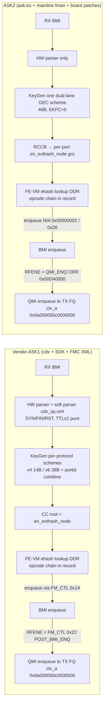
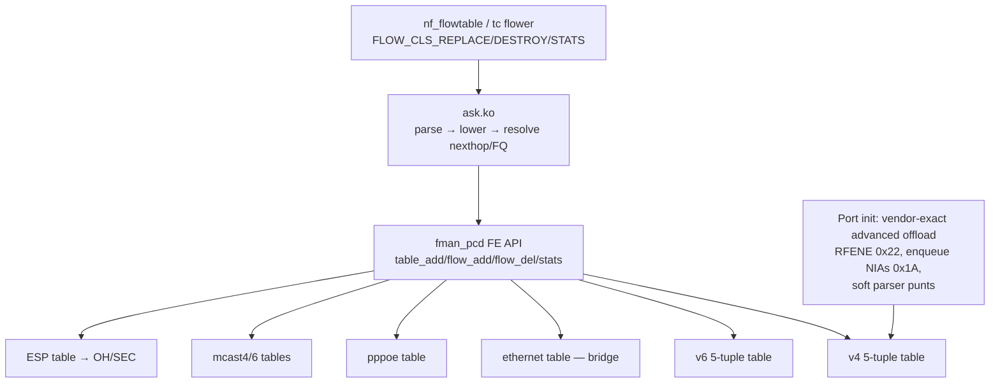

# ASK2 Rewrite Plan — reaching and exceeding vendor NXP ASK on LS1046A

Date: 2026-10-03. Branch reviewed: `dpaa1` at `40ace3f0`. Vendor reference: the
`nxp-sdk` branch (worktree `e20239b9`) and the original vendor source at
`/mnt/builds/ASK`.

This plan is the output of a six-agent review followed by a direct
cross-check of every claim that drives a decision:

| Agent | Scope |
|---|---|
| V1 | Vendor control plane |
| V2 | Vendor SDK register programming |
| A1 | ASK2 kernel PCD |
| A2 | ask.ko, UAPI and VyOS integration |
| D1 | NXP docs and the silicon ledger |
| P1 | Feature/performance matrix and the acceptance suite |

The agent reports are kept outside the repo at
`/mnt/builds/ask2-review/review/{V1,V2,A1,A2,D1,P1}.md`. The ASK2 kernel
reference tree is a fully patched `linux-6.18.54` (all 98 board patches plus
every `F_*` fixup, applied with CI's own loop, 0 rejects) at
`/mnt/builds/ask2-review/linux-6.18.54`. Below, `REF/` means that tree's
`drivers/net/ethernet/freescale/`. To regenerate it, run the CI kernel setup
(`bin/ci-setup-kernel.sh`) against the pinned kernel. Do not use
`work/linux-6.18.44`, which is stale.

## Evidence rules

Every factual statement carries one of these tags:

- `[CODE path:line]` for source.
- `[DOC ...]` for NXP documentation, including qdrant RM chapters.
- `[SILICON <date>]` for a dated board result stored in qdrant.
- `[INFERRED]` for reasoning not directly observed.
- `[UNKNOWN]` for anything that is unknown.

When qdrant entries conflict, the newer date wins. When code and a silicon
observation conflict, the conflict is stated and resolved by an experiment
in this plan, never by assertion.

## 1. Verdict

1. **Routed and NAT forwarding already matches the vendor.**
   - ASK2 routed v4 bidir reaches 14.47–14.50 Gbit/s against the vendor's
     14.17 Gbit/s on the same rig. After the no-confirm TX-FQ fix, ASK2 CPU is
     0.10–0.40 % per core [SILICON 2026-08-24].
   - NAT44, NAT66 and IPv6 routed also run at about 7.2 Gbit/s per direction
     [SILICON 2026-08-21, 2026-09-04].
   - The rewrite must not regress this path. It is the baseline every phase
     is gated on.
2. **Routed VLAN is the largest functional gap, and the current HEAD is
   unsafe.**
   - The vendor does vlan↔vlan v4 bidir at 16.50 Gbit/s; ASK2 manages
     5.27 Gbit/s [SILICON 2026-09-10].
   - The shipped CC-leaf→HMTD path ("Option A") gives no measurable benefit
     over pure software for cross-port VLAN [SILICON 2026-10-02].
   - HEAD `40ace3f0` routes armed VLAN flows back onto the inline ehash/FE-VM
     path [CODE `kernel/ask/oot-modules/ask/ask_flow_offload.c:2003-2025`] and
     arms it by default (`ask_vlan_offload = true`) [CODE
     `kernel/ask/oot-modules/ask/ask_hw.c:189`].
   - That path has never passed on silicon since the revival. Its last
     characterization: records freeze after at most 21 HITs, and the engine
     keeps consuming frames but enqueues nothing [SILICON 2026-08-25,
     2026-09-01, 2026-09-08]. In other words, offloaded VLAN TCP flows are
     blackholed after they latch.
   - `ask_vlan_cc_flow_add()` no longer has any caller, so `ask_vlan_cc.c` is
     dead code at HEAD [CODE `grep ask_vlan_cc_flow_add` → definition and
     comments only].
   - The comment block at `ask_hw.c:165-178` still describes Option A and is
     stale.
   - **Immediate action (Phase 0, item 0.1):** default `vlan_offload` to off
     until Phase 1 passes.
3. **A concrete, never-tested port-init difference exists** (section 4.3):
   - The vendor enables FM_CTL "advanced offload" (`dpa_app/dpa.c:265`).
     Every vendor RX PCD port therefore gets
     `FMBM_RFENE = NIA_ENG_FM_CTL | NIA_FM_CTL_AC_POST_BMI_ENQ (0x00000022)`,
     and every PCD enqueue NIA resolves to `FM_CTL | AC_PRE_BMI_ENQ_FRAME
     (0x0000001A)`.
   - ASK2 leaves `FMBM_RFENE` at the mainline `NIA_ENG_QMI_ENQ |
     NIA_ORDER_RESTOR (0x00D40000)` and uses `0x00500002`/`0x28` for enqueue
     NIAs. No qdrant entry records this being tested.
   - It was the leading candidate for the 21-packet (5+tnums) VLAN freeze.
     **E1, E1a and E1b (without the miss part) tested it on 2026-10-04 and all
     failed:** none of these port/FE values has any measurable effect on the
     VLAN freeze [SILICON 2026-10-04] (Phase 1).
4. **Opcode composition is not the VLAN bug.** The vendor-exact chains
   `05 11 12 21 41 01` (pop) and `05 11 21 42 41 01` (push) were byte-verified
   and still sustained 0 [SILICON 2026-08-25]. The full-record readback
   exonerated the emitter [SILICON 2026-09-08]. Do not spend further cycles
   there.
5. **ASK2 is already smaller than the vendor stack** (section 7), but about
   6.4k of roughly 21.3k reviewed kernel PCD lines are debug, dormant or dead
   [A1 LOC inventory]. Three VLAN histories coexist in code and comments.
   The rewrite is mostly consolidation and the VLAN root cause, not a
   ground-up redesign.
6. **There is a correctness gap the vendor closes and ASK2 does not.**
   - The vendor soft parser punts TCP SYN/FIN/RST to the host
     [CODE `/mnt/builds/ASK/dpa_app/files/etc/cdx_sp.xml:141-147`].
   - It also punts TTL/hop-limit ≤ 1 to the host [CODE `cdx_sp.xml:52-59,
     79-85`].
   - ASK2 never consumes the TCP-flags match that nf_flowtable supplies (no
     `flow_rule_match_tcp` in
     `kernel/ask/oot-modules/ask/ask_flow_offload.c`).
   - ASK2 has no parser-side punt either, so FIN/RST on an offloaded flow are
     forwarded in hardware and Linux conntrack never sees the close
     [INFERRED from code; verify with test A14].

## 2. Data path, vendor vs ASK2

Sources:

- Vendor:
  - [CODE `/mnt/builds/ASK/dpa_app/files/etc/cdx_pcd.xml:5-27,98-164`]
  - [CODE `cdx_sp.xml:26-174`]
  - [CODE `nxp-sdk/.../sdk_fman/Peripherals/FM/Port/fm_port.c:5052-5121`]
  - [CODE `.../FM/inc/fm_common.h:418,421,444-447`]
  - [CODE `/mnt/builds/ASK/cdx/devman.c:349-372`]
- ASK2:
  - [CODE `REF/fman/fman_keygen.c:784`]
  - [CODE `REF/fman/fman_pcd.c:3759-3772`]
  - [CODE `REF/fman/fman_pcd.c:1483,1535`]
  - [CODE `REF/fman/fman_port.c:605`]
  - [CODE `REF/dpaa/dpaa_eth.c:1845-1869`]

## 3. Feature parity (summary of P1, re-checked)

| Feature | Vendor | ASK2 at 40ace3f0 | Evidence |
|---|---|---|---|
| IPv4 routed | Works, 14.17G bidir | Works, 14.50G bidir, 0.1–0.4 % CPU | [SILICON 2026-08-24] |
| IPv6 routed | Code present, no vendor throughput found | Works, 7.14–7.34G per direction | [SILICON 2026-08-21] |
| NAT44 / PAT | Works (conntrack orig/reply deltas) | Works, 5.76G (2026-09-04) to 7.30G aggregate | [SILICON 2026-08-23, 2026-09-04] |
| NAT66 | Works (live) | Works, 5.52G | [SILICON 2026-09-04] |
| Routed VLAN | Works: 16.50G vlan↔vlan bidir; 3000/3000 flood ping | **Broken/unsafe at HEAD** (inline path blackholes after ≤21 HITs; Option A = SW speed) | [SILICON 2026-08-25, 2026-09-10, 2026-10-02] |
| Bridge L2 | auto_bridge + ethernet ehash table (keysize 15) | Observer only, no dataplane | [CODE `kernel/ask/oot-modules/ask/ask_bridge.c:1-15`] |
| PPPoE | Soft parser + pppoe tables + relay | Absent | [CODE `cdx_sp.xml:2-24`; `ask_flow_offload.c:1418-1425`] |
| Multicast | mc4/mc6 tables + REPLICATE | Absent (cap bit only) | [CODE `cdx_pcd.xml:41-51`; `ask.h:240-242`] |
| IPsec ESP | ESP tables, SEC via OH port | Stub (`-EOPNOTSUPP`) | [CODE `ask_xfrm.c:13-17`] |
| Tunnels | module_tunnel + HM | Absent | [CODE `/mnt/builds/ASK/cmm/src/module_tunnel.c`] |
| Ingress policer | Present | Works (FMPL), in_hw | [SILICON 2026-08-23] |
| Egress QoS/CEETM | Present (`-DENABLE_EGRESS_QOS`) | Absent | [CODE `/mnt/builds/ASK/cdx/Kbuild:7-8`] |
| IPv4 frag | fmlib support; dist refs commented out in XML | Absent (SW fallback) | [CODE `cdx_pcd.xml:88-96`] |
| SYN/FIN/RST, TTL≤1 punt | Soft parser | **Absent** | section 1 item 6 |
| Engage latency | **~2.6 s** after flow start, batched (all 130 records of a 64-flow run within 50 ms); the older ">10 s" figure is superseded | Event-driven, sub-second | vendor [SILICON 2026-10-04 kprobe `ExternalHashTableAddKey` timestamps vs. `/proc/uptime`]; ASK2 [SILICON 2026-08-24] |

## 4. Cross-checked decision drivers

### 4.1 How the vendor does routed VLAN (settled from code)

Routed flows are programmed by `fill_actions()`
[CODE `/mnt/builds/ASK/cdx/cdx_ehash.c:583-810`]. `fill_bridge_actions()`
(1196) serves only bridge L2 flows. The VLAN ID is **not** part of the routed
key: `fill_key_info()` builds portid + 5-tuple [CODE `cdx_ehash.c:358-450`].
Emission order for a routed record:

| # | Opcode | Condition | Notes |
|---|---|---|---|
| 1 | `PREEMPTIVE_CHECKS 0x05` | always | 8-byte param, sealed at enqueue time: `mtu_offset`, OpMask `TX_VALIDATE` (unless WLAN), `DFBIT_HONOR` (v4) [CODE `cdx_ehash.c:2470-2483`] |
| 2 | `STRIP_ETH_HDR 0x11` | iff `L2_L3_HDR_OPS` (vlan present, pppoe, egress vlans, tunnel or ipsec in) | opcode only |
| 3 | `STRIP_ALL_VLAN_HDRS 0x12` | **every routed flow** ("mandatorily to validate vlan ids") | 12-byte param: `vlan_id[2]` outer first, stats word 0 (no `INCLUDE_VLAN_IFSTATS`), op_flags [CODE `cdx_ehash.c:~1964-2069`] |
| 4 | NAT fused / TTL·HOPLIMIT | per flow | |
| 5 | `INSERT_VLAN_HDR 0x42` | iff egress VLANs | word `num_hdrs<<24 \| stats ptr`, then `(tci<<16)\|eth_type` per tag, reverse order [CODE `cdx_ehash.c:~1757-1810`] |
| 6 | `INSERT_L2_HDR 0x41` | always | hdrlen 14 (rebuild) or 12, `hdrlen \| pad<<29`, never sets replace [CODE `cdx_ehash.c:~1812-1855`] |
| 7 | `ENQUEUE_PKT 0x01` | always | [CODE `cdx_ehash.c:~2560-2612`] |

Vendor build flags: `-DSEC_PROFILE_SUPPORT -DVLAN_FILTER -DWIFI_ENABLE
-DENABLE_EGRESS_QOS -DDPA_IPSEC_OFFLOAD` [CODE `/mnt/builds/ASK/cdx/Kbuild:7-8`].
**No OH port is used for routed VLAN.** OH ports serve IPsec (oh@2) and WiFi
(oh@3) [CODE `/mnt/builds/ASK/dpa_app/files/etc/cdx_cfg.xml:13-23`].

**Conflict resolved [SILICON 2026-10-04, Phase 0.3]:** a live vendor
vlan10→vlan20 record on `.106` is inline opcodes in the ordinary per-port
ehash record, with no OH port and no extra FQ hop (section 4.1a). The
2026-09-01 "OH ports + HM queues" qdrant entry is **wrong** for routed VLAN.
The code reading stands.

Corrections to the table above from the live records:

- The vendor build also emits **`UPDATE_ETH_RX_STATS 0x04`** (4 B MURAM stats
  pointer) right after `0x05` on every record, tagged or not.
- The `0x12` stats word is **not** 0. It is `0x01048680` (`num_entries` = 1,
  MURAM stats pointer), and `0x42` also carries a stats pointer
  (`0x01048670`). So `INCLUDE_ETHER_IFSTATS` and `INCLUDE_VLAN_IFSTATS` are
  active in the deployed vendor `cdx.ko`.
- `UPDATE_TTL 0x21` carries a 4-byte DSCP word (0 when unmarked)
  [CODE `cdx_ehash.c:2120-2160`]. `STRIP_ETH_HDR 0x11` has no param.

#### 4.1a Vendor reference records (byte-exact, [SILICON 2026-10-04] `.106`)

All four records share the same header layout:

- `flags = 0x318a`: stats=1, timestamp=1, opcode offset 24, param offset 40.
- 14 B key = `portid | SIP | DIP | proto | sport | dport`.
- **portid byte = `0x06` on eth3 and `0x07` on eth4.** These are the same
  values as the vendor `rprai0` (section 4.4). The link between the two is
  INFERRED. ASK2 serializes `0x00`, which works with per-port tables
  [SILICON 2026-08-21], so this is not a blocker.

| Flow | Opcodes | Params from +40 |
|---|---|---|
| eth3.10 → eth4.20 (routed v4) | `05 04 11 12 21 42 41 01` | `38030000 00000000` · `00048620` · `000a0000 01048680 00000000` · `00000000` · `01048670 00140800` · `4000000e 248a07f812e1 e8f6d70016ad 8100 0000` · `05dc0000 000001fb 00048650 00049540` |
| eth4.20 → eth3.10 (reply) | `05 04 11 12 21 42 41 01` | same shape: vid 20 strip, push TCI 10 (`000a0800`), fqid `0x1eb` |
| eth3.10 → eth4 untagged | `05 04 11 12 21 41 01` | strip vid 10, `INSERT_L2 4000000e` + ethertype `0800` |
| eth3 → eth4 untagged, NAT44 masq | `05 04 12 23 41 01` | `0x12` vid 0 / word `0x00048d00`; `0x23` = TTL\|SIP fused: `00000000 0a63026a`; `INSERT_L2 0000000c` (12 B MAC-only); reply uses `0x25` (TTL\|DIP) |

Param decode, per the patch `:12024-12260` structs:

- `PREEMPT` = `mtu_off 0x38`, OpMask `0x03` (`TX_VALIDATE|DFBIT_HONOR`).
- `ENQUEUE` = MTU 1500, bpid 0, fqid, egress-stats word, frag-param MURAM
  pointer `0x049540`.

Hit proof: 9.0 M pkts per ~10 s on the eth3.10 record at 9.37 Gbps, with CPU
idle (section 6, 0.4).

### 4.2 ASK2 inline VLAN emitter vs vendor

ASK2 (patch `0209`) emits: `[0x12 iff POP] → 0x21/0x29 or fused NAT → [0x42
iff PUSH] → 0x41 (word 0x4000000e, 14 B) → 0x01`, with enqueue MTU 1500, bpid 0
[CODE `REF/fman/fman_pcd.c:2311-2490`]. Differences from the vendor are
`0x05` absent, `0x11` absent, and `0x12` only on pop.

All three were already tried on silicon without effect:

- 0x11 [SILICON 2026-08-25].
- Sealed 0x05 + 0x11 + 0x12/0x42 byte-correct [SILICON 2026-08-25].
- Unconditional 0x12 removed parser errors but did not sustain
  [SILICON 2026-08-25].
- Real VID + validate [SILICON 2026-09-01].
- Byte-perfect readback [SILICON 2026-09-08].

Conclusion: keep the vendor-exact composition as the canonical form (it costs
nothing and removes a variable), but it is not the fix.

**Remaining record-level differences after 0.3** [SILICON 2026-10-04 vs CODE
`REF/fman/fman_pcd.c:2311-2490`]. None of them has been tested in isolation on
ASK2 VLAN:

1. Vendor `0x04 UPDATE_ETH_RX_STATS` is present on every record.
2. Vendor `0x12`, `0x42` and `0x01` carry non-zero MURAM stats pointers, and
   `0x01` carries a frag-param pointer. ASK2 enqueue words +8/+12 are 0
   [CODE `fman_pcd.c:2490-2491`].

`flags` is **identical**. ASK2 computes `0x3000 | (24>>2)<<6 | (40>>2)` =
`0x318a` when stats are on [CODE `fman_pcd.c:2320-2323`]. ASK2 untagged IPv4
hits without (1) and (2) [SILICON 2026-08-21], so neither is a general
requirement. The silicon record diff no longer points at the record itself,
which strengthens E1 (port arming, section 4.4) as the lead.

### 4.3 Port-init and FE-resource diff (vendor vs ASK2)

| Item | Vendor | ASK2 | Status |
|---|---|---|---|
| `FMBM_RFPNE` | `NIA_ENG_KG \| NIA_KG_CC_EN` [CODE `fm_port.c:1527-1577`] | RMW sets `NIA_KG_CC_EN`, live `0x00480200` [CODE `REF/fman/fman_port.c:2024-2040`; SILICON 2026-10-02] | Same |
| `FMBM_RCCB` | CC root with `en_exthash_node` copied in [CODE `010-ask-fman-dpaa-ehash.patch:3140-3156`] | per-port `gro` with `en_exthash_node` [CODE `REF/fman/fman_port.c:1942`; `fman_pcd.c:3759-3772`] | Same form |
| `en_exthash_node` word_2 | `int_buf_pool_addr<<16 \| global_mem_offset (32768>>8 = 0x80)<<4 \| mask_bits` [CODE `010...patch:5932-5933,12455-12460`] | `(fe_int_buf_off>>8)<<16 \| 0x80<<4 \| mask_bits` [CODE `REF/fman/fman_pcd.c:3765-3768`] | **Same (verified)** |
| PCD-global FE int-buf + global mem | `EN_INTERNAL_BUFF_POOL_SIZE` (32768) + `en_exthash_global_mem`, 256-aligned [CODE `010...patch:8848-8869`] | `256*128 + 256`, 256-aligned, zeroed [CODE `REF/fman/fman_pcd.c:1813-1817,1877-1912`] | **Same (verified)**, so this is not the freeze cause |
| Per-port FE mgmt list / params page | `FmPortSetFESupport`: pool tnums×0x100×2, mgmt list of 5+tnums, params +0x54/+0x58 [CODE `010...patch:9380-9442`] | same shape [CODE `REF/fman/fman_pcd.c:712-753`] | Same |
| **`FMBM_RFENE`** | `NIA_ENG_FM_CTL \| NIA_FM_CTL_AC_POST_BMI_ENQ` = **`0x00000022`** whenever advanced offload is on [CODE `fm_port.c:5115-5118,1751-1758`; `fm_common.h:402,421`]. `dpa_app` always enables it [CODE `/mnt/builds/ASK/dpa_app/dpa.c:258-269`; `fm_pcd.c:1559-1582`] | **`0x00D40000`** (`QMI_ENQ \| ORDER_RESTOR`), never changed [CODE `REF/fman/fman_port.c:605`; no other writer in REF, ask.ko or fixups] | **DIFFERENT, vendor value confirmed live** [SILICON 2026-10-04 `.106` vendor `0x00000022` on eth3+eth4; `.185` ASK2 `0x00d40000`] |
| **`FMBM_RCMNE`** | `NIA_ENG_FM_CTL \| NIA_FM_CTL_AC_POP_TO_N_STEP` = **`0x0000000e`** under advanced offload, else `0x2C` [CODE `fm_port.c:4843-4849` (`FM_PORT_ConfigureMuramPage`, called unconditionally from `FM_PORT_SetPCD` at `:5151`), written by `AttachPCD` `:1737-1744`; `fm_common.h:414,427`] | **`0x00000000`**, no writer [SILICON 2026-10-04 `.185`; `grep rcmne REF/fman/` = struct field only] | **DIFFERENT, vendor confirmed live** [SILICON 2026-10-04 `.106` `0x0000000e`]. Note: iter-31 tested `0x2C` (the NO_IPACC value), never `0x0e` [DOC `arch/fman-fe-ehash.md:298`] |
| **Params page `misc` (+0x40)** | `ALWAYS_ON 0x100` at init [CODE `fm_port.c:2672`] then `\|= OFFLOAD_SUPPORT_EN 0x40000000` when advanced offload is on [CODE `fm_port.c:4863-4866`; `fm_common.h:471`] | **`0x00000100`** [SILICON 2026-10-04 `.185` eth3+eth4; only writer is `FMAN_PP_MISC_ALWAYS_ON` CODE `REF/fman/fman_port.c:2487,2542`; no `OFFLOAD_SUPPORT` in REF, ask.ko or fixups] | **DIFFERENT, vendor confirmed live** [SILICON 2026-10-04 `.106` `0x40000100`]. The ref doc already labels this bit "enables FE-VM offload on this port" [DOC `arch/fman-microcode-210-programming-reference.md:860`] |
| PCD "enqueue frame" NIA | `GET_NIA_BMI_AC_ENQ_FRAME()` = `FM_CTL \| AC_PRE_BMI_ENQ_FRAME` = **`0x1A`** under advanced offload, used by KG, CC, PLCR and port [CODE `fm_common.h:443-447`; `fm_kg.c:1252`; `fm_cc.c:2221`; `fm_plcr.c:139,759`] | FE ENQ word1 `0x00500002` [CODE `REF/fman/fman_pcd.c:1483,1535`]; CC result `0x28` (NO_IPACC variant) [CODE `REF/fman/fman_pcd_cc.c:124-145`] | **DIFFERENT, untested** |
| Parser | HW parser + soft parser (TCP flags punt, TTL≤1 punt, TCP `l3r` first/last-frag bits, non-PPPoE TCP `$nia=0x4C0000` to policer on ports <9) [CODE `cdx_sp.xml:49-174`] | HW parser only; LCV split exists for F-205 [CODE `REF/fman/fman_port.c:2125-2160`] | Different |
| KeyGen | per-protocol schemes; v4 keysize 14, v6 38, portid combine offset 16 mask 0xF [CODE `cdx_pcd.xml:98-164`] | one dual-lane GEC scheme, 46 B, EKFC written 0, `kgse_hc=0` for AC_CC [CODE `REF/fman/fman_keygen.c:650-850`] | Different design; routed sustains, so not a VLAN lead |
| `FMBM_RFQID` | default FQ (not tabulated) [UNKNOWN] | default FQ set at init only [CODE `REF/fman/fman_port.c:608`] | Dual-delivery suspicion (2026-10-02) applies to the CC (Option A) path [INFERRED] |
| TX FQ context_a | `0x9a000000/0xC0000000`, `DYNAMIC_FQID\|TO_DCPORTAL` [CODE `/mnt/builds/ASK/cdx/devman.c:349-372`] | `0x9a000000c0000000` [CODE `REF/dpaa/dpaa_eth.c:1845-1869`] | Same |
| Microcode | 210.10.1 | 210.10.1, md5 `6f23090a…` [SILICON 2026-09-08] | Same |

**Why the RFENE/0x1A difference fits the freeze signature** [INFERRED,
flagged as hypothesis]:

1. The ceiling is exactly the per-port management-index depth 5+tnums = 21
   [SILICON 2026-08-25].
2. The FE-VM enqueue path redispatches to the Pre-BMI 0x1a epilogue
   [SILICON 2026-09-08 campaign].
3. Routed/NAT edits are length-preserving and sustain. VLAN pop/push change
   frame length and freeze. A length-changing edit plausibly takes a
   management-index or internal-buffer entry, and the FM_CTL post-enqueue
   action (`0x22`, reached only via `FMBM_RFENE`) is the natural place where
   such an entry is returned.
4. ASK2 never routes the frame through `0x22`, so the entry would leak once
   per VLAN frame until the list is exhausted.
5. ASK2 has already seen the same class of bug: CC result NIA `0x00500002`
   "leaked one FMan task per CC-dispatched frame … pool exhausted within ~10
   frames" until it switched to the FM_CTL `0x28` variant
   [CODE `REF/fman/fman_pcd_cc.c:126-140`].

E1/E1a/E1b (2026-10-04) showed the port triple and the ENQ NIA have no
measurable effect on the freeze; see Phase 1.
Phase 0.2 (section 4.4) widened
it: the vendor arms three port-side advanced-offload values together in
`FM_PORT_SetPCD` (RFENE `0x22`, RCMNE `0x0e`, params `misc` bit 30), and ASK2
has none of them.

### 4.4 Live RX BMI diff, vendor vs ASK2 (Phase 0.2 result)

Captured read-only with the same tool on both boards
(`bin/ask-pcd-regdump.py`, `/dev/mem`) [SILICON 2026-10-04]:
- Vendor: `.106`, nxpask 6.12.49-vyos, `cdx`/`fci` loaded, idle with no
  offloaded flows.
- ASK2: `.185`, image 2026.10.03-0526, 6.18.54-vyos, ASK engaged on
  eth3/eth4.

Raw dumps: `/mnt/builds/ask2-review/vendor-regdump-106-20261004.txt` and
`ask2-regdump-185-20261004.txt`. eth3 (BMI `0x90000`) is shown below; eth4 is
the same pattern, except for the per-port offsets and FQIDs.

| Register | Off | Vendor `.106` | ASK2 `.185` | Note |
|---|---|---|---|---|
| `rcfg` | 0x00 | `0x80000000` | `0x80000000` | same |
| `ricp` | 0x14 | `0x00050203` | `0x000e0203` | IC external-buffer offset differs: vendor 5×16 = 80 B, ASK2 14×16 = 224 B. IC internal offset (32 B) and size (48 B) are the same [CODE `REF/fman/fman_port.c:566-573`, shifts 16/8, unit 16]. Not the same as the `0x00000007` recorded 2026-08-05 [DOC ref §5.2] |
| `rim` | 0x18 | `0x60000000` | `0x00000000` | vendor reserves 96 B for header manipulation |
| `rebm` | 0x1C | `0x01000000` | `0x01100000` | |
| `rfne` | 0x20 | `0x10440000` | `0x00440000` | bit 28 undecoded [UNKNOWN] |
| `rfca` | 0x24 | `0x823c0000` | `0x823c0000` | same |
| `rfpne` | 0x28 | `0x00480200` | `0x00480200` | same (KG + CC_EN) |
| `rpso` | 0x2C | `0x00000060` | `0x00000000` | parse start offset 96 B (pairs with `rim`) |
| `rpp` | 0x30 | `0x01000000` | `0x00000000` | |
| `rccb` | 0x34 | `0x00048100` | `0x00056d00` | MURAM layout (expected to differ) |
| `rprai0` | 0x40 | `0x06000000` | `0x10000000` | port-id byte in the parse-result init: vendor 0x06/0x07, ASK2 0x10/0x11 (hw port id) [INFERRED field meaning] |
| `rfqid`/`refqid` | 0x60/64 | `0x170`/`0x16f` | `0x6e`/`0x6d` | FQ allocation (expected to differ) |
| `rfsdm` | 0x68 | `0x010ee3c0` | `0x00020000` | vendor discards errored frames in BMI |
| `rfsem` | 0x6C | `0x00000000` | `0x012ce0e8` | ASK2 enqueues errored frames to the error FQ instead |
| **`rfene`** | 0x70 | **`0x00000022`** | **`0x00d40000`** | advanced-offload post-BMI-enqueue |
| **`rcmne`** | 0x7C | **`0x0000000e`** | **`0x00000000`** | advanced-offload pop-to-next-step |
| `rstc` | 0x200 | `0x80000000` | `0x00000000` | stats enable only |
| params `+0x40` misc | MURAM | **`0x40000100`** | **`0x00000100`** | `OFFLOAD_SUPPORT_EN` |
| params `+0x44` errDiscMask | MURAM | `0x010ee3e8` | `0x012ee0e8` | |
| params `+0x54` FE mgmt idx | MURAM | `0x00000000` | `0x00059100` (eth3) / `0x00056900` (eth4) | vendor stays `0x00000000` **under load too** [SILICON 2026-10-04: identical params page idle vs. a live offloaded 8-stream flow, eth3 `0x47a00` / eth4 `0x47b00`, `oracle/regdump-{idle,load}.txt`]; the vendor never uses it in steady state |

Reading: the three bold rows are the vendor's single "advanced offload"
switch, applied together by `FM_PORT_SetPCD` when `dpa_app` has called
`FM_PCD_SetAdvancedOffloadSupport` [CODE `fm_port.c:5052-5125,4828-4880`;
`dpa.c:258-269`]. They are the E1 variable. The `rim`/`rpso`/`rfsdm`/`rfsem`
rows are a second, separate cluster (buffer layout and error policy) and are
kept out of E1 so that only one thing changes at a time.

The ref doc's 2026-08-05 verdict that RFENE/RCMNE are "dormant for standard
CC-tree/AC_CC setups" [DOC `arch/fman-microcode-210-programming-reference.md:652`]
is contradicted by the vendor code path above and by the live `.106` values.
That doc now carries a dated correction.

## 5. Target architecture

Principles:

- One classification mechanism, exactly as the vendor does it: KeyGen →
  `en_exthash_node` → FE-VM ehash record carrying the full opcode chain.
- No CC-leaf/HMTD side path.
- Per-feature tables are added as additional ehash tables, mirroring the
  vendor table set.
- The control plane stays in-kernel and event-driven: nf_flowtable / tc
  flower → ask.ko → FMan PCD. ASK2 already beats cmm's batched ~2.6 s engage latency [SILICON 2026-10-04]
  this way, and it adds no userspace daemon.

Design decisions, each with its acceptance gate:

1. **Port init becomes vendor-exact.** If E1 passes, advanced-offload NIAs
   (RFENE `0x22`, enqueue NIAs `0x1A`) are always written on engage and
   restored to `0x00D40000`/`0x00500002` on disengage. The same mapping is
   used for discard NIAs (`0x1E`) [CODE `fm_common.h:419,448-450`]. Gate: A1,
   A4 and A6 with no regression on routed.
2. **Soft-parser punts.** Load a minimal soft-parser program that copies the
   vendor's TCP flags (`tcp.flags & 7`) and TTL/hop ≤ 1 punts. Alternatively,
   if a no-soft-parser solution exists, encode a flags-to-host rule. Gate:
   A14 (FIN/RST close seen by conntrack; traceroute through an offloaded flow
   gets ICMP TTL-exceeded).
3. **Key layout.** Keep the shipped 46-byte dual-lane key unless A2 (64 B
   pps) shows ASK2 below the vendor. In that case move to vendor per-protocol
   keys (v4 14 B, v6 38 B with portid). Do not change the key on hypothesis
   [AGENTS S6 §10.8].
4. **VLAN uses the inline ehash path with the vendor-exact opcode chain**
   (section 4.1), not Option A. `ask_vlan_cc.c` (509 LOC) and the CC VLAN
   plumbing are deleted once Phase 1 passes.
5. **Disengage stops calling global `conntrack -F`**
   [CODE `board/scripts/vyos-offload-ask:188-196`]. Flush only flows owned by
   the port via `flush-flows`. nf_flowtable re-offloads on the next packet.
6. **Every flow-add verifies its key layout.** Engage refuses with `-EPROTO`
   unless `fman_pcd_key_selftest()` passed since boot [AGENTS S6 §10.4]. A1
   found no boot-time selftest gate in REF, so this must be added.

## 6. Phases

Each phase starts from a cold boot, changes one variable per experiment,
records boot type, image, commit and kernel, and stores the result in qdrant
[AGENTS S6 §10.9-10.10].

### Phase 0 — safety and oracles (no datapath changes)

**Status 2026-10-04:** 0.1 ✅, 0.2 ✅, 0.3 ✅, 0.5 ✅, 0.4 🟡 (TCP matrix,
A13, UDP packet-size baseline (port↔port), 1k/20k-flow scale correctness,
and a real DPDK-driven pps/throughput curve at 64/512/1470 B all done. Open,
confirmed infra-gated rather than merely inferred: 64 B pps beyond the
dell1 ConnectX-3 generator's own ≈5.9 Mpps TX ceiling, full IMIX sweep at
0.001 % tolerance, UDP for vlan↔vlan combos, a clean 64k-flow number).

- **0.1 ✅ (2026-10-04):** Set `ask_vlan_offload = false` by default
  [CODE `kernel/ask/oot-modules/ask/ask_hw.c:189`] and fix the stale comment
  at `ask_hw.c:165-178`. Rationale: the HEAD inline path is unproven and
  historically blackholes flows. Exit: VLAN flows fall back to software, and
  routed throughput is unchanged (A1).
  - *Done:* default `false`. The comment and `MODULE_PARM_DESC` now describe
    the inline FE-VM path as not yet silicon-validated. The `ask_genl.c`
    capability comment is aligned.
  - The VyOS side arms per-port VLAN only through the explicit
    `offload ask vlan` CLI token (`vyos-1x-044`/`051`), so the global default
    fully gates it.
  - ask.ko builds clean (0 warnings) out-of-tree against the 0526 image
    headers (`linux-headers-6.18.54-vyos_…b2026.10.030526`).
  - *Pending:* the A1 exit check needs the next image. The running `.185`
    still has `vlan_offload=Y` from 0526.
- **0.2 ✅ (2026-10-04):** Vendor port-register oracle. The vendor board
  turned out to be `.106` (nxpask 6.12.49, `cdx`/`fci` loaded). `.110` and
  `.116` were unreachable, and `.116` blocks `/dev/mem`.
  - Read eth3/eth4 RX BMI, `RPRAI[0..7]`, `RFSDM`/`RFSEM`, `RGPR` and the
    params page.
  - Expected: `RFENE = 0x00000022`. **Confirmed**, together with
    `RCMNE = 0x0e` and params `misc = 0x40000100` (section 4.4). E1 is
    alive.
  - Tooling: `bin/ask-pcd-regdump.py` gained `rprai0-7`, `rfsdm`, `rfsem`,
    `rgpr`, a 256 B params-page dump and an RFENE decode. It is read-only,
    and the same file runs on both stacks.
- **0.3 ✅ (2026-10-04):** Vendor VLAN record oracle. **Result: routed VLAN
  is inline opcodes in the same ehash record. No OH port is used.** The vendor
  VLAN record takes millions of hits, against ASK2's 21. The byte-exact
  reference records are in section 4.1a.
  - *Method* (no module rebuild, no `/dev/mem` walk): a kprobe on the
    built-in `ExternalHashTableAddKey(h_HashTbl=x0, keySize=x1,
    tbl_entry=x2)`. The record is complete at that call, after
    `fill_actions()` [CODE `cdx_ehash.c:989`; signature
    `010-ask-fman-dpaa-ehash.patch:5531`].
    - The probe fetched the 256 B `hashentry` (first member) as 32 `x64`
      args.
    - Live counters were read from `/proc/kcore` at entry+256 (`packet_count`)
      and +264 (`packet_bytes`), both BE [CODE patch `:11878-11920`].
    - Tools: `/mnt/builds/ask2-review/oracle/{decode_ehash.py,kread.py}`.
    - Raw traces: `oracle/{p2p-v4,vlan2port-v4,vlan2vlan-v4,live}.trace`.
    - Board `.106`, warm boot, uptime about 1 day, 6.12.49-vyos.
  - *Hit proof* [SILICON 2026-10-04]: live vlan10→vlan20, single TCP stream
    at 9.37 Gbps. The record `pkts` went from 21,349,375 to 30,330,559 in
    about 10 s (46.0 GB total).
  - *Side finding:* `.106` runs `nat source rule 100` (eth4 masquerade for
    10.99.1.0/24) and `nat66 source rule 100` (fd99:1::/64). So vendor
    **port→port is NAT44/NAT66**, while the VLAN combos are pure routed. The
    earlier "14.17G bidir v4 routed" vendor figure was NAT44.
  - The params `+0x54` capture under load is folded into 0.4.
- **0.4 🟡 PARTIAL (TCP matrix + A13 done 2026-10-04; UDP baseline + flow
  scale added 2026-10-04):** Vendor baselines for P1 §5 A2–A5 and A13.
  Accepted as partial by the operator on 2026-10-04: the open items are
  deferred and do not block Phase 1. Measure them when a line-rate
  generator is available.
  Use the median of 3 runs as the ASK2 pass threshold.
  - *Done:* a full TCP matrix on `.106` with tuned generators (§8
    methodology): 6 combos × {unidir dell1→dell2, unidir dell2→dell1, bidir}
    × 3 reps = 54 runs.
    - Results are in §8 "Vendor TCP thresholds".
    - Raw data: `oracle/baseline-iperf3Z.csv` and `oracle/json/`.
    - Every run shows kprobe inserts (18 for unidir, 68 for bidir) and DUT
      CPU ≤ 5.9 %, so all were offloaded.
  - *Done (2026-10-04, this session):* UDP packet-size baseline and
    flow-count scale, port↔port and vlan↔vlan v4/v6, `.106` warm boot.
    Raw data: `oracle/udp/udp-matrix.csv`, `oracle/udp/json/`.
    - UDP, unidir, `iperf3 -u -b 0`, 15 s: port↔port v4 — 64 B 0.245 Gbps
      (24.9 % loss, ≈478k pps, single UDP thread, sender-pps-bound), 512 B
      1.975 Gbps (0.02 % loss), 1470 B 5.295 Gbps (0.50 % loss); port↔port
      v6 — 64 B 0.244 Gbps (19.8 % loss), 512 B 1.959 Gbps (0.40 % loss),
      1470 B 4.035 Gbps (0.06 % loss). DUT CPU ≤ 4.5 % on every run, so loss
      is generator-pps-bound, not DUT CPU-bound. This upgrades "iperf3 UDP
      small packets are generator-limited" from a claim to a measured
      number: 478k pps is nowhere near a 10GbE 64 B line rate of ≈14.88M
      pps.
    - UDP, vlan↔vlan v4/v6 via iperf3: reproducibly fails
      (`unable to read from stream socket: Resource temporarily
      unavailable`) on the control channel, even though TCP iperf3 on the
      identical path works (9.38 Gbps) immediately before/after, and raw
      UDP connectivity on the same path was confirmed healthy with `socat`.
      This is an iperf3-UDP-mode/dual-homed-Dell-routing interaction
      (harness gap), not a DUT/FMan defect — do not read it as a VLAN UDP
      regression.
    - Flow-count scale (custom single-packet-per-5-tuple UDP sender/counter,
      not iperf3): 1,000 flows — 1000/1000 (100 %) on both port↔port and
      vlan↔vlan v4. 20,000 flows — 19,406/20,000 (97.0 %) port↔port v4,
      20,000/20,000 (100 %) vlan↔vlan v4. 64,000 flows, port↔port v4 only —
      sender completed 63,974/64,000 sends, receiver counted 33,912
      (53 %); this drop is very likely the single-threaded Python receiver's
      default socket buffer overflowing under a ≈64k-packet, ~1 s burst, not
      a confirmed DUT limit — flagged as inconclusive rather than a defect.
  - *Done (2026-10-04, this session): DPDK line-rate attempt on dell1/dell2,
    port↔port v4, `.106` warm boot, no wedge.* Installed `dpdk-dev`
    25.11.3-1 (`librte-net-mlx4-26`, `rdma-core` 65.0-1) via apt on both
    Dells (ConnectX-3 needs no kernel unbind for the mlx4 PMD — it attaches
    over libibverbs alongside the live `mlx4_en` netdev, confirmed by `ping`
    over the kernel interface succeeding immediately after a testpmd run).
    1024×2 MiB hugepages were configured for the test and reverted after
    (a harmless ≈12 MiB residual could not be freed immediately — expected
    to reclaim on its own).
    - **RX-side DPDK (`dpdk-testpmd --forward-mode=rxonly`) does not work on
      this rig**: `net_mlx4` fails port start with `cannot attach flow
      rules (code 95, "Operation not supported")` on both Dells' ConnectX-3
      FW 2.42.5000 — the mlx4 PMD's mandatory default unicast-MAC flow rule
      is rejected by this card/firmware generation. This is the same class
      of issue as the TRex blocker (NXP/mlx4-generation hardware/firmware
      gap), not a config mistake; fixing it would mean touching shared-lab
      NIC firmware (`mlxconfig`) with reboot risk, so it was not attempted.
    - **Workaround used:** dell1 runs `dpdk-testpmd --forward-mode=txonly`
      (real DPDK burst generation, bypassing the kernel stack entirely) with
      `--eth-peer=0,<DUT eth3 MAC>` and `--tx-ip`/`--tx-udp` crafting valid
      port↔port 5-tuples; dell2 stays on its normal kernel `mlx4_en` netdev
      and is read via `/sys/class/net/*/statistics` and `ethtool -S`
      (no DPDK needed on the RX side). The DUT's own `/proc/net/dev`
      eth3/eth4 counters, bracketed before/after each run, give the
      authoritative ingress/egress numbers independent of either host.
    - **64 B:** dell1's ConnectX-3 TX itself ceilings at ≈5.91 Mpps
      (≈3.03 Gbps) regardless of 1 vs 3 TX cores/queues — a generator
      hardware/firmware limit for this ConnectX-3 generation, well short of
      the 14.88 Mpps 10GbE line rate, and confirmed not a config artifact
      (adding cores/queues did not move it). At that ≈5.91 Mpps offered
      load: DUT eth3 ingress counted only ≈3.33 Mpps (≈56 %, i.e. ≈44 %
      ingress-side loss), while DUT eth3→eth4 forwarding itself was
      lossless (ingress count == egress count within rounding, e.g.
      33,275,586 in vs 33,275,588 out over one run). This is a real,
      bounded measurement of the DUT's small-packet ingress ceiling under
      the current S0 (mainline, non-ASK) dataplane — somewhere ≤ the
      offered ≈5.9 Mpps and ≥ the accepted ≈3.3 Mpps — not a forwarding or
      CPU defect; DUT `uptime`/`loadavg` stayed normal throughout.
    - **512 B:** ≈2.33 Mpps achieved end-to-end (dell1 TX == DUT eth3 RX ==
      DUT eth4 TX, all equal within rounding) against a 2.35 Mpps 10GbE
      theoretical line rate for 512 B frames — **99.1 % of line rate,
      effectively zero loss**, ≈9.56 Gbps.
    - **1470 B:** ≈0.836 Mpps achieved end-to-end against a 0.839 Mpps
      theoretical line rate — **99.6 % of line rate, effectively zero
      loss**, ≈9.83 Gbps.
    - Net effect: A2 is no longer purely infra-blocked with zero data. The
      512 B/1470 B points are now real line-rate-class DPDK measurements
      (full line rate, no loss). The 64 B point is a real, bounded
      ingress-ceiling measurement, but not yet the full 0.001 %-tolerance
      14.88 Mpps sweep TRex/Spirent would give — that remains open because
      this rig's ConnectX-3 cards cap out well below 10GbE small-packet line
      rate as *generators*, independent of the DUT.
  - *Open, now confirmed infra-gated (not just inferred):*
    - A2 at full 14.88 Mpps/IMIX, 0.001 % loss tolerance: needs a generator
      that can source line rate at 64 B, which this rig's ConnectX-3 cards
      cannot (own TX ceiling ≈5.9 Mpps, confirmed this session) — still
      needs TRex/Spirent or newer NICs. The topology is also a mismatch for
      TRex specifically: TRex expects both ports in one chassis to
      self-account tx/rx; this rig is two single-port hosts (dell1 → DUT →
      dell2), which only works with iperf3/DPDK-testpmd-style split
      generation, not TRex's model, without new dual-port hardware.
    - UDP for vlan↔vlan combos: needs a different UDP tool than iperf3 (see
      above), not more DUT testing.
    - A clean 64k-flow number: needs a non-naive receiver (multi-threaded or
      larger backlog) or TRex, not a DUT re-test.
    - A4 port→port is NAT66 on the vendor, so pure-routed v6 coverage is the
      vlan combos only.
    - ~~A13: insert rate~~: done. ≥ 2.37k inserts/s and ~2.6 s batched
      engage (Phase 4).
    - ~~Vendor params `+0x54` under load~~: done. It stays 0 under load (section 4.4).
- **0.5 ✅ (2026-10-04):** Fix the stale master-plan statements.
  `plans/ASK2-MASTER-PLAN.md` around lines 39-44 calls VLAN "DONE and
  silicon-validated … merge-ready" through Option A. This is superseded by
  2026-10-02 (no benefit) and by HEAD (inline revival).
  - *Done:* dated "SUPERSEDED/REOPENED 2026-10-03" notes now sit at the
    summary, matrix row, feature-table VLAN row and T-M6-8 (`[x]`→`[ ]`).
    The historical text is kept.
  - Also corrected: the `arch/fman-microcode-210-programming-reference.md`
    §5.2 RFENE/RCMNE "dormant" verdict (section 4.4).

### Phase 1 — VLAN root cause

Run in order and stop at the first pass. Each experiment is one variable on
top of HEAD with `vlan_offload=1` for the test only. Repro with a few pings
and a short iperf; watch `fe_ehash_stats` pkt_count beyond 21.

**Status 2026-10-04 (late): ROOT CAUSE FOUND on this build, see "E3 result"
below.** On HEAD `40ace3f0` (T-M6-8d inline VLAN) there is **no FE-VM
freeze**. VLAN PUSH hit frames are emitted with TPID `0x0081` and a
byte-swapped TCI, and they die before reaching the wire. Three record defects
were found, one of them (stats pointer 0 → DMA CAM writes) on the **routed**
path too. E1, E1a and E1b ❌ (miss-NIA part not run), so the advanced-offload
hypothesis is closed.

**Read this first: the freeze point is bimodal and is not a discriminator.**
Five unmodified cold-boot baseline runs froze at either 8–9 hits
(111–113 Kbit/s) or 18–29 hits (161–224 Kbit/s), with no change applied.
Every E1-family result falls inside that range. The pass criterion has to stay
"pkt_count keeps climbing and throughput is far above 1 Mbit/s". A different
freeze count is noise, not a signal.

**E1 result [SILICON 2026-10-04].** Board `.185`, image
`2026.10.04-1623-rolling` (local dev build of `dpaa1` `40ace3f0` plus
uncommitted patches 0210/0211/0213), kernel `6.18.54-vyos`, cold boot through
the smart plug. Rig: dell1 `10.99.10.112` (VID 10) → DUT `eth3.10` → routed →
`eth4.20` → dell2 `10.99.20.113` (VID 20), iperf2 on port 5001, one stream,
5 s. Toggle: `echo 'adv_offload 10 1' > /sys/kernel/debug/fman_pcd/0/fe_arm`
(patch 0210), applied to port `0x10` (eth3) only.

| Run | VLAN flow | Routed control (port → port v4) |
|---|---|---|
| Baseline, `vlan_offload=Y` | `[HW_OFFLOAD]`, 201–215 Kbit/s; new forward records freeze at pkt_count 25–26 | 9.37 Gbit/s offloaded |
| E1 on (dmesg: `rfene=0x00000022 rcmne=0x0000000e misc=0x40000100`) | `[HW_OFFLOAD]`, 113 Kbit/s; new forward record freezes at pkt_count 7–8 | 9.37 Gbit/s offloaded, 4.06M hits |

- The triple does not fix the freeze, as the `p0-fevm-vlan-leak` research
  predicted. The lower count (7 versus 25) first looked like an effect, but
  the baseline repeats below show it is within normal variance.
- No wedge, no `Err FD`, no dmesg errors. Disabling restored
  `rfene=0x00d40000 rcmne=0 misc=0x00000100`, and routed ping kept working.

**E1a and E1b results [SILICON 2026-10-04].** Same board, image and rig. Each
step started from a cold boot (E1a, E1b), or from a revert that was confirmed
by a clean baseline. These runs did not need a new kernel. Registers were
written from userspace through `/dev/mem`, using one aligned 32-bit store per
write and reading each value back (scratch helper `fmreg.py`, FMan base
`0x1A00000`). eth3 RX BMI is at `+0x90000`: RFENE `+0x70`, RCMNE `+0x7c`,
RGPR `+0x30c` → params page at MURAM `0x56c00`, `misc` at `+0x40`.

| Run | Change | VLAN fwd pkt_count / throughput | Routed |
|---|---|---|---|
| Baseline (cold) | none | 18–20 / 161 Kbit/s | 9.38 Gbit/s |
| E1a-1 | params `misc` `0x00000100` → `0x40000100` only | 9 / 113 Kbit/s | 9.39 Gbit/s |
| Revert check | `misc` back to `0x100` | 27 / 221 Kbit/s | 9.38 Gbit/s |
| E1a-2 | `RFENE` `0x00d40000` → `0x00000022` only | 8 / 113 Kbit/s | 9.38 Gbit/s |
| Revert check | `RFENE` back | 27 / 223 Kbit/s | 9.40 Gbit/s |
| Baseline (cold) | none | 8 / 113 Kbit/s | 9.39 Gbit/s |
| E1b (without miss) | E1 triple + FE ENQ (MURAM `0x4b500`) word1 `0x00500002` → `0x0000001a` | 27 / 213 Kbit/s | 9.38 Gbit/s |
| Baseline ×3 (reverted) | none | 27, 8, 27 / 215, 111, 224 Kbit/s | — |

- Every variant stays inside the baseline's bimodal range. None unfreezes
  VLAN, none wedges, and routed traffic stays at line rate throughout.
- **E1b's miss-NIA part was not run, because the plan's wording contradicts
  the vendor source.** The vendor does not set the ehash miss action to
  `0x1A`: `cdxdrv_set_miss_action()` (`/mnt/builds/ASK/cdx/dpa_cfg.c:468`)
  sets every table's miss to `e_FM_PCD_KG` (a direct KG distribution scheme),
  or to the policer for ETHERNET/PPPoE tables. `0x1A` is the enqueue NIA that
  KG/CC/PLCR use downstream of that. ASK2's node word3 holds the miss FQID
  `0x200` (`miss_action_type=0`, live node at RCCB `0x56d00`:
  `ae400000 f7100000 04c1080f 00000200`). Moving the miss to a KG direct
  scheme is a structural change, not a register poke. It also only affects
  frames that miss, so it cannot plausibly fix a freeze on the hit path. It is
  dropped from E1b.
- The FE ENQ object's word1 may not be on the inline-record hit path at all:
  `ENQUEUE_PKT` (opcode `0x01`) carries its own FQID. A null result for that
  word is therefore expected, not informative.

| Exp | Change | Pass criterion |
|---|---|---|
| E1 | Vendor advanced-offload port triple on the engaged port, applied in vendor order (params `misc \|= 0x40000000`, `RCMNE ← 0x0000000e`, `RFENE ← 0x00000022`) [CODE `fm_port.c:4828-4880,5115-5118`]. These are the 0.2-confirmed vendor values (section 4.4) | VLAN record pkt_count > 21 and climbing; routed unaffected |
| E1a | If E1 wedges or regresses: params `misc` bit 30 alone, then `RFENE 0x22` alone | same |
| E1b | E1 plus FE ENQ word1 `→ 0x1A` (`GET_NIA_BMI_AC_ENQ_FRAME` under advanced offload). The vendor-node miss/discard `→ 0x1A/0x1E` part is dropped: the vendor's miss action is a KG direct scheme (`dpa_cfg.c:468`), not `0x1A` | same |
| E2 | Soft-parser parity (vendor `cdx_sp.xml` ipv4/ipv6/tcp/udp schemas) | same |
| E3 | Byte-match the vendor record from 0.3 (any remaining diff) | same |
| E4 | If E1–E3 fail: escalate to the microcode workstream in `decomp/fevm-vlan-freeze-campaign-report.md` (v3 parse-geometry routine) | — |

Exit: A6 passes (vlan-port, vlan-vlan, v4/v6, uni+bidir) at ≥ the vendor's
16.50G vlan↔vlan bidir, with zero RX-deaf or churn errors.

#### E3 result: record byte-diff on silicon [SILICON 2026-10-04]

Method (read-only plus guarded DDR pokes, no build):
1. Dump the live VLAN record from DDR (`/dev/mem`, `rec=` from `fe_flow`).
2. Diff it against the vendor 0.3 record.
3. Patch individual words in place and A/B with a **constant one-way UDP
   stream**: iperf2 `-u` from dell1 with a fixed source port. dell2 sends a few
   packets back on the same 5-tuple so conntrack offloads the flow. Do not use
   iperf3 UDP, whose client waits for a server reply that the broken reverse
   record eats.

**The "21-packet freeze" was TCP backoff, not an FE-VM limit.** Under a
constant 20 Mbit/s one-way stream the forward record's `pkt_count` climbs at
the full offered rate (about 2,700 hits/s, indefinitely). The FE-VM matches
and executes every frame, but dell2's PHY (`rx_packets_phy`, mlx5) receives
**0** of them. With TCP, every offloaded segment is lost, the sender backs
off, and the counter looks frozen at whatever the initial window delivered
(the bimodal 8–9 / 18–29).

**Defect 1, root cause of the VLAN loss (ask.ko byte order):**
`ask_flow_offload.c:2025-2026` copied `key->vlan_push_tci` and
`key->vlan_push_tpid` (both `__be16`, from `htons()` and the
`FLOW_ACTION_VLAN_PUSH` `vlan.proto`) into the 0209 action fields, which are
documented as host order and passed through `cpu_to_be*()` by the emitter.
The swap happens twice, so the record carries INSERT_VLAN `14 00 08 00`
(TCI `0x1400` = VID 1024, DEI=1) and INSERT_L2 EtherType `00 81` (`0x0081`),
where the vendor has `00 14 08 00` / `81 00`. A/B with two streams running at
once: the unpatched record delivered **0** frames, while the same record with
both u16s swapped in place by `/dev/mem` delivered **5,158 frames in 3 s**
(the full send rate). **Fix applied (uncommitted):**
`action.vlan_push_tci = ntohs(...)`, `action.vlan_push_tpid = ntohs(...)`.

**Defect 2, VLAN translate incomplete (0209 emitter):** after the defect-1
patch, frames arrive with **VID 10** (the ingress tag), the same length as
ingress (1516), and TTL decremented. So STRIP removed nothing and INSERT_VLAN
added nothing; only INSERT_L2 rewrote MACs and EtherType in place. Record
differences from the vendor:
- The STRIP control word is `0x00000000` (**num_entries = 0**); the vendor has
  `0x01048680` (num_entries 1, stats_ptr `0x48680`).
- ASK2 omits `0x11 STRIP_ETH_HDR`, which the vendor emits before
  `0x12`/`0x42` whenever L2 is rebuilt (`05 04 11 12 21 42 41 01`). Without
  it, the VLAN ops and INSERT_L2 likely see a frame that still starts at the
  DA.
- Fix direction: emit `0x11`, set STRIP num_entries=1, and give it a real stats
  pointer (see defect 3). This must go through the S0 gate and CI.

**Defect 3, MURAM offset 0 / DMA CAM corruption on EVERY offloaded frame
(routed included):** ASK2 writes the ENQUEUE `word` (rspid:8|stats_ptr:24) and
`word2` as 0, and the INSERT_VLAN `statptr` as 0. The microcode still updates
a `{u64 packets, u64 bytes}` block at stats_ptr. With the pointer at 0 that
lands on **MURAM `0x0–0xf`, which is the FMan DMA CAM** (`FMDMEBCR =
0x00000000`; `fman->cam_offset` is the first MURAM allocation).

| Evidence | Value |
|---|---|
| Idle | MURAM `+0x4` unchanged |
| VLAN 1,785 pps stream, ~2.5 s | `+0x4` +3,997, `+0xc` +6,059,452 → **exactly 1516.0 B/frame** |
| Routed 9.4 Gbit/s, 2 s | `+0x4` +1,680,000 (~840 Kpps) |

This violates AGENTS.md §10.1 (never write MURAM at an unowned offset) on the
shipping routed path. It is a strong candidate for historically unexplained
DMA/port symptoms (RX-deaf ports, "accumulated corruption" that survives a
warm reboot). Fix direction: allocate a per-port (or per-record-class) MURAM
stats block from `fman_muram_alloc()` and write its offset into the ENQUEUE
`word` (and the STRIP/INSERT_VLAN stats fields), as the vendor does
(`0x48650`/`0x48680`/`0x48670`). Alternatively, confirm a microcode flag that
skips stats. Needs the S0 gate, a design, CI, and a regression run on routed.

#### E3 follow-up: CI build `6bf043d2` on silicon [SILICON 2026-10-05]

Image `2026.10.04-2356-rolling` (CI run 37245529958) on `.185`. Corrections to
the E3 section above are in bold.

- **Defect 1 fix validated.** The record now carries the vendor bytes
  (INSERT_VLAN `00 14 08 00`, EtherType `81 00`). The one-way UDP VLAN stream
  is delivered to dell2 at the full send rate (3,595 frames in 2 s) through
  the hardware path (record hits climbing, eth3 kernel RX 0).
- **Defect 2, corrected diagnosis.** The STRIP control word's `num_entries`
  counts VLAN interface-stats entries, not tags. The vendor itself writes the
  word as 0 when `INCLUDE_VLAN_IFSTATS` is off (`cdx_ehash.c` ~2000). It was
  not the cause. Frames still leave with **VID 10** (the ingress tag), so
  STRIP and INSERT still have no visible effect. The cause is open.
- **Inserting `0x11 STRIP_ETH_HDR` into a live VLAN record
  (`12 21 42 41 01` → `11 12 21 42 41 01`) wedges eth3 into the RX-deaf
  state immediately.** Hits stop at once, then all eth3 RX stops (untagged
  and VLAN, kernel RX 0). Only a cold power-cycle recovers it. Reproduced
  twice on 2026-10-05, each time within one frame of the write. This is a
  concrete, repeatable RX-deaf trigger. Do not emit `0x11` in this chain
  until the vendor's full prefix (`05 04 11`) and its params are understood.
- **Defect 3, corrected attribution: patch 0214 does not fix it.** `word2`
  now points at the owned block (`0x054200`), and that block stays all zero
  under load, so `word2` was never the writer. A guarded live test pointed one
  record's ENQ `stats_ptr` (`word`) at the owned block. The block then took
  vendor `en_ehash_stats` `{u64 bytes, u32 pkts}` for that flow, which proves
  the ucode honours ENQ `stats_ptr` when non-zero and skips it when 0
  (vendor-consistent). **MURAM 0x0–0xf kept counting at the same rate**, in a
  different layout `{u64 pkts @0, u64 bytes @8}`. So the DMA CAM writer is
  still unidentified. Facts: it runs on the hit path only (a non-offloaded
  ICMP flood leaves it at +0), it uses the per-record stats layout, and it is
  shared across flows. 0214 is harmless (+32 B MURAM, lifecycle tied to the
  int-buf pool) but inert. The CAM counter was also seen reset to 0 once
  mid-session. The first RX-deaf event came right after a `0x11` poke, so it
  does not implicate the CAM writes.
- **Defect 3 RETRACTED [SILICON 2026-10-05]: this is microcode behaviour,
  not an ASK2 bug.** Setting the record's `STATS_EN` flag (`0x0392` →
  `0x1392`) did not change it. MURAM 0 counts at exactly the record's own
  rec+0x100 rate (886K/s versus 886K/s), so it is a microcode working copy
  of the hit record's stats. The **vendor board `.106` shows the same thing**:
  `FMDMEBCR = 0` and MURAM `+0x4` = 65.9M packets, `+0x8..f` = 26.4 GB, the
  same `{u64 pkts, u64 bytes}` from its own past offloaded traffic. ASK2 is at
  vendor parity here, so there is nothing to fix. Patch 0214 is reverted
  (removed from `series`) as inert.
- **VLAN translate FIXED (patch 0215) [SILICON 2026-10-05].** The VID 10
  egress came from the missing `0x11 STRIP_ETH_HDR`. Putting `0x11` at
  **opcode 0** wedges the RX port. That reproduced three times, including with
  every safe vendor RX-port setting applied (`rim`/`rpso` 96 B headroom,
  RFENE/RCMNE, `misc` bit 30), so the headroom and advanced-offload
  hypotheses are falsified. Live record bisection, rewriting one active
  record with the sender paused:

  | Opcodes | Result |
  |---|---|
  | `05 04 11 12 21 42 41 01` (vendor-exact) | VID 20 at line rate, no wedge |
  | `04 11 12 21 42 41 01` | VID 20 at line rate, no wedge |
  | `05 11 12 21 42 41 01` | VID 20 at line rate, no wedge |
  | `11 12 21 42 41 01` | RX-deaf |

  Rule on 210.10.1: `0x11` must not be opcode 0. Patch 0215 emits `04`
  (stats 0) + `11` ahead of the VLAN ops; records without VLAN edits are
  byte-identical. It is validated for VLAN→VLAN only; push-only, pop-only,
  TCP throughput and the reverse direction are still to be tested on the CI
  image (commit `b8c06b05`, run 37252626849).
- **CI image `b8c06b05` (0215) on silicon [SILICON 2026-10-05].** The kernel
  now emits `04 11 12 21 42 41 01` for VLAN→VLAN.

  | Combo | TCP, 4 streams | eth3 kernel RX |
  |---|---|---|
  | vlan→vlan v4 / v6 | **9.33 / 9.23 Gbit/s** | ~0 (hardware) |
  | port→port v4 / v6 | 9.38 / 9.25 Gbit/s | — |
  | vlan→port v4 / v6 | 225 / 368 Kbit/s | — |

  vlan→port v4/v6 is broken by the reverse (push-only) direction. One-way UDP
  results:
  - **Pop-only** (`04 11 12 21 41 01`, VLAN → untagged) delivers correctly
    untagged at line rate.
  - **Push-only** (untagged ingress → VLAN egress) wedges the ingress port
    (eth4) RX-deaf within about 14 hits. It does so as `04 11 21 42 41 01`,
    as `04 11 12(vid 0) 21 42 41 01`, and as the vendor-exact
    `05 04 11 12 21 42 41 01` alike.

  ask.ko now fails push-only closed to software (`-EOPNOTSUPP`) until a vendor
  record for untagged→VLAN is captured on `.106`. Rig gotcha: a DUT
  power-cycle drops dell1's table-110 policy routes, so re-run
  `testrig-combo-matrix.sh setup` after every cold boot or vlan→port silently
  goes untagged.
- **CI image `98a17eb5` (0215 + push-only fail-closed) on silicon
  [SILICON 2026-10-05].** `.185`, rig re-`setup` after the boot, TCP with 4
  streams for 10 s. Both ports stayed healthy after every cell.

  | Combo | Unidir v4 / v6 | Bidir v4 / v6 |
  |---|---|---|
  | vlan→vlan | 9.36 / 9.23 Gbit/s | **16.0 / 15.8 Gbit/s** |
  | vlan→port | 9.22 / 9.12 Gbit/s | 10.8 / 8.66 Gbit/s |
  | port→port | 9.38 / 9.20 Gbit/s | 16.1 / 15.5 Gbit/s |

  - vlan↔vlan bidir is within ~3% of the vendor's 16.50 Gbit/s (the Phase 1
    exit target).
  - vlan→port bidir is lower by design: its push-only half runs in software.
  - dmesg showed 47 `Err FD status = 0x00080000` (`FM_FD_ERR_PHYSICAL`; 44 on
    eth3, 3 on eth4), all during the bidir runs. That is negligible against
    the frame count and probably MAC RX pressure at saturation, but the cause
    is unconfirmed.
  - Open: push-only (untagged→VLAN) hardware offload needs a vendor
    reference record.
- **Push-only fixed (0217) and `Err FD 0x00080000` explained
  [SILICON 2026-10-05].**
  - Push-only (untagged→VLAN) grows the frame in front of its start and
    needs the vendor's 96 B RX internal margin. 0217 programs `RIM =
    0x60000000` and `RPSO = 0x60` on every RX port. The clean-boot image
    `c032e652` shows those values on all five RX ports and push-only on by
    default; push data runs at 9.36 Gbit/s.
  - `0x00080000` (`FM_FD_ERR_PHYSICAL`) is mEMAC RX FIFO overflow (`rdrp`
    and `rerr`, with zero CRC, length or jabber errors). It happens mainly
    under VLAN↔untagged bidir.
  - The **vendor `.106` shows the same overflow** under the same load: about
    58K drops/s per port, more than twice ASK2's rate. So it is a hardware
    limit of this traffic mix.

  | Bidir (Gbit/s) | Vendor `.106` | ASK2 `.185` |
  |---|---|---|
  | VLAN↔untagged | 12.8 | 11.7 |
  | VLAN↔VLAN | 16.9 | 15.7 |
  | routed | 16.8 | 15.5 |

  - The vendor logs nothing because BMI discards these frames
    (`RFSDM 0x010ee3c0`). Patch 0218 does the same.
- Tooling note: `/dev/mem` **mmap** reads of DDR records returned `0xcc` on
  this image. Use `pread`/`pwrite` (`dd if=/dev/mem`, helper `pw.py`)
  instead.

### Phase 2 — consolidation (target: smaller than today, no behavior change)

- **Delete dead code physically** [AGENTS S6 §10.7]:
  - `fe_disengage` commented-out frees (~`REF/fman/fman_pcd.c:5040`).
  - The duplicate `fe_buffer_setup` (~3833).
  - Legacy `offload_engage` (~5959).
  - `ask_vlan_cc.c` and its genl/debugfs/stat proxies after Phase 1.
  - The "VLAN port hardware aggregate" proxy counter, which only reads netdev
    TX stats and cannot distinguish HW from SW [SILICON 2026-10-02].
- **Fold the production fixups** F_199, F_201, F_222, F_224, F_227 and F_242
  into their owning board patches via the canonical-branch flow
  (`bin/kernel-roundtrip.sh verify`).
- **Remove diagnostic-only fixups** F_236, F_238 and F_239–F_251 [A1], or
  gate them behind one debug Kconfig.
- **Remove control-plane workarounds** that become unnecessary, but only with
  a test per item:
  - The 100 ms neighbour poller duplicating the NETEVENT notifier.
  - Conntrack cookie pointer spelunking
    [CODE `ask_flow_offload.c:1649-1855`, `ask_neigh.c:144-251`].
- **Budget:** ask.ko ≤ 9.5k LOC (today) and kernel PCD ≤ 15k LOC (from about
  21.3k). Track this in CI.

### Phase 3 — vendor-parity features (vendor order of value)

Each feature is an additional ehash table plus opcode emitters, reusing the
Phase 1 port init. Each needs a vendor-first benchmark (P1 suite).

1. **Bridge L2.** Ethernet table (vendor keysize 15) fed by switchdev FDB
   notifiers, replacing the observer-only `ask_bridge.c`. Gate: A7.
2. **PPPoE.** Soft-parser pppoe schema plus pppoe table, with
   strip/insert-PPPoE opcodes. Gate: A8.
3. **Multicast.** mc4/mc6 tables plus a REPLICATE chain. Gate: A10.
4. **IPsec ESP.** ESP table → OH port → CAAM SEC (vendor oh@2 model), via
   XFRM offload in `ask_xfrm.c`. Gate: A9.
5. **Tunnels (GRE/IPIP/L2TP)** and **IPv4 fragments.** Gates: A11, plus a
   fragment test.
6. **Egress QoS/CEETM.** Gate: A12.

### Phase 4 — exceed the vendor

- Sub-second engage, already true; keep it under 100 ms per flow.
  - A13: ≥ 2.37k inserts/s (vendor: 258 records in 0.109 s, a
    batch-limited lower bound) and first insert < 2.6 s after flow start
    [SILICON 2026-10-04].
- Per-port disengage without a global conntrack flush (Phase 2).
- Per-flow hardware stats with no proxy counters.
- Generic netlink observability (no `/proc` scraping).

## 7. Complexity budget

| Stack | Components | LOC |
|---|---|---|
| Vendor | `cdx` 44,040 + `cmm` 43,352 + `fci` 1,449 + `auto_bridge` 2,043 + `dpa_app` 916 (C/H) | ≈ 91.8k, plus FMC XML, SDK FMan (`010` ehash patch alone 18,682 lines), fmlib/fmc |
| ASK2 | ask.ko ≈ 9.5k (13.8k with tests) [A2]; kernel PCD ≈ 21.3k incl. ~6.4k debug/dormant/dead [A1] | ≈ 31k |

ASK2 is already about one third of the vendor code, with no userspace daemon.
"No more convoluted than the vendor" is met on size. The remaining
convolution is historical layering: 39 `F_*` fixups, 98 board patches and
three VLAN mechanisms. Phase 2 addresses that.

## 8. Acceptance suite

Use the P1 suite A1–A15 (`/mnt/builds/ask2-review/review/P1.md` §5) on
`bin/testrig-combo-matrix.sh`. Thresholds are vendor medians measured on the
same rig.

**Methodology (binding, 2026-10-04):**

- **Generator:** iperf3 3.20 with **`-Z` (zero-copy) on every sending Dell**,
  so the generator is never the bottleneck.
  - iperf2's `-Z` is `--tcp-congestion`, not zero-copy. Do not use iperf2 for
    thresholds.
  - Bidir = two concurrent unidir `-Z` clients (dell1→dell2 and dell2→dell1).
    With `iperf3 --bidir`, the reverse sender is the server, and it is not
    provable that it uses zero-copy.
- **Run length:** 40 s, `-P 8`. The steady value is the mean of the receiver
  intervals starting at ≥ 20 s. Vendor engage is ~2.6 s [SILICON 2026-10-04],
  so 20 s is conservative.
- **Per run, record:**
  - DUT CPU from `/proc/stat` over 20-38 s.
  - Dell CPU (iperf3 `host_total`) and retransmits.
  - Offload proof: on vendor, the `ExternalHashTableAddKey` kprobe insert
    count; on ASK2, the `fe_ehash_stats` delta.
- **Generator host tuning (runtime only; lost on Dell reboot, so re-apply
  before every campaign):**
  - CPU governor `performance` and EPP `performance` on all 8 CPUs.
  - mlx4 rings `ethtool -G <if> rx 4096 tx 4096` (default 1024, max 8192).
  - Sysctls:
    - `net.core.{rmem,wmem}_max=67108864`
    - `tcp_{r,w}mem` max 64 MiB
    - `netdev_max_backlog=250000`
  - Use `/sbin/ethtool` and `/sbin/sysctl`; `/sbin` is not on the admin user's
    PATH.
- **Generator sweep result [SILICON 2026-10-04, vendor .106, vlan↔vlan v4,
  warm boot, tuned Dells; `gensweep-tuned.csv`]:**
  - Unidir: every config from `-P 1 -Z` to `-P 16 -Z` gives 9.372–9.378 Gbps,
    with sender CPU 5–9 %. One `-Z` stream already reaches line rate.
    Without `-Z`, sender CPU is 18–20 %.
  - Bidir: `-P 16 -Z` is best, at 16.74 Gbps with 1554 retransmits.
    `-P 8 -Z` gives 16.54 Gbps; `-P 4 -Z` gives 16.44 Gbps.
    Before tuning, port-port bidir was 14.7 Gbps.
  - `-C`: leave the default (cubic). Only reno and cubic are available, and
    changing it would only mask DUT loss.
  - Reverse-direction retransmits (dell2→dell1: 540–1100 per 15 s) occur with
    zero drop or error counters on dell1's mlx4 (`ethtool -S`), so the loss is
    in the DUT path, not the generator.
- **Binding parameters:**
  - Unidir: `iperf3 -c … -Z -P 8 -O 12`.
  - Bidir: two concurrent clients, each `-Z -P 16 -O 12`.
- **Driver:** `/mnt/builds/ask2-review/oracle/baseline3.sh`.
- **Caveat:** on the vendor, port→port v4/v6 is NAT44/NAT66 for
  10.99.1.0/24 → eth4 only, so the reverse leg of port→port bidir is routed.
  Configure ASK2 identically before comparing.

**Vendor TCP thresholds** [SILICON 2026-10-04, vendor `.106` nxpask
6.12.49, warm boot, tuned Dells; `oracle/baseline-iperf3Z.csv`]:

- Values are steady Gbps, the median of 3 runs (min–max).
  - uni→ = dell1→dell2; uni← = dell2→dell1.
  - Unidir uses `-Z -P 8`; bidir uses two clients, each `-Z -P 16`.
- DUT CPU was ≤ 5.9 % on every run.

| Combo | uni→ | uni← | bidir | bidir retrans (median) |
|---|---|---|---|---|
| port↔port v4 (NAT44 fwd) | 9.40 | 9.40 | 16.89 (16.82–16.99) | 33k |
| vlan↔port v4 | 9.38 | 9.39 | **12.35** (12.18–12.35) | **1.02M** |
| vlan↔vlan v4 | 9.38 | 9.38 | 16.74 (15.54–16.83) | 31k |
| port↔port v6 (NAT66 fwd) | 9.27 | 9.27 | 16.63 (15.79–16.69) | 30k |
| vlan↔port v6 | 9.25 | 9.26 | **12.22** (12.09–12.23) | **1.06M** |
| vlan↔vlan v6 | 9.25 | 9.25 | 16.01 (15.70–16.98) | 16k |

- **Unidir** is line rate for TCP at MTU 1500: about 9.40 for v4 and 9.25
  for v6. ASK2 must match within 0.5 %.
- **Bidir:** ASK2 must reach at least the vendor median for every combo.
- **Vendor defect, vlan↔port bidir** [SILICON 2026-10-04]:
  - Bidir is capped at about 12.3 G, with about 1M retransmits per 40 s.
  - Diagnostic run (30 s, `-P 16`):
    - FMan RX `port_rx_bad_frame` and `port_rx_filter_frame` rose by about
      261k on each 10G RX port (1.25 % of frames).
    - Every accepted frame was transmitted: TX `port_frame` equals the
      opposite RX `enq_total` exactly.
    - Dell mlx4 counters show zero drops, and DAC CRC/frame errors are zero.
  - Control run, vlan↔vlan bidir: RX bad/filter rose by only about 2.5k per
    port.
  - The policer recolours many frames yellow in both cases (0.49M and 1.72M),
    so yellow is not the drop cause.
  - Root cause: UNKNOWN (a vendor RX-side classification discard specific to
    the vlan↔port path).
    - Candidate [INFERRED, untested]: the vendor params `errDiscMask`
      `0x010ee3e8` differs from ASK2's `0x012ee0e8` (section 4.4). ASK2 should
      not copy the vendor mask without testing this path.
  - ASK2 should exceed the vendor here: target ≥ 16.0 G bidir, i.e. the
    vlan↔vlan level, rather than treat 12.3 G as parity.
- **A1:** ≥ 16.89G bidir v4 port↔port, replacing the older 14.17G figure
  (a pre-tuning generator limit). Compare at the vendor's ≤ 0.4 % CPU per
  core.
- **A6:** ≥ 16.74G vlan↔vlan v4 bidir (the 2026-09-10 figure was 16.50G). The
  P1 interim gate of "≥ plain-routed ASK2 minus 10 %" is not sufficient for
  parity.
- **A12:** policer within ±15 %.
- **A14 (correctness):**
  - FIN/RST close reaches conntrack.
  - TTL=1 yields ICMP time-exceeded.
  - Neighbour/route change never forwards stale.
  - No MURAM/DDR leak (`muram_budget` returns to baseline).
- **A15 (soak):** 30 min, zero dmesg errors.

A phase is done only when all of its gates pass and no earlier gate
regresses.

## 9. Risks and unknowns

- **E1 risk.** Writing FM_CTL NIAs on a live port has wedged ports before:
  `next_engine=3` wedge [CODE comment `ask_flow_offload.c:2004-2013`]. Use
  eth3 only (never eth0, the SSH lifeline), with serial capture and a cold
  power-cycle via the `restart-dut` skill. E1 itself (2026-10-04) did not
  wedge the port, and neither did E1a or E1b. The serial relay
  `192.168.1.16:5555` captured 0 bytes during those runs, so fix it before
  any riskier experiment.
- **Vendor BMI dump: resolved 2026-10-04** (section 4.4). It was captured
  idle. The with-flows params `+0x54` was captured 2026-10-04 and stays 0 (section 4.4).
- **Second register cluster** (`rim`/`rpso`/`rfsdm`/`rfsem`/`ricp`/`rpp`)
  differs too. It is deliberately excluded from E1. If E1 to E3 fail, test it
  as its own experiment before E4.
- **Inline vs OH for vendor VLAN** remains formally unresolved until 0.3
  (section 4.1).
- **64 B pps** has never been measured on either stack [P1].
- **NXP AN13399** withholds performance numbers under NDA
  [DOC `AN13399_Rev0_text.txt:650-680`], so thresholds must come from our own
  vendor runs.
- **Soft-parser loading** on mainline FMan needs a loader path. Mainline has
  none [V2 §7]. That is new Tier A code.
- **FE-VM internals** (IC `[0xd0b8]`) are not host-observable
  [SILICON 2026-08-25]. The root cause can only be confirmed by behavior.

## 10. Relationship to other plans

This plan supersedes the VLAN conclusions in `plans/ASK2-VLAN-REARCH.md`,
`plans/ASK2-VLAN-REARCH-EXECUTION.md` and the VLAN status lines of
`plans/ASK2-MASTER-PLAN.md`. Feature sub-plans
(`ASK2-BRIDGE-OFFLOAD-PLAN.md`, `ASK2-IPSEC-OFFLOAD-PLAN.md`) remain valid in
scope but must adopt the Phase 1 port-init and the ehash-table model (not
CC-leaf) before implementation.
