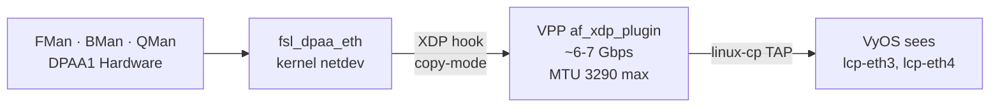
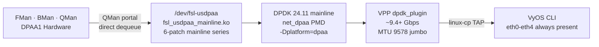
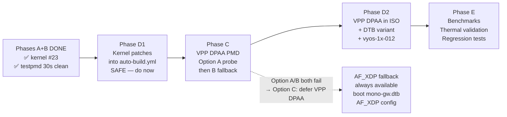

# DPAA1 DPDK PMD Build Plan: 10G Wire-Speed VPP on Mono Gateway

> **Status:** ✅ **Phase B COMPLETE**: testpmd runs clean on mainline kernel with custom USDPAA driver (2026-03-27)
>
> **Goal:** Replace AF_XDP (~6 to 7 Gbps, 3290 MTU cap) with the DPAA1 DPDK Poll Mode Driver for full 10G line rate (~9.4 Gbps, full jumbo 9578 MTU).
>
> **Key insight:** Both the kernel USDPAA driver and the DPDK DPAA1 PMD are **mainline**. No NXP forks needed anywhere in the stack. Our 6-patch kernel series + `fsl_usdpaa_mainline.c` provide the kernel-side USDPAA ABI. DPDK 24.11 mainline with `-Dplatform=dpaa` provides the userspace PMD. The entire path from silicon to VPP runs on upstream code.

---

## 🏆 Achievement Status (2026-03-27)

| Phase | Status | Description |
|-------|--------|-------------|
| Phase A: Kernel patches | ✅ Done | 6-patch series + `fsl_usdpaa_mainline.c` (1453 lines) applied to mainline 6.6.129 |
| Phase A: USDPAA driver | ✅ Done | `/dev/fsl-usdpaa` + `/dev/fsl-usdpaa-irq` chardevs working |
| Phase A: Kernel boot | ✅ Done | Kernel #23 boots clean, all 5 ethN appear, VyOS login works |
| Phase B: DPDK build | ✅ Done | DPDK 24.11.0 cross-compiled with `dpaa` platform, testpmd static binary (12.6MB) |
| Phase B: DPDK patch | ✅ Done | Portal mmap patch applied to `process.c` (CE=64KB WB-NS, CI=16KB Device-nGnRnE) |
| Phase B: testpmd run | ✅ Done | 30-second clean run, `Bye...` exit, no kernel panic |
| **Phase C: VPP integration** | ⬜ **Next** | VPP with DPDK dpaa_plugin — Option A probe then Option B fallback |
| **Phase D: CI/ISO integration** | ⬜ **Next** | Kernel patches into `auto-build.yml`, VPP DPAA in ISO |
| **Phase E: Benchmarks** | ⬜ Planned | Throughput, jumbo MTU, latency, thermal |

### Root Causes Found & Fixed (Phases A–B, 15 total)

| # | Root Cause | Fix |
|---|----------|-----|
| 1–12 | Various build/boot/portal issues | See git history |
| 13 | LXC 200 source mismatch — sed scripts didn't apply | SCP'd correct `fsl_usdpaa_mainline.c` directly |
| 14 | Restoring DPAA interfaces after DPDK crashes kernel | Reboot instead of `ip link set up` after testpmd |
| 15 | `qman_release_fqid()` → `qman_shutdown_fq()` → level 3 translation fault | Added `qman_free_fqid_range/pool_range/cgrid_range()` allocator-only frees |

### Kernel Patch Series (Final — all 6 patches stable)

| Patch | File | Changes |
|-------|------|---------|
| 0001 | `bman.c`, `bman_priv.h` | Export `bm_alloc_bpid_range`, `bm_release_bpid`, add `bm_free_bpid_range` |
| 0002 | `bman_portal.c`, `bman_priv.h` | BMan portal phys addr + reservation pool + CE memunmap |
| 0003 | `qman_portal.c`, `qman_priv.h` | QMan portal phys addr + reservation pool + CE memunmap |
| 0004 | `qman_ccsr.c`, `qman.c`, `qman_priv.h`, `qman.h` | Export `qman_set_sdest` + allocator-only free functions |
| 0005 | `Kconfig`, `Makefile` | `CONFIG_FSL_USDPAA_MAINLINE` + source file copied separately |
| 0006 | `mono-gateway-dk.dts` | 256MB reserved-memory at `0xc0000000` for DPDK DMA |

---

## Architecture: What Changes vs AF_XDP

### Current: AF_XDP (Working)



### Target: DPAA1 DPDK PMD



### What Changes

| Aspect | AF_XDP | DPAA PMD |
|--------|--------|----------|
| SFP+ MTU | **3290** (XDP hard cap) | **9578** (full jumbo) |
| Buffer copy | copy-mode | zero-copy |
| Packet path | `fsl_dpaa_eth` → XDP hook → VPP | USDPAA → DPDK PMD → VPP |
| VPP plugin | `af_xdp_plugin` | `dpdk_plugin` |
| DTS change needed | none | yes — SFP+ nodes → `fsl,dpa-ethernet-init` |
| Peak throughput | ~6–7 Gbps | ~9.4+ Gbps |

---

## ~~Superseded: Original Phases 1 through 4 (NXP Kernel Fork Approach)~~

> **These phases are SUPERSEDED. Do not follow them.**
>
> The original plan required the NXP kernel fork (`nxp-qoriq/linux lf-6.6.3-1.0.0`) because `fsl_usdpaa.c` used NXP-specific BMan/QMan APIs. That fork was 2,623 lines of `#ifdef` spaghetti covering 15+ SoC variants. We resolved this by writing `fsl_usdpaa_mainline.c` from scratch: 1453 lines that implement the same 20 NXP ioctls against **mainline** BMan/QMan APIs. Cleaner code, same ABI. The mainline kernel + our 6-patch series is now the production path. No NXP kernel fork, DPDK fork, or VPP fork is needed.
>
> See git history and [`plans/MAINLINE-PATCH-SPEC.md`](MAINLINE-PATCH-SPEC.md) for the full architecture rationale.

---

## Phase C: VPP DPDK Plugin Integration

> **Prerequisites:** Phase A + B complete (kernel #23 + testpmd 30s clean run). Gateway at 192.168.1.175 running VyOS with VPP v25.10.0-48 installed.

### Decision: Option A → Option B Fallback

The existing VPP on the gateway has a `dpdk_plugin.so` compiled against a specific DPDK version. The DPAA PMD components (`rte_bus_dpaa`, `rte_net_dpaa`, `rte_mempool_dpaa`) need to be available as shared libraries that VPP can load.

**Option A (try first):** Deploy our cross-compiled DPDK 24.11 shared libraries to the gateway. VPP's existing `dpdk_plugin.so` dynamically loads them at startup via `LD_LIBRARY_PATH` or `/etc/ld.so.conf.d/`. This works **only if** VPP's DPDK ABI version matches our 24.11 build.

**Option B (fallback):** Rebuild VPP from source against our DPAA-enabled DPDK. Produces `vpp-plugin-dpdk_<ver>_arm64.deb` with full DPAA support baked in. Guaranteed to work; more build complexity.

**Option C (defer — not recommended):** Skip VPP DPAA plugin entirely. Focus only on getting kernel patches into CI (Phase D1). AF_XDP continues to work. DPAA PMD deferred to a later milestone. Choose this only if Phase C proves intractable.

**Risk:** Option A depends on ABI match — do the probe in C.1 before spending build time on anything else.

---

### C.1 — ABI Compatibility Probe (Gate for Option A/B decision)

Run on the gateway. This 10-minute check determines which option to pursue.

```bash
ssh vyos@192.168.1.175 << 'EOF'
echo "=== VPP + DPDK package versions ==="
dpkg -l | grep -E '\b(vpp|dpdk)\b' | awk '{print $2, $3}'

echo ""
echo "=== dpdk_plugin.so location ==="
DPDK_PLG=$(find /usr/lib -name dpdk_plugin.so 2>/dev/null | head -1)
echo "dpdk_plugin.so: ${DPDK_PLG}"

echo ""
echo "=== DPDK ABI version required by dpdk_plugin.so ==="
readelf -d "${DPDK_PLG}" | grep -E 'NEEDED|SONAME'

echo ""
echo "=== DPDK libraries already on system ==="
find /usr/lib /usr/local/lib -name "librte_*.so*" 2>/dev/null | sort | head -30

echo ""
echo "=== VPP plugin directory ==="
ls /usr/lib/*/vpp_plugins/ 2>/dev/null | head -30
EOF
```

**Interpret the output:**
- If `NEEDED` shows `librte_bus_dpaa.so.24` (or `.23`) → our DPDK 24.11 shared libs ARE ABI-compatible → **proceed Option A**
- If `NEEDED` shows a version clearly below 23.11 → ABI mismatch → **go directly to Option B**
- If VPP was compiled with DPDK statically linked (no `librte_*.so` in `NEEDED`) → **go directly to Option B**

---

### C.2 — DTS Variant: Hand eth3/eth4 to DPDK

With DPAA PMD, VPP's DPDK plugin claims the SFP+ FMan ports directly from USDPAA. The kernel's `fsl_dpaa_eth` driver must **not** create netdevs for those ports — otherwise DPDK and the kernel fight over the same hardware.

The DPAA DTS mechanism: changing `compatible = "fsl,dpa-ethernet"` to `"fsl,dpa-ethernet-init"` marks the port as initialized but not owned by a kernel netdev. DPDK claims it via USDPAA.

Create [`data/dtb/mono-gateway-dk-usdpaa.dts`](../data/dtb/mono-gateway-dk-usdpaa.dts) by copying `mono-gateway-dk.dts` and changing **only** the two SFP+ ethernet nodes inside the `fsl,dpaa` bus:

```dts
/* In the fsl,dpaa bus section — find ethernet@8 and ethernet@9 */
/* (these correspond to FMan MAC8=fm1-mac9 and MAC9=fm1-mac10, the XFI SFP+ ports) */

/* Change FROM: */
ethernet@8 {
    compatible = "fsl,dpa-ethernet";    /* kernel fsl_dpaa_eth owns this */
    fsl,fman-mac = <&enet8>;
};
ethernet@9 {
    compatible = "fsl,dpa-ethernet";
    fsl,fman-mac = <&enet9>;
};

/* Change TO: */
ethernet@8 {
    compatible = "fsl,dpa-ethernet-init";  /* USDPAA marker — no kernel netdev */
    fsl,fman-mac = <&enet8>;
};
ethernet@9 {
    compatible = "fsl,dpa-ethernet-init";
    fsl,fman-mac = <&enet9>;
};
```

> **Note on port numbering:** In the DTS, `ethernet@8` = cell-index 8 = FMan MAC8 = `fm1-mac9` (FMan uses 1-based MAC numbering internally, DPDK uses that internal numbering). `ethernet@9` = `fm1-mac10`. Verify with `cat /sys/bus/platform/devices/*/of_node/cell-index` on a booted system.

Compile and deploy for TFTP testing:

```bash
# On LXC 200 (has dtc installed)
dtc -I dts -O dtb \
    data/dtb/mono-gateway-dk-usdpaa.dts \
    -o /srv/tftp/mono-gw-usdpaa.dtb

# OR compile on gateway directly:
ssh vyos@192.168.1.175 \
  "dtc -I dts -O dtb /tmp/mono-gateway-dk-usdpaa.dts -o /tmp/mono-gw-usdpaa.dtb"
```

Boot via U-Boot with the new DTB to verify:

```bash
# U-Boot: temporarily override DTB for this boot
# (at the setenv fdt_addr_r step in dev_boot, load mono-gw-usdpaa.dtb instead)
# Verify: eth3/eth4 should NOT appear as kernel netdevs
ssh vyos@192.168.1.175 'ip link show | grep -E "eth[34]"'
# Expected: NO eth3/eth4 lines (kernel gave them to USDPAA)

# fsl-usdpaa should still exist
ls -la /dev/fsl-usdpaa*
# Expected: /dev/fsl-usdpaa  /dev/fsl-usdpaa-irq
```

---

### C.3 — Build DPDK 24.11 as Shared Libraries

The existing `bin/build-dpdk.sh` builds a **static** testpmd binary (all PMDs compiled in). For VPP integration, we need **shared** libraries so VPP's `dpdk_plugin.so` can dlopen them.

On LXC 200, modify the meson setup call in `bin/build-dpdk.sh` (or run manually):

```bash
# SSH into LXC 200 via Proxmox
# On LXC 200:
cd /opt/vyos-dev/dpaa-pmd/src/dpdk
# Remove old static build
rm -rf build-shared
mkdir -p /opt/vyos-dev/dpaa-pmd/output/dpdk-shared

export PKG_CONFIG_LIBDIR=/usr/lib/aarch64-linux-gnu/pkgconfig:/usr/share/pkgconfig
export PKG_CONFIG_SYSROOT_DIR=

meson setup build-shared \
  --cross-file /opt/vyos-dev/dpaa-pmd/dpdk-cross.ini \
  --prefix=/opt/vyos-dev/dpaa-pmd/output/dpdk-shared \
  -Ddefault_library=shared \
  -Dmax_lcores=4 \
  -Dkernel_dir=/opt/vyos-dev/linux \
  -Denable_kmods=false \
  -Dtests=false \
  -Dexamples= \
  -Ddisable_drivers=net/mlx*,net/bnxt,net/ixg*,net/ice,net/i40e,net/e1000,crypto/qat,net/virtio,net/vmxnet*,net/ena,net/hns*,net/hinic,net/octeontx*,net/cnxk,net/thunderx

ninja -C build-shared -j$(nproc)
ninja -C build-shared install
echo "=== Shared DPAA libraries ==="
find /opt/vyos-dev/dpaa-pmd/output/dpdk-shared -name "*dpaa*.so*" | sort
```

Verify the critical shared objects exist:

```bash
# On LXC 200:
OUTDIR=/opt/vyos-dev/dpaa-pmd/output/dpdk-shared
for lib in librte_bus_dpaa librte_net_dpaa librte_mempool_dpaa librte_event_dpaa; do
  f=$(find ${OUTDIR} -name "${lib}.so*" | head -1)
  echo "${lib}: ${f:-MISSING}"
done
```

Package for deployment:

```bash
# On LXC 200:
cd /opt/vyos-dev/dpaa-pmd/output/dpdk-shared
tar czf /srv/tftp/dpdk-dpaa-shared-arm64.tar.gz lib/
echo "Packaged: $(du -sh /srv/tftp/dpdk-dpaa-shared-arm64.tar.gz | cut -f1)"
```

---

### C.4 — Option A: Deploy Shared Libs + Test VPP

> **Only proceed here if C.1 ABI probe showed a compatible version.**

Deploy the shared libraries to the gateway and probe whether VPP's existing `dpdk_plugin.so` can load the DPAA PMD:

```bash
# Deploy shared DPDK libs to gateway
scp admin@192.168.1.137:/srv/tftp/dpdk-dpaa-shared-arm64.tar.gz /tmp/
ssh vyos@192.168.1.175 "sudo bash -c '
mkdir -p /opt/dpaa-dpdk
tar -xzf /tmp/dpdk-dpaa-shared-arm64.tar.gz -C /opt/dpaa-dpdk
# Add to library path
echo /opt/dpaa-dpdk/lib > /etc/ld.so.conf.d/dpaa-dpdk.conf
ldconfig
echo Done — DPAA DPDK shared libs installed
'"

# Verify the DPAA libs are now visible to the dynamic linker
ssh vyos@192.168.1.175 "ldconfig -p | grep -E 'dpaa|dpdk' | head -20"

# Quick dlopen probe — can the linker resolve DPAA symbols from dpdk_plugin?
ssh vyos@192.168.1.175 "sudo bash -c '
ldd /usr/lib/*/vpp_plugins/dpdk_plugin.so | grep -E \"dpaa|not found\"
'"
# Looking for: all librte_*dpaa*.so.* → resolved (not \"not found\")
# If any show \"not found\" → Option A fails, go to Option B
```

If Option A probe passes (no "not found"):

```bash
# Stop VPP and VyOS config daemon to avoid conflicts
ssh vyos@192.168.1.175 "sudo systemctl stop vpp 2>/dev/null; sudo pkill -x vpp 2>/dev/null; true"

# Write a minimal startup.conf for DPAA PMD mode
# NOTE: eth3/eth4 must already be removed from kernel (C.2 DTS loaded first)
ssh vyos@192.168.1.175 "sudo tee /tmp/startup-dpaa.conf" << 'EOF'
unix {
  nodaemon
  log /var/log/vpp/vpp-dpaa.log
  cli-listen /run/vpp/cli.sock
  gid vpp
}

cpu {
  main-core 0
  workers 0
}

memory {
  main-heap-size 256M
  main-heap-page-size default-hugepage
}

buffers {
  buffers-per-numa 16384
  default data-size 2048
  page-size default-hugepage
}

dpdk {
  dev dpaa,fm1-mac9 {
    num-rx-queues 1
    num-tx-queues 1
  }
  dev dpaa,fm1-mac10 {
    num-rx-queues 1
    num-tx-queues 1
  }
  no-pci
}

plugins {
  plugin default { disable }
  plugin dpdk_plugin.so { enable }
  plugin linux_cp_plugin.so { enable }
  plugin linux_nl_plugin.so { enable }
  plugin ping_plugin.so { enable }
  plugin acl_plugin.so { enable }
}

linux-cp {
  lcp-sync
}
EOF

# Start VPP directly with new config (not via VyOS systemd)
ssh vyos@192.168.1.175 "sudo vpp -c /tmp/startup-dpaa.conf &"
sleep 15

# Gate test
ssh vyos@192.168.1.175 "sudo vppctl show interface"
# Expected: dpaa-fm1-mac9 and dpaa-fm1-mac10 in the interface table

ssh vyos@192.168.1.175 "sudo vppctl show hardware-interfaces"
# Expected: driver type = dpaa (NOT af_xdp)

ssh vyos@192.168.1.175 "sudo vppctl show plugins | grep dpdk"
# Expected: dpdk_plugin loaded
```

**Option A PASS criteria:** `vppctl show hardware-interfaces` shows `driver=dpaa` for both SFP+ ports. No VPP crash within 30 seconds.

**Option A FAIL indicators:**
- `dpdk_plugin.so: undefined symbol` → ABI mismatch → go to Option B
- `rte_dev_probe: unknown device` → DPAA bus not probing → check LD_LIBRARY_PATH
- VPP segfault/crash → mismatch or missing USDPAA DTB → check C.2 boot

---

### C.5 — Option B: Rebuild VPP Against DPAA DPDK

> **Only needed if Option A fails.** Skip here if C.4 passed.

VPP must be rebuilt against our DPAA-enabled DPDK 24.11. The version must match what VyOS ships (`v25.10.0-48` based on current install). Build on LXC 200.

```bash
# Create build script for VPP — deploy to LXC 200
cat > bin/build-vpp-dpaa.sh << 'BUILDSCRIPT'
#!/bin/bash
# Build VPP with DPAA DPDK plugin for ARM64
# Run on LXC 200: cd /opt/vyos-dev && ./build-vpp-dpaa.sh <phase>
set -euo pipefail

WORKDIR="/opt/vyos-dev/dpaa-pmd"
VPP_SRC="${WORKDIR}/src/vpp"
DPDK_OUT="${WORKDIR}/output/dpdk-shared"
DEBS_OUT="${WORKDIR}/debs"

VPP_VERSION="v25.06"  # Adjust to match: dpkg -l vpp on gateway | head -2

phase_clone() {
    echo "=== Clone VPP ${VPP_VERSION} ==="
    mkdir -p "${WORKDIR}/src"
    [ -d "${VPP_SRC}/.git" ] && { echo "Already cloned"; return; }
    git clone --depth=1 -b "${VPP_VERSION}" https://gerrit.fd.io/r/vpp "${VPP_SRC}"
    echo "Cloned VPP $(git -C ${VPP_SRC} describe --tags)"
}

phase_deps() {
    echo "=== Install VPP build deps ==="
    # VPP's build system installs its own deps via install_deps.sh
    cd "${VPP_SRC}"
    make install-dep
    apt-get install -y crossbuild-essential-arm64 || true
}

phase_build() {
    echo "=== Build VPP dpdk_plugin against our DPAA DPDK ==="
    cd "${VPP_SRC}"
    mkdir -p "${DEBS_OUT}"

    # Point VPP to our DPAA-enabled DPDK
    # VPP's cmake picks up DPDK via pkg-config
    export PKG_CONFIG_PATH="${DPDK_OUT}/lib/pkgconfig:${PKG_CONFIG_PATH:-}"
    export DPDK_PATH="${DPDK_OUT}"

    # Cross-compile ARM64 .deb packages
    # VPP's package build uses dpkg-buildpackage under the hood
    make CROSS_PREFIX=aarch64-linux-gnu- \
         DPDK_PATH="${DPDK_OUT}" \
         V=0 vpp-package-deb 2>&1 | tee "${WORKDIR}/vpp-build.log"

    # Collect .deb packages
    find "${VPP_SRC}/build-root" -name "vpp*.deb" -exec cp {} "${DEBS_OUT}/" \;
    echo "=== Packages built ==="
    ls -lh "${DEBS_OUT}/"*.deb 2>/dev/null || echo "No .deb files found — check vpp-build.log"
}

case "${1:-all}" in
  clone) phase_clone ;;
  deps)  phase_clone && phase_deps ;;
  build) phase_build ;;
  all)   phase_clone && phase_deps && phase_build ;;
  *) echo "Usage: $0 {clone|deps|build|all}"; exit 1 ;;
esac
BUILDSCRIPT
chmod +x bin/build-vpp-dpaa.sh
```

Deploy and run on LXC 200:

```bash
# On LXC 200:
cd /opt/vyos-dev && ./build-vpp-dpaa.sh all

# Retrieve built .deb files from LXC 200
scp root@192.168.1.137:/opt/vyos-dev/dpaa-pmd/debs/vpp-plugin-dpdk*arm64.deb /tmp/

# Deploy custom dpdk plugin to gateway
scp /tmp/vpp-plugin-dpdk*arm64.deb vyos@192.168.1.175:/tmp/
ssh vyos@192.168.1.175 "sudo dpkg -i /tmp/vpp-plugin-dpdk*arm64.deb"

# Re-run C.4 startup.conf test
```

> **If VPP build fails:** VPP's CMake build is complex. Common issues: `meson` version mismatch, VPP's internal DPDK detection ignoring our `DPDK_PATH`. Alternative: install the `vpp-dev` package as a build dependency and rebuild only `vpp-plugin-dpdk` against our shared DPDK — smaller scope than rebuilding all of VPP. Check `${WORKDIR}/vpp-build.log` for specifics.

---

### C.6 — `startup.conf` for DPAA PMD Mode

The [`data/scripts/startup.conf`](../data/scripts/startup.conf) is the reference config deployed to `/etc/vpp/startup.conf` on installed systems. Add a DPAA variant:

**`data/scripts/startup.conf.dpaa`** (new file):

```
unix {
  nodaemon
  log /var/log/vpp/vpp.log
  full-coredump
  cli-listen /run/vpp/cli.sock
  gid vpp
  # No poll-sleep-usec here — DPAA PMD uses adaptive rx (interrupt at idle)
}

api-trace { on }
api-segment { gid vpp }
socksvr { default }

cpu {
  main-core 0
  workers 0      # Main-thread-only. Add workers after thermal validation.
}

memory {
  main-heap-size 256M
  main-heap-page-size default-hugepage
}

buffers {
  buffers-per-numa 16384
  default data-size 2048
  page-size default-hugepage
}

dpdk {
  dev dpaa,fm1-mac9 {           ## SFP+ left  (eth3 in udev naming)
    num-rx-queues 1
    num-tx-queues 1
  }
  dev dpaa,fm1-mac10 {          ## SFP+ right (eth4 in udev naming)
    num-rx-queues 1
    num-tx-queues 1
  }
  no-pci                        ## No PCI devices — DPAA platform bus only
}

plugins {
  plugin default { disable }
  plugin dpdk_plugin.so { enable }        ## primary: DPAA PMD
  plugin af_xdp_plugin.so { disable }     ## disabled in DPAA mode
  plugin linux_cp_plugin.so { enable }
  plugin linux_nl_plugin.so { enable }
  plugin ping_plugin.so { enable }
  plugin acl_plugin.so { enable }
  plugin nat44_ei_plugin.so { enable }
  plugin cnat_plugin.so { enable }
  plugin crypto_sw_scheduler_plugin.so { enable }
}

linux-cp {
  lcp-sync
}
```

> **`poll-sleep-usec` removed:** DPAA PMD in VPP uses `adaptive` rx-mode — it idles to interrupt when no packets arrive. This is unlike AF_XDP where poll-sleep-usec 100 was mandatory to prevent thermal shutdown. Monitor temperatures during C.7 validation and add it back if needed.

> **`no-pci`:** Critical. Without this, VPP scans PCI buses and may try to bind non-existent PCI NICs. With DPAA devices only, PCI scan is pointless and potentially harmful.

---

### C.7 — VPP DPAA Gate Test

Boot with the USDPAA DTB from C.2. Run VPP with DPAA `startup.conf`. Verify:

```bash
# 1. eth3/eth4 are NOT kernel netdevs (given to DPDK)
ip link show | grep -E "eth[34]"
# Expected: no output (DPAA-owned ports invisible to kernel)

# 2. USDPAA devices exist
ls -la /dev/fsl-usdpaa*
# Expected: /dev/fsl-usdpaa  /dev/fsl-usdpaa-irq

# 3. VPP sees DPAA interfaces
sudo vppctl show interface
# Expected output includes:
#   dpaa-fm1-mac9   1  up   0/0/0/0    <-- SFP+ eth3
#   dpaa-fm1-mac10  2  up   0/0/0/0    <-- SFP+ eth4

# 4. Hardware driver is dpaa (NOT af_xdp)
sudo vppctl show hardware-interfaces
# Expected: driver field shows dpaa

# 5. linux-cp TAP mirrors present (VyOS CLI visibility)
sudo vppctl show lcp
# Expected: lcp-eth3 and lcp-eth4 TAP pairs

# 6. eth3/eth4 visible via linux-cp
ip link show | grep -E "lcp-eth[34]"
# Expected: lcp-eth3 and lcp-eth4 TAP devices

# 7. MTU — the key improvement over AF_XDP
sudo vppctl set interface mtu 9578 dpaa-fm1-mac9
sudo vppctl show interface dpaa-fm1-mac9
# Expected: MTU 9578 — impossible on AF_XDP (3290 max)

# 8. No VPP crash after 60 seconds
sleep 60 && sudo vppctl show version
# Expected: version string returned (no crash/restart)
```

**Phase C PASS → proceed to Phase D.**
**Phase C FAIL → return to C.4/C.5 with log evidence.**

---

## Phase D: CI / ISO Integration

Phase D has two independent sub-phases. **D1 is safe to do NOW, regardless of Phase C status.** D2 depends on Phase C outcome.

---

### D.1 — Kernel Patches into `auto-build.yml` (Do First, Independent)

The 6 kernel patches and the USDPAA driver C source already exist in [`data/kernel-patches/`](../data/kernel-patches/). They need to be applied during the VyOS kernel package build in CI.

**Changes to [`.github/workflows/auto-build.yml`](../.github/workflows/auto-build.yml):**

#### Step 1: Add `CONFIG_FSL_USDPAA_MAINLINE=y` to the kernel config printf block

Find the existing `printf` block (lines ~143–184) and append:

```yaml
            '# === DPAA1 USDPAA mainline userspace portal driver ===' \
            'CONFIG_FSL_USDPAA_MAINLINE=y' \
```

#### Step 2: Add linux-kernel pre_build_hook staging + package.toml

Immediately after the `VYOS1X_BUILD` block in the "Fix vyos-build" step, add:

```yaml
          ### linux-kernel patches — DPAA1 USDPAA mainline driver (6 patches)
          LKBUILD=vyos-build/scripts/package-build/linux-kernel
          KPATCH_STAGING="${LKBUILD}/ls1046a-kpatches"
          mkdir -p "${KPATCH_STAGING}"
          cp data/kernel-patches/0001-*.patch "${KPATCH_STAGING}/"
          cp data/kernel-patches/0002-*.patch "${KPATCH_STAGING}/"
          cp data/kernel-patches/0003-*.patch "${KPATCH_STAGING}/"
          cp data/kernel-patches/0004-*.patch "${KPATCH_STAGING}/"
          cp data/kernel-patches/0005-*.patch "${KPATCH_STAGING}/"
          cp data/kernel-patches/0006-*.patch "${KPATCH_STAGING}/"
          cp data/kernel-patches/fsl_usdpaa_mainline.c "${KPATCH_STAGING}/"

          # Create/overwrite the linux-kernel package.toml to add pre_build_hook
          # IMPORTANT: This overwrites the upstream package.toml for linux-kernel.
          # Inspect the upstream file first and preserve any existing fields.
          LKPKG="${LKBUILD}/package.toml"
          # Append pre_build_hook using heredoc — preserves any existing [[packages]] header
          # If package.toml already exists, we need to edit it carefully.
          # Safest: use sed to add a pre_build_hook after the [packages] table.
          # Check if pre_build_hook already exists:
          if ! grep -q 'pre_build_hook' "${LKPKG}" 2>/dev/null; then
            # Inject a pre_build_hook block after the first [[packages]] line
            python3 - << 'PYEOF'
import re
with open("${LKPKG}") as f:
    content = f.read()

hook = '''
pre_build_hook = """
  set -ex
  # Copy USDPAA mainline driver source into kernel staging tree
  KSTAGE=../ls1046a-kpatches
  mkdir -p drivers/staging/fsl_usdpaa
  cp \${KSTAGE}/fsl_usdpaa_mainline.c drivers/staging/fsl_usdpaa/
  # Apply patches in order (0001-0005: export symbols + USDPAA driver Kconfig/Makefile)
  for p in \${KSTAGE}/0001-*.patch \${KSTAGE}/0002-*.patch \${KSTAGE}/0003-*.patch \\
            \${KSTAGE}/0004-*.patch \${KSTAGE}/0005-*.patch; do
    patch --no-backup-if-mismatch -p1 < "\$p"
  done
  # 0006: DTS reserved-memory — applied to arch/arm64/boot/dts/freescale/
  patch --no-backup-if-mismatch -p1 < \${KSTAGE}/0006-*.patch || true
"""
'''

# Insert after the first [[packages]] declaration
content = re.sub(r'(\[\[packages\]\][^\n]*\n)', r'\1' + hook, content, count=1)
with open("${LKPKG}", 'w') as f:
    f.write(content)
print("Injected pre_build_hook into", "${LKPKG}")
PYEOF
          fi
```

> **⚠️ Important:** The exact mechanism for injecting the `pre_build_hook` into the linux-kernel `package.toml` depends on the upstream vyos-build structure at build time. The Python `sed` approach above is a template — inspect the actual `${LKPKG}` file in CI (add a `cat` debug step) to confirm the TOML structure before finalizing.

> **Alternative (simpler):** Apply the 6 kernel patches directly as inline `patch` commands in the "Fix vyos-build" step, targeting the kernel source checkout path. This avoids package.toml complexity but requires knowing where vyos-build checks out the kernel source during the build.

#### Step 3: Verify CONFIG_FSL_USDPAA_MAINLINE appears in built kernel

Add a smoke-check step after the kernel build completes:

```yaml
      - name: Verify USDPAA kernel config
        run: |
          # Verify the USDPAA symbol appeared in the kernel
          # The built kernel .config should be in the linux-kernel package artifacts
          find vyos-build -name '.config' -path '*/linux*' | head -1 | \
            xargs grep -l 'CONFIG_FSL_USDPAA_MAINLINE' 2>/dev/null || \
            echo "WARNING: CONFIG_FSL_USDPAA_MAINLINE not found in built .config"
```

---

### D.2 — USDPAA DTB in ISO

Ship the USDPAA DTS variant alongside the standard DTB so users can TFTP-test or switch to DPAA PMD mode without rebuilding.

In the "Fix vyos-build" step (same block as the `mono-gw.dtb` copy at line ~209):

```yaml
          ### USDPAA DTB variant: eth3/eth4 as fsl,dpa-ethernet-init (DPDK-owned)
          # Ship alongside mono-gw.dtb — users boot with this to enable DPAA PMD mode
          if [ -f data/dtb/mono-gw-usdpaa.dtb ]; then
            cp data/dtb/mono-gw-usdpaa.dtb "${CHROOT}/boot/mono-gw-usdpaa.dtb"
            cp data/dtb/mono-gw-usdpaa.dtb vyos-build/data/live-build-config/includes.binary/mono-gw-usdpaa.dtb
            echo "Included mono-gw-usdpaa.dtb in ISO"
          else
            echo "WARNING: mono-gw-usdpaa.dtb not found — DPAA PMD DTB not included"
          fi
```

> `data/dtb/mono-gw-usdpaa.dtb` is a binary blob committed to the repo (like `mono-gw.dtb`). Build it from `mono-gateway-dk-usdpaa.dts` and commit. Use `git lfs track "*.dtb"` if size is a concern (DTBs are typically ~100KB).

---

### D.3 — VPP DPAA Plugin in ISO (Phase C outcome dependent)

**If Phase C Option A succeeded** (VPP loads existing dpdk_plugin.so + our shared DPDK libs):

Add DPDK shared libraries as ISO binary includes. These are built on LXC 200 and committed as a tarball:

```yaml
          ### DPAA DPDK shared libraries for VPP dpdk_plugin (Option A path)
          if [ -f data/dpdk/dpdk-dpaa-shared-arm64.tar.gz ]; then
            mkdir -p "${CHROOT}/opt/dpaa-dpdk"
            tar -xzf data/dpdk/dpdk-dpaa-shared-arm64.tar.gz \
                -C "${CHROOT}/opt/dpaa-dpdk/"
            echo "/opt/dpaa-dpdk/lib" > \
                "${CHROOT}/etc/ld.so.conf.d/dpaa-dpdk.conf"
            echo "Included DPAA DPDK shared libs in ISO"
          fi
```

**If Phase C Option B succeeded** (rebuilt VPP with DPAA support):

Replace the VPP dpdk_plugin package in the ISO with our custom build:

```yaml
          ### Custom VPP dpdk_plugin with DPAA support (Option B path)
          if ls data/dpdk/vpp-plugin-dpdk*arm64.deb 1>/dev/null 2>&1; then
            cp data/dpdk/vpp-plugin-dpdk*arm64.deb "${CHROOT}/tmp/"
            # Chroot hook to install custom package over upstream VPP dpdk plugin
            cat > "${HOOKS}/97-vpp-dpaa-plugin.chroot" << 'VPPHOOK'
            #!/bin/bash
            dpkg -i /tmp/vpp-plugin-dpdk*arm64.deb || true
            rm -f /tmp/vpp-plugin-dpdk*arm64.deb
            apt-get clean
VPPHOOK
            chmod +x "${HOOKS}/97-vpp-dpaa-plugin.chroot"
            echo "Included custom DPAA VPP dpdk_plugin in ISO"
          fi
```

---

### D.4 — New vyos-1x Patch: DPAA PMD Detection in `vpp.py`

Create `data/vyos-1x-012-dpaa-pmd.patch` to make `set vpp settings interface eth3` auto-switch to DPAA PMD mode when USDPAA is present.

This patch modifies [`src/conf_mode/vpp.py`](../data/vyos-1x-010-vpp-platform-bus.patch) in the vyos-1x repo. It builds on top of patch 010 (which added `fsl_dpa` to `platform_bus_xdp_drivers`):

```diff
--- a/src/conf_mode/vpp.py
+++ b/src/conf_mode/vpp.py
@@ -25,6 +25,10 @@
+import os as _os
+
+# DPAA DPDK PMD is available when the mainline USDPAA kernel driver is present
+USDPAA_DEVICE = '/dev/fsl-usdpaa'
+_dpaa_pmd_available = _os.path.exists(USDPAA_DEVICE)
+
 # drivers that does not use PCIe addresses
 not_pci_drv: list[str] = ['hv_netvsc', 'fsl_dpa']
 
-# drivers on platform bus that must use XDP (not DPDK)
-platform_bus_xdp_drivers: list[str] = ['fsl_dpa']
+# If USDPAA is available, fsl_dpaa_eth ports use DPDK PMD (not XDP)
+# Otherwise fall back to AF_XDP (original patch 010 behavior)
+if _dpaa_pmd_available:
+    platform_bus_xdp_drivers: list[str] = []   # fsl_dpa → dpdk path
+    platform_bus_dpdk_drivers: list[str] = ['fsl_dpa']
+else:
+    platform_bus_xdp_drivers: list[str] = ['fsl_dpa']  # AF_XDP fallback
+    platform_bus_dpdk_drivers: list[str] = []
```

And in the `startup.conf.j2` template, add the `dpdk { }` stanza for DPAA devices:

```diff
--- a/data/templates/vpp/startup.conf.j2
+++ b/data/templates/vpp/startup.conf.j2
@@ -76,4 +76,14 @@
+
+
+
+
+
+dpdk {
+
+
+    dev {{ iface_config.dpaa_options.dev_id }} {
+        num-rx-queues 1
+        num-tx-queues 1
+    }
+
+
+    no-pci
+}
+
```

> The `dpaa_options.dev_id` value (e.g. `dpaa,fm1-mac9`) must be resolved from the interface's FMan MAC address. The FMan cell-index is readable from `/sys/bus/platform/devices/<addr>.ethernet/of_node/cell-index`. This mapping logic needs to be added to `vpp.py`'s interface enumeration.

> **Also patch `MANAGED_PARAMS`** in `python/vyos/system/system_option.py` to add `bportals=` and `qportals=` so the kexec double-boot prevention includes those parameters.

---

### D.5 — U-Boot Bootargs Additions (for DPAA PMD mode)

The U-Boot bootargs need two additions for DPAA userspace portals. These go into `data/scripts/vyos-postinstall` (the `UBOOT_BOOTARGS_TAIL` variable) and into `MANAGED_PARAMS` in `system_option.py` patch:

```bash
# Add to UBOOT_BOOTARGS_TAIL in vyos-postinstall:
bportals=s0 qportals=s0
# (iommu.passthrough=1 may also be needed if PAMU blocks DMA — test first)
```

```
# Add to MANAGED_PARAMS in system_option.py patch:
bportals qportals
```

---

## Phase E: Benchmarks and Hardening

> **Prerequisites:** Phase C + D1 + D2 complete. DPAA PMD running in VPP on installed system (not TFTP boot). AF_XDP still available as reference via standard DTB.

### E.1 — Establish AF_XDP Baseline First

Before switching to DPAA PMD, record the AF_XDP baseline so we have apples-to-apples comparison. Boot with standard DTB (`mono-gw.dtb`), AF_XDP VPP config:

```bash
# On link partner (separate machine on eth3 or eth4)
iperf3 -s

# On gateway — measure AF_XDP baseline
# Standard MTU 1500
iperf3 -c <partner-ip> -t 30 -P 4 -b 10G \
  | tee /tmp/baseline-afxdp-1500.txt

# Maximum AF_XDP MTU (3290 — the known ceiling)
ip link set eth3 mtu 3290
iperf3 -c <partner-ip> -t 30 -P 4 -b 10G -M 3290 \
  | tee /tmp/baseline-afxdp-3290.txt

# Record temperatures during test
cat /sys/class/thermal/thermal_zone3/temp  # core-cluster temp (milli-°C)
```

### E.2 — MTU Capability Verification (Critical DPAA Improvement)

Boot with USDPAA DTB. VPP running with dpdk_plugin/DPAA PMD.

```bash
# Set jumbo MTU — this was impossible under AF_XDP (max 3290)
sudo vppctl set interface mtu 9578 dpaa-fm1-mac9
sudo vppctl set interface mtu 9578 dpaa-fm1-mac10

# Verify via linux-cp TAP
ip link show lcp-eth3
# Expected: mtu 9578

# Ping with large frames (requires partner NIC to also support jumbo)
ping -M do -s 8000 <partner-ip>           # 8000B payload + 28B ICMP = 8028B frame
ping -M do -s 9550 <partner-ip>           # Near-max jumbo
```

### E.3 — Throughput Benchmarks

```bash
# === Standard MTU (1500B) — compare to AF_XDP baseline ===
iperf3 -c <partner-ip> -t 30 -P 4 -b 10G \
  | tee /tmp/dpaa-pmd-1500.txt
# Target: > 9 Gbps (vs ~6–7 Gbps AF_XDP)

# === Jumbo MTU (9000B) — new DPAA capability ===
iperf3 -c <partner-ip> -t 30 -P 4 -b 10G -M 9000 \
  | tee /tmp/dpaa-pmd-9000.txt
# Target: ~9.4 Gbps (jumbo reduces per-packet overhead)

# === Small packet / PPS test ===
iperf3 -c <partner-ip> -t 30 -P 8 -u -b 1G -l 64 \
  | tee /tmp/dpaa-pmd-64b-pps.txt
# Target: > 8 Mpps (vs ~4–5 Mpps AF_XDP)

# === Bidirectional (simultaneous rx+tx) ===
iperf3 -c <partner-ip> -t 30 -P 4 -b 10G --bidir \
  | tee /tmp/dpaa-pmd-bidir.txt
```

### E.4 — CPU and Thermal Validation

```bash
# Monitor during iperf3 run
watch -n 2 '
  echo "=== CPU temp ===";
  cat /sys/class/thermal/thermal_zone3/temp | awk "{printf \"%.1f C\n\", \$1/1000}";
  echo "=== VPP runtime ===";
  vppctl show runtime 2>/dev/null | head -10;
  echo "=== Fan RPM ===";
  cat /sys/class/hwmon/hwmon3/fan1_input 2>/dev/null || echo "fan: N/A"
'
# Target: CPU temp < 65°C during sustained 10G load with fancontrol active
```

### E.5 — Functional Regression Testing

Verify that switching between DPAA PMD and AF_XDP modes is clean:

```bash
# Test 1: VyOS native CLI still works with DPAA PMD
configure
set interfaces ethernet eth3 address 10.99.0.1/24   # routed via linux-cp TAP
commit
ping 10.99.0.2                                        # ICMP via VPP
show interfaces ethernet eth3                         # VyOS sees port via lcp

# Test 2: AF_XDP fallback — boot with standard mono-gw.dtb
# (eth3/eth4 reappear as kernel netdevs under fsl_dpaa_eth)
# Then `set vpp settings interface eth3` and restart VPP
# Expected: AF_XDP mode works exactly as before

# Test 3: eth0–eth2 (RJ45) unaffected by DPAA PMD mode
ping 192.168.1.1 -I eth0     # management still works
show interfaces ethernet eth0  # kernel-managed, unaffected
```

### E.6 — Result Documentation

Populate this table after running benchmarks:

| Metric | AF_XDP baseline | DPAA PMD result | Delta |
|--------|----------------|-----------------|-------|
| iperf3 TCP 1500MTU 4-stream | ? Gbps | ? Gbps | +?% |
| iperf3 TCP 9000MTU 4-stream | N/A (MTU cap) | ? Gbps | NEW |
| 64B UDP PPS | ? Mpps | ? Mpps | +?× |
| Max usable SFP+ MTU | **3290** | **9578** | +191% |
| CPU temp at 10G load | ?°C | ?°C | ?°C |
| VPP main-core idle % | ? | ? | ? |

---

## Risk Register (Phases C/D/E)

| Risk | Impact | Mitigation |
|------|--------|------------|
| **VPP dpdk_plugin ABI mismatch** | Option A fails, must rebuild VPP | Run C.1 ABI probe first. Option B is fully specified fallback. |
| **DPAA bus probe fails in VPP** | `rte_dev_probe: unknown device` | Check DTB has `fsl,dpa-ethernet-init` on SFP+ nodes; check USDPAA portal count matches PMD expectation |
| **VPP crash with DPAA PMD** | Data plane down | Capture VPP logs + `dmesg`; check if portal mmap patch applied correctly to DPDK shared libs |
| **kexec double-boot with new bootargs** | Extra reboot on first DPAA boot | Add `bportals qportals` to `MANAGED_PARAMS` in `system_option.py` patch (D.4) |
| **Kernel patch 0006 DTS conflict** | Patch fails if DTS line numbers changed | Use `grep -n` to verify context before applying; patch uses content not line numbers with `-p1` |
| **linux-kernel package.toml unknown structure** | CI patch injection fails | Add `cat` debug step; use `grep -A10 packages` to inspect structure before modifying |
| **DPAA PMD thermal (no poll-sleep-usec)** | SoC overheats if DPAA is always-polling | Monitor E.4 carefully; if temp > 65°C, add `poll-sleep-usec 100` to DPAA startup.conf |
| **fsl_usdpaa_mainline.c path in kernel tree** | Patch 0005 fails (wrong directory) | Patch 0005's `new file mode` line gives the target path — match exactly in pre_build_hook cp |
| **VPP rebuild CMake complexity** | Option B build fails | Time-box to 4h. If failing, commit test-proven shared DPDK libs as binary blob instead. |
| **iso binary size increase** | DPDK .so files (~40MB) exceed runner disk | Use `dpkg -l | grep vpp-plugin-dpdk` to check if VyOS already ships DPDK .so; may be redundant |
| **DPAA MTU 9578 needs partner NIC config** | Benchmark can't test jumbo end-to-end | Partner NIC also needs `ip link set dev <nic> mtu 9578`. Jumbo can fail silently if partner silently drops |

---

## Phased Gate Summary



**Gate conditions:**
- A+B → D1: ✅ **PASSED** — start D1 now
- D1 → C: ⬜ D1 complete (kernel patches in CI)
- C → D2: ⬜ C.7 pass — `vppctl show hardware-interfaces` shows dpaa driver
- D2 → E: ⬜ D2 complete — DPAA ISO boots, all 5 VyOS interfaces functional
- E → done: ⬜ E.6 table populated, thermal safe, AF_XDP regression passes

---

## Deliverables Summary

| File | Status | Purpose |
|------|--------|---------|
| `data/kernel-patches/0001–0006-*.patch` | ✅ Exists | Kernel patch series |
| `data/kernel-patches/fsl_usdpaa_mainline.c` | ✅ Exists | USDPAA kernel driver (1453 lines) |
| `data/dpdk-portal-mmap.patch` | ✅ Exists | DPDK `process.c` portal mmap fix |
| `data/dtb/mono-gateway-dk-usdpaa.dts` | ⬜ **TODO C.2** | USDPAA DTS — SFP+ as `fsl,dpa-ethernet-init` |
| `data/dtb/mono-gw-usdpaa.dtb` | ⬜ **TODO C.2** | Compiled USDPAA DTB binary |
| `data/scripts/startup.conf.dpaa` | ⬜ **TODO C.6** | DPAA PMD VPP config reference |
| `bin/build-vpp-dpaa.sh` | ⬜ **TODO C.5** | VPP rebuild script (if Option B needed) |
| `data/vyos-1x-012-dpaa-pmd.patch` | ⬜ **TODO D.4** | `vpp.py` DPAA PMD auto-detection |
| `.github/workflows/auto-build.yml` | ⬜ **TODO D.1** | Kernel patches + `CONFIG_FSL_USDPAA_MAINLINE=y` |
| `data/dpdk/dpdk-dpaa-shared-arm64.tar.gz` | ⬜ **TODO D.3-A** | DPDK shared libs binary blob (Option A) |
| `data/dpdk/vpp-plugin-dpdk*arm64.deb` | ⬜ **TODO D.3-B** | Custom VPP plugin .deb (Option B) |

---

## See Also

- [`VPP.md`](../VPP.md) — Current AF_XDP implementation details and CLI reference
- [`plans/MAINLINE-PATCH-SPEC.md`](MAINLINE-PATCH-SPEC.md) — Full 6-patch design spec and symbol audit
- [`plans/USDPAA-IOCTL-SPEC.md`](USDPAA-IOCTL-SPEC.md) — Complete NXP ioctl ABI (20 ioctls, all structs)
- [`PORTING.md`](../PORTING.md) — DPAA1 driver archaeology, kernel history
- [`UBOOT.md`](../UBOOT.md) — U-Boot memory map, DTB loading, `fw_setenv`
- [`plans/DEV-LOOP.md`](DEV-LOOP.md) — TFTP fast iteration loop
