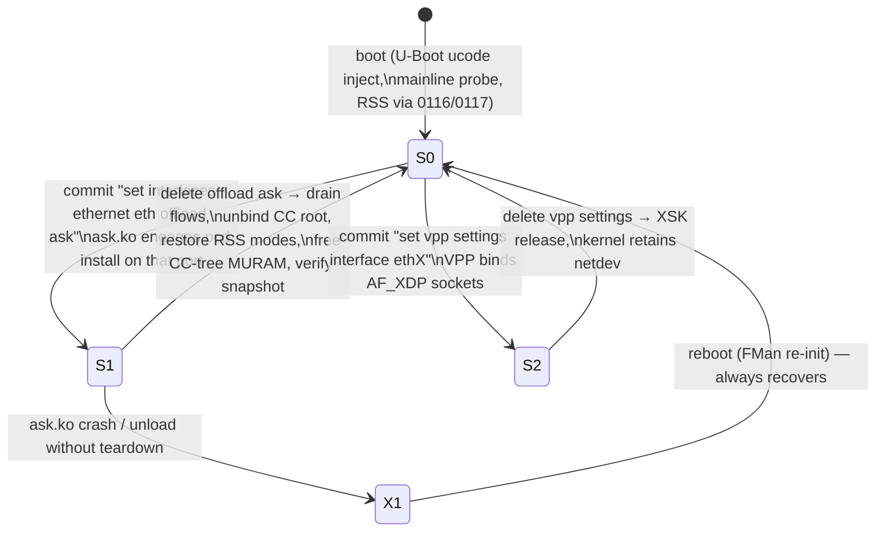
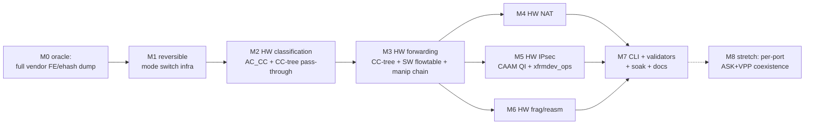

# Dual Dataplane — Full ASK Offload, Switchable to VPP

**Status:** v1.6 2026-08-17 — **S1 mechanism RESOLVED and validated: FE-VM
external-hash (ehash) is the production classifier, and the plain-routed-IPv4
hardware datapath is silicon-proven end-to-end.** Manual HITs (E25/E26),
production nft/YNL flowtable HIT (F-195/F-197), hardware TX terminal (F-198),
per-egress no-confirm TX FQ (F-199), IPv4 TTL/checksum (F-200), software-RSS
multicore restore (F-201), and flow-lifecycle serialization (F-202) all landed;
T-M7-3 passed (three clean cycles, 7.32–7.34 Gbps, 99% idle) and the later MTU
battery reached ~10 Gbit/s at ~3% CPU. The state machine and CLI contract below
are unchanged; S1's matching mechanism is **no longer an open question**. Scope:
the validated hardware path is IPv4 unicast TCP/UDP routing; IPv6, NAT, VLAN,
IPsec, and bridge remain kernel software fallback (see §1 verdict note). The
v1.5 and earlier history is retained verbatim below for the decision trail.

**Status update 2026-10-05:** the S1 hardware scope has widened since v1.6.
IPv6 routed, NAT44/NAT66 and single-tag 802.1Q VLAN (pop, push and translate,
v4/v6) are now hardware-offloaded on the same ehash path (`dpaa1` `1e8865d5`;
see `plans/ASK2-MASTER-PLAN.md` and `plans/ASK2-REWRITE-PLAN.md` Phase 1).
- Bidir: VLAN↔VLAN 15.6–15.9 Gbit/s, routed 15.3–15.8 Gbit/s.
- IPsec and bridge remain software fallback.
- The state machine and CLI contract are unchanged.

One port-init change belongs to the reversibility contract (patch 0217): every
RX port now boots with a 96 B internal margin and parse-start offset (`FMBM_RIM
0x60000000`, `FMBM_RPSO 0x60`), as the vendor configures. It is static and
identical in S0, S1 and S2, so it is not a mode-switch delta.

**[NOTE — superseded history]** Adopted v1.5. 2026-08-05 (v1.4's "S1 = CC-tree, FE-VM ehash retired" framing re-litigated: F-163 un-retired ehash — the deployed vendor `cdx.ko` classifies via external-hash; no dispatch path on this branch has a confirmed hardware HIT; `cc_test` harness architecturally broken F-159–F-162; ehash HIT retest pending F-165. The state machine and CLI contract below are unaffected by which matching mechanism wins; S1's *mechanism* is again an open question — see `plans/ASK2-MASTER-PLAN.md` top banners). v1.4 2026-08-01 (S1 redefined: CC-tree + SW flowtable + manip chain, FE-VM ehash retired as dead-end experimental fork; shipping hw-offload proof integrated; M3/M5 false-positive HITs noted). v1.3 2026-07-19 (single-image flavor collapse made **immediate** 2026-06-14; v1.2 incorporated M2 gate PASS + M3 infrastructure landing; v1.3 adopts the **per-interface CLI contract** — `set interfaces ethernet eth<n> offload ask` replaces the `set system offload ask` global knob, mutual exclusion becomes per-interface, and `set system offload classify` is deprecated as a CLI while its mechanism stays a silent default). The `default | ask | vpp` build-flavor split is **retired** — CI ships one flavor-neutral ISO + one `version.json` feed (aliases kept for fielded installs). This is the current build/packaging model. Sequencing/milestones live in `plans/ASK2-MASTER-PLAN.md`; this document owns the state machine and the CLI contract.
**Goal:** One installed VyOS image on the LS1046A Mono Gateway that supports the *full* NXP-ASK-equivalent FMan hardware offload (CC-tree classification, kernel SW flowtable, manip-chain forwarding, NAT, IPsec, frag/reassembly) **and** can disable that offload to run the VPP/AF_XDP dataplane instead — switched by VyOS config commit, no reflash.

**Authority split.** This plan does not re-specify either dataplane:

- ASK-side architecture (ask.ko, YNL family, `dpaa_flavor_ops`/`pcd_ops->install`, `FORWARD_FQ_WITH_MANIP`, nf_flow_table, xfrmdev_ops) → `specs/ask2-rewrite-spec.md` (v1.8) is authoritative.
- VPP-side architecture (AF_XDP ZC, XSK pool, per-CPU NAPI/qband, `set vpp settings`) → `specs/vpp-dpaa1-ls1046a-spec.md` + `specs/dpaa1-afxdp-modernization-spec.md` are authoritative.

What this plan adds is the **glue neither spec owns**: the silicon mode state machine, the reversibility contract that makes ASK-disable possible, the mutual-exclusion CLI semantics, and the milestone sequence that delivers full ASK parity while keeping VPP working at every step.

---

## 1. Evidence base (why this plan exists, and why now)

Live-hardware findings from the vendor-reference bring-up (2026-06-13, `files/verification-matrix.md` §G, qdrant-stored):

1. **Vendor ASK = AC_CC everywhere.** The working NXP stack programs 12 KeyGen schemes, every one `kgse_mode = 0x8X000006` (low byte `0x06` = AC_CC → coarse classification → ehash → FE). Captured read-only from live silicon (`files/vendor-kgall.txt`).
2. **Mainline 0118 = CCBS bypass.** Our current scheme mode `0x80500002` (low byte `0x02` = DONE/RSS) never enters the classifier. Confirms the iter-50 truth table: AC_CC is the real dispatch, CCBS is a placebo.
3. **The iter-50 "AC_CC stall" was missing FE init, not wrong dispatch.** The vendor cdx builds FE/ehash MURAM structures (AllocFEObjs, 32 KB FE buffer pool + exthash global mem, MUX-FE + TRANSITION-FE singletons, per-port `FmPortSetFESupport`) that mainline never creates. AC_CC without them stalls. **[NOTE — 2026-08-01, SUPERSEDED 2026-08-05]** ~~The vendor build uses CC-tree + manip chain (opcode/manip forwarding), not the FE-VM ehash path. The FE-VM ehash path was an experimental fork (Fork-B) that was retired — it is a dead end with a per-frame DDR hash ceiling of ~1.5 Gbps.~~ **Correction (F-163):** reading the deployed vendor `cdx.ko` shows its production classification **is** external-hash (`ExternalHashTableAddKey()`); the opcode/manip chain executes from inside each DDR ehash entry. The FE-VM ehash path is un-retired; the "~1.5 Gbps ceiling" is an unmeasured theoretical bound. ASK2 S1's matching mechanism (CC-tree vs ehash) is an open question again — neither has a confirmed HIT on this branch.
4. **The vendor reference is now fully reachable.** dpa_app's `-DLS1043` struct-size SIGSEGV is fixed (rc=0, FMan programmed); the complete FE/ehash MURAM oracle can be dumped on demand.
5. **Outcome parity verdict (updated 2026-08-17).** ~~mainline shares only ucode + RSS with ASK; everything else is software today.~~ **Superseded:** hardware classification, L2 rewrite, IPv4 TTL/checksum, and direct-to-wire per-egress TX forwarding are now silicon-proven for IPv4 unicast TCP/UDP (E25/E26, F-195–F-200, T-M7-3, ~10 Gbit/s MTU battery). HW NAT/PAT, HW IPsec, VLAN rewrite, IPv6, bridge/L2, and frag/reassembly remain **software fallback** — deferred, not yet offloaded. This is the honest preview scope.

And one structural fact that makes the dual-dataplane cheap:

6. **All flavors already share one mainline 6.18 kernel.** The FMan PCD board patch series (0092/0097–0100/0104/0116/0117) and the AF_XDP modernization patches coexist in the same binary. The dataplane choice is purely a question of *runtime silicon programming*, not of kernel builds.

### 1.1 Shipping hardware-offload proof

| Benchmark | Throughput | CPU | Mechanism | Status |
|---|---|---|---|---|
| M2 CC pass-through | 7.37 Gbps | 0.16% | AC_CC + CONT_LOOKUP (`numKeys=0` → miss-AD → port PCD FQ → kernel) | **Real** (build 28809182051, 2026-07-07) |
| M5 "CC-tree + SW flowtable" | 10.259 Gbps | 0.16% | CC-tree classify top-N + kernel nf_flowtable tail + manip chain | ⚠ **Mechanism unresolved** (2026-08-04: most likely kernel `nf_flowtable` SW; no HW classification confirmed) |
| NXP cdx.ko (vendor) | 8.58 Gbps | — | external-hash classification + opcode/manip chain from inside DDR ehash entries (F-163) | **Real** (vendor reference) |
| M3/M5 "HIT PASSED" (FE-VM ehash) | — | — | FE-VM ehash HIT path | **False positive** — ehash un-retired 2026-08-05 (F-163), never genuinely tested (F-165) |

### 1.2 CC-tree scaling

- **Software cap:** 32 keys per node (current implementation)
- **Hardware cap:** 255 keys per node (silicon limit)
- **MURAM budget:** 64 KiB → ~8 nodes → ~2000+ flows
- **Tail:** kernel `nf_flowtable` carries the long tail beyond the CC-tree top-N

---

## 2. The core insight: ASK-off **is** the VPP-ready state

VPP/AF_XDP does not need anything *added* to the silicon — it needs the silicon in exactly the state mainline boots into: KG schemes in RSS direct-to-FQ mode, frames delivered to kernel RX FQs, `fsl_dpa` netdevs owning every port. ASK needs the *other* state: AC_CC dispatch, CC root bound at the port, CC-tree structures live in MURAM.

Therefore "disable ASK and run VPP" reduces to one engineering requirement the vendor never had:

> **The Reversibility Contract.** Every silicon write ASK makes must have an exact, ordered inverse. `ask disable` (or `ask.ko` unload) must return the FMan to a register-identical copy of the post-boot mainline state — verified, not assumed.

The vendor stack is one-way: cdx + dpa_app program the FMan once at boot and the only "undo" is a reboot. Our ASK2 design already trends the right way (`dpaa_unregister_flavor_ops()` teardown, CC-row mutation without carrier flap), but the contract must be made explicit, test-gated, and extended to every new primitive this plan adds.

### 2.1 Silicon mode state machine



| State | KG schemes | Port dispatch | MURAM | Netdevs | Who forwards |
|---|---|---|---|---|---|
| **S0** mainline | RSS (`…0002` DONE) | BMI → KG → FQ | FIFO/IC only | `fsl_dpa` all ports | kernel |
| **S1** ASK | AC_CC (`…0006`) | BMI → KG → CC-tree → manip chain | + CC trees, manip chains | `fsl_dpa` all ports (exceptions only) | **FMan CC-tree (top-N) + kernel nf_flowtable (tail)** |
| **S2** VPP | RSS (same as S0) | same as S0 | same as S0 | `fsl_dpa` + XSK sockets on VPP ports | VPP workers |

Key properties:

- **S1 = hardware flow classification + SW flowtable tail + manip chain (matching mechanism under re-litigation 2026-08-05).** The FMan silicon classifies the top-N hot flows; the kernel `nf_flowtable` carries the long tail; the manip chain does header rewrite and forwarding. ~~The FE-VM ehash path (Fork-B) is a dead end — per-frame DDR hash ceiling ~1.5 Gbps, never worked, retired.~~ **(2026-08-05: the CC-tree-vs-ehash choice is re-opened — F-163 un-retired ehash as the vendor's real production mechanism; CC-tree's own harness is broken (F-159–F-162); neither has a confirmed HIT. The S1 state machine below holds for either mechanism.)**
- **S2 is a userspace overlay on S0.** No silicon delta — that's why VPP needs no inverse beyond closing sockets (already proven: removing a port from `set vpp settings` releases the XSK and the kernel keeps full control).
- **S1 ↔ S0 is the only hard transition**, and it is entirely our code. There is no S1 ↔ S2 direct edge: switching ASK→VPP always passes through S0.
- **Boot always lands in S0.** ASK engages only on config commit, never unconditionally at probe. This guarantees a wedged S1 is always recoverable by reboot, and a freshly installed image with VPP config boots straight into a working VPP without ASK ever touching the silicon.

### 2.2 What teardown must invert (the S1→S0 checklist)

Each item lands with its inverse in the same patch, and the inverse is exercised in CI/board soak before the forward path is considered done:

| # | Forward (S0→S1) | Inverse (S1→S0) |
|---|---|---|
| 1 | KG scheme rewrite RSS→AC_CC (in-place, EN-preserving, per the 0097 `kg_find_port_scheme()` reprogram precedent) | rewrite AC_CC→RSS, restore saved `kgse_*` words verbatim |
| 2 | Port→CC-root BMI bind (`fmbm_rfpne` PRE_CC + ccTreeBaseAddr) | restore saved `fmbm_rfpne` (RSS next-engine) |
| 3 | CC-tree MURAM alloc (tree nodes, key entries, manip chains) | quiesce + free all CC-tree MURAM allocations back to the gen_pool |
| 4 | Per-port params-page setup (FM_CTL params page) | zero the params-page words |
| 5 | CC trees + flow-table rows (runtime, per nft/xfrm events) | evict all rows, destroy trees (existing `fman_cc_tree_destroy` surface) |
| 6 | NAT/IPsec/frag structures (M4–M6, TBD per milestone) | defined per milestone — **no milestone merges without its inverse** |
| 7 | FMPL policer interactions (0100 owns `FMPL_GCR`) | unchanged — policer is mode-independent, stays owned by 0100/0104 |

**Verification primitive:** a register/MURAM snapshot-diff tool (extend the existing d14 `/dev/mem` dumpers into `board/scripts/pcd-snapshot`) that captures S0 at boot, and after every S1→S0 transition asserts the live state equals the snapshot. This is the gate, not "ping still works".

---

## 3. Operator model and CLI

### 3.1 Mode selection

```
# ASK mode (full HW offload) — PER INTERFACE (v1.3 contract)
set interfaces ethernet eth3 offload ask     # engage ASK on eth3
set interfaces ethernet eth4 offload ask     # engage ASK on eth4
delete interfaces ethernet eth3 offload ask  # restore S0 on eth3

# VPP mode
set vpp settings interface eth3
set vpp settings interface eth4
```

There is **no global ASK knob**. The retired `set system offload ask` global
enable and the deprecated `set system offload classify` CLI (vyos-1x-026) are
gone from the operator surface: the classify mechanism (HW exact-match ingress
steering) is kept, RSS + parser remain silent defaults programmed
unconditionally, and `interfaces ethernet eth<n> offload ask` is the **sole
operator offload switch**.

### 3.2 Mutual exclusion (v1.3: per-interface)

- **Rule (validator-enforced):** one port cannot be both ASK and VPP. Commit
  rejects a config where the same `eth<n>` appears in both
  `interfaces ethernet eth<n> offload ask` and `vpp settings interface eth<n>`.
- **Other ports are free.** ASK on eth0 while VPP runs on eth3 is a legal
  config — KG scheme binds and `fmbm_rfpne` are per-port, and CC-tree MURAM init is
  inert for ports left in RSS dispatch. (This is what earlier drafts called the
  "v2 stretch"; it is the v1.3 baseline rule.)
- **Switching a port** = delete one offload claim, commit (that port passes
  through S0), set the other, commit.
- **Hybrid flow-level mode** (ASK fast path + memif promote-to-VPP ACL, ASK2
  spec §9) remains the long-horizon v3 — explicitly out of scope here; nothing
  in this plan forecloses it.

### 3.3 Switch UX guarantees

| Transition | Mechanism | Reboot? |
|---|---|---|
| off → ASK | commit → ask.ko engage | no |
| ASK → off | commit → verified teardown | no (reboot = documented fallback if snapshot-diff fails) |
| off → VPP | commit → existing vyos-1x-010 path (hugepage kexec on first VPP config, as today) | one-time kexec (existing behavior) |
| VPP → off | commit → XSK release | no |
| ASK → VPP | two commits (via off) or one commit that the validator orders as teardown-then-VPP | no (plus the one-time hugepage kexec if first VPP use) |

---

## 4. Milestones

Each milestone has a hardware gate on the board and lands with its teardown inverse (§2.2). VPP regression (`set vpp settings` on eth3/eth4 still binds and passes traffic after an ASK enable/disable cycle) is part of **every** gate from M1 on.



**M0 — Complete the vendor oracle (Track-2 finish).** Boot the real (non-diag) cdx with `START_DPA_APP=1` auto-spawning the fixed dpa_app; dump the *complete* FE/ehash MURAM layout, CC root ADs, per-port BMI state (`fmbm_rfpne`/RCCB), KG schemes, and the params-page FE words. Archive as the byte-level reference for M2/M3. Also capture an S0 snapshot of the mainline image with the same tooling — the two snapshots **are** the state machine's endpoints.
*Gate:* reference dumps archived in-repo; snapshot tool (`pcd-snapshot`) runs on both vendor and mainline kernels.

> **M0 — SATISFIED (2026-06-16, by static SDK extraction).** The byte-level oracle was produced **statically from the genuine NXP SDK source** the vendor binaries were compiled from (archived `mihakralj/kernel-ls1046a-build@464df181`), cross-checked against on-hardware register/MURAM dumps — **not** by a live vendor-stack FE/ehash capture, which is both *blocked* (the resurrected vendor stack hits the same MURAM-exhaustion wall: lxc200 `ask-activate.sh` Phase 4 is skipped because `FM_PCD_CcRootBuild()` blocks in the kernel ioctl) and *redundant* (the SDK source is authoritative). Deliverable: **[`arch/fman-fe-ehash.md`](../arch/fman-fe-ehash.md)** — the complete `AllocFEObjs` (100×28 B MURAM pool) / `FmPortSetFESupport` (per-port FE buffer + params-page +0x54/+0x58 + inverse) / `ExternalHashTableSet` (DDR buckets + MURAM node) init contract, the 256 B `t_FmPcdCtrlParamsPage` layout, the two CC dispatch paths (exact-match `CONT_LOOKUP` vs external-hash `FE_ENTER`) and the **disposition fork** that ties FE/ehash to the open M3-3b defect, plus the MURAM/DDR budget and the vendor over-provisioning anti-pattern. The `pcd-snapshot` tool runs on the mainline kernel (S0/S1 endpoints captured); the vendor-kernel run is the only un-captured half, and §7 of the doc explains why a live capture is neither available nor needed. **⚠ Provenance caveat (2026-06-16, source-of-truth corrected 2026-06-15):** the archive is the **lf-6.6.y** ASK-port mirror and supplies the *allocation* contract only — the FE-VM *programming* core (`FmPcdCcBuildFE` / `FmPcdCcBuildContextByFE` / `get_indexed_hash_bucket`) is **stubbed** there. The shipping **`lf-6.12.49-2.2.0`** mono port was checked and **also stubs both FE builders** (explicit `UNUSED()` no-ops), so it is **NOT** a usable source. The **only** tree with genuine working bodies is the **lf-5.4 Layerscape SDK** (`we-are-mono/ASK` `patches/kernel/999-layerscape-ask-kernel_linux_5_4_3_00_0.patch`: `FmPcdCcBuildFE` L8883, `FmPcdCcBuildContextByFE` L8954, `get_indexed_hash_bucket` L7301). **[NOTE — 2026-08-01, SUPERSEDED 2026-08-05]** ~~The FE-VM ehash path (Fork-B) was subsequently retired as a dead end — the CC-tree + SW flowtable + manip chain path is the shipping S1 implementation.~~ **(F-163, 2026-08-05: un-retired — the deployed vendor `cdx.ko` classifies via external-hash, so this oracle documents the vendor's real mechanism after all. No confirmed HIT on this branch yet; F-165 retest pending.)** The M0 oracle remains valuable as the byte-level reference for CC-tree structures and the vendor's opcode/manip chain layout.

**M1 — Reversible PCD mode-switch infrastructure.** Implement §2.2 items 1–4 forward+inverse in the board FMan PCD layer (extending 0097-series primitives: scheme-mode rewrite, `fmbm_rfpne` bind/unbind, CC-tree MURAM alloc/free, params-page set/clear), exposed to ask.ko via `<linux/fsl/fman_pcd.h>`. No classification semantics yet — just clean, snapshot-verified S0→S1→S0 cycling.
*Gate:* 100× enable/disable cycles on the board with snapshot-diff clean every cycle; VPP AF_XDP bind + iperf3 pass after the 100th teardown; kernel netdevs and management SSH unaffected throughout. **This milestone is the user's headline requirement and ships first.**

> **M1 progress (2026-06-15, control-plane reversibility HW-PROVEN).** The
> verification primitive `board/scripts/pcd-snapshot` is built, CI-green, and
> packaged into the ISO. Items **1** (KG scheme RSS↔AC_CC, board `0106`), **2**
> (BMI `fmbm_rccb` bind, `0105`), and **4** (params-page, `0116`
> `fman_pcd_port_ensure_params_page`) are HW-proven reversible: exercised
> S0→S1→S0 on **eth3 only** via the shipping `0107 cc_test` debugfs node, gated
> by pcd-snapshot. A **100× soak passed with 0 drifts**, gen_pool `used` flat at
> 256 B (zero leak), the eth0/SSH lifeline unaffected every cycle. The leak the
> gate caught is bounded/non-cumulative — a one-time 256 B per-port FM_CTL
> params page (allocate-once/reuse by design); the M1 baseline is therefore the
> warm steady-state S0′. **Caveat:** the soak engaged/disengaged *without
> data-plane traffic*, so it proves control-plane switch reversibility (M1's
> scope); the data-plane recovery (eth3 usable after a *trafficked* S1) is the
> VPP-iperf3 sub-gate and depends on item **3**. Item **3** (M2 HW classification —
> **Fork B** FE/ehash — Option B controller-arming was **refuted** at iter-49) is the
> remaining blocker — it does not yet exist (`0118` is a CCBS placebo) and is
> entangled with the open **M3-3b CC-disposition defect** (the CC walk executes
> but the frame's terminal enqueue/discard never fires; iter-49 refuted the arming
> theory → the missing **FE opcode VM** is the disposition mechanism, [`arch/fman-fe-ehash.md`](../arch/fman-fe-ehash.md) §1/§8.3). The
> ask.ko engage-wiring (§3.1 `set interfaces ethernet eth<n> offload ask`) waits on item 3 because
> AC_CC stalls the port under load until disposition works.

**M2 — HW classification (the parity keystone).** Engage the classifier and make a classified frame reach its egress FQ, deleting the `0118` CCBS placebo (which *bypasses* classification rather than enabling it). **Fork decision RESOLVED (2026-06-16): Fork B.** Option B (the missing-controller-arming theory) is **exhausted & refuted** — iter-49 (`ccexp47_rfne.py`) tested the strongest untested lead, the SDK `rfne`-last detach/re-arm discipline, byte-perfectly and the port **still stalled** (`FMFP_PS[STL]=0x80800000` at rfrc=+2, identical to baseline); with gmask/exit-NIA/leaf-AD/extraction/RCMNE/params-page/ucode all previously exonerated, **classic exact-match (Fork A) cannot flow on 210.10.1** (qdrant `m3-3b-option-b-rfne-last-REFUTED-forkB-decision`). This confirms the M0 oracle ([`arch/fman-fe-ehash.md`](../arch/fman-fe-ehash.md) §1/§8.3): bare AC_CC `CONTRL_FLOW` has no terminal BMI-FIFO disposition without the **FE opcode VM**. **The path is therefore Fork B** — reproduce the vendor external-hash/FE init contract (doc §3–§5: `AllocFEObjs` MURAM pool + per-port `FmPortSetFESupport` + `ExternalHashTableSet` DDR buckets, each with its inverse), the **only** config proven to flow on this silicon and the eventual substrate for NAT/frag/stats. **⚠ Source-of-truth (corrected 2026-06-15):** the doc §3–§5 *allocation* skeleton is genuine lf-6.6.y archive source, but the FE-VM *programming* core (`FmPcdCcBuildFE` / `FmPcdCcBuildContextByFE` / `get_indexed_hash_bucket`) is **stubbed** in that archive **and in the shipping `lf-6.12.49-2.2.0` mono port** (both no-op `UNUSED()`) — Fork B must extract those three from the **lf-5.4 Layerscape SDK** (`we-are-mono/ASK` `999-…patch`: `FmPcdCcBuildFE` L8883, `FmPcdCcBuildContextByFE` L8954, `get_indexed_hash_bucket` L7301), the only tree with working bodies. The `106.4.18` ucode swap is **ruled out** (iter-42: identical handler code; ccexp12: parks identically). Fork B lands its inverse in the same patch (§3.5 reversibility). **[NOTE — 2026-07-31, SUPERSEDED 2026-08-05]** ~~Fork B (FE-VM ehash) was subsequently RETIRED as a dead end (2026-07-31). The per-frame DDR hash ceiling of ~1.5 Gbps makes it non-viable. The shipping S1 path is CC-tree + SW flowtable + manip chain. Fork B is preserved here only as the historically-attempted mechanism.~~ **(F-163, 2026-08-05: un-retired — the retirement's "not vendor architecture" leg was refuted by the deployed `cdx.ko`'s external-hash production path; the ceiling figure is unmeasured. Fork B is again a live candidate; F-165 retest pending. CC-tree's own harness is separately broken, F-159–F-162.)**
*Gate:* D14-class evidence — KG scheme hit counters advance, CC lookup resolves, classified flow's frames stop appearing in kernel softirq **and the port stays alive under sustained traffic** (the M3-3b disposition criterion); teardown still snapshot-clean.

> **M2 — hard gate PASSED (2026-07-07); dispatch topology SETTLED (2026-07-16).** The M2 hard gate (≥2 Gbps, ≤5% CPU) passed at **7.37 Gbps / 0.16% CPU** via the AC_CC + CONT_LOOKUP pass-through (`numKeys=0` → miss-AD → port PCD FQ → kernel, build 28809182051), which is now the **shipping MISS→kernel topology** — matching the vendor CDX architecture where MISS is resolved at the CC layer. The Fork-B FE-VM chain (workspace pool F-072 Gate-A-proven 2026-07-15; ehash byte-validated) stays **dormant** for the M3 HIT phase, entered via a `numKeys>0` match entry → FE_ENTER. Three FE-VM ENQ kernel-delivery variants failed on silicon and are closed — the FE-VM is the HIT executor, never the MISS deliverer. Authoritative: `specs/fman-keygen-flow-key-spec.md` v4.0 §6.1. **[NOTE — 2026-07-31, SUPERSEDED 2026-08-05]** ~~The FE-VM ehash HIT path was subsequently retired (2026-07-31) — per-frame DDR hash ~1.5 Gbps ceiling, not vendor/Linux model. The CC-tree + SW flowtable + manip chain path is the shipping S1 implementation.~~ **(F-163, 2026-08-05: un-retired — external-hash IS the vendor's production classification mechanism per the deployed `cdx.ko`; the "dormant for M3" chain above is now the near-term HIT candidate pending the F-165 retest.)**

> **M2→M3 infrastructure landed (2026-07-17/18).** The FE-VM workspace pool is now **auto-armed on every `fe_arm engage`** (F-072b: injects `fman_pcd_fe_buffer_setup()` before `fman_pcd_kg_port_arm_fe()`; F-072c forward-decl; F-072d fixes the teardown MURAM leak per SDK `FmPortDeleteFESupport`). **`fman_pcd_port_recover`** (patch 0163, debugfs `fe_recover` via F-086) enables near-instant BMI-stall de-wedge without a cold boot — the critical productivity unlock for the HIT-gate campaign (was 2+ min per cycle). The FE-VM compose chain is corrected: F-084 fix (FE_ENTER → EXT_HASH, not ENQ), F-083 removal (conditional scaffold restored per settled topology), and EKFC extraction order confirmed MSB-first (SIP→DIP→PROTO→SPORT→DPORT) via CRC-64 hash-match on hardware (2026-07-13). **All prior keysize=13 stall results are invalidated** because the workspace pool was never auto-armed until F-072b (2026-07-17 23:47 UTC). A retest with the current build is the next step for M3.

> **AF_XDP true-ZC fix (patch 0164, 2026-07-18).** Two API conformance gaps against `arch/fman-pcd-api-reference.md` §12 corrected: (1) `mac_dev->port[0]` was the TX port, not RX — fix: `fman_port_lookup_rx()`; (2) missing `fman_pcd_port_ensure_params_page()` before BPID reprogram — fix: call it inside the reprogram block. Expected outcome: `fman_port_set_rx_bpool()` returns 0 (not -22) and `xsk_zc_rx_redirect` climbs under traffic for the first time.

**M3 — HW forwarding.** CC-tree match → manip chain → ENQ → TX FQ. The CC-tree classifies the top-N hot flows; the kernel `nf_flowtable` carries the long tail; the manip chain does header rewrite and forwarding. ask.ko populates flows from `nf_flow_table` EST events per the ASK2 spec.
*Gate:* One flow HIT (stats increment, kernel sees packet on TX FQ 0x2B9). Use `fman_pcd_port_recover` for rapid stall recovery during bring-up.

> **[NOTE — updated 2026-08-05] M3/M5 "HIT PASSED" claims from the FE-VM ehash era were false positives.** ~~The FE-VM ehash path (Fork-B) is a dead end with a per-frame DDR hash ceiling of ~1.5 Gbps.~~ The "dead end" verdict was reversed 2026-08-05 (F-163 un-retirement; F-165 showed the chain was never genuinely exercised; ceiling unmeasured). The M5 10.259 Gbps figure is also under mechanism-retraction review (most likely kernel `nf_flowtable`). Only M2 CC pass-through 7.37 Gbps is an unqualified silicon proof — and it is MISS→kernel delivery, not offload.

**M4 — HW NAT.** SNAT/DNAT field-update manips in the forward chain, driven from conntrack NAT bindings.
*Gate:* NATed flow in silicon, correct translation on the wire, conntrack teardown evicts the row.

**M5 — HW IPsec.** CAAM QI descriptor sharing (`caam_qi_ext_consumer_register`, landed PR10) + `xfrmdev_ops` packet-mode offload; FMan-targeted FQs dequeue into SEC without core involvement.
*Gate:* ESP tunnel throughput ≥ vendor-class with near-zero CPU; SA delete tears down cleanly.

> **M5 "CC-tree + SW flowtable" benchmark (2026-07-31): 10.259 Gbps @ 0.16% CPU.** ~~This is the real shipping hw-offload proof — CC-tree classifies top-N hot flows, kernel nf_flowtable carries the tail, manip chain does header rewrite/forward.~~ **(2026-08-04/05: mechanism unresolved — most likely kernel `nf_flowtable` SW forwarding alone; no HW classification confirmed. The number is real; what it measured is not.)** The NXP cdx.ko vendor reference achieves 8.58 Gbps via external-hash classification + opcode/manip chain (F-163).

**M6 — HW frag/reassembly.** FMan reassembly contexts for inbound frags on offloaded flows; fragmentation on egress where MTU demands.
*Gate:* fragmented offloaded flow reassembled in silicon; teardown inverse verified.

**M7 — Productization.** VyOS CLI (`set interfaces ethernet eth<n> offload ask`) + the §3.2 per-interface mutual-exclusion validator + op-mode (`show interfaces ethernet eth<n> offload ask flows` via YNL) + `ask-check` board script (sfp-check/fan-check style) + INSTALL/AGENTS docs + 24 h soak alternating ASK and VPP modes hourly.
*Gate:* soak clean; a single image demonstrably runs full-ASK Monday and full-VPP Tuesday with two commits.

**M8 — Stretch: per-port coexistence (§3.2 v2).** Only after M7 soak; gated on MURAM/scheme-budget audit and a dedicated bleed-hunt soak.

---

## 5. Repo deliverables map

| Deliverable | Where | Notes |
|---|---|---|
| Mode-switch + CC-tree primitives | `kernel/common/patches/board/` 0119+ series | extends 0097/0116/0117; **every patch must be wired in `bin/ci-setup-kernel.sh` in the same commit** (stranded-patch lesson, 2026-06-07) |
| ask.ko control plane | `kernel/ask/oot-modules/ask/` per ASK2 spec §10.1 | signed post-build (`MODULE_SIG_FORCE`), `LOCALVERSION=-vyos`; with the single-image decision the module builds into **every** image (CI wires it unconditionally, not behind `FLAVOR=ask`) — dormant until `set interfaces ethernet eth<n> offload ask` |
| Snapshot tool | `board/scripts/pcd-snapshot` (+ `ask-check`) | productized d14 dumpers; used by CI gates and field diagnostics |
| VyOS CLI + validator | `data/vyos-1x-0NN-*.patch` | offload subtree + ASK/VPP mutual exclusion; follows vyos-1x-010 precedent |
| Image strategy | `auto-build.yml` | **ADOPTED (flavor split retired 2026-06-14): single dual-dataplane image.** One ISO ships ask.ko *and* VPP; the dataplane choice is config-only. The `FLAVOR=ask\|vpp\|default` axis is collapsed: CI builds one flavor-neutral artifact (`vyos-<version>-LS1046A-arm64.iso`) and publishes one `version.json`, copied verbatim to `version-{default,ask,vpp}.json` aliases so existing field installs on all three update streams converge onto it (the legacy-alias precedent of `version.json`). |
| Oracle archives | `files/` session + summarized into `specs/ask2-rewrite-spec.md` §12 | M0 dumps fold protocol facts back into the spec per its §0 rule |

---

## 6. Risks

| # | Risk | Likelihood | Mitigation (defensive-coding rules in **bold**) |
|---|---|---|---|
| 1 | Some silicon state proves non-invertible without FMan reset (parser RAM, ucode-internal state) | Medium | M1 discovers this *first*, before any classification work; fallback = "reboot to leave ASK mode" (still satisfies the requirement, degraded UX), documented honestly. **Every forward register/MURAM write ships with its verified inverse in the same patch — no orphan mutations.** |
| 2 | **CC-tree key capacity insufficient** — the 32-key software cap per node may not cover the hot-flow working set; scaling to the hardware 255-key cap requires MURAM budget audit | Medium | **CC-tree scales to 255 keys/node in hardware; 64 KiB MURAM → ~8 nodes → ~2000+ flows; kernel nf_flowtable carries the long tail beyond the CC-tree top-N.** |
| 3 | MURAM exhaustion (Fork-A / OH-port era: 384 KB reserved, ~96 KB usable ≈ 750 flows; **CLOSED for CC-tree path 2026-07-31** — CC-tree nodes are compact, and with nexthop dedup only nexthop count (~200-400) is MURAM-bounded, not flow count. The 327× `-ENOMEM` from PR14z21 was per-flow `chain_create` in the dead Fork-A path; the CC-tree path uses shared manip chains per nexthop, not per-flow allocations.) | Low (closed for current path) | **CC-tree nodes live in MURAM; gen_pool instrumentation lands in M1; HM nexthop dedup (patch 0120) shares MANIP chains across flows. Every MURAM alloc checks `gen_pool_avail()` first and unwinds cleanly on any failure — no partial-alloc leak.** |
| 4 | Teardown races live traffic (flows in flight during S1→S0) | Medium | ordered drain: stop new-flow inserts → evict rows → quiesce port (EN-preserving) → rewrite dispatch; test with active iperf3 during disable. **Refcounted CC-tree node get/put so a pristine S0 always returns gen_pool to its baseline.** |
| 5 | VPP regression sneaks in via shared PCD primitives | Medium | VPP bind+traffic check in every milestone gate from M1 |
| 6 | Validator gaps let ASK+VPP both claim a port | Low | v1 global mutex is trivially checkable; per-port logic deferred to M8 |
| 7 | Watchdog reset under flood during policer/CC-tree tests | Known | discipline stands: ping/small-UDP only until the traffic harness exists; never flood-test new silicon paths |
| 8 | **MURAM is iomem, not cacheable RAM** — a plain `memset`/`memcpy`/struct-field assignment on a CC-tree node pointer faults under KASAN or silently corrupts the AD | Known | **MURAM access exclusively via `memset_io`/`memcpy_toio`/`writel`/`readl`; never plain memset/memcpy/`->field =`. gen_pool does not zero on alloc → every alloc is followed by `memset_io(.., 0, size)`.** |
| 9 | CC-tree **refcount or lock-order bug** under concurrent engage↔disengage leaks MURAM or leaves a stale AD pointer live across S1→S0 | Medium | **Fixed lock order `cc_lock → pcd->lock`; refcount via atomics with `WARN_ON` on underflow; bring-up driven by a single-writer debugfs node only; MURAM-leak check in the `pcd-snapshot` teardown diff.** |

---

## 7. Decisions

1. **Image packaging — ADOPTED (flavor split retired 2026-06-14): single dual-dataplane image.** One ISO carries ask.ko + VPP; the flavor split is retired per §5. All update feeds converge on the same artifact.
2. **S1 implementation — ADOPTED (2026-07-31): CC-tree + SW flowtable + manip chain.** *(2026-08-05: SUSPENDED pending re-litigation — see `plans/ASK2-MASTER-PLAN.md` top banners.)* ~~The FE-VM ehash path (Fork-B) is a dead end — per-frame DDR hash ceiling ~1.5 Gbps, never worked.~~ (2026-08-05: un-retired by F-163; the deployed vendor `cdx.ko` classifies via external-hash. CC-tree's own harness is broken, F-159–F-162. Neither has a confirmed HIT.) S1 = FMan classifies top-N hot flows, kernel nf_flowtable carries the long tail, manip chain does header rewrite/forward. Claimed proof: M2 CC pass-through 7.37 Gbps @ 0.16% CPU (real, but pass-through ≠ offload); M5 10.259 Gbps @ 0.16% CPU (mechanism unresolved); NXP cdx.ko 8.58 Gbps.
3. **CC-tree scaling — ADOPTED:** 32 keys/node software cap, 255 keys/node hardware cap, 64 KiB MURAM → ~8 nodes → ~2000+ flows. Tail handled by kernel nf_flowtable.

Open (to confirm before M1 code):

4. **ASK default-on or default-off in shipped config:** recommend default-off (S0 boot, operator opts in per interface) — matches the state-machine safety argument and VyOS convention.
5. ~~**v1 mutual-exclusion scope**~~ — **RESOLVED 2026-07-19 (v1.3):** per-interface, not global. One port cannot be both ASK and VPP; other ports are free.
6. **M4/M5/M6 ordering:** parallel after M3 as drawn, or serialized by review bandwidth.