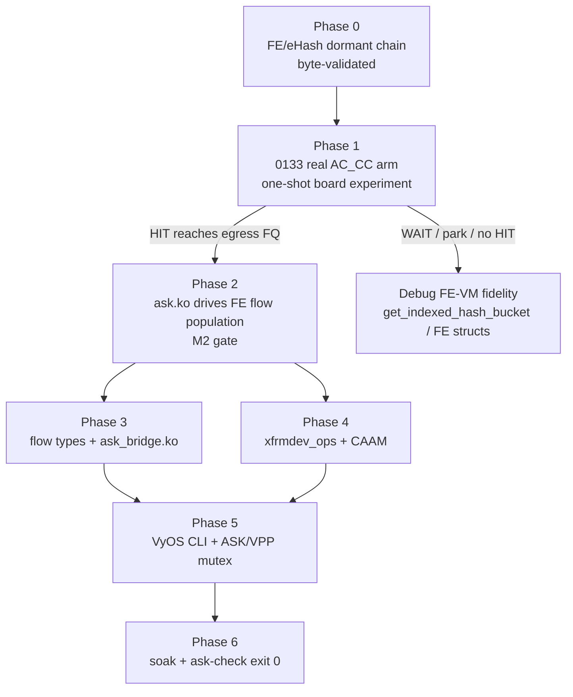

# ASK2 Next Actions — Immediate Implementation Priorities
**Version 1.0.0 · 2026-07-04 · HADS 1.0.0**

---

## AI READING INSTRUCTION

Read `[SPEC]` and `[BUG]` blocks for authoritative facts.
Read `[NOTE]` only if additional context is needed.
`[?]` blocks are unverified — treat with lower confidence.

---

## 1. Purpose and Source-of-Truth

**[SPEC]**
This document is the short execution checklist for moving the `puddle-cornet` ASK2 branch from dormant substrate to modern hardware offload. It is subordinate to `plans/ASK2-DEVELOPMENT-PLAN.md`, `arch/fman-fe-ehash.md`, and `plans/DUAL-DATAPLANE.md`.

**[SPEC]**
The current branch is `puddle-cornet`. The relevant ASK2 target is mainline Linux `6.18.34-vyos` with the single-image runtime-offload model: boot lands S0 mainline/RSS, ASK engages only through explicit runtime offload.

**[NOTE]**
This file exists to keep the next implementation steps compact and executable. It does not replace the full plan; if this file and `ASK2-DEVELOPMENT-PLAN.md` disagree, update this file.

---

## 2. Current State Snapshot

**[SPEC]**
The following components are landed, compile-verified, and shipping dormant unless otherwise noted:

| Component | Patch / Anchor | State |
|---|---:|---|
| FMan PCD subsystem: KeyGen / CC / HM / Policer | `0092` / `0097`–`0100` | HW-proven substrate |
| Reversible mode-switch API + `pcd-snapshot` | `0105` / `0106` / `0116` / `0129` | 100× control-plane soak passed |
| FE/eHash VM dormant substrate | `0122` → `0131` | Phase 0 byte-validated and reversible |
| Real AC_CC arm encoding | `0133` | Authored + compiled; board experiment pending |
| CAAM QI descriptor-sharing API | `0134` | Landed in common tree; board re-verify pending |
| FE context builder | `0135` | Landed, dormant |
| TX confirm bypass | `0136` | Landed and wired into ASK engage/disengage paths |
| MANIP create + chain API v2 | `0137` | Landed; `HMAN_OC_IP_MANIP=0x34` fix included |
| BMan IVCI crash fix | `0139` | Landed |
| Flow-offload backend slot | `0145` | Landed and CI-staged |
| Authoritative DTS/DTB sync | `we-are-mono/OpenWRT-ASK` `mono-25.12.0-rc2` | Landed; base DTS + SDK overlay + 13 SDK DTSI files |

**[SPEC]**
The following capabilities are still incomplete:

| Capability | Current state | Clears |
|---|---|---|
| Classifier → FE root link with real AC_CC | `0133` one-shot board experiment pending | `ask-check` §4 |
| `ask_bridge.ko` L2 switchdev offload | Stub only | `ask-check` §6 |
| CAAM descriptor-sharing board proof | Patch landed; symbol re-verify pending on next image | first half of `ask-check` §7 |
| ESP hardware-offload advertise and xfrm datapath | `ask_xfrm.c` stub only | second half of `ask-check` §7 |
| VyOS CLI | Not started | `ask-check` §8 |

**[NOTE]**
The most important state transition is now small: Phase 0 already proved the dormant FE/eHash chain byte-exact and reversible; Phase 1 must prove that a real AC_CC-dispatched packet HIT reaches an egress FQ through the FE VM.

---

## 3. ASK 1.x Oracle Findings to Preserve

**[SPEC]**
The `nxp-sdk` branch is a frozen ASK 1.x oracle, not the ASK2 implementation path. It runs the NXP lf-6.12.49 SDK kernel with `cdx.ko`, `fci.ko`, `dpa_app`, and `cmm`.

**[SPEC]**
The oracle findings to preserve in ASK2 are:

1. `dpa_app` proves the 210.10.1 ucode accepts full PCD programming.
2. Bridge/L2 offload works end-to-end without requiring `auto_bridge.ko`.
3. Empty baseline CC trees with miss-to-disconnected-FQ blackhole traffic; ASK2 must keep EXIT/DEALLOCATE as the safe miss disposition until flows are real.
4. PCD state persists across module reloads; ASK2 must use byte-exact inverse writes and `pcd-snapshot`, never `rmmod`, as the cleanup proof.
5. VyOS notrack can starve flow promotion; Phase 2 measurement must install a conntrack-touching rule or own that centrally through the future CLI.
6. SDK-only issues such as portal `cell-index`, dual FMan compatibles, `enable_hooks`, and mixed-driver ownership are oracle-only constraints, not mainline ASK2 constraints.

---

## 4. Critical Path

**[SPEC]**
ASK2 reaches modern hardware offload only through this dependency chain:



**[SPEC]**
Nothing downstream should be treated as productively offloaded until Phase 1 proves a programmed `fe_flow` HIT resolves to a terminal ENQ FE and that the port returns byte-clean to S0 after disengage.

---

## 5. Priority 1 — CI ISO Build and Board Install

**[SPEC]**
Build and install an ISO containing everything after `2026.06.17-0315-rolling`: patches `0133`–`0139`, `0145`, ASK wiring, CAAM `0134`, and the authoritative DTS/DTB sync.

**[SPEC]**
The build entry point is the self-hosted workflow, not `auto-build.yml` directly. Dispatch from the ref that contains this work only when the user requests the build:

```bash
gh workflow run "VyOS LS1046A build (self-hosted)" --ref puddle-cornet
gh run list --limit 3
```

**[SPEC]**
After install and reboot, run:

```bash
sudo /usr/local/bin/ask-check
```

**[SPEC]**
Expected first-pass board result: CAAM descriptor-sharing symbol checks should flip from missing to present if `0134` shipped correctly. Classifier→FE root link remains failed until the explicit Phase 1 arm experiment runs.

---

## 6. Priority 2 — Phase 1 One-Shot AC_CC Arm Experiment

**[SPEC]**
This is the make-or-break M2 dispatch gate. The test mutates eth3 only (`hw port 0x10`) and must prepare a serial-console recovery path before arming.

**[SPEC]**
Mandatory pre-arm checklist:

1. Capture S0 baseline with `pcd-snapshot`.
2. Build the dormant FE/eHash chain through the verified `fe_*` debugfs sequence.
3. Program a real test `fe_flow` key whose bucket and bytes are derived from the actual packet tuple and the current FE/eHash encoder.
4. Capture a pre-arm snapshot after the chain is built and before AC_CC engage.
5. Arm with the real `0133` AC_CC encoding, not the `0132` CCBS placebo.
6. Test with a small number of ping packets, never a flood.
7. Disengage and require `pcd-snapshot diff` to match the pre-arm or S0 baseline as appropriate.

**[BUG] Placeholder flow-key commands are unsafe
Symptom: A copied example `fe_flow add` key can produce a false MISS or a HIT path without a terminal disposition.
Cause: The HIT key depends on the actual KeyGen byte extraction order, CRC64 bucket selection, and the packet tuple being tested; placeholder ICMP/TCP field examples do not prove correctness.
Fix: Derive the key from `arch/fman-fe-ehash.md` and the live `fe_*` debugfs/oracle byte tables before arming. Treat any copied literal key as invalid unless it is regenerated for the active test tuple.

**[SPEC]**
Phase 1 success criteria:

- Ping remains 0% loss during the armed window.
- The programmed flow HIT reaches the intended egress FQ.
- Kernel RX/softirq for that flow drops toward zero.
- eth0/SSH remains unaffected.
- Disengage restores all mutated KeyGen/BMI/MURAM state byte-exactly.

**[SPEC]**
If the HIT path parks or waits with no fault, stop traffic, collect PCD/FMan fault-state, and re-derive the FE-VM builder or bucket selection from lf-5.4 before re-arming.

---

## 7. Priority 3 — Phase 2 If Phase 1 HITs

**[SPEC]**
Phase 2 rewires `ask.ko` from the dead Fork-A exact-match path to the Phase-1 FE root. It must connect the existing `flow_block_cb` path to FE/eHash add/remove operations.

**[SPEC]**
Phase 2 implementation tasks:

1. Re-point ASK engage to the FE arm/root instead of exact-match CC.
2. Translate `FLOW_CLS_REPLACE` into eHash row insertion with a real terminal ENQ FE.
3. Translate destroy/teardown into eHash row removal and refcount cleanup.
4. Enable `0136` TX confirm bypass for silicon-HIT frames.
5. Use shared next-hop MANIP dedup via `fman_hm_nexthop_get/put` so MURAM consumption is O(next-hops), not O(flows).
6. Install or generate the VyOS conntrack-touching rule before any M2 measurement.

**[SPEC]**
M2 gate: throughput must be at least 2 Gbps and kernel-net CPU must be at most 5%. Stretch goal is at least 7 Gbps with the same CPU ceiling.

---

## 8. Priorities 4–6 After M2

**[SPEC]**
Phase 3 replaces the `ask_bridge.c` stub with a switchdev-based L2 bridge offload. The nxp-sdk ASK1 oracle proves this is the right scale: bridge offload works without an `auto_bridge.ko`-style netfilter-hook stack.

**[SPEC]**
Phase 4 implements packet-mode xfrm offload in `ask_xfrm.c` and descriptor lifecycle in `ask_caam.c`. `NETIF_F_HW_ESP` must not be advertised until `xdo_dev_state_add` really installs CAAM and FE/eHash state.

**[BUG] GCM must remain refused until revalidated
Symptom: AES-GCM offload can emit duplicate ESP sequence numbers on the wire.
Cause: Prior FMan/CAAM observations show a sequence-number race for GCM at speed.
Fix: Refuse GCM with `-EOPNOTSUPP` and target `authenc(hmac(sha256),cbc(aes))` first unless new silicon proof overturns the finding.

**[SPEC]**
Phase 5 adds VyOS CLI: `set system offload ask`, op-mode flow inspection through `ynl --family ask`, and a commit-time global ASK/VPP mutual-exclusion validator.

**[SPEC]**
Phase 6 is productization: trafficked engage/disengage soak, `pcd-snapshot` clean on every cycle, VPP AF_XDP still works after ASK teardown, and `ask-check` exits 0.

---

## 9. Risk Register for the Next Session

**[BUG] Phase 1 arm parks with no fault
Symptom: Port stalls or packets disappear while FMan fault registers stay clean.
Cause: FE-VM object bytes, bucket selection, or terminal HIT disposition is wrong.
Fix: Stop traffic, diff FE objects against `arch/fman-fe-ehash.md`, re-derive the faulty builder from lf-5.4, then rerun Phase 0 before re-arm.

**[BUG] M2 CPU remains near 20% after HIT
Symptom: Throughput passes but kernel-net CPU stays around the historical TX-confirm softirq floor.
Cause: TX confirm path is still receiving one confirm FD per silicon-HIT frame.
Fix: Ensure `0136` release-mode bypass is engaged for the egress TX ports and confirm with ethtool counters.

**[BUG] Flow promotion silently stays software-only
Symptom: iperf throughput looks high but `FLOW_CLS_REPLACE`/hardware counters do not prove HITs.
Cause: VyOS notrack or nf_flowtable ASSURED-state gaps prevent true offload promotion.
Fix: Install a conntrack-touching rule before measurement and verify hardware counters, not just throughput.

**[BUG] Per-flow MANIP exhausts MURAM
Symptom: `fman_pcd_manip_chain_create` returns `-ENOMEM` under flow churn.
Cause: O(flows) MURAM allocation for header manipulation chains.
Fix: Use shared next-hop MANIP handles with reference counts; per-flow rows reference shared handles.

---

## 10. Session Artifacts

**[SPEC]**
This refresh created or updated these plan artifacts:

| Path | State |
|---|---|
| `plans/NEXT-ACTIONS-ASK2.md` | New HADS execution checklist |
| `plans/ASK2-DEVELOPMENT-PLAN.md` | Refreshed to v1.1.0 with nxp-sdk oracle findings and July 4 session log |
| `plans/COMPLETION-PLAN.md` | Refreshed to v1.3.0 and aligned with Fork B FE/eHash path |
| `AGENTS.md` | DTS source guidance updated to `we-are-mono/OpenWRT-ASK` canonical tree |
| `board/dtb/mono-gateway-dk.dts` | Canonical base DTS plus documented local deviations |
| `board/dtb/mono-gateway-dk-sdk.dts` and `board/dtb/sdk-dtsi/` | SDK overlay and 13 SDK DTSI files added |
| `bin/ci-compile-mono-dtb.sh` | SDK build skip made flavor-gated |

**[NOTE]**
A qdrant entry named `ASK2 implementation plan refresh — 2026-07-04 session wrap` preserves the memory summary for future sessions.
