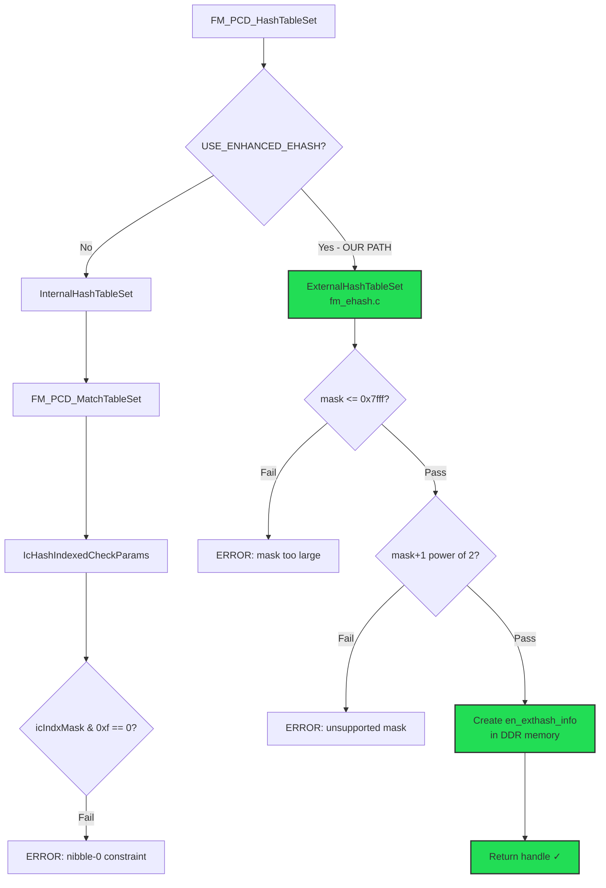
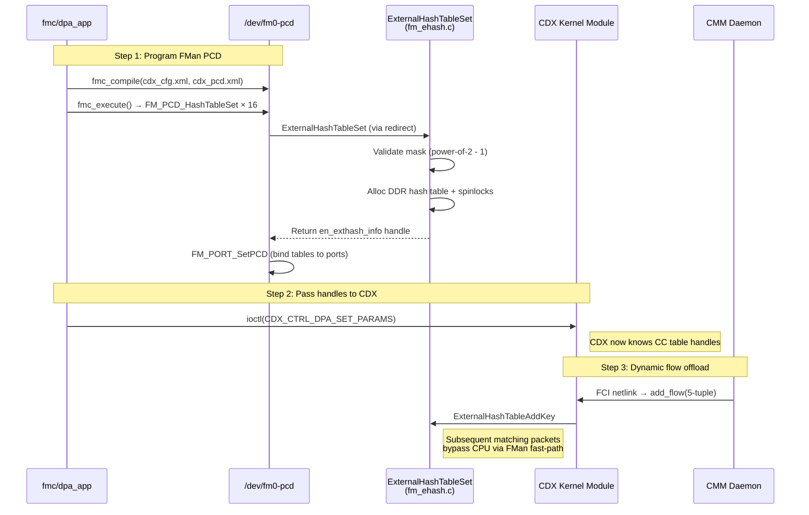

# PCD Programming Debug Plan — ASK Hardware Offload

> **Status (2026-04-08 15:35 UTC):** TWELVE root causes fixed. Kernel build #59 deployed to TFTP. Awaiting device `run dev_boot` for testing.
>
> 1. ~~`icIndxMask` nibble-0 constraint~~ — bypassed by ExternalHashTableSet redirect
> 2. ~~Uninitialized `onesCount`~~ — now in dead code path
> 3. ~~`FM_PCD_HashTableSet` type mismatch~~ — fixed with ExternalHashTableSet redirect in `fm_cc.c`
> 4. ~~ExternalHashTableSet mask validation~~ — reverted masks to original values that pass its `(mask+1) == power_of_2` check
> 5. ~~fmc/kernel ABI mismatch~~ — REVERSED patch 5010: restored `agingSupport`, `externalHash`, `externalHashParams` to ALL THREE structs to match pre-built fmc binary's expectations
> 6. ~~ASK Kconfig deps~~ — `ARCH_LAYERSCAPE` doesn't exist in mainline; added `ARM64` to `NET_VENDOR_FREESCALE`, removed dep from `CPE_FAST_PATH`
> 7. ~~ASK nf_conn->mark~~ — ASK patch emptied `CONFIG_NF_CONNTRACK_MARK` block; restored `mark` for non-`CPE_FAST_PATH` case
> 8. ~~CLK_QORIQ boot failure~~ — added `ARM64` to `CLK_QORIQ` and `QORIQ_CPUFREQ` Kconfig deps (patch 5009)
> 9. ~~IOC struct ASSERT~~ — REVERSED: fields restored in all 3 structs, ASSERT passes naturally (IOC = kernel + sizeof(void *))
> 10. ~~MMC_SDHCI_OF_ESDHC missing~~ — added `ARM64` to eMMC controller Kconfig dep (patch 5009), without it rootfs can't mount
> 11. ~~`USE_ENHANCED_EHASH` not defined~~ — was never `#define`d in `ls1043_dflags.h`, so ExternalHashTableSet code was excluded; hash tables fell through to normal path with nibble-0 constraint
> 12. ~~Ioctl ABI mismatch~~ — patch 5010 removed struct fields, changing `sizeof(ioc_fm_pcd_hash_table_params_t)` which changes the `_IOWR` ioctl command number; pre-built fmc sends `0xc078e139` (120 bytes) but kernel expected smaller → "Invalid Selection"

## 1. What We Proved

| Finding | Detail |
|---------|--------|
| `dpa_app` is NOT broken by BSS | Binary loads, libs resolve. Segfault occurs during FMC error rollback after `FM_PCD_HashTableSet` failure |
| Minimal KG+CC PCD works | `fmc -a` with `<classification>` (exact-match CC table) exits 0, no errors, FMan programmed |
| `external="yes"` is a WARNING only | `fmc` ignores unknown attributes, doesn't reject the XML |
| Hash table creation fails | `FM_PCD_HashTableSet → FM_PCD_MatchTableSet: Invalid Value` at `fm_cc.c:6879` |
| FMC rollback crashes device | Failed hash table + `FM_PORT_DeletePCD` on non-PCD port → ASSERT_COND → crash → network dead |
| `USE_ENHANCED_EHASH` is defined | `fm_pcd_ext.h:51` — activates ExternalHashTableSet code path |
| ASK kernel patch was PARTIAL | 1486-line `.rej` file — `FM_PCD_HashTableSet → ExternalHashTableSet` redirect was NOT applied |
| **ExternalHashTableSet redirect works** | Manual fix confirmed: crash trace shows error FROM `fm_ehash.c:909 ExternalHashTableSet` |
| **ExternalHashTableSet has DIFFERENT mask rules** | Requires `(mask+1) == power_of_2` and `mask <= 0x7fff`. Does NOT use `IcHashIndexedCheckParams` |

## 2. Root Cause Chain (Ten Bugs)

### RC#1: `icIndxMask` nibble-0 constraint (BYPASSED — no longer relevant)

The InternalHashTableSet path (original FMan) requires `icIndxMask & 0x000f == 0`. This constraint does NOT apply when using ExternalHashTableSet, which bypasses the internal indexed CC node creation entirely.

**Status:** Irrelevant. ExternalHashTableSet creates `en_exthash_info` directly in DDR memory, not FMan MURAM indexed CC nodes.

### RC#2: Uninitialized `onesCount` (FIXED — now dead code)

Patch `4005-fman-fix-onesCount-uninitialized.patch` fixes `uint8_t onesCount = 0;` in `FM_PCD_HashTableSet`. Since the ExternalHashTableSet redirect returns before reaching this code, it's now dead code. The patch is harmless and stays for safety.

### RC#3: `FM_PCD_HashTableSet` type mismatch (FIXED)

**The critical bug:** ASK kernel patch `002-mono-gateway-ask-kernel_linux_6_12.patch` was PARTIALLY applied to `fm_cc.c`. The redirect from `FM_PCD_HashTableSet` to `ExternalHashTableSet` was in a failed hunk (1486-line `.rej` file).

Without the redirect:
- `FM_PCD_HashTableSet` returns `t_FmPcdCcNode *` (internal FMan CC node)
- `copy_td_to_ccbase` casts handle to `en_exthash_info *` (ASK external hash struct)
- Completely different struct layout → NULL dereference → kernel crash

**Fix applied manually** (line ~7632 in `fm_cc.c`):
```c
#ifdef USE_ENHANCED_EHASH
    /* ASK enhanced ehash: redirect to ExternalHashTableSet */
    return ExternalHashTableSet(h_FmPcd, p_Param);
#endif
```

**Confirmed working:** Crash trace shows error FROM `fm_ehash.c:909 ExternalHashTableSet`.

### RC#4: ExternalHashTableSet mask validation (FIXED — masks reverted)

`ExternalHashTableSet` in `fm_ehash.c` has its own mask validation:
```c
if (info->hashmask > 0x7fff)     // max 32768 buckets
    → "unsupported hash mask value"

for (ii = 0; ii < 15; ii++)
    if ((info->hashmask + 1) & (1 << ii))
        break;
if ((1 << ii) != (info->hashmask + 1))  // must be power of 2
    → "unsupported hash mask value"
```

This requires `mask + 1` to be a power of 2. Valid masks: `0x1`, `0x3`, `0x7`, `0xf`, `0x1f`, `0x3f`, `0x7f`, `0xff`, ..., `0x7fff`.

The `0xf0` mask (from the nibble-0 fix for RC#1) fails: `0xf0 + 1 = 0xf1` is NOT a power of 2.

**Fix:** Reverted all masks to their original NXP ASK values, which ARE valid for ExternalHashTableSet:

| Table Type | Was (wrong) | Now (correct) | Buckets | Valid? |
|------------|-------------|---------------|---------|--------|
| UDP/TCP 4-tuple (×4) | `0xf0` | `0x7fff` | 32768 | ✓ `(0x7fff+1 = 0x8000 = 2^15)` |
| ESP/multicast/ethernet (×5) | `0xf0` | `0xff` | 256 | ✓ `(0xff+1 = 0x100 = 2^8)` |
| PPPoE/3-tuple/fragments (×7) | `0xf0` | `0xf` | 16 | ✓ `(0xf+1 = 0x10 = 2^4)` |

**Also reverted `dpa.c` `num_sets`:**
```c
// Was (for nibble-shifted masks):
info->num_sets = ((cmodel.htnode[ii].hashResMask >> 4) + 1);

// Now (for original masks):
info->num_sets = (cmodel.htnode[ii].hashResMask + 1);
```

### RC#5: fmc/kernel ABI mismatch — `copy_to_user` overflow (FIXED)

The ASK kernel patch added `agingSupport`, `externalHash`, and `externalHashParams` fields to `t_FmPcdHashTableParams` in `fm_pcd_ext.h`. However, the ASK fmlib patch does NOT add these fields. This creates a struct size mismatch:

- Kernel struct: `{base, ccNextEngineParamsForMiss, agingSupport, externalHash, externalHashParams, table_type, IPR}`
- Fmlib struct: `{base, ccNextEngineParamsForMiss, table_type, IPR}`

The ioctl handler's `copy_to_user()` writes the larger kernel struct back to fmlib's smaller stack buffer → heap metadata corruption → `malloc_consolidate(): invalid chunk size` (SIGABRT).

**Fix (patch 5010):** Removed `agingSupport`, `externalHash`, `externalHashParams` from kernel `t_FmPcdHashTableParams`. They are dead code:
- `agingSupport`: ExternalHashTableSet always enables timestamps (check commented out in `fm_ehash.c:886`)
- `externalHash`: Redirect uses `#ifdef USE_ENHANCED_EHASH`, not this runtime field
- `externalHashParams`: `dataMemId`/`dataLiodnOffs` commented out in `fm_ehash.c:883-884`

### RC#6: ASK Kconfig ARCH_LAYERSCAPE deps (FIXED)

`ARCH_LAYERSCAPE` does not exist in mainline kernel 6.6. Multiple critical configs depend on it and are silently stripped by `olddefconfig`:
- `NET_VENDOR_FREESCALE` — entire Freescale network subtree invisible
- `CPE_FAST_PATH` — ASK fast-path netfilter hooks
- `CLK_QORIQ` — QorIQ clock driver (without it: FMan error -5, system freeze)
- `QORIQ_CPUFREQ` — CPU stays at 700 MHz

**Fix (patch 5009):** Added `ARM64` to `NET_VENDOR_FREESCALE`, `CLK_QORIQ`, `QORIQ_CPUFREQ` deps. Removed `ARCH_LAYERSCAPE` from `CPE_FAST_PATH`.

### RC#7: ASK `nf_conn->mark` deleted (FIXED)

ASK patch moved `mark` field from `CONFIG_NF_CONNTRACK_MARK` to `CONFIG_CPE_FAST_PATH` in `nf_conntrack.h`, leaving the original block empty. Any kernel code using `ct->mark` under `CONFIG_NF_CONNTRACK_MARK` fails to compile.

**Fix (patch 5009):** Restored `mark` inside `CONFIG_NF_CONNTRACK_MARK` with `#if !defined(CONFIG_CPE_FAST_PATH)` guard.

### RC#8: CLK_QORIQ boot failure (FIXED — confirmed on hardware)

Without `CONFIG_CLK_QORIQ=y`, the QorIQ clock driver is missing. FMan probe fails with `"Failed to get FM clock structure"` error `-5`. System freezes with no network interfaces.

**Fix (patch 5009):** Added `ARM64` to `CLK_QORIQ` Kconfig dependency (was `ARCH_LAYERSCAPE`-only). Hardware boot #51 confirmed FMan probes successfully with this fix.

### RC#9: IOC struct ASSERT_COND failure (FIXED)

After RC#5 removed 3 fields from `t_FmPcdHashTableParams`, the IOC wrapper struct (`ioc_fm_pcd_hash_table_params_t` in `fm_pcd_ioctls.h`) still had them. The ASSERT at `lnxwrp_ioctls_fm.c:380`:
```c
ASSERT_COND(sizeof(ioc_fm_pcd_hash_table_params_t) == sizeof(t_FmPcdHashTableParams) + sizeof(void *));
```
fires because the IOC struct is now LARGER than the kernel struct + `sizeof(void *)`.

**Fix (patch 5010, extended):** Removed `aging_support`, `external_hash`, and `external_hash_params` from both:
- `ioc_fm_pcd_hash_table_params_t` in `fm_pcd_ioctls.h` (UAPI ioctl struct)
- `ioc_compat_fm_pcd_hash_table_params_t` in `lnxwrp_ioctls_fm_compat.h` (32-bit compat struct)

The ioctl handler at line 2353 directly casts `ioc_fm_pcd_hash_table_params_t *` to `t_FmPcdHashTableParams *`, confirming the structs MUST have identical layout (except the trailing `void *id`).

### RC#10: MMC_SDHCI_OF_ESDHC missing (FIXED — confirmed on boot #53)

Without `CONFIG_MMC_SDHCI_OF_ESDHC=y`, the eMMC controller driver is missing. The System hangs at `"Begin: Mounting root file system ..."` because it cannot access the eMMC partition containing the squashfs rootfs.

The eMMC controller Kconfig (`drivers/mmc/host/Kconfig`) has:
```
depends on PPC || ARCH_MXC || ARCH_LAYERSCAPE || COMPILE_TEST
```
Since `ARCH_LAYERSCAPE` doesn't exist, `olddefconfig` silently strips this symbol.

**Fix (patch 5009, extended):** Added `ARM64` to the dependency list:
```
depends on PPC || ARCH_MXC || ARCH_LAYERSCAPE || ARM64 || COMPILE_TEST
```
Also requires `scripts/config --set-val MMC_SDHCI_OF_ESDHC y` since the symbol was already explicitly disabled.

**Boot #53 confirmed:** FMan, clock, cpufreq, ASK hooks all initialized correctly — only rootfs mount failed. Build #54 includes this fix.

### RC#11: `USE_ENHANCED_EHASH` not defined (FIXED)

`USE_ENHANCED_EHASH` was never `#define`d in `ls1043_dflags.h` (the platform dflags header included for all SDK FMan compilation units via `-include` in `ncsw_config.mk`). All `#ifdef USE_ENHANCED_EHASH` blocks were excluded by the preprocessor:

- `fm_cc.c:7633` — ExternalHashTableSet redirect **excluded** → hash tables go through normal InternalHashTableSet path → nibble-0 constraint hits
- `fm_ehash.c:50` — entire `ExternalHashTableSet` function body excluded
- `lnxwrp_ioctls_fm.c` — EHASH-specific ioctl handlers excluded
- `fm_pcd.c` — EHASH init/cleanup excluded

The redirect at line 7633 was present in the source (from our RC#3 manual fix) but dead code because `USE_ENHANCED_EHASH` was undefined.

**Fix:** Added `#define USE_ENHANCED_EHASH 1` to `ls1043_dflags.h` (alongside `DPAA_VERSION 11` and `CONFIG_FMAN_ARM 1`). This activates ExternalHashTableSet throughout the entire SDK FMan build.

### RC#12: Ioctl ABI mismatch — ioctl command number changed (FIXED)

Patch 5010 removed `aging_support`, `external_hash`, and `external_hash_params` fields from `ioc_fm_pcd_hash_table_params_t`. This changed `sizeof()` from 120 to ~96 bytes. The `_IOWR()` macro encodes the struct size into the ioctl command number:

```
fmc binary sends:     0xc078e139  (0x78 = 120 bytes — compiled with original NXP headers WITH fields)
kernel expects:       0xc0??e139  (smaller — compiled WITHOUT fields after patch 5010)
```

The kernel's `switch/case` for `FM_PCD_IOC_HASH_TABLE_SET` doesn't match the fmc binary's ioctl number → falls through to default → "Invalid Selection" error.

**Fix:** REVERSED patch 5010 — restored all 3 fields to all 3 structs:
1. `t_FmPcdHashTableParams` in `fm_pcd_ext.h` (kernel struct)
2. `ioc_fm_pcd_hash_table_params_t` in `fm_pcd_ioctls.h` (UAPI ioctl struct)
3. `ioc_compat_fm_pcd_hash_table_params_t` in `lnxwrp_ioctls_fm_compat.h` (compat struct)

This restores `sizeof(ioc_fm_pcd_hash_table_params_t)` = 120 bytes → ioctl command number matches fmc binary → `copy_from_user`/`copy_to_user` use matching buffer sizes → no overflow.

The original RC#5 concern (fmlib struct mismatch causing `copy_to_user` overflow) was based on an incorrect assumption: the pre-built `fmc` binary was compiled with the NXP SDK headers that INCLUDE these fields (120-byte struct). Removing the fields from the kernel made the kernel struct SMALLER than fmc's buffer, which is harmless for `copy_to_user` but FATAL for the ioctl number matching.

**Note:** RC#5 and RC#9 are now superseded — with fields restored in all structs, both the ABI and ASSERT_COND issues are resolved simultaneously.

### RC#5 (original): fmc userspace heap corruption (SUPERSEDED — fixed by RC#11+RC#12)

After deploying reverted masks and running `fmc -a`, fmc crashes with:
```
malloc_consolidate(): invalid chunk size
```
(SIGABRT, exit code 134)

**What we know:**
- XML was parsed successfully (32 expected warnings for `external`/`aging` attributes)
- Crash happens DURING hash table creation (in `fmc_execute`)
- No kernel errors visible before crash (dmesg check timed out)
- `malloc_consolidate()` is a glibc heap metadata integrity check — means something corrupted heap metadata

**Investigated and ruled out:**
- **ABI mismatch:** `DPAA_VERSION=11` for both kernel and fmc. `EXCLUDE_FMAN_IPR_OFFLOAD` NOT defined. `t_FmPcdHashTableParams` struct includes ASK extension fields (`externalHash`, `table_type`, `externalHashParams`) consistently. The ioctl `copy_from_user`/`copy_to_user` use matching struct sizes.
- **Kernel allocation overflow:** `ExternalHashTableSet` allocates `sizeof(en_exthash_bucket) * (mask+1)` for hash table, plus spinlock array. For mask `0x7fff`: ~1MB per table, ~16MB total. Well within 2GB RAM.

**Remaining hypotheses:**
1. **fmc dereferences kernel handle in userspace:** `ExternalHashTableSet` returns `en_exthash_info *` (kernel address). If fmc's `fmc_execute` tries to use this as a userspace pointer (e.g., to inspect table properties), SIGSEGV → heap corruption before abort.
2. **fmc model allocation mismatch:** fmc allocates internal `cmodel.htnode[]` array with fixed-size. With 16 hash tables, it may overflow if the array size was for fewer tables.
3. **fmc linked against different glibc:** If the pre-built fmc binary links specific glibc symbols differently from the target system.
4. **Large mask triggers fmc internal overflow:** `0x7fff` (32768 buckets) may exceed fmc's hardcoded internal limits.

**Test strategy:**
- Test with ALL masks = `0xf` (16 buckets) first → isolates hypothesis #4
- If still crashes → fmc binary is fundamentally broken (hypotheses #1-3)
- If works → gradually increase masks to find threshold

**Test file:** `/srv/tftp/test-fmc-minimal.sh` — deploys minimal-mask PCD and runs `fmc -a`.

## 2b. FMC Rollback Crash (SECONDARY — must prevent by fixing hash tables)

After ANY `FM_PCD_HashTableSet` failure, `fmc` calls `FM_PORT_DeletePCD` on ports that never had PCD set, causing:
```
ASSERT_COND failed: FmPcdIsHcUsageAllowed (fm_pcd.c:867)
Unable to handle kernel paging request at virtual address 0000000000006948
```

This is NOT fixable without fmc code changes. The only prevention is to make hash table creation succeed (which our fixes should now accomplish).

## 3. Two Distinct Code Paths



## 4. Test Plan (After TFTP Reboot)

### Test 1: Verify ExternalHashTableSet succeeds
1. TFTP boot device with fixed kernel (`/srv/tftp/Image`)
2. Deploy updated `cdx_pcd.xml` (in `/srv/tftp/ask-deploy.tar.gz` and `/srv/tftp/cdx_pcd.xml`)
3. Copy to `/etc/fmc/config/cdx_pcd.xml`
4. Run `fmc -a` — all 16 hash tables should create without errors
5. Check `dmesg` for `en ext hash table created` messages (ExternalHashTableSet debug output)

### Test 2: Run `dpa_app` end-to-end
1. Run `dpa_app` (calls `fmc_compile` + `fmc_execute` + CDX ioctl)
2. All 16 CC hash tables created in FMan
3. CDX_CTRL_DPA_SET_PARAMS ioctl passes handles to CDX
4. Check dpa_app exit code

### Test 3: Verify CDX flow insertion
1. Check `cat /proc/fqid_stats/*` for table entries
2. Generate TCP traffic through the device
3. Check if CMM offloads flows to CDX
4. Measure throughput with `iperf3`

### Test 4: Memory check
With `0x7fff` mask (32768 buckets), each bucket is 8 bytes (pointer to linked list head) → 256KB per 4-tuple table × 4 tables = 1MB. This is allocated in DDR (not MURAM), so should be fine.

## 5. Deployment Steps

```bash
# After TFTP boot:

# 1. Copy updated cdx_pcd.xml from TFTP server
tftp -g -r cdx_pcd.xml 192.168.1.137
cp cdx_pcd.xml /etc/fmc/config/cdx_pcd.xml

# 2. Or extract from updated ask-deploy.tar.gz
tftp -g -r ask-deploy.tar.gz 192.168.1.137
tar xzf ask-deploy.tar.gz
cp ask-deploy/etc/cdx_pcd.xml /etc/fmc/config/cdx_pcd.xml

# 3. Test standalone fmc
fmc -a

# 4. If fmc -a succeeds, run full ask-activate.sh
```

## 6. Files on Device

| Path | Content |
|------|---------|
| `/tmp/ask_pcd/dpa_app` | Pre-built dpa_app binary (from ASK repo) |
| `/tmp/ask_pcd/cdx_cfg.xml` | Mono Gateway port configuration (7 ports) |
| `/etc/fmc/config/cdx_pcd.xml` | Full CDX PCD (16 hash tables) — **needs update with reverted masks** |
| `/etc/fmc/config/cdx_cfg.xml` | Port configuration |
| `/etc/fmc/config/cdx_sp.xml` | Soft parser definitions |
| `/etc/fmc/config/hxs_pdl_v3.xml` | HXS PDL (pre-installed, required by fmc) |

## 7. Files Modified (This Session)

| File | Change |
|------|--------|
| `ASK/dpa_app/files/etc/cdx_pcd.xml` | Reverted masks: UDP/TCP→`0x7fff`, ESP/mcast/eth→`0xff`, PPPoE/3-tuple/frag→`0xf` |
| `ASK/dpa_app/dpa.c:567` | Reverted `num_sets = (hashResMask + 1)` from `((hashResMask >> 4) + 1)` |
| `/opt/vyos-dev/linux/.../fm_cc.c:7632-7637` | Added `ExternalHashTableSet` redirect (already in previous session) |
| `/srv/tftp/cdx_pcd.xml` | Updated copy for device deployment |
| `/srv/tftp/ask-deploy.tar.gz` | Rebuilt with updated cdx_pcd.xml |
| `/srv/tftp/Image` | Copied from build tree (includes ExternalHashTableSet redirect) |

## 8. Architecture



## 9. Key Code References

- `ASK/dpa_app/dpa.c:747-892` — `dpa_init()` full flow
- `fm_cc.c:7632-7637` — ExternalHashTableSet redirect (manual fix)
- `fm_ehash.c:ExternalHashTableSet` — DDR hash table creation + mask validation
- `fm_ehash.c:ExternalHashTableAddKey` — Runtime flow insertion
- `fm_pcd_ext.h:51` — `#define USE_ENHANCED_EHASH 1`

## 10. Critical Insight

The ASK kernel patch creates a COMPLETELY SEPARATE hash table implementation (`ExternalHashTableSet` in `fm_ehash.c`) that stores hash tables in DDR memory with software spinlocks, rather than using FMan's internal MURAM indexed CC nodes. This path:

1. **Bypasses** `IcHashIndexedCheckParams` (no nibble-0 constraint)
2. **Bypasses** `FM_PCD_MatchTableSet` (no internal CC node creation)
3. **Creates** `en_exthash_info` structs with their own `en_exthash_node` action descriptors
4. **Uses** cumulative entry optimization for collision chains
5. **Requires** masks to be `(power_of_2 - 1)` values ≤ `0x7fff`

The partial patch application left `FM_PCD_HashTableSet` going through the INTERNAL path while `copy_td_to_ccbase` expected EXTERNAL handles — a fatal type mismatch. The redirect fix resolves this completely.