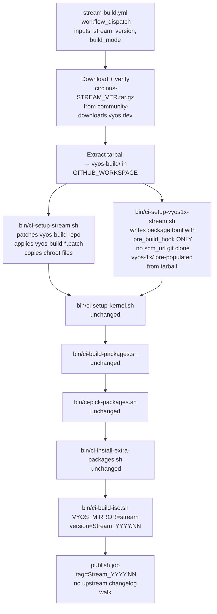
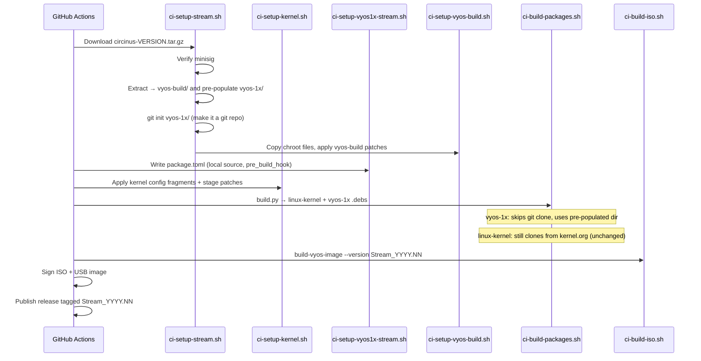

# VyOS Stream Build Plan for LS1046A

## Goal

Add a second GitHub Actions workflow (`stream-build.yml`) that builds a VyOS LS1046A image from a **frozen, signed Stream source tarball** (e.g. `circinus-2025.11.tar.gz` from `https://community-downloads.vyos.dev/stream/2025.11/`), applies all existing LS1046A patches, and publishes a GitHub Release tagged `Stream_YYYY.NN` (e.g. `Stream_2026.03`).

The existing `auto-build.yml` rolling/daily workflow is **not touched**.

---

## Background: How the Current Workflow Gets Its Sources

```mermaid
flowchart TD
    A[auto-build.yml] --> B[actions/checkout@v6\n vyos/vyos-build HEAD]
    A --> C[bin/ci-setup-vyos1x.sh\n writes package.toml\n scm_url=github.com/vyos/vyos-1x\n commit_id=current]
    B --> D[vyos-build/scripts/package-build/\n build.py]
    C --> D
    D --> E[git clone vyos-1x at current]
    D --> F[git clone linux-kernel source]
    E --> G[apply our patches via pre_build_hook]
    F --> H[apply our kernel patches]
    G --> I[dpkg-buildpackage → .deb]
    H --> I
    I --> J[build-vyos-image → ISO]
```

**Two sources come from upstream git at build time:**
- `vyos-build` repo — checked out via `actions/checkout` step, branch HEAD
- `vyos-1x` — cloned inside `build.py` via `scm_url = "https://github.com/vyos/vyos-1x.git"` + `commit_id = "current"`

**Everything else** (kernel, drivers, other packages) comes from separate `scm_url` entries inside the `linux-kernel/package.toml` already present inside the checked-out `vyos-build`.

---

## How the Stream Tarball Works

The Stream tarball (e.g. `circinus-2025.11.tar.gz`) is a **monorepo snapshot** released alongside each quarterly Stream ISO. It contains:

```
circinus-2025.11/
  vyos-build/          ← frozen snapshot of vyos-build at stream build time
  vyos-1x/             ← frozen snapshot of vyos-1x at stream build time
  <other packages>/    ← all other packages built from source, each in a subdir
```

The key insight from reading `build.py`:

```python
if not repo_dir.exists():
    run(['git', 'clone', package['scm_url'], str(repo_dir)], check=True)
run(['git', 'checkout', package['commit_id']], cwd=repo_dir, check=True)
```

**If `repo_dir` already exists, `build.py` skips `git clone` entirely** and goes straight to `git checkout`. This is the hook we exploit: pre-populate `vyos-1x/` from the tarball before `build.py` runs, and it will use the frozen source.

---

## Architecture: New Stream Workflow



---

## Files to Create / Modify

### New files

| File | Purpose |
|------|---------|
| `.github/workflows/stream-build.yml` | New workflow, `workflow_dispatch` only, no cron |
| `bin/ci-setup-stream.sh` | Downloads tarball, verifies minisig, extracts to `vyos-build/` |
| `bin/ci-setup-vyos1x-stream.sh` | Writes `package.toml` with empty `scm_url` / local pre-populated dir strategy |

### Existing files that stay **unchanged**
- `bin/ci-setup-kernel.sh` — kernel config + patches, identical
- `bin/ci-build-packages.sh` — builds linux-kernel and vyos-1x, identical
- `bin/ci-pick-packages.sh` — package filtering, identical
- `bin/ci-install-extra-packages.sh` — third-party binaries, identical
- All `data/vyos-1x-*.patch` — same patches applied via `pre_build_hook`
- All `data/kernel-*` — unchanged
- All `data/scripts/`, `data/hooks/`, `data/systemd/` — unchanged

### `bin/ci-setup-vyos-build.sh` — reused as-is
The chroot file copying in this script is board-specific and applies equally to stream builds. No separate stream variant needed.

---

## Detailed Design

### 1. `stream-build.yml` — Workflow inputs

```yaml
on:
  workflow_dispatch:
    inputs:
      stream_version:
        description: 'VyOS Stream version (e.g. 2025.11)'
        required: true
        default: '2025.11'
      release_tag:
        description: 'GitHub release tag (e.g. Stream_2025.11)'
        default: ''
      BUILD_BY:
        description: 'Builder identifier'
        default: ''
      build_mode:
        description: 'Kernel build mode'
        type: choice
        options: [mainline, sdk-ask]
        default: 'mainline'
```

`release_tag` defaults to `Stream_<stream_version>` if left blank.

**No cron schedule** — stream is quarterly, manual dispatch only.

**Same runner + container** as `auto-build.yml`:
- `runs-on: ubuntu-24.04-arm`
- `image: ghcr.io/huihuimoe/vyos-arm64-build/vyos-builder:current-arm64`

### 2. `bin/ci-setup-stream.sh` — Tarball fetch + extract

Replaces the `actions/checkout vyos/vyos-build` step entirely. Responsibilities:

1. **Download** `circinus-${STREAM_VERSION}.tar.gz` from `https://community-downloads.vyos.dev/stream/${STREAM_VERSION}/`
2. **Download** `.minisig` file from same location
3. **Verify** signature with the VyOS Stream minisign public key:
   `RWTR1ty93Oyontk6caB9WqmiQC4fgeyd/ejgRxCRGd2MQej7nqebHneP`
   (key is published on https://vyos.net/get/stream/)
4. **Extract** tarball — the top-level directory is `circinus-${STREAM_VERSION}/`
5. **Move** `circinus-${STREAM_VERSION}/vyos-build` → `vyos-build/` in `GITHUB_WORKSPACE`
6. **Move** `circinus-${STREAM_VERSION}/vyos-1x` → `vyos-build/scripts/package-build/vyos-1x/vyos-1x/` so `build.py` finds it pre-populated

Then run the existing `bin/ci-setup-vyos-build.sh` logic (copy chroot files, apply `vyos-build-*.patch`, etc.).

> **Why move vyos-1x into the package-build subdir?**
> `build.py` runs from `scripts/package-build/vyos-1x/` and looks for `repo_dir = Path("vyos-1x")` relative to its CWD. So the pre-populated source must land at `vyos-build/scripts/package-build/vyos-1x/vyos-1x/`.

### 3. `bin/ci-setup-vyos1x-stream.sh` — Frozen-source package.toml

The critical difference from the rolling `ci-setup-vyos1x.sh`:

**Rolling** (`ci-setup-vyos1x.sh`) writes:
```toml
[[packages]]
name = "vyos-1x"
commit_id = "current"
scm_url = "https://github.com/vyos/vyos-1x.git"
```
→ `build.py` does a fresh `git clone` + `git checkout current`

**Stream** (`ci-setup-vyos1x-stream.sh`) must write:
```toml
[[packages]]
name = "vyos-1x"
commit_id = "HEAD"
scm_url = ""
```
But `build.py` unconditionally calls `git checkout <commit_id>` even when it skips clone. The pre-populated `vyos-1x/` from the tarball is **not a git repo** — it's just files. This means `git checkout HEAD` would fail.

**Solution:** Run `git init && git add -A && git commit -m "stream"` on the pre-populated directory to make it a minimal git repo, so `git checkout HEAD` is a no-op.

The `pre_build_hook` remains identical to the rolling workflow (same patches, same reftree.cache copy, same Makefile hack).

### 4. `VYOS_MIRROR` for Stream

Stream packages live at a different APT mirror than rolling:

| Build type | `VYOS_MIRROR` |
|-----------|--------------|
| Rolling (`auto-build.yml`) | `https://packages.vyos.net/repositories/current/` |
| Stream (`stream-build.yml`) | `https://packages.vyos.net/repositories/stream/` |

This is set as a workflow-level `env:` in `stream-build.yml`.

### 5. Version string

The version passed to `build-vyos-image --version` for stream builds:

```
Stream_2025.11-LS1046A
```

Format: `Stream_<stream_version>-LS1046A`

The release tag on GitHub: `Stream_2025.11` (without `-LS1046A` suffix, cleaner for users).

### 6. Publish job — simplified changelog

The rolling workflow's publish job walks `vyos/vyos-1x` and `vyos/vyos-build` git history since last build to generate a changelog. For stream builds, there is no incremental history — it's a point-in-time frozen source.

**Stream publish job** replaces the changelog steps with a static note:
```
## LS1046A Stream Build

VyOS Stream ${stream_version} with LS1046A hardware support patches.
Source: circinus-${stream_version}.tar.gz (https://vyos.net/get/stream/)
```

Everything else in publish (artifact download, GitHub release creation, version.json update) is the same.

---

## Workflow Sequence (stream-build.yml)



---

## Edge Cases and Risks

| Risk | Mitigation |
|------|-----------|
| Stream tarball `vyos-build` is newer than our `vyos-build-*.patch` hunks | Patches applied with `|| true`; CI output shows failures. Patches may need rebase for each stream version. |
| Stream tarball `vyos-1x` has incompatible structure for `vyos-1x-*.patch` | Same `|| true` strategy; patch failures are logged as warnings not errors |
| `build.py` `git checkout HEAD` fails on git-init'd dir | Ensure `git commit` is run so HEAD resolves |
| Stream mirror `packages.vyos.net/repositories/stream/` requires auth | Verify mirror is publicly accessible (it was for 2025.11) |
| Stream tarball may contain other packages that are NOT in the rolling `linux-kernel/package.toml` | `ci-build-packages.sh` only builds `linux-kernel` and `vyos-1x` — other packages ignored |
| `vyos-build` in tarball may have different `build-vyos-image` CLI flags | Test with `--dry-run` or inspect `build-vyos-image --help` from extracted tarball |

---

## What Does NOT Change

- All `data/vyos-1x-*.patch` patches — applied identically via `pre_build_hook`
- All kernel config fragments (`data/kernel-config/ls1046a-*.config`)
- All kernel patches (`data/kernel-patches/`)
- DTB build logic in `ci-build-packages.sh`
- USB image creation in `ci-build-iso.sh`
- `data/config.boot.default` and all chroot/hook files
- `data/scripts/vyos-postinstall` and U-Boot env setup
- Signing with `MOK.key` and `minisign`

---

## Implementation Order

1. Create [`bin/ci-setup-stream.sh`](../bin/ci-setup-stream.sh) — tarball fetch, verify, extract, git init
2. Create [`bin/ci-setup-vyos1x-stream.sh`](../bin/ci-setup-vyos1x-stream.sh) — package.toml with local source
3. Create [`.github/workflows/stream-build.yml`](../.github/workflows/stream-build.yml) — new workflow wiring all steps together
4. Test with `stream_version = 2025.11` (latest available as of 2026-04)
5. On success, tag `Stream_2025.11` release

---

## Stream Versions Available (as of 2026-04)

| Tag | Tarball URL |
|-----|-------------|
| `2025.11` | `https://community-downloads.vyos.dev/stream/2025.11/circinus-2025.11.tar.gz` |
| `1.5-stream-2025-Q2` | `https://community-downloads.vyos.dev/stream/1.5-stream-2025-Q2/circinus-1.5-stream-2025-Q2.tar.gz` |
| `1.5-stream-2025-Q1` | `https://community-downloads.vyos.dev/stream/1.5-stream-2025-Q1/circinus-1.5-stream-2025-Q1.tar.gz` |

Start with `2025.11` (newest, most likely to have compatible upstream patches).
