# ASK Kernel Port — Defects & Fixes

> **Date:** 2026-04-08
> **Source files reviewed:**
> - `data/kernel-patches/ask/comcerto_fp_netfilter.c`
> - `data/kernel-patches/ask/ipsec_flow.c`
> - `data/kernel-patches/ask/xt_qosmark.c`
> - `data/kernel-patches/ask/inject-ask-hooks.py` (755 lines, 9 phases)
> - `data/kernel-config/ls1046a-ask.config`
> - `data/kernel-config/ls1046a-sdk.config`
>
> **Verdict:** Safe to run for hardware validation. Fix all 4 defects before production ISO.

---

## Defect 1: TOCTOU Race in `ipsec_flow_add()` — Duplicate Flow Insertion

**Severity:** 🔴 High (data corruption under concurrent softirq)
**File:** `data/kernel-patches/ask/ipsec_flow.c` lines 95–143

### Problem

The function searches the hash bucket under `spin_lock_bh`, then **releases the lock** to allocate memory, then re-acquires the lock to insert. Between unlock and re-lock, another CPU can insert the same flow key, creating a duplicate entry.

```c
// Current code (lines 95–143):
hash = (flow_hash_code(flow, keysize) & (IPSEC_FLOW_TABLE_SIZE - 1));

spin_lock_bh(&ft->ipsec_flow_lock);
hlist_for_each_entry(tfle, &ft->hash_table[hash], hlist) {
    if (/* match */) {
        /* update existing flow */
        spin_unlock_bh(&ft->ipsec_flow_lock);
        return update ? 1 : 0;
    }
}
spin_unlock_bh(&ft->ipsec_flow_lock);   // ← UNLOCKS

// Window: another CPU can insert same flow here

fle = kmem_cache_alloc(ipsec_flow_cachep, GFP_ATOMIC);  // alloc outside lock
if (fle) {
    /* populate fle */
    spin_lock_bh(&ft->ipsec_flow_lock);   // ← RE-LOCKS
    hlist_add_head(&fle->hlist, ...);      // ← duplicate possible!
    ft->flow_cnt++;
    spin_unlock_bh(&ft->ipsec_flow_lock);
}
```

### Impact

- Duplicate `flow_entry` objects in the same hash bucket
- MURAM waste: CDX programs the same CC hash entry twice
- Memory leak: the duplicate is never found by `ipsec_flow_remove()` (which removes only the first match and returns)

### Fix

Hold the lock across the entire search→alloc→insert sequence. `GFP_ATOMIC` is already used, so allocation under `spin_lock_bh` is safe (no sleeping).

```c
int ipsec_flow_add(struct net *net, const struct flowi *flow, u16 family,
                   u8 dir, u16 *xfrm_handle)
{
    size_t keysize;
    struct flow_entry *tfle, *fle;
    struct flow_table *ft;
    u32 hash;
    u16 index, update = 0;

    ft = &ipsec_flow_table_global;
    keysize = flow_key_size(family);
    if (!keysize)
        return 0;

    hash = flow_hash_code(flow, keysize) & (IPSEC_FLOW_TABLE_SIZE - 1);

    spin_lock_bh(&ft->ipsec_flow_lock);

    /* Search for existing flow */
    hlist_for_each_entry(tfle, &ft->hash_table[hash], hlist) {
        if (tfle->net == net &&
            tfle->family == family &&
            tfle->dir == dir &&
            ipsec_flow_compare(flow, &tfle->flow, keysize) == 0) {
            /* Flow found — update handles */
            for (index = 0; index < XFRM_POLICY_TYPE_MAX; index++) {
                if (tfle->xfrm_handle[index] != xfrm_handle[index]) {
                    tfle->xfrm_handle[index] = xfrm_handle[index];
                    update = 1;
                }
            }
            spin_unlock_bh(&ft->ipsec_flow_lock);
            return update ? 1 : 0;
        }
    }

    /* Not found — allocate and insert under the same lock */
    fle = kmem_cache_alloc(ipsec_flow_cachep, GFP_ATOMIC);
    if (!fle) {
        spin_unlock_bh(&ft->ipsec_flow_lock);
        pr_err("%s: Failed to alloc memory, flow is not pushed\n", __func__);
        return 0;
    }

    fle->net = net;
    fle->family = family;
    fle->dir = dir;
    memcpy(&fle->flow, flow, keysize * sizeof(flow_compare_t));
    memcpy(fle->xfrm_handle, xfrm_handle, XFRM_POLICY_TYPE_MAX * sizeof(u16));
    hlist_add_head(&fle->hlist, &ft->hash_table[hash]);
    ft->flow_cnt++;

    spin_unlock_bh(&ft->ipsec_flow_lock);
    return 1;
}
```

---

## Defect 2: Deterministic Hash Seed — DoS-able Flow Table

**Severity:** 🔴 High (network-reachable denial of service)
**File:** `data/kernel-patches/ask/ipsec_flow.c` line 53

### Problem

```c
static u32 flow_hash_code(const struct flowi *flow, size_t keysize)
{
    const u32 *k = (const u32 *)flow;
    const u32 length = keysize * sizeof(flow_compare_t) / sizeof(u32);
    const u32 hash_random = 0; /*FIXME */

    return jhash2(k, length, hash_random);
}
```

`hash_random = 0` makes the hash function completely deterministic. An attacker who can originate flows through the gateway (e.g., from the WAN side) can craft 5-tuples that all hash to the same bucket, turning O(1) lookups into O(n) scans under `spin_lock_bh` — stalling all packet processing on that CPU.

### Impact

- CPU stall under `spin_lock_bh` during `ipsec_flow_add()` / `ipsec_flow_remove()`
- Forwarding degradation proportional to number of colliding flows
- On a gateway with public-facing interfaces, this is exploitable

### Fix

Initialize the seed once at module init with a random value:

```c
static u32 ipsec_flow_hash_rnd __read_mostly;

static u32 flow_hash_code(const struct flowi *flow, size_t keysize)
{
    const u32 *k = (const u32 *)flow;
    const u32 length = keysize * sizeof(flow_compare_t) / sizeof(u32);

    return jhash2(k, length, ipsec_flow_hash_rnd);
}
```

In `ipsec_flow_init()`:
```c
int ipsec_flow_init(struct net *net)
{
    /* ... existing code ... */
    ipsec_flow_hash_rnd = get_random_u32();
    return 0;
}
```

---

## Defect 3: `ipsec_flow_fini()` Leaks All Flow Entries

**Severity:** 🔴 High (memory leak at module unload)
**File:** `data/kernel-patches/ask/ipsec_flow.c` lines 211–218

### Problem

```c
void ipsec_flow_fini(struct net *net)
{
    struct flow_table *ft;
    ft = &ipsec_flow_table_global;
    kfree(ft->hash_table);   // frees the bucket array only
}
```

`kfree(ft->hash_table)` frees the array of `hlist_head` pointers, but every `flow_entry` linked via `hlist_add_head()` in `ipsec_flow_add()` is leaked. These were allocated with `kmem_cache_alloc(ipsec_flow_cachep, ...)`.

### Impact

- On module unload: `kmem_cache_destroy()` (if called) will WARN about active objects
- On net namespace teardown: dangling pointers in the freed bucket array
- Not exploitable, but fails `CONFIG_DEBUG_SLAB` / `KMEMLEAK` checks and leaves pages unreclaimable

### Fix

Walk all buckets and free every entry before freeing the bucket array:

```c
void ipsec_flow_fini(struct net *net)
{
    struct flow_table *ft;
    struct flow_entry *tfle;
    struct hlist_node *tmp;
    int i;

    ft = &ipsec_flow_table_global;

    spin_lock_bh(&ft->ipsec_flow_lock);
    for (i = 0; i < IPSEC_FLOW_TABLE_SIZE; i++) {
        hlist_for_each_entry_safe(tfle, tmp, &ft->hash_table[i], hlist) {
            hlist_del(&tfle->hlist);
            kmem_cache_free(ipsec_flow_cachep, tfle);
        }
    }
    ft->flow_cnt = 0;
    spin_unlock_bh(&ft->ipsec_flow_lock);

    kfree(ft->hash_table);
    ft->hash_table = NULL;
}
```

---

## Defect 4: Misleading Indentation in `fp_netfilter_pre_routing()` — Trap for Future Edits

**Severity:** 🟡 Medium (readability / maintainability bug, not a runtime bug)
**File:** `data/kernel-patches/ask/comcerto_fp_netfilter.c` lines 175–192

### Problem

```c
    // Lines 175-179 — correctly braced:
    if (fp_info->mark && (fp_info->mark != skb->mark))
        pr_debug("fp_pre: mark changed %x -> %x\n", fp_info->mark, skb->mark);

    if (fp_info->ifindex && (fp_info->ifindex != skb->dev->ifindex))
        pr_debug("fp_pre: ifindex changed %d -> %d\n", fp_info->ifindex, skb->dev->ifindex);

// Lines 181-189 — ZERO INDENTATION, no braces:
if (fp_info->iif_index && (fp_info->iif_index != skb->skb_iif))
pr_debug("fp_pre: iif changed %d -> %d\n", fp_info->iif_index, skb->skb_iif);

fp_info->mark = skb->mark;                     // ← looks like it could be inside the if
fp_info->ifindex = skb->dev->ifindex;           // ← but it's not
fp_info->iif_index = skb->skb_iif;
```

The three assignment lines run unconditionally — this is correct behavior. But the zero-indentation `if` without braces followed by unindented statements creates a visual trap. A future maintainer adding another `pr_debug` or conditional could easily introduce a bug by assuming the assignments are conditional.

### Impact

- No runtime bug **today**
- High risk of introducing a bug on next edit to this function
- Would fail `-Wmisleading-indentation` if GCC had visibility into the post-injection source (the hook injector inserts raw text without formatting passes)

### Fix

Normalize indentation and add braces for consistency with the surrounding code:

```c
	if (fp_info->iif_index && (fp_info->iif_index != skb->skb_iif))
		pr_debug("fp_pre: iif changed %d -> %d\n",
			 fp_info->iif_index, skb->skb_iif);

	fp_info->mark = skb->mark;
	fp_info->ifindex = skb->dev->ifindex;
	fp_info->iif_index = skb->skb_iif;
```

---

## Minor Issues (Non-blocking)

| # | File | Line | Issue | Fix |
|---|------|------|-------|-----|
| M1 | `comcerto_fp_netfilter.c` | 52 | `printk(KERN_ERR ...)` — use `pr_err()` for consistency | `s/printk(KERN_ERR/pr_err(/` |
| M2 | `comcerto_fp_netfilter.c` | 142–356 | Dead `#if LINUX_VERSION_CODE >= KERNEL_VERSION(4,4,0)` branches — kernel 6.6 always takes the `>= 4.4.0` path | Remove all `#elif`/`#else` branches for `< 4.4.0` and `< 4.0.0` |
| M3 | `ipsec_flow.c` | 92,99,124 | Missing spaces: `if(!keysize)`, `if(fle)`, `if(tfle->net == net &&` | Add spaces per kernel coding style |
| M4 | `ipsec_flow.c` | 178 | `pr_err()` for normal condition (flow not found during remove) | Change to `pr_debug()` |
| M5 | `inject-ask-hooks.py` | 274–278 | `ipsec_flow.o` added to `net/xfrm/Makefile` under both `CONFIG_INET_IPSEC_OFFLOAD` and `CONFIG_INET6_IPSEC_OFFLOAD` — compiles the .o twice if both are `=y` (duplicate symbol at link) | Use a single `obj-$(CONFIG_INET_IPSEC_OFFLOAD)` line, or introduce `CONFIG_IPSEC_FLOW` as an umbrella symbol |
| M6 | `inject-ask-hooks.py` | 541 | Anchor `unsigned int zone_id;` in `nf_conntrack_core.c` is fragile — a VyOS kernel bump that renames this variable silently drops all ASK conntrack hooks | Add a fallback anchor or post-injection verification that the inserted code exists |
| M7 | `ls1046a-sdk.config` | 36 | Comment says `STRICT_DEVMEM` disabled for "future pass" — it's also needed NOW by `dpa_app`/`fmc` accessing `/dev/fm0*` | Update comment to reflect current necessity |

---

## Fix Priority

```mermaid
gantt
    title Defect Fix Order
    dateFormat X
    axisFormat %s

    section Critical (before ISO)
    D2 Hash seed randomization     :d2, 0, 1
    D1 TOCTOU race in flow_add     :d1, 1, 2
    D3 flow_fini leak              :d3, 2, 3

    section Important (before merge)
    D4 Misleading indentation      :d4, 3, 4
    M5 Double ipsec_flow.o         :m5, 4, 5

    section Cleanup (any time)
    M1-M4 Style fixes              :m14, 5, 6
    M6-M7 Comment/anchor fixes     :m67, 6, 7
```



**Estimated effort:** ~2 hours for all 4 defects + 5 minor issues. All fixes are localized (no cross-file dependencies).
