# ASK Userspace Port — Defects & Fixes

> **Date:** 2026-04-08
> **Source files reviewed:**
> - `data/scripts/cdx_init.c` (286 lines)
> - `data/scripts/ask-activate.sh` (402 lines, 8 phases)
> - `data/scripts/proc_cleanup.c` (32 lines)
>
> **Companion document:** [`plans/port_defects.md`](port_defects.md) — kernel-side defects (D1–D4, M1–M7)
>
> **Verdict:** Safe for dev-loop TFTP testing. Fix U1 before any installed-system usage. Fix U2–U7 before production ISO.

---

## Defect U1: System `libnfnetlink` Replaced Without Backup — Unrecoverable

**Severity:** 🔴 High (unrecoverable system modification)
**File:** [`data/scripts/ask-activate.sh`](../data/scripts/ask-activate.sh:88) line 88

### Problem

```bash
# Line 88:
cp /usr/local/lib/libnfnetlink.so.0.2.0 /usr/lib/aarch64-linux-gnu/libnfnetlink.so.0.2.0
```

This **overwrites the Debian-packaged `libnfnetlink0` file** with the NXP-patched version that adds `nfnl_set_nonblocking_mode()` (required by CMM). There is no backup, no version check, and no `dpkg-divert`.

### Impact

- `apt` can no longer verify `libnfnetlink0` package integrity (`debsums` will flag corruption)
- Rolling back requires manual `apt install --reinstall libnfnetlink0`
- If the NXP `.so` has a different internal ABI or is missing symbols that other packages depend on, conntrack tools/nftables may segfault
- On an installed VyOS system, a future `apt upgrade` may silently overwrite the NXP version, breaking CMM

### Fix

Use `LD_PRELOAD` scoped to CMM only — do not modify system libraries:

```bash
# In Phase 8 (CMM launch), scope the NXP lib:
LD_PRELOAD=/usr/local/lib/libnfnetlink.so.0.2.0 \
    /usr/local/bin/cmm -f /etc/config/fastforward -n 65536 &
```

Or, if `LD_PRELOAD` causes symbol conflicts, use `dpkg-divert`:

```bash
# Preserve the original and register the diversion with dpkg:
dpkg-divert --add --rename --divert \
    /usr/lib/aarch64-linux-gnu/libnfnetlink.so.0.2.0.dpkg-orig \
    /usr/lib/aarch64-linux-gnu/libnfnetlink.so.0.2.0
cp /usr/local/lib/libnfnetlink.so.0.2.0 \
    /usr/lib/aarch64-linux-gnu/libnfnetlink.so.0.2.0
```

At minimum, preserve the original before overwriting:
```bash
cp -n /usr/lib/aarch64-linux-gnu/libnfnetlink.so.0.2.0 \
      /usr/lib/aarch64-linux-gnu/libnfnetlink.so.0.2.0.dpkg-bak
```

---

## Defect U2: `tar` Extraction Failure Silently Masked

**Severity:** 🟡 Medium (silent failure → confusing downstream errors)
**File:** [`data/scripts/ask-activate.sh`](../data/scripts/ask-activate.sh:54) line 54

### Problem

```bash
tar xzf /tmp/ask-deploy.tar.gz -C /tmp/ 2>/dev/null || true
```

`2>/dev/null || true` suppresses both the error output **and** the nonzero exit code. If the tarball is corrupt, truncated, or includes unsupported features (e.g., xattrs on a filesystem that doesn't support them), extraction silently fails. The subsequent `cp` commands in Phase 1 (lines 60–104) then fail with "No such file or directory" — but those failures are also individually suppressed with `|| true`.

### Impact

- On a corrupt download (TFTP truncation, HTTP timeout), the script reports "Phase 1 complete: binaries installed" with zero binaries actually installed
- Debugging requires manually running `tar xzf` to see the error

### Fix

Check the exit code explicitly; only suppress non-fatal warnings:

```bash
if ! tar xzf /tmp/ask-deploy.tar.gz -C /tmp/; then
    die "Failed to extract ask-deploy.tar.gz — tarball may be corrupt"
fi
```

---

## Defect U3: Notrack Rule Deletion Removes Only First Handle Per Chain

**Severity:** 🟡 Medium (incomplete conntrack activation)
**File:** [`data/scripts/ask-activate.sh`](../data/scripts/ask-activate.sh:117) line 117

### Problem

```bash
handle=$(nft -a list chain ${family} vyos_conntrack "${chain}" 2>/dev/null \
    | grep 'notrack' | grep -o 'handle [0-9]*' | awk '{print $2}' | head -n 1)
if [ -n "$handle" ]; then
    nft delete rule ${family} vyos_conntrack "${chain}" handle "$handle" ...
fi
```

`head -n 1` takes only the **first** notrack rule handle. VyOS 1.4+ can add multiple notrack rules per chain (e.g., one for each zone pair). The outer loop iterates `(family, chain)` pairs but each iteration only deletes one rule.

### Impact

- Surviving notrack rules bypass the conntrack hooks that `fp_netfilter_pre_routing()` depends on
- ASK cannot populate `ct->fp_info[dir]` for non-tracked flows → zero offload on those flows
- The script reports success, but `cat /proc/net/nf_conntrack` shows fewer entries than expected

### Fix

Loop until all notrack rules are removed from each chain:

```bash
for family in ip ip6; do
    for chain in PREROUTING OUTPUT; do
        while true; do
            handle=$(nft -a list chain ${family} vyos_conntrack "${chain}" 2>/dev/null \
                | grep 'notrack' | grep -o 'handle [0-9]*' | awk '{print $2}' | head -n 1)
            [ -n "$handle" ] || break
            nft delete rule ${family} vyos_conntrack "${chain}" handle "$handle" 2>/dev/null || break
            log "Removed notrack from ${family} vyos_conntrack ${chain} (handle $handle)"
        done
    done
done
```

---

## Defect U4: `ct_force` NFT Table Persists After ASK Stops

**Severity:** 🟡 Medium (persistent side effect)
**File:** [`data/scripts/ask-activate.sh`](../data/scripts/ask-activate.sh:128) lines 128–134

### Problem

```bash
nft add table inet ct_force
nft add chain inet ct_force prerouting '{ type filter hook prerouting priority -200; }'
nft add chain inet ct_force output '{ type filter hook output priority -200; }'
nft add rule inet ct_force prerouting ct state new counter accept
nft add rule inet ct_force output ct state new counter accept
```

The table is created to force-activate lazy-loaded conntrack hooks (kernel 6.6). It is never removed — not on script completion, not on re-run, not when ASK is stopped (`killall cmm`).

### Impact

- An orphaned nft table at priority -200 continues intercepting all prerouting/output traffic
- Not harmful to forwarding (it just accepts), but the `ct state new counter` rule increments counters forever
- `nft list tables` shows an unexplained `inet ct_force` that confuses VyOS firewall audits
- No teardown script exists (see cross-cutting concern X1)

### Fix

Add conditional cleanup at the top of the script (idempotent restart) and document the teardown:

```bash
# Cleanup from previous run (idempotent)
nft delete table inet ct_force 2>/dev/null || true

# Later, create fresh:
nft add table inet ct_force
...
```

And add a cleanup function:
```bash
cleanup_ct_force() {
    nft delete table inet ct_force 2>/dev/null || true
}
# Call on deactivation or script error
trap cleanup_ct_force EXIT  # only if we want cleanup on failure
```

---

## Defect U5: Hardcoded Gateway Fallback Installs Wrong Default Route

**Severity:** 🟡 Medium (silent misconfiguration outside lab)
**File:** [`data/scripts/ask-activate.sh`](../data/scripts/ask-activate.sh:335) lines 333–338

### Problem

```bash
WAN_GW=$(ip -4 route show dev "${WAN_IF}" 2>/dev/null | grep -oP 'via \K[\d.]+' | head -1)
if [ -z "$WAN_GW" ]; then
    WAN_GW="192.168.1.1"    # ← Mono lab router
fi
ip route add default via "${WAN_GW}" dev "${WAN_IF}" 2>/dev/null || true
```

If eth2 doesn't have a DHCP-assigned route yet, the script installs `default via 192.168.1.1 dev eth2` — a route that is only valid on the Mono Technologies lab network. On any other network, this creates an incorrect default route.

### Impact

- Device loses Internet access if 192.168.1.1 is not the correct gateway
- The incorrect route looks plausible in `ip route`, making diagnosis difficult
- Any existing default route is unconditionally deleted (line 333: `ip route del default`)

### Fix

Move the fallback to the configuration block at the top, and warn when using it:

```bash
# At top of script:
WAN_GW_FALLBACK="${WAN_GW_FALLBACK:-192.168.1.1}"  # Override with env var

# In Phase 7:
WAN_GW=$(ip -4 route show dev "${WAN_IF}" 2>/dev/null | grep -oP 'via \K[\d.]+' | head -1)
if [ -z "$WAN_GW" ]; then
    log "WARNING: No gateway found on ${WAN_IF} — using fallback ${WAN_GW_FALLBACK}"
    WAN_GW="${WAN_GW_FALLBACK}"
fi
```

---

## Defect U6: Port Comment Labels Swapped in `cdx_init.c`

**Severity:** 🟡 Medium (maintenance trap — wrong debug info)
**File:** [`data/scripts/cdx_init.c`](../data/scripts/cdx_init.c:168) lines 19–26 and 168–174

### Problem

The header comment and inline comments show:
```c
/* Line 19-26 (header): */
//  MAC2  cell-index=1  1G  → eth1 (left RJ45)
//  MAC5  cell-index=4  1G  → eth2 (center RJ45)
//  MAC6  cell-index=5  1G  → eth0 (right RJ45)

/* Lines 168-170 (port table): */
{ 0, 1, 1, 1,  "MAC2" },   /* eth1 (left RJ45) */
{ 0, 4, 4, 1,  "MAC5" },   /* eth2 (center RJ45) */
{ 0, 5, 5, 1,  "MAC6" },   /* eth0 (right RJ45) */
```

But per `AGENTS.md` physical mapping (confirmed via DT `local-mac-address` on hardware):
```
eth0 = left RJ45   (MAC5/e8000, cell-index=4)
eth1 = center RJ45 (MAC6/ea000, cell-index=5)
eth2 = right RJ45  (MAC2/e2000, cell-index=1)
```

### Impact

- Comment-level only — the port table **data** (`fm_index`, `index`, `portid`, `type`) is correct and the kernel resolves against netdev via `find_osdev_by_fman_params()` regardless of the `name` field for eth ports
- However, anyone debugging CDX port routing by reading the comments will believe portid=1 is eth1-left, when it is actually eth2-right
- Confuses `cdx_init -v` verbose output (prints comment-sourced names like "MAC2" for eth1, which doesn't match `ip link`)

### Fix

Correct all three comment blocks:

```c
/* Port mapping (LS1046A Mono Gateway):
 *   MAC2  cell-index=1  1G  → eth2 (right RJ45)
 *   MAC5  cell-index=4  1G  → eth0 (left RJ45)
 *   MAC6  cell-index=5  1G  → eth1 (center RJ45)
 *   MAC9  cell-index=8→0  10G → eth3 (left SFP+)
 *   MAC10 cell-index=9→1  10G → eth4 (right SFP+)
 */

/* ... */

{ 0, 1, 1, 1,  "MAC2" },   /* eth2 (right RJ45) - cell-index=1 */
{ 0, 4, 4, 1,  "MAC5" },   /* eth0 (left RJ45) - cell-index=4 */
{ 0, 5, 5, 1,  "MAC6" },   /* eth1 (center RJ45) - cell-index=5 */
```

---

## Defect U7: `remove_proc_entry()` WARNs on Nonexistent Entries

**Severity:** 🟡 Medium (kernel WARN splat in dmesg)
**File:** [`data/scripts/proc_cleanup.c`](../data/scripts/proc_cleanup.c:20) lines 20–23

### Problem

```c
remove_proc_entry("oh1", NULL);
pr_info("proc_cleanup: removed /proc/oh1\n");

remove_proc_entry("oh2", NULL);
pr_info("proc_cleanup: removed /proc/oh2\n");
```

[`remove_proc_entry()`](https://elixir.bootlin.com/linux/v6.6/source/fs/proc/generic.c) triggers a `WARN()` with a stack trace if the entry doesn't exist:

```c
// fs/proc/generic.c — kernel 6.6:
WARN(1, "name '%s'\n", name);
```

If `proc_cleanup.ko` is loaded before CDX has created `/proc/oh1` and `/proc/oh2` (or if it's loaded twice), the kernel log is polluted with WARNING backtraces. These look alarming and may trigger monitoring alerts.

Note: `remove_proc_subtree("fqid_stats", NULL)` on line 16 is safe — `remove_proc_subtree()` silently returns if the subtree doesn't exist.

### Impact

- Two `WARN()` backtraces in dmesg per `insmod proc_cleanup.ko` when entries don't exist
- `CONFIG_PANIC_ON_WARN=y` (if enabled) would crash the kernel
- `pr_info("removed /proc/oh1")` prints even when the entry didn't exist
- Misleading "success" messages

### Fix

Use `remove_proc_subtree()` for all three entries (safe on nonexistent names):

```c
static int __init proc_cleanup_init(void)
{
    remove_proc_subtree("fqid_stats", NULL);
    pr_info("proc_cleanup: removed /proc/fqid_stats\n");

    remove_proc_subtree("oh1", NULL);
    pr_info("proc_cleanup: removed /proc/oh1\n");

    remove_proc_subtree("oh2", NULL);
    pr_info("proc_cleanup: removed /proc/oh2\n");

    return -ECANCELED;
}
```

Or check existence first:

```c
if (proc_mkdir_data("oh1", 0, NULL, NULL)) {
    /* existed, was just re-created — remove it */
    remove_proc_entry("oh1", NULL);
}
```

The `remove_proc_subtree()` approach is simpler and correct.

---

## Minor Issues (Non-blocking)

| # | File | Line | Issue | Fix |
|---|------|------|-------|-----|
| M8 | `ask-activate.sh` | 150–153 | Module signing path `/opt/vyos-dev/linux/certs/` hardcoded to LXC 200 build environment — guarded by `-f` but unexplained | Add comment explaining this only applies on dev-loop TFTP boots |
| M9 | `ask-activate.sh` | 159,173 | `insmod` used instead of `modprobe` — `depmod -a` already ran at line 62 | Use `modprobe cdx` and `modprobe fci` |
| M10 | `ask-activate.sh` | 366–374 | CMM liveness check via `kill -0 $CMM_PID` is racy — CMM may daemonize (re-exec), changing its PID | Use `pgrep -x cmm` (already used at line 387) |
| M11 | `ask-activate.sh` | 255,263 | `dhclient &` then bare `wait` reaps all background jobs, not just dhclient PIDs | Collect PIDs: `PIDS+=($!)` then `wait "${PIDS[@]}"` |
| M12 | `ask-activate.sh` | 141,388 | `cat /proc/net/nf_conntrack \| wc -l` — useless use of cat | `wc -l < /proc/net/nf_conntrack` |
| M13 | `cdx_init.c` | 251–256 | IPR parameters (timeout=50, max_frags=16, etc.) are magic numbers with no `#define` names | Add `#define CDX_IPR_TIMEOUT_MS 50` etc. |
| M14 | `cdx_init.c` | 188–189 | No `-h`/`--help` flag — `./cdx_init --help` falls through to opening `/dev/fm0-pcd` | Add usage check: `if (argc > 1 && strcmp(argv[1], "-h") == 0)` |
| M15 | `proc_cleanup.c` | 30–31 | No `module_exit()` defined — `rmmod proc_cleanup` confuses users | Acceptable (module auto-fails load), but add comment to `MODULE_DESCRIPTION` |

---

## Cross-cutting Concerns

### X1: No Teardown / Deactivation Path

`ask-activate.sh` has 8 activation phases but no inverse. Stopping ASK requires manual:
```bash
killall cmm              # Phase 8
# Phase 7: routes/NAT persist
# Phase 6: CDX port registrations persist until reboot
# Phase 4: GPIO exports persist
# Phase 3: kernel modules stay loaded
# Phase 2: ct_force table persists
# Phase 1: libnfnetlink override persists
```

**Recommendation:** Add `ask-deactivate.sh` (or `ask-activate.sh --stop`) that reverses phases 8→1 in order. Required for dev iteration where ASK is started/stopped multiple times per TFTP boot session.

### X2: No Version Identifiers in One-shot Tools

Neither `cdx_init` nor `proc_cleanup.ko` embed a version string or ABI identifier. The CDX ioctl ABI is unstable (NXP changes struct layouts between SDK branches). A mismatch between `cdx_init` and `cdx.ko` manifests as a mysterious `EINVAL` or `EFAULT` from the ioctl.

**Recommendation:** Embed compile-time version:
```c
// cdx_init.c:
#define CDX_INIT_VERSION "1.0-ls1046a-sdk6.6"
printf("cdx_init v%s\n", CDX_INIT_VERSION);

// proc_cleanup.c:
MODULE_VERSION("1.0");
```

### X3: Hardcoded Lab Addresses

| Constant | Value | Location | Scope |
|----------|-------|----------|-------|
| `TFTP_SERVER` | `192.168.1.137` | `ask-activate.sh:28` | LXC 200 only |
| `WAN_GW` fallback | `192.168.1.1` | `ask-activate.sh:337` | Lab router only |
| `LAN_SUBNET` | `10.99.0` | `ask-activate.sh:323` | Lab test net only |
| `KDIR` | `/opt/vyos-dev/linux` | `ask-activate.sh:150` | LXC 200 only |

All are defined at the top of the script or within phases. Move all to a dedicated configuration block with `${VAR:-default}` patterns so they can be overridden via environment variables.

---

## Fix Priority

```mermaid
gantt
    title Userspace Defect Fix Order
    dateFormat X
    axisFormat %s

    section Critical (before installed-system use)
    U1 libnfnetlink system overwrite    :u1, 0, 1

    section Important (before production ISO)
    U2 tar failure masking              :u2, 1, 2
    U3 notrack multi-rule deletion      :u3, 2, 3
    U7 proc_cleanup WARN splat          :u7, 3, 4
    U5 hardcoded gateway fallback       :u5, 4, 5

    section Should fix (before merge)
    U4 ct_force table persistence       :u4, 5, 6
    U6 cdx_init comment labels          :u6, 6, 7
    X1 Add ask-deactivate.sh            :x1, 7, 8

    section Cleanup (any time)
    M8-M15 Minor issues                 :m, 8, 9
    X2-X3 Version strings + lab addrs   :x, 9, 10
```



**Estimated effort:** ~3 hours for U1–U7 + X1. M8–M15 are 30-minute cleanup tasks.
