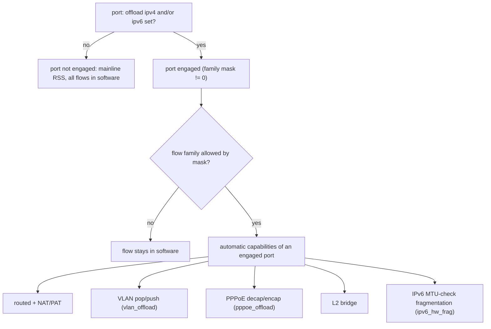

# ASK2 VLAN Offload — VyOS CLI Grammar (design to implement)

> **Superseded 2026-10-09 by §9.** The per-port `offload vlan` leaf designed in
> §§1-8 was removed: VLAN is an automatic capability of an engaged port.
> Granularity is per port + per IP family only. Read §9 first; §§1-8 are
> design history.

**2026-08-26 · dpaa1 · T-M6-8 follow-up.** Defines the per-interface CLI grammar
that replaces the interim global `ask_vlan_offload` module param, so VLAN
pop/push offload is expressed and scoped in `config.boot` like every other ASK
family. Datapath is done and silicon-validated (see `plans/archive/ASK2-VLAN-REARCH.md`);
this is the control-plane surface only.

## 1. Goal and constraints

- **Per-interface, config-driven** — no module param as the production control.
  The `vlan_offload` modparam stays only as a default-off diagnostic escape
  hatch (like `nat44_offload`/`nat66_offload`).
- **Idiomatic** — mirror the existing `offload ipv4` / `offload ipv6` leafNodes
  (patch `vyos-1x-031`) exactly: valueless leaf under `interfaces ethernet ethN
  offload`, lowered in `ethernet.py`, verified in `interfaces_ethernet.py`.
- **Fail-closed** — an unsupported scope (eth0, 802.1ad, QinQ, IPv6-VLAN,
  stacked tags) MUST fall to software, never silently misforward. The kernel
  already returns `-EOPNOTSUPP` for these; the CLI only gates admission and
  arms the gate.
- **No new daemon** — reuse `vyos-offload-ask` → YNL → `ask.ko` genl, the same
  path `offload ipv4/ipv6` uses.

## 2. Configuration grammar

### 2.1 The node

```
interfaces ethernet <ethN> offload vlan
```

- Valueless leafNode named `vlan`, sibling of `ipv4` / `ipv6` under `offload`.
- Presence = "offload single-tag 802.1Q VLAN pop/push on this port".
- Absence = VLAN flows stay on the kernel software path (today's default).

XML (`interface-definitions/interfaces_ethernet.xml.in`, add after the `ipv6`
leafNode from `vyos-1x-031`):

```xml
<leafNode name="vlan">
  <properties>
    <help>ASK2 hardware offload for single-tag 802.1Q VLAN pop/push (NXP LS1046A FMan HM engine)</help>
    <valueless/>
  </properties>
</leafNode>
```

### 2.2 Dependency and interaction rules

1. **VLAN requires an L3 family.** VLAN offload only accelerates routed-VLAN
   flows (POP-and-route / route-and-PUSH); it composes on top of the IPv4 path.
   `offload vlan` without `offload ipv4` is rejected at verify:

   > `Interface ethN: 'offload vlan' requires 'offload ipv4' (VLAN offload
   > accelerates routed IPv4-VLAN flows).`

   IPv6-VLAN is not offloadable yet, so `offload vlan` does **not** imply or
   require `offload ipv6`; v6-VLAN flows fall to software regardless.

2. **ASK↔VPP mutex** — same as ipv4/ipv6: reject if the interface is in
   `vpp settings interface` (extend the existing `_ask_on` check to include
   `offload.vlan`).

3. **eth0 excluded** — the management lifeline is never VLAN-offloaded. Reject
   `offload vlan` on `eth0` at verify (kernel also refuses, this is the
   early/clear error):

   > `Interface eth0 does not support VLAN offload (management lifeline).`

4. **Supported ports** — eth1–eth4 only (reuse the existing five-port list minus
   eth0 for this node).

## 3. Runtime lowering (how the config reaches silicon)

The kernel gate must move from the global module param to a **per-port** genl
attribute, so `ask.ko` admits VLAN flows only on ports whose CLI enabled it.

### 3.1 New genl attribute

Extend the engage command in `kernel/ask/uapi/ask.yaml` and
`include/uapi/linux/ask/ask.h`:

- `ASK_ATTR_VLAN_ENABLE` (u8, 0/1) on `ASK_CMD_ENGAGE`, optional (absent = 0).
- `ask_hw_offload_set_vlan(port_id, on)` sets a per-port bit
  (`pcd->fe_port_vlan` bitmap, mirroring `fe_port_v6` from F-219).
- `ask_hw_port_wants_vlan(port_id)` = global `vlan_offload` modparam-OR
  per-port-bit; the flow-admission gate in `ask_hw.c`/`ask_flow_offload.c`
  (`ask_hw_vlan_offload_armed()` call sites) becomes per-port-aware:
  `ask_hw_vlan_offload_armed() || ask_hw_port_wants_vlan(port_id)`.
- `ASK_CAP_VLAN` in `get-info` is advertised when the modparam OR any port bit
  is set (keeps the "advertised == actually offloadable" contract).

This is the same pattern F-219 used to make IPv6 per-port; VLAN follows it
verbatim.

### 3.2 Helper verb

Add to `board/scripts/vyos-offload-ask`:

```
vyos-offload-ask [--port 0xNN] vlan <0|1>
```

- `vlan 1` → re-engage the port with `vlan-enable: 1` in the engage JSON
  (`ynl_do engage "{\"port-id\": N, \"family-mask\": M, \"vlan-enable\": 1}"`).
- `vlan 0` → re-engage with `vlan-enable: 0` (drops the port bit; live VLAN
  flows fall to software on next REPLACE).
- The verb reuses the current family mask (read from the running port state) so
  toggling VLAN does not disturb the ipv4/ipv6 selection.

### 3.3 `ethernet.py` lowering

Extend `set_ask_offload()` (patch `vyos-1x-031`) to carry VLAN, or add a small
sibling `set_ask_vlan_offload(enabled: bool)`. The engage call already runs
whenever `ask_mask != 0`; thread `vlan-enable` into that same
`vyos-offload-ask family <mask>` invocation so there is ONE engage per commit:

```python
ask_mask = ((1 if dict_search('offload.ipv4', config) is not None else 0) |
            (2 if dict_search('offload.ipv6', config) is not None else 0))
ask_vlan = dict_search('offload.vlan', config) is not None
self.set_ask_offload(ask_mask, vlan=ask_vlan)
```

`set_ask_offload()` then calls
`vyos-offload-ask --port <p> family <mask> vlan <0|1>` (extend the helper's
`family` verb to accept an optional trailing `vlan <0|1>`, or emit a second
`vlan` call — one engage is preferred to avoid a transient disarm).

Fail closed exactly like the family path: non-zero helper rc → `ConfigError`.

### 3.4 verify() additions (`src/conf_mode/interfaces_ethernet.py`)

```python
_vlan_on = dict_search('offload.vlan', ethernet) is not None
if _vlan_on:
    ifname = ethernet.get('ifname')
    if dict_search('offload.ipv4', ethernet) is None:
        raise ConfigError(
            f"Interface {ifname}: 'offload vlan' requires 'offload ipv4'")
    if ifname == 'eth0':
        raise ConfigError(
            f'Interface {ifname} does not support VLAN offload (management lifeline)')
    # ASK↔VPP mutex already covered by extending _ask_on to include offload.vlan
```

Also extend the existing `_ask_on` expression (and the VPP-side check in
`vpp.py`) to include `offload.vlan` so the mutex and RPS-force logic treat a
VLAN-only-armed port as ASK-engaged.

## 4. Operational (show) grammar

Reuse the existing offload op-mode tree (patch `vyos-1x-033`) — add a `vlan`
sibling under `show interfaces ethernet ethN offload ask`:

```
show interfaces ethernet <ethN> offload ask vlan
```

Renders per-port VLAN offload state from YNL `get-info` + `dump-flows` filtered
to VLAN-carrying flows on this interface: gate state (armed/off), CC-shadow key
count, per-direction (POP/PUSH) counts, and any SW-fallback reason. Implement in
`show_ask_offload.py` behind a `--vlan` flag, mirroring the existing `flows`
renderer.

## 5. Migration

VLAN never shipped in a released `config.boot` node (it was modparam-only), so
**no migration script is required** for the config tree. Bump the interfaces
`syntaxVersion` only if the release process requires a version tick for the new
leafNode; if so, add a no-op `35-to-36` that asserts nothing (or fold into the
next real migration). Do NOT reuse the retired `offload ask` migration.

## 6. Example configuration

```
set interfaces ethernet eth3 offload ipv4
set interfaces ethernet eth3 offload ipv6
set interfaces ethernet eth3 offload vlan
set interfaces ethernet eth4 offload ipv4
set interfaces ethernet eth4 offload vlan
```

Result: eth3 offloads routed IPv4+IPv6 unicast and single-tag IPv4 VLAN
pop/push; eth4 offloads routed IPv4 and IPv4 VLAN. eth3.100↔eth4 routed-VLAN
transit is hardware-accelerated; anything out of scope (802.1ad, QinQ, stacked,
IPv6-VLAN, eth0) falls to software automatically.

## 7. Default-on decision (separate from this grammar)

This grammar is orthogonal to the default-on/off question. It gives operators an
explicit, scoped, per-interface knob regardless of the shipped default. The
current recommendation is to ship the datapath default-off and let this CLI be
the opt-in; revisit a default-on posture only after a VLAN duration soak and the
churn RX-deaf / mgmt-martian caveats are resolved or root-caused to lab-only
(see `plans/archive/ASK2-VLAN-REARCH.md` status banner).

## 8. Implementation checklist

- [ ] `interfaces_ethernet.xml.in`: add `offload vlan` leafNode (new patch,
      e.g. `vyos-1x-04x-offload-vlan-cli.patch`).
- [ ] `ethernet.py`: thread `vlan` through `set_ask_offload()` (or sibling),
      one engage per commit, fail-closed on helper rc.
- [ ] `interfaces_ethernet.py` `verify_offload()`: require ipv4, exclude eth0,
      extend `_ask_on` to include `offload.vlan`.
- [ ] `vpp.py`: extend the ASK-engaged mutex check to `offload.vlan`.
- [ ] `vyos-offload-ask`: `vlan <0|1>` verb + `family` accepting optional
      trailing `vlan`.
- [ ] `ask.yaml` + `ask.h`: `ASK_ATTR_VLAN_ENABLE` on engage.
- [ ] `ask_hw.c`: `pcd->fe_port_vlan` bitmap + `ask_hw_offload_set_vlan()` +
      per-port `ask_hw_port_wants_vlan()`; make the admission gate per-port.
- [ ] `ask_genl.c`: parse `ASK_ATTR_VLAN_ENABLE` in engage; advertise
      `ASK_CAP_VLAN` on modparam-OR-any-port-bit.
- [ ] `show-interfaces-ethernet.xml.in` + `show_ask_offload.py`: `offload ask
      vlan` op-mode.
- [ ] KUnit/genl test: engage with `vlan-enable=1` sets the port bit; caps
      reflect it; `vlan-enable=0` clears it.
- [ ] Board gate: `set offload vlan` on eth3/eth4 arms the port bit, VLAN
      flows HW-offload, `delete` returns them to software, eth0 rejected,
      `offload vlan` without `offload ipv4` rejected, gate-off regression clean.

## 9. Final model: per-port + per-family only (2026-10-09, supersedes §§1-8)

Sections 1-8 record the original per-capability design. They are kept as the
design history only: the `offload vlan` leaf (§2), its genl attribute and the
per-port VLAN bit no longer exist. The `offload pppoe` leaf and the short-lived
`offload disable-ipv6-fragmentation` leaf were never kept either.

**Granularity.** Per-port engage is the one mandatory granularity: engaging a
port is a real silicon change (KG scheme RSS to AC_CC, BMI RFPNE/RCCB, a
512 KiB ehash table, FE objects, a TX FQ, the F-262 RX-port triple) and it is
what makes the port exclusive against VPP and the ingress policer. Per-port +
per-IP-family (`offload ipv4`, `offload ipv6`) is the operator policy knob; it
only gates flow admission, so it is free and allows a staged rollout (for
example IPv4 offloaded while IPv6 stays in software). Nothing finer exists.

```
interfaces ethernet <ethN> offload ipv4
interfaces ethernet <ethN> offload ipv6
```



**Automatic capabilities.** VLAN, NAT, PPPoE and bridge need no leaf; an
engaged port carries them. PPPoE is gated on the PPPoE `source-interface`
physical port being engaged (decap ingress and encap egress both go through
it). Bridge offload is on while any port is engaged.

**Global kill switches (ask.ko module parameters, default on).** They stay
for diagnostics and for operators who must opt out of a capability; clearing
one on a live system tears the affected hardware records down so flows return
to the kernel.

| Parameter | Switches off | Live effect on 1 to 0 |
|---|---|---|
| `vlan_offload` | VLAN pop/push (and the `ASK_CAP_VLAN` bit) | per engaged port: VLAN CC teardown + FE re-engage |
| `pppoe_offload` | PPPoE decap/encap | flush all PPPoE flows |
| `ipv6_hw_frag` | IPv6 hardware fragmentation | flush IPv6 records carrying the MTU check |
| `nat44_offload`, `nat66_offload` | NAT44 / NAT66 | existing behaviour, unchanged |
| `vlan_push_only` | untagged-to-tagged push | existing behaviour, unchanged |

**IPv6 fragmentation policy.** An IPv6 flow whose route MTU is below its
ingress port MTU is offloaded with the microcode MTU check, so oversize
packets are fragmented in hardware (vendor parity). The microcode has no
host-punt path for IPv6 and never sends Packet Too Big, so PMTU discovery is
hidden for such flows (RFC 8200 4.5: a router must not fragment IPv6 in
transit). Where RFC conformance matters, set `ask.ipv6_hw_frag=0`: such flows
stay in the kernel, which sends Packet Too Big. It is deliberately a global
switch, not a per-port leaf. IPv4 is unaffected (DF-clear is fragmented in
hardware, DF-set is punted to the host, which sends ICMP fragmentation-needed).

**Migration.** `interfaces` config version 35 to 36 (`35-to-36`) deletes
`offload vlan` and `offload pppoe` from stored configs. The family leaves are
kept, so a port that had them stays engaged and now gets VLAN/PPPoE offload
automatically.

**Verify.** `interfaces_ethernet.py` `verify_offload` keeps the supported-port
check, the VPP-exclusivity check and the F-222 MTU ceiling (1280-3600) for every
engaged port. The MTU ceiling formerly ran only when `offload vlan` or
`offload pppoe` was present (patch 044 split it off `_ask_on`); it now covers
every engaged port again.

**Control path.** `ethernet.py` `set_ask_offload(family_mask)` runs
`vyos-offload-ask --port <hw-port> family <mask>`, which sends genl
`engage` with `port-id` + `family-mask` (or `disengage` for mask 0).
