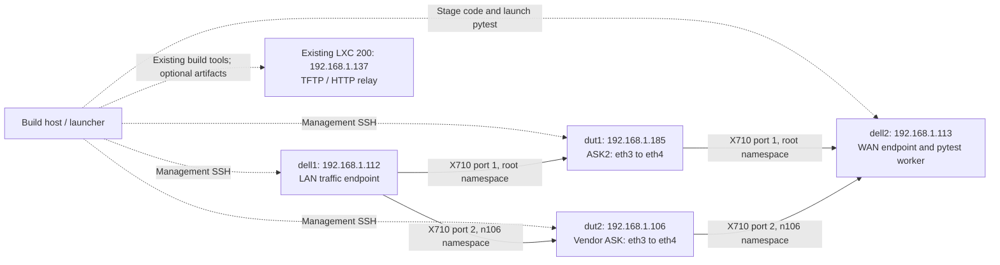

# ASK2 and Vendor ASK Test Rig

This suite uses two physical traffic hosts, `dell1` and `dell2`, and selects
either `dut1` (ASK2 at `192.168.1.185`) or `dut2` (vendor ASK at
`192.168.1.106`). Management SSH is separate from the test links. No LAN VM,
guest agent, always-running HTTP test service, or separate image builder is
required.

The imported scenarios and their backend limits are listed in [README.md](README.md).

## Topology



| Node | Management | Role |
|---|---|---|
| `dut1` | `vyos@192.168.1.185` | ASK2; LAN `eth3`, WAN `eth4`; `eth0` remains management |
| `dut2` | `root@192.168.1.106` | Vendor reference; LAN `eth3`, WAN `eth4`; `eth0` remains management |
| `dell1` | `admin@192.168.1.112` | LAN sender/receiver; controlled over SSH |
| `dell2` | `admin@192.168.1.113` | WAN sender/receiver and the only hardware pytest worker |
| Build host | Current repository checkout | Local collection, adapter checks, image builds and SSH launch |
| LXC 200 | `192.168.1.137` | Existing TFTP/HTTP service; not required for normal test runs |

Both Dells use `enp1s0f0np0` in the root network namespace for `dut1` and
`enp1s0f1np1` inside `n106` for `dut2`. These are independent physical paths;
the namespace separates their deliberately reused data addresses.

| Address | `dut1` path | `dut2` path |
|---|---|---|
| `dell1` | `10.99.1.112`, `fd99:1::112` | Same addresses inside `n106` |
| DUT LAN gateway | `10.99.1.185` | `10.99.1.185` on the vendor board's test port |
| DUT WAN gateway | `10.99.2.185` | `10.99.2.185` on the vendor board's test port |
| `dell2` | `10.99.2.113`, `fd99:2::113` | Same addresses inside `n106` |

Management `.106` does not imply a `.106` test gateway. Use the profile and
live interface addresses, not an address derived from a board's management IP.

## Minimal Setup

The configuration is [bench.json](bench.json). `--dut dut1` and `--dut dut2`
are the primary selectors; `185` and `106` remain aliases. Use
`--bench tests/bench.local.json` for local overrides; that file is ignored by Git.

From the repository root, prepare the launcher's pinned Python environment:

```sh
python3 -m venv tests/.venv
tests/.venv/bin/python -m pip install -r tests/requirements.txt
tests/.venv/bin/python -m pip check
```

The launcher needs Python 3.11 or newer and OpenSSH. The Dells need Python
3.12 or newer for namespace helpers; the current system Python is suitable.
The operator must also install the matching venv package on `dell2`. Its
current Python 3.14 lacks `ensurepip`; on `dell2`, run:

```sh
sudo apt-get install python3.14-venv
```

The runner checks this prerequisite before creating a virtualenv and does not
install system packages itself.
Pinned Python packages are in [requirements.txt](requirements.txt), and pytest
configuration is in [pyproject.toml](pyproject.toml).

SSH keys stay on the launcher or in its SSH agent. The board profile names
`~/.ssh/vyos_key`; an available SSH agent can supply it instead. Trust the
nodes' host keys before a run. The launcher forwards its SSH agent only to
the trusted `dell2` worker so that worker can reach `dell1` and the selected DUT.
No private key is copied with the suite. Non-root accounts need passwordless
`sudo -n` for the test operations; the harness never requests a password.
Only trusted public host-key entries are staged from the launcher. The worker
uses that file with strict host-key checking, including when running as root.

The Dells need `ip`, `ping`, `timeout`, `ethtool`, `iperf3`, and ordinary
process tools. Extended packet tests may also need `tcpdump`, Scapy,
`conntrack`, `nft`, PPP/PPPoE tools and a C compiler. Install only the tools
required by the selected group. The portable checks use Python's standard
library on `dell1`; they do not require a resident LAN agent.
Native DHCP cases additionally need `dnsmasq` on `dell2`; they create and
remove an isolated server namespace on the shared temporary WAN VLAN.
The tagged-WAN fixture supplies VLAN 3900 for PPPoE, multicast and DHCP on
the selected X710 NIC. It runs only for compatible selected cases, removes
only interfaces it created, and validates existing VLANs before borrowing them.
No permanent WAN bridge, DHCP service or PPPoE service is required.

Check the existing wiring and tools without changing anything:

```sh
tests/.venv/bin/python tests/run_test.py --dut both --preflight
```

Preflight reads all selected ports, namespace addresses, required command
availability and DUT backend/instrumentation capabilities. A successful
preflight means the nodes are reachable and ports exist; it does not prove
hardware offload, forwarding, or compatibility with every imported test.

Prepare one virtualenv on `dell2`, independently of image building:

```sh
tests/.venv/bin/python tests/run_test.py --prepare-runner
```

This stages the dependency pins and installs them as `admin` under
`/tmp/ask-tests-runner/.venv`. `--runner-root` selects another dedicated,
absolute directory. Reprepare after dependency changes or a reboot that
clears `/tmp`. Every hardware invocation stages a fresh source directory,
runs it, then removes that source directory; the virtualenv is reused.

## Running Tests

Ordinary invocation collects only. Neither collection nor the host adapter
checks opens a DUT connection:

```sh
tests/.venv/bin/python tests/run_test.py --dut dut1 --collect-only
tests/.venv/bin/python tests/run_test.py --dut dut2 --collect-only -k ipsec
tests/.venv/bin/python -m pytest -c tests/pyproject.toml tests/_harness_tests.py
tests/.venv/bin/python -m pytest -c tests/pyproject.toml tests/abi_snapshot.py
```

Start with the bounded, dual-stack portable checks on both DUTs:

```sh
tests/.venv/bin/python tests/run_test.py --dut both --run -m portable
```

These check link state, routed IPv4/IPv6 ping in both directions, and exact
numbered UDP/TCP payloads from `dell1` to `dell2` and back. They do not change
addresses, routes, MTUs, firewall rules or offload configuration, and do not
claim hardware acceleration. Existing forwarding and return routes must
already be configured through the selected DUT.

Pytest runs on `dell2`, not on the build host: upstream tests create local WAN
sockets and native traffic processes. For `dut2`, the entire worker runs
inside `n106`. Its management SSH commands enter the host's management
namespace before connecting, keeping control separate from the test path.
`dell1` commands enter that host's matching namespace.

Select imported coverage explicitly:

```sh
tests/.venv/bin/python tests/run_test.py --dut dut2 --run -k flowtable_tcp
tests/.venv/bin/python tests/run_test.py --dut dut1 --run -k flowtable_vlan
```

On the current images these selections are compatibility skips, not passes.
As verified on 2026-10-10, `dut1` has `ask.ko` and ASK2 ehash statistics;
`dut2` has legacy `cdx.ko`. Neither exposes `/proc/cdx_flowtable` or KASAN.
The imported Linux-flowtable/CDX scenarios cannot test ASK2 simply by changing
their IP addresses. Porting those assertions to ASK2 needs genuine equivalent
APIs and feature support; the runner does not fabricate cookies, counters or
fault hooks.

Fault injection, capacity exhaustion, recovery and module lifecycle cases
also require `--allow-disruptive`. Sustained traffic and profiles require
`--include-slow`. Both gates are checked before shared hardware setup:

```sh
tests/.venv/bin/python tests/run_test.py --dut dut2 --run \
    --allow-disruptive --include-slow -k flowtable_capacity
```

Only use this on a compatible instrumented image with an operator-controlled
recovery path. A retained boot log, KASAN and each selected test's real
debug/fault interfaces are still required. `--release` fails selected skips;
it must not be used to describe a compatibility-skipped run as acceptance.
The upstream Wi-Fi tests are outside this wired rig and require separate
hardware. The optional receive probe requires a prebuilt signed module,
its matching driver module and an ARM64-capable `objcopy`; it does not invoke
the retained upstream build helper or modify a signed probe.

Use ordinary pytest options (`-k`, `-m`, `-x`, `--timeout`, `--junitxml`).
`K`, `ARGS`, and `ASK_TEST_ARGS` remain selection aliases. Run `both`
sequentially; hardware xdist workers are rejected. Locks cover the selected
DUT and Dell data ports across workers on `dell2`.

## Control and Results

Portable tests need SSH only. Compatible imported cases reuse the existing
framed agent through SSH stdio, with a temporary source package on the DUT
and a local stdio process on `dell2`. No HTTP listener, systemd service,
UART ownership or permanent DUT Python package is added. Session teardown
closes both agents and removes their temporary packages. UART remains an
operator recovery channel, not a normal harness dependency.

Unknown command outcomes are errors and are not replayed. A hardware setup
or teardown failure blocks later hardware cases until the operator restores
the rig. Restoration remains registered immediately after resource acquisition;
the existing cleanup stack runs all callbacks with separate deadlines.

Pytest prints `PASSED`, `FAILED`, `ERROR`, and `SKIPPED`, plus elapsed times,
totals and the artifact directory. Hardware artifacts live on `dell2` under
`/tmp/ask-tests-0/` by default. Local collection/host-check artifacts live on
the launcher under `/tmp/ask-tests-<uid>/`. `ASK_TEST_ARTIFACTS` overrides the
location on the machine executing pytest. Reports retain JUnit, selected
node IDs, profile, namespace, package versions, staged source digest,
preflight and per-test diagnostics. SSH keys are not included in reports.

Packet delivery and throughput alone are not proof of offload. ASK2 uses
[the performance report's methodology](../plans/ASK2-PHASE0.4-PERFORMANCE-REPORT.md),
including real ehash hits and independent Dell NIC counters. Imported CDX
tests retain their own native status and software-counter contracts. Do not
apply a vendor counter's meaning to ASK2 without checking its driver.

## Image Builder and TFTP

Normal runs use the already installed DUT images. The runner does not build,
install, flash, reboot or select a boot image. Keep those operations separate.

Use the repository's existing [dev-build script](../bin/dev-build.sh) and
[development-loop plan](../plans/DEV-LOOP.md) when an image/kernel change is
needed. The build host already builds natively and sends artifacts to LXC 200.
The existing relay serves TFTP artifacts from `/srv/tftp/` and ISOs from
`/srv/tftp/iso/`; do not start a competing TFTP/HTTP server on a Dell.
CI uses the existing [self-hosted workflow](../.github/workflows/self-hosted-build.yml).

Image installation is the operator's task. The ISO URL is
`http://192.168.1.137:8080/iso/latest.iso`, with its matching `.minisig`
sidecar. The test runner never runs `add system image`, `install image`, or
changes U-Boot environment. Cold boots required by silicon experiments are
also operator-controlled and must be recorded with their results.